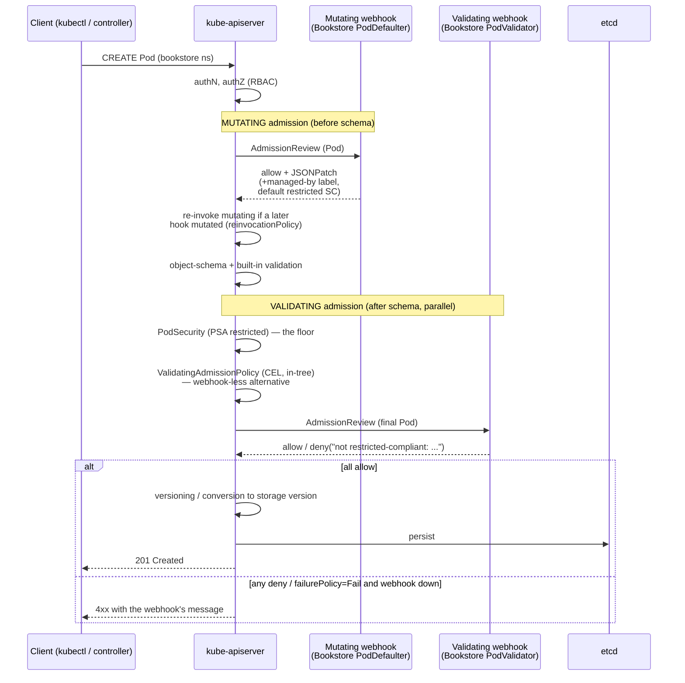

# 01 — Admission webhooks

> The admission pipeline at the level *below* Kyverno/Gatekeeper: the fixed
> order (authN → authZ → **mutating webhooks** → object-schema validation →
> **validating webhooks** → persist) from [Part 00
> ch.04](../00-foundations/04-control-plane-deep-dive.md), and how to *build*
> the webhook server those policy engines are themselves built on — a real Go
> `MutatingWebhookConfiguration` (inject the recommended `app.kubernetes.io/*`
> label + a default restricted `securityContext`) **and**
> `ValidatingWebhookConfiguration` (reject non-`restricted` Pods in the
> `bookstore` namespace, reinforcing [Part 05
> ch.02](../05-security/02-pod-security.md) PSA at the app layer); TLS via
> cert-manager (pinned) or a documented self-signed `caBundle`; the knobs that
> decide whether a webhook is *safe* (`failurePolicy`, `sideEffects`,
> `matchConditions` CEL, `namespaceSelector`/`objectSelector`,
> `reinvocationPolicy`, `timeoutSeconds`, ordering, idempotency, the
> own-namespace **deadlock footgun**); and the in-tree
> **ValidatingAdmissionPolicy + CEL** (v1.30 GA) as the webhook-less modern
> alternative — applied by shipping a real distroless webhook server in
> [`examples/bookstore/operator/`](../examples/bookstore/operator/README.md).

**Estimated time:** ~60 min read · ~120 min hands-on
**Prerequisites:** [Part 00 ch.04](../00-foundations/04-control-plane-deep-dive.md) — admission pipeline order this chapter writes into · [Part 05 ch.02](../05-security/02-pod-security.md) — PSA-restricted baseline the webhook reinforces · [Part 05 ch.03](../05-security/03-supply-chain.md) — Kyverno layer this chapter sits below
**You'll know after this:** • describe the admission pipeline order (mutating → schema → validating → persist) · • author a MutatingWebhookConfiguration that injects PSA-restricted defaults · • configure failurePolicy / sideEffects / matchConditions / namespaceSelector safely · • avoid the own-namespace deadlock footgun in webhook scoping · • choose between webhooks and ValidatingAdmissionPolicy + CEL

<!-- tags: security, platform-engineering, psa-restricted, day-2 -->

## Why this exists

[Part 05 ch.03](../05-security/03-supply-chain.md) installed **Kyverno** and
wrote a `ClusterPolicy` in Audit mode; [Part 05
ch.02](../05-security/02-pod-security.md) leaned on **Pod Security Admission**.
Both are *admission controllers* — they intercept a request at the API server
*before* it reaches etcd and either mutate it or say no. The guide used them as
black boxes ("write a policy, it gets enforced"). This chapter opens the box:
**Kyverno, Gatekeeper, and PSA are all consumers of one extension point — the
admission webhook — and sometimes you need to build that primitive yourself.**

You reach for a hand-written webhook (or its in-tree successor,
ValidatingAdmissionPolicy) when:

1. **The rule is real code, not a policy expression.** "Default a Pod's
   `securityContext` from a per-team profile looked up in a ConfigMap", "inject
   a sidecar only when an annotation and a namespace label both hold", "call an
   external inventory before admitting an image" — logic a declarative policy
   language cannot cleanly express. (A service mesh's sidecar injector, the
   Istio/Linkerd one, *is* exactly a mutating webhook.)
2. **You are already shipping a controller.** [ch.02](02-operator-development.md)
   builds the `BookstoreTenant` operator; its **conversion webhook** is an
   admission-adjacent webhook served by the *same* binary. Once you run a
   controller-runtime manager, adding a defaulting/validating webhook is one
   more registration — the natural place project-specific invariants live.
3. **You must enforce a project rule the platform's policy engine doesn't.**
   The Bookstore's `bookstore` namespace is PSA-`restricted`
   ([Part 05 ch.02](../05-security/02-pod-security.md)). PSA is the *floor*;
   this chapter adds an *app-layer* validating webhook that re-checks
   restricted-compliance and rejects with a project-specific message — defense
   in depth, and a concrete vehicle for every webhook footgun.

Crucially this is **lower-level** than [Part 05
ch.03](../05-security/03-supply-chain.md), not a contradiction of it: Kyverno
*registers a `ValidatingWebhookConfiguration` for itself* and runs its policy
engine behind it. Most teams should use Kyverno/Gatekeeper/VAP and never write
this code. You learn it so the policy layer is no longer magic — and so you can
build the cases it can't. The reference is *Production Kubernetes* ch.8
(Admission Control) and *Kubernetes Patterns* (Access Control / Secure
Configuration).

## Mental model

**A webhook is an HTTPS server the API server calls mid-request. The apiserver
sends it an `AdmissionReview` (the object + who/what/where); the server replies
"allow / allow-with-a-JSON-patch / deny-with-a-message". Mutating webhooks run
*before* schema validation and may patch; validating webhooks run *after* and
may only judge.**

- **Two phases, fixed order** (the [Part 00
  ch.04](../00-foundations/04-control-plane-deep-dive.md) pipeline, zoomed in):
  authN → authZ → **mutating admission** (built-in plugins *then* your mutating
  webhooks, in `reinvocationPolicy` rounds) → **object-schema + built-in
  validation** → **validating admission** (built-in plugins, **PSA**, *then*
  your validating webhooks, **in parallel**) → versioning/conversion → etcd.
  Mutate-before-validate is *guaranteed*: a mutating webhook cannot dodge
  validation, and a validating webhook always sees the final, mutated,
  schema-checked object.
- **The contract is `AdmissionReview` in, `AdmissionReview` out.** Allow:
  `{allowed: true}`. Deny: `{allowed: false, status: {message: "..."}}` — that
  message is what the user sees. Mutate: `{allowed: true, patch: <base64
  JSONPatch>, patchType: JSONPatch}`. controller-runtime's
  `CustomDefaulter`/`CustomValidator` hide the wire format — you mutate a typed
  Go object or return an `error`.
- **`failurePolicy` is the single most consequential setting.** It decides what
  happens when the webhook is **unreachable/timeout/erroring**: `Fail` =
  *fail-closed* (reject the request — safe for security enforcement, but a
  broken webhook is now an **outage**); `Ignore` = *fail-open* (admit anyway —
  safe for convenience defaulting, but the rule silently stops applying). There
  is no third option; you choose which failure you can tolerate **per webhook**.
- **`sideEffects` and idempotency are correctness, not nicety.** A webhook
  should be a **pure function of the request** with `sideEffects: None` (so the
  apiserver may call it during a dry-run safely). It must be **idempotent** —
  the apiserver can call a mutating webhook **more than once** (a later
  webhook mutates the object → `reinvocationPolicy: IfNeeded` re-invokes
  yours). "Set the label if absent" is idempotent; "append the label" is a bug
  that grows the object every round.
- **Scope is a safety device, and the own-namespace deadlock is the footgun.**
  `namespaceSelector`/`objectSelector`/`matchConditions` (CEL) restrict *which
  requests* the apiserver even sends. A Pod-validating webhook that can block
  Pods **in its own namespace** (or `kube-system`) is a self-inflicted outage:
  if the webhook Pod dies, nothing can schedule the Pod that would bring it
  back. **Always exclude `kube-system` and the webhook's own namespace.**
- **VAP is the webhook-less alternative.** `ValidatingAdmissionPolicy` +
  `ValidatingAdmissionPolicyBinding` (CEL, **in-tree, GA in v1.30**) run
  validation *inside the apiserver* — no server to run, no TLS, no
  `failurePolicy`-as-outage, no network hop. It cannot mutate and CEL is not
  general code, but for "deny if <EXPRESSION>" it is now the **default
  choice**; a webhook is for mutation or logic CEL can't express.

The trap to keep in view: **a webhook is privileged, on the hot path of every
matching API write, and a new failure domain for the control plane.** "Just add
a webhook" is rarely just — `failurePolicy: Fail` + a too-broad scope is the
classic way to take down a cluster. Build the narrowest webhook that does the
job, or use VAP/Kyverno and avoid running the server at all.

## Diagrams

### Diagram A — the admission pipeline: where mutate, validate, and VAP sit (Mermaid)



### Diagram B — webhook vs ValidatingAdmissionPolicy: which to use (ASCII)

```
 ADMISSION ENFORCEMENT — pick the lowest-power tool that fits ──────────────

  Need to MUTATE the object (inject label/sidecar/default SC)?
    YES ───────────────────────────────► MUTATING WEBHOOK (only option)
           (controller-runtime CustomDefaulter; failurePolicy: Ignore;
            idempotent set-if-absent; reinvocationPolicy: IfNeeded)
    NO  → it is a pure ALLOW/DENY rule → next question

  Can the rule be expressed as a CEL boolean over the object/oldObject?
    YES → is general code / external I/O / cross-object lookup needed?
            NO  ──────────────────────► ValidatingAdmissionPolicy (CEL)   ◄═ PREFER
                  in-tree (GA v1.30): NO server, NO TLS, NO network hop,
                  NO failurePolicy-as-outage. Bind with a Binding;
                  validationActions: Deny and/or Warn/Audit (the
                  Audit→Enforce lifecycle, Part 05 ch.03, without an add-on).
            YES ──────────────────────► VALIDATING WEBHOOK
                  (logic CEL can't do: call inventory, read a ConfigMap
                   profile, complex cross-field). failurePolicy: Fail
                   for security; scope tightly.
    NO (it's policy-as-data at fleet scale, many rules, reporting)
        ───────────────────────────────► Kyverno / Gatekeeper
              (Part 05 ch.03 — they REGISTER a validating webhook for
               themselves; you write YAML/Rego, not a server)

  ALWAYS, for any webhook:
    • namespaceSelector EXCLUDES kube-system + the webhook's OWN ns
      (own-namespace block = un-recoverable outage — THE footgun)
    • sideEffects: None  • idempotent  • timeoutSeconds small (≤5–10)
    • TLS caBundle current (cert-manager injects + rotates it)
    • roll out failurePolicy: Ignore → observe → flip to Fail
```

## Hands-on with the Bookstore

**Assumed working directory: the guide repo root (`full-guide/`).** This
chapter adds the **new** [`examples/bookstore/operator/`](../examples/bookstore/operator/README.md)
tree (shared with [ch.02](02-operator-development.md)/[ch.03](03-api-priority-and-fairness.md))
— the webhook server is `internal/webhook/v1/pod_webhook.go`, its
configurations `config/webhook/manifests.yaml`, its TLS in `config/certmanager/`.
It does **not** modify any canonical Bookstore manifest, Helm chart, Kustomize
overlay, or other `examples/bookstore/**` file — it is purely additive (the
same discipline as the Gateway-vs-Ingress and CloudNativePG precedents).

We will: (0) build + vet the server; (1) read the two webhook configs and the
deadlock-avoidance scoping; (2) the honest local-vs-cluster story + cert-manager
(pinned) install; (3) deploy the operator and see the mutating webhook stamp a
Pod and the validating webhook reject a bad one; (4) the same rule as a
**ValidatingAdmissionPolicy** with zero server.

### 0. Build and vet the webhook server (always reproducible, no cluster)

The server is real Go (controller-runtime), built into a distroless image with
the **exact** pattern of
[`examples/bookstore/app/catalog`](../examples/bookstore/app/catalog/Dockerfile):

```sh
cd examples/bookstore/operator
go vet ./...                                  # passes clean
docker build -t bookstore/operator:dev .      # distroless static nonroot (~56 MB)
cd ../../..
```

`internal/webhook/v1/pod_webhook.go` implements two controller-runtime
interfaces on `core/v1` Pod:

- `PodDefaulter` (`CustomDefaulter`) — the **mutating** webhook. Sets
  `app.kubernetes.io/managed-by` **if absent** (idempotent) and fills a default
  restricted pod-level `securityContext` (`runAsNonRoot`,
  `seccompProfile: RuntimeDefault`) **only when unset**. It is a *convenience
  default*, not the enforcement.
- `PodValidator` (`CustomValidator`) — the **validating** webhook. For Pods in
  the `bookstore` namespace it rejects any that are not restricted-compliant
  (`runAsNonRoot`, per-container `allowPrivilegeEscalation: false`, `drop:
  ["ALL"]`) with a precise message. It never mutates.

### 1. Read the two configurations — and the deadlock-avoidance scoping

[`config/webhook/manifests.yaml`](../examples/bookstore/operator/config/webhook/manifests.yaml)
holds the `MutatingWebhookConfiguration` and `ValidatingWebhookConfiguration`.
The settings are the chapter, so read them deliberately:

```sh
kubectl apply --dry-run=client -f examples/bookstore/operator/config/webhook/manifests.yaml
# mutatingwebhookconfiguration.../bookstore-operator-mutating-webhook-configuration created (dry run)
# validatingwebhookconfiguration.../bookstore-operator-validating-webhook-configuration created (dry run)
# service/bookstore-operator-webhook-service created (dry run)
```

That dry-run is **clean**: `Mutating`/`ValidatingWebhookConfiguration` and
`Service` are built-in `admissionregistration.k8s.io/v1` / `v1` kinds, valid on
any v1.30+ cluster. What it does **not** prove is that the webhook *works* —
that needs the operator Pod + the Service + a serving cert (step 3). The file
header documents this **webhook-intrinsic** behaviour explicitly (the same
class of note as the guide's CRD-backed `raw-manifests/51-`/`70-`,
`operators/cnpg-`, `cloud/karpenter-` files): the *objects* are schema-correct;
the *webhook* is "not present" until its backend exists, and with the
configured `failurePolicy` an unreachable validating webhook (`Fail`) rejects
matching `bookstore` Pods while the mutating one (`Ignore`) is skipped — taught,
not hidden.

The settings, and **why each is exactly this**:

| Setting | Mutating (`mpod`) | Validating (`vpod`) | Why |
|---|---|---|---|
| `failurePolicy` | `Ignore` | `Fail` | Defaulting is convenience → fail-open (broken webhook ≠ outage). Enforcement is security → fail-closed (no silent bypass). The asymmetry is the point. |
| `sideEffects` | `None` | `None` | Pure function of the request → safe under dry-run; no out-of-band writes. |
| `reinvocationPolicy` | `IfNeeded` | n/a | If a *later* mutating webhook changes the Pod, re-run this one so the default still holds. Demands idempotency. |
| `timeoutSeconds` | `5` | `5` | A webhook on the hot path must be fast; a long timeout turns latency into apiserver latency for *every* matching write. |
| `namespaceSelector` | exclude `kube-system`, `kube-node-lease`, **`bookstore-operator-system`** (+ a `webhook-exempt` escape label) | **only** `bookstore` | **The deadlock footgun:** the webhook must not gate Pods in its own namespace or kube-system, or a webhook outage is unrecoverable. The validator is further narrowed to *only* the app namespace. |
| `matchConditions` (CEL) | — | skip Pods labelled `webhook-exempt` | A v1.30-GA cheap, expression-level pre-filter *after* selectors — shrinks blast radius and latency without code. |
| `admissionReviewVersions` | `["v1"]` | `["v1"]` | Pin the wire version; `v1` is the only non-deprecated one. |
| `clientConfig.service` + `caBundle` | the in-cluster Service | same | The apiserver reaches the webhook via a Service; cert-manager injects the matching `caBundle` (next step). |

### 2. The honest local story + TLS (cert-manager, pinned)

> **What is and isn't locally reproducible.** The Go server, `go vet`,
> `docker build`, and every manifest dry-run run **anywhere with no cluster**.
> Seeing the webhook *fire* needs a kind cluster + cert-manager + the operator
> deployed (below) — fully reproducible locally, just not zero-setup. Webhook
> TLS is **mandatory** (the apiserver only calls HTTPS endpoints whose cert
> chains to the configured `caBundle`); there is no insecure mode. This is the
> same honesty stance as the guide's other "needs a cluster" hands-on.

The apiserver must trust the webhook's serving certificate.
[`config/certmanager/certificate.yaml`](../examples/bookstore/operator/config/certmanager/certificate.yaml)
declares a self-signed cert-manager `Issuer` + a `Certificate` whose Secret the
manager mounts; the `cert-manager.io/inject-ca-from` annotation on the webhook
configs makes cert-manager stamp the matching `caBundle` in and **auto-rotate**
it. Install cert-manager via its **pinned Helm chart** — per this guide's rule,
**never** a `releases/latest/download/<PINNED-FILE>.yaml` URL (it 404s when a
new release ships; same precedent as Kyverno/KEDA/CNPG installs):

```sh
CERT_MANAGER_CHART_VERSION=v1.15.3        # jetstack/cert-manager chart (pin)
helm repo add jetstack https://charts.jetstack.io
helm repo update
helm install cert-manager jetstack/cert-manager \
  --namespace cert-manager --create-namespace \
  --version "$CERT_MANAGER_CHART_VERSION" \
  --set crds.enabled=true --wait
kubectl -n cert-manager rollout status deploy/cert-manager-webhook
```

> **The self-signed `caBundle` alternative (no cert-manager).** If you cannot
> run cert-manager, generate a CA + serving cert (`openssl`/`cfssl`), mount the
> serving pair into the manager, and put the **base64 CA** in each webhook
> config's `clientConfig.caBundle` (replacing the
> `cert-manager.io/inject-ca-from` annotation). It works identically but you
> own **rotation** by hand (an expired `caBundle` makes a `Fail` webhook reject
> everything — a classic outage). cert-manager exists precisely to remove that
> operational footgun, which is why it is the default path here.

### 3. Deploy the operator and watch both webhooks act

`make deploy` renders [`config/default`](../examples/bookstore/operator/config/default/kustomization.yaml)
(CRD + RBAC + the restricted-compliant manager Deployment + the webhook configs
+ the Certificate) into the operator's **own** namespace
`bookstore-operator-system` (the manager Pod is itself fully
restricted-compliant — `runAsNonRoot`, UID 65532, `drop: ["ALL"]`, seccomp
`RuntimeDefault`, read-only root FS — the same hardening it imposes on others;
[ch.02](02-operator-development.md) covers the operator side in depth):

```sh
# fresh cluster + the operator image loaded (the four app images aren't needed
# for THIS chapter — the webhook acts on ANY Pod):
kind create cluster --name bookstore
cd examples/bookstore/operator
docker build -t bookstore/operator:dev .
cd ../../..
kind load docker-image bookstore/operator:dev --name bookstore
# (cert-manager installed in step 2)

kubectl apply -f examples/bookstore/raw-manifests/00-namespace.yaml   # the PSA-restricted bookstore ns
kubectl apply -k examples/bookstore/operator/config/default
kubectl -n bookstore-operator-system rollout status deploy/bookstore-operator-controller-manager
kubectl get mutatingwebhookconfiguration,validatingwebhookconfiguration | grep bookstore
```

**See the mutating webhook stamp a Pod.** Create a minimal compliant Pod in
`bookstore` and observe the injected label (the `securityContext` default only
fills if you omit it; here we set a compliant one so PSA also admits):

```sh
kubectl run probe -n bookstore --image=registry.k8s.io/pause:3.9 \
  --overrides='{"spec":{"securityContext":{"runAsNonRoot":true,"runAsUser":65532,"seccompProfile":{"type":"RuntimeDefault"}},"containers":[{"name":"probe","image":"registry.k8s.io/pause:3.9","securityContext":{"allowPrivilegeEscalation":false,"capabilities":{"drop":["ALL"]},"runAsNonRoot":true,"seccompProfile":{"type":"RuntimeDefault"}}}]}}'
kubectl get pod probe -n bookstore -o jsonpath='{.metadata.labels}'; echo
#   ...  "app.kubernetes.io/managed-by":"bookstore-webhook"  ← the mutating webhook added it
kubectl delete pod probe -n bookstore
```

**See the validating webhook reject a non-compliant Pod.** Try a root,
escalating Pod in `bookstore` — PSA *and* our validating webhook both object;
the webhook's message is the project-specific one:

```sh
kubectl run bad -n bookstore --image=registry.k8s.io/pause:3.9 \
  --overrides='{"spec":{"containers":[{"name":"bad","image":"registry.k8s.io/pause:3.9","securityContext":{"allowPrivilegeEscalation":true}}]}}'
# Error from server: admission webhook "vpod.bookstore.example.com" denied the request:
#   pod "bad" is not restricted-PodSecurity-compliant:
#   [spec.securityContext.runAsNonRoot must be true
#    container "bad": allowPrivilegeEscalation must be false
#    container "bad": capabilities must drop ["ALL"]]
```

That rejection is the **app-layer reinforcement** of [Part 05
ch.02](../05-security/02-pod-security.md): PSA is the cluster floor; this
webhook adds a project rule with a project message, and is the same machinery
Kyverno used in [Part 05 ch.03](../05-security/03-supply-chain.md) — now you
own the server. Prove the deadlock-avoidance scoping holds: the **same bad
Pod** is admitted in the operator's own namespace (excluded by
`namespaceSelector`, so the webhook is never called — which is *exactly* what
keeps a webhook outage recoverable):

```sh
kubectl run bad -n bookstore-operator-system --image=registry.k8s.io/pause:3.9 \
  --overrides='{"spec":{"containers":[{"name":"bad","image":"registry.k8s.io/pause:3.9","securityContext":{"allowPrivilegeEscalation":true}}]}}'
# pod/bad created   ← webhook NOT invoked here, by design (footgun avoided)
kubectl delete pod bad -n bookstore-operator-system
```

### 4. The same rule with zero server — ValidatingAdmissionPolicy (v1.30 GA)

For a *pure deny* the modern answer needs **no webhook at all**.
`ValidatingAdmissionPolicy` + its `Binding` evaluate **CEL inside the
apiserver** — no Pod, no TLS, no `failurePolicy` outage mode, no network hop.
This is built-in (`admissionregistration.k8s.io/v1`, GA in v1.30), so it
dry-runs clean with nothing installed:

```sh
cat <<'EOF' | kubectl apply --dry-run=client -f -
apiVersion: admissionregistration.k8s.io/v1
kind: ValidatingAdmissionPolicy
metadata: { name: bookstore-restricted-pods }
spec:
  failurePolicy: Fail
  matchConstraints:
    resourceRules:
      - apiGroups: [""]
        apiVersions: ["v1"]
        operations: ["CREATE","UPDATE"]
        resources: ["pods"]
  validations:
    - expression: "object.spec.securityContext.?runAsNonRoot.orValue(false) == true"
      message: "spec.securityContext.runAsNonRoot must be true"
    - expression: "object.spec.containers.all(c, c.?securityContext.?allowPrivilegeEscalation.orValue(true) == false)"
      message: "every container must set allowPrivilegeEscalation: false"
---
apiVersion: admissionregistration.k8s.io/v1
kind: ValidatingAdmissionPolicyBinding
metadata: { name: bookstore-restricted-pods }
spec:
  policyName: bookstore-restricted-pods
  validationActions: ["Deny"]            # or ["Audit","Warn"] first — the Part 05 ch.03 Audit→Enforce lifecycle, no add-on
  matchResources:
    namespaceSelector:
      matchLabels: { kubernetes.io/metadata.name: bookstore }
EOF
# validatingadmissionpolicy.../bookstore-restricted-pods created (dry run)
# validatingadmissionpolicybinding.../bookstore-restricted-pods created (dry run)
```

Same effect as the validating webhook, **none** of its operational cost. Use
the **webhook** only for what VAP can't do: **mutation** (the `PodDefaulter`
above — VAP cannot patch) or validation needing general code/external I/O. That
decision is Diagram B; clean up:

```sh
kubectl delete -k examples/bookstore/operator/config/default --ignore-not-found
helm uninstall cert-manager -n cert-manager
kind delete cluster --name bookstore
```

## How it works under the hood

- **The apiserver calls webhooks; webhooks never call the apiserver back
  (for the verdict).** During a matching request the apiserver POSTs an
  `admission.k8s.io/v1 AdmissionReview` (the object, `oldObject` on update, the
  requesting user/groups, the GVR, dry-run flag) to the webhook's HTTPS
  endpoint and waits up to `timeoutSeconds`. The reply is an `AdmissionReview`
  with `response.allowed` and optionally `response.patch` (base64 JSONPatch,
  mutating only) or `response.status.message` (deny text). controller-runtime's
  `webhook.Server` decodes/encodes this; `CustomDefaulter.Default` mutates the
  typed object (the framework diffs it into a JSONPatch) and
  `CustomValidator.Validate*` returns `(warnings, error)` — a non-nil error
  becomes a deny with that message.
- **Mutate-before-validate is structural, and mutation order is config order
  then reinvocation.** All mutating webhooks run first (the apiserver applies
  each one's patch, feeding the result to the next), *then* schema/built-in
  validation, *then* all validating webhooks **in parallel** (any single deny
  rejects). Mutating webhooks have no guaranteed order *unless* you sequence
  them; `reinvocationPolicy: IfNeeded` re-invokes a mutating webhook if a later
  one changed the object — which is *why* a mutating webhook **must** be
  idempotent (`set-if-absent`, never `append`). PSA and `ValidatingAdmission
  Policy` evaluate in the validating phase alongside (in-process, before) your
  validating webhooks — same phase, no webhook hop.
- **TLS and the `caBundle` are the trust anchor.** The apiserver only calls a
  webhook over TLS whose server cert verifies against the
  `clientConfig.caBundle` in the configuration. cert-manager issues the serving
  cert *and* (via `inject-ca-from`) writes the CA into the configs and rotates
  both before expiry. An expired/missing `caBundle` makes every call fail —
  which, for a `failurePolicy: Fail` webhook, is a cluster-wide write outage
  for the matched resources. This is the operational reason the chapter
  mandates cert-manager (or a *disciplined* manual rotation).
- **`failurePolicy` × scope is the blast radius.** "Webhook down" = (for `Fail`)
  every *in-scope* create/update is rejected. So scope is not just filtering,
  it is **damage control**: `namespaceSelector` excluding `kube-system` + the
  webhook's own namespace keeps the *recovery path* (rescheduling the webhook
  Pod, core controllers) working even while the webhook is broken. CEL
  `matchConditions` (v1.30 GA) cut scope further *and* cheaply, evaluated in the
  apiserver after selectors and before the network call — so an exempt Pod
  never even costs a round-trip. A `Fail` webhook with no exclusions is the
  canonical self-DoS.
- **VAP is the webhook executed inside the apiserver.** `ValidatingAdmission
  Policy` compiles CEL once and evaluates it in-process during validating
  admission — no Pod, no TLS, no network, and a `failurePolicy` whose failure
  mode is a compile/type error surfaced at bind time, not a remote outage.
  `validationActions` (`Deny`/`Warn`/`Audit`) give the **Audit→Enforce
  lifecycle** ([Part 05 ch.03](../05-security/03-supply-chain.md)) with zero
  add-ons. It is strictly *less powerful* (no mutation, CEL is sandboxed,
  expression-only) — which is exactly why, when it suffices, it is also
  strictly *safer* and the right default.
- **This is what Kyverno/Gatekeeper *are*.** Both install a
  `ValidatingWebhookConfiguration` (Kyverno also a mutating one) pointing at
  their own controller, which evaluates your YAML/Rego per request. They add
  policy-as-data, reporting, and fleet management *on top of* the exact
  primitive this chapter builds — and increasingly delegate the simple cases to
  VAP. Knowing the primitive is what lets you reason about *their* failure
  modes (their webhook's `failurePolicy`, their selectors, their own
  namespace's exclusion) — the same footguns, one layer down.

## Production notes

> **In production: prefer ValidatingAdmissionPolicy, then Kyverno/Gatekeeper,
> then a hand-written webhook — in that order.** Reach for a webhook only when
> you must **mutate** or run logic CEL can't. Every webhook you run is a new
> control-plane failure domain on the write hot path; VAP (in-tree, v1.30 GA)
> removes the server, the TLS, and the `failurePolicy`-as-outage entirely for
> the common "deny if X" case. Fewer webhooks is more uptime.

> **In production: choose `failurePolicy` per webhook with the outage in mind,
> and roll out Ignore → observe → Fail.** Security enforcement is `Fail`
> (fail-closed) but only *after* the webhook has proven reliable in `Ignore`
> under real traffic — flipping straight to `Fail` is how a flaky webhook
> becomes a cluster outage on day one (the exact analog of [Part 05
> ch.03](../05-security/03-supply-chain.md)'s Audit→Enforce). Convenience
> mutation stays `Ignore`. Always set a small `timeoutSeconds` and a tight
> scope so a slow/broken webhook degrades narrowly.

> **In production: exclude `kube-system` and the webhook's own namespace,
> always.** This is not optional hygiene — a Pod-affecting `Fail` webhook that
> can block its own namespace or the control plane cannot be *recovered* by the
> cluster (nothing can schedule the Pod that fixes it). Add an explicit
> `webhook-exempt` escape label and a CEL `matchConditions` pre-filter, run the
> webhook **HA** (≥2 replicas, PDB — [Part 06
> ch.05](../06-production-readiness/05-reliability-and-disruptions.md)), and
> keep its image minimal/distroless ([Part 05
> ch.03](../05-security/03-supply-chain.md)) so it starts fast after disruption.

> **In production: automate the serving cert and the `caBundle` (cert-manager),
> and make webhooks idempotent + side-effect-free.** A manually rotated
> `caBundle` *will* eventually expire and take down a `Fail` webhook;
> cert-manager's `inject-ca-from` removes that class of outage. A mutating
> webhook **must** be idempotent (`reinvocationPolicy` can call it repeatedly)
> and declare `sideEffects: None` (so dry-run and the apiserver's retries are
> safe) — non-idempotent or side-effecting webhooks corrupt objects or
> double-act under perfectly normal apiserver behaviour.

> **In production (managed — EKS/GKE/AKS):** the provider runs the apiserver,
> so a `Fail` webhook that the provider's *managed add-on* controllers trip
> over can block cluster operations you don't control — scope webhooks off
> provider/system namespaces and test against managed add-ons. Some platforms
> ship their own admission policy; layer yours deliberately and prefer VAP,
> which the managed apiserver runs for you with no add-on to operate.

## Quick Reference

```sh
# Build / vet / dry-run the webhook server (no cluster needed)
cd examples/bookstore/operator && go vet ./... && docker build -t bookstore/operator:dev .
kubectl apply --dry-run=client -f config/webhook/manifests.yaml   # built-in: clean

# Install cert-manager (PINNED Helm chart — never releases/latest/download URL)
helm repo add jetstack https://charts.jetstack.io && helm repo update
helm install cert-manager jetstack/cert-manager -n cert-manager --create-namespace \
  --version v1.15.3 --set crds.enabled=true --wait

# Deploy the operator+webhooks; inspect what the apiserver will call
kubectl apply -k examples/bookstore/operator/config/default
kubectl get mutatingwebhookconfiguration,validatingwebhookconfiguration
kubectl get validatingwebhookconfiguration vpod... -o jsonpath='{.webhooks[0].failurePolicy}'

# Observe / debug an admission rejection
kubectl run bad -n bookstore --image=registry.k8s.io/pause:3.9 --overrides='{...non-compliant...}'
#   → "admission webhook \"vpod.bookstore.example.com\" denied the request: ..."
kubectl -n bookstore-operator-system logs deploy/bookstore-operator-controller-manager
```

Minimal skeletons (full files in `examples/bookstore/operator/config/`):

```yaml
# Validating webhook config — the safety knobs are mandatory, not optional
apiVersion: admissionregistration.k8s.io/v1
kind: ValidatingWebhookConfiguration
metadata: { name: vpod, annotations: { cert-manager.io/inject-ca-from: ns/cert } }
webhooks:
  - name: vpod.example.com
    admissionReviewVersions: ["v1"]
    sideEffects: None                       # pure function (dry-run safe)
    failurePolicy: Fail                     # security → fail-closed (roll out Ignore→Fail)
    timeoutSeconds: 5
    clientConfig: { service: { name: webhook-svc, namespace: ns, path: /validate--v1-pod, port: 443 } }
    rules: [ { apiGroups: [""], apiVersions: ["v1"], operations: ["CREATE","UPDATE"], resources: ["pods"], scope: Namespaced } ]
    namespaceSelector:                      # EXCLUDE kube-system + own ns (the footgun)
      matchExpressions:
        - { key: kubernetes.io/metadata.name, operator: NotIn, values: ["kube-system","<WEBHOOK-OWN-NS>"] }
    matchConditions:                        # CEL pre-filter (v1.30 GA) — cheap scope cut
      - { name: not-exempt, expression: "!has(object.metadata.labels) || !('example.com/exempt' in object.metadata.labels)" }
---
# Webhook-less alternative for pure deny — PREFER this when it suffices
apiVersion: admissionregistration.k8s.io/v1
kind: ValidatingAdmissionPolicy
metadata: { name: p }
spec:
  failurePolicy: Fail
  matchConstraints: { resourceRules: [ { apiGroups: [""], apiVersions: ["v1"], operations: ["CREATE","UPDATE"], resources: ["pods"] } ] }
  validations: [ { expression: "object.spec.?securityContext.?runAsNonRoot.orValue(false) == true", message: "runAsNonRoot required" } ]
# + a ValidatingAdmissionPolicyBinding with validationActions: ["Deny"] (or Audit/Warn first)
```

Checklist:

- [ ] Use **VAP** for pure deny; webhook only for **mutation** or logic CEL
      can't express; Kyverno/Gatekeeper for policy-as-data at fleet scale
- [ ] `sideEffects: None`; mutating webhook **idempotent** (set-if-absent);
      small `timeoutSeconds`; `admissionReviewVersions: ["v1"]`
- [ ] `failurePolicy`: `Ignore` for defaulting, `Fail` for enforcement —
      **rolled out Ignore → observe → Fail**, never straight to `Fail`
- [ ] `namespaceSelector` **excludes `kube-system` + the webhook's own
      namespace** (+ an exempt escape label + CEL `matchConditions`)
- [ ] Serving cert + `caBundle` via **cert-manager** (`inject-ca-from`,
      auto-rotation) — or a *disciplined* manual rotation
- [ ] Webhook server **HA** (≥2 replicas + PDB), minimal/distroless image,
      restricted-compliant, in its **own** namespace
- [ ] Mutate-before-validate understood; validating webhook sees the final
      object; PSA/VAP are the floor this *adds to*, not replaces

## Test your understanding

> Try each before opening the answer drawer. The act of trying is the exercise; the answer is the check.

1. **Why does the admission pipeline run mutating webhooks before validating webhooks, and why does that ordering matter?**
   <details><summary>Show answer</summary>

   Mutating webhooks transform the object (inject sidecars, set defaults, add labels) before the schema validator sees it; validating webhooks reject or accept the *final* object. If validation ran first, mutators could "fix" objects that should have been rejected, undermining policy. The ordering also means a validating webhook can assume the object has been through every mutating webhook — useful for "verify that label X was injected" rules. Within each phase, webhooks fire in unspecified order, so they must be commutative or use `reinvocationPolicy: IfNeeded` to converge.

   </details>

2. **Your `ValidatingWebhookConfiguration` enforces PSA-restricted on `bookstore`, with `failurePolicy: Fail`. The webhook server pod crashes. What is the cluster-wide blast radius and how do you recover?**
   <details><summary>Show answer</summary>

   With `failurePolicy: Fail`, every Create/Update of matching resources is rejected because the apiserver cannot reach the webhook. If `namespaceSelector` is scoped tightly to `bookstore`, only that namespace is bricked — apps elsewhere are fine. If the selector is broad (no exclusion of `kube-system` or the webhook's own namespace), you cannot recover even the webhook itself because creating the new Pod requires the webhook to be up — the classic chicken-and-egg lockout. Recovery: `kubectl delete validatingwebhookconfiguration <name>` (cluster-admin bypasses admission for some core resources but you may need to edit the apiserver flags via the provider). Prevention: scoped `namespaceSelector` + `Ignore` for the webhook's own namespace + an exempt label escape hatch.

   </details>

3. **A teammate writes a mutating webhook that adds a default `securityContext.runAsNonRoot: true`. Two weeks later, the cluster runs slowly and `apiserver_admission_webhook_admission_duration_seconds` shows the webhook adding 300ms per Pod create. What's the likely cause and the fix?**
   <details><summary>Show answer</summary>

   The webhook is probably (a) making a network call out of process (DNS lookup, external API) per request, (b) running expensive logic in Go (regex compile, full reflection of the Pod), or (c) deployed as a single replica on a far-away node and adding network latency. Fixes: precompile regex in `init()`, cache lookups, scope the webhook with `objectSelector`/`namespaceSelector` so it only fires for the workloads that need it, set `timeoutSeconds: 5` to bound the worst case, and use `matchConditions` CEL to short-circuit. Webhooks are on the apiserver write path — every millisecond counts.

   </details>

4. **Hands-on: deploy a mutating webhook that injects `app.kubernetes.io/managed-by=admission-webhook` on every Pod in `bookstore`. Then `kubectl create deployment test --image=nginx -n bookstore`. Where does the label end up — on the Pod, the ReplicaSet, the Deployment?**
   <details><summary>What you should see</summary>

   Only on the Pod. The Deployment's PodTemplate is the spec the ReplicaSet renders Pods from, but the webhook fires per Pod create, so the label is added by the webhook on the way to etcd — *after* the controller has rendered the spec. The ReplicaSet and Deployment templates remain unchanged. If you want the label on the Deployment too, the webhook must match `apps/v1` resources, not just Pods. This is the "which resource does the webhook see" gotcha that catches everyone first time.

   </details>

## Further reading

- **Rosso et al., _Production Kubernetes_, ch.8 — "Admission Control"**: the
  admission phase as a production control surface — mutating vs validating,
  webhook design, `failurePolicy`/scope trade-offs, and the operational risk
  of putting code on the API write path (the backbone of this chapter).
- **Ibryam & Huß, _Kubernetes Patterns_ 2e — *Secure Configuration* (ch.25)
  and *Access Control* (ch.26)**: enforcing configuration/security invariants
  at admission as a pattern, and where webhook-based enforcement fits relative
  to RBAC and policy engines.
- Official: Dynamic Admission Control
  <https://kubernetes.io/docs/reference/access-authn-authz/extensible-admission-controllers/>,
  ValidatingAdmissionPolicy (CEL, GA v1.30)
  <https://kubernetes.io/docs/reference/access-authn-authz/validating-admission-policy/>,
  and the admission webhook good-practices / `matchConditions`
  <https://kubernetes.io/docs/reference/access-authn-authz/admission-webhooks-good-practices/>.
