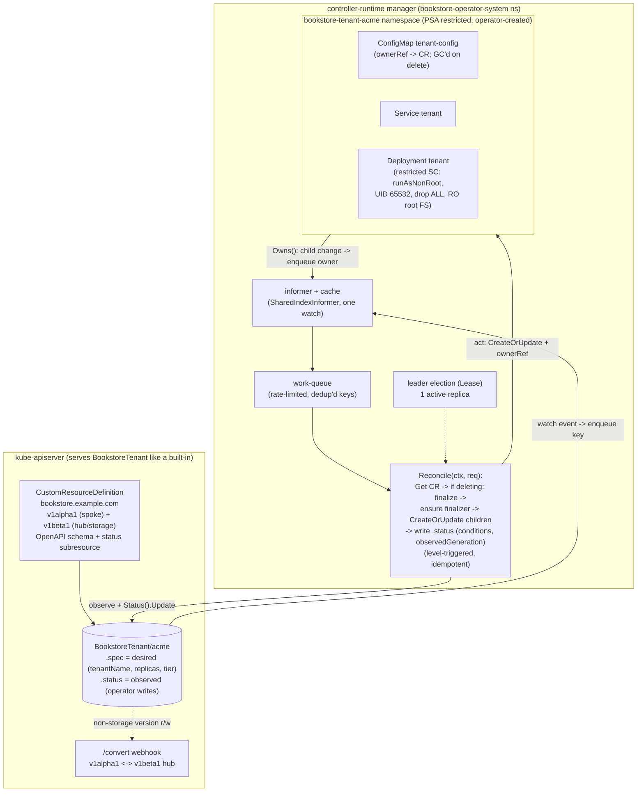

# 02 — Operator development

> [Part 08 ch.05](../08-day-2-operations/05-operators-and-crds.md) *consumed* an
> operator (CloudNativePG's `Cluster`); this chapter **builds one** with
> **Kubebuilder** — a real `BookstoreTenant` CRD
> (`bookstore.example.com`, `v1alpha1` spoke + `v1beta1` hub for the conversion
> story, namespaced) whose controller reconciles a minimal **restricted-PSA**
> slice (Namespace + Deployment + Service + ConfigMap) into a per-tenant
> namespace: the full Kubebuilder layout (`PROJECT`, `api/`,
> `internal/controller/`, `config/`, `Makefile`), `make manifests generate`,
> the **reconcile loop** (level-triggered, idempotent, owner references for GC,
> `CreateOrUpdate`), **finalizers** (clean state GC can't), **status
> conditions + `.status.observedGeneration` + Events**, the
> **v1alpha1→v1beta1 conversion webhook** (hub/spoke), **envtest** unit tests,
> RBAC markers, and packaging (Helm/OLM overview) — real controller-runtime Go
> in [`examples/bookstore/operator/`](../examples/bookstore/operator/README.md),
> `go vet`-clean and `docker build`-clean, explicitly **contrasted** with
> "consuming an operator" so this deepens [Part 08
> ch.05](../08-day-2-operations/05-operators-and-crds.md) rather than repeating
> it.

**Estimated time:** ~60 min read · half-day hands-on
**Prerequisites:** [Part 08 ch.05](../08-day-2-operations/05-operators-and-crds.md) — consumer-side operator pattern this chapter deepens to producer side · [Part 11 ch.01](01-admission-webhooks.md) — webhook plumbing reused for the conversion webhook
**You'll know after this:** • lay out a Kubebuilder project (PROJECT, api/, internal/controller/, config/) · • write a level-triggered, idempotent reconcile loop with owner references · • use finalizers + status conditions + observedGeneration + Events correctly · • build a v1alpha1→v1beta1 conversion webhook (hub/spoke) · • write envtest unit tests against an embedded apiserver

<!-- tags: platform-engineering, operators, crds, day-2 -->

## Why this exists

[Part 08 ch.05](../08-day-2-operations/05-operators-and-crds.md) made the
operator pattern concrete from the **consumer** side: install CloudNativePG via
its chart, `kubectl apply` a `Cluster`, watch its controller do the DBA job. It
ended on a deliberately deferred thread:

> *"build a CRD/operator only when buying genuinely doesn't fit … the pattern
> (CRD + controller-runtime reconcile loop) is also how **you** encode **your**
> org's operational knowledge (a "TenantEnvironment" CRD)… treat your
> controller as production software."*

This chapter is that thread, executed. It is the **producer** side of the exact
same pattern, and the contrast is the point — stated up front so the two
chapters do not blur:

| | [Part 08 ch.05](../08-day-2-operations/05-operators-and-crds.md) — *consume* | **This chapter — *build*** |
|---|---|---|
| Artifact | someone else's CRD + controller (CNPG) | **your** CRD + controller (`BookstoreTenant`) |
| You write | a `Cluster` CR (YAML) | the **Go reconcile loop**, CRD schema, conversion, RBAC |
| Effort/risk | install + operate a mature operator | author + test + version + operate software you own |
| The lesson | build-vs-buy → **buy** failover/PITR | build-vs-buy → **build** only your *own* domain logic |

You build an operator when **no mature operator encodes your domain** — here, a
soft-multi-tenancy primitive: "give a tenant their own isolated, hardened slice
of the platform" (the [Part 08
ch.04](../08-day-2-operations/04-multi-tenancy-and-namespaces.md)
namespace+quota+RBAC stack, but **as a single declarative `kubectl apply`**
with a controller that keeps it true and cleans it up). That is org-specific;
nobody ships it. Build-vs-buy still **strongly favours buy** for the hard
stateful systems ([Part 08
ch.05](../08-day-2-operations/05-operators-and-crds.md)) — this chapter is the
*other* case, done with the same rigor a service gets. The reference is
*Kubernetes Patterns* ch.27 (Controller) + ch.28 (Operator), and the Kubebuilder
book.

## Mental model

**Kubebuilder scaffolds the [Part 08
ch.05](../08-day-2-operations/05-operators-and-crds.md) machinery for *your*
type: a CRD (the new API noun), a controller-runtime *manager* hosting your
reconcile loop, and the wiring (scheme, RBAC, webhooks, manifests). You fill in
exactly one function — `Reconcile` — plus the API types; the framework does
watches, caching, work-queues, leader election, and the webhook server.**

- **CRD = your API type; controller = the loop that makes it true** — identical
  to [Part 08 ch.05](../08-day-2-operations/05-operators-and-crds.md). What is
  *new* here: **you author the OpenAPI schema** (Go structs + `kubebuilder`
  markers → `make manifests`), **you write `Reconcile`**, and **you own the
  versioning**.
- **`Reconcile(ctx, req)` is the whole controller.** controller-runtime hands
  you a namespaced name; you `Get` the CR, drive the world toward `.spec`
  (idempotently, via `CreateOrUpdate`), write `.status`, and return
  `(Result, error)`. A returned error → exponential-backoff requeue;
  `Result{RequeueAfter: d}` → time-based requeue. The loop is **level-triggered**
  (always reconciles the *current* desired state from the informer cache, so a
  missed/duplicate event is harmless) and **must be idempotent** (reconciling
  an already-correct CR is a no-op).
- **Owner references = automatic GC; finalizers = the cleanup GC can't do.**
  Stamp each child with `SetControllerReference(cr, child, scheme)` and deleting
  the CR cascades to the children (the apiserver's GC, the [Part 00
  ch.06](../00-foundations/06-declarative-api-model.md) `ownerReferences`). A
  **finalizer** is a string on `.metadata.finalizers` that *blocks* actual
  deletion (the apiserver only sets `deletionTimestamp`) until your controller
  does pre-delete work GC cannot express — release an external resource, a
  cluster-scoped object, a billing record — then removes the finalizer.
- **`.status` is observed state, and `observedGeneration` is the freshness
  bit.** The controller writes `.status` (via the **status subresource**, so it
  never fights a user editing `.spec`): `Conditions` (`Ready`/`Degraded` via
  `meta.SetStatusCondition`), a coarse `phase`, and
  `.status.observedGeneration = .metadata.generation` so a client can tell
  "the controller has processed *this* spec" from a stale status. **Events**
  (`Recorder.Event`) narrate *why* for `kubectl describe`.
- **Multiple API versions need conversion; hub-and-spoke makes it O(N).**
  Ship `v1alpha1` and `v1beta1`? Pick one **hub** (the storage version;
  here **`v1beta1`**); every other version is a **spoke** implementing
  `ConvertTo`/`ConvertFrom` *the hub*. The apiserver calls the operator's
  `/convert` endpoint on any read/write of a non-storage version and routes
  everything *through* the hub — so N versions need **N−1** conversions, not
  N². This mirrors the built-in API lifecycle from [Part 08
  ch.01](../08-day-2-operations/01-cluster-lifecycle.md).

The trap to keep in view (the [Part 08
ch.05](../08-day-2-operations/05-operators-and-crds.md) warning, from the
*inside*): **an operator you build is production software you now run** — a
Deployment with RBAC, a CRD with a version/conversion story, leader election,
bounded reconcile, tested idempotency. Kubebuilder removes the boilerplate, not
the responsibility. This chapter's operator is *deliberately tiny* (the
reconciled workload is a public `pause` image — the *machinery* is the lesson,
not the payload) precisely so the production-grade scaffolding is visible
without a distracting domain.

## Diagrams

### Diagram A — the reconcile loop: watch → queue → reconcile(diff→act) → status (Mermaid)



### Diagram B — Kubebuilder project tree (ASCII)

```
 examples/bookstore/operator/  (Kubebuilder Go layout v4) ──────────────────
 ├── PROJECT                 project metadata (domain, group, versions, webhooks)
 ├── Makefile                manifests / generate / vet / test / docker-build / deploy
 │                           (pins controller-gen, kustomize, setup-envtest)
 ├── Dockerfile              distroless static nonroot  (== app/catalog pattern)
 ├── go.mod / go.sum         controller-runtime v0.19 + k8s.io v0.31  (K8s v1.30+)
 ├── cmd/
 │   └── main.go             manager: scheme + controller + webhooks + leader-elect
 ├── api/
 │   ├── v1alpha1/           SPOKE
 │   │   ├── bookstoretenant_types.go        (size: s|m|l)
 │   │   ├── bookstoretenant_conversion.go   ConvertTo/From the v1beta1 hub
 │   │   ├── groupversion_info.go
 │   │   └── zz_generated.deepcopy.go        (make generate)
 │   └── v1beta1/            HUB + STORAGE
 │       ├── bookstoretenant_types.go        (tier: small|medium|large) + Hub()
 │       ├── groupversion_info.go
 │       └── zz_generated.deepcopy.go
 ├── internal/
 │   ├── controller/
 │   │   ├── bookstoretenant_controller.go   THE RECONCILE LOOP (+ finalizer,
 │   │   │                                   ownerRefs, CreateOrUpdate, status)
 │   │   ├── suite_test.go                   envtest harness (real apiserver+etcd)
 │   │   └── bookstoretenant_controller_test.go   behavioural tests
 │   └── webhook/v1/         (ch.01) mutating + validating Pod webhooks
 └── config/
     ├── crd/                the CRD (conversion.strategy: Webhook, v1beta1 storage)
     ├── rbac/               LEAST-PRIVILEGE manager Role/Binding/SA (from markers)
     ├── manager/            restricted-compliant manager Deployment + own ns
     ├── webhook/            (ch.01) Mutating/ValidatingWebhookConfiguration
     ├── certmanager/        serving cert (cert-manager) for the webhooks
     ├── apf/                (ch.03) FlowSchema + PriorityLevelConfiguration
     ├── samples/            sample CR (v1beta1 + v1alpha1)
     └── default/            kustomize overlay (make deploy)

  ON DISK: this whole tree is NEW and PURELY ADDITIVE — it touches no
  canonical Bookstore manifest, no Helm chart, no Kustomize overlay, and no
  operators/cnpg-* file (Part 08 ch.05 is left exactly as it was).
```

## Hands-on with the Bookstore

**Assumed working directory: the guide repo root (`full-guide/`).** This
chapter authors the **new**
[`examples/bookstore/operator/`](../examples/bookstore/operator/README.md) tree
(shared with [ch.01](01-admission-webhooks.md)/[ch.03](03-api-priority-and-fairness.md)).
It does **not** modify any canonical Bookstore manifest, Helm chart, Kustomize
overlay, the `operators/cnpg-*` files, or any other `examples/bookstore/**`
file — purely additive, the Gateway-vs-Ingress / CloudNativePG precedent.

We will: (0) read the Kubebuilder layout + how it was scaffolded; (1) the API
types + `make manifests generate`; (2) build & **vet** & **envtest** the
controller (no cluster); (3) run it against a kind cluster and watch a
`BookstoreTenant` reconcile, self-heal, and finalize; (4) the
v1alpha1→v1beta1 **conversion webhook** in action; (5) the CRD-intrinsic
dry-run note; (6) packaging.

### 0. The Kubebuilder project (how it is laid out and scaffolded)

Kubebuilder is the SDK that scaffolds and wires a controller-runtime project.
The canonical scaffold (recorded in
[`PROJECT`](../examples/bookstore/operator/PROJECT)) is:

```sh
# (reference — the tree is already in the repo; this is HOW it is generated)
kubebuilder init --domain example.com --repo github.com/bookstore/operator
kubebuilder create api --group bookstore --version v1alpha1 --kind BookstoreTenant --resource --controller
kubebuilder create api --group bookstore --version v1beta1  --kind BookstoreTenant --resource           # 2nd version
kubebuilder create webhook --group bookstore --version v1alpha1 --kind BookstoreTenant --conversion --spoke v1alpha1   # conversion (hub=v1beta1)
kubebuilder create webhook --group core --version v1 --kind Pod --defaulting --programmatic-validation  # ch.01 Pod webhooks
```

The resulting layout is Diagram B. The two pieces *you* own are `api/` (the
types + conversion) and `internal/controller/` (the loop); everything else
(`cmd/main.go` wiring, `config/`, `Makefile`) is scaffold you tune. This guide
ships the tree pre-written (real, `go vet`+`docker build` clean) so it is
reviewable without running the generator.

### 1. The API types + `make manifests generate`

[`api/v1beta1/bookstoretenant_types.go`](../examples/bookstore/operator/api/v1beta1/bookstoretenant_types.go)
is the **hub/storage** version; `kubebuilder` markers drive both the CRD schema
and code-gen:

```go
// +kubebuilder:object:root=true
// +kubebuilder:subresource:status                 // the status SUBRESOURCE
// +kubebuilder:resource:scope=Namespaced,shortName=btn
// +kubebuilder:storageversion                      // v1beta1 = etcd storage version
type BookstoreTenant struct { ... Spec ...; Status ... }

func (*BookstoreTenant) Hub() {}                    // marks v1beta1 the conversion HUB
```

`spec.tenantName` (`+kubebuilder:validation:Pattern=...`),
`spec.replicas` (`Minimum=0 Maximum=5 default=1` — bounded so a tenant CR can't
request an unbounded workload), `spec.tier` (`Enum=small;medium;large`).
[`api/v1alpha1`](../examples/bookstore/operator/api/v1alpha1/bookstoretenant_types.go)
is the **spoke** — same shape but `size: s|m|l` (renamed+remapped vs `tier`) so
the conversion has real work.

`make manifests generate` runs `controller-gen` to (re)produce the CRD/RBAC/
webhook YAML from the markers and the `zz_generated.deepcopy.go`:

```sh
cd examples/bookstore/operator
make manifests generate    # fetches PINNED controller-gen into ./bin, regenerates
                           #   config/crd/..., config/rbac/role.yaml,
                           #   config/webhook/manifests.yaml, api/*/zz_generated.deepcopy.go
git status --porcelain config/ api/   # (should be unchanged — committed == generated)
cd ../../..
```

> **The committed `config/**` and `zz_generated.deepcopy.go` are the exact
> equivalent of `make manifests generate` output**, committed so `go vet` /
> `docker build` are green on a machine without `controller-gen`.
> `make manifests generate` regenerates them in place (no diff). This is the same
> "tooling is pinned and fetched on demand; output is committed" stance as the
> guide's other pinned-tool installs.

### 2. Build, vet, and envtest the controller (no cluster needed)

The controller is real controller-runtime Go, built distroless exactly like
[`app/catalog`](../examples/bookstore/app/catalog/Dockerfile):

```sh
cd examples/bookstore/operator
go vet ./...                                   # passes clean
docker build -t bookstore/operator:dev .       # distroless static nonroot (~56 MB manager)
```

[`internal/controller/bookstoretenant_controller.go`](../examples/bookstore/operator/internal/controller/bookstoretenant_controller.go)
is the loop. Its shape (read the file alongside this):

```go
func (r *BookstoreTenantReconciler) Reconcile(ctx context.Context, req ctrl.Request) (ctrl.Result, error) {
    var tenant bookstorev1beta1.BookstoreTenant
    if err := r.Get(ctx, req.NamespacedName, &tenant); err != nil {
        return ctrl.Result{}, client.IgnoreNotFound(err)          // CR gone -> children GC'd; done
    }
    if !tenant.DeletionTimestamp.IsZero() {                        // being deleted:
        if controllerutil.ContainsFinalizer(&tenant, tenantFinalizer) {
            if err := r.finalizeTenant(ctx, &tenant); err != nil { return ctrl.Result{}, err }
            controllerutil.RemoveFinalizer(&tenant, tenantFinalizer)
            return ctrl.Result{}, r.Update(ctx, &tenant)           // release the object
        }
        return ctrl.Result{}, nil
    }
    if !controllerutil.ContainsFinalizer(&tenant, tenantFinalizer) {
        controllerutil.AddFinalizer(&tenant, tenantFinalizer)      // register BEFORE creating children
        return ctrl.Result{Requeue: true}, r.Update(ctx, &tenant)
    }
    // ACT — each child via CreateOrUpdate (idempotent) + SetControllerReference (GC)
    nsName := "bookstore-tenant-" + tenant.Spec.TenantName
    // ... reconcileNamespace / ConfigMap / Service / Deployment (restricted SC) ...
    // STATUS — observed state back
    tenant.Status.ObservedGeneration = tenant.Generation
    meta.SetStatusCondition(&tenant.Status.Conditions, metav1.Condition{
        Type: "Ready", Status: metav1.ConditionTrue,
        ObservedGeneration: tenant.Generation, Reason: "Reconciled", Message: "...",
    })
    return ctrl.Result{}, r.Status().Update(ctx, &tenant)
}
```

The reconciled children are **restricted-PSA-compliant** (the Deployment sets
`runAsNonRoot`, UID 65532, `allowPrivilegeEscalation: false`, `drop: ["ALL"]`,
seccomp `RuntimeDefault`, read-only root FS) so they admit into the
`restricted` tenant namespace the controller itself labels — the [Part 05
ch.02](../05-security/02-pod-security.md) posture, now *emitted by your
controller* (exactly what [Part 08
ch.05](../08-day-2-operations/05-operators-and-crds.md) noted CNPG does for its
Postgres pods — here you write that code). RBAC is **least-privilege**, derived
from `+kubebuilder:rbac` markers on the reconciler (only the child kinds + the
CR/status/finalizers/events — no secrets, no wildcard).

**envtest** runs the controller against a *real* apiserver+etcd (no kubelets,
so no Pods actually run) — far more faithful than a fake client:

```sh
make test     # wraps: setup-envtest (PINNED) downloads apiserver+etcd;
              #   KUBEBUILDER_ASSETS=... go test ./... -coverprofile cover.out
```

[`bookstoretenant_controller_test.go`](../examples/bookstore/operator/internal/controller/bookstoretenant_controller_test.go)
asserts the load-bearing properties: a CR produces an **owner-referenced,
restricted** child Deployment; the loop is **idempotent** (a second reconcile
changes nothing — child `generation` unchanged); `.status` carries
`observedGeneration` + a `Ready` condition.

> **envtest needs its binaries; absent them the suite *skips*, it does not
> fail.** `make test` provisions them via the pinned `setup-envtest`. On a
> machine with only the Go toolchain, `go vet ./...` (always run, always green)
> and `go test ./...` (suite skips with a clear message — see
> [`suite_test.go`](../examples/bookstore/operator/internal/controller/suite_test.go))
> are the reproducible checks; the chapter is honest that the *behavioural*
> assertions need the envtest control plane.

### 3. Run it against a cluster — reconcile, self-heal, finalize

```sh
kind create cluster --name bookstore
cd examples/bookstore/operator
docker build -t bookstore/operator:dev .
cd ../../..
kind load docker-image bookstore/operator:dev --name bookstore

# Install the CRD, then deploy the operator (manager + RBAC + leader election).
# cert-manager is only needed for the WEBHOOKS (ch.01); for the controller-only
# path here, install the CRD + run the manager with webhooks disabled, OR
# install cert-manager (ch.01 step 2) and use config/default as-is.
make -C examples/bookstore/operator install         # kustomize build config/crd | kubectl apply
kubectl apply -k examples/bookstore/operator/config/default
kubectl -n bookstore-operator-system rollout status deploy/bookstore-operator-controller-manager

# Create a tenant (the sample). The CR is inert data until the controller acts.
kubectl apply -f examples/bookstore/operator/config/samples/bookstore_v1beta1_bookstoretenant.yaml
kubectl get bookstoretenant acme -o wide
#   NAME   TENANT   PHASE   NAMESPACE                AGE
#   acme   acme     Ready   bookstore-tenant-acme    10s
kubectl get ns bookstore-tenant-acme --show-labels    # pod-security.kubernetes.io/enforce=restricted
kubectl get deploy,svc,cm -n bookstore-tenant-acme     # the reconciled, restricted slice
kubectl get deploy tenant -n bookstore-tenant-acme -o jsonpath='{.metadata.ownerReferences[0].kind}'   # BookstoreTenant
```

**Status + Events** (observed state + the narration `kubectl describe` shows):

```sh
kubectl get bookstoretenant acme -o jsonpath='{.status}' | python3 -m json.tool
#   "observedGeneration": 1, "namespace": "bookstore-tenant-acme",
#   "phase": "Ready", "conditions": [ { "type":"Ready","status":"True",... } ]
kubectl describe bookstoretenant acme | sed -n '/Events:/,$p'
#   Normal  Reconciled  ... tenant "acme" reconciled into namespace "bookstore-tenant-acme"
```

**Self-healing (level-triggered).** Delete a child; the `Owns()` watch
re-enqueues the CR and the loop recreates it — no special "repair" path, just
the loop closing a gap (the [Part 00
ch.06](../00-foundations/06-declarative-api-model.md) principle, your code):

```sh
kubectl delete deploy tenant -n bookstore-tenant-acme
kubectl get deploy tenant -n bookstore-tenant-acme -w   # controller recreates it within seconds
```

**Bump the spec → `observedGeneration` proves the controller caught up:**

```sh
kubectl patch bookstoretenant acme --type=merge -p '{"spec":{"replicas":3}}'
kubectl get bookstoretenant acme -o jsonpath='{.metadata.generation} {.status.observedGeneration}'; echo
#   2 2   (equal -> status reflects THIS spec; if it lagged you'd see "2 1")
kubectl get deploy tenant -n bookstore-tenant-acme -o jsonpath='{.spec.replicas}'; echo   # 3
```

**Finalizer — and the namespace it deliberately leaks.** Delete the CR; the
apiserver only sets `deletionTimestamp` until the controller runs
`finalizeTenant` and removes the finalizer. Owner-ref GC then removes the
**owner-referenced** children (ConfigMap/Service/Deployment). But the tenant
**Namespace is cluster-scoped — it cannot carry an `ownerReference` to a
namespaced CR**, so GC does *not* delete it. This minimal reference operator's
`finalizeTenant` deliberately only emits a terminal Event and does **not**
`r.Delete` the namespace — so the tenant namespace **leaks**. That omission is
*exactly* the finalizer footgun the Production notes warn about (a real
operator deletes it in the finalizer):

```sh
kubectl delete bookstoretenant acme &              # blocks on the finalizer
kubectl get bookstoretenant acme -o jsonpath='{.metadata.deletionTimestamp} {.metadata.finalizers}'; echo
#   2026-...Z [bookstore.example.com/tenant-finalizer]   ← object kept until finalizer cleared
wait
kubectl describe bookstoretenant acme 2>/dev/null | grep Finalized || echo "finalizer ran; CR gone"
kubectl get deploy,svc,cm -n bookstore-tenant-acme 2>/dev/null   # GONE — owner-referenced -> GC'd
kubectl get ns bookstore-tenant-acme   # STILL EXISTS — it cannot be owner-referenced
# A namespaced CR cannot own a cluster-scoped Namespace, so GC does NOT remove it.
# This minimal demo's finalizeTenant() does NOT delete it (it only emits an
# Event) — so the tenant namespace LEAKS. A production finalizeTenant() would
# `r.Delete(ctx, ns)` here; that deliberate omission is precisely the finalizer
# footgun the Production notes call out. Clean it up by hand for now:
kubectl delete ns bookstore-tenant-acme --ignore-not-found
```

### 4. The conversion webhook — v1alpha1 ⇄ v1beta1 hub

> **Prerequisite — the conversion webhook needs a running, cert-backed
> `/convert`.** `conversion.strategy: Webhook` makes the apiserver call the
> operator's `/convert` endpoint over TLS for *every* read/write of a
> non-storage version. If you took the **"webhooks disabled" path in step 3**
> (no cert-manager, manager run with `ENABLE_WEBHOOKS=false`), `/convert` is
> not served and the v1alpha1 apply/read-back below **fails** with a webhook/
> certificate error. Before this step you must **install cert-manager
> ([ch.01](01-admission-webhooks.md) step 2)** and **re-apply
> `config/default`** so the manager serves `/convert` with a valid serving
> cert (`kubectl -n bookstore-operator-system rollout status deploy/bookstore-operator-controller-manager` green, and
> `kubectl get certificate -n bookstore-operator-system` Ready).

The CRD declares `conversion.strategy: Webhook` with `v1beta1` as storage;
[`api/v1alpha1/bookstoretenant_conversion.go`](../examples/bookstore/operator/api/v1alpha1/bookstoretenant_conversion.go)
implements the spoke side (`ConvertTo`/`ConvertFrom` map `size`⇄`tier`). Apply
the **same tenant in the old `v1alpha1` shape** and read it back — the
apiserver stores it as `v1beta1` and returns whichever version you ask for, via
the operator's `/convert` endpoint (cert-manager-served, [ch.01](01-admission-webhooks.md)):

```sh
kubectl apply -f - <<'EOF'
apiVersion: bookstore.example.com/v1alpha1
kind: BookstoreTenant
metadata: { name: acme-legacy, namespace: default }
spec: { tenantName: acme-legacy, replicas: 2, size: m }     # v1alpha1: size=m
EOF
kubectl get bookstoretenant.v1beta1.bookstore.example.com acme-legacy -o jsonpath='{.spec.tier}'; echo
#   medium       ← stored as the hub; size:"m" -> tier:"medium" via ConvertTo
kubectl get bookstoretenant.v1alpha1.bookstore.example.com acme-legacy -o jsonpath='{.spec.size}'; echo
#   m            ← read back as v1alpha1; hub -> size via ConvertFrom (round-trips)
kubectl delete bookstoretenant acme-legacy
```

That round-trip *is* the hub-and-spoke contract: one storage shape, N−1 spoke
conversions, the apiserver routing everything through the hub — the
controller-internals analog of the built-in API deprecation path ([Part 08
ch.01](../08-day-2-operations/01-cluster-lifecycle.md)).

### 5. The CRD-intrinsic dry-run (documented, like every prior CRD object)

`BookstoreTenant` is a CRD from *this* operator. On a cluster **without** the
CRD installed:

```sh
kubectl apply --dry-run=client -f examples/bookstore/operator/config/samples/bookstore_v1beta1_bookstoretenant.yaml
# error: resource mapping not found ... no matches for kind "BookstoreTenant"
#   in version "bookstore.example.com/v1beta1" ... ensure CRDs are installed first
# (same for the v1alpha1 sample)
```

That is **expected and correct** — the *exact* precedent of
[`18-postgres-snapshot.yaml`](../examples/bookstore/raw-manifests/18-postgres-snapshot.yaml),
`51-gateway.yaml`, `70-kyverno-policy.yaml`, the `argocd/` tree,
[`operators/cnpg-cluster.yaml`](../examples/bookstore/operators/cnpg-cluster.yaml),
and [`cloud/karpenter-nodepool.yaml`](../examples/bookstore/cloud/karpenter-nodepool.yaml).
The CRD itself is built-in `apiextensions.k8s.io/v1` and dry-runs/*applies*
clean; the sample CR and the webhook configs carry this **CRD/webhook-intrinsic**
note in their headers (and [ch.01](01-admission-webhooks.md) for the webhook
side). After `make install`, the sample applies and the controller reconciles
it.

### 6. Packaging the operator

The deployable unit = CRD + RBAC + the manager Deployment + (webhooks +
cert). Two common distributions:

```sh
# A) Kustomize (built-in; what this repo ships) — make deploy renders config/default
kubectl apply -k examples/bookstore/operator/config/default

# B) Helm chart — wrap the same objects so consumers pin a chart version and
#    tune via values (the Part 07 ch.01 packaging discipline, applied to an
#    operator). `kubebuilder edit --plugins=helm/v1-alpha` scaffolds it.
# C) OLM bundle — for OperatorHub / fleet lifecycle: a ClusterServiceVersion +
#    the CRD, managed by Operator Lifecycle Manager (Part 08 ch.05's "operator
#    for your operators"). Right when you SHIP an operator to many clusters.
```

Clean up:

```sh
kubectl delete -f examples/bookstore/operator/config/samples/bookstore_v1beta1_bookstoretenant.yaml --ignore-not-found
kubectl delete -k examples/bookstore/operator/config/default --ignore-not-found
make -C examples/bookstore/operator uninstall          # remove the CRD
kind delete cluster --name bookstore
```

## How it works under the hood

- **Kubebuilder = controller-runtime + code-gen + scaffold.** `kubebuilder` is
  not a runtime; it scaffolds a **controller-runtime** project and runs
  **`controller-gen`** (markers → CRD/RBAC/webhook YAML + deepcopy). At runtime
  the **manager** (`ctrl.NewManager`) owns the shared client/cache, the
  leader-election `Lease`, the webhook server, and the metrics/health servers;
  each controller registers via `SetupWithManager` (`For` its CRD, `Owns` its
  children). This is the *exact* informer→work-queue→`Reconcile` machinery
  [Part 08 ch.05](../08-day-2-operations/05-operators-and-crds.md) described —
  Kubebuilder just generates the wiring so you write only `Reconcile` + types.
- **`CreateOrUpdate` is how the loop stays idempotent + self-healing.**
  `controllerutil.CreateOrUpdate(ctx, client, obj, mutateFn)` GETs the object,
  runs `mutateFn` to set the desired fields, and CREATEs or PATCHes only if it
  differs. Reconciling an already-correct tenant touches nothing (the test
  asserts the child `generation` is unchanged on a second pass); a drifted or
  deleted child is repaired on the next pass — "heal" is not a special path,
  it's the same diff-and-converge ([Part 00
  ch.06](../00-foundations/06-declarative-api-model.md)).
- **Owner references vs finalizers — two different cleanups.**
  `SetControllerReference(cr, child, scheme)` writes an `ownerReference`
  (`controller: true`) so the apiserver's **garbage collector** deletes the
  child when the CR is deleted — automatic, but only for *Kubernetes objects
  the CR owns*, and only **same-scope** (a namespaced CR cannot own a
  cluster-scoped Namespace — cross-scope owner refs are rejected). So the
  ConfigMap/Service/Deployment are GC'd, but the tenant **Namespace is not**:
  it must be deleted by the finalizer instead. A **finalizer** blocks the CR's
  actual deletion (apiserver sets `deletionTimestamp`, GC waits) so the
  controller can do cleanup GC *can't*: external systems,
  cross-scope/cluster-scoped objects, ordered teardown. It **must be
  idempotent** (it can run more than once) and **must be removed** or the
  object is stuck `Terminating` forever (a classic operator bug). **This
  chapter's reference operator deliberately leaves its `finalizeTenant` a
  no-op (Event only) — so the tenant Namespace intentionally LEAKS** (the
  Hands-on shows the ns still present after CR deletion); a production operator
  `r.Delete`s the namespace there. The minimal omission is *kept on purpose* to
  make the footgun visible — see the Production note below.
- **The status subresource keeps spec and status from fighting.**
  `+kubebuilder:subresource:status` makes `.status` a separate endpoint with
  its own RBAC; `r.Status().Update()` writes only status and does **not** bump
  `.metadata.generation` (only `.spec` changes do). So
  `.status.observedGeneration = .metadata.generation` is a reliable "the
  controller has reconciled *this* spec" signal — the basis of `kubectl wait
  --for=condition=Ready` and of GitOps health ([Part 07
  ch.04](../07-delivery/04-gitops-argocd.md)) on a custom resource.
  `meta.SetStatusCondition` maintains the standard `[]metav1.Condition`
  (transitions `lastTransitionTime` only on actual change); `Events` are the
  human-facing *why*.
- **Conversion is hub-and-spoke, served by the operator.** The CRD's
  `conversion.strategy: Webhook` points the apiserver at the operator's
  `/convert` (TLS, same cert machinery as [ch.01](01-admission-webhooks.md)).
  Registering **both** API versions on the manager's scheme + the v1beta1
  `Hub()` + the v1alpha1 `ConvertTo`/`ConvertFrom` is all controller-runtime
  needs: it converts spoke→hub→spoke automatically, so adding `v1`/`v2` later
  is N−1 more conversion funcs, not N². The **storage version**
  (`+kubebuilder:storageversion`) is what etcd holds and what a `status`
  controller writes — picking it deliberately (and migrating it carefully) is
  the same discipline as a built-in API graduating
  alpha→beta→GA ([Part 08 ch.01](../08-day-2-operations/01-cluster-lifecycle.md)).
- **Leader election makes the controller HA without doing work twice.** The
  manager acquires a `coordination.k8s.io` `Lease`; with `--leader-elect` and
  ≥2 replicas exactly one is active, the rest stand by and take over on lease
  loss — the *same* mechanism the built-in controller-manager uses ([Part 00
  ch.04](../00-foundations/04-control-plane-deep-dive.md)), now for your
  controller. Reconcile must therefore tolerate being interrupted and resumed
  (level-triggered + idempotent makes that free).

## Production notes

> **In production: build an operator only when buying genuinely doesn't fit —
> and then run it like a service.** [Part 08
> ch.05](../08-day-2-operations/05-operators-and-crds.md)'s build-vs-buy stands:
> for hard stateful systems, **buy** a mature operator (years of encoded
> failure handling). Build for *your* org-specific domain (this chapter's
> tenant primitive) — and then apply the same rigor any production service
> gets: **leader election** for HA, **bounded reconcile** (small
> `RequeueAfter`, rate-limited work-queue, never an unbounded hot loop — see
> [ch.03](03-api-priority-and-fairness.md)), **tested idempotency** (envtest),
> **least-privilege RBAC** (the marker-generated Role, reviewed — an operator
> is broad-by-default *only if you let it be*), and a versioned API.

> **In production: version the CRD deliberately and never break stored
> objects.** Add fields **optional with defaults**; never remove/repurpose a
> served field without a conversion. Graduate alpha→beta→GA like a built-in
> ([Part 08 ch.01](../08-day-2-operations/01-cluster-lifecycle.md)): a
> conversion **webhook** + a chosen **storage version** + (at scale) a
> `StorageVersionMigration` so old etcd objects are rewritten before you stop
> serving their version. A breaking CRD change is a cluster-wide data
> migration, not a code edit.

> **In production: finalizers are correctness-critical and a top operator
> footgun — and this reference operator intentionally demonstrates the
> failure.** Its `finalizeTenant` is deliberately a no-op (it only emits an
> Event), so the cluster-scoped tenant **Namespace is never deleted and
> leaks** — kept minimal *on purpose* to make the footgun concrete (the
> Hands-on shows the ns surviving CR deletion; clean it up by hand there). A
> real operator's finalizer **must `r.Delete(ctx, ns)` the tenant namespace**
> (it cannot be owner-referenced) plus any external state. Conversely, a
> finalizer that errors forever, or that the controller forgets to remove,
> leaves every CR stuck `Terminating` and **blocks namespace deletion**. Make
> finalizer logic **idempotent**, **time-bounded**, and **fail-loud** (status
> `Degraded` + Event), have an operational escape (documented manual finalizer
> removal) for when the external system it cleans up is itself down, and
> **test the delete path in envtest**, not just the create path.

> **In production: package and distribute it like any platform component.**
> Ship CRDs separately from the controller (CRDs are cluster-scoped, shared,
> and upgrade independently — the [Part 07
> ch.01](../07-delivery/01-packaging-helm.md) `crds/` discipline), pin the
> operator's chart/bundle version, run it in its **own namespace** with
> monitoring on **the operator itself** (reconcile errors, work-queue depth,
> reconcile latency), and use **OLM** when you ship to many clusters. Operator
> upgrade ≠ the managed thing's upgrade — sequence and test both (the [Part 08
> ch.05](../08-day-2-operations/05-operators-and-crds.md) rule, now for *your*
> operator).

> **In production (managed — EKS/GKE/AKS):** your operator runs on worker nodes
> like any workload, but its CRDs are **cluster-scoped global state** on a
> control plane you don't fully own — coordinate CRD installs/upgrades with the
> platform team, watch apiserver **APF** ([ch.03](03-api-priority-and-fairness.md))
> so a busy controller doesn't trip the managed apiserver's limits, and prefer
> the conversion webhook (the managed apiserver calls it) over no-conversion
> multi-version CRDs.

## Quick Reference

```sh
# Scaffold (reference) / regenerate manifests + deepcopy
kubebuilder init --domain example.com --repo github.com/bookstore/operator
kubebuilder create api --group bookstore --version v1beta1 --kind BookstoreTenant --resource --controller
make -C examples/bookstore/operator manifests generate   # controller-gen (pinned)

# Build / vet / test (no cluster: vet always; envtest skips if assets absent)
cd examples/bookstore/operator && go vet ./... && docker build -t bookstore/operator:dev .
make test                                                # envtest (real apiserver+etcd)

# Install CRD, deploy operator, drive a tenant
make -C examples/bookstore/operator install              # kustomize build config/crd | kubectl apply
kubectl apply -k examples/bookstore/operator/config/default
kubectl apply -f examples/bookstore/operator/config/samples/bookstore_v1beta1_bookstoretenant.yaml
kubectl get bookstoretenant -A -o wide                   # PHASE / NAMESPACE
kubectl get bookstoretenant acme -o jsonpath='{.metadata.generation} {.status.observedGeneration}'
kubectl describe bookstoretenant acme                    # conditions + Events (the "why")
kubectl explain bookstoretenant.spec --api-version=bookstore.example.com/v1beta1   # your CRD's schema
```

Minimal controller skeleton (the shape; full file in `internal/controller/`):

```go
func (r *R) Reconcile(ctx context.Context, req ctrl.Request) (ctrl.Result, error) {
    var cr v1beta1.BookstoreTenant
    if err := r.Get(ctx, req.NamespacedName, &cr); err != nil {
        return ctrl.Result{}, client.IgnoreNotFound(err)            // gone -> children GC'd
    }
    if !cr.DeletionTimestamp.IsZero() {                              // finalizer path
        if controllerutil.ContainsFinalizer(&cr, fin) {
            // finalizeTenant(ctx, &cr) does cleanup GC CAN'T: r.Delete the
            // cluster-scoped tenant Namespace (no ownerRef possible) + any
            // external state. Wrap errors with %w (consistent with the loop).
            if err := r.finalizeTenant(ctx, &cr); err != nil { return ctrl.Result{}, fmt.Errorf("finalize: %w", err) }
            controllerutil.RemoveFinalizer(&cr, fin)
            if err := r.Update(ctx, &cr); err != nil { return ctrl.Result{}, fmt.Errorf("remove finalizer: %w", err) }
        }
        return ctrl.Result{}, nil
    }
    if !controllerutil.ContainsFinalizer(&cr, fin) {
        controllerutil.AddFinalizer(&cr, fin)
        if err := r.Update(ctx, &cr); err != nil { return ctrl.Result{}, fmt.Errorf("add finalizer: %w", err) }
        return ctrl.Result{Requeue: true}, nil
    }
    // CreateOrUpdate children + SetControllerReference (ownerRef -> GC); restricted SC
    cr.Status.ObservedGeneration = cr.Generation
    meta.SetStatusCondition(&cr.Status.Conditions, metav1.Condition{Type: "Ready", Status: metav1.ConditionTrue, ObservedGeneration: cr.Generation, Reason: "Reconciled"})
    return ctrl.Result{}, r.Status().Update(ctx, &cr)
}
func (r *R) SetupWithManager(m ctrl.Manager) error {
    return ctrl.NewControllerManagedBy(m).For(&v1beta1.BookstoreTenant{}).
        Owns(&appsv1.Deployment{}).Owns(&corev1.Service{}).Owns(&corev1.ConfigMap{}).Complete(r)
}
```

Checklist:

- [ ] **Contrast clear:** [Part 08
      ch.05](../08-day-2-operations/05-operators-and-crds.md) *consumes* a
      mature operator; you *build* one only for your **own** domain logic
- [ ] `Reconcile` is **level-triggered + idempotent** (`CreateOrUpdate`); a
      second pass and a missed event are both no-ops (envtest asserts it)
- [ ] Children carry **owner references** (GC); a **finalizer** does the
      cleanup GC can't, is **idempotent**, and is always **removed**
- [ ] `.status` via the **subresource**: `Conditions` +
      **`observedGeneration` == `generation`** + **Events** for the "why"
- [ ] Multi-version CRD: one **hub/storage** version + **conversion webhook**;
      add fields optional-with-defaults; never break stored objects
- [ ] **Least-privilege RBAC** from `+kubebuilder:rbac` markers (reviewed);
      manager + reconciled workload **restricted-PSA-compliant**; own namespace
- [ ] **HA** via leader election; bounded reconcile (rate-limited queue, no hot
      loop — [ch.03](03-api-priority-and-fairness.md)); CRD shipped/versioned
      separately ([Part 07 ch.01](../07-delivery/01-packaging-helm.md))

## Test your understanding

> Try each before opening the answer drawer. The act of trying is the exercise; the answer is the check.

1. **Why must a reconcile loop be idempotent and level-triggered rather than edge-triggered?**
   <details><summary>Show answer</summary>

   The reconciler may be invoked multiple times for the same object (re-queue on error, periodic resync, restart) and may miss intermediate events (the controller was down, the watch dropped). Level-triggered means each Reconcile call looks at the current observed state and the desired state and converges — it does not depend on knowing *what changed*. Idempotent means re-running Reconcile with the same input produces the same effect (no duplicates, no extra resource creation, no flapping). Edge-triggered + non-idempotent loops produce ghost resources, race conditions, and incidents that vanish on restart.

   </details>

2. **You delete a `BookstoreTenant` and the namespace stays around. What probably happened, and how do finalizers fix it?**
   <details><summary>Show answer</summary>

   The namespace was created with an owner reference pointing at the BookstoreTenant — when the tenant is deleted, the garbage collector should cascade-delete the namespace. But if your controller created external state (an S3 bucket, a cloud DNS record, a database) that the GC cannot reach, you need a *finalizer*. The finalizer is a string on the object's `metadata.finalizers`; the API marks the object `DeletionTimestamp` and blocks actual deletion until your controller has cleaned up the external state and removed its finalizer string. Without finalizers, the K8s GC deletes the resource but the external state leaks.

   </details>

3. **You added a new field `spec.replicas` to `v1beta1`. Existing `v1alpha1` objects in etcd don't have it. What conversion behavior do you need to guarantee, and what breaks if you don't?**
   <details><summary>Show answer</summary>

   The conversion webhook (or `apiextensions.x-kubernetes.io/conversion` strategy) must produce a `v1beta1` object with a sensible default (e.g. `replicas: 1`) when reading a `v1alpha1` object. Conversely, when reading a `v1beta1` object back through the `v1alpha1` API, the new field is dropped — and on next write through `v1alpha1`, you must not zero-out the field. The hub/spoke model with one *storage* version + N served versions and bidirectional conversion is the canonical pattern. If you skip this and bump the storage version directly, old controllers that still GET `v1alpha1` will silently corrupt state.

   </details>

4. **Your operator's reconciler hot-loops — `apiserver_request_total{verb="UPDATE",resource="bookstoretenants"}` shows 200/sec. What three things do you check?**
   <details><summary>Show answer</summary>

   (1) Are you writing back to the same object you're watching? Every Update triggers a new event which retriggers Reconcile — you need to compare desired vs current and only write if different. (2) Is `observedGeneration` being set correctly so you can detect "I already reconciled generation N"? (3) Is the rate-limited workqueue actually rate-limiting, or are you calling `Requeue: true` unconditionally? Fix: idempotent CreateOrUpdate with diff-and-patch, `observedGeneration == generation` guard, and never requeue without backoff. Also worth ensuring this hot loop hasn't tripped APF — see [ch.03](03-api-priority-and-fairness.md).

   </details>

5. **Hands-on: write a minimal `BookstoreTenant` CRD + controller that creates a Namespace named `tenant-<spec.name>`. Apply two `BookstoreTenant` CRs simultaneously. Now delete one. What guarantees do owner references give you?**
   <details><summary>What you should see</summary>

   The Namespace's `ownerReferences` points at the BookstoreTenant CR. When the CR is deleted, the K8s garbage collector cascades the deletion to the Namespace, and from there to everything in the namespace (RoleBindings, Deployments, Services). If `ownerReferences` was missing, the Namespace becomes an orphan that must be deleted by name. Owner references give you cascade-delete for free *within the cluster* — external state still needs finalizers.

   </details>

## Further reading

- **Ibryam & Huß, _Kubernetes Patterns_ 2e — *Controller* (ch.27) and
  *Operator* (ch.28)**: the reconcile loop (level-triggered, idempotent) and
  CRD + controller = operational knowledge as software — read from the
  *producer* side here (Part 08 ch.05 read it from the consumer side).
- **Rosso et al., _Production Kubernetes_, ch.11 — "Building Platform
  Services"**: operators as the building blocks of an internal platform — the
  build-vs-buy boundary, versioning, and operating an operator you ship.
- Official: the **Kubebuilder Book**
  <https://book.kubebuilder.io/> (project layout, markers, webhooks, envtest),
  CustomResourceDefinitions / versions & conversion
  <https://kubernetes.io/docs/tasks/extend-kubernetes/custom-resources/custom-resource-definition-versioning/>,
  and the operator pattern
  <https://kubernetes.io/docs/concepts/extend-kubernetes/operator/>.
