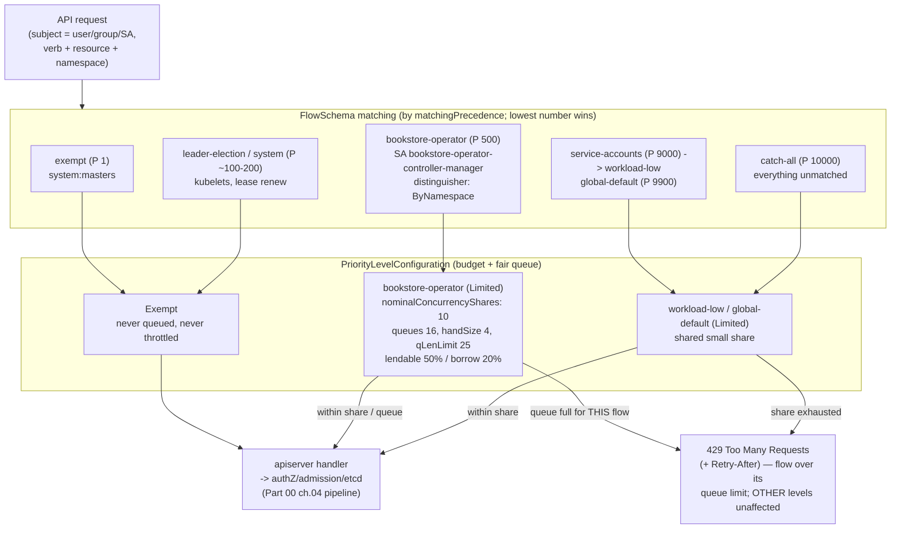

# 03 — API Priority and Fairness

> Why one bad client or a hot-looping controller can starve the apiserver for
> *everyone* (and how the apiserver protects its own availability):
> **API Priority & Fairness** — **FlowSchema** (match by user/SA/group +
> verb/resource/namespace, `matchingPrecedence`, `distinguisherMethod`) →
> **PriorityLevelConfiguration** (`Limited` vs `Exempt`,
> `nominalConcurrencyShares`, queuing: `queues`/`handSize`/`queueLengthLimit`,
> `borrowingLimitPercent`/`lendablePercent`); the built-in flow schemas
> (system, leader-election, workload, **catch-all**) and where a tenant's bulk
> `LIST`/`WATCH` lands; the APF metrics
> (`apiserver_flowcontrol_request_concurrency_limit`,
> `_rejected_requests_total`, `_current_inqueue_requests`,
> `_dispatched_requests_total`) + dashboards; the interaction with client-side
> rate limiting (`--kube-api-qps`) and the request-priority headers; tuning and
> a noisy-neighbor scenario — applied by classifying the
> [ch.02](02-operator-development.md) **BookstoreTenant operator's** apiserver
> traffic into a bounded custom PriorityLevel + FlowSchema so a buggy reconcile
> can't take down the control plane.

**Estimated time:** ~45 min read · ~60 min hands-on
**Prerequisites:** [Part 00 ch.04](../00-foundations/04-control-plane-deep-dive.md) — apiserver request path APF protects · [Part 11 ch.02](02-operator-development.md) — operator whose traffic this chapter classifies
**You'll know after this:** • explain how FlowSchema + PriorityLevelConfiguration shape apiserver concurrency · • classify a tenant's noisy LIST/WATCH into a bounded PriorityLevel · • read APF metrics (rejected / inqueue / dispatched) and connect them to client behavior · • tune `--kube-api-qps` / `--kube-api-burst` against APF for a controller · • diagnose a noisy-neighbor scenario starving the catch-all level

<!-- tags: platform-engineering, observability, day-2 -->

## Why this exists

[ch.02](02-operator-development.md) shipped a controller. Its production note
warned: *"bounded reconcile … never an unbounded hot loop — see ch.03"*. This
is that chapter. [Part 00
ch.04](../00-foundations/04-control-plane-deep-dive.md) established that **the
API server is the only door** — every `kubectl`, kubelet, and controller goes
through it, and it is horizontally scalable but finite. [Part 08
ch.03](../08-day-2-operations/03-troubleshooting-playbook.md) and the [Part 06
observability](../06-production-readiness/01-observability-metrics.md) chapters
treated "the apiserver is slow / timing out" as a symptom. This chapter is the
*mechanism that prevents it* and the *control surface that diagnoses it*.

The failure mode is concrete and common:

1. **The hot-loop controller.** A reconcile bug (no rate limiter, an error that
   re-enqueues instantly, a watch that re-LISTs every event) makes **one**
   controller issue thousands of `LIST pods` per second. Without APF those
   requests share the apiserver's inflight budget with *everything else* —
   `kubectl`, the scheduler, kubelets renewing leases — and the whole control
   plane goes sluggish or starts timing out. A bug in *your* operator
   ([ch.02](02-operator-development.md)) becomes a cluster-wide outage.
2. **The noisy tenant.** A tenant's CI sprays `LIST secrets --all-namespaces`
   or a misconfigured client sets `--kube-api-qps=1000`. One identity consumes
   the shared budget; well-behaved controllers starve.
3. **The thundering herd after a blip.** A network hiccup ends; 500 controllers
   re-LIST simultaneously. Without fair queueing the apiserver is buried by its
   own clients reconnecting.

Pre-1.20 the apiserver had only two crude global knobs
(`--max-requests-inflight`, `--max-mutating-requests-inflight`) — one slow/
abusive client could exhaust them and there was **no isolation**. **API
Priority & Fairness (APF)** replaced that: it classifies every request into a
**priority level** with its **own** concurrency share and **fair queue**, so a
flood in one level cannot starve another. It is **on by default and GA since
v1.29** (`flowcontrol.apiserver.k8s.io/v1`). Operating a cluster — especially
one running custom controllers — without understanding APF means you cannot
explain a `429`, cannot protect the control plane from your own operator, and
cannot tune for a multi-tenant or controller-heavy workload. The reference is
*Production Kubernetes* (control-plane availability / multitenancy) and the
official APF documentation.

## Mental model

**Every request is sorted (by *who* + *what*) into exactly one queue with a
bounded concurrency share. A flood only fills *its own* queue and burns *its
own* share; other queues — and the rest of the apiserver — are unaffected.
APF is QoS for the API server, the way requests/limits are QoS for nodes.**

- **Two objects, both built-in (no CRD).** A **`FlowSchema`** is the
  *classifier*: rules matching the request's **subject** (user / group /
  ServiceAccount) and **resource/verb/namespace**; the highest-`matchingPrecedence`
  (lowest number) matching FlowSchema wins and names a **`Priority
  LevelConfiguration`** — the *budget + queue*. They are
  `flowcontrol.apiserver.k8s.io/v1` core kinds, so they **dry-run/apply clean
  on any v1.30+ cluster with nothing installed** (the inverse of the CRD-backed
  files — stated explicitly).
- **PriorityLevel: `Limited` vs `Exempt`.** `Exempt` = never queued, never
  throttled (reserved for must-never-be-blocked traffic like leader-election /
  `system:masters` — abuse it and you've recreated the old no-isolation
  problem). `Limited` = a bounded slice of the apiserver's total concurrency,
  set by **`nominalConcurrencyShares`** (a *weight*, not an absolute — each
  level's concurrency = total × its shares / Σ shares). `Limited` levels can
  **lend** idle concurrency (`lendablePercent`) and **borrow** spare capacity
  (`borrowingLimitPercent`) so the floor is guaranteed but idle capacity isn't
  wasted.
- **Fair queueing inside a level: shuffle-sharding.** A `Limited` level with
  `limitResponse.type: Queue` has `queues` queues; each request is hashed (by
  the FlowSchema's **`distinguisherMethod`** — `ByUser` or `ByNamespace`) onto
  `handSize` of them and enqueued on the shortest. This **shuffle-sharding**
  makes it statistically very unlikely that one bad *flow* (one user, one
  namespace) collides with a good one on *all* its queues — so a noisy tenant
  is isolated **within** the level, not just across levels. Past
  `queueLengthLimit`, excess requests get **`429 Too Many Requests`** (with a
  `Retry-After`); `limitResponse.type: Reject` skips queueing and 429s
  immediately.
- **The built-in flow schemas are the defaults you live with.** Every cluster
  ships FlowSchemas/levels: `exempt` (system:masters), `system`
  (system:nodes — kubelets), `leader-election`, `workload-leader-election`,
  `kube-controller-manager`/`kube-scheduler`, `workload-high`,
  `workload-low`, **`global-default`**, and the final **`catch-all`**
  (precedence 10000, the lowest-priority bucket for anything unmatched). **A
  custom controller's ServiceAccount, unclassified, falls into `workload-low`
  or `global-default`** — sharing a small share with every other unclassified
  client. Giving it its *own* bounded level is the protection this chapter
  builds.
- **Server-side APF vs client-side rate limiting are complementary.**
  `--kube-api-qps`/`--kube-api-burst` (and a controller's `client-go` rate
  limiter) throttle a client *before it sends* — politeness, easily
  misconfigured or bypassed. APF throttles *at the apiserver* — enforcement the
  client cannot evade. You want **both**: a sane client limiter *and* an APF
  level so a client that ignores its limiter (or a buggy one) still can't starve
  the control plane.

The trap to keep in view: **APF protects the apiserver's *availability*, not
your controller's *correctness*.** If your reconcile hot-loops, APF stops it
from taking down the cluster — but your controller is now being throttled/429'd
and is *not converging*. APF buys the blast-radius containment that turns "fix
it now, cluster is down" into "fix the bug, the rest of the cluster is fine".
The real fix is still a rate-limited, level-triggered, idempotent loop
([ch.02](02-operator-development.md)); APF is the safety net, not the cure.

## Diagrams

### Diagram A — request → FlowSchema match → PriorityLevel queue → handler or 429 (Mermaid)



### Diagram B — the default flow schemas and where the operator lands (ASCII)

```
 APF: DEFAULT FLOW SCHEMAS (by precedence) + WHERE THE OPERATOR GOES ───────

  precedence  FlowSchema                 -> PriorityLevel        who
  ----------  -------------------------     -----------------    ----------------
       1      exempt                     -> exempt (Exempt)      system:masters
     ~100     system-nodes (system)      -> system (Limited*)    kubelets
     ~200     *-leader-election          -> leader-election      ctrl-mgr/sched lease
     ~800     kube-system SAs            -> workload-high        core system SAs
  ╔════════════════════════════════════════════════════════════════════════╗
  ║ 500      bookstore-operator  ───────-> bookstore-operator  ◄═ THIS FILE  ║
  ║          (SA bookstore-operator-controller-manager;          (Limited,   ║
  ║           verbs get/list/watch/...; bookstoretenants +        bounded,   ║
  ║           ns/cm/svc/deploy)            shares 10, ByNamespace) own queue)║
  ╚════════════════════════════════════════════════════════════════════════╝
      9000    service-accounts           -> workload-low         ◄ where the
      9900    global-default             -> global-default          operator's SA
     10000    catch-all                  -> catch-all (lowest)      WOULD land if
                                                                    NOT classified
  (values from `kubectl get flowschema` in step 0 — service-accounts is P9000
   -> workload-low, global-default P9900, catch-all P10000)

  Unclassified, the BookstoreTenant operator's SA matches the built-in
  `service-accounts` FlowSchema (P9000) -> the shared **workload-low** level,
  competing with every other SA. A hot-loop bug there throttles that shared
  bucket -> collateral damage to OTHER controllers in it. Pinning it to its
  OWN precedence-500 Limited level (shares 10, queued, ByNamespace) — far
  ahead of P9000 — means a buggy reconcile drains ONLY its own queue & share:
  it gets 429'd, the rest of the control plane (kubelets, scheduler, other
  controllers, kubectl) is untouched.  APF = QoS for the apiserver
  (cf. requests/limits = QoS for nodes, Part 01 ch.03).

  *system level is Limited but very high-share; conceptually protected.
```

## Hands-on with the Bookstore

**Assumed working directory: the guide repo root (`full-guide/`).** This
chapter adds the **new**
[`examples/bookstore/operator/config/apf/bookstore-operator-apf.yaml`](../examples/bookstore/operator/config/apf/bookstore-operator-apf.yaml)
(the operator tree shared with [ch.01](01-admission-webhooks.md)/[ch.02](02-operator-development.md)).
It does **not** modify any canonical Bookstore manifest, Helm chart, Kustomize
overlay, or other `examples/bookstore/**` file — purely additive.

We will: (0) see the built-in APF state on any cluster; (1) read the operator's
custom FlowSchema + PriorityLevel and dry-run it (built-in → clean); (2) apply
it and prove the operator's traffic now lands in *its* level; (3) read the APF
metrics; (4) a noisy-neighbor scenario showing isolation.

### 0. The APF state every cluster already has (no setup)

APF is on by default. Inspect the built-in schemas/levels — these exist on a
vanilla kind cluster with nothing installed:

```sh
kind create cluster --name bookstore
kubectl get flowschema    # ~13 built-ins, sorted by matchingPrecedence
#   NAME                      PRIORITYLEVEL     MATCHINGPRECEDENCE  ...
#   exempt                    exempt            1
#   probes                    exempt            2
#   system-leader-election    leader-election   100
#   workload-leader-election  workload-low      200
#   ...
#   service-accounts          workload-low      9000
#   global-default            global-default    9900
#   catch-all                 catch-all         10000
kubectl get prioritylevelconfiguration
#   NAME              TYPE      NOMINALCONCURRENCYSHARES  QUEUES  ...
#   exempt            Exempt
#   leader-election   Limited   10                        16
#   workload-high     Limited   40                        128
#   workload-low      Limited   100                       128
#   global-default    Limited   20                        128
#   catch-all         Limited   5                         -
```

Note `workload-low`/`global-default` (shares 100/20) are where an
**unclassified** controller's ServiceAccount lands — sharing that bucket with
every other unclassified client (Diagram B).

### 1. The operator's custom FlowSchema + PriorityLevel (built-in → dry-run clean)

[`config/apf/bookstore-operator-apf.yaml`](../examples/bookstore/operator/config/apf/bookstore-operator-apf.yaml)
gives the [ch.02](02-operator-development.md) operator's ServiceAccount its
**own bounded level**. Because `FlowSchema`/`PriorityLevelConfiguration` are
**built-in** `flowcontrol.apiserver.k8s.io/v1` kinds, this dry-runs **clean**
with nothing installed — the explicit *inverse* of the CRD/webhook-intrinsic
files ([ch.01](01-admission-webhooks.md)/[ch.02](02-operator-development.md));
the file header states this:

```sh
kubectl apply --dry-run=client -f examples/bookstore/operator/config/apf/bookstore-operator-apf.yaml
# prioritylevelconfiguration.flowcontrol.apiserver.k8s.io/bookstore-operator created (dry run)
# flowschema.flowcontrol.apiserver.k8s.io/bookstore-operator created (dry run)
# (NO "no matches for kind" — built-in; no operator/CRD needed for THIS file)
```

The two objects and **why each field is exactly this**:

```yaml
kind: PriorityLevelConfiguration          # the budget + queue
metadata: { name: bookstore-operator }
spec:
  type: Limited                           # NOT Exempt — a controller must be bounded
  limited:
    nominalConcurrencyShares: 10           # small WEIGHT: never crowd out workload ctrls
    lendablePercent: 50                    # lend up to half its idle share to others
    borrowingLimitPercent: 20              # may burst 20% over nominal when others idle
    limitResponse:
      type: Queue                          # queue the burst rather than instant-429
      queuing: { queues: 16, handSize: 4, queueLengthLimit: 25 }   # shuffle-shard
---
kind: FlowSchema                           # the classifier
metadata: { name: bookstore-operator }
spec:
  matchingPrecedence: 500                  # BEFORE workload-low/global-default/catch-all
  priorityLevelConfiguration: { name: bookstore-operator }
  distinguisherMethod: { type: ByNamespace }  # fair across tenant namespaces
  rules:
    - subjects: [ { kind: ServiceAccount, serviceAccount:
        { name: bookstore-operator-controller-manager, namespace: bookstore-operator-system } } ]
      resourceRules: [ { verbs: ["get","list","watch","create","update","patch","delete"],
        apiGroups: ["bookstore.example.com","","apps"],
        resources: ["bookstoretenants","bookstoretenants/status","namespaces","configmaps","services","deployments"],
        namespaces: ["*"] } ]
```

- **`type: Limited` + small `nominalConcurrencyShares`** — a controller must be
  *bounded* (never `Exempt`), and a *teaching* operator should get a *small*
  weight so it can never crowd out the real workload controllers even at full
  tilt. Concurrency is `total × 10 / Σ all shares`.
- **`Queue` + `queues/handSize/queueLengthLimit`** — burst tolerance with
  shuffle-sharding (isolates one tenant's churn from another *inside* this
  level); past the queue limit it's a clean `429 + Retry-After` (which
  `client-go` honours and backs off on) rather than dropped work.
- **`lendablePercent`/`borrowingLimitPercent`** — guarantee the operator's
  floor but don't waste idle capacity: it lends when quiet, borrows a little
  when others are quiet.
- **`matchingPrecedence: 500`** — below system/leader-election (~100–200) so it
  can never outrank the control plane's own traffic, but far **above** the
  `service-accounts` FlowSchema (P9000 → `workload-low`), `global-default`
  (P9900) and `catch-all` (P10000) so the operator's requests are classified
  *here* instead of falling into the shared `workload-low` bucket.
- **`distinguisherMethod: ByNamespace`** — the operator manages many tenant
  namespaces; sharding by namespace keeps one tenant's reconcile churn from
  starving another *within* the operator's own level.

### 2. Apply it and prove the operator's traffic lands in its level

```sh
# Deploy the operator (ch.02) so its ServiceAccount exists and is making
# apiserver calls, then apply the APF objects:
kubectl apply -k examples/bookstore/operator/config/default       # (ch.02; needs the image loaded + cert-manager per ch.01)
kubectl apply -f examples/bookstore/operator/config/apf/bookstore-operator-apf.yaml
kubectl get flowschema bookstore-operator
#   NAME                 PRIORITYLEVEL       MATCHINGPRECEDENCE  ...
#   bookstore-operator   bookstore-operator  500
```

Prove **classification** without guessing — ask the apiserver which FlowSchema
+ PriorityLevel a request *as the operator's ServiceAccount* would match, via
the APF dry-run response headers:

```sh
kubectl get --raw='/api/v1/namespaces/default/configmaps' \
  --as=system:serviceaccount:bookstore-operator-system:bookstore-operator-controller-manager \
  -v6 2>&1 | grep -i 'X-Kubernetes-PF'
#   X-Kubernetes-PF-FlowSchema-UID: ... (bookstore-operator)
#   X-Kubernetes-PF-PriorityLevel-UID: ... (bookstore-operator)
# -> the operator's requests are now classified into ITS bounded level, NOT
#    the shared workload-low/global-default bucket.
```

(Every apiserver response carries `X-Kubernetes-PF-FlowSchema-UID` /
`X-Kubernetes-PF-PriorityLevel-UID` — the authoritative "which level did this
request use", far better than inferring.)

### 3. The APF metrics — the dashboard you watch in production

The apiserver exposes APF metrics at `/metrics` (the same endpoint [Part 06
ch.01](../06-production-readiness/01-observability-metrics.md) scrapes with
Prometheus). The four to know:

```sh
kubectl get --raw=/metrics | grep -E '^apiserver_flowcontrol_(request_concurrency_limit|rejected_requests_total|current_inqueue_requests|dispatched_requests_total)' | grep bookstore-operator
# apiserver_flowcontrol_request_concurrency_limit{priority_level="bookstore-operator"}  <N>
#   -> the concurrency seats currently allotted to this level (moves as levels
#      lend/borrow). The level's effective budget right now.
# apiserver_flowcontrol_dispatched_requests_total{priority_level="bookstore-operator"} <C>
#   -> requests admitted (served) from this level. Throughput.
# apiserver_flowcontrol_current_inqueue_requests{priority_level="bookstore-operator"}  <Q>
#   -> requests WAITING in this level's queues right now. Sustained > 0 = the
#      level is saturated (the operator is being throttled — investigate the loop).
# apiserver_flowcontrol_rejected_requests_total{priority_level="bookstore-operator",reason="queue-full"} <R>
#   -> requests 429'd. Any nonzero, growing value = a hot loop or an
#      undersized level. THIS is the alert.
```

Production rule of thumb (alerts, [Part 06
ch.01](../06-production-readiness/01-observability-metrics.md)): alert on
`rate(apiserver_flowcontrol_rejected_requests_total[5m]) > 0` for any level you
own, and on `apiserver_flowcontrol_current_inqueue_requests` staying high — the
first means work is being dropped, the second means a level is saturated.
`apiserver_flowcontrol_request_wait_duration_seconds` (a histogram) shows *how
long* requests queue. Grafana's "API server (APF)" dashboards (kube-prometheus)
chart exactly these.

### 4. Noisy-neighbor scenario — isolation, demonstrated

The point of APF is *containment*. Simulate a hostile bulk client and show it
**cannot** starve the operator's level (or the control plane). The flood runs
as a *different* identity — a plain ServiceAccount in `default`, which the
built-in `service-accounts` FlowSchema (P9000) classifies into the shared
**`workload-low`** level (NOT `catch-all` — `catch-all` is only for requests no
FlowSchema matches; an authenticated SA always matches `service-accounts`
first). Watch the operator's own level stay healthy while `workload-low`
absorbs and throttles the flood:

```sh
# A) A throwaway "noisy" identity hammering LISTs (a stand-in for a buggy
#    controller / abusive CI). It is NOT the operator SA, so it does NOT use
#    the bookstore-operator level — as a generic SA it matches the built-in
#    `service-accounts` FlowSchema (P9000) -> the shared `workload-low` level.
kubectl create serviceaccount noisy -n default
kubectl create clusterrolebinding noisy-view --clusterrole=view --serviceaccount=default:noisy
TOKEN=$(kubectl create token noisy -n default)
APISERVER=$(kubectl config view --minify -o jsonpath='{.clusters[0].cluster.server}')
for i in $(seq 1 2000); do
  curl -sk -o /dev/null -H "Authorization: Bearer $TOKEN" \
    "$APISERVER/api/v1/configmaps?limit=500" &
done; wait

# B) MEANWHILE the operator's level is isolated — its rejected counter stays
#    flat while the noisy traffic gets throttled in workload-low (its bucket):
kubectl get --raw=/metrics | grep 'apiserver_flowcontrol_rejected_requests_total' \
  | grep -E 'priority_level="(bookstore-operator|workload-low|global-default|catch-all)"'
#   ...{priority_level="workload-low"...}  <RISING>       ← the flood is contained HERE
#                                                            (where the noisy SA landed)
#   ...{priority_level="bookstore-operator"...}  0        ← operator UNAFFECTED
kubectl get bookstoretenant -A           # still reconciling fine; control plane responsive
```

The flood is absorbed and 429'd **in its own level**; the operator's
precedence-500 level — and the kubelets/scheduler/`kubectl` in *theirs* — keep
their guaranteed concurrency. That isolation is the entire value proposition.
Clean up:

```sh
kubectl delete clusterrolebinding noisy-view; kubectl delete serviceaccount noisy -n default
kubectl delete -f examples/bookstore/operator/config/apf/bookstore-operator-apf.yaml --ignore-not-found
kubectl delete -k examples/bookstore/operator/config/default --ignore-not-found
kind delete cluster --name bookstore
```

## How it works under the hood

- **Classification then fair dispatch, entirely inside the apiserver.** On each
  request the apiserver evaluates **FlowSchemas in `matchingPrecedence` order**
  (lowest number first) and the **first** whose `subjects` + `resourceRules`/
  `nonResourceRules` match wins (ties broken by name) — naming a
  `PriorityLevelConfiguration`. This happens *very early*, before the authZ/
  admission/etcd pipeline of [Part 00
  ch.04](../00-foundations/04-control-plane-deep-dive.md), so a request that
  will be queued never even reaches admission until it's dispatched. Each
  apiserver computes seats independently; with multiple apiservers each enforces
  its own share of the (per-apiserver) concurrency.
- **`nominalConcurrencyShares` is a weight; the limit is derived and elastic.**
  A `Limited` level's *nominal* concurrency = `serverConcurrency × shares /
  Σ(shares of all Limited levels)`. `lendablePercent` lets an idle level donate
  part of that to busy levels; `borrowingLimitPercent` caps how far a busy
  level may exceed its nominal by borrowing. So a level has a **guaranteed
  floor** (its fair share when everyone is busy) but unused capacity is **not
  wasted** — the design goal is isolation *without* hard partitioning.
- **Shuffle-sharding is why one bad flow doesn't sink good ones.** Within a
  queued `Limited` level, the FlowSchema's `distinguisherMethod` (`ByUser`/
  `ByNamespace`, or none = one flow) yields a *flow hash*; the request is
  assigned to `handSize` queues chosen by that hash and enqueued on the
  shortest. Two distinct flows share *all* `handSize` queues only with low
  probability, so a flooding flow's requests pile into *its* queues and hit
  `queueLengthLimit` (→ `429`) while a quiet flow's requests sail through other
  queues. It is the same statistical isolation idea as consistent hashing,
  applied to request fairness. `handSize` too large weakens isolation; too
  small underuses queues — the defaults are tuned, change them deliberately.
- **`Exempt` is a loaded gun.** `Exempt` requests are neither queued nor
  counted — used for traffic that must never be blocked even under overload
  (`system:masters`, health probes, leader election). Putting a busy controller
  in `Exempt` *removes* its bound and reintroduces the pre-1.20 "one client can
  starve the apiserver" failure — which is precisely why this chapter's
  operator level is `Limited` with a small share, never `Exempt`.
- **APF vs the old inflight flags vs client-side limiting.** APF *replaced*
  `--max-requests-inflight`/`--max-mutating-requests-inflight` as the unit of
  isolation (those still cap *total* server concurrency that APF then
  subdivides). `--kube-api-qps`/`--kube-api-burst` and a controller's
  `client-go` rate limiter act **before the request leaves the client** —
  cooperative and easily wrong (too high, or reset on restart). APF acts **at
  the server** — non-bypassable. They compose: the client limiter smooths
  normal load and is good citizenship; APF is the enforced backstop for when a
  client is buggy or hostile. The request-priority/fairness response headers
  (`X-Kubernetes-PF-*`) let a client *observe* which level/flow it used —
  invaluable for debugging "why am I being 429'd".
- **What APF does and does not fix.** It guarantees the apiserver stays
  *available and fair* under a flood — kubelets keep heartbeating, the
  scheduler keeps scheduling, `kubectl` keeps working, because each is in a
  protected level. It does **not** make a hot-looping controller correct: that
  controller is now 429'd and *not converging*, with `_rejected_requests_total`
  climbing in *its* level. APF converts "everything is down, fix it now" into
  "this one controller is throttled, its metrics scream, the rest is fine" —
  containment, then you still fix the loop ([ch.02](02-operator-development.md):
  rate-limited work-queue, idempotent, bounded `RequeueAfter`).

## Production notes

> **In production: give every first-party controller (and noisy tenant) its own
> bounded FlowSchema + PriorityLevel.** An unclassified controller competes in
> `workload-low`/`global-default` and a bug there is *collateral* damage to
> every other controller in that bucket. A dedicated `Limited` level
> (precedence below system, above the shared buckets; modest
> `nominalConcurrencyShares`; `Queue` with shuffle-sharding) means a buggy
> reconcile is **contained to itself** — it gets 429'd, the control plane and
> other controllers are untouched. This is the [ch.02](02-operator-development.md)
> "bounded reconcile" promise, completed.

> **In production: alert on the APF metrics, don't discover 429s from users.**
> Scrape `apiserver_flowcontrol_*` ([Part 06
> ch.01](../06-production-readiness/01-observability-metrics.md)) and alert on
> `rate(apiserver_flowcontrol_rejected_requests_total[5m]) > 0` per owned
> level, sustained `apiserver_flowcontrol_current_inqueue_requests`, and
> rising `apiserver_flowcontrol_request_wait_duration_seconds`. A rejected
> counter climbing in a controller's level is the *earliest* signal of a hot
> loop — well before the controller's own lag is visible. Use the
> kube-prometheus "API server" dashboards.

> **In production: never park busy traffic in `Exempt`, and tune
> shares/queues deliberately.** `Exempt` removes the bound — it is for
> system:masters/probes/leader-election only; an `Exempt` controller can starve
> the apiserver exactly as in pre-1.20. Size `nominalConcurrencyShares` to
> relative importance (and re-check after adding controllers — shares are
> *relative*, so adding a level dilutes everyone), keep `handSize` near the
> default (too large weakens isolation), and prefer `Queue` over `Reject` for
> controllers (they back off on `429`; instant reject just busy-loops a naive
> client).

> **In production: set client-side limits too — APF is the backstop, not the
> only control.** Configure controllers' `client-go` QPS/burst (and
> `--kube-api-qps` for kubelets/components) to sane values so normal load is
> smooth and polite; rely on APF to contain the *misconfigured or buggy* client
> that ignores its own limiter. Both layers, not one. (A controller that sets
> `client-go` QPS absurdly high is a classic self-inflicted apiserver-load
> incident APF will then 429 — fix the client *and* keep the APF level.)

> **In production (managed — EKS/GKE/AKS):** the provider runs and may *tune or
> restrict* APF on the managed apiserver — you typically still create your own
> `FlowSchema`/`PriorityLevelConfiguration` (they're regular API objects), but
> the provider's defaults and the apiserver's total concurrency are theirs.
> Your operators' traffic counts against a control plane you don't size, so a
> dedicated bounded level for each controller is *more* important on managed
> clusters, and the APF metrics are often surfaced in the provider's
> control-plane monitoring — use them.

## Quick Reference

```sh
# Inspect APF (works on any cluster — APF is on by default, GA v1.29)
kubectl get flowschema --sort-by=.spec.matchingPrecedence
kubectl get prioritylevelconfiguration
kubectl get flowschema <FS> -o yaml          # rules / subjects / distinguisher
kubectl get --raw=/debug/api_priority_and_fairness/dump_priority_levels   # live seats/queues
kubectl get --raw=/debug/api_priority_and_fairness/dump_requests          # in-flight by flow

# Which level did a request use? (authoritative — response headers)
kubectl get --raw=/api/v1/namespaces/default/configmaps \
  --as=system:serviceaccount:<NS>:<SA> -v6 2>&1 | grep -i 'X-Kubernetes-PF'

# The four metrics to alert on (scrape via Prometheus — Part 06 ch.01)
kubectl get --raw=/metrics | grep -E '^apiserver_flowcontrol_(request_concurrency_limit|dispatched_requests_total|current_inqueue_requests|rejected_requests_total)'

# Apply the operator's bounded level (built-in objects — dry-run/apply CLEAN)
kubectl apply -f examples/bookstore/operator/config/apf/bookstore-operator-apf.yaml
```

Minimal FlowSchema + PriorityLevel skeleton (full file in
`examples/bookstore/operator/config/apf/`):

```yaml
apiVersion: flowcontrol.apiserver.k8s.io/v1
kind: PriorityLevelConfiguration
metadata: { name: my-controller }
spec:
  type: Limited                              # NEVER Exempt for a controller
  limited:
    nominalConcurrencyShares: 10             # relative weight (re-check when adding levels)
    lendablePercent: 50
    borrowingLimitPercent: 20
    limitResponse:
      type: Queue                            # Queue (back-pressure) > Reject for controllers
      queuing: { queues: 16, handSize: 4, queueLengthLimit: 25 }
---
apiVersion: flowcontrol.apiserver.k8s.io/v1
kind: FlowSchema
metadata: { name: my-controller }
spec:
  matchingPrecedence: 500                    # < system (~100-200), > workload-low/catch-all
  priorityLevelConfiguration: { name: my-controller }
  distinguisherMethod: { type: ByNamespace } # or ByUser
  rules:
    - subjects: [ { kind: ServiceAccount, serviceAccount: { name: <SA>, namespace: <NS> } } ]
      resourceRules: [ { verbs: ["get","list","watch","create","update","patch","delete"],
        apiGroups: ["<GROUP>",""], resources: ["<CRD-PLURAL>","configmaps"], namespaces: ["*"] } ]
```

Checklist:

- [ ] Understand APF = classify (FlowSchema, by subject+resource,
      `matchingPrecedence`) → bound + fair-queue (PriorityLevel, `Limited` vs
      `Exempt`, shares, shuffle-sharding) — QoS for the apiserver
- [ ] Every first-party controller has its **own bounded `Limited` level**
      (precedence below system, above shared buckets) — not the default bucket
- [ ] **Never** `Exempt` for busy traffic; `Queue` (not `Reject`) for
      controllers; `nominalConcurrencyShares` sized and re-checked when adding
      levels (shares are relative)
- [ ] APF metrics scraped + alerted: `rejected_requests_total` rate > 0,
      sustained `current_inqueue_requests`, rising `request_wait_duration`
- [ ] Client-side limits (`--kube-api-qps`, `client-go` rate limiter) set
      *and* APF as the non-bypassable backstop — both layers
- [ ] FlowSchema/PriorityLevelConfiguration are **built-in**
      (`flowcontrol.apiserver.k8s.io/v1`) — dry-run/apply clean, **no CRD**
      (the inverse of [ch.01](01-admission-webhooks.md)/[ch.02](02-operator-development.md))
- [ ] APF contains the blast radius; the real fix for a hot loop is still a
      rate-limited, idempotent, level-triggered controller
      ([ch.02](02-operator-development.md))

## Test your understanding

> Try each before opening the answer drawer. The act of trying is the exercise; the answer is the check.

1. **What does APF buy you that `--max-requests-inflight` does not?**
   <details><summary>Show answer</summary>

   `--max-requests-inflight` is a single global counter — one noisy client can consume the whole budget and starve everyone else. APF partitions the inflight budget into priority levels with fair queuing within each level, classified by FlowSchema. A bulk LIST from one tenant lands in the workload-low queue; leader-election lands in system; a misbehaving controller lands in its own level. Each level has guaranteed concurrency shares and bounded queue lengths, so one starving level can't starve another. APF is about *isolation*, not just throttling.

   </details>

2. **Your custom operator is hot-looping; `apiserver_flowcontrol_rejected_requests_total` is rising. Walk through the diagnosis steps.**
   <details><summary>Show answer</summary>

   First, `kubectl get --raw /metrics | grep flowcontrol_rejected_requests` and group by `priority_level` and `flow_schema` — which FlowSchema is matching the offending requests, which level is rejecting? Second, look at `apiserver_flowcontrol_current_inqueue_requests` for that level — queues are growing because the level is at its concurrency limit. Third, identify the client by `User-Agent` (kube-audit log) or `flowcontrol.apiserver.k8s.io/v1` debug endpoints. Fourth, decide: classify the offender into its own FlowSchema with a tighter level (containment), and ALSO fix the controller (rate-limit, level-trigger, observedGeneration guard — see [ch.02](02-operator-development.md)). APF buys you breathing room, not a fix.

   </details>

3. **A teammate sets `--kube-api-qps=1000` on their controller "to make it fast." What does APF do to this controller?**
   <details><summary>Show answer</summary>

   Client-side `--kube-api-qps` lets the controller fire 1000 requests/second toward the apiserver. APF classifies each request to a FlowSchema → PriorityLevel; once that level's concurrency is full, additional requests go to the queue (bounded by `queueLengthLimit`), and when the queue overflows, requests are rejected with `429 Too Many Requests`. The controller's client-go rate limiter then backs off. Outcome: the controller doesn't crash the apiserver, but it does waste its own CPU spinning and burns its retry budget. The right pattern is sane client-side limits (`--kube-api-qps=20-50` for most controllers) and APF as the non-bypassable backstop.

   </details>

4. **Hands-on: deploy a tight loop that runs `kubectl get pods --all-namespaces -w` in 50 parallel processes. Watch `apiserver_flowcontrol_current_inqueue_requests` and `apiserver_request_duration_seconds`. What FlowSchema absorbs the load?**
   <details><summary>What you should see</summary>

   The requests land in `workload-low` or `global-default` by default (because they are authenticated user requests not matched by a more specific schema). The queue depth grows, request latency climbs, and once the level's queue is full, you see 429 responses. Meanwhile system-level traffic (leader-election, system-leader-election) is unaffected — its dedicated FlowSchema/PriorityLevel keeps the control plane operating. This is the isolation property in action.

   </details>

## Further reading

- **Rosso et al., _Production Kubernetes_, ch.1 ("A Path to Production") &
  ch.12 ("Multitenancy")**: protecting control-plane availability and isolating
  tenants/clients at the API server — the operational frame for why APF exists
  and how it fits a multi-tenant, controller-heavy platform.
- **Ibryam & Huß, _Kubernetes Patterns_ 2e — *Elastic Scale* (ch.29) &
  *Predictable Demands* (ch.2)**: bounding and declaring resource demands as a
  pattern — APF is that discipline applied to the API server's own concurrency
  (the node-QoS analogy of [Part 01
  ch.03](../01-core-workloads/03-resources-and-qos.md)).
- Official: API Priority and Fairness
  <https://kubernetes.io/docs/concepts/cluster-administration/flow-control/>
  (FlowSchema/PriorityLevelConfiguration, the built-in schemas, shuffle-sharding,
  and the `apiserver_flowcontrol_*` metrics + debug endpoints).
