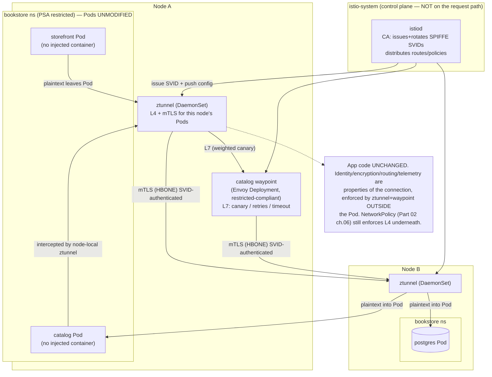

# 04 — Service mesh

> The infrastructure layer that gives **every** service-to-service call
> mTLS-by-default cryptographic identity (SPIFFE/SPIRE — the workload-identity
> gap [Part 05 ch.01](../05-security/01-authn-authz-rbac.md) left open), L7
> traffic management (canary/mirror/retry/timeout/outlier-detection/circuit-
> breaking), and golden-signal observability **without changing application
> code** — the three data-plane models (**sidecar** vs **Istio ambient**
> ztunnel+waypoint vs **Linkerd** micro-proxy), the control plane, how mesh
> **east-west** routing differs from and complements **Gateway API**
> north-south ([Part 02 ch.05](../02-networking/05-gateway-api.md), GAMMA), the
> cost/complexity/**when-NOT**, and the **sidecar-injection-vs-PSA-restricted
> footgun** — applied by meshing the Bookstore with **Istio ambient**, turning
> on strict mTLS for `bookstore`, and running a mesh-layer `catalog` canary
> (contrasted with the Part 07 ch.05 Argo Rollouts replica-ratio canary).

**Estimated time:** ~60 min read · ~120 min hands-on
**Prerequisites:** [Part 02 ch.06](../02-networking/06-network-policies.md) — L3/L4 segmentation the mesh complements at L7 · [Part 05 ch.01](../05-security/01-authn-authz-rbac.md) — workload-identity gap mTLS fills · [Part 02 ch.05](../02-networking/05-gateway-api.md) — Gateway API the mesh interoperates with
**You'll know after this:** • compare sidecar / Istio ambient / Linkerd data-plane models · • turn on strict mTLS for a namespace and verify the cryptographic identity · • run a mesh-layer canary and contrast it with an Argo Rollouts replica-ratio canary · • avoid the sidecar-injection-vs-PSA-restricted footgun · • justify when NOT to adopt a mesh

<!-- tags: networking, security, istio, platform-engineering -->

## Why this exists

By [Part 02 ch.06](../02-networking/06-network-policies.md) the Bookstore had a
default-deny NetworkPolicy: L3/L4 segmentation, who-may-connect-to-whom by
label. By [Part 05 ch.01](../05-security/01-authn-authz-rbac.md) it had RBAC
and per-service ServiceAccounts — but that chapter ended on an explicit gap:
**a NetworkPolicy proves a packet came from a Pod with label `app: catalog`;
it does not cryptographically prove the *workload identity* of the caller, and
nothing encrypts catalog→postgres on the wire.** A compromised Pod that
acquires the right label, or anyone who can sniff the pod network inside an
allowed edge, defeats L3/L4 alone. [Part 02 ch.06](../02-networking/06-network-policies.md)'s
own Production note said it: *"NetworkPolicy is L3/L4 only — identity-aware/L7
authz needs a mesh."* This chapter is that mesh.

A **service mesh** is an infrastructure layer that intercepts every
service-to-service connection and, **without any application code change**,
adds three things the app would otherwise each have to build itself, badly,
and inconsistently:

1. **Identity + encryption by default.** Every workload gets a cryptographic
   identity (a **SPIFFE** SVID — `spiffe://<TRUST-DOMAIN>/ns/bookstore/sa/<SA>`)
   and every call is **mutual TLS**, issued and rotated automatically. This is
   the **SPIFFE/SPIRE workload-identity** model [Part 05 ch.01](../05-security/01-authn-authz-rbac.md)
   pointed at: identity that is *proven*, not *asserted by a label*.
2. **L7 traffic management.** Weighted canaries, request mirroring, retries,
   timeouts, outlier detection (passive health), circuit breaking — as data,
   not as code in every service. This is the *traffic primitive* that
   [Part 07 ch.05](../07-delivery/05-progressive-delivery.md)'s progressive
   delivery actuates.
3. **Golden-signal observability for free.** Because the proxy is on the path
   of every request, it emits consistent rate/error/latency metrics and
   distributed-trace spans for traffic the app never instrumented — the
   data-plane half of [Part 06 ch.01](../06-production-readiness/01-observability-metrics.md)/[ch.03](../06-production-readiness/03-tracing.md).

The honest counterweight — and this chapter teaches it as hard as the
benefits: **a mesh is not free.** It adds a control plane, a data plane on the
hot path of every call (latency + a new failure domain), operational surface,
and — in the PSA-`restricted` `bookstore` namespace — a **specific, common
outage**: sidecar injection that produces a non-restricted-compliant Pod which
PSA then rejects. Many systems do not need a mesh; NetworkPolicy + Gateway API
+ app-level retries cover a lot. You adopt a mesh when **mTLS-everywhere,
identity-aware L7, and uniform observability across many services** are
requirements you would otherwise hand-roll. The reference is *Production
Kubernetes* ch.6 (Service Routing) and ch.10 (Identity), plus the SPIFFE
project.

## Mental model

**A mesh moves the network concerns out of your code and into a proxy you
don't write: identity, encryption, retries, routing, and telemetry become
properties of the *connection*, configured as data, applied to unmodified
workloads.**

- **Data plane vs control plane.** The **data plane** is the set of proxies
  that actually carry traffic (a per-Pod sidecar, a per-node ztunnel, or a
  micro-proxy). The **control plane** (istiod / Linkerd's controller) issues
  certificates, distributes config (routes, policies), and watches the API —
  it is *not* on the request path. Mesh config is declarative CRDs; the
  control plane translates them into proxy config.
- **Three data-plane models, one job.**
  - **Sidecar** (classic Istio, the original model): an Envoy container
    **injected into every Pod**, all traffic redirected through it. Most
    powerful/per-workload, **most expensive** (a proxy per Pod), and the model
    that triggers the **PSA footgun** (the injected container must itself be
    restricted-compliant).
  - **Istio ambient** (sidecar-less, GA): a per-**node** **ztunnel**
    DaemonSet does L4 + mTLS for all Pods on that node; an optional
    per-namespace/service **waypoint** Envoy does L7. **No container is
    injected into app Pods** — the data path lives *outside* the workload, so
    a restricted namespace's Pods are unchanged. Lower overhead; L7 only where
    you deploy a waypoint.
  - **Linkerd**: a purpose-built **micro-proxy** (Rust `linkerd2-proxy`)
    injected as a sidecar — far smaller/faster than Envoy, deliberately fewer
    knobs. Same sidecar PSA consideration as Istio sidecar, but a tiny,
    security-focused proxy.
- **mTLS + SPIFFE identity.** The mesh runs its own CA. Each workload's
  ServiceAccount maps to a **SPIFFE ID**; the control plane issues a
  short-lived X.509 **SVID** for it and rotates it. A connection is
  mutually authenticated **by identity**, not by IP or label — the missing
  half of [Part 05 ch.01](../05-security/01-authn-authz-rbac.md). `STRICT`
  mTLS makes plaintext to a meshed workload simply refused.
- **East-west, not north-south.** [Part 02 ch.05](../02-networking/05-gateway-api.md)'s
  Gateway/HTTPRoute governs **north-south** traffic *entering* the cluster.
  The mesh governs **east-west** traffic *between* services *inside* it. They
  are complementary layers; **GAMMA** (Gateway API for Mesh) lets you express
  east-west routing with the *same* HTTPRoute kind, just attached to a Service
  instead of a Gateway. One model, two attachment points.
- **It complements, does not replace, NetworkPolicy.** NetworkPolicy is
  L3/L4 deny/allow enforced by the CNI ([Part 02 ch.06](../02-networking/06-network-policies.md)).
  mTLS is cryptographic identity + encryption. A mesh adds L7 authorization on
  top. Defense in depth keeps **all** of them: a NetworkPolicy still contains
  a popped Pod at L4 even if mesh policy is misconfigured.

The trap to keep in view: **the data plane is on the hot path of every call
and is a new failure domain, and in a PSA-`restricted` namespace a naive
sidecar install is a self-inflicted outage.** "Just add a mesh" is rarely
just. Pick the lowest-overhead model that meets the requirement (often
ambient), roll mTLS out `PERMISSIVE`→`STRICT`, and make absolutely sure
anything injected into `bookstore` is restricted-compliant.

## Diagrams

### Diagram A — data path + control plane + mTLS (Istio ambient, the Bookstore's choice) (Mermaid)



### Diagram B — sidecar vs ambient vs Linkerd, and mesh vs Gateway API (ASCII)

```
 DATA-PLANE MODEL — pick the lowest overhead that meets the requirement ─────

  SIDECAR (classic Istio)      AMBIENT (Istio, GA)        LINKERD
  ┌────────────────────┐       ┌────────────────────┐     ┌──────────────────┐
  │ Pod                │       │ Pod  (UNMODIFIED)  │     │ Pod              │
  │  app + envoy ◄─inj │       │  app               │     │  app + µproxy◄inj│
  └────────────────────┘       └────────────────────┘     └──────────────────┘
  proxy PER POD                per-NODE ztunnel (L4)       Rust µproxy PER POD
  most knobs, most cost        + per-svc waypoint (L7)     tiny/fast, fewer knobs
  ► PSA FOOTGUN (injected      no injected container ►      ► same sidecar PSA
    container must be            NO PSA footgun for           consideration as
    restricted-compliant)        app Pods  ◄═ Bookstore       Istio sidecar
                                 picks THIS

  NORTH-SOUTH vs EAST-WEST  (they COMPLEMENT — keep both)
  ───────────────────────────────────────────────────────────────────────────
   Gateway API (Part 02 ch.05)         Service mesh (this chapter)
   GatewayClass→Gateway→HTTPRoute      PeerAuthentication + HTTPRoute(GAMMA)/
   parentRef = a GATEWAY               VirtualService ; parentRef = a SERVICE
   traffic ENTERING the cluster        traffic BETWEEN services inside it
   TLS termination at the edge         mTLS on EVERY hop, by identity (SPIFFE)
   ── GAMMA unifies the spelling: SAME HTTPRoute kind, Gateway vs Service ──

  WHEN **NOT** to add a mesh: few services; NetworkPolicy + Gateway API +
  app-level retries already suffice; you can't run/operate the control plane;
  the latency/again-failure-domain cost outweighs uniform mTLS/L7/telemetry.
```

## Hands-on with the Bookstore

**Assumed working directory: the guide repo root (`full-guide/`).** This
chapter adds the **new** [`examples/bookstore/mesh/`](../examples/bookstore/mesh/)
tree and meshes the running Bookstore. It does **not** modify any canonical
manifest, Helm chart, Kustomize overlay, or other `examples/bookstore/**`
file — the namespace enrollment is a `kubectl label` *patch* on the existing
`00-namespace.yaml`, never a redefinition (same additive discipline as the
Gateway-vs-Ingress and operator precedents).

We will: (0) self-bootstrap the Bookstore; (1) install **Istio ambient** via
pinned Helm and justify the choice; (2) enroll `bookstore` and turn on
**strict mTLS**, proving identity is cryptographic; (3) run a **mesh-layer
canary** on `catalog` and contrast it with the Part 07 ch.05 replica-ratio
canary; (4) confront the **sidecar-injection-vs-PSA footgun** explicitly.

> **The honest setup story (read first).** A mesh genuinely needs a control
> plane installed — there is no zero-setup path. Everything here is **fully
> reproducible on a single kind cluster** (ambient works on kind), it is just
> not zero-install. Every manifest dry-run runs with **no cluster**; the mesh
> *behaviour* needs the Istio install below. Non-reproducible bits are marked.

### 0. Prerequisites — the running Bookstore (self-bootstrapping)

Identical self-bootstrap to the prior chapters (the four `bookstore/*:dev`
images `kind load`ed; Istio installs into its **own** `istio-system`, never
`bookstore`):

```sh
kind delete cluster --name bookstore 2>/dev/null || true
kind create cluster --name bookstore
cd examples/bookstore/app
for s in catalog orders payments-worker storefront; do docker build -t bookstore/$s:dev ./$s; done
cd ../../..
for s in catalog orders payments-worker storefront; do kind load docker-image bookstore/$s:dev --name bookstore; done

kubectl apply -f examples/bookstore/raw-manifests/00-namespace.yaml
kubectl apply -f examples/bookstore/raw-manifests/05-serviceaccounts-rbac.yaml
kubectl apply -f examples/bookstore/raw-manifests/15-catalog-config.yaml
kubectl apply -f examples/bookstore/raw-manifests/16-db-credentials.yaml
kubectl apply -f examples/bookstore/raw-manifests/35-priorityclasses.yaml
kubectl apply -f examples/bookstore/raw-manifests/20-postgres-statefulset.yaml
kubectl rollout status statefulset/postgres -n bookstore
kubectl apply -f examples/bookstore/raw-manifests/10-catalog-deploy.yaml
kubectl apply -f examples/bookstore/raw-manifests/11-storefront-deploy.yaml
kubectl apply -f examples/bookstore/raw-manifests/14-orders-deploy.yaml
kubectl apply -f examples/bookstore/raw-manifests/40-services.yaml
kubectl apply -f examples/bookstore/raw-manifests/21-db-migrate-job.yaml
kubectl wait --for=condition=complete job/db-migrate -n bookstore --timeout=120s
kubectl rollout status deployment/catalog -n bookstore
```

### 1. Install Istio ambient (pinned Helm) — and why ambient

**Why Istio ambient over sidecar Istio or Linkerd for *this* app:** the
`bookstore` namespace is `pod-security.kubernetes.io/enforce: restricted`
([Part 05 ch.02](../05-security/02-pod-security.md)). Sidecar meshes mutate
every Pod to add a proxy container — which **must** then be
restricted-compliant or PSA rejects the Pod (the footgun, step 4). **Ambient
injects nothing into app Pods**: a per-node `ztunnel` DaemonSet and an
optional per-service `waypoint` carry the data path *outside* the workload, in
`istio-system`/their own namespace — so enrolling a restricted namespace
leaves every Bookstore Pod byte-for-byte unchanged and PSA-clean. That is the
decisive reason here. (Linkerd is an excellent, smaller sidecar mesh; it has
the same restricted-namespace sidecar consideration as Istio sidecar — covered
in step 4. The decision is Diagram B.)

Install via the **pinned Helm charts** — per this guide's rule, **never**
`kubectl apply -f .../releases/latest/download/<PINNED-FILE>.yaml` (it 404s
when a new release ships; same precedent as the Kyverno/KEDA/Argo CD/cert-
manager installs):

```sh
ISTIO_CHART_VERSION=1.24.2          # istio Helm charts (pin)
helm repo add istio https://istio-release.storage.googleapis.com/charts
helm repo update

# 1. base (CRDs + cluster roles), 2. istiod (control plane), 3. CNI
#    (sets up ambient redirection), 4. ztunnel (the per-node L4/mTLS proxy):
helm install istio-base istio/base -n istio-system --create-namespace \
  --version "$ISTIO_CHART_VERSION" --set defaultRevision=default --wait
helm install istiod istio/istiod -n istio-system \
  --version "$ISTIO_CHART_VERSION" --set profile=ambient --wait
helm install istio-cni istio/cni -n istio-system \
  --version "$ISTIO_CHART_VERSION" --set profile=ambient --wait
helm install ztunnel istio/ztunnel -n istio-system \
  --version "$ISTIO_CHART_VERSION" --wait

kubectl -n istio-system get pods       # istiod + istio-cni-node + ztunnel
# Gateway API CRDs are needed for waypoints + GAMMA routes (Part 02 ch.05):
kubectl get crd gateways.gateway.networking.k8s.io >/dev/null 2>&1 || \
  kubectl apply -f \
  https://github.com/kubernetes-sigs/gateway-api/releases/download/v1.2.0/standard-install.yaml
```

Installing Istio created the `istio.io` CRDs (`PeerAuthentication`,
`VirtualService`, `DestinationRule`, …). **This is what makes the mesh
manifests dry-runnable** — before this, a client dry-run of them prints `no
matches for kind "PeerAuthentication"` (the documented CRD-intrinsic
behaviour; step 4 / each file header — exact precedent of
`raw-manifests/70-`/`83-`/`51-`/`argocd/`).

### 2. Enroll `bookstore`, turn on strict mTLS, prove identity is cryptographic

Enroll the namespace into the ambient data plane. This is a **label patch on
the existing canonical namespace**, *not* a re-apply of a Namespace object
([`mesh/00-ambient-enroll.yaml`](../examples/bookstore/mesh/00-ambient-enroll.yaml)
documents exactly why `kubectl apply -f` it would be wrong — it would strip
the canonical PSA/quota labels):

```sh
kubectl label namespace bookstore istio.io/dataplane-mode=ambient
# Pods are NOT restarted and NOT mutated — ambient enrollment is transparent.
kubectl get pods -n bookstore        # same Pods, same age, NO extra container
kubectl get pod -n bookstore -l app=catalog \
  -o jsonpath='{.items[0].spec.containers[*].name}'; echo
#   → catalog        (ONE container — no istio-proxy injected. The PSA footgun
#                      simply does not arise in ambient: nothing was mutated.)
```

Now enforce **strict mTLS** for the whole namespace with
[`mesh/10-peerauthentication-strict-mtls.yaml`](../examples/bookstore/mesh/10-peerauthentication-strict-mtls.yaml)
(its header documents the CRD-intrinsic dry-run and the `PERMISSIVE`→`STRICT`
rollout — the same Audit→Enforce lifecycle as [Part 05 ch.03](../05-security/03-supply-chain.md)
and the [ch.01](01-admission-webhooks.md) webhook Ignore→Fail):

```sh
kubectl apply -f examples/bookstore/mesh/10-peerauthentication-strict-mtls.yaml
kubectl get peerauthentication -n bookstore
# Every catalog↔postgres / storefront↔catalog call is now mTLS, by SPIFFE
# identity, with ZERO change to app/*/main.go. Inspect the identity istiod
# issued for the catalog ServiceAccount:
istioctl proxy-config secret \
  $(kubectl get pod -n bookstore -l app=catalog -o jsonpath='{.items[0].metadata.name}') \
  -n bookstore 2>/dev/null | head -5 || \
  echo "(istioctl optional; mTLS still enforced by ztunnel — verify in step below)"
```

**Prove the identity is cryptographic, not label-based** — the gap
[Part 05 ch.01](../05-security/01-authn-authz-rbac.md) named. A NetworkPolicy
would let *any* Pod labelled `app: catalog` talk to postgres; with `STRICT`
mTLS, a Pod with the right label but **no mesh identity** (one that bypasses
ztunnel) is refused at the cryptographic layer. The Bookstore's
catalog→postgres path keeps working because catalog has a real SPIFFE SVID;
the label alone is no longer sufficient.

### 3. A mesh-layer canary on `catalog` — contrast the Part 07 ch.05 canary

The Bookstore already learned a canary in [Part 07 ch.05](../07-delivery/05-progressive-delivery.md):
**Argo Rollouts shifts the *replica ratio*** (a second ReplicaSet, N% of
*Pods*). A **mesh canary shifts the *request ratio*** between two stable
Services regardless of replica counts — 10% means 10% of *requests*, not "1
Pod in 10". Deploy the **additive** v2 `catalog` Deployment + `catalog-canary`
Service ([`mesh/05-catalog-v2-deploy.yaml`](../examples/bookstore/mesh/05-catalog-v2-deploy.yaml)
— the canonical `10-catalog-deploy.yaml`/`40-services.yaml` are untouched),
deploy a waypoint so `catalog` has an L7 enforcement point in ambient, then
apply the GAMMA route:

```sh
# Additive v2 backend for the demo. NOTE: `bookstore` enforces PSA
# `restricted`, so a bare `kubectl create deployment` (no securityContext)
# would have its Pods REJECTED — the chapter's own footgun, self-inflicted.
# 05- carries the SAME restricted securityContext as the canonical catalog
# (10-) so it admits; same kind-loaded bookstore/catalog:dev image (step 0):
kubectl apply -f examples/bookstore/mesh/05-catalog-v2-deploy.yaml
kubectl rollout status deployment/catalog-v2 -n bookstore

# L7 in ambient needs a waypoint for `catalog` (restricted-compliant by
# default — step 4 explains why that matters here). Ambient waypoint scoping
# is TWO parts: the waypoint Gateway carries `istio.io/waypoint-for: service`
# (set in 30-), and the target Service opts in with `istio.io/use-waypoint`
# (least blast radius: ONLY catalog is waypointed, not the whole namespace):
kubectl apply -f examples/bookstore/mesh/30-waypoint.yaml
kubectl wait --for=condition=Programmed gateway/catalog-waypoint -n bookstore --timeout=120s
kubectl label service catalog -n bookstore istio.io/use-waypoint=catalog-waypoint

# The 90/10 GAMMA split (HTTPRoute parentRef = the catalog SERVICE):
kubectl apply -f examples/bookstore/mesh/20-catalog-canary-httproute.yaml
kubectl get httproute catalog-mesh-canary -n bookstore \
  -o jsonpath='{.status.parents[*].conditions[*].type}{"\n"}'   # Accepted/ResolvedRefs
```

Drive in-mesh traffic and watch ~10% land on v2 — request-proportional, no
Deployment scaled:

```sh
# An ephemeral, restricted-compliant in-mesh client (ns is PSA restricted;
# never exec the distroless catalog Pod — Part 03 ch.02 discipline):
for i in $(seq 1 50); do
  kubectl run hit-$i -n bookstore --image=curlimages/curl:8.9.1 --restart=Never -i --rm \
    --overrides='{"apiVersion":"v1","spec":{"securityContext":{"runAsNonRoot":true,"runAsUser":65532,"seccompProfile":{"type":"RuntimeDefault"}},"containers":[{"name":"c","image":"curlimages/curl:8.9.1","securityContext":{"allowPrivilegeEscalation":false,"capabilities":{"drop":["ALL"]},"readOnlyRootFilesystem":true},"command":["curl","-s","--max-time","3","http://catalog.bookstore.svc.cluster.local/healthz"]}]}}' \
    >/dev/null 2>&1
done
# ~45 of 50 served by catalog (v1), ~5 by catalog-v2 — REQUEST-proportional.
# Argo Rollouts (Part 07 ch.05) would instead change how many PODS are v2.
# In production the weights are stepped progressively and gated on the catalog
# SLO (raw-manifests/81-prometheusrule.yaml: CatalogHighErrorRate / P95).
```

Use the Istio-native form
([`mesh/21-catalog-canary-virtualservice.yaml`](../examples/bookstore/mesh/21-catalog-canary-virtualservice.yaml))
**instead of** `20-` (apply one, not both — same "alternative, not addition"
rule as `50-ingress`/`51-gateway`) when you also want mesh-native **retries,
timeouts, and outlier detection / circuit breaking** in one place; that file's
`DestinationRule` carries exactly those L7 resilience knobs.

### 4. The sidecar-injection-vs-PSA-restricted footgun (the core lesson)

This is the single most important operational point in the chapter, and the
reason the Bookstore uses ambient. [`mesh/10-sidecar-mode-podtemplate.yaml`](../examples/bookstore/mesh/10-sidecar-mode-podtemplate.yaml)
is a teaching artifact — a Pod showing the restricted-compliant shape an
**injected** istio-proxy sidecar *must* have:

```sh
# This Pod's "istio-proxy" container carries the FULL restricted
# securityContext (runAsNonRoot, UID 1337, drop ALL, seccomp RuntimeDefault).
# Because it is compliant, PSA ADMITS it into the restricted bookstore ns:
kubectl apply -f examples/bookstore/mesh/10-sidecar-mode-podtemplate.yaml
kubectl get pod mesh-sidecar-shape -n bookstore        # Running

# Now break it the way a misconfigured sidecar mesh does — drop ONE
# restricted field from the proxy container and PSA rejects the WHOLE Pod:
kubectl delete pod mesh-sidecar-shape -n bookstore
kubectl run psa-reject -n bookstore --image=registry.k8s.io/pause:3.9 \
  --overrides='{"spec":{"containers":[{"name":"istio-proxy","image":"registry.k8s.io/pause:3.9","securityContext":{"allowPrivilegeEscalation":true}}]}}'
# Error from server (Forbidden): pods "psa-reject" is forbidden: violates
#   PodSecurity "restricted:latest": allowPrivilegeEscalation != false ...
#   ↑ THIS is what a sidecar mesh whose injection template emits a
#     non-compliant proxy does to EVERY Pod in a restricted namespace:
#     the app never runs. "I enabled the mesh and my hardened namespace
#     stopped scheduling" — a textbook incident.
```

The fixes, in preference order (all in the file header): **(1) ambient** — no
injected container, the footgun cannot arise (the Bookstore's choice; verified
in step 2 — the catalog Pod has exactly one container); **(2) the Istio CNI
plugin** — removes the privileged `istio-init` container so only the
restricted-compliant `istio-proxy` remains, the supported way to run *sidecar*
mode in a restricted namespace; **(3)** ensure the injection template emits
the exact restricted `securityContext` and **verify it** — never assume. The
waypoint Istio deploys *into* `bookstore` (step 3) is itself
restricted-compliant by default for the same reason — confirm it:

```sh
kubectl get pod -n bookstore \
  -l gateway.networking.k8s.io/gateway-name=catalog-waypoint \
  -o jsonpath='{.items[0].spec.containers[0].securityContext}'; echo
#   → runAsNonRoot:true, drop:["ALL"], seccompProfile RuntimeDefault — a
#     restricted-compliant Envoy. An injected component landing in `bookstore`
#     MUST look like this or PSA refuses it.
```

Clean up:

```sh
kubectl delete -f examples/bookstore/mesh/20-catalog-canary-httproute.yaml --ignore-not-found
kubectl label service catalog -n bookstore istio.io/use-waypoint-   # un-enroll from waypoint
kubectl delete -f examples/bookstore/mesh/30-waypoint.yaml --ignore-not-found
kubectl delete -f examples/bookstore/mesh/10-peerauthentication-strict-mtls.yaml --ignore-not-found
kubectl delete -f examples/bookstore/mesh/05-catalog-v2-deploy.yaml --ignore-not-found
kubectl label namespace bookstore istio.io/dataplane-mode-      # un-enroll
helm uninstall ztunnel istio-cni istiod istio-base -n istio-system
kind delete cluster --name bookstore
```

## How it works under the hood

- **The data plane intercepts the connection; the control plane never sees the
  request.** In **sidecar** Istio an init container programs iptables so all
  Pod traffic is redirected through the in-Pod Envoy; in **ambient** the Istio
  CNI redirects the node's Pod traffic to the per-node **ztunnel** (L4 + mTLS
  over the HBONE tunnel protocol), and a **waypoint** Envoy is inserted only
  where L7 is needed. **Linkerd** injects its Rust micro-proxy as a sidecar.
  In every model the application socket is unchanged — the proxy terminates
  and re-originates the connection. `istiod`/the Linkerd controller only
  *configures* proxies and *issues certs*; it is off the request path, so a
  control-plane outage degrades config changes, not in-flight traffic
  (existing certs/config keep working until expiry).
- **mTLS and SPIFFE identity.** Each ServiceAccount maps to a **SPIFFE ID**
  (`spiffe://<TRUST-DOMAIN>/ns/<NS>/sa/<SA>`). The mesh CA (istiod, or an
  external SPIRE / cert-manager issuer) signs a short-lived X.509 **SVID** for
  the workload; the proxy presents it on every connection and validates the
  peer's. `PeerAuthentication: STRICT` makes a proxy **refuse** any non-mTLS
  connection; `PERMISSIVE` accepts both (the migration mode). This is the
  cryptographic workload identity [Part 05 ch.01](../05-security/01-authn-authz-rbac.md)
  pointed at — proven by a rotating certificate chained to the mesh CA, not
  asserted by a Pod label a compromised neighbour could also carry. Authorization
  policies (Istio `AuthorizationPolicy`) then allow/deny **by SPIFFE identity**
  at L7 — identity-aware authz NetworkPolicy's L3/L4 model cannot express.
- **L7 traffic management is proxy config compiled from CRDs.** A weighted
  route, a timeout, `retryOn: 5xx`, outlier detection (eject a Pod after N
  consecutive 5xx — passive health / circuit breaking), connection-pool caps
  (bound concurrency = the circuit-breaker input) are declared as
  `VirtualService`/`DestinationRule` or, portably, **Gateway API GAMMA**
  HTTPRoute. The control plane translates them to Envoy/ztunnel config and
  pushes them; the proxy enforces them per request. None of it is in the
  application — which is exactly why a mesh canary is *request-proportional*
  and independent of replica count, unlike the Argo Rollouts replica-ratio
  canary ([Part 07 ch.05](../07-delivery/05-progressive-delivery.md)) — and
  why progressive delivery *drives* these weights rather than reimplementing
  them.
- **East-west vs north-south, unified by GAMMA.** [Part 02 ch.05](../02-networking/05-gateway-api.md)'s
  HTTPRoute with `parentRefs` → a **Gateway** is north-south (ingress).
  **GAMMA** is the same `HTTPRoute` kind with `parentRefs` → a **Service** —
  east-west, in-mesh. Same schema, same conditions (`Accepted`/`ResolvedRefs`),
  different attachment point: the mesh implements the Service-attached route,
  the ingress controller the Gateway-attached one. They stack — north-south
  TLS terminates at the edge Gateway, then every internal hop is mesh mTLS.
- **Observability comes from the proxy being on the path.** Because every
  request traverses a proxy, the mesh emits uniform RED metrics (request
  rate, error rate, duration histograms) and propagates/generates
  distributed-trace spans for traffic the app never instrumented — the
  data-plane complement to [Part 06 ch.01](../06-production-readiness/01-observability-metrics.md)/[ch.03](../06-production-readiness/03-tracing.md).
  (The app must still forward trace-context headers for end-to-end traces; the
  mesh gives you the hop spans and the golden signals for free.)
- **The PSA-restricted footgun, mechanically.** Sidecar injection is a
  **mutating admission webhook** ([ch.01](01-admission-webhooks.md)): it
  rewrites the Pod to add `istio-proxy` (and classically an `istio-init` that
  needs `NET_ADMIN`/`NET_RAW`). PSA validates the **final, mutated** Pod
  (mutate-before-validate, [ch.01](01-admission-webhooks.md)). In a
  `restricted` namespace, an injected container lacking `runAsNonRoot` /
  non-root UID / `drop: ["ALL"]` / `seccompProfile: RuntimeDefault`, or an
  init container needing `NET_ADMIN`, makes PSA **reject the whole Pod** — the
  app never runs. Ambient sidesteps this by not injecting anything into app
  Pods (the data path is the node ztunnel + an out-of-Pod waypoint, both
  restricted-compliant); the Istio CNI plugin sidesteps the `istio-init` part
  for sidecar mode. This is *the* reason data-plane model choice and PSA
  interact, and why this guide meshes the restricted Bookstore with ambient.

## Production notes

> **In production: a mesh is a commitment, not a feature toggle — adopt it
> only when mTLS-everywhere + identity-aware L7 + uniform telemetry are
> requirements you'd otherwise hand-roll.** It adds a control plane to
> operate, a data plane on every request's hot path (latency + a new failure
> domain), and version-skew/upgrade surface. For a handful of services,
> NetworkPolicy ([Part 02 ch.06](../02-networking/06-network-policies.md)) +
> Gateway API + app-level retries may be enough. When you do adopt one, prefer
> the **lowest-overhead model that meets the requirement** — ambient or
> Linkerd over classic per-Pod sidecars unless you need per-workload Envoy.

> **In production: roll mTLS out `PERMISSIVE` → verify 100% → `STRICT`, never
> straight to `STRICT`.** A namespace-wide `STRICT` PeerAuthentication
> instantly refuses any not-yet-meshed client — the exact analog of
> [Part 05 ch.03](../05-security/03-supply-chain.md)'s Audit→Enforce and
> [ch.01](01-admission-webhooks.md)'s webhook Ignore→Fail. Run `PERMISSIVE`,
> confirm telemetry shows all traffic already mTLS, then flip. Keep
> NetworkPolicy underneath: a mesh-policy mistake should still hit an L4
> deny-by-default, not an open network.

> **In production: in a PSA-`restricted` namespace, the injected data plane
> must be restricted-compliant — verify it, don't assume.** A sidecar mesh
> whose injection template emits a non-compliant proxy (or a privileged
> `istio-init`) makes PSA reject **every** Pod in the namespace — a
> self-inflicted, cluster-visible outage. Use **ambient** (no injection) or
> the **Istio CNI plugin** (drops the privileged init container) for
> restricted namespaces, pin the injection template, and add an admission/CI
> check that meshed Pods still satisfy `restricted`
> ([Part 05 ch.02](../05-security/02-pod-security.md), [ch.01](01-admission-webhooks.md)).

> **In production: run the control plane HA and treat data-plane upgrades like
> app rollouts.** istiod/Linkerd-controller with ≥2 replicas + a PDB
> ([Part 06 ch.05](../06-production-readiness/05-reliability-and-disruptions.md));
> a control-plane outage blocks config/cert issuance (and eventually traffic
> when SVIDs expire), so monitor cert age and control-plane health. Mesh
> upgrades have **data-plane/control-plane version skew** rules — use revisioned
> installs (Istio revisions / Linkerd's staged upgrade) and roll the data
> plane behind the control plane, canarying on the app SLOs.

> **In production (managed — EKS/GKE/AKS):** managed mesh options exist —
> **GKE** ships managed Anthos Service Mesh / managed Istio; **EKS**
> integrates Istio/Linkerd/App Mesh-successors; cloud CNIs (Cilium with its
> own mesh, AWS VPC CNI) interact with mesh redirection. The mesh **CRDs and
> policies are portable**; the install/managed-control-plane and CNI
> integration are provider-specific. Multi-cluster mesh (shared trust domain,
> cross-cluster service discovery) is the natural next step —
> [ch.06](06-multi-cluster-and-fleet.md) covers the fleet side.

## Quick Reference

```sh
# Install Istio AMBIENT (PINNED Helm charts — never releases/latest/download URL)
helm repo add istio https://istio-release.storage.googleapis.com/charts && helm repo update
helm install istio-base istio/base -n istio-system --create-namespace --version 1.24.2 --wait
helm install istiod istio/istiod -n istio-system --version 1.24.2 --set profile=ambient --wait
helm install istio-cni istio/cni -n istio-system --version 1.24.2 --set profile=ambient --wait
helm install ztunnel istio/ztunnel -n istio-system --version 1.24.2 --wait

# Enroll a namespace (LABEL PATCH on the existing ns — never re-apply the ns object)
kubectl label namespace bookstore istio.io/dataplane-mode=ambient
kubectl get pod -n bookstore -l app=catalog -o jsonpath='{.items[0].spec.containers[*].name}'  # no proxy injected

# mTLS + L7 routing (CRD-backed → dry-run shows "no matches" until Istio installed)
kubectl apply -f examples/bookstore/mesh/10-peerauthentication-strict-mtls.yaml   # PERMISSIVE first in prod, verify, THEN STRICT (see Production notes)
kubectl apply -f examples/bookstore/mesh/30-waypoint.yaml                          # L7 for catalog
kubectl apply -f examples/bookstore/mesh/20-catalog-canary-httproute.yaml          # GAMMA canary
kubectl get peerauthentication,httproute,gateway -n bookstore
# AMBIENT: app Pods have NO Envoy sidecar — SVIDs live in ztunnel, so query
# the ztunnel Pod (in istio-system), NOT the app Pod, for the SPIFFE SVID:
istioctl proxy-config secret <ZTUNNEL-POD> -n istio-system   # <POD> = the ztunnel Pod, not the app Pod
```

Minimal skeletons (full files in `examples/bookstore/mesh/`):

```yaml
# Strict mTLS, namespace-wide — roll out PERMISSIVE → STRICT
apiVersion: security.istio.io/v1
kind: PeerAuthentication
metadata: { name: strict, namespace: <NS> }      # CRD — needs Istio installed
spec: { mtls: { mode: STRICT } }                 # PERMISSIVE first in production
---
# Mesh (east-west) canary — GAMMA: HTTPRoute parentRef = a SERVICE
apiVersion: gateway.networking.k8s.io/v1
kind: HTTPRoute
metadata: { name: canary, namespace: <NS> }      # CRD — needs Gateway API + GAMMA mesh
spec:
  parentRefs: [ { group: "", kind: Service, name: <SVC>, port: 80 } ]
  rules:
    - backendRefs:
        - { group: "", kind: Service, name: <SVC>,        port: 80, weight: 90 }
        - { group: "", kind: Service, name: <SVC>-canary, port: 80, weight: 10 }
```

Checklist:

- [ ] Mesh adopted because **mTLS-everywhere / identity-aware L7 / uniform
      telemetry** is a requirement — not by default; **when-NOT** considered
- [ ] **Data-plane model** chosen deliberately: ambient/Linkerd over classic
      sidecar unless per-Pod Envoy is needed; **ambient for PSA-restricted ns**
- [ ] System components in **`istio-system`/own ns**, never `bookstore`;
      anything injected/deployed into `bookstore` is **restricted-compliant**
- [ ] mTLS rolled **`PERMISSIVE` → verify 100% → `STRICT`**; NetworkPolicy
      ([Part 02 ch.06](../02-networking/06-network-policies.md)) kept underneath
- [ ] Mesh **east-west** routing understood vs **Gateway API north-south**
      ([Part 02 ch.05](../02-networking/05-gateway-api.md)); GAMMA where portable
- [ ] Mesh canary (request-ratio) vs Argo Rollouts canary (replica-ratio,
      [Part 07 ch.05](../07-delivery/05-progressive-delivery.md)) understood;
      weights gated on the catalog SLO ([Part 06 ch.05](../06-production-readiness/05-reliability-and-disruptions.md))
- [ ] Control plane **HA + PDB**; cert age & skew monitored; install via
      **pinned Helm**; every CRD manifest carries the **CRD-intrinsic** note

## Test your understanding

> Try each before opening the answer drawer. The act of trying is the exercise; the answer is the check.

1. **What does a service mesh give you that NetworkPolicy + JWT-in-app cannot?**
   <details><summary>Show answer</summary>

   Cryptographic workload identity (SPIFFE SVIDs) bound to the ServiceAccount, automatically rotated mTLS without app code changes, L7 traffic management (retries, timeouts, circuit breakers, outlier detection, request-ratio canary), golden-signal observability per service-to-service edge, and policy at the L7 level (HTTP path + method + header). NetworkPolicy is L3/L4 and can't see the JWT in the request; JWT-in-app is per-service work that doesn't compose with traffic management. The mesh adds these without per-service code.

   </details>

2. **You install Istio with automatic sidecar injection enabled on the `bookstore` namespace, but the namespace has PSA-restricted set. Pods fail to start with "init container istio-init not allowed." What's happening and what are your options?**
   <details><summary>Show answer</summary>

   The `istio-init` init container needs `NET_ADMIN` and `NET_RAW` capabilities to set up iptables for traffic redirection. PSA-restricted forbids these capabilities. Options: (a) switch to Istio CNI mode — the cluster-wide CNI plugin installs the iptables rules once per node so the init container is not needed; (b) switch to **Istio ambient mode** — no sidecar at all, ztunnel handles L4 mTLS at the node, optional waypoint Pods handle L7; (c) downgrade the namespace to `baseline` (acceptable for the mesh control plane's own namespace but not for tenant namespaces). Ambient is the cleanest answer because it removes the sidecar-vs-PSA tension entirely.

   </details>

3. **Compare mesh request-ratio canary against Argo Rollouts replica-ratio canary. When is each the right tool?**
   <details><summary>Show answer</summary>

   Mesh canary (VirtualService traffic weights, Istio `DestinationRule` subsets) splits *requests* — you can run 5% traffic to v2 with the same Pod count as v1. It is the right tool when traffic shaping is the variable (sticky session by header, geographic routing, header-based routing). Argo Rollouts replica-ratio splits by Pod count — 19 v1 Pods + 1 v2 Pod gives ~5% traffic on a round-robin Service. Replica-ratio is the right tool when you want concrete resource-level rollback (k8s native), simpler ops without a mesh, or when you want HPA to interact cleanly with the canary. In a mesh-using shop, the two compose: Rollouts uses VirtualService analytics templates to gate progression on SLO. See [Part 07 ch.05](../07-delivery/05-progressive-delivery.md).

   </details>

4. **`storefront → catalog` calls are intermittently returning 503 after meshing. `kubectl get peerauthentication` shows `STRICT` mTLS. What three failure modes do you check?**
   <details><summary>Show answer</summary>

   (1) Is `catalog` actually meshed? If a Pod is unmeshed (no sidecar, no ztunnel waypoint), STRICT mTLS in the destination namespace will reject plain-text traffic from it. (2) Are there pre-existing direct connections (long-lived gRPC streams) that pre-date the policy and aren't using mTLS? Cycle the Pods. (3) Is the destination's port not declared in the Service (mesh needs the Service port to route)? Run `istioctl analyze`. The most common cause is (1) — a workload Pod in a different namespace without sidecar injection enabled.

   </details>

5. **Hands-on: enable Istio ambient on `bookstore`, then run `curl storefront → catalog` from inside a Pod and capture the traffic with `tcpdump`. What do you see on the wire vs an unmeshed cluster?**
   <details><summary>What you should see</summary>

   Unmeshed: plain HTTP from `storefront` Pod to `catalog` ClusterIP, no encryption. With ambient: traffic from the Pod is intercepted by the node's ztunnel, encrypted with HBONE (HTTP/2 CONNECT with mTLS), tunneled to the destination node's ztunnel, then delivered plaintext to the destination Pod. `tcpdump` on the source node shows TLS-wrapped HBONE; on either Pod's loopback, plain HTTP. The mTLS layer is invisible to app code — that's the entire point.

   </details>

## Further reading

- **Rosso et al., _Production Kubernetes_, ch.6 — "Service Routing"** (where a
  mesh sits relative to ingress/Service routing and the L7 traffic-management
  concerns) **and ch.10 — "Identity"** (workload identity, the SPIFFE/SVID
  model and cloud-IAM bridging — the backbone of the mTLS-identity section).
- **Ibryam & Huß, _Kubernetes Patterns_ 2e — *Service Discovery* (ch.13)**
  for where mesh-mediated discovery/routing fits relative to Services and
  Gateway API as a pattern.
- Official: Istio ambient mesh
  <https://istio.io/latest/docs/ambient/>, Istio security / mTLS &
  PeerAuthentication
  <https://istio.io/latest/docs/concepts/security/>, Linkerd
  <https://linkerd.io/2/overview/>, the **SPIFFE** project
  <https://spiffe.io/docs/latest/spiffe-about/overview/>, and Gateway API for
  Mesh (GAMMA) <https://gateway-api.sigs.k8s.io/mesh/>.
