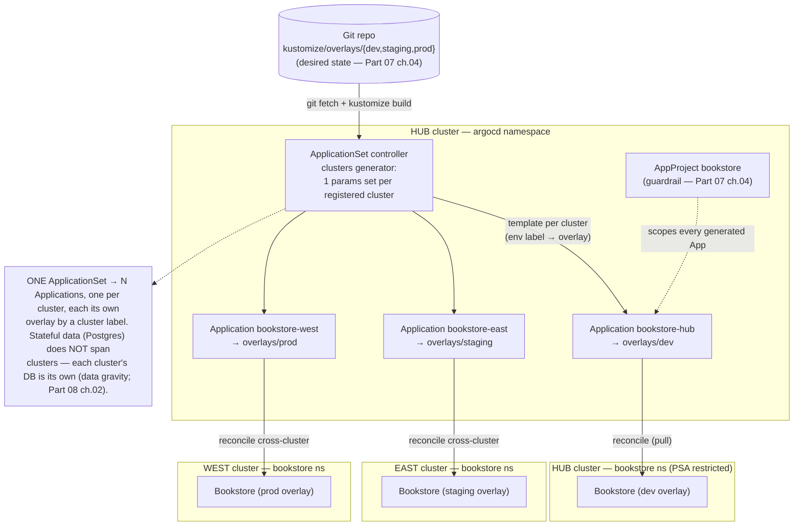

# 06 — Multi-cluster and fleet

> When **one big cluster** stops being enough (blast radius, region/latency,
> hard tenancy, regulatory) and the fleet topologies that answer it
> (per-env / per-region / per-tenant / hub-spoke); **Argo CD ApplicationSet**
> (cluster / git / matrix generators) delivering the Bookstore to N clusters
> from one object — building on [Part 07 ch.04](../07-delivery/04-gitops-argocd.md)'s
> App-of-Apps, not re-teaching it; **Karmada / Cluster API** fleet management
> as the alternative model; cross-cluster **service discovery & networking**
> (multi-cluster mesh / Submariner / the MCS API — the [ch.04](04-service-mesh.md)
> mesh, federated); **failover/DR & data gravity** (Postgres can't trivially
> span clusters — [Part 08 ch.02](../08-day-2-operations/02-backup-and-dr.md));
> fleet observability/policy — applied with **two kind clusters**, Argo CD on
> a hub, and an `ApplicationSet` that syncs the Bookstore to both with a
> per-cluster overlay.

**Estimated time:** ~60 min read · ~120 min hands-on
**Prerequisites:** [Part 07 ch.04](../07-delivery/04-gitops-argocd.md) — App-of-Apps this chapter scales to ApplicationSet · [Part 08 ch.04](../08-day-2-operations/04-multi-tenancy-and-namespaces.md) — single-cluster tenancy this chapter contrasts with · [Part 11 ch.04](04-service-mesh.md) — mesh federated for cross-cluster
**You'll know after this:** • choose between single-cluster + namespaces and a fleet for a given driver (blast / region / tenancy / regulatory) · • author an Argo CD ApplicationSet with a cluster generator to roll one config across N clusters · • compare Karmada / Cluster API / Argo CD as fleet-management models · • design cross-cluster service discovery via mesh federation or MCS API · • plan a failover where data-gravity (Postgres) gates the fleet topology

<!-- tags: multi-cluster, gitops, argo-cd, platform-engineering, dr -->

## Why this exists

Every prior part ran the Bookstore on **one cluster**. [Part 08 ch.04](../08-day-2-operations/04-multi-tenancy-and-namespaces.md)
showed how far one cluster goes with namespaces + RBAC + quotas — and that is
*correct and simpler* for most teams. But [Part 07 ch.04](../07-delivery/04-gitops-argocd.md)'s
Production notes ended on a forward reference: *"One Argo CD can manage many
clusters … an ApplicationSet with a cluster generator rolls a change
cluster-by-cluster."* And [Part 06 ch.05](../06-production-readiness/05-reliability-and-disruptions.md)/[Part
08 ch.02](../08-day-2-operations/02-backup-and-dr.md) kept circling the same
limit: **a single cluster is a single blast radius**, a single region, a
single regulatory boundary, a single control-plane upgrade that can take
*everything* down at once. This chapter is where one cluster becomes a
**fleet**.

You go multi-cluster when one of these forcing functions applies — not
before:

1. **Blast radius / availability.** A bad cluster upgrade, a corrupted etcd,
   an apiserver outage, a runaway controller — on one cluster, that is *total*
   outage. Splitting the workload across clusters bounds the damage.
2. **Region / latency / data residency.** Users (or laws) in multiple regions:
   you want a cluster close to each, and data that stays in-region.
3. **Hard tenancy / isolation.** Namespaces + RBAC are a *soft* boundary
   ([Part 08 ch.04](../08-day-2-operations/04-multi-tenancy-and-namespaces.md));
   some tenants/compliance regimes require a *hard* one — a separate cluster.
4. **Environment separation.** prod on entirely separate infrastructure from
   dev/staging, so a non-prod mistake cannot touch prod.

The honest counterweight, taught as hard as the motivation: **multi-cluster
multiplies operational cost** — N control planes to upgrade and observe,
cross-cluster service discovery and networking to solve, **data gravity**
(stateful systems like the Bookstore's Postgres *cannot* trivially span
clusters), fleet-wide policy/identity, and a delivery system that must reach
all of them safely. *One big cluster with good multi-tenancy is the right
default until a forcing function above makes it untenable.* The reference is
*Production Kubernetes* ch.2 (Deployment Models), ch.11 (Building Platform
Services), and ch.12 (Multitenancy); Argo CD Up & Running ch.10 for
ApplicationSet at scale.

## Mental model

**A fleet has two orthogonal problems: (1) the clusters' *lifecycle* (create,
upgrade, delete them) and (2) the *workloads' delivery* across them. Different
tools own each; don't conflate them.**

- **Lifecycle ≠ delivery.** **Cluster API / clusterctl** (and managed
  equivalents — EKS/GKE/AKS provisioners, [Part 10 ch.02](../10-cloud-and-managed-kubernetes/02-provisioning-and-iac.md))
  *create and upgrade the clusters themselves*. **Argo CD ApplicationSet** or
  **Karmada** *run workloads on clusters that already exist*. This chapter is
  mostly the second; it names the first.
- **ApplicationSet = a generator + a template → N Applications.** This is the
  fleet-scale evolution of [Part 07 ch.04](../07-delivery/04-gitops-argocd.md)'s
  App-of-Apps (one root → hand-written Applications). A **generator** is a
  data source — the **clusters** generator (one params set per registered
  cluster), the **git** generator (one per directory/file in the repo), the
  **list**, and the **matrix** (the product of two generators). One
  `ApplicationSet` + one template = one auto-generated `Application` per
  generated element. Add a cluster → an Application appears; no hand-editing.
- **Two fleet delivery philosophies.** **GitOps-fans-out** (ApplicationSet):
  Argo CD reconciles the *same Git* into each member cluster; each cluster
  pulls its own copy; differences via overlays. **Fleet control plane**
  (**Karmada**): you apply a workload + a `PropagationPolicy` to a *fleet
  apiserver* and it *schedules/spreads* the workload across members (replica
  division, cluster affinity, weighting, failover) — "a scheduler for
  clusters". Pick one model per workload, not both.
- **Topologies.** *Per-environment* (prod cluster ≠ staging cluster),
  *per-region* (latency/residency), *per-tenant* (hard isolation),
  *hub-spoke* (one management/hub cluster runs Argo CD/Karmada; spokes run
  workloads). They compose (per-region × per-env is a matrix).
- **What is portable, and what is not.** The *declarative manifests* (the
  Bookstore's Kustomize overlays) port to any cluster. **Stateful data does
  not** — Postgres has *data gravity*; you don't span one Postgres across
  clusters, you replicate/failover it deliberately ([Part 08 ch.02](../08-day-2-operations/02-backup-and-dr.md)).
  **Cross-cluster service discovery is not free** — a Service in cluster A is
  *not* reachable from B without a multi-cluster mesh / Submariner / the MCS
  API.

The trap to keep in view: **multi-cluster does not make the stateful problem
disappear — it sharpens it, and it adds cross-cluster networking and
fleet-wide policy as new problems.** "Just add clusters" trades one blast
radius for N control planes plus data-gravity and discovery problems you must
now solve explicitly. Adopt it for a forcing function, with the stateful tier
and the network designed first.

## Diagrams

### Diagram A — hub Argo CD → ApplicationSet → fleet reconcile (Mermaid)



### Diagram B — topologies + what's portable (ASCII)

```
 MULTI-CLUSTER TOPOLOGIES — pick for the forcing function ───────────────────

  PER-ENV            PER-REGION         PER-TENANT         HUB-SPOKE
  ┌────┐ ┌────┐      ┌────┐ ┌────┐      ┌────┐ ┌────┐      ┌─────HUB─────┐
  │dev │ │prod│      │ us │ │ eu │      │ t1 │ │ t2 │      │ Argo/Karmada│
  └────┘ └────┘      └────┘ └────┘      └────┘ └────┘      └──┬───┬───┬──┘
  prod blast-        latency &          HARD isolation     spoke spoke spoke
  isolated from      data residency     / compliance       (workloads only)
  non-prod           per region         per tenant         one mgmt plane
   (compose: per-region × per-env = a MATRIX generator — 20-)

  PORTABLE vs NOT (design the NOT first)
  ───────────────────────────────────────────────────────────────────────────
   PORTABLE  ► declarative manifests (Kustomize overlays) → any cluster
              ► Argo CD ApplicationSet / Karmada policy (the delivery layer)
   NOT       ► STATEFUL DATA — Postgres has DATA GRAVITY; replicate/failover
              ► deliberately, do NOT span one DB across clusters (Part 08 ch.02)
   NOT FREE  ► cross-cluster Service discovery → multi-cluster MESH (ch.04) /
              ► Submariner / MCS API (needs non-overlapping CIDRs + a tunnel)

  FLEET MODELS:  ApplicationSet = GitOps reconciles same repo into N clusters
                 Karmada        = fleet apiserver SCHEDULES/spreads workloads
                 Cluster API    = creates/UPGRADES the clusters (orthogonal)
```

## Hands-on with the Bookstore

**Assumed working directory: the guide repo root (`full-guide/`).** This
chapter adds the **new** [`examples/bookstore/multicluster/`](../examples/bookstore/multicluster/)
tree and operates it. It does **not** modify the Kustomize tree, the
`examples/bookstore/argocd/` tree ([Part 07 ch.04](../07-delivery/04-gitops-argocd.md)),
or any canonical file — the ApplicationSet *consumes* the existing overlays
and reuses the existing `AppProject` unchanged (the same additive discipline
as Part 07 ch.04, scaled out).

We will: (0) the honest two-cluster requirement; (1) two kind clusters + Argo
CD on a hub (building on [Part 07 ch.04](../07-delivery/04-gitops-argocd.md));
(2) register both, label them; (3) one **ApplicationSet** → the Bookstore on
both, with a **per-cluster overlay**; (4) the cross-cluster networking / data
gravity reality, honestly.

> **The honest setup story (read first).** Multi-cluster **genuinely needs ≥2
> clusters** — there is no single-cluster shortcut for "deliver to a fleet".
> The fleet **delivery** lab below is **fully reproducible with two kind
> clusters**. Cross-cluster **service discovery/networking** end-to-end needs
> a multi-cluster mesh/Submariner/MCS (non-overlapping CIDRs + a tunnel) and
> is **not** reproduced on kind here — explained conceptually, marked
> explicitly, not faked. Every manifest dry-run runs with **no cluster**;
> generators need Argo CD installed (step 1). The Argo CD GitOps basics
> (Application/sync/drift) are **assumed** from [Part 07 ch.04](../07-delivery/04-gitops-argocd.md)
> — this chapter adds only the *fleet* layer.

### 0. The two-cluster requirement (honest, reproducible)

[`multicluster/00-two-cluster-topology.yaml`](../examples/bookstore/multicluster/00-two-cluster-topology.yaml)
is a **not-applied doc carrier** (same honesty pattern as the apiserver-level
`cluster/` files): the real artifacts are the `kind` / `argocd cluster add`
commands it documents. Two clusters — a **hub** (runs Argo CD) and a member:

```sh
kind delete cluster --name bookstore-hub  2>/dev/null || true
kind delete cluster --name bookstore-east 2>/dev/null || true
kind create cluster --name bookstore-hub
kind create cluster --name bookstore-east
kubectl config get-contexts | grep bookstore   # kind-bookstore-hub / -east
```

### 1. Argo CD on the hub (pinned Helm — builds on Part 07 ch.04)

This is exactly [Part 07 ch.04](../07-delivery/04-gitops-argocd.md) step 1
(pinned Helm, own non-restricted `argocd` namespace) — **on the hub only**.
Not re-taught; just where the fleet's single pane of glass lives:

```sh
ARGOCD_CHART_VERSION=7.7.11         # argo-cd Helm chart (pin — same as Part 07 ch.04)
kubectl config use-context kind-bookstore-hub
helm repo add argo https://argoproj.github.io/argo-helm
helm repo update
kubectl create namespace argocd
helm install argocd argo/argo-cd -n argocd \
  --version "$ARGOCD_CHART_VERSION" --wait
kubectl -n argocd rollout status deploy/argocd-server
```

Installing Argo CD created the `argoproj.io` CRDs **including the
ApplicationSet controller** (bundled with the `argo-cd` chart). **This is what
makes the ApplicationSet manifests dry-runnable** — before this, a client
dry-run prints `no matches for kind "ApplicationSet"` (the documented
CRD-intrinsic behaviour; each file header — the exact precedent of
`examples/bookstore/argocd/*.yaml` and `raw-manifests/70-`/`83-`).

### 2. Register both clusters and label them for the generator

`argocd cluster add` writes a cluster `Secret` in `argocd`; the **clusters
generator** templates one Application per such Secret. Label them so (a) the
generator selects only fleet members and (b) each cluster's `env` label picks
its **real overlay**:

```sh
brew install argocd   # or argo-cd.readthedocs.io/en/stable/cli_installation/
kubectl -n argocd port-forward svc/argocd-server 8080:443 &
argocd login localhost:8080 --username admin --insecure \
  --password "$(kubectl -n argocd get secret argocd-initial-admin-secret -o jsonpath='{.data.password}' | base64 -d)"

# Register the hub itself and the east member as Argo CD clusters:
argocd cluster add kind-bookstore-hub  --name hub  --yes
argocd cluster add kind-bookstore-east --name east --yes

# Label the stored cluster Secrets — the generator's selector keys + the
# per-cluster overlay selector (hub→dev, east→staging):
HUB_SECRET=$(kubectl -n argocd get secret -l argocd.argoproj.io/secret-type=cluster \
  -o jsonpath='{range .items[*]}{.metadata.name}{"\t"}{.data.name}{"\n"}{end}' | grep -i hub | cut -f1)
EAST_SECRET=$(kubectl -n argocd get secret -l argocd.argoproj.io/secret-type=cluster \
  -o jsonpath='{range .items[*]}{.metadata.name}{"\t"}{.data.name}{"\n"}{end}' | grep -i east | cut -f1)
kubectl -n argocd label secret "$HUB_SECRET"  bookstore.example.com/fleet=true env=dev     --overwrite
kubectl -n argocd label secret "$EAST_SECRET" bookstore.example.com/fleet=true env=staging --overwrite
```

### 3. One ApplicationSet → the Bookstore on both clusters

Apply the existing `bookstore` `AppProject` (reused unchanged from [Part 07
ch.04](../07-delivery/04-gitops-argocd.md)) and the **ApplicationSet**. With a
real fork in `repoURL` (replace `your-org`, exactly as the Part 07 ch.04 apps
do), it generates one Application per labelled cluster, each pointed at the
overlay its `env` label selects:

```sh
kubectl apply -n argocd -f examples/bookstore/argocd/00-appproject.yaml
kubectl apply -n argocd -f examples/bookstore/multicluster/10-applicationset-cluster-generator.yaml
kubectl get applicationset -n argocd
kubectl get applications -n argocd
#   bookstore-hub   → examples/bookstore/kustomize/overlays/dev      (on hub)
#   bookstore-east  → examples/bookstore/kustomize/overlays/staging  (on east)
#   ONE object generated BOTH. Adding a third labelled cluster → a third
#   Application appears automatically (no edit). That is the fleet primitive.
```

The **per-cluster overlay value** is the lesson: the *same* ApplicationSet
gives `hub` the dev overlay (45 objects) and `east` the staging overlay (49
objects) purely from a cluster label — no hand-written per-cluster
Application. The **matrix generator** variant
([`multicluster/20-applicationset-matrix-generator.yaml`](../examples/bookstore/multicluster/20-applicationset-matrix-generator.yaml))
is the (clusters × overlay-directories) product for "every env on every
region cluster" — apply **either** `10-` **or** `20-`, not both (they would
both generate Applications targeting the same clusters — the same
"alternative, not addition" rule as the Part 02 `50-`/`51-` pairing).

> **The honest local-vs-real-Git note (from Part 07 ch.04, still in force).**
> `repoURL` is the generic placeholder `https://github.com/your-org/bookstore`.
> With a real fork the generation + reconcile is fully real; with the
> placeholder Argo reports the repo unreachable — *expected*, the same GitOps
> honesty as [Part 07 ch.04](../07-delivery/04-gitops-argocd.md). The fleet
> *mechanics* (generator → N Applications → per-cluster overlay) are not
> faked; only the repo location is substituted.

### 4. Cross-cluster networking & data gravity — the honest reality

The Bookstore now runs on **two clusters**, but each cluster's `catalog`
**cannot** reach the *other* cluster's `postgres` — Services are
cluster-local; cross-cluster discovery needs a **multi-cluster mesh**
([ch.04](04-service-mesh.md), with a shared trust domain) or **Submariner** /
the **MCS API** (`ServiceExport`/`ServiceImport`), all of which require
**non-overlapping pod CIDRs + a tunnel** between clusters — *not reproduced on
kind here* (called out, not faked; the `00-` topology file documents why and
the distinct-CIDR kind config you'd need):

```sh
# Each cluster's Bookstore is self-contained: hub's catalog → hub's postgres,
# east's catalog → east's postgres. They are NOT one system across clusters.
kubectl --context kind-bookstore-east get pods -n bookstore   # east's OWN DB
# Postgres has DATA GRAVITY: you do NOT span one Postgres across clusters.
# The fleet pattern is per-cluster data + deliberate replication/failover
# and a tested DR runbook (Part 08 ch.02). The DECLARATIVE state is portable
# (Argo rebuilds it anywhere); the DATA is not — design that first.
```

The **Karmada alternative** ([`multicluster/30-karmada-propagationpolicy.yaml`](../examples/bookstore/multicluster/30-karmada-propagationpolicy.yaml))
is shown as the *fleet-control-plane* model (apply a workload + a
`PropagationPolicy` to a Karmada apiserver; it spreads replicas across
members) — heavier to install than ApplicationSet (its header documents the
CRD-intrinsic dry-run and that it targets the *Karmada* apiserver, not a
member cluster). Clean up:

```sh
kubectl delete -n argocd -f examples/bookstore/multicluster/10-applicationset-cluster-generator.yaml --ignore-not-found
helm uninstall argocd -n argocd
kind delete cluster --name bookstore-hub
kind delete cluster --name bookstore-east
```

## How it works under the hood

- **ApplicationSet is a controller that generates Applications.** It watches
  `ApplicationSet` objects; for each it runs the **generators** to produce a
  list of parameter sets, renders the **template** once per set, and
  creates/updates the resulting `Application`s (Argo CD then reconciles each
  exactly as in [Part 07 ch.04](../07-delivery/04-gitops-argocd.md) — nothing
  about the per-Application sync changes). It is purely *additive* over Part 07
  ch.04: same `Application`, same `AppProject` guardrail, same Kustomize
  overlays — just *machine-generated* instead of hand-written, which is the
  only thing that scales to a fleet.
- **The generators.** **clusters** — one params set per cluster `Secret`
  Argo CD stores (`argocd cluster add`; selectable by the Secret's labels),
  exposing `{{.name}}`, `{{.server}}`, and the Secret's labels (the Bookstore
  uses an `env` label to pick the overlay). **git** — one params set per
  directory or file matched in the repo (so adding `overlays/<X>/` adds
  Applications with no edit). **list** — a static inline list. **matrix** —
  the Cartesian product of two child generators (clusters × git = "every env
  on every cluster"). The generator is *data*; the template is *one*
  Application shape — that separation is why a fleet change is a one-line
  generator/label edit, not N file edits.
- **Cluster registration and the hub model.** `argocd cluster add` stores the
  member's API endpoint + a credential as a labelled `Secret` in the hub's
  `argocd` namespace; the application-controller uses it to reconcile **into
  that remote cluster** (`destination.server` = the member's API). The hub
  runs the control plane; spokes run only workloads — one pane of glass,
  one place to apply policy, the hub-spoke topology. (Karmada's hub is
  analogous but the hub *schedules* rather than *reconciles-per-cluster*.)
- **Argo CD ApplicationSet vs Karmada — the real difference.** ApplicationSet
  is **GitOps fan-out**: the same Git, reconciled independently into each
  member; each member has its own copy; per-cluster differences are *overlays*
  or generator params. Karmada is a **fleet scheduler**: you submit a workload
  + `PropagationPolicy`/`OverridePolicy` to the Karmada apiserver and it
  *places and spreads* it (replica division, cluster affinity, weighting,
  failover) across members — the cluster set is a scheduling domain. Cluster
  API/clusterctl is **orthogonal**: it provisions/upgrades the *clusters
  themselves* (the lifecycle), then ApplicationSet/Karmada run workloads on
  them. Don't conflate lifecycle, fleet-scheduling, and GitOps-delivery —
  they're three layers.
- **Cross-cluster service discovery is a separate, non-trivial layer.** A
  Kubernetes `Service` is cluster-scoped; nothing makes `catalog` in cluster A
  resolvable/reachable from B by default. The options: a **multi-cluster
  mesh** ([ch.04](04-service-mesh.md)) with a *shared trust domain* (SPIFFE
  identities valid across clusters, east-west gateways bridging them),
  **Submariner** (an L3 tunnel + Lighthouse DNS across clusters), or the
  **Multi-Cluster Services (MCS) API** (`ServiceExport`/`ServiceImport`,
  `clusterset.local`). All require **non-overlapping pod/Service CIDRs** and a
  network path between clusters — which is exactly why it is *not* a kind
  one-liner and is called out, not faked, here. The mesh's mTLS identity from
  [ch.04](04-service-mesh.md) is what makes cross-cluster calls *trustable*,
  not just *reachable*.
- **Data gravity is the hard limit.** Stateless tiers (catalog/orders/
  storefront) are *portable* — Argo rebuilds them on any cluster from the
  same overlay. The Bookstore's **Postgres is not**: you cannot transparently
  span one Postgres StatefulSet across clusters (latency, consensus, the PVC
  is cluster-local — [Part 03 ch.05](../03-config-and-storage/05-stateful-data-patterns.md)/[Part
  08 ch.02](../08-day-2-operations/02-backup-and-dr.md)). Real multi-cluster
  designs make the data tier an explicit decision: a primary cluster + async
  replicas, a cloud regional/global database, or per-cluster independent data
  with app-level reconciliation — and a **tested failover/DR runbook** ([Part
  08 ch.02](../08-day-2-operations/02-backup-and-dr.md)). The control plane
  recovers the *declarative* state; nothing but your replication strategy
  recovers the *data*.
- **Fleet observability & policy.** N clusters need *aggregated* signals
  (federated Prometheus / Thanos / a managed metrics backend — [Part 06
  ch.01](../06-production-readiness/01-observability-metrics.md)) and
  *consistent* policy (the [ch.01](01-admission-webhooks.md) admission/Kyverno
  layer, the [ch.04](04-service-mesh.md) mTLS posture, the [Part 05](../05-security/01-authn-authz-rbac.md)
  RBAC) applied to *every* member — itself GitOps-delivered by the same
  ApplicationSet. A fleet you can't observe or police uniformly is N
  inconsistent clusters, not one fleet.

## Production notes

> **In production: stay single-cluster until a forcing function demands
> otherwise — then design the data tier and the network *first*.**
> Multi-cluster multiplies operational cost (N control planes, fleet
> observability, cross-cluster networking, data gravity). One cluster with
> rigorous multi-tenancy ([Part 08 ch.04](../08-day-2-operations/04-multi-tenancy-and-namespaces.md))
> is the right default. When blast radius / region / hard tenancy / regulatory
> forces the split, decide the **stateful** strategy (primary+replicas /
> regional managed DB / per-cluster data + DR runbook — [Part 08 ch.02](../08-day-2-operations/02-backup-and-dr.md))
> and the **cross-cluster network** before the first extra cluster.

> **In production: deliver the fleet with one ApplicationSet, gated and
> progressive.** A cluster generator + the per-cluster overlay (this chapter)
> means a new cluster is one labelled registration, not N files. Use an
> ApplicationSet **progressive sync strategy** (canary clusters first, then
> waves) so a bad change rolls cluster-by-cluster, not fleet-wide at once —
> the infrastructure analog of [Part 07 ch.05](../07-delivery/05-progressive-delivery.md)'s
> per-Pod canary; gate promotion on each cluster's app SLOs ([Part 06 ch.05](../06-production-readiness/05-reliability-and-disruptions.md)).
> Keep the `AppProject` guardrail ([Part 07 ch.04](../07-delivery/04-gitops-argocd.md))
> tight on every generated Application.

> **In production: pick ONE fleet model per workload, and keep lifecycle
> separate.** ApplicationSet (GitOps fan-out) *or* Karmada (fleet scheduler) —
> running both for the same workloads fights for ownership. Provision/upgrade
> the clusters with **Cluster API / a managed provisioner** ([Part 10 ch.02](../10-cloud-and-managed-kubernetes/02-provisioning-and-iac.md))
> — that lifecycle layer is orthogonal to whichever delivery model you choose
> and must not be conflated with it.

> **In production: cross-cluster service traffic needs a deliberate
> mesh/MCS/Submariner design with a shared identity domain.** Reachability
> (Submariner/MCS) without *identity* (a multi-cluster mesh with a shared
> SPIFFE trust domain — [ch.04](04-service-mesh.md)) is an unauthenticated
> cross-cluster network. Plan non-overlapping CIDRs from the start (retrofitting
> is painful), and treat the inter-cluster link as a security boundary
> (encrypted, policy-controlled — [Part 02 ch.06](../02-networking/06-network-policies.md)).

> **In production (managed — EKS/GKE/AKS):** fleet tooling is first-class —
> **GKE Fleet/Multi-Cluster Services/Config Sync**, **EKS** with ACK/Karmada/
> Argo, **AKS** Fleet Manager — and managed regional/global databases (Cloud
> SQL/Spanner, Aurora Global, Cosmos DB) are the usual answer to data gravity.
> The Bookstore's Kustomize overlays + ApplicationSet are **portable** across
> them; the cluster *provisioning*, the *fleet-membership* mechanism, and the
> *managed data tier* are provider-specific. Use the provider's fleet identity
> + observability rather than rebuilding them.

## Quick Reference

```sh
# Argo CD on the HUB (PINNED Helm — Part 07 ch.04; own namespace)
helm repo add argo https://argoproj.github.io/argo-helm && helm repo update
kubectl create namespace argocd && helm install argocd argo/argo-cd -n argocd --version 7.7.11 --wait

# Register + label fleet clusters (the generator's data source)
argocd cluster add <KUBE-CONTEXT> --name <MEMBER> --yes
kubectl -n argocd label secret <CLUSTER-SECRET> bookstore.example.com/fleet=true env=<OVERLAY>

# One ApplicationSet → N Applications (CRD-backed → dry-run "no matches" until Argo CD installed)
kubectl apply -n argocd -f examples/bookstore/argocd/00-appproject.yaml
kubectl apply -n argocd -f examples/bookstore/multicluster/10-applicationset-cluster-generator.yaml
kubectl get applicationset,applications -n argocd
argocd appset get bookstore-fleet                 # generated children + status
```

Minimal ApplicationSet skeleton (cluster generator; full files in
`examples/bookstore/multicluster/`):

```yaml
apiVersion: argoproj.io/v1alpha1
kind: ApplicationSet                               # CRD — needs Argo CD installed
metadata: { name: fleet, namespace: argocd }
spec:
  goTemplate: true
  generators:
    - clusters: { selector: { matchLabels: { <FLEET-LABEL>: "true" } } }
  template:
    metadata: { name: 'bookstore-{{.name}}' }
    spec:
      project: bookstore                           # the Part 07 ch.04 guardrail
      source:
        repoURL: https://github.com/your-org/bookstore.git   # PLACEHOLDER
        targetRevision: main
        path: 'examples/bookstore/kustomize/overlays/{{.metadata.labels.env}}'
      destination: { server: '{{.server}}', namespace: bookstore }
      syncPolicy:
        automated: { prune: true, selfHeal: true }
        syncOptions: [ CreateNamespace=false ]     # base owns the PSA ns
```

Checklist:

- [ ] Multi-cluster adopted for a **forcing function** (blast radius / region
      / hard tenancy / regulatory) — **not** by default ([Part 08 ch.04](../08-day-2-operations/04-multi-tenancy-and-namespaces.md)
      first)
- [ ] **Data tier + cross-cluster network designed before** the second
      cluster (data gravity; [Part 08 ch.02](../08-day-2-operations/02-backup-and-dr.md))
- [ ] Fleet delivered by **one ApplicationSet** (cluster/matrix generator),
      per-cluster overlay by label; **progressive** cluster rollout, SLO-gated
- [ ] **One fleet model** per workload (ApplicationSet *or* Karmada);
      lifecycle (Cluster API) kept **separate** ([Part 10 ch.02](../10-cloud-and-managed-kubernetes/02-provisioning-and-iac.md))
- [ ] Argo CD on a **hub** in its own namespace; `AppProject` guardrail on
      every generated Application ([Part 07 ch.04](../07-delivery/04-gitops-argocd.md))
- [ ] Cross-cluster traffic = **mesh (shared trust domain) / MCS / Submariner**
      with non-overlapping CIDRs ([ch.04](04-service-mesh.md), [Part 02 ch.06](../02-networking/06-network-policies.md))
- [ ] Fleet **observability + policy** aggregated/uniform across members;
      every CRD manifest carries the **CRD-intrinsic** dry-run note

## Test your understanding

> Try each before opening the answer drawer. The act of trying is the exercise; the answer is the check.

1. **Name three failure modes that one-big-cluster cannot avoid no matter how you scale it.**
   <details><summary>Show answer</summary>

   (1) **Blast radius**: a control-plane outage (etcd corruption, bad CRD upgrade, a misconfigured webhook with `Fail`) takes every workload down at once. (2) **Region-pinned latency / regulatory**: serving EU customers from us-east-1 violates GDPR data residency and adds 100ms+ baseline latency — no scaling solves geography. (3) **Hard tenancy**: PSA + namespaces + NetworkPolicy isolate at the *soft* level, but a malicious tenant with a kernel exploit or a noisy neighbor saturating the kubelet can affect siblings; the only hard isolation is a separate cluster (or kernel — see [Part 05](../05-security/01-authn-authz-rbac.md)).

   </details>

2. **An `ApplicationSet` with a cluster generator is supposed to deploy to 5 clusters, but only 3 received the workload. What's the diagnostic order?**
   <details><summary>Show answer</summary>

   (1) `kubectl get applicationset -n argocd <name> -o yaml` — check `status.generatedApplications`; if only 3 are listed, the generator didn't see the other 2 clusters. (2) `kubectl get secrets -n argocd -l argocd.argoproj.io/secret-type=cluster` — are the missing clusters' connection secrets registered? (3) Check the cluster selector labels — does the missing cluster have the right label (e.g. `env=prod`)? (4) `argocd cluster list` — is the cluster reachable from the Argo CD pod? (5) If the Applications are generated but not synced, that's a separate issue: check the AppProject permissions and per-cluster RBAC.

   </details>

3. **You have two clusters that both run a `catalog` Service in namespace `bookstore`. How do you make `storefront` in cluster A call `catalog` in cluster B?**
   <details><summary>Show answer</summary>

   Three layers: (a) **Reachability** — non-overlapping Pod/Service CIDRs and a cross-cluster L3 path (Submariner with IPsec/VXLAN, cloud-native VPC peering, or a mesh gateway). (b) **Identity** — the two clusters need a shared trust domain so mTLS works; either both mesh into the same Istio multi-cluster mesh (primary-remote or multi-primary), or you stitch via external CA. (c) **Discovery** — the Kubernetes MCS API gives you `ServiceImport`/`ServiceExport`, or the mesh provides remote-Service auto-discovery. Pick a stack: simple is "Istio multi-primary with shared root CA" — Service `catalog.bookstore.svc.cluster.local` resolves transparently across clusters.

   </details>

4. **You're failing over Postgres from cluster A to cluster B. The CloudNativePG `Cluster` had 3 replicas in cluster A; cluster B was empty. Why is data-gravity the gating constraint?**
   <details><summary>Show answer</summary>

   Postgres replicas don't span clusters trivially because the WAL stream needs a stable network identity and storage in the standby cluster. Options: (a) **WAL archiving to object storage** — A streams WAL to S3, B replicas restore-from-archive — adds RPO seconds to minutes. (b) **Synchronous cross-cluster replication** — high WAN latency hurts every write. (c) **Async streaming replication via a public service** — works but exposes Postgres or needs careful network policy. Active-active multi-master is harder still (conflict resolution). The bookstore answer is usually "active-passive with WAL archiving + a tested failover runbook" — see [Part 13 ch.03](../13-grand-capstone-bookstore-platform/03-multi-region-active-active.md).

   </details>

5. **Hands-on: spin up two kind clusters, register both with one Argo CD on a hub cluster, and apply an `ApplicationSet` that targets both. Now delete the cluster-B kubeconfig from the hub. What happens to the Applications already deployed to cluster B?**
   <details><summary>What you should see</summary>

   Deleting the cluster secret removes the cluster from Argo CD's generator output, so the `ApplicationSet` controller deletes the generated `Application` for that cluster — by default with cascade delete enabled, this triggers `Application` deletion and removal of the workload from cluster B. With `syncPolicy.preserveResourcesOnDeletion: true`, the Application is deleted from Argo CD but the workload stays in cluster B as an orphan. The lesson: ApplicationSet cluster lifecycle and *workload* lifecycle are coupled by default; if you want them decoupled, you need the preservation policy.

   </details>

## Further reading

- **Rosso et al., _Production Kubernetes_, ch.2 — "Deployment Models"** (single
  vs multi-cluster trade-offs, topologies), **ch.11 — "Building Platform
  Services"** (the fleet as a platform), and **ch.12 — "Multitenancy"** (when
  a cluster boundary beats a namespace boundary) — the backbone of this
  chapter.
- **_Argo CD Up & Running_, ch.10 — "Applications at Scale" (App-of-Apps &
  ApplicationSet)** — the generator model and fleet delivery in depth, and
  **Ibryam & Huß, _Kubernetes Patterns_ 2e, ch.12 — _Stateful Service_** for
  why data does not fan out the way stateless workloads do.
- Official: Argo CD ApplicationSet
  <https://argo-cd.readthedocs.io/en/stable/operator-manual/applicationset/>,
  Karmada <https://karmada.io/docs/>, Cluster API
  <https://cluster-api.sigs.k8s.io/>, and the Multi-Cluster Services API
  <https://multicluster.sigs.k8s.io/concepts/multicluster-services-api/> (with
  Submariner <https://submariner.io/>).
