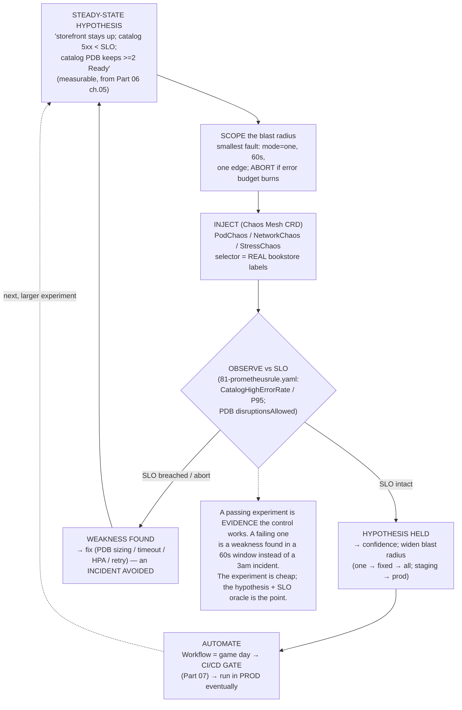

# 07 — Chaos engineering

> Resilience as a *discipline*, not random breakage: the **steady-state
> hypothesis → bounded blast radius → inject → observe → abort/learn →
> automate** loop, game days, and run-in-prod-eventually; **Chaos Mesh**
> experiment types (pod-kill / pod-failure, container-kill, network
> latency/loss/partition, IO fault/delay, stress CPU/mem, time skew, DNS
> chaos), scoping/selectors/scheduling/duration, the dashboard and abort;
> chaos as a **CI/CD gate** ([Part 07](../07-delivery/03-cicd-pipeline.md));
> and validating against the Bookstore's **SLOs/PDBs** ([Part 06 ch.05](../06-production-readiness/05-reliability-and-disruptions.md))
> — applied by running pod-kill, network-latency, and CPU-stress experiments
> against the running Bookstore and proving the storefront stays up, the
> catalog PDB holds, and the SLO is preserved.

**Estimated time:** ~45 min read · ~120 min hands-on
**Prerequisites:** [Part 06 ch.05](../06-production-readiness/05-reliability-and-disruptions.md) — PDBs + SLOs this chapter exercises · [Part 06 ch.01](../06-production-readiness/01-observability-metrics.md) — metrics that prove steady-state · [Part 07 ch.03](../07-delivery/03-cicd-pipeline.md) — CI/CD gate this chapter plugs chaos into
**You'll know after this:** • articulate the steady-state hypothesis → bounded blast-radius → inject → observe → abort/learn loop · • author Chaos Mesh experiments (pod-kill / network-latency / IO fault / stress) with scoping + duration · • prove a PDB holds and an SLO is preserved under pod-kill chaos · • gate a release on chaos pass/fail in a CI/CD pipeline · • design a game-day plan that ratchets blast radius safely

<!-- tags: day-2, observability, slo, platform-engineering, chaos -->

## Why this exists

[Part 06 ch.05](../06-production-readiness/05-reliability-and-disruptions.md)
built the reliability machinery — PodDisruptionBudgets, replicas + spread,
graceful shutdown, an SLO + error budget — and ended on the precise sentence
this chapter cashes: *"budget healthy → you have room for aggressive delivery
and **chaos testing of the disruption path**."* It also said an **untested PDB
is a latent incident**. Every resilience control in this guide — the catalog
PDB ([Part 06 ch.05](../06-production-readiness/05-reliability-and-disruptions.md)),
the HPA ([Part 06 ch.04](../06-production-readiness/04-autoscaling.md)),
timeouts/retries ([ch.04](04-service-mesh.md)), graceful shutdown ([Part 01
ch.02](../01-core-workloads/02-health-and-lifecycle.md)) — is a *hypothesis*
until something actually takes a Pod away, slows the network, or burns CPU
**and you observe the system survive**. Chaos engineering is how you turn
"should be resilient" into "is resilient, verified".

The discipline exists because the alternative — *discovering* whether your
resilience works during a real incident — is the most expensive possible time
to find out. Crucially, chaos engineering is **not** "randomly break things":

1. **It starts from a steady-state hypothesis.** A measurable claim about
   normal behaviour ("catalog 5xx ratio stays under the SLO; the storefront
   stays up") that you expect to *still hold* under the fault.
2. **It bounds the blast radius.** One Pod, one edge, 60 seconds — the
   *smallest* fault that tests the hypothesis, with an explicit abort
   condition, *then* climb the ladder.
3. **It observes against the SLO**, learns, and **automates** — chaos becomes
   a repeatable game day and eventually a CI/CD gate, run (eventually) in
   production where the real failure modes live.

The Bookstore is the perfect subject because [Part 06](../06-production-readiness/05-reliability-and-disruptions.md)
already gave it the things to *test*: a `catalog` PDB (`minAvailable: 2` of 3),
a catalog HPA, and a catalog SLO (`CatalogHighErrorRate`/`CatalogHighLatencyP95`
in `raw-manifests/81-prometheusrule.yaml`). The reference is the principles of
chaos engineering, *Production Kubernetes* ch.14 (Application Considerations),
and the Google SRE Workbook.

## Mental model

**Chaos engineering is the scientific method applied to resilience: form a
hypothesis about steady state, inject the smallest fault that could disprove
it, observe against your SLO, and either learn (you found a weakness) or gain
confidence (it held) — then make it routine.**

- **Steady-state hypothesis, not "what breaks?".** You don't inject a fault to
  see what happens; you inject it to test a *specific prediction* ("the
  storefront stays up and catalog stays under its error SLO when one catalog
  replica dies"). A passing experiment is *evidence the control works*; a
  failing one is *a weakness found in a controlled window instead of an
  incident*.
- **Blast radius is a dial you turn up slowly.** Start with the **smallest**
  scope (`mode: one` — one Pod), shortest duration, least-critical
  environment; widen (one → a fixed count → all; staging → prod; longer)
  **only as confidence accrues**. An abort condition (the real error budget
  burning — [Part 06 ch.05](../06-production-readiness/05-reliability-and-disruptions.md))
  stops it immediately.
- **Experiments are typed CRDs with selectors + duration.** Chaos Mesh models
  each fault as an object: **PodChaos** (pod-kill / pod-failure /
  container-kill), **NetworkChaos** (delay / loss / partition / corrupt),
  **IOChaos** (fault / delay on filesystem), **StressChaos** (CPU / memory),
  **TimeChaos** (clock skew), **DNSChaos** (resolution failure). A
  `selector` (namespace + label) picks the targets — *must match the real
  workload labels* — and `mode` + `duration` bound the scope and time.
- **Observe against the SLO, not vibes.** The experiment's verdict is the
  Bookstore's existing telemetry: did `CatalogHighErrorRate` stay quiet, did
  p95 stay under threshold, did the PDB keep ≥2 catalog Pods Ready? The SLO is
  the hypothesis's pass/fail oracle ([Part 06 ch.01](../06-production-readiness/01-observability-metrics.md)/[ch.05](../06-production-readiness/05-reliability-and-disruptions.md)).
- **Automate it: game day → CI gate → prod.** A one-off experiment proves a
  point once. A **Workflow** chains experiments into a repeatable game day;
  wired into delivery it becomes a **gate** ([Part 07](../07-delivery/03-cicd-pipeline.md))
  — promote only if the system survived the fault set; ultimately run
  controlled chaos **in production**, where the real dependencies and failure
  modes are.

The trap to keep in view: **chaos without a hypothesis, a bounded blast
radius, an abort condition, and SLO observation is just an outage you caused.**
The value is entirely in the discipline — the experiment is the cheap part;
the steady-state claim, the small scope, and the observed verdict are the
chapter.

## Diagrams

### Diagram A — the chaos loop: hypothesis → inject → observe (SLO) → learn → automate (Mermaid)



### Diagram B — experiment catalog + the blast-radius ladder (ASCII)

```
 CHAOS MESH EXPERIMENT CATALOG (typed CRDs; selector = REAL labels) ─────────

  PodChaos      pod-kill | pod-failure | container-kill   ► tests PDB/Deploy
  NetworkChaos  delay | loss | partition | corrupt | dup  ► tests timeouts/SLO
  IOChaos       fault | delay  (filesystem)               ► tests storage paths
  StressChaos   cpu | memory                              ► tests limits + HPA
  TimeChaos     clock skew                                ► tests time logic
  DNSChaos      resolution error                          ► tests resolver/retry

 BLAST-RADIUS LADDER — climb only as confidence grows ──────────────────────
   1. mode: one          one Pod, 60s, staging        ◄═ START HERE
   2. mode: fixed N       a few Pods, longer, staging
   3. mode: all           a whole tier, bounded, staging
   4. ↑ same, in PRODUCTION, low-traffic window, ABORT armed
   5. continuous / CI gate (Workflow) — chaos as a routine, prod, automated
   ── every rung: a HYPOTHESIS + an SLO oracle + an ABORT condition ──
   ── reversible: duration auto-reverts; `kubectl delete -f` aborts now ──

  DISCIPLINE vs RANDOM BREAKAGE
   chaos engineering = hypothesis + smallest scope + SLO verdict + learn
   random breakage    = an outage you caused, with no oracle and no lesson
```

## Hands-on with the Bookstore

**Assumed working directory: the guide repo root (`full-guide/`).** This
chapter adds the **new** [`examples/bookstore/chaos/`](../examples/bookstore/chaos/)
tree and runs it against the running Bookstore. It does **not** modify any
canonical manifest — the experiments *select* the real Bookstore Pods by
their existing labels (`app: catalog` / `app: postgres`, verified against
`raw-manifests/10-`/`20-`) and inject nothing into them (the same additive
discipline as the mesh/ESO/operator precedents).

We will: (0) self-bootstrap the Bookstore *with* its PDB/HPA/SLO; (1) install
**Chaos Mesh** (pinned Helm, own namespace) and justify it over Litmus;
(2) **Experiment 1** — pod-kill a catalog Pod, PDB holds; (3) **Experiment 2**
— network latency catalog→postgres, observe SLO impact; (4) **Experiment 3** —
CPU stress, HPA reacts; (5) chain them as a **game day Workflow / CI gate**.

> **The honest setup story (read first).** Chaos Mesh genuinely needs
> installing (CRDs + a controller + a privileged node DaemonSet) — no
> zero-setup path. Everything here is **fully reproducible on a single kind
> cluster**. Experiments are **bounded** (`duration`, auto-revert) and
> **reversible** (`kubectl delete -f` aborts immediately); no output is faked.
> Chaos Mesh's fault-injection DaemonSet is privileged and runs in **its own
> `chaos-mesh` namespace**, never `bookstore`; the Bookstore Pods are *not*
> mutated and stay PSA-`restricted`-compliant throughout. Every manifest
> dry-run runs with **no cluster**.

### 0. Prerequisites — the Bookstore with PDB + HPA + the SLO-oracle stack (self-bootstrapping)

The experiments are only meaningful against the resilience controls [Part
06](../06-production-readiness/05-reliability-and-disruptions.md) added — so
the bootstrap applies `84-pdb.yaml` (catalog `minAvailable: 2`) **and**
`82-hpa-catalog.yaml` (the autoscaler Experiment 3 tests).

> **Honest prerequisite — the SLO oracle is a Part 06 ch.01 stack, not
> magic.** This chapter's own rule is *"no oracle ⇒ just an outage"*, so be
> precise about what the oracle *is*: the HPA needs **metrics-server**, and
> the SLO alerts (`raw-manifests/80-servicemonitor.yaml` /
> `81-prometheusrule.yaml`) need **kube-prometheus-stack** (Prometheus
> Operator) — both are [Part 06 ch.01](../06-production-readiness/01-observability-metrics.md)/[ch.04](../06-production-readiness/04-autoscaling.md)
> prerequisites, **not** re-taught here. Two honest options, pick one:
> **(A) Full oracle** — install the pinned stacks below and apply `80-`/`81-`,
> then every "observe the SLO" step is literal; **(B) Conceptual** — skip the
> stacks and *reason about* the SLO/HPA outcome (the PDB and `kubectl get hpa`/pod state
> are still directly observable without Prometheus). The
> bootstrap below does **(A)** so its claims match exactly what the shell
> runs; drop the marked block for **(B)**.

```sh
kind delete cluster --name bookstore 2>/dev/null || true
kind create cluster --name bookstore
cd examples/bookstore/app
for s in catalog orders payments-worker storefront; do docker build -t bookstore/$s:dev ./$s; done
cd ../../..
for s in catalog orders payments-worker storefront; do kind load docker-image bookstore/$s:dev --name bookstore; done

kubectl apply -f examples/bookstore/raw-manifests/00-namespace.yaml
kubectl apply -f examples/bookstore/raw-manifests/05-serviceaccounts-rbac.yaml
kubectl apply -f examples/bookstore/raw-manifests/15-catalog-config.yaml
kubectl apply -f examples/bookstore/raw-manifests/16-db-credentials.yaml
kubectl apply -f examples/bookstore/raw-manifests/35-priorityclasses.yaml
kubectl apply -f examples/bookstore/raw-manifests/20-postgres-statefulset.yaml
kubectl rollout status statefulset/postgres -n bookstore
kubectl apply -f examples/bookstore/raw-manifests/10-catalog-deploy.yaml
kubectl apply -f examples/bookstore/raw-manifests/11-storefront-deploy.yaml
kubectl apply -f examples/bookstore/raw-manifests/14-orders-deploy.yaml
kubectl apply -f examples/bookstore/raw-manifests/40-services.yaml
kubectl apply -f examples/bookstore/raw-manifests/21-db-migrate-job.yaml
kubectl wait --for=condition=complete job/db-migrate -n bookstore --timeout=120s
kubectl rollout status deployment/catalog -n bookstore
kubectl apply -f examples/bookstore/raw-manifests/84-pdb.yaml          # the PDB to test
kubectl get pdb catalog -n bookstore   # catalog minAvailable 2 / disruptionsAllowed 1

# --- The SLO-oracle stack (Part 06 ch.01/ch.04 prerequisites — option (A)).
#     Drop this whole block for option (B) "reason conceptually". PINNED Helm
#     (never releases/latest/download URL — same rule as every add-on):
helm repo add metrics-server https://kubernetes-sigs.github.io/metrics-server/
helm repo add prometheus-community https://prometheus-community.github.io/helm-charts
helm repo update
helm install metrics-server metrics-server/metrics-server \
  -n kube-system --version 3.12.2 --set 'args={--kubelet-insecure-tls}' --wait   # kind: insecure kubelet TLS
helm install kube-prom prometheus-community/kube-prometheus-stack \
  -n monitoring --create-namespace --version 65.1.1 --wait                       # Prometheus Operator
kubectl -n monitoring rollout status deploy/kube-prom-kube-prometheus-operator
kubectl apply -f examples/bookstore/raw-manifests/82-hpa-catalog.yaml   # the HPA Experiment 3 tests
kubectl apply -f examples/bookstore/raw-manifests/80-servicemonitor.yaml   # scrape catalog metrics
kubectl apply -f examples/bookstore/raw-manifests/81-prometheusrule.yaml   # the SLO ALERTS (the oracle)
kubectl get hpa catalog -n bookstore                       # the autoscaler under test
kubectl get servicemonitor,prometheusrule -n bookstore     # the SLO oracle is now live
# (metrics-server, kube-prometheus-stack install into kube-system/monitoring —
#  NOT bookstore; the catalog/postgres Pods stay PSA-restricted-compliant.)
```

### 1. Install Chaos Mesh (pinned Helm, own namespace) — and why Chaos Mesh

**Why Chaos Mesh over Litmus for this guide:** Chaos Mesh models each fault as
a **typed CRD** (`PodChaos`/`NetworkChaos`/`StressChaos`/…) with a precise
label `selector` and `duration` — which maps cleanly onto this guide's
established CRD-intrinsic-note discipline and the Bookstore's label model, has
a focused dashboard, and a `Workflow` kind for game days. (LitmusChaos is an
equally valid CNCF project, more hub/experiment-catalog and `ChaosEngine`/
`ChaosExperiment`-workflow oriented; the *principles* are identical — the
choice here is about the cleanest CRD-per-fault fit.) Install via the **pinned
Helm chart** — per this guide's rule, **never** a
`releases/latest/download/<PINNED-FILE>.yaml` URL (same precedent as
Kyverno/KEDA/Argo CD/Istio/Vault):

```sh
CHAOS_MESH_CHART_VERSION=2.7.0     # chaos-mesh/chaos-mesh Helm chart (pin)
helm repo add chaos-mesh https://charts.chaos-mesh.org
helm repo update
helm install chaos-mesh chaos-mesh/chaos-mesh \
  -n chaos-mesh --create-namespace \
  --version "$CHAOS_MESH_CHART_VERSION" \
  --set chaosDaemon.runtime=containerd \
  --set chaosDaemon.socketPath=/run/containerd/containerd.sock --wait
kubectl -n chaos-mesh rollout status deploy/chaos-controller-manager
kubectl -n chaos-mesh get pods    # controller-manager, chaos-daemon (DaemonSet), dashboard
#   (chaos-daemon is privileged and runs in chaos-mesh — NOT bookstore. It
#    injects faults into target Pods' namespaces via the node; the Bookstore
#    Pods themselves are never mutated and stay PSA-restricted-compliant.)
```

Installing Chaos Mesh created the `chaos-mesh.org` CRDs. **This is what makes
the experiment manifests dry-runnable** — before this, a client dry-run prints
`no matches for kind "PodChaos"` (the documented CRD-intrinsic behaviour; each
file header — the exact precedent of `raw-manifests/70-`/`83-`/`51-`/`argocd/`).

### 2. Experiment 1 — pod-kill a catalog Pod; the PDB holds

**Hypothesis:** killing one of catalog's 3 replicas keeps catalog at ≥2 Ready
(PDB `minAvailable: 2`), the storefront stays up, and the catalog SLO does not
fire. Apply [`chaos/10-podchaos-kill-catalog.yaml`](../examples/bookstore/chaos/10-podchaos-kill-catalog.yaml)
(`mode: one` — the smallest blast radius; selector = the real `app: catalog`
label) and observe:

```sh
# Watch the steady-state oracles in another shell BEFORE injecting:
#   kubectl get pdb catalog -n bookstore -w        # disruptionsAllowed
#   kubectl get pods -n bookstore -l app=catalog -w

kubectl apply -f examples/bookstore/chaos/10-podchaos-kill-catalog.yaml
kubectl get podchaos -n bookstore
# Observe: ONE catalog Pod is deleted; the Deployment (Part 01 ch.04)
# immediately schedules a replacement; catalog never drops below 2 Ready
# (the PDB guarantee, Part 06 ch.05). storefront keeps serving. HYPOTHESIS
# HELD → the PDB + Deployment are verified resilient, not just configured.
kubectl delete -f examples/bookstore/chaos/10-podchaos-kill-catalog.yaml   # stop
```

This is exactly [Part 06 ch.05](../06-production-readiness/05-reliability-and-disruptions.md)'s
"an untested PDB is a latent incident" — *tested*. (Note: pod-kill is the
eviction-adjacent failure; recall a PDB gates the *eviction API*, not a direct
delete — Chaos Mesh deletes the Pod, the Deployment heals it, and the PDB's
job is keeping enough Ready *through* the recovery, which is what you observe.)

### 3. Experiment 2 — network latency catalog→postgres; observe the SLO

**Hypothesis:** 200ms±50ms latency on the catalog→postgres edge for 60s
*degrades* catalog p95 but does **not** breach the error SLO (timeouts +
pooling absorb a slow dependency rather than cascading). Latency is the most
common real degradation — higher-value than a clean kill. Apply
[`chaos/20-networkchaos-latency-catalog-postgres.yaml`](../examples/bookstore/chaos/20-networkchaos-latency-catalog-postgres.yaml)
(scoped to the catalog→postgres edge specifically — `direction: to` + a
postgres-side target selector, both real labels):

> **Why this one is `mode: all`, not `mode: one` (consistent with the
> ladder).** The blast-radius ladder starts at `mode: one` for a *Pod-targeted*
> fault (Experiments 1 & 3 — one Pod is the smallest unit). This is an **edge
> experiment**: the *hypothesis is about the catalog→postgres EDGE*, so the
> edge/service **is** the blast-radius unit — impairing only one of three
> catalog Pods' egress would not actually test "the catalog→postgres
> dependency is slow" (the other two Pods serve unaffected and mask it).
> `mode: all` on the source + the postgres-side `target` selector is therefore
> the *deliberate, correct* minimal scope for *this* hypothesis (still bounded:
> one edge, 60s, auto-revert) — not a ladder violation. Climbing the ladder is
> per-hypothesis: pick the smallest scope that can actually disprove *that*
> claim.

```sh
kubectl apply -f examples/bookstore/chaos/20-networkchaos-latency-catalog-postgres.yaml
# OBSERVE vs the SLO oracle (raw-manifests/81-prometheusrule.yaml):
#   • CatalogHighLatencyP95 — EXPECTED to rise (the fault is latency)
#   • CatalogHighErrorRate  — should STAY QUIET if catalog's timeouts/pooling
#                             are correct (THE hypothesis). If 5xx climbs, you
#                             found a real weakness (missing/short timeout,
#                             no retry budget) — an incident avoided.
kubectl get networkchaos -n bookstore                 # status / records
kubectl delete -f examples/bookstore/chaos/20-networkchaos-latency-catalog-postgres.yaml
# (Auto-reverts after 60s anyway — `duration` bounds it; delete aborts early.)
```

### 4. Experiment 3 — CPU stress; the HPA reacts

**Hypothesis:** burning CPU in a catalog Pod for 60s drives CPU toward the
container limit, the catalog HPA ([Part 06 ch.04](../06-production-readiness/04-autoscaling.md))
scales out, and the SLO is preserved — requests/limits + autoscaling absorb
the pressure as designed. Apply
[`chaos/30-stresschaos-catalog-cpu.yaml`](../examples/bookstore/chaos/30-stresschaos-catalog-cpu.yaml)
(`mode: one`):

```sh
kubectl apply -f examples/bookstore/chaos/30-stresschaos-catalog-cpu.yaml
#   kubectl get hpa catalog -n bookstore -w     # replicas should rise as CPU
#                                               # pressure crosses the target
kubectl get stresschaos -n bookstore
kubectl delete -f examples/bookstore/chaos/30-stresschaos-catalog-cpu.yaml
# The container cpu LIMIT (Part 01 ch.03) is the natural ceiling on the
# damage; the HPA is the designed reaction. If the SLO still breached, the
# weakness is HPA sizing / limits — found in 60s, not at 3am.
```

### 5. Make it a game day / CI gate — the Workflow

Three ad-hoc applies prove three points once. [`chaos/40-workflow-gameday.yaml`](../examples/bookstore/chaos/40-workflow-gameday.yaml)
chains the *same three specs* into a sequential, time-bounded **Workflow** —
the discipline as code, a repeatable **game day**, and the shape you wire into
delivery as a **CI/CD gate** ([Part 07](../07-delivery/03-cicd-pipeline.md)):
promote only if the Bookstore survived the fault set with its SLO intact:

```sh
kubectl apply -f examples/bookstore/chaos/40-workflow-gameday.yaml
kubectl get workflow,workflownode -n bookstore        # the run progresses serially
# In CI this is: run the Workflow against a prod-like env → assert no SLO
# alert fired during it → only then promote (Part 07 ch.03/04). The Chaos
# Dashboard (port-forward svc/chaos-dashboard -n chaos-mesh) visualizes it.
kubectl delete -f examples/bookstore/chaos/40-workflow-gameday.yaml   # abort
```

Clean up:

```sh
kubectl delete -f examples/bookstore/chaos/ --ignore-not-found     # all experiments
helm uninstall chaos-mesh -n chaos-mesh
kind delete cluster --name bookstore
```

## How it works under the hood

- **An experiment is a controller-reconciled CRD; a daemon injects the
  fault.** You apply a `PodChaos`/`NetworkChaos`/… object; the Chaos Mesh
  **controller-manager** resolves its `selector` to concrete Pods and instructs
  the per-node **chaos-daemon** (a privileged DaemonSet in the `chaos-mesh`
  namespace) to apply the fault *to those Pods from the node side* — delete
  the Pod (pod-kill, via the API), program `tc`/`netem` on the Pod's network
  namespace (NetworkChaos), run a cgroup-scoped stressor (StressChaos),
  intercept syscalls (IOChaos), etc. The **target Pods are never mutated** —
  no injected container, no PSA concern in `bookstore`; the privilege lives in
  the daemon's own namespace. On `duration` expiry or object deletion the
  daemon **reverts** the fault — which is why every experiment here is bounded
  and abortable.
- **The `selector` is the blast radius, and label correctness is safety.** An
  experiment acts on exactly the Pods its `namespaces` + `labelSelectors`
  match, narrowed by `mode` (`one` = a single random match; `fixed: N`;
  `fixed-percent`; `all`). A selector that matches the *wrong* or *too many*
  workloads is the chaos-engineering analog of a too-broad NetworkPolicy/PDB
  selector ([Part 02 ch.06](../02-networking/06-network-policies.md)/[Part 06
  ch.05](../06-production-readiness/05-reliability-and-disruptions.md)) — which
  is why these files pin to the *verified* Bookstore labels (`app: catalog`,
  `app: postgres`) and start at `mode: one`. Scope is the primary safety
  control; `duration` and an external abort are the others.
- **The hypothesis's oracle is the SLO, evaluated independently.** The
  experiment does not decide pass/fail — the Bookstore's existing
  observability does. `CatalogHighErrorRate` / `CatalogHighLatencyP95`
  (`raw-manifests/81-prometheusrule.yaml`) and the PDB's `disruptionsAllowed`
  ([Part 06 ch.05](../06-production-readiness/05-reliability-and-disruptions.md))
  are the steady-state measures; if they hold under the fault the hypothesis
  is confirmed, if they break you found a weakness. This is *why* [Part 06](../06-production-readiness/01-observability-metrics.md)
  (metrics + SLOs) is a prerequisite for chaos: without an oracle, an
  experiment is just an outage.
- **Pod-kill vs the eviction API (a precise distinction).** [Part 06 ch.05](../06-production-readiness/05-reliability-and-disruptions.md)
  established that a PDB gates the **eviction API** (`kubectl drain`), **not** a
  direct `DELETE`. Chaos Mesh's pod-kill is a direct delete — so it is *not*
  PDB-blocked; what you are testing is that the **Deployment heals fast enough
  and the PDB keeps ≥2 Ready *through* the churn**, i.e. the *recovery*
  behaviour, not the eviction gate. (To specifically exercise the eviction
  path, drain a node — Part 06 ch.05; to exercise *unplanned* loss, pod-kill —
  here. Both matter; they test different controls.)
- **Game days, CI gates, and run-in-prod.** A **Workflow** sequences
  experiments with per-step deadlines and an overall deadline — a *repeatable*
  game day instead of a one-off. Wired into delivery ([Part 07 ch.03](../07-delivery/03-cicd-pipeline.md)/[ch.04](../07-delivery/04-gitops-argocd.md))
  it is a **gate**: run the Workflow against a prod-like environment, assert no
  SLO alert fired during it, and only then promote — resilience becomes a
  release criterion, not a hope. The discipline's endpoint is **controlled
  chaos in production** (low-traffic window, abort armed, error-budget-aware —
  [Part 06 ch.05](../06-production-readiness/05-reliability-and-disruptions.md)),
  because staging never has prod's real dependencies, scale, and failure
  modes — but you *earn* prod chaos by climbing the blast-radius ladder in
  staging first.
- **Why this is a discipline, not breakage.** The mechanical fault injection
  is the easy 10%. The 90% that makes it engineering: a *falsifiable
  steady-state hypothesis*, the *smallest* fault that could disprove it, an
  *independent SLO oracle*, an *abort condition*, and a *learning loop* that
  feeds fixes back into the resilience controls ([Part 06 ch.05](../06-production-readiness/05-reliability-and-disruptions.md)).
  Remove any of those and you have an outage you caused with no lesson — the
  exact anti-pattern this chapter exists to prevent.

## Production notes

> **In production: always run from a hypothesis, with a bounded blast radius
> and an armed abort.** Never inject a fault without a measurable steady-state
> claim and an SLO oracle ([Part 06 ch.01](../06-production-readiness/01-observability-metrics.md)/[ch.05](../06-production-readiness/05-reliability-and-disruptions.md)).
> Start at `mode: one`, short `duration`, least-critical environment; tie the
> abort to the **real error budget** burning — budget healthy is the
> *precondition* for running chaos ([Part 06 ch.05](../06-production-readiness/05-reliability-and-disruptions.md)).
> Chaos with no oracle/abort is a self-inflicted incident, not a test.

> **In production: pin selectors to verified labels and climb the blast-radius
> ladder deliberately.** A wrong/too-broad `selector` makes a chaos experiment
> hit the wrong workload — the same class of mistake as a mis-scoped
> PDB/NetworkPolicy. Verify labels against the live workload, start narrow
> (one Pod, one edge), widen (fixed → all; staging → prod; longer) **only as
> each rung passes**, and keep the chaos controller's privileged daemon in
> **its own namespace** (never the app's), with RBAC limiting who can create
> chaos objects.

> **In production: make resilience a release criterion — chaos as a CI/CD
> gate, then continuous in prod.** A Workflow run against a prod-like
> environment that asserts no SLO alert fired is a promotion gate ([Part 07](../07-delivery/03-cicd-pipeline.md));
> mature programs run continuous, automated, low-blast-radius chaos **in
> production** (where real failure modes live) during business hours with
> on-call aware. The endpoint of [Part 06 ch.05](../06-production-readiness/05-reliability-and-disruptions.md)'s
> "test it" is "test it *continuously, automatically, in prod*".

> **In production: every experiment must be reversible and time-bounded, and
> game days are organizational, not just technical.** Always set `duration`
> (auto-revert) and have `kubectl delete` as the kill switch; rehearse the
> abort. Run **game days** with the on-call team, a written hypothesis, a
> scribe, and a blameless review that feeds findings back into PDB sizing,
> timeouts/retries ([ch.04](04-service-mesh.md)), HPA tuning ([Part 06 ch.04](../06-production-readiness/04-autoscaling.md)),
> and runbooks ([Part 08 ch.03](../08-day-2-operations/03-troubleshooting-playbook.md))
> — the learning loop is the deliverable, not the broken Pod.

> **In production (managed — EKS/GKE/AKS):** the principles and Chaos
> Mesh/Litmus are cloud-agnostic, but the highest-value experiments are often
> cloud-level — **AZ failure, node-group/instance termination
> (spot reclaim — [Part 10 ch.06](../10-cloud-and-managed-kubernetes/06-node-autoscaling-cost-multicloud.md)),
> managed-DB failover, LB/ingress disruption** — exercised with the provider's
> fault tooling (**AWS FIS**, GCP fault injection, **Azure Chaos Studio**)
> alongside in-cluster chaos. Test the controls you don't own (managed node
> upgrades respecting PDBs — [Part 06 ch.05](../06-production-readiness/05-reliability-and-disruptions.md);
> multi-AZ spread — [Part 04 ch.02](../04-scheduling/02-affinity-taints-topology.md))
> against real provider faults, not just simulated ones.

## Quick Reference

```sh
# Install Chaos Mesh (PINNED Helm — never releases/latest/download URL; own ns)
helm repo add chaos-mesh https://charts.chaos-mesh.org && helm repo update
helm install chaos-mesh chaos-mesh/chaos-mesh -n chaos-mesh --create-namespace \
  --version 2.7.0 --set chaosDaemon.runtime=containerd \
  --set chaosDaemon.socketPath=/run/containerd/containerd.sock --wait

# Run an experiment (CRD-backed → dry-run "no matches" until Chaos Mesh installed)
kubectl apply -f examples/bookstore/chaos/10-podchaos-kill-catalog.yaml      # pod-kill
kubectl get podchaos,networkchaos,stresschaos,workflow -n bookstore
# OBSERVE the oracle (the verdict, not the experiment):
kubectl get pdb catalog -n bookstore -w        # >=2 Ready THROUGH the fault?
#   + the catalog SLO alerts (raw-manifests/81-prometheusrule.yaml)
kubectl delete -f examples/bookstore/chaos/10-podchaos-kill-catalog.yaml     # ABORT now
# (every experiment is bounded by `duration` and abortable by delete)
```

Minimal experiment skeleton (full files in `examples/bookstore/chaos/`):

```yaml
apiVersion: chaos-mesh.org/v1alpha1
kind: PodChaos                                   # CRD — needs Chaos Mesh installed
metadata: { name: kill-one, namespace: <NS> }
spec:
  action: pod-kill
  mode: one                                      # SMALLEST blast radius — start here
  selector:
    namespaces: [ <NS> ]
    labelSelectors: { app: <VERIFIED-REAL-LABEL> }   # MUST match the live workload
# NetworkChaos/StressChaos/etc. add `duration:` (auto-revert) + action params.
# Always: a written hypothesis + an SLO oracle + an abort condition.
```

Checklist:

- [ ] Every experiment starts from a **measurable steady-state hypothesis**
      with an **SLO oracle** ([Part 06 ch.01](../06-production-readiness/01-observability-metrics.md)/[ch.05](../06-production-readiness/05-reliability-and-disruptions.md))
- [ ] **Smallest blast radius first** (`mode: one`, short `duration`,
      staging); climb the ladder only as each rung passes
- [ ] **Abort condition armed** (real error budget burning — [Part 06 ch.05](../06-production-readiness/05-reliability-and-disruptions.md));
      `duration` set; `kubectl delete` rehearsed as the kill switch
- [ ] Selectors pinned to **verified real labels**; experiment can't hit the
      wrong workload (the mis-scoped-selector trap)
- [ ] Chaos controller's **privileged daemon in its own namespace** (never
      `bookstore`); RBAC limits who creates chaos objects; app Pods unmutated
- [ ] Resilience is a **CI/CD gate** (Workflow + "no SLO alert" assertion,
      [Part 07](../07-delivery/03-cicd-pipeline.md)); eventually **continuous,
      in prod**
- [ ] Findings fed back via **blameless game-day review** into PDB/HPA/
      timeout/runbook ([Part 06 ch.05](../06-production-readiness/05-reliability-and-disruptions.md)/[Part
      08 ch.03](../08-day-2-operations/03-troubleshooting-playbook.md))

## Test your understanding

> Try each before opening the answer drawer. The act of trying is the exercise; the answer is the check.

1. **What is the "steady-state hypothesis" and why is it the first step of a chaos experiment, not the last?**
   <details><summary>Show answer</summary>

   The steady-state hypothesis is a falsifiable statement about system behavior under normal conditions, expressed as observable metrics: e.g. "storefront p99 latency stays under 250ms and error rate under 0.5% when measured over a 5-min window." It is the *first* step because without it you can't tell whether the chaos experiment broke anything — you'd be just kicking the system and seeing what falls over. A steady-state hypothesis lets you (a) abort the experiment if the metric breaches, (b) declare success/failure deterministically, (c) regress the result over time as the system evolves.

   </details>

2. **You run a pod-kill experiment against `catalog` and the storefront 99th-percentile latency jumps from 200ms to 4s, then recovers in 30s. What is happening, and what would you change?**
   <details><summary>Show answer</summary>

   When the Pod is killed, its IP is briefly still in the Service Endpoints (kube-proxy hasn't reconciled yet), so calls to `catalog` go to a dead Pod and hang until the client's timeout fires. The 30s recovery is "kube-proxy notices, removes the endpoint, traffic flows to healthy Pods." Fix: (a) add a `preStop` hook of 5-10s + `terminationGracePeriodSeconds` to let the Pod stop accepting new connections while still draining in-flight; (b) tune the client's connect/read timeouts shorter (4s is too long); (c) use the mesh's outlier detection to eject the bad endpoint within ~1s. The experiment is doing its job by surfacing all three issues.

   </details>

3. **You scope a Chaos Mesh `PodChaos` with selector `app=catalog`. A teammate adds `app=catalog` as a label on a different team's Pod. What goes wrong, and what's the discipline that prevents it?**
   <details><summary>Show answer</summary>

   The chaos experiment will kill the teammate's Pod too — labels are not namespaces, and selectors don't isolate. The discipline: (a) always scope `namespaceSelectors` (e.g. `namespaceSelectors: bookstore`) so the blast is bounded by namespace; (b) use a chaos-specific label like `chaos.target=catalog` rather than reusing app labels; (c) use a `chaos` namespace prefix for experiments; (d) ChaosDashboard's dry-run shows you exactly which Pods are selected — read it before applying. The mis-scoped-selector trap is the #1 chaos production incident.

   </details>

4. **Your chaos CI gate runs pod-kill on `catalog` every PR. The CI fails 10% of the time intermittently — sometimes the SLO breaches, sometimes not. What's the right response?**
   <details><summary>Show answer</summary>

   Intermittent failure is a *signal*, not a flake — the system is at the edge of meeting its SLO under failure. Options: (a) reduce the chaos intensity (single Pod kill, not all Pods) and tighten the gate; (b) keep the chaos and treat the failures as findings — file each one as a reliability bug; (c) loosen the SLO if the chaos is unrealistic (you'd never kill all `catalog` Pods in production at once). The wrong response is "mark flaky and retry" — that masks the signal. Use the variability to tune PDBs, HPA cooldown, preStop, and connection-pool retries.

   </details>

5. **Hands-on: design a "network latency" chaos experiment that adds 200ms latency on egress from the `catalog` Pods only (not ingress). What change in `storefront` behavior do you expect, and what happens to your storefront SLO?**
   <details><summary>What you should see</summary>

   `catalog` outbound calls (to Postgres) take 200ms longer; `catalog` request latency increases by ~200ms per upstream round-trip; storefront's calls to `catalog` increase by the same amount. If storefront's SLO is p99 < 500ms and its baseline is 200ms, the experiment pushes p99 to ~400ms — within budget. If the SLO is p99 < 250ms, you'll breach. The experiment exposes the layered nature of latency budgets: every downstream sensitivity compounds. The mesh's request-timeout setting is a hard upper bound — make sure it's looser than your SLO target plus expected variance.

   </details>

## Further reading

- **Rosso et al., _Production Kubernetes_, ch.14 — "Application
  Considerations"** (designing and *verifying* applications that survive
  disruption — the production framing around the chaos mechanics) — paired
  with the **Google SRE Workbook, "Reliability Testing" / chaos & disaster
  role-playing (DiRT)** for the game-day discipline and error-budget gating.
- **Ibryam & Huß, _Kubernetes Patterns_ 2e — *Health Probe* (ch.4) and
  *Singleton Service* (ch.10)** for the resilience properties chaos
  experiments validate, and the principles of chaos engineering
  (<https://principlesofchaos.org/>).
- Official: Chaos Mesh
  <https://chaos-mesh.org/docs/>, LitmusChaos
  <https://docs.litmuschaos.io/>, and the CNCF chaos-engineering landscape;
  pair with the Kubernetes disruptions docs
  <https://kubernetes.io/docs/concepts/workloads/pods/disruptions/> (the
  voluntary/involuntary model chaos exercises).
