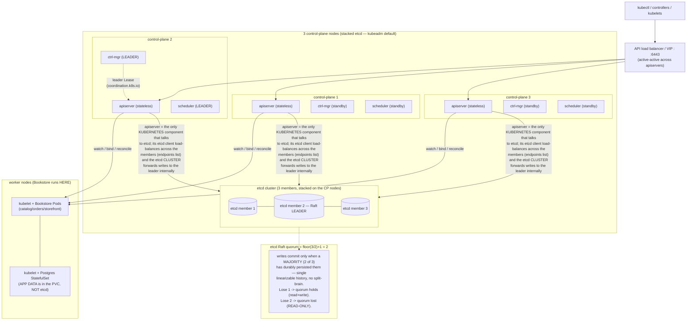

# 08 — HA control plane and etcd

> [Part 00 ch.04](../00-foundations/04-control-plane-deep-dive.md) sketched the
> HA topology and the quorum table; [Part 08
> ch.02](../08-day-2-operations/02-backup-and-dr.md) did `etcdctl snapshot save/restore` basics.
> This chapter goes to **operations depth**: stacked vs
> external etcd and **why ≥3 control-plane nodes behind an API LB**
> (apiserver stateless/active-active vs etcd the consensus core); **etcd Raft &
> quorum** (leader election, quorum = ⌊n/2⌋+1, the failure-tolerance table for
> 1/3/5/7, why even counts waste, split-brain prevention); **etcd maintenance**
> — `member list`/`endpoint status`/`endpoint health`, **defragmentation**
> (post-compaction fragmentation, the latency spike, one-member-at-a-time),
> **auto-compaction** (revision vs periodic), the **space quota +
> `NOSPACE`/`alarm disarm`** recovery, backend-DB-size monitoring; **etcd DR
> beyond a snapshot** (single failed member vs full-cluster restore, the
> `--data-dir`/`--initial-cluster` reconstruction, the "restore = a NEW logical
> cluster" gotcha, member replace); **node-loss recovery** (lose 1 of 3 → quorum
> holds; lose 2 of 3 → lost-quorum recovery); **component leader election**
> (`Lease`, `--leader-elect`). Applied with a **3-control-plane kind cluster**,
> `etcdctl` into kind's etcd static Pod, a real `defrag`, the
> `kube-scheduler` `Lease`, and a simulated control-plane-node loss — the
> **Bookstore stays up because its data is in the Postgres StatefulSet, not
> etcd** (cluster state ≠ app data).

**Estimated time:** ~60 min read · ~120 min hands-on
**Prerequisites:** [Part 00 ch.04](../00-foundations/04-control-plane-deep-dive.md) — HA topology + quorum table this chapter operationalises · [Part 08 ch.02](../08-day-2-operations/02-backup-and-dr.md) — etcd snapshot save/restore basics this chapter deepens
**You'll know after this:** • justify ≥3 control-plane nodes behind an API LB from the Raft quorum math · • run defragmentation, set the space quota, and recover from `NOSPACE` alarms · • restore etcd from a snapshot and explain "restore = a new logical cluster" · • diagnose a lost-quorum scenario and execute member-replace recovery · • separate cluster state (etcd) from app data (Postgres) in a DR plan

<!-- tags: foundations, day-2, dr, observability, platform-engineering -->

## Why this exists

[Part 00 ch.04](../00-foundations/04-control-plane-deep-dive.md) ended on a
Production note: *"run 3 (or 5) control-plane nodes with etcd quorum sized odd…
a single control-plane node is acceptable only for learning (kind is exactly
that)."* [Part 08 ch.02](../08-day-2-operations/02-backup-and-dr.md) gave you
the snapshot and the stop-apiserver→restore→repoint sequence — and was explicit
it was **deepened here**: *"restoring a single failed member vs full-cluster
restore… the 'restore is a new logical cluster' gotcha, member replace"*. This
is that chapter, and it is the difference between *having* an HA control plane
and *operating* one without making it worse under pressure.

The control plane fails in production in a small number of specific, avoidable
ways, and every one is an etcd or quorum misunderstanding:

1. **Quorum lost by losing the wrong number of members.** A 3-member etcd
   tolerates **one** failure. Lose two (a bad two-node drain, an AZ outage with
   2 of 3 etcd in it, a botched rolling upgrade) and etcd goes **read-only** —
   the apiserver can serve reads from cache but **no writes**: no scheduling, no
   scaling, no deploys, until you recover quorum. Teams discover the
   failure-tolerance table *during* the outage.
2. **The disk filled and nobody knew the alarm semantics.** etcd's keyspace
   grows; after compaction the file does **not** shrink (it is only
   internally freed) until you **defrag**; the backend hits
   `--quota-backend-bytes`; etcd raises a **`NOSPACE` alarm** and goes
   **read-only cluster-wide** — and stays there even after you free space until
   you explicitly **`etcdctl alarm disarm`**. This is one of the most common
   real etcd outages and it is 100% operational.
3. **"Restore" was treated as "undo".** Restoring an etcd snapshot creates a
   **new logical cluster** with a new cluster ID — you cannot restore one member
   from a snapshot into a live cluster and expect it to rejoin; doing so
   corrupts the cluster. Single-member loss and full-cluster loss have
   **different** procedures, and conflating them turns a one-member blip into a
   total outage.
4. **Defrag run cluster-wide at once.** `etcdctl defrag` blocks the member it
   runs against (it rewrites the backend file). Defragging **all members
   simultaneously** stalls the whole etcd cluster — the maintenance becomes the
   incident. It must be **one member at a time**.

This chapter makes the control plane operable: the quorum arithmetic you size
for, the maintenance you schedule (defrag/compaction/alarm), the DR procedures
you rehearse (single-member vs full-cluster), and the node-loss recovery you
practice — with the Bookstore proving the orthogonality the whole guide leans
on: **app data lives in the Postgres PVC, not etcd**, so cluster-state failures
and data failures are *different* failure domains with *different* recoveries
([Part 08 ch.02](../08-day-2-operations/02-backup-and-dr.md)'s three layers).
The reference is *Production Kubernetes* ch.1–2 and the official etcd/k8s HA
docs.

## Mental model

**The control plane is one stateless, replicate-freely front (apiserver +
leader-elected controller-manager/scheduler) sitting in front of one
consensus-bound back (etcd). You scale the front by adding replicas behind a
load balancer; you make the back survivable by an odd Raft quorum. Almost every
control-plane outage is a quorum or maintenance fact about the back.**

- **The apiserver is stateless; etcd is the cluster.** The apiserver holds no
  durable state ([Part 00 ch.04](../00-foundations/04-control-plane-deep-dive.md))
  — it is the *only* etcd client, and N apiservers behind an LB/VIP are all
  active. So front-end HA is trivial: add apiservers. **etcd** is the hard part:
  it is a Raft cluster where every write must be durably acknowledged by a
  **majority** before it commits. Lose the majority and the cluster is
  read-only. "Make the control plane HA" overwhelmingly means "size and operate
  etcd's quorum correctly".
- **Quorum = ⌊n/2⌋+1; failures tolerated = n − quorum.** A Raft cluster of `n`
  members commits a write only when a strict **majority** has persisted it
  (this guarantees a single linearizable history — no split-brain, because two
  disjoint majorities cannot exist). So 3 members → quorum 2 → tolerate **1**
  loss; 5 → quorum 3 → tolerate **2**; 7 → quorum 4 → tolerate **3**. An **even**
  count never improves tolerance (4 still tolerates only 1, like 3) while adding
  a member that can fail and slowing every write — hence **always odd, almost
  always 3, 5 for large/critical, rarely 7**. Beyond ~5–7, cross-member
  replication latency dominates and write throughput drops.
- **Stacked vs external is a failure-domain choice.** *Stacked* (kubeadm
  default): etcd runs on the same nodes as the apiservers — fewer machines, but
  a node loss removes an apiserver **and** an etcd member together (coupled
  domains). *External*: etcd is its own dedicated cluster — more machines and
  surface, but etcd and apiservers fail independently and etcd can be tuned in
  isolation. 3 stacked control-plane nodes is the right default for most
  clusters; external is for large/high-stakes ones.
- **etcd needs maintenance the apiserver does not.** etcd is an MVCC store: every
  write creates a new **revision**; old revisions accumulate until
  **compaction** discards history below a revision. Compaction frees space
  *logically* but the backend file stays the same size until **defragmentation**
  physically reclaims it. Unbounded growth hits the **space quota**
  (`--quota-backend-bytes`), which trips a **`NOSPACE` alarm** that makes etcd
  **read-only until disarmed**. So an operated etcd has: **auto-compaction on**,
  **periodic defrag (one member at a time)**, **quota set**, and **DB size
  alerted** — none of which the stateless apiserver requires.
- **Restore creates a NEW logical cluster — single-member ≠ full-cluster
  recovery.** A snapshot (`etcdctl snapshot save`) is a consistent copy of the
  keyspace; `snapshot restore` builds a **fresh** etcd data-dir with a **new
  cluster ID**. Therefore: to replace **one** failed member in a still-quorate
  cluster you do **member replace** (`member remove` the dead one, fresh
  data-dir, `member add` + `--initial-cluster-state existing`) — you do **not**
  restore a snapshot into it. You restore a snapshot only for **total loss**
  (lost quorum / all members gone), and the result is a new cluster the
  apiservers must be repointed at. Conflating the two is the canonical way to
  turn a recoverable blip into a rebuild.
- **Controller-manager/scheduler HA is just a `Lease`.** They run on every
  control-plane node but only the **leader-elected** one acts (`--leader-elect`
  renews a `coordination.k8s.io/Lease`; on leader loss another acquires it
  within the lease duration). This is *why* running them redundantly is safe —
  exactly one is active, so no work is done twice. It is the same declarative
  model applied to the control plane's own coordination ([Part 00
  ch.04](../00-foundations/04-control-plane-deep-dive.md)).

The trap to keep in view: **HA is not "more replicas everywhere" — it is "an
odd, correctly-operated etcd quorum, an LB in front of stateless apiservers,
and rehearsed member-level recovery".** Adding a 4th etcd member, defragging all
members at once, restoring a snapshot to fix one dead member, or not knowing
`alarm disarm` are each a way an "HA" cluster takes a *longer* outage than a
single-node one would have. And throughout, remember the Bookstore: its
**Postgres data is in a PVC**, not etcd — an etcd disaster loses *cluster
state* (recoverable from snapshot + GitOps, [Part 08
ch.02](../08-day-2-operations/02-backup-and-dr.md)), never the *application
data*.

## Diagrams

### Diagram A — HA topology: LB → 3 stateless apiservers, odd etcd Raft quorum, workers (Mermaid)



### Diagram B — etcd member count → quorum / failure tolerance, and the maintenance loop (ASCII)

```
 etcd QUORUM & FAILURE TOLERANCE — always ODD, almost always 3 ──────────────

  members  quorum=floor(n/2)+1  failures tolerated   verdict
  -------   ------------------   ------------------   -----------------------
    1              1                    0             no HA (kind = this)
    3              2                    1             DEFAULT (most clusters)
    4              3                    1             WASTE: == 3 tolerance,
                                                       extra member can fail,
                                                       slower writes
    5              3                    2             large / high-stakes
    6              4                    2             WASTE: == 5 tolerance
    7              4                    3             rare; write latency cost
  -> even N never raises tolerance (majority unchanged) while ADDING a member
     that can fail and SLOWING every commit. Beyond ~5-7, cross-member
     replication latency dominates -> throughput falls. ODD, 3 default.

  WHY: a write commits only on a strict MAJORITY ack. Two disjoint majorities
  cannot exist -> at most one leader -> single linearizable history -> NO
  split-brain. A minority partition CANNOT elect a leader or accept writes.

 etcd MAINTENANCE LOOP (the apiserver needs none of this) ───────────────────

   every write -> new REVISION (MVCC)         keyspace grows unbounded
        |                                          |
        v                                          v
   AUTO-COMPACTION  ── discards history below ──>  space freed LOGICALLY
   (revision or periodic)                          (file size UNCHANGED)
        |                                          |
        v                                          v
   DEFRAG (one member   ── physically reclaims ──> file shrinks; brief
    at a time! blocks)      the freed pages          per-member latency spike
        |
        v   if growth outruns this:
   --quota-backend-bytes hit -> NOSPACE ALARM -> etcd READ-ONLY cluster-wide
        |
        v   recovery: free/compact/defrag THEN  etcdctl alarm disarm
                      (stays read-only until DISARMED, even after space freed)

 RECOVERY DECISION — single member vs total loss (DIFFERENT procedures)
   1 of 3 down, quorum HOLDS  -> MEMBER REPLACE (remove dead, fresh data-dir,
                                  member add, --initial-cluster-state existing)
                                  *** do NOT restore a snapshot here ***
   2 of 3 down, quorum LOST   -> SNAPSHOT RESTORE = a NEW logical cluster
                                  (new cluster ID; repoint apiservers at it)
```

## Hands-on with the Bookstore

**Assumed working directory: the guide repo root (`full-guide/`).** This
chapter adds the **new**
[`examples/bookstore/platform/`](../examples/bookstore/platform/) tree's HA
artefact
[`ha-kind-3cp.yaml`](../examples/bookstore/platform/ha-kind-3cp.yaml) — a
**`kind` Cluster config** (a *kind* config object, **not** a Kubernetes API
object: it is validated as well-formed YAML, never `kubectl apply`-ed; the
real artefact is the `kind create cluster --config` command, the same honesty
pattern as the apiserver-level `cluster/` files and
`multicluster/00-two-cluster-topology.yaml`). It modifies **no** canonical
Bookstore manifest, Helm chart, Kustomize overlay, the operator, or any other
`examples/bookstore/**` file — purely additive (the Gateway-vs-Ingress / CNPG /
multicluster precedent).

We will: (0) the honest single-node-vs-real-HA story; (1) a **3-control-plane
kind cluster** (kind genuinely supports this); (2) `etcdctl` into kind's etcd
static Pod — `member list` / `endpoint status -w table` / `endpoint health`;
(3) a real **defrag** + the compaction/quota/alarm mechanics; (4) the
`kube-scheduler` **`Lease`**; (5) simulate losing a control-plane node and
watch **quorum hold while the Bookstore stays up** (its data is in the PVC, not
etcd); (6) the DR procedures — single-member replace vs full-cluster restore —
narrated where real HW is needed.

> **The honest HA story (read this first).** A *3-control-plane kind cluster
> IS fully reproducible* on one machine (kind runs each control-plane node as a
> container; 3 → a real 3-member etcd with a real quorum), and `etcdctl`
> against kind's etcd static Pod **is** real. What is **not** reproducible on a
> laptop: a real **API load balancer / VIP**, true **machine/AZ** failure
> domains, **external etcd** on dedicated hosts, and full-cluster etcd restore
> on a kubeadm node with `/etc/kubernetes/`. Those are given as the **exact
> correct commands** and clearly marked "needs real HW / kubeadm / a cloud" —
> the same established honesty as [Part 08
> ch.02](../08-day-2-operations/02-backup-and-dr.md)'s etcd-restore narration.
> Nothing is faked; the multi-CP etcd quorum, defrag, alarms and leader
> election below are all **real on kind**.

### 0. Prerequisites — a 3-control-plane kind cluster (real multi-member etcd)

[`platform/ha-kind-3cp.yaml`](../examples/bookstore/platform/ha-kind-3cp.yaml)
declares 3 control-plane + 2 worker nodes. kind, given ≥2 control-plane nodes,
**stands up a real stacked-etcd cluster** (and an internal HAProxy as the API
front) — a faithful, laptop-sized HA control plane:

```sh
# It is a KIND config, not a k8s object — validate it's well-formed YAML,
# never `kubectl apply` it (the real artefact is the create command):
python3 -c 'import yaml,sys; list(yaml.safe_load_all(open("examples/bookstore/platform/ha-kind-3cp.yaml"))); print("ha-kind-3cp.yaml: valid YAML (kind Cluster config)")'

kind delete cluster --name bookstore-ha 2>/dev/null || true
kind create cluster --name bookstore-ha --config examples/bookstore/platform/ha-kind-3cp.yaml
kubectl get nodes -o wide
#   3x role=control-plane + 2x worker. kind put a load-balancer container in
#   front of the 3 apiservers (active-active) and ran 3 stacked etcd members.
kubectl -n kube-system get pods -l component=etcd -o wide        # 3 etcd static Pods
kubectl -n kube-system get pods -l component=kube-apiserver       # 3 apiservers
```

The Bookstore (the four `bookstore/*:dev` images + the standard raw-manifests
chain from [Part 08 ch.02](../08-day-2-operations/02-backup-and-dr.md) step 0)
runs on the **workers** — bring it up so there is real cluster state in etcd
and a real app to keep available through the failures below:

```sh
cd examples/bookstore/app
for s in catalog orders payments-worker storefront; do docker build -t bookstore/$s:dev ./$s; done
cd ../../..
for s in catalog orders payments-worker storefront; do kind load docker-image bookstore/$s:dev --name bookstore-ha; done
# the standard prereq -> workload chain (Part 08 ch.02 step 0):
kubectl apply -f examples/bookstore/raw-manifests/00-namespace.yaml
kubectl apply -f examples/bookstore/raw-manifests/05-serviceaccounts-rbac.yaml
kubectl apply -f examples/bookstore/raw-manifests/15-catalog-config.yaml
kubectl apply -f examples/bookstore/raw-manifests/16-db-credentials.yaml
kubectl apply -f examples/bookstore/raw-manifests/35-priorityclasses.yaml
kubectl apply -f examples/bookstore/raw-manifests/12-redis.yaml
kubectl apply -f examples/bookstore/raw-manifests/13-rabbitmq.yaml
kubectl apply -f examples/bookstore/raw-manifests/20-postgres-statefulset.yaml
kubectl apply -f examples/bookstore/raw-manifests/40-services.yaml
kubectl apply -f examples/bookstore/raw-manifests/10-catalog-deploy.yaml
kubectl apply -f examples/bookstore/raw-manifests/11-storefront-deploy.yaml
kubectl apply -f examples/bookstore/raw-manifests/14-orders-deploy.yaml
kubectl apply -f examples/bookstore/raw-manifests/19-payments-worker-deploy.yaml
kubectl apply -f examples/bookstore/raw-manifests/21-db-migrate-job.yaml
kubectl wait --for=condition=complete job/db-migrate -n bookstore --timeout=120s
kubectl wait --for=condition=available deploy --all -n bookstore --timeout=180s
# seed a row — proves later that an etcd/control-plane failure does NOT lose it:
kubectl exec -n bookstore postgres-0 -- psql -U bookstore -d bookstore -c \
  "CREATE TABLE IF NOT EXISTS ha_demo(note text); INSERT INTO ha_demo VALUES ('survives-cp-loss');"
```

### 1. Talk to etcd — member list / endpoint status / endpoint health

kind runs etcd as a **static Pod** in `kube-system` with its client certs
mounted at `/etc/kubernetes/pki/etcd/`. **The etcd image has a shell** (it is
*not* distroless like the Bookstore app images — [Part 05
ch.03](../05-security/03-supply-chain.md)), so `kubectl exec … etcdctl …` works
directly here; you would *never* do this with the distroless `catalog`/`orders`
Pods (those are debugged via `kubectl debug --profile=restricted`, [Part 08
ch.03](../08-day-2-operations/03-troubleshooting-playbook.md)). Define a helper
that runs `etcdctl` inside the first etcd Pod over its mTLS:

```sh
E0=$(kubectl -n kube-system get pod -l component=etcd \
  -o jsonpath='{.items[0].metadata.name}')
etcd() { kubectl -n kube-system exec "$E0" -- etcdctl \
  --endpoints=https://127.0.0.1:2379 \
  --cacert=/etc/kubernetes/pki/etcd/ca.crt \
  --cert=/etc/kubernetes/pki/etcd/server.crt \
  --key=/etc/kubernetes/pki/etcd/server.key "$@"; }

etcd member list -w table
#   +----+---------+-----------------------+--------------------+--------------------+
#   | ID | STATUS  |        NAME           |     PEER ADDRS     |    CLIENT ADDRS    |
#   +----+---------+-----------------------+--------------------+--------------------+
#   |..a | started | bookstore-ha-control-plane    | https://...:2380 | https://...:2379 |
#   |..b | started | bookstore-ha-control-plane2   | ...                                   |
#   |..c | started | bookstore-ha-control-plane3   | ...   3 MEMBERS = quorum 2, tol 1     |

etcd endpoint status --cluster -w table
#   ENDPOINT  ID  VERSION  DB SIZE  IS LEADER  IS LEARNER  RAFT TERM  RAFT INDEX ...
#   ...:2379  ..b  3.5.x   ~3.5 MB  true       false       ...        ...   <- LEADER
#   ...:2379  ..a  3.5.x   ~3.5 MB  false      false
#   ...:2379  ..c  3.5.x   ~3.5 MB  false      false        (DB SIZE = backend file)

etcd endpoint health --cluster -w table
#   ENDPOINT   HEALTH   TOOK    ERROR
#   ...:2379   true     4.1ms
#   ...:2379   true     3.8ms          all 3 healthy -> a healthy quorum
#   ...:2379   true     5.0ms
```

`endpoint status` is your day-2 dashboard: **one** `IS LEADER true`, the
**DB SIZE** per member (watch this — §3), the **RAFT TERM/INDEX** advancing
together (members in sync). `endpoint health` is the quorum heartbeat.

### 2. Backend DB size — the number you alert on

The backend file only grows until you compact **and** defrag. Read it directly
(this is what a Prometheus alert watches via `etcd_mvcc_db_total_size_in_bytes`
/ `etcd_server_quota_backend_bytes` — [Part 06
ch.01](../06-production-readiness/01-observability-metrics.md)):

```sh
etcd endpoint status --cluster -w json | python3 -m json.tool | grep -E '"dbSize"|"dbSizeInUse"'
#   "dbSize":        the on-disk backend file size (what the quota limits)
#   "dbSizeInUse":   logically live bytes. dbSize - dbSizeInUse = FRAGMENTATION
#                     (space compaction freed but defrag has NOT reclaimed).
etcd alarm list           # (empty) — no NOSPACE/CORRUPT alarm. THE thing to check first.
```

A large `dbSize − dbSizeInUse` gap is the signal to **defrag**; a `dbSize`
approaching the quota is the signal an alarm is imminent.

### 3. Compaction, defragmentation, the space quota & the NOSPACE alarm

**Compaction** discards MVCC history below a revision (Kubernetes' apiserver
auto-compacts by default — the `--etcd-compaction-interval`, ~5m); it frees
space *logically only*. **Defragmentation** physically rewrites the backend
file to reclaim it — and it **blocks the member it runs on** (it holds the
backend while rewriting), so it is done **one member at a time**, off-peak,
**and the current Raft leader LAST**: defragging the leader stops it long
enough to trigger a leader **re-election** (a cluster-wide write blip), so you
defrag every follower first and the leader last (by which point its load has
moved):

```sh
# Manual compaction to a revision (apiserver does this automatically; shown for
# the mechanism). Get the current revision, compact below it:
REV=$(etcd endpoint status -w json | python3 -c 'import sys,json;print(json.load(sys.stdin)[0]["Status"]["header"]["revision"])')
etcd compact "$REV"
#   compacted revision <REV>   (history below REV gone; dbSize UNCHANGED yet)

# Identify the current LEADER so we defrag it LAST (its stop-the-world window
# would otherwise force a leader re-election mid-maintenance):
etcd endpoint status --cluster -w table        # the row with IS LEADER = true
LEADER_EP=$(etcd endpoint status --cluster -w json \
  | python3 -c 'import sys,json; print(next(e["Endpoint"] for e in json.load(sys.stdin) if e["Status"]["leader"]==e["Status"]["header"]["member_id"]))')

# DEFRAG — ONE MEMBER AT A TIME, FOLLOWERS FIRST, LEADER LAST. Per-endpoint,
# never --cluster all-at-once (a production script defers $LEADER_EP exactly so):
EPS=$(etcd member list -w json | python3 -c 'import sys,json;print(" ".join(m["clientURLs"][0] for m in json.load(sys.stdin)["members"]))')
for EP in $EPS; do
  [ "$EP" = "$LEADER_EP" ] && continue        # skip the leader on this pass
  echo "defrag follower $EP (blocks THIS member only; brief latency spike)"
  etcd --endpoints="$EP" defrag
  sleep 5      # let it settle before the next member (never simultaneous)
done
echo "defrag LEADER $LEADER_EP LAST (its load has moved; minimal re-election risk)"
etcd --endpoints="$LEADER_EP" defrag
etcd endpoint status --cluster -w json | python3 -m json.tool | grep -E '"dbSize"|"dbSizeInUse"'
#   dbSize now ≈ dbSizeInUse -> the fragmentation was physically reclaimed.
```

> **The `NOSPACE` alarm — the classic etcd outage, and its recovery.** etcd is
> started with **`--quota-backend-bytes`** (default ~2 GiB; production often
> 8 GiB). If the backend exceeds it, etcd raises a **`NOSPACE` alarm** and
> rejects **all writes cluster-wide** (reads still work) — and **stays
> read-only even after you free space**, until you explicitly **disarm** it.
> The recovery, in order: `etcd alarm list` (see `NOSPACE`) → free space
> (compact to a recent revision → defrag every member, one at a time,
> followers first and the leader last) →
> **`etcd alarm disarm`** → verify writes resume (`etcd endpoint status`
> healthy, `etcd alarm list` empty). Skipping the **disarm** is why a
> "disk-full → cleared the disk" incident *stays* an outage. On kind you can
> see the knob and the (empty) alarm list; deliberately filling etcd to trip it
> is destructive and is **described, not run**, here — the exact precedent of
> [Part 08 ch.02](../08-day-2-operations/02-backup-and-dr.md)'s narrated
> destructive sequences.

**Auto-compaction** is the prevention: etcd's `--auto-compaction-mode` is
`periodic` (e.g. retain `1h` of history) or `revision` (retain the last `N`
revisions); the Kubernetes apiserver additionally compacts on its own interval.
You set it once at etcd start; you still **defrag on a schedule** (compaction
without defrag never shrinks the file) and **alert on `dbSize`**.

### 4. Component leader election — the `Lease`

controller-manager and scheduler run on all 3 control-plane nodes but exactly
one of each is active, holding a `coordination.k8s.io/Lease` it renews
(`--leader-elect`, [Part 00
ch.04](../00-foundations/04-control-plane-deep-dive.md)). Inspect it:

```sh
kubectl -n kube-system get lease kube-scheduler kube-controller-manager
#   NAME                      HOLDER                              AGE
#   kube-scheduler            bookstore-ha-control-plane2_<UUID>  ...
#   kube-controller-manager   bookstore-ha-control-plane_<UUID>   ...
kubectl -n kube-system get lease kube-scheduler -o jsonpath='{.spec.holderIdentity}{"\n"}'
kubectl -n kube-system get lease kube-scheduler \
  -o jsonpath='{.spec.renewTime} (renews every {.spec.leaseDurationSeconds}s){"\n"}'
# Only the HOLDER schedules. If that node dies, another scheduler acquires the
# Lease within leaseDurationSeconds and takes over — no double-scheduling,
# zero config beyond --leader-elect. THIS is why running 3 is safe.
```

### 5. Lose a control-plane node — quorum holds, the Bookstore stays up

Stop one control-plane node (an etcd member + an apiserver go down together —
the stacked-topology coupling). With 3 members, quorum is 2: **losing 1 keeps
read+write**. The Bookstore is unaffected — and crucially **its data was never
in etcd**:

```sh
docker stop bookstore-ha-control-plane3      # kill 1 of 3 control-plane nodes
# etcd: 2 of 3 members -> quorum (2) STILL MET -> cluster fully read+write:
etcd endpoint health --cluster -w table 2>/dev/null
#   ...control-plane3...:2379  false  ...  context deadline exceeded   <- the dead one
#   ...:2379  true   ...                                                <- the live 2 =
#   ...:2379  true   ...                                                   STILL A QUORUM
etcd member list -w table        # member3 still LISTED (down, not removed)

# The cluster keeps working: a write succeeds (scheduling, scaling, deploys OK):
kubectl scale deploy/catalog -n bookstore --replicas=3
kubectl rollout status deploy/catalog -n bookstore --timeout=120s    # SUCCEEDS

# The Bookstore — and its DATA — are untouched (data is in the Postgres PVC,
# NOT etcd; an apiserver loss never touches a worker's running Pods):
kubectl exec -n bookstore postgres-0 -- psql -U bookstore -d bookstore -c 'SELECT * FROM ha_demo;'
#   survives-cp-loss     <- app data intact: cluster STATE != app DATA

docker start bookstore-ha-control-plane3     # member rejoins, re-syncs Raft
sleep 20; etcd endpoint health --cluster -w table 2>/dev/null   # 3/3 healthy again
```

> **Lose 2 of 3 → quorum LOST (read-only) — the recovery.** `docker stop`-ing a
> **second** control-plane node leaves 1 of 3 members: **below quorum (2)**.
> etcd goes **read-only**: `kubectl get` (served from apiserver/etcd cache)
> mostly works, but **every write hangs/fails** — no scheduling, no scaling, no
> deploys. **The already-running Bookstore Pods keep serving** (the kubelet
> runs them independently of the control plane; the data is still in the PVC) —
> but you cannot *change* anything. Recovery is **not** "wait": with quorum
> permanently lost you either bring a stopped member back (restores quorum
> instantly — the kind-feasible path: `docker start` the node) **or**, if
> members are truly gone, perform the **full-cluster snapshot restore** of §6.
> This destructive 2-of-3 case is **described, not run** (it wedges the lab
> cluster); the kind-reproducible lesson is the **1-of-3** case above — quorum
> *held*.

### 6. etcd DR beyond a snapshot — single-member replace vs full-cluster restore

[Part 08 ch.02](../08-day-2-operations/02-backup-and-dr.md) covered `snapshot
save` and the stop-apiserver→restore→repoint sequence for **total loss**. The
operational depth it deferred to here is **which procedure for which
failure** — they are *different*, and conflating them is the canonical
own-goal. Both are narrated against a **kubeadm** control-plane node (kind has
no `/etc/kubernetes/manifests/` to move; [Part 08
ch.02](../08-day-2-operations/02-backup-and-dr.md)'s "why narrated, not run on
kind" applies identically — and on **managed EKS/GKE/AKS you cannot do *either***:
etcd is the provider's):

```sh
# CASE A — ONE member dead, quorum STILL HELD (e.g. lost 1 of 3).
#   DO NOT restore a snapshot. The cluster is fine; just replace the member:
#   1. remove the dead member from the cluster:
etcd member remove <DEAD_MEMBER_ID>
#   2. on the replacement node: WIPE its old etcd data-dir (stale = corruption):
#      rm -rf /var/lib/etcd
#   3. add it back, then start etcd with --initial-cluster-state=existing:
etcd member add <NEW-NAME> --peer-urls=https://<NEW_NODE_IP>:2380
#      (start etcd: --initial-cluster="<SURVIVING-MEMBERS>,<NEW-NAME>=https://<NEW_NODE_IP>:2380"
#       --initial-cluster-state=existing)   # JOIN an existing cluster, do NOT bootstrap a new one
etcd member list -w table        # 3 'started' again; quorum restored. NO snapshot used.

# CASE B — quorum LOST / all members gone (total etcd loss).
#   ONLY here do you restore a snapshot — and it builds a NEW LOGICAL CLUSTER:
#   1. stop ALL apiservers + etcd (move static-Pod manifests out — Part 08 ch.02).
#   2. on EACH intended member, restore the SAME snapshot into a FRESH data-dir
#      with that member's identity baked in:
ETCDCTL_API=3 etcdctl snapshot restore /backups/etcd-<DATE>.db \
  --name <MEMBER-NAME> \
  --initial-cluster <M1>=https://<IP1>:2380,<M2>=https://<IP2>:2380,<M3>=https://<IP3>:2380 \
  --initial-cluster-token <NEW-UNIQUE-TOKEN> \
  --initial-advertise-peer-urls https://<THIS-IP>:2380 \
  --data-dir /var/lib/etcd-restored
#   3. point each etcd static-Pod manifest at /var/lib/etcd-restored, restore
#      the manifests -> the kubelet starts a NEW etcd cluster from the snapshot.
#   4. bring apiservers back; they now talk to the restored (NEW-cluster-ID) etcd.
```

> **The "restore is a NEW logical cluster" gotcha.** `snapshot restore` mints a
> new cluster ID and `--initial-cluster-token`. You therefore **cannot** restore
> a snapshot into a *single* member and have it rejoin a surviving cluster (the
> cluster IDs won't match — it is rejected, or worse). Single-member loss =
> **member replace** (Case A, no snapshot); snapshot restore = **whole-cluster,
> all-members-from-the-same-snapshot** (Case B). For the **Bookstore
> specifically**, the practical total-loss recovery is *not* the etcd restore
> at all — it is **GitOps**: a fresh cluster + Argo CD re-points at Git and
> rebuilds every object ([Part 07
> ch.04](../07-delivery/04-gitops-argocd.md)/[Part 08
> ch.02](../08-day-2-operations/02-backup-and-dr.md)), and only the **Postgres
> PVC** needs a data restore. Cluster state is regenerable; the data is the
> only irreplaceable layer — which is the whole point of the three-layer model.

Clean up:

```sh
kind delete cluster --name bookstore-ha
```

## How it works under the hood

- **Raft commits on a majority — that is the entire HA story of etcd.** etcd
  elects one **leader** per term; clients' writes are forwarded to the leader,
  which appends to its log and replicates to followers. The entry **commits**
  only once a **strict majority** (⌊n/2⌋+1) has persisted it to disk; only then
  is it applied to the state machine and acknowledged. Because two disjoint
  majorities cannot exist in the same cluster, at most one leader can make
  progress at a time → a **single linearizable history** → **no split-brain**. A
  minority partition cannot elect a leader (it can't reach a majority of votes)
  or accept writes — it goes read-only, by design, rather than diverge. This is
  why "lose a minority → fine; lose the majority → read-only" is not a policy
  choice but a mathematical consequence, and why the member count must be
  **odd** (an even N has the same majority threshold as N−1 while adding a
  failure point and a replication target).
- **The apiserver's statelessness is what makes the front trivially HA.** Every
  apiserver is an identical, stateless REST front over the *same* etcd ([Part 00
  ch.04](../00-foundations/04-control-plane-deep-dive.md)); an LB/VIP spreads
  clients across all of them and any can serve any request (linearizable reads
  go to etcd; cached reads from the apiserver's watch cache). So front-end HA =
  "add apiservers behind an LB" with no coordination. The *only* stateful,
  consensus-bound component is etcd — which is precisely why this chapter is
  90% about etcd and 10% about everything else.
- **MVCC is why etcd needs compaction *and* defrag, and the apiserver doesn't.**
  Every write creates a new key **revision**; reads can target old revisions
  (this is what `watch` and consistent lists are built on). History is bounded
  by **compaction** (drop everything below revision R) — but compaction only
  marks pages free in the bbolt backend; the file does **not** shrink.
  **Defragmentation** rewrites the backend to actually return the space, and
  because it must hold the backend while rewriting, it **blocks that member**
  for its duration — hence one-member-at-a-time and off-peak. The Kubernetes
  apiserver auto-compacts (its `--etcd-compaction-interval`); etcd can *also*
  auto-compact (`--auto-compaction-mode/-retention`). Defrag is *not*
  automatic — it is the operator's scheduled job, and "compaction is on so
  we're fine" is the common mistake that ends in a slowly-growing,
  never-shrinking backend.
- **The space quota + alarm is a deliberate fail-safe, not a bug.**
  `--quota-backend-bytes` bounds the backend; exceeding it raises a **`NOSPACE`
  alarm** and etcd **rejects writes cluster-wide** (reads continue). This is
  *intentional*: a full etcd that kept accepting writes would corrupt or crash;
  read-only is the safe degradation. The alarm is **sticky** — it persists in
  the cluster's alarm state until **`etcdctl alarm disarm`**, even after you
  free space, so that an operator consciously confirms the cluster is healthy
  before writes resume. (Same shape for the `CORRUPT` alarm.) Understanding
  this is the difference between a 5-minute and a multi-hour etcd outage.
- **Stacked vs external is a coupling decision the recovery procedures
  inherit.** Stacked: one node = one apiserver + one etcd member, so a
  node-loss event is *simultaneously* an apiserver and an etcd-quorum event
  (lose 2 of 3 stacked nodes and you've lost 2 apiservers *and* etcd quorum at
  once). External etcd decouples them: apiserver nodes and etcd nodes fail
  independently, etcd is sized/tuned/secured in isolation, at the cost of more
  machines and a separate cluster to operate. The quorum math is identical
  either way — the topology only changes *which failures are correlated*, which
  is exactly what you reason about when sizing AZ spread.
- **Member replace ≠ snapshot restore — different invariants.** A still-quorate
  cluster has an authoritative current state; a replacement member must **catch
  up from the leader** (`member add` + a wiped data-dir + `--initial-cluster-
  state=existing`) — a snapshot would inject *stale* state and a *foreign
  cluster ID*. A cluster that lost quorum has **no authoritative state to catch
  up from**; the snapshot *is* the new source of truth, so restore mints a
  **new cluster** (new ID/token) that every member is rebuilt from
  consistently. The apiserver doesn't care that the cluster ID changed (it
  reconnects), but the *etcd members* absolutely do — which is why you never
  mix the procedures.
- **Leader election makes redundant controllers safe and is itself a
  reconciled object.** `--leader-elect` makes controller-manager/scheduler
  contend for a `coordination.k8s.io/Lease`; the holder renews it within
  `leaseDurationSeconds`, and on holder death another acquires it after the
  lease expires. So N replicas → exactly one active → no duplicated work, and
  failover is automatic and bounded. It is the same level-triggered,
  declarative model as everything else ([Part 00
  ch.04](../00-foundations/04-control-plane-deep-dive.md)/[Part 11
  ch.02](02-operator-development.md)'s operator uses the *identical* mechanism)
  — the control plane coordinating itself with the same primitives it offers
  workloads.

## Production notes

> **In production: 3 (or 5) control-plane nodes, odd etcd, apiservers behind an
> LB/VIP, spread across failure domains.** 3 stacked control-plane nodes
> (tolerate 1 loss) is the right default; 5 for large/critical; **never even**
> (no tolerance gain, slower writes, more to fail). Put each etcd member in a
> **different AZ/rack** so a single domain failure can't take the majority — a
> 3-member etcd with 2 members in one AZ tolerates **zero** AZ failures despite
> "having HA". Prefer **external etcd** for large/high-stakes clusters
> (independent failure domains, isolated tuning); stacked is fine for most.
> Keep control-plane ↔ kubelet version skew within support ([Part 08
> ch.01](../08-day-2-operations/01-cluster-lifecycle.md)).

> **In production: put etcd on fast, low-jitter SSD and treat its disk latency
> as the cluster's floor.** Every write blocks on a majority **fsync**; slow or
> jittery etcd disks are the classic cause of a sluggish/flapping control plane
> ([ch.09](09-performance-and-scalability.md) quantifies this — `etcd_disk_wal_fsync_duration_seconds` is the metric).
> Dedicated disks for etcd, no
> noisy neighbours, low-latency network between members; `--heartbeat-interval`
> /`--election-timeout` tuned to the inter-member RTT (defaults assume a tight
> LAN — too tight across regions causes spurious leader elections).

> **In production: schedule defrag (one member at a time, followers first then
> the leader), keep auto-compaction on, set the quota, and alert on backend
> size *before* the alarm.** Enable `--auto-compaction-mode`/`-retention`; run
> **defrag on a cron, sequentially across members, off-peak, the Raft leader
> last** (cluster-wide simultaneous defrag is a self-inflicted stall;
> defragging the leader mid-pass forces a needless re-election); set
> `--quota-backend-bytes` deliberately
> (commonly 8 GiB) and alert on `etcd_mvcc_db_total_size_in_bytes` approaching
> `etcd_server_quota_backend_bytes` and on `etcd_server_has_leader == 0` /
> `etcd_server_health_failures` — so you defrag/compact **before** `NOSPACE`,
> not after. **Rehearse the `alarm list → free space → alarm disarm`
> recovery** — the disarm step is the one teams forget under pressure.

> **In production: rehearse single-member replace and full-cluster restore as
> *distinct* runbooks.** A dead member in a quorate cluster is **member
> replace** (remove → wiped data-dir → `member add` → `--initial-cluster-state=existing`)
> — **never** a snapshot restore. Total etcd loss is **restore
> the same snapshot into a fresh data-dir on every member** (a *new* logical
> cluster, repoint apiservers). Test restore on a schedule and validate the
> *cluster*, not just that etcd starts. Encrypt Secrets at rest and lock down
> etcd peer/client TLS — raw etcd access bypasses RBAC entirely ([Part 05
> ch.04](../05-security/04-secrets-and-cluster-hardening.md)). For
> declaratively-managed apps (the Bookstore), **GitOps makes the etcd restore
> optional**: rebuild cluster state from Git, restore only the PVC data ([Part
> 08 ch.02](../08-day-2-operations/02-backup-and-dr.md)).

> **In production (managed — EKS/GKE/AKS):** the provider runs etcd and the
> apiservers, sizes the quorum, handles HA across AZs, defrag/compaction,
> upgrades, and etcd backup/restore behind an SLA — **you cannot `etcdctl` it,
> snapshot it, or disarm its alarms**. What stays yours: assuming the provider's
> control-plane SLA is finite (design app availability so a brief control-plane
> blip doesn't take the *app* down — your already-running Pods keep serving),
> the **declarative state in Git**, and **PV data backup** ([Part 08
> ch.02](../08-day-2-operations/02-backup-and-dr.md)). Know exactly which layer
> the provider owns so you don't assume coverage you don't have.

## Quick Reference

```sh
# 3-control-plane kind cluster (real multi-member etcd quorum on a laptop)
kind create cluster --name bookstore-ha --config examples/bookstore/platform/ha-kind-3cp.yaml

# etcdctl into kind's etcd static Pod (etcd image HAS a shell — unlike the
# distroless app pods, which use `kubectl debug --profile=restricted`)
E0=$(kubectl -n kube-system get pod -l component=etcd -o jsonpath='{.items[0].metadata.name}')
ETCD="kubectl -n kube-system exec $E0 -- etcdctl --endpoints=https://127.0.0.1:2379 \
  --cacert=/etc/kubernetes/pki/etcd/ca.crt --cert=/etc/kubernetes/pki/etcd/server.crt \
  --key=/etc/kubernetes/pki/etcd/server.key"
$ETCD member list -w table                 # members; quorum = floor(n/2)+1
$ETCD endpoint status --cluster -w table   # LEADER, DB SIZE, RAFT TERM/INDEX
$ETCD endpoint health  --cluster -w table  # quorum heartbeat
$ETCD alarm list                           # NOSPACE/CORRUPT — check FIRST
$ETCD --endpoints=<ONE-EP> defrag          # ONE at a time, off-peak, LEADER LAST
$ETCD alarm disarm                         # AFTER freeing space (sticky alarm!)

# Self-managed kubeadm node (NOT kind; managed = provider's, you can't):
ETCDCTL_API=3 etcdctl --endpoints=https://127.0.0.1:2379 \
  --cacert=/etc/kubernetes/pki/etcd/ca.crt --cert=/etc/kubernetes/pki/etcd/server.crt \
  --key=/etc/kubernetes/pki/etcd/server.key snapshot save snap.db
# single dead member, quorum held: member remove -> wipe data-dir -> member add
#   -> start etcd --initial-cluster-state=existing      (NO snapshot)
# total loss only: snapshot restore --data-dir <FRESH> --initial-cluster <ALL>
#   --initial-cluster-token <NEW>  (a NEW logical cluster; repoint apiservers)

# Component leader election (why running 3 ctrl-mgr/scheduler is safe)
kubectl -n kube-system get lease kube-scheduler kube-controller-manager
```

Minimal HA control-plane shape (the thing to provision):

```
   API LB / VIP : :6443
        |  (active-active; apiserver is STATELESS — add replicas freely)
        +-- apiserver x3        (any serves any request)
        +-- controller-manager x3   (1 leader via coordination.k8s.io/Lease)
        +-- scheduler         x3    (1 leader via coordination.k8s.io/Lease)
        +-- etcd: 3 (or 5) members, ODD, Raft         quorum = floor(n/2)+1
              stacked (kubeadm default)  OR  external (independent domains)
              spread across AZs/racks    quota set + auto-compact + sched defrag
```

Checklist:

- [ ] **Odd** etcd (3 default / 5 large); **never even** (no tolerance gain);
      members spread across **failure domains** (no AZ holds the majority)
- [ ] Apiservers **active-active behind an LB/VIP**; ctrl-mgr & scheduler
      **`--leader-elect`** (redundant is safe — exactly one active)
- [ ] etcd on **fast low-jitter SSD**; `--heartbeat-interval`/`--election-
      timeout` matched to inter-member RTT
- [ ] **Auto-compaction on**, **defrag scheduled one-member-at-a-time off-peak,
      followers first then the Raft leader last** (leader defrag mid-pass =
      needless re-election), `--quota-backend-bytes` set, **`dbSize` alerted
      before `NOSPACE`**
- [ ] `NOSPACE` recovery rehearsed: `alarm list` → free/compact/defrag →
      **`alarm disarm`** (the sticky-alarm step teams forget)
- [ ] **Single-member replace** (member remove → wiped data-dir → `member add`
      → `--initial-cluster-state=existing`, **no snapshot**) vs **full-cluster
      restore** (same snapshot, fresh data-dir, **new logical cluster**) — two
      distinct rehearsed runbooks
- [ ] Lose 1 of 3 → quorum holds; lose 2 of 3 → read-only recovery understood;
      **app data (Postgres PVC) is independent of etcd** — GitOps recovers
      cluster state, PV backup recovers data ([Part 08
      ch.02](../08-day-2-operations/02-backup-and-dr.md))

## Test your understanding

> Try each before opening the answer drawer. The act of trying is the exercise; the answer is the check.

1. **Why is 3 etcd members better than 2, and why is 4 worse than 3?**
   <details><summary>Show answer</summary>

   Quorum = ⌊n/2⌋+1. With 3 members, quorum is 2 — you can lose 1 and still write. With 2 members, quorum is 2 — you can lose 0 and still write (any single failure stops writes; effectively "no HA"). With 4 members, quorum is 3 — you can still only lose 1, the same as 3 members, but you've added a fourth member's failure surface and cross-DC latency. Even counts waste resources without improving tolerance. The useful counts are 3, 5, 7.

   </details>

2. **Your etcd cluster shows steady backend-DB growth and `etcd_disk_backend_commit_duration_seconds` p99 is climbing. What do you check and in what order?**
   <details><summary>Show answer</summary>

   (1) `etcdctl endpoint status` — is the DB size near the `--quota-backend-bytes` limit? If yes, you're about to get a `NOSPACE` alarm. (2) `etcdctl compaction` and `etcdctl defrag` — post-compaction defrag releases space; do it one member at a time to avoid taking quorum offline. (3) `etcdctl alarm list` — if `NOSPACE` is set, after freeing space you must `etcdctl alarm disarm` (the sticky-alarm step everyone forgets). (4) Long-term: enable auto-compaction (`--auto-compaction-mode=periodic --auto-compaction-retention=8h`), raise the quota, and audit what's writing — runaway controllers writing to large Lease objects, large ConfigMaps, or huge audit events that aren't supposed to be in etcd.

   </details>

3. **The apiserver tail latency p99 is at 2s; etcd metrics are clean (sub-10ms fsync). What else could be the bottleneck?**
   <details><summary>Show answer</summary>

   apiserver tail latency without etcd contention usually points to: (a) admission webhooks (one slow webhook adds latency to every Create/Update — see [ch.01](01-admission-webhooks.md) and `apiserver_admission_webhook_admission_duration_seconds`); (b) APF queueing under load (see [ch.03](03-api-priority-and-fairness.md)); (c) the watch cache being undersized so cache-miss reads hit etcd directly; (d) audit logging to a slow sink (`apiserver_audit_event_total` vs egress latency); (e) authentication callouts to an external OIDC provider. Always check `apiserver_request_duration_seconds` broken down by `verb`, `resource`, and `subresource` — that tells you which layer is hot.

   </details>

4. **Hands-on: in a 3-member etcd cluster, simulate a member failure (stop one node). Run `etcdctl endpoint status` and try a `kubectl get pods`. Now stop a second member. What changes?**
   <details><summary>What you should see</summary>

   After stopping 1 of 3, quorum is preserved (2/3) — writes still succeed, reads are fine, leader election may happen if you stopped the leader. After stopping 2 of 3, no quorum — writes block (the apiserver hangs on Update/Create), but reads from the cache may still work for a while. `etcdctl endpoint status` will hang on the unreachable endpoints. Recovery: bring at least one of the failed members back; if both data dirs are intact, the cluster regains quorum automatically.

   </details>

5. **Distinguish "single member replace" from "full cluster restore" — when does each apply?**
   <details><summary>Show answer</summary>

   **Single member replace**: one member's disk is corrupted/lost, but the cluster still has quorum (e.g. 2 of 3 healthy). Procedure: `etcdctl member remove` the bad one, wipe its data-dir, `etcdctl member add` it back with the same name, start with `--initial-cluster-state=existing`. The new member learns the keyspace from the leader via Raft. **No snapshot is used** — the cluster's live state is the source. **Full cluster restore**: you lost quorum (all members or majority gone). Procedure: use the most recent snapshot, `etcdctl snapshot restore` it to a fresh data-dir on each member with `--initial-cluster-state=new`, start the cluster — **this creates a NEW logical cluster** (new cluster ID), so all controllers/operators must reauthenticate, and any in-flight writes after the snapshot are lost. The two are entirely different runbooks; confusing them is a recovery incident on top of an outage.

   </details>

## Further reading

- **Rosso et al., _Production Kubernetes_, ch.1 — "A Path to Production" & ch.2
  — "Deployment Models"**: control-plane architecture, HA topology (stacked vs
  external etcd, AZ spread), and etcd operability from a production standpoint
  — the operational backbone of this chapter.
- **Lukša, _Kubernetes in Action_ 2e, ch.3** — the control-plane components and
  etcd's role; pair with the book's HA / securing-the-control-plane material
  for the quorum and topology grounding this chapter deepens.
- Official: operating etcd for Kubernetes
  <https://kubernetes.io/docs/tasks/administer-cluster/configure-upgrade-etcd/>
  (backup/restore, the stop→restore→repoint sequence), the etcd operations
  guides — maintenance (compaction, defragmentation, space quota/alarms)
  <https://etcd.io/docs/latest/op-guide/maintenance/>, disaster recovery
  <https://etcd.io/docs/latest/op-guide/recovery/>, runtime reconfiguration
  (member add/remove)
  <https://etcd.io/docs/latest/op-guide/runtime-configuration/>, and the
  high-availability/HA topology options
  <https://kubernetes.io/docs/setup/production-environment/tools/kubeadm/ha-topology/>.
