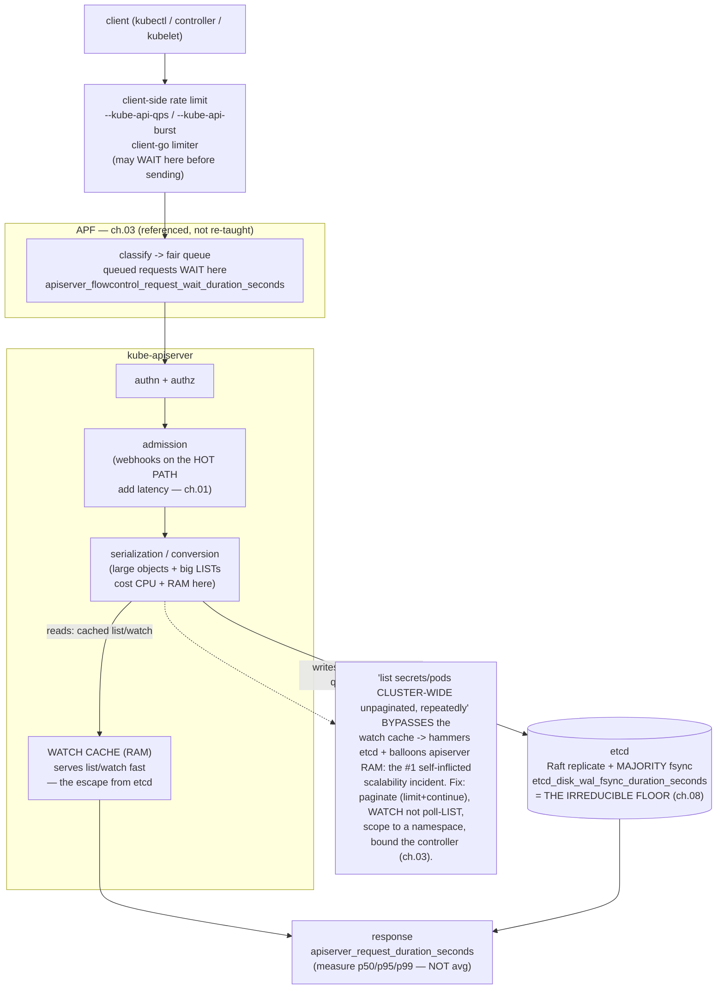

# 09 — Performance and scalability

> Where control-plane latency and limits actually come from, and the numbers
> the project guarantees: the **request path** client→(client qps/burst)→**APF**
> ([ch.03](03-api-priority-and-fairness.md) — referenced, not re-taught)→
> apiserver(authn/authz/admission/**watch cache**)→etcd (**disk fsync latency
> is the floor** — [ch.08](08-ha-control-plane-and-etcd.md)); **apiserver
> tuning** (`--max-requests-inflight`/`--max-mutating-requests-inflight` vs APF,
> watch-cache sizing, `--target-ram-mb`, audit cost, large-LIST /
> `limit`+`continue` pagination, the "list secrets/configmaps cluster-wide"
> anti-pattern); **etcd performance** (SSD/fsync, `--heartbeat-interval`/
> `--election-timeout`, keyspace size, #objects/watchers); **kubelet/node**
> (`--max-pods`, image GC, PLEG, cgroup v2); **scheduler throughput**
> (`percentageOfNodesToScore`); the official **Kubernetes scalability
> thresholds & SLOs** (≤5000 nodes / ≤150k pods / ≤300k containers; API
> LIST/WATCH/mutating-latency SLOs) and *why* they exist; **profiling**
> (`/debug/pprof` on apiserver/controller-manager/scheduler,
> `kubectl get --raw`, flamegraphs); **load/scale testing** (kube-burner & clusterloader2 —
> pinned, a SMALL kind-scale run, steady-state/percentiles-not-averages/
> control-vs-treatment methodology); the cost of observability / large objects
> / leader-election churn at scale — applied by scraping the Bookstore
> cluster's apiserver+etcd metrics, a tiny pinned **kube-burner** Bookstore-like
> object run with percentile readout, and reading **scheduler pprof**, honest
> that real limits need real scale.

**Estimated time:** ~60 min read · ~120 min hands-on
**Prerequisites:** [Part 11 ch.03](03-api-priority-and-fairness.md) — APF in the request path · [Part 11 ch.08](08-ha-control-plane-and-etcd.md) — etcd fsync latency as the floor · [Part 06 ch.01](../06-production-readiness/01-observability-metrics.md) — metrics scraping for apiserver+etcd
**You'll know after this:** • trace a request through client qps/burst → APF → apiserver → etcd · • tune apiserver inflight limits, watch-cache, and audit cost · • read the official Kubernetes scalability thresholds + SLOs (≤5000 nodes / ≤150k pods) · • profile apiserver / scheduler via `/debug/pprof` and flamegraphs · • run a small kube-burner load test and read percentile latencies correctly

<!-- tags: day-2, observability, platform-engineering, slo -->

## Why this exists

[Part 06 ch.01](../06-production-readiness/01-observability-metrics.md) taught
RED/USE for *application* latency; [Part 06
ch.06](../06-production-readiness/06-capacity-and-cost.md) right-sized
*workload* requests; [ch.03](03-api-priority-and-fairness.md) protected the
apiserver's *availability* under a flood; [ch.08](08-ha-control-plane-and-etcd.md)
established that **etcd disk fsync latency is the control plane's floor**. The
question none of them answered: *how big can this cluster get, where does the
latency come from before it gets there, and how do I prove it under load
instead of finding out in production?*

Scalability fails in production in specific, measurable ways:

1. **A latency cliff nobody could explain.** p99 of `kubectl`/controller
   requests climbs from 50 ms to seconds with no obvious cause. It is almost
   always one of a *short* list — etcd disk fsync slowed (the floor moved), a
   client doing huge unpaginated `LIST`s, the watch cache thrashing, or
   admission webhooks on the hot path ([ch.01](01-admission-webhooks.md)). You
   can only debug it if you know the request path's contributors *by name*.
2. **The "list everything" anti-pattern at scale.** A controller or dashboard
   does `LIST secrets`/`LIST pods` **cluster-wide, unpaginated, repeatedly**.
   On a 50-object lab it's invisible; on a 50,000-object cluster each call
   serialises hundreds of MB through the apiserver and etcd, evicts the watch
   cache, and spikes apiserver memory — the single most common
   self-inflicted scalability incident.
3. **Hitting an undocumented wall.** A team scales toward 8,000 nodes or
   200,000 pods and the cluster degrades — because they never read that
   Kubernetes **publishes** scalability thresholds (≈5,000 nodes, 150,000 pods,
   300,000 containers) and **SLOs** (API call latency, pod-startup) that define
   *the envelope it is engineered and tested for*. Past the envelope you are in
   unsupported territory and need to shard into more clusters
   ([ch.06](06-multi-cluster-and-fleet.md)).
4. **"It's fine" measured wrong.** Capacity is judged by an *average* over a
   quiet window, or a single ad-hoc run, so a p99 cliff and a regression
   between releases are both invisible. Performance is **percentiles at steady
   state, control vs treatment** — or it is anecdote.

This chapter makes control-plane performance *legible*: the request path's
latency contributors, the apiserver/etcd/kubelet/scheduler knobs that move
them, the official numbers that bound the whole thing, the profiling that finds
the hot spot, and the load testing (kube-burner / clusterloader2) that proves
it — with the Bookstore cluster as the (honestly small) measurement subject and
a clear line between what a laptop shows and what needs real scale. The
reference is *Production Kubernetes* ch.9 (Observability) & ch.13 (Autoscaling)
and the Kubernetes scalability-SIG thresholds/SLOs.

## Mental model

**Every API request walks a fixed pipeline, and each stage adds latency from a
known cause. The cluster's size limit is whichever resource that pipeline
exhausts first (almost always etcd or apiserver memory). You make it fast by
removing work from the hot path, and you *prove* it with percentiles at steady
state — never averages, never one run.**

- **The request path is the latency budget.** A write/read traverses:
  **client-side rate limit** (`--kube-api-qps`/`-burst`, `client-go` limiter —
  the request may *wait here before it is even sent*) → **APF**
  ([ch.03](03-api-priority-and-fairness.md): classify + fair-queue; queued
  requests wait here) → **apiserver** (authn → authz → **admission**, incl. any
  webhooks on the hot path [ch.01](01-admission-webhooks.md) → **serialization**
  → **watch cache** for reads, or → **etcd** for writes & non-cached reads) →
  **etcd** (Raft replicate + a **majority fsync** — the irreducible floor,
  [ch.08](08-ha-control-plane-and-etcd.md)). Every latency investigation is
  "which stage, and why" — and the metrics name the stages exactly
  (`apiserver_request_duration_seconds`, `etcd_disk_wal_fsync_duration_
  seconds`, `apiserver_flowcontrol_request_wait_duration_seconds`).
- **etcd disk fsync is the floor; the watch cache is the escape from it.**
  Every write blocks on a majority of etcd members fsync'ing to disk
  ([ch.08](08-ha-control-plane-and-etcd.md)) — no apiserver tuning beats a slow
  etcd disk; that is *the* number to protect (`etcd_disk_wal_fsync_duration_
  seconds` p99). Reads mostly avoid etcd via the apiserver's **watch cache**
  (it serves list/watch from RAM) — *unless* you force a quorum read or do huge
  uncached LISTs, which is exactly why the "list everything" pattern is so
  destructive: it bypasses the cache, hammers etcd, and balloons apiserver
  memory.
- **The big knobs, by component.** *apiserver*: `--max-requests-inflight` /
  `--max-mutating-requests-inflight` cap **total** concurrency that **APF then
  subdivides** ([ch.03](03-api-priority-and-fairness.md) — APF is the *unit of
  isolation*, these are the global ceiling); watch-cache sizing & `--target-ram-
  mb`/memory; **audit** logging cost (a verbose policy is real per-request
  latency); **pagination** (`limit` + `continue`). *etcd*: SSD/fsync,
  `--heartbeat-interval`/`--election-timeout` vs inter-member RTT, keyspace
  size, # objects & watchers ([ch.08](08-ha-control-plane-and-etcd.md)).
  *kubelet/node*: `--max-pods`, image GC, **PLEG** (pod lifecycle event
  generator) health, cgroup v2. *scheduler*: `percentageOfNodesToScore`
  (score fewer nodes per pod → higher throughput, slightly worse spread).
- **The envelope is published — design inside it.** Kubernetes is engineered
  and continuously tested against explicit **scalability thresholds**
  (per-cluster, *roughly*: **≤5,000 nodes**, **≤150,000 pods**, **≤300,000
  containers**, ≤100 pods/node) and **SLOs** that hold *within* that envelope:
  mutating API-call p99 **≤1 s**, read-only (per single object / per namespace
  scope) p99 **≤1 s** (≤30 s for cluster-wide LISTs of many objects),
  watch-propagation p99 ≤5 s, and pod-startup (image already present) p99
  ≤5 s. These are *guarantees of the test envelope*, not hard caps — but past
  them you are unsupported and the answer is **more clusters**
  ([ch.06](06-multi-cluster-and-fleet.md)), not a bigger one.
- **Profiling localises; load testing proves.** The apiserver,
  controller-manager and scheduler expose **`/debug/pprof`** (CPU, heap, goroutines)
  — pull it with `kubectl get --raw` and read a flame graph to find *where the
  time/RAM goes*. **kube-burner** / **clusterloader2** *generate* controlled
  load (create/churn N objects, drive M namespaces) and **measure** the
  pipeline (API latency percentiles, pod-startup, error rate) against the
  SLOs. Profiling answers "why is it slow"; load testing answers "is it within
  SLO at scale, and did this change regress it".
- **Performance is percentiles at steady state, control vs treatment.**
  Averages hide the cliff (an average of 50 ms with a p99 of 4 s is a broken
  cluster). Measure **p50/p95/p99** during **steady state** (after warm-up,
  caches primed, under sustained load — not the transient), and always compare
  a **control** vs a **treatment** (one variable changed) over enough samples.
  A single number from one ad-hoc run is an anecdote, not a measurement.

The trap to keep in view: **most "Kubernetes doesn't scale" is a workload doing
something quadratic to the control plane — not a Kubernetes limit.** The
fix is almost never "tune the apiserver harder"; it is *remove the work*
(paginate, watch instead of poll-LIST, scope LISTs to a namespace, bound the
controller [ch.03](03-api-priority-and-fairness.md)) and *protect the floor*
(fast etcd disk [ch.08](08-ha-control-plane-and-etcd.md)). Tuning knobs help at
the margin; the order of magnitude is in the workload.

## Diagrams

### Diagram A — request latency contributors: client → APF → apiserver → watch-cache/etcd (Mermaid)



### Diagram B — Kubernetes scalability thresholds & SLO cheat-table (ASCII)

```
 KUBERNETES SCALABILITY ENVELOPE — designed/tested-for, not hard caps ───────

  PER-CLUSTER THRESHOLDS (roughly; the official scalability-SIG numbers)
    nodes            <= 5,000
    pods             <= 150,000        (total)
    containers       <= 300,000
    pods per node    <= 110  (commonly run <= ~100; default --max-pods 110)
    services/eps     bounded (large headless / huge EndpointSlices hurt)
  -> WITHIN this envelope the SLOs below hold. PAST it = UNSUPPORTED:
     sub-divide into MORE clusters (ch.06 fleet), not a bigger one.

  SLOs (steady state, within the envelope; p99)
    mutating API call (create/update/delete, per resource)   <= 1 s
    read-only API call, single object OR namespaced scope     <= 1 s
    read-only API call, cluster-wide LIST of many objects     <= 30 s
    watch propagation (change visible to watchers)            <= 5 s
    pod startup (image already present, excl. image pull)     <= 5 s

  THE LATENCY FLOOR & THE BIG KNOBS (where the time actually goes)
    etcd majority fsync .... etcd_disk_wal_fsync_duration_seconds  <- FLOOR
       protect with: dedicated SSD, low jitter (ch.08). NO apiserver
       tuning beats a slow etcd disk.
    apiserver ........ --max-requests-inflight / --max-mutating-* (TOTAL
       ceiling APF subdivides, ch.03); watch-cache size; --target-ram-mb;
       AUDIT policy cost; pagination (limit+continue) vs huge LISTs
    etcd ............. SSD; --heartbeat-interval/--election-timeout vs RTT;
       keyspace size; #objects & #watchers (ch.08)
    kubelet/node ..... --max-pods; image GC; PLEG health; cgroup v2
    scheduler ........ percentageOfNodesToScore (lower => more throughput,
       slightly worse spread)

  MEASURE LIKE THIS (or it's anecdote):
    percentiles (p50/p95/p99) — NEVER averages (avg hides the cliff)
    STEADY STATE — after warm-up/caches primed, under sustained load
    CONTROL vs TREATMENT — one variable, enough samples, repeatable
    profiling (/debug/pprof) localises WHY; kube-burner/clusterloader2
      proves WITHIN-SLO-at-scale and catches regressions
```

## Hands-on with the Bookstore

**Assumed working directory: the guide repo root (`full-guide/`).** This
chapter adds the **new**
[`examples/bookstore/platform/kube-burner-bookstore.yaml`](../examples/bookstore/platform/kube-burner-bookstore.yaml)
(a kube-burner *config*, not a Kubernetes API object — a YAML doc carrier whose
real artefact is the pinned `kube-burner init` command; validated as well-formed
YAML, never `kubectl apply`-ed — same honesty pattern as the kind config in
[ch.08](08-ha-control-plane-and-etcd.md) and the apiserver-level `cluster/`
files). It modifies **no** canonical Bookstore manifest, Helm chart, Kustomize
overlay, the operator, or any other `examples/bookstore/**` file — purely
additive.

We will: (0) the honest laptop-vs-real-scale story; (1) scrape the Bookstore
cluster's **apiserver** request-latency + **etcd** fsync metrics; (2) read
**scheduler `/debug/pprof`**; (3) a **tiny pinned kube-burner** run creating/
deleting N Bookstore-like objects and read the **latency percentiles**; (4) the
scalability SLOs as the yardstick; (5) the "list everything" anti-pattern shown
concretely.

> **The honest scale story (read this first).** A single kind node is **~3-4
> orders of magnitude** below the scalability envelope (1 node vs 5,000;
> ~dozens of pods vs 150,000). So **real limits genuinely need real scale** —
> a 5,000-node test is a cloud + clusterloader2 exercise, not a laptop one,
> and that is stated, not faked. What **is** real on kind: the apiserver/etcd
> metrics and their *shape*, `/debug/pprof` flame graphs, and a **small
> kube-burner run** (create/churn a few hundred objects) that exercises the
> *exact same* pipeline and percentile methodology — just at small N. The
> numbers won't be production numbers; the **method** is identical and
> transferable. This is the same established honesty as [ch.08](08-ha-control-plane-and-etcd.md)'s
> "multi-CP kind is real, real HA HW is narrated".

### 0. Prerequisites — the Bookstore cluster (a real measurement subject)

Bring up the cluster + Bookstore exactly as in [Part 08 ch.02](../08-day-2-operations/02-backup-and-dr.md)
step 0 (kind, the four `bookstore/*:dev` images, the standard raw-manifests
chain, the migrate Job complete, deployments available). That gives a live
apiserver/etcd to scrape and a real workload to perturb. (kube-burner /
clusterloader2 tooling installs into its **own** namespace / runs as a CLI —
**never** into the PSA-`restricted` `bookstore` namespace; any object it
creates *in* `bookstore` is restricted-compliant — §3.)

### 1. Scrape the apiserver & etcd latency metrics (the request path, measured)

The apiserver and etcd expose Prometheus metrics at `/metrics` (the same
endpoint [Part 06 ch.01](../06-production-readiness/01-observability-metrics.md)
scrapes). Read the **request path** directly with `kubectl get --raw`:

```sh
# apiserver request latency — the top-line number. histogram buckets per
# verb/resource; this is what the API-call SLO is measured against:
kubectl get --raw='/metrics' | grep '^apiserver_request_duration_seconds_bucket' \
  | grep -E 'verb="(GET|LIST|POST|PUT|PATCH|DELETE)"' | grep 'resource="pods"' | head
#   apiserver_request_duration_seconds_bucket{...verb="LIST",resource="pods"...,le="0.1"} ...
#   ^ compute p99: the smallest `le` whose cumulative count >= 0.99 * total.
#     (Prometheus: histogram_quantile(0.99, sum by (le,verb,resource)
#      (rate(apiserver_request_duration_seconds_bucket[5m]))) — Part 06 ch.01.)

# etcd disk WAL fsync — THE FLOOR (ch.08). If this p99 is high, NOTHING the
# apiserver does makes writes fast. The single most important perf metric:
kubectl get --raw='/metrics' | grep '^etcd_disk_wal_fsync_duration_seconds_bucket' | tail -5
kubectl get --raw='/metrics' | grep -E '^etcd_disk_backend_commit_duration_seconds_bucket' | tail -3
#   wal_fsync p99 healthy << 10ms on SSD; tens-of-ms = a slow disk = a slow
#   cluster regardless of any apiserver knob (ch.08's "etcd disk is the floor").

# APF wait time — how long requests QUEUED before dispatch (ch.03, referenced):
kubectl get --raw='/metrics' | grep '^apiserver_flowcontrol_request_wait_duration_seconds_bucket' | grep 'priority_level' | head -3

# watch-cache effectiveness — cached reads vs etcd reads:
kubectl get --raw='/metrics' | grep -E '^apiserver_cache_list_total|^etcd_request_duration_seconds_count' | head
```

The discipline: read these as **percentiles** (compute from buckets / via
Prometheus `histogram_quantile`), at **steady state**, and **compare** before
vs after a change — never eyeball a single average.

### 2. Profile the scheduler — `/debug/pprof` and a flame graph

The apiserver, **controller-manager**, and **scheduler** serve Go `pprof` at
`/debug/pprof`. Pull a CPU profile of the **scheduler** via the apiserver proxy
and read where it spends time (the scheduler's hot path is filtering/scoring;
`percentageOfNodesToScore` is the knob it exposes):

```sh
# The scheduler runs as a static Pod in kube-system; reach its /debug/pprof
# through the apiserver pod proxy (no extra exposure needed):
SCHED=$(kubectl -n kube-system get pod -l component=kube-scheduler \
  -o jsonpath='{.items[0].metadata.name}')
# 15s CPU profile (the scheduler's secure port is 10259; the pod proxy tunnels):
kubectl get --raw="/api/v1/namespaces/kube-system/pods/https:${SCHED}:10259/proxy/debug/pprof/profile?seconds=15" \
  > /tmp/sched-cpu.pprof
go tool pprof -top -nodecount=15 /tmp/sched-cpu.pprof        # text: hottest funcs
# go tool pprof -http=:0 /tmp/sched-cpu.pprof                # interactive flame graph
kubectl get --raw="/api/v1/namespaces/kube-system/pods/https:${SCHED}:10259/proxy/debug/pprof/heap" \
  > /tmp/sched-heap.pprof                                    # heap (RAM) profile
go tool pprof -top -nodecount=10 /tmp/sched-heap.pprof
```

> **Honest note on a quiet cluster.** On an idle kind cluster the scheduler is
> nearly idle, so the CPU profile is mostly runtime/wait — *that is correct*,
> not a failure. The transferable skill is the **mechanism**
> (`kubectl get --raw … /debug/pprof/{profile,heap,goroutine}` → `go tool pprof`); the
> profile becomes informative under the kube-burner load in §3 (run §2 *during*
> a burst) or, at real scale, when scheduling thousands of pods.
> `go tool pprof` needs the **Go toolchain** installed (or the standalone
> `github.com/google/pprof` binary) — the only step here that does. The same
> `…/proxy/debug/pprof/…` path works for the **controller-manager**
> (`https:<CTRL-MGR-POD>:10257`) and the **apiserver**
> (`https:<APISERVER-POD>:6443`) — but scraping the *apiserver's own*
> `/debug/pprof` via the pod proxy additionally needs RBAC granting the
> `nonResourceURLs: ['/debug/pprof/*']` (works on kind as `system:masters`;
> a lesser identity gets `403`).

### 3. A tiny pinned kube-burner run — create/churn Bookstore-like objects, read percentiles

**kube-burner** creates a controlled number of objects, churns them, and
**measures** apiserver latency + pod-startup percentiles against thresholds.
Install it **pinned** (a released binary at a fixed version — the guide's
pinned-tool discipline, e.g. `TRIVY_VERSION`/`KUSTOMIZE_VERSION`; **never** a
`releases/latest/` URL):

```sh
KUBE_BURNER_VERSION=1.13.2          # github.com/kube-burner/kube-burner release (PIN)
OS=$(uname | tr '[:upper:]' '[:lower:]'); ARCH=$(uname -m | sed 's/x86_64/amd64/;s/aarch64/arm64/')
curl -sSL "https://github.com/kube-burner/kube-burner/releases/download/v${KUBE_BURNER_VERSION}/kube-burner-V${KUBE_BURNER_VERSION}-${OS}-${ARCH}.tar.gz" \
  | tar -xz -C /tmp kube-burner
/tmp/kube-burner version          # == ${KUBE_BURNER_VERSION} (pinned, reproducible)
```

[`platform/kube-burner-bookstore.yaml`](../examples/bookstore/platform/kube-burner-bookstore.yaml)
is the workload config: it creates a small number of throwaway, **restricted-
compliant** Deployments+ConfigMaps (Bookstore-shaped: a `pause` container with
the same restricted `securityContext` as the app pods) into a dedicated
`bookstore-perf` namespace (its **own** namespace — *not* the PSA-`restricted`
`bookstore`; system/load tooling never lands there), then deletes them, while
measuring API latency:

```sh
kubectl create namespace bookstore-perf 2>/dev/null || true
# SMALL on purpose (a laptop is ~3-4 orders below the envelope — honest §0):
/tmp/kube-burner init -c examples/bookstore/platform/kube-burner-bookstore.yaml \
  --log-level=info
#   churns the configured N objects; at the end prints latency QUANTILES:
#   ... PodLatencyQuantilesMeasurement  P50/P95/P99 for Ready/Initialized ...
#   ... apiserver request latency p99 for the run window ...
kubectl delete namespace bookstore-perf --wait=false      # tidy the perf ns
```

Read the **P99** rows, not the averages — and note this is the *exact* metric
and methodology a real clusterloader2 run uses at 5,000 nodes; only **N** and
the cluster differ. Re-run with one variable changed (control vs treatment) to
see a delta. (For a *standardised* large-scale test the upstream tool is
**clusterloader2** — same idea, the project's own scalability test harness;
it needs real scale and is the right tool for "is this cluster within the SLOs
at size".)

### 4. The scalability SLOs as the yardstick

The numbers you just measured only mean something against the **published
envelope** (Diagram B). On *this* tiny cluster every percentile will be far
inside the SLOs (1 node, dozens of objects) — that is expected and not proof
of anything at scale. The SLOs matter as the **pass/fail line for a real
scale test**: a clusterloader2 run at the target size is "green" iff mutating
API p99 ≤1 s, namespaced read p99 ≤1 s, watch propagation p99 ≤5 s, pod-startup
p99 ≤5 s — *and* node/pod/container counts are inside ≈5,000 / 150,000 /
300,000. Past the envelope the engineering answer is **shard into more
clusters** ([ch.06](06-multi-cluster-and-fleet.md)), not push one further.

### 5. The "list everything" anti-pattern, concretely

The most common self-inflicted scalability incident, shown on the Bookstore
(small here — imagine the object count ×10,000):

```sh
# ANTI-PATTERN: cluster-wide, UNPAGINATED list (a bad dashboard/controller).
# Each call serialises EVERY object through apiserver+etcd, bypassing the
# watch cache's benefit and spiking apiserver RAM at scale:
time kubectl get pods -A -o json >/dev/null            # all pods, no limit

# BETTER: paginate (limit + continue) — bounded memory per call. This is what
# a well-written client/controller does (client-go's pager, informers):
kubectl get pods -A --chunk-size=100 -o name >/dev/null # kubectl's limit+continue
# In a controller: WATCH (informer cache) instead of poll-LIST; scope LISTs to
# a namespace; never `LIST secrets --all-namespaces` on a loop (it also reads
# every Secret's bytes — a security AND a scale problem). Bound the controller
# with its own APF level so a regression is contained (ch.03).
```

The fix is *removing work from the hot path* (paginate, watch, scope), not
tuning the apiserver — exactly the chapter's core claim. Clean up:

```sh
kubectl delete namespace bookstore-perf --ignore-not-found
kind delete cluster --name bookstore
```

## How it works under the hood

- **The apiserver request pipeline is the latency budget, stage by stage.** A
  request is gated by the **client's own rate limiter** first (`client-go`
  QPS/burst — a request can sit here unsent, invisible server-side), then
  classified and possibly **queued by APF** ([ch.03](03-api-priority-and-fairness.md):
  `apiserver_flowcontrol_request_wait_duration_seconds` is *that* wait), then
  authn/authz, then **admission** (each webhook on the path is a synchronous
  network call added to the request — [ch.01](01-admission-webhooks.md)'s
  `timeoutSeconds` is a per-request latency tax), then **serialization** (large
  objects/big LISTs cost CPU + a large allocation here), then either the
  **watch cache** (RAM, fast) or **etcd**. `apiserver_request_duration_
  seconds` is the sum; you decompose it with the per-stage metrics. There is no
  mystery latency — only a stage you haven't measured yet.
- **etcd fsync is the irreducible floor; the watch cache is how reads avoid
  it.** A write returns only after the etcd leader replicated it and a
  **majority fsync'd to disk** ([ch.08](08-ha-control-plane-and-etcd.md)) —
  `etcd_disk_wal_fsync_duration_seconds` is a hard physical lower bound on
  write latency; a slow/jittery etcd disk slows *every* write and no apiserver
  setting compensates. Reads are kept off etcd by the apiserver's **watch
  cache** (it materialises objects from a watch stream and serves
  list/watch from memory at a recent resourceVersion). A cluster-wide,
  unpaginated `LIST` (especially one demanding quorum consistency, or of a kind
  the cache can't fully serve) **bypasses** that — going to etcd and
  allocating the whole result set in the apiserver — which is why it both
  spikes apiserver RAM and loads etcd: it defeats the one mechanism that makes
  reads cheap.
- **`--max-*-inflight` vs APF, and where each bites.** `--max-requests-inflight`
  / `--max-mutating-requests-inflight` cap the apiserver's **total** concurrent
  requests; **APF subdivides that total into fair, isolated shares**
  ([ch.03](03-api-priority-and-fairness.md) is the *isolation* layer, these are
  the *global ceiling*). Raising the inflight limits without faster etcd just
  moves the bottleneck onto etcd (more concurrent writes → more fsync
  contention). `--target-ram-mb` (and watch-cache sizing) bounds apiserver
  memory — undersized, the cache evicts and reads fall through to etcd;
  oversized, the apiserver OOMs under big LISTs. Verbose **audit** policy is
  per-request synchronous work (every request serialised to the audit sink) —
  a real, often-overlooked latency and I/O cost at scale.
- **etcd capacity scales with objects, watchers, and keyspace, not just QPS.**
  Total object count and size set the keyspace and the per-write replication
  cost; the number of **watchers** sets fan-out work on every change; keyspace
  growth interacts with compaction/defrag ([ch.08](08-ha-control-plane-and-etcd.md)).
  `--heartbeat-interval`/`--election-timeout` must match inter-member RTT —
  too tight across AZs causes spurious leader elections (a latency *and*
  availability event); too loose slows failure detection. This is why "how
  many objects" matters more than "how many requests/sec" for sizing.
- **kubelet/node throughput: PLEG, max-pods, image GC, cgroup v2.** Per node,
  the **PLEG** (Pod Lifecycle Event Generator) relists container state to
  generate events; at high pod density its relist period and the container
  runtime's responsiveness bound pod-startup latency (a slow PLEG shows as
  `PLEG is not healthy` and node `NotReady`). `--max-pods` (default 110) caps
  density; **image GC** thresholds (high/low disk %) and **cgroup v2** (more
  accurate, lower-overhead resource accounting) affect node-level latency and
  stability. Node count × pods/node is one axis of the scalability envelope for
  exactly these reasons.
- **Scheduler throughput: `percentageOfNodesToScore`.** For each pending pod
  the scheduler **filters** then **scores** feasible nodes ([Part 00
  ch.04](../00-foundations/04-control-plane-deep-dive.md)). Scoring *every*
  node in a 5,000-node cluster is expensive; `percentageOfNodesToScore` makes
  it score only a sample once enough feasible nodes are found — **higher
  scheduling throughput at slightly worse spread quality**. It is the
  scheduler's primary scale knob and a deliberate latency/quality trade-off,
  the scheduler-side analog of the apiserver's pagination trade-off.
- **Why profiling localises and load testing proves.** `/debug/pprof` exposes
  the Go runtime's CPU/heap/goroutine profiles for the apiserver/
  controller-manager/scheduler; a flame graph shows the *function-level* hot
  spot or allocation source (e.g. serialization of a huge LIST, a controller's
  reflector). That tells you **why**. **kube-burner**/**clusterloader2**
  generate reproducible load and emit the **percentile** measurements
  (API latency, pod-startup, errors) the SLOs are defined in — that tells you
  **whether you're within SLO at size and whether a change regressed it**.
  Profiling without load testing finds a hot spot you can't size; load testing
  without profiling tells you it's slow but not where. Production performance
  work uses both, always at **steady state**, always **control vs treatment**.

## Production notes

> **In production: protect the etcd disk first — it is the floor.** Before any
> apiserver tuning, ensure etcd is on **dedicated, fast, low-jitter SSD** and
> alert on `etcd_disk_wal_fsync_duration_seconds` p99 (and `etcd_disk_backend_commit_duration_seconds`)
> — a slow etcd disk makes every write slow and **no
> apiserver knob fixes it** ([ch.08](08-ha-control-plane-and-etcd.md)). This is
> the single highest-leverage performance action; everything else is margin by
> comparison.

> **In production: remove work from the hot path before tuning knobs.** The
> dominant scale incidents are workload-shaped: **paginate** every large LIST
> (`limit`+`continue`), **watch (informers) not poll-LIST**, **scope LISTs to a
> namespace**, and **never `LIST secrets`/`pods` cluster-wide on a loop**
> (quadratic apiserver+etcd load, and a security problem). Give every
> first-party controller its **own bounded APF level** so a regression is
> contained, not cluster-wide ([ch.03](03-api-priority-and-fairness.md)); keep
> **audit policy lean** (verbose audit is per-request latency + I/O). Tuning
> `--max-*-inflight`/watch-cache helps at the margin; the order of magnitude is
> in the workload.

> **In production: design inside the published envelope; shard, don't
> super-size.** Treat ≈**5,000 nodes / 150,000 pods / 300,000 containers** and
> the API/pod-startup **SLOs** as the engineered, tested envelope. As you
> approach it, the supported answer is **more clusters** ([ch.06](06-multi-cluster-and-fleet.md)'s
> fleet), *not* one bigger cluster — past the envelope you are unsupported and
> on your own for the failure modes. Track cluster size (nodes/pods/objects)
> as a first-class capacity signal ([Part 06
> ch.06](../06-production-readiness/06-capacity-and-cost.md)).

> **In production: measure with percentiles at steady state, control vs
> treatment — and load-test before you scale, not after.** Alert on apiserver
> request p99 (`apiserver_request_duration_seconds`), etcd fsync p99, APF
> rejects/wait ([ch.03](03-api-priority-and-fairness.md)), and scheduling
> latency — **never averages** (they hide the cliff). Run **clusterloader2/
> kube-burner** against the target scale in a staging cluster *before*
> production grows into it, and as a **regression gate** on control-plane/
> controller changes (a new webhook, a CRD with many objects, an operator
> [ch.02](02-operator-development.md) — profile it under load with
> `/debug/pprof`). "It was fine in the small cluster" is not evidence about
> the large one.

> **In production (managed — EKS/GKE/AKS):** the provider sizes/tunes the
> apiserver and etcd and runs them within (often their own, sometimes lower)
> scalability limits — you usually **cannot** set `--max-*-inflight`, etcd
> flags, or pull the apiserver's `/debug/pprof`, and the provider may **cap
> nodes/QPS** below the upstream envelope. What stays yours and matters *more*
> on managed: **client/controller behaviour** (pagination, watch-not-LIST,
> bounded controllers, sane `client-go` QPS), staying within the **provider's
> published limits**, and using the provider's **control-plane metrics**
> (managed apiserver/etcd dashboards) since you can't scrape your own. Your
> workload is still the dominant scale variable on a control plane you don't
> tune.

## Quick Reference

```sh
# The request path, measured (compute PERCENTILES from buckets — Part 06 ch.01)
kubectl get --raw='/metrics' | grep '^apiserver_request_duration_seconds_bucket'        # API latency
kubectl get --raw='/metrics' | grep '^etcd_disk_wal_fsync_duration_seconds_bucket'      # THE FLOOR (ch.08)
kubectl get --raw='/metrics' | grep '^apiserver_flowcontrol_request_wait_duration_seconds_bucket'  # APF wait (ch.03)
# Prometheus: histogram_quantile(0.99, sum by (le,verb,resource)
#   (rate(apiserver_request_duration_seconds_bucket[5m])))   # p99, not avg

# Profile the control plane (apiserver :6443 / ctrl-mgr :10257 / scheduler :10259)
P=$(kubectl -n kube-system get pod -l component=kube-scheduler -o jsonpath='{.items[0].metadata.name}')
kubectl get --raw="/api/v1/namespaces/kube-system/pods/https:${P}:10259/proxy/debug/pprof/profile?seconds=15" > cpu.pprof
go tool pprof -top -nodecount=15 cpu.pprof          # or: go tool pprof -http=:0 cpu.pprof (flame)

# Load/scale test — kube-burner PINNED (never releases/latest/), small on kind
KUBE_BURNER_VERSION=1.13.2
/tmp/kube-burner init -c examples/bookstore/platform/kube-burner-bookstore.yaml   # reads P50/P95/P99
# real scale / standardised: clusterloader2 (the project's own harness) on a cloud

# Scheduler throughput knob (lower => more throughput, slightly worse spread)
#   KubeSchedulerConfiguration: percentageOfNodesToScore: <N>
```

Scalability envelope + SLO yardstick (the numbers to design inside):

```
THRESHOLDS  nodes<=5000  pods<=150000  containers<=300000  pods/node<=~110
SLOs (p99)  mutating API <=1s   namespaced read <=1s   cluster LIST <=30s
            watch propagation <=5s   pod startup (no pull) <=5s
PAST IT  -> shard into MORE clusters (ch.06), NOT a bigger one (unsupported)
MEASURE  -> percentiles @ steady state, control vs treatment; pprof localises,
            kube-burner/clusterloader2 proves & gates regressions
```

Checklist:

- [ ] **etcd disk is the floor** — dedicated fast SSD, alert
      `etcd_disk_wal_fsync_duration_seconds` p99 before any apiserver tuning
      ([ch.08](08-ha-control-plane-and-etcd.md))
- [ ] Workload off the hot path: **paginate** big LISTs, **watch not
      poll-LIST**, **namespace-scope**, never cluster-wide `LIST secrets/pods`
      on a loop; bounded controllers ([ch.03](03-api-priority-and-fairness.md))
- [ ] apiserver `--max-*-inflight` understood as the **total ceiling APF
      subdivides** ([ch.03](03-api-priority-and-fairness.md)); watch-cache/
      `--target-ram-mb` sized; **audit policy lean**
- [ ] Design **inside ≈5000/150000/300000** + the API/pod-startup **SLOs**;
      past the envelope **shard** ([ch.06](06-multi-cluster-and-fleet.md)), not
      super-size
- [ ] Profile with **`/debug/pprof`** (apiserver/ctrl-mgr/scheduler) to
      localise; `percentageOfNodesToScore` for scheduler throughput
- [ ] Load-test with **kube-burner/clusterloader2** (pinned) at target scale
      **before** production grows, and as a **regression gate**
- [ ] Measure **percentiles at steady state, control vs treatment** — never
      averages, never one ad-hoc run

## Test your understanding

> Try each before opening the answer drawer. The act of trying is the exercise; the answer is the check.

1. **Why is etcd disk fsync latency "the floor" for apiserver write latency?**
   <details><summary>Show answer</summary>

   Every mutating apiserver call ends in `etcdserver.Write` which calls Raft's append-entry, which calls disk fsync on the leader plus quorum followers before acknowledging. The apiserver cannot return success until that round-trip completes. If fsync p99 is 30ms, no amount of apiserver tuning brings write latency below 30ms — the floor is the disk. The fix is faster storage (local NVMe), not bigger apiserver flags. This is why production etcd runs on dedicated low-latency disks, not shared cloud storage.

   </details>

2. **A teammate writes `kubectl get pods --all-namespaces` from a script every 10s. The cluster has 50,000 Pods. What is the impact on the control plane and what's the fix?**
   <details><summary>Show answer</summary>

   Each unpaginated LIST returns the full 50k Pods (~50MB of JSON), holds the watch-cache lock, and forces a full keyspace scan. With many such clients, the apiserver's RAM balloons (`--target-ram-mb`), GC churns, and `apiserver_request_duration_seconds` p99 spikes. Fix: use `--limit=500 --continue=<token>` pagination (LIST with chunked continuation), or use a watch with a resourceVersion to receive only deltas. Better: use a SharedInformer / client-go cache — never pull a full snapshot in a loop. This anti-pattern is the #1 cause of large-cluster apiserver pressure.

   </details>

3. **You bump `--max-requests-inflight=400` and `--max-mutating-requests-inflight=200`, but apiserver still tail-latency spikes. What did you miss?**
   <details><summary>Show answer</summary>

   APF is the active limiter — the inflight flags are coarse fallback bounds. Tuning the legacy flags higher just raises the ceiling; APF still partitions traffic per priority level and queues. The real diagnostic is `apiserver_flowcontrol_request_concurrency_limit` per level vs `_current_inqueue_requests` — see [ch.03](03-api-priority-and-fairness.md). Likely the bottleneck is a slow admission webhook, a watch-cache miss path, audit logging, or etcd write pressure. Always profile (`/debug/pprof`) before tuning concurrency.

   </details>

4. **Hands-on: with `kube-burner` or `clusterloader2`, ramp up 1000 namespaces × 10 Deployments × 3 replicas. What do you watch on the control plane?**
   <details><summary>What you should see</summary>

   `apiserver_request_duration_seconds` per verb (POST/PATCH for create, LIST for the bootstrap, WATCH for the long-poll). `etcd_disk_backend_commit_duration_seconds` and `etcd_disk_wal_fsync_duration_seconds`. `apiserver_flowcontrol_rejected_requests_total` for APF pressure. `apiserver_storage_objects` by resource — Pods will be 30k, Endpoints will be 10k, ReplicaSets 10k. Scheduler `scheduler_scheduling_attempt_duration_seconds`. Run two passes — once at baseline, once with the change — and compare *percentiles*, not means. If anything degrades 2x at the percentile, you've found your regression.

   </details>

## Further reading

- **Rosso et al., _Production Kubernetes_, ch.9 — "Observability" & ch.13 —
  "Autoscaling"**: instrumenting and reasoning about control-plane/workload
  performance, the metrics that matter, and scaling behaviour under load — the
  operational frame for this chapter's request-path and load-testing model.
- **Ibryam & Huß, _Kubernetes Patterns_ 2e — *Predictable Demands* (ch.2) &
  *Elastic Scale* (ch.29)**: declaring and bounding resource demand and scaling
  as a pattern — the workload-side discipline that keeps a cluster inside its
  scalability envelope (the through-line from [Part 06
  ch.06](../06-production-readiness/06-capacity-and-cost.md)).
- Official: the Kubernetes scalability **thresholds**
  <https://github.com/kubernetes/community/blob/master/sig-scalability/configs-and-limits/thresholds.md>
  and **SLOs**
  <https://github.com/kubernetes/community/blob/master/sig-scalability/slos/slos.md>,
  building large clusters
  <https://kubernetes.io/docs/setup/best-practices/cluster-large/>, profiling
  with pprof <https://kubernetes.io/docs/tasks/debug/debug-cluster/profiling/>,
  and the load-testing tools **clusterloader2**
  <https://github.com/kubernetes/perf-tests/tree/master/clusterloader2> and
  **kube-burner** <https://kube-burner.github.io/kube-burner/>.
