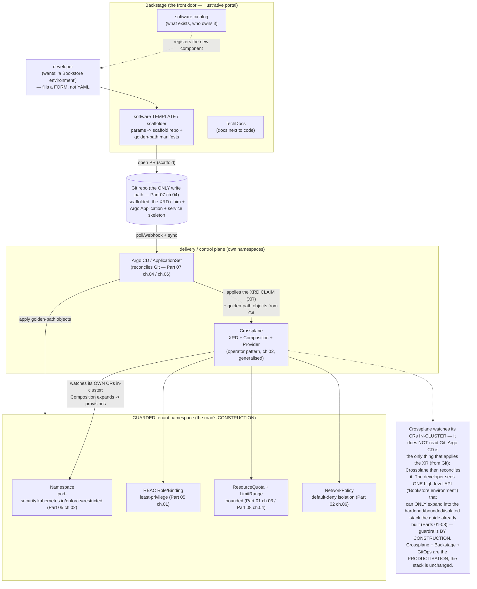

# 10 — Platform engineering

> The internal-developer-platform thesis: dev teams want a **paved road**, not
> raw Kubernetes — platform engineering = productise the cluster (**self-service
> + guardrails**); "platform as a product" / Team Topologies; the **golden
> path**. **Crossplane** as the control-plane-for-infra (`Provider` /
> `ProviderConfig` / **CompositeResourceDefinition (XRD)** / **Composition** /
> **Claim** — and the v2 namespaced-XR model that supersedes the Claim term;
> reconcile-to-target via the Kubernetes API — ties [Part 10](../10-cloud-and-managed-kubernetes/01-managed-kubernetes-model.md)
> cloud-identity + the operator pattern [ch.02](02-operator-development.md));
> **Backstage** (software catalog, **scaffolder / software templates**,
> TechDocs, plugins); **Score** / portable workload spec; the
> self-service-with-guardrails stack = everything the guide already built made
> consumable — PSA-restricted (Part 05) + RBAC (Part 05) + ResourceQuota/
> LimitRange (Part 01/08) + NetworkPolicy (Part 02) + policy (Part 05 ch.03
> Kyverno / [ch.01](01-admission-webhooks.md)) + GitOps (Part 07) +
> ApplicationSet ([ch.06](06-multi-cluster-and-fleet.md)) + the BookstoreTenant
> operator ([ch.02](02-operator-development.md)) — assembled into a "request a
> Bookstore environment" golden path; metrics that matter (DORA / adoption /
> cognitive load); build-vs-buy (Backstage vs commercial IDPs) & "don't build a
> platform nobody asked for" — applied by installing **Crossplane** (pinned
> Helm, own ns) and shipping a tiny **XRD + Composition + Claim** that
> provisions a **guarded namespace** (RBAC + Quota + NetworkPolicy + PSA
> labels) — the paved-road primitive for a Bookstore tenant — plus the
> conceptual Backstage software-template flow, in the new
> [`examples/bookstore/platform/`](../examples/bookstore/platform/) tree.

**Estimated time:** ~60 min read · half-day hands-on
**Prerequisites:** [Part 11 ch.02](02-operator-development.md) — operator pattern Crossplane composes with · [Part 11 ch.06](06-multi-cluster-and-fleet.md) — ApplicationSet delivery for the paved road · [Part 05 ch.03](../05-security/03-supply-chain.md) — Kyverno guardrails inside the paved road
**You'll know after this:** • articulate the "platform as a product" thesis and the golden-path mental model · • author a Crossplane XRD + Composition + Claim that provisions a guarded namespace · • compare Crossplane / Backstage / Score and where each fits the IDP stack · • measure platform success via DORA / adoption / cognitive-load metrics · • decide build-vs-buy between Backstage and commercial IDPs

<!-- tags: platform-engineering, crossplane, backstage, gitops, multi-tenancy -->

## Why this exists

Every prior part built a *capability*: [Part 05](../05-security/02-pod-security.md)
hardened workloads (PSA, RBAC, policy); [Part 01 ch.03](../01-core-workloads/03-resources-and-qos.md)/[Part
08 ch.04](../08-day-2-operations/04-multi-tenancy-and-namespaces.md) bounded
them (Quota/LimitRange); [Part 02 ch.06](../02-networking/06-network-policies.md)
isolated them (NetworkPolicy); [Part 07](../07-delivery/04-gitops-argocd.md)
delivered them (GitOps); [ch.02](02-operator-development.md) encoded an
org-specific tenant primitive (the `BookstoreTenant` operator);
[ch.06](06-multi-cluster-and-fleet.md) fanned them across a fleet
(ApplicationSet). [Part 08 ch.04](../08-day-2-operations/04-multi-tenancy-and-namespaces.md)
even ended on the thread: *"namespace + quota + RBAC + NetworkPolicy as a
single declarative thing a tenant can request — that is the platform-
engineering chapter."* This is that chapter, and it is the **synthesis** of the
whole guide: not a new capability, but the *productisation* of every capability
already built.

Platform engineering exists because of a specific, recurring organisational
failure:

1. **Every team re-solves the same Kubernetes.** Without a paved road, each
   product team independently learns PSA, writes RBAC, sets quotas, authors
   NetworkPolicies, wires GitOps, and gets some of it subtly wrong — N teams ×
   the same undifferentiated heavy lifting, N inconsistent (and N
   inconsistently-secure) results. The platform's job is to do it **once,
   correctly, as a self-service product**.
2. **"Raw Kubernetes" is the wrong interface for a product developer.** A
   developer shipping the next Bookstore service should not have to know
   `securityContext`, `ResourceQuota`, `NetworkPolicy`, `Application`, and the
   conversion-webhook story to get an environment. The platform's job is to
   offer a *higher-level interface* ("give me a Bookstore environment") that
   *expands into* all of that, hardened, behind the scenes.
3. **Central ticket-ops doesn't scale; ungoverned self-service is chaos.** A
   platform team that manually provisions every namespace is a bottleneck; a
   free-for-all where anyone can create anything is a security and cost
   incident. Platform engineering is the synthesis: **self-service** (no ticket)
   **with guardrails** (the request can only produce a hardened, bounded,
   policy-compliant result — the [Part 05](../05-security/02-pod-security.md)/[Part
   08 ch.04](../08-day-2-operations/04-multi-tenancy-and-namespaces.md) stack,
   enforced *by construction*).
4. **Platforms built without users.** The opposite failure: a platform team
   builds an elaborate IDP nobody asked for, on assumptions never validated,
   and adoption is zero. "Platform as a product" means **a product** — with
   users, a backlog, adoption metrics, and the discipline to *not* build what
   no team needs.

This chapter is the capstone of Part 11: the **paved road** assembled from
parts the guide already shipped — Crossplane to expose infra/environments as
a custom Kubernetes API, the guardrail stack as what those APIs *produce*,
Backstage as the developer-facing catalog/scaffolder, GitOps as the delivery
spine — with the honest counterweight that *most teams should buy or stay
simple, and a platform nobody asked for is waste*. The reference is *Production
Kubernetes* ch.11 (Building Platform Services) & ch.16 (Platform Abstractions),
*Kubernetes Patterns* ch.27–28 (Controller/Operator), and the Crossplane /
Backstage docs.

## Mental model

**A platform is a product whose interface is a small set of high-level,
self-service APIs ("a Bookstore environment", "a database"), each of which
*expands* — by a controller you configure, not code per request — into the
hardened, bounded, isolated, GitOps-delivered stack the guide already built.
The developer sees the road; the guardrails are the road's construction, not a
gate they negotiate.**

- **Paved road = self-service × guardrails, productised.** The two are *not* in
  tension when the guardrails are *what the self-service API produces*. "Request
  a Bookstore tenant" can *only* yield a namespace that is PSA-`restricted`
  ([Part 05 ch.02](../05-security/02-pod-security.md)), RBAC-scoped ([Part 05
  ch.01](../05-security/01-authn-authz-rbac.md)), Quota/LimitRange-bounded
  ([Part 01 ch.03](../01-core-workloads/03-resources-and-qos.md)/[Part 08
  ch.04](../08-day-2-operations/04-multi-tenancy-and-namespaces.md)),
  NetworkPolicy-isolated ([Part 02
  ch.06](../02-networking/06-network-policies.md)), policy-checked ([Part 05
  ch.03](../05-security/03-supply-chain.md)/[ch.01](01-admission-webhooks.md)),
  and GitOps-reconciled ([Part 07
  ch.04](../07-delivery/04-gitops-argocd.md)) — because the platform *defines
  the expansion*. Guardrails by construction, not by review.
- **Crossplane = a control plane for infra/environments, expressed as your own
  Kubernetes API.** It is the operator pattern ([ch.02](02-operator-development.md))
  generalised to *anything*: a **`Provider`** + **`ProviderConfig`** teach the
  cluster to manage external resources (a cloud, or — via
  *provider-kubernetes* — *in-cluster* objects, tying [Part 10
  ch.03](../10-cloud-and-managed-kubernetes/03-cloud-identity.md)'s cloud
  identity); a **`CompositeResourceDefinition` (XRD)** declares a *new
  high-level API* (e.g. `BookstoreEnvironment`); a **`Composition`** is the
  *recipe* that one XRD instance expands into (the guarded-namespace stack); the
  developer creates an **instance of the XRD** (historically a separate
  **`Claim`**; in **Crossplane v2** the XR is itself namespaced and you create
  it directly — the Claim term is legacy, [How it works](#how-it-works-under-the-hood)),
  and Crossplane **continuously reconciles** the real objects to it.
- **Backstage = the developer's front door (catalog + scaffolder + docs).** The
  **software catalog** is the inventory of everything ("which services exist,
  who owns them"); the **scaffolder / software templates** turn "I want a new
  Bookstore service" into a *parameterised* action that **scaffolds a repo +
  the golden-path manifests (the XRD claim, the Argo `Application`) and opens a
  PR** — the developer fills a form, the platform's template materialises the
  paved road; **TechDocs** keeps docs next to code; **plugins** surface CI/CD,
  cost, k8s state in one pane.
- **Score (and the portable-spec idea).** A developer writes a workload **once**
  in a platform-agnostic spec; the platform *translates* it to the concrete
  target (Kubernetes manifests, a Compose file). It is the same "high-level
  intent → platform expands it" principle as Crossplane/Backstage, applied to
  the *workload* rather than the *environment*.
- **The platform IS the guide's stack, assembled.** Nothing here is a new
  primitive: PSA + RBAC + Quota/LimitRange + NetworkPolicy + Kyverno/webhooks +
  GitOps + ApplicationSet + the `BookstoreTenant` operator — each built in an
  earlier Part — composed into one self-service request. Platform engineering
  is *integration and productisation discipline*, not new Kubernetes.
- **A platform is a product: measure it, and don't build what nobody asked
  for.** Success is **adoption** (are teams using the road?), **DORA**
  (deploy frequency, lead time, change-fail rate, MTTR — does the road make
  delivery better?), and **cognitive load** (Team Topologies: does it *reduce*
  what a product team must know?). The dominant failure is a platform built on
  unvalidated assumptions: build-vs-buy is real (Backstage and commercial IDPs
  are heavy), and the right amount of platform is often **less** than a
  platform team wants to build.

The trap to keep in view: **a platform that adds a layer without removing
cognitive load is negative value — it is one more thing to learn on top of
Kubernetes, not instead of it.** The paved road only pays off if the high-level
API genuinely hides the guardrail stack (the developer does *not* now also
debug Crossplane Compositions and Backstage templates). Build the *narrowest*
golden path real teams asked for, buy/stay-simple where you can, and treat
adoption as the only proof it worked — exactly the [ch.02](02-operator-development.md)
"build only your own domain logic, and run it like a product" discipline,
scaled to the whole developer interface.

## Diagrams

### Diagram A — the paved road: developer → Backstage template → Git → GitOps/Crossplane → guarded cluster (Mermaid)



### Diagram B — platform capability stack: guardrails ↔ self-service, mapped to the Part that built each (ASCII)

```
 THE PAVED ROAD = the guide's stack, PRODUCTISED (nothing new — assembled) ──

  SELF-SERVICE FACE (what the developer touches)
   Backstage software template / catalog ......... this chapter (illustrative)
   ONE high-level API: "a Bookstore environment" .. XRD claim (this chapter)
        |  expands (Crossplane Composition; operator pattern = ch.02) into:
        v
  GUARDRAILS BY CONSTRUCTION (what the request can ONLY produce)
   ┌──────────────────────────────────────────────────────────────────────┐
   │ PSA enforce=restricted ............... Part 05 ch.02 (pod security)   │
   │ RBAC Role/RoleBinding (least-priv) ... Part 05 ch.01 (authn/authz)    │
   │ ResourceQuota + LimitRange ........... Part 01 ch.03 / Part 08 ch.04  │
   │ NetworkPolicy (default-deny) ......... Part 02 ch.06 (segmentation)   │
   │ Policy (Kyverno / adm. webhook) ...... Part 05 ch.03 / ch.01          │
   │ BookstoreTenant operator (optional) .. ch.02 (org tenant primitive)   │
   └──────────────────────────────────────────────────────────────────────┘
        |  delivered & kept-true by:
        v
  DELIVERY SPINE
   GitOps (the only write path) .......... Part 07 ch.04 (Argo CD)
   ApplicationSet (fan-out to a fleet) ... ch.06 (multi-cluster)
        |  provisioned/reconciled by:
        v
  CONTROL PLANE FOR INFRA/ENVIRONMENTS
   Crossplane Provider/ProviderConfig .... this chapter (+ Part 10 ch.03
     XRD / Composition / Claim(=v2 XR)        cloud identity for cloud infra)

  MEASURE IT (it's a PRODUCT, not a project):
   adoption (teams ON the road?) · DORA (deploy freq / lead time / CFR /
   MTTR) · cognitive load (Team Topologies — did it REDUCE what a product
   team must know?).  Build-vs-buy is real; a platform nobody asked for = 0.
```

## Hands-on with the Bookstore

**Assumed working directory: the guide repo root (`full-guide/`).** This
chapter adds the **new**
[`examples/bookstore/platform/`](../examples/bookstore/platform/) tree's
golden-path artefacts —
[`crossplane-xrd.yaml`](../examples/bookstore/platform/crossplane-xrd.yaml),
[`crossplane-composition.yaml`](../examples/bookstore/platform/crossplane-composition.yaml),
[`bookstore-env-claim.yaml`](../examples/bookstore/platform/bookstore-env-claim.yaml),
and the Backstage scaffolder carrier
[`backstage-template.yaml`](../examples/bookstore/platform/backstage-template.yaml)
(+ the [ch.08](08-ha-control-plane-and-etcd.md)/[ch.09](09-performance-and-scalability.md)
files already in this tree). It modifies **no** canonical Bookstore manifest,
Helm chart, Kustomize overlay, the operator, the `argocd/`/`operators/`/
`multicluster/` trees, or any other `examples/bookstore/**` file — purely
additive (the Gateway-vs-Ingress / CNPG / operator / multicluster precedent).

We will: (0) the honest "Backstage is heavy; Crossplane is runnable" story;
(1) install **Crossplane** (pinned Helm, own ns) + provider-kubernetes;
(2) read & dry-run the **XRD + Composition** (CRD-intrinsic note); (3) create
the **claim** and watch the **guarded namespace stack** get provisioned and
reconciled; (4) the **Backstage software-template** flow, conceptually + its
real structure; (5) where the BookstoreTenant operator / ApplicationSet plug
into the same road; (6) the CRD-intrinsic dry-run, documented.

> **The honest scope (read this first).** **Crossplane is fully runnable on
> kind** — install it (pinned Helm), install provider-kubernetes, apply the
> XRD/Composition/claim, and watch a *real* guarded namespace get provisioned
> and self-healed. That half is not faked. **Backstage's full portal is
> deliberately heavy** (a Node app + a database + auth + plugins) — installing
> it is a real exercise but its *value here is the template/catalog model*, so
> this chapter shows the **real `Template`/`catalog-info` structure** and the
> **conceptual scaffold flow**, gives the **pinned-Helm install command**, and
> marks the running portal **illustrative** — the same established honesty as
> the guide's "needs a real remote/registry/scale" notes ([Part 07
> ch.04](../07-delivery/04-gitops-argocd.md)/[ch.09](09-performance-and-scalability.md)).
> Every manifest dry-runs with **no cluster**; the Crossplane CRs carry the
> documented CRD-intrinsic note (§6).

### 0. Prerequisites — a cluster (the golden path provisions INTO it)

A kind cluster is enough (the golden path provisions *in-cluster* objects via
provider-kubernetes — no cloud account needed for the namespace primitive;
provisioning *cloud* infra would add a cloud `Provider` + [Part 10
ch.03](../10-cloud-and-managed-kubernetes/03-cloud-identity.md) identity, noted
not run). The Bookstore app itself need not be running for the namespace
primitive — but bring it up (the [Part 08 ch.02](../08-day-2-operations/02-backup-and-dr.md)
step-0 chain) if you want to then deploy a tenant *into* the provisioned
namespace:

```sh
kind delete cluster --name bookstore 2>/dev/null || true
kind create cluster --name bookstore
kubectl cluster-info
```

### 1. Install Crossplane (pinned Helm, its OWN namespace) + provider-kubernetes

Per this guide's rule — **pinned Helm chart; never a `releases/latest/download/<PINNED-FILE>.yaml` URL** (same precedent as the cert-manager/Argo CD/Velero/
Kyverno installs). Crossplane installs into its **own** `crossplane-system`
namespace (system tooling never lands in `bookstore`):

```sh
CROSSPLANE_CHART_VERSION=1.18.0     # crossplane-stable/crossplane chart (PIN —
                                    # check the chart repo for the current ver)
helm repo add crossplane-stable https://charts.crossplane.io/stable
helm repo update
helm install crossplane crossplane-stable/crossplane \
  --namespace crossplane-system --create-namespace \
  --version "$CROSSPLANE_CHART_VERSION" --wait
kubectl -n crossplane-system rollout status deploy/crossplane
kubectl get pods -n crossplane-system          # crossplane + rbac-manager

# provider-kubernetes lets a Composition manage IN-CLUSTER objects (our
# guarded namespace stack). It is a Crossplane Provider (pinned image tag):
PROVIDER_KUBERNETES_VERSION=v0.16.0            # provider-kubernetes (PIN)
kubectl apply -f - <<EOF
apiVersion: pkg.crossplane.io/v1
kind: Provider
metadata:
  name: provider-kubernetes
spec:
  package: xpkg.crossplane.io/crossplane-contrib/provider-kubernetes:${PROVIDER_KUBERNETES_VERSION}
EOF
kubectl wait --for=condition=Healthy provider/provider-kubernetes --timeout=180s

# function-patch-and-transform — the Pipeline FUNCTION the Composition's
# `functionRef` requires. WITHOUT it the Composition silently never executes
# (the XR stays SYNCED/READY=False forever) — so install it PINNED and wait
# for it to be Healthy BEFORE the XRD/Composition/XR steps:
FPT_VERSION=v0.8.2                             # function-patch-and-transform (PIN — not :latest)
kubectl apply -f - <<EOF
apiVersion: pkg.crossplane.io/v1
kind: Function
metadata:
  name: function-patch-and-transform
spec:
  package: xpkg.crossplane.io/crossplane-contrib/function-patch-and-transform:${FPT_VERSION}
EOF
kubectl wait --for=condition=Healthy function/function-patch-and-transform --timeout=180s

# The provider's in-cluster identity (InjectedIdentity = its own ServiceAccount)
# + the RBAC it needs to create the guarded-namespace objects. Scope this to
# EXACTLY the kinds the Composition creates (least-privilege — Part 05 ch.01).
# Select the SA by the provider's revision label (robust when MULTIPLE
# providers are installed — never a fragile name grep):
SA=$(kubectl -n crossplane-system get sa \
  -l pkg.crossplane.io/provider=provider-kubernetes \
  -o jsonpath='{.items[0].metadata.name}')
kubectl create clusterrole bookstore-paved-road \
  --verb=get,list,watch,create,update,patch,delete \
  --resource=namespaces,resourcequotas,limitranges,roles.rbac.authorization.k8s.io,rolebindings.rbac.authorization.k8s.io,networkpolicies.networking.k8s.io
kubectl create clusterrolebinding bookstore-paved-road \
  --clusterrole=bookstore-paved-road \
  --serviceaccount=crossplane-system:"$SA"
kubectl apply -f - <<EOF
apiVersion: kubernetes.crossplane.io/v1alpha1
kind: ProviderConfig
metadata: { name: default }
spec:
  credentials: { source: InjectedIdentity }
EOF
```

The install order is **Crossplane → provider-kubernetes (Healthy) →
function-patch-and-transform (Healthy) → XRD → Composition → XR/claim → observe
SYNCED/READY** — the Function and Provider **must** be Healthy before the
Composition is applied, or the Composition's pipeline never runs and the XR
never reconciles (the most common Crossplane "nothing happens" footgun).

Installing Crossplane created the `apiextensions.crossplane.io` /
`pkg.crossplane.io` CRDs. **This is what makes the XRD/Composition/claim
dry-runnable** — before this, a client dry-run prints `no matches for kind
"CompositeResourceDefinition"` (the documented CRD-intrinsic behaviour; §6).

### 2. The XRD + Composition — the high-level API and its expansion

[`platform/crossplane-xrd.yaml`](../examples/bookstore/platform/crossplane-xrd.yaml)
declares the **new high-level API** `BookstoreEnvironment` — a *namespaced* XR
(Crossplane **v2** model: `apiextensions.crossplane.io/v2`, `scope:
Namespaced`; the v1 *Claim* term is legacy — [How it
works](#how-it-works-under-the-hood)). Its schema is deliberately tiny: a
developer supplies a `tenant` name and a `size` — *nothing* about
securityContext/RBAC/quota/policy:

```sh
kubectl apply --dry-run=client -f examples/bookstore/platform/crossplane-xrd.yaml
#   (without Crossplane installed -> "no matches for kind
#    CompositeResourceDefinition in version apiextensions.crossplane.io/v2"
#    EXPECTED — the documented CRD-intrinsic note, §6)
kubectl apply --dry-run=client -f examples/bookstore/platform/crossplane-composition.yaml
```

[`platform/crossplane-composition.yaml`](../examples/bookstore/platform/crossplane-composition.yaml)
is the **recipe**: a `Composition` (Pipeline mode, `function-patch-and-transform`
— the current Crossplane composition model) that expands ONE
`BookstoreEnvironment` into provider-kubernetes `Object`s wrapping the
**guarded-namespace stack**: a PSA-`restricted` **Namespace**, a least-privilege
**Role + RoleBinding**, a **ResourceQuota + LimitRange**, and a default-deny
**NetworkPolicy** — i.e. *exactly* the [Part 05](../05-security/02-pod-security.md)/[Part
01 ch.03](../01-core-workloads/03-resources-and-qos.md)/[Part 02
ch.06](../02-networking/06-network-policies.md)/[Part 08
ch.04](../08-day-2-operations/04-multi-tenancy-and-namespaces.md) stack, but
*produced by the platform from a 2-field request*. The developer never writes
any of it; they cannot produce an *un*-guarded environment.

### 3. Create the claim → the guarded namespace is provisioned & reconciled

Install the XRD + Composition, then create the **claim**
([`platform/bookstore-env-claim.yaml`](../examples/bookstore/platform/bookstore-env-claim.yaml)
— a namespaced `BookstoreEnvironment` instance: the developer-facing object,
2 fields):

```sh
# (step 1 already installed Crossplane + provider-kubernetes Healthy +
#  function-patch-and-transform Healthy — the Composition's functionRef
#  REQUIRES that Function, so it must be Healthy BEFORE this Composition is
#  applied or the XR never reconciles. Order: XRD -> Composition -> XR.)
kubectl apply -f examples/bookstore/platform/crossplane-xrd.yaml
kubectl apply -f examples/bookstore/platform/crossplane-composition.yaml
# wait for the new API to be served (the XRD becomes a real CRD endpoint):
kubectl wait --for=condition=Established \
  crd/bookstoreenvironments.platform.bookstore.example.com --timeout=120s

kubectl create namespace platform-tenants 2>/dev/null || true   # the XR request ns
kubectl apply -f examples/bookstore/platform/bookstore-env-claim.yaml
#   creates BookstoreEnvironment "acme" in namespace "platform-tenants"
kubectl get bookstoreenvironment acme -n platform-tenants
#   NAME   SYNCED   READY   ...
#   acme   True     True            <- Crossplane reconciled the Composition

# THE PAVED ROAD'S OUTPUT: a guarded namespace, provisioned from 2 fields.
kubectl get ns bookstore-tenant-acme --show-labels
#   ... pod-security.kubernetes.io/enforce=restricted ...   (Part 05 ch.02)
kubectl get role,rolebinding,resourcequota,limitrange,networkpolicy -n bookstore-tenant-acme
#   role/bookstore-tenant            (least-privilege — Part 05 ch.01)
#   rolebinding/bookstore-tenant
#   resourcequota/bookstore-tenant   (bounded — Part 01 ch.03 / Part 08 ch.04)
#   limitrange/bookstore-tenant
#   networkpolicy/default-deny       (isolated — Part 02 ch.06)

# IT IS RECONCILED (operator pattern, ch.02, generalised): delete a piece by
# hand and Crossplane heals it back to the Composition — drift-correction, the
# same property GitOps gives declarative state (Part 07 ch.04):
kubectl delete networkpolicy default-deny -n bookstore-tenant-acme
kubectl get networkpolicy -n bookstore-tenant-acme -w   # Crossplane recreates it

# TEARDOWN is one delete — the Composition's objects are owned by the XR:
kubectl delete -f examples/bookstore/platform/bookstore-env-claim.yaml
kubectl get ns bookstore-tenant-acme   # being removed (Crossplane GC'd the stack)
```

That is the entire thesis in one loop: **a 2-field self-service request
expanded — by construction — into the guide's hardened/bounded/isolated stack,
and is kept true by a reconciler.** The developer got a *paved road*; the
*guardrails were the road*.

### 4. Backstage — the developer's front door (real structure, illustrative portal)

Backstage turns "I want a new Bookstore service on the golden path" into a
**form**. [`platform/backstage-template.yaml`](../examples/bookstore/platform/backstage-template.yaml)
is a **real Backstage `Template`** (`backstage.io/v1beta3`) + a `catalog-info`
sketch: it declares form **parameters** (service name, owner, size) and
**steps** that **fetch a skeleton, render the golden-path manifests (the
`BookstoreEnvironment` claim + an Argo `Application`), and open a PR** —
delivery via the same GitOps spine ([Part 07
ch.04](../07-delivery/04-gitops-argocd.md)). It is a Backstage catalog object,
**not** a Kubernetes API object — a YAML doc carrier (validated as well-formed
YAML, never `kubectl apply`-ed; same honesty pattern as the
[ch.08](08-ha-control-plane-and-etcd.md) kind config / [ch.09](09-performance-and-scalability.md)
kube-burner config):

```sh
/usr/bin/python3 -c 'import yaml; list(yaml.safe_load_all(open("examples/bookstore/platform/backstage-template.yaml"))); print("backstage-template.yaml: valid YAML (Backstage Template — not a k8s object)")'
```

> **The honest Backstage scope.** The **full portal** (Backstage is a Node app
> + Postgres + auth + plugins) installs via its **pinned Helm chart** into its
> **own** namespace — given here as the real command, marked **illustrative**
> because running the portal is heavy and orthogonal to the lesson (the
> *template/catalog model* is the lesson, and it is shown in full):
>
> ```sh
> # ILLUSTRATIVE — the real pinned install; running the portal is heavy and
> # not required to understand the golden-path model (the Template above IS
> # the model). Backstage's official Helm chart:
> BACKSTAGE_CHART_VERSION=2.0.0       # backstage/backstage chart (PIN)
> helm repo add backstage https://backstage.github.io/charts && helm repo update
> helm install backstage backstage/backstage \
>   --namespace backstage --create-namespace \
>   --version "$BACKSTAGE_CHART_VERSION" --wait
> ```
>
> The **conceptual flow** end-to-end: developer opens Backstage → picks the
> "Bookstore service (golden path)" template → fills `name`/`owner`/`size` →
> Backstage scaffolds a repo with the service skeleton **+ the
> `BookstoreEnvironment` claim + the Argo `Application`** and **opens a PR** →
> merge → Argo CD reconciles it ([Part 07
> ch.04](../07-delivery/04-gitops-argocd.md)) and Crossplane provisions the
> guarded namespace (§3) → the new component appears in the **catalog**. The
> developer filled a form; the platform produced the entire hardened paved
> road. Nothing about the *model* is faked — only the running portal is
> substituted by its structure + the pinned install, exactly as the guide
> substitutes a real Git remote / real scale elsewhere.

### 5. Where the operator and ApplicationSet plug into the same road

The golden path is *composable* with what earlier chapters built — same road,
richer construction:

- **The `BookstoreTenant` operator ([ch.02](02-operator-development.md))** can
  *be* (or be invoked by) the Composition's output: instead of the Composition
  writing raw RBAC/Quota objects, it can create one `BookstoreTenant` CR and
  let *that* operator reconcile the slice — the platform offering an even
  higher-level noun. (The operator is the org-specific *logic*; Crossplane is
  the *composition/API* layer — they compose, [ch.02](02-operator-development.md)
  build-vs-buy.)
- **ApplicationSet ([ch.06](06-multi-cluster-and-fleet.md))** delivers the
  scaffolded golden-path repo to *every* fleet cluster from one object — the
  paved road, fanned out. The scaffolder's PR lands in Git; ApplicationSet
  reconciles it per cluster.
- **Policy ([Part 05 ch.03](../05-security/03-supply-chain.md)/[ch.01](01-admission-webhooks.md))**
  is the *backstop*: even if a Composition or a hand-edit tried to produce a
  non-restricted workload, PSA + Kyverno/VAP reject it at admission — the
  guardrail holds at *two* layers (constructed by Crossplane, *enforced* by
  admission). Defense in depth, end to end.

### 6. The CRD-intrinsic dry-run (documented, like every prior CRD object)

Every Crossplane CR here (`CompositeResourceDefinition`, `Composition`,
`Provider`, `ProviderConfig`, and the `BookstoreEnvironment` claim) is a
CRD-backed kind. On a cluster **without** Crossplane / its providers installed:

```sh
kubectl apply --dry-run=client -f examples/bookstore/platform/crossplane-xrd.yaml
# error: ... no matches for kind "CompositeResourceDefinition" in version "apiextensions.crossplane.io/v2"
kubectl apply --dry-run=client -f examples/bookstore/platform/crossplane-composition.yaml
# error: ... no matches for kind "Composition" in version "apiextensions.crossplane.io/v1"
kubectl apply --dry-run=client -f examples/bookstore/platform/bookstore-env-claim.yaml
# error: ... no matches for kind "BookstoreEnvironment" in version "platform.bookstore.example.com/v1alpha1"
```

That is **expected and correct** — the *exact* precedent of
[`18-postgres-snapshot.yaml`](../examples/bookstore/raw-manifests/18-postgres-snapshot.yaml),
`51-gateway.yaml`, `70-kyverno-policy.yaml`, the `argocd/` tree,
[`operators/cnpg-cluster.yaml`](../examples/bookstore/operators/cnpg-cluster.yaml),
[`cloud/karpenter-nodepool.yaml`](../examples/bookstore/cloud/karpenter-nodepool.yaml),
the `operator/` samples ([ch.02](02-operator-development.md)), and the
`multicluster/` ApplicationSet ([ch.06](06-multi-cluster-and-fleet.md)). The
manifests are **schema-correct** (verified against the Crossplane v2 API:
XRD `apiextensions.crossplane.io/v2` `scope: Namespaced`; Composition
`apiextensions.crossplane.io/v1` Pipeline mode); the CRDs must exist first.
After step 1, `kubectl apply --dry-run=server -f …` validates cleanly. Each
file's header documents this. (The `backstage-template.yaml` is *not*
CRD-intrinsic — it is a Backstage catalog object, never a k8s resource;
validated as YAML only, like the [ch.08](08-ha-control-plane-and-etcd.md)/[ch.09](09-performance-and-scalability.md)
CLI-config carriers.) Clean up:

```sh
kubectl delete -f examples/bookstore/platform/bookstore-env-claim.yaml --ignore-not-found
kubectl delete -f examples/bookstore/platform/crossplane-composition.yaml --ignore-not-found
kubectl delete -f examples/bookstore/platform/crossplane-xrd.yaml --ignore-not-found
kubectl delete namespace platform-tenants --ignore-not-found    # the XR request ns
kubectl delete function function-patch-and-transform --ignore-not-found
kubectl delete provider provider-kubernetes --ignore-not-found
kubectl delete clusterrolebinding bookstore-paved-road --ignore-not-found
kubectl delete clusterrole bookstore-paved-road --ignore-not-found
helm uninstall crossplane -n crossplane-system
kind delete cluster --name bookstore        # (also covers everything above —
                                             # the explicit deletes are for an
                                             # incremental reader who keeps the
                                             # cluster, so no orphan ns/CRs accrue)
```

## How it works under the hood

- **Crossplane is the operator pattern ([ch.02](02-operator-development.md))
  generalised into a composition engine.** A **`Provider`** is a packaged
  controller (an OCI package via `pkg.crossplane.io`) that teaches the cluster
  to manage a class of resources — a cloud's, or *in-cluster* objects
  (provider-kubernetes); a **`ProviderConfig`** supplies its credentials/
  identity (here `InjectedIdentity` = the provider's own ServiceAccount, the
  in-cluster analog of [Part 10
  ch.03](../10-cloud-and-managed-kubernetes/03-cloud-identity.md)'s workload
  identity). A **`CompositeResourceDefinition` (XRD)** *creates a new CRD* (a
  new high-level API the apiserver then serves like any built-in — that is why
  the claim dry-runs `no matches` until the XRD is installed). A
  **`Composition`** is the reconcile *recipe*: given one XR, a pipeline of
  **functions** (the current model — `function-patch-and-transform` etc.)
  renders the set of managed/provider resources and Crossplane's controllers
  drive the world to match, **continuously** (level-triggered, idempotent — the
  *identical* loop semantics as [ch.02](02-operator-development.md)/[Part 00
  ch.06](../00-foundations/06-declarative-api-model.md), which is why a deleted
  child is healed back).
- **XR vs Claim — and why v2 changes the term.** In Crossplane **v1**, an XRD
  defaulted to *cluster-scoped* (`scope: LegacyCluster`) and you defined
  **`claimNames`**: a developer created a *namespaced* **Claim** which Crossplane
  bound to a cluster-scoped **Composite Resource (XR)** — Claim = the
  namespaced developer handle, XR = the cluster-scoped real thing. In
  **Crossplane v2** (`apiextensions.crossplane.io/v2`) the XR is itself
  **`scope: Namespaced`** and you create it **directly** in a namespace — the
  separate Claim is **legacy** (still supported via `scope: LegacyCluster` +
  `claimNames` for back-compat). This guide teaches the **v2 namespaced-XR
  model** (current, better isolation, simpler) and names the legacy Claim so
  the term — and older clusters/tutorials — make sense. Either way the
  developer-facing object is a small, namespaced, RBAC-scopable API; the
  guardrail expansion is identical.
- **Guardrails by construction = the Composition is the only producer.** The
  developer's RBAC lets them create a `BookstoreEnvironment` (2 fields) and
  *nothing else* in that path; only Crossplane's provider ServiceAccount (the
  least-privilege ClusterRole in step 1, scoped to *exactly* the 6 kinds the
  recipe emits — [Part 05 ch.01](../05-security/01-authn-authz-rbac.md)) can
  create the namespace/RBAC/quota/NetworkPolicy. So a tenant *cannot* produce an
  un-restricted, unbounded, un-isolated environment — not because a reviewer
  caught it, but because the only path from their API to real objects is the
  Composition, which always emits the hardened stack. This is the structural
  difference between "guardrails as policy you might violate" and "guardrails as
  the construction itself"; PSA/Kyverno ([Part 05 ch.02](../05-security/02-pod-security.md)/[Part
  05 ch.03](../05-security/03-supply-chain.md)) then sit *behind* it as the
  admission backstop — defense in depth.
- **Backstage is a catalog + a templating/scaffolding engine, not a control
  plane.** The **catalog** ingests `catalog-info.yaml` entities (Component/
  System/API/Resource/Group) into a graph — the inventory and ownership map. A
  **`Template`** (`scaffolder.backstage.io`) declares input **parameters** (a
  JSON-schema form) and ordered **steps** (`fetch:template` a skeleton →
  `publish:github`/open a PR → `catalog:register`). Crucially Backstage does
  **not** apply anything to the cluster — its scaffolder **commits to Git**, and
  **GitOps** ([Part 07 ch.04](../07-delivery/04-gitops-argocd.md)) +
  **Crossplane** do the actual provisioning. So Backstage is the *front door
  and inventory*; the *write path is still Git*; the *expansion* is still
  Crossplane/Argo — clean separation, each layer doing one job.
- **Score / portable spec is intent-translation, same principle one layer
  down.** A developer writes a single `score.yaml` (containers, resources,
  dependencies — platform-agnostic); a platform implementation (`score-compose`,
  `score-k8s`) *translates* it to the concrete target (a Compose file, or
  Kubernetes manifests fed into *this* golden path). It is the Crossplane idea
  (high-level intent → controller expands it) applied to the **workload**
  rather than the **environment** — and it composes: Score for the *what*, the
  XRD/Composition for the *where it runs*, GitOps for *how it ships*.
- **"Platform as a product" is an operating model, and it has failure modes.**
  Team Topologies frames the platform team as a **platform team** offering a
  product to **stream-aligned** (product) teams; the product's job is to
  **reduce their cognitive load**. The measurable signals are **adoption** (a
  golden path nobody walks is dead weight), **DORA** (does the road improve
  deploy frequency / lead time / change-fail rate / MTTR?), and explicitly
  **cognitive load** (did the abstraction *remove* Kubernetes detail, or *add*
  Crossplane+Backstage detail on top?). The dominant anti-pattern — an elaborate
  IDP built on unvalidated assumptions — is why build-vs-buy is real (Backstage
  and commercial IDPs are months of work to operate) and why the right answer
  is frequently *less platform*, bought or kept simple, validated against real
  team demand — the [ch.02](02-operator-development.md) "build only your own
  domain, run it like a product, don't build what nobody asked for" rule, scaled
  to the entire developer interface.

## Production notes

> **In production: the golden path must make guardrails the *construction*, not
> a gate — and keep a policy backstop.** The whole value is that a self-service
> request can *only* yield the hardened/bounded/isolated stack ([Part 05](../05-security/02-pod-security.md)/[Part
> 01 ch.03](../01-core-workloads/03-resources-and-qos.md)/[Part 02
> ch.06](../02-networking/06-network-policies.md)/[Part 08
> ch.04](../08-day-2-operations/04-multi-tenancy-and-namespaces.md)) — enforced
> by the Composition being the *only* producer (least-privilege provider RBAC),
> with **PSA + Kyverno/VAP** ([Part 05 ch.02](../05-security/02-pod-security.md)/[Part
> 05 ch.03](../05-security/03-supply-chain.md)/[ch.01](01-admission-webhooks.md))
> as the admission backstop behind it. Guardrails a developer can negotiate
> around are not guardrails; defense in depth (constructed *and* enforced) is.

> **In production: deliver the platform through GitOps; Crossplane/Backstage do
> not bypass it.** Backstage's scaffolder **commits to Git**; Argo CD/
> ApplicationSet ([Part 07 ch.04](../07-delivery/04-gitops-argocd.md)/[ch.06](06-multi-cluster-and-fleet.md))
> reconcile; Crossplane provisions from declared state. Nothing in the platform
> should hold cluster credentials or `kubectl apply` out of band — the platform
> *inherits* the [Part 07 ch.04](../07-delivery/04-gitops-argocd.md) trust
> boundary (Git is the only write path), and Crossplane's providers must use
> scoped identity ([Part 10 ch.03](../10-cloud-and-managed-kubernetes/03-cloud-identity.md)),
> never broad static credentials. Run Crossplane/Backstage **in their own
> namespaces**, pinned (chart + provider versions), monitored like any
> production component ([ch.02](02-operator-development.md)).

> **In production: operate Crossplane Compositions like the production software
> they are.** An XRD is a **cluster-wide API contract** and a Composition is
> reconcile logic teams depend on — version XRDs deliberately (additive,
> defaulted fields; never break a served version — the [ch.02](02-operator-development.md)
> CRD-versioning discipline applies *identically*), test Compositions
> (`crossplane render`/`crossplane beta validate` in CI), pin every Provider
> package, scope provider RBAC to exactly what the recipe emits, and roll
> Composition changes progressively (a bad Composition is a fleet-wide blast
> radius — the same care as a bad operator [ch.02](02-operator-development.md)
> or a bad ApplicationSet [ch.06](06-multi-cluster-and-fleet.md)).

> **In production: it is a product — measure adoption/DORA/cognitive load, and
> don't build what nobody asked for.** Track **adoption** (teams actually on
> the golden path), **DORA** (deploy frequency, lead time, change-fail rate,
> MTTR — does the road *improve* delivery?), and **cognitive load** (did the
> abstraction remove Kubernetes detail or add platform detail?). Start with the
> **narrowest** path real teams requested; **buy** (a commercial IDP) or
> **stay simple** (GitOps + a couple of golden-path templates, *no* full
> Backstage) when that beats building — a Backstage portal is months to operate.
> A platform with no users is the most expensive way to add cognitive load.

> **In production (managed — EKS/GKE/AKS):** providers ship platform building
> blocks — **EKS Blueprints / GKE Enterprise (Config Controller is hosted
> Crossplane) / AKS + Azure Service Operator**, plus managed Argo/fleet
> ([ch.06](06-multi-cluster-and-fleet.md)) and managed databases ([Part 08
> ch.02](../08-day-2-operations/02-backup-and-dr.md)). The **golden-path model
> is portable** (an XRD/Composition + a Backstage template + GitOps); the
> *infra provider*, *fleet/identity mechanism*, and *managed data tier* are
> provider-specific. Prefer the provider's hosted control-plane/identity
> primitives over self-operating Crossplane where they fit, and reserve a
> self-built platform for the org-specific abstractions ([ch.02](02-operator-development.md))
> no provider ships.

## Quick Reference

```sh
# Crossplane — PINNED Helm, OWN namespace (never releases/latest/download URL)
helm repo add crossplane-stable https://charts.crossplane.io/stable && helm repo update
helm install crossplane crossplane-stable/crossplane \
  -n crossplane-system --create-namespace --version 1.18.0 --wait
# Order: Crossplane -> provider (Healthy) -> FUNCTION (Healthy) -> XRD ->
# Composition -> XR. The Function is REQUIRED by the Composition's functionRef
# (omit it and the XR never reconciles — the #1 Crossplane footgun):
kubectl apply -f - <<<'apiVersion: pkg.crossplane.io/v1
kind: Provider
metadata: { name: provider-kubernetes }
spec: { package: xpkg.crossplane.io/crossplane-contrib/provider-kubernetes:v0.16.0 }'
kubectl wait --for=condition=Healthy provider/provider-kubernetes --timeout=180s
kubectl apply -f - <<<'apiVersion: pkg.crossplane.io/v1
kind: Function
metadata: { name: function-patch-and-transform }
spec: { package: xpkg.crossplane.io/crossplane-contrib/function-patch-and-transform:v0.8.2 }'
kubectl wait --for=condition=Healthy function/function-patch-and-transform --timeout=180s
# (+ the scoped ProviderConfig/InjectedIdentity + least-priv RBAC — step 1)

# The golden path: high-level API (XRD) -> recipe (Composition) -> 2-field claim
kubectl apply -f examples/bookstore/platform/crossplane-xrd.yaml          # the API
kubectl apply -f examples/bookstore/platform/crossplane-composition.yaml  # the expansion
kubectl create namespace platform-tenants 2>/dev/null || true             # the XR request ns
kubectl apply -f examples/bookstore/platform/bookstore-env-claim.yaml     # the request
kubectl get bookstoreenvironment -A                                       # SYNCED/READY
kubectl get ns,role,resourcequota,networkpolicy -n bookstore-tenant-<T>   # the guarded stack

# Backstage (ILLUSTRATIVE — pinned Helm, own ns; the Template model is the lesson)
helm repo add backstage https://backstage.github.io/charts && helm repo update
helm install backstage backstage/backstage -n backstage --create-namespace --version 2.0.0
/usr/bin/python3 -c 'import yaml,sys; list(yaml.safe_load_all(open("examples/bookstore/platform/backstage-template.yaml")))'  # YAML-valid carrier
```

Minimal skeletons (full files in `examples/bookstore/platform/`):

```yaml
# XRD — a NEW high-level API (Crossplane v2: namespaced XR; CRD-backed)
apiVersion: apiextensions.crossplane.io/v2
kind: CompositeResourceDefinition
metadata: { name: bookstoreenvironments.platform.bookstore.example.com }
spec:
  scope: Namespaced                       # v2 default; the developer-facing XR
  group: platform.bookstore.example.com
  names: { kind: BookstoreEnvironment, plural: bookstoreenvironments }
  versions:
    - name: v1alpha1
      served: true
      referenceable: true
      schema:                             # the WHOLE developer interface: 2 fields
        openAPIV3Schema:
          type: object
          properties:
            spec:
              type: object
              properties:
                tenant: { type: string }
                size:   { type: string, enum: [small, medium, large] }
              required: [tenant]
---
# Composition — the recipe (Pipeline mode; expands -> the GUARDED stack)
apiVersion: apiextensions.crossplane.io/v1
kind: Composition
metadata: { name: bookstore-guarded-namespace }
spec:
  compositeTypeRef: { apiVersion: platform.bookstore.example.com/v1alpha1, kind: BookstoreEnvironment }
  mode: Pipeline
  pipeline:
    - step: render
      functionRef: { name: function-patch-and-transform }
      input:
        apiVersion: pt.fn.crossplane.io/v1beta1
        kind: Resources
        resources:                        # provider-kubernetes Objects wrapping:
          # - Namespace (pod-security.kubernetes.io/enforce=restricted)
          # - Role + RoleBinding (least-privilege)
          # - ResourceQuota + LimitRange (bounded)
          # - NetworkPolicy default-deny (isolated)
          []                              # (see crossplane-composition.yaml)
```

Checklist:

- [ ] Golden path = **self-service API** (XRD claim) whose **only** expansion
      is the guide's **hardened/bounded/isolated** stack ([Part 05](../05-security/02-pod-security.md)/[Part
      01 ch.03](../01-core-workloads/03-resources-and-qos.md)/[Part 02
      ch.06](../02-networking/06-network-policies.md)) — guardrails **by
      construction**, PSA/Kyverno as the admission **backstop**
- [ ] **Crossplane**: `Provider`/`ProviderConfig`/**XRD**/**Composition**/claim
      (v2 namespaced XR; legacy Claim understood); **least-privilege provider
      RBAC** scoped to exactly the kinds emitted; pinned chart + provider
      versions; **own namespace**
- [ ] **Backstage** (or simpler): scaffolder **commits to Git**, never applies;
      catalog = inventory/ownership; portal pinned, own namespace — or **buy/
      stay-simple** if a full IDP isn't warranted
- [ ] Delivered via **GitOps** ([Part 07
      ch.04](../07-delivery/04-gitops-argocd.md)/[ch.06](06-multi-cluster-and-fleet.md));
      composes with the **`BookstoreTenant` operator**
      ([ch.02](02-operator-development.md)) and **ApplicationSet** — same road,
      richer construction
- [ ] XRD/Composition **versioned & tested like production software** (additive
      schema, `crossplane render`/validate in CI, progressive Composition
      rollout — [ch.02](02-operator-development.md) discipline)
- [ ] It is a **product**: measure **adoption / DORA / cognitive load**; build
      the **narrowest** path real teams asked for; **don't build a platform
      nobody asked for**
- [ ] Every Crossplane CR carries the documented **CRD-intrinsic dry-run**
      note; Backstage `Template` is a YAML-valid **non-k8s carrier**; any
      provisioned pod is **PSA-`restricted`-compliant**; system tooling in
      **own namespaces**

## Test your understanding

> Try each before opening the answer drawer. The act of trying is the exercise; the answer is the check.

1. **What is the difference between Crossplane and a Terraform module that provisions the same RDS instance?**
   <details><summary>Show answer</summary>

   Terraform is *imperative-from-plan*: you run `terraform apply` and the engine reconciles once. Crossplane is *continuous reconciliation* — the `Provider` controller watches the cloud resource and drifts it back if someone changes it via the console, like a Deployment controller for cloud infra. Crossplane also stores the desired state as Kubernetes objects, so RBAC, GitOps, and the same controller patterns apply uniformly. Terraform wins for bootstrapping the cluster (you need *something* to make the cluster before Crossplane can run). Crossplane wins for day-2 self-service inside the cluster.

   </details>

2. **A developer needs an S3 bucket. The platform team built a `BookstoreTenant` XRD that creates a namespace + RBAC + Postgres + quota — but no S3 bucket. How does the developer get a bucket, and what's the trade-off in extending the XRD vs adding a separate `Bucket` claim?**
   <details><summary>Show answer</summary>

   Two options: (a) **Extend the XRD** to include an optional `spec.buckets[]` field — Composition adds an S3 `Bucket` Composite Resource per declared bucket. Pros: single declarative tenant manifest. Cons: every change to the XRD requires versioned migration, more coupling. (b) **Add a separate XRD `BookstoreBucket`** — developers create both objects independently. Pros: smaller blast radius per change, easier to evolve. Cons: developers must compose them themselves. The platform-engineering discipline: extend the XRD when the resource is *always* needed; add a separate claim when it's optional. The Backstage scaffolder template can render both shapes from one developer-facing form.

   </details>

3. **The "platform as a product" framing means measuring adoption. What three metrics would you track?**
   <details><summary>Show answer</summary>

   (1) **Adoption**: number of teams/services using the golden path vs going around it (e.g. `kubectl apply -f` vs Backstage scaffolder; `BookstoreTenant` count). (2) **DORA**: deployment frequency, lead time, change-failure rate, MTTR — does the platform make these better than self-managed teams? (3) **Cognitive load**: developer survey + support-ticket volume per service-team — is the platform reducing the burden of running Kubernetes, or has it just moved the burden? A platform that nobody adopts is failing regardless of how clever the architecture is.

   </details>

4. **Hands-on: write a Crossplane XRD `BookstoreTenant` with one field `spec.tier: free|premium`. Author a Composition that creates Namespace + ResourceQuota where `premium` gets 4 CPU and `free` gets 1 CPU. Apply two tenants, one of each tier. What does drift detection look like if you `kubectl edit` the ResourceQuota directly?**
   <details><summary>What you should see</summary>

   Crossplane reconciles the ResourceQuota back to what the Composition declared — your `kubectl edit` change is reverted within seconds. The reconciler reads the XR's `spec.tier`, renders the desired ResourceQuota, and patches the live object back. This is "infrastructure has a controller now" — drift is rejected without a CI bot. The only way to change the quota is to change the tier (or the Composition logic), which is what the platform team intended.

   </details>

5. **When is platform engineering the wrong choice for an organisation?**
   <details><summary>Show answer</summary>

   When (a) the engineering org is small enough that one cluster + a shared README is cheaper than building and maintaining XRDs + Backstage; (b) the workloads are too heterogeneous for a golden path to be useful (every service is bespoke); (c) the platform team can't sustain investment — a half-built platform is worse than no platform because it adds an abstraction that breaks. The signal that platform engineering is *right*: multiple service teams asking for the same thing repeatedly (Postgres + bucket + namespace + RBAC), with enough scale that one-off provisioning is the constraint. Don't build a platform nobody asked for.

   </details>

## Further reading

- **Rosso et al., _Production Kubernetes_, ch.11 — "Building Platform Services"
  & ch.16 — "Platform Abstractions"**: the internal-platform thesis, the
  build-vs-buy boundary, golden paths, and abstractions over raw Kubernetes —
  the backbone of this chapter (paired with ch.12 "Multitenancy" for the
  guardrail/isolation framing the paved road productises).
- **Ibryam & Huß, _Kubernetes Patterns_ 2e — *Controller* (ch.27) & *Operator*
  (ch.28)**: the reconcile-loop pattern Crossplane generalises into a
  composition control plane — read here as "operational knowledge as a
  *composable, self-service API*", the producer-side discipline from
  [ch.02](02-operator-development.md) scaled to the platform.
- Official: Crossplane docs <https://docs.crossplane.io/> (Composite Resource
  Definitions, Compositions, Providers; the v2 namespaced-XR model and the
  legacy Claim), provider-kubernetes
  <https://github.com/crossplane-contrib/provider-kubernetes>, Backstage
  <https://backstage.io/docs/overview/what-is-backstage> (software catalog &
  the scaffolder/software templates), and Score <https://docs.score.dev/>;
  Team Topologies / "platform as a product"
  <https://teamtopologies.com/>.
