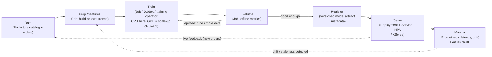

# 01 — Why ML on Kubernetes

> The ML workload taxonomy (interactive notebooks, batch **training**,
> hyperparameter tuning, batch inference, online **serving**,
> **pipelines/orchestration**) and how each maps to the Kubernetes primitives
> the guide already built; **why** Kubernetes for ML (uniform
> scheduling/packaging/scaling/multi-tenancy/reproducibility/cost vs. bespoke ML
> infra); the **MLOps loop** (data → train → evaluate → register → serve →
> monitor → retrain) as the spine of Part 12; what is genuinely *different* from
> the stateless web app the guide built so far (GPUs as scarce countable
> resources, gang/all-or-nothing scheduling, long jobs & checkpointing, data
> gravity, determinism, the $$$ cost profile); a one-paragraph map of the
> players (Kubeflow, Ray, KServe, Kueue/Volcano) — applied by introducing the
> Bookstore **recommendations** use case and the new
> [`examples/bookstore/ml/`](../examples/bookstore/ml/README.md) thread.

**Estimated time:** ~30 min read · (no hands-on)
**Prerequisites:** [Part 01 ch.01](../01-core-workloads/01-pods.md) — Pod baseline ML workloads extend · [Part 06 ch.06](../06-production-readiness/06-capacity-and-cost.md) — cost framing this part deepens for GPUs
**You'll know after this:** • map each ML workload (notebook / train / tune / serve / pipeline) onto a K8s primitive · • articulate why Kubernetes is the unifying ML substrate (vs bespoke ML infra) · • describe the MLOps loop (data → train → register → serve → monitor → retrain) · • name what is structurally different about ML (GPUs as countable, gang scheduling, data gravity) · • place Kubeflow / Ray / KServe / Kueue / Volcano on a one-page map

<!-- tags: ml, mental-model, foundations -->

## Why this exists

The guide spent fifty chapters making the Bookstore a **stateless-ish web
system**: Deployments that scale on CPU, a StatefulSet for Postgres, Jobs for
migrations, all hardened to PSA `restricted`, delivered by GitOps. That is the
overwhelmingly common Kubernetes workload — and it is *not* what a machine
learning system looks like.

An ML system has a different center of gravity. Its expensive, long-running
work is a **training job** that may run for hours on a **GPU** — a resource the
scheduler must treat as a *scarce, countable, non-overcommittable* device, not
the elastic CPU/memory the guide has used everywhere. Its serving path looks
like a Deployment but with a multi-gigabyte model artifact, a warm-up cost, and
autoscaling driven by a queue or token rate rather than CPU. Between them sits a
**pipeline** — data prep → train → evaluate → register → deploy → monitor →
*retrain* — that is itself a graph of Jobs with data dependencies. And the
people running it want exactly what platform teams always want: to not buy and
babysit a second, bespoke "ML cluster" when they already operate Kubernetes.

This chapter is the **map of Part 12**. It classifies the ML workload types,
shows that each one maps onto a Kubernetes primitive the guide *already taught*
(Job, Deployment, StatefulSet, HPA, CRDs/operators) plus a few ML-specific
extensions covered in the chapters ahead (GPUs ch.02, gang/queue scheduling
ch.03, training operators, KServe, pipelines, feature/vector stores, LLM
serving), and is honest about the handful of things that are genuinely new.
It also introduces the worked example for the whole part: the Bookstore
**recommendations** model — deliberately tiny so the entire train→serve path
runs **CPU-only on kind**, with GPUs as the honestly-marked "now scale it up"
path. This is the [Batch Job](#further-reading) and
[Elastic Scale](#further-reading) patterns applied to ML.

## Mental model

**ML on Kubernetes is not a new platform — it is the same primitives with two
new pressures: scarce accelerators and all-or-nothing batch.**

Hold three ideas:

- **Every ML workload is a workload you already know, plus a twist.** A
  notebook is a `Deployment`/`StatefulSet` you exec into. Training is a
  run-to-completion `Job` ([Part 01 ch.07](../01-core-workloads/07-jobs-and-cronjobs.md))
  — possibly *many coordinated* Pods (ch.03). Serving is a `Deployment` +
  `Service` + `HPA` ([Part 06 ch.04](../06-production-readiness/04-autoscaling.md))
  with a big artifact and a custom scaling signal. A pipeline is a DAG of Jobs
  (a CRD-driven controller, [Part 08 ch.05](../08-day-2-operations/05-operators-and-crds.md)).
  The Kubernetes object model already expresses all of it.
- **The genuinely new bits are few and specific.** (1) **GPUs/accelerators**
  are *extended resources* the kubelet advertises via a **device plugin** —
  countable, request==limit, not overcommittable, and *expensive* (ch.02). (2)
  Distributed training is **gang-scheduled**: N worker Pods must *all* start or
  *none* should, or they deadlock holding partial capacity (ch.03). (3) The
  unit of value is a **model artifact** produced by a job and consumed by
  serving — so reproducibility, data lineage, and a registry matter more than
  for a stateless API. Everything else (scheduling, packaging, scaling,
  multi-tenancy, security, delivery) is the guide you already read.
- **The MLOps loop is the spine.** data → **train** → evaluate → **register**
  → **serve** → **monitor** → (drift) → **retrain**. Part 12 walks this loop:
  ch.01 frames it, ch.02–03 make the *train* step schedulable on accelerators
  at scale, later chapters do training operators, serving (KServe), pipelines,
  and feature/vector stores. Keep the loop in view — every chapter is *a step
  on it*.

Why Kubernetes at all, rather than a bespoke ML stack (a hand-rolled Slurm
cluster, a vendor "AI platform", a pile of cloud notebooks)? The same four
reasons the guide opened with, now applied to ML: **one scheduler/packaging
model** (a training Job, a serving Deployment, and the web app share a cluster,
a registry, RBAC, NetworkPolicy, and an autoscaler — no second control plane);
**multi-tenancy & cost** (quota and fair-sharing let teams share scarce GPUs
instead of each buying idle ones — ch.03, [Part 06 ch.06](../06-production-readiness/06-capacity-and-cost.md));
**reproducibility** (a container image + a manifest + a pinned dataset is a
reproducible experiment — the *Configuration Template* idea from
[Part 07 ch.01](../07-delivery/01-packaging-helm.md)); and **portability**
(the same manifests run on kind locally and EKS/GKE/AKS with GPU node pools —
[Part 10](../10-cloud-and-managed-kubernetes/01-managed-kubernetes-model.md)).
The trap, stated up front: Kubernetes does *not* make GPUs cheap or training
fast — it makes them *schedulable, shareable, and reproducible*. The hard ML
problems (model quality, data) are still yours.

## Diagrams

### The MLOps loop — the spine of Part 12 (Mermaid)



### ML-workload taxonomy → Kubernetes primitive (ASCII)

```
 ML WORKLOAD                WHAT IT IS                  K8s PRIMITIVE (guide ref)
 -------------------------  --------------------------  ----------------------------------
 Interactive / notebook     ad-hoc dev, exec'd into     Deployment/StatefulSet + Service
                                                          + PVC  (Part 01 ch.04/05)
 Batch TRAINING             run-to-completion, hours,   Job / Indexed Job  (Part 01 ch.07);
   single-node                often a GPU                 + nvidia.com/gpu  (ch.02)
 Distributed TRAINING       N workers, ALL-or-NOTHING   JobSet + gang scheduling
   (multi-node)               (gang), checkpointed        (Kueue/Volcano)  (ch.03)
 Hyperparameter tuning      many short training trials  parallel Jobs / Indexed Job;
                              + a search controller       a tuning operator  (fwd-ref)
 Batch inference            score a big dataset once    Job / Indexed Job (sharded)
                                                          (Part 01 ch.07)
 Online SERVING             low-latency model API       Deployment + Service + HPA
                                                          (Part 06 ch.04) / KServe (fwd-ref)
 Pipeline / orchestration   DAG: prep→train→…→deploy    CRD + controller; a pipeline
                                                          engine  (Part 08 ch.05; fwd-ref)
 Feature / vector store     low-latency feature/embed   StatefulSet + PVC + Service
                              lookup                      (Part 01 ch.05; fwd-ref)

 THE TWIST (what is NEW vs. the stateless web app):
   • GPUs = countable, non-overcommittable extended resource (device plugin) — ch.02
   • distributed training = gang / all-or-nothing scheduling                  — ch.03
   • the unit of value = a versioned MODEL ARTIFACT (reproducibility, lineage)
   • cost profile dominated by idle accelerators (utilisation is the lever)   — ch.02/03
```

## Hands-on with the Bookstore

**Assumed working directory: the guide repo root (`full-guide/`).** This is the
framing chapter, so the hands-on is **setup, not a running model yet**: it
creates the new `examples/bookstore/ml/` thread (its README + a dataset stub)
and a dedicated, PSA-`restricted` `bookstore-ml` namespace that *every* Part 12
ML workload uses. No model trains until ch.03 (gang-scheduled CPU "training")
and X3b (the real train→serve). This chapter changes **nothing** in the
existing Bookstore (`raw-manifests/`, `helm/`, `kustomize/`, the 50 chapters).

### 1. The ML thread overview and dataset stub (already created)

The Part 12 example tree is introduced here:

- [`examples/bookstore/ml/README.md`](../examples/bookstore/ml/README.md) — the
  recommendations thread: dataset = the Bookstore's `catalog`+`orders` data,
  model = item-kNN / co-occurrence ("customers who bought X also bought Y"),
  the train→serve plan, **CPU-runnable on kind** with GPU as the scale-up path,
  and the PSA-`restricted` `bookstore-ml` namespace contract.
- [`examples/bookstore/ml/dataset/README.md`](../examples/bookstore/ml/dataset/README.md)
  — the **data shape**: it is *synthetic and generated, not shipped*; this stub
  documents exactly which Bookstore tables it derives from and the
  item-co-occurrence matrix the training Job (X3b) builds.

Read both now — they are the spec the rest of Part 12 implements. Confirm they
exist:

```sh
# from the repo root (full-guide/)
ls examples/bookstore/ml examples/bookstore/ml/dataset
cat examples/bookstore/ml/README.md          # the thread overview / contract
```

### 2. The dedicated ML namespace — PSA `restricted`, like the app

ML work is a **new concern**, so it gets its **own namespace**, not the
`bookstore` one. Two reasons: (a) **blast radius / quota** — GPU and
long-running training quota (ch.03) is set per ML team, separate from the
app's; (b) **the PSA footgun, taught up front** — many GPU/training/ML base
images (CUDA images, framework images, notebook images) default to **root**.
PSA `restricted` does **not** exempt ML pods. So `bookstore-ml` is labelled
`restricted` *exactly like* `bookstore`
([Part 05 ch.02](../05-security/02-pod-security.md)), and every ML Pod the rest
of Part 12 ships is made restricted-compliant. Naming the namespace `restricted`
and then running a stock root CUDA image is a real, common production failure —
ch.02 shows the compliant `securityContext` that still works.

Create the namespace (a one-off `kubectl` — Part 12's manifests live under
`examples/bookstore/ml/`, kept separate from the canonical app trees so the
guide's invariants are untouched):

```sh
kubectl create namespace bookstore-ml
kubectl label namespace bookstore-ml \
  app.kubernetes.io/part-of=bookstore-ml \
  pod-security.kubernetes.io/enforce=restricted \
  pod-security.kubernetes.io/enforce-version=latest \
  pod-security.kubernetes.io/audit=restricted \
  pod-security.kubernetes.io/audit-version=latest \
  pod-security.kubernetes.io/warn=restricted \
  pod-security.kubernetes.io/warn-version=latest --overwrite

kubectl get ns bookstore-ml -o jsonpath='{.metadata.labels}' \
  | tr ',' '\n' | grep pod-security
#  pod-security.kubernetes.io/enforce:restricted   (+ audit + warn, version latest)
```

> **This is the contract for all of Part 12.** Every manifest under
> `examples/bookstore/ml/` targets `bookstore-ml` and is restricted-compliant
> (runAsNonRoot, non-root UID, allowPrivilegeEscalation:false,
> capabilities.drop:["ALL"], seccompProfile RuntimeDefault, only
> `restricted`-allowed volumes). ch.02 proves a GPU Pod satisfies this; ch.03
> proves the gang-scheduled "training" Jobs do. The same
> `kubectl apply --dry-run=server` proof technique Part 05 ch.02 used certifies
> them.

### 3. Where the rest of Part 12 goes (forward map)

Nothing more *runs* here — this chapter is the map. The thread proceeds:

| Step on the MLOps loop | Part 12 chapter | `examples/bookstore/ml/` |
|---|---|---|
| accelerators for *train* | **ch.02** GPUs & accelerators | `gpu/` (a restricted GPU train Pod) |
| schedule *train* at scale | **ch.03** batch & gang scheduling | `batch/` (Kueue + a JobSet) |
| the *train* step itself (CPU) | X3b | `train/` (forward-ref — not yet) |
| *register* + *serve* | X3b | `serve/` (forward-ref — not yet) |
| the whole *loop* as a pipeline | X3c | `pipeline/` (forward-ref — not yet) |

(X3b/X3c add `ml/train`, `ml/serve`, `ml/pipeline`; this phase deliberately
creates only `ml/README.md`, `ml/dataset/`, `ml/gpu/` (ch.02), `ml/batch/`
(ch.03).)

## How it works under the hood

- **Why a "GPU" is not "more CPU" to the scheduler.** CPU and memory are
  *compressible/overcommittable* — the kubelet can throttle CPU and the
  scheduler bin-packs on *requests* while limits may exceed allocatable. A GPU
  is the opposite: it is an **extended resource** (`nvidia.com/gpu`) advertised
  by a per-node **device plugin** as a fixed integer count; the scheduler
  treats it like any extended resource (must fit `allocatable`), and crucially
  for devices you set **`limits` == `requests`** (you cannot fractionally
  overcommit a physical GPU by default — sharing needs explicit MIG/time-slicing,
  ch.02). So the *Predictable Demands* pattern
  ([Part 01 ch.03](../01-core-workloads/03-resources-and-qos.md)) becomes
  load-bearing: a training Pod that under-requests does not get throttled, it
  gets *no GPU*. ch.02 is the full mechanism.
- **Why distributed training breaks default Job scheduling.** A multi-worker
  training job is N Pods that must rendezvous (all-reduce / parameter server).
  The default scheduler places Pods *independently* and *greedily*: with 8 GPUs
  free and two 8-worker jobs queued, it can place 4 workers of each, and now
  **both jobs are stuck** holding half the cluster, waiting for peers that can
  never schedule — a classic resource deadlock. The fix is **gang (all-or-
  nothing) scheduling**: admit the *whole* group or none. That is exactly what
  JobSet + Kueue/Volcano add (ch.03); it is the single biggest scheduling
  difference between ML batch and the guide's web workloads.
- **The artifact is the unit, so reproducibility is structural.** For the web
  app, the deployable is an *image*. For ML, the deployable is a **model
  artifact** that some *Job* produced from *specific data + code +
  hyperparameters*. If you cannot say "this serving Pod runs model `v7`, trained
  by Job `…`, from dataset snapshot `…`, with config `…`", you cannot debug a
  regression or satisfy an audit. Kubernetes gives you the mechanisms
  (immutable images, content-addressed artifacts, labels/annotations, a Job's
  recorded spec); MLOps is the discipline of *using* them — which is why the
  loop diagram has explicit **register** and **monitor** nodes and why the
  Bookstore thread pins its (generated) dataset.
- **The cost profile inverts.** A stateless API's cost is roughly proportional
  to traffic and bin-packs well. ML cost is dominated by **accelerator idle
  time**: a GPU node left holding a finished or stalled job burns money doing
  nothing, and GPUs do not bin-pack like CPU. So the levers Part 06 taught —
  requests/limits accuracy, autoscaling, capacity/cost
  ([Part 06 ch.04](../06-production-readiness/04-autoscaling.md),
  [ch.06](../06-production-readiness/06-capacity-and-cost.md)) — get a sharper
  edge here: GPU **utilisation** (DCGM → Prometheus, ch.02), **quota +
  fair-sharing** so idle GPUs are reclaimable (ch.03), **scale-to-zero** serving
  and node autoscaling for spiky inference. "Make the GPU busy or give it back"
  is the through-line.
- **Where the ecosystem fits (one map; chapters expand it).** **Kubeflow** is
  an umbrella of CRDs/operators for ML on Kubernetes (training operators,
  pipelines, notebooks, KServe) — you adopt *pieces*, not the monolith.
  **Ray** is a distributed-compute framework with a Kubernetes operator
  (KubeRay) for training/tuning/serving as Ray clusters. **KServe** is the
  CRD-based model-serving layer (scale-to-zero, canary, multi-framework) — the
  ML-specialised version of the Deployment+HPA serving you already know.
  **Kueue** and **Volcano** are the batch/gang schedulers that make training
  share a cluster fairly (ch.03). None of these *replace* Kubernetes; each is
  an operator/CRD on top of the primitives in Parts 01–08 — which is the entire
  thesis of Part 12.

## Production notes

> **In production:** do **not** stand up a separate "ML cluster" by reflex.
> The default should be ML workloads as first-class tenants on the *same*
> Kubernetes you already operate — shared scheduler, registry, RBAC,
> NetworkPolicy, observability, GitOps. A separate cluster is justified by
> *isolation/compliance or radically different hardware lifecycle*, not by "ML
> is special". Treat that as a deliberate [Part 10](../10-cloud-and-managed-kubernetes/01-managed-kubernetes-model.md)/[Part
> 11 ch.06](../11-advanced-production-patterns/06-multi-cluster-and-fleet.md)
> multi-cluster decision, not a default.

> **In production:** put ML workloads in their **own namespace(s)** with their
> own ResourceQuota (especially `requests.nvidia.com/gpu`), RBAC, and PSA
> `restricted` — exactly as this chapter does with `bookstore-ml`. ML images
> are a notorious PSA footgun (root-by-default CUDA/notebook/framework images);
> *test restricted admission* (`--dry-run=server`) before flipping `enforce`,
> never label-and-hope ([Part 05 ch.02](../05-security/02-pod-security.md)).

> **In production:** budget for **GPU scarcity and cost from day one**. GPU
> nodes are expensive, often supply-constrained, and do not bin-pack like CPU.
> Make utilisation observable (DCGM, ch.02), enforce fair-sharing/quota (Kueue,
> ch.03), and prefer scale-to-zero serving + autoscaled GPU node pools so idle
> accelerators are returned. "We bought GPUs that sit at 15% utilisation" is
> the single most common ML-infra cost failure.

> **In production:** make experiments **reproducible** — pin the dataset
> snapshot, the image digest, and the hyperparameters; record which model
> version each serving release runs. Without lineage you cannot explain a
> quality regression or pass an audit. Reproducibility is an architecture
> property here, not a nicety (it is why Part 12 has explicit register/monitor
> steps and a pinned dataset).

> **In production:** adopt the ecosystem **incrementally**. Start with native
> Job + HPA + a registry; add Kueue when GPU contention appears (ch.03), a
> training operator when single-node Jobs stop fitting, KServe when serving
> needs scale-to-zero/canary. Adopting "all of Kubeflow" on day one is the ML
> equivalent of the "platform nobody asked for"
> ([Part 11 ch.10](../11-advanced-production-patterns/10-platform-engineering.md)).

## Quick Reference

```sh
# Create the dedicated, PSA-restricted ML namespace (the Part 12 contract)
kubectl create namespace bookstore-ml
kubectl label namespace bookstore-ml \
  pod-security.kubernetes.io/enforce=restricted \
  pod-security.kubernetes.io/enforce-version=latest \
  pod-security.kubernetes.io/warn=restricted --overwrite
kubectl get ns bookstore-ml --show-labels | tr ',' '\n' | grep pod-security

# The ML thread spec (read these — they are the Part 12 plan)
cat examples/bookstore/ml/README.md
cat examples/bookstore/ml/dataset/README.md
```

ML-workload → primitive map (the one-screen version):

```
notebook ........ Deployment/StatefulSet + Service + PVC
train (1 node) .. Job / Indexed Job  (+ nvidia.com/gpu — ch.02)
train (N nodes) . JobSet + gang scheduling (Kueue/Volcano — ch.03)
tuning .......... parallel/Indexed Jobs + a search controller
batch inference . Indexed Job (sharded)
serving ......... Deployment + Service + HPA  (KServe — fwd-ref)
pipeline ........ CRD + controller (a pipeline engine — fwd-ref)
```

Checklist (before any ML workload lands):

- [ ] ML work is in its **own** namespace, PSA `enforce: restricted` + `audit`/`warn`
- [ ] You can name the primitive each ML workload maps to (no bespoke control plane)
- [ ] GPU is treated as a countable, request==limit extended resource (ch.02)
- [ ] Distributed training is gang-scheduled, never default-scheduled (ch.03)
- [ ] Dataset/image/hyperparameters are pinned; model version is recorded
- [ ] GPU utilisation is (or will be) observable; quota/fair-sharing planned
- [ ] Ecosystem adopted incrementally, not "all of Kubeflow on day one"

## Test your understanding

> Try each before opening the answer drawer. The act of trying is the exercise; the answer is the check.

1. **Name three things that are genuinely different about ML workloads vs the stateless web app you built in Parts 00-09.**
   <details><summary>Show answer</summary>

   (1) **GPUs are countable, non-overcommittable resources** — you can't oversubscribe a GPU like CPU; one Pod gets the device or it doesn't. (2) **Gang scheduling** — a distributed training job needs all 8 workers running simultaneously or none of them are useful; partial placement = deadlock. (3) **Long jobs + checkpointing** — a 6-hour training run can't be casually preempted; the workload needs to checkpoint to durable storage and resume. Bonus: data gravity (TB-scale datasets where compute moves to data, not data to compute) and cost profile ($$$ per GPU-hour means utilization is the headline metric).

   </details>

2. **A teammate says "let's run our notebooks and training on EC2 directly, not Kubernetes — it's simpler." What's the counter-argument?**
   <details><summary>Show answer</summary>

   You already have Kubernetes for the web tier. Bespoke ML infra adds a separate scheduler, security model, identity, networking, secrets, logging, monitoring, CI/CD, and on-call — all of which exist for the web tier. Kubernetes gives you uniform primitives: GPU as a resource (request it in a Pod spec), Job for training, Deployment for serving, ResourceQuota for tenant fairness, IRSA for S3, Prometheus for metrics. ML on EC2 means rebuilding all of that for one workload type. "Simpler today" almost always means "more painful at year two" when you need multi-tenant fairness, autoscaling, or audit.

   </details>

3. **Map each ML workload type to its Kubernetes primitive: interactive notebook, single-node training, multi-node training, batch inference, online serving, scheduled retrain.**
   <details><summary>Show answer</summary>

   Interactive notebook → long-lived Pod with PVC (often via JupyterHub StatefulSet); single-node training → Job or Argo Workflow step; multi-node training → JobSet or PyTorchJob (gang-scheduled); batch inference → Job processing from queue/S3; online serving → Deployment + Service + HPA (or KServe `InferenceService`); scheduled retrain → CronJob or CronWorkflow triggering a Workflow. The point of the chapter is that none of these need bespoke control planes — the existing K8s primitives cover them with ML-specific operators on top.

   </details>

4. **Hands-on: deploy a "fake training" Job that sleeps 30s then writes a file to a PVC, plus a "fake serving" Deployment that returns 200 OK on `/predict`. Now block PSA-restricted on both. What footguns appear?**
   <details><summary>What you should see</summary>

   The training Job's container probably runs as root (CUDA base images default to root); the Job will be rejected by PSA-restricted. The serving Deployment is fine if you use a distroless or restricted-friendly base. The fix for the training Job: set `runAsUser: 1000`, `runAsNonRoot: true`, `allowPrivilegeEscalation: false`, `seccompProfile: RuntimeDefault`. For real CUDA images you usually need to add a uid via Dockerfile (`useradd -u 1000 mluser`) — this is the PSA-restricted GPU-pod footgun [ch.02](02-gpus-and-accelerators.md) details.

   </details>

## Further reading

- **Ibryam & Huß, _Kubernetes Patterns_ 2e — *Batch Job* (ch.7)** and
  ***Elastic Scale* (ch.29)** — run-to-completion work and demand-driven
  scaling as patterns; the conceptual basis for treating training as a Job and
  serving as an elastically-scaled service.
- **Rosso et al., _Production Kubernetes_, ch.13 — "Autoscaling"** and
  **ch.12 — "Multitenancy"** — scaling and fair multi-tenant resource sharing,
  which become acute once scarce GPUs are shared across ML teams.
- Official: Kubernetes scheduling/extended-resources overview
  <https://kubernetes.io/docs/concepts/scheduling-eviction/>, the Kubeflow
  project overview <https://www.kubeflow.org/docs/started/introduction/>, and
  the cloud-native MLOps framing in the CNCF/cloud-native ML landscape
  <https://landscape.cncf.io/> (the "machine learning" category).
