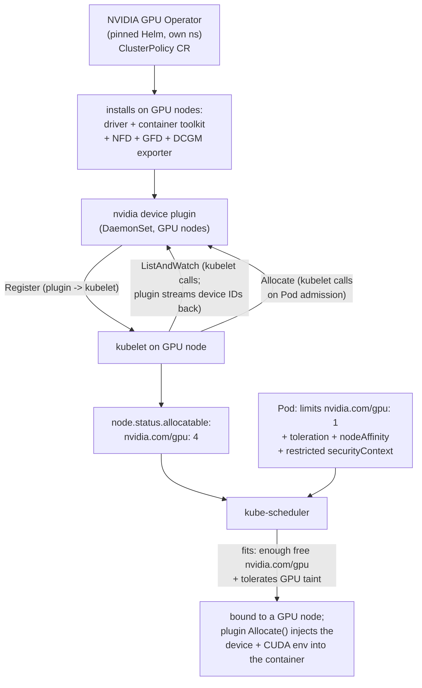

# 02 — GPUs and accelerators

> The **device-plugin** model (kubelet ↔ device-plugin gRPC, the
> `nvidia.com/gpu` extended resource, why GPUs are countable,
> non-overcommittable resources unlike CPU/memory); the **NVIDIA GPU Operator**
> (driver, container toolkit, device plugin, DCGM exporter, node feature
> discovery — what each component does) installed via **pinned Helm** into its
> own namespace; requesting a GPU in a Pod (`limits: nvidia.com/gpu: 1`, why
> `limits == requests` for devices); GPU node pools + the
> `nvidia.com/gpu:NoSchedule` taint + tolerations + nodeAffinity so only GPU
> work lands on costly GPU nodes; **sharing** a GPU — time-slicing vs MPS vs
> **MIG** (tradeoffs, when which); GPU **observability** (DCGM → Prometheus,
> ties [Part 06 ch.01](../06-production-readiness/01-observability-metrics.md))
> and utilisation as the cost lever
> ([Part 06 ch.06](../06-production-readiness/06-capacity-and-cost.md)); and the
> PSA-`restricted` GPU-pod footgun (CUDA images default to root) — applied with
> the **honest GPU reality** (a real GPU node is required; exact commands +
> representative labelled output, never faked) plus a CPU-only fallback note,
> and a restricted-compliant GPU training Pod in
> [`examples/bookstore/ml/gpu/`](../examples/bookstore/ml/gpu/).

**Estimated time:** ~45 min read · ~90 min hands-on
**Prerequisites:** [Part 01 ch.03](../01-core-workloads/03-resources-and-qos.md) — CPU/memory resources GPUs structurally differ from · [Part 04 ch.02](../04-scheduling/02-affinity-taints-topology.md) — taints/tolerations that gate GPU node pools · [Part 06 ch.01](../06-production-readiness/01-observability-metrics.md) — Prometheus pipeline DCGM exporter feeds
**You'll know after this:** • explain the device-plugin model and why GPUs are non-overcommittable · • install the NVIDIA GPU Operator and verify driver + DCGM + device plugin · • request a GPU in a Pod and gate scheduling via taints + nodeAffinity · • compare time-slicing vs MPS vs MIG for GPU sharing · • avoid the PSA-restricted CUDA-image root-user footgun

<!-- tags: ml, gpu, mig, scheduling, observability, cost -->

## Why this exists

[Part 01 ch.03](../01-core-workloads/03-resources-and-qos.md) taught CPU and
memory as the two resources a Pod requests. The whole guide bin-packed on them:
the scheduler places Pods by `requests`, the kubelet throttles CPU, limits may
exceed allocatable because CPU is *compressible*. **A GPU breaks every one of
those assumptions.** A physical GPU is not time-sliced by the kernel the way
CPU is; you cannot give a Pod "0.3 of a GPU" by default; you cannot overcommit
it; and a node either *has* the NVIDIA driver + runtime wired up or the GPU is
invisible to Kubernetes entirely. On top of that, GPU nodes are the most
expensive thing in the cluster and are frequently supply-constrained — so
*which* Pods are even allowed onto them, and how busy they are kept, is a
first-order cost decision, not a tuning detail.

[ch.01](01-why-ml-on-kubernetes.md) named this as one of the two genuinely-new
things ML brings to Kubernetes. This chapter is the mechanism: how the kubelet
learns a node has GPUs (the **device-plugin** API), how the **NVIDIA GPU
Operator** installs the entire driver/runtime/plugin/exporter stack for you,
how a Pod *requests* a GPU and why `limits == requests`, how to keep general
workloads *off* costly GPU nodes (the [Part 04 ch.02](../04-scheduling/02-affinity-taints-topology.md)
taint/toleration/affinity recipe, now load-bearing), the three ways to *share*
one GPU (time-slicing / MPS / MIG), and how to *see* GPU utilisation (DCGM →
Prometheus, the [Part 06 ch.01](../06-production-readiness/01-observability-metrics.md)
pipeline). And it is **honest**: real GPU steps need a real GPU node — the
Bookstore recommendations model is deliberately tiny and CPU-only (ch.03, X3b),
so GPU here is the *"now scale it up"* path with exact commands and
representative, clearly-labelled output, never invented `nvidia-smi` numbers.

## Mental model

**A GPU is an *extended resource* a per-node agent advertises — countable,
indivisible by default, request==limit, and gated onto a tainted node pool.**

- **Device plugin = "this node has N of resource X".** The kubelet does not
  know about GPUs natively. A **device plugin** (a DaemonSet Pod on each GPU
  node) registers over a local gRPC socket and tells the kubelet "I have 4
  `nvidia.com/gpu`". The kubelet adds that to the node's `allocatable`. The
  scheduler then treats `nvidia.com/gpu` like any **extended resource**: a Pod
  that requests it only fits a node with enough *uncommitted* count. This is
  the same extended-resource machinery the guide mentioned for scheduling
  ([Part 04 ch.01](../04-scheduling/01-scheduler-and-nodes.md)) — GPUs are its
  most important real use.
- **You don't request a GPU; you *limit* one.** For devices you set
  `resources.limits["nvidia.com/gpu"]: 1`. Kubernetes auto-copies it to
  `requests` and **requires `limits == requests` for extended resources** —
  there is no fractional or burstable GPU at the core API level. A whole device
  is assigned to the container for its lifetime. (Sharing one GPU across Pods
  is possible but *opt-in* via time-slicing / MPS / MIG — below — never the
  default.)
- **GPU nodes are a fenced, expensive pool.** A GPU node should run *only* GPU
  work, or you waste money parking a stateless web Pod on a $$$ accelerator
  host. The recipe is exactly [Part 04 ch.02](../04-scheduling/02-affinity-taints-topology.md):
  **taint** the GPU pool (`nvidia.com/gpu=present:NoSchedule`, which the GPU
  Operator can also auto-apply), give GPU Pods a matching **toleration**, and
  add **nodeAffinity** so they are *attracted* to GPU nodes (a toleration only
  removes the fence; affinity pulls them in). General Bookstore Pods carry no
  toleration, so they cannot drift onto GPU nodes.
- **The GPU Operator installs the whole stack so you don't.** Driver + NVIDIA
  container toolkit + device plugin + DCGM metrics exporter + node feature
  discovery is a lot of node plumbing. The **NVIDIA GPU Operator** is a single
  operator (one `ClusterPolicy` CR) that deploys and lifecycles all of it via a
  pinned Helm chart in its own namespace — the [Operator](#further-reading)
  pattern applied to "make GPUs work".

The trap to keep in view: PSA `restricted` does **not** exempt GPU pods, and
most CUDA/framework images default to **root**. A GPU Pod must still be
`runAsNonRoot` + drop ALL caps + `seccompProfile: RuntimeDefault`
([Part 05 ch.02](../05-security/02-pod-security.md)) — the hands-on shows the
compliant shape that *still gets the GPU*.

## Diagrams

### kubelet ↔ device plugin → GPU allocation → Pod (Mermaid)



### Full GPU vs MIG vs time-slicing vs MPS (ASCII)

```
 ONE PHYSICAL GPU, FOUR WAYS TO HAND IT OUT
 ─────────────────────────────────────────────────────────────────────────────
 Mode          What a "GPU" means      Isolation         Best for
 ------------  ----------------------  ----------------  --------------------------
 Exclusive     1 Pod = 1 whole GPU     full (HW)         training; the safe default
  (default)      limits: nvidia.com/      strongest
                 gpu: 1

 MIG           HW-partitioned into     STRONG (HW        many smaller, isolated
  (A100/H100+)   instances, e.g.         partitions:       jobs/inference on big
                 nvidia.com/             mem + compute     GPUs; predictable QoS
                 mig-1g.10gb: 1          fenced)

 Time-slicing  N Pods share 1 GPU by   NONE (round-      dev/notebooks, bursty
                 the driver round-       robin time; no    low-duty inference;
                 robining; advertised    mem isolation,    NOT for guaranteed
                 as N "nvidia.com/gpu"   noisy neighbour)  perf or untrusted tenants

 MPS           N Pods share via CUDA   WEAK (spatial;    concurrent small kernels
  (Multi-       Multi-Process Service   limited mem        from cooperating
   Process)      (concurrent contexts)   carve-out)        workloads; better
                                                            throughput than slicing

 RULE OF THUMB:  training → exclusive (or MIG slice).  Inference/dev that can't
   fill a GPU → MIG if the HW supports it (real isolation); else time-slicing
   (cheap, no isolation) or MPS (better throughput, weak isolation). Sharing is
   always OPT-IN config on the device plugin / GPU Operator — never automatic.
```

## Hands-on with the Bookstore

**Assumed working directory: the guide repo root (`full-guide/`).** Requires
the PSA-`restricted` `bookstore-ml` namespace from
[ch.01](01-why-ml-on-kubernetes.md)
(`kubectl get ns bookstore-ml`). This chapter adds **one new file**,
[`examples/bookstore/ml/gpu/recommender-train-gpu.yaml`](../examples/bookstore/ml/gpu/recommender-train-gpu.yaml),
and changes nothing in the existing Bookstore.

> **The honest GPU reality (read first).** kind runs in containers on your
> machine and has **no GPU**. The GPU Operator install, `nvidia-smi`, and the
> GPU Pod below require a **real GPU node pool** (a cloud GPU node group, or a
> bare-metal box with an NVIDIA GPU + driver). The commands here are the
> *exact, correct* ones; the outputs shown are **representative, labelled
> illustrative** captures from a GPU node — they are not produced by kind and
> are not invented numbers. **The recommendations model itself needs no GPU**:
> it is tiny and CPU-only — ch.03 gang-schedules a 2-worker CPU "training" that
> runs on kind, and X3b does the real CPU train→serve. GPU here is purely the
> *"scale training up"* path, marked as such everywhere.

### 1. Install the NVIDIA GPU Operator (pinned Helm, own namespace) — GPU cluster

On a cluster with GPU nodes, install the operator from its **pinned** Helm
chart into its own namespace (never
`kubectl apply -f .../releases/latest/download/<FILE>.yaml` — same rule as
every operator install in this guide):

```sh
# Pin to a release you have tested; bump deliberately. (Representative version
# below — check the project's releases and pin exactly, like the guide pins
# every chart, e.g. Part 11 ch.04's ISTIO_CHART_VERSION.)
GPU_OPERATOR_VERSION="v24.9.1"

helm repo add nvidia https://nvidia.github.io/gpu-operator && helm repo update
helm install gpu-operator nvidia/gpu-operator \
  -n gpu-operator --create-namespace \
  --version "$GPU_OPERATOR_VERSION" --wait
```

The operator reconciles a single **`ClusterPolicy`** CR and, on GPU nodes,
brings up the whole stack. Watch it converge and confirm the node now
advertises GPUs:

```sh
kubectl get pods -n gpu-operator
# representative (a GPU node present):
#   nvidia-driver-daemonset-xxxxx                 Running
#   nvidia-container-toolkit-daemonset-xxxxx      Running
#   nvidia-device-plugin-daemonset-xxxxx          Running
#   nvidia-dcgm-exporter-xxxxx                    Running
#   gpu-feature-discovery-xxxxx                   Running
#   gpu-operator-...                              Running

kubectl get nodes -o custom-columns=\
'NODE:.metadata.name,GPU:.status.allocatable.nvidia\.com/gpu'
# representative:
#   gpu-node-1   1        <- the device plugin advertised the GPU(s)
#   cpu-node-1   <none>   <- no GPU here
```

What each component does (the operator manages all of them):

| Component | Role |
|---|---|
| **NVIDIA driver** (DaemonSet) | kernel driver on each GPU node (or uses a pre-installed host driver) |
| **NVIDIA container toolkit** | wires the container runtime so containers can see the GPU |
| **device plugin** (DaemonSet) | advertises `nvidia.com/gpu` to the kubelet (the gRPC mechanism) |
| **DCGM exporter** | exports GPU metrics (util, memory, temp, power) for Prometheus |
| **Node Feature Discovery (NFD)** | general hardware-feature labelling framework on every node; **GFD depends on it** |
| **GPU Feature Discovery (GFD)** (DaemonSet) | NVIDIA add-on to NFD; emits `nvidia.com/gpu.*` node labels (incl. `nvidia.com/gpu.present`, `nvidia.com/gpu.product`, MIG-strategy labels) — the labels consumed by the `nodeAffinity` rule in step 3 below. The `gpu-feature-discovery-…` Pod in step 1's `kubectl get pods -n gpu-operator` output is GFD. |

### 2. `nvidia-smi` from a GPU Pod — the canonical sanity check (GPU node)

The real "is the GPU usable from a Pod" check. **Restricted-compliant** (the
CUDA base image defaults to root — we force non-root + drop caps + seccomp, and
it *still* sees the GPU):

```sh
kubectl run gpu-smoketest -n bookstore-ml --rm -it --restart=Never \
  --image=nvidia/cuda:12.4.1-base-ubuntu22.04 \
  --overrides='{
    "spec":{
      "tolerations":[{"key":"nvidia.com/gpu","operator":"Exists","effect":"NoSchedule"}],
      "securityContext":{"runAsNonRoot":true,"runAsUser":65532,"runAsGroup":65532,
        "seccompProfile":{"type":"RuntimeDefault"}},
      "containers":[{"name":"gpu-smoketest","image":"nvidia/cuda:12.4.1-base-ubuntu22.04",
        "command":["nvidia-smi"],
        "resources":{"limits":{"nvidia.com/gpu":"1"}},
        "securityContext":{"allowPrivilegeEscalation":false,
          "capabilities":{"drop":["ALL"]},
          "runAsNonRoot":true,"runAsUser":65532}}]}}'
```

Representative `nvidia-smi` output **from a real GPU node** (illustrative —
exact model/driver/numbers depend on your hardware; this is *not* produced by
kind and *not* a fabricated benchmark):

```
+-----------------------------------------------------------------------------+
| NVIDIA-SMI 550.xx       Driver Version: 550.xx     CUDA Version: 12.4        |
|-------------------------------+----------------------+----------------------+
| GPU  Name        Persistence-M| Bus-Id        Disp.A | Volatile Uncorr. ECC |
| Fan  Temp  Perf  Pwr:Usage/Cap|         Memory-Usage | GPU-Util  Compute M. |
|===============================+======================+======================|
|   0  <GPU model>          On  | 00000000:00:1E.0 Off |                  Off |
| N/A   34C    P0    25W / 300W |      0MiB / <NN>MiB  |      0%      Default |
+-------------------------------+----------------------+----------------------+
```

`0%`/`0MiB` here just means *idle* (it ran `nvidia-smi`, not a workload). The
point is the container **saw the GPU** under a `restricted` securityContext. If
instead you see `nvidia-smi: command not found` or no GPU, the device plugin /
toolkit is not ready (re-check step 1) — that is the real failure mode, shown
honestly rather than faked.

### 3. The restricted GPU training Pod (the scale-up artifact)

The committed manifest
[`examples/bookstore/ml/gpu/recommender-train-gpu.yaml`](../examples/bookstore/ml/gpu/recommender-train-gpu.yaml)
is the *"now train the recommender on a GPU"* shape: a **`Job`** (built-in —
dry-runs cleanly, no CRD), requesting `nvidia.com/gpu: 1`, with the GPU
toleration + nodeAffinity, fully `restricted`-compliant. Its header states it
**needs a GPU node; the CPU path is ch.03 / X3b**. Validate it the way the
guide validates everything — a client dry-run (built-in kind, so it passes):

```sh
# from the repo root (full-guide/). Built-in Job → dry-runs cleanly anywhere
# (no GPU needed to VALIDATE; it just won't SCHEDULE without a GPU node).
kubectl apply --dry-run=client -f examples/bookstore/ml/gpu/recommender-train-gpu.yaml
#   job.batch/recommender-train-gpu created (dry run)

# PSA proof: server dry-run into the restricted bookstore-ml ns (PSA runs in
# admission) — zero PodSecurity violations despite the CUDA-class base image,
# because the securityContext is restricted-compliant:
kubectl apply --dry-run=server -n bookstore-ml \
  -f examples/bookstore/ml/gpu/recommender-train-gpu.yaml
#   job.batch/recommender-train-gpu created (server dry run)   ← no PSA warning
```

On a **real GPU cluster** you would `kubectl apply` it (no `--dry-run`); on
kind it would stay `Pending` with `0/1 nodes are available: 1 Insufficient
nvidia.com/gpu` — *which is the correct, honest behaviour*, not a bug. The
recommender does not need this path to work end-to-end — ch.03 and X3b run it
CPU-only.

### 4. Sharing a GPU and seeing utilisation (concepts; GPU cluster)

You rarely give every small job a whole GPU. **Sharing is opt-in config** on
the device plugin / GPU Operator:

- **Time-slicing** — a device-plugin config tells the plugin to advertise one
  physical GPU as N `nvidia.com/gpu` "replicas"; the driver round-robins. No
  memory isolation, noisy-neighbour — fine for dev/notebooks, *never* for
  guaranteed-perf or untrusted multi-tenant.
- **MPS** — CUDA Multi-Process Service runs concurrent contexts spatially;
  better throughput than slicing, still weak isolation.
- **MIG** — on A100/H100-class GPUs, hardware-partitions the card into isolated
  instances advertised as e.g. `nvidia.com/mig-1g.10gb`; **strong** isolation
  (memory + compute fenced) — the right answer for many isolated
  jobs/inference on a big GPU.

Utilisation is the **cost lever** (idle GPUs burn money — [ch.01](01-why-ml-on-kubernetes.md)
and [Part 06 ch.06](../06-production-readiness/06-capacity-and-cost.md)). The
GPU Operator's **DCGM exporter** publishes Prometheus metrics; scrape them with
the exact [Part 06 ch.01](../06-production-readiness/01-observability-metrics.md)
pipeline (a `ServiceMonitor`/scrape config), then alert/dashboard on idle:

```sh
# DCGM exposes metrics like (representative metric NAMES, from a GPU node):
#   DCGM_FI_DEV_GPU_UTIL        GPU utilisation %      (the headline cost signal)
#   DCGM_FI_DEV_FB_USED         framebuffer (VRAM) MiB used
#   DCGM_FI_DEV_POWER_USAGE     watts
# Wire them into Prometheus exactly like Part 06 ch.01 (ServiceMonitor / scrape
# config) and alert on GPUs allocated-but-idle = paying for nothing.
kubectl get svc -n gpu-operator -l app=nvidia-dcgm-exporter
```

## How it works under the hood

- **The device-plugin gRPC contract.** A device plugin is a Pod (DaemonSet) on
  each node that mounts the kubelet's device-plugin socket directory and
  implements the **DevicePlugin** gRPC service. It calls `Register` to claim a
  resource name (`nvidia.com/gpu`), then `ListAndWatch` streams the set of
  healthy device IDs to the kubelet; the kubelet sums them into
  `node.status.allocatable["nvidia.com/gpu"]`. When the scheduler binds a Pod
  that requested the resource, the kubelet calls the plugin's **`Allocate`**
  with the chosen device IDs; the plugin returns the env vars, device-node
  mounts, and any extra mounts to inject so the container can use that specific
  GPU. The kubelet enforces the count; the *scheduler* only does fit math on
  the advertised integer. This is why a node with no plugin (or a broken
  driver) shows `nvidia.com/gpu: <none>` and GPU Pods stay `Pending` — exactly
  the failure mode shown honestly in the hands-on.
- **Why `limits == requests` and no overcommit.** Extended resources have no
  notion of compressibility or burst. The API server **requires** that for any
  extended resource, if you set a limit you set an equal request (and you
  cannot set only a request without the equal limit being implied) — Kubernetes
  copies `limits["nvidia.com/gpu"]` to `requests`. A whole device is bound to
  the container; there is no kernel-level fair-share like CFS for CPU. So a
  Pod's GPU "QoS" is effectively always Guaranteed for that resource, and
  *Predictable Demands* ([Part 01 ch.03](../01-core-workloads/03-resources-and-qos.md))
  is not advice here, it is the only mode. **Sharing** (slicing/MPS/MIG) does
  not change this at the core API — it changes *what one advertised unit means*
  (a slice, an MPS context, a MIG instance) at the device-plugin layer.
- **What the GPU Operator actually reconciles.** It owns one cluster-scoped
  **`ClusterPolicy`** CR describing the desired stack, and runs controllers
  that, on nodes labelled as GPU-capable (via **NFD** — the general hardware-
  feature labelling framework), deploy: a driver container (or validates a
  host driver), the NVIDIA container toolkit (so the runtime injects the GPU),
  the device plugin DaemonSet, the DCGM exporter, **GFD** (the NVIDIA
  DaemonSet that extends NFD and emits the `nvidia.com/gpu.*` labels the
  chapter's `nodeAffinity` consumes — the `gpu-feature-discovery-…` Pod in
  step 1's `kubectl get pods -n gpu-operator` output is GFD), and validation
  Pods. It can also **auto-taint** GPU nodes and manage MIG
  configuration. Because it is a normal operator, its `ClusterPolicy` is a CRD:
  a client dry-run of a `ClusterPolicy` before the operator is installed prints
  `no matches for kind "ClusterPolicy"` — the same documented CRD-intrinsic
  behaviour as every other operator in this guide (the chapter installs via
  pinned Helm so the CRD exists).
- **Taint/affinity is the cost fence, mechanically.** The GPU Operator (or you)
  applies a `NoSchedule` taint to GPU nodes. From
  [Part 04 ch.02](../04-scheduling/02-affinity-taints-topology.md): the taint
  makes the scheduler's `TaintToleration` plugin **Filter out** GPU nodes for
  any Pod lacking the matching toleration — so the stateless Bookstore web Pods
  *cannot* land there. A GPU Pod adds the toleration (removes the fence) **and**
  nodeAffinity for a GPU label (the `NodeAffinity` plugin **Scores** GPU nodes
  up) — permission plus attraction, the exact recipe from that chapter, now
  protecting real money.
- **Utilisation, mechanically, is just Part 06 ch.01.** DCGM exporter is a
  normal Prometheus target; `DCGM_FI_DEV_GPU_UTIL` and friends flow through the
  *same* metrics pipeline you built in
  [Part 06 ch.01](../06-production-readiness/01-observability-metrics.md). The
  only ML-specific insight is *what to alert on*: a GPU that is **allocated but
  near-0% utilised** is the cost smell — it is the GPU equivalent of an
  over-provisioned request, and the lever for the
  [Part 06 ch.06](../06-production-readiness/06-capacity-and-cost.md) /
  [Part 10 ch.06](../10-cloud-and-managed-kubernetes/06-node-autoscaling-cost-multicloud.md)
  cost story. Scheduling efficiency (gang/quota) in ch.03 is the *other* half of
  keeping that number high.

## Production notes

> **In production:** put GPU nodes in a **dedicated, tainted node pool** and
> add the matching toleration + nodeAffinity to *only* GPU workloads — the
> [Part 04 ch.02](../04-scheduling/02-affinity-taints-topology.md) recipe. On
> EKS/GKE/AKS create the GPU node group pre-tainted/labelled and let the
> cluster-autoscaler scale it independently (and scale it to **zero** when
> idle). A stray web Pod on a GPU host is pure waste; an un-tainted GPU pool
> guarantees that waste.

> **In production:** install the **GPU Operator via a pinned chart** and pin
> the **driver/CUDA versions** deliberately; treat a GPU-stack upgrade like a
> node-OS upgrade (test on a canary pool first). A silent driver bump can break
> every training job on the cluster. Never install GPU components from a
> `releases/latest/download/<FILE>.yaml` URL.

> **In production:** GPU pods are **not** exempt from PSA. Most CUDA/framework/
> notebook images run as root; `restricted` rejects them. Run them
> `runAsNonRoot` + non-root UID + drop ALL caps + `seccompProfile: RuntimeDefault`
> (the Bookstore GPU Job does exactly this and *still* gets the
> GPU). `--dry-run=server` into the enforcing namespace *before* shipping —
> the [Part 05 ch.02](../05-security/02-pod-security.md) discipline applies
> unchanged. (A small set of GPU-stack DaemonSets — the driver/toolkit — do
> need elevated privileges; those run in the **operator's own namespace**, not
> your app namespace, and are the operator's concern, not your workloads'.)

> **In production: utilisation is the GPU cost metric.** Scrape DCGM into
> Prometheus ([Part 06 ch.01](../06-production-readiness/01-observability-metrics.md))
> and alert on **allocated-but-idle** GPUs. Choose sharing deliberately: MIG
> for isolated multi-tenant/inference on big GPUs (real HW isolation),
> time-slicing only for dev/bursty non-critical work (no isolation, noisy
> neighbour), MPS for cooperating concurrent small kernels. "We bought GPUs
> running at 15%" is the dominant ML cost failure — fix it with sharing +
> scheduling (ch.03), not more GPUs.

> **In production (managed — EKS/GKE/AKS):** GPU node groups are a few clicks,
> but the same rules hold — pinned operator/driver, tainted pool, restricted
> pods, DCGM→Prometheus, scale-to-zero. GKE offers GPU time-sharing/MIG as node
> config; EKS/AKS use the NVIDIA GPU Operator (or the provider's GPU AMI/device
> plugin). The Kubernetes API surface (`nvidia.com/gpu`, taints, the operator)
> is identical to the local model — that portability is the point
> ([Part 10](../10-cloud-and-managed-kubernetes/01-managed-kubernetes-model.md)).

## Quick Reference

```sh
# Install the GPU Operator (pinned Helm, own ns) — on a GPU cluster
GPU_OPERATOR_VERSION="v24.9.1"   # pin to a tested release; bump deliberately
helm repo add nvidia https://nvidia.github.io/gpu-operator && helm repo update
helm install gpu-operator nvidia/gpu-operator -n gpu-operator \
  --create-namespace --version "$GPU_OPERATOR_VERSION" --wait

# See GPUs the cluster knows about / inspect a GPU node
kubectl get nodes -o custom-columns=\
'NODE:.metadata.name,GPU:.status.allocatable.nvidia\.com/gpu'
kubectl describe node <GPU-NODE> | sed -n '/Allocatable/,/System Info/p'
kubectl get pods -n gpu-operator                       # the stack
kubectl get svc  -n gpu-operator -l app=nvidia-dcgm-exporter   # metrics target

# Validate the restricted GPU Job (no GPU needed to validate)
kubectl apply --dry-run=client  -f examples/bookstore/ml/gpu/recommender-train-gpu.yaml
kubectl apply --dry-run=server  -n bookstore-ml \
  -f examples/bookstore/ml/gpu/recommender-train-gpu.yaml      # PSA proof
```

Minimal `restricted`-compliant GPU Pod skeleton:

```yaml
spec:
  tolerations:                                  # PERMISSION past the GPU taint
    - { key: nvidia.com/gpu, operator: Exists, effect: NoSchedule }
  affinity:                                     # ATTRACTION to GPU nodes
    nodeAffinity:
      requiredDuringSchedulingIgnoredDuringExecution:
        nodeSelectorTerms:
          - matchExpressions:
              - { key: nvidia.com/gpu.present, operator: In, values: ["true"] }
  securityContext:                              # NOT exempt from PSA restricted
    runAsNonRoot: true
    runAsUser: 65532
    seccompProfile: { type: RuntimeDefault }
  containers:
    - name: train
      image: <CUDA-OR-FRAMEWORK-IMAGE>
      resources:
        limits:    { nvidia.com/gpu: 1 }        # devices: limit == request
      securityContext:
        allowPrivilegeEscalation: false
        capabilities: { drop: ["ALL"] }
```

Checklist:

- [ ] GPU Operator installed via **pinned Helm** in its **own** namespace
- [ ] GPU nodes **tainted**; only GPU pods carry the toleration + nodeAffinity
- [ ] GPU requested as `limits: nvidia.com/gpu: N` (limit == request; no overcommit)
- [ ] GPU pods are **restricted**-compliant (root CUDA image footgun handled)
- [ ] Sharing chosen deliberately: MIG (isolation) / time-slice (dev) / MPS
- [ ] DCGM → Prometheus; alert on allocated-but-idle GPUs (the cost lever)
- [ ] GPU-needing steps honestly marked; a CPU path exists (the recommender)

## Test your understanding

> Try each before opening the answer drawer. The act of trying is the exercise; the answer is the check.

1. **Why is `nvidia.com/gpu` declared under `limits` *and* `requests` with the same value, never just `requests`?**
   <details><summary>Show answer</summary>

   Extended resources (devices) can't be overcommitted — a Pod either has the GPU or doesn't. The kubelet's device-plugin manager exposes a finite count of GPUs per node; the scheduler treats them like an integer count, not fungible compute time. Kubernetes requires extended-resource `limits == requests` (you can omit one and it inherits the other). Setting `requests: 1, limits: 0` would be nonsensical because the device is exclusively bound for the Pod's lifetime — there is no "limit" to enforce over time, only "the Pod owns this device or doesn't."

   </details>

2. **Your GPU node has 8 GPUs but only 4 Pods schedule on it, leaving 4 GPUs idle. DCGM shows 0% utilization on those 4. What's the diagnosis order?**
   <details><summary>Show answer</summary>

   (1) `kubectl describe node` — does the node advertise 8 `nvidia.com/gpu`? If less, the device plugin DaemonSet may be unhealthy on that node — check its logs. (2) Are 4 Pods *actually* requesting GPUs? If the workload requests `nvidia.com/gpu: 2` per Pod, 4 Pods consume 8 GPUs — fully utilized at the device level even though usage is 0%. (3) Pending Pods that *want* GPUs but didn't schedule — `kubectl get pods --field-selector=status.phase=Pending` then `describe` to see if taints/tolerations/affinity blocked them. (4) Is MIG enabled? Then the device count is 7×1g.5gb or similar, not 8 GPUs — the resource name is `nvidia.com/mig-1g.5gb`, not `nvidia.com/gpu`.

   </details>

3. **You enable time-slicing for the dev environment so multiple notebooks share one GPU. A user complains "my training run takes 4x as long." What's happening?**
   <details><summary>Show answer</summary>

   Time-slicing is exactly what it says: it multiplexes CUDA contexts onto one GPU via the NVIDIA driver, round-robining at the kernel level. If 4 workloads share, each gets ~25% of the GPU's compute time — a training run that takes 1 hour on a dedicated GPU takes ~4 hours sharing 4-way. Time-slicing trades throughput for cost. For dev/notebooks where utilization is bursty, that's a win. For production training, you want MIG (hardware isolation, partitioned GPU memory + compute slices) or dedicated GPUs. The user's complaint is the expected behavior — surface it in dashboards so people understand.

   </details>

4. **A teammate runs a CUDA training pod with `runAsNonRoot: true` and `runAsUser: 1000`. The Pod CrashLoopBackoffs with "permission denied" on `/usr/local/nvidia`. What's wrong, and how do you fix it without abandoning PSA-restricted?**
   <details><summary>Show answer</summary>

   The stock NVIDIA CUDA image expects to run as root; `/usr/local/nvidia` and the device files have root-owned permissions. With `runAsUser: 1000`, the process can't read the driver files. Fixes (escalating): (a) rebuild the image with `USER 1000` and chown the necessary paths during build; (b) use a CUDA base image that supports non-root (NVIDIA's `cuda:*-devel-ubi8` with explicit uid setup); (c) for the legitimately-root-required niche case, use a *baseline*-namespace exclusively for that workload and harden via fsGroup + SELinux + dedicated node pool. The PSA-restricted GPU footgun is real; the rebuild-with-non-root path is what most teams adopt.

   </details>

5. **Hands-on: create a Pod requesting `nvidia.com/gpu: 1` on a 0-GPU cluster, then check `kubectl describe pod`. Now install the GPU Operator (or fake the device plugin) and resubmit. What changes in the events?**
   <details><summary>What you should see</summary>

   On the 0-GPU cluster: Pod stays `Pending` with event `FailedScheduling: 0/N nodes are available: N Insufficient nvidia.com/gpu`. The scheduler is honest — nothing matches the resource request. Once a GPU node joins (or you install the device plugin on a faked GPU node), the scheduler finds capacity and the Pod schedules. The lesson: GPUs are inert resources — the device plugin advertises them, the scheduler picks based on what's advertised, the kubelet binds the device when the Pod starts. No magic; the same primitive as CPU/memory but countable.

   </details>

## Further reading

- **Ibryam & Huß, _Kubernetes Patterns_ 2e — *Operator* (ch.28)** and
  ***Predictable Demands* (ch.2)** — operators that manage node-level
  infrastructure (the GPU Operator), and why declaring exact resource demands
  is mandatory for a non-overcommittable device.
- **Rosso et al., _Production Kubernetes_, ch.9 — "Observability"** and
  **ch.13 — "Autoscaling"** — wiring device/GPU metrics into the monitoring
  pipeline and scaling expensive capacity by real utilisation.
- Official: NVIDIA GPU Operator docs
  <https://docs.nvidia.com/datacenter/cloud-native/gpu-operator/latest/index.html>,
  Kubernetes device-plugin API
  <https://kubernetes.io/docs/concepts/extend-kubernetes/compute-storage-net/device-plugins/>,
  and scheduling GPUs
  <https://kubernetes.io/docs/tasks/manage-gpus/scheduling-gpus/>.
