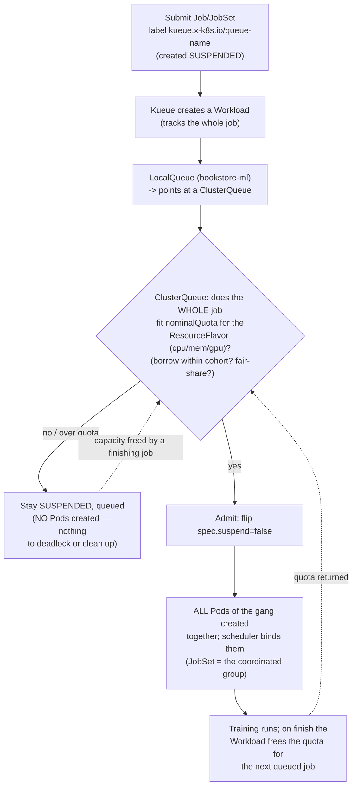

# 03 — Batch and gang scheduling

> Why the default Job scheduler is *wrong* for distributed ML (partial
> placement deadlocks a multi-worker training job → **gang / all-or-nothing**);
> **JobSet** (coordinated groups of Jobs — replicated jobs, success policy,
> startup ordering — the multi-node-training primitive) installed via pinned
> Helm; **Kueue** (Kubernetes-native job queueing: `ResourceFlavor`,
> `ClusterQueue`, `LocalQueue`, `Workload`, cohorts, quotas, fair-sharing,
> preemption, and **`suspend`-based admission** — how it wraps Job/JobSet/
> training-operator jobs) installed via pinned Helm with a queue/flavor for the
> Bookstore ML namespace; **Volcano** (PodGroup gang scheduling + queues) and a
> Kueue-vs-Volcano "when which"; multi-tenant **GPU quota** (ResourceQuota on
> `nvidia.com/gpu` + a Kueue `ClusterQueue`) so ML teams share fairly; ties
> [Part 04 ch.03](../04-scheduling/03-priority-and-preemption.md) priority/
> preemption (deepened, not re-taught) — applied by installing Kueue + JobSet
> (pinned, own namespaces) and running a 2-worker recommendations "training"
> **CPU-only on kind** through a Kueue queue, in
> [`examples/bookstore/ml/batch/`](../examples/bookstore/ml/batch/).

**Estimated time:** ~45 min read · ~120 min hands-on
**Prerequisites:** [Part 01 ch.07](../01-core-workloads/07-jobs-and-cronjobs.md) — Job primitive this chapter wraps for gang scheduling · [Part 04 ch.03](../04-scheduling/03-priority-and-preemption.md) — priority/preemption Kueue extends · [Part 12 ch.02](02-gpus-and-accelerators.md) — GPU quota Kueue partitions
**You'll know after this:** • explain why the default scheduler deadlocks multi-worker training · • install JobSet + Kueue (pinned Helm) into their own namespaces · • author a Kueue ResourceFlavor / ClusterQueue / LocalQueue with GPU quota · • run a 2-worker training Job admitted through Kueue's `suspend`-based gate · • choose between Kueue and Volcano for a given multi-tenant scheduler profile

<!-- tags: ml, batch, scheduling, kueue, jobset, multi-tenancy -->

## Why this exists

[Part 01 ch.07](../01-core-workloads/07-jobs-and-cronjobs.md) gave us the
`Job`: run Pods to completion, retry on failure, clean up. That is *exactly*
right for the Bookstore's single-shot DB migration. It is **dangerously wrong**
for distributed ML training, for one structural reason: a multi-worker training
job is N Pods that must **all run together** (they rendezvous — all-reduce or a
parameter server — and a job with 4 of 8 workers is not "half trained", it is
**hung**). The default scheduler places Pods *independently and greedily*. Put
two 8-worker training jobs on a cluster with 8 free GPUs and it will happily
schedule 4 workers of each — and now **both jobs are stuck forever**, each
holding half the cluster's GPUs, each waiting for peers that can never be
placed. That is a textbook **resource deadlock**, and it is the default
behaviour, not an edge case.

[Part 04 ch.03](../04-scheduling/03-priority-and-preemption.md) gave us
priority/preemption — *who wins under contention* — but priority does not solve
this: a high-priority job can still be partially placed and deadlocked. The
missing concept is **gang (all-or-nothing) scheduling**: admit the *entire*
group of Pods or *none* of them. This chapter adds the three pieces that make
ML batch correct and shareable on Kubernetes: **JobSet** (model a multi-node
training job as a coordinated group of Jobs), **Kueue** (the modern
Kubernetes-native *queue/quota/admission* layer that gates whole jobs in via
**`suspend`**, with cohorts and fair-sharing), and **Volcano** (the
gang-scheduler alternative) — plus multi-tenant **GPU quota** so ML teams share
scarce accelerators fairly. The recommendations model is tiny and CPU-only, so
we demonstrate the *mechanics* (gang admission, queue, quota) for real **on
kind, no GPU** — the [Batch Job](#further-reading) pattern at multi-tenant
scale.

## Mental model

**Gang scheduling = admit the whole job or none; a queue + quota decides
*which* whole jobs run *when*; `suspend` is the lever both pull.**

- **The deadlock you are preventing.** Default scheduling is per-Pod and
  greedy. Distributed training needs **all** workers or it makes no progress.
  Partial placement of two jobs → both wedged holding scarce GPUs. Gang
  scheduling makes the *unit of scheduling the group*, not the Pod.
- **`suspend` is the admission gate.** A `Job` (and `JobSet`) has
  `spec.suspend`. Suspended → the controller creates **no Pods**. A queueing
  manager (Kueue) creates the job *suspended*, decides if the whole thing fits
  within quota *now*, and only then flips `suspend: false` — so Pods appear
  **only** when the gang can run. This is the clean, Kubernetes-native
  mechanism (no Pods, no partial placement, nothing to clean up if it waits).
- **Kueue's object model (the part to memorise).** A **`ResourceFlavor`**
  describes a *kind* of capacity (e.g. "on-demand CPU nodes", "GPU nodes" via
  node labels). A **`ClusterQueue`** owns **quota** (`nominalQuota` per
  resource per flavor — including `nvidia.com/gpu`) and admission policy
  (borrowing within a **cohort**, fair-sharing, preemption). A **`LocalQueue`**
  is the namespaced handle a team submits to (it points at a ClusterQueue). A
  **`Workload`** is the internal object Kueue creates per job to track
  admission. You label a Job/JobSet with `kueue.x-k8s.io/queue-name: <LOCALQ>`
  and Kueue does the rest (suspend → fit-check against quota/cohort → admit).
- **JobSet vs Kueue vs Volcano — different jobs.** **JobSet** *models* a
  multi-node training run (replicated Jobs, startup order, success policy) — it
  is the *workload shape*. **Kueue** *queues and quota-gates* jobs (incl.
  JobSets) — it is the *admission/fair-share manager* (the modern
  Kubernetes-native default). **Volcano** is a *batch scheduler* providing
  gang/`PodGroup` scheduling + its own queues — pick it when you need a
  gang-aware *scheduler* (or Spark/MPI ecosystems standardised on it). Kueue +
  the default scheduler covers most ML batch; Volcano when you specifically
  need scheduler-level gang/co-scheduling. They are not mutually exclusive but
  for the Bookstore we lead with **Kueue** (Kubernetes-native, the current
  community default for batch/quota) and contrast Volcano.

This **builds on** [Part 04 ch.03](../04-scheduling/03-priority-and-preemption.md)
(priority/preemption) and [Part 01 ch.07](../01-core-workloads/07-jobs-and-cronjobs.md)
(Job/Indexed Job) — it does not re-teach them; it adds the *group* and *queue*
layer ML needs on top.

## Diagrams

### Job/JobSet → Kueue admission (quota / cohort / suspend) → gang-scheduled Pods (Mermaid)



### JobSet vs Kueue vs Volcano + multi-tenant GPU quota (ASCII)

```
 WHO DOES WHAT
 ────────────────────────────────────────────────────────────────────────────
 JobSet      WORKLOAD SHAPE: a coordinated group of Jobs (replicatedJobs),
               startupPolicy (ordered bring-up), successPolicy, shared headless
               Service for worker discovery. = "model one distributed training
               run". (CRD + controller; pinned-Helm install.)

 Kueue       ADMISSION / QUOTA / FAIR-SHARE: ResourceFlavor (capacity kinds) +
               ClusterQueue (quota incl. nvidia.com/gpu, cohort borrowing,
               fair-share, preemption) + LocalQueue (team handle) + Workload.
               Gates WHOLE jobs in via spec.suspend. Wraps Job/JobSet/training-
               operator jobs. = the modern K8s-native batch manager (LEAD).

 Volcano     BATCH SCHEDULER: PodGroup gang scheduling, its own Queues, co-
               scheduling/bin-pack plugins. Use when you need scheduler-level
               gang (or Spark/MPI standardised on it). Alternative to "Kueue +
               default scheduler", not a layer on top.

 MULTI-TENANT GPU QUOTA (two complementary fences)
   ResourceQuota (ns bookstore-ml): requests.nvidia.com/gpu = 4
       └─ hard per-NAMESPACE ceiling (Part 08 ch.04) — admission rejects over
   Kueue ClusterQueue nominalQuota nvidia.com/gpu = 4 (+ cohort)
       └─ QUEUES rather than rejects; enables fair-share/borrow between teams
   Together: teams share scarce GPUs FAIRLY (queue) within a hard CAP (quota).
```

## Hands-on with the Bookstore

**Assumed working directory: the guide repo root (`full-guide/`).** Requires
the PSA-`restricted` `bookstore-ml` namespace from
[ch.01](01-why-ml-on-kubernetes.md). This chapter installs **Kueue** and the
**JobSet** controller (pinned Helm, own namespaces) and adds four new files
under [`examples/bookstore/ml/batch/`](../examples/bookstore/ml/batch/). It
changes nothing in the existing Bookstore.

> **CPU-only, runs on kind — no GPU.** The recommendations "training" here is a
> deliberately tiny 2-worker JobSet that just sleeps/echoes (it stands in for
> the real CPU training in X3b). The point is to demonstrate **gang admission,
> the queue, and quota** for real, locally. The GPU path is
> [ch.02](02-gpus-and-accelerators.md)'s
> [`gpu/recommender-train-gpu.yaml`](../examples/bookstore/ml/gpu/recommender-train-gpu.yaml).

### 1. Install JobSet and Kueue (pinned Helm, own namespaces)

Both are SIG-Kubernetes projects with pinned charts. **Never** install from a
`releases/latest/download/<FILE>.yaml` URL (it 404s when a new release ships —
the same rule as every operator in this guide). Pin to a release you have
tested and bump deliberately:

```sh
# Pin these — bump deliberately (representative versions; check the projects'
# releases and pin exactly, the same way the guide pins every chart).
# Both OCI charts at registry.k8s.io use BARE SEMVER for --version (no `v`
# prefix) — `--version v0.11.1` would fail; the GitHub release TAGS are
# `v0.11.1` but the chart `--version` strips the `v` (per the JobSet docs
# `${VERSION#v}` and the Kueue docs `--version=0.17.0`).
JOBSET_VERSION="0.11.1"
KUEUE_VERSION="0.17.0"

# JobSet controller — its own namespace (OCI chart, pinned)
helm install jobset oci://registry.k8s.io/jobset/charts/jobset \
  --version "$JOBSET_VERSION" \
  -n jobset-system --create-namespace --wait

# Kueue — its own namespace (OCI chart, pinned)
helm install kueue oci://registry.k8s.io/kueue/charts/kueue \
  --version "$KUEUE_VERSION" \
  -n kueue-system --create-namespace --wait

kubectl get pods -n jobset-system
kubectl get pods -n kueue-system
kubectl api-resources | grep -E 'jobset|kueue'   # JobSet + Kueue CRDs now exist
```

### 2. The Kueue capacity & queue objects for `bookstore-ml`

Three committed manifests wire a quota'd queue for the ML namespace. Each is
**CRD-backed**, so each file's header carries the documented **CRD-intrinsic**
note (precedent: `raw-manifests/51-`/`70-`/`83-`, `argocd/`, `operators/`,
`chaos/`): before Kueue is installed a client dry-run prints
`no matches for kind "ResourceFlavor"` etc. — the **schema is correct**, the
CRDs just must exist first (step 1).

- [`batch/kueue-resourceflavor.yaml`](../examples/bookstore/ml/batch/kueue-resourceflavor.yaml)
  — a `ResourceFlavor` (a *kind* of capacity; CPU here, with the optional GPU
  node-label form documented in the file).
- [`batch/kueue-clusterqueue.yaml`](../examples/bookstore/ml/batch/kueue-clusterqueue.yaml)
  — a `ClusterQueue` owning **quota**: `cpu`/`memory` (so the demo runs on
  kind) **plus an `nvidia.com/gpu` `nominalQuota`** (the multi-tenant GPU fence;
  it simply queues GPU jobs when the cluster has no GPUs).
- [`batch/kueue-localqueue.yaml`](../examples/bookstore/ml/batch/kueue-localqueue.yaml)
  — the namespaced `LocalQueue` in `bookstore-ml` teams submit to.

```sh
# from the repo root (full-guide/). After step 1 (CRDs exist) these apply
# cleanly; BEFORE step 1 a client dry-run shows the documented
# `no matches for kind` (schema-correct — see each file's header).
kubectl apply -f examples/bookstore/ml/batch/kueue-resourceflavor.yaml
kubectl apply -f examples/bookstore/ml/batch/kueue-clusterqueue.yaml
kubectl apply -f examples/bookstore/ml/batch/kueue-localqueue.yaml

kubectl get clusterqueue bookstore-ml-cq -o wide
kubectl get localqueue  -n bookstore-ml
# ClusterQueue shows PENDING/ADMITTED workloads; LocalQueue is the team handle.
```

### 3. The gang-scheduled 2-worker "training" JobSet (CPU, on kind)

[`batch/recommender-jobset.yaml`](../examples/bookstore/ml/batch/recommender-jobset.yaml)
is a **`JobSet`** (CRD — header carries the CRD-intrinsic note) modelling the
recommendations training as a coordinated group: 2 worker Pods, a shared
headless Service for discovery, restricted-compliant, labelled
`kueue.x-k8s.io/queue-name: bookstore-ml-lq` so **Kueue gates the whole gang in
via `suspend`**. The container just echoes/sleeps (stand-in for X3b's real CPU
training) so the *mechanics* run on kind without a GPU:

```sh
kubectl apply -f examples/bookstore/ml/batch/recommender-jobset.yaml

# Kueue created it SUSPENDED, checked the whole gang fits the ClusterQueue
# quota, then flipped suspend=false and ALL workers started together:
kubectl get jobset -n bookstore-ml
kubectl get workloads -n bookstore-ml          # the Kueue Workload (Admitted)
kubectl get pods -n bookstore-ml -l app.kubernetes.io/component=recommender-train -o wide
#   2 worker pods, created TOGETHER (gang) once admitted — never 1-of-2 wedged

kubectl get jobset recommender-train -n bookstore-ml \
  -o jsonpath='{.status.conditions}'           # Completed when the gang finishes
```

Watch the queue mechanic directly: lower the ClusterQueue's CPU
`nominalQuota` below what the gang needs and resubmit — the JobSet stays
**suspended and queued** (zero Pods), proving admission, *not* partial
placement:

```sh
kubectl delete jobset recommender-train -n bookstore-ml
kubectl patch clusterqueue bookstore-ml-cq --type=json \
  -p '[{"op":"replace","path":"/spec/resourceGroups/0/flavors/0/resources/0/nominalQuota","value":"0"}]'
kubectl apply -f examples/bookstore/ml/batch/recommender-jobset.yaml
kubectl get workloads -n bookstore-ml          # Workload: QuotaReserved=false / pending
kubectl get pods -n bookstore-ml -l app.kubernetes.io/component=recommender-train
#   No Pods — the WHOLE job waits for quota (gang/all-or-nothing). Restore:
kubectl patch clusterqueue bookstore-ml-cq --type=json \
  -p '[{"op":"replace","path":"/spec/resourceGroups/0/flavors/0/resources/0/nominalQuota","value":"4"}]'
#   The queued JobSet is now admitted and its gang starts together.
```

### 4. Multi-tenant GPU quota (the fair-share fence)

Two complementary fences keep ML teams sharing scarce GPUs fairly. The Kueue
`ClusterQueue` already carries an `nvidia.com/gpu` `nominalQuota` (it *queues*
GPU jobs — fair-share/borrow within a cohort). Add a hard per-namespace ceiling
with a plain **`ResourceQuota`** ([Part 08 ch.04](../08-day-2-operations/04-multi-tenancy-and-namespaces.md)):

```sh
# Hard cap: bookstore-ml may never hold more than 4 GPUs total (admission
# REJECTS over-cap). Kueue's ClusterQueue QUEUES fairly within that cap.
kubectl create -n bookstore-ml quota gpu-quota \
  --hard=requests.nvidia.com/gpu=4 --dry-run=client -o yaml \
  | kubectl apply -f -
kubectl get resourcequota -n bookstore-ml
```

Together: the **ResourceQuota** is the hard wall (one tenant cannot grab
everything); the **Kueue ClusterQueue + cohort** is the fair scheduler within
it (teams queue, borrow idle quota, and are preempted back to their share) —
the multi-tenant GPU story, built on the [Part 04 ch.03](../04-scheduling/03-priority-and-preemption.md)
priority/preemption model rather than re-implementing it.

## How it works under the hood

- **`suspend` is the whole trick.** `Job.spec.suspend`/`JobSet.spec.suspend`,
  when true, makes the controller create **zero** Pods (and delete existing
  ones). Kueue's admission loop: intercept the job, ensure it is created
  **suspended**, create a **`Workload`** object describing its total resource
  ask, and only when that ask fits the target `ClusterQueue`'s available quota
  (its own `nominalQuota` ± what it may *borrow* from its **cohort**, subject to
  fair-sharing/preemption) does Kueue patch `suspend: false`. Because Pods
  *never exist* until the whole job is admitted, there is **no partial
  placement to deadlock and nothing to garbage-collect** if it waits — that is
  why the suspend-gate is the clean, Kubernetes-native gang mechanism (vs. a
  scheduler that has to place-then-evict). The parallel to
  [Part 11 ch.03](../11-advanced-production-patterns/03-api-priority-and-fairness.md)
  is exact: APF bounds inflight apiserver requests per PriorityLevel; Kueue
  bounds admitted Jobs per ClusterQueue — both decouple *what is submitted*
  from *what is allowed to run now*, preventing one client from monopolising
  shared capacity.
- **Kueue's objects, precisely.** `ResourceFlavor` = a named capacity class
  (optionally pinned to nodes via `nodeLabels`, e.g. GPU vs CPU pools).
  `ClusterQueue` = cluster-scoped quota + policy: `resourceGroups` map covered
  resources (`cpu`, `memory`, `nvidia.com/gpu`, …) to flavors with a
  `nominalQuota`; a **cohort** lets ClusterQueues lend/borrow unused quota;
  `preemption`/`fairSharing` decide reclamation. Two calibration knobs on the
  ClusterQueue tune fairness-without-unlimited-borrowing:
  **`borrowingLimitPercent`** caps how far *above* `nominalQuota` a queue may
  borrow from its cohort (so one team can't snap up *all* idle quota), and
  **`lendablePercent`** caps how much of its *own* `nominalQuota` it exposes
  to peers (reserving a guaranteed floor that is never lent away).
  `LocalQueue` = a namespaced pointer to a ClusterQueue (the team's submission
  handle, so RBAC and quota are per-namespace). `Workload` = the per-job
  bookkeeping object Kueue reconciles (you watch it to see *why* a job is
  pending — `QuotaReserved`/`Admitted` conditions). A job opts in purely with
  the label `kueue.x-k8s.io/queue-name`. Kueue ships integrations for plain
  `Job`, `JobSet`, and the Kubeflow training operators — it *wraps* them, it
  is not a new workload type.
- **JobSet, precisely.** A `JobSet` is `replicatedJobs` (each a Job template
  with a replica count), an optional `startupPolicy` (bring groups up in order
  — e.g. a parameter server before workers), a `successPolicy` (when the whole
  set counts as succeeded), and a managed **headless Service** so workers get
  stable DNS to rendezvous. It is the modern, general replacement for
  hand-rolled "N Jobs + a Service" and for per-framework operators when you
  just need coordinated Jobs; combined with Kueue, the *whole* JobSet is the
  admission unit — true gang behaviour for multi-node training.
- **Volcano, and the contrast.** Volcano is an *alternative batch scheduler*:
  you submit a `Volcano Job` or annotate Pods into a **`PodGroup`** with a
  `minMember`; Volcano's scheduler admits the group **only** when `minMember`
  Pods can be placed (gang at the *scheduler* level), and adds queues,
  fair-share, and co-scheduling/bin-pack plugins. Kueue (with the default
  kube-scheduler) gates at *admission* via suspend; Volcano gates at
  *scheduling* via PodGroup. **When which:** Kueue when you want the
  Kubernetes-native queue/quota/fair-share layer over standard Jobs/JobSets/
  Kubeflow (the common, recommended path, and what the Bookstore uses); Volcano
  when you need scheduler-level gang/co-scheduling or your stack (Spark, MPI
  operator, some HPC) standardised on it. They can coexist but you generally
  lead with one; this guide leads with Kueue and treats Volcano as the
  scheduler-level alternative.
- **How this layers on Part 04 ch.03.** Priority/preemption
  ([Part 04 ch.03](../04-scheduling/03-priority-and-preemption.md)) still
  applies *within* this: Kueue can **preempt** lower-priority admitted
  Workloads to admit a higher-priority one (reclaiming borrowed quota), and
  PriorityClass still orders Pods once admitted. The new layer is **the group
  and the queue**: Part 04 ch.03 answered "who wins a node"; Kueue/JobSet answer
  "does this *whole multi-Pod job* get to start *at all, now*, within my team's
  fair share". Gang scheduling is the missing primitive between "a Job"
  (ch.07) and "preemption" (ch.03), specifically for distributed ML.
- **GPU quota = two fences.** A `ResourceQuota` with
  `requests.nvidia.com/gpu` is **admission-time and hard** — over-cap Pods are
  *rejected* ([Part 08 ch.04](../08-day-2-operations/04-multi-tenancy-and-namespaces.md)).
  A Kueue `ClusterQueue` `nominalQuota` for `nvidia.com/gpu` is **queueing and
  fair** — over-quota jobs *wait* (and can borrow idle cohort quota, or be
  preempted back). You want both: the ResourceQuota stops any tenant
  monopolising GPUs even by mistake; Kueue makes the *sharing within* that cap
  fair and high-utilisation (which closes the
  [Part 06 ch.06](../06-production-readiness/06-capacity-and-cost.md) /
  [ch.02](02-gpus-and-accelerators.md) "keep the expensive GPU busy" loop).

## Production notes

> **In production:** never run distributed training through a bare `Job`. Model
> it as a **JobSet** (or a training operator) and put **Kueue** in front so the
> *whole* gang is admitted via `suspend` — otherwise partial placement
> deadlocks scarce GPUs, the single most expensive ML scheduling failure. Make
> the queue/quota objects part of the platform, not per-team afterthoughts.

> **In production:** size **`ClusterQueue` quota + cohorts** so ML teams share
> GPUs fairly: each team a `LocalQueue` → its `ClusterQueue`; group them in a
> **cohort** so idle GPUs are *borrowable* but reclaimable (preemption) back to
> a team's fair share when it submits. Pair with a hard per-namespace
> `ResourceQuota` on `requests.nvidia.com/gpu` as the inviolable ceiling. This
> is the [Part 08 ch.04](../08-day-2-operations/04-multi-tenancy-and-namespaces.md)
> multi-tenancy story with accelerators as the scarce resource.

> **In production:** install JobSet/Kueue/Volcano via **pinned charts** in
> their own namespaces and treat upgrades like any control-plane component
> (test on a canary cluster; the CRD schemas evolve —
> `kueue.x-k8s.io/v1beta2` here). The CRD-intrinsic dry-run rule applies: the
> manifests are schema-correct but need the CRDs installed first (their headers
> document this, like every CRD object in this guide).

> **In production:** choose **Kueue vs Volcano deliberately**, do not run both
> as competing schedulers by accident. Default to **Kueue + kube-scheduler**
> (Kubernetes-native queue/quota/fair-share over Jobs/JobSets/Kubeflow). Adopt
> **Volcano** when you need scheduler-level gang/co-scheduling or your batch
> stack (Spark/MPI/HPC) standardised on it. Document which one is the cluster's
> batch system.

> **In production:** keep training **checkpointing** so a preempted/evicted
> gang resumes instead of restarting from zero — fair-sharing/preemption (and
> spot GPU nodes) *will* interrupt long jobs, and an un-checkpointed 6-hour
> training that gets preempted at hour 5 is a pure-loss incident. (Checkpoint
> storage = a PVC; the training-operator chapter and X3b build this — here,
> know that gang preemption makes checkpointing mandatory, not optional.)

## Quick Reference

```sh
# Install JobSet + Kueue (pinned Helm, own namespaces)
# OCI chart --version takes BARE semver (no `v` prefix) — see step 1 in Hands-on.
JOBSET_VERSION="0.11.1" ; KUEUE_VERSION="0.17.0"
helm install jobset oci://registry.k8s.io/jobset/charts/jobset \
  --version "$JOBSET_VERSION" -n jobset-system --create-namespace --wait
helm install kueue  oci://registry.k8s.io/kueue/charts/kueue \
  --version "$KUEUE_VERSION"  -n kueue-system  --create-namespace --wait

# Capacity / queue / submit (CRD-backed — needs the CRDs from above first)
kubectl apply -f examples/bookstore/ml/batch/kueue-resourceflavor.yaml
kubectl apply -f examples/bookstore/ml/batch/kueue-clusterqueue.yaml
kubectl apply -f examples/bookstore/ml/batch/kueue-localqueue.yaml
kubectl apply -f examples/bookstore/ml/batch/recommender-jobset.yaml

# Observe gang admission via suspend
kubectl get jobset,workloads -n bookstore-ml
kubectl get clusterqueue bookstore-ml-cq -o wide
kubectl get workload -n bookstore-ml -o yaml | grep -A3 'conditions:'   # why pending
kubectl create -n bookstore-ml quota gpu-quota --hard=requests.nvidia.com/gpu=4
```

Minimal skeletons (the shapes; full set in `examples/bookstore/ml/batch/`):

```yaml
# Kueue: capacity -> quota -> team handle
apiVersion: kueue.x-k8s.io/v1beta2
kind: ResourceFlavor
metadata: { name: bookstore-ml-flavor }      # +nodeLabels: for a GPU flavor
---
apiVersion: kueue.x-k8s.io/v1beta2
kind: ClusterQueue
metadata: { name: bookstore-ml-cq }
spec:
  namespaceSelector: {}
  resourceGroups:
    - coveredResources: ["cpu","memory","nvidia.com/gpu"]
      flavors:
        - name: bookstore-ml-flavor
          resources:
            - { name: cpu,            nominalQuota: "4" }
            - { name: memory,         nominalQuota: 8Gi }
            - { name: "nvidia.com/gpu", nominalQuota: "4" }   # GPU fair-share
---
apiVersion: kueue.x-k8s.io/v1beta2
kind: LocalQueue
metadata: { name: bookstore-ml-lq, namespace: bookstore-ml }
spec: { clusterQueue: bookstore-ml-cq }
---
# A gang job: label it onto the queue; Kueue gates the WHOLE thing via suspend
apiVersion: jobset.x-k8s.io/v1alpha2
kind: JobSet
metadata:
  name: recommender-train
  namespace: bookstore-ml
  labels: { kueue.x-k8s.io/queue-name: bookstore-ml-lq }
spec:
  replicatedJobs:
    - name: worker
      replicas: 1
      template:
        spec:
          parallelism: 2
          completions: 2
          template:
            spec: { restartPolicy: Never, containers: [ { name: train, image:  } ] }
```

Checklist:

- [ ] Distributed training is a **JobSet** (or training operator), never a bare Job
- [ ] **Kueue** fronts it: created suspended, admitted as a *whole gang*
- [ ] `ResourceFlavor` + `ClusterQueue` (+ cohort) + `LocalQueue` define quota/fair-share
- [ ] Hard `ResourceQuota` on `requests.nvidia.com/gpu` as the per-ns ceiling
- [ ] Kueue vs Volcano chosen deliberately and documented (not both by accident)
- [ ] CRD-backed manifests carry the CRD-intrinsic note; installs are pinned-Helm
- [ ] Long training checkpoints (gang preemption/spot *will* interrupt it)

## Test your understanding

> Try each before opening the answer drawer. The act of trying is the exercise; the answer is the check.

1. **Why does a bare `Job` with `parallelism: 4` deadlock a distributed training run when the cluster has only 3 GPUs available?**
   <details><summary>Show answer</summary>

   The default scheduler is per-Pod. It schedules workers 1, 2, 3 — three GPUs are now bound. Worker 4 can't schedule because no GPU is free. Workers 1-3 are blocking on rendezvous waiting for worker 4 (PyTorch's `init_process_group` blocks until world-size workers connect). The three GPUs sit idle, the job never makes progress, and the deadlock holds resources from other jobs that could have used them. Gang scheduling (JobSet + Kueue or Volcano) says "admit all 4 or none" — if 4 GPUs aren't free, the workload stays suspended and other jobs proceed.

   </details>

2. **You have 8 GPUs and three teams (research, prod-train, demo). Research wants 60% on average, prod-train wants 30% guaranteed, demo wants 10%. How do you express this in Kueue?**
   <details><summary>Show answer</summary>

   Create one `ClusterQueue` per team in a shared `cohort: ml-shared`. Set `nominalQuota: nvidia.com/gpu: 4.8 / 2.4 / 0.8` (proportional to 60/30/10). Set `borrowingLimit` to allow research and demo to borrow from idle prod-train capacity, but not vice-versa (or set bidirectional with preemption). When prod-train submits work and research is over-quota, Kueue preempts research workloads to honor prod-train's guarantee. The cohort + borrowing model is what makes fair-share *fair* when workloads are bursty — pure ResourceQuota gives hard ceilings but no borrowing.

   </details>

3. **Your training job has been "Suspended" by Kueue for 2 hours; the cluster has plenty of capacity. What do you check?**
   <details><summary>Show answer</summary>

   `kubectl get workload -n <ns> -o yaml` — Kueue creates a `Workload` per Job/JobSet. Look at `status.conditions`: `QuotaReserved`, `Admitted`, `Finished`. If `QuotaReserved=False`, the queue or cohort lacks free quota even though the cluster has node capacity — quota is logical (CPU/GPU/memory accounting), not physical. If `Admitted=False`, fit is failing — maybe the request exceeds the queue's max. Also check the `ClusterQueue.status.flavorsReservation` to see what's consumed. If the queue is right but Kueue is misbehaving, check the Kueue manager logs and `kueue_pending_workloads` Prometheus metric.

   </details>

4. **Hands-on: install Kueue + JobSet. Create a `ClusterQueue` with `nvidia.com/gpu: 2` quota. Submit a `JobSet` requesting 4 GPUs. What does the lifecycle look like?**
   <details><summary>What you should see</summary>

   The JobSet is created `suspended: true` by the Kueue webhook. Kueue creates a `Workload` object that requests 4 GPUs. Because the ClusterQueue only allows 2 GPUs, the Workload stays in `Pending` indefinitely. Reduce the JobSet's GPU request to 2 (or bump the quota) and Kueue unsuspends the JobSet — Pods start, gang-scheduled together. If you submit two 2-GPU JobSets, the first runs, the second waits in queue until the first completes. This is the queueing + gang admission interaction in action.

   </details>

## Further reading

- **Ibryam & Huß, _Kubernetes Patterns_ 2e — *Batch Job* (ch.7)** — the
  run-to-completion model and what reliable batch needs; gang scheduling is the
  multi-Pod extension this chapter adds for distributed training.
- **Rosso et al., _Production Kubernetes_, ch.12 — "Multitenancy"** and
  **ch.13 — "Autoscaling"** — fair multi-tenant resource sharing and scaling
  scarce capacity, the production context for Kueue queues + GPU quota.
- Official: Kueue docs <https://kueue.sigs.k8s.io/docs/> (concepts:
  ResourceFlavor/ClusterQueue/LocalQueue/Workload; run/jobs &
  run/jobsets), JobSet <https://jobset.sigs.k8s.io/>, and Volcano
  <https://volcano.sh/en/docs/> (PodGroup gang scheduling).
