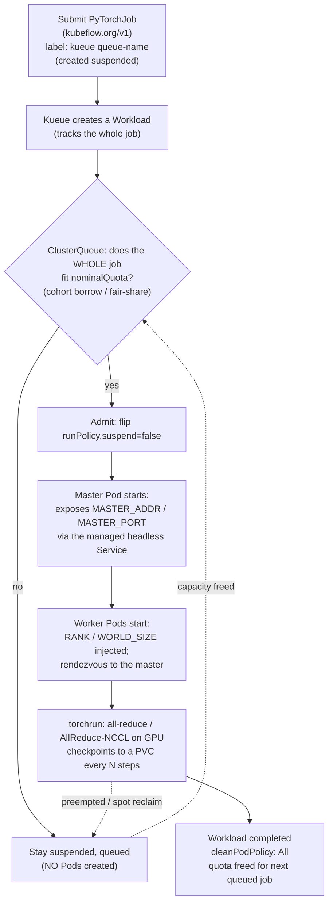

# 04 — Distributed training

> Why a single-node `Job` (or even a gang-scheduled `JobSet`) stops being
> enough as models grow — multi-worker training needs a **coordinated set of
> Pods that all run together** (rendezvous + all-reduce / parameter server);
> **Kubeflow Training Operator** (`PyTorchJob`/`TFJob`/`MPIJob`/`PaddleJob` —
> master + workers, `cleanPodPolicy`, elastic, `runPolicy.suspend` for Kueue);
> **Ray / KubeRay** (`RayCluster` head + workers; `RayJob` for batch submit;
> autoscaling Ray workers; Ray Train); **torchrun & Horovod** patterns
> (all-reduce, NCCL on GPU); **checkpointing** (PVC vs cloud object store;
> resumable training; ties [Part 03 ch.05](../03-config-and-storage/05-stateful-data-patterns.md));
> **elastic & fault-tolerant** training (`torchrun --max-restarts`,
> `PyTorchJob` elastic; preemption from spot — ties [Part 06 ch.05](../06-production-readiness/05-reliability-and-disruptions.md) PDBs /
> [Part 10 ch.06](../10-cloud-and-managed-kubernetes/06-node-autoscaling-cost-multicloud.md) spot);
> **data loading** (RWX PVCs, S3/GCS via cloud identity from
> [Part 10 ch.03](../10-cloud-and-managed-kubernetes/03-cloud-identity.md));
> and how Kueue admits a PyTorchJob/RayJob as a `Workload` (deepens
> [ch.03](03-batch-and-gang-scheduling.md)) — applied by installing the
> Kubeflow Training Operator and KubeRay (pinned, own namespaces) and
> **actually training the recommendations model on kind, CPU-only**, in
> [`examples/bookstore/ml/train/`](../examples/bookstore/ml/train/), then
> showing the same training as a `PyTorchJob` and a `RayJob` (CRD-backed,
> dry-run honest).

**Estimated time:** ~60 min read · half-day hands-on
**Prerequisites:** [Part 12 ch.03](03-batch-and-gang-scheduling.md) — gang scheduling that admits these workloads · [Part 03 ch.05](../03-config-and-storage/05-stateful-data-patterns.md) — PVC patterns checkpointing uses · [Part 10 ch.03](../10-cloud-and-managed-kubernetes/03-cloud-identity.md) — cloud identity for S3/GCS data loading
**You'll know after this:** • author a Kubeflow PyTorchJob with master + workers + `cleanPodPolicy` + Kueue suspend · • compare PyTorchJob vs RayJob vs raw JobSet for distributed training · • design checkpointing against a PVC or object store for resumable runs · • configure elastic + fault-tolerant training under spot preemption · • load training data via RWX PVC or cloud object store + workload identity

<!-- tags: ml, batch, gpu, stateful, kueue -->

## Why this exists

[ch.03](03-batch-and-gang-scheduling.md) made the **whole gang** the unit of
admission: Kueue creates a Job/JobSet **suspended**, fits it against quota,
and only then lets Pods exist — no partial placement, no deadlock. That
solved the *admission* problem for multi-Pod training. It did **not** solve
two other things distributed training needs:

1. **A workload shape that knows about training**, not just "a group of
   Pods". A distributed PyTorch run has *master* and *worker* replicas, an
   `RDZV_ENDPOINT` for rendezvous, an environment of `RANK` / `WORLD_SIZE` /
   `MASTER_ADDR` to wire, a head-of-line policy ("if the master dies, kill
   the workers"), and an elastic mode ("if a worker dies, resume from the
   last checkpoint with `N-1`"). A bare `JobSet` is a coordinated group of
   Jobs — true, but you re-invent every one of those concerns. The
   **Kubeflow Training Operator** (`PyTorchJob`/`TFJob`/`MPIJob`/`PaddleJob`)
   *is* those concerns expressed as CRDs.
2. **A dataflow shape for Python-native distributed compute** — Ray runs
   tasks/actors across a *cluster* you can submit jobs to, with its own
   autoscaler and the `Ray Train` library for training. KubeRay turns that
   into Kubernetes-native `RayCluster` + `RayJob` CRDs. Different from a
   PyTorchJob because Ray is a *runtime*, not a per-job orchestrator.

This chapter is honest in scope: the Bookstore recommendations model is a
deliberately tiny item-kNN / co-occurrence recommender (see
[`../examples/bookstore/ml/README.md`](../examples/bookstore/ml/README.md)
and [`dataset/README.md`](../examples/bookstore/ml/dataset/README.md)). The
**real CPU-only training** in
[`examples/bookstore/ml/train/`](../examples/bookstore/ml/train/) runs on a
laptop kind cluster and produces a `model.joblib` the next chapters serve —
no GPU, no PyTorch all-reduce. The `PyTorchJob` and `RayJob` files in that
directory are the *CRD shapes* with the same training as a stand-in: real
operator wiring, real Kueue admission, real PSA-`restricted` securityContext,
and the CRD-intrinsic header note (`no matches for kind …` until the
operator is installed) — the same precedent as the rest of this guide.

## Mental model

**Distributed training = a workload shape (`PyTorchJob`/`RayJob`) + a
rendezvous endpoint + checkpoints on a durable volume + Kueue admission of
the whole shape via `suspend`.**

- **Single-node `Job` -> distributed**. A `Job` runs `parallelism: N` Pods
  but they do not know each other exists. The moment training is multi-Pod
  *with rendezvous* you need either (a) a JobSet wiring the headless Service
  yourself or (b) a workload type that does it. `PyTorchJob` does (b) — it
  exposes `MASTER_ADDR`/`MASTER_PORT`/`WORLD_SIZE`/`RANK` on every replica
  and brings the master up before the workers (success-policy +
  `runPolicy.cleanPodPolicy: All`).
- **Two ecosystems, different jobs.** **Kubeflow Training Operator** is the
  *per-framework* path: `PyTorchJob` for PyTorch (`torchrun`), `TFJob` for
  TensorFlow's `ClusterSpec`, `MPIJob` for Horovod/MPI all-reduce,
  `PaddleJob` for PaddlePaddle. **Ray / KubeRay** is the *runtime* path:
  bring up a `RayCluster` (head + workers, optionally autoscaling), submit
  `RayJob`s against it (or attach via the Ray client), and let Ray Train /
  Ray Tune / Ray Data parallelise the work in Python. They are not
  interchangeable: PyTorchJob *runs one specific training script across N
  ranks*; Ray *gives you a cluster runtime your script schedules tasks on*.
  Pick PyTorchJob when training is a single torchrun-shaped script; pick
  Ray when training is part of a broader pipeline of Python tasks (hyperparam
  sweeps, RLHF, mixed batch/streaming).
- **Rendezvous + checkpoints are the durability story.** Distributed
  training is a *very* long single tool invocation. It will be interrupted
  — by a preemption ([Part 04 ch.03](../04-scheduling/03-priority-and-preemption.md)),
  by a spot reclaim ([Part 10 ch.06](../10-cloud-and-managed-kubernetes/06-node-autoscaling-cost-multicloud.md)),
  by a node going Unschedulable. Two things prevent that becoming a
  total-loss incident: **a rendezvous backend** that lets new processes
  rejoin (`c10d` / `etcd-v2` for `torchrun`; the operator's headless Service
  handles the address), and **checkpoints** written to a *durable*
  shared volume (a PVC backed by RWX-capable storage, or an object store
  via the Pod's cloud identity from
  [Part 10 ch.03](../10-cloud-and-managed-kubernetes/03-cloud-identity.md)).
  Elastic mode (`torchrun --max-restarts=N` / `PyTorchJob` elasticPolicy)
  lets the workload *shrink and recover* without restarting from scratch.
- **Kueue still rules admission.** Every workload type — Job, JobSet,
  PyTorchJob, RayJob — has a `suspend` (or `runPolicy.suspend`) field, and
  Kueue's integrations wrap them all the same way: created suspended ->
  `Workload` fits in `ClusterQueue` quota -> flipped admitted. Distributed
  training is not a *new* admission story; ch.03's gang/quota mechanics
  cover it the same way they cover a JobSet. The new piece is the
  *workload shape*, not the *queue*.

## Diagrams

### PyTorchJob (master+worker) -> Kueue admission -> gang training -> PVC checkpoint (Mermaid)



### PyTorchJob vs RayJob vs plain Job — role matrix (ASCII)

```
 WHO IS THIS FOR
 ────────────────────────────────────────────────────────────────────────────
 plain Job        ONE python invocation. Single Pod (or parallelism:N of
   (batch/v1)       independent shards). NO rendezvous, NO master/worker
                    wiring. = the CPU-runnable recommender artifact path
                    (recommender-train-job.yaml). The kind-friendly path.
                    Built-in — dry-runs cleanly anywhere.

 PyTorchJob       ONE distributed training script across N ranks. The
   (kubeflow.org)   operator brings up Master + Worker replicas, sets RANK /
                    WORLD_SIZE / MASTER_ADDR, wires a headless Service for
                    rendezvous, enforces cleanPodPolicy, supports elastic.
                    Submit with label kueue-queue-name; Kueue gates via
                    runPolicy.suspend. = the per-framework path. (Same for
                    TFJob/MPIJob/PaddleJob.)

 RayJob           A SUBMISSION against a RayCluster (head + workers). Ray is
   (ray.io)         a Python runtime: your script `ray.init()`s into a cluster
                    and uses Ray Train / Tune / Data / Actors. The CRD
                    brings up an ephemeral RayCluster, runs `entrypoint`,
                    tears the cluster down (shutdownAfterJobFinishes).
                    Kueue gates via spec.suspend. = the Python-runtime path,
                    for mixed pipelines and hyperparam sweeps.

 INSTALLS — operators live in their OWN namespaces (pinned Helm; ch.03 rule)
   Kubeflow Training Operator   ns `kubeflow` (or `kubeflow-system`)
   KubeRay operator              ns `kuberay-operator`
   Kueue + JobSet                ns `kueue-system` / `jobset-system` (ch.03)
   PVC for checkpoints           per training job / per team
```

## Hands-on with the Bookstore

**Assumed working directory: the guide repo root (`full-guide/`).** Requires
the PSA-`restricted` `bookstore-ml` namespace from
[ch.01](01-why-ml-on-kubernetes.md) and the Kueue capacity/queue from
[ch.03](03-batch-and-gang-scheduling.md). This chapter installs the
**Kubeflow Training Operator** and **KubeRay** (pinned, own namespaces),
adds the *real CPU training image* + manifests under
[`examples/bookstore/ml/train/`](../examples/bookstore/ml/train/), and proves
the train -> joblib loop end-to-end on kind. The serving side comes in
[ch.06](06-model-serving-and-inference.md).

> **The recommender is tiny and CPU-only by design.** The real artifact
> ([`train.py`](../examples/bookstore/ml/train/train.py)) is item-kNN /
> co-occurrence, in the same training shape ch.03 demonstrated as a stand-in.
> The `PyTorchJob` and `RayJob` files in this tree run that same `train.py`
> as a stand-in — they exist to demonstrate the CRD shape and Kueue
> admission, not to fake an all-reduce. The kind-runnable artifact path is
> the plain `batch/v1 Job`.

### 1. Install the training operators (pinned, own namespaces)

```sh
# Pin these — bump deliberately (representative versions; check the
# projects' releases and pin exactly, the same way the guide pins every
# chart/manifest).
TRAINING_OP_VERSION="v1.8.1"            # Kubeflow Training Operator release
KUBERAY_VERSION="1.2.2"                 # KubeRay operator chart (bare semver)

# Kubeflow Training Operator — pinned manifest (the project ships a
# kustomize bundle at a release tag, not a Helm chart):
kubectl apply --server-side -k \
  "github.com/kubeflow/training-operator/manifests/overlays/standalone?ref=${TRAINING_OP_VERSION}"

# KubeRay operator — pinned Helm OCI chart, own namespace:
helm install kuberay-operator oci://ghcr.io/ray-project/kuberay/charts/kuberay-operator \
  --version "$KUBERAY_VERSION" \
  -n kuberay-operator --create-namespace --wait

# Both operators are now ready — their CRDs appear in api-resources.
kubectl api-resources | grep -E 'kubeflow.org|ray.io'
#   pytorchjobs, tfjobs, mpijobs, paddlejobs, mxjobs, xgboostjobs   (kubeflow.org/v1)
#   rayclusters, rayjobs, rayservices                                (ray.io/v1)

kubectl get pods -n kubeflow
kubectl get pods -n kuberay-operator
```

### 2. Build and load the training image, then train (CPU on kind)

The real CPU training is in
[`examples/bookstore/ml/train/train.py`](../examples/bookstore/ml/train/train.py):
deterministic synthetic Bookstore-schema data -> a customer x book sparse
matrix -> item-item cosine similarity -> top-K neighbours per book ->
`model.joblib`. The Dockerfile is multi-stage slim Python that runs as
uid 65532 (PSA-`restricted`-compliant; no root-image footgun).

```sh
# Build + load (kind-specific) the train image
docker build -t bookstore/recommender-train:dev examples/bookstore/ml/train
kind load docker-image bookstore/recommender-train:dev   # only if using kind

# The plain batch/v1 Job + PVC — the CPU/kind path that produces the model
kubectl apply -f examples/bookstore/ml/train/recommender-train-job.yaml
kubectl wait --for=condition=complete job/recommender-train -n bookstore-ml --timeout=300s

kubectl logs -n bookstore-ml -l app.kubernetes.io/component=recommender-train --tail=20
# [train] config=Config(model_dir='/workspace/model', seed=42, n_books=200, ...)
# [train] generating 200 books / 5000 orders across 800 synthetic customers (basket proxy)
# [train] dataset: books=200 orders=5044
# [train] building customer x book interaction matrix
# [train] interactions: shape=(800, 200) nnz=4442
# [train] computing item-item cosine similarity, top_k=10
# [train] wrote /workspace/model/model.joblib (size=11117 bytes)
# [train] sample: neighbours(book_id=1) top-3 = [[2, 0.5475...], [3, 0.4537...], ...]
```

The `recommender-model` PVC now holds `model.joblib`. That is the artifact
[ch.06](06-model-serving-and-inference.md) serves. The same Kueue label
([`kueue.x-k8s.io/queue-name: bookstore-ml-lq`](../examples/bookstore/ml/train/recommender-train-job.yaml))
gates this Job through the ch.03 ClusterQueue if Kueue is installed; with
Kueue absent the label is inert and the Job runs directly. Both behaviours
are correct.

### 3. The same training as a `PyTorchJob` (CRD-backed)

[`recommender-pytorchjob.yaml`](../examples/bookstore/ml/train/recommender-pytorchjob.yaml)
is the Kubeflow Training Operator path: **master + 1 worker**, restricted
SC on every Pod, Kueue label for gang admission. The container runs the
same `train.py` (the recommender does not need PyTorch — see the file
header for the honest scope). A real distributed PyTorch run would launch
`torchrun --nproc-per-node=...` and an actual all-reduce.

```sh
# With the Training Operator installed (step 1), this applies cleanly:
kubectl apply -f examples/bookstore/ml/train/recommender-pytorchjob.yaml

kubectl get pytorchjob -n bookstore-ml
kubectl get pods -n bookstore-ml -l training.kubeflow.org/job-name=recommender-train-pt -o wide
#   recommender-train-pt-master-0 ...   Running
#   recommender-train-pt-worker-0 ...   Running   (started AFTER the master,
#                                                  rendezvous to it)
```

Without the Training Operator installed the manifest dry-runs as the
documented CRD-intrinsic message (header):

```sh
kubectl apply --dry-run=client -f examples/bookstore/ml/train/recommender-pytorchjob.yaml
# error: resource mapping not found ... no matches for kind "PyTorchJob" in version
#   "kubeflow.org/v1"  — expected; schema is correct, install the operator first.
```

### 4. The same training as a `RayJob`

[`recommender-rayjob.yaml`](../examples/bookstore/ml/train/recommender-rayjob.yaml)
is the KubeRay path: an ephemeral `RayCluster` (head + 1 worker) with our
training image, `entrypoint: "python /workspace/train.py"`,
`shutdownAfterJobFinishes: true`. The same Kueue label gates the whole
submission in via `spec.suspend`. The same CRD-intrinsic dry-run applies
when KubeRay is absent:

```sh
# With KubeRay installed (step 1):
kubectl apply -f examples/bookstore/ml/train/recommender-rayjob.yaml
kubectl get rayjob,raycluster,pods -n bookstore-ml -l ray.io/cluster=recommender-train-ray

# Without KubeRay:
kubectl apply --dry-run=client -f examples/bookstore/ml/train/recommender-rayjob.yaml
# error: ... no matches for kind "RayJob" in version "ray.io/v1"   — expected.
```

### 5. Checkpointing, elastic, and what changes on GPU

For the recommender the run is seconds, so checkpointing is overkill. For a
**real** PyTorchJob you would:

- Mount a checkpoint PVC (RWX-capable, e.g. CSI NFS/EFS/Filestore — see
  [Part 03 ch.05](../03-config-and-storage/05-stateful-data-patterns.md))
  at e.g. `/workspace/checkpoints` and write every N steps. The PVC outlives
  the Pod, so a re-run resumes from the last checkpoint.
- Use **elastic** torchrun (`torchrun --rdzv-backend c10d
  --max-restarts=5`) inside the master/worker containers; the Training
  Operator's `elasticPolicy` extends the PyTorchJob CRD to expose this
  declaratively (min/max replicas, rdzv backend) so a worker dying triggers
  a *resume*, not a restart from zero.
- On GPU (ch.02), each container requests `limits.nvidia.com/gpu: 1`, the
  base image is CUDA + NCCL, `MASTER_ADDR` is the headless Service, and
  the all-reduce primitive is NCCL over the GPU NICs. The PSA-restricted
  shape stays the same (the chapter's footgun).
- For very large datasets, **read** from object storage via the Pod's cloud
  identity ([Part 10 ch.03](../10-cloud-and-managed-kubernetes/03-cloud-identity.md)) —
  no static credentials on the Pod, no per-team-per-bucket secret sprawl.
- For **spot / preemptible** GPU nodes
  ([Part 10 ch.06](../10-cloud-and-managed-kubernetes/06-node-autoscaling-cost-multicloud.md)),
  *checkpointing is mandatory* (ch.03's last "in production" note): an
  un-checkpointed 6-hour training preempted at hour 5 is a pure-loss incident.

## How it works under the hood

- **The Training Operator's PyTorchJob shape.** A `PyTorchJob` carries
  `pytorchReplicaSpecs.Master` and `pytorchReplicaSpecs.Worker` (and
  optionally `Launcher`, for `mpirun`-style frameworks). The operator
  reconciles these into a **headless Service** (per-replica DNS so
  `<JOB>-master-0.<JOB>.<NS>.svc.cluster.local` is stable rendezvous
  address), one Job per replica group, and **env vars on every Pod**:
  `MASTER_ADDR` (the master's DNS), `MASTER_PORT` (default 23456), `RANK`
  (the Pod's global rank), `WORLD_SIZE` (master + workers). Your container
  consumes them: `torchrun --nnodes=$WORLD_SIZE --node-rank=$RANK
  --master-addr=$MASTER_ADDR --master-port=$MASTER_PORT train.py`. The
  operator also enforces `cleanPodPolicy`: if the master dies the workers
  are killed (otherwise they hang on an absent rendezvous); a configurable
  `successPolicy` and `runPolicy.activeDeadlineSeconds` /
  `ttlSecondsAfterFinished` round out the lifecycle. **Kueue integration**:
  the operator honours `runPolicy.suspend`, so Kueue's PyTorchJob
  integration creates the job suspended, builds a `Workload`, and flips
  `suspend: false` once it fits — identical to the ch.03 mechanism, just
  on a different field.
- **KubeRay's RayJob and RayCluster, precisely.** A **`RayCluster`** is the
  CRD that owns a head Pod (Ray GCS + dashboard + scheduler) and one or
  more worker groups (each a template with `replicas`, optionally
  autoscaled by `enableInTreeAutoscaling: true`). A **`RayJob`** is a *job
  shape* over Ray: it can `rayClusterSpec`-up an ephemeral cluster,
  `submitterPodTemplate` a tiny submitter Pod that runs `ray job submit`
  with the `entrypoint`, and `shutdownAfterJobFinishes: true` to tear it
  all down. Inside the cluster, Ray is its own scheduler: tasks
  (`@ray.remote def`) and actors (`@ray.remote class`) are placed on
  worker nodes, with placement groups for gang/affinity at the Ray level.
  Ray Train wraps PyTorch/Lightning/HuggingFace to parallelise training
  across workers from inside Python. **Kueue integration**: Kueue's RayJob
  integration honours `spec.suspend` — created suspended, `Workload`
  reserves quota for the *whole* RayCluster, flips on admission. The
  RayCluster's autoscaler then sizes the worker group within that
  reservation.
- **Rendezvous: `c10d` / `etcd-v2`.** PyTorch's distributed runtime needs a
  rendezvous backend so workers can find each other. The default (`c10d`,
  TCPStore-based) is fine for static membership: the master process is the
  TCPStore, workers connect, world size is known up front. For
  **elastic** training (`torchrun --rdzv-backend etcd-v2`), an external
  etcd lets the world *change size* — a worker dying removes it from the
  group, a new one rejoining adds it (under `min`/`max-nodes`). The
  PyTorchJob `elasticPolicy` CRD field exposes this declaratively. The
  Bookstore example does not exercise this (the recommender is one CPU
  invocation), but the shape is identical.
- **Checkpoints are the durability primitive.** A training script reads
  `--checkpoint-dir` and on every N steps writes `<STEP>.pt` (or
  `<STEP>.safetensors`). On startup it lists the dir and resumes from the
  latest. The **shape of the checkpoint storage** is the thing that
  changes by environment: on kind, an RWO PVC the same pod re-mounts on
  retry; in prod, an RWX PVC (NFS / EFS / Filestore / Lustre) so a
  *different* node can resume; on cloud, an object store mounted via
  fsspec/s3fs or written directly via the cloud SDK using the Pod's
  workload identity. The
  [Part 03 ch.05](../03-config-and-storage/05-stateful-data-patterns.md)
  snapshot story applies: snapshot the checkpoint PVC nightly for true
  durability.
- **Why elastic training is the only sane answer to spot.**
  [Part 10 ch.06](../10-cloud-and-managed-kubernetes/06-node-autoscaling-cost-multicloud.md)
  warned that spot reclaim is *the* operational rule, not an edge case. A
  3-hour-eviction warning is *not* enough time to manually restart a
  10-hour training job. Elastic PyTorch + checkpointing every N minutes
  means the reclaim costs you N minutes, not 10 hours. Kueue's preemption
  pairs with this: a higher-priority Workload reclaims quota, the
  preempted training resumes when admitted again from its last checkpoint
  — the [Part 04 ch.03](../04-scheduling/03-priority-and-preemption.md)
  preemption story applied to the *gang*.
- **Kueue's Workload bookkeeping for distributed.** When Kueue admits a
  PyTorchJob it computes the total resource ask across `Master` + every
  `Worker` replica and reserves that as a single `Workload`. Per-pod
  failure (a worker OOM) does *not* re-trigger admission — only the
  `cleanPodPolicy`+`successPolicy`-driven *whole-job* outcomes do. So you
  see *one* `Workload` per PyTorchJob, not per Pod, and `kubectl get
  workloads -n bookstore-ml` lets you reason about *which gangs are
  pending why* (look at the conditions block: `QuotaReserved`, `Admitted`,
  `PodsReady`, `Finished`).
- **Where the Bookstore tree fits.**
  [`recommender-train-job.yaml`](../examples/bookstore/ml/train/recommender-train-job.yaml)
  is the **artifact-producing path** — built-ins only, dry-runs cleanly,
  runs on kind, produces `model.joblib` on a PVC the serving side mounts.
  [`recommender-pytorchjob.yaml`](../examples/bookstore/ml/train/recommender-pytorchjob.yaml)
  and
  [`recommender-rayjob.yaml`](../examples/bookstore/ml/train/recommender-rayjob.yaml)
  are the **distributed-shape paths** — CRD-backed, need their operators,
  documented in their headers; they run the same `train.py` as a stand-in
  so the file is honest about scope. All three are PSA-`restricted`-compliant
  and labelled onto Kueue's `bookstore-ml-lq`.

## Production notes

> **In production:** distributed training is a **PyTorchJob / TFJob /
> MPIJob / PaddleJob** (the per-framework Training Operator CRD) or a
> **RayJob** (the Python-runtime path) — never a bare `Job` with hand-rolled
> rendezvous. Pick by *what the script needs*: torchrun -> PyTorchJob;
> Horovod / mpi -> MPIJob; broader Python pipeline / Ray Train / Ray Tune ->
> RayJob. Document the choice; do not run two ecosystems on day one.

> **In production:** **install Training Operator + KubeRay via pinned**
> manifests / Helm charts in their **own namespaces**, treat upgrades like
> any control-plane component, and run them on the same control-plane
> cluster as Kueue (so admission and the operator see the same API). The
> CRD-intrinsic dry-run rule applies — manifests are schema-correct but
> need the CRDs installed first (every CRD file in this guide carries the
> header note).

> **In production:** **checkpoint to a durable shared volume** every few
> minutes (or every N steps). On cloud that means **RWX** storage (CSI NFS
> / EFS / Filestore / Lustre) so a *different* node can resume after
> preemption, OR object storage accessed via the Pod's cloud identity
> ([Part 10 ch.03](../10-cloud-and-managed-kubernetes/03-cloud-identity.md)) —
> never static keys in a Secret. Snapshot the checkpoint PVC nightly
> ([Part 03 ch.05](../03-config-and-storage/05-stateful-data-patterns.md))
> so a corrupted training run does not corrupt its history. Pair with
> **elastic** training (`torchrun --max-restarts` or the operator's
> `elasticPolicy`) so a worker dying triggers a resume, not a restart.
> If the master Pod dies — OOM, node failure — `cleanPodPolicy: All` kills
> the workers and the whole job restarts; without a checkpoint at
> `/workspace/checkpoints`, that restart is from step zero.

> **In production:** ML pods are **not** exempt from Pod Security. The
> Kubeflow Training Operator does not enforce a securityContext on your
> behalf — *your* PyTorchJob/RayJob spec must carry `runAsNonRoot`,
> non-root UID, drop ALL caps, seccomp RuntimeDefault, and
> `allowPrivilegeEscalation: false`. Most PyTorch / CUDA base images
> default to root; rebase them or set the SC and hold (the same footgun as
> [ch.02](02-gpus-and-accelerators.md) GPU pods).

> **In production:** pair every long training with **PDB / spot reclaim
> handling** ([Part 06 ch.05](../06-production-readiness/05-reliability-and-disruptions.md)
> + [Part 10 ch.06](../10-cloud-and-managed-kubernetes/06-node-autoscaling-cost-multicloud.md)).
> Kueue's preemption + checkpoints means a reclaim is a resume, not a
> failure — but only if the script supports it. Test reclaim, do not
> assume.

## Quick Reference

```sh
# Install the operators (pinned, own namespaces)
TRAINING_OP_VERSION="v1.8.1" ; KUBERAY_VERSION="1.2.2"
kubectl apply --server-side -k \
  "github.com/kubeflow/training-operator/manifests/overlays/standalone?ref=${TRAINING_OP_VERSION}"
helm install kuberay-operator oci://ghcr.io/ray-project/kuberay/charts/kuberay-operator \
  --version "$KUBERAY_VERSION" -n kuberay-operator --create-namespace --wait

# Build + load the training image, then train (CPU/kind — the artifact path)
docker build -t bookstore/recommender-train:dev examples/bookstore/ml/train
kind load docker-image bookstore/recommender-train:dev
kubectl apply -f examples/bookstore/ml/train/recommender-train-job.yaml
kubectl wait --for=condition=complete job/recommender-train -n bookstore-ml --timeout=300s
kubectl logs -n bookstore-ml -l app.kubernetes.io/component=recommender-train --tail=20

# The CRD-backed paths (need the operators)
kubectl apply -f examples/bookstore/ml/train/recommender-pytorchjob.yaml
kubectl apply -f examples/bookstore/ml/train/recommender-rayjob.yaml

# Observe Kueue admission of the gang
kubectl get workloads,pytorchjobs,rayjobs -n bookstore-ml
kubectl describe workload -n bookstore-ml <NAME>   # why pending: QuotaReserved/Admitted
```

Minimal skeletons:

```yaml
# PyTorchJob — master + workers, Kueue-admitted via runPolicy.suspend
apiVersion: kubeflow.org/v1
kind: PyTorchJob
metadata:
  name: train
  namespace: bookstore-ml
  labels: { kueue.x-k8s.io/queue-name: bookstore-ml-lq }
spec:
  # suspend: Kueue sets this via webhook — do not set false here
  runPolicy: { cleanPodPolicy: All }
  pytorchReplicaSpecs:
    Master:
      replicas: 1
      restartPolicy: OnFailure
      template:
        spec:
          securityContext: { runAsNonRoot: true, runAsUser: 65532,
                             seccompProfile: { type: RuntimeDefault } }
          containers:
            - name: pytorch
              image: <PYTORCH-IMAGE>
              # torchrun reads MASTER_ADDR/PORT/RANK/WORLD_SIZE auto-injected.
              # $(VAR) substitution applies in args[], NOT in command[] —
              # put torchrun in command and its flags in args.
              command: ["torchrun"]
              args: ["--nnodes=$(WORLD_SIZE)", "--node-rank=$(RANK)", "train.py"]
              securityContext: { allowPrivilegeEscalation: false,
                                 capabilities: { drop: [ALL] } }
    Worker:
      replicas: 1
      # ... same shape as Master
```

```yaml
# RayJob — ephemeral RayCluster + entrypoint, Kueue-admitted via spec.suspend
apiVersion: ray.io/v1
kind: RayJob
metadata:
  name: train
  namespace: bookstore-ml
  labels: { kueue.x-k8s.io/queue-name: bookstore-ml-lq }
spec:
  entrypoint: "python train.py"
  shutdownAfterJobFinishes: true
  rayClusterSpec:
    rayVersion: "2.40.0"
    headGroupSpec:
      rayStartParams: { dashboard-host: "0.0.0.0" }
      template: { spec: { containers: [{ name: ray-head, image: <RAY-IMG> }] } }
    workerGroupSpecs:
      - groupName: workers
        replicas: 1
        minReplicas: 1
        maxReplicas: 1
        rayStartParams: {}
        template: { spec: { containers: [{ name: ray-worker, image: <RAY-IMG> }] } }
```

Checklist:

- [ ] Distributed training is a **PyTorchJob / RayJob** (not a bare Job)
- [ ] Operator and CRDs installed via **pinned** Helm/manifests, own namespaces
- [ ] PSA-`restricted` shape on every training Pod (master + worker)
- [ ] **Kueue admission** via `runPolicy.suspend` / `spec.suspend` (gang)
- [ ] **Checkpoints** on durable RWX-capable storage (or object store via cloud identity)
- [ ] **Elastic** training mode if spot/preempt is in play
- [ ] CRD-backed manifests carry the **CRD-intrinsic** header note
- [ ] The kind-runnable artifact path is a plain `batch/v1 Job` (no operator)

## Test your understanding

> Try each before opening the answer drawer. The act of trying is the exercise; the answer is the check.

1. **What does the Kubeflow Training Operator do that a plain JobSet does not?**
   <details><summary>Show answer</summary>

   The Training Operator (`PyTorchJob`, `TFJob`, `MPIJob`, `PaddleJob`) provides framework-specific semantics: it generates the right environment variables (`MASTER_ADDR`, `MASTER_PORT`, `WORLD_SIZE`, `RANK`) for PyTorch's `dist.init_process_group`, manages MPI runner topology, handles `cleanPodPolicy` (running vs all vs none cleanup), and supports elastic training (`runPolicy.suspend`, replica resizing during training). JobSet is more general — coordinated groups of Jobs without framework knowledge. For PyTorch specifically, both work; the operator removes boilerplate. For multi-framework or simpler patterns, JobSet is cleaner. Kueue admits both as gangs.

   </details>

2. **Your training job OOM'd at hour 6 of an 8-hour run. What do you check, in what order, and how do you prevent it next time?**
   <details><summary>Show answer</summary>

   (1) `kubectl describe pod` — was it OOMKilled (exit code 137, reason `OOMKilled`)? Container memory limit hit. (2) `kubectl top pod` / Prometheus `container_memory_working_set_bytes` time series — was usage steady or growing? Growing = memory leak (e.g. accumulating tensors in a list, not detaching gradients). Steady = limit was too low. (3) The training data — did batch 6 have larger samples (variable-length sequences)? (4) Were you accumulating gradients across micro-batches without `optimizer.zero_grad()`? Prevention: enable PyTorch's `torch.cuda.empty_cache()` between epochs, use `pin_memory=True` carefully, set memory limit ≥ peak observed + 20% headroom, and **checkpoint every epoch to durable storage** so an OOM costs you 30 min, not 6 hours. The checkpoint is the difference between "incident" and "minor annoyance."

   </details>

3. **You're running PyTorch DDP on 4 GPUs with NCCL. Workers 0-2 are at 99% GPU util; worker 3 is at 5%. What is happening?**
   <details><summary>Show answer</summary>

   All-reduce is synchronous — the gradient reduction step waits for the slowest worker. Worker 3 is the bottleneck. Reasons: (a) heterogeneous nodes — worker 3 landed on a slower GPU (V100 vs A100); (b) data loader stall — worker 3's DataLoader is starved (insufficient `num_workers`, slow disk, network filesystem); (c) network jitter — NCCL ring traversal includes worker 3's NIC and it's flaky; (d) worker 3 got an unlucky batch shape that takes longer. Diagnostics: GPU type via node labels, `nvidia-smi dmon`, NCCL `NCCL_DEBUG=INFO`. Fix: node anti-affinity / nodeSelector to ensure homogeneous GPUs, pre-warm shuffled data into local PVC, use NCCL hierarchical reduction. The 99/5 split is the classic data-loader-stall signature.

   </details>

4. **You're training on spot instances. AWS reclaims worker 2 mid-training. What does PyTorchJob elastic mode do, and what's the data-side requirement?**
   <details><summary>Show answer</summary>

   With `runPolicy.elastic` and `torchrun --max-restarts=N`, the surviving workers detect worker 2's loss via the rendezvous (etcd or c10d store), rejoin with a new world_size, and resume from the last checkpoint. Data-side requirement: every worker must have read access to the latest checkpoint on durable shared storage (RWX PVC like EFS, or object store via cloud identity from [Part 10 ch.03](../10-cloud-and-managed-kubernetes/03-cloud-identity.md)). If only worker 2 had the latest checkpoint, you lose progress since the last all-reduce barrier. The pattern is: write checkpoints every N steps, write them atomically, write them to shared storage, and design the rendezvous to tolerate replacement.

   </details>

5. **Hands-on: spin up a 2-worker `PyTorchJob` that trains a tiny model and writes a checkpoint to a PVC. Now `kubectl delete pod` on worker 1 mid-training. What recovery path does the operator take vs what happens with a plain Job?**
   <details><summary>What you should see</summary>

   With `PyTorchJob` and `cleanPodPolicy: Running`, the operator restarts the killed worker; if elastic mode is enabled, training resumes from the latest checkpoint with the same world_size. With a plain `Job` and `parallelism: 2`, deleting a Pod causes the Job controller to start a replacement, but the original PyTorch process group has no way to recover — the surviving worker is blocked on rendezvous, the new worker initializes a fresh process group, and they don't reconnect. The Job hangs. This is why distributed training needs an operator that understands the framework's rendezvous semantics, not just generic Pod orchestration.

   </details>

## Further reading

- **Ibryam & Huß, _Kubernetes Patterns_ 2e — *Batch Job* (ch.7)** — the
  run-to-completion model; distributed training is the multi-Pod
  extension this chapter adds with the per-framework operator on top.
- **Rosso et al., _Production Kubernetes_, ch.12 — "Multitenancy"** and
  **ch.13 — "Autoscaling"** — the production context for shared GPU
  clusters running multi-tenant training under Kueue.
- Official: **Kubeflow Training Operator** docs
  <https://www.kubeflow.org/docs/components/training/> (PyTorchJob /
  TFJob / MPIJob / PaddleJob; elastic; rendezvous);
  **KubeRay** docs <https://docs.ray.io/en/latest/cluster/kubernetes/index.html>
  (`RayCluster` / `RayJob` / `RayService`; Ray Train; autoscaling); the
  **Kueue PyTorchJob and RayJob integrations**
  <https://kueue.sigs.k8s.io/docs/tasks/run/> (admission via suspend); the
  PyTorch distributed overview
  <https://pytorch.org/docs/stable/distributed.html>.
