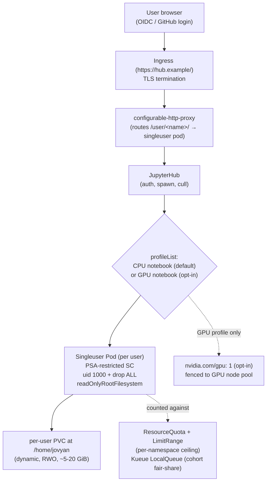

# 05 — Notebooks and interactive ML

> Interactive ML on Kubernetes as long-lived, **PVC-backed dev environments**
> (the dev side of the train -> serve loop); **JupyterHub on Kubernetes**
> (Zero-to-JupyterHub / z2jh: hub, proxy/configurable-http-proxy, per-user
> singleuser servers, profileList for image/resource selection, named-servers
> + culler) vs **Kubeflow Notebooks** (the Kubeflow-native equivalent with
> multi-user/RBAC management); **per-user PVC** for the notebook home (data
> gravity — keep the dataset close); **per-user `ResourceQuota` /
> `LimitRange`** ([Part 01 ch.03](../01-core-workloads/03-resources-and-qos.md)
> / [Part 08 ch.04](../08-day-2-operations/04-multi-tenancy-and-namespaces.md)
> — deepened, not re-taught); **GPU notebooks** (request `nvidia.com/gpu`,
> the GPU-on-shared-Jupyter pattern from [ch.02](02-gpus-and-accelerators.md));
> the **PSA-`restricted` notebook footgun** (stock Jupyter `datascience-notebook`
> runs as `jovyan` uid 1000 + needs writable home/cache/`/tmp`; CUDA notebook
> images default to *root*) with the compliant `singleuser.podTemplate`
> shape; and the **dev -> train -> serve** workflow (notebook explores ->
> exports a training script to Git -> CI builds the train image -> a
> PyTorchJob/RayJob runs from [ch.04](04-distributed-training.md) -> KServe
> serves from [ch.06](06-model-serving-and-inference.md)) — applied by
> installing JupyterHub via pinned z2jh Helm into its own namespace, with a
> restricted-compliant `singleuser.podTemplate`, a per-user PVC, and a
> profileList that includes a "GPU notebook" choice plus the CPU default,
> referencing the stand-alone illustrative PodTemplate in
> [`examples/bookstore/ml/notebook/`](../examples/bookstore/ml/notebook/).

**Estimated time:** ~45 min read · ~120 min hands-on
**Prerequisites:** [Part 12 ch.02](02-gpus-and-accelerators.md) — GPU model the GPU-notebook profile extends · [Part 08 ch.04](../08-day-2-operations/04-multi-tenancy-and-namespaces.md) — per-user quota the hub depends on · [Part 05 ch.02](../05-security/02-pod-security.md) — PSA-restricted that the notebook image must satisfy
**You'll know after this:** • install z2jh (pinned Helm) with a restricted-compliant `singleuser.podTemplate` · • configure per-user PVCs to keep dataset gravity in the cluster · • author a `profileList` with a GPU-notebook choice plus a CPU default · • configure idle culling so unused singleuser servers do not bleed cost · • avoid the `datascience-notebook` UID-1000 vs CUDA-image-root footgun under PSA

<!-- tags: ml, gpu, multi-tenancy, psa-restricted, cost -->

## Why this exists

So far Part 12 has named the **batch** side of ML (training as a Job/JobSet/
PyTorchJob/RayJob — ch.03, ch.04) and the *artifact* it produces. But before
training is *a script that runs in CI*, it is **a person poking at a
dataset** — a notebook, with a kernel, with a PVC of data they refuse to
re-download every morning. Pretending that part doesn't happen leads to
two predictable failures: (a) data scientists run notebooks on their laptops
against production data ("just this once" — until the laptop dies), and
(b) the notebook code that produced "the model that worked" lives only in
the kernel's RAM and is gone the moment it shuts down. Neither is
acceptable.

Kubernetes-native notebooks fix both: the notebook is a **Pod** with a
**PVC** mounted at `$HOME`, lifecycled by a **Hub** that handles login and
spawning, in the same cluster as the data and the training/serving stack.
The notebook code lives in Git (committed from inside the notebook), the
data lives on the PVC, and the **same restricted SecurityContext that
holds for [ch.04](04-distributed-training.md)'s training Pods holds for
the notebook Pods** — they are not exempt.

This chapter is the **dev side of the loop**: how to run JupyterHub on
Kubernetes the way the rest of the guide runs anything on Kubernetes
(pinned Helm, own namespace, PSA-`restricted`-compliant, per-user PVCs and
quotas), how to offer GPU notebooks without giving every data scientist
the cluster, and the singleuser-pod footgun no quickstart shows you.

## Mental model

**A notebook is a Pod with a PVC and a kernel. JupyterHub is the
"hub + proxy + spawner" that creates one per user. PSA-`restricted` applies.
Quotas keep one user from ruining the cluster for everyone.**

- **Notebook = Pod + PVC + Kernel.** A Jupyter / JupyterLab notebook is just
  an HTTP server (port 8888) running inside a container. Give it a PVC at
  `$HOME` and the notebook *and* its dataset survive Pod restarts. Give it
  resource requests/limits and it lives in your QoS world
  ([Part 01 ch.03](../01-core-workloads/03-resources-and-qos.md)). Give it
  a restricted securityContext and it lives in your security world
  ([Part 05 ch.02](../05-security/02-pod-security.md)). There is no magic
  here — the *long-lived* nature is the only thing that differs from a
  training Job.
- **JupyterHub = hub + proxy + spawner.** Multi-user Jupyter on Kubernetes
  is **JupyterHub** (Python). Its three moving parts: the **hub** (Python
  service that authenticates users and decides when to spawn/cull a
  notebook), a **proxy** (`configurable-http-proxy` — a small Node proxy
  that maps each user's URL to their singleuser pod), and the per-user
  **singleuser** Pod (the actual notebook). The
  **Zero-to-JupyterHub (z2jh)** Helm chart is the canonical way to deploy
  this on Kubernetes; pin a release, put it in its own namespace, and
  configure `singleuser.image` + `singleuser.profileList` + the
  restricted `singleuser.podTemplate`. **Kubeflow Notebooks** is the
  Kubeflow-native alternative: it integrates with Kubeflow's
  authentication and multi-user `Profile` CRDs, owns `Notebook` CRDs
  per user, and is more "platform" and less "chart". Pick z2jh when
  Jupyter is the whole story; pick Kubeflow Notebooks when Jupyter is
  one component of a larger Kubeflow install.
- **Data gravity = per-user PVC at `$HOME`.** Notebooks live or die on the
  size of the dataset they can keep close. A per-user dynamically
  provisioned PVC at `/home/jovyan` (or `/home/$USER` in Kubeflow
  Notebooks) is the standard: ~2-20 GiB by default, larger for ML teams,
  on a CSI StorageClass with a sensible `reclaimPolicy` and snapshots
  ([Part 03 ch.05](../03-config-and-storage/05-stateful-data-patterns.md))
  for "I deleted the wrong cell in my notebook" recovery.
- **Per-user quota is the *only* thing between you and runaway costs.**
  The default Jupyter image is large, the default kernel will gladly hold
  10 GiB of pandas DataFrames, and a forgotten GPU notebook costs more
  per hour than every CI runner you have combined. **`ResourceQuota` per
  notebook namespace + `LimitRange` defaults** (the
  [Part 08 ch.04](../08-day-2-operations/04-multi-tenancy-and-namespaces.md)
  multi-tenancy story applied to ML) plus z2jh's **culler**
  (`cull.timeout` — idle notebooks scaled down) plus
  `singleuser.profileList` (the *menu* of image/resource pairs the user
  can pick from — including a "GPU" profile) keep this finite. Without
  these, notebooks become the single biggest line item on the Kubernetes
  bill and you only find out at month-end.
- **PSA-`restricted` is the footgun.** The most popular Jupyter base
  images (`quay.io/jupyter/datascience-notebook`,
  `quay.io/jupyter/scipy-notebook`, the CUDA-equipped ones) default to
  user `jovyan` (uid 1000). Most ML-specific notebook images default to
  *root* and write everywhere. Out of the box neither is admissible in a
  PSA-`restricted` namespace; both still want a writable `$HOME` and a
  writable `/tmp`/`~/.cache`. The
  [`notebook/singleuser-restricted-podtemplate.yaml`](../examples/bookstore/ml/notebook/singleuser-restricted-podtemplate.yaml)
  in this tree is the compliant shape: non-root UID 1000, drop ALL caps,
  seccomp RuntimeDefault, `allowPrivilegeEscalation: false`,
  `readOnlyRootFilesystem: true`, an `emptyDir` at `/tmp`, an `emptyDir`
  at `~/.cache`, and the per-user PVC at `/home/jovyan`. Drop *that*
  shape into z2jh's `singleuser.podTemplate` and you have notebooks that
  the [Part 05 ch.02](../05-security/02-pod-security.md) admission
  controller actually accepts.

## Diagrams

### User -> Ingress -> Hub -> Spawner -> Per-user singleuser Pod + PVC + (optional GPU) (Mermaid)



### JupyterHub (z2jh) vs Kubeflow Notebooks + PSA-restricted checklist (ASCII)

```
 PICK ONE
 ────────────────────────────────────────────────────────────────────────────
 JupyterHub (z2jh)        - Helm chart (Zero-to-JupyterHub). Pinned, own ns.
                             Hub + configurable-http-proxy + per-user pods.
                             Authenticator = OIDC/GitHub/LDAP via Hub config.
                             Multi-tenancy = NAMESPACE + ResourceQuota.
                             = "I want JupyterHub on Kubernetes" — the simple,
                              focused choice. WE LEAD WITH THIS.

 Kubeflow Notebooks       - Part of Kubeflow. `Notebook` CRDs per user, owned
                             by a Kubeflow Profile. Tight integration with
                             other Kubeflow components (Pipelines, Training,
                             Katib, KServe). Heavier install footprint.
                             = "I already run Kubeflow / I want a platform"

 PSA-RESTRICTED SINGLEUSER POD CHECKLIST (the footgun, made compliant)
   [ ] runAsNonRoot: true + runAsUser: 1000 (the jovyan uid baked into image)
   [ ] runAsGroup / fsGroup: 1000 (so the per-user PVC is writable)
   [ ] seccompProfile: RuntimeDefault
   [ ] allowPrivilegeEscalation: false
   [ ] capabilities: { drop: ["ALL"] }
   [ ] readOnlyRootFilesystem: true
   [ ] emptyDir at /tmp  (size-limited)
   [ ] emptyDir at /home/jovyan/.cache  (pip/conda cache, ephemeral)
   [ ] persistentVolumeClaim at /home/jovyan  (per-user, dynamic, RWO)
   [ ] automountServiceAccountToken: false  (notebooks rarely need API token)
   [ ] image bakes uid 1000 (`jovyan`) — choose a base that does, OR rebuild
   [ ] for GPU notebooks: also tolerate the GPU pool taint + nodeAffinity
   [ ] for GPU notebooks: limits.nvidia.com/gpu: 1 (whole device, ch.02)
```

## Hands-on with the Bookstore

**Assumed working directory: the guide repo root (`full-guide/`).** This
chapter installs **JupyterHub via the pinned z2jh Helm chart** into its own
namespace (`jupyter`), shows the **restricted-compliant
`singleuser.podTemplate`** with a per-user PVC, sets up a
**profileList** with CPU + GPU options, and ties **per-user quota** back to
[Part 08 ch.04](../08-day-2-operations/04-multi-tenancy-and-namespaces.md).
The Bookstore example artifact for review is
[`examples/bookstore/ml/notebook/singleuser-restricted-podtemplate.yaml`](../examples/bookstore/ml/notebook/singleuser-restricted-podtemplate.yaml)
— a stand-alone illustrative Pod showing the exact PSA shape z2jh consumes.

> **The Hub itself needs a cluster — there is no faking it.** The
> end-to-end browser flow (open `https://hub.example/`, log in, click
> "Start my server", get a notebook) requires the install. We give the
> *exact* install + the *exact* restricted PodTemplate; the in-browser
> portion is described, not faked.

### 1. Install JupyterHub via pinned z2jh

```sh
# Pin — bump deliberately. The z2jh chart is the canonical way to deploy
# JupyterHub on Kubernetes (https://z2jh.jupyter.org/).
Z2JH_VERSION="3.3.7"

helm repo add jupyterhub https://hub.jupyter.org/helm-chart/
helm repo update

# Install z2jh into its own namespace (NOT bookstore-ml — z2jh is platform
# infrastructure, like the GPU Operator or Kueue).
helm install jupyterhub jupyterhub/jupyterhub \
  --version "$Z2JH_VERSION" \
  -n jupyter --create-namespace \
  -f /tmp/z2jh-values.yaml \
  --wait

kubectl get pods -n jupyter
#   hub-* (Hub), proxy-* (CHP), user-scheduler-* (kube-scheduler shim)
kubectl get svc -n jupyter
#   proxy-public is the front door (LoadBalancer or ClusterIP+Ingress)
```

### 2. The minimal restricted-compliant `values.yaml`

The values key is `singleuser.podTemplate` (a partial PodSpec the Hub
splices into the singleuser Pod it spawns). Drop in the same SC the
stand-alone [`singleuser-restricted-podtemplate.yaml`](../examples/bookstore/ml/notebook/singleuser-restricted-podtemplate.yaml)
documents, plus the per-user PVC, plus a `profileList` with a GPU option:

```yaml
# /tmp/z2jh-values.yaml — minimal restricted-compliant z2jh values.
hub:
  config:
    JupyterHub:
      authenticator_class: dummy        # replace with OIDC/GitHub in prod
    DummyAuthenticator:
      password: "let-me-in"             # replace with real auth in prod
proxy:
  service:
    type: ClusterIP                     # add an Ingress in front of this
singleuser:
  image:
    name: quay.io/jupyter/scipy-notebook
    tag: "2024-08-12"
  defaultUrl: /lab
  storage:
    type: dynamic
    dynamic:
      pvcNameTemplate: "claim-{username}{servername}"
      volumeNameTemplate: "volume-{username}{servername}"
    capacity: 5Gi
    homeMountPath: /home/jovyan
  cpu:
    limit: 2
    guarantee: 0.25
  memory:
    limit: 2G
    guarantee: 0.5G
  cull:
    enabled: true
    timeout: 3600                       # idle 1h → scaled down
    every: 600
  extraEnv:
    JUPYTER_RUNTIME_DIR: /home/jovyan/.local/share/jupyter/runtime
    JUPYTER_DATA_DIR:    /home/jovyan/.local/share/jupyter
    PIP_CACHE_DIR:       /home/jovyan/.cache/pip
  # ----- PSA-restricted shape (the footgun, made compliant) -----
  podSecurityContext:
    runAsNonRoot: true
    runAsUser: 1000
    runAsGroup: 1000
    fsGroup: 1000
    seccompProfile:
      type: RuntimeDefault
  containerSecurityContext:
    allowPrivilegeEscalation: false
    readOnlyRootFilesystem: true
    capabilities:
      drop: ["ALL"]
  extraVolumeMounts:
    - { name: tmp,   mountPath: /tmp }
    - { name: cache, mountPath: /home/jovyan/.cache }
  extraVolumes:
    - { name: tmp,   emptyDir: { sizeLimit: 256Mi } }
    - { name: cache, emptyDir: { sizeLimit: 512Mi } }
  serviceAccountName: ""                # default; automount stays off:
  extraPodConfig:
    automountServiceAccountToken: false
  # ----- Menu of "what kind of notebook do you want?" -----
  profileList:
    - display_name: "CPU notebook (default)"
      description: "scipy + pandas + sklearn; PSA-restricted; 2 cpu / 2 GiB"
      default: true
      kubespawner_override:
        image: quay.io/jupyter/scipy-notebook:2024-08-12
    - display_name: "GPU notebook"
      description: "CUDA notebook; needs a GPU node (see Part 12 ch.02)"
      kubespawner_override:
        image: quay.io/jupyter/pytorch-notebook:cuda12-2024-08-12
        extra_resource_limits: { "nvidia.com/gpu": "1" }
        node_affinity_required:
          - matchExpressions:
              - { key: "nvidia.com/gpu.present", operator: In, values: ["true"] }
        extra_tolerations:
          - { key: "nvidia.com/gpu", operator: "Exists", effect: "NoSchedule" }
```

The GPU profile reuses the [ch.02](02-gpus-and-accelerators.md) recipe
exactly (taint toleration + nodeAffinity to GPU nodes + `limits.nvidia.com/gpu: 1`).
On a GPU-less kind cluster the GPU profile sits Pending with the documented
`Insufficient nvidia.com/gpu` — the same honest behaviour as
[`gpu/recommender-train-gpu.yaml`](../examples/bookstore/ml/gpu/recommender-train-gpu.yaml).

### 3. Per-user quota (the cost fence)

z2jh creates each singleuser Pod in the **same namespace as the Hub** by
default. Apply a `ResourceQuota` + `LimitRange` on that namespace as the
[Part 08 ch.04](../08-day-2-operations/04-multi-tenancy-and-namespaces.md)
recipe says — and on GPU, **also** pair with the Kueue ClusterQueue
from [ch.03](03-batch-and-gang-scheduling.md) so notebooks compete for
GPUs fairly with training:

```sh
kubectl create -n jupyter quota nb-quota \
  --hard=requests.cpu=8,requests.memory=16Gi,requests.nvidia.com/gpu=2 \
  --dry-run=client -o yaml | kubectl apply -f -
kubectl get resourcequota -n jupyter
```

This is the *namespace ceiling* (admission **rejects** over-cap). Kueue
queues *within* it for fair sharing. The per-Pod request defaults come
from z2jh's `singleuser.cpu/memory.guarantee/limit`; you can also pin a
`LimitRange` defaulting `nvidia.com/gpu: 0` so a user can't accidentally
spawn 4 GPUs by editing their profile.

### 4. The stand-alone illustrative PodTemplate (for review / dry-run)

[`examples/bookstore/ml/notebook/singleuser-restricted-podtemplate.yaml`](../examples/bookstore/ml/notebook/singleuser-restricted-podtemplate.yaml)
is the same shape as a *stand-alone* Pod (with comments mapping each field
to the z2jh values key). It is **illustrative** — z2jh spawns singleuser
pods from `singleuser.podTemplate`, not from this file — but it is a real,
restricted-PSA-compliant Pod for review and for
`kubectl apply --dry-run=client` validation:

```sh
kubectl apply --dry-run=client \
  -f examples/bookstore/ml/notebook/singleuser-restricted-podtemplate.yaml
#   pod/jupyter-singleuser-illustrative created (dry run)
```

### 5. The dev -> train -> serve loop (how this chapter ties the next two)

The recommendations thread end-to-end:

1. **Notebook (this chapter).** A data scientist opens
   `https://hub.example/`, picks the CPU profile, gets a singleuser pod
   with `/home/jovyan` PVC. They explore the
   [`../examples/bookstore/ml/dataset/`](../examples/bookstore/ml/dataset/)
   schema, prototype the recommender, and export `train.py` to a Git repo.
2. **Train ([ch.04](04-distributed-training.md)).** CI builds the image,
   `kubectl apply -f recommender-train-job.yaml` produces `model.joblib`
   on the `recommender-model` PVC. PyTorchJob / RayJob variants exist as
   the distributed shapes.
3. **Serve ([ch.06](06-model-serving-and-inference.md)).** A KServe
   `InferenceService` (or the plain Deployment fallback) loads the same
   `model.joblib` and exposes the recommender API the Bookstore
   `catalog` / `storefront` services call.

Notebooks are the *front of the loop*, not a separate thing.

## How it works under the hood

- **JupyterHub's three Pods, precisely.** The **hub** is a Python service
  (image `quay.io/jupyterhub/k8s-hub`) running JupyterHub itself — it
  authenticates, decides spawn/cull, owns the database of users and active
  servers (SQLite by default; Postgres for HA). The **proxy** is
  `configurable-http-proxy` (Node), image
  `quay.io/jupyterhub/configurable-http-proxy`, listening on a public
  port and dynamically registering routes per user (`/user/<NAME>/` ->
  the user's singleuser Pod). The **user-scheduler** is a kube-scheduler
  *shim* (image `registry.k8s.io/kube-scheduler` with a custom config)
  that packs singleuser pods onto already-active notebook nodes (so a
  scaled-down cluster keeps notebook nodes warm rather than draining
  them) — purely a packing/cost optimisation, not a security boundary.
- **Spawn lifecycle.** When a logged-in user clicks "Start My Server",
  the hub's **`KubeSpawner`** (the kubernetes-spawner plugin) creates: a
  PVC (`claim-<USERNAME>`) from `singleuser.storage.dynamic`, a Pod
  (`jupyter-<USERNAME>`) using `singleuser.image` + `singleuser.podTemplate`
  + the chosen profile's `kubespawner_override`, a Service pointing at the
  Pod, and a route on the proxy. The hub watches the Pod's readiness,
  registers the route once ready, and redirects the user's browser. On
  idle, the **culler** (a small client running inside the hub) deletes
  the Pod + Service (the PVC survives — that is the point).
- **Why per-user PVC matters operationally.** Without it, a user who
  shuts down their notebook loses everything in `/home/jovyan` —
  uncommitted code, kernel state, a half-trained model. With it, the
  notebook is *the same kernel state* across days. The PVC outlives the
  Pod, snapshot it ([Part 03 ch.05](../03-config-and-storage/05-stateful-data-patterns.md)),
  back it up — it is the user's workspace.
- **GPU notebooks on a shared cluster.** The
  [ch.02](02-gpus-and-accelerators.md) recipe applies unchanged: the GPU
  profile adds `extra_resource_limits.nvidia.com/gpu: 1` + the GPU
  toleration + nodeAffinity. Because a GPU is *whole-device*, an idle
  GPU notebook holds the GPU even when the user is asleep — **the culler
  is mandatory**, not optional. Pair the culler with the ch.03 Kueue
  ClusterQueue's GPU `nominalQuota` so a *training* PyTorchJob can
  preempt an idle GPU notebook and reclaim the device. This is the
  ch.02 "keep the expensive GPU busy" loop applied to notebooks: idle
  notebooks must not hoard GPUs.
- **Kubeflow Notebooks, the alternative.** A `Notebook` CRD
  (`kubeflow.org/v1`) holds the same shape — `spec.template.spec` is a
  PodSpec — owned by a Kubeflow `Profile`. The Notebook Controller
  reconciles it into a `StatefulSet` (so the Pod can be restarted with a
  stable identity) + a Service + a Virtual Service (for Istio
  ingress / per-user URLs through Kubeflow's central dashboard). The
  multi-user model is heavier (Profiles, AuthorizationPolicies, Istio)
  and tighter to the rest of Kubeflow (Pipelines, KServe). Pick it if
  you are already running Kubeflow; pick z2jh otherwise.
- **The PSA-restricted footgun, explained.** Two things bite. First, many
  popular notebook images default to user `root` (CUDA notebooks
  especially) — z2jh's defaults assume `jovyan` uid 1000. A root image
  is **rejected** by `restricted`. The fix is to rebuild on
  `quay.io/jupyter/*` (which bake `jovyan`) or set the SC + USER
  yourself. Second, Jupyter wants writable paths it does not expose as
  options: the kernel writes runtime files, pip writes a cache, sklearn
  writes `__pycache__` everywhere, `/tmp` is needed by half the
  filesystem layer. `readOnlyRootFilesystem: true` breaks all of that
  unless you mount `emptyDir`s at the writable paths *and* point Jupyter
  at them via env (`JUPYTER_RUNTIME_DIR`, `PIP_CACHE_DIR`,
  `JUPYTER_DATA_DIR`, etc.). The illustrative PodTemplate in this tree
  does that exhaustively so the shape is real, not theoretical.
- **Auth in front of the Hub.** The Hub's `JupyterHub.authenticator_class`
  binds to OIDC (Keycloak, Auth0, Okta), GitHub, LDAP, generic OAuth, or
  the `dummy` authenticator (one shared password — *only* for demos).
  For production: terminate TLS at an Ingress in front of `proxy-public`,
  OIDC-authenticate at the Hub, and gate even the Hub login behind your
  IdP / VPN. The notebook itself does not see the user's identity beyond
  the hub-injected `JUPYTERHUB_USER` — it is *not* a multi-tenant
  process, it is per-user-pods, which is the only sane multi-tenancy on
  a process boundary that runs arbitrary code.

## Production notes

> **In production:** put **JupyterHub** (or Kubeflow Notebooks) in its
> **own namespace** via **pinned Helm** (`jupyterhub/jupyterhub` for z2jh,
> the Kubeflow installer for Kubeflow Notebooks). Treat it as
> platform infrastructure: same upgrade discipline as the GPU Operator,
> KServe, Kueue. **Never** install from a `releases/latest` URL.

> **In production:** every singleuser Pod **must** be PSA-`restricted`-
> compliant: non-root UID (1000 for the official Jupyter images),
> drop ALL caps, seccomp RuntimeDefault, `allowPrivilegeEscalation: false`,
> `readOnlyRootFilesystem: true` + `emptyDir` at `/tmp` and `~/.cache` +
> a per-user PVC at `/home/jovyan`. CUDA notebook images default to root
> — rebuild or set the SC + USER explicitly. ML pods are not exempt
> from PSA.

> **In production:** **per-user PVCs are non-negotiable**, with a
> reasonable default (5-20 GiB) and a snapshot policy
> ([Part 03 ch.05](../03-config-and-storage/05-stateful-data-patterns.md)).
> Document a path for "I deleted the wrong cell" (PVC snapshot rollback)
> and "I left the company" (PVC archive). The notebook IS the user's
> workspace, treat it like one.

> **In production:** **enable the culler** with an aggressive timeout (an
> hour of idle, not a day). Idle CPU notebooks waste memory; idle GPU
> notebooks waste *real money*. Pair with **per-namespace
> `ResourceQuota`** ([Part 08 ch.04](../08-day-2-operations/04-multi-tenancy-and-namespaces.md))
> and, for GPUs, the **Kueue ClusterQueue** ([ch.03](03-batch-and-gang-scheduling.md))
> so training can preempt idle GPU notebooks.

> **In production:** authenticate the Hub via your IdP (OIDC), not the
> `dummy` authenticator. Put an Ingress with TLS in front of
> `proxy-public`. The notebook is *running user code in your cluster*:
> the only credible auth boundary is the Hub, gated by your IdP.

> **In production:** the data scientist's exit from the notebook is
> **commit to Git**, not "the kernel still has it in memory". The
> dev -> train -> serve loop (notebook explores -> exports `train.py` ->
> CI builds the train image -> PyTorchJob / RayJob -> KServe) is
> doctrine, not aspiration. The notebook is the *front* of the loop,
> not a substitute for it.

## Quick Reference

```sh
# Install JupyterHub via pinned z2jh (own namespace)
Z2JH_VERSION="3.3.7"
helm repo add jupyterhub https://hub.jupyter.org/helm-chart/
helm repo update
helm install jupyterhub jupyterhub/jupyterhub \
  --version "$Z2JH_VERSION" \
  -n jupyter --create-namespace \
  -f values.yaml --wait

# Per-namespace quota (the cost fence)
kubectl create -n jupyter quota nb-quota \
  --hard=requests.cpu=8,requests.memory=16Gi,requests.nvidia.com/gpu=2

# Dry-run the illustrative restricted-compliant singleuser PodTemplate
kubectl apply --dry-run=client \
  -f examples/bookstore/ml/notebook/singleuser-restricted-podtemplate.yaml
```

Minimal skeleton (z2jh `singleuser.podTemplate` shape — drop into values):

```yaml
singleuser:
  podSecurityContext:
    runAsNonRoot: true
    runAsUser: 1000
    runAsGroup: 1000
    fsGroup: 1000
    seccompProfile: { type: RuntimeDefault }
  containerSecurityContext:
    allowPrivilegeEscalation: false
    readOnlyRootFilesystem: true
    capabilities: { drop: ["ALL"] }
  storage:
    type: dynamic
    capacity: 5Gi
    homeMountPath: /home/jovyan
  cull: { enabled: true, timeout: 3600, every: 600 }
  extraVolumes:
    - { name: tmp,   emptyDir: { sizeLimit: 256Mi } }
    - { name: cache, emptyDir: { sizeLimit: 512Mi } }
  extraVolumeMounts:
    - { name: tmp,   mountPath: /tmp }
    - { name: cache, mountPath: /home/jovyan/.cache }
  profileList:
    - display_name: "CPU notebook (default)"
      default: true
      kubespawner_override: { image: "quay.io/jupyter/scipy-notebook:..." }
    - display_name: "GPU notebook"
      kubespawner_override:
        image: "quay.io/jupyter/pytorch-notebook:cuda12-..."
        extra_resource_limits: { "nvidia.com/gpu": "1" }
```

Checklist:

- [ ] JupyterHub / Kubeflow Notebooks installed via **pinned** Helm/manifest in its own namespace
- [ ] Singleuser Pod is **PSA-`restricted`-compliant** (the footgun, defused)
- [ ] **Per-user PVC** at `/home/jovyan`, dynamic, sensible default size, snapshotted
- [ ] **Per-namespace `ResourceQuota` + `LimitRange`** caps the blast radius
- [ ] **Culler enabled** with an aggressive timeout (idle GPU notebooks are pure cost)
- [ ] **GPU profile** uses the [ch.02](02-gpus-and-accelerators.md) taint + affinity + `limits.nvidia.com/gpu`
- [ ] Hub authenticated by your **IdP** (OIDC), not the demo authenticator
- [ ] Data scientists commit `train.py` to **Git** — the notebook is the front of the loop

## Test your understanding

> Try each before opening the answer drawer. The act of trying is the exercise; the answer is the check.

1. **Why per-user PVC at `/home/jovyan` and not a shared one?**
   <details><summary>Show answer</summary>

   Notebooks are personal dev environments — datasets being explored, half-written code, secrets pasted into cells, cached Python packages. A shared PVC has every user stepping on each other's files and creates cross-user data exposure (one user's reading another's `client_secret.json` they accidentally cell-magicked into the home dir). Per-user PVC also lets you size and quota individually, snapshot per-user for portability, and delete cleanly when a user offboards. RWX is required only when multiple Pods (e.g. a notebook + a training Job triggered from it) need the same files; even then, per-*user* not per-*Pod*.

   </details>

2. **Your data scientist's notebook has been "idle" for 4 days, holding a GPU. The cost dashboard shows it's the single most expensive resource. What's the policy fix?**
   <details><summary>Show answer</summary>

   Enable the **culler**. Z2JH ships with `cull.enabled: true` — set `cull.timeout: 3600` (1 hour idle), `cull.every: 600` (check every 10 min), and `cull.users: true` to also stop the user record. For GPU notebooks specifically, set a tighter cull timeout (30 min) because idle-GPU cost is acute. Also: surface "your notebook will be culled in 5 min" via Jupyter UI extension. Culling doesn't delete the PVC — when the user logs in next, they get a fresh notebook attached to the same volume; their files are intact. Idle GPU cost is the #1 ML notebook problem in production; the culler is the only sustainable answer.

   </details>

3. **The stock Jupyter `datascience-notebook` image runs as uid 1000 `jovyan`. PSA-restricted demands `runAsNonRoot: true` + `runAsUser` set + `allowPrivilegeEscalation: false`. What `singleuser.podTemplate` snippet makes it compliant?**
   <details><summary>Show answer</summary>

   Set `singleuser.cmd` and `singleuser.podTemplate.spec.securityContext: { runAsNonRoot: true, runAsUser: 1000, runAsGroup: 100, fsGroup: 100, seccompProfile: { type: RuntimeDefault } }`. Per-container: `containers[0].securityContext: { allowPrivilegeEscalation: false, capabilities: { drop: [ALL] }, runAsNonRoot: true, runAsUser: 1000 }`. The PVC mount needs `fsGroup: 100` (the jovyan group) so the user can write to `/home/jovyan`. For CUDA notebook images that default to root, you also need to either rebuild with USER 1000 or use a non-root CUDA variant. Skipping the `fsGroup` is the classic failure mode — Pod starts but writes to the home PVC fail.

   </details>

4. **Hands-on: install JupyterHub with z2jh on kind. Set per-user `ResourceQuota: requests.cpu=2, limits.memory=8Gi, persistentvolumeclaims=1`. Now a user opens 2 named-servers. What happens?**
   <details><summary>What you should see</summary>

   The first named-server's Pod schedules with 1 CPU / 2Gi RAM (or whatever the profile says). The second named-server tries to schedule but the user's namespace quota is already at 2 CPU consumed (or 8Gi RAM if memory-limited). The Pod becomes `Pending` with a quota-exceeded event, or the controller refuses to create it. Quota is *per user namespace*, not per server. The lesson: named-servers are useful (multiple notebooks for one user) but quota is the same blast-radius cap as ResourceQuota anywhere — see [Part 08 ch.04](../08-day-2-operations/04-multi-tenancy-and-namespaces.md).

   </details>

## Further reading

- **Ibryam & Huß, _Kubernetes Patterns_ 2e — *Self-Awareness* (ch.16)** and
  ***Stateful Service* (ch.12)** — long-lived stateful Pods (which is what
  a per-user notebook is) and how data gravity drives shape decisions.
- **Rosso et al., _Production Kubernetes_, ch.12 — "Multitenancy"** —
  exactly the multi-tenant ceiling story the per-user PVC + per-namespace
  quota + Hub-authenticator stack is solving.
- Official: **Zero-to-JupyterHub on Kubernetes** docs <https://z2jh.jupyter.org/>
  (the chart, values, the singleuser shape); **Kubeflow Notebooks** docs
  <https://www.kubeflow.org/docs/components/notebooks/> (CRD, Profiles,
  Istio integration); **KubeSpawner** docs
  <https://jupyterhub-kubespawner.readthedocs.io/> (the
  `singleuser.podTemplate` shape and `profileList` semantics).
