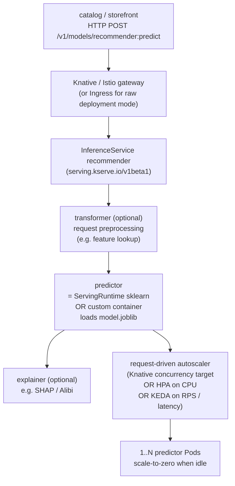

# 06 — Model serving and inference

> The serving problem (low-latency request/response over HTTP/gRPC,
> autoscaling on **request load** rather than CPU, **scale-to-zero**, model
> versioning, **A/B** + canary at the model level); **KServe** (`InferenceService`
> + `ServingRuntime`: serverless via Knative or raw `Deployment`,
> `predictor`/`transformer`/`explainer`, `storageUri`, built-in runtimes for
> sklearn / pytorch / tensorflow / triton / huggingface) installed via pinned
> Helm in its own namespace; **Seldon Core** (graph-of-components serving)
> and **NVIDIA Triton** (multi-framework, multi-model, ensemble) at the right
> depth — a "when which" matrix; **autoscaling for serving**: Knative
> request-driven scale-to-zero vs HPA on CPU (deepening
> [Part 06 ch.04](../06-production-readiness/04-autoscaling.md)) vs KEDA on
> custom RPS/latency (ties Part 06 ch.04); **GPU serving** (Triton / TGI /
> vLLM on GPU; MIG for multi-tenant inference — ties [ch.02](02-gpus-and-accelerators.md));
> **model canary/A-B/shadow** at the InferenceService level vs
> [Part 07 ch.05](../07-delivery/05-progressive-delivery.md) Argo Rollouts
> (contrast: model canary is *request-driven* via KServe, not
> *replica-driven*); ties [Part 07 ch.04](../07-delivery/04-gitops-argocd.md)
> GitOps so model rollouts are PRs — applied by installing KServe (Knative
> Serving + cert-manager) into its own namespace and serving the trained
> recommendations model both as a **KServe `InferenceService`** AND as a
> **plain Deployment + Service**, in
> [`examples/bookstore/ml/serve/`](../examples/bookstore/ml/serve/), with the
> `catalog` / `storefront` integration described.

**Estimated time:** ~60 min read · ~120 min hands-on
**Prerequisites:** [Part 12 ch.04](04-distributed-training.md) — model artifact this chapter serves · [Part 06 ch.04](../06-production-readiness/04-autoscaling.md) — autoscaling primitives Knative/HPA/KEDA build on · [Part 07 ch.05](../07-delivery/05-progressive-delivery.md) — replica-driven canary contrasted with request-driven KServe canary
**You'll know after this:** • author a KServe InferenceService with a built-in ServingRuntime + `storageUri` · • compare KServe / Seldon / Triton for a given multi-framework workload · • configure scale-to-zero serving via Knative + a fall-back HPA/KEDA path · • design model A/B + canary at the InferenceService level · • serve a GPU model with Triton/TGI/vLLM and reason about MIG for multi-tenant inference

<!-- tags: ml, llm-serving, kserve, autoscaling, gpu -->

## Why this exists

This is the serve side of the dev → train → serve loop: notebooks
([./05-notebooks-and-interactive.md](./05-notebooks-and-interactive.md))
explore, training ([./04-distributed-training.md](./04-distributed-training.md))
produces `model.joblib`, and this chapter exposes it.

[ch.04](04-distributed-training.md) ended with a `model.joblib` on a PVC.
That is not a product. **Serving** is the *bridge* from "we trained a thing"
to "the Bookstore's `catalog` and `storefront` make a request and get
recommendations back fast enough that the page does not stutter". The
serving workload has three properties no other Bookstore workload combines:

1. **Latency-sensitive** — the recommendation lands inside a user-facing
   request budget (milliseconds). [Part 06 ch.04](../06-production-readiness/04-autoscaling.md)
   gave us HPA on CPU, KEDA on event backlog — neither is the right *target*
   metric for inference. The right target is **requests-in-flight** /
   **p95 latency**.
2. **Load-spiky** — a recommendation endpoint follows the user-traffic
   curve, not a steady RPS. Idle for hours, then a spike. **Scale-to-zero**
   is the cost lever — no replicas while no requests are coming in.
3. **Versioned-not-mutated** — "Roll the model back to yesterday's v6"
   should be a PR, not a hot-edit. Models are *artifacts* with versions;
   the serving layer is a *router* over those versions; canary / A/B /
   shadow is **traffic splitting at the model boundary**, not a
   replica-rollout (which is what [Part 07 ch.05](../07-delivery/05-progressive-delivery.md)
   Argo Rollouts does for app code).

The Kubernetes-native answer to all three is **KServe** (`InferenceService` +
`ServingRuntime`): a CRD that *is* a model endpoint, autoscaled by
**requests** (Knative serverless mode), with versioned `storageUri`s and
declarative traffic splits. It is to inference what a Deployment+Service+HPA
is to a stateless app — a level above the primitives that *knows about
models*. Alternatives: **Seldon Core** (richer graph-of-components,
explainers, drift detectors), **NVIDIA Triton** (high-throughput
multi-framework runtime), and — for the recommender's tiny CPU case — a
**plain Deployment + Service + HPA**, which the chapter also ships so the
serving path actually runs on kind without KServe installed.

## Mental model

**Serving = a versioned model artifact + a runtime that loads it + a
*request-driven* autoscaler in front. KServe wraps all three as one CRD.**

- **A model is an artifact at a URI.** A `model.joblib` (sklearn), a
  `model.pt` (PyTorch), a `saved_model/` (TF), a `*.safetensors`
  (transformers), all live somewhere: an object store (`s3://`, `gs://`,
  `oci://`), a PVC (`pvc://`), an OCI artifact, a Hugging Face hub URL.
  The **serving runtime** (sklearn server, TorchServe, TF Serving, Triton,
  vLLM, TGI) is a container that *loads* that URI on startup and *serves*
  it over HTTP/gRPC.
- **`InferenceService` + `ServingRuntime` decouple "what model" from
  "what runtime".** A KServe **`ServingRuntime`** is a cluster-scoped (or
  namespaced) recipe: image, supported `modelFormat`s
  (sklearn / pytorch / tensorflow / xgboost / huggingface / triton / vllm /
  tgi), container shape. An **`InferenceService`** is the per-model
  resource: which runtime to use, which `storageUri` to fetch the model
  from, autoscaling bounds, traffic splits. The same runtime serves many
  InferenceServices; the same InferenceService can be retargeted to a
  newer model URI by a PR. (Custom-predictor mode bypasses the runtime
  catalogue — you point `predictor.containers[]` at your own image; we
  use that in the Bookstore tree because our model is a custom joblib
  schema.)
- **Autoscaling: requests, not CPU.** Three options for "scale serving":
  - **Knative request-driven** (`min-scale: 0` / `target: 10` concurrent
    requests / pod): scale-to-zero, scale-up on request, ideal for spiky
    serving. KServe's default in serverless mode.
  - **HPA on CPU** ([Part 06 ch.04](../06-production-readiness/04-autoscaling.md)):
    the boring, robust choice — no scale-to-zero, no Knative install,
    works on the plain Deployment fallback.
  - **KEDA on custom metric** (RPS, p95 latency from Prometheus / OTel):
    serves the same "scale on real signal" goal as Knative request-driven,
    but without the Knative cold-start mechanics. Pick when you want
    `min-scale > 0` always-warm pods AND request-aware scaling.
- **Canary / A/B at the model boundary is *request-routing*, not replica
  rollout.** [Part 07 ch.05](../07-delivery/05-progressive-delivery.md)
  Argo Rollouts splits *replicas* between versions of the same Deployment
  (a small fraction of Pods run v2, traffic is split at the Service). At
  the model boundary the *runtime* is the same — what differs is **which
  model URI it loads**. KServe's canary field
  (`canaryTrafficPercent: 20`) literally adds a second Revision in the
  Knative model and splits traffic by *request*. You can do replica-based
  canary too, but for inference it is usually less precise. **A/B** is
  the same primitive at 50/50. **Shadow** is "send a copy of every
  request to the candidate, do not show its response to the user" — a
  KServe annotation; useful for evaluating a model against real traffic
  *without* user-visible risk.
- **GPU serving is *fractional* and *batched*.** Triton can serve N
  models on one GPU concurrently (dynamic batching across requests),
  MIG ([ch.02](02-gpus-and-accelerators.md)) gives you isolated GPU
  *slices* per tenant. vLLM / TGI are LLM-specialised runtimes that
  pack many concurrent generations onto one GPU. Same Kubernetes
  primitives (`limits.nvidia.com/gpu`, taint/affinity to GPU pool); same
  PSA-`restricted` requirement; the new piece is that one inference Pod
  may concurrently serve many models. Out of scope for the Bookstore (the
  recommender is sklearn-tiny) but the pattern is identical.

## Diagrams

### Request -> KServe `InferenceService` (transformer -> predictor -> explainer) -> autoscaler (Mermaid)



### KServe vs Seldon Core vs Triton vs plain Deployment (ASCII)

```
 WHEN WHICH
 ────────────────────────────────────────────────────────────────────────────
 KServe                  CRD-FIRST. `InferenceService` + `ServingRuntime`.
   (kserve.io)             Serverless via Knative (scale-to-zero, request
                           autoscale) OR raw Deployment mode. Built-in
                           runtimes for sklearn / pytorch / tensorflow /
                           xgboost / huggingface / triton / vllm. Canary +
                           A/B + shadow at the InferenceService level.
                           = the Kubernetes-native default; we lead with it.

 Seldon Core             GRAPH-OF-COMPONENTS. `SeldonDeployment` (v1) or
   (seldon-core.io)        `Model` (v2). Multiple predictor/transformer/
                           explainer/router nodes wired in a DAG. Drift +
                           outlier detection built in. = "I need an
                           inference graph, not a single model" or you
                           specifically standardised on Seldon.

 NVIDIA Triton           HIGH-THROUGHPUT MULTI-MODEL RUNTIME. One Triton
   (Triton Inference       Pod serves N models from N frameworks (TensorRT,
    Server)                ONNX, PyTorch, TF, Python backend), with dynamic
                           batching + concurrent execution + ensembles. Use
                           as a ServingRuntime under KServe, OR stand-alone
                           via Triton's own Helm chart. = the right runtime
                           when you need GPU throughput, NOT a competitor
                           to KServe at the API layer.

 plain Deployment        APP-FIRST. Deployment + Service + HPA. No CRDs,
   + Service + HPA         no Knative, no operator. = the right fit for a
                           tiny CPU model where serverless/canary are
                           overkill, and the kind-runnable fallback in
                           this guide.

 OUR BOOKSTORE TREE
   recommender-deployment.yaml + recommender-service.yaml   (kind-runnable)
   recommender-inferenceservice.yaml (CRD-backed; needs KServe + Knative)
   Both consume the SAME image bookstore/recommender-serve:dev and the SAME
   model.joblib produced by ch.04's recommender-train Job.
```

## Hands-on with the Bookstore

**Assumed working directory: the guide repo root (`full-guide/`).** Requires
the PSA-`restricted` `bookstore-ml` namespace ([ch.01](01-why-ml-on-kubernetes.md))
and the `model.joblib` artifact from [ch.04](04-distributed-training.md).
This chapter installs **KServe** (with Knative Serving + cert-manager, all
pinned, own namespaces), serves the recommendations model as a
**KServe `InferenceService`** AND as a **plain Deployment + Service**, and
describes how the existing `catalog` / `storefront` services call it
**without modifying the canonical app**.

> **Two serving paths, both real.** The plain Deployment + Service is the
> **kind-runnable** path — built-ins, no CRDs, dry-runs cleanly. The
> KServe InferenceService is the CRD-backed equivalent — adds scale-to-zero
> + canary/A-B + the v1/v2 inference protocol routing. Both consume the
> SAME container image (`bookstore/recommender-serve:dev`) and the SAME
> `model.joblib`. The chapter teaches both because both are real
> production choices for this size of model.

### 1. Install KServe (pinned; own namespace)

KServe has a few install footprints. The full **serverless** install needs
Knative Serving + cert-manager + a Knative network layer (Istio or
Kourier). The **RawDeployment** install drops Knative for "just
Deployments+HPA under InferenceService" (lighter, no scale-to-zero). We
show serverless because the chapter teaches scale-to-zero; mark
RawDeployment as the alternative.

```sh
# Pin — bump deliberately. KServe ships a "quick install" script AND a
# Helm-chart-per-component. Use the Helm-chart-per-component path: it is
# pinned, scriptable, and matches the guide's "pinned Helm" rule.
KSERVE_VERSION="0.13.1"
KNATIVE_VERSION="v1.15.0"
CERT_MANAGER_VERSION="v1.15.3"

# 1) cert-manager (KServe's webhook needs serving certs)
helm install cert-manager \
  oci://quay.io/jetstack/charts/cert-manager \
  --version "$CERT_MANAGER_VERSION" \
  -n cert-manager --create-namespace \
  --set crds.enabled=true --wait

# 2) Knative Serving (the serverless layer KServe uses by default).
#    Knative ships its install as a "core" YAML + a "net-*" YAML; both are
#    pinned to a release tag (not :latest).
kubectl apply --server-side \
  -f https://github.com/knative/serving/releases/download/knative-${KNATIVE_VERSION}/serving-crds.yaml
kubectl apply --server-side \
  -f https://github.com/knative/serving/releases/download/knative-${KNATIVE_VERSION}/serving-core.yaml
# Network layer — Kourier is the smallest:
kubectl apply --server-side \
  -f https://github.com/knative/net-kourier/releases/download/knative-${KNATIVE_VERSION}/kourier.yaml
kubectl patch configmap/config-network -n knative-serving --type=merge \
  -p '{"data":{"ingress-class":"kourier.ingress.networking.knative.dev"}}'

# 3) KServe itself
helm install kserve-crd oci://ghcr.io/kserve/charts/kserve-crd \
  --version "$KSERVE_VERSION" -n kserve --create-namespace --wait
helm install kserve     oci://ghcr.io/kserve/charts/kserve \
  --version "$KSERVE_VERSION" -n kserve --wait

kubectl get pods -n cert-manager
kubectl get pods -n knative-serving
kubectl get pods -n kserve
kubectl api-resources | grep -E 'kserve|knative'
#   inferenceservices, servingruntimes, clusterservingruntimes  (serving.kserve.io/v1beta1)
#   services, revisions, configurations, routes                  (serving.knative.dev/v1)
```

> **RawDeployment alternative.** If scale-to-zero / Knative is not
> wanted, set the InferenceService annotation
> `serving.kserve.io/deploymentMode: RawDeployment` and skip the Knative
> install — KServe will create a plain Deployment + HPA. The
> InferenceService manifest stays nearly identical; the chapter teaches
> the serverless path because that is what makes KServe meaningfully
> *different* from a plain Deployment.

### 2. Serve via plain Deployment + Service (the kind-runnable path)

This is the path that just works on kind, no KServe required. The
[`recommender-deployment.yaml`](../examples/bookstore/ml/serve/recommender-deployment.yaml)
+ [`recommender-service.yaml`](../examples/bookstore/ml/serve/recommender-service.yaml)
files are built-in `apps/v1 Deployment` + `v1 Service` — they dry-run
cleanly anywhere. The same image (`bookstore/recommender-serve:dev` from
[`predictor.py`](../examples/bookstore/ml/serve/predictor.py)) implements
the v1 prediction protocol on port 8080.

```sh
# Build + load the serve image (same image used by the InferenceService below)
docker build -t bookstore/recommender-serve:dev examples/bookstore/ml/serve
kind load docker-image bookstore/recommender-serve:dev   # if using kind

# Requires the recommender-model PVC from ch.04 — applied + populated by
# recommender-train-job.yaml. The PVC is shared (RWO; for prod use RWX).
kubectl apply -f examples/bookstore/ml/serve/recommender-deployment.yaml
kubectl apply -f examples/bookstore/ml/serve/recommender-service.yaml
kubectl rollout status deploy/recommender -n bookstore-ml --timeout=120s

# Try it
kubectl port-forward -n bookstore-ml svc/recommender 8080:8080 &
curl -s http://localhost:8080/ready
#   {"status":"ready"}
curl -s -X POST http://localhost:8080/v1/models/recommender:predict \
  -H 'content-type: application/json' \
  -d '{"instances":[{"book_id":1,"k":3}]}'
#   {"predictions":[{"book_id":1,"k":3,
#     "recommendations":[{"book_id":2,"score":0.547...,
#                          "title":"Book 0002","author":"Author 031"},
#                         {"book_id":3,"score":0.453...,...},
#                         {"book_id":4,"score":0.412...,...}]}]}
curl -s "http://localhost:8080/recommend?book_id=42&k=5"
#   {"book_id":42,"k":5,"recommendations":[...]}
```

Add an **HPA on CPU** (the [Part 06 ch.04](../06-production-readiness/04-autoscaling.md)
default) for this Deployment if you want autoscaling without Knative:

```sh
kubectl autoscale deploy/recommender -n bookstore-ml \
  --cpu-percent=60 --min=1 --max=5
kubectl get hpa -n bookstore-ml
```

### 3. Serve via KServe InferenceService (CRD-backed; the serverless path)

[`recommender-inferenceservice.yaml`](../examples/bookstore/ml/serve/recommender-inferenceservice.yaml)
is the CRD-backed equivalent. With KServe installed it adds (over the
plain Deployment) scale-to-zero (`min-scale: 0`), request-driven autoscaling
(`autoscaling.knative.dev/target: 10` concurrent / pod), traffic splits
for canary/A-B, and the v1/v2 inference-protocol routing. We use the
**custom-predictor** option (the same image as the plain Deployment) so
the recommender's custom joblib schema works; KServe's built-in
sklearn `ServingRuntime` is shown as an OPTION B stub at the bottom of
the manifest (it requires `train.py` to dump a sklearn estimator
directly).

```sh
# Without KServe installed, a client dry-run prints the documented
# CRD-intrinsic message (the same precedent as raw-manifests/51-/70-/83-,
# argocd/, operators/, chaos/, ml/batch/, ml/train/):
kubectl apply --dry-run=client \
  -f examples/bookstore/ml/serve/recommender-inferenceservice.yaml
# error: ... no matches for kind "InferenceService" in version
#   "serving.kserve.io/v1beta1"   — expected, schema-correct.

# With KServe installed (step 1):
kubectl apply -f examples/bookstore/ml/serve/recommender-inferenceservice.yaml
kubectl get inferenceservice -n bookstore-ml
#   NAME          URL                                                    READY
#   recommender   http://recommender.bookstore-ml.svc.cluster.local      True

# The Knative Revision the InferenceService is wrapping:
kubectl get revisions,services.serving.knative.dev -n bookstore-ml

# Scale-to-zero: stop calling, wait, watch replicas go to 0.
# Scale-up-from-zero: make one request, see a cold start (first request
# slower while a pod spins up).
kubectl get pods -n bookstore-ml -w
```

### 4. Canary / A-B at the InferenceService level

This is the field that turns "deploy a new model" from a config dance into
a one-line PR. With the v1 model already serving 100% of traffic:

```yaml
# A canary InferenceService update: route 20% of traffic to a new model URI.
spec:
  predictor:
    canaryTrafficPercent: 20
    minReplicas: 0
    maxReplicas: 5
    containers:
      - name: kserve-container
        image: bookstore/recommender-serve:dev
        env: [{ name: MODEL_DIR, value: /workspace/model-v2 }]
        # ... same SC, etc. The v2 PVC is the artifact from the v2 training run.
```

`canaryTrafficPercent: 20` tells KServe to keep the previous Revision live
*and* shift 20% of requests to the new one. Bump to 50, then 100, then
delete the old Revision — exactly the
[Part 07 ch.05](../07-delivery/05-progressive-delivery.md) progressive
delivery pattern, but at the **request** boundary, not the replica
boundary. **Shadow** mode (annotation
`serving.kserve.io/canaryTrafficPercent: "0"` with both Revisions live and
a `mirrorPercent` on the route) sends a copy of each request to the
candidate without showing the response — for measuring v2's behaviour on
real traffic before any user sees it.

### 5. The `catalog` / `storefront` integration

The recommender's in-cluster DNS is
`recommender.bookstore-ml.svc.cluster.local:8080`. From the `catalog`
service ([`../examples/bookstore/app/catalog/main.go`](../examples/bookstore/app/catalog/main.go)),
the "you might also like" rail on a book page is a single
`GET /recommend?book_id=<ID>&k=5` call:

```sh
# Curl from inside a debug pod in the bookstore namespace, with the
# storefront / catalog SA — no canonical app change:
kubectl debug -n bookstore --image=curlimages/curl:8.10.1 \
  --profile=restricted -it nonroot \
  -- curl -s "http://recommender.bookstore-ml.svc.cluster.local:8080/recommend?book_id=1&k=3"
#   {"book_id":1,"k":3,"recommendations":[...]}
```

The chapter narrative shows the integration; the canonical app
(`../examples/bookstore/app/`, `../examples/bookstore/raw-manifests/`,
`../examples/bookstore/helm/`, `../examples/bookstore/kustomize/`) is
**not mutated** — the recommendations endpoint is a new dependency, and
a real change would be a regular app feature PR through Parts 07/08.

### 6. A small load test against the plain Deployment

```sh
# A short, restricted-compliant load-test Pod that hammers the predictor.
# Uses curlimages/curl (non-root, no shell required, restricted-friendly).
# The plain Deployment will trip HPA on CPU and scale up; on the KServe
# path the Knative concurrency target triggers scale-up instead.
cat <<'EOF' | kubectl apply -f -
apiVersion: v1
kind: Pod
metadata:
  name: recommender-loadgen
  namespace: bookstore-ml
  labels: { app.kubernetes.io/part-of: bookstore-ml }
spec:
  restartPolicy: Never
  automountServiceAccountToken: false
  securityContext:
    runAsNonRoot: true
    runAsUser: 65532
    seccompProfile: { type: RuntimeDefault }
  containers:
    - name: load
      image: curlimages/curl:8.10.1
      command: ["/bin/sh","-c"]
      args:
        - |
          for i in $(seq 1 500); do
            curl -s -o /dev/null \
              "http://recommender.bookstore-ml.svc.cluster.local:8080/recommend?book_id=$((1 + i % 50))&k=5"
          done
      securityContext:
        allowPrivilegeEscalation: false
        readOnlyRootFilesystem: true
        capabilities: { drop: ["ALL"] }
EOF

kubectl get hpa,pods -n bookstore-ml -w
```

## How it works under the hood

- **The KServe `InferenceService` reconcile.** When you apply an
  `InferenceService`, the KServe controller looks at
  `spec.predictor.model.modelFormat.name` and picks a matching
  `ServingRuntime` (sklearn / pytorch / tensorflow / huggingface /
  triton / vllm / xgboost), OR uses `spec.predictor.containers[]` for a
  **custom predictor**. It also looks at `spec.predictor.minReplicas /
  maxReplicas / annotations[autoscaling.knative.dev/...]`. In
  **serverless** mode it creates a Knative `Service` -> `Configuration`
  -> `Revision` -> `Deployment`. In **RawDeployment** mode it creates a
  plain `Deployment` + `HorizontalPodAutoscaler`. The model artifact at
  `storageUri` is fetched on Pod startup by a **storage-initializer**
  init-container (KServe ships one per supported URL scheme: s3, gs,
  pvc, oci, hf, http(s)); the artifact lands at `/mnt/models` inside
  the predictor container by convention, and the runtime image loads
  from there. For *custom predictor* mode there is no init-container —
  your image loads the model itself from a path you mount.
- **Knative autoscaling, concretely.** The Knative-Serving Pod
  Autoscaler (KPA) sits in front of the Deployment, watches **concurrency
  / RPS at the activator**, and scales by:
  `target_concurrency` (e.g. 10 in-flight requests per pod). `min-scale:
  0` is the scale-to-zero — when concurrency stays at 0 for the stable
  window, KPA scales to 0 and traffic *for the next request* lands on
  the **activator** (a buffering proxy) which holds the request until a
  Pod is ready. Cold-start latency = (Pod schedule) + (container
  start) + (model load), so for a large model this matters; KServe
  documents `containerConcurrency` / `target-utilization-percentage` /
  `target-burst-capacity` levers to tune. The Bookstore recommender
  cold-starts in seconds because the model is small.
- **HPA vs KEDA vs Knative — pick the right one.** **HPA on CPU** (or
  on a custom metric via metrics-server / Prometheus adapter) is the
  default, robust choice; min-replicas is always > 0; works on any
  Deployment. **KEDA** ([Part 06 ch.04](../06-production-readiness/04-autoscaling.md))
  wraps an HPA and scales from a custom external scaler — RPS,
  latency, queue depth, Prometheus query — and can scale to 0 if you
  set `minReplicaCount: 0` (KEDA does the deactivation; Knative is not
  required). **Knative** is request-driven *internal* autoscaling and
  baked into KServe serverless. **Pick:** Knative-when-using-KServe-
  serverless; KEDA for everything else that needs scale-to-zero;
  HPA-CPU for the simple stateless-ML case (which is what the
  Bookstore's plain-Deployment path does).
- **Canary / A-B / shadow at the InferenceService level.** KServe
  models a `predictor` as a `Default` and (optionally) a `Canary`
  Revision. The `canaryTrafficPercent` field tells Knative to route N%
  of requests to Canary, (100-N)% to Default. Because Knative is
  request-routed, the split is *exact* (not the replica-bucket
  approximation of [Part 07 ch.05](../07-delivery/05-progressive-delivery.md)
  Argo Rollouts). Shadow mirroring is the `mirrorPercent` field on
  the Knative `Route` (set indirectly via KServe annotations) — the
  candidate gets a *copy* of the request, its response is discarded.
  **Argo Rollouts is still right for the predictor *image*'s rollout**
  (a CVE patch in the runtime container is a code rollout, not a model
  rollout); the two coexist — Rollouts rolls the *runtime*, KServe
  splits between *models*.
- **GPU serving: Triton + MIG + vLLM/TGI.** A `ServingRuntime` for
  Triton is a Triton container that loads N models from a model
  repository; one InferenceService -> one Triton Pod with many models.
  GPU access is exactly the [ch.02](02-gpus-and-accelerators.md) shape:
  `limits.nvidia.com/gpu: 1`, taint+affinity to the GPU pool,
  PSA-`restricted` SC. **MIG** lets you slice an A100/H100 GPU into
  isolated halves/quarters/sevenths so multiple Triton Pods (or
  multiple InferenceServices) share one physical GPU without time-
  slicing — the right call when many small models compete for one big
  GPU. **vLLM** and **TGI** are LLM-specific runtimes that pack many
  concurrent generations onto one GPU with continuous batching; KServe
  ships them as built-in `ServingRuntime`s. Out of scope for the
  Bookstore (the recommender is sklearn-tiny) but the pattern is the
  same.
- **Seldon Core and when to pick it.** Seldon Core (v2) models a serving
  artifact as a `Model` (one URI + runtime), a `Pipeline` as a graph of
  `Model`s with `inputs`/`outputs` (so a request flows
  feature-lookup -> model-A -> router -> model-B -> postprocess as a
  DAG), and `Experiment` for traffic-splitting *between* graphs. It
  ships `Detector` CRDs for drift + outlier, which KServe does via
  `explainer` and Alibi-Detect components but less first-classly. Pick
  Seldon when you genuinely have a graph (e.g. fraud detection — feature
  store -> rule engine -> model -> override) or you standardised on it;
  pick KServe when the unit of work is a *single model endpoint* (the
  vastly more common case).
- **GitOps for models.**
  [Part 07 ch.04](../07-delivery/04-gitops-argocd.md) said the cluster
  state lives in Git, reconciled by Argo CD or Flux. For models that
  means: the **`InferenceService` manifest** lives in Git, its
  `storageUri` and `image` are the *versioned* fields, a model promotion
  (v1 -> v2) is a PR. The retrain pipeline ([ch.04](04-distributed-training.md))
  produces a new artifact at a new URI; CI writes a PR that bumps
  `storageUri` and `canaryTrafficPercent: 20`; review/merge -> Argo CD
  applies -> KServe shifts traffic. Roll back: revert the PR; Argo CD
  reapplies; KServe shifts back. Models are not special infrastructure
  any more — they are config, in Git, like everything else.
- **PSA on every serving Pod.** KServe wraps the predictor in a Knative
  Service which spawns a Deployment which spawns Pods — your SC on the
  InferenceService propagates all the way through. The Knative
  activator and queue-proxy sidecars come with their own SC (KServe and
  Knative make them PSA-`restricted`-admissible); your predictor
  container must too. The serving image baked here
  ([`../examples/bookstore/ml/serve/Dockerfile`](../examples/bookstore/ml/serve/Dockerfile))
  runs as uid 65532 + non-root.

## Production notes

> **In production:** pick **KServe + Knative serverless** for spiky
> request-driven workloads where scale-to-zero saves real money; pick
> **KServe + RawDeployment** (or a plain Deployment + HPA) for steady
> always-on inference where Knative cold-start risk outweighs the cost
> savings. **Document the choice**; do not run two serving stacks on
> one cluster by accident.

> **In production:** **install KServe + Knative + cert-manager via
> pinned Helm charts / pinned release-tag YAMLs** in their own
> namespaces (`kserve`, `knative-serving`, `cert-manager`). Treat
> upgrades like any control-plane component. Never install from a
> `releases/latest` URL.

> **In production:** the **model artifact lives in an object store**
> (or a registry), not on a per-cluster PVC. Use the Pod's cloud
> identity ([Part 10 ch.03](../10-cloud-and-managed-kubernetes/03-cloud-identity.md))
> to fetch from s3/gs/oci — never static keys in a Secret. The
> InferenceService's `storageUri` is the versioned address; promotions
> are PRs (GitOps, [Part 07 ch.04](../07-delivery/04-gitops-argocd.md)).

> **In production:** **canary at the InferenceService boundary** with
> small `canaryTrafficPercent` first (5%, 20%, 50%, 100%), with
> automated metrics-driven promotion (the
> [Part 07 ch.05](../07-delivery/05-progressive-delivery.md)
> AnalysisTemplate pattern applied to inference SLOs: p95 latency,
> error rate, *and a domain-specific quality signal* like CTR uplift
> on shadow traffic). For high-risk changes use **shadow** before any
> percent goes live.

> **In production:** **observability** — every InferenceService
> exposes Prometheus metrics (request count, latency histogram per
> revision, model load time, error counters) via Knative's queue-proxy
> and KServe's own exporters. Wire them into the
> [Part 06 ch.01](../06-production-readiness/01-observability-metrics.md)
> Prometheus + the dashboards. The new model-specific metrics:
> **prediction latency** p50/p95/p99, **batch utilisation** (Triton),
> **GPU utilisation** (DCGM, [ch.02](02-gpus-and-accelerators.md)),
> and a **quality signal** (a periodic eval job, scored against a
> held-out set, posted as a metric).

> **In production:** ML pods are **not** exempt from PSA. The
> predictor container, the transformer, the explainer, the storage-
> initializer init-container — all of them carry restricted SC.
> Triton's and vLLM's official images default to root; the SC must
> still be applied and the USER pinned. The CRD-intrinsic dry-run rule
> applies to `InferenceService` / `ServingRuntime` (their headers
> document this, like every CRD in this guide).

## Quick Reference

```sh
# Install KServe stack (pinned; own namespaces)
KSERVE_VERSION="0.13.1"
KNATIVE_VERSION="v1.15.0"
CERT_MANAGER_VERSION="v1.15.3"

helm install cert-manager oci://quay.io/jetstack/charts/cert-manager \
  --version "$CERT_MANAGER_VERSION" -n cert-manager --create-namespace \
  --set crds.enabled=true --wait
kubectl apply --server-side \
  -f https://github.com/knative/serving/releases/download/knative-${KNATIVE_VERSION}/serving-crds.yaml
kubectl apply --server-side \
  -f https://github.com/knative/serving/releases/download/knative-${KNATIVE_VERSION}/serving-core.yaml
kubectl apply --server-side \
  -f https://github.com/knative/net-kourier/releases/download/knative-${KNATIVE_VERSION}/kourier.yaml
helm install kserve-crd oci://ghcr.io/kserve/charts/kserve-crd \
  --version "$KSERVE_VERSION" -n kserve --create-namespace --wait
helm install kserve oci://ghcr.io/kserve/charts/kserve \
  --version "$KSERVE_VERSION" -n kserve --wait

# Build + load the serve image, then deploy both paths
docker build -t bookstore/recommender-serve:dev examples/bookstore/ml/serve
kind load docker-image bookstore/recommender-serve:dev

# Plain Deployment fallback (the kind-runnable path)
kubectl apply -f examples/bookstore/ml/serve/recommender-deployment.yaml
kubectl apply -f examples/bookstore/ml/serve/recommender-service.yaml
kubectl autoscale deploy/recommender -n bookstore-ml --cpu-percent=60 --min=1 --max=5

# CRD-backed InferenceService (needs KServe)
kubectl apply -f examples/bookstore/ml/serve/recommender-inferenceservice.yaml
kubectl get inferenceservice,revisions,services.serving.knative.dev -n bookstore-ml

# Test
kubectl port-forward -n bookstore-ml svc/recommender 8080:8080 &
curl -s -X POST http://localhost:8080/v1/models/recommender:predict \
  -H 'content-type: application/json' \
  -d '{"instances":[{"book_id":1,"k":3}]}'
```

Minimal skeleton (KServe `InferenceService`, custom predictor, serverless):

```yaml
apiVersion: serving.kserve.io/v1beta1
kind: InferenceService
metadata:
  name: recommender
  namespace: bookstore-ml
  annotations:
    autoscaling.knative.dev/min-scale: "0"
    autoscaling.knative.dev/max-scale: "5"
    autoscaling.knative.dev/target: "10"
spec:
  predictor:
    minReplicas: 0
    maxReplicas: 5
    canaryTrafficPercent: 20      # OPTIONAL — for canary rollouts
    securityContext:
      runAsNonRoot: true
      runAsUser: 65532
      seccompProfile: { type: RuntimeDefault }
    containers:
      - name: kserve-container
        image: <YOUR-PREDICTOR-IMAGE>
        ports: [{ containerPort: 8080, name: http1 }]
        securityContext:
          allowPrivilegeEscalation: false
          readOnlyRootFilesystem: true
          capabilities: { drop: ["ALL"] }
```

Checklist:

- [ ] KServe + Knative + cert-manager installed via **pinned** Helm/manifest, own namespaces
- [ ] **Custom predictor** OR built-in **`ServingRuntime`** (sklearn / pytorch / huggingface / triton / vllm) chosen deliberately
- [ ] **`storageUri`** points at an object store (cloud) or PVC (kind), not baked into the image
- [ ] **Autoscaling target chosen explicitly**: Knative request-driven (serverless) OR HPA-CPU OR KEDA (rps/latency)
- [ ] **Canary / A/B / shadow** at the InferenceService level for model rollouts; Argo Rollouts for *runtime* rollouts
- [ ] **PSA-`restricted` SC** on every predictor / transformer / explainer container
- [ ] **Observability**: KServe + Knative metrics into Prometheus ([Part 06 ch.01](../06-production-readiness/01-observability-metrics.md)), plus a *quality* metric
- [ ] CRD-backed manifests carry the **CRD-intrinsic** header note
- [ ] Plain Deployment + Service + HPA is a valid choice for small CPU models — and the kind-runnable fallback

## Test your understanding

> Try each before opening the answer drawer. The act of trying is the exercise; the answer is the check.

1. **What does KServe give you that a `Deployment + Service + HPA` does not?**
   <details><summary>Show answer</summary>

   (1) A standard model-loading contract via `storageUri` — fetch from S3/GCS/PVC at startup; (2) built-in `ServingRuntime`s for sklearn / pytorch / triton / huggingface / vllm so you don't write a server per framework; (3) `predictor`/`transformer`/`explainer` separation for pre/post-processing and explainability without inlining into model code; (4) Knative-backed scale-to-zero for bursty inference; (5) traffic split at the InferenceService level for model canary (v1: 90%, v2: 10%); (6) standard `/v1/models/<name>:predict` API surface. For a small CPU model with steady traffic, plain Deployment is fine. For multi-model / multi-framework / canary / scale-to-zero / GPU, KServe earns its keep.

   </details>

2. **Your KServe `InferenceService` has `scaleTarget: 5` and `scaleMetric: rps`, but during a traffic spike to 200 RPS the pod count stays at 1 with high latency. What's wrong?**
   <details><summary>Show answer</summary>

   Likely (a) the Knative autoscaler stabilization-window is 60s by default — short spikes don't trigger scaling; check `KPA` config. (b) The `containerConcurrency` is unset, so Knative thinks one pod handles unbounded concurrent requests — set it to a realistic value (e.g. 10) so KPA targets the right pod count. (c) Cluster autoscaler/Karpenter can't provision new nodes fast enough — pods schedule on existing nodes only. (d) RPS metric isn't being scraped — verify `kpa.knative.dev/metric` annotations. Most common: `containerConcurrency` not set, so KPA's math is wrong.

   </details>

3. **You want to canary v2 of the recommender at 5% traffic. Walk through the InferenceService canary syntax and what happens if v2's p99 latency triples.**
   <details><summary>Show answer</summary>

   Set `predictor.canaryTrafficPercent: 5` and the InferenceService spec stays on v1 with the new model URI pinned to canary. KServe routes 5% via the Knative `Revision` for v2, 95% to v1. If v2's p99 triples, the *user-facing* SLO degrades on 5% of requests; if you have an SLO gate (Prometheus alert + Argo Rollouts AnalysisTemplate), the rollout pauses and surfaces the breach. Without a gate, you stay at 5% until a human notices. The discipline: every canary must have a quality gate (latency, error rate, business metric like "prediction acceptance rate"), not just "deploy and watch."

   </details>

4. **What's the difference between scale-to-zero via Knative and HPA `minReplicas: 0`?**
   <details><summary>Show answer</summary>

   HPA `minReplicas: 0` doesn't actually work for HPA itself — HPA can't scale a Deployment to zero. KEDA can (via the `ScaledObject` CRD wrapping HPA) for queue-driven workloads. Knative scales request-driven workloads to zero by inserting an Activator proxy: when a request arrives at a zero-pod Revision, the Activator buffers the request, scales the Revision up, then forwards. Cold-start latency is the trade — the first request after a quiet period takes seconds. For online serving with bursty traffic and idle periods, scale-to-zero saves cost. For low-latency-required serving (storefront recommendations), keep `minScale: 1` and accept the cost floor.

   </details>

5. **Hands-on: deploy a tiny sklearn model via KServe with `scaleMetric: rps` and `containerConcurrency: 10`. Fire 50 concurrent requests via `hey -z 30s -c 50`. What scale do you see, and what does the latency graph look like?**
   <details><summary>What you should see</summary>

   At `containerConcurrency: 10` and 50 concurrent, KPA targets 5 pods. Initial pod count is 1; the autoscaler ramps to 5 within ~30s (Knative panic mode can ramp faster under load). Latency spikes during ramp-up (the single pod is saturated), then settles. After the load stops, pods scale back to `minScale` (often 0 for serverless mode) within `scaleDownDelay`. The latency curve looks like a ramp-up spike then plateau — the cold-start tax you pay for the cost savings of scale-to-zero.

   </details>

## Further reading

- **Rosso et al., _Production Kubernetes_, ch.13 — "Autoscaling"** and
  **ch.7 — "Workload Runtimes"** — the production basis for the
  request-driven autoscaling + runtime-as-component patterns KServe
  formalises.
- **Ibryam & Huß, _Kubernetes Patterns_ 2e — *Elastic Scale* (ch.29)**
  and **_Service Mesh_ (ch.17)** — elastic, request-aware scaling and
  the mesh layer that propagates traffic splits.
- Official: **KServe** docs <https://kserve.github.io/website/> (
  `InferenceService`, `ServingRuntime`, serverless vs RawDeployment,
  canary, the v1/v2 inference protocols); **Knative Serving** docs
  <https://knative.dev/docs/serving/> (KPA, concurrency targets,
  scale-to-zero); **Seldon Core** docs <https://docs.seldon.io/>
  (Models / Pipelines / Experiments); **NVIDIA Triton** docs
  <https://docs.nvidia.com/deeplearning/triton-inference-server/>
  (multi-model, dynamic batching, MIG).
