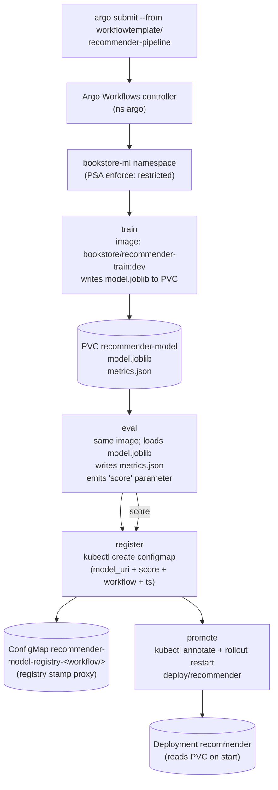

# 07 — ML pipelines and workflows

> The orchestration layer that ties Part 12 together: **Argo Workflows**
> (`Workflow` / `WorkflowTemplate` / `ClusterWorkflowTemplate` /
> `CronWorkflow`; DAG vs Steps; parameter + artifact passing; PVC- or
> object-storage-backed artifacts; `withItems` parameter sweeps) and why it
> differs from **Argo CD** ([Part 07 ch.04](../07-delivery/04-gitops-argocd.md))
> — Workflows is the *pipeline run*, CD is the desired state for the pipeline
> manifests themselves; **Kubeflow Pipelines** (KFP — `Pipeline`/`Run`, the
> Argo-Workflows-backend of v1, KFP v2 + metadata/lineage, the KFP SDK to
> compile Python -> the IR); **Tekton Pipelines** as the CI-shaped
> alternative (one paragraph: when which); **event-driven retraining** with
> **Argo Events** (`EventSource` -> `Sensor` -> `Workflow`); the **ML
> pipeline shape** (ingest -> preprocess -> train -> eval -> register ->
> promote -> monitor) and **artifact + metadata lineage** (which dataset +
> code SHA + hyperparameters made this model?); **parameter sweeps + HPO**
> via Argo Workflows `withItems` and **Katib** (the Kubeflow HPO operator —
> `Experiment` / `Trial` / `Suggestion`); **scheduled retraining** with
> `CronWorkflow`; a fair, honest **Argo Workflows vs Kubeflow Pipelines vs
> Airflow/Prefect/Dagster** comparison — applied by installing Argo
> Workflows (and Argo Events) via pinned Helm in their own namespaces, and
> authoring the recommendations **train -> eval -> register -> promote**
> pipeline as a real `WorkflowTemplate` + `CronWorkflow` + Argo Events
> webhook trigger, in
> [`examples/bookstore/ml/pipeline/`](../examples/bookstore/ml/pipeline/),
> reusing the **same train + serve images** from
> [ch.04](04-distributed-training.md) and
> [ch.06](06-model-serving-and-inference.md) so the loop is end-to-end real.

**Estimated time:** ~60 min read · half-day hands-on
**Prerequisites:** [Part 12 ch.04](04-distributed-training.md) — training step the pipeline orchestrates · [Part 12 ch.06](06-model-serving-and-inference.md) — serving step the pipeline promotes to · [Part 07 ch.04](../07-delivery/04-gitops-argocd.md) — Argo CD contrasted with Argo Workflows
**You'll know after this:** • author an Argo `WorkflowTemplate` with DAG, parameters, and artifact passing · • compare Argo Workflows / Kubeflow Pipelines / Tekton / Airflow / Prefect for ML · • wire Argo Events `EventSource` -> `Sensor` -> `Workflow` for drift-triggered retraining · • capture artifact + metadata lineage (dataset + code SHA + hyperparameters → model) · • schedule retraining via `CronWorkflow` and parameter sweeps via `withItems` / Katib

<!-- tags: ml, batch, argo-workflows, gitops, mlops -->

## Why this exists

So far Part 12 has produced the *pieces*: a GPU/accelerator story
([ch.02](02-gpus-and-accelerators.md)), a batch/queue/gang shape
([ch.03](03-batch-and-gang-scheduling.md)), real training jobs
([ch.04](04-distributed-training.md)), notebooks
([ch.05](05-notebooks-and-interactive.md)), and a serving layer
([ch.06](06-model-serving-and-inference.md)). Each produces or consumes the
**`model.joblib` artifact** at the centre of the recommendations thread.
What is missing — the **"who triggers what?"** layer — is the **pipeline**:
the single object that knows training comes before evaluation, evaluation
before registration, registration before promotion, and that the same
sequence should run again tomorrow on tomorrow's data without anyone
typing `kubectl apply` four times.

Three concrete failures motivate a pipeline runtime rather than ad-hoc
chains of Jobs:

1. **Order is implicit.** "Run training, then evaluation, but only if
   training succeeded; then registration; then promotion." Encoded as four
   shell commands in a runbook, that ordering rots: a new step is added in
   the middle, a side-effect of the third step is missed, the on-call
   person on a Saturday skips evaluation "just this once". A pipeline runtime
   makes ordering and conditional execution a **declarative DAG** — `kubectl
   apply` a Workflow object, the controller does the rest.
2. **Re-runs are first-class.** "Train this every night against the new
   day's data" is not a thing `kubectl` does. Kubernetes has `CronJob` for a
   single Job, but ML retraining is the whole DAG — a `CronWorkflow`
   schedules the whole pipeline against parameters that change per-run.
3. **Lineage is the *unit of trust* for a model.** "Which dataset, which
   code SHA, which hyperparameters produced the model currently serving
   traffic?" — when the answer is "we'd have to grep CI logs", you cannot
   roll back to a known-good model, debug a regression, or pass an audit. A
   pipeline runtime captures the inputs and outputs of every step as
   **metadata** and **artifacts**, so the answer to "where did this model
   come from?" is a query, not an investigation.

This chapter is the **orchestration spine** of Part 12. It picks **Argo
Workflows** as the Kubernetes-native pipeline runtime (a single CRD, no
second control plane, identical posture to the rest of the guide), names
**Kubeflow Pipelines** as the ML-opinionated layer many teams pick on top,
contrasts **Tekton** (the CI-shaped alternative — Argo Workflows for ML
pipelines, Tekton for CI/CD, when which), shows **event-driven retraining**
with **Argo Events**, and walks **HPO** via Argo `withItems` and **Katib**.
Then it walks the Bookstore's recommendations pipeline as one real
`WorkflowTemplate` running on kind. The references are **Ibryam & Huß,
_Kubernetes Patterns_, _Periodic Job_** (ch.7) and **_Daemon Service_** + the
**Argo Workflows** and **Kubeflow Pipelines** docs.

## Mental model

**A pipeline is a DAG of Pods (the steps) whose ordering, parameters,
artifacts, and lifecycle live in a CRD. A pipeline runtime is the
controller that reconciles that DAG.**

- **The unit of work is the *step*, the unit of orchestration is the
  *DAG*.** A step is a container that does one thing (train, eval, register,
  promote) — a Pod, exactly as it would be on its own. A DAG wires steps
  with `depends:` edges and parameter / artifact passing. The pipeline
  *runtime* (Argo Workflows, KFP, Tekton) is the controller that, given the
  CRD, creates Pods for ready steps, waits for them, runs the next batch,
  cleans up. Same shape as every other Kubernetes controller in the guide;
  what is new is the **DAG primitive** and the **parameter/artifact bus**
  between steps.
- **Parameters are inline values; artifacts are files.** Parameters
  (strings, numbers) are passed by *reference* — Argo's
  `{{tasks.eval.outputs.parameters.score}}` syntax. Artifacts (a
  `model.joblib`, a `metrics.json`, a `dataset.parquet`) are passed by
  *file* — written to a shared PVC, an S3 bucket, or Argo's artifact store,
  and surfaced to the next step at a mount path. Use parameters for
  scalars (a score, a URI, a hyperparameter); artifacts for files (models,
  datasets, plots). The Bookstore pipeline uses **PVC-backed artifacts**
  (the `recommender-model` PVC from
  [ch.04](04-distributed-training.md)) — the simplest path for kind. In
  prod the artifact store is object storage.
- **Argo Workflows is the Kubernetes-native default.** A single CRD set
  (`Workflow`, `WorkflowTemplate`, `ClusterWorkflowTemplate`, `CronWorkflow`),
  one controller, container-native steps, DAG + Steps semantics, parameter +
  artifact passing, `withItems` sweeps, retries, exit handlers. It is the
  engine **Kubeflow Pipelines v1 used underneath**; v2 introduced its own
  middle layer (Kubernetes-native KFP v2 backends still use Argo
  Workflows). Pick Argo Workflows when you want the *pipeline primitive*
  without buying the *ML platform around it*.
- **Kubeflow Pipelines is the ML opinion on top.** KFP adds an SDK (`kfp`
  in Python: define a pipeline as decorated Python functions; the SDK
  *compiles* to the IR / Argo Workflow YAML), a UI for browsing runs and
  experiments, a metadata store for tracking inputs/outputs across runs
  (lineage!), and a model registry. Pick KFP when (a) the data scientists
  prefer to write pipelines as Python rather than YAML, (b) you want
  cross-run lineage out-of-the-box, or (c) you are already adopting
  Kubeflow as a distribution. The cost: another layer to install/operate,
  and decisions KFP made for you you may not want.
- **Tekton is the CI shape, not the ML shape.** Tekton Pipelines is also
  a Kubernetes-native pipeline runtime, but its model is *CI-flavoured*
  (`Task` / `Pipeline` / `PipelineRun`, with `Workspace`s for build inputs
  and `Result`s for outputs). It is excellent for **CI/CD pipelines** (you
  see it under Konflux, OpenShift Pipelines), and runnable for ML — but
  Argo Workflows is the *community-default for ML on Kubernetes* and has
  the artifact + lineage + sweep ergonomics ML needs. Rule of thumb: **Argo
  Workflows for ML pipelines, Tekton for CI/CD**. Both can coexist.
- **Event-driven pipelines = Argo Events on top.** "Run this pipeline
  when a new dataset arrives" is not a schedule; it is an event. Argo
  Events models it as an **`EventSource`** (a webhook, a Git provider, S3,
  PubSub, SQS, Kafka, …) and a **`Sensor`** that watches the EventSource's
  `EventBus` for matching events and translates them into a `Workflow`
  trigger. The EventSource + Sensor + EventBus install as one Helm chart;
  the pattern is the **Ibryam _Daemon Service_** (a long-running listener)
  driving the **_Periodic Job_** (the pipeline). Scheduled (`CronWorkflow`)
  and event-driven (Argo Events) coexist — choose by trigger.
- **Lineage = "which dataset + code SHA + hyperparameters made this
  model?".** A pipeline runtime that does **not** record this is a worse
  position than no pipeline at all (you now have automated lineage-
  destroying runs). The simplest discipline: every pipeline run records,
  as parameters or artifacts, the **dataset URI** it consumed, the
  **image SHA** of the train step (which pins the code), and the **hyper-
  parameters** in the `Workflow.spec.arguments.parameters`. A model
  registry (MLflow, KFP Model Registry) is the canonical place; a
  ConfigMap stamp ([`pipeline/register-cm-template.yaml`](../examples/bookstore/ml/pipeline/register-cm-template.yaml))
  is the kind-runnable proxy this chapter ships; both are honestly
  marked.

This **builds on** [Part 07 ch.04](../07-delivery/04-gitops-argocd.md) (Argo
CD = desired state in Git; we now have a *second* Argo — Workflows — that
runs pipelines), [Part 01 ch.07](../01-core-workloads/07-jobs-and-cronjobs.md)
(Job/CronJob — pipelines are DAGs of those), and [ch.04](04-distributed-training.md)
(the train step we orchestrate). It does not re-teach any of them.

## Diagrams

### The recommendations DAG — train -> eval -> register -> promote, with artifacts + parameters flowing (Mermaid)



### Argo Workflows vs Kubeflow Pipelines vs Tekton vs Airflow (ASCII)

```
 WHO DOES WHAT (pipeline runtimes for ML on Kubernetes)
 ────────────────────────────────────────────────────────────────────────────
 Argo Workflows       KUBERNETES-NATIVE, CONTAINER-NATIVE DAG runner. CRDs:
   (argoproj.io)        Workflow, WorkflowTemplate, ClusterWorkflowTemplate,
                        CronWorkflow. DAG + Steps + Suspend. Parameter and
                        artifact passing (PVC, S3, OSS, GCS, …). withItems
                        for parameter sweeps. Exit handlers. = the community
                        default for ML pipelines on Kubernetes; what KFP
                        v1 ran on; the lead choice in this chapter.

 Kubeflow Pipelines   ML-OPINIONATED layer on top. SDK (`kfp` Python ->
   (kubeflow.org)       compile to IR). UI (browse runs, experiments,
                        compare). Metadata store (cross-run lineage). Model
                        registry. v1 used Argo Workflows as the backend; v2
                        keeps the Kubernetes-native backend story. = adopt
                        when you want the ML *platform* (Python pipelines +
                        UI + lineage + registry) and accept the operate
                        cost.

 Tekton Pipelines     CI/CD-SHAPED Kubernetes-native pipeline runtime.
   (tekton.dev)         Task / Pipeline / PipelineRun / Workspace. The right
                        runtime for *CI* on Kubernetes (build, test, sign,
                        push). Runnable for ML, but lacks Argo Workflows'
                        ML-tuned artifact + sweep ergonomics. = use for
                        CI/CD; pair with Argo Workflows for ML.

 Airflow / Prefect /  HISTORICALLY non-Kubernetes-native — worker-based
   Dagster              schedulers (Celery / Dask / their own workers) that
                        *can* run on Kubernetes (KubernetesExecutor /
                        KubernetesPodOperator), but Kubernetes is one
                        execution mode, not the model. Strong scheduling +
                        backfill + Python ergonomics + a vast operator
                        catalog (databases, queues, vendor APIs). = pick
                        when you have non-Kubernetes work and want one
                        scheduler over your *data platform*; pair with
                        Argo Workflows for the Kubernetes-native ML bits
                        if you have both.

 WHICH IS THE SAME OBJECT? — None: they are alternatives. They DO coexist
   ───────────────────  in real fleets (Argo CD for GitOps, Argo Workflows
                        for ML pipelines, Tekton for CI/CD; Airflow for
                        upstream data orchestration). The skill is choosing
                        the right one per job.

 OUR BOOKSTORE TREE
   examples/bookstore/ml/pipeline/recommender-workflow.yaml       (Argo
                                                                   Workflow)
   examples/bookstore/ml/pipeline/recommender-cronworkflow.yaml   (Argo
                                                                   schedule)
   examples/bookstore/ml/pipeline/recommender-eventsource.yaml
   examples/bookstore/ml/pipeline/recommender-sensor.yaml         (Argo
                                                                   Events)
```

## Hands-on with the Bookstore

**Assumed working directory: the guide repo root (`full-guide/`).** Requires
the PSA-`restricted` `bookstore-ml` namespace
([ch.01](01-why-ml-on-kubernetes.md)), the train image
(`bookstore/recommender-train:dev` from
[`../examples/bookstore/ml/train/Dockerfile`](../examples/bookstore/ml/train/Dockerfile)),
and the `recommender-model` PVC ([ch.04](04-distributed-training.md)).

> **The pipeline reuses the same images as ch.04 and ch.06.** This is the
> through-line of Part 12: every chapter has produced a real ingredient;
> this chapter is the recipe. The Workflow's `train` step uses
> `bookstore/recommender-train:dev`; the `eval` step reuses the same image
> as a tiny Python `script` (sklearn + joblib are already baked); the
> `register` step uses `bitnami/kubectl`; the `promote` step uses the same.
> No new images to build for this chapter.

### 1. Install Argo Workflows (pinned; own namespace)

```sh
helm repo add argo https://argoproj.github.io/argo-helm
ARGO_WORKFLOWS_VERSION="0.42.0"   # bump deliberately; chart version != app version
helm install argo-workflows argo/argo-workflows \
  --version "$ARGO_WORKFLOWS_VERSION" \
  -n argo --create-namespace --wait

# CRDs come with the chart. Confirm:
kubectl api-resources | grep argoproj
#   workflows                wf            argoproj.io/v1alpha1            true     Workflow
#   workflowtemplates        wftmpl        argoproj.io/v1alpha1            true     WorkflowTemplate
#   clusterworkflowtemplates cwftmpl       argoproj.io/v1alpha1            false    ClusterWorkflowTemplate
#   cronworkflows            cwf           argoproj.io/v1alpha1            true     CronWorkflow

# The Argo CLI (optional but recommended; the chapter uses it).
# macOS:  brew install argo
# Linux:  curl -sSL -o argo
#           https://github.com/argoproj/argo-workflows/releases/download/v3.5.13/argo-linux-amd64.gz
#         (pin a tag; never `latest`)
```

> **Pinned, never `latest`.** Bump these deliberately when a new release
> ships. The Argo Helm chart's `--version` is the CHART version
> (`0.42.0` here), which packages a specific WORKFLOW CONTROLLER version
> (the chart README documents the mapping). Both are pinned.

### 2. The pipeline: train -> eval -> register -> promote

[`pipeline/recommender-workflow.yaml`](../examples/bookstore/ml/pipeline/recommender-workflow.yaml)
is a `WorkflowTemplate` (re-usable; runnable many times via `argo submit
--from workflowtemplate/recommender-pipeline`). The DAG:

```
   train ──► eval ──► register ──► promote
   (image bookstore/recommender-train:dev)
   (eval reuses the SAME image as a Python script)
   (register: kubectl create configmap = registry stamp proxy)
   (promote: kubectl rollout restart deploy/recommender)
```

> **CRD-intrinsic dry-run.** Without Argo Workflows installed:
>
> ```sh
> kubectl apply --dry-run=client \
>   -f examples/bookstore/ml/pipeline/recommender-workflow.yaml
> # error: ... no matches for kind "WorkflowTemplate" in version
> #   "argoproj.io/v1alpha1"   — expected, schema-correct.
> ```
> Same precedent as `raw-manifests/51-/70-/83-`, `argocd/`, `operators/`,
> `chaos/`, `ml/batch/`, `ml/serve/recommender-inferenceservice.yaml`. The
> built-in SA/Role/RoleBinding triple at the top of the file dry-runs
> cleanly anywhere. After installing Argo Workflows, a `--dry-run=server`
> validates against the live API.

Apply the template (and its RBAC scaffolding):

```sh
# Prereqs from earlier chapters:
kubectl apply -f examples/bookstore/ml/train/recommender-train-job.yaml
kubectl wait --for=condition=complete job/recommender-train \
  -n bookstore-ml --timeout=300s
kubectl apply -f examples/bookstore/ml/serve/recommender-deployment.yaml
kubectl apply -f examples/bookstore/ml/serve/recommender-service.yaml

# The pipeline:
kubectl apply -f examples/bookstore/ml/pipeline/recommender-workflow.yaml
kubectl get workflowtemplate -n bookstore-ml
#   NAME                    AGE
#   recommender-pipeline    7s

# Run it once:
argo submit --from workflowtemplate/recommender-pipeline -n bookstore-ml --watch
# (or, if you don't have the argo CLI, generate an ad-hoc Workflow from the
#  template by name reference — the documented kubectl-only path:)
cat <<'EOF' | kubectl create -f -
apiVersion: argoproj.io/v1alpha1
kind: Workflow
metadata:
  generateName: recommender-pipeline-
  namespace: bookstore-ml
spec:
  serviceAccountName: argo-workflow
  workflowTemplateRef:
    name: recommender-pipeline
EOF

# Watch progress:
argo list -n bookstore-ml
argo get  -n bookstore-ml @latest
argo logs -n bookstore-ml @latest --follow
```

Successful run prints, abbreviated:

```
[train]    config=Config(model_dir='/workspace/model', seed=42, ...)
[train]    wrote /workspace/model/model.joblib (size=21678 bytes)
[eval]     {"kind":"item-knn-cooccurrence","n_books":200, ...,
            "avg_top1_cosine":0.412..., "min_score_gate":0.05,"passed":true}
[register] stamped recommender-model-registry-recommender-pipeline-abc12
           uri=pvc://recommender-model/model.joblib score=0.412... at=...
[promote]  recommender restarted with new model
           (workflow recommender-pipeline-abc12)
```

Inspect the registry stamp:

```sh
kubectl get configmap -n bookstore-ml \
  -l app.kubernetes.io/component=recommender-model-registry
kubectl describe configmap -n bookstore-ml \
  $(kubectl get cm -n bookstore-ml \
      -l app.kubernetes.io/component=recommender-model-registry \
      -o jsonpath='{.items[-1:].metadata.name}')
#   Data:
#     model_uri:      pvc://recommender-model/model.joblib
#     score:          0.412345
#     registered_at:  2026-05-19T02:00:00Z
#     workflow:       recommender-pipeline-abc12
```

The illustrative-template-shape of that ConfigMap (so you can `kubectl
apply -f` it standalone and see one) is
[`pipeline/register-cm-template.yaml`](../examples/bookstore/ml/pipeline/register-cm-template.yaml).

> **The `register` step is a kind-runnable proxy.** In real life the
> registration target is **MLflow Model Registry**, **KFP Model
> Registry**, or an **OCI artifact** in your registry — see
> [ch.08](08-ml-platform-cost-and-mlops.md) for the stack story. The
> ConfigMap shape carries the same information (URI + score + timestamp +
> workflow). Honesty over fidelity: the loop runs end-to-end on kind, and
> the swap-to-real-registry is one step's image away.

### 3. Schedule nightly retraining (`CronWorkflow`)

[`pipeline/recommender-cronworkflow.yaml`](../examples/bookstore/ml/pipeline/recommender-cronworkflow.yaml)
schedules the WorkflowTemplate every night at 02:00 UTC. Same CRD model as
`CronJob` for a single Job (the
[Ibryam _Periodic Job_ pattern](#further-reading) at the pipeline level):

```sh
kubectl apply -f examples/bookstore/ml/pipeline/recommender-cronworkflow.yaml
kubectl get cronworkflow -n bookstore-ml
#   NAME                      AGE   SCHEDULE     TIMEZONE   ...
#   recommender-nightly       3s    0 2 * * *    UTC        ...

# Trigger a run NOW (off-schedule, for testing):
argo cron list -n bookstore-ml
argo submit --from cronworkflow/recommender-nightly -n bookstore-ml --watch
```

`concurrencyPolicy: Replace` ensures a slow night's run never collides
with the next night's; `startingDeadlineSeconds: 600` bounds the missed-
schedule recovery window if the controller is restarted.

### 4. Event-driven retraining (Argo Events)

[`pipeline/recommender-eventsource.yaml`](../examples/bookstore/ml/pipeline/recommender-eventsource.yaml)
listens for a webhook (POST `/recommender-dataset-ready` on `:12000`).
[`pipeline/recommender-sensor.yaml`](../examples/bookstore/ml/pipeline/recommender-sensor.yaml)
turns a matching event into a `Workflow` from the template:

```sh
# Argo Events controller + EventBus.
ARGO_EVENTS_VERSION="2.4.7"
helm install argo-events argo/argo-events \
  --version "$ARGO_EVENTS_VERSION" \
  -n argo-events --create-namespace --wait

# Default EventBus for the namespace.
kubectl apply -n argo-events -f - <<'EOF'
apiVersion: argoproj.io/v1alpha1
kind: EventBus
metadata: { name: default }
spec:
  # pinned NATS JetStream version (controller-managed image, not a Helm chart)
  # — bump together with the Argo Events chart version
  jetstream: { version: "2.10.11" }
EOF

kubectl apply -f examples/bookstore/ml/pipeline/recommender-eventsource.yaml
kubectl apply -f examples/bookstore/ml/pipeline/recommender-sensor.yaml

# Fire an event from inside the cluster:
kubectl run -n argo-events curl-once --rm -it --restart=Never \
  --image=curlimages/curl:8.10.1 --command -- \
  curl -X POST -H 'content-type: application/json' \
    -d '{"dataset_uri":"pvc://recommender-model/"}' \
    http://recommender-dataset-eventsource-svc:12000/recommender-dataset-ready

# The Sensor creates a new Workflow in bookstore-ml.
argo list -n bookstore-ml
```

> In prod the webhook is a `git`/`gitlab`/`github`/`s3`/`pubsub`/`sqs`/
> `kafka` EventSource — pick by your data publication path. The shape is
> the same: an event in `argo-events`, a Sensor that creates a Workflow in
> `bookstore-ml`.

### 5. Parameter sweeps with `withItems` + a note on Katib

The simplest HPO pattern Argo Workflows supports natively is `withItems`:
fan out a single step over a list of parameter values. The next file you'd
add to this tree (kept out so the chapter directory stays small) — sketch:

```yaml
templates:
  - name: sweep
    steps:
      - - name: train-grid
          template: train-step
          arguments:
            parameters:
              - { name: seed, value: "{{item.seed}}" }
              - { name: top-k, value: "{{item.k}}" }
          withItems:
            - { seed: "41", k: "5" }
            - { seed: "42", k: "5" }
            - { seed: "42", k: "10" }
            - { seed: "43", k: "10" }
```

`withItems` runs four parallel `train-step` Pods (one per item), each with
its own `seed` and `k` parameter. The Workflow's `outputs` capture each
run's score; an exit handler picks the best. This is the *Argo Workflows*
sweep. **Katib** is the Kubeflow HPO operator: the **`Experiment`** CRD
declares a search space (categorical / integer / double / discrete /
log-uniform), a **`Suggestion`** (algorithm: random, grid, Bayesian, TPE,
…), a **`Trial`** template (the training job), and Katib reconciles the
loop — *create Trials, observe metrics, suggest next set of
hyperparameters*. Pick Katib when the search is *adaptive* (Bayesian /
TPE) and the cost of a Trial justifies a smart sampler; `withItems` for
small grids where you just want N parallel runs.

> **Out of scope for the Bookstore tree.** The recommender's hyperparameter
> surface is trivially small (seed + top_k); the sweep is illustrative.
> The chapter mentions Katib because it is the *right* answer once HPO
> matters.

### 6. Argo CD vs Argo Workflows — the two Argos

This is the question every team asks once they have both installed.
[Part 07 ch.04](../07-delivery/04-gitops-argocd.md) named **Argo CD** as
the GitOps reconciler: a controller that reads `argocd/` manifests from
Git and reconciles them into the cluster. This chapter adds **Argo
Workflows**: a controller that runs **pipeline runs**.

They are the *same shape* (a controller + a CRD), at *different layers*:

| | Argo CD | Argo Workflows |
|---|---|---|
| **What it reconciles** | the cluster's *desired state* (Deployments, Services, ConfigMaps, Helm releases, Kustomize, …) | a *pipeline run* (a DAG of Pods) |
| **Trigger** | a Git commit (or webhook) | `argo submit` / `CronWorkflow` / Argo Events trigger |
| **Object the controller owns** | `Application`, `AppProject`, `ApplicationSet` | `Workflow`, `WorkflowTemplate`, `CronWorkflow` |
| **Output** | the cluster matches Git | a Workflow's status, with per-step Pods and artifacts |
| **Lives at** | `argocd/` (delivery) | `examples/bookstore/ml/pipeline/` (orchestration) |

Both at once is the right setup for ML: **Argo CD reconciles `pipeline/`
(the WorkflowTemplate + CronWorkflow manifests themselves come from Git),
Argo Workflows runs the pipelines.** Roll back a pipeline change = revert
the Git commit; CD reapplies; Workflows runs the previous version
tomorrow.

## How it works under the hood

- **The `Workflow` controller reconcile.** When you `argo submit` a
  `Workflow` (or the Sensor / CronWorkflow creates one), the
  argo-workflows controller in `argo` watches new `Workflow` objects, walks
  the DAG, and for each ready step creates a **Pod** in the target
  namespace (here `bookstore-ml`) with two containers: the step's
  `main` container (your code) and a **`wait`** sidecar (Argo's executor
  that streams logs, captures outputs/artifacts, and reports back). The
  controller records each step's state as a sub-resource of the Workflow
  (`status.nodes[<STEP>].phase`); `argo logs @latest` is reading those.
- **Parameter + artifact passing.** Parameters are strings inside the
  Workflow object — Argo substitutes `{{tasks.eval.outputs.parameters.score}}`
  at template expansion. Artifacts (files) move via the artifact bus:
  S3/GCS/OSS/Azure/PVC. The Bookstore uses **PVC artifacts** (the
  `recommender-model` PVC mounted into `train` + `eval` + `register`),
  the simplest path for kind. In prod, configure the
  `artifactRepository` ConfigMap in the `argo` namespace to point at
  object storage; switch `volumes`/`volumeMounts` to Argo's `artifacts:`
  pattern; same DAG.
- **`WorkflowTemplate` + `ClusterWorkflowTemplate` + `workflowTemplateRef`.**
  A `WorkflowTemplate` is a *namespaced library* of templates and a default
  `entrypoint` — the Bookstore's `recommender-pipeline` is one. A
  `ClusterWorkflowTemplate` is the cluster-scoped equivalent (one library
  shared across teams). A `Workflow` can `workflowTemplateRef` either —
  cheap, parameter-overridable. The Sensor and CronWorkflow in this tree
  both use `workflowTemplateRef`: no duplication, one source of truth for
  the pipeline shape.
- **`CronWorkflow` semantics.** Field-for-field analogous to Kubernetes'
  `CronJob` (`schedule`, `timezone`, `concurrencyPolicy: Allow|Forbid|Replace`,
  `startingDeadlineSeconds`, `successfulJobsHistoryLimit` /
  `failedJobsHistoryLimit`). At each cron tick the controller creates a
  `Workflow` and lets the Workflow controller take over. **Replace** is
  the right policy for retraining where two concurrent runs would race on
  the model PVC; **Forbid** for runs where overlap is acceptable but you
  never want them to multiply.
- **Argo Events: EventSource -> EventBus -> Sensor -> trigger.** The
  EventSource is a long-running Pod that *produces* events from its
  configured upstream (webhook, Git provider, S3, …). It writes events to
  the **EventBus** (a NATS JetStream cluster the chart installs in
  `argo-events`). A **Sensor** subscribes to the EventBus, applies a
  `dependencies:` filter, and on match fires its `triggers[]` — for ML
  that is the `k8s` trigger creating a `Workflow`. The Sensor's own SC is
  PSA-`restricted` (the chart sets it; the manifest in this dir overrides
  it explicitly for the trigger workflow's `serviceAccountName`).
- **Kubeflow Pipelines underneath.** KFP v1 *compiled* Python pipelines
  to Argo Workflow YAML and submitted them — so most of what you read
  here applies. KFP v2 introduced an IR (a domain-specific format
  describing the pipeline) and re-implemented the Kubernetes-native
  backend; the user-facing semantics (DAG, parameters, artifacts,
  caching) are largely the same. The trade-off is **flexibility now vs
  ML-platform now**: Argo Workflows is more flexible and lower-overhead;
  KFP is more opinionated and ships with the rest of Kubeflow.
- **Tekton's split-personality.** Tekton models the pipeline as a graph
  of `Task`s with `Workspace`s (PVCs for inputs/outputs) and `Result`s
  (string outputs). For CI/CD it is the right shape (build, test, sign,
  push, deploy). For ML, Argo Workflows' artifact model (object-storage
  first-class, sweep ergonomics, exit handlers) is the better fit. The
  rule of thumb stands: **Tekton for CI/CD, Argo Workflows for ML
  pipelines, both can coexist.**
- **Lineage = artifacts + metadata.** "Which dataset + code SHA +
  hyperparameters produced this model?" answers itself when:
  - the **dataset URI** is a Workflow parameter (`{{workflow.parameters.dataset-uri}}`),
  - the **code SHA** is the image SHA — pin
    `bookstore/recommender-train:dev` to `bookstore/recommender-train@sha256:...`
    (Helm / Kustomize image digest pinning from
    [Part 07 ch.02](../07-delivery/02-packaging-kustomize.md)),
  - the **hyperparameters** are
    `workflow.spec.arguments.parameters`,
  - the **outputs** are an artifact (`model.joblib`) + a parameter
    (`score`) + a registry stamp (the ConfigMap, or an MLflow record).
  Argo Workflows itself does not own the metadata DB; KFP v2 / MLflow
  /Weights & Biases do. The pipeline is the *producer* of lineage data;
  the registry/metadata store is its *consumer*.
- **PSA on every workflow Pod.** The
  [`WorkflowTemplate`](../examples/bookstore/ml/pipeline/recommender-workflow.yaml)'s
  `podSpecPatch` applies `runAsNonRoot: true`, non-root UID,
  `seccompProfile: RuntimeDefault` to every step Pod's PodSpec; each
  step's container `securityContext` adds `allowPrivilegeEscalation:
  false`, `readOnlyRootFilesystem: true`, `capabilities.drop: ["ALL"]`.
  The same shape every Bookstore ML pod uses — pipeline Pods are **not**
  exempt from PSA.

## Production notes

> **In production:** install Argo Workflows (and Argo Events, if you need
> event-driven retraining) via **pinned Helm charts** in their **own
> namespaces** (`argo`, `argo-events`). Treat upgrades like any control-
> plane component — read the chart changelog, watch for CRD-version
> bumps, run a soak test. Never install from a `releases/latest` URL.

> **In production:** **artifacts live in object storage**, not on per-
> cluster PVCs. Configure the `artifactRepository` ConfigMap in the
> `argo` namespace to point at S3/GCS/Azure (use the Pod's
> cloud identity — [Part 10 ch.03](../10-cloud-and-managed-kubernetes/03-cloud-identity.md)
> — not static keys in a Secret). The Bookstore's PVC artifact path
> is the kind-runnable fallback.

> **In production:** **pipeline manifests live in Git, reconciled by
> Argo CD** ([Part 07 ch.04](../07-delivery/04-gitops-argocd.md)). The
> `WorkflowTemplate` / `CronWorkflow` / `EventSource` / `Sensor` are
> reviewed PRs like every other manifest; Argo CD applies; Argo
> Workflows *runs the pipeline*. Two Argos, two layers, one Git.

> **In production:** **lineage is not optional**. Pin the train step's
> image to a *digest* (`@sha256:...`); record the dataset URI and
> hyperparameters as Workflow parameters; write the result to a
> **model registry** (MLflow, KFP Model Registry, OCI artifact) and a
> **metadata store** (MLflow tracking, KFP metadata, W&B). Where you
> stop, the audit and the rollback story stops.

> **In production:** **the `promote` step is a GitOps commit**, not a
> `kubectl rollout restart`. The pipeline step writes a PR that bumps
> the `InferenceService.spec.predictor.storageUri` to the new versioned
> URI and sets `canaryTrafficPercent: 20`; review/merge; Argo CD applies;
> KServe shifts traffic ([Part 12 ch.06](06-model-serving-and-inference.md)).
> The kind-runnable proxy in this tree restarts the Deployment for
> illustration; it is a step's image change to swap.

> **In production:** **scheduled retraining belongs to the pipeline, not
> a CronJob**. A `CronWorkflow` runs the whole DAG (train + eval +
> register + promote) under one identity, with one history, with one
> place to read logs and rollback. A `CronJob` per step reintroduces
> the runbook problem this chapter exists to retire.

> **In production:** **event-driven retraining is the right shape when
> data arrival is the trigger**. A `git push` to the dataset repo, an
> S3 `Object Created` event, a Kafka topic message — all become an Argo
> Events `EventSource`. The Sensor maps them to a Workflow trigger; no
> external scheduler. The pattern is **_Daemon Service_** + **_Periodic
> Job_** (Ibryam): one listener, one pipeline. The webhook EventSource in this tree has no authentication. In production, put it behind an Ingress with auth (OAuth2 Proxy, mTLS, or a token header check); or use a git/s3/pubsub EventSource where authentication is part of the event source itself.

> **In production:** **retry-safety is per-step, not pipeline-wide.**
> `train` is retry-safe: PyTorch/numpy/sklearn workloads idempotently
> reproduce `model.joblib` from the same dataset. `eval` is retry-safe:
> it's a pure read of `model.joblib` plus a fresh metric write.
> `register` is retry-safe: the workflow-id-suffixed ConfigMap is unique
> per attempt. `promote` is NOT retry-safe: `kubectl annotate` may commit
> before `rollout restart` fails (e.g., Pod quota exceeded), leaving the
> registry stamp marked promoted but the serving Deployment still on the
> old image. If `kubectl annotate` succeeds but the subsequent
> `rollout restart` fails (a Pod quota was exceeded, a transient API
> server hiccup), the registry stamp says "promoted" while the serving
> Deployment still serves the old image — a half-promoted state. In real
> GitOps promotion (PR + Argo CD), the equivalent failure is the PR
> merged but the sync stuck on a CRD validation error; in both cases,
> the next reconcile loop resolves it, but a registry stamp is not a
> deploy. If the `train` step's Pod is OOM-killed mid-training, Argo's
> retryStrategy retries the step from the beginning of its container
> (Argo doesn't restart the failed Pod; it creates a new Pod for the new
> attempt). The PVC artifact from the failed attempt is whatever bytes
> the trainer wrote before OOM; the new attempt overwrites them. This is
> why `train` should checkpoint to a subdirectory and pick up the latest
> valid checkpoint on start — the chapter on distributed training covers
> this pattern (see [./04-distributed-training.md](./04-distributed-training.md)).

> **In production:** **observability** — every workflow Pod's logs and
> events go to the cluster's logging/metrics stack
> ([Part 06 ch.01](../06-production-readiness/01-observability-metrics.md)).
> Argo Workflows exposes Prometheus metrics: workflow duration, step
> failure rate, queue depth. Alert on **success rate dropping** and
> **p95 duration drifting**.

> **In production:** **PSA on every workflow Pod**. The
> `WorkflowTemplate.spec.podSpecPatch` + each step's
> `container.securityContext` keep the workflow Pods restricted-admissible.
> The Argo Workflows controller lives in `argo` (operator's own
> namespace); the workflow Pods land in `bookstore-ml`. No exceptions.

> **In production:** **artifacts in object storage; parameters for scalars**.
> The PVC artifact path is the kind-runnable fallback; the prod shape is
> `artifactRepository` pointing at S3/GCS/Azure with Pod cloud identity.
> Parameters (scores, URIs, hyperparameters) stay inline. The Bookstore's
> PVC story is the simplest illustrative shape; swap for object storage
> when artifacts cross PVC zones or grow beyond a few GiB.

> **In production:** **CRD-backed manifests carry the CRD-intrinsic
> header note.** A reader who client-dry-runs a `WorkflowTemplate` /
> `CronWorkflow` / `EventSource` / `Sensor` without the operator
> installed sees `no matches for kind …` — expected, schema-correct.
> Every Argo Workflows / Argo Events file in this tree carries that
> header note, identical precedent to the guide's other CRD-backed
> manifests.

> **In production:** **HPO with cost in mind**. Bayesian / TPE samplers
> in **Katib** find a good hyperparameter set in *fewer trials* than a
> grid — every trial is a training Pod, and every training Pod is GPU-
> hours. Cost-aware HPO is the cheapest ML optimisation most teams
> ignore ([Part 12 ch.08](08-ml-platform-cost-and-mlops.md)).

## Quick Reference

```sh
# Install Argo Workflows + Argo Events (pinned; own namespaces)
ARGO_WORKFLOWS_VERSION="0.42.0"
ARGO_EVENTS_VERSION="2.4.7"

helm repo add argo https://argoproj.github.io/argo-helm
helm install argo-workflows argo/argo-workflows \
  --version "$ARGO_WORKFLOWS_VERSION" -n argo --create-namespace --wait
helm install argo-events    argo/argo-events    \
  --version "$ARGO_EVENTS_VERSION"    -n argo-events --create-namespace --wait

# Default EventBus (Argo Events needs one):
kubectl apply -n argo-events -f - <<'EOF'
apiVersion: argoproj.io/v1alpha1
kind: EventBus
metadata: { name: default }
# pinned NATS JetStream version (controller-managed image, not a Helm chart)
# — bump together with the Argo Events chart version
spec: { jetstream: { version: "2.10.11" } }
EOF

# Apply the recommender pipeline + cron + event trigger
kubectl apply -f examples/bookstore/ml/pipeline/recommender-workflow.yaml
kubectl apply -f examples/bookstore/ml/pipeline/recommender-cronworkflow.yaml
kubectl apply -f examples/bookstore/ml/pipeline/recommender-eventsource.yaml
kubectl apply -f examples/bookstore/ml/pipeline/recommender-sensor.yaml

# Run the pipeline once
argo submit --from workflowtemplate/recommender-pipeline -n bookstore-ml --watch
argo list -n bookstore-ml
argo get  -n bookstore-ml @latest
argo logs -n bookstore-ml @latest

# Schedule + event-trigger
kubectl get cronworkflow -n bookstore-ml
kubectl get eventsource,sensor -n argo-events
```

Minimal skeleton (Argo Workflows `WorkflowTemplate`, DAG, PSA-restricted
step):

```yaml
apiVersion: argoproj.io/v1alpha1
kind: WorkflowTemplate
metadata:
  name: my-pipeline
  namespace: my-namespace
spec:
  serviceAccountName: my-workflow-sa     # not the default SA!
  entrypoint: main
  podSpecPatch: |
    securityContext:
      runAsNonRoot: true
      runAsUser: 65532
      seccompProfile: { type: RuntimeDefault }
  templates:
    - name: main
      dag:
        tasks:
          - { name: step-a, template: a }
          - { name: step-b, template: b, depends: "step-a.Succeeded" }
    - name: a
      container:
        image: <YOUR-IMAGE>
        securityContext:
          allowPrivilegeEscalation: false
          readOnlyRootFilesystem: true
          capabilities: { drop: ["ALL"] }
    - name: b
      container:
        image: <YOUR-IMAGE>
        securityContext:
          allowPrivilegeEscalation: false
          readOnlyRootFilesystem: true
          capabilities: { drop: ["ALL"] }
```

Checklist:

- [ ] Argo Workflows installed via **pinned** Helm in **own namespace** (`argo`)
- [ ] Pipeline encoded as a **`WorkflowTemplate`** (re-usable) — not a one-shot `Workflow`
- [ ] **`CronWorkflow`** for scheduled retraining; **Argo Events** for data-driven retraining
- [ ] Per-pipeline **`ServiceAccount` + namespace-scoped RBAC** (not the default SA, no cluster-wide rights)
- [ ] **PSA-`restricted`** SC on every workflow Pod (`podSpecPatch` + container SC)
- [ ] **Lineage step records dataset + code + model SHA** (dataset URI + image SHA + hyperparameters as Workflow parameters; outputs in a registry + metadata store)
- [ ] **Promote** is a **GitOps commit** in prod (PR -> Argo CD -> KServe), not an in-pipeline `kubectl rollout restart`

## Test your understanding

> Try each before opening the answer drawer. The act of trying is the exercise; the answer is the check.

1. **Why is Argo Workflows for pipeline *runs* and Argo CD for desired state — what would go wrong if you used Argo CD for the training pipeline?**
   <details><summary>Show answer</summary>

   Argo CD reconciles to a steady desired state — "this set of manifests should exist in the cluster." A training pipeline is a run-to-completion DAG: ingest → preprocess → train → eval → register. There's no "steady state" — each run produces a new model and exits. Forcing Argo CD to manage it would mean either (a) recreating the Workflow object on every commit (Argo CD reapplies, but the previous run's state is unclear) or (b) treating runs as state (incoherent with GitOps). The split is: Workflows define the run, Argo CD defines what Workflows + WorkflowTemplates + permissions exist. Two tools, two concerns.

   </details>

2. **A training run took 4 hours and produced a model that scores 87% on eval. Three months later, you want to know "what dataset + code + hyperparameters made this model?" The Workflow logs are gone (retention). What's the design fix?**
   <details><summary>Show answer</summary>

   Lineage as data, not logs. Every training step must write a structured record (dataset URI + git SHA + container digest + hyperparameters + eval score) to a durable metadata store: MLflow tracking, KFP metadata, or a Postgres-backed registry. The model artifact in the registry references that metadata record by ID. Logs are ephemeral; lineage records are durable. Without this discipline, you have a model and no way to reproduce it — a "model lottery." The chapter's lineage-step pattern is non-negotiable for any model that reaches production.

   </details>

3. **You set up Argo Events with an `EventSource` watching an S3 bucket for new training data, and a `Sensor` that triggers a `Workflow`. New data arrives but no Workflow starts. What do you check?**
   <details><summary>Show answer</summary>

   (1) `kubectl get eventsource -o yaml` — is the EventSource healthy and connected? Check its logs. (2) `kubectl get sensor -o yaml` and look at the sensor's pod logs — is it receiving events but failing to trigger? Common cause: the sensor's trigger template has a parameter referencing a missing event field. (3) Permissions — the sensor's SA needs `create` on `workflows.argoproj.io`. (4) Event filtering — the sensor's `dependencies[].filters` may be rejecting the events (wrong S3 event type, wrong key prefix). (5) Network — if EventSource pulls from S3 via webhook, the public URL must be reachable; if it polls, AWS credentials must work. Walk EventSource → EventBus → Sensor → Workflow as a chain; each link has its own logs.

   </details>

4. **Hands-on: write a small `WorkflowTemplate` that runs three steps: download a CSV, train a tiny scikit-learn model, log results. Pass the dataset URI as a parameter. Now submit two runs with different URIs. Where are the artifacts stored?**
   <details><summary>What you should see</summary>

   With default Argo Workflows config and a `MinIO` artifact repository, each step's `outputs.artifacts` is uploaded to MinIO with a path like `workflows/<workflow-name>/<step-name>/<artifact-name>`. Two runs have different paths because the workflow names are unique. The `inputs.parameters.dataset_uri` differ but the `outputs.artifacts.model` differ too. The discipline: artifact paths must include a unique run identifier; parameters must include enough metadata (dataset URI, git SHA) that lineage is traceable from the artifact alone.

   </details>

## Further reading

- **Ibryam & Huß, _Kubernetes Patterns_ 2e — *Periodic Job* (ch.7)** and
  ***Daemon Service*** — the patterns underneath `CronWorkflow` (periodic
  retraining) and Argo Events (a long-running event listener producing
  triggers).
- **Burns et al., _Kubernetes Up & Running_ — Jobs / CronJobs** chapter
  for the lower-layer primitives `Workflow` Pods reduce to.
- **Rosso et al., _Production Kubernetes_, ch.8 "Workload Management"** —
  the production basis for CRD-driven controllers like Argo Workflows.
- Official: **Argo Workflows** docs
  <https://argo-workflows.readthedocs.io/> (`Workflow`,
  `WorkflowTemplate`, `CronWorkflow`, DAG vs Steps, artifacts,
  `withItems`); **Argo Events** docs
  <https://argoproj.github.io/argo-events/> (`EventSource`, `Sensor`,
  EventBus); **Kubeflow Pipelines** docs
  <https://www.kubeflow.org/docs/components/pipelines/> (`Pipeline`,
  `Run`, the KFP SDK, v2 IR + metadata); **Katib** docs
  <https://www.kubeflow.org/docs/components/katib/> (`Experiment`,
  `Trial`, `Suggestion`, Bayesian/TPE/grid samplers); **Tekton
  Pipelines** docs <https://tekton.dev/docs/pipelines/> for the CI-shaped
  alternative.
