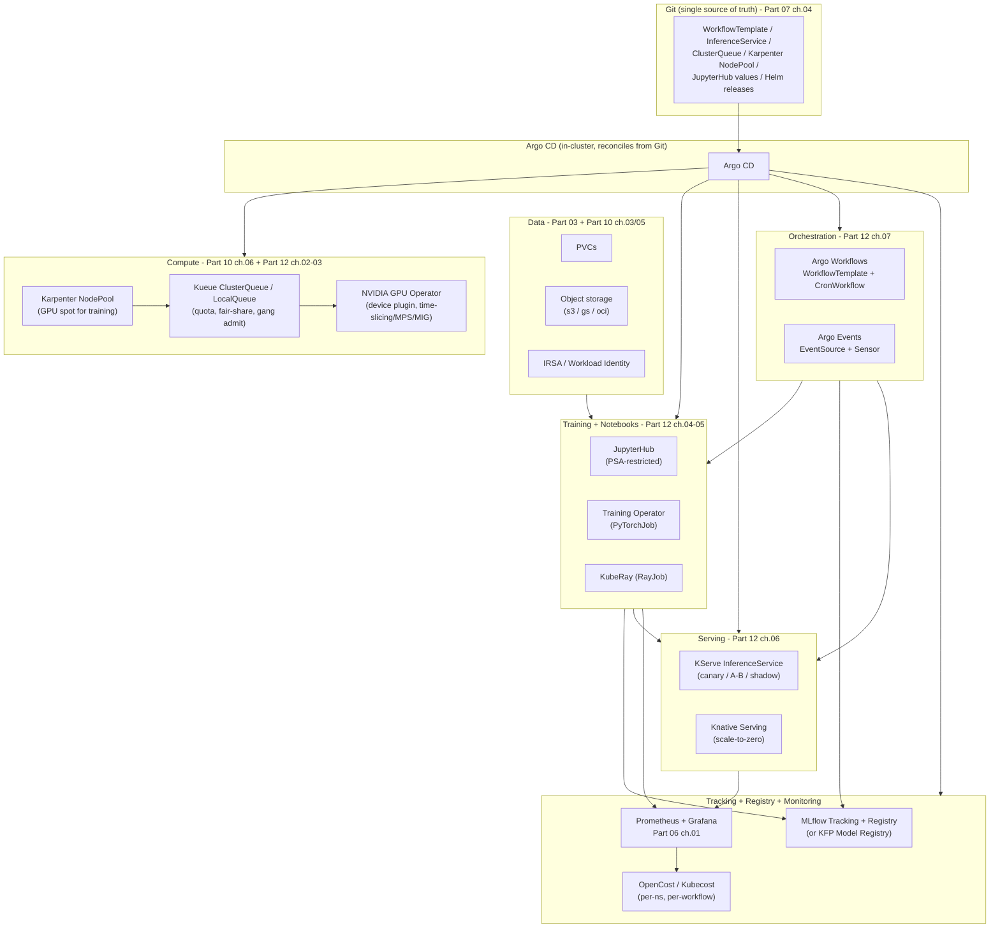

# 08 — ML platform, cost, and MLOps capstone

> The Part 12 capstone: the **MLOps maturity ladder** (L0 manual notebook ->
> L1 CI/CD for ML code -> L2 CI/CD for ML pipelines -> L3 continuous training
> + monitoring); the **full ML platform stack on Kubernetes** assembled from
> the pieces the guide built — compute ([ch.02](02-gpus-and-accelerators.md)
> GPUs + [ch.03](03-batch-and-gang-scheduling.md) Kueue + [Part 10
> ch.06](../10-cloud-and-managed-kubernetes/06-node-autoscaling-cost-multicloud.md)
> Karpenter), data (PVCs from [Part 03](../03-config-and-storage/05-stateful-data-patterns.md) +
> object storage + cloud identity from [Part 10 ch.03](../10-cloud-and-managed-kubernetes/03-cloud-identity.md)),
> training ([ch.04](04-distributed-training.md) Training Operator + Ray),
> notebooks ([ch.05](05-notebooks-and-interactive.md) JupyterHub), serving
> ([ch.06](06-model-serving-and-inference.md) KServe), orchestration
> ([ch.07](07-ml-pipelines-and-workflows.md) Argo Workflows), tracking
> (MLflow / KFP metadata), registry (MLflow Registry / KFP Model Registry /
> OCI), monitoring (Prometheus from
> [Part 06 ch.01](../06-production-readiness/01-observability-metrics.md));
> **cost & FinOps for ML** (GPU $/hr economics with on-demand vs spot vs
> MIG slice; **GPU sharing strategies as cost levers** — time-slicing /
> MPS / MIG, recapping [ch.02](02-gpus-and-accelerators.md);
> right-sizing training jobs with VPA; **spot for training, on-demand for
> inference**; the
> [`examples/bookstore/cloud/karpenter-nodepool.yaml`](../examples/bookstore/cloud/karpenter-nodepool.yaml)
> cross-ref; scale-to-zero for inference via KEDA + Knative recap;
> idle-singleuser-Jupyter culling from [ch.05](05-notebooks-and-interactive.md);
> **OpenCost / Kubecost** for per-tenant + per-pipeline-run unit
> economics — pinned Helm in their own ns); **Kubeflow-the-distribution
> vs the a-la-carte stack** the guide built piece by piece (Argo
> Workflows + KServe + MLflow + Karpenter + Kueue) — a fair tradeoff;
> **the internal developer platform for ML** (Backstage scaffolder that
> creates a new ML project namespace + Kueue queue + Argo WorkflowTemplate
> scaffold — cross-ref to [Part 11 ch.10](../11-advanced-production-patterns/10-platform-engineering.md)
> and [`examples/bookstore/platform/`](../examples/bookstore/platform/));
> the **capstone exercise** end-to-end on kind; an honest **"what we did
> not build"** list (DVC/LakeFS, Feast/Tecton, Alibi-Explain, FedML, mesh
> for inference, multi-cluster training) — closing Part 12 and the through-
> line of the whole guide.

**Estimated time:** ~60 min read · half-day hands-on
**Prerequisites:** [Part 12 ch.02-07](02-gpus-and-accelerators.md) — all Part 12 capabilities this capstone assembles · [Part 10 ch.06](../10-cloud-and-managed-kubernetes/06-node-autoscaling-cost-multicloud.md) — Karpenter + spot economics underneath ML cost · [Part 11 ch.10](../11-advanced-production-patterns/10-platform-engineering.md) — IDP shape the ML platform plugs into
**You'll know after this:** • place a team on the MLOps maturity ladder (L0 → L3) and name the next rung · • assemble the full ML stack (compute + data + train + notebook + serve + orchestrate + track + register + monitor) on K8s · • model GPU $/hr economics with on-demand vs spot vs MIG slice + sharing levers · • compare Kubeflow-the-distribution vs the a-la-carte stack this part built · • design a Backstage software-template for a new ML project (namespace + queue + WorkflowTemplate)

<!-- tags: ml, mlops, cost, finops, platform-engineering, gpu -->

## Why this exists

The seven prior chapters of Part 12 built the **parts** of an ML platform
on Kubernetes: a GPU/accelerator story, batch/queue/gang scheduling,
distributed training, notebooks, serving, and pipelines. Each one ships
with a working slice of the Bookstore recommendations thread.
Individually they are correct. Together — without a deliberate **platform
view** — they are seven CRDs and four namespaces a developer must wire
together every time they want to train a new model. That is exactly the
mistake [Part 11 ch.10](../11-advanced-production-patterns/10-platform-engineering.md)
named for application teams: **N teams x same heavy lifting = N
inconsistent, partly-secure, partly-expensive results**.

This chapter is the **capstone** that productises Part 12 into one
platform shape and ties it to *every part the guide built*. It does
three jobs at once:

1. **It states the MLOps maturity ladder honestly.** Most teams are
   somewhere between L0 ("notebooks in a private repo, models trained
   on a laptop, deployed by SSHing into a VM") and L2 ("CI runs the
   training pipeline; the model lands in a registry; the inference
   service redeploys on a tag"). The ladder is not aspirational — it is
   a *diagnostic*. Each rung names what is automated and what is
   monitored; you climb when the failure pattern on this rung demands
   the *next* rung.
2. **It frames cost as a first-class concern, with concrete levers.** ML
   on Kubernetes is the **most expensive workload most clusters will
   ever run** — GPUs at $X-XX/hr, idle notebooks at $50-150/mo, retrain
   jobs that nobody remembered to schedule, inference that should be
   scale-to-zero. Each lever has a chapter behind it; this one
   *assembles* them into a FinOps story and points at OpenCost/Kubecost
   for the visibility layer.
3. **It closes the loop honestly.** The Bookstore now has every
   chapter's slice. The capstone exercise composes them into one
   end-to-end run on kind — and then names, with deliberate honesty,
   the **things this guide did not build** (data versioning, feature
   stores, explainability platforms, federated learning, ML-aware
   service mesh, multi-cluster training topologies). The point is not
   to ship everything; it is to be honest about what is in and what is
   out.

The references are **Rosso et al., _Production Kubernetes_, ch.13
"Capacity Planning"** for the cost framing, **Google Cloud's MLOps
maturity article** for the ladder, and the official **Argo Workflows /
KServe / MLflow** docs.

## Mental model

**An ML platform on Kubernetes = (compute + data + training + notebooks
+ serving + orchestration + tracking + registry + monitoring), each
piece a thin layer the guide already built, **glued by GitOps**, **with
explicit cost levers and a clear maturity ladder**.**

- **The MLOps maturity ladder is the diagnostic.** **L0** — *manual*:
  notebooks, hand-trained models, copy-pasted to prod. **L1** — *CI/CD for
  ML code*: the training script is in Git, CI builds an image
  ([Part 07 ch.03](../07-delivery/03-cicd-pipeline.md)), a training Job
  runs in a cluster — but humans still trigger the training and the
  promotion. **L2** — *CI/CD for ML pipelines*: training is one step in
  an Argo Workflow ([ch.07](07-ml-pipelines-and-workflows.md));
  registration is automated; promotion is a GitOps commit. **L3** —
  *continuous training + monitoring*: a `CronWorkflow` retrains on a
  schedule (or an Argo Events trigger on new data), evaluation gates the
  promotion, monitoring detects drift and feeds a *retrain* signal. The
  ladder is *cumulative*: L3 needs every rung beneath it.
- **The platform stack is layered: data -> compute -> training/
  notebooks/serving -> orchestration -> tracking/registry -> monitoring
  -> GitOps wiring everything.** Each layer is **one thin operator (or
  Deployment) the guide already taught**. The platform team's job is to
  install all of them with **consistent pinning, namespacing, PSA, and
  RBAC posture** — and to expose a *small set of namespace primitives*
  ("an ML team gets a `bookstore-ml`-shaped namespace with a Kueue
  queue, a Workflow SA, and a Kserve InferenceService template")
  through an internal developer platform ([Part 11 ch.10](../11-advanced-production-patterns/10-platform-engineering.md))
  so each team does not learn the whole stack.
- **Cost on Kubernetes-for-ML has *six concrete levers*.** (1)
  **Accelerator strategy**: time-slicing / MPS / MIG
  ([ch.02](02-gpus-and-accelerators.md)) decide how many workloads
  share one physical GPU. (2) **Spot for training**: training Jobs are
  bounded-time + checkpoint-restartable -> spot instances are the right
  fit, ~70% cheaper. (3) **On-demand for inference**: a serving Pod
  evicted mid-request is a user-visible incident. (4) **Right-sizing
  training Pods** with VPA recommendations
  ([Part 06 ch.04](../06-production-readiness/04-autoscaling.md))
  catches the "we asked for 4 GPUs and used one" pattern. (5)
  **Scale-to-zero for inference** ([ch.06](06-model-serving-and-inference.md)
  with KServe+Knative, or KEDA with `minReplicaCount: 0`) is free
  money for spiky endpoints. (6) **Idle-singleuser-Jupyter culling**
  ([ch.05](05-notebooks-and-interactive.md)) prevents the most common
  ML cost line item: forgotten GPU notebooks at $5-15/hr. Visibility
  ties them together: **OpenCost** (CNCF; Kubecost is the commercial
  superset) attributes cost per namespace, per workload, per pipeline
  run (Argo Workflows annotations).
- **Build-vs-buy: Kubeflow-the-distribution vs the a-la-carte stack
  the guide built.** **Kubeflow** ships a batteries-included ML
  platform (Pipelines + Notebooks + Training Operator + KServe +
  Katib + Metadata + Dashboard) with one install. The a-la-carte
  stack (Argo Workflows + KServe + MLflow + Karpenter + Kueue +
  JupyterHub) ships each piece independently. **Trade-off**: Kubeflow
  is *less glue, more opinion, heavier operate burden, single
  vendor-distro upgrade story*; a-la-carte is *more glue, more
  flexibility, each piece on its own release cadence, more
  best-of-breed*. The honest rule: **adopt Kubeflow when you want one
  shipped platform and accept its choices; adopt the a-la-carte stack
  when you want per-component swap-out and you have a platform team
  that can integrate.** The guide deliberately taught a-la-carte
  because each piece composes back into the existing
  Kubernetes-as-the-platform thesis; Kubeflow is correctly the right
  answer for many teams.
- **The internal developer platform for ML is the same paved-road
  pattern as [Part 11 ch.10](../11-advanced-production-patterns/10-platform-engineering.md),
  with ML knobs.** A Backstage scaffolder template "Create a new ML
  project" *produces* the standard ML-team artifacts: a PSA-`restricted`
  namespace, a Kueue `LocalQueue`, an Argo Workflows `WorkflowTemplate`
  scaffold (train/eval/register/promote, the
  [ch.07](07-ml-pipelines-and-workflows.md) shape), a KServe
  `InferenceService` scaffold, a per-team `ResourceQuota` ([Part 08
  ch.04](../08-day-2-operations/04-multi-tenancy-and-namespaces.md)).
  Same Backstage `Template` shape as the existing one in
  [`examples/bookstore/platform/backstage-template.yaml`](../examples/bookstore/platform/backstage-template.yaml) —
  the guide does **not** modify that file; the ML template is the
  parallel artifact a real platform team would author next.
- **GitOps wires everything.** [Part 07 ch.04](../07-delivery/04-gitops-argocd.md)'s
  Argo CD reconciles the cluster from Git. For ML that means: every
  ML CRD is a manifest in Git, including the `WorkflowTemplate`, the
  `InferenceService`, the `ClusterQueue`, the `Karpenter NodePool`,
  the `JupyterHub` Helm release. Promotion = a PR that bumps
  `storageUri` or `image`. Rollback = `git revert`. The platform team
  edits one Git repo; the cluster catches up. **There is no second
  control plane for ML**.

This **builds on**: [Part 06 ch.04](../06-production-readiness/04-autoscaling.md)
(HPA/VPA/KEDA for inference scale-to-zero), [Part 06 ch.06](../06-production-readiness/06-capacity-and-cost.md)
(general cost) deepened with ML specifics; [Part 07
ch.04](../07-delivery/04-gitops-argocd.md) + [05](../07-delivery/05-progressive-delivery.md)
(GitOps + progressive delivery); [Part 08 ch.04](../08-day-2-operations/04-multi-tenancy-and-namespaces.md)
(quotas / multi-tenancy applied per ML team); [Part 10
ch.06](../10-cloud-and-managed-kubernetes/06-node-autoscaling-cost-multicloud.md)
(Karpenter spot pools for training); [Part 11
ch.10](../11-advanced-production-patterns/10-platform-engineering.md)
(IDP / Backstage / Crossplane — the *paved-road* pattern). It does
**not** re-teach any of them.

## Diagrams

### The full ML platform stack on Kubernetes — what the guide built, layer by layer (Mermaid)



### MLOps maturity ladder L0 -> L3, with what each rung adds (ASCII)

```
 MLOps MATURITY LADDER
 ────────────────────────────────────────────────────────────────────────────
 L0  MANUAL                  Notebooks in private repos. Models trained on a
                              laptop. Deployed by SSH or "send the file". No
                              tests, no monitoring, no rollback path.
                              -- diagnostic: "what's the model in prod?" is
                                 answered by a person, not a system.

 L1  CI/CD for ML CODE       Training script is in Git. CI (Part 07 ch.03)
                              builds an image, pushes a digest, opens a PR.
                              A human kicks off a training Job. Promotion is
                              a manual kubectl apply or an InferenceService
                              storageUri edit.
                              -- diagnostic: "I can rebuild yesterday's image"
                                 yes; "I can rebuild yesterday's MODEL" no.

 L2  CI/CD for ML PIPELINES  The training/eval/register/promote loop is an
                              Argo WorkflowTemplate (Part 12 ch.07). CI opens
                              a PR that bumps a model URI; Argo CD applies;
                              KServe shifts traffic via canaryTrafficPercent.
                              Lineage = (dataset URI + image SHA + hparams)
                              recorded per run.
                              -- diagnostic: "promote a new model" is a PR,
                                 not a ticket.

 L3  CONTINUOUS TRAINING +   CronWorkflow retrains nightly OR Argo Events on
     MONITORING               new data triggers a retrain. Eval step gates
                              on offline metric AND a quality SLO from
                              monitoring (drift detection on prediction
                              distribution / feature staleness). Failed eval
                              => Workflow fails; no promotion. Monitoring
                              feeds back into the retrain trigger.
                              -- diagnostic: a quality regression auto-rolls-
                                 back via Argo CD revert + KServe revision.

 Where does the Bookstore sit?  At L2 with the recommender-workflow.yaml
 ────────────────────────────  + recommender-cronworkflow.yaml. L3 needs a
                                drift detector + a quality SLO + an Argo
                                Events trigger from monitoring -- left as
                                a forward-looking exercise (and one piece
                                of the honest "not built" list below).
```

## Hands-on with the Bookstore

**Assumed working directory: the guide repo root (`full-guide/`).** All
prereqs are the namespaces and images from earlier Part 12 chapters; this
chapter installs only the *cost* and *tracking* slices, then walks the
capstone exercise that composes every piece together.

### 1. The cost story: OpenCost (visibility) + the levers

The visibility layer goes first — without it, every other "cost lever"
discussion is faith-based. **OpenCost** is the CNCF cost-accounting
standard; **Kubecost** is the commercial superset that ships with extra
UI/reporting. Either works.

```sh
# Install OpenCost via pinned Helm into its own namespace
# (the same shape as Part 10 ch.06's example).
OPENCOST_VERSION="1.108.1"        # bump deliberately
helm repo add opencost https://opencost.github.io/opencost-helm-chart
helm install opencost opencost/opencost \
  --version "$OPENCOST_VERSION" \
  -n opencost --create-namespace --wait

# OpenCost reads kube-state-metrics + cAdvisor + node prices to compute
# allocation per namespace / workload / label. Browse:
kubectl port-forward -n opencost svc/opencost 9003:9003 &
# http://localhost:9003/allocation?aggregate=namespace
```

> **Tag ML pipeline runs for per-pipeline cost attribution.** Argo
> Workflows lets you set Pod labels via `WorkflowTemplate.metadata.labels`
> + `podMetadata.labels`. Add `ml.bookstore/workflow={{workflow.name}}`
> and OpenCost will attribute the run's compute (including any GPU
> minutes) to that label. The result: "the nightly retrain costs $X.YY
> per run" as a query, not a guess.

The six concrete levers, mapped to manifests already in the guide:

| Lever | Where it lives | What it saves |
|---|---|---|
| **Accelerator sharing**: time-slice / MPS / **MIG** | [ch.02](02-gpus-and-accelerators.md) GPU Operator config | 1 GPU serves many small jobs/models; MIG = isolated slices on A100/H100 |
| **Spot for training** | [Part 10 ch.06](../10-cloud-and-managed-kubernetes/06-node-autoscaling-cost-multicloud.md) + [`../examples/bookstore/cloud/karpenter-nodepool.yaml`](../examples/bookstore/cloud/karpenter-nodepool.yaml) (GPU NodePool tagged spot) | ~70% off on-demand; safe because training jobs checkpoint and Kueue gang-admit retries |
| **On-demand for inference** | A second NodePool, non-spot, taint-/tolerated by `InferenceService` Pods | predictability >> price for user-facing requests |
| **Right-size training Pods** | `VerticalPodAutoscaler` in `recommendation` mode on training Pods ([Part 06 ch.04](../06-production-readiness/04-autoscaling.md)) | catches "asked for 4 GPUs, used 1" + "asked for 32Gi, peaked at 8Gi" |
| **Scale-to-zero for inference** | KServe + Knative ([ch.06](06-model-serving-and-inference.md)) or KEDA `minReplicaCount: 0` | spiky endpoints cost zero when idle |
| **Idle-Jupyter culling** | z2jh `cull.timeout` ([ch.05](05-notebooks-and-interactive.md)) | a forgotten GPU notebook is a single line item bigger than every CI runner combined |

> **GPU $/hr honesty.** Concrete numbers age fast; the shape does not.
> On any cloud right now: **spot** is ~50-80% off **on-demand**;
> **MIG slices** (1g/2g/3g/7g of an A100/H100) cost a *fraction* of the
> whole GPU; **time-sliced** sharing is *free* but adds latency
> contention. The cost-aware design is **MIG for inference of small
> models**, **spot whole-GPU for training**, **on-demand whole-GPU for
> latency-critical inference**. Specific prices: read your cloud's
> page on the day; do not bake numbers into a guide.

### 2. The tracking + registry slice (MLflow) — what to add if you want L2-with-real-lineage

[ch.07](07-ml-pipelines-and-workflows.md)'s `register` step is a kind-
runnable proxy (a ConfigMap). The real shape is **MLflow** (the most
common open-source tracker + registry) or **KFP Model Registry** (the
Kubeflow-native option). MLflow is the smaller add-on; install it pinned:

```sh
# Pin via Bitnami's chart (one of the maintained MLflow Helm charts).
# Bump deliberately; bitnami's chart README documents the MLflow version.
MLFLOW_CHART_VERSION="2.5.0"      # ChartVersion (Bitnami); appVersion in chart README
helm repo add bitnami https://charts.bitnami.com/bitnami
helm install mlflow bitnami/mlflow \
  --version "$MLFLOW_CHART_VERSION" \
  -n mlflow --create-namespace --wait
# (MLflow needs a backing store and an artifact store -- the chart
#  configures PostgreSQL + MinIO by default; replace with managed
#  Postgres + S3/GCS in prod.)
```

To wire the Bookstore pipeline to MLflow: replace the `register` step's
`kubectl create configmap` with an MLflow `log_model` / `log_artifact`
call from a small Python helper (one container image swap; no DAG
change). The chapter calls this out **without** mutating the existing
`ml/pipeline/recommender-workflow.yaml` — the swap is a deliberate next
step that the platform team would land as a separate PR.

### 3. The capstone exercise — the Bookstore ML platform end-to-end on kind

Compose every piece the guide built, in one sequence, against a kind
cluster. Each step has appeared in the chapters individually; this is
the **first time they run as one platform**.

```sh
# A. Cluster + namespace
kind create cluster --config examples/bookstore/cluster/kind-multinode.yaml  # if not already up
kubectl create namespace bookstore-ml
kubectl label namespace bookstore-ml \
  app.kubernetes.io/part-of=bookstore-ml \
  pod-security.kubernetes.io/enforce=restricted \
  pod-security.kubernetes.io/enforce-version=latest \
  pod-security.kubernetes.io/audit=restricted \
  pod-security.kubernetes.io/warn=restricted --overwrite

# B. The Bookstore app (dev overlay -> 45 objects; staging -> 49; prod -> 48).
kubectl apply -k examples/bookstore/kustomize/overlays/dev

# C. Batch scheduling layer (ch.03)
JOBSET_VERSION="0.11.1"; KUEUE_VERSION="0.17.0"
helm install jobset oci://registry.k8s.io/jobset/charts/jobset \
  --version "$JOBSET_VERSION" -n jobset-system --create-namespace --wait
helm install kueue  oci://registry.k8s.io/kueue/charts/kueue \
  --version "$KUEUE_VERSION"  -n kueue-system  --create-namespace --wait
kubectl apply -f examples/bookstore/ml/batch/kueue-resourceflavor.yaml
kubectl apply -f examples/bookstore/ml/batch/kueue-clusterqueue.yaml
kubectl apply -f examples/bookstore/ml/batch/kueue-localqueue.yaml

# D. Training image + Job (ch.04)
docker build -t bookstore/recommender-train:dev examples/bookstore/ml/train
kind load docker-image bookstore/recommender-train:dev
kubectl apply -f examples/bookstore/ml/train/recommender-train-job.yaml
kubectl wait --for=condition=complete job/recommender-train \
  -n bookstore-ml --timeout=300s

# E. Serving image + Deployment (ch.06 -- kind path, no KServe)
docker build -t bookstore/recommender-serve:dev examples/bookstore/ml/serve
kind load docker-image bookstore/recommender-serve:dev
kubectl apply -f examples/bookstore/ml/serve/recommender-deployment.yaml
kubectl apply -f examples/bookstore/ml/serve/recommender-service.yaml
kubectl rollout status deploy/recommender -n bookstore-ml --timeout=120s

# F. The pipeline (ch.07)
helm repo add argo https://argoproj.github.io/argo-helm
helm install argo-workflows argo/argo-workflows \
  --version 0.42.0 -n argo --create-namespace --wait
kubectl apply -f examples/bookstore/ml/pipeline/recommender-workflow.yaml
kubectl apply -f examples/bookstore/ml/pipeline/recommender-cronworkflow.yaml
argo submit --from workflowtemplate/recommender-pipeline -n bookstore-ml --watch

# G. The end-to-end check
kubectl port-forward -n bookstore-ml svc/recommender 8080:8080 &
curl -s "http://localhost:8080/recommend?book_id=1&k=3"
#   {"book_id":1,"k":3,"recommendations":[...]}
# Inspect the registry stamp the pipeline wrote:
kubectl get configmap -n bookstore-ml \
  -l app.kubernetes.io/component=recommender-model-registry
```

That sequence is the **L2 Bookstore ML platform**, running on kind, with
every layer the guide built. Add **cost visibility** by installing
OpenCost (step 1 of this chapter); add **scale-to-zero serving** by
installing KServe + Knative ([ch.06](06-model-serving-and-inference.md))
and switching to `recommender-inferenceservice.yaml`; add **GitOps** by
installing Argo CD ([Part 07 ch.04](../07-delivery/04-gitops-argocd.md))
and pointing it at the manifests in Git; add **event-driven retraining**
by installing Argo Events ([ch.07](07-ml-pipelines-and-workflows.md)) and
applying the EventSource + Sensor. Each addition is one pinned-Helm
install and one set of manifests; no migration.

> **In real life everything above is a `git push`.** The platform team
> commits the manifests; Argo CD reconciles the cluster; Argo Workflows
> reconciles the pipeline runs; Karpenter reconciles the nodes; KServe
> reconciles the model traffic split. **All the Argos of the guide
> finally collaborate.** A new ML team requests a `bookstore-ml`-shaped
> namespace via the Backstage scaffolder ([Part 11 ch.10](../11-advanced-production-patterns/10-platform-engineering.md));
> the scaffolder commits a PR; the loop closes by itself.

### 4. The IDP touch-point — a Backstage template for "create a new ML project"

The existing
[`examples/bookstore/platform/backstage-template.yaml`](../examples/bookstore/platform/backstage-template.yaml)
([Part 11 ch.10](../11-advanced-production-patterns/10-platform-engineering.md))
is a Backstage scaffolder for "an app environment" — namespace + RBAC +
Quota + NetworkPolicy. The parallel **ML** template would produce: an
**ML namespace** (`<TEAM>-ml`, PSA `enforce: restricted`), a **Kueue
`LocalQueue`** pointing at a shared `ClusterQueue` ([ch.03](03-batch-and-gang-scheduling.md)),
a starter **`WorkflowTemplate`** scaffold (train/eval/register/promote — the
[ch.07](07-ml-pipelines-and-workflows.md) shape), a starter
**`InferenceService`** scaffold ([ch.06](06-model-serving-and-inference.md)),
a per-team `ResourceQuota` ([Part 08 ch.04](../08-day-2-operations/04-multi-tenancy-and-namespaces.md)),
and Argo CD `Application` glue. The result: a new ML team self-services
the *whole stack* in minutes, bounded by the platform's guardrails.

The guide does not mutate the existing
`examples/bookstore/platform/backstage-template.yaml`; the ML template is
the **next** template a real platform team would author, with exactly the
same `scaffolder.backstage.io/v1beta3` shape.

## How it works under the hood

- **The platform layers reconcile independently.** Each operator
  (Karpenter, Kueue, JobSet, Argo Workflows, Argo Events, KServe,
  cert-manager, Knative, JupyterHub, MLflow, OpenCost) is a controller
  watching its own CRDs in its own namespace. **None of them know about
  each other**; they meet at the `bookstore-ml` namespace where their
  CRDs land. That decoupling is *the platform property*: replacing
  Karpenter with the cluster-autoscaler doesn't touch Argo Workflows;
  replacing MLflow with W&B doesn't touch KServe.
- **Cost attribution = labels + node prices.** OpenCost computes
  *allocation* per workload by joining (1) the Pod's resource requests /
  usage (via kube-state-metrics + cAdvisor) with (2) the node's price
  (a `costmodel` configured per cloud / on-prem). Per-namespace, per-
  workload, per-label cost is just an aggregation. Adding
  `ml.bookstore/workflow=<WF>` to workflow Pods makes per-pipeline-run
  cost queryable.
- **Spot for training is safe because training is bounded + restartable.**
  A training Job has `backoffLimit` ([ch.04](04-distributed-training.md));
  a JobSet has `successPolicy` + restart on spot eviction; KubeRay /
  PyTorchJob restart from checkpoint. A spot node going away mid-train
  = a retry, not a lost run, *provided* the training code checkpoints.
  Karpenter NodePool `disruption.budgets` / `consolidation: WhenEmpty`
  / a `karpenter.sh/disruption: do-not-evict` annotation on the
  serving Pods (which live on a separate, on-demand NodePool) keeps
  the policy correct: training spot, serving on-demand.
- **Scale-to-zero is *only* free when cold-start fits the SLO.** A
  Knative cold-start = (Pod schedule) + (container start) + (model load).
  For a small CPU recommender it is ~seconds; for a 50 GiB LLM it is
  tens of seconds and unacceptable for user-facing traffic. **Pick by
  SLO**: scale-to-zero for *spiky internal* or *async* inference; warm
  pool (`min-scale: 1` or higher) for *user-facing low-latency*.
- **MIG vs time-slice vs MPS — the cost framing.** [ch.02](02-gpus-and-accelerators.md)
  named them as **isolation models**; this chapter names them as
  **cost levers**. MIG (NVIDIA A100/H100): **isolated slices** of one
  GPU, near-linear price scaling — buy one A100, sell *seven* tenants
  a 1g slice. Time-slicing (any GPU): **shared concurrent** — every
  tenant's kernels interleave, *no isolation*, *no per-tenant memory
  cap*, max throughput per dollar but unpredictable latency. MPS:
  **multi-process service**, the better-behaved time-slicing variant.
  The cost-aware mix: **MIG for production serving of small models +
  shared-memory bounds**, **time-slicing for dev/notebook GPU
  exploration**, **whole-GPU for training**.
- **The Kubeflow distribution vs a-la-carte trade-off, concretely.**
  Kubeflow installs Pipelines + Notebooks + KServe + Katib + Training
  Operator + Metadata + a Dashboard as one operator-of-operators
  ("Kubeflow Manifests" / Kubeflow Operator). Upgrades are coordinated.
  Removing a component is a fork. The a-la-carte stack the guide built
  is each piece *separately*: Argo Workflows for pipelines (ch.07),
  KServe for serving (ch.06), MLflow or KFP-standalone for tracking,
  JupyterHub for notebooks (ch.05), Katib (or skip it) for HPO. Each
  upgrades independently. Each can be swapped. The integration is
  GitOps + a small set of cross-namespace CRDs. **Most platform teams
  end up with a-la-carte after Kubeflow** because the latter's "all or
  nothing" matters less and less as each component becomes excellent
  on its own; smaller teams (5-50 engineers) often *start* with
  Kubeflow exactly because the glue is hard. Either is correct;
  document the choice.
- **The IDP for ML is Backstage scaffolder + Crossplane Composition.**
  [Part 11 ch.10](../11-advanced-production-patterns/10-platform-engineering.md)'s
  pattern applies unchanged: a Backstage `Template` (`scaffolder.backstage.io/v1beta3`)
  for "create an ML project" -> a Crossplane `BookstoreEnvironment`-style
  XR -> a Composition that expands into the namespace + Kueue queue +
  Argo Workflow scaffold + InferenceService scaffold + Quota +
  NetworkPolicy + Argo CD `Application`. The developer fills in three
  fields ("team name, queue size, expected GPU hours"); the road builds
  the rest.
- **GitOps for ML works the same as for apps, with one wrinkle.** The
  *model artifact* itself is **not in Git** — it is too big, and Git's
  semantics are wrong for a binary blob. The model's *storage URI* and
  *version tag* are in Git
  ([`recommender-inferenceservice.yaml`](../examples/bookstore/ml/serve/recommender-inferenceservice.yaml)'s
  `storageUri`). Promotion = a PR that bumps the URI; rollback = revert
  the PR (and let KServe shift back). The model registry is the
  intermediate (model + version + metadata), the InferenceService is
  the *pointer in Git*, and Argo CD applies the pointer.

## Production notes

> **In production:** **map your team to the maturity ladder honestly,
> *then climb the next rung*.** Skipping rungs causes most of the
> "Kubernetes-for-ML failures" you read about: L0 -> L3 in one quarter is
> a recipe for an ML platform with no rollback story. Climb one rung at
> a time, each justified by a *specific* pain on the rung below.

> **In production:** **make cost visible *before* you make it optimal**.
> Install **OpenCost** (or Kubecost) in its own namespace via pinned
> Helm; tag workflow Pods, training Pods, and InferenceService Pods
> with team/project/pipeline labels; build a *report*; *then* turn the
> levers. Without visibility, "optimisation" is folklore.

> **In production:** **training on spot, serving on on-demand** is the
> default split — a separate Karpenter `NodePool` per workload class
> (see [Part 10 ch.06](../10-cloud-and-managed-kubernetes/06-node-autoscaling-cost-multicloud.md)
> and [`examples/bookstore/cloud/karpenter-nodepool.yaml`](../examples/bookstore/cloud/karpenter-nodepool.yaml)).
> Tolerate spot taints from training Pods; do **not** tolerate them
> from serving Pods. Karpenter `consolidation` lets training pools
> shrink to zero when no jobs are queued.

> **In production:** **scale-to-zero serving is only free when the
> cold-start fits the SLO.** Profile the cold start, set `min-scale`
> deliberately, and document the trade. A warm pool of 1 Pod on a
> spiky endpoint can be cheaper than a many-second cold-start cost in
> *user-visible latency* you cannot put on the bill.

> **In production:** **a model registry is not optional past L1.**
> "Which model is in prod?" must be a query, not an investigation.
> Pick **MLflow** (smaller, open), **KFP Model Registry** (Kubeflow-
> native), or an **OCI artifact registry** with a tag convention. The
> ConfigMap proxy in this guide is the *kind-runnable shape*; it is
> not the *production answer*.

> **In production:** **lineage is a Workflow parameter problem, not a
> tooling problem.** Pin training images to a digest (`@sha256:...`);
> record the dataset URI, image SHA, and hyperparameters as Workflow
> parameters; promote the *score* and *URI* into the registry. **Where
> you stop, the audit and the rollback story stops.**

> **In production:** **Kubeflow vs a-la-carte is a *team-size and
> platform-team* decision, not a technology one.** Both ship correct ML
> on Kubernetes. A small team with no platform engineers: Kubeflow.
> A platform team operating shared infra for many ML teams: a-la-carte
> (the stack the guide taught) — more flexible, more components to
> upgrade. **Decide, document, do not switch every six months**.

> **In production:** **the IDP for ML is a thin layer over the same
> guardrails as every other team's IDP** ([Part 11 ch.10](../11-advanced-production-patterns/10-platform-engineering.md)).
> Resist the temptation to build a separate "ML platform team" with a
> separate paved road; the *workloads* are different, the *platform
> primitives* are the same.

> **In production:** **PSA-`restricted` on every Pod the platform
> produces — no exceptions for ML**. The biggest "ML pod won't start"
> incidents the guide foreshadows in [ch.01](01-why-ml-on-kubernetes.md),
> [ch.02](02-gpus-and-accelerators.md), [ch.05](05-notebooks-and-interactive.md)
> are PSA violations from upstream CUDA/Jupyter base images. The
> platform's job is to bake the restricted SC into the *template* a
> developer copies, so a new ML project starts compliant by default.

> **In production:** the platform-design backlog is its own discipline,
> not a 3am SRE checklist. (a) **IDP for ML** — a Backstage template (or
> Crossplane XR) produces "an ML project" with the same guardrails as
> every other team. (b) **Kubeflow vs a-la-carte decision** is
> documented; the team isn't accidentally running both. (c) **The "what
> we did not build" list** is the team's prioritised backlog, not a
> surprise. Each is a quarterly review item, not an oncall runbook.

## What we did not build

Honest list — each line is **one thing a production ML platform may
need that this guide did not include**, with a one-line pointer to
where it fits.

- **Data versioning (DVC, LakeFS, Pachyderm).** Versioning a *dataset*
  the way Git versions code. Fits before [ch.04](04-distributed-training.md)
  (dataset URI is the train input); the pipeline records the URI but
  cannot *re-fetch a prior dataset version* unless DVC/LakeFS owns it.
- **Feature stores (Feast, Tecton, Hopsworks).** Online + offline feature
  registries with consistency between training and serving. Fits between
  the dataset and [ch.04](04-distributed-training.md)/[ch.06](06-model-serving-and-inference.md);
  the Bookstore's tiny recommender does not need one — most real
  recommendations / fraud / pricing systems do.
- **Model explainability (Alibi-Explain, SHAP, LIME, Captum).**
  Per-prediction explanations — "why did the model say what it said?".
  Fits as a KServe `explainer` ([ch.06](06-model-serving-and-inference.md)),
  or as a sidecar; out of scope here.
- **Federated / decentralised training (Flower, FedML).** Training across
  organisations without centralising data. A different topology from
  [ch.04](04-distributed-training.md); usually a separate platform.
- **ML-aware service mesh for inference.** Token-/request-aware
  routing, multi-model packing, batched calls — sometimes overlays
  KServe via Istio/Linkerd ([Part 11 ch.04](../11-advanced-production-patterns/04-service-mesh.md))
  or vLLM/TGI; not built here.
- **Multi-cluster training topologies.** Sharding workers across
  clusters (heterogeneous accelerators, geographic spread). Argo
  Workflows + ApplicationSet ([Part 11 ch.06](../11-advanced-production-patterns/06-multi-cluster-and-fleet.md))
  can express this; the Bookstore's tiny recommender does not need it.
- **Real drift detection.** Population-Stability-Index / KS-test /
  embedding-distance over predictions; Evidently / Alibi-Detect as
  Kubernetes-runnable choices. Fits as a step in the pipeline (an
  extra `monitor` step that fails the run when drift exceeds a
  threshold) or as a separate Kubernetes Job a Sensor reads. Forward-
  pointed in the maturity ladder above as the L3 trigger.
- **The full Kubeflow distribution as a comparison install.** Mentioned;
  not installed. The honest tradeoff is documented; install it if you
  want the batteries-included alternative to compare with the a-la-
  carte stack the guide taught.

This is **not** "stuff we forgot"; it is **stuff with deliberate scope
boundaries**. Each line is a real next chapter for the platform team
that picks up where this guide ends.

## Closing the loop — the through-line of the guide

The guide started with a Pod that ran the Bookstore's `catalog`. It
added a Deployment, a Service, an Ingress, a StatefulSet, a Job, a
ConfigMap, a Secret. It hardened them with PSA, RBAC, NetworkPolicy. It
packaged them with Helm and Kustomize. It delivered them with Argo CD.
It scaled them with HPA + KEDA + Karpenter. It ran them across regions
and clusters. It built a paved road that produced more of them on
demand. Each Part added one capability; each Part deepened the same
posture; the Bookstore got more ambitious without the operating model
changing.

Part 12 added a *new shape of workload* on top of all of it — training
Pods, serving Pods, pipeline Pods, notebook Pods — and showed that **the
posture does not change**. PSA still applies. RBAC still applies. Quotas
still apply. GitOps still applies. The Argo CD that reconciles the
Bookstore reconciles the WorkflowTemplate. The Karpenter that scales the
app's NodePool scales the training NodePool. The OpenCost that attributes
the app's cost attributes the model's. **Kubernetes did not become an
ML platform; the ML platform became a Kubernetes workload.**

That is the through-line: one platform, one posture, many workloads.

## Quick Reference

```sh
# Cost visibility (pinned Helm, own namespace)
OPENCOST_VERSION="1.108.1"
helm repo add opencost https://opencost.github.io/opencost-helm-chart
helm install opencost opencost/opencost \
  --version "$OPENCOST_VERSION" -n opencost --create-namespace --wait

# Tracking + registry (the L2+ swap from ch.07's ConfigMap proxy)
MLFLOW_CHART_VERSION="2.5.0"
helm repo add bitnami https://charts.bitnami.com/bitnami
helm install mlflow bitnami/mlflow \
  --version "$MLFLOW_CHART_VERSION" -n mlflow --create-namespace --wait

# Re-summon the full capstone (every prior chapter's slice, in order)
kubectl apply -k examples/bookstore/kustomize/overlays/dev
kubectl apply -f examples/bookstore/ml/batch/                # ch.03
kubectl apply -f examples/bookstore/ml/train/recommender-train-job.yaml  # ch.04
kubectl wait --for=condition=complete job/recommender-train -n bookstore-ml --timeout=300s
kubectl apply -f examples/bookstore/ml/serve/recommender-deployment.yaml # ch.06
kubectl apply -f examples/bookstore/ml/serve/recommender-service.yaml
kubectl apply -f examples/bookstore/ml/pipeline/recommender-workflow.yaml  # ch.07
argo submit --from workflowtemplate/recommender-pipeline -n bookstore-ml --watch

# Verify
kubectl port-forward -n bookstore-ml svc/recommender 8080:8080 &
curl -s "http://localhost:8080/recommend?book_id=1&k=3"
kubectl get configmap -n bookstore-ml \
  -l app.kubernetes.io/component=recommender-model-registry
```

Minimal skeleton (a Backstage scaffolder `Template` for "an ML project"
— the IDP touch-point parallel to `examples/bookstore/platform/backstage-template.yaml`):

```yaml
apiVersion: scaffolder.backstage.io/v1beta3
kind: Template
metadata:
  name: ml-project
  title: New ML Project (paved road)
spec:
  owner: platform-team
  type: ml-project
  parameters:
    - title: Team
      properties:
        team: { type: string, title: "Team name" }
        size: { type: string, enum: ["xs","s","m","l"], default: "s" }
        gpuHoursPerMonth: { type: integer, default: 100 }
  steps:
    - id: fetch
      action: fetch:template
      input:
        url: ./skeleton                      # contains: namespace + Kueue queue +
                                              # WorkflowTemplate + InferenceService
        values:
          team: ${{ parameters.team }}
          size: ${{ parameters.size }}
    - id: publish
      action: publish:github
      input:
        repoUrl: github.com?repo=${{ parameters.team }}-ml&owner=...
    - id: register
      action: catalog:register
      input: { repoContentsUrl: ${{ steps.publish.output.repoContentsUrl }} }
```

Checklist:

- [ ] **MLOps maturity rung known**: team is at LX; the next pain points the LX+1 rung
- [ ] **Cost visibility installed** (OpenCost or Kubecost); workflow + training + serving Pods labelled for attribution
- [ ] **Spot for training, on-demand for inference** (separate Karpenter NodePools / tolerations / `do-not-evict` on serving)
- [ ] **Scale-to-zero for inference** chosen deliberately per endpoint SLO (cold-start budget understood)
- [ ] **A model registry** is in use (MLflow / KFP / OCI) — *not* a ConfigMap in prod
- [ ] **Lineage** = dataset URI + image SHA + hyperparameters recorded per pipeline run
- [ ] **GitOps wires it all** — pipeline manifests, serving manifests, NodePools, Helm releases all in Git, reconciled by Argo CD

## Test your understanding

> Try each before opening the answer drawer. The act of trying is the exercise; the answer is the check.

1. **Synthesise the Part 12 stack: name the chapter that owns each layer (compute / data / training / notebooks / serving / orchestration / cost) and what each layer depends on.**
   <details><summary>Show answer</summary>

   Compute = [ch.02 GPUs](02-gpus-and-accelerators.md) + [Part 10 ch.06 Karpenter](../10-cloud-and-managed-kubernetes/06-node-autoscaling-cost-multicloud.md) + [ch.03 Kueue](03-batch-and-gang-scheduling.md). Data = PVCs ([Part 03 ch.04](../03-config-and-storage/04-persistent-storage.md)) + object store via [Part 10 ch.03 IRSA](../10-cloud-and-managed-kubernetes/03-cloud-identity.md). Training = [ch.04 PyTorchJob/Ray](04-distributed-training.md) on top of [ch.03 Kueue](03-batch-and-gang-scheduling.md) on top of [ch.02 GPUs](02-gpus-and-accelerators.md). Notebooks = [ch.05 JupyterHub](05-notebooks-and-interactive.md). Serving = [ch.06 KServe](06-model-serving-and-inference.md). Orchestration = [ch.07 Argo Workflows + Events](07-ml-pipelines-and-workflows.md). Cost/tracking = this chapter + OpenCost. Each layer assumes the one below: KServe assumes GPUs, Workflows assumes Kueue for batch admission, Karpenter feeds all of them. The platform is the composition, not any individual piece.

   </details>

2. **Your team is at MLOps L1 (CI/CD for ML code, manual training, manual serving). Walk through what L2 (CI/CD for ML pipelines) actually requires you to add.**
   <details><summary>Show answer</summary>

   (1) A pipeline DSL/runtime — Argo Workflows or KFP — so pipelines are versioned code, not "run this notebook." (2) A model registry that pipelines publish to (MLflow Registry) and that serving reads from — so models are decoupled from training runs. (3) Lineage as data — every pipeline run records dataset + code SHA + hyperparameters + metrics. (4) Pipeline manifests in Git, reconciled by Argo CD. (5) Triggers (CronWorkflow, Argo Events) so retraining is not manual. (6) A promotion gate — "model X scored ≥ baseline" → tag it `production` in the registry → Argo CD picks it up. L2 is the rung where ML stops being "Bob runs a notebook" and becomes a system the team operates collectively.

   </details>

3. **You're spending $20k/month on the ML platform. Walk through the cost-attribution attack: where do you point OpenCost, what labels do you need, and what's the answer to "what did the recommendations team cost last month?"**
   <details><summary>Show answer</summary>

   Install OpenCost in its own namespace with cloud-bill integration. Every ML namespace gets a label `team=recommendations` (or `tenant=acme-books`). Every Pod inherits the namespace label, plus per-pipeline-run labels (`pipeline.argoproj.io/run-name`) that OpenCost can group by. Per-resource: training Pods on spot show lower $/hr than serving Pods on on-demand. The answer flows: tenant -> namespace -> Pods -> GPU/CPU/memory/PVC -> $ per resource × hours -> total. The dashboard answers "team recommendations spent $4,200 last month, of which $3,100 was GPU training, $900 was serving, $200 was notebooks." Without labels seeded by the platform (Crossplane onboarding, see [Part 13 ch.10](../13-grand-capstone-bookstore-platform/10-cost-opencost-per-tenant-finops.md)), the bill is opaque.

   </details>

4. **Why "spot for training, on-demand for inference" — what would go wrong if you reversed it?**
   <details><summary>Show answer</summary>

   Training is a long-running batch workload that can checkpoint and resume — a spot interruption costs you a few minutes of recompute. Inference is request-response with an SLO; a spot interruption mid-request causes errors, and cold-start of a new pod takes 5-30s during which SLO is breached. Spot for inference: when AWS reclaims a serving node, you fail open requests and your error budget burns. On-demand for training: you're paying 3-4x more for stability you don't need (the trainer doesn't care if it gets evicted; the checkpointer handles it). Reversed = worst-of-both: more cost AND worse availability. Use Karpenter `NodePool`s with capacity-type taints to enforce this split.

   </details>

5. **You've installed MLflow Registry as the canonical model store. A new model has `accuracy: 0.91` (baseline is 0.88). What's the promotion path from "saved in MLflow" to "serving traffic in production"?**
   <details><summary>Show answer</summary>

   (1) **Eval gate**: the training pipeline's eval step compares to the baseline and only registers the model if it passes; if not, the run fails. (2) **Stage tag**: MLflow tags the new model `staging`. (3) **PR**: a bot opens a PR in the GitOps repo updating the KServe `InferenceService.spec.predictor.model.storageUri` from `models/v1` to `models/v2`. (4) **Human review** + auto-tests (smoke prediction on a fixed input). (5) **Merge** -> Argo CD syncs -> KServe rolls out v2 with `canaryTrafficPercent: 5`. (6) **SLO gate**: AnalysisTemplate watches latency + acceptance rate; if green, ramps to 100%; if red, rolls back. (7) **Promote** in MLflow: tag the model `production`. The promotion path is human-gated + SLO-gated + GitOps-traced — every step is an audit record.

   </details>

6. **Reflection: what is the *honest* L3 (continuous training + monitoring) capability that this guide does NOT yet give you, and what would you need to add?**
   <details><summary>Show answer</summary>

   The guide covers: pipelines, registry, serving, lineage, cost. L3 also needs (a) **drift detection** in production — input drift, prediction drift, label drift (the [Part 13 ch.08](../13-grand-capstone-bookstore-platform/08-real-ml-loop-training-registry-serving-drift.md) Alibi-Detect step closes this); (b) **automatic retraining** triggered by drift OR by SLO breach; (c) **feature store** — Feast or similar — so training and serving use the same feature transformations (otherwise training-serving skew silently degrades the model); (d) **A/B test infrastructure** that ties model version to business KPI (not just ML metrics). The full L3 is a multi-quarter platform investment; the guide gets you to L2 cleanly and lays the L3 bricks.

   </details>

7. **Reflection: name one thing about ML on Kubernetes that genuinely changed the way you think about Kubernetes itself, after Part 12.**
   <details><summary>Show answer</summary>

   Open-ended. Common honest answers: "GPUs as a countable resource showed me that schedulers don't have to be about CPU — extended resources extend cleanly." "Gang scheduling forced me to realize that some workloads need to be 100% admitted or 0%, and that quota-based admission is its own scheduler." "Long-running training with checkpointing taught me that durable state matters even for batch work." "Cost visibility per tenant via labels — once I saw it for ML I wanted it everywhere." "The MLOps loop is the same idea as GitOps but for models — desired state + reconcile applied to a different artifact." The point: ML pushes Kubernetes into corners (GPUs, gangs, long jobs, model artifacts) that crystallize patterns useful far beyond ML.

   </details>

## Further reading

- **Rosso et al., _Production Kubernetes_, ch.13 "Capacity Planning"** —
  the production basis for the FinOps story (right-sizing, requests vs
  limits, scheduler vs autoscaler interaction), applied here to GPU-
  scarce ML workloads.
- **Rosso et al., _Production Kubernetes_, ch.11 "Building Platform
  Services"** and **ch.16 "Platform Abstractions"** — the production
  basis for the IDP-for-ML thesis (parallel to [Part 11 ch.10](../11-advanced-production-patterns/10-platform-engineering.md)
  for apps).
- **Ibryam & Huß, _Kubernetes Patterns_ 2e — *Capacity Planning*** —
  the same patterns the guide opened with, applied to ML's scarce-
  accelerator world.
- **Google Cloud — "MLOps: Continuous delivery and automation pipelines
  in machine learning"** <https://cloud.google.com/architecture/mlops-continuous-delivery-and-automation-pipelines-in-machine-learning>
  — the canonical write-up of the L0/L1/L2 maturity ladder.
- **Microsoft — "MLOps maturity model"**
  <https://learn.microsoft.com/azure/architecture/ai-ml/guide/mlops-maturity-model>
  — the Azure variant, finer-grained (Levels 0-4).
- Official: **Argo Workflows** <https://argo-workflows.readthedocs.io/>;
  **KServe** <https://kserve.github.io/website/>; **MLflow**
  <https://mlflow.org/docs/latest/>; **OpenCost**
  <https://www.opencost.io/docs/>; **Karpenter**
  <https://karpenter.sh/docs/>; **Backstage**
  <https://backstage.io/docs/>.
