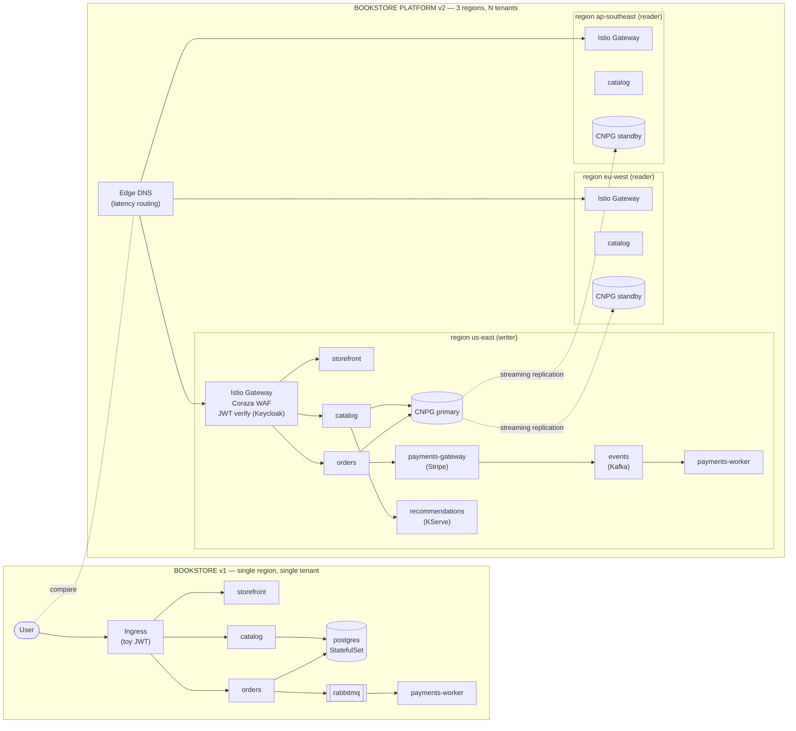

# 13.01 — Bookstore 2.0: from toy to platform

> What makes a production e-commerce platform on Kubernetes different from
> the threadable v1 we built across Parts 00 - 09, and how the next eleven
> chapters get us there.

**Estimated time:** ~30 min read · (no hands-on)
**Prerequisites:** [Part 09 ch.01](../09-end-to-end-bookstore/01-bookstore-end-to-end.md) — v1 Bookstore this chapter contrasts v2 with · [Part 11 ch.10](../11-advanced-production-patterns/10-platform-engineering.md) — platform-engineering frame v2 lives in
**You'll know after this:** • name the seven dimensions (tenancy, region, identity, search, payments, edge, ML, ops) where v2 leaves v1 · • articulate why v2 is structurally a different artifact, not "v1 with more features" · • map each Part 13 chapter onto a v2 dimension · • describe the bookstore-platform-v2 directory layout · • justify when v1's small-on-purpose shape is the right choice

<!-- tags: bookstore-v2, mental-model, capstone, platform-engineering -->

## Why this exists

Part 13 calls that production artifact Bookstore v2; this chapter explains
what v2 means and why it is a different kind of artifact than v1.

The Bookstore the guide built across Parts 00 - 12 is **the right teaching
artifact for everything in those parts**. It is small on purpose: four
services + three stateful backends + a 49-object Helm chart + three
Kustomize overlays (45 / 49 / 48). One service per concern. One DB. One
namespace. One region. A shared-HMAC toy JWT for "auth". A rule-based
"recommender". The whole thing fits in a `kind` cluster on a laptop and runs
the full Parts 00 - 09 narrative end-to-end without ever leaving that
laptop.

The v1 Bookstore is **not the production reality**. A real e-commerce
business running on Kubernetes today looks structurally different along
seven dimensions:

1. **Tenancy.** It is not one bookstore; it is N bookstores running on the
   same platform. Each is a tenant. Onboarding a new tenant has to be a
   one-line `kubectl apply`, not a runbook.
2. **Region.** It is not one region; it is three regions, active-active,
   because the customer is global and a region failure cannot be customer-
   visible for more than a few minutes.
3. **Identity.** It is not a shared HMAC; it is OIDC for humans and IRSA
   (or the GKE / AKS equivalent) for workloads, each verified by the mesh
   before downstream code sees a request.
4. **Delivery.** It is not a single Argo CD `Application`; it is an
   `ApplicationSet` fanning the platform across every regional cluster
   from a single source of truth.
5. **Data.** It is not one Postgres `StatefulSet`; it is a CloudNativePG
   cluster with a writer region and two streaming replicas, plus an outbox
   table to make payment events durable.
6. **ML.** It is not a rule-based recommender; it is a real loop —
   training Workflow at night, MLflow registry, KServe predictor with
   model canary, drift detector retraining on breach.
7. **Day-2.** It is not "the chapter ran"; it is a runbook the on-call
   engineer opens at 3am, a monthly chaos game-day, a quarterly DR drill,
   and a postmortem template.

Part 13 — twelve chapters — is the v2 platform that **actually has all
seven**, built as a sibling reference at
[`../examples/bookstore-platform/`](../examples/bookstore-platform/) so the
v1 Bookstore at [`../examples/bookstore/`](../examples/bookstore/) stays
exactly as Parts 00 - 12 left it (Helm 49, Kustomize 45 / 49 / 48, the
DB_DSN byte-identical) and the two can be read side by side. This chapter
opens that build. It is intentionally a brief — the eleven chapters that
follow each take ONE slice of the seven dimensions above and go deep; this
one establishes the contrast and the reading order.

> **In production:** The single biggest reason teams fail to migrate v1 to
> v2 is *trying to refactor v1 in place*. The 12-week pattern in the
> Production notes below ships v2 **alongside** v1, migrates capability by
> capability, and decommissions v1 last. Refactoring a live production
> Bookstore-shaped service into a multi-tenant, multi-region, real-auth
> platform without a parallel deploy is a multi-quarter scar-tissue
> exercise; building v2 next to it and cutting over is a multi-month one.

## Mental model

A **platform** is the ELEVEN models a v1 application chose not to have.
The gap between v1 and v2 is not a feature list; it is a discipline list
— each slice corresponds to a chapter, and the chapter answers one
question.

- **Tenancy model** ([13.02](02-tenancy-and-crossplane-onboarding.md)) —
  *who can run on the platform, and how do they get on?* v2 picks namespace-
  per-tenant + per-tenant cloud resources, expressed as a `BookstoreTenant`
  Crossplane Composition. Onboarding becomes one `kubectl apply` to a 15-
  line claim.
- **Regional model** ([13.03](03-multi-region-active-active.md)) — *what
  does "in production" mean when a region fails?* v2 runs three regions
  active-active; CloudNativePG handles cross-region replication; Argo CD
  ApplicationSet propagates the stack; DNS routes by latency and fails
  over.
- **Identity model** ([13.04](04-real-auth-keycloak-irsa-istio-jwt.md)) —
  *who is calling this API, and how do we trust them?* Two planes:
  Keycloak OIDC for humans, IRSA / Workload Identity for workloads, both
  verified at the Istio gateway.
- **Search and discovery model** (13.05, Phase 13b) — *how do users find
  books across millions of titles?* Meilisearch + Debezium CDC from
  Postgres. Per-tenant index isolation.
- **Payments and event-sourcing model** (13.06, Phase 13b) — *how do you
  take real money and survive partial failure?* Stripe sandbox + the
  outbox pattern + Kafka via Strimzi + idempotent payments-worker + saga
  compensation.
- **Edge model** (13.07, Phase 13b) — *what stands between the Internet and
  the platform?* Istio Gateway + Coraza WAF + per-tenant rate limiting.
- **ML model** (13.08, Phase 13b) — *how do you train, register, serve,
  detect drift on, and retrain a real model?* The full Argo Workflows ->
  MLflow -> KServe -> Alibi-Detect -> Argo Events loop.
- **Observability model** (13.09, Phase 13c) — *can you see what is
  happening?* OpenTelemetry traces + Tempo + Loki + Prometheus + Grafana,
  the full request flow tracked end-to-end.
- **Cost model** (13.10, Phase 13c) — *who is consuming what, and is the
  unit economics defensible?* OpenCost, per-tenant / per-region / per-
  workload-class. Budget alerts.
- **Developer model** (13.11, Phase 13c) — *how does a developer ship a
  new service on the platform without learning Crossplane / Argo CD /
  Istio?* Backstage scaffolder + software catalog + golden path.
- **Day-2 model** (13.12, Phase 13c) — *what does the on-call do when
  something breaks?* The runbook, the chaos game-day, the DR drill, the
  postmortem.

> The trap to keep in view: **v2 is not "v1 plus features"**. The v1
> Bookstore is already a working e-commerce app; you could add features to
> it indefinitely. v2 is **a different kind of artifact** — a platform — and
> the lesson of the chapters that follow is that the cost is in the
> eleven models above, not in any one of the features they support. The
> capability you gain from "real OIDC instead of toy JWT" is small; the
> capability you gain from having an identity *model* at all (humans vs
> workloads cleanly split; mesh-verified; rotatable; auditable) is the
> whole game.

## Diagrams

### Diagram A — v1 vs v2 at the service-architecture level (Mermaid)



### Diagram B — v1-vs-v2 capability matrix (ASCII)

```text
DIMENSION              BOOKSTORE v1                  BOOKSTORE PLATFORM v2
─────────────────────  ──────────────────────────    ────────────────────────────────────
Tenancy                single tenant                 N tenants (BookstoreTenant XR)
Onboarding             manual ns + RBAC + quota      one BookstoreTenant claim (13.02)
Region                 single region (kind)          3 regions active-active (13.03)
Data                   1 Postgres StatefulSet        CNPG primary + 2 streaming standbys
Cross-region failover  (none)                        promote standby + DNS flip <10 min
Auth — humans          shared-HMAC toy JWT           Keycloak OIDC, realm-per-tenant
Auth — workloads       (same JWT, kind hand-wave)    IRSA / Workload Identity (13.04)
Mesh JWT verify        (none)                        Istio RequestAuth + AuthZ (13.04)
Edge                   ingress-nginx                 Istio Gateway + Coraza WAF (13.07)
Rate limiting          (none)                        per-tenant Envoy local RL (13.07)
Search                 SQL LIKE                      Meilisearch + Debezium CDC (13.05)
Payments               RabbitMQ-only toy             Stripe sandbox + outbox + Kafka (13.06)
Event log              ephemeral RabbitMQ            Kafka topics (Strimzi); replayable
Recommender            rule-based                    KServe model + nightly retrain (13.08)
Drift detection        (none)                        Alibi-Detect + retrain on breach (13.08)
Tracing                (none)                        OTel + Tempo end-to-end (13.09)
Logging                stdout                        Loki, tenant-labelled (13.09)
Metrics                Prometheus + Grafana          + per-tenant dashboards (13.09)
Cost                   (none — single ns single tenant) OpenCost per-tenant/region (13.10)
Developer UX           kubectl apply by hand         Backstage scaffolder (13.11)
Day-2                  README                        runbook + DR drill + chaos (13.12)
GitOps                 one Application               ApplicationSet, Cluster generator
Hard invariant         Helm 49 / Kustomize 45/49/48  v1 invariants IMMUTABLE (v2 is additive-only)
```

## Hands-on with the Bookstore Platform

This chapter is the brief; no application workload lands yet. The hands-on
walks the [`examples/bookstore-platform/`](../examples/bookstore-platform/)
tree you will populate across Part 13 and stands up the three-region kind
topology that the rest of the part runs against.

### 0. The platform tree, walked

From the guide repo root:

```sh
ls examples/bookstore-platform/
```

You should see (the directories Phase 13a creates; the rest land in 13b/c
as stubs with READMEs that explain what fills them):

```text
README.md            ← platform overview, kind-runnable path, v1↔v2 thread
clusters/            ← three-region kind topology (13.01 / 13.03)
platform-base/       ← cluster-wide platform stack (namespaces, RBAC, priorities, Kueue)
kustomize/           ← base + per-region overlays
  base/
  regions/{us-east,eu-west,ap-southeast}/
argocd/              ← root ApplicationSet + Crossplane + Keycloak Applications
crossplane/          ← BookstoreTenant XRD + Composition + sample claim (13.02)
auth/                ← Keycloak realm + Istio RequestAuth + AuthZ + IRSA (13.04)
helm/                ← (Phase 13b) platform Helm umbrella chart
app/                 ← (Phase 13b) v2 service source
observability/       ← (Phase 13c)
cost/                ← (Phase 13c)
backstage/           ← (Phase 13c)
runbooks/            ← (Phase 13c)
```

Open the platform-level README:

```sh
cat examples/bookstore-platform/README.md
```

It states the v1-vs-v2 separation explicitly: the v1 Bookstore at
[`../bookstore/`](../examples/bookstore/) stays unchanged (the 49 / 45 / 49 /
48 invariants the rest of the guide depends on); v2 is a sibling reference
that may grow much larger without breaking those numbers.

### 1. Spin up the three-region kind topology

The platform runs as three regional clusters: `bookstore-platform-us-east`
(writer), `bookstore-platform-eu-west` (reader), and
`bookstore-platform-ap-southeast` (reader). The bootstrap script is
idempotent — re-run after `kind delete` and you get the same three clusters
back.

```sh
./examples/bookstore-platform/clusters/kind-3-region.sh
```

What it creates: three `kind` clusters, each with 1 control-plane + 2
workers, each carrying `topology.kubernetes.io/region` and
`bookstore-platform.example.com/role` node labels (`writer` for us-east,
`reader` for the other two). Distinct `apiServerPort`s (36443 / 36444 /
36445) so they coexist on one machine.

Confirm the contexts:

```sh
kubectl config get-contexts -o name | grep '^kind-bookstore-platform-'
```

Expected:

```text
kind-bookstore-platform-us-east
kind-bookstore-platform-eu-west
kind-bookstore-platform-ap-southeast
```

### 2. Apply the platform-base into each region

```sh
for ctx in \
  kind-bookstore-platform-us-east \
  kind-bookstore-platform-eu-west \
  kind-bookstore-platform-ap-southeast
do
  echo "=== $ctx ==="
  kubectl --context "$ctx" apply -f examples/bookstore-platform/platform-base/00-namespaces.yaml
  kubectl --context "$ctx" apply -f examples/bookstore-platform/platform-base/01-rbac.yaml
  kubectl --context "$ctx" apply -f examples/bookstore-platform/platform-base/02-priorityclasses.yaml
done
```

What landed in each cluster: three `bookstore-platform-*` namespaces (all
PSA `enforce: restricted`), three platform `ClusterRole`s (admin /
operator / tenant-admin), and seven `PriorityClass`es (the platform priority
ladder from data > edge > critical > async > ml-serving > batch > ml-batch).
Verify:

```sh
kubectl --context kind-bookstore-platform-us-east \
  get ns -l app.kubernetes.io/part-of=bookstore-platform
# NAME                          STATUS   AGE
# bookstore-platform            Active   30s
# bookstore-platform-ml         Active   30s
# bookstore-platform-system     Active   30s

kubectl --context kind-bookstore-platform-us-east \
  get clusterrole | grep bookstore-platform
# bookstore-platform-admin
# bookstore-platform-operator
# bookstore-platform-tenant-admin

kubectl --context kind-bookstore-platform-us-east \
  get priorityclass | grep bookstore-platform
# bookstore-platform-data           1000000
# bookstore-platform-edge            800000
# bookstore-platform-critical        100000
# bookstore-platform-async            50000
# bookstore-platform-ml-serving       10000
# bookstore-platform-batch             1000
# bookstore-platform-ml-batch           100
```

### 3. The kustomize render path (what Argo CD will apply)

The ApplicationSet you will use in [13.03](03-multi-region-active-active.md)
points each region's cluster at its matching overlay
(`examples/bookstore-platform/kustomize/regions/<REGION>`). Each overlay
inherits the base (the same 13 cluster-wide objects you just applied) and
adds a region label + a `cnpg-primary` annotation + a regional DNS-hostname
annotation. From the repo root:

```sh
kubectl kustomize examples/bookstore-platform/kustomize/base | grep -c '^kind:'
# 13

kubectl kustomize examples/bookstore-platform/kustomize/regions/us-east | grep -c '^kind:'
# 13

kubectl kustomize examples/bookstore-platform/kustomize/regions/eu-west | grep -c '^kind:'
# 13

kubectl kustomize examples/bookstore-platform/kustomize/regions/ap-southeast | grep -c '^kind:'
# 13
```

The 13 is by design: 3 namespaces + 3 ClusterRoles + 7 PriorityClasses. The
overlays don't change the object set — only labels and annotations. That is
the discipline: region overlays should be small.

### 4. Confirm v1 is still byte-identical (the "we didn't break the v1" check)

The v1 Bookstore at [`../examples/bookstore/`](../examples/bookstore/) is
explicitly out of scope for Part 13. The hard invariants the rest of the
guide leans on (Helm 49 / Kustomize 45 / 49 / 48 / `helm lint` zero-failed)
have to remain true after every Part 13 phase. Re-prove them:

```sh
helm lint examples/bookstore/helm/bookstore
# ==> Linting examples/bookstore/helm/bookstore
# 1 chart(s) linted, 0 chart(s) failed

helm template examples/bookstore/helm/bookstore \
  | kubectl apply --dry-run=client -f - | grep -cE '(configured|created)'
# 49

kubectl kustomize examples/bookstore/kustomize/overlays/dev     | grep -c '^kind:'   # 45
kubectl kustomize examples/bookstore/kustomize/overlays/staging | grep -c '^kind:'   # 49
kubectl kustomize examples/bookstore/kustomize/overlays/prod    | grep -c '^kind:'   # 48
```

If any of those numbers drift in your tree, the v1 invariant is broken;
back out whatever changed. The v2 tree is large; the v1 tree is fixed.

### 5. What is intentionally absent

You can `kubectl get pods -A | grep bookstore-platform-` and see **zero
pods**. That is correct. Phase 13a builds the *frame* the platform runs in;
the workloads land in Phase 13b. The next three chapters keep this
discipline:

- [13.02](02-tenancy-and-crossplane-onboarding.md) adds Crossplane + the
  `BookstoreTenant` Composition + the first sample tenant — still no app
  workloads, but the per-tenant namespace + RBAC + Quota + NetworkPolicy +
  Kueue queue exist after one `kubectl apply`.
- [13.03](03-multi-region-active-active.md) installs Argo CD on the
  management cluster, registers all three regions, applies the
  ApplicationSet, walks the DR drill (which on kind is `kind delete
  cluster --name bookstore-platform-us-east` + a documented promotion).
- [13.04](04-real-auth-keycloak-irsa-istio-jwt.md) installs Keycloak + Istio
  + applies the request-authentication / authorization-policy pair, with a
  curl test that proves 401 -> 200 once you have a valid token.

Phase 13b's first chapter (13.05) is the first place app workloads land.

> **In production:** Kind is the local stand-in for the real platform —
> the real platform is three managed Kubernetes clusters (EKS / GKE / AKS)
> in three real regions, each in its own VPC with cloud-managed control
> plane, real DNS, real cloud LB, and real cross-region streaming
> replication subject to real network latency. This phase's chapter
> hands-on sections cover the local path; each `## Production notes`
> section calls out what changes on the cloud path. There is no
> kind-vs-cloud feature flag in source — the YAML is the same; the
> environment is different.

## How it works under the hood

What "production-shape" actually means here is **discipline that carries
across every chapter**. Three pieces, each grounded in earlier Parts:

- **PSA `restricted` everywhere.** Every namespace the platform owns —
  cluster-wide `bookstore-platform-*` and per-tenant
  `bookstore-platform-<TENANT>` — carries the three Pod Security Admission
  labels (`enforce: restricted` + `audit: restricted` + `warn: restricted`),
  pinned to `latest`. Every Pod template the platform ships satisfies it
  (`runAsNonRoot: true`, non-root `runAsUser`, `seccompProfile:
  RuntimeDefault`, container `allowPrivilegeEscalation: false`,
  `capabilities.drop: [ALL]`, `readOnlyRootFilesystem: true` where feasible
  + `emptyDir` for writable caches). This is Part 05 ch.02 carried to the
  platform layer; the v1 Bookstore established it, v2 inherits it. No
  privileged workload, no exceptions.
- **Pinned-Helm installs into their own namespaces.** Every system operator
  (Crossplane, Keycloak, Istio, KServe, Strimzi, ESO, Tempo, Loki,
  OpenCost, Backstage, Chaos Mesh) installs via a pinned-version Helm
  chart into a dedicated namespace. **Never**
  `kubectl apply -f .../releases/latest/download/<PINNED-FILE>.yaml` (it
  404s when a release ships and silently breaks reproducibility); always
  `helm install … --version "$<TOOL>_CHART_VERSION"`. The
  [`../examples/bookstore-platform/argocd/`](../examples/bookstore-platform/argocd/)
  Applications encode this — `application-keycloak.yaml` pins
  `21.4.4`, `application-crossplane.yaml` pins `1.17.0`. The same lesson
  Part 07 ch.01 / ch.04 taught for the v1 Bookstore.
- **Signed images via cosign, supply-chain CI, and per-tenant cost.**
  Part 05 ch.03 introduced cosign + Kyverno `verifyImages`; the platform's
  CI signs every image at build time, and a `bookstore-platform-` cluster-
  wide Kyverno policy enforces signature presence on every Pod. Per-tenant
  cost is OpenCost (Phase 13c) labelled by the tenant label the Crossplane
  Composition stamps. Real SLOs that page (latency / availability /
  error-budget burn rate) are Part 06 ch.01 deepened in 13.09 —
  Alertmanager routes by tenant + region + severity, not "everyone gets
  the same page".

The v1 -> v2 gap is not these capabilities in isolation; v1 has every one
of them as a *chapter example*. The gap is **applying them all, uniformly,
with no exceptions, across every namespace, in every region, on every
pull request, on every deploy**. That is the production-shape discipline,
and it is what the rest of Part 13 demonstrates.

## Production notes

> **In production:** The 12-week migration plan for an existing v1-shape
> service to v2-shape is one of the most well-trodden paths in cloud-
> native operations. The pattern:
>
> | Week | Deliverable | Cutover risk |
> |------|-------------|--------------|
> | 1 - 2 | v2 platform stood up in a separate cluster; v1 stays in production untouched. | None — read-only build-out. |
> | 3 - 4 | Tenancy + identity wired (13.02 + 13.04). A test tenant onboarded; no real traffic. | None. |
> | 5 - 6 | Multi-region (13.03). v2 catalog read-only; serves a slice of read traffic via an explicit feature flag in v1's storefront. | Low — read-only mirror. |
> | 7 - 8 | Search + payments (13.05 + 13.06). Outbox starts shadowing v1's RabbitMQ; reconcile job verifies no event drops. | Medium — write-path is mirrored, not yet authoritative. |
> | 9 - 10 | ML loop (13.08). Recommender starts serving in shadow mode. Drift detector + retrain wired. | Low — recommender is non-blocking. |
> | 11 | Cutover plan: v2 becomes the writer; v1 reads from the shared CNPG. Stripe webhooks point at v2. Observability cross-confirms parity. | High — this is the cutover. |
> | 12 | Decommission v1. Postmortem. | Low — v2 has been authoritative for a week. |
>
> The "Big Bang" alternative — refactor v1 in place to v2 — typically
> stretches 6 - 9 months, ends mid-refactor with a hybrid that ships no
> features for a quarter, and leaves the team unable to roll back. The
> parallel-deploy + capability-by-capability migration is slower-feeling
> but durably finishes.

> **In production:** The **platform-team vs feature-team** boundary
> ([Part 11 ch.10](../11-advanced-production-patterns/10-platform-engineering.md))
> shows up here for real. Platform team owns `clusters/`, `platform-base/`,
> `crossplane/`, `argocd/`, `auth/`, `observability/`, `cost/`,
> `backstage/`. Feature team owns its tenant's `app/`. The
> `bookstore-platform-tenant-admin` ClusterRole in `01-rbac.yaml` is the
> binding surface: a feature-team identity (Keycloak group, OIDC group
> claim) bound to that ClusterRole inside its tenant ns gets full control
> of the ns — and nothing outside. That is the guardrail the Crossplane
> Composition enforces by construction; it is the same Part 11 ch.10
> "paved road" lesson scaled to a multi-tenant SaaS.

> **In production:** The honest cost of v2 vs v1, at the order of magnitude
> a real team should plan for:
>
> - **Compute.** Three regions ≈ 3× single-region cost. Karpenter / Cluster
>   Autoscaler (Part 10 ch.06) absorbs some of that via spot, but the
>   floor is multi-region for stateful workloads.
> - **Data egress.** Cross-region streaming replication and S3 cross-
>   region asset replication add 5 - 15 % to monthly cloud bills on real
>   traffic shapes. Budget for it.
> - **Engineering time.** Supply-chain CI (signed images + SBOM + policy
>   verification + admission webhooks) adds ~5 % to per-PR build time.
>   Worth it; budget for it.
> - **Operational time.** The minimum viable platform team at three-region,
>   multi-tenant SaaS scale is four engineers; below that, incidents
>   consume all capacity and no new capabilities ship.

> **In production:** Things v2 does NOT change from v1, and it is worth
> being clear about. The Bookstore application *code* is the same shape:
> a Go HTTP handler reading from Postgres still looks like a Go HTTP
> handler reading from Postgres. v2 wraps it in more boundaries (tenant ns
> + mesh + OIDC + outbox + observability), but the catalog service did
> not have to be rewritten in Rust to become "production". Resist
> rewrites that v2 doesn't demand.

## Quick Reference

```sh
# Spin up the three-region local topology (Phase 13a hands-on)
./examples/bookstore-platform/clusters/kind-3-region.sh

# Apply the platform-base into each region
for ctx in \
  kind-bookstore-platform-us-east \
  kind-bookstore-platform-eu-west \
  kind-bookstore-platform-ap-southeast
do
  kubectl --context "$ctx" apply -f examples/bookstore-platform/platform-base/00-namespaces.yaml
  kubectl --context "$ctx" apply -f examples/bookstore-platform/platform-base/01-rbac.yaml
  kubectl --context "$ctx" apply -f examples/bookstore-platform/platform-base/02-priorityclasses.yaml
done

# Render the per-region overlay (what Argo CD will apply once 13.03 wires it)
kubectl kustomize examples/bookstore-platform/kustomize/regions/us-east

# Re-prove v1 invariants (after every Part 13 phase)
helm lint examples/bookstore/helm/bookstore
helm template examples/bookstore/helm/bookstore \
  | kubectl apply --dry-run=client -f - | grep -cE '(configured|created)'   # 49
kubectl kustomize examples/bookstore/kustomize/overlays/dev     | grep -c '^kind:'   # 45
kubectl kustomize examples/bookstore/kustomize/overlays/staging | grep -c '^kind:'   # 49
kubectl kustomize examples/bookstore/kustomize/overlays/prod    | grep -c '^kind:'   # 48
```

Minimal skeleton — the root ApplicationSet template (sketch; the full
manifest lives at
[`../examples/bookstore-platform/argocd/applicationset-platform.yaml`](../examples/bookstore-platform/argocd/applicationset-platform.yaml)):

```yaml
apiVersion: argoproj.io/v1alpha1
kind: ApplicationSet
metadata:
  name: platform-base
  namespace: argocd
spec:
  generators:
    - clusters:
        selector:
          matchLabels:
            argocd.argoproj.io/secret-type: cluster
        values:
          region: "{{ index .metadata.labels \"bookstore-platform.example.com/region\" }}"
  template:
    metadata:
      name: "platform-base-{{ .values.region }}"
    spec:
      project: default
      source:
        repoURL: "https://github.com/<ORG>/<REPO>"
        targetRevision: main
        path: "full-guide/examples/bookstore-platform/kustomize/regions/{{ .values.region }}"
      destination:
        name: "{{ .name }}"
      syncPolicy:
        automated: { prune: true, selfHeal: true }
```

Readiness checklist (Phase 13a complete when all four are yes):

- [ ] Three `kind-bookstore-platform-*` contexts exist (`kubectl config
      get-contexts | grep bookstore-platform`).
- [ ] Each region renders the platform-base kustomize overlay to 13 objects
      (`kubectl kustomize examples/bookstore-platform/kustomize/regions/<REGION> | grep -c '^kind:'`).
- [ ] `helm lint examples/bookstore/helm/bookstore` reports 0 failed and
      the helm template still produces 49 objects (v1 invariant intact).
- [ ] The four chapter files in
      `13-grand-capstone-bookstore-platform/0{1,2,3,4}-*.md` exist with
      the full 9-section anatomy.

## Test your understanding

> Try each before opening the answer drawer. The act of trying is the exercise; the answer is the check.

1. **Name three things that make Bookstore v2 a "different artifact" rather than "v1 with more features."**
   <details><summary>Show answer</summary>

   (1) **Multi-tenancy** — v1 is single-tenant in one namespace; v2 is N tenants, each with their own data, identity, quotas, and dashboards. Adding a "tenant_id" column to v1's tables wouldn't fix the cross-tenant access, identity, cost-allocation, or blast-radius story. (2) **Multi-region active-active** — v1 runs in one cluster; v2 runs in three regions with cross-region Postgres replication, DNS failover, and an SLO that survives region loss. (3) **Real auth + edge + observability + ML loop + payments-with-saga + cost-visibility** — each of these is a chapter's worth of new infrastructure, not a code change. The total surface is qualitatively bigger and operationally different.

   </details>

2. **The chapter argues v1's "small-on-purpose shape" is right for some teams. When is that?**
   <details><summary>Show answer</summary>

   When (a) you have one customer or one team, (b) you don't have regulatory pressure for data residency or audit, (c) the cost of one region's downtime is acceptable, (d) you have a small engineering team that can't sustain the operational burden of v2's infrastructure. v1 is the right *learning* artifact and a legitimate *production* shape for many startups. The mistake is building v2's complexity preemptively — sometimes called "premature platform" — before the org has the scale or pain to justify it. Build v1 first; let real pain pull you toward v2.

   </details>

3. **Map each Part 13 chapter to one of the seven v2 dimensions (tenancy, region, identity, search, payments, edge, ML, ops).**
   <details><summary>Show answer</summary>

   ch.02 → tenancy. ch.03 → region. ch.04 → identity. ch.05 → search. ch.06 → payments. ch.07 → edge. ch.08 → ML. ch.09 → ops (observability). ch.10 → ops (cost). ch.11 → ops (developer portal). ch.12 → ops (day-2). The mapping shows ops is the largest dimension because each capability needs an operational story — dashboards, on-call, runbook, DR drill, cost-attribution — beyond the capability itself.

   </details>

4. **Hands-on: render the `bookstore-platform` kustomize overlay for one region and count the objects. Compare to v1's 49. What's the rough delta and what does it tell you?**
   <details><summary>What you should see</summary>

   v2 has on the order of 80-150 objects per region (depending on which chapters' infra is enabled): Crossplane XRDs, ApplicationSets, Istio Gateway + WAF, Keycloak, Strimzi Kafka, MLflow, KServe, Backstage, OpenCost. The delta tells you (a) v2 is structurally larger and (b) most new objects are CRDs from operators — the cluster's "API surface" has grown, not just its workload count. This is platform engineering: more objects, but each managed by an operator the platform team owns.

   </details>

## Further reading

- **Rosso et al., _Production Kubernetes_, ch.6 — "Application Cluster
  Topology"** and **ch.16 — "Platform Abstractions"** — the cluster-as-
  product pattern this part scales up to multi-tenant SaaS, and the
  guardrail-by-construction discipline 13.02 onward enforces.
- **Ibryam & Huß, _Kubernetes Patterns_ 2e — *Service Discovery* (ch.13)**
  and **_Sidecar_ (ch.16)** — the pattern vocabulary the multi-service,
  mesh-enrolled v2 platform speaks in.
- Official: **Google Cloud Architecture Center — _Multi-region application
  architecture_** <https://cloud.google.com/architecture/multi-region-app-architecture>;
  **Kubernetes Multi-tenancy WG documentation**
  <https://github.com/kubernetes-sigs/multi-tenancy>; the **Team Topologies
  book site** <https://teamtopologies.com/key-concepts> for the
  platform-team-vs-stream-team boundary.
