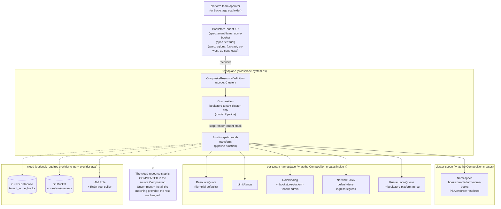

# 13.02 — Tenancy model and onboarding via Crossplane

> A bookstore owner is a tenant; onboarding a new tenant is a Crossplane
> Composition apply.

**Estimated time:** ~45 min read · half-day hands-on
**Prerequisites:** [Part 11 ch.10](../11-advanced-production-patterns/10-platform-engineering.md) — Crossplane XRD/Composition/Claim model · [Part 08 ch.04](../08-day-2-operations/04-multi-tenancy-and-namespaces.md) — namespace-as-tenant pattern this chapter productises · [Part 13 ch.01](01-bookstore-2-from-toy-to-platform.md) — v2 framing this chapter starts from
**You'll know after this:** • compare the four tenancy shapes (namespace / cluster / vCluster / hybrid) on isolation + blast + cost · • author a Crossplane XRD + Composition that onboards a tenant in one apply · • design the per-tenant namespace bundle (RBAC + Quota + NetworkPolicy + PSA labels) · • wire tenant onboarding into a Backstage software template · • plan tenant offboarding without orphaning resources

<!-- tags: bookstore-v2, multi-tenancy, crossplane, platform-engineering -->

## Why this exists

Multi-tenancy is the **first dimension the platform has to pick** because
every other dimension (region, identity, observability, cost) attaches to
it. Get tenancy wrong and you spend the next year fixing the joins.

There are four popular shapes for Kubernetes multi-tenancy:

| Shape | Isolation | Blast radius | Cost | When it wins |
|-------|-----------|--------------|------|--------------|
| Namespace-per-tenant | Soft (PSA + NetPol + RBAC + Quota) | One ns | Lowest | SaaS with similar-shape workloads (this is us) |
| Virtual cluster (vcluster) | Stronger (own API server) | One vcluster | Higher | Tenants need cluster-admin |
| Cluster-per-tenant | Hardest (own control plane) | One cluster | Highest | Regulatory / security boundary |
| Hybrid | Mixed | Mixed | Mixed | Large customer mixed with small |

The Bookstore Platform v2 picks **namespace-per-tenant + per-tenant cloud
resources**, because every tenant is the same shape (a customer running a
bookstore on top of our platform) and the cost / blast-radius tradeoff is
the one a real SaaS makes. The hard part is **not the namespace** — the v1
Bookstore showed in Part 08 ch.04 how to stamp a namespace with PSA + RBAC
+ Quota + NetPol. The hard part is **the cloud resources that have to land
atomically with the namespace** — a per-tenant logical Postgres database, a
per-tenant S3 bucket for assets, an IRSA role + trust policy bound to the
tenant's catalog ServiceAccount, an Argo Workflow scaffold, a Backstage
catalog entry. They all need to exist; they all need to come up together;
they all need to come down together; and the onboarding has to be one
`kubectl apply`, not a runbook.

That is what **Crossplane Composition** is for. The Composition is the
recipe; the developer-experience surface (a Backstage form, an `argocd
app create`, a `kubectl apply` of a 15-line claim) creates the high-level
API; Crossplane reconciles.

> **In production:** This chapter and Part 11 ch.02 ("Operator
> development") deliberately share the name `BookstoreTenant`. They are
> two different artifacts solving the same surface in two different
> shapes — the trade-off is laid out in *Mental model* below. Both
> approaches work; the platform v2 picks Composition because the work is
> mostly "stamp these primitives", not "reconcile a custom state machine".

## Mental model

**A tenant is not a namespace; it is the *fan-out* of one developer-
experience surface (one BookstoreTenant claim) into the full per-tenant
stack — namespace + Kueue + Quota + LimitRange + NetworkPolicy +
**per-tenant Kyverno policy assignment** + per-tenant Postgres + S3 +
IRSA + Argo Workflow scaffold + Backstage catalog entry. The Composition
is the recipe; the claim is the input; Crossplane is the reconciler.**

- **Onboarding is one apply.** A new customer becomes a 15-line
  `BookstoreTenant` claim. Apply; a minute later the per-tenant stack
  exists. Delete; a minute later it is gone. No runbook. No ticket. No
  "you also have to remember to add the NetworkPolicy" — the Composition
  is the only producer.
- **Composition vs operator — the explicit trade.** Part 11 ch.02 shipped a
  Kubebuilder operator for the same surface. When does each win?
  - **Operator wins** when the reconciliation is **imperative**: when the
    business logic has steps (a saga across systems, a state machine with
    failure / retry / compensation, a controller that needs to call a
    third-party API). The v1 Bookstore's `BookstoreTenant` operator did
    almost no business logic so it under-paid for the operator framework;
    a real BookstoreTenant operator that orchestrates Stripe customer
    creation + tenant database migration + Backstage catalog registration
    is a justifiable operator.
  - **Composition wins** when the desired state is a **composition of
    pre-existing primitives** — the namespace, the Quota, the NetPol, the
    RBAC, the Kueue queue, the cloud DB CR, the cloud bucket CR. No
    state machine; just "these objects exist together, named per the
    tenant". The platform v2 picks Composition for onboarding because
    99 % of "create a tenant" is exactly that. If a future iteration adds
    real saga logic (cross-system rollback on partial failure), that
    saga becomes an operator that *creates the BookstoreTenant claim* —
    composing both patterns rather than replacing one with the other.
- **Cluster-scoped XR vs namespaced XR — the deliberate trade.** Part 11
  ch.10 used a `scope: Namespaced` XR for `BookstoreEnvironment`. The v2
  `BookstoreTenant` uses `scope: Cluster` and we are explicit about why:
  a namespaced XR cannot own a cluster-scoped Namespace via
  `ownerReferences`, so deleting the XR **leaks the per-tenant
  namespace**. Cluster scope plus an explicit finalizer cleans up
  correctly. This is the same namespace-leak footgun Part 11 ch.02
  documented honestly; here we pick the scope that avoids it.
- **Cluster-only path is fully kind-runnable; cloud-resource path is
  documented + commented.** The Composition stamps Namespace + Quota +
  LimitRange + RoleBinding + NetPol + Kueue LocalQueue on any cluster
  with Crossplane + provider-kubernetes + function-patch-and-transform
  installed. The cloud-resource path (CNPG `Database`, S3 `Bucket`, IAM
  `Role`) is sketched + commented in the same Composition; it activates
  when the respective provider Crossplane provider is installed
  ([Part 10 ch.03](../10-cloud-and-managed-kubernetes/03-cloud-identity.md))
  for the IRSA piece). On kind the chapter walks the cluster-only path
  end-to-end; the cloud path is a strict superset and the YAML difference
  is explicit. The Composition also stamps a `ClusterPolicy` reference
  (or `Policy` per-tenant) to enforce image-signature verification on
  the tenant's namespace. Phase 13b adds the actual Kyverno install +
  policy bundle; the Composition's policy reference is wired today but
  inert until Kyverno installs.
- **The Backstage scaffolder is the developer-facing input.** A platform
  team running `kubectl apply -f tenant-claim.yaml` is fine for week 1.
  By month 3 the tenant-onboarding form is a Backstage scaffolder
  template (13.11) that *generates* the claim + opens a PR — same paved
  road, prettier door. This chapter writes the Workflow that the
  scaffolder will eventually call; the actual Backstage install lives in
  13.11.

The trap to keep in view: **the BookstoreTenant API is the platform's
public face**. Every field is a permanent commitment — once `tier:
[trial, standard, premium]` is shipped, you cannot remove `trial` without
a CRD conversion webhook (Part 11 ch.02). Design it small. The XRD ships
six spec fields total; add the seventh only when a real tenant asked for
it.

## Diagrams

### Diagram A — Composition resolution chain (Mermaid)



### Diagram B — tenant resource matrix (ASCII)

```text
RESOURCE                CLUSTER-SCOPED?   PER-TENANT?   RECONCILER             KIND-RUNNABLE?
──────────────────────  ───────────────   ───────────   ────────────────────   ──────────────
BookstoreTenant XR      Yes               Yes (one)     Crossplane core        Yes
Namespace               Yes               Yes           provider-kubernetes    Yes
ResourceQuota           No                Yes           provider-kubernetes    Yes
LimitRange              No                Yes           provider-kubernetes    Yes
RoleBinding             No                Yes           provider-kubernetes    Yes
NetworkPolicy           No                Yes           provider-kubernetes    Yes
Kueue LocalQueue        No                Yes           provider-kubernetes    Yes (Kueue installed)
ClusterQueue            Yes               No (shared)   Kueue                  Yes (platform-base/03-)
ClusterRole tenant-admin Yes              No (shared)   kube-rbac              Yes (platform-base/01-)
CNPG Database           No                Yes           provider-cnpg          No (needs cloud)
S3 Bucket               Yes               Yes (one)     provider-aws           No (needs cloud)
IAM Role + trust policy Yes               Yes (one)     provider-aws           No (needs cloud)
Backstage CatalogInfo   No                Yes           Backstage scaffolder   No (Phase 13c install)
```

## Hands-on with the Bookstore Platform

This chapter assumes the three regions from
[13.01](01-bookstore-2-from-toy-to-platform.md) are up (you can run the
hands-on against just the us-east cluster for the install steps; the
ApplicationSet in 13.03 fans the Composition out to all three).

### 1. Install Crossplane (pinned-Helm, own namespace)

The Crossplane install pattern + provider-kubernetes + function-patch-and-
transform are taught in detail in
[Part 11 ch.10](../11-advanced-production-patterns/10-platform-engineering.md).
This chapter does not repeat that material; it pins the versions and runs
the install. Use the management cluster (us-east) — Crossplane runs there
and reconciles into all three regions via provider-kubernetes' `kubeconfig`
ProviderConfigs (a configuration the chapter sketches but defers to 13.03
for the multi-cluster fan-out).

```sh
kubectl config use-context kind-bookstore-platform-us-east

# Pinned versions — bump deliberately, not silently.
CROSSPLANE_CHART_VERSION="1.17.0"
PROV_KUBERNETES_VERSION="v0.13.0"
FN_PT_VERSION="v0.8.2"  # pin (matches Part 11 ch.10 — X2c)

helm repo add crossplane-stable https://charts.crossplane.io/stable
helm install crossplane crossplane-stable/crossplane \
  --version "$CROSSPLANE_CHART_VERSION" \
  -n crossplane-system --create-namespace --wait

# provider-kubernetes — lets the Composition manage in-cluster objects.
kubectl apply -f - <<EOF
apiVersion: pkg.crossplane.io/v1
kind: Provider
metadata: { name: provider-kubernetes }
spec:
  package: xpkg.crossplane.io/crossplane-contrib/provider-kubernetes:${PROV_KUBERNETES_VERSION}
EOF
kubectl wait --for=condition=Healthy provider/provider-kubernetes --timeout=300s

# function-patch-and-transform — the pipeline function the Composition uses.
# WITHOUT it Healthy, the Composition's functionRef silently never runs and
# the XR sits SYNCED/READY=False forever — the #1 Crossplane footgun.
kubectl apply -f - <<EOF
apiVersion: pkg.crossplane.io/v1
kind: Function
metadata: { name: function-patch-and-transform }
spec:
  package: xpkg.crossplane.io/crossplane-contrib/function-patch-and-transform:${FN_PT_VERSION}
EOF
kubectl wait --for=condition=Healthy function/function-patch-and-transform --timeout=180s

# Bind provider-kubernetes to a ProviderConfig that uses the provider's own
# in-cluster identity (its ServiceAccount). Then grant that SA the RBAC the
# Composition needs (least-privilege; only the kinds the Composition stamps).
kubectl apply -f - <<EOF
apiVersion: kubernetes.crossplane.io/v1alpha1
kind: ProviderConfig
metadata: { name: default }
spec:
  credentials: { source: InjectedIdentity }
EOF

PROV_SA=$(kubectl -n crossplane-system get sa \
  -l pkg.crossplane.io/provider=provider-kubernetes \
  -o jsonpath='{.items[0].metadata.name}')

kubectl apply -f - <<EOF
apiVersion: rbac.authorization.k8s.io/v1
kind: ClusterRoleBinding
metadata: { name: bookstore-platform-provider-kubernetes }
roleRef:
  apiGroup: rbac.authorization.k8s.io
  kind: ClusterRole
  name: cluster-admin   # scope this DOWN in production — see Production notes
subjects:
  - kind: ServiceAccount
    name: ${PROV_SA}
    namespace: crossplane-system
EOF
```

> **In production:** the `cluster-admin` ClusterRoleBinding above is the
> "make the demo work" wiring. The Production notes section below
> details how to scope it down to exactly the kinds the Composition stamps
> (Namespace, ResourceQuota, LimitRange, RoleBinding, NetworkPolicy,
> LocalQueue) — the least-privilege Part 05 ch.01 lesson applied to the
> Crossplane provider's identity.

### 2. Apply the XRD + Composition

```sh
kubectl apply -f examples/bookstore-platform/crossplane/xrd-bookstoretenant.yaml
kubectl wait --for=condition=Established \
  crd/bookstoretenants.platform.bookstore.example.com --timeout=120s

kubectl apply -f examples/bookstore-platform/crossplane/composition-bookstoretenant.yaml
```

Verify the new API is served:

```sh
kubectl api-resources --api-group=platform.bookstore.example.com
# NAME              SHORTNAMES   APIVERSION                                  NAMESPACED   KIND
# bookstoretenants               platform.bookstore.example.com/v1alpha1     false        BookstoreTenant
```

### 3. Apply the sample BookstoreTenant claim

```sh
kubectl apply -f examples/bookstore-platform/crossplane/sample-claim-acme-books.yaml
```

A minute or so later (Crossplane's default poll interval is 60 s on first
reconcile), check the XR:

```sh
kubectl get bookstoretenant acme-books
# NAME         SYNCED   READY   COMPOSITION                      AGE
# acme-books   True     True    bookstore-tenant-cluster-only    90s
```

And the per-tenant stack:

```sh
kubectl get ns bookstore-platform-acme-books -o jsonpath='{.metadata.labels}' \
  | tr ',' '\n'
# pod-security.kubernetes.io/enforce: restricted
# pod-security.kubernetes.io/audit: restricted
# pod-security.kubernetes.io/warn: restricted
# bookstore-platform.example.com/tenant: acme-books
# ...

kubectl get resourcequota,limitrange,rolebinding,networkpolicy,localqueue \
  -n bookstore-platform-acme-books
# resourcequota/bookstore-tenant     ...
# limitrange/bookstore-tenant        ...
# rolebinding/bookstore-tenant-admin ...
# networkpolicy/default-deny         ...
# localqueue/tenant-ml               ...
```

That is the platform's tenancy boundary, stood up from a 15-line claim.

### 4. Prove self-healing — delete a piece, watch it come back

The "operator pattern, generalised" lesson: each composed object is owned
by Crossplane via a provider-kubernetes `Object` CR, and the provider
reconciles continuously. Delete the NetworkPolicy by hand:

```sh
kubectl delete networkpolicy default-deny -n bookstore-platform-acme-books
sleep 30
kubectl get networkpolicy -n bookstore-platform-acme-books
# default-deny exists again — Crossplane recreated it.
```

Same is true for the Quota, the RoleBinding, the LimitRange — the
Composition is the only producer; drift heals automatically.

### 5. The Backstage scaffolder hook (Workflow Template; install lives in 13.11)

Backstage runs in 13.11. Phase 13a writes the **Argo Workflow Template**
that Backstage's scaffolder will eventually call when a developer fills the
"onboard a tenant" form. The Workflow generates the
`BookstoreTenant` YAML and (on a real install) opens a PR against the
platform's Git repo. On kind without Backstage, you can apply the
WorkflowTemplate now; it sits ready until 13.11 installs the scaffolder.

The WorkflowTemplate itself is scaffolded under `examples/bookstore-
platform/backstage/` in Phase 13c (intentionally not in Phase 13a — it
needs Argo Workflows installed, which lands in 13.08). The hook *shape*:

```yaml
# Sketch — full template in examples/bookstore-platform/backstage/ (Phase 13c).
apiVersion: argoproj.io/v1alpha1
kind: WorkflowTemplate
metadata:
  name: onboard-bookstore-tenant
  namespace: argo
spec:
  entrypoint: onboard
  arguments:
    parameters:
      - { name: tenantName }
      - { name: displayName }
      - { name: tier, default: trial }
  templates:
    - name: onboard
      steps:
        - - { name: render-claim, template: render-tenant-claim }
        - - { name: open-pr,      template: open-platform-pr }
        - - { name: notify,       template: notify-backstage-catalog }
```

### 6. Delete the tenant (proving the finalizer + cluster-scope decision)

The reason the XRD picked `scope: Cluster` is exactly this step:

```sh
kubectl delete bookstoretenant acme-books
# bookstoretenant.platform.bookstore.example.com "acme-books" deleted
sleep 60
kubectl get ns bookstore-platform-acme-books
# Error from server (NotFound): namespaces "bookstore-platform-acme-books"
```

Compare with the *namespaced-XR* shape of Part 11 ch.10's
`BookstoreEnvironment`: deleting that XR leaves the per-tenant namespace
behind (a namespaced parent cannot own a cluster-scoped Namespace via
`ownerReferences`; the GC ignores it). Part 11 ch.02 documented this
honestly as a finalizer footgun; cluster-scope avoids it by construction.

> **In production:** the namespace deletion above is *immediate* in this
> demo. Real-world tenant deletion is **24-hour soft-delete + actual
> delete + audit log**. The Composition would add a deletion annotation
> at delete-request time, hold for 24 hours, then a separate controller
> (or a `kubectl` cron) performs the actual delete. The shape is the
> standard SaaS retention pattern; the Production notes section details
> it.

## How it works under the hood

**XRD -> Composition reconciliation.** When a `BookstoreTenant` claim
lands, Crossplane core picks it up, looks up the XRD
(`bookstoretenants.platform.bookstore.example.com`), finds the matching
Composition (compositeTypeRef.apiVersion + .kind matches), runs the
Composition's pipeline. The pipeline mode in v2 is `Pipeline` (the older
inline `spec.resources` is deprecated); each step's `functionRef` invokes a
Composition Function. `function-patch-and-transform` is the standard
"render these resources, patch with these field paths" function; richer
functions exist (function-kcl, function-go-templating) for cases where
patch-and-transform's expressiveness is the bottleneck.

**Function-patch-and-transform pipeline.** The input is a `Resources`
spec — a list of base manifests + per-base `patches`. Each patch has a
`fromFieldPath` (read from the XR's spec) and a `toFieldPath` (write into
the base manifest), optionally with a string-format `transforms` chain
(`fmt: "bookstore-platform-%s"`). The output is the rendered list of
composed resources; Crossplane creates them (via provider-kubernetes for
in-cluster objects, via provider-aws / -cnpg / etc. for cloud objects).

**The namespace-leak footgun, explained.** A Kubernetes `Namespace` is
cluster-scoped. Kubernetes garbage-collects objects via `ownerReferences`:
delete the owner, GC removes the owned objects. But an `ownerReference`
**cannot point from a cluster-scoped object to a namespaced parent** (and
even namespaced -> cluster-scoped does not GC the cluster-scoped resource —
the cluster-scoped object survives). A namespaced XR therefore cannot own
its created Namespace via `ownerReferences`; delete the XR and the
Namespace persists. The Part 11 ch.10 `BookstoreEnvironment` (namespaced
XR) hits this; Part 11 ch.02's operator hits the same shape ("the operator's
finalizer doesn't delete the namespace by design" — documented honestly
there). The v2 `BookstoreTenant` picks `scope: Cluster` so the XR is a
cluster-scoped object and can own a Namespace via `ownerReferences`
cleanly. (Alternative: namespaced XR + explicit finalizer that deletes the
Namespace when the XR is being deleted. Equally valid; one more moving
part.)

**Per-tier ResourceQuota mapping — why one Composition vs three.** The
shipped Composition hardcodes the `trial` quota defaults. Three approaches
to per-tier quota differ:

1. *One Composition with conditional patches* — function-patch-and-transform
   does not (cleanly) do "if spec.tier == standard, set requests.cpu=4".
   Possible with a transform pipeline; awkward.
2. *Three Compositions, one per tier* — pick the matching Composition via
   the `BookstoreTenant`'s `compositionRef.name` (`bookstore-tenant-trial`,
   `-standard`, `-premium`). Clean; the XRD's `compositionSelector` field
   matches.
3. *One Composition + a richer function* — write a function-kcl or
   function-go-templating function that switches on tier. Most flexible;
   more moving parts.

We ship approach (1) here because the Composition already illustrates
the transform-pipeline pattern for tenantName; adding a second conditional
would double the Composition's length for a concept the Production notes
cover. A real platform that ships three tiers picks (2) or (3); the trade
is documented in Production notes.

## Production notes

> **In production:** **Tenant-name validation must be tight.** The shipped
> XRD enforces the regex `^[a-z]([-a-z0-9]*[a-z0-9])?$` + maxLength 40. A
> production XRD also enforces a **reserved-words denylist** — `system`,
> `default`, `kube-public`, `kube-system`, `kube-node-lease`, anything
> starting with `bookstore-platform-` (already the prefix), `keycloak`,
> `argocd`, `istio-system`. Without the denylist, a tenant named `system`
> creates `bookstore-platform-system` — the platform's own system
> namespace. Add the validation; future-you will thank you.

> **In production:** **Tenant deletion is 24-hour soft-delete.** A real
> SaaS does not delete on a `kubectl delete`. The pattern: the
> `BookstoreTenant` carries a `spec.deletionRequest` field (date the
> tenant asked to leave). A controller flags the XR with
> `bookstore-platform.example.com/deletion-scheduled-at: <RFC3339>` 24
> hours in the future. Cron checks; on expiry, the controller deletes the
> XR (Crossplane GC then removes the per-tenant stack). The 24-hour
> window covers "tenant said delete by mistake" and "tenant wants their
> data export". The audit log records the deletion sequence. Treat as a
> compliance requirement, not a nice-to-have.

> **In production:** **Importing an existing manual tenant** — when v2
> adopts a v1-shape tenant whose namespace was created by hand, the
> Crossplane import flow applies. Create the `BookstoreTenant` claim with
> the matching `tenantName`; before applying, annotate the existing
> namespace with `crossplane.io/external-name: bookstore-platform-
> <TENANT>` so Crossplane "adopts" the existing object instead of trying
> to create a duplicate. The same applies to the Quota / NetPol /
> RoleBinding — annotate the existing ones with their matching external-
> names, then apply the XR. After reconciliation, drift is healed; the
> manual objects are now managed.

> **In production:** **The provider-kubernetes RBAC must be scoped down.**
> The Hands-on §1 grants `cluster-admin` to the provider's ServiceAccount
> to keep the demo small. A production grant is a custom ClusterRole
> with exactly:
>
> | apiGroups | resources | verbs |
> |-----------|-----------|-------|
> | `""` | `namespaces`, `resourcequotas`, `limitranges` | `get`, `list`, `watch`, `create`, `update`, `patch`, `delete` |
> | `rbac.authorization.k8s.io` | `rolebindings` | `get`, `list`, `watch`, `create`, `update`, `patch`, `delete` |
> | `networking.k8s.io` | `networkpolicies` | `get`, `list`, `watch`, `create`, `update`, `patch`, `delete` |
> | `kueue.x-k8s.io` | `localqueues` | `get`, `list`, `watch`, `create`, `update`, `patch`, `delete` |
>
> Anything more is over-privilege; anything less and a Composition step
> fails with a Forbidden error and the XR sits SYNCED=False.

> **In production:** **Per-tier Compositions, not per-tier transforms.**
> Ship one Composition per tier (`bookstore-tenant-trial`,
> `bookstore-tenant-standard`, `bookstore-tenant-premium`), and let the
> XRD's `compositionSelector` match on `spec.tier`. Three Compositions is
> easier to diff in code review than one Composition with three
> conditional branches; tier upgrades become a single-field PR (change
> `compositionRef.name`) rather than a quota-by-quota patch.

## Quick Reference

```sh
# Install Crossplane + provider-kubernetes + function-patch-and-transform
CROSSPLANE_CHART_VERSION="1.17.0"
PROV_KUBERNETES_VERSION="v0.13.0"
FN_PT_VERSION="v0.8.2"  # pin (matches Part 11 ch.10 — X2c)

helm repo add crossplane-stable https://charts.crossplane.io/stable
helm install crossplane crossplane-stable/crossplane \
  --version "$CROSSPLANE_CHART_VERSION" \
  -n crossplane-system --create-namespace --wait
kubectl apply -f - <<EOF
apiVersion: pkg.crossplane.io/v1
kind: Provider
metadata: { name: provider-kubernetes }
spec: { package: xpkg.crossplane.io/crossplane-contrib/provider-kubernetes:${PROV_KUBERNETES_VERSION} }
EOF
kubectl wait --for=condition=Healthy provider/provider-kubernetes --timeout=300s
kubectl apply -f - <<EOF
apiVersion: pkg.crossplane.io/v1
kind: Function
metadata: { name: function-patch-and-transform }
spec: { package: xpkg.crossplane.io/crossplane-contrib/function-patch-and-transform:${FN_PT_VERSION} }
EOF
kubectl wait --for=condition=Healthy function/function-patch-and-transform --timeout=180s

# Apply the XRD + Composition + sample claim
kubectl apply -f examples/bookstore-platform/crossplane/xrd-bookstoretenant.yaml
kubectl wait --for=condition=Established \
  crd/bookstoretenants.platform.bookstore.example.com --timeout=120s
kubectl apply -f examples/bookstore-platform/crossplane/composition-bookstoretenant.yaml
kubectl apply -f examples/bookstore-platform/crossplane/sample-claim-acme-books.yaml

# Verify
kubectl get bookstoretenant
kubectl get ns,resourcequota,networkpolicy,localqueue \
  -n bookstore-platform-acme-books
```

Minimal skeleton — a BookstoreTenant claim:

```yaml
apiVersion: platform.bookstore.example.com/v1alpha1
kind: BookstoreTenant
metadata:
  name: <TENANT>
  labels:
    bookstore-platform.example.com/tenant: <TENANT>
spec:
  tenantName: <TENANT>
  displayName: "<DISPLAY-NAME>"
  tier: trial   # or standard, premium
  regions: [us-east, eu-west, ap-southeast]
  cloudResources:
    cnpgDatabase: false   # true on cloud with provider-cnpg installed
    s3Bucket: false       # true on cloud with provider-aws installed
    irsaRole: false       # true on EKS with the IRSA wiring (Part 10 ch.03)
```

Checklist (a tenant is correctly onboarded when all five are yes):

- [ ] `BookstoreTenant` XR is `SYNCED=True READY=True`.
- [ ] Namespace `bookstore-platform-<TENANT>` exists with PSA labels
      (`enforce: restricted`).
- [ ] Does `kubectl get resourcequota,limitrange,rolebinding,networkpolicy,localqueue -n bookstore-platform-<TENANT>` return 5 objects (not Error or 0)?
- [ ] Deleting one of the composed objects by hand triggers a
      Crossplane re-create within ~60 s (drift heals).
- [ ] Deleting the `BookstoreTenant` XR removes the namespace + every
      composed object (no leak — verifies the `scope: Cluster`
      decision).

## Test your understanding

> Try each before opening the answer drawer. The act of trying is the exercise; the answer is the check.

1. **Compare the four tenancy shapes on isolation + blast + cost: namespace, cluster, vCluster, hybrid.**
   <details><summary>Show answer</summary>

   **Namespace-per-tenant**: cheapest, weakest isolation (shared kernel, shared apiserver, shared CNI), blast radius = cluster. **Cluster-per-tenant**: strongest isolation, blast radius = one cluster, cost = N control planes + node minimums. **vCluster-per-tenant**: virtual apiserver per tenant inside a host cluster, mid-isolation (separate API surface, shared kernel/CNI), mid-cost. **Hybrid**: namespace for small tenants, vCluster for noisy or regulated ones, dedicated cluster for the largest customers. Most platforms start namespace-per-tenant, escalate offenders. Bookstore v2 picks namespace + Crossplane to provision per-tenant infrastructure (Postgres, DNS, queues) per tenant.

   </details>

2. **A tenant's `BookstoreTenant` XR shows `READY=False` for 10 minutes. What's the diagnostic path?**
   <details><summary>Show answer</summary>

   (1) `kubectl describe bookstoretenant <name>` — read `status.conditions`; look for `Synced=False` (Composition rejected the input) vs `Ready=False` (composed resources exist but aren't healthy). (2) `kubectl get composite -A` — find the composite resource Crossplane created and `describe` it. (3) Check each composed object: `kubectl get rolebinding,networkpolicy,resourcequota,localqueue -n bookstore-platform-<tenant>`. (4) Look at Crossplane logs (`-n crossplane-system`) for reconcile errors. Common causes: a Composition step references a missing field on the XR, the Composition's `patchSets` has a typo, or a downstream resource has a webhook rejecting it (PSA-restricted blocking a pod the Composition tries to create).

   </details>

3. **A teammate hand-edits `ResourceQuota` for the `acme-books` tenant to bump CPU from 2 to 8. 60 seconds later it's back to 2. Why, and what's the right way to make that change?**
   <details><summary>Show answer</summary>

   The ResourceQuota is *composed* by the `BookstoreTenant` Composition — Crossplane continuously reconciles it back to the declared state. Drift is fought, not allowed. The right path: bump the tenant's `spec.tier` (or `spec.cpu`) on the XR, commit to Git, Argo CD syncs, Crossplane re-renders the Composition, ResourceQuota changes. Drift-back is a *feature*: it prevents one-off cluster-admin edits from creating inconsistent tenant state. The XR is the source of truth; everything else is rendered.

   </details>

4. **You're offboarding tenant `acme-books`. What's the safe sequence to avoid orphaning resources or losing data?**
   <details><summary>Show answer</summary>

   (1) **Export tenant data** — Postgres dump, Velero backup of the namespace, mlflow registry export. (2) **Verify retention** — DB snapshot stored off-cluster, data retention period communicated to the customer. (3) **Delete the BookstoreTenant XR** — Crossplane cascades the Composition's deletion in dependency order (apps → PVCs → namespace), with finalizers ensuring external resources (cloud DNS, S3 bucket via a Crossplane managed resource) are deleted first. (4) **Verify** — `kubectl get namespace bookstore-platform-acme-books` returns NotFound, cloud bucket is gone, OpenCost shows 0 spend tomorrow. The risk in offboarding is orphaned cloud resources; the finalizer + Composition delete-order is what makes this safe. See [Part 11 ch.10](../11-advanced-production-patterns/10-platform-engineering.md).

   </details>

5. **Hands-on: wire the Crossplane `BookstoreTenant` into a Backstage Software Template so a developer fills out a form and gets a tenant. What's the boundary between the form, the template render, and the XR?**
   <details><summary>What you should see</summary>

   The Backstage scaffolder template defines a form (Tenant name, tier, region, contact email). When submitted, the template renders a YAML manifest (`apiVersion: bookstore.example.com/v1beta1, kind: BookstoreTenant, spec: {...}`) and opens a PR against the GitOps repo. The PR merges → Argo CD picks up the new file → applies the XR → Crossplane composes the namespace + RBAC + quota + Postgres + ... → tenant is live. Backstage handles UX + PR; Argo CD handles deploy; Crossplane handles infrastructure reconciliation. Each tool owns one layer; the boundaries are clean. See [Part 13 ch.11](11-backstage-developer-portal-idp.md).

   </details>

## Further reading

- **Rosso et al., _Production Kubernetes_, ch.4 — "Multi-tenant
  Clusters"** — the namespace-per-tenant + PSA + RBAC + Quota + NetPol
  pattern this chapter expresses as a Crossplane Composition.
- **Ibryam & Huß, _Kubernetes Patterns_ 2e — *Operator* (ch.28)** — the
  controller pattern Crossplane generalises; the Composition is the same
  reconciliation loop applied to "compose primitives" rather than "run
  custom code".
- Official: **Crossplane v2 Composition Functions guide**
  <https://docs.crossplane.io/latest/concepts/composition-functions/>;
  **Crossplane provider-kubernetes**
  <https://github.com/crossplane-contrib/provider-kubernetes>;
  **Backstage Scaffolder docs**
  <https://backstage.io/docs/features/software-templates/>; Kubernetes
  **Pod Security Admission**
  <https://kubernetes.io/docs/concepts/security/pod-security-admission/>.
