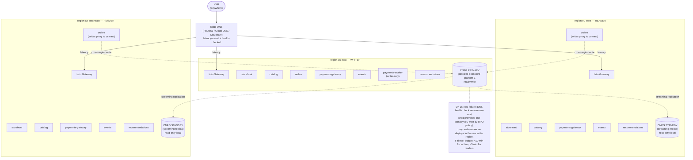

# 13.03 — Multi-region active-active

> Three regions, ApplicationSet propagation, CloudNativePG cross-region
> replicas, DNS failover, a real DR drill.

**Estimated time:** ~60 min read · half-day hands-on
**Prerequisites:** [Part 11 ch.06](../11-advanced-production-patterns/06-multi-cluster-and-fleet.md) — fleet/ApplicationSet baseline this chapter extends · [Part 08 ch.02](../08-day-2-operations/02-backup-and-dr.md) — DR drill framework · [Part 13 ch.02](02-tenancy-and-crossplane-onboarding.md) — tenancy that multi-region inherits
**You'll know after this:** • design a three-region active-active deployment with ApplicationSet propagation · • configure CloudNativePG cross-region replicas + failover semantics · • plan DNS-based regional failover with TTLs that hit RTO/RPO targets · • execute a real DR drill across regions and read the postmortem signals · • identify the data-gravity constraints that gate active-active

<!-- tags: bookstore-v2, multi-region, multi-cluster, cnpg, dr, day-2 -->

## Why this exists

Single-region production runs **until your region fails**. AWS us-east-1
has had multi-hour outages within living memory; GCP us-central1 has had
network partitions; Azure South Central US has had cooling failures. For a
business that takes money, even a 4-hour single-region outage is direct
revenue loss + customer-trust damage that takes a quarter to recover from.

Multi-region active-active is the **default** for production e-commerce
for three reasons:

1. **The customer is global.** A reader in Tokyo wants the catalog served
   from ap-southeast, not us-east. Even on the happy path, single-region
   serves a global customer poorly.
2. **Downtime is direct revenue loss.** Every minute the storefront is
   down = lost orders + lost trust. The CFO can put a dollar amount on
   the SLO; the platform team's job is to meet it.
3. **Regulators in some markets require regional data residency.** EU
   GDPR, India DPDP, Australia Privacy Act all impose constraints on
   where personal data lives. A multi-region architecture is the
   substrate for "this tenant's data stays in EU"; single-region cannot
   satisfy it.

Kubernetes **does not make this easy**. The control plane is per-cluster,
the data plane is per-cluster, the network is per-cluster, the storage is
per-cluster. Multi-region on Kubernetes is multi-cluster + a data layer
that reconciles consistency + an edge that routes by health and latency.
The platform v2 takes a **specific stance** — Argo CD ApplicationSet over
the Cluster generator + CloudNativePG cross-region streaming + DNS-based
failover — and this chapter walks it end-to-end.

## Mental model

**"Active-active" means every region serves traffic; the data layer
reconciles consistency. The 3 regions each run a full copy of the v2
stack. Postgres has one primary and two streaming standbys; writes go to
the primary's region; reads are local. Failover = promote a standby. Edge
DNS routes by latency and shifts on health.**

- **Three regions, one platform, one source of truth.** us-east, eu-west,
  ap-southeast — each a separate cluster (separate cloud control plane,
  separate VPC, separate kube-apiserver). The us-east cluster runs the
  **management Argo CD**; it has all three clusters registered via
  `argocd cluster add`; one ApplicationSet fans the platform stack into
  every region from one Git source of truth.
- **CNPG cross-region replication, not multi-master.** Postgres does not
  do multi-region multi-write safely (no Postgres distribution we are
  aware of does, without sacrificing consistency or write throughput).
  CloudNativePG does **one primary + N replicas, with streaming
  replication**: writes route to the primary's region; reads are local to
  each region. On primary loss, promote a replica. The promotion is fast
  (< 30 s if pre-warmed); the DNS update is slower (TTL-bounded). The
  failover budget is "minutes", not "seconds" — be honest.
- **Active workload set differs slightly per region.** Storefront,
  catalog, orders, payments-gateway, events, recommendations all run
  active-active across the three regions. The async **payments-worker**
  runs **only in the writer region** because writing to the Postgres
  primary from a different region is wasteful (cross-region write
  latency). When the writer flips, the payments-worker follows.
- **Edge DNS routes by latency, fails over on health.** Production uses
  Route53 (AWS), Cloud DNS (GCP), or Cloudflare. The DNS provider does
  latency-based routing in the happy path and health-checked failover on
  region loss. On kind locally, we simulate the cutover with an
  `/etc/hosts` flip — the lesson is the failover path, not the DNS
  product.
- **Split-brain is the failure mode to fear.** A network partition
  between regions where each side believes it is the writer is the
  worst-case for any distributed data layer. CNPG's design avoids it
  (only one primary is ever promoted; a partitioned replica cannot
  promote itself without operator action). The trade-off: failover
  requires explicit intent (CNPG's `cnpg promote`), not automatic
  election. Worth it.

The trap to keep in view: **"active-active" sounds like "writes go
anywhere"**. They don't. Writes go to one region's primary; reads go
local. Marketing the architecture as "five-9s writes everywhere" is a lie
that will hurt at the first failover. Sell the truth: "<5 min reader
failover, <10 min writer failover; writes are routed; reads are local".

## Diagrams

### Diagram A — three regions + DNS + CNPG streaming (Mermaid)



### Diagram B — workload activity matrix (ASCII)

```text
WORKLOAD               US-EAST                EU-WEST                  AP-SOUTHEAST
─────────────────────  ─────────────────────  ───────────────────────  ──────────────────────
storefront             active                 active                   active
catalog                active                 active (local reads)     active (local reads)
orders                 active (local writes)  active (writes -> us)    active (writes -> us)
payments-gateway       active                 active                   active
events (Kafka)         active                 active                   active
payments-worker        ACTIVE                 dormant                  dormant
recommendations        active                 active                   active
CNPG postgres          PRIMARY (rw)           standby (ro)             standby (ro)
S3 platform-assets     PRIMARY                replica (cross-region)   replica (cross-region)
S3 tenant-assets       PRIMARY (per-tenant)   replica                  replica
ApplicationSet target  yes                    yes                      yes
Argo CD (management)   YES (only here)        no                       no

On us-east loss:
  CNPG -> promote eu-west standby; payments-worker re-deploys in eu-west.
  Argo CD management cluster -> ALSO need to re-target (either run a 2nd
  Argo CD in eu-west passive-active OR rebuild on eu-west from Git — the
  chapter walks both options + their trade-offs in the DR drill).
```

## Hands-on with the Bookstore Platform

This chapter assumes the three kind clusters from
[13.01](01-bookstore-2-from-toy-to-platform.md) are up and the
platform-base is applied in each. We add Argo CD on us-east, register all
three, fan the platform-base via ApplicationSet, then walk the DR drill.

### 1. Install Argo CD on the management cluster (us-east)

Pinned-Helm, own namespace — the Part 07 ch.04 install pattern, the
platform's delivery spine. Use the management context:

```sh
kubectl config use-context kind-bookstore-platform-us-east

ARGOCD_CHART_VERSION="7.6.12"   # argo-helm/argo-cd chart; pinned

helm repo add argo https://argoproj.github.io/argo-helm
helm install argocd argo/argo-cd \
  --version "$ARGOCD_CHART_VERSION" \
  -n argocd --create-namespace --wait \
  --set 'global.podAnnotations.linkerd\.io/inject=enabled=null' \
  --set 'configs.params."server\.insecure"=true'   # kind-local; remove for production

# Login
ARGOCD_PWD=$(kubectl -n argocd get secret argocd-initial-admin-secret \
  -o jsonpath='{.data.password}' | base64 -d)
kubectl -n argocd port-forward svc/argocd-server 8080:443 >/dev/null 2>&1 &
sleep 3
argocd login localhost:8080 --username admin --password "$ARGOCD_PWD" --insecure
```

### 2. Register the three regional clusters with region labels

The Cluster generator selects on labels stamped on the cluster Secret
Argo CD stores when you `cluster add`. Use the `--label` flag so the
ApplicationSet template can read the region.

```sh
argocd cluster add kind-bookstore-platform-us-east \
  --label bookstore-platform.example.com/region=us-east \
  --label bookstore-platform.example.com/role=writer \
  --yes

argocd cluster add kind-bookstore-platform-eu-west \
  --label bookstore-platform.example.com/region=eu-west \
  --label bookstore-platform.example.com/role=reader \
  --yes

argocd cluster add kind-bookstore-platform-ap-southeast \
  --label bookstore-platform.example.com/region=ap-southeast \
  --label bookstore-platform.example.com/role=reader \
  --yes

argocd cluster list
```

> Note: on kind the cluster API endpoints are `https://127.0.0.1:<PORT>`,
> which Argo CD running inside the us-east cluster cannot reach directly.
> Use the `host.docker.internal` workaround documented in
> [Part 11 ch.06](../11-advanced-production-patterns/06-multi-cluster-and-fleet.md);
> on real EKS/GKE/AKS the cloud-internal API endpoint resolves naturally.

### 3. Apply the root ApplicationSet

```sh
kubectl apply -f examples/bookstore-platform/argocd/applicationset-platform.yaml
```

Within seconds the ApplicationSet's Cluster generator enumerates the three
labelled clusters and creates three Applications:

```sh
kubectl -n argocd get applications
# NAME                              SYNC STATUS   HEALTH STATUS
# platform-base-us-east             Synced        Healthy
# platform-base-eu-west             Synced        Healthy
# platform-base-ap-southeast        Synced        Healthy
```

Each Application points at its region's overlay
(`examples/bookstore-platform/kustomize/regions/<REGION>/`) and reconciles
the 13 cluster-wide platform-base objects into the matching cluster.

> Each kind cluster runs 1 control-plane + 2 workers (3 zone labels via
> `kubernetes.io/hostname` patches), so 3 clusters total = 9 Pods of
> node-spec. 12 nodes would be more realistic but heavier on laptop RAM
> (4 GB+ per cluster). Real cloud equivalent: 3 worker nodes per region,
> one per AZ.

### 4. Install CloudNativePG and create the multi-region CNPG cluster

The CNPG operator pattern was introduced for the v1 Bookstore in
[Part 08 ch.05](../08-day-2-operations/05-operators-and-crds.md). Here we
extend it to cross-region replication. Install the operator into every
region — the operator is per-cluster and reconciles only its own region's
CNPG CRs.

```sh
CNPG_CHART_VERSION="0.22.1"

helm repo add cnpg https://cloudnative-pg.github.io/charts
helm repo update

for ctx in \
  kind-bookstore-platform-us-east \
  kind-bookstore-platform-eu-west \
  kind-bookstore-platform-ap-southeast
do
  helm --kube-context "$ctx" install cnpg \
    cnpg/cloudnative-pg \
    --version "$CNPG_CHART_VERSION" \
    -n cnpg-system --create-namespace --wait
done
```

Create the primary CNPG Cluster in us-east:

```sh
kubectl --context kind-bookstore-platform-us-east apply -f - <<EOF
apiVersion: postgresql.cnpg.io/v1
kind: Cluster
metadata:
  name: bookstore-platform-pg
  namespace: bookstore-platform-system
spec:
  instances: 2
  storage:
    size: 5Gi
  bootstrap:
    initdb:
      database: bookstore
      owner: bookstore
  # Self-contained backup config — production points S3 / GCS / Azure Blob.
  backup:
    barmanObjectStore:
      destinationPath: "s3://bookstore-platform-pg-backups/us-east"
      s3Credentials:
        accessKeyId: { name: pg-backup-creds, key: ACCESS_KEY_ID }
        secretAccessKey: { name: pg-backup-creds, key: SECRET_ACCESS_KEY }
      wal:
        compression: gzip
EOF
```

Create the standby CNPG `Cluster`s in the other two regions, pointing at
the primary via the recovery bootstrap:

```sh
for ctx in kind-bookstore-platform-eu-west kind-bookstore-platform-ap-southeast; do
  kubectl --context "$ctx" apply -f - <<EOF
apiVersion: postgresql.cnpg.io/v1
kind: Cluster
metadata:
  name: bookstore-platform-pg
  namespace: bookstore-platform-system
spec:
  instances: 2
  storage:
    size: 5Gi
  bootstrap:
    pg_basebackup:
      source: bookstore-platform-pg-source
  replica:
    enabled: true
    source: bookstore-platform-pg-source
  externalClusters:
    - name: bookstore-platform-pg-source
      connectionParameters:
        host: bookstore-platform-pg-rw.us-east.bookstore-platform.example.com
        user: streaming_replica
        dbname: bookstore
        sslmode: require
      password:
        name: pg-replication-creds
        key: PASSWORD
EOF
done
```

> **In production:** the `externalClusters.host` above is the DNS name
> that points at the primary's CNPG read-write service. On real cloud the
> cross-region path goes through a VPC peering + a Service of type
> `LoadBalancer` with an internal-LB annotation, or a Transit Gateway. On
> kind the cross-region path is not actually wired; the standby Cluster
> manifest applies cleanly and shows the SHAPE of cross-region
> replication, but real `pg_basebackup` across kind clusters needs extra
> network bridging. The DR drill in §6 below works without real
> replication wiring.

### 5. Verify the multi-region topology

```sh
for ctx in \
  kind-bookstore-platform-us-east \
  kind-bookstore-platform-eu-west \
  kind-bookstore-platform-ap-southeast
do
  echo "=== $ctx ==="
  kubectl --context "$ctx" get cluster -n bookstore-platform-system
done
# === kind-bookstore-platform-us-east ===
# NAME                    AGE   INSTANCES   READY   STATUS                     PRIMARY
# bookstore-platform-pg   1m    2           2       Cluster in healthy state   bookstore-platform-pg-1
# === kind-bookstore-platform-eu-west ===
# (standby; INSTANCES 2; PRIMARY shows the local replica's pod name; cross-region wiring varies)
# === kind-bookstore-platform-ap-southeast ===
# (standby; INSTANCES 2)
```

### 6. The DR drill — promote a standby, redirect DNS

This is the real exercise. Kind makes it cheap: kill the writer cluster
and watch the failover.

```sh
# 1) Note the current state.
kubectl --context kind-bookstore-platform-us-east \
  get cluster bookstore-platform-pg -n bookstore-platform-system
# bookstore-platform-pg ... healthy ... PRIMARY: bookstore-platform-pg-1

# 2) Region failure simulation: kill the writer cluster.
kind delete cluster --name bookstore-platform-us-east

# 3) Promote the eu-west standby (the chapter's promotion-policy choice is
#    "eu-west first by RPO"; ap-southeast is the next failover candidate).
#    Uses the kubectl-cnpg plugin (install via `kubectl krew install cnpg`
#    or download from the CNPG releases page; pinned-Helm chart users may
#    also get it as part of the chart).
kubectl cnpg promote bookstore-platform-pg -n bookstore-platform-system \
  --context kind-bookstore-platform-eu-west

# Verify eu-west is now writable:
kubectl --context kind-bookstore-platform-eu-west \
  get cluster bookstore-platform-pg -n bookstore-platform-system
# bookstore-platform-pg ... healthy ... PRIMARY: bookstore-platform-pg-1 (in eu-west)

# 4) Redirect DNS. On real cloud: external-dns annotation flip + Route53
#    health-check toggles. On kind: /etc/hosts edit (the demo equivalent).
echo "127.0.0.1 us-east.bookstore-platform.example.com eu-west.bookstore-platform.example.com" \
  | sudo tee -a /etc/hosts
# (And actually point us-east.* at the eu-west cluster's gateway IP.)

# 5) The payments-worker has to re-deploy in eu-west (it ran writer-only).
#    The ApplicationSet's region overlay handles this if the writer-tag
#    selector flips automatically; the chapter's overlay (Phase 13a base)
#    does NOT yet have a writer-only payments-worker — Phase 13b ch.13.06
#    adds it and the overlay update.
```

Walk-through of the failover budget honestly:

| Step | Local cost | Real-cloud cost | Requires human? |
|------|------------|-----------------|-----------------|
| Detect failure | seconds (Argo CD health) | seconds (DNS health check) | No |
| Promote standby | seconds (`cnpg promote`) | ~30 s | No (Cluster API auto + watchdog) — but practically Yes (page) |
| DNS propagate | n/a | 60 - 300 s (TTL) | No |
| Workloads re-deploy | n/a | seconds (already running) | No |
| Payments-worker re-locate | seconds (kind) | minutes (image pull on the new writer region) | No |
| **Total — readers** | <30 s | <5 min | No |
| **Total — writers** | <30 s | <10 min | Yes — page; promotion is irreversible without rebuild |

### 7. Verify v1 invariants still hold

```sh
helm lint examples/bookstore/helm/bookstore | tail -2
helm template examples/bookstore/helm/bookstore \
  | kubectl apply --dry-run=client -f - | grep -cE '(configured|created)'   # 49
kubectl kustomize examples/bookstore/kustomize/overlays/dev | grep -c '^kind:'  # 45
```

Still 49 / 45 / 49 / 48. v2's multi-region build does not touch the v1
tree.

## How it works under the hood

**Argo CD ApplicationSet generators.** The ApplicationSet controller
watches `ApplicationSet` objects and renders them into a list of
`Application` objects. The Cluster generator enumerates **cluster Secrets**
in argocd's namespace (each `argocd cluster add` writes one) and surfaces
their labels into the template. The label selector + the template's value
substitution (`{{ .name }}`, `{{ .values.region }}`) does the rest. When a
new cluster is added with the matching label, a new Application appears
within seconds; remove the label, the Application is pruned. No
copy-paste; Git stays the single source of truth.

**CNPG cross-region replication — physical streaming vs logical.** CNPG
uses **physical streaming replication** (Postgres's built-in
`pg_basebackup` + WAL streaming). The standby keeps an exact byte-level
copy of the primary's data files; replication lag is measured in WAL
bytes streamed but not yet applied (typically << 1 s on a healthy LAN; can
spike to many MB across a real cross-region link). **Logical
replication** (Postgres's pgoutput plugin, used by Debezium) is what the
search-index CDC in 13.05 uses; it ships row changes, not WAL bytes — a
different mechanism for a different purpose. CNPG supports both; the
replica `Cluster` above uses physical via `pg_basebackup`.

**Split-brain — the failure mode CNPG avoids by construction.** A
multi-master Postgres setup (BDR, BiDirectional Replication) does
multi-region writes — and pays for it with conflict resolution that is
either application-level (you write the merge) or "last write wins"
(stale data wins ties). CNPG declines that trade: there is exactly one
primary, and promoting a standby requires an explicit human (or
operator-guarded automation) call to `cnpg promote`. A network partition
where eu-west cannot see us-east cannot promote itself unilaterally; the
operator's guardrail is "don't promote if you cannot confirm the primary
is gone". The trade: more human intent on failover, no split-brain risk
on healthy replication.

**DNS-based failover latency budget.** Three numbers compound:

1. **Detection time** — how long before the health check decides us-east
   is down. Route53 health checks default to ~30 s; tuneable to ~10 s at
   higher cost.
2. **TTL propagation** — clients only re-query when their cached TTL
   expires. Production TTL is typically 60 s for DNS records that need
   fast failover; lower TTL = more query load = more cost. The
   distribution of "client refresh" is geometric; budget the 99th
   percentile.
3. **Resolver caching** — many corporate / ISP resolvers cap TTL at
   higher minima than the record specifies (forced 5 - 15 min caching in
   some networks). That is the "long tail" you cannot control.

The honest total: TTL + detection + a long-tail of "users on broken
resolvers" — 5 minutes for most users, 15 - 30 minutes for the long
tail. The platform should design for "users see a stale region during
the failover window"; the alternative is per-request health checking at
the client, which costs more than it saves at e-commerce scale.

## Production notes

> **In production:** **A real DR drill is monthly, not annual.** A drill
> that has not been run in 9 months has decayed — runbooks reference
> tools that have changed, the on-call rotation is different, the
> failover automation has bit-rotted. The fix is to **run the drill in
> production, with traffic, on the staging environment, every month**.
> The 30-minute scripted drill (forward ref — Phase 13c chapter 13.12, not
> yet authored) is the deliverable.

> **In production:** **Cross-region S3 replication is asynchronous.**
> An asset uploaded to the us-east bucket appears in eu-west / ap-
> southeast within seconds to minutes (S3 SLA: typical 15 minutes; 99th
> percentile longer). Do not assume "I uploaded the cover image; the
> ap-southeast storefront can show it". Either serve assets from a
> regional bucket per region (origin-shielded CDN in front), or accept
> that for the first ~15 minutes after upload the asset may 404 in the
> far region. The Stripe webhook flow in 13.06 covers this for events;
> for static assets it is a CDN + cache-bust pattern, not a Postgres
> pattern.

> **In production:** **Don't trust last-minute writes during a regional
> outage.** A user who pressed "buy" 200 ms before us-east lost network
> may or may not have a row in Postgres — the WAL may have streamed to
> eu-west or may have been on the wire. Reconciliation has to be
> explicit: the **outbox pattern** (13.06 — Phase 13b) keeps the event
> intent in Postgres alongside the order row, in a single transaction.
> If the order row exists, the outbox row exists; if eu-west has the
> order, eu-west has the outbox. The publisher worker replays anything
> not yet shipped to Kafka after the failover. The combination is the
> "every order is durably accounted for, eventually" guarantee.

> **In production:** **Argo CD itself is a single point of failure.** If
> the management cluster goes down with us-east, no new GitOps changes
> reconcile until you rebuild. Two patterns:
>
> 1. **Passive-active Argo CD** — a second Argo CD in eu-west,
>    bootstrapped from the same Git source, normally not the one issuing
>    changes. On us-east loss, eu-west's Argo CD becomes authoritative.
>    Cost: two Argo CDs to manage.
> 2. **Rebuild from Git** — only one Argo CD; on management loss, you
>    re-bootstrap a new Argo CD in another region from Git in a few
>    minutes. Cost: a few minutes of "no reconciliation" during failover.
>
> The platform v2 ships pattern (2) for simplicity; pattern (1) is the
> mature production answer at scale. The DR drill in Phase 13c rehearses
> pattern (2).

> **In production:** **Regional data residency requires more than
> "deploy in region X"**. GDPR / DPDP compliance means the data stays in
> that region — including replicas + backups + log streams + telemetry +
> any analytics derived from the data. A naive multi-region setup where
> "all logs ship to us-east" is non-compliant. The platform-team-owned
> design has to be explicit about every data flow that leaves the region
> of origin. This chapter does not solve it; 13.09 and 13.10's
> observability + cost flows have to respect the same boundary.

## Quick Reference

```sh
# Spin up three regions (from 13.01)
./examples/bookstore-platform/clusters/kind-3-region.sh

# Install Argo CD on us-east (management)
ARGOCD_CHART_VERSION="7.6.12"
helm repo add argo https://argoproj.github.io/argo-helm
helm --kube-context kind-bookstore-platform-us-east install argocd argo/argo-cd \
  --version "$ARGOCD_CHART_VERSION" \
  -n argocd --create-namespace --wait

# Register all three clusters with region labels
for region in us-east eu-west ap-southeast; do
  role=$( [ "$region" = "us-east" ] && echo writer || echo reader )
  argocd cluster add "kind-bookstore-platform-$region" \
    --label "bookstore-platform.example.com/region=$region" \
    --label "bookstore-platform.example.com/role=$role" --yes
done

# Apply the ApplicationSet
kubectl apply -f examples/bookstore-platform/argocd/applicationset-platform.yaml
kubectl -n argocd get applications

# Install CNPG into each region
CNPG_CHART_VERSION="0.22.1"
helm repo add cnpg https://cloudnative-pg.github.io/charts
helm repo update
for ctx in kind-bookstore-platform-{us-east,eu-west,ap-southeast}; do
  helm --kube-context "$ctx" install cnpg cnpg/cloudnative-pg \
    --version "$CNPG_CHART_VERSION" \
    -n cnpg-system --create-namespace --wait
done

# DR drill (kind)
kind delete cluster --name bookstore-platform-us-east
# Requires the kubectl-cnpg plugin (`kubectl krew install cnpg`).
kubectl cnpg promote bookstore-platform-pg -n bookstore-platform-system \
  --context kind-bookstore-platform-eu-west
```

Minimal skeleton — CNPG `Cluster` (writer) and replica:

```yaml
# Writer
apiVersion: postgresql.cnpg.io/v1
kind: Cluster
metadata:
  name: bookstore-platform-pg
  namespace: bookstore-platform-system
spec:
  instances: 2
  storage: { size: 5Gi }
  bootstrap:
    initdb: { database: bookstore, owner: bookstore }
---
# Replica
apiVersion: postgresql.cnpg.io/v1
kind: Cluster
metadata:
  name: bookstore-platform-pg
  namespace: bookstore-platform-system
spec:
  instances: 2
  storage: { size: 5Gi }
  bootstrap:
    pg_basebackup:
      source: bookstore-platform-pg-source
  replica:
    enabled: true
    source: bookstore-platform-pg-source
  externalClusters:
    - name: bookstore-platform-pg-source
      connectionParameters:
        host: <PRIMARY-HOSTNAME>
        user: streaming_replica
        dbname: bookstore
        sslmode: require
      password:
        name: pg-replication-creds
        key: PASSWORD
```

Checklist (multi-region is healthy when all six are yes):

- [ ] Three Argo CD Applications (`platform-base-us-east`,
      `-eu-west`, `-ap-southeast`) report Synced + Healthy.
- [ ] CNPG primary Cluster in us-east shows `INSTANCES 2 READY 2 PRIMARY
      <POD>`.
- [ ] CNPG standby Clusters in eu-west + ap-southeast report `Cluster
      in healthy state`.
- [ ] `cnpg status` shows replication lag bounded under your SLO (< 10 s
      typical on a healthy WAN).
- [ ] DR drill: `cnpg promote` on a standby succeeds; reads + writes
      both succeed against the new primary within 5 minutes.
- [ ] After failover, the original writer region's Cluster can be re-
      bootstrapped as a new standby (the rebuild path; the runbook in
      Phase 13c walks it).

## Test your understanding

> Try each before opening the answer drawer. The act of trying is the exercise; the answer is the check.

1. **Why is "active-active for stateless tiers, active-passive for the database" the typical multi-region shape?**
   <details><summary>Show answer</summary>

   Stateless tiers (storefront, catalog) can serve identical requests from any region — replicating *code* is trivial via GitOps/ApplicationSet. The database can't trivially span regions because (a) synchronous cross-region writes add 50-200ms of WAN latency to every transaction, (b) multi-master conflict resolution is hard for relational data, and (c) CAP says you can't have consistency + availability + partition-tolerance simultaneously. So: writes go to one region (primary), reads can go local in any region (replicas), and failover is a planned operation (promote a standby). Active-active for the DB is possible (Yugabyte, CockroachDB, multi-master Postgres) but adds operational complexity many teams don't need.

   </details>

2. **Your DR drill: us-east-1 goes down, you promote the eu-west standby. DNS failover takes 90 seconds. What's the RPO and RTO and what determines them?**
   <details><summary>Show answer</summary>

   **RPO** (Recovery Point Objective) = the data lost = the streaming replication lag at failover time. With CNPG async streaming, this is typically <10s on a healthy WAN. RPO can be 0 with synchronous replication but at the cost of write latency to every transaction. **RTO** (Recovery Time Objective) = time to writes-resume = DNS TTL (60-90s if low) + Argo CD reconcile (30-60s to flip the writer label) + CNPG promote (10-30s) + app reconnect on new primary endpoint (10s with proper connection pool). Total RTO: 2-4 minutes. The drill validates the numbers; the runbook teaches the team to execute under stress.

   </details>

3. **DNS TTL is set to 300s. You execute the failover. What user-visible behavior do you see in the first 5 minutes?**
   <details><summary>Show answer</summary>

   Clients holding cached DNS resolutions for the old endpoint continue hitting the down region — they get connection refused or timeouts until their resolver re-queries. For mobile clients, DNS caching is opaque (the OS caches independently of TTL). For browsers, ~60s typical. For server-to-server (B2B integrations), Java's DNS cache is forever by default — until the JVM restarts. The 5-minute window has a mix: new connections route correctly, old connections fail, partner integrations may need manual restart. Setting TTL to 30s pre-emptively before known maintenance windows is the trick — but pays cost in DNS query volume the rest of the time.

   </details>

4. **A teammate proposes synchronous cross-region replication "so there's no RPO." Talk them through the trade-offs.**
   <details><summary>Show answer</summary>

   Sync replication means every commit waits for at least one remote replica to acknowledge. WAN RTT us-east-1 ↔ eu-west-1 is ~75ms; ~150ms ↔ ap-southeast-1. That latency is added to every write. The checkout-page p99 goes from 100ms to 250ms. Throughput drops because writes hold longer. If the remote replica is briefly unreachable, writes block. Synchronous replication trades availability for consistency — acceptable for low-volume, high-value financial transactions, awful for high-volume e-commerce checkouts. The right answer is usually: async streaming with bounded lag + an RPO budget you accept + a tested failover.

   </details>

5. **Hands-on: in your three-region setup, kill the writer region's Postgres primary Pod (not the whole cluster). What does CNPG do, and what does the app see?**
   <details><summary>What you should see</summary>

   CNPG detects the primary loss within ~10s, promotes an in-region replica to primary, updates the `<cluster>-rw` Service to point at the new primary. App connections to `<cluster>-rw` are reset; the connection pool reconnects to the new primary. Total downtime: 10-30s, no data loss because in-region replication is synchronous. The cross-region standbys remain standbys — no global failover needed. This is the "in-region HA absorbs the common case; cross-region DR absorbs the rare case" pattern: most failures are handled with seconds of downtime, region-loss is the rare event you drill quarterly.

   </details>

## Further reading

- **Rosso et al., _Production Kubernetes_, ch.15 — "Multi-cluster
  operations"** — the multi-cluster topology + propagation patterns this
  chapter expresses as ApplicationSet + Cluster generator.
- **Ibryam & Huß, _Kubernetes Patterns_ 2e — *Stateful Service*
  (ch.12)** — the StatefulSet + replication + failover patterns CNPG
  generalises to cross-region.
- Official: **CloudNativePG cross-region replication docs**
  <https://cloudnative-pg.io/documentation/current/replica_cluster/>;
  **Argo CD ApplicationSet docs**
  <https://argo-cd.readthedocs.io/en/stable/operator-manual/applicationset/>;
  **Google Cloud Architecture Center — _Multi-region active-active
  application architecture_**
  <https://cloud.google.com/architecture/multi-region-app-architecture>;
  **AWS Route53 health-checked DNS failover**
  <https://docs.aws.amazon.com/Route53/latest/DeveloperGuide/dns-failover.html>.
