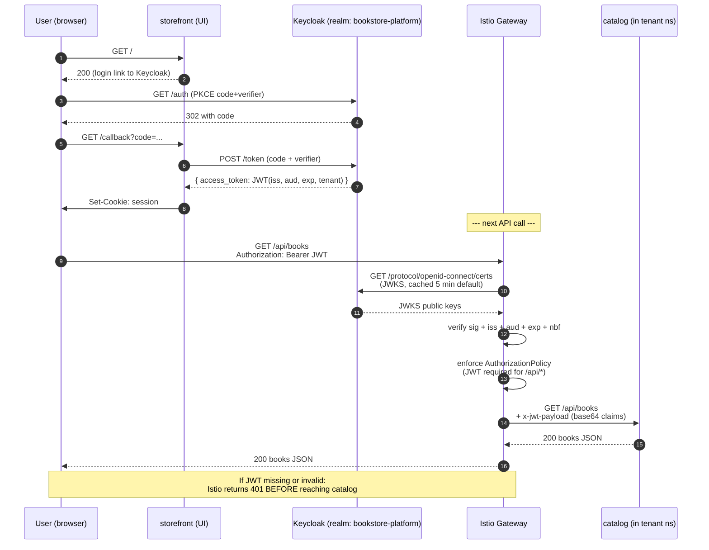
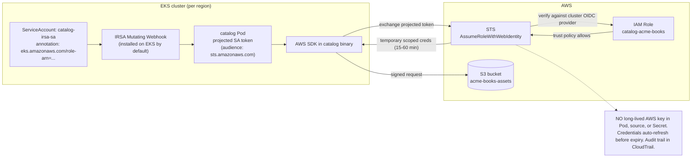

# 13.04 — Real auth: Keycloak OIDC + IRSA + Istio JWT

> Replace the toy JWT in v1 with Keycloak; humans use OIDC, workloads use
> IRSA, the mesh validates JWTs.

**Estimated time:** ~60 min read · half-day hands-on
**Prerequisites:** [Part 10 ch.03](../10-cloud-and-managed-kubernetes/03-cloud-identity.md) — IRSA for workload identity · [Part 11 ch.04](../11-advanced-production-patterns/04-service-mesh.md) — Istio mesh that enforces JWT · [Part 13 ch.02](02-tenancy-and-crossplane-onboarding.md) — tenant boundary that scopes realms
**You'll know after this:** • install Keycloak as the OIDC IdP for humans (with realm-per-tenant or shared-realm) · • wire workload-to-cloud identity via IRSA so workloads carry no static keys · • configure Istio `RequestAuthentication` + `AuthorizationPolicy` to validate JWTs at the mesh · • replace the v1 shared-HMAC JWT with rotating Keycloak-issued tokens · • diagnose audience / issuer / JWKS-cache mismatch failures

<!-- tags: bookstore-v2, security, oidc, irsa, istio, multi-tenancy -->

## Why this exists

The v1 Bookstore "auth" was a single shared HMAC secret signing a JWT.
Every service knew the same secret; the storefront minted a token; the
catalog and orders services trusted any token signed with the same secret.
That is **fine for a tutorial** — it teaches the JWT lifecycle without
dragging in an identity provider — and **wrong for production** in three
specific ways:

1. **Shared secrets do not rotate.** A leaked HMAC compromises every
   service simultaneously. Production needs **asymmetric** signing (the
   IdP holds the private key; services verify with the public JWKS) and
   **rotation** of those keys without service downtime.
2. **No identity provider means no human concept.** A real customer signs
   up, logs in, resets a password, has groups assigned to their account.
   None of that lives in a shared HMAC. Production needs an **OpenID
   Connect** provider — Keycloak, Auth0, Okta, AWS Cognito, etc. — that
   owns the human-identity surface.
3. **Workload identity is a different problem entirely.** A `catalog`
   Pod calling AWS S3 must not use a JWT meant for a customer; it must
   use **cloud-native ServiceAccount -> IAM federation** (IRSA on AWS,
   Workload Identity on GCP, Azure AD Workload Identity on Azure). The
   v1 hand-waved this; v2 makes it real.

This chapter does **three things**: installs **Keycloak** as the
production OIDC provider, configures **Istio** at the gateway to verify
JWTs before downstream services see a request, and lays out the
**IRSA / Workload Identity** workload-identity pattern that
[Part 10 ch.03](../10-cloud-and-managed-kubernetes/03-cloud-identity.md)
introduced — applied to a platform-v2 catalog Pod.

> **In production:** The split below — "humans use OIDC, workloads use
> IAM federation, the mesh verifies humans" — is the production shape
> across every cloud vendor's reference architecture. Each piece is
> incrementally adoptable; you do not have to wait until all three are
> wired to start.

## Mental model

**Two identity planes; the mesh validates the human plane at the edge,
the cloud validates the workload plane in-flight.**

- **Human identity — Keycloak OIDC, realm-per-tenant.** A customer (or
  admin, or developer) signs in via the OIDC authorization-code + PKCE
  flow. Keycloak issues a **JWT** with:
  - `iss` = the realm URL (e.g.
    `https://keycloak.bookstore-platform.example.com/realms/bookstore-platform`)
  - `aud` = the OIDC client ID (`storefront-web` or `admin-portal`)
  - `tenant` = the user's tenant (custom claim, mapped from a group
    attribute)
  - role claims via group membership
  - `exp`, `iat`, `nbf` — standard time bounds
  Each region runs its own Keycloak instance; the realm is replicated
  via the Keycloak HA pattern (Infinispan distributed cache + a shared
  DB; on CNPG, the realm DB itself is multi-region per
  [13.03](03-multi-region-active-active.md)).
- **Workload identity — ServiceAccount -> IAM, no static keys in Pods.**
  The catalog Pod runs as a ServiceAccount whose annotation declares the
  IAM role it should assume:
  - **AWS:** `eks.amazonaws.com/role-arn` annotation; the IRSA mutating
    webhook injects a projected SA token whose audience is `sts.
    amazonaws.com`; the AWS SDK auto-exchanges the token for STS
    credentials via `AssumeRoleWithWebIdentity`. (Or the newer **Pod
    Identity** model: an association, no annotation.)
  - **GKE:** `iam.gke.io/gcp-service-account` annotation; the GKE
    metadata server intercepts and exchanges.
  - **AKS:** `azure.workload.identity/client-id` annotation; AKS does
    the same exchange against Entra ID.
  No long-lived AWS / GCP / Azure key in the Pod, in source, or in a
  Secret. Part 10 ch.03 walks the cloud-side wiring in detail; this
  chapter shows how the platform v2 catalog SA carries the annotation.
- **The mesh validates the human JWT at the gateway.** Istio
  `RequestAuthentication` **verifies**: signature against the Keycloak
  JWKS, `iss` + `aud` + `exp` + `nbf` + `iat` time bounds, `tenant`
  claim present. Istio `AuthorizationPolicy` **enforces**: require a
  valid JWT for `/api/*`; allow `/static/*` public; deny everything
  else explicitly. The downstream catalog service never sees an
  unauthenticated request — the gateway is the trust boundary. The
  verified claims are surfaced to downstream services via a
  base64-encoded `x-jwt-payload` header (no need to re-validate; trust
  what the gateway already verified).
- **Verification != enforcement.** Two separate Istio CRDs do these two
  things. Collapsing them is the #1 footgun: `RequestAuthentication`
  alone does NOT reject a request without a JWT — it only validates the
  JWT IF present. Without a paired `AuthorizationPolicy` that says
  "require a JWT for `/api/*`", a missing-token request slides through
  unchallenged. The chapter's `auth/authorization-policy.yaml` ships the
  pair correctly.

The trap to keep in view: **OIDC + IRSA + Istio JWT is a lot of moving
parts**. It is worth the cost; it is also a real cost. The chapter walks
each one; the Production notes section flags the cross-cutting failure
modes (clock skew, JWKS unreachable, audience mismatch, key rotation gap).

## Diagrams

### Diagram A — human request: OIDC + JWT verify at the gateway (Mermaid)



### Diagram B — workload identity: ServiceAccount -> STS -> scoped creds (Mermaid)



### Diagram C — humans vs workloads claim table (ASCII)

```text
DIMENSION                 HUMANS (Keycloak OIDC)         WORKLOADS (IRSA / WI)
─────────────────────     ────────────────────────────   ──────────────────────────────────
Issuer                    Keycloak realm URL             EKS cluster OIDC provider URL
Token type                JWT (RS256/ES256)              JWT (projected SA token)
Signing algorithm         Asymmetric (RSA / EC)          Asymmetric (RSA)
Audience                  client_id (storefront-web/...)  sts.amazonaws.com
Issued by                 Keycloak                       Kubernetes (kubelet via TokenRequest)
Lifetime                  15 min (refreshable)           ~1 hour (auto-rotated by kubelet)
Identity claim            sub = user UUID                sub = system:serviceaccount:<NS>:<NAME>
Tenant claim              tenant = <TENANT>              N/A (workload owns its own scope)
Verified by               Istio Gateway                  AWS STS (server-side validation)
Result                    request reaches /api/*         IAM role's scoped credentials
Rotation                  Refresh token, JWKS rotation   Projected token auto-rotated by kubelet
Auth code flow            authorization code + PKCE      assume-role-with-web-identity
Failure on no token       401 at gateway                 AWS STS rejects the exchange
```

## Hands-on with the Bookstore Platform

Assumes the three regions from
[13.01](01-bookstore-2-from-toy-to-platform.md) are up, the platform-base
is applied in each (13.01), and the multi-region ApplicationSet is wired
(13.03). We work in the us-east cluster for the Keycloak + Istio
install; the Argo CD ApplicationSet replicates the auth CRs into the
other two regions.

### 1. Install Istio ambient (pinned-Helm; cross-ref Part 11 ch.04)

The full Istio ambient + waypoint install pattern is in
[Part 11 ch.04](../11-advanced-production-patterns/04-service-mesh.md).
This chapter does not repeat that material; it pins the versions and
runs the install.

```sh
kubectl config use-context kind-bookstore-platform-us-east

ISTIO_VERSION="1.23.2"

helm repo add istio https://istio-release.storage.googleapis.com/charts
helm install istio-base istio/base \
  --version "$ISTIO_VERSION" -n istio-system --create-namespace --wait
helm install istiod istio/istiod \
  --version "$ISTIO_VERSION" -n istio-system \
  --set profile=ambient --wait
helm install istio-cni istio/cni \
  --version "$ISTIO_VERSION" -n istio-system \
  --set profile=ambient --wait
helm install ztunnel istio/ztunnel \
  --version "$ISTIO_VERSION" -n istio-system --wait
helm install istio-ingressgateway istio/gateway \
  --version "$ISTIO_VERSION" -n istio-system --wait
```

### 2. Install Keycloak (pinned-Helm; realm imported on first boot)

```sh
# Apply the realm-import ConfigMap (auth/keycloak-realm-import.cm.yaml)
kubectl create namespace keycloak
kubectl apply -f examples/bookstore-platform/auth/keycloak-realm-import.cm.yaml

# Install Keycloak via Bitnami chart, pinned. The chart mounts the
# realm-import ConfigMap at /opt/bitnami/keycloak/data/import; on first
# boot, --import-realm reads it and creates the realm + clients + users.
KEYCLOAK_CHART_VERSION="21.4.4"

helm repo add bitnami https://charts.bitnami.com/bitnami
helm install keycloak bitnami/keycloak \
  --version "$KEYCLOAK_CHART_VERSION" -n keycloak \
  --set 'extraStartupArgs=--import-realm' \
  --set 'extraVolumes[0].name=realm-import' \
  --set 'extraVolumes[0].configMap.name=keycloak-realm-bookstore-platform' \
  --set 'extraVolumeMounts[0].name=realm-import' \
  --set 'extraVolumeMounts[0].mountPath=/opt/bitnami/keycloak/data/import' \
  --set 'extraVolumeMounts[0].readOnly=true' \
  --set 'auth.adminPassword=admin' \
  --wait
```

Or via the Argo CD Application that already encodes the same wiring:

```sh
kubectl apply -f examples/bookstore-platform/argocd/application-keycloak.yaml
```

Verify Keycloak is up and the realm imported:

```sh
kubectl -n keycloak get pods
# keycloak-0   1/1   Running
# keycloak-1   1/1   Running

kubectl -n keycloak port-forward svc/keycloak 8090:80 >/dev/null 2>&1 &
sleep 3
curl -s http://localhost:8090/realms/bookstore-platform/.well-known/openid-configuration | jq '.issuer, .jwks_uri'
# "http://localhost:8090/realms/bookstore-platform"
# "http://localhost:8090/realms/bookstore-platform/protocol/openid-connect/certs"
```

### 3. Get a JWT from Keycloak (the demo user)

The realm-import ConfigMap seeded `demo-user` with password `demo-password`
and group `tenant-acme-books-admins`. For the curl demo we use the
`admin-portal` client because `storefront-web` is configured for browser
PKCE — direct grants are disabled there as they should be in production.
The realm sets `directAccessGrantsEnabled: true` only on `admin-portal`
so a one-line `curl` can exchange the demo password for a JWT:

```sh
JWT=$(curl -s -X POST \
  -d "grant_type=password" \
  -d "client_id=admin-portal" \
  -d "client_secret=REPLACE-ME-VIA-ESO-NOT-IN-SOURCE" \
  -d "username=demo-user" \
  -d "password=demo-password" \
  -d "scope=openid" \
  http://localhost:8090/realms/bookstore-platform/protocol/openid-connect/token \
  | jq -r .access_token)

# Inspect the payload (don't actually parse JWTs by hand in prod — this is for the demo)
echo "$JWT" | cut -d. -f2 | base64 -d 2>/dev/null | jq .
# {
#   "iss": "http://localhost:8090/realms/bookstore-platform",
#   "aud": "account",
#   "tenant": "acme-books",
#   "preferred_username": "demo-user",
#   "exp": 1726431234,
#   "iat": 1726430934,
#   ...
# }
```

> Note: direct-access-grants is a **DEV-only knob**. The realm-import
> ships it ENABLED on `admin-portal` so the 5-minute curl test in this
> chapter can run as a one-liner, and DISABLED on `storefront-web`
> (browser-side; must use PKCE auth-code flow). Production turns direct-
> grant OFF on every client — including `admin-portal` — and exchanges
> credentials via the full authorization-code + PKCE flow only. Treat the
> `admin-portal` direct-grant toggle here as the demo's equivalent of an
> `--insecure` curl flag: useful locally, never in production.

### 4. Apply the Istio RequestAuthentication + AuthorizationPolicy

```sh
kubectl apply -f examples/bookstore-platform/auth/request-authentication.yaml
kubectl apply -f examples/bookstore-platform/auth/authorization-policy.yaml
```

What landed:

```sh
kubectl get requestauthentication -n istio-system
# NAME                    AGE
# storefront-keycloak     10s

kubectl get authorizationpolicy -n istio-system
# NAME                  ACTION   AGE
# allow-public-static   ALLOW    10s
# require-jwt-api       ALLOW    10s
# deny-all              DENY     10s
```

### 5. The curl test — 401 without a token, 200 with

Use the Istio gateway as the entry point. (On kind, port-forward the
gateway; on cloud, use the cloud LB hostname.)

```sh
kubectl -n istio-system port-forward svc/istio-ingressgateway 8443:443 >/dev/null 2>&1 &
sleep 3

# Public path — works without a JWT
curl -sk -o /dev/null -w "%{http_code}\n" https://localhost:8443/static/index.html
# 200

# API path — no JWT, 401 at the gateway
curl -sk -o /dev/null -w "%{http_code}\n" https://localhost:8443/api/books
# 401

# API path — with the JWT we got in step 3
curl -sk -o /dev/null -w "%{http_code}\n" \
  -H "Authorization: Bearer $JWT" \
  https://localhost:8443/api/books
# 200 (if the catalog service is running; in Phase 13a the catalog hasn't
# been deployed yet — but the gateway returns the correct downstream-
# error code rather than 401; the AuthZ pass is the point of the test)
```

> **Phase 13a honest note:** the storefront / catalog services land in
> Phase 13b. In Phase 13a the curl test proves the **gateway-level auth
> pass / fail**: 401 without JWT, valid JWT passes to the (non-existent
> backend) and returns the downstream error (typically a 502 or 503).
> The 401 -> 200 transition at the gateway is what 13.04 is responsible
> for; the rest of the path comes online in Phase 13b.

### 6. The IRSA-annotated ServiceAccount (kind-illustrative)

```sh
# Create the tenant ns + the IRSA-annotated SA (kind path: just applies)
kubectl create namespace bookstore-platform-acme-books 2>/dev/null || true
kubectl apply -f examples/bookstore-platform/auth/sample-serviceaccount-irsa.yaml

kubectl -n bookstore-platform-acme-books get sa catalog-irsa-sa \
  -o jsonpath='{.metadata.annotations}'
# {"eks.amazonaws.com/audience":"sts.amazonaws.com",
#  "eks.amazonaws.com/role-arn":"arn:aws:iam::<ACCOUNT-ID>:role/bookstore-platform-catalog-acme-books"}
```

On EKS with the IRSA webhook installed, a Pod running as
`catalog-irsa-sa` would automatically:

1. Have a projected SA token mounted at
   `/var/run/secrets/eks.amazonaws.com/serviceaccount/token` (audience
   `sts.amazonaws.com`).
2. Have `AWS_ROLE_ARN` + `AWS_WEB_IDENTITY_TOKEN_FILE` env vars injected.
3. The AWS SDK in the container reads them; calls STS
   AssumeRoleWithWebIdentity; gets scoped temporary credentials.

On kind, none of that wiring is real. The annotation is the production-
shape source-of-truth; the cloud-side wiring (Part 10 ch.03) makes it
actually do the federated identity exchange.

### 7. JWKS rotation — what happens, what to do

Keycloak rotates its signing key on a configurable cadence (default: never
automatically; production cadence: 90 days). When the key rotates:

1. Keycloak publishes the new key in JWKS, marked as the new active.
2. Old key stays in JWKS, marked as deprecated, for the **rotation
   window** (default 1 day; production tunes to cover token-lifetime +
   refresh-window).
3. Istio's JWKS cache refreshes (default every 5 minutes). New tokens
   are signed with the new key; existing tokens still verify against
   the deprecated key.
4. After the rotation window, the deprecated key is removed; any token
   still signed with it now fails verification.

If the JWKS cache or the rotation window is misconfigured (e.g. tokens
live 1 day; rotation window is 1 hour), there is a gap where existing
tokens fail. The chapter's Production notes section lists the matching
configuration knobs.

## How it works under the hood

**OIDC flows — authorization-code + PKCE.** The browser-side flow has
**five steps**: (1) storefront redirects to Keycloak with a PKCE
`code_challenge`; (2) user authenticates at Keycloak; (3) Keycloak
redirects back to storefront with a `code`; (4) storefront POSTs the
`code` + the PKCE `code_verifier` to Keycloak's `/token` endpoint;
(5) Keycloak returns the access JWT + refresh token. The PKCE pair
prevents a malicious app from intercepting the code (which would otherwise
exchange to a token). The deprecated **implicit flow** sent the token in
the URL fragment; do not use it for new code. The deprecated **password
grant** that the demo uses is for testing only; in production users do
not type their password into your storefront.

**JWT validation — the five checks.** The verifier (Istio in our case)
performs:

1. **Signature check** — verify the JWT against the public key in JWKS
   that matches the `kid` header.
2. **`iss` check** — the issuer matches the declared issuer.
3. **`aud` check** — the audience is one of the declared audiences.
4. **`exp`/`nbf` check** — the token is not expired and is past its
   not-before time.
5. **`iat` sanity** — issued-at is not in the future (clock skew is
   bounded; Istio allows ±10 s by default).

Any failure = 401 at the gateway; downstream never sees the request.

**JWKS caching.** Istio fetches the JWKS at startup and caches it. The
refresh cadence is configurable; the default (5 minutes) is the right
trade for most platforms. Caching too tightly = JWKS rotation breaks
existing tokens; caching too loosely = a JWKS endpoint outage takes the
gateway down. Pin the cache to a higher TTL with `jwksRefresh: 10m` in
the mesh config, and ensure Keycloak's rotation window is **at least 2x
the cache TTL** so a refresh always overlaps both keys.

**IRSA in detail.** The projected SA token has an `aud` claim of
`sts.amazonaws.com` (or whatever the workload's audience annotation
declares). The AWS SDK reads `AWS_WEB_IDENTITY_TOKEN_FILE` env var,
opens the file (which kubelet re-projects every ~10 min), and sends the
token + the `AWS_ROLE_ARN` to STS via `AssumeRoleWithWebIdentity`. STS
verifies the token signature against the cluster's **OIDC provider** —
which was registered with AWS when the EKS cluster was created — and the
IAM role's **trust policy** allows assumption only by tokens with
specific `sub` and `aud` claims (the standard
`system:serviceaccount:<NS>:<SA>` + `sts.amazonaws.com`). STS returns
temporary credentials (default 1 hour, extensible to 12 hours); the SDK
caches them; refreshes 5 minutes before expiry. No long-lived key.

**Pod Identity — the newer EKS alternative.** AWS added Pod Identity as
a simpler model: an **association** (`aws eks create-pod-identity-
association`) ties a ServiceAccount to a role; the Pod Identity Agent
DaemonSet on each node intercepts the standard IMDSv2 path and returns
the right role's credentials. No annotation on the SA; no projected
token; no OIDC trust dance. Pod Identity is the newer / preferred path
for greenfield EKS; IRSA stays widely deployed and still works.
Part 10 ch.03 walks both.

**GKE Workload Identity / Azure WI — the equivalent shape.** GKE
intercepts the metadata server inside Pods and substitutes the
SA-mapped Google service account's credentials. Azure WI federates an
Entra ID identity to the projected SA token via a federated credential.
Different mechanisms, identical contract: no static key in Pod / source /
Secret.

## Production notes

> **In production:** **Realm-per-tenant vs single-realm-with-groups —
> pick realm-per-tenant.** Single-realm-with-groups means a misconfigured
> group could cross tenants; isolation is "discipline + group naming".
> Realm-per-tenant gives **hard isolation** (each realm has its own
> users, clients, keys, and admin), at the cost of per-realm management
> overhead (realm provisioning becomes part of the BookstoreTenant
> Composition — 13.02 hooks Keycloak Admin API via a Workflow Template).
> The platform v2 picks realm-per-tenant; the seed realm
> `bookstore-platform` is the platform-team realm + a demo tenant
> realm-import. A real onboarding creates a new realm per tenant.

> **In production:** **Keycloak HA = Infinispan cluster + a real DB.**
> The chart's bundled Postgres is fine for the demo and wrong for
> production. Production wires Keycloak to the platform's CNPG cluster
> (13.03) via `externalDatabase.*` values. Two+ Keycloak replicas with
> Infinispan distributed cache means realm + session state survives a
> Keycloak pod restart. Three replicas + cross-region CNPG means a
> region-loss does not lose sessions.

> **In production:** **JWKS rotation cadence — 90 days, two-key window.**
> Set Keycloak's signing-key rotation to 90 days. The deprecated key
> stays in JWKS for **at least 24 hours** (the maximum token lifetime
> the platform issues) **plus the JWKS cache TTL** (5 - 10 min). Less
> than 24 hours and existing tokens fail mid-flight. More than 30 days
> and a stolen key keeps working too long. Document the cadence in the
> runbook; review quarterly.

> **In production:** **Never embed customer JWTs in URL parameters.**
> URL fragments and query strings are logged everywhere — proxy access
> logs, browser history, error reporting, analytics, Argus dashboards.
> Embedding a JWT in a URL leaks it to every one of those. Tokens go in
> **`Authorization: Bearer <TOKEN>`** headers or **cookies with
> `HttpOnly + Secure + SameSite=Lax/Strict`**. The implicit OIDC flow
> ships the token in the URL fragment and is deprecated for exactly this
> reason; use code+PKCE.

> **In production:** **Audit token issuance + token revocation.**
> Keycloak's event-listener SPI logs every login + token issue + token
> exchange + admin action; ship that log to Loki / SIEM (13.09) so the
> "who signed in from where" trail is queryable. **Revocation** — for
> the case where a token is suspected stolen — is a real production
> need; the standard answer is short access-token lifetime (15 min) +
> refresh-token rotation + Keycloak's `revoke` endpoint that
> invalidates a session. Long-lived (8-hour, 24-hour) access tokens
> are easier to deploy and **harder to revoke**; budget the tradeoff.

> **In production:** **JWT propagation between services.** Once a JWT
> reaches catalog, should catalog forward it when calling orders?
> Three patterns:
>
> 1. *Forward the original JWT* — every downstream re-validates. Simple;
>    every service knows the user. Expensive (every hop validates).
> 2. *Replace with a service-to-service token* — catalog exchanges the
>    user JWT for a service JWT scoped to the call. More setup; cleaner
>    audit.
> 3. *Trust the gateway* — downstream services trust the
>    `x-jwt-payload` header the gateway injected. Fastest; relies on
>    mesh isolation (Part 11 ch.04 ambient + ztunnel mTLS) so nothing
>    *outside* the mesh can inject the header.
>
> The platform v2 ships pattern (3); the `forwardOriginalToken: true`
> on `storefront-keycloak` preserves option (1) for any service that
> wants to re-validate (e.g. payments-gateway in 13.06 will re-validate
> for defence in depth).

## Quick Reference

```sh
# Install Istio (cross-ref Part 11 ch.04)
ISTIO_VERSION="1.23.2"
helm repo add istio https://istio-release.storage.googleapis.com/charts
for c in base istiod cni; do
  helm install "istio-${c}" istio/${c} --version "$ISTIO_VERSION" \
    -n istio-system --create-namespace --set profile=ambient --wait
done
helm install ztunnel istio/ztunnel --version "$ISTIO_VERSION" -n istio-system --wait
helm install istio-ingressgateway istio/gateway --version "$ISTIO_VERSION" \
  -n istio-system --wait

# Install Keycloak (pinned, with realm import)
KEYCLOAK_CHART_VERSION="21.4.4"
kubectl apply -f examples/bookstore-platform/auth/keycloak-realm-import.cm.yaml
helm repo add bitnami https://charts.bitnami.com/bitnami
helm install keycloak bitnami/keycloak \
  --version "$KEYCLOAK_CHART_VERSION" -n keycloak --create-namespace \
  --set 'extraStartupArgs=--import-realm' \
  --set 'extraVolumes[0].name=realm-import' \
  --set 'extraVolumes[0].configMap.name=keycloak-realm-bookstore-platform' \
  --set 'extraVolumeMounts[0].name=realm-import' \
  --set 'extraVolumeMounts[0].mountPath=/opt/bitnami/keycloak/data/import' \
  --wait

# Apply Istio RequestAuth + AuthZ
kubectl apply -f examples/bookstore-platform/auth/request-authentication.yaml
kubectl apply -f examples/bookstore-platform/auth/authorization-policy.yaml

# Apply the IRSA-pattern ServiceAccount
kubectl apply -f examples/bookstore-platform/auth/sample-serviceaccount-irsa.yaml

# Curl test (401 vs 200). Uses admin-portal (directAccessGrants=true; DEV
# ONLY) — storefront-web is browser-PKCE and direct grants are disabled
# there by design (see Hands-on §3).
JWT=$(curl -s -X POST -d "grant_type=password" -d "client_id=admin-portal" \
  -d "client_secret=REPLACE-ME-VIA-ESO-NOT-IN-SOURCE" \
  -d "username=demo-user" -d "password=demo-password" -d "scope=openid" \
  http://localhost:8090/realms/bookstore-platform/protocol/openid-connect/token \
  | jq -r .access_token)
curl -sk -o /dev/null -w "%{http_code}\n" https://localhost:8443/api/books
# 401
curl -sk -o /dev/null -w "%{http_code}\n" -H "Authorization: Bearer $JWT" \
  https://localhost:8443/api/books
# 200
```

Minimal skeletons:

```yaml
# RequestAuthentication (verify a JWT IF present)
apiVersion: security.istio.io/v1
kind: RequestAuthentication
metadata: { name: <NAME>, namespace: istio-system }
spec:
  selector:
    matchLabels: { istio: ingressgateway }
  jwtRules:
    - issuer: "https://keycloak.bookstore-platform.example.com/realms/<REALM>"
      jwksUri: "http://keycloak.keycloak.svc.cluster.local:8080/realms/<REALM>/protocol/openid-connect/certs"
      audiences: ["<CLIENT-ID>"]
      forwardOriginalToken: true
      outputPayloadToHeader: x-jwt-payload
---
# AuthorizationPolicy (REQUIRE a JWT for /api/*)
apiVersion: security.istio.io/v1
kind: AuthorizationPolicy
metadata: { name: require-jwt-api, namespace: istio-system }
spec:
  selector:
    matchLabels: { istio: ingressgateway }
  action: ALLOW
  rules:
    - from:
        - source: { requestPrincipals: ["*"] }
      to:
        - operation: { paths: ["/api/*"] }
      when:
        - key: request.auth.claims[tenant]
          notValues: [""]
---
# IRSA-annotated ServiceAccount (EKS)
apiVersion: v1
kind: ServiceAccount
metadata:
  name: <NAME>
  namespace: <TENANT-NS>
  annotations:
    eks.amazonaws.com/role-arn: "arn:aws:iam::<ACCOUNT-ID>:role/<IAM-ROLE>"
    eks.amazonaws.com/audience: "sts.amazonaws.com"
automountServiceAccountToken: true
```

Checklist (auth is wired correctly when all six are yes):

- [ ] `iss` claim in the issued JWT matches the
      `RequestAuthentication.spec.jwtRules[0].issuer` byte-for-byte.
- [ ] `aud` claim matches one of the `audiences` listed.
- [ ] JWKS endpoint is reachable from inside the mesh (`kubectl exec` a
      curl pod in istio-system and hit the JWKS URL).
- [ ] JWKS rotation cadence + cache TTL configured so the deprecated-key
      window covers max-token-lifetime + cache-refresh.
- [ ] IRSA role's trust policy specifies the `sub` and `aud` conditions
      for the cluster OIDC provider (Part 10 ch.03); a wildcard trust
      policy is the most common misconfiguration.
- [ ] Request-ID propagates across regions / realms (set up via Istio
      tracing headers in 13.09; the auth chain has to preserve them).

## Test your understanding

> Try each before opening the answer drawer. The act of trying is the exercise; the answer is the check.

1. **Why use Keycloak realms (per-tenant) when one realm-with-groups would also work?**
   <details><summary>Show answer</summary>

   Realm-per-tenant gives strict isolation: separate signing keys (so token leakage in tenant A doesn't compromise tenant B), separate user databases (no shared password store), separate admin scope (tenant-A admins can't see tenant-B users), separate identity-provider integrations (tenant A federates with Okta, tenant B with Azure AD). One realm with groups is simpler but loses these properties. The trade: realm-per-tenant scales operationally to a few hundred tenants; for thousands, shared-realm-with-strong-attribute-scoping is the answer. Bookstore v2 picks per-tenant realms because tenants are sub-100 and isolation is the contract.

   </details>

2. **A workload Pod with IRSA can't read S3. The error is `Could not load credentials from any provider`. The SA annotation is set. Walk through the diagnosis.**
   <details><summary>Show answer</summary>

   (1) Is the EKS Pod Identity webhook running and not excluding `bookstore` namespace? Without it, no `AWS_*` env vars are injected. (2) Is the projected token volume mounted? `kubectl exec -- ls /var/run/secrets/eks.amazonaws.com/serviceaccount/token` should show the file. (3) Does the IAM role trust policy's `sub` condition match `system:serviceaccount:bookstore-platform-<tenant>:<sa>`? A wildcard trust policy is the most common misconfiguration — works in dev, fails security review. (4) Is the audience `sts.amazonaws.com`? (5) Is the OIDC provider registered for *this* cluster's issuer URL on the AWS side? Most common: (3) — the trust policy was copied from another cluster.

   </details>

3. **Your Istio `RequestAuthentication` validates JWTs, but a request with an expired token returns 200 OK. What's wrong?**
   <details><summary>Show answer</summary>

   `RequestAuthentication` alone validates *if* a JWT is present and well-formed — it does not require a JWT. To reject unauthenticated requests you need an `AuthorizationPolicy` with `action: DENY` matching the absence of `request.auth.principal`. The pattern is two-resource: RequestAuthentication says "if a JWT is present, validate it"; AuthorizationPolicy says "and require a valid principal for this path." Missing the AP, requests with no JWT or with expired JWT both pass. Add an AP that requires `request.auth.principal != ""` and the requested audience matches.

   </details>

4. **You rotate the Keycloak signing key. For 30 minutes, ~5% of requests fail with "invalid signature." Why, and what's the fix?**
   <details><summary>Show answer</summary>

   Istio's JWKS cache TTL is typically 5-10 minutes. When you rotate, the new key is published at `/realms/<realm>/protocol/openid-connect/certs`, but Istio holds the old key set until cache TTL expires. Tokens signed by the new key fail with "invalid signature" until Istio re-fetches JWKS. The fix: (a) Keycloak supports multi-key during rotation — keep the old key as "deprecated" in JWKS for max-token-lifetime + cache-refresh-window so both old-signed and new-signed tokens validate; (b) drop Istio's JWKS cache TTL to ~30s if you rotate frequently, accepting more JWKS HTTP load; (c) trigger explicit cache invalidation via `istioctl proxy-config` if available. Most production: keep deprecated keys for 24h after rotation.

   </details>

5. **Hands-on: configure Istio to validate JWTs from Keycloak. Test with a valid token, an expired token, and a token signed by a different realm. What status codes do you see?**
   <details><summary>What you should see</summary>

   Valid token: 200. Expired token: 401 (Envoy logs "JWT is expired"). Token from wrong realm (different issuer or audience): 401 (logs "JWT issuer is not configured" or "audience not allowed"). The AuthorizationPolicy converts these into 403 if you've made AuthN failures look like AuthZ failures (rare and confusing). The lesson: distinct error codes for distinct failure modes makes incident diagnosis 10x faster. Log the JWT subject (after validation) into request logs so you can trace "who tried to call us with that expired token."

   </details>

## Further reading

- **Rosso et al., _Production Kubernetes_, ch.10 — "Security"** — the
  identity + JWT + cloud-IAM patterns this chapter expresses across the
  human + workload planes.
- **Ibryam & Huß, _Kubernetes Patterns_ 2e — *Service Mesh* (ch.17)** —
  the mesh-as-policy-enforcement-layer pattern Istio's
  RequestAuthentication + AuthorizationPolicy specialise.
- Official: **Keycloak Server Admin Guide**
  <https://www.keycloak.org/docs/latest/server_admin/>; **Istio Security
  docs (RequestAuthentication, AuthorizationPolicy)**
  <https://istio.io/latest/docs/concepts/security/>; **AWS IRSA + Pod
  Identity reference**
  <https://docs.aws.amazon.com/eks/latest/userguide/iam-roles-for-service-accounts.html>;
  **OpenID Connect Core 1.0 spec**
  <https://openid.net/specs/openid-connect-core-1_0.html>.
