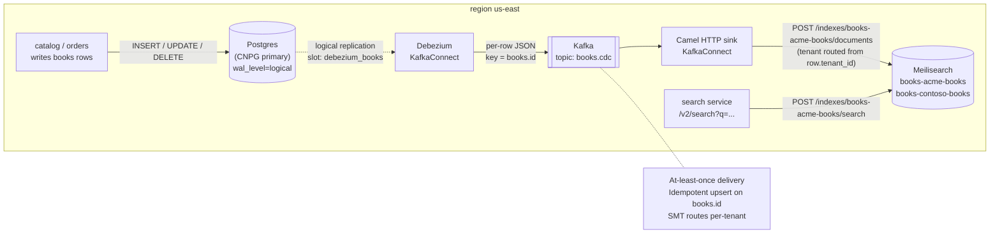
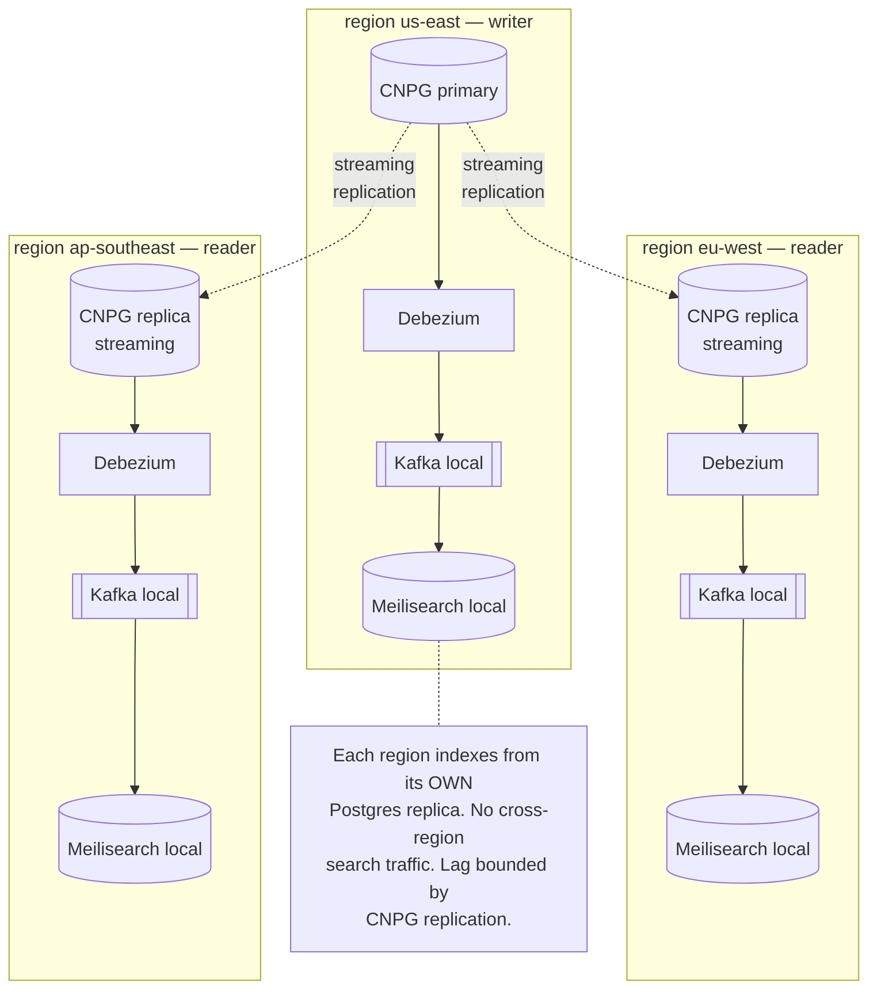

# 13.05 — Search and product discovery

> Meilisearch on Kubernetes, Postgres -> search index via Debezium CDC,
> per-tenant index isolation.

**Estimated time:** ~45 min read · half-day hands-on
**Prerequisites:** [Part 03 ch.05](../03-config-and-storage/05-stateful-data-patterns.md) — stateful patterns Meilisearch and Kafka rely on · [Part 13 ch.02](02-tenancy-and-crossplane-onboarding.md) — tenant boundary search must respect · [Part 13 ch.06](06-payments-and-event-sourcing.md) — Kafka/Strimzi infra Debezium publishes to
**You'll know after this:** • install Meilisearch on Kubernetes with PVC + auth + restricted PSA · • stand up Debezium against Postgres for change-data-capture · • design per-tenant index isolation (index-per-tenant vs filter-by-tenant) · • wire CDC events through Kafka into the search index in near-real-time · • plan reindexing + schema-evolution without downtime

<!-- tags: bookstore-v2, stateful, meilisearch, debezium, kafka, multi-tenancy -->

## Why this exists

The v1 Bookstore's `catalog` service answered "show me books" with
`SELECT id, title, author, price FROM books ORDER BY id`. That works for
four books at the top of [`bookstore/app/catalog/main.go`](../examples/bookstore/app/catalog/main.go).
It fails for the **real** e-commerce shape along five specific axes:

1. **No relevance ranking.** A `LIKE '%kubernetes%'` query against a
   million-row `books` table returns every match in primary-key order. A
   customer typing `kubernetes` wants the **best** match first, not the
   oldest-rowid match.
2. **No typo tolerance.** A customer types `kuberentes` (transposed `e`
   and `n`); the SQL `LIKE` returns zero rows. Real search engines match
   typos within a configurable edit distance.
3. **No filters or facets.** "Books with price under $30 by Marko Lukša"
   needs `WHERE price < 30 AND author = ?` plus a per-facet aggregate
   (count of books in each price bucket); SQL can do it but it's slow
   and you build the facet UI by hand.
4. **No autocomplete.** "Type-as-you-search" needs a sub-50 ms partial-
   match query; SQL `LIKE 'kuber%'` over a million rows is 500 ms+ even
   with a trigram index.
5. **The search workload poisons the OLTP path.** A heavy search query
   hits the same Postgres connections that orders + payments depend on;
   one bad query and checkout latency triples. Search needs its own
   data plane.

v2 ships a real search engine. The architecture is two pieces — an
**index** (Meilisearch, OpenSearch, Typesense, or Algolia) and a **way
to keep it in sync with Postgres** (Debezium CDC -> Kafka -> sink) —
each chosen with the operational shape of a Kubernetes e-commerce
platform in mind.

> **In production:** Teams hesitate to adopt a search engine because
> "Postgres full-text search is fine for now." It is — until the day it
> is not, and then you ship a search engine **under traffic** instead of
> **before** traffic. v2's discipline is to ship the search engine
> alongside the catalog before the LIKE query ever became a problem;
> the cost of the engine + CDC pipeline is multi-engineer days, the
> cost of ripping out LIKE at scale is multi-engineer weeks.

## Mental model

**Search = (an index) + (a way to keep it in sync). The index lives next
to your workloads; the sync uses change-data-capture; per-tenant
isolation is a per-tenant index name; cross-region is per-region
indexes fed by the local CDC pipeline.**

- **The index — Meilisearch.** Four candidates real teams pick from on
  Kubernetes:
  - **Meilisearch** — single Go binary, single process, low memory,
    typo-tolerant + relevant out of the box. The easiest operational
    story; one StatefulSet, one PVC.
  - **OpenSearch / Elasticsearch** — JVM, sharded, mature, vast
    ecosystem. The right pick for >100M documents, complex aggregations,
    full Elastic query DSL.
  - **Typesense** — C++, fast, simple. Smaller community than the
    others; comparable operational profile to Meilisearch.
  - **Algolia** — SaaS. Zero ops; per-search cost. The right pick if
    your team has no ops capacity and the search cost fits the unit
    economics.
  The platform v2 picks Meilisearch because the e-commerce shape (1M-10M
  books per tenant; typo tolerance + faceting + relevance the customer
  notices; one binary on K8s) is exactly where it shines. The chapter's
  comparison table walks the trade.
- **The sync — Debezium CDC, not application dual-writes.** Three ways
  to keep an index synchronized with a database:
  - **Application dual-write** — application writes to Postgres AND
    Meilisearch in one transaction. Simple; broken — there is no
    cross-system transaction, so a half-failed write leaves them out of
    sync. **Reject this pattern.**
  - **Application-emit-event** — application writes to Postgres + emits
    a Kafka event; a consumer applies the event to Meilisearch. Works
    but couples the application to the indexing path.
  - **Change-data-capture (Debezium)** — Postgres's write-ahead log
    (WAL) is the event stream; Debezium reads it and produces a Kafka
    topic. The application code does not change; the WAL is the source
    of truth. **This is what v2 ships.**
- **Per-tenant indexing — one index per tenant.** Each tenant gets
  `books-<TENANT_ID>` (e.g. `books-acme-books`, `books-contoso-books`).
  The sink connector reads each row's `tenant_id` column and writes to
  the matching index. Cross-tenant search is then **impossible by
  construction** — querying `books-acme-books` cannot return a
  contoso-books document because they live in different indexes.
- **Cross-region — same topology, per region.** Each region runs its
  own Meilisearch + Debezium + Kafka. CNPG's per-region replica is the
  Debezium source in that region (logical replication slot on the
  primary; the replica forwards the WAL stream). Search is **regional**;
  cross-region search consistency is eventual and bounded by the WAL
  replication lag. Sell the truth.

The trap to keep in view: **CDC is at-least-once.** Meilisearch writes
must be **idempotent** — the same Kafka message arriving twice writes
the same document version, not a duplicate. The sink uses the document's
primary key (the `books.id` column); Meilisearch upserts by primary key
deterministically.

## Diagrams

### Diagram A — CDC pipeline (Mermaid)



### Diagram B — multi-region (Mermaid)



### Diagram C — search-engine-choice matrix (ASCII)

```text
DIMENSION              MEILISEARCH       OPENSEARCH         TYPESENSE         ALGOLIA
─────────────────────  ────────────────  ─────────────────  ────────────────  ─────────────────────
Language               Go                Java (JVM)         C++               SaaS (closed)
K8s topology           1 StatefulSet     N-shard cluster    1 StatefulSet     external (HTTPS)
RAM per 1M docs        ~200 MB           ~2-4 GB            ~150 MB           N/A
Query latency p99      <50 ms            <50 ms             <30 ms            <50 ms
Typo tolerance         built-in          configurable       built-in          built-in
Facets / filters       built-in          built-in           built-in          built-in
Vector search          v1.3+             yes                v0.25+            yes
Multi-tenant pattern   index-per-tenant  index-per-tenant   collection-per-t  app-per-tenant
Cluster mode (HA)      v1.7+ exp         yes (mature)       yes               managed
Cost                   self-hosted       self-hosted        self-hosted       per query
When it wins           <10M docs/t,      >100M docs, full   speed > breadth   zero ops capacity
                       low ops cost      Elastic features
```

## Hands-on with the Bookstore Platform

Assumes the three regions from
[13.01](01-bookstore-2-from-toy-to-platform.md) are up and the platform-
base from 13.01 is applied. We work in `us-east`; the Argo CD
ApplicationSet (13.03) replicates this stack into `eu-west` and
`ap-southeast` automatically.

### 1. Install the Strimzi Kafka operator (pinned-Helm)

Phase 13b's three event-driven chapters (13.05, 13.06, 13.08) all use
Kafka. This chapter is the first to install it; 13.06 and 13.08 assume
it's there.

```sh
kubectl config use-context kind-bookstore-platform-us-east

STRIMZI_VERSION="0.40.0"

helm repo add strimzi https://strimzi.io/charts/
helm install strimzi-operator strimzi/strimzi-kafka-operator \
  --version "$STRIMZI_VERSION" -n kafka-system --create-namespace --wait
```

Confirm the operator is up:

```sh
kubectl -n kafka-system get pods
# NAME                                        READY   STATUS    RESTARTS   AGE
# strimzi-cluster-operator-...                1/1     Running   0          1m
```

### 2. Apply the Kafka cluster + node pool + topics

```sh
# Apply the cluster CR FIRST, then the node pool — Strimzi requires
# the cluster to exist before a KafkaNodePool can reference it. With
# `strimzi.io/node-pools: enabled`, the broker count + storage +
# resources live in the KafkaNodePool, not the Kafka CR.
kubectl apply -f examples/bookstore-platform/kafka/cluster.yaml
kubectl apply -f examples/bookstore-platform/kafka/nodepool.yaml
kubectl apply -f examples/bookstore-platform/kafka/topics.yaml

# Wait for the cluster (~2 minutes on kind)
kubectl -n kafka-system wait kafka/bookstore-platform-kafka \
  --for=condition=Ready --timeout=300s
```

What landed: a 3-broker KRaft cluster (combined broker + controller
nodes from the KafkaNodePool) + six topics (`books.cdc`, `orders.placed`,
`payments.completed`, `payments.failed`, `ml.predictions`, `ml.drift`).
The Pod manifest carries the restricted PSA shape; the storage is
per-broker PVCs of 10 GiB each.

### 3. Apply Meilisearch

```sh
kubectl apply -f examples/bookstore-platform/search/meilisearch.yaml

kubectl -n bookstore-platform-search rollout status statefulset/meilisearch
# statefulset rolling update complete 1 pods at revision ...
```

Test it directly (port-forward; production goes through the Istio
gateway):

```sh
kubectl -n bookstore-platform-search port-forward svc/meilisearch 7700:7700 >/dev/null 2>&1 &
sleep 3
curl -s http://localhost:7700/health
# {"status":"available"}
```

### 4. Pre-create the per-tenant indexes (idempotent)

Meilisearch auto-creates indexes on first write; explicit pre-creation
sets the primary-key + searchable-attributes up front:

```sh
MASTER_KEY=$(kubectl -n bookstore-platform-search get secret meilisearch-master-key -o jsonpath='{.data.master-key}' | base64 -d)

curl -s -X POST http://localhost:7700/indexes \
  -H "Authorization: Bearer $MASTER_KEY" \
  -H "Content-Type: application/json" \
  -d '{"uid":"books-acme-books","primaryKey":"id"}'

curl -s -X POST http://localhost:7700/indexes/books-acme-books/settings/searchable-attributes \
  -H "Authorization: Bearer $MASTER_KEY" \
  -H "Content-Type: application/json" \
  -d '["title","author"]'
```

### 5. Apply the Debezium connector

```sh
# Wait for CNPG primary to be Ready and wal_level=logical
# (CNPG sets this when `postgresql.parameters.wal_level: logical` is in
# the Cluster CR; ch.13.03 walks the CNPG install).

kubectl apply -f examples/bookstore-platform/search/debezium-connector.yaml

# KafkaConnect builds the Connect image with the Debezium + Camel
# plugins; first start takes ~3 minutes on kind.
kubectl -n kafka-system wait kafkaconnect/bookstore-platform-connect \
  --for=condition=Ready --timeout=600s
```

The KafkaConnect spec wires Kafka Connect's **FileConfigProvider** to
the Meilisearch master-key Secret via Strimzi's `externalConfiguration`:
the Secret named `meilisearch-master-key` (created with the StatefulSet
in step 3) is mounted into the Connect Pod at
`/opt/kafka/external-configuration/meili/`. The sink connector's
`Authorization: Bearer ${file:...:master-key}` placeholder resolves
against that path at start time, so the master key never appears in the
connector spec or `kubectl describe` output — it is injected at runtime.
Without this wiring every sink write returns 401 (Meilisearch runs with
`--env production`) and the index never receives a row.

> **If the KafkaConnector does not reach Ready after 10 minutes:**
> `kubectl -n kafka-system logs -l app.kubernetes.io/component=cdc` —
> look for `JDBC driver not found` (wrong plugin) or `FATAL: logical
> replication is not allowed for user` (missing REPLICATION role on the
> Postgres user).

Check both connectors land in RUNNING state:

```sh
kubectl -n kafka-system get kafkaconnector
# NAME                       CLUSTER                       CONNECTOR CLASS                                     MAX TASKS   READY
# books-cdc-source           bookstore-platform-connect    io.debezium.connector.postgresql.PostgresConnector  1           True
# books-meilisearch-sink     bookstore-platform-connect    org.apache.camel.kafkaconnector...                  1           True
```

### 6. Walk a row through the pipeline

```sh
# Insert a row into the books table (use the Postgres in CNPG; here the
# psql variable $DB_DSN is set from the per-tenant Secret).
psql "$DB_DSN" <<'SQL'
INSERT INTO books (id, title, author, price, tenant_id)
VALUES ('k8s-in-action', 'Kubernetes in Action', 'Marko Luksa', 49.99, 'acme-books');
SQL

# Wait ~3 seconds for the CDC pipeline.
sleep 5

# Verify the document is in Meilisearch.
curl -s "http://localhost:7700/indexes/books-acme-books/search?q=kubernetes" \
  -H "Authorization: Bearer $MASTER_KEY" | jq .
# {
#   "hits": [
#     {
#       "id": "k8s-in-action",
#       "title": "Kubernetes in Action",
#       "author": "Marko Luksa",
#       "price": 49.99,
#       "tenant_id": "acme-books"
#     }
#   ],
#   "query": "kubernetes",
#   "processingTimeMs": 2,
#   "limit": 20,
#   "offset": 0,
#   "estimatedTotalHits": 1
# }
```

### 7. Deploy the v2 search service

```sh
# Build the image (the source is at examples/bookstore-platform/app/search/)
cd examples/bookstore-platform/app/search
docker build -t bookstore-platform/search:dev .
kind load docker-image bookstore-platform/search:dev --name bookstore-platform-us-east

# Create the tenant ns + apply
kubectl create namespace bookstore-platform-acme-books --dry-run=client -o yaml | \
  kubectl label --local -f - \
    pod-security.kubernetes.io/enforce=restricted \
    pod-security.kubernetes.io/audit=restricted \
    pod-security.kubernetes.io/warn=restricted -o yaml | \
  kubectl apply -f -

kubectl apply -f deployment.yaml -f service.yaml
kubectl -n bookstore-platform-acme-books rollout status deployment/search
```

### 8. Curl the v2 endpoint through the Istio gateway

With the JWT obtained in [13.04 step 3](04-real-auth-keycloak-irsa-istio-jwt.md):

```sh
curl -sk -H "Authorization: Bearer $JWT" \
  "https://localhost:8443/api/v2/search?q=kuberentes"   # typo!
# {"hits":[{"id":"k8s-in-action","title":"Kubernetes in Action",...}],
#  "query":"kuberentes","processingTimeMs":3, ...}
```

Note the typo `kuberentes` matched `Kubernetes` — that's Meilisearch's
typo tolerance, the headline feature v1's SQL `LIKE` could not give.

## How it works under the hood

**Postgres logical replication is the WAL stream.** Debezium asks
Postgres to create a **replication slot** (`debezium_books`) and a
**publication** (also `debezium_books`). The slot is a server-side
cursor over the WAL; the publication declares which tables are
streamed. Debezium pulls the stream over the standard Postgres
replication protocol — the same protocol CNPG uses for its own
streaming standbys. Postgres `wal_level = logical` is required; with
`wal_level = replica` the WAL only carries page-level changes (enough
for physical streaming, not enough for row-level CDC).

**CDC is at-least-once.** A network blip between Debezium and Kafka
might cause Debezium to replay a WAL position it already shipped; the
same row event arrives twice. The sink connector handles this by
**idempotent writes** — Meilisearch's document-add API is a deterministic
upsert on the primary key. Adding a document with `id=k8s-in-action`
twice produces the same final state (the second write replaces the
first; Meilisearch tracks version numbers internally). No deduplication
work required at the application layer.

**Per-tenant index naming via SMT.** The Camel HTTP sink supports a
Single Message Transform that rewrites the URL template at runtime:
`/indexes/books-{{tenant_id}}/documents`. The transform reads the
`tenant_id` field from each Kafka message and substitutes it. One sink
connector instance handles N tenants — far simpler than N connector
instances. The chapter ships this pattern; the alternative ("route to
N topics, one sink per topic") is sketched in the README.

**Restart and replay semantics.** Debezium has two snapshot modes:

- `initial` — at first connector start, Debezium runs a full snapshot
  of the `books` table (all existing rows), then transitions to
  streaming. **This is what the connector ships.**
- `never` — Debezium starts at the current WAL position only; no
  backfill. Useful when the index is rebuilt by other means or
  pre-warmed.

On restart, Debezium reads the last-committed offset (stored in the
Connect cluster's offset topic) and resumes from that WAL position. If
the slot has been retained on the Postgres side (default), this works
transparently. If the slot was dropped (e.g. by a manual `DROP REPLICATION
SLOT`), Debezium reverts to `initial` mode and re-snapshots — usually
fine, but a multi-minute pause on a large table.

**Reindexing — blue-green vs rolling.** When the schema changes (a
new searchable attribute; a new ranking rule), you re-index. Two
strategies:

- **Rolling** — apply the new settings to the live index; Meilisearch
  re-indexes in the background; queries may temporarily lack the new
  ranking. Simple; brief inconsistency.
- **Blue-green** — index into `books-acme-books-v2` (new); swap the
  alias `books-acme-books` to point at `-v2` when ready; delete `-v1`.
  Zero inconsistency at query time; harder to operate. Production
  picks blue-green for any change that affects ranking; rolling for
  attribute-only changes.

## Production notes

> **In production:** **Reindexing strategies must be drilled.** A
> teammate adds a new searchable attribute, applies the schema change
> live, and the rolling reindex saturates the Meilisearch CPU — queries
> time out under load. The blue-green pattern + a `kubectl rollout
> status statefulset/meilisearch` runbook keeps the live index serving
> while the new one warms. Drill it in staging; rehearse the alias-swap
> command. The chapter's runbook (13.12) ships a step-by-step.

> **In production:** **The slow query in Postgres because the WAL got
> replicated to N consumers footgun.** Each replication slot is a
> server-side cursor that retains WAL until the consumer acknowledges
> it. If Debezium falls behind (or is paused for maintenance), the WAL
> grows unbounded on the primary — disk fills, the primary crashes.
> Set `max_slot_wal_keep_size` (Postgres 14+) to cap retained WAL
> per-slot; set Prometheus alerts on `pg_replication_slots.confirmed_
> flush_lsn` lag. The chapter cross-refs Part 06 ch.01 for the
> alerting shape.

> **In production:** **Meilisearch is stateful — back it up.** The
> StatefulSet's PVC is the source of truth; lose the PVC, lose the
> indexes. Meilisearch's snapshot API
> (`POST /snapshots`) writes a tarball to the data directory; a
> CronJob that copies the snapshot to S3 nightly is the minimum
> backup. Restoring is `meilisearch --import-snapshot snapshot.snapshot
> --master-key=...`. Reindexing from Postgres via Debezium also works
> as a recovery — but at hours-of-downtime cost for >10M docs.

> **In production:** **Cross-region search is eventually consistent;
> accept it.** A row inserted in us-east takes ~2-30 seconds to appear
> in the ap-southeast Meilisearch (CNPG replication lag + Debezium
> processing + Meilisearch indexing). For e-commerce this is fine —
> a customer browsing books does not need to see the *latest*
> millisecond. For inventory ("is this book in stock") run a separate
> check against the primary on the order path; don't depend on search
> for the buy decision. The chapter's runbook (13.12) calls this
> failure mode out explicitly.

> **In production:** **Index-as-a-throwaway pattern.** Treat the search
> index as a derived store you can always rebuild from Postgres. If
> the index gets corrupted, mis-indexed, or polluted by a bug, the
> recovery is "drop the index, restart the connector with
> `snapshot.mode: initial`, wait for the backfill". This is the same
> shape the chapter taught in [Part 12 ch.07](../12-kubernetes-for-machine-learning/07-ml-pipelines-and-workflows.md)
> for ML artifacts ("the model is recomputable from the training
> data") — applied to search.

## Quick Reference

```sh
# Install Strimzi (pinned)
STRIMZI_VERSION="0.40.0"
helm repo add strimzi https://strimzi.io/charts/
helm install strimzi-operator strimzi/strimzi-kafka-operator \
  --version "$STRIMZI_VERSION" -n kafka-system --create-namespace --wait

# Kafka cluster + node pool + topics (cluster must exist before the pool)
kubectl apply -f examples/bookstore-platform/kafka/cluster.yaml
kubectl apply -f examples/bookstore-platform/kafka/nodepool.yaml
kubectl apply -f examples/bookstore-platform/kafka/topics.yaml

# Meilisearch
kubectl apply -f examples/bookstore-platform/search/meilisearch.yaml

# Debezium + sink
kubectl apply -f examples/bookstore-platform/search/debezium-connector.yaml

# Confirm the pipeline
kubectl -n kafka-system get kafka,kafkatopic,kafkaconnect,kafkaconnector
kubectl -n bookstore-platform-search get statefulset,svc

# v2 search service
kubectl apply -f examples/bookstore-platform/app/search/deployment.yaml
kubectl apply -f examples/bookstore-platform/app/search/service.yaml
```

Minimal skeletons:

```yaml
# Strimzi KafkaConnector for Debezium Postgres
apiVersion: kafka.strimzi.io/v1beta2
kind: KafkaConnector
metadata:
  name: <NAME>
  namespace: kafka-system
  labels:
    strimzi.io/cluster: <CONNECT-CLUSTER-NAME>
spec:
  class: io.debezium.connector.postgresql.PostgresConnector
  tasksMax: 1
  config:
    database.hostname: <CNPG-RW-SVC>
    database.port: "5432"
    database.user: debezium
    database.password: "REPLACE-ME-VIA-ESO-NOT-IN-SOURCE"
    database.dbname: <DB>
    table.include.list: public.<TABLE>
    slot.name: <SLOT>
    publication.name: <PUBLICATION>
    snapshot.mode: initial
    topic.prefix: <PREFIX>
---
# Meilisearch index settings (curl, not YAML — Meilisearch has no CRD)
# POST /indexes/<INDEX>/settings/searchable-attributes ["title","author"]
# POST /indexes/<INDEX>/settings/filterable-attributes ["price","tenant_id"]
```

Checklist (search wired correctly when all five are yes):

- [ ] Postgres `wal_level = logical` AND a replication slot named in the
      Debezium config exists.
- [ ] `KafkaTopic books.cdc` is Ready with 3 partitions / 3 replicas.
- [ ] `KafkaConnect bookstore-platform-connect` builds successfully and
      both `KafkaConnector`s are Ready.
- [ ] Per-tenant indexes exist in Meilisearch (`books-<TENANT>` for each
      onboarded tenant) and accept a `/search?q=...` query.
- [ ] Cross-region: each region's Debezium has its own slot on the local
      CNPG replica; lag is < 30 s in steady state.

## Test your understanding

> Try each before opening the answer drawer. The act of trying is the exercise; the answer is the check.

1. **Why CDC via Debezium → Kafka → Meilisearch instead of "update the search index from the app"?**
   <details><summary>Show answer</summary>

   App-driven sync has three failure modes: (1) **Dual-write inconsistency** — app commits to Postgres but crashes before publishing to Meilisearch; search and DB diverge silently. (2) **Coupling** — every service that writes to `books` needs to know about the search index, doubling the surface area. (3) **No replay** — if Meilisearch crashes and you need to reindex, app code has to scan and republish. CDC solves all three: Debezium reads the WAL (which Postgres commits atomically), publishes to Kafka (durable), and the search-index consumer is decoupled and replayable from any offset. The DB is the source of truth; the index is a projection.

   </details>

2. **You're designing per-tenant index isolation. Compare "index-per-tenant" vs "single index with tenant-id filter."**
   <details><summary>Show answer</summary>

   **Index-per-tenant** (`books-acme`, `books-bigco`): strong isolation, tenant A can't accidentally search tenant B's data, you can drop tenant B's index without touching A, you can scale per-tenant. Cons: more indices (Meilisearch RAM/disk overhead), schema changes touch N indices, cross-tenant analytics need fan-out. **Single index + filter**: cheaper at low tenant count, simpler schema evolution, easier cross-tenant analytics. Cons: filter-bypass is a serious bug (one missed `WHERE tenant_id=X` in the search code leaks data), index size grows unboundedly, no per-tenant tuning. v2 picks index-per-tenant because the isolation guarantee is non-negotiable. Below ~100 tenants this is cheap; above that you reassess.

   </details>

3. **Debezium replication slot on the Postgres primary is at 12 GB and growing — Postgres disk is filling. What's happening and what do you do?**
   <details><summary>Show answer</summary>

   Postgres retains WAL segments until every replication slot has consumed them. Debezium is either (a) down/slow and not consuming, (b) the Kafka cluster is down so the connector retries forever holding the slot, (c) the connector was deleted but its slot wasn't dropped. Immediate: `SELECT * FROM pg_replication_slots` — which slot is at the tail? If Debezium is down: bring it back up so it catches up. If the connector is gone: `SELECT pg_drop_replication_slot('slot_name')` *only after* confirming you'll do a full reindex (you've lost the change events past that point). Prevention: alert on slot lag, set `max_slot_wal_keep_size` to bound WAL retention (Postgres 13+) at the cost of breaking lagging slots.

   </details>

4. **Hands-on: insert 1000 rows into `books`, watch them flow Postgres → Debezium → Kafka → Meilisearch. Now stop the Meilisearch sink connector for 5 minutes, insert another 100 rows, then resume. What do you see?**
   <details><summary>What you should see</summary>

   While the sink connector is down, Debezium continues writing to Kafka — events accumulate in the topic. Postgres WAL retention holds because the Debezium slot is still consuming. When the sink resumes, Kafka has the consumer offset stored; the sink connector reads from its last committed offset and catches up. The 100 rows flow into Meilisearch as if no outage happened. RTT for the catch-up depends on throughput. This is the durability property of the Kafka log: consumers can be down, the producer keeps producing, the data is safe.

   </details>

5. **Schema change: you add a `published_at` column to `books`. What's the safe order of operations across Postgres → Debezium → Meilisearch?**
   <details><summary>Show answer</summary>

   (1) Add the column to Postgres with a default (or `NULL`). (2) Debezium will pick it up automatically on the next change event — Debezium produces full row state, so the new field appears in Kafka with subsequent events. Older rows have no event for the new column (their last update predates the schema change). (3) Backfill the Meilisearch index by either (a) updating every Postgres row (touching `updated_at`) to force a CDC event per row, or (b) running a manual reindex that reads from Postgres directly. (4) Add the new field to the Meilisearch index settings (`searchableAttributes`, `filterableAttributes`). Order matters: never delete a column from Postgres without first removing references in downstream consumers; never add a NOT NULL column without a default. Schema evolution is forward-only at the events layer.

   </details>

## Further reading

- **Ibryam & Huß, _Kubernetes Patterns_ 2e — *Event Sourcing* (ch.7)**
  — the change-data-capture + log-as-source-of-truth pattern this
  chapter specialises to Postgres -> Kafka -> Meilisearch.
- **Rosso et al., _Production Kubernetes_, ch.6 — "Stateful workloads"**
  — the StatefulSet + PVC shape Meilisearch needs.
- Official: **Meilisearch docs (Kubernetes deploy, scaling, snapshots)**
  <https://www.meilisearch.com/docs>; **Debezium Postgres connector**
  <https://debezium.io/documentation/reference/stable/connectors/postgresql.html>;
  **Strimzi KafkaConnect docs**
  <https://strimzi.io/docs/operators/latest/configuring.html#assembly-deployment-configuration-kafka-connect-str>;
  **Camel Kafka Connectors** (HTTP sink reference)
  <https://camel.apache.org/camel-kafka-connector/latest/connectors/camel-http-sink-kafka-sink-connector.html>.
