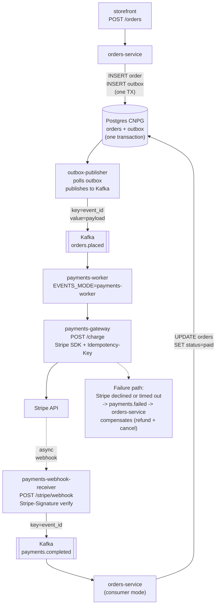

# 13.06 — Payments and event sourcing

> Stripe sandbox + the outbox pattern + Kafka via Strimzi + idempotent
> payments-worker + saga compensation + signed webhook verification.

**Estimated time:** ~60 min read · half-day hands-on
**Prerequisites:** [Part 09 ch.01](../09-end-to-end-bookstore/01-bookstore-end-to-end.md) — v1 Bookstore (incl. its payment flow) this chapter rebuilds · [Part 03 ch.05](../03-config-and-storage/05-stateful-data-patterns.md) — stateful patterns for Kafka topics · [Part 11 ch.05](../11-advanced-production-patterns/05-secrets-at-scale.md) — Vault-issued Stripe API keys
**You'll know after this:** • author the transactional outbox pattern in Postgres + Debezium → Kafka · • install Strimzi Kafka with PVC + JBOD + topic operators · • build an idempotent payments-worker that survives crash-mid-processing · • verify Stripe webhook signatures and trace a payment end-to-end · • compose a saga with compensating actions for refund / cancel flows

<!-- tags: bookstore-v2, stateful, kafka, debezium, security -->

## Why this exists

The v1 `payments-worker` ([`bookstore/app/payments-worker/main.go`](../examples/bookstore/app/payments-worker/main.go))
reads messages off a RabbitMQ queue and "processes" a payment for each
one. It is the right shape for the v1 lesson (KEDA-scaled worker; one
queue; one consumer). It is the **wrong shape for real money** in four
specific ways:

1. **RabbitMQ is dequeue-once.** A delivered message is removed from the
   queue; if the worker crashes mid-processing, the message is gone.
   Real payments need a **durable event log** the system can replay.
2. **No idempotency.** v1's worker increments a Prometheus counter and
   acks the message. Re-delivering the same message charges the
   customer twice. Real payments need **idempotent processing**
   (the second attempt is a no-op).
3. **No compensation.** If the order succeeded but the payment failed,
   v1 has no path to roll back the order. Real payments need **saga
   compensation** — explicit reverse-direction actions for the failure
   case.
4. **No webhook closure.** Real payment processors (Stripe, Adyen,
   Braintree) close the loop **asynchronously** — they POST a webhook
   when the charge actually completes (some charges take seconds, some
   take days for ACH). v1 has no path to receive that callback.

v2 fixes all four. The wiring is **the outbox pattern + Kafka + Stripe +
signed webhooks + a saga state machine**. Each piece is a known pattern
(Debezium calls outbox "the outbox pattern"; Stripe calls signed
webhooks "the standard"; sagas are textbook microservices); the chapter
walks each, applied to the Bookstore.

> **In production:** Payments code is the place a platform team gets
> woken up at 3am if it breaks. The eight pages that follow are the
> *minimum* discipline. Every shortcut you take here — skipping
> idempotency keys, accepting unverified webhooks, dual-writing to
> Kafka + Postgres — is paid back by an on-call incident at a time the
> team cannot afford one.

## Mental model

**Payments = (the API call to Stripe) + (the durable record of "we
attempted X") + (the asynchronous reconciliation when Stripe finalizes).
Each of the three pieces is durable, idempotent, and traceable.**

- **The outbox pattern — atomic writes via Postgres, async fan-out via
  Kafka.** The orders-service writes a new order. It needs to publish
  an `OrderPlaced` event to Kafka. It cannot do both in one transaction
  (Postgres + Kafka are different systems; 2PC is real and slow and
  fragile). The outbox pattern solves this with **one transaction**
  that writes the order row AND a row into an `outbox` table; a
  **separate publisher process** reads the outbox, publishes to Kafka,
  marks the row published. The Postgres transaction guarantees the
  outbox row is durable iff the order row is. The publisher then
  guarantees at-least-once delivery to Kafka. Out the other side: a
  durable event log of every order, replayable.
- **Idempotency keys — Stripe's + your own.** When the payments-worker
  calls Stripe, it MUST pass the order's `event_id` as Stripe's
  `Idempotency-Key` header. Stripe stores the first response for that
  key and returns the **same** response for any repeat call within
  24 h — guaranteeing the charge is created at most once. The
  worker also dedupes on the consumer side: it records the
  `event_id` -> `payment_intent_id` mapping in Postgres before
  acking the Kafka offset. A redelivered message sees the existing
  mapping and is a no-op.
- **Signed webhooks — verify before processing.** Stripe POSTs a webhook
  with a `Stripe-Signature` header (HMAC-SHA256 of the raw body + a
  timestamp, signed with the **webhook secret** Stripe shares with us).
  The receiver MUST verify the signature **before** parsing the body —
  an unverified webhook is a remote-code-execution-grade vulnerability
  (an attacker can POST a fake `payment_intent.succeeded` and trick the
  system into marking an order paid). The signature check is the trust
  boundary.
- **Saga compensation — explicit reverse paths.** If the
  payments-worker fails to call Stripe (sustained 5xx; payment-method
  declined; webhook never arrives within the timeout window), the
  system **must** roll back the order: refund any partial charge,
  release inventory, notify the customer. Saga compensation is the
  explicit "rollback step" for each forward step. The orders-service
  consumes a `payments.failed` topic and runs its compensation logic;
  no implicit transaction.
- **Two-phase commit is the path NOT taken.** 2PC across Kafka +
  Postgres would in theory give atomic dual-write. In practice it
  requires both systems to participate in a transaction manager, both
  have to be Up at commit time, both have to support the XA protocol —
  Kafka does not. The outbox pattern is the engineering-tractable
  alternative; the chapter walks the rejected 2PC path so the trade is
  explicit.

The trap to keep in view: **at-least-once + idempotent consumer is the
shape; exactly-once is a marketing term.** Kafka offers
"exactly-once-semantics" (EOS) — a producer-side transaction that ties
publish + offset-commit into one atomic Kafka operation. EOS is real;
it does not extend across Stripe + Postgres + Kafka. The platform v2
chooses the simpler at-least-once + dedupe pattern because the
end-to-end contract still gives "Stripe charged exactly once" via
Stripe's own idempotency key.

## Diagrams

### Diagram A — the outbox + Kafka + Stripe + webhook loop (Mermaid)



### Diagram B — outbox vs alternatives (ASCII)

```text
PATTERN                       DURABILITY    ATOMICITY        OPERATIONAL COST    WHEN IT WINS
────────────────────────      ───────────   ──────────────   ────────────────    ────────────────────────
Application dual-write        weak          NONE (two sys)   low                 NEVER
2PC (XA)                      strong        full             very high           legacy J2EE; not on K8s
Application-emits-event       medium        broken on crash  medium              when you control all consumers
Outbox pattern                strong        Postgres-atomic  low-medium          THIS (the chapter)
CDC-as-outbox (Debezium)      strong        Postgres-atomic  medium              when the schema is the contract
Event sourcing (full)         strongest     event log = SoT  high                when audit + replay are first-class
```

## Hands-on with the Bookstore Platform

Assumes ch.13.05 ran (Strimzi + Kafka cluster + topics live). CNPG from
ch.13.03 is the Postgres backend; the orders-service code lives at
[`../examples/bookstore/app/orders/`](../examples/bookstore/app/orders/)
(v1, unchanged; the v2 outbox extension is applied by the schema
migration below, not by editing v1's source).

### 1. Apply the outbox schema

```sh
kubectl config use-context kind-bookstore-platform-us-east

# Pre-existing DB_DSN from a per-tenant Secret (the BookstoreTenant
# Composition in ch.13.02 stamps a logical DB; the DDL applies in there).
psql "$DB_DSN" -f examples/bookstore-platform/payments/outbox-ddl.sql
```

Verify:

```sh
psql "$DB_DSN" -c '\d bookstore_platform.outbox'
#                                  Table "bookstore_platform.outbox"
#     Column     |           Type           | ...
# ---------------+--------------------------+----
#  event_id      | uuid                     | not null
#  aggregate     | text                     | not null
#  aggregate_id  | text                     | not null
#  event_type    | text                     | not null
#  payload       | jsonb                    | not null
#  tenant_id     | text                     | not null
#  created_at    | timestamptz              | not null default now()
#  published_at  | timestamptz              |
```

### 2. Build the events + payments-gateway images

```sh
# events (outbox publisher + payments-worker + drift-relay; ch.13.06 + 13.08)
cd examples/bookstore-platform/app/events
docker build -t bookstore-platform/events:dev .
kind load docker-image bookstore-platform/events:dev --name bookstore-platform-us-east

# payments-gateway (Stripe SDK + webhook receiver)
cd ../payments-gateway
docker build -t bookstore-platform/payments-gateway:dev .
kind load docker-image bookstore-platform/payments-gateway:dev --name bookstore-platform-us-east
```

### 3. Stripe key handling — sandbox vs mock

Two honest paths:

**(a) Real Stripe sandbox.** Sign up at <https://dashboard.stripe.com/>;
create a sandbox account; grab the `sk_test_...` key + the
`whsec_...` webhook secret from the dashboard. In production these are
ESO-injected from Vault (see
`examples/bookstore-platform/payments/stripe-eso-externalsecret.yaml`).

```sh
# Replace the placeholder Secrets with real values (PROD does this via ESO):
kubectl -n bookstore-platform-payments create secret generic stripe-api-key \
  --from-literal=api-key="sk_test_REPLACE-WITH-REAL-SANDBOX-KEY" \
  --dry-run=client -o yaml | kubectl apply -f -

kubectl -n bookstore-platform-payments create secret generic stripe-webhook-secret \
  --from-literal=webhook-secret="whsec_REPLACE-WITH-REAL-WEBHOOK-SECRET" \
  --dry-run=client -o yaml | kubectl apply -f -
```

**(b) Mock Stripe (kind-runnable; no Stripe account required).** Run
`stripe-mock`, a Stripe-API-compatible mock server they publish:

```sh
# Run stripe-mock as a Pod in the payments ns (pinned tag)
kubectl -n bookstore-platform-payments run stripe-mock \
  --image=stripe/stripe-mock:0.184.0 \
  --port=12111

kubectl -n bookstore-platform-payments expose pod stripe-mock --port=12111

# Patch payments-gateway to point at it
kubectl -n bookstore-platform-payments set env deployment/payments-gateway \
  STRIPE_API_BASE="http://stripe-mock:12111"
```

The chapter's curl tests work against (b) without a real Stripe account.

### 4. Apply the payments stack

```sh
kubectl apply -f examples/bookstore-platform/payments/outbox-publisher.yaml
kubectl apply -f examples/bookstore-platform/payments/payments-worker.yaml
kubectl apply -f examples/bookstore-platform/payments/payments-webhook-receiver.yaml
kubectl apply -f examples/bookstore-platform/payments/payments-webhook-authz.yaml
kubectl apply -f examples/bookstore-platform/app/payments-gateway/deployment.yaml
kubectl apply -f examples/bookstore-platform/app/payments-gateway/service.yaml

kubectl -n bookstore-platform-payments rollout status deployment/outbox-publisher
kubectl -n bookstore-platform-payments rollout status deployment/payments-worker
kubectl -n bookstore-platform-payments rollout status deployment/payments-webhook-receiver
kubectl -n bookstore-platform-payments rollout status deployment/payments-gateway
```

### 5. Walk an order through the full loop

```sh
# 1. Insert an order + its outbox row in ONE transaction
psql "$DB_DSN" <<'SQL'
BEGIN;
INSERT INTO orders (id, tenant_id, total_cents, currency, status)
VALUES ('order-001', 'acme-books', 4999, 'usd', 'pending');

INSERT INTO bookstore_platform.outbox
  (event_id, aggregate, aggregate_id, event_type, payload, tenant_id)
VALUES
  ('11111111-1111-1111-1111-111111111111', 'orders', 'order-001',
   'OrderPlaced',
   '{"event_id":"11111111-1111-1111-1111-111111111111","order_id":"order-001","amount_cents":4999,"currency":"usd","customer_id":"cust_demo"}'::jsonb,
   'acme-books');
COMMIT;
SQL

# 2. Wait for the outbox publisher to fan it out to Kafka
sleep 5

# 3. Confirm the outbox row was marked published
psql "$DB_DSN" -c "SELECT event_id, published_at FROM bookstore_platform.outbox WHERE event_id = '11111111-1111-1111-1111-111111111111';"
#               event_id                |          published_at
# --------------------------------------+-------------------------------
#  11111111-1111-1111-1111-111111111111 | 2026-05-20 14:23:01.234+00

# 4. Tail the payments-worker log; observe the Stripe call
kubectl -n bookstore-platform-payments logs -l app=payments-worker --tail=20
# {"level":"INFO","msg":"processed payment","event_id":"11111111-...","status":"succeeded"}

# 5. The Stripe-mock returns a synthetic webhook (or you trigger one via
#    the Stripe CLI: `stripe trigger payment_intent.succeeded`).
#    Confirm the orders-service updates the row to paid:
psql "$DB_DSN" -c "SELECT id, status FROM orders WHERE id = 'order-001';"
#     id    | status
# ----------+--------
#  order-001 | paid
```

### 6. Simulate a webhook attack — observe the rejection

```sh
# An unsigned POST to /stripe/webhook
kubectl -n bookstore-platform-payments port-forward svc/payments-webhook-receiver 8080:8080 >/dev/null 2>&1 &
sleep 3

curl -s -X POST -H "Content-Type: application/json" \
  -d '{"type":"payment_intent.succeeded","id":"evt_fake","data":{"object":{"id":"pi_fake"}}}' \
  http://localhost:8080/stripe/webhook
# {"error":"missing stripe-signature header"}

# A POST with a FAKE signature
curl -s -X POST \
  -H "Content-Type: application/json" \
  -H "Stripe-Signature: t=1700000000,v1=deadbeef" \
  -d '{"type":"payment_intent.succeeded"}' \
  http://localhost:8080/stripe/webhook
# {"error":"invalid signature"}

# A POST through the Istio AuthorizationPolicy WITHOUT the header — 403 at the gateway
# (the AuthZ policy refuses; never reaches the receiver)
```

The signature check is the trust boundary; an attacker who does not
know the webhook secret cannot forge a valid header for a body they
choose.

## How it works under the hood

**The outbox publisher loop.** A small process polls
`SELECT event_id, payload FROM outbox WHERE published_at IS NULL LIMIT 100`
every 2 seconds. For each row it publishes to Kafka with
`Key = event_id`; on success it UPDATEs `published_at = now()`. A
**Postgres advisory lock** ensures only one publisher Pod is active at
a time (the other two stand by; crash-failover is automatic). The
LIMIT 100 + a partial index on `WHERE published_at IS NULL` keeps the
scan fast even after years of history.

**The payments-worker loop.** A Kafka consumer subscribed to
`orders.placed` with `group.id = payments-worker`. For each message:

1. Begin a DB transaction.
2. Check the `payments` table for an existing row with this `event_id`;
   if it exists, the work is done — COMMIT empty TX, ack the message
   (idempotent path).
3. POST to `payments-gateway:8080/charge` with the payload.
4. On 2xx: INSERT `(event_id, payment_intent_id, status)` into
   `payments`; COMMIT; publish `payments.completed`; ack.
5. On 5xx: do NOT commit, do NOT ack — Kafka redelivers the message
   (the next attempt may succeed; or after N attempts the dead-letter
   handler kicks in).
6. On 4xx: COMMIT a record of the failure; publish `payments.failed`;
   ack (do not retry a permanent error).

**Stripe's idempotency contract.** The
`payments-gateway` binary passes `IdempotencyKey = event_id` on every
PaymentIntents call. Stripe stores the first response for that key for
24 hours; subsequent calls with the same key return the **same**
response — guaranteeing the charge is created at most once even if the
upstream POST is retried.

**Webhook signature verification.** Stripe's `Stripe-Signature` header
has the form `t=<TIMESTAMP>,v1=<SIGNATURE>`. The signature is HMAC-SHA256
of `<TIMESTAMP>.<RAW_BODY>` keyed by the webhook secret. The
verifier (a) checks `<TIMESTAMP>` is within a 5-minute window
(replay-attack defence), (b) recomputes the HMAC, (c) compares
constant-time. The Go `stripe-go/v76` SDK's
`webhook.ConstructEvent(body, sig, secret)` does all three; the
`payments-gateway` binary calls it before parsing the body.

**Saga compensation.** The saga compensation path subscribes to
`payments.failed` (a topic now declared in `kafka/topics.yaml`); the
events service's `payments-worker` mode is structured for this branch
— extending it to handle failure compensation is a one-`if`-branch
exercise left to the reader; the chapter ships the happy-path
completion implementation. The compensation logic shape:

```text
on payments.failed(event_id, order_id, reason):
  begin TX
    UPDATE orders SET status = 'cancelled', cancel_reason = $reason WHERE id = $order_id
    UPDATE inventory SET reserved = reserved - 1 WHERE order_id = $order_id
    INSERT INTO outbox (...) VALUES ('OrderCancelled', ...)   -- another event
  commit
  -- The OrderCancelled event triggers email-notification + refund-Stripe
```

The compensation is itself an event in the outbox — fully traceable.

**Two-phase commit (the rejected path).** XA/2PC needs a transaction
manager that both Postgres AND Kafka talk to. Postgres supports XA via
`PREPARE TRANSACTION`; Kafka does not have an XA broker. There are
projects (Apache Aries, Atomikos) that synthesize XA with non-XA
participants but they are operationally heavy + add a SPOF transaction
manager. The outbox pattern is strictly simpler: one durable system
(Postgres), the publisher is a stateless reconciler. Pick outbox.

**Cross-region: Stripe is global; the outbox is regional.** Stripe runs
once, globally — there is no "regional Stripe". Our outbox and Kafka
are regional (writes go to the writer region's CNPG primary; the
publisher in that region fans out to that region's Kafka). On a
writer-region failover (ch.13.03), the failing region's outbox stays
in its CNPG (becomes a reader); the new writer region's outbox
continues. Stripe webhooks point at the platform's edge DNS, which the
ch.13.03 DR drill flips to the new writer. No special multi-region
payment shape; standard active-active.

## Production notes

> **In production:** **Always verify webhook signatures.** This is the
> #1 footgun in payment integration. A service that accepts unsigned
> webhooks lets anyone POST a fake `payment_intent.succeeded` and gets
> the orders flipped to paid. Two defenses: (1) signature verification
> in the receiver (this chapter ships it); (2) IP-allowlist Stripe's
> documented webhook source IPs in the Istio AuthorizationPolicy
> (defence in depth). Never run a webhook receiver without signature
> verification — not "we'll add it later", not "the path is unguessable"
> — never.

> **In production:** **Idempotency keys MUST be persisted at write
> time, not generated at API-call time.** A common bug: the worker
> reads the Kafka message, generates a fresh UUID for the
> `Idempotency-Key`, calls Stripe. On retry, a fresh UUID is generated
> AGAIN — Stripe sees a new key, creates a SECOND charge. The
> idempotency key must come from a DURABLE source — in our case, the
> outbox row's `event_id`, which was committed to Postgres before the
> message was ever produced. The Kafka message's key carries it;
> the consumer reads it from the message; never generated in-process.

> **In production:** **Do NOT 2PC across Postgres + Kafka.** Tempting
> on paper; nightmare on call. The outbox pattern is the same
> durability guarantee with a fraction of the operational cost. The
> chapter is explicit about this rejected path so a future engineer
> "fixing" the outbox by introducing 2PC has the documented "no" to
> read.

> **In production:** **Replay-from-offset is the catastrophic-recovery
> story.** When you discover (say, three weeks later) that the
> payments-worker had a bug for an hour and 47 orders went out
> partial-paid, you have to replay. Kafka makes this concrete: set a
> new consumer group's `auto.offset.reset = earliest`, point it at
> `orders.placed`, let it reprocess. The outbox events are still
> there (7-day retention; production extends to 30 d for this exact
> use case). The chapter's runbook (13.12) ships the replay procedure;
> drill it in staging.

> **Replay from offset.** Kafka retains messages for the configured
> retention period; Debezium can resume from a saved offset on operator
> restart, AND consumers (the events service) can replay from a specific
> offset for catastrophic recovery. The cost: re-processing must be
> idempotent end-to-end (the events service's `event_id` dedup table is
> the key).

> **In production:** **Webhook idempotency on the receive side too.**
> Stripe occasionally redelivers a webhook (e.g. our receiver was
> briefly down). The receiver must dedupe on Stripe's `event.id`
> (a Stripe-side UUID that's stable across redeliveries). Persist
> received `event.id`s in a small DB table; reject duplicates with
> 200 (Stripe stops retrying on 2xx, so 200 is the right "I've seen
> this" response). The chapter cross-refs the dedupe table; production
> wires the table via a small CRUD in `payments-webhook-receiver`.

> **In production:** **Short-circuit Stripe in shadow mode during the
> migration cutover.** Before flipping production traffic from v1 to
> v2 (the ch.13.01 migration table), run the payments-gateway in
> **shadow mode**: it calls Stripe, but the response is logged and
> compared against v1's outcome — never propagated to the customer.
> Shadow for a week; cut over only when the parity is 100 %. The
> chapter walks the shadow-mode env var; production adds the parity
> dashboard (cross-ref 13.09).

## Quick Reference

```sh
# Schema
psql "$DB_DSN" -f examples/bookstore-platform/payments/outbox-ddl.sql

# Build images
cd examples/bookstore-platform/app/events && docker build -t bookstore-platform/events:dev .
cd examples/bookstore-platform/app/payments-gateway && docker build -t bookstore-platform/payments-gateway:dev .
kind load docker-image bookstore-platform/events:dev --name bookstore-platform-us-east
kind load docker-image bookstore-platform/payments-gateway:dev --name bookstore-platform-us-east

# Stripe key — placeholder; replace via ESO in prod
kubectl -n bookstore-platform-payments create secret generic stripe-api-key \
  --from-literal=api-key="sk_test_..." --dry-run=client -o yaml | kubectl apply -f -
kubectl -n bookstore-platform-payments create secret generic stripe-webhook-secret \
  --from-literal=webhook-secret="whsec_..." --dry-run=client -o yaml | kubectl apply -f -

# Apply the stack
kubectl apply -f examples/bookstore-platform/payments/outbox-publisher.yaml
kubectl apply -f examples/bookstore-platform/payments/payments-worker.yaml
kubectl apply -f examples/bookstore-platform/payments/payments-webhook-receiver.yaml
kubectl apply -f examples/bookstore-platform/payments/payments-webhook-authz.yaml
kubectl apply -f examples/bookstore-platform/app/payments-gateway/deployment.yaml
kubectl apply -f examples/bookstore-platform/app/payments-gateway/service.yaml

# ESO production wiring
kubectl apply -f examples/bookstore-platform/payments/stripe-eso-externalsecret.yaml
```

Minimal skeletons:

```sql
-- outbox table (Postgres)
CREATE TABLE outbox (
  event_id     uuid        PRIMARY KEY,
  aggregate    text        NOT NULL,
  aggregate_id text        NOT NULL,
  event_type   text        NOT NULL,
  payload      jsonb       NOT NULL,
  tenant_id    text        NOT NULL,
  created_at   timestamptz NOT NULL DEFAULT now(),
  published_at timestamptz NULL
);
CREATE INDEX outbox_unpublished_idx ON outbox (created_at) WHERE published_at IS NULL;
```

```yaml
# Strimzi KafkaConnector for the outbox publisher (alternative to the
# Go publisher: a Debezium outbox-EventRouter SMT that reads outbox
# rows directly via WAL CDC).
apiVersion: kafka.strimzi.io/v1beta2
kind: KafkaConnector
metadata:
  name: outbox-cdc
  namespace: kafka-system
  labels: { strimzi.io/cluster: bookstore-platform-connect }
spec:
  class: io.debezium.connector.postgresql.PostgresConnector
  tasksMax: 1
  config:
    database.hostname: <CNPG-RW>
    database.dbname: <DB>
    table.include.list: bookstore_platform.outbox
    transforms: outbox
    transforms.outbox.type: io.debezium.transforms.outbox.EventRouter
    transforms.outbox.route.by.field: aggregate
```

```go
// Stripe call with idempotency-key (extract; full source at
// examples/bookstore-platform/app/payments-gateway/main.go)
params := &stripe.PaymentIntentParams{
    Amount:   stripe.Int64(amountCents),
    Currency: stripe.String("usd"),
    Confirm:  stripe.Bool(true),
}
params.IdempotencyKey = stripe.String(eventID)  // <-- the critical line
pi, err := paymentintent.New(params)
```

Checklist (payments wired correctly when all six are yes):

- [ ] `outbox` table exists with the partial index on
      `WHERE published_at IS NULL`.
- [ ] `outbox-publisher` Pods are running 3 replicas; advisory-lock test
      shows only one publishes at a time.
- [ ] Stripe `Idempotency-Key` is set from the outbox `event_id` on every
      call (grep `payments-gateway` source for it).
- [ ] `payments-webhook-receiver` rejects requests without a valid
      `Stripe-Signature` header (curl test above).
- [ ] Saga compensation: a synthetic `payments.failed` event flips the
      order to `cancelled` and emits an `OrderCancelled` event.
- [ ] Replay: a new consumer group with
      `auto.offset.reset = earliest` against `orders.placed` reprocesses
      cleanly without double-charging (Stripe idempotency catches it).

## Test your understanding

> Try each before opening the answer drawer. The act of trying is the exercise; the answer is the check.

1. **What does the transactional outbox pattern solve that "write to DB then publish to Kafka" does not?**
   <details><summary>Show answer</summary>

   The dual-write problem: if the app commits the DB write and then crashes before publishing to Kafka, the event is lost — DB and Kafka are out of sync. With the outbox, the app commits *both* the business state and the outbox row in one Postgres transaction. A separate process (Debezium reading the WAL, or a poller with `SELECT ... FOR UPDATE SKIP LOCKED`) reads the outbox table and publishes to Kafka. Even if the publisher crashes, the row stays in the outbox and gets re-published on restart. The atomicity is on the Postgres side; Kafka is downstream and at-least-once. Idempotent consumers handle the duplicates.

   </details>

2. **Your payments-worker processes order X, calls Stripe, charges the customer, then crashes before writing "paid" to the DB. On restart, it processes order X again. What stops the customer being charged twice?**
   <details><summary>Show answer</summary>

   The Stripe `Idempotency-Key` header. On retry, the worker calls Stripe with the *same* idempotency key (derived from the order ID or outbox event ID). Stripe sees it already processed this key, returns the original response (success, charge ID), no second charge. The worker then completes the DB update. The discipline: every external side-effect call has an idempotency key tied to the originating event ID, and the key is *stable across retries*. Without this, every retry is a new charge. Idempotency keys are the bridge between at-least-once message delivery and exactly-once business outcomes.

   </details>

3. **A teammate proposes verifying Stripe webhooks by checking the source IP. Why is this insufficient?**
   <details><summary>Show answer</summary>

   IPs can be spoofed in some attack models, IPs change without notice (Stripe doesn't commit to a fixed IP range), and a NAT/proxy in your network may rewrite the source IP. The right verification is the `Stripe-Signature` header: HMAC-SHA256 of the request body with the webhook signing secret. The receiver recomputes the HMAC and constant-time-compares. This proves the message came from Stripe AND wasn't tampered with in flight. The signing secret comes from Vault/ESO and rotates independently. IP allowlists are defense-in-depth at the network layer (Istio AuthorizationPolicy with IP block), not a substitute for signature verification.

   </details>

4. **The saga: order placed → payment failed → compensating action. Walk through the events.**
   <details><summary>Show answer</summary>

   (1) `OrderPlaced{orderId, items, totalCents}` written to outbox → Kafka. (2) `payments-worker` consumes, calls Stripe with idempotency key = orderId, charge fails (declined card). (3) Worker writes `PaymentFailed{orderId, reason: card_declined}` to its outbox → Kafka. (4) `orders` service consumes `PaymentFailed`, updates order status to `cancelled` in DB transaction. (5) Outbox writes `OrderCancelled{orderId, reason}` → Kafka. (6) Inventory service consumes `OrderCancelled`, releases the held stock. Each step is local-state + local-event; the saga is the sequence, not a distributed transaction. Compensation = "did partial work, now undo via another event"; not "rollback the distributed transaction" because there isn't one.

   </details>

5. **Hands-on: stop the `payments-worker` Pod mid-charge — Stripe call succeeded but the DB hasn't been updated. Restart the Pod. What happens?**
   <details><summary>What you should see</summary>

   The Pod restarts, the consumer group resumes from the last committed offset (which is before the in-flight message because Kafka's commit-on-success policy means in-flight messages aren't acked). The worker re-reads the same event and calls Stripe again with the same idempotency key. Stripe returns the cached response: charge succeeded. The worker proceeds to update the DB and emit `PaymentSuccess`. Net effect: customer is charged once, DB is consistent, no manual reconciliation. This is the "crash-mid-processing" survivability property — earned by the combination of at-least-once Kafka delivery, idempotency keys, and outbox-based event publishing.

   </details>

## Further reading

- **Stripe — Webhooks docs (signature verification + best practices)**
  <https://docs.stripe.com/webhooks>.
- **Debezium — Outbox Event Router**
  <https://debezium.io/documentation/reference/stable/transformations/outbox-event-router.html>;
  the canonical "outbox pattern via CDC" reference.
- **Strimzi KafkaConnect** (Connect cluster + connectors)
  <https://strimzi.io/docs/operators/latest/configuring.html>.
- **Ibryam & Huß, _Kubernetes Patterns_ 2e — *Event Sourcing* (ch.7)**
  — the durable-event-log pattern this chapter applies to payments.
- **Microsoft Docs — Saga design pattern**
  <https://learn.microsoft.com/en-us/azure/architecture/reference-architectures/saga/saga>.
