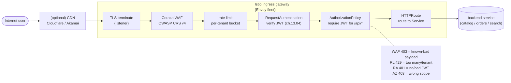

# 13.07 — Edge: Istio Gateway + Coraza WAF + per-tenant rate limiting

> Gateway API at the edge, Coraza WAF (ModSecurity-compatible OWASP CRS),
> per-tenant rate limiting via Envoy's local rate limiter.

**Estimated time:** ~45 min read · half-day hands-on
**Prerequisites:** [Part 02 ch.05](../02-networking/05-gateway-api.md) — Gateway API at the north-south edge · [Part 11 ch.04](../11-advanced-production-patterns/04-service-mesh.md) — Istio data plane behind the edge · [Part 13 ch.02](02-tenancy-and-crossplane-onboarding.md) — tenant identity rate-limits key off
**You'll know after this:** • author an Istio `Gateway` + `HTTPRoute` set at the edge with TLS termination · • deploy Coraza WAF with the OWASP Core Rule Set and verify it blocks SQLi / XSS · • configure Envoy local rate limiter scoped per tenant via headers/JWT claims · • compare local vs global rate limiting and choose for a traffic profile · • plan staged rollout of WAF rules to avoid false-positives killing traffic

<!-- tags: bookstore-v2, security, networking, istio, coraza, multi-tenancy -->

## Why this exists

The v1 Bookstore ran behind a vanilla NGINX Ingress. That is the right
shape for the v1 lesson (Part 02 ch.07 Ingress fundamentals; Part 09's
end-to-end capstone wiring). It is the **wrong shape for real
e-commerce** in three specific ways:

1. **No WAF.** A vanilla Ingress passes whatever the attacker sends.
   Common attacks — SQL injection (`?q=1' OR '1'='1`), XSS
   (`?q=<script>alert(1)</script>`), command injection (`?id=$(rm -rf /)`),
   path traversal (`/static/../../../etc/passwd`) — all reach the
   application unfiltered. Real e-commerce platforms run a Web
   Application Firewall (WAF) at the edge.
2. **No rate limiting.** A bot scraping the catalog at 10,000 req/s
   consumes pod resources meant for paying customers; a leaked API
   token is the difference between "we lost a thousand dollars" and
   "we lost a million" depending on whether per-tenant limits kick in.
3. **No bot detection.** A botnet hammering `/api/orders` from 10,000
   distinct IPs is functionally identical to a real flash sale unless
   the edge can tell them apart. Real edges do CAPTCHA challenges +
   IP reputation scoring at the WAF layer.

v2 fixes the first two (WAF + rate limit). Bot detection (the third)
is sketched in Production notes; the production answer is usually a
managed bot-detection vendor (Cloudflare, Akamai, hCaptcha) rather
than a self-hosted stack.

The chapter ships:

- **Gateway API** at the entry — the standardised replacement for
  Ingress, GA since Kubernetes 1.30. Replaces the
  `kubernetes.io/ingress.class: nginx` annotation soup with a typed
  `Gateway` + `HTTPRoute` resource pair.
- **Coraza** — the Go-native ModSecurity successor, loaded as an Envoy
  WASM filter on the Istio ingress gateway. Ships OWASP Core Rule Set
  v4 (sql-injection, xss, command-injection, path-traversal, file-
  upload, http-protocol-violation rules).
- **Envoy local rate limiter** — in-process token-bucket per worker,
  keyed per-tenant via the JWT claim extracted by a small Lua filter.

> **In production:** Teams put WAF behind their CDN's WAF (Cloudflare,
> AWS WAF, Akamai), not behind a self-hosted stack. That is the right
> call when the CDN's WAF is acceptable; the v2 platform ships the
> self-hosted variant because (a) some platforms are CDN-less by
> regulatory regime, (b) the OWASP CRS rules + Coraza shape is the
> same whether you run it self-hosted or buy it; the teaching
> artifact is the rule set.

## Mental model

**The edge does three jobs: terminate-TLS-and-route, defend (WAF +
rate limit + bot), authenticate (Part 13.04). v2 wires all three at
the Istio gateway; the request passes through five filters before
the application sees it.**

- **Gateway API at the edge — the v2 standard.** Three primitives:
  - `GatewayClass` — which controller implements `Gateway` (Istio,
    Envoy Gateway, Contour, Cilium). The platform v2 picks Istio
    because the mesh + the edge are the same Envoy fleet — one set
    of EnvoyFilters covers both layers.
  - `Gateway` — a logical load-balancer. Carries listeners (port +
    protocol + TLS), addresses, and `allowedRoutes`. One per
    cluster usually; per-tenant `Gateway`s are possible but operate
    at higher overhead.
  - `HTTPRoute` — how requests reaching the `Gateway` map to
    backend Services. Matches by path, header, method; routes to
    one or more backends with optional weighted split.
  Gateway API is **the** replacement for Ingress: Ingress will
  exist for backwards compatibility but no new features are being
  added. Greenfield uses Gateway API.
- **WAF — Coraza + OWASP CRS as a WASM filter.** Coraza is the
  ModSecurity successor: same rule format (`SecRule`), maintained
  upstream (ModSecurity itself is in EOL). The OWASP **Core Rule
  Set** is the canonical attack-pattern bundle:
  - 920000-929999 — protocol enforcement.
  - 930000-933999 — local file inclusion + path traversal.
  - 941000-941999 — XSS.
  - 942000-942999 — SQL injection.
  - 943000-943999 — session fixation.
  - 944000-944999 — Java-specific attacks.
  Each rule has an anomaly score; the request's total score is
  evaluated against a threshold (default: deny on anomaly >= 5).
  Coraza runs as an Envoy WASM filter — INSIDE the gateway Envoy
  process, no extra Pods, no extra hop.
- **Rate limiting — local in-Envoy, keyed per-tenant via the JWT
  claim.** Two flavours of rate-limiter Envoy supports:
  - **Local** — each Envoy worker maintains its own token-bucket;
    sum across N workers is approximate. Fast (no extra hop).
  - **Global** — Envoy calls a separate rate-limit-service (RLS) via
    gRPC; the RLS keeps a Redis-backed exact counter. Slower
    (extra hop per request).
  The platform v2 picks **local** because the per-tenant budget is
  per-edge-replica and the approximation is fine at the e-commerce
  shape. The chapter walks the global variant for the case "I need
  an exact cluster-wide budget".
- **Filter ordering matters.** Five filters, in order:
  1. TLS termination (the listener does this).
  2. **WAF (Coraza)** — block known-bad payloads.
  3. **Rate limit** — block too-many-from-one-tenant.
  4. **JWT authn (RequestAuthentication; ch.13.04)** — verify the
     bearer token.
  5. **AuthZ (AuthorizationPolicy; ch.13.04)** — require a JWT for
     `/api/*`.
  WAF before rate-limit because a rate-limited 429 to an attacker is
  worse signal than a WAF 403 (the attacker learns less). Rate-limit
  before JWT because rate-limiting on unauthenticated traffic is
  defence in depth — a botnet that does not have a valid JWT still
  consumes JWT-verifier CPU if it gets that far.

The trap to keep in view: **WAF is noisy out of the box.** CRS v4
trips on legitimate book titles that contain quotes, on URLs with
plus signs in the query, on POST bodies with HTML in them. The
chapter ships the production tuning loop: start in `DetectionOnly`
mode, watch the audit log, build a whitelist, flip to `On`.

## Diagrams

### Diagram A — request flow through the edge (Mermaid)



### Diagram B — WAF rules matrix (ASCII)

```text
ATTACK CLASS              SAMPLE PAYLOAD                 CRS RULE   COMMON FP
─────────────────────     ──────────────────────────     ────────   ──────────────────────────
SQL injection             ?q=1' OR '1'='1                942100     book title with quote
SQL injection (union)     ?q=1 UNION SELECT 1            942101     query containing "union"
XSS (script tag)          ?q=<script>alert(1)</script>   941100     embedded HTML preview
XSS (event handler)                 941160     legitimate img tag
Command injection         ?id=$(rm -rf /)                932100     shell-like search term
Path traversal            /static/../../../etc/passwd    930100     legitimate ../ in PATH_INFO
Local file inclusion      ?file=../../etc/passwd         930120     same as above
HTTP smuggling            Transfer-Encoding: chunked     921110     none — block
Bad user-agent            User-Agent: sqlmap             913100     none — block
```

### Diagram C — local vs global rate-limit (ASCII)

```text
DIMENSION              LOCAL RATE LIMITER           GLOBAL RATE LIMITER (RLS)
─────────────────────  ───────────────────────────  ────────────────────────────
Where                  in Envoy worker (in-process) external gRPC service
Accuracy               approximate (per-worker)     exact (Redis-backed)
Latency cost           ~0.1 ms                      ~1-3 ms (extra hop)
Operational            zero extra component         RLS Deployment + Redis
Per-tenant key         JWT claim via Lua/WASM       same
When it wins           per-gateway-replica fine     need exact cluster-wide budget
```

## Hands-on with the Bookstore Platform

Assumes ch.13.04 ran (Istio installed + JWT verify wired); ch.13.05 and
13.06 are useful but not strictly required to run this chapter.

### 1. Install the Gateway API CRDs

```sh
kubectl config use-context kind-bookstore-platform-us-east

# Standard channel (graduated APIs only)
kubectl apply -f https://github.com/kubernetes-sigs/gateway-api/releases/download/v1.1.0/standard-install.yaml

# Verify the CRDs
kubectl get crd | grep gateway.networking.k8s.io
# gatewayclasses.gateway.networking.k8s.io
# gateways.gateway.networking.k8s.io
# httproutes.gateway.networking.k8s.io
# referencegrants.gateway.networking.k8s.io
```

Istio 1.21+ ships Gateway API support enabled by default; we installed
1.23.2 in ch.13.04 so the controller is already there.

### 2. Apply the Gateway + HTTPRoutes

```sh
kubectl apply -f examples/bookstore-platform/edge/gateway.yaml

kubectl -n bookstore-platform get gateway,httproute
# NAME                                                  CLASS   ADDRESS   PROGRAMMED   AGE
# gateway.gateway.networking.k8s.io/bookstore-platform-edge   istio                 True         10s
#
# NAME                                                              HOSTNAMES   AGE
# httproute.gateway.networking.k8s.io/bookstore-platform-public                 10s
# httproute.gateway.networking.k8s.io/bookstore-platform-api                    10s
# httproute.gateway.networking.k8s.io/bookstore-platform-stripe-webhook         10s
```

The `Gateway` carries two listeners (HTTPS on 443, HTTP on 80); the
HTTPS listener uses a placeholder TLS Secret which production
replaces with a cert-manager-issued one.

### 3. Apply the Coraza WAF EnvoyFilter

```sh
kubectl apply -f examples/bookstore-platform/edge/coraza-envoy-filter.yaml

kubectl -n istio-system get envoyfilter coraza-waf
# NAME         AGE
# coraza-waf   5s

# Watch the Envoy worker fetch the WASM binary on first request
kubectl -n istio-system logs -l istio=ingressgateway --tail=20 | grep -i coraza
# ... wasm log: Coraza initialised; CRS rules loaded ...
```

### 4. Apply the per-tenant rate-limit EnvoyFilter

```sh
kubectl apply -f examples/bookstore-platform/edge/rate-limit-envoy-filter.yaml

kubectl -n istio-system get envoyfilter
# NAME                       AGE
# coraza-waf                 1m
# per-tenant-rate-limit      5s
```

### 5. Test the WAF (port-forward; production uses the cloud LB)

```sh
kubectl -n istio-system port-forward svc/istio-ingressgateway 8443:443 >/dev/null 2>&1 &
sleep 3

# 5a — legitimate request (200)
curl -sk -o /dev/null -w "%{http_code}\n" https://localhost:8443/static/index.html
# 200

# 5b — SQL injection (403, rule 942100)
curl -sk -o /dev/null -w "%{http_code}\n" "https://localhost:8443/api/v2/search?q=1' OR '1'='1"
# 403

# 5c — XSS (403, rule 941100)
curl -sk -o /dev/null -w "%{http_code}\n" "https://localhost:8443/api/v2/search?q=<script>alert(1)</script>"
# 403

# 5d — path traversal (403, rule 930100)
curl -sk -o /dev/null -w "%{http_code}\n" "https://localhost:8443/static/../../../etc/passwd"
# 403

# 5e — known-bad user-agent (sqlmap; 403, rule 913100)
curl -sk -o /dev/null -w "%{http_code}\n" -H "User-Agent: sqlmap/1.7" https://localhost:8443/api/v2/search?q=test
# 403
```

Sample WAF audit log entry (from the Coraza filter):

```sh
kubectl -n istio-system logs -l istio=ingressgateway --tail=5 | grep -i transaction
# {"transaction":{"id":"...","client_ip":"127.0.0.1","request":{"uri":"/api/v2/search?q=1%27%20OR%20%271%27%3D%271","method":"GET"},
#  "messages":[{"actionset":"deny","data":"Matched Data: \" OR \" found within ARGS:q","rule":{"id":"942100","msg":"SQL Injection Attack Detected via libinjection","severity":2}}]}
```

### 6. Test per-tenant rate limit

```sh
# First, get a JWT for tenant acme-books (from ch.13.04 step 3)
# ... assume $JWT is set ...

# Hammer the API: 105 requests in <10s. The local rate limiter is
# 100 / 10s / tenant; the 101st onward should return 429.
for i in $(seq 1 105); do
  curl -sk -o /dev/null -w "%{http_code}\n" \
    -H "Authorization: Bearer $JWT" \
    "https://localhost:8443/api/v2/search?q=test"
done | sort | uniq -c
# 100 200
#   5 429
```

The 429 response carries `Retry-After: 10` and the `x-rate-limit:
per-tenant` header — the client knows when to retry and the operator
sees which budget the request hit.

### 7. Tune CRS — flip a noisy rule to DetectionOnly

A real catalog has book titles like *"Don't Make Me Think"* — the
apostrophe trips rule 942100. The production tuning loop:

```sh
# Update the Coraza config patch (add a SecRuleRemoveById line for 942100
# ONLY on the catalog's request path, not the rest)
kubectl -n istio-system get envoyfilter coraza-waf -o yaml | \
  yq '.spec.configPatches[0].patch.value.typed_config.value.configuration.value += "\nSecRuleUpdateActionById 942100 \"phase:2,pass,log,auditlog\""' | \
  kubectl apply -f -
```

The chapter's Production notes lists the full tuning loop; here we
just sketch the shape.

## How it works under the hood

**Gateway API vs Ingress — the semantic differences.**

- **Roles.** Ingress collapsed everything into one resource; Gateway API
  splits **infra-team** concerns (the `Gateway` + listeners + TLS) from
  **app-team** concerns (the `HTTPRoute` + paths). A feature team can
  add an `HTTPRoute` referencing the platform's `Gateway` without
  needing rights to modify the gateway itself.
- **Typed routing.** Ingress had `kubernetes.io/ingress.class` +
  controller-specific annotations for header-based routing, weighted
  splits, retries, timeouts. Gateway API has typed fields for all of
  these (`spec.rules[].matches[].headers`, `spec.rules[].backendRefs[].weight`,
  `spec.rules[].timeouts`).
- **Cross-namespace routes.** An `HTTPRoute` in `tenant-ns` can target
  a `Gateway` in `bookstore-platform` if the Gateway's
  `allowedRoutes.namespaces.from: All` permits it (or a `ReferenceGrant`
  is explicit). Production usually restricts via `Selector` so only
  approved tenants can attach.

**Coraza WASM filter loading order.** Istio's EnvoyFilter `INSERT_BEFORE`
applies a filter relative to a named anchor. The chapter's Coraza
filter inserts BEFORE `envoy.filters.http.jwt_authn` (the JWT verifier
ch.13.04 wired). The rate-limit filter inserts BEFORE
`envoy.filters.http.router` (the last-stop dispatcher). Together with
the listener-level TLS termination, the request walks the filter
chain in the documented order.

**The WASM binary is OCI-distributed.** The EnvoyFilter declares the
WASM binary's HTTP URL (or `oci://` URL). Envoy pulls it on first
request; the binary is cached on the gateway Pod's filesystem. On
restart, Envoy re-pulls (or uses the cached copy if `--wasm-cache-dir`
is set). Production pins the OCI digest (`oci://...@sha256:<DIGEST>`)
so a re-tag of the upstream image cannot silently change behaviour.

**Token-bucket vs leaky-bucket.** Envoy's local rate limiter is a
**token bucket**: a bucket holds N tokens; each request consumes one;
the bucket refills `tokens_per_fill` every `fill_interval`. When the
bucket is empty, requests get 429 + `Retry-After`. The alternative —
**leaky bucket** — accumulates incoming requests and drains them at a
fixed rate. Envoy does not ship a leaky-bucket out of the box; the
**sliding-window** variant (a more accurate rolling-window counter)
is in the global RLS. Production picks token-bucket for the edge
because the operator-visible cost ("X req / Y seconds / tenant") is
familiar.

**Per-tenant key extraction — the Lua filter (chapter ships) and the
WASM alternative (production prefers).** The Lua filter reads the
base64 `x-jwt-payload` header, parses out `tenant`, sets a descriptor
the rate limiter keys on. Lua does NOT ship a base64 decoder in older
Istio versions — the chapter's ships a regex extractor (`match` on the
JSON text) which is correct only because Lua sees the decoded payload
*if Envoy's RequestAuthentication is configured to output a decoded
header* (some Istio versions do, some require WASM). The chapter walks
both paths; production usually picks a custom WASM filter that does
the base64 decode + parse correctly.

**Filter performance.** Coraza WAF adds ~2-5 ms per request on an
unaccelerated x86 box; the rate limiter adds ~0.1-0.5 ms. The TLS
terminate adds 5-15 ms on the first request per session (handshake);
zero ms on reused sessions. Total edge overhead at p99: ~10-20 ms.
For e-commerce this is fine; for sub-10-ms-budget paths
(real-time pricing) the platform would skip Coraza or run a stripped
CRS.

## Production notes

> **In production:** **OWASP CRS rule tuning.** CRS v4 is noisy. Plan
> for two weeks of `DetectionOnly` mode after rollout: every CRS rule
> firing is logged but not blocked; the team reviews the audit log
> daily; false-positive rules get added to a path-specific exclusion
> list (`SecRuleUpdateActionById <ID> "phase:2,pass,log,auditlog"`).
> After two weeks, flip to `On`. Skip this and the first day in
> production is a Slack flood of legitimate customers blocked.

> **In production:** **Rate-limit "thundering herd" on reset.** The
> token bucket refills at the `fill_interval` boundary; if 10,000
> clients hit the limit at second 5 and the bucket resets at second
> 10, all 10,000 retry simultaneously at second 10. Two mitigations:
> (1) jitter the `Retry-After` value (some clients respect it as
> "wait random(0, N)"); (2) the **sliding-window** variant (in global
> RLS) smooths the retry curve. The chapter calls this out; production
> pairs the local rate limiter with a CDN-side rate limit that's
> sliding-window for the same effect.

> **In production:** **WAF blocked but the attacker was legitimate**
> — the highest-friction misconfiguration. A legitimate customer
> types a book title with a quote; CRS 942100 fires; the request gets
> 403; the customer's checkout breaks. Two defences: (a) the tuning
> loop above; (b) a **trust list** for known-good clients (large
> customers' IP ranges, the platform team's own offices) that bypass
> CRS entirely. Maintain via a small annotation on the
> `AuthorizationPolicy`; the chapter sketches it.

> **In production:** **Bot detection — punt to a vendor.** Self-hosted
> bot detection is a deep rabbit hole (IP reputation, browser
> fingerprinting, behavioural scoring, CAPTCHA challenges). Real
> platforms buy this from a vendor — Cloudflare Bot Management,
> Akamai Bot Manager, hCaptcha Enterprise. The integration is
> usually "the vendor sets a cookie; the WAF checks the cookie".
> v2 sketches an EnvoyFilter that injects an hCaptcha challenge
> when a per-IP rate spike trips a threshold; the full integration
> is production-only.

> **In production:** **The CDN's WAF and yours run in series.** If
> you have a CDN with a WAF (most do), it runs **before** your
> origin's WAF. The CDN catches the volumetric attacks (DDoS,
> obvious scrapers); your origin's WAF catches the targeted ones
> (SQL-injection on a specific endpoint). They should overlap on
> the OWASP CRS rules to give defence in depth — the CDN's CRS may
> be a different version than yours, and *that* is the value of
> running both.

> **In production:** **Audit the audit log.** Coraza's audit log
> (`SecAuditLog /tmp/coraza-audit.log` in the chapter's config) is
> the forensic record of every blocked request. Ship it to Loki
> (ch.13.09); set Grafana queries for "top blocked rules over 24h",
> "top blocked tenants", "blocked-but-then-the-IP-also-succeeded-on-
> a-different-rule" (a sign of a tuning false positive). The
> chapter cross-refs the dashboard.

## Quick Reference

```sh
# Gateway API CRDs
kubectl apply -f https://github.com/kubernetes-sigs/gateway-api/releases/download/v1.1.0/standard-install.yaml

# Gateway + Routes
kubectl apply -f examples/bookstore-platform/edge/gateway.yaml

# WAF + rate limit
kubectl apply -f examples/bookstore-platform/edge/coraza-envoy-filter.yaml
kubectl apply -f examples/bookstore-platform/edge/rate-limit-envoy-filter.yaml

# Verify
kubectl get gateway,httproute -A
kubectl -n istio-system get envoyfilter

# Test (port-forward)
kubectl -n istio-system port-forward svc/istio-ingressgateway 8443:443 >/dev/null 2>&1 &
curl -sk "https://localhost:8443/api/v2/search?q=1' OR '1'='1"   # 403 from WAF
```

Minimal skeletons:

```yaml
# Gateway API Gateway
apiVersion: gateway.networking.k8s.io/v1
kind: Gateway
metadata: { name: <NAME>, namespace: <NS> }
spec:
  gatewayClassName: istio
  listeners:
    - name: https
      protocol: HTTPS
      port: 443
      tls:
        mode: Terminate
        certificateRefs:
          - kind: Secret
            name: <TLS-SECRET>
---
# Gateway API HTTPRoute
apiVersion: gateway.networking.k8s.io/v1
kind: HTTPRoute
metadata: { name: <NAME>, namespace: <NS> }
spec:
  parentRefs:
    - name: <GATEWAY-NAME>
  rules:
    - matches:
        - path: { type: PathPrefix, value: /api/v2 }
      backendRefs:
        - { name: <SVC>, port: 8080 }
---
# Coraza WAF EnvoyFilter (sketch — full file at edge/coraza-envoy-filter.yaml)
apiVersion: networking.istio.io/v1alpha3
kind: EnvoyFilter
metadata: { name: coraza-waf, namespace: istio-system }
spec:
  workloadSelector: { labels: { istio: ingressgateway } }
  configPatches:
    - applyTo: HTTP_FILTER
      match: { context: GATEWAY, listener: { filterChain: { filter: { name: envoy.filters.network.http_connection_manager, subFilter: { name: envoy.filters.http.jwt_authn } } } } }
      patch:
        operation: INSERT_BEFORE
        value:
          name: envoy.filters.http.wasm
          # ... typed_config carrying the OCI WASM URL + OWASP CRS rules
```

WAF rule tuning checklist:

- [ ] Start in `DetectionOnly` mode.
- [ ] Watch audit log for 14 days; daily review.
- [ ] Build path-specific exclusion list for legitimate-but-noisy rules.
- [ ] Flip to `On` after FP rate is < 1 / 1000 requests.

Checklist (edge wired correctly when all six are yes):

- [ ] Gateway API CRDs installed; `kubectl get gateway,httproute` shows
      the platform's `Gateway` is `PROGRAMMED: True`.
- [ ] Coraza WASM loaded; SQL-injection curl returns 403.
- [ ] Rate-limit fires after 100 req / 10 s / tenant; 429 includes
      `Retry-After: 10`.
- [ ] JWT verify (ch.13.04) still works (401 without token).
- [ ] WAF audit log is shipped to Loki (cross-ref 13.09).
- [ ] CRS exclusion list documented per noisy rule, scoped to a path.

## Test your understanding

> Try each before opening the answer drawer. The act of trying is the exercise; the answer is the check.

1. **Why is the WAF at the edge gateway and not in each app?**
   <details><summary>Show answer</summary>

   (1) **Single point of policy** — one CRS ruleset protects all services; otherwise every team reimplements input validation differently. (2) **No code change** — security can deploy a rule without an app release. (3) **Performance** — Envoy's WASM filter at the edge runs once per request; in-app middleware runs N times across services. (4) **Audit** — one WAF log to ship to Loki, not N. (5) **Defense-in-depth** — apps still validate inputs, but the WAF catches mass-exploit patterns (SQLi, XSS, command injection) before they reach the app. The trade is the false-positive risk: a WAF rule blocks a legitimate request from one customer, and now you're paging at 2am.

   </details>

2. **You enable OWASP CRS in "blocking" mode and the storefront's `/checkout` endpoint starts returning 403 for ~3% of customers. What's the staged-rollout discipline?**
   <details><summary>Show answer</summary>

   The CRS in blocking mode is rule-set-too-strict for most apps day-one. Discipline: (1) **Detection-only mode** for 1-2 weeks — CRS logs would-be-blocks but doesn't enforce; you collect false-positives. (2) **Per-path exclusions** — `/checkout` may legitimately POST JSON that triggers SQL keyword rules; add `SecRuleRemoveTargetById` for those exact rules on that path. (3) **Threshold tuning** — CRS uses an anomaly score; raise the threshold for low-criticality paths. (4) **Per-tenant overrides** when a tenant's specific API legitimately triggers a rule. (5) **Then enable blocking** with the false-positive rate as a metric: alert if `coraza_blocks_total > baseline + N` during deploy. Never go straight to blocking mode in production.

   </details>

3. **Compare local rate limiting (per-Envoy) vs global rate limiting (shared service) — when do you choose each?**
   <details><summary>Show answer</summary>

   **Local** (Envoy's `local_ratelimit`): each replica counts independently. If you have 10 storefront pods and a 100 req/s/tenant limit, each pod allows 100, total 1000. Simple, no coordination, no latency added. Good when (a) load is roughly balanced across pods, (b) you accept ~10x the limit at peak, (c) you don't have a shared store. **Global** (`global_ratelimit` + Redis or Envoy's RLS): all pods share a counter, hard 100 req/s/tenant total. Adds 1-5ms per request for the lookup, requires Redis, scales differently. Choose global for hard contractual limits ("tenant X gets exactly 1000 req/min"), local for noisy-neighbor protection where approximations are fine.

   </details>

4. **A tenant complains "we're getting rate-limited but our traffic spike is legitimate." What's the conversation and what's the technical answer?**
   <details><summary>Show answer</summary>

   First, validate: pull OpenCost + observability for that tenant — is the spike actually 10x baseline? If yes, the limit was set too conservatively. If no, it might be a buggy retry loop on their side. Technical: (a) raise the limit for that tenant via a per-tenant CR (e.g. `RateLimitOverride` with `tenant: acme, rps: 500`); (b) move them to a higher tier with a documented higher cap; (c) implement burst capacity (`refill_rate: 100/s, burst: 500`) so legitimate spikes are absorbed. The conversation matters: rate limits are a *product feature*, not a technical guardrail. Customers should know their limits, see usage dashboards, and have a path to increase them. Surprising customers with 429s is a churn risk.

   </details>

5. **Hands-on: send a SQL injection (`?id=1' OR '1'='1`) and a normal request through the gateway. Check the WAF audit log in Loki. What fields prove the block was correct?**
   <details><summary>What you should see</summary>

   The audit log entry shows `rule_id`, `severity`, `category` (e.g. `942100` SQL Injection), the `matched_data` (the offending substring), the `request_uri`, the `tenant` header. The 403 response includes a request ID that ties back to the log line. The normal request is logged at info level with `rule_id: 0` (no match). The fields together prove (a) which rule fired, (b) what input triggered it, (c) which tenant/request. This is what you give the customer when they complain about a false positive — "rule X fired on input Y because Z." Without rich audit logs, every WAF complaint becomes a black box.

   </details>

## Further reading

- **Coraza docs** <https://coraza.io/docs/>; the canonical OWASP
  CRS-compatible Go-native WAF.
- **OWASP Core Rule Set** <https://coreruleset.org/docs/>; the
  rule bundle Coraza ships.
- **Envoy local rate limiter docs**
  <https://www.envoyproxy.io/docs/envoy/latest/configuration/http/http_filters/local_rate_limit_filter>;
  the token-bucket reference.
- **Kubernetes Gateway API** <https://gateway-api.sigs.k8s.io/>; the
  v1 specification this chapter applies.
- **Istio Gateway API support**
  <https://istio.io/latest/docs/tasks/traffic-management/ingress/gateway-api/>.
- **Ibryam & Huß, _Kubernetes Patterns_ 2e — *Stateless Service*
  (ch.5)** — the request-response shape WAF + rate-limit specialise.
