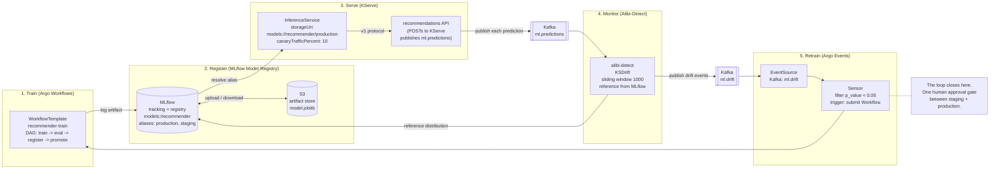

# 13.08 — Real ML loop: training -> registry -> serving -> drift -> retrain

> MLflow tracking + Model Registry; KServe serving with model canary;
> Alibi-Detect drift; Argo Events drift-triggered retrain. The full
> MLOps loop, closed.

**Estimated time:** ~60 min read · half-day hands-on
**Prerequisites:** [Part 12 ch.06](../12-kubernetes-for-machine-learning/06-model-serving-and-inference.md) — KServe serving baseline · [Part 12 ch.07](../12-kubernetes-for-machine-learning/07-ml-pipelines-and-workflows.md) — Argo Workflows + Events the loop closes · [Part 12 ch.08](../12-kubernetes-for-machine-learning/08-ml-platform-cost-and-mlops.md) — MLOps maturity frame
**You'll know after this:** • wire MLflow tracking + Model Registry as the canonical model store · • serve a KServe InferenceService with model canary against the production version · • configure Alibi-Detect (or similar) for input + prediction drift detection · • author Argo Events Sensor that triggers a retrain Workflow on drift · • close the full MLOps loop train → register → serve → monitor → retrain

<!-- tags: bookstore-v2, ml, mlops, kserve, mlflow, argo-workflows -->

## Why this exists

[Part 12 ch.06](../12-kubernetes-for-machine-learning/06-model-serving-and-inference.md)
served the recommender as a KServe `InferenceService`.
[Part 12 ch.07](../12-kubernetes-for-machine-learning/07-ml-pipelines-and-workflows.md)
trained it via an Argo `WorkflowTemplate` (train -> eval -> register ->
promote). [Part 12 ch.08](../12-kubernetes-for-machine-learning/08-ml-platform-cost-and-mlops.md)
closed Part 12 with the MLOps shape. Each chapter built one **piece**.
None of them wired the **full loop** with real components.

The v1 Bookstore's "register" step is the X3c-era ConfigMap stamp
([`bookstore/ml/pipeline/register-cm-template.yaml`](../examples/bookstore/ml/pipeline/register-cm-template.yaml))
— a small kubectl command that writes the model URI + score + timestamp
into a `ConfigMap recommender-model-registry-<WORKFLOW>`. It is the
right teaching artifact (no extra system to install) and the wrong
production artifact:

1. **A ConfigMap is not a registry.** It has no version stages
   (Staging / Production / Archived), no approval gates, no signed
   metadata, no UI, no API the rest of the stack can query.
2. **No drift detection.** A model in production today does not know
   if the input distribution it sees this Tuesday is the one it was
   trained on last Tuesday. Without drift detection, model staleness
   silently degrades predictions.
3. **No event-driven retraining.** v1's pipeline runs nightly via
   `CronWorkflow`. Real loops retrain **on signal** — when drift trips
   a threshold, when a new training-data batch lands, when a feature
   schema changes.

v2 wires the full loop with the production-shape components:

- **MLflow** — the model registry. Stages (None / Staging / Production
  / Archived), aliases (the v2 way: `models:/recommender@production`),
  full run + metric + artifact tracking, OpenAPI surface.
- **Argo Workflows** — the training engine (Part 12 ch.07 — re-used,
  not re-taught).
- **KServe** — the predictor with traffic split + canary (Part 12
  ch.06 — re-used; the chapter adds the **MLflow storage URI**
  + the canary metric gate).
- **Alibi-Detect** — the drift detector. Kolmogorov-Smirnov over a
  sliding window of predictions.
- **Argo Events** — the EventSource + Sensor that watches the drift
  topic and triggers retraining.

> **In production:** The full loop matters even if you do not yet have
> drift. The reason is **the auditability of "which model is serving
> which traffic"**. MLflow's Model Registry answers it; the ConfigMap
> registry does not. The chapter ships the loop because the registry
> is the foundation; drift and retrain are the pay-off.

## Mental model

**The MLOps loop has five stations connected by typed artifacts: a
training run produces a model; the registry assigns it a version + a
stage; the predictor serves the production-stage version; the drift
detector watches the predictor's output; the retrain trigger closes
the loop on drift. Every station is a Kubernetes resource; every
typed artifact is queryable.**

- **Station 1: Train (Argo Workflows).** A `WorkflowTemplate`
  (`recommender-train` in `examples/bookstore-platform/ml/training-
  workflow.yaml`) runs the DAG. Each step is a Pod. The train.py
  inside the `bookstore-platform/recommender-train` image
  `mlflow.start_run()`s, logs metrics + the `model.joblib` artifact,
  writes the run-id to a file Argo lifts as an output parameter.
- **Station 2: Register (MLflow Model Registry).** The `register`
  step calls `mlflow.register_model(runs:/<RUN_ID>/model,
  "recommender")` which creates a new version under
  `models:/recommender`. The next step `promote_to_alias` sets the
  `staging` alias on the new version. Production promotion is a
  **separate** Workflow that requires a human approval (the
  GitHub-PR-as-approval pattern).
- **Station 3: Serve (KServe).** A KServe `InferenceService` carries
  `storageUri: models://recommender/production`. KServe's
  MLflow storage initializer resolves the alias to a versioned S3
  artifact path at start; the predictor loads `model.joblib`.
  Traffic split: 90 % `production` / 10 % `staging` on subsequent rolls
  via the `canaryTrafficPercent` field.
- **Station 4: Monitor (Alibi-Detect).** A Deployment running the
  Alibi-Detect KSDrift detector consumes `ml.predictions` (each
  prediction the recommendations API produces is published here),
  maintains a sliding window of N records, runs Kolmogorov-Smirnov
  against a **reference window** (a snapshot of the training data
  feature distribution, fetched from MLflow at startup). On a
  threshold breach, publishes a `ml.drift` event with the feature
  name + the KS statistic + the p-value.
- **Station 5: Retrain (Argo Events).** An `EventSource` watches
  Kafka `ml.drift`; a `Sensor` filters for `p_value < threshold` and
  submits the `recommender-train` Workflow again. The loop closes.

The trap to keep in view: **the drift detector can trip on seasonal
data** that is not really "drift" in the model-quality sense — the
distribution legitimately shifts in December (holiday shoppers buy
different books). Reference window must be **per-season** or per-
"context"; a single static reference distribution from "the training
data" will cause runaway retraining. The chapter walks the seasonal
reference pattern.

## Diagrams

### Diagram A — the 5-station loop (Mermaid)



### Diagram B — Part 12 vs Part 13 contribution (ASCII)

```text
STATION       PART 12 TAUGHT                  PART 13.08 ADDS
────────────  ──────────────────────────────  ─────────────────────────────────────
1. Train      Argo WorkflowTemplate (12.07)   MLflow log_artifact + register call
2. Register   ConfigMap stamp (12.07 X3c)     MLflow Model Registry + alias
3. Serve      KServe InferenceService (12.06) models:// storage URI + canary slot
4. Monitor    (none)                          Alibi-Detect KSDrift Deployment
5. Retrain    CronWorkflow nightly (12.07)    Argo Events EventSource + Sensor
Honest        rule-based recommender          real loop, drift-triggered retrain
```

## Hands-on with the Bookstore Platform

Assumes ch.13.05 ran (Strimzi + Kafka topics exist); the two ML topics
(`ml.predictions` and `ml.drift`) are declared in `kafka/topics.yaml`
and reconciled by Strimzi's Topic Operator.

### 1. Install Argo Workflows + Argo Events (pinned-Helm)

```sh
kubectl config use-context kind-bookstore-platform-us-east

ARGO_WORKFLOWS_VERSION="0.42.0"
ARGO_EVENTS_VERSION="2.4.0"

helm repo add argo https://argoproj.github.io/argo-helm
helm install argo-workflows argo/argo-workflows \
  --version "$ARGO_WORKFLOWS_VERSION" \
  -n argo --create-namespace --wait
helm install argo-events argo/argo-events \
  --version "$ARGO_EVENTS_VERSION" \
  -n argo-events --create-namespace --wait
```

(KServe + Knative + cert-manager are assumed installed from the Part 12
ch.06 hands-on; if not, follow that chapter first.)

### 2. Install MLflow

```sh
# Via Argo CD Application (the GitOps path)
kubectl apply -f examples/bookstore-platform/ml/mlflow-application.yaml

# Or directly via Helm (the imperative path the chapter shows for clarity)
MLFLOW_CHART_VERSION="0.10.0"

helm repo add community-charts https://community-charts.github.io/helm-charts
helm install mlflow community-charts/mlflow \
  --version "$MLFLOW_CHART_VERSION" \
  -n mlflow --create-namespace --wait \
  --set 'backendStore.postgres.enabled=true' \
  --set 'backendStore.postgres.host=bookstore-platform-cnpg-rw.cnpg-system.svc.cluster.local' \
  --set 'backendStore.postgres.database=mlflow' \
  --set 'backendStore.postgres.user=mlflow' \
  --set 'backendStore.postgres.password=REPLACE-ME-VIA-ESO-NOT-IN-SOURCE' \
  --set 'artifactRoot.s3.enabled=true' \
  --set 'artifactRoot.s3.bucket=bookstore-platform-mlflow-us-east'
```

Why community-charts/mlflow (not bitnami/mlflow): community-charts is
upstream-aligned + actively maintained; bitnami packages add the
Bitnami conventions which are great if you standardise on Bitnami
cluster-wide. Pick one; the platform v2 picks community-charts.

Verify:

```sh
kubectl -n mlflow port-forward svc/mlflow 5000:5000 >/dev/null 2>&1 &
sleep 3
curl -s http://localhost:5000/api/2.0/mlflow/registered-models/list | jq .
# {"registered_models":[]}
```

### 3. Apply the training Workflow + serving InferenceService + drift detector + retrain trigger

```sh
kubectl apply -f examples/bookstore-platform/ml/training-workflow.yaml
kubectl apply -f examples/bookstore-platform/ml/inferenceservice.yaml
kubectl apply -f examples/bookstore-platform/ml/alibi-detect-drift.yaml
kubectl apply -f examples/bookstore-platform/ml/argo-events-drift-trigger.yaml
```

What landed:

```sh
kubectl -n bookstore-platform-ml get workflowtemplate,inferenceservice,deploy,eventsource,sensor
# NAME                                                AGE
# workflowtemplate.argoproj.io/recommender-train      30s
#
# NAME                                                URL  READY                                          AGE
# inferenceservice.serving.kserve.io/recommender                                                          30s
#
# NAME                            READY   UP-TO-DATE   AVAILABLE   AGE
# deployment.apps/alibi-detect    1/1     1            1           30s
#
# NAME                                                AGE
# eventsource.argoproj.io/ml-drift-eventsource        30s
#
# NAME                                                AGE
# sensor.argoproj.io/ml-drift-sensor                  30s
```

### 4. Submit a manual training run

```sh
argo submit --from workflowtemplate/recommender-train -n bookstore-platform-ml
# Name:                recommender-train-abc12
# Namespace:           bookstore-platform-ml
# ServiceAccount:      recommender-train
# Status:              Pending
# Created:             ...

# Watch:
kubectl -n bookstore-platform-ml get wf -w
```

After completion (~3-5 min on kind):

```sh
# MLflow logged the run + registered the new model version
curl -s http://localhost:5000/api/2.0/mlflow/registered-models/get?name=recommender | jq .
# {
#   "registered_model": {
#     "name": "recommender",
#     "latest_versions": [
#       { "version": "1", "current_stage": "Staging", ... }
#     ]
#   }
# }
```

### 5. Promote the new version to Production (the human-approval gate)

Production promotion is INTENTIONALLY not automatic. The chapter's
recommended pattern: a GitHub PR that updates a `models.yaml` file
under `examples/bookstore-platform/ml/`; the merge of the PR triggers
an Argo CD sync that runs a small Workflow `promote-production.yaml`.

A simpler kind-runnable approximation:

```sh
# Via the MLflow API directly (PROD: do this via an Argo Workflow
# whose ServiceAccount is bound to a Vault-protected token):
curl -s -X POST "http://localhost:5000/api/2.0/mlflow/registered-models/alias" \
  -H "Content-Type: application/json" \
  -d '{"name":"recommender","alias":"production","version":"1"}'

# KServe re-resolves the alias on next pod restart.
kubectl -n bookstore-platform-ml rollout restart inferenceservice/recommender
```

### 6. Generate predictions (to feed the drift detector)

```sh
# Recommendations API (assumes ch.13.08's app/recommendations/ is deployed)
for i in $(seq 1 1100); do
  curl -sk -H "Authorization: Bearer $JWT" \
    -X POST \
    -H "Content-Type: application/json" \
    -d "{\"user_id\":\"u-$i\",\"features\":[0.5,0.3,0.2]}" \
    https://localhost:8443/api/v2/recommendations >/dev/null
done

# 1100 records hit ml.predictions; the drift detector has its sliding
# window full now.
```

### 7. Inject drift (synthetic) to fire the loop

```sh
# Send 200 predictions with shifted features (drift the distribution)
for i in $(seq 1 200); do
  curl -sk -H "Authorization: Bearer $JWT" \
    -X POST \
    -H "Content-Type: application/json" \
    -d "{\"user_id\":\"u-d-$i\",\"features\":[5.0,3.0,2.0]}" \
    https://localhost:8443/api/v2/recommendations >/dev/null
done

# Watch the drift detector log
kubectl -n bookstore-platform-ml logs -l app=alibi-detect --tail=20
# {"level":"INFO","msg":"drift detected","feature":"price","ks":0.41,"p_value":0.003}

# The Sensor fires; a new Workflow is submitted
kubectl -n bookstore-platform-ml get wf
# NAME                                         STATUS      AGE
# recommender-train-abc12                      Succeeded   10m
# recommender-train-on-drift-xyz34             Running     30s
```

The loop closed: prediction -> drift detection -> retrain Workflow.

## How it works under the hood

**MLflow Model Registry API.** Four key endpoints:

- `POST /api/2.0/mlflow/runs/create` — start a run.
- `POST /api/2.0/mlflow/runs/log-artifact` — upload `model.joblib` to
  S3, link to run.
- `POST /api/2.0/mlflow/registered-models/create-version` — register
  a run's artifact as a new version under the named model.
- `POST /api/2.0/mlflow/registered-models/alias` — point an alias
  (`production`, `staging`) at a specific version.

The pre-2.0 API used **stages** (`None`/`Staging`/`Production`/
`Archived`); MLflow 2.0+ recommends **aliases** because aliases are
multi-valued (you can have two `canary` versions) and stages are
single-valued + capitalised + named-from-a-fixed-set. v2 uses aliases.

**KServe storage initializer for MLflow.** KServe 0.12+ ships a
`models://` URI scheme (the MLflow standard form). At Pod start, an
init-container reads the URI, calls MLflow's API to resolve the alias
to an S3 path, downloads the artifact, mounts it into the predictor
container at the standard `/mnt/models` path. Authentication: an
`mlflow-credentials` Secret (token-based) is mounted into the
init-container; production grades that to a per-tenant token.

**Canary at the InferenceService level.** KServe's
`canaryTrafficPercent: 10` field is meaningful **only on subsequent
rolls** — changing the `storageUri` after the first apply. On first
apply the InferenceService has a single revision and serves 100 % of
traffic from it; the canary field is read when the next storageUri
update lands. The flow: after the first deploy, change the
`storageUri` to point at the `staging` alias; KServe creates a second
revision and `canaryTrafficPercent: 10` routes 10 % to it (90 % stays
on the previous revision). The two slots are distinct Knative
Revisions (each a Deployment under the hood). A promote operation
flips the `production` alias in MLflow; KServe restarts the
Production-slot Pod which re-resolves to the new version.

**Alibi-Detect — the KS test.** Kolmogorov-Smirnov is a non-parametric
two-sample test: given two empirical distributions (reference window
+ current window), it computes a statistic `D = sup |F_ref(x) -
F_cur(x)|` (the maximum distance between the empirical CDFs).
Under the null hypothesis (same distribution), `D * sqrt(n)` follows
a known distribution; a p-value < 0.05 rejects the null (drift
detected). KSDrift is univariate — applied per feature. For
multivariate drift, **MMDDrift** (Maximum Mean Discrepancy) is the
standard alternative; the chapter walks both.

**Argo Events EventSource -> Sensor flow.** The `EventSource` is a
Pod that subscribes to Kafka (or HTTP webhook, or SQS, or...) and
republishes events on Argo Events's internal NATS bus. The `Sensor`
is a Pod that subscribes to that bus, filters events by
`dependencies[].filters`, and on a match issues a trigger — in our
case, a Kubernetes `Workflow` resource via the `argoWorkflow`
trigger type. The end-to-end latency is sub-second; the loop closes
within seconds of drift detection.

**Promotion gates — the GitHub-PR-as-approval pattern.** Production
promotion is intentionally a human gate. Three patterns:

1. **Manual `kubectl`**: an engineer runs the `mlflow alias` API call
   when satisfied. Simple; no audit trail.
2. **GitHub PR** (the chapter's recommendation): a file
   (`models.yaml`) under the repo declares the active version per
   alias; a PR changes the version; merge triggers Argo CD sync
   which runs a small Workflow that calls MLflow. **Full audit
   trail via Git history.**
3. **Backstage TechDoc approval**: a Backstage form in the
   developer portal kicks off the same Workflow with a documented
   approver chain. **Most user-friendly; most overhead.**

The platform v2 ships (2); (3) is covered in ch.13.11.

## Production notes

> **In production:** **Model promotion gates — don't auto-promote.**
> The training Workflow only promotes to **Staging**. Production
> promotion is the human gate. The cost of auto-promotion is the day
> the new model is worse than the old one and there is no one to say
> stop. The cost of a human gate is hours of latency between "the
> model is ready" and "it is serving"; budget for it.

> **In production:** **Shadow vs canary vs A/B — when which.** KServe
> supports both shadow (mirror traffic to a candidate without using
> the response) and canary (split a percentage of traffic to the
> candidate and use the response). Shadow is non-blocking — perfect
> for "is the new model materially different from the old?" Canary
> is blocking — perfect for "is the new model better?" A/B is
> canary with random user assignment + a metric over a long window
> — the right shape for "is the new model worth the risk of a 1 %
> regression?" The chapter sketches all three; production uses
> shadow for model-quality safety and canary for the real promote.

> **In production:** **The "drift detector triggered retrain but the
> new data is just seasonal" footgun.** This is the most common
> retrain-loop runaway. Three mitigations: (1) **seasonal reference
> windows** — store a reference distribution per month or per
> business-event-context; the drift test compares against the
> matching context window. (2) **Rate-limit the retrain** — the
> Sensor's filter ignores drift events within 6 hours of the last
> retrain. (3) **Two-stage drift** — only retrain when KS drift
> persists for >24 hours, not on a single window. The chapter's
> Sensor ships (2); (1) + (3) are production-graduates.

> **In production:** **Model rollback when canary fails.** A KServe
> canary that fails its metric gate must roll back fast. The flow:
> Prometheus alert on `recommender_p99_latency` > threshold for 5
> min -> a small Argo Workflow that resets `canaryTrafficPercent: 0`
> and rolls back the `production` alias to the previous version (a
> separate `previous` alias the promote Workflow maintains). Drill
> this in staging; the rollback runbook lives in ch.13.12.

> **In production:** **MLflow HA — the artifact store is S3, the
> tracking store is a real DB.** MLflow's default (SQLite in a
> volume) is a kind-runnable shortcut. Production wires
> `backendStore` to the CNPG cluster + `artifactRoot` to a per-region
> S3 bucket. Two MLflow replicas in front of the shared DB +
> bucket gives HA; the chart supports `replicaCount: 2` + a
> PodDisruptionBudget. Cross-region: per-region MLflow with
> cross-region S3 replication on the bucket; the registry metadata
> follows CNPG replication.

> **In production:** **Reference window staleness.** The reference
> window is "what the model thinks the world looks like" — usually
> the training data's feature distribution. After 6 months it is
> stale; the production distribution has legitimately moved and the
> drift test fires constantly. Solution: re-snapshot the reference
> window when a new model is promoted to Production. The promote
> Workflow stamps a fresh reference window into MLflow; the drift
> detector reloads it on the next iteration.

## Quick Reference

```sh
# Install (pinned)
ARGO_WORKFLOWS_VERSION="0.42.0"
ARGO_EVENTS_VERSION="2.4.0"
MLFLOW_CHART_VERSION="0.10.0"

helm repo add argo https://argoproj.github.io/argo-helm
helm install argo-workflows argo/argo-workflows --version "$ARGO_WORKFLOWS_VERSION" -n argo --create-namespace --wait
helm install argo-events argo/argo-events --version "$ARGO_EVENTS_VERSION" -n argo-events --create-namespace --wait

helm repo add community-charts https://community-charts.github.io/helm-charts
helm install mlflow community-charts/mlflow --version "$MLFLOW_CHART_VERSION" -n mlflow --create-namespace --wait

# Apply the loop
kubectl apply -f examples/bookstore-platform/ml/training-workflow.yaml
kubectl apply -f examples/bookstore-platform/ml/inferenceservice.yaml
kubectl apply -f examples/bookstore-platform/ml/alibi-detect-drift.yaml
kubectl apply -f examples/bookstore-platform/ml/argo-events-drift-trigger.yaml

# Submit a training run
argo submit --from workflowtemplate/recommender-train -n bookstore-platform-ml

# Promote staging -> production (PROD: via Argo Workflow + PR)
curl -s -X POST http://mlflow.mlflow.svc.cluster.local:5000/api/2.0/mlflow/registered-models/alias \
  -d '{"name":"recommender","alias":"production","version":"1"}' \
  -H "Content-Type: application/json"
```

Minimal skeletons:

```yaml
# Argo WorkflowTemplate (sketch — full at ml/training-workflow.yaml)
apiVersion: argoproj.io/v1alpha1
kind: WorkflowTemplate
metadata: { name: <NAME>, namespace: <NS> }
spec:
  entrypoint: pipeline
  templates:
    - name: pipeline
      dag:
        tasks:
          - { name: train, template: train-step }
          - { name: eval, template: eval-step, depends: train }
          - { name: register, template: register-step, depends: eval.Succeeded }
          - { name: promote, template: promote-step, depends: register.Succeeded }
---
# KServe InferenceService with MLflow URI
apiVersion: serving.kserve.io/v1beta1
kind: InferenceService
metadata: { name: <NAME>, namespace: <NS> }
spec:
  predictor:
    model:
      modelFormat: { name: sklearn }
      storageUri: "models://<MODEL>/<ALIAS>"
  canaryTrafficPercent: 10
---
# Alibi-Detect Deployment (sketch — see ml/alibi-detect-drift.yaml)
apiVersion: apps/v1
kind: Deployment
metadata: { name: alibi-detect, namespace: <NS> }
spec:
  template:
    spec:
      containers:
        - name: alibi-detect
          image: bookstore-platform/alibi-detect:1.0.0
          env:
            - { name: DRIFT_DETECTOR, value: "ks" }
            - { name: DRIFT_P_VALUE,  value: "0.05" }
            - { name: SLIDING_WINDOW_SIZE, value: "1000" }
---
# Argo Events EventSource + Sensor (sketch)
apiVersion: argoproj.io/v1alpha1
kind: EventSource
metadata: { name: <ES-NAME>, namespace: <NS> }
spec:
  kafka:
    drift-events:
      url: <KAFKA-BOOTSTRAP>
      topic: ml.drift
---
apiVersion: argoproj.io/v1alpha1
kind: Sensor
metadata: { name: <SEN-NAME>, namespace: <NS> }
spec:
  dependencies:
    - name: drift-event
      eventSourceName: <ES-NAME>
      eventName: drift-events
      filters:
        data:
          - { path: body.p_value, type: number, comparator: "<", value: ["0.05"] }
  triggers:
    - template:
        name: submit-retrain
        argoWorkflow: { operation: submit, ... }
```

Checklist (the ML loop closed when all seven are yes):

- [ ] MLflow tracking + registry installed; `registered-models/list`
      returns the recommender.
- [ ] `recommender-train` WorkflowTemplate submits cleanly; produces a
      Staging version in MLflow.
- [ ] KServe `InferenceService` resolves `models://recommender/production`
      and serves at /v1/models/recommender:predict.
- [ ] `canaryTrafficPercent` set; a fraction of traffic hits the staging
      slot.
- [ ] `alibi-detect` Pod is Running; reference window loaded from MLflow.
- [ ] Synthetic drift fires the Sensor; a new Workflow is submitted.
- [ ] Production promotion is the human-gated path (PR or Backstage);
      not automatic.

## Test your understanding

> Try each before opening the answer drawer. The act of trying is the exercise; the answer is the check.

1. **What does "drift detection" actually detect, and what does it not?**
   <details><summary>Show answer</summary>

   It detects statistical change in the *input distribution* (data drift) or the *prediction distribution* (concept drift / output drift) compared to a reference window — e.g. KS test on numeric features, chi-squared on categorical, MMD/MMD-bootstrap for high-dimensional. It does **not** detect: degraded prediction *quality* (you need ground truth labels for that, which arrive late), business-metric regression (accept rate drop), or model bugs (NaN outputs). Drift is an *early warning* that the world has changed under the model; you still need labels eventually to confirm quality. The trigger pattern: drift detected → run retrain pipeline → eval against held-out labelled set → promote if better.

   </details>

2. **Your recommender's drift detector fires every 4 hours, but the retrain job takes 6 hours. What goes wrong and how do you fix the loop?**
   <details><summary>Show answer</summary>

   You build a queue of un-acted drift events. Worse, retrains kick off while previous ones are running, GPU contention, MLflow writes collide. Fix: (a) **debounce** — Argo Events Sensor with a deduplication window (e.g. ignore drift events while a retrain is in flight). (b) **prioritize** — drift detector emits severity; minor drift waits, major drift fires immediately. (c) **shorten the retrain** — fewer epochs on the drifted slice (online/incremental learning), or fine-tune from the last production checkpoint instead of training from scratch. (d) **uncouple detection from retrain** — drift dashboard for humans to read, automated retrain only if severity > threshold AND no retrain in last 24h. The loop's *period* and *latency* both matter; design them with the same care as a control system.

   </details>

3. **You promote a new recommender model v2 to KServe with `canaryTrafficPercent: 5`. Latency p99 jumps from 80ms to 400ms on v2. What do you check and what do you do?**
   <details><summary>Show answer</summary>

   (1) **Inference latency split** — Prometheus `kserve_request_duration_seconds{model="recommender",revision="v2"}` — is v2's predictor itself slow, or is the transformer/explainer the culprit? (2) **Model size** — v2 may be 3x larger; check `storageUri` and the predictor's memory usage. Cold start with a big model takes longer; first requests are slow. (3) **Hardware mismatch** — v2 needs more memory and is OOM-killed-then-restarted, looking like high latency. (4) **Roll back** — set `canaryTrafficPercent: 0`, traffic returns to v1, file a quality bug. The AnalysisTemplate gate should have caught this; if it didn't, tighten the gate's thresholds. The promotion path is reversible by design.

   </details>

4. **Why is "promote to production" a GitOps PR rather than `mlflow promote --to=Production`?**
   <details><summary>Show answer</summary>

   The PR is auditable, reviewable, and tied to a commit. `mlflow promote` is a side-effect with no git trail — you can't easily rollback the cluster's state to "what was production at 14:30 yesterday." The PR's diff shows the storageUri changing from `models://recommender@123` to `models://recommender@145`, with the eval-results, drift-baseline, and a checklist (security review, perf test, rollback plan). Argo CD picks it up on merge. The same GitOps discipline applied to app code (Part 07 ch.04) applies to model versions. Human-gated, audit-trailed, reversible — three properties the MLflow CLI doesn't give you.

   </details>

5. **Hands-on: simulate drift by injecting biased features into the production traffic for 1 hour. Watch the alibi-detect Pod. What latency does it have, and what does it surface?**
   <details><summary>What you should see</summary>

   alibi-detect computes a drift score per window (sliding window of N requests). After ~the window length, the score crosses threshold and the detector emits an event (Prometheus metric `alibi_drift_score`, a Kubernetes Event, or a webhook). Detection latency depends on (a) window size — too small = noisy false positives, too large = slow detection, (b) detector algorithm — KS is fast, MMD bootstrap is slow, (c) feature dimensionality. Typical: 5-30 min detection latency for moderate drift. The metric appears on the recommender dashboard; the Sensor triggers a retrain Workflow; the loop closes within hours, not days.

   </details>

## Further reading

- **MLflow Model Registry docs**
  <https://mlflow.org/docs/latest/model-registry.html>; the
  alias + stage + version model this chapter applies.
- **KServe InferenceService canary docs**
  <https://kserve.github.io/website/latest/modelserving/v1beta1/rollout/canary/>;
  the canary semantics this chapter wires.
- **Alibi-Detect drift detectors**
  <https://docs.seldon.io/projects/alibi-detect/en/stable/od/methods/ksdrift.html>;
  the KS test + alternatives.
- **Argo Events docs**
  <https://argoproj.github.io/argo-events/>; the EventSource +
  Sensor reference.
- **Google Cloud — MLOps: continuous delivery and automation
  pipelines in machine learning**
  <https://cloud.google.com/architecture/mlops-continuous-delivery-and-automation-pipelines-in-machine-learning>;
  the canonical "MLOps levels 0/1/2" framing.
- **Ibryam & Huß, _Kubernetes Patterns_ 2e — *Periodic Job*
  (ch.7)** — the scheduled-trigger -> event-driven-trigger shift
  this chapter completes.
