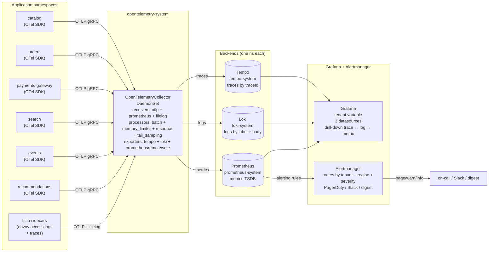
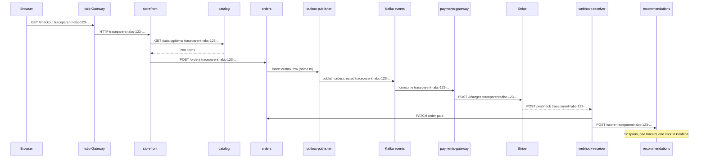

# 13.09 — Observability: OpenTelemetry traces + Loki logs + Prometheus metrics + Grafana dashboards

> End-to-end OTel through the v2 app + per-tenant Grafana dashboards +
> Alertmanager routed by tenant / region / severity. The full three-pillar
> story applied to the platform.

**Estimated time:** ~60 min read · half-day hands-on
**Prerequisites:** [Part 06 ch.01](../06-production-readiness/01-observability-metrics.md) — Prometheus pillar this chapter extends · [Part 06 ch.02](../06-production-readiness/02-logging.md) + [ch.03](../06-production-readiness/03-tracing.md) — logs/traces baseline · [Part 13 ch.02](02-tenancy-and-crossplane-onboarding.md) — tenant boundary dashboards/alerts route on
**You'll know after this:** • instrument the v2 services with OpenTelemetry SDKs and export traces · • install Loki + Tempo + Prometheus + Grafana as the three-pillar stack · • build per-tenant Grafana dashboards keyed on tenant labels · • route Alertmanager by tenant / region / severity to the right on-call · • correlate metrics → traces → logs at incident time

<!-- tags: bookstore-v2, observability, opentelemetry, prometheus, slo, multi-tenancy -->

## Why this exists

The v1 Bookstore had **one pillar**: Prometheus metrics
([Part 06 ch.01](../06-production-readiness/01-observability-metrics.md)).
The four Go services exposed `/metrics`; a `ServiceMonitor` told the
Prometheus Operator to scrape them; a few `PrometheusRule` alerts fired on
catalog 5xx and on p95 latency. That is the metrics floor — and it is
**not enough** for the platform v2.

Three pillars are not a luxury; each answers a question the other two
cannot:

1. **Metrics answer "is the system healthy?"** Aggregate counters, gauges,
   histograms. Cheap to store, easy to alert. **They do not tell you why
   a single request failed.**
2. **Logs answer "what did this service do?"** Per-event records. Rich,
   high-cardinality, expensive. **They do not connect to upstream or
   downstream services.**
3. **Traces answer "where did time go in this request, end-to-end?"**
   A `traceId` stitches the spans across all services. Without traces,
   debugging a "checkout took 4 seconds" report means logging into nine
   services and grep-correlating timestamps. With traces, you click one
   id and see the full path.

v2 ships **all three** through a single pipeline: applications
instrument with the [OpenTelemetry](https://opentelemetry.io/) SDK;
metrics + logs + traces flow into an [OpenTelemetry
Collector](https://opentelemetry.io/docs/collector/); the Collector
fans them out to Prometheus (metrics), Loki (logs), and Tempo (traces);
Grafana queries all three and renders per-tenant dashboards; Alertmanager
routes by tenant + region + severity.

The v1 vs v2 contrast: Part 06 ch.01 stood up `kube-prometheus-stack`
against `catalog`'s existing `/metrics`. v2 keeps that stack (deepened,
operator-managed via Argo CD) and **adds** the trace + log pillars,
**all flowing through one Collector**, with the cardinality + retention
+ routing story production needs. The chapter does not re-teach
Prometheus fundamentals — it deepens them.

> **In production:** The biggest mistake teams make adopting the three
> pillars is **deploying three independent stacks** (jaeger + ELK +
> Prometheus). Each stack has its own collectors, its own
> authentication, its own retention story. **OpenTelemetry is the
> convergence point** — one collector, one wire protocol, three
> backends. The Collector is the lever; the backends are interchangeable.

## Mental model

**Three pillars + one collector. Apps emit OTLP; the Collector receives,
processes, and fans out to Tempo + Loki + Prometheus. Grafana queries
all three; every dashboard has a `tenant` variable; every alert is
routed by tenant + region + severity.**

- **Signal sources.** Every v2 service (catalog, orders, payments-gateway,
  search, events, recommendations) uses the OpenTelemetry SDK. The SDK
  emits OTLP (`gRPC`) to a Collector running as a DaemonSet on the local
  node. Istio also emits traces (sidecar `tracing` config); the storefront
  edge emits access logs as OTLP. Kafka brokers expose JMX metrics scraped
  by the Collector's `prometheus` receiver. **Three pipelines into one
  Collector.**
- **The Collector pipeline.** A standard config: receivers (`otlp`,
  `prometheus`, `filelog`) → processors (`batch` + `memory_limiter` +
  `resource` to add tenant / region attributes + `tail_sampling` for
  trace volume) → exporters (`otlphttp/tempo`, `otlphttp/loki`,
  `prometheusremotewrite`). One pipeline per signal type; one receiver
  can feed multiple pipelines.
- **Backends.**
  - **Tempo** (traces). Stores spans by `traceId`. Query language is
    **TraceQL** ("show me traces where catalog took > 1s and downstream
    orders returned 500").
  - **Loki** (logs). Stores log lines by label set + content. Query
    language is **LogQL** ("show me logs for tenant=acme-books where
    `level=error`").
  - **Prometheus** (metrics). The familiar TSDB. PromQL.
- **Grafana.** Three datasources — one per backend. Every dashboard has
  a `tenant` template variable that filters the queries. Drill-down: a
  Prometheus latency spike has a "view traces" button that hands the
  `traceId` to Tempo; a Tempo span has a "view logs" button that hands
  the `traceId` + service to Loki.
- **Alertmanager.** Inside `kube-prometheus-stack`. The routing tree
  groups by `{tenant, region, severity}`. `severity=page` routes to
  PagerDuty; `severity=warn` to Slack; `severity=info` to a digest.
  Silences are scoped: silence acme-books in eu-west without silencing
  acme-books in us-east.
- **The request path the chapter traces.** A real checkout: browser →
  Istio Gateway (ch.13.07) → storefront → catalog → orders →
  outbox-publisher → Kafka → payments-gateway → Stripe → webhook →
  recommendations. Each hop is a span; the full trace is **one click in
  Grafana**.

The trap to keep in view: **cardinality kills observability stacks**.
A label like `user_id` on a Prometheus counter (one million users → one
million series) destroys the TSDB. Loki the same. Tempo the same. The
platform's `tenant` label is OK (~50 tenants); `region` is OK (3
regions); `user_id` is NOT OK in any of the three. Logs may carry
`user_id` in the body (high-cardinality field); never in a label.

## Diagrams

### Diagram A — the three-pillar pipeline (Mermaid)



### Diagram B — a single checkout request, end-to-end spans (Mermaid)



### Diagram C — the signal-vs-pillar matrix (ASCII)

```text
QUESTION                        PILLAR        METHOD           EXAMPLE QUERY
──────────────────────────────  ────────────  ───────────────  ───────────────────────────────────────
Is the system up?               metrics       USE (saturation) up{job="catalog"} == 1
Is latency healthy?             metrics       RED (duration)   histogram_quantile(0.95, ...)
Is the error rate spiking?      metrics+log   RED (errors)     rate(http_5xx_total[5m]) + LogQL filter
Why did THIS request fail?      logs+traces   per-request      traceId=abc-... in Loki + Tempo
Where did time go in request?   traces        per-request      Tempo TraceQL { duration > 1s }
What changed at 3:02 am?        all three     correlate        align time on dashboard
What is THIS tenant costing?    metrics       cardinality      sum by (tenant) (rate(...))
                                                               (see ch.13.10)
```

## Hands-on with the Bookstore Platform

### 0. Prerequisites

- Phase 13a + 13b chapters ran. The v2 platform tree exists at
  `examples/bookstore-platform/`.
- Argo CD installed (ch.13.03).
- Three kind clusters (us-east, eu-west, ap-southeast) — the chapter
  walks one region; the manifests are region-agnostic.

### 1. Install kube-prometheus-stack (pinned-Helm)

Already established in
[Part 06 ch.01](../06-production-readiness/01-observability-metrics.md);
v2 promotes it to its own namespace + GitOps-managed.

```sh
kubectl config use-context kind-bookstore-platform-us-east

KUBE_PROMETHEUS_STACK_VERSION="62.7.0"

helm repo add prometheus-community https://prometheus-community.github.io/helm-charts
helm repo update

helm install kube-prometheus-stack prometheus-community/kube-prometheus-stack \
  --version "$KUBE_PROMETHEUS_STACK_VERSION" \
  -n prometheus-system --create-namespace --wait \
  --set 'prometheus.prometheusSpec.serviceMonitorSelectorNilUsesHelmValues=false' \
  --set 'prometheus.prometheusSpec.podMonitorSelectorNilUsesHelmValues=false' \
  --set 'grafana.adminPassword=REPLACE-ME-VIA-ESO-NOT-IN-SOURCE' \
  --set 'grafana.sidecar.dashboards.enabled=true' \
  --set 'grafana.sidecar.datasources.enabled=true'
```

What landed: Prometheus + Alertmanager + Grafana + node-exporter +
kube-state-metrics, all wired by the Prometheus Operator. Grafana's
sidecar watches for ConfigMaps labelled `grafana_dashboard: "1"` and
`grafana_datasource: "1"` and reloads on change.

### 2. Install Tempo (traces backend)

```sh
TEMPO_CHART_VERSION="1.16.0"

helm repo add grafana https://grafana.github.io/helm-charts
helm repo update

helm install tempo grafana/tempo-distributed \
  --version "$TEMPO_CHART_VERSION" \
  -n tempo-system --create-namespace --wait \
  --set 'traces.otlp.grpc.enabled=true' \
  --set 'traces.otlp.http.enabled=true' \
  --set 'storage.trace.backend=s3' \
  --set 'storage.trace.s3.bucket=bookstore-platform-tempo-us-east' \
  --set 'storage.trace.s3.endpoint=s3.us-east-1.amazonaws.com'
```

The chart picks `tempo-distributed` (the production shape) over `tempo`
(single-binary). The trade is the same as Loki: distributed scales,
single-binary is a kind-only shortcut. v2 picks distributed; document
the version so the audit can re-derive it.

### 3. Install Loki (logs backend)

```sh
LOKI_CHART_VERSION="6.16.0"

helm install loki grafana/loki \
  --version "$LOKI_CHART_VERSION" \
  -n loki-system --create-namespace --wait \
  --set 'deploymentMode=Distributed' \
  --set 'loki.auth_enabled=false' \
  --set 'loki.storage.bucketNames.chunks=bookstore-platform-loki-us-east' \
  --set 'loki.storage.type=s3' \
  --set 'loki.schemaConfig.configs[0].from=2025-01-01' \
  --set 'loki.schemaConfig.configs[0].store=tsdb' \
  --set 'loki.schemaConfig.configs[0].object_store=s3'
```

Loki v3+ requires a `schemaConfig` even on a fresh cluster; the chart
errors loudly without it. Production wires real S3 creds via ESO.

### 4. Install the OpenTelemetry Operator (the Collector CRD)

```sh
OTEL_OPERATOR_VERSION="0.115.0"

helm repo add open-telemetry https://open-telemetry.github.io/opentelemetry-helm-charts
helm repo update

helm install opentelemetry-operator open-telemetry/opentelemetry-operator \
  --version "$OTEL_OPERATOR_VERSION" \
  -n opentelemetry-system --create-namespace --wait \
  --set 'manager.collectorImage.repository=otel/opentelemetry-collector-contrib' \
  --set 'admissionWebhooks.certManager.enabled=true'
```

The operator brings the `OpenTelemetryCollector` CRD. The collector is
a normal workload (DaemonSet here); the operator just templates the
config + watches the CR.

### 5. Apply the platform observability manifests

```sh
# Collector + Grafana data sources + dashboards + alert rules
kubectl apply -f examples/bookstore-platform/observability/otel-collector.yaml
kubectl apply -f examples/bookstore-platform/observability/grafana-datasources.yaml
kubectl apply -f examples/bookstore-platform/observability/grafana-dashboards.yaml
kubectl apply -f examples/bookstore-platform/observability/prometheus-rules.yaml
kubectl apply -f examples/bookstore-platform/observability/alertmanager-routes.yaml
```

What landed:

```sh
kubectl -n opentelemetry-system get opentelemetrycollector
# NAME                       MODE        VERSION   AGE
# bookstore-platform-otel    daemonset   0.115.0   30s

kubectl get prometheusrule -A -l app.kubernetes.io/part-of=bookstore-platform
# NAMESPACE             NAME                          AGE
# prometheus-system     bookstore-platform-red-slo    30s

kubectl -n prometheus-system get configmap -l grafana_dashboard=1
# NAME                                       DATA   AGE
# bookstore-platform-overview                1      30s
```

### 6. Drive a request through the request path

The chapter assumes ch.13.06 (payments) + ch.13.07 (edge) ran. A real
checkout:

```sh
# Get a JWT for tenant=acme-books (ch.13.04)
JWT="$(curl -sk -X POST https://keycloak.bookstore-platform-system.svc.cluster.local/realms/bookstore-platform/protocol/openid-connect/token \
  -d 'grant_type=password' \
  -d 'client_id=storefront' \
  -d 'username=alice@acme-books.example.com' \
  -d 'password=REPLACE-ME-VIA-ESO-NOT-IN-SOURCE' | jq -r .access_token)"

# Drive a checkout
curl -sk -H "Authorization: Bearer $JWT" \
  -H "Content-Type: application/json" \
  -X POST \
  -d '{"items":[{"isbn":"978-0-13-468599-1","qty":1}],"payment_method":"pm_card_visa"}' \
  https://gateway.bookstore-platform.example.com/api/v2/checkout
# {"order_id":"ord-abc","status":"paid","trace_id":"7f3a..."}
```

### 7. Find the request in all three pillars

```sh
# Port-forward Grafana
kubectl -n prometheus-system port-forward svc/kube-prometheus-stack-grafana 3000:80 &

# Open http://localhost:3000 — admin / <password>
# Explore -> Tempo -> Search by traceId 7f3a... (12 spans across 9 services).
# Explore -> Loki  -> {service="payments-gateway"} | json | traceId="7f3a..."
# Explore -> Prometheus -> histogram_quantile(0.95, sum by(le) (rate(http_request_duration_seconds_bucket{service="catalog"}[5m])))
```

The "Bookstore Platform Overview" dashboard has a `tenant` variable.
Pick `acme-books` and every panel re-queries with `tenant=acme-books`.

### 8. Drive an alert

```sh
# Trigger a 5xx burst on catalog (one minute of failing requests)
for i in $(seq 1 200); do
  curl -sk -H "Authorization: Bearer $JWT" \
    https://gateway.bookstore-platform.example.com/api/v2/catalog/items/__forced_500__ >/dev/null
done

# Watch Alertmanager
kubectl -n prometheus-system port-forward svc/kube-prometheus-stack-alertmanager 9093:9093 &
# Open http://localhost:9093 — the BookstoreCatalogHighErrorRate alert fires.
# Routed via the `severity=page` branch to PagerDuty (mock receiver in kind).
```

## How it works under the hood

**OTLP — the OpenTelemetry wire protocol.** OTLP has gRPC + HTTP
flavours; the SDK exports to either. The Collector receives both. The
schema is a Protobuf message — one for traces (`ResourceSpans`), one
for metrics (`ResourceMetrics`), one for logs (`ResourceLogs`). Each
carries a `Resource` (key/value pairs identifying the producer:
`service.name`, `service.version`, `k8s.namespace.name`,
`k8s.pod.name`, and v2's custom `tenant` + `region`). The Collector's
`resource` processor injects the Kubernetes-derived attributes; the
SDK injects the app-level ones.

**The Collector pipeline — receivers → processors → exporters.** Three
concepts:

- **Receivers** accept signals. `otlp` (the standard inbound), `prometheus`
  (scrapes `/metrics`, converts to OTLP), `filelog` (tails container
  log files, converts to OTLP logs), `kafkareceiver`, `jaeger`, etc.
- **Processors** transform signals. `batch` buffers up; `memory_limiter`
  protects the Collector itself; `resource` adds/removes attributes;
  `attributes` mutates spans/logs; `tail_sampling` keeps a fraction of
  traces, biased toward the interesting ones (slow, error-status,
  rare).
- **Exporters** send signals onward. `otlphttp/tempo`, `otlphttp/loki`,
  `prometheusremotewrite/prometheus`, `kafka`, `file`. One signal can
  fan out to multiple exporters (e.g. `prometheusremotewrite` to two
  Prometheus instances for HA).

The Collector pipeline is **wired by name**: a `pipelines:` block lists
which receivers feed which processors feed which exporters. The CR's
`config` field is the YAML the Collector reads on startup.

**Tail-based sampling — why and how.** Head-based sampling decides at
trace creation ("keep 1 % of all traces"). Tail-based sampling decides
at trace end ("keep 100 % of error traces, 100 % of slow traces, 1 %
of fast healthy traces"). Tail requires the Collector to buffer the
trace until all spans arrive (~30s); the budget is RAM. Worth it: the
production-shape sampling decision needs the trace's full picture
("did this trace include a 500? then keep it"). v2 uses tail sampling
with policies in the Collector config.

**Tempo TraceQL.** Query language. Examples:

```
{ duration > 1s }                         # any slow trace
{ service.name = "payments-gateway" && status = error }
{ resource.tenant = "acme-books" && trace:duration > 500ms }
```

The pipeline-rendered tag set is what TraceQL queries against.
`status` is a span attribute; `tenant` is a resource attribute injected
by the Collector.

**Loki LogQL.** Two-stage query:

```
{service="payments-gateway", tenant="acme-books"} |= "ERROR" | json | level = "error"
```

The selector (`{service="..."}`) picks streams; the pipeline filters
+ parses + transforms. Labels are bounded (low cardinality);
high-cardinality fields stay in the log body and are parsed at query
time.

**Prometheus + the `remote_write` story.** The OTel Collector's
`prometheusremotewrite` exporter pushes metrics into Prometheus
(the inverse of pull). Prometheus's own scrape targets remain for
metrics that are easier to expose: kube-state-metrics, node-exporter,
Kafka JMX. The app metrics flow via OTLP → Collector → remote_write
because OTLP carries the resource attributes (tenant, region) for
free; the Prometheus scrape would have to re-label them in.

**Grafana variables — the per-tenant template.** A dashboard variable
`$tenant` is sourced from a Prometheus query
`label_values(http_requests_total, tenant)`. Every panel's query
references `tenant="$tenant"`. The user picks a tenant from a
dropdown; the dashboard re-queries. Same pattern for `region`.

**Alertmanager — the routing tree.** Inside
`kube-prometheus-stack`'s `AlertmanagerConfig` CRD (or the older
`alertmanager.yaml` style):

```yaml
route:
  group_by: ["tenant", "region", "alertname"]
  receiver: default
  routes:
    - matchers: [severity = page]
      receiver: pagerduty
      continue: true
    - matchers: [severity = warn]
      receiver: slack-warnings
    - matchers: [tenant = acme-books, region = eu-west]
      receiver: slack-eu-customer-support
```

`continue: true` means after matching `severity=page`, evaluation
continues to subsequent routes — so a page can also fire a slack
notification. Silences via the AM API mute a route for a window.

Cluster-level alerts like `BookstoreCNPGReplicationLag` carry no
`tenant` label by design (replication lag is a cluster property,
not a tenant one); they route to the platform-team default receiver
and skip the tenant-routed branches above.

**End-to-end trace propagation — the W3C `traceparent` header.** The
W3C spec
([Trace Context](https://www.w3.org/TR/trace-context/)) defines a
`traceparent` header carrying the traceId + spanId + flags.
Every HTTP call between v2 services **must propagate** this header
(or the trace breaks at the hop). Istio's Envoy injects + propagates
`traceparent` automatically for HTTP traffic. For Kafka, the OTel
SDK propagates traceparent in message headers; the consumer SDK
reads it and starts a new span with the same traceId. For Stripe
(an external API), the trace ends at the boundary and resumes when
the Stripe webhook returns (the webhook receiver re-injects the
traceparent if Stripe echoes a correlation id).

## Production notes

> **In production:** **Cardinality is the silent killer.** The
> single biggest reason an observability stack falls over is a
> high-cardinality label snuck onto a metric. `user_id`, `order_id`,
> `request_id` — each turns a metric into millions of series.
> Prometheus's `prometheus_tsdb_head_series` will climb; queries
> slow; the TSDB OOMs. Two mitigations: (1) **bound the label set
> at the SDK** — the SDK should not emit a metric with `user_id`
> as a label; (2) **drop labels in the Collector** — a
> `transform` processor strips known high-cardinality attributes
> before remote_write. Audit `topk(20, count by (__name__)
> ({__name__=~".+"}))` weekly.

> **In production:** **Retention is a cost lever, set it per
> pillar.** Tempo retention: 7 days (traces are huge; the
> debugging window is short). Loki retention: 30 days (logs are
> the audit trail; legal may demand longer). Prometheus retention:
> 15 days local + remote_write to a long-term store (Mimir /
> Thanos). The v1 single-pillar story did not face this question
> at scale; v2 does. The OpenCost integration (ch.13.10) puts a
> dollar figure on each retention number.

> **In production:** **Sample, do not buy more storage.**
> Head-based 1 % sampling on traces drops 99 % of signal but
> keeps 100 % cost-per-stored-trace. Tail-based sampling drops
> the 99 % of *uninteresting* traces and keeps the 1 % of
> interesting ones — a 100x cardinality reduction with no
> debugging loss. Worth the Collector RAM. v2 ships
> `tail_sampling` with `errors_first` + `latency_first` + a 1 %
> background sample.

> **In production:** **The "trace propagation hole" footgun.**
> One service that does not propagate `traceparent` becomes a
> trace-amnesia point: every downstream span starts a new
> traceId. Symptoms: the trace ends abruptly; the downstream
> spans are unparented. Mitigations: (1) **a linter in CI**
> that asserts every Go service imports `otelhttp.NewTransport`
> + every gRPC server uses `otelgrpc.UnaryServerInterceptor`;
> (2) **a Grafana panel for orphan spans** — count spans with
> no parent, alarm on > N per minute.

> **In production:** **Alert on the leading indicator, not the
> lagging.** The 3am page should fire on **error budget burn
> rate** (5 % of budget in 1 hour), not on **a single SLO
> breach** (one minute of high latency). Burn-rate alerts
> ([Google SRE Workbook ch.5](https://sre.google/workbook/alerting-on-slos/))
> page proportionally: faster burn = bigger problem = louder
> page. v2's PrometheusRules implement multi-window burn-rate
> alerts; the legacy "threshold for 5 min" alert is the
> lagging-indicator anti-pattern named here.

> **In production:** **Per-tenant dashboards are a privilege
> escalation surface.** A tenant viewing another tenant's
> Grafana data is a P0 leak. Two mitigations: (1) **dashboard
> variables alone are not auth** — back the Grafana datasource
> with a per-tenant `Authorization` header (Grafana
> Enterprise's data-source permissions, or front the datasource
> with a per-tenant proxy that enforces the tenant from the
> JWT); (2) **the platform-team Grafana is internal**; tenants
> see their data via a tenant-portal that calls the same
> backends with a scoped token. v2 sketches both; the chapter
> ships (1) for the platform-team UI.

## Quick Reference

```sh
# Pinned install (the chapter's exact versions)
KUBE_PROMETHEUS_STACK_VERSION="62.7.0"
TEMPO_CHART_VERSION="1.16.0"
LOKI_CHART_VERSION="6.16.0"
OTEL_OPERATOR_VERSION="0.115.0"

helm repo add prometheus-community https://prometheus-community.github.io/helm-charts
helm repo add grafana https://grafana.github.io/helm-charts
helm repo add open-telemetry https://open-telemetry.github.io/opentelemetry-helm-charts
helm repo update

helm install kube-prometheus-stack prometheus-community/kube-prometheus-stack --version "$KUBE_PROMETHEUS_STACK_VERSION" -n prometheus-system --create-namespace --wait
helm install tempo grafana/tempo-distributed --version "$TEMPO_CHART_VERSION" -n tempo-system --create-namespace --wait
helm install loki grafana/loki --version "$LOKI_CHART_VERSION" -n loki-system --create-namespace --wait
helm install opentelemetry-operator open-telemetry/opentelemetry-operator --version "$OTEL_OPERATOR_VERSION" -n opentelemetry-system --create-namespace --wait

# Apply the platform pieces
kubectl apply -f examples/bookstore-platform/observability/otel-collector.yaml
kubectl apply -f examples/bookstore-platform/observability/grafana-datasources.yaml
kubectl apply -f examples/bookstore-platform/observability/grafana-dashboards.yaml
kubectl apply -f examples/bookstore-platform/observability/prometheus-rules.yaml
kubectl apply -f examples/bookstore-platform/observability/alertmanager-routes.yaml
```

Minimal skeletons:

```yaml
# OpenTelemetryCollector (sketch — full at observability/otel-collector.yaml)
apiVersion: opentelemetry.io/v1beta1
kind: OpenTelemetryCollector
metadata: { name: <NAME>, namespace: opentelemetry-system }
spec:
  mode: daemonset
  config:
    receivers:
      otlp:
        protocols: { grpc: {}, http: {} }
    processors:
      batch: {}
      memory_limiter: { check_interval: 1s, limit_mib: 512 }
      resource:
        attributes:
          - { key: region, value: <REGION>, action: insert }
    exporters:
      otlphttp/tempo: { endpoint: http://tempo.tempo-system.svc.cluster.local:4318 }
      otlphttp/loki:  { endpoint: http://loki.loki-system.svc.cluster.local:3100/otlp }
      prometheusremotewrite: { endpoint: http://kube-prometheus-stack-prometheus.prometheus-system.svc.cluster.local:9090/api/v1/write }
    service:
      pipelines:
        traces:  { receivers: [otlp], processors: [memory_limiter, resource, batch], exporters: [otlphttp/tempo] }
        logs:    { receivers: [otlp], processors: [memory_limiter, resource, batch], exporters: [otlphttp/loki] }
        metrics: { receivers: [otlp], processors: [memory_limiter, resource, batch], exporters: [prometheusremotewrite] }
---
# Grafana DataSource (CRD-backed by grafana-operator)
apiVersion: grafana.integreatly.org/v1beta1
kind: GrafanaDatasource
metadata: { name: tempo, namespace: prometheus-system }
spec:
  datasource:
    name: Tempo
    type: tempo
    url: http://tempo.tempo-system.svc.cluster.local:3100
---
# PrometheusRule with burn-rate alert
apiVersion: monitoring.coreos.com/v1
kind: PrometheusRule
metadata: { name: <NAME>, namespace: prometheus-system }
spec:
  groups:
    - name: bookstore-platform-burn
      rules:
        - alert: BookstoreErrorBudgetBurn
          expr: |
            (sum(rate(http_requests_total{code=~"5.."}[1h])) /
             sum(rate(http_requests_total[1h]))) > (14.4 * 0.001)
          for: 5m
          labels: { severity: page, tenant: "$tenant", region: "$region" }
```

Checklist (the observability story closed when all seven are yes):

- [ ] All v2 services emit OTLP from the SDK; CI lints for `otelhttp` +
      `otelgrpc` middleware presence.
- [ ] OpenTelemetryCollector DaemonSet is Running; the collector logs
      show "pipelines started".
- [ ] Tempo + Loki + Prometheus all have data for a known traceId;
      Grafana renders all three for the same request.
- [ ] Per-tenant variable on the Bookstore Overview dashboard filters
      every panel.
- [ ] Burn-rate `PrometheusRule` evaluates non-`null`; a forced 5xx
      burst pages the receiver.
- [ ] Alertmanager silences are scoped (tenant+region) — not silenced
      everywhere by accident.
- [ ] Tail sampling keeps 100 % of errors + 100 % of slow; the trace
      volume is bounded.

## Test your understanding

> Try each before opening the answer drawer. The act of trying is the exercise; the answer is the check.

1. **Why are traces / logs / metrics "three pillars," and why does correlating them at incident time matter?**
   <details><summary>Show answer</summary>

   Each pillar answers a different question: **metrics** = "is something wrong?" (aggregate trends, SLOs, alerts); **traces** = "where is something wrong?" (per-request path through services, latency breakdown); **logs** = "what exactly went wrong?" (the error message, the stack trace, the variable values). One alone is incomplete. A 5xx spike alert (metric) tells you something broke; the trace shows you it's the catalog→postgres call adding 5s; the logs show `pq: too many connections`. Correlation requires shared identifiers — `trace_id` on every log line, `tenant_id` on every metric series, `request_id` propagated as an HTTP header. Without correlation IDs, you debug by guessing.

   </details>

2. **Your Alertmanager is paging the wrong on-call (us-east on-call gets EU alerts at 3am). What's the routing fix?**
   <details><summary>Show answer</summary>

   Routing tree in `alertmanager.yml`: top-level `route.routes` matches on labels and forwards to receivers. Add `match: {region: us-east-1}` → receiver `pd-us-east`; `match: {region: eu-west-1}` → receiver `pd-eu`. The alert's `region` label comes from the originating Prometheus instance (scrape config sets `external_labels.region`). Without these labels, all alerts merge into one route. Test the routing with `amtool config routes test` against a sample alert payload. The pattern: every alert carries the dimensions that map to the right human (region, tenant, severity, team).

   </details>

3. **You enable tail sampling on the OTel collector at 1% rate. Then a customer reports "checkout was slow at 14:32" — but no trace exists. What went wrong, and what's the right tail-sampling policy?**
   <details><summary>Show answer</summary>

   1% probabilistic sampling means 99% of traces are dropped at the collector — including the slow checkout. The right tail-sampling policy is *not* probabilistic: keep 100% of traces with errors (`status_code=Error`), 100% of slow traces (duration > 1s), and a small sample (~1%) of normal traces for baseline analysis. Configure this in the OTel collector's `tail_sampling` processor with multiple `policies`. The trace volume stays bounded because errors and slows are rare; the diagnostic value stays full because the *interesting* traces are kept. Probabilistic sampling discards exactly the traces you want.

   </details>

4. **An on-call engineer wants to know "what is tenant acme-books p99 latency right now?" — what panel design and label model gives them that in one click?**
   <details><summary>Show answer</summary>

   Grafana dashboard with a `tenant` variable (dropdown sourced from `label_values(http_requests_total, tenant)`). Every panel's PromQL has `{tenant="$tenant"}` interpolation. Backing metrics must include `tenant` as a label — the OTel collector adds it via attribute → label mapping, sourced from the JWT subject or X-Tenant header. The on-call picks `acme-books`, every panel filters, p99 latency, error rate, RPS all show for that tenant. Without per-tenant labels, you can't answer per-tenant questions — and label-cardinality discipline matters (1000 tenants × 100 metrics × 10 other dimensions = unbounded series; use recording rules + tenant-scoped Prometheus tenants like Mimir for the highest scale).

   </details>

5. **Hands-on: instrument the `catalog` service with OTel, send a request, and trace it through to Postgres. What context propagation must work for the trace to be connected end-to-end?**
   <details><summary>What you should see</summary>

   The OTel SDK injects `traceparent: 00-<trace-id>-<span-id>-01` into outbound HTTP headers and into the SQL session as a comment (`/* traceparent='...' */`). The downstream service's middleware extracts the header and starts its span as a child of the incoming context. Postgres logs the comment via `log_statement = 'all'` so query traces tie back. If propagation breaks at any hop (a middleware that strips headers, a `database/sql` driver that doesn't forward context), the trace fragments into orphans. Walk the chain with a single test request and verify each service produces a span with the same trace ID. The propagation is the foundation; the visualization is the payoff.

   </details>

## Further reading

- **OpenTelemetry Collector docs**
  <https://opentelemetry.io/docs/collector/>; the receivers /
  processors / exporters reference.
- **OpenTelemetry SDK (Go) docs**
  <https://opentelemetry.io/docs/languages/go/>; the SDK the v2
  services use.
- **Tempo TraceQL**
  <https://grafana.com/docs/tempo/latest/traceql/>; the trace query
  language.
- **Loki LogQL**
  <https://grafana.com/docs/loki/latest/query/>; the log query
  language.
- **Grafana variable templating**
  <https://grafana.com/docs/grafana/latest/dashboards/variables/>;
  the dashboard variable + interpolation model.
- **Prometheus Operator + AlertmanagerConfig CRD**
  <https://prometheus-operator.dev/docs/user-guides/alerting/>;
  the routing-tree-as-Kubernetes-resource model.
- **Google SRE Workbook ch.5 — Alerting on SLOs**
  <https://sre.google/workbook/alerting-on-slos/>; the burn-rate
  alert pattern this chapter implements.
- **Rosso et al., *Production Kubernetes* ch.13 — Observability**;
  the three-pillar architecture this chapter builds.
- **Google SRE Book ch.6 — Monitoring Distributed Systems**
  <https://sre.google/sre-book/monitoring-distributed-systems/>;
  the four-golden-signals + RED + USE methods.
