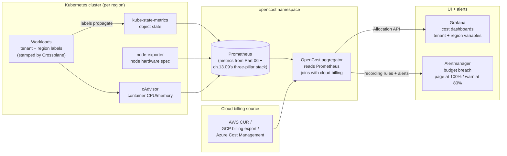

# 13.10 — Cost: OpenCost per-tenant, per-cluster, per-region

> OpenCost install + per-tenant labels + showback dashboards + budget
> alerts + the FinOps Foundation framework — the multi-tenant + multi-
> region cost story the v1 Bookstore did not face and v2 cannot avoid.

**Estimated time:** ~45 min read · ~120 min hands-on
**Prerequisites:** [Part 06 ch.06](../06-production-readiness/06-capacity-and-cost.md) — capacity/cost framing · [Part 10 ch.06](../10-cloud-and-managed-kubernetes/06-node-autoscaling-cost-multicloud.md) — Karpenter + cloud cost shape · [Part 13 ch.02](02-tenancy-and-crossplane-onboarding.md) — tenant label OpenCost groups by
**You'll know after this:** • install OpenCost and verify it sees the cloud bill + cluster usage · • configure per-tenant cost allocation via labels seeded by Crossplane onboarding · • build showback dashboards that answer "what did acme-books cost last month" · • author budget alerts that page before the bill, not after · • apply the FinOps Foundation framework to a real platform team

<!-- tags: bookstore-v2, cost, finops, opencost, multi-tenancy, multi-region -->

## Why this exists

The v1 Bookstore ran in one namespace in one cluster on one laptop. The
cost question was "is my laptop hot?". The v2 platform runs **N tenants
across three regions on a real cloud bill**; the cost question is
*structured*:

1. **Per-tenant cost.** "What did acme-books cost us last month, and is
   their subscription priced to cover it?" The answer drives the
   commercial model.
2. **Per-region cost.** "Is eu-west profitable or are we cross-
   subsidising it from us-east?" The answer drives the regional
   investment.
3. **Per-workload-class cost.** "What fraction of our compute is ML
   training (bursty, GPU-heavy) vs request-serving (steady, CPU)?
   What fraction is **idle**?" The answer drives the rightsizing
   roadmap.

[Part 12 ch.08](../12-kubernetes-for-machine-learning/08-ml-platform-cost-and-mlops.md)
introduced [OpenCost](https://www.opencost.io/) as the visibility layer
for ML cost (GPU $/hr economics, spot-vs-on-demand, idle Jupyter
culling). v1's `examples/bookstore/cloud/karpenter-nodepool.yaml` shaped
the node side. The teaching there was **right** but **single-tenant**;
v2's multi-tenant case adds the **label join key** problem and the
**budget alert** loop that Part 12 ch.08 deliberately deferred.

This chapter ships the multi-tenant + multi-region OpenCost story:
labels flow through Crossplane → workloads → OpenCost; aggregations
roll up by tenant + region + workload-class; Grafana renders
showback dashboards; Alertmanager fires budget breach alerts. It also
places the platform on the [FinOps Foundation maturity
ladder](https://www.finops.org/framework/) — **Inform** today, with a
named path to **Optimize** and **Operate**.

> **In production:** The single biggest reason cost programmes stall is
> **labels that drift from the workload**. Without a label policy
> enforced *at workload creation*, the join key rots; OpenCost's
> Allocation table has more "unallocated" than tenant-scoped lines; the
> showback dashboard is useless. v2 enforces tenant labels through
> Crossplane (every `BookstoreTenant` Composition stamps them); a
> Kyverno policy mutates any pod missing the label; the Allocation
> table stays clean.

## Mental model

**Cost = (resource consumption × unit price) + (data egress) +
(managed services). Labels are the join key. Per-tenant + per-region
labels flow from Crossplane (the API) through every workload to
OpenCost (the aggregator). Showback today; chargeback when the
commercial model is ready. The FinOps Foundation framework names the
maturity ladder.**

- **The cost formula.** Three terms:
  - **Compute** — CPU-hours + memory-GB-hours + GPU-hours, each at the
    node's price (cloud catalogue / spot price / per-cluster
    discount).
  - **Storage** — PV-GB-month + S3-GB-month + DB-storage-GB-month.
  - **Network** — egress-GB (cross-AZ / cross-region / Internet) +
    managed-network-service fees.
  Plus the **managed-service** line — RDS, MSK, ElastiCache, etc. —
  which OpenCost reads from the cloud's billing-source connector
  (CUR for AWS, billing export for GCP, Cost Management for Azure).
- **Labels are the join key.** Every Kubernetes object carries labels;
  OpenCost groups Allocations by them. The platform invariant:
  `bookstore-platform.example.com/tenant=<TENANT>` on every workload,
  `bookstore-platform.example.com/region=<REGION>` on every cluster.
  **Labels stamped by Crossplane** at workload-creation time
  (ch.13.02), **never** retro-stamped.
- **Showback vs chargeback.** *Showback*: "here is what your tenant
  used; we are not invoicing for it." *Chargeback*: "here is the
  bill; pay it." Start with showback for at least one quarter; let
  tenants see the numbers, dispute the mapping, fix the labels.
  Chargeback when the commercial model + labels + the dispute process
  are all stable.
- **The FinOps Foundation maturity model.** Three phases (each phase
  named "crawl / walk / run" inside the FinOps Foundation literature
  — but the F2 framework now calls them):
  - **Inform** — visibility. You can answer "what did tenant X cost?"
    in < 5 minutes. v2 ships here.
  - **Optimize** — action. You have rightsizing recommendations,
    spot-instance adoption, and idle-resource culling running.
    Foreshadowed in ch.13.10's production notes; not implemented.
  - **Operate** — discipline. Budgets are forecasted; FinOps reviews
    are weekly; the commercial model is chargeback. Not implemented;
    not the chapter's promise.
- **The ML-training cost trap.** ML training is bursty (a single
  Kueue-queued job can consume an entire GPU node for an hour).
  Naive tenant-attribution attributes the GPU spike to the tenant the
  job's namespace belongs to — but if Kueue ran a *queued* job for a
  different tenant, the attribution is wrong. v2's namespace-per-
  tenant + the ML-namespace-per-tenant invariant
  (`bookstore-platform-ml` is platform-shared; per-tenant ML
  namespaces are `bookstore-platform-<TENANT>-ml`) prevents this; v1
  did not face it.

The trap to keep in view: **the egress bill is the cost you never
expect**. Compute is metered per second and visible in `kubectl top`.
Egress is metered per byte and **invisible** until the cloud bill
arrives. A misbehaving cross-region replication, a chatty service
mesh, an MLflow client downloading models across regions — each can
add a four-figure surprise. OpenCost's network costs are best-effort
without the cloud billing connector; production wires the connector.

## Diagrams

### Diagram A — the OpenCost data flow (Mermaid)



### Diagram B — cost-allocation matrix (ASCII)

```text
DIMENSION          UNIT             SOURCE                       VISIBLE WHERE
─────────────────  ───────────────  ───────────────────────────  ──────────────────────────────
Compute (CPU)      $/cpu-hour       node price * pod requests    OpenCost Allocation API
Compute (memory)   $/GB-hour        node price * pod requests    OpenCost Allocation API
Compute (GPU)      $/gpu-hour       node price (e.g. p3.2xlarge) OpenCost ML dashboard
Storage (PV)       $/GB-month       StorageClass + PVC size      OpenCost Allocation API
Storage (object)   $/GB-month       cloud billing (CUR)          OpenCost cloud-source
Network (intra)    free or minimal  (mostly zero in OpenCost)    not enforced
Network (egress)   $/GB             cloud billing (CUR)          OpenCost cloud-source
Managed services   $/instance-hr    cloud billing (CUR)          OpenCost cloud-source
─────────────────  ───────────────  ───────────────────────────  ──────────────────────────────
Per-tenant         label join       tenant=<...> on every wl     Grafana tenant variable
Per-region         label join       region=<...> on every clus   Grafana region variable
Per-workload-class label join       class=ml / app / system      Grafana class panel
```

## Hands-on with the Bookstore Platform

### 0. Prerequisites

- ch.13.09 ran. Prometheus + Grafana exist (OpenCost reads from
  Prometheus).
- The platform tree has `bookstore-platform.example.com/tenant` +
  `region` labels on every workload (Crossplane Composition stamps
  them in ch.13.02).

### 1. Install OpenCost (pinned-Helm)

```sh
kubectl config use-context kind-bookstore-platform-us-east

OPENCOST_VERSION="1.115.0"

helm repo add opencost https://opencost.github.io/opencost-helm-chart
helm repo update

helm install opencost opencost/opencost \
  --version "$OPENCOST_VERSION" \
  -n opencost --create-namespace --wait \
  --set 'opencost.prometheus.internal.enabled=false' \
  --set 'opencost.prometheus.external.enabled=true' \
  --set 'opencost.prometheus.external.url=http://kube-prometheus-stack-prometheus.prometheus-system.svc.cluster.local:9090' \
  --set 'opencost.exporter.defaultClusterId=bookstore-platform-us-east' \
  --set 'opencost.ui.enabled=true'
```

`prometheus.external.enabled=true` — OpenCost reuses the
`kube-prometheus-stack` Prometheus (ch.13.09) instead of bringing its
own. Saves a Prometheus instance per cluster.

### 2. Apply the platform cost manifests

```sh
# OpenCost as Argo CD Application (the GitOps path)
kubectl apply -f examples/bookstore-platform/cost/opencost-application.yaml

# Recording rules: per-tenant aggregations (run server-side in Prometheus)
kubectl apply -f examples/bookstore-platform/cost/opencost-tenant-aggregations.yaml

# Grafana dashboard for cost
kubectl apply -f examples/bookstore-platform/cost/grafana-cost-dashboard.yaml

# Budget breach alerts (Alertmanager)
kubectl apply -f examples/bookstore-platform/cost/budget-alerts.yaml
```

### 3. Verify the OpenCost API

```sh
kubectl -n opencost port-forward svc/opencost 9003:9003 &

# The Allocation API — "show me everything by namespace, last 24h"
curl -s "http://localhost:9003/allocation?window=24h&aggregate=namespace" | jq '.data[0]'
# {
#   "bookstore-platform-acme-books": {
#     "name": "bookstore-platform-acme-books",
#     "cpuCost": 0.42,
#     "ramCost": 0.18,
#     "pvCost": 0.05,
#     "totalCost": 0.65,
#     ...
#   },
#   "bookstore-platform-foo-books": { ... }
# }
```

### 4. Aggregate per-tenant via the platform label

```sh
# Group by the platform's tenant label
curl -s "http://localhost:9003/allocation?window=7d&aggregate=label:bookstore-platform.example.com/tenant" | jq '.data | to_entries[] | {tenant: .key, totalCost: .value.totalCost}'
# [
#   { "tenant": "acme-books",  "totalCost": 12.34 },
#   { "tenant": "foo-books",   "totalCost":  3.21 },
#   { "tenant": "__unallocated__", "totalCost": 0.04 }
# ]
```

The `__unallocated__` line is the audit: any workload missing the
tenant label falls here. v2 keeps it < 1 % via the Crossplane stamp +
the Kyverno policy that mutates missing labels at admission.

### 5. The Grafana cost dashboard

```sh
kubectl -n prometheus-system port-forward svc/kube-prometheus-stack-grafana 3000:80 &

# Open http://localhost:3000 -> Dashboards -> "Bookstore Platform Cost"
# Variables: tenant + region + workload-class
# Panels:
#   - Cost per tenant (table, last 7 days)
#   - Cost per region (stacked bar)
#   - Cost per workload-class (pie)
#   - GPU vs CPU spend (the ML watchlist)
#   - Top 5 most expensive Pods (rightsizing candidates)
#   - Budget burn-rate per tenant (used / budgeted, gauge)
```

### 6. Trigger a budget alert

```sh
# Increase the recorded cost for acme-books past 80% of the monthly budget
# (production: the cost rises naturally; here we simulate by setting a
# tight test budget)
kubectl -n opencost get configmap budgets -o yaml
# data:
#   acme-books-monthly-budget: "5.00"   # USD
#   foo-books-monthly-budget:  "500.00"

# Generate workload that crosses the threshold...
# Watch Alertmanager
kubectl -n prometheus-system port-forward svc/kube-prometheus-stack-alertmanager 9093:9093 &
# Open http://localhost:9093 — BookstoreTenantBudgetWarn fires (severity: warn).
# At 100% — BookstoreTenantBudgetBreach fires (severity: page).
```

### 7. Per-region split — the multi-region reality

```sh
# Switch clusters to inspect the regional split
for ctx in kind-bookstore-platform-us-east kind-bookstore-platform-eu-west kind-bookstore-platform-ap-southeast; do
  kubectl --context "$ctx" -n opencost port-forward svc/opencost 9003:9003 &
  sleep 2
  curl -s "http://localhost:9003/allocation?window=24h&aggregate=cluster" | jq ".data | keys"
  kill %1; sleep 1
done
# us-east-1   $X.XX
# eu-west-1   $Y.YY
# ap-southeast-1 $Z.ZZ
```

Production: a federation of per-region OpenCost instances writes to a
central Prometheus (Mimir / Thanos), and the dashboard queries the
federated view. The platform-overview dashboard's `region` variable
filters across them.

## How it works under the hood

**OpenCost's data model — the Allocation.** An Allocation is a subset
of cost over a time window broken down by dimensions. The shape:

```json
{
  "name": "<key>",
  "window": { "start": "...", "end": "..." },
  "cpuCost": 0.42,
  "ramCost": 0.18,
  "pvCost":  0.05,
  "networkCost": 0.0,    // best-effort without cloud connector
  "loadBalancerCost": 0.0,
  "totalCost": 0.65,
  "labels": { ... },
  "properties": { ... }
}
```

The `aggregate=` parameter is the GROUP BY: `namespace`, `pod`,
`controller`, `label:<key>`, `cluster`, `node`. Multiple aggregations
chain: `aggregate=cluster,label:tenant`.

**The price book — how OpenCost knows $/hr.** Three sources, falling
back in order:

1. **Cloud billing source** — OpenCost reads the cloud's billing
   export (AWS CUR; GCP billing export; Azure Cost Management). The
   billing source carries the exact reservation/spot/savings-plan
   price. **The production answer.**
2. **Cluster pricing config** — `pricing.csv` in the OpenCost CM
   maps node-type → $/hr. Override per cluster (a custom contract
   may give 30 % off the catalogue price). The hybrid answer.
3. **Catalogue defaults** — OpenCost ships catalogue prices for the
   three big clouds. **The dev-mode default**; production never
   trusts catalogue prices because no enterprise pays catalogue.

**Cross-cloud normalisation.** The Allocation is in **USD**.
OpenCost normalises GCP / Azure / AWS prices to USD via the cloud
billing source. A multi-cloud platform (rare; the v2 platform is
single-cloud per region) reads three billing sources into one
OpenCost and reports a unified Allocation. The cross-cloud
normalisation is the killer feature of OpenCost vs the cloud-native
cost tools.

**Spot vs on-demand reality.** A pod runs on a spot node at $0.10/hr
for 30 minutes; the node is reclaimed; the pod reschedules on an
on-demand node at $0.30/hr for the next 30 minutes. OpenCost reads
the node's actual price at the time of the Allocation — so the
pod's Allocation is the time-weighted blend. The right shape: spot
costs are the spot price at use, not the catalogue.

**Recording rules — pre-aggregating in Prometheus.** OpenCost can be
slow on big queries (1 month × 100 tenants × every pod). The
solution: **Prometheus recording rules** that pre-aggregate per
tenant + per region every 5 minutes. The Grafana panel queries the
recording rule, not the raw OpenCost API. v2's
`opencost-tenant-aggregations.yaml` defines:

```yaml
- record: bookstore_tenant_cost_per_hour
  expr: |
    sum by (tenant) (
      rate(opencost_allocation_total_cost_dollars[1h])
        * on (namespace) group_left(tenant)
          kube_namespace_labels{label_bookstore_platform_example_com_tenant!=""}
    )
```

**Budget alerts — the breach pattern.** Budgets are not native to
OpenCost; we layer them via Prometheus rules:

```yaml
- alert: BookstoreTenantBudgetWarn
  expr: |
    (
      sum_over_time(bookstore_tenant_cost_per_hour[30d:1h])
      / on(tenant) bookstore_tenant_monthly_budget
    ) > 0.8
  for: 1h
  labels: { severity: warn }
```

`bookstore_tenant_monthly_budget` is a static metric exposed by a
small `budget-exporter` reading from a ConfigMap. Hot-reloaded by
the operator. Production grades this to a CRD (`BookstoreBudget`)
the FinOps team manages.

**The FinOps maturity model — the three phases.** From the
[FinOps Foundation framework](https://www.finops.org/framework/):

- **Inform**: visibility into who consumed what. OpenCost + showback
  dashboards. v2 ships here. Honest measure of progress: tenants can
  see their cost without asking the platform team.
- **Optimize**: action. Rightsizing recommendations (VPA + OpenCost
  combined: "this pod requests 2 CPU but uses 200m — request 250m
  saves $X/mo"); spot adoption for batch jobs (the v1 Karpenter
  NodePool already separated spot for training); idle resource
  culling (KEDA scale-to-zero for low-traffic services). The
  chapter's production notes name each lever; the actions live in
  follow-up work.
- **Operate**: discipline. Budgets are forecasted, not just
  reported. FinOps reviews are weekly. The commercial model is
  chargeback. The platform engineering team is staffed with a
  dedicated FinOps role. Not v2's scope.

## Production notes

> **In production:** **Label every resource AT CREATION TIME, not
> later.** The number-one OpenCost antipattern is "we will add
> labels next sprint." Once a resource is created without the
> label, its cost is **unallocatable** for its lifetime; the audit
> trail is broken; the showback dashboard has a permanent
> `__unallocated__` line. Mitigation: a Kyverno **mutate** policy
> that injects `tenant=<NAMESPACE-derived>` on any Pod missing it;
> a Crossplane Composition that stamps every Workload labels at
> render time. Both are in v2's platform-base.

> **In production:** **Showback for a quarter; chargeback when
> stable.** The temptation to invoice tenants from day one is a
> trust-eroder. Showback gives tenants three months to dispute the
> mapping, the label coverage, the price book. Disputes WILL
> happen ("we did not run a GPU job that week"). Treat disputes as
> bug reports against the cost pipeline; fix labels / fix
> aggregations / fix the price book. Only when disputes go to
> zero do you chargeback.

> **In production:** **Egress is the cost you never expect.** A
> chatty Istio mesh + a misconfigured replication can add 4-figure
> bills overnight. OpenCost without the cloud-billing connector
> guesses egress badly; with the connector, it is exact. Wire the
> connector; alarm on egress > N GB/hour per tenant; investigate
> the chatty service.

> **In production:** **Rightsizing — VPA + OpenCost together.**
> VPA recommends per-pod resource requests; OpenCost translates
> "requests of 1 CPU when usage is 200m" into dollars. The
> rightsizing report is a weekly Grafana panel: "these 10 pods
> would save $X/mo by reducing requests by Y." The action is the
> developer changing the resource request in their service Helm
> chart; the platform team does not change apps for them.

> **In production:** **The Kueue-multi-tenant attribution
> footgun.** A Kueue ClusterQueue serves multiple tenants; a job
> queued by tenant A runs on a node funded by the platform pool.
> Naive node-cost attribution credits the node to whichever
> namespace's pod is currently running on it — including the
> background-cluster-service pods. v2's mitigation: per-tenant ML
> namespaces (`bookstore-platform-<TENANT>-ml`) + per-tenant
> Kueue Workloads; OpenCost groups by the pod's namespace label,
> which carries the tenant.

> **In production:** **The "spot reclaim mid-allocation"
> footgun.** A pod on a spot node at $0.10/hr is reclaimed at 30
> minutes; reschedules to on-demand at $0.30/hr. OpenCost
> handles this correctly **when the cloud billing source is
> wired**; without it, the catalogue price is used and the bill
> is overstated. The remedy is the billing-source connector;
> the trap is running for months without it and being surprised
> by the actual cloud bill.

## Quick Reference

```sh
# Pinned install
OPENCOST_VERSION="1.115.0"

helm repo add opencost https://opencost.github.io/opencost-helm-chart
helm install opencost opencost/opencost --version "$OPENCOST_VERSION" -n opencost --create-namespace --wait

# Apply the cost manifests
kubectl apply -f examples/bookstore-platform/cost/opencost-application.yaml
kubectl apply -f examples/bookstore-platform/cost/opencost-tenant-aggregations.yaml
kubectl apply -f examples/bookstore-platform/cost/grafana-cost-dashboard.yaml
kubectl apply -f examples/bookstore-platform/cost/budget-alerts.yaml

# Per-tenant cost (last 7 days)
curl -s "http://opencost.opencost.svc.cluster.local:9003/allocation?window=7d&aggregate=label:bookstore-platform.example.com/tenant" | jq .
```

Minimal skeletons:

```yaml
# PrometheusRule — per-tenant recording rule
apiVersion: monitoring.coreos.com/v1
kind: PrometheusRule
metadata: { name: <NAME>, namespace: prometheus-system }
spec:
  groups:
    - name: bookstore-cost-aggregations
      interval: 5m
      rules:
        - record: bookstore_tenant_cost_per_hour
          expr: |
            sum by (tenant) (
              opencost_allocation_total_cost_dollars
                * on (namespace) group_left(tenant)
                  kube_namespace_labels
            )
        - alert: BookstoreTenantBudgetWarn
          expr: |
            sum_over_time(bookstore_tenant_cost_per_hour[30d:1h])
            / on(tenant) bookstore_tenant_monthly_budget > 0.8
          for: 1h
          labels: { severity: warn }
```

Checklist (the cost story closed when all seven are yes):

- [ ] OpenCost installed; Allocation API returns Allocations for every
      namespace.
- [ ] `aggregate=label:bookstore-platform.example.com/tenant` returns
      one row per tenant with < 1 % `__unallocated__`.
- [ ] Per-region cost split visible in the cost Grafana dashboard.
- [ ] GPU vs CPU spend visible (the ML watchlist panel).
- [ ] Cloud billing source connected (CUR / GCP billing export / Azure
      Cost Management).
- [ ] Budget alerts fire at 80 % (warn) + 100 % (page).
- [ ] FinOps maturity: platform self-describes as "Inform"; path to
      "Optimize" written down.

## Test your understanding

> Try each before opening the answer drawer. The act of trying is the exercise; the answer is the check.

1. **OpenCost reports 8% `__unallocated__` cost in your cluster. What does that mean and how do you reduce it?**
   <details><summary>Show answer</summary>

   `__unallocated__` is resource spend OpenCost can't tie to a Pod/Namespace/Tenant label. Sources: (a) **node idle** — capacity reserved but unscheduled (right-size requests, enable Karpenter consolidation), (b) **system Pods** (kube-proxy, CNI, monitoring) that lack tenant labels — these are platform cost and shared across all tenants, (c) **Pods without tenant labels** — your Crossplane onboarding missed seeding the label, fix the Composition. 8% is acceptable for platform overhead; >20% is a label-discipline problem. The goal is "every node-hour and every Pod-hour can be attributed somewhere," even if "somewhere" is the platform team's overhead bucket.

   </details>

2. **A tenant's bill last month was $4,200 — $3,100 GPU training, $900 serving, $200 notebooks. The customer disputes "you charged us for GPU we didn't use." How do you respond with data?**
   <details><summary>Show answer</summary>

   Pull OpenCost: per-Pod allocation for that tenant's namespace, broken down by Pod name and time range. Cross-reference with DCGM `DCGM_FI_DEV_GPU_UTIL` — what was the actual GPU utilization? If utilization was 60%, the customer used 60% of capacity but paid for 100% (GPU is non-overcommittable, you book the whole device). That's correct billing but a UX problem: surface utilization dashboards to the tenant so they see "you reserved $3,100 of GPU, used 60%, here's how to reduce." Move them to MIG or time-slicing if their workloads are GPU-fractional. The conversation moves from "did we bill correctly" to "how do we help you reduce."

   </details>

3. **You set a budget of $5,000/month for the `acme-books` tenant. The alert fires at $4,000 (80%). What's the response playbook?**
   <details><summary>Show answer</summary>

   (1) **Notify the tenant** with usage breakdown — most spend in <category>, projection at end of month. (2) **Check for anomalies** — sudden spike (broken retry loop, runaway HPA) vs gradual growth. (3) **Apply emergency limits** if the spike is a bug (reduce maxReplicas, lower the Kueue ClusterQueue ceiling). (4) **Conversation about tier upgrade** if the growth is legitimate — moving from $5k to $10k tier. (5) **Post-mortem the alert response** — was 80% the right threshold? Was the projection accurate? Budgets only work if they prompt action *before* the bill arrives; if 100% blows through and you didn't act at 80%, the alert was performative.

   </details>

4. **Hands-on: install OpenCost, attach to your cloud billing export. Query `aggregate=namespace`. What's the difference between the OpenCost number and your raw cloud bill?**
   <details><summary>What you should see</summary>

   OpenCost computes per-namespace cost by multiplying observed resource usage × on-demand rates × time. The cloud bill is the *actual* dollar amount with RIs/SP/Spot discounts and shared services (LB, NAT egress, S3) that may not map cleanly to namespaces. Discrepancies: (a) commitments (RI/SP) — OpenCost's reservation feature ties them in, (b) shared services not attributable to a Pod (egress data transfer for an LB), (c) sub-day rounding. Typical accuracy: 90-95% of bill is allocated per-Pod, the rest is platform overhead. For exact accounting, use the cloud's tag-based billing as ground truth and OpenCost as the K8s-aware projection.

   </details>

5. **What's the difference between FinOps "Inform" and "Optimize" maturity rungs, and what would you do this quarter to move from Inform to Optimize?**
   <details><summary>Show answer</summary>

   **Inform** = "everyone sees their cost" — OpenCost installed, dashboards exist, monthly reports go out. Team behavior unchanged. **Optimize** = "teams act on cost signals" — engineers see cost in PRs (the FinOps Foundation pattern of cost annotations on commits), Karpenter consolidation enabled, scale-to-zero on dev/staging, right-sizing via VPA recommendations, spot for batch. To move: (1) Pick one heavy-spend workload, right-size it as a forcing function, publish the win. (2) Add cost panels to every team's Grafana, with a $/month KPI on team scorecards. (3) Negotiate RIs/SP on the steady baseline (post right-sizing!). (4) Quarterly "FinOps review" with engineering leads. Optimize is a culture shift, not a tool install.

   </details>

## Further reading

- **OpenCost documentation**
  <https://www.opencost.io/docs/>; the Allocation API + the cloud
  billing source connector.
- **FinOps Foundation framework**
  <https://www.finops.org/framework/>; the Inform / Optimize /
  Operate maturity model.
- **Storment & Fuller, *Cloud FinOps* (2nd ed.) — ch.1-3** —
  the financial-operations discipline this chapter names.
- **AWS Cost and Usage Reports docs**
  <https://docs.aws.amazon.com/cur/latest/userguide/what-is-cur.html>;
  the canonical billing-source connector.
- **Rosso et al., *Production Kubernetes* ch.12 — Capacity Planning**;
  the per-workload-class rightsizing discipline.
- **Kubernetes Resource Recommender (VPA)**
  <https://github.com/kubernetes/autoscaler/tree/master/vertical-pod-autoscaler>;
  the rightsizing engine paired with OpenCost.
