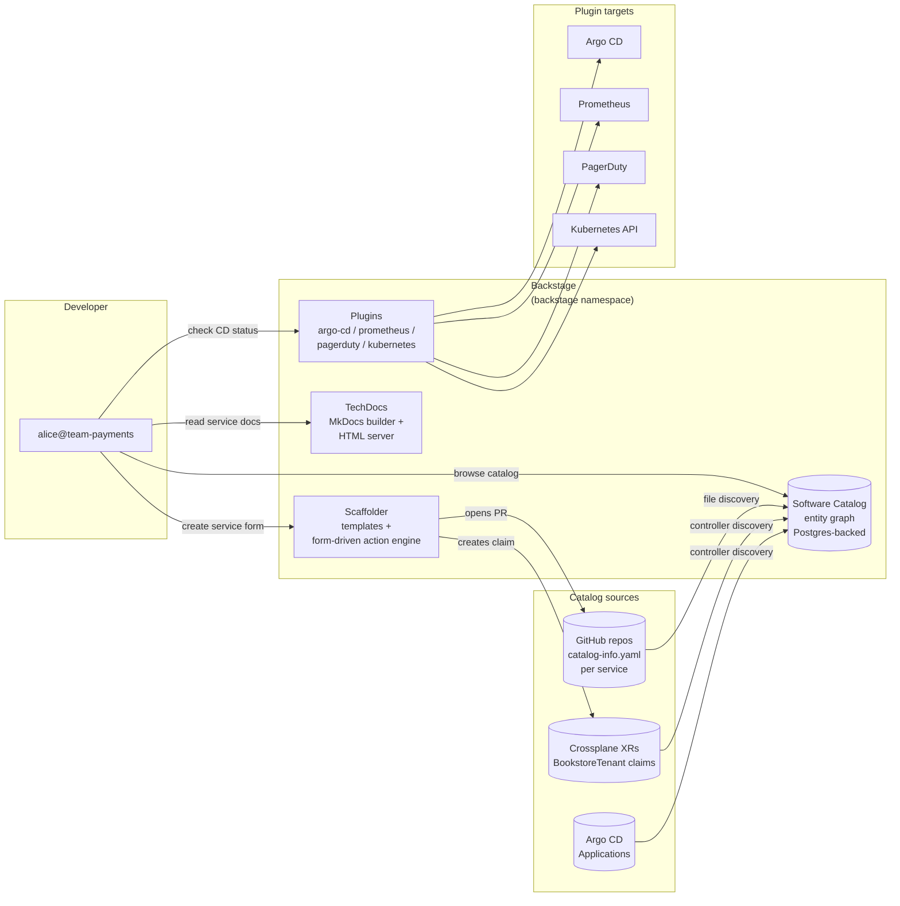
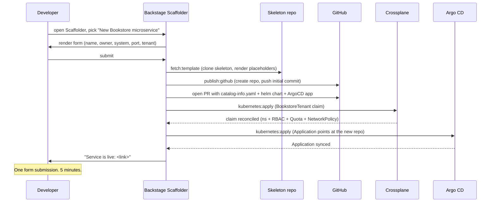

# 13.11 — Developer portal: Backstage scaffolder + software catalog + tech docs

> Backstage as the developer's entry point — the scaffolder template
> that creates a new microservice from a golden path; the software
> catalog seeded from Argo CD + Crossplane; the tech docs from the
> bookstore-platform repo; the plugins that surface CD + dashboards +
> on-call in one pane.

**Estimated time:** ~45 min read · half-day hands-on
**Prerequisites:** [Part 11 ch.10](../11-advanced-production-patterns/10-platform-engineering.md) — Backstage as the IDP front · [Part 13 ch.02](02-tenancy-and-crossplane-onboarding.md) — Crossplane catalog feed · [Part 13 ch.09](09-observability-otel-tempo-loki-prometheus-grafana.md) — dashboards Backstage surfaces
**You'll know after this:** • install Backstage with a software catalog seeded by Argo CD + Crossplane · • author a scaffolder template that creates a new microservice from a golden path · • publish TechDocs from the bookstore-platform repo · • surface CD status + dashboards + on-call rota in a single Backstage view · • measure portal adoption via DORA + cognitive-load metrics

<!-- tags: bookstore-v2, platform-engineering, backstage, gitops, multi-tenancy -->

## Why this exists

The v1 Bookstore had **four services** — a developer could navigate
them by file path. The v2 platform has **nine services** (catalog,
orders, payments-gateway, search, events, recommendations, storefront,
the v1 four + the v2 five), running across **three regions**, with
**N tenants**, each producing **N namespaces**, each with their own
Grafana dashboards + Argo CD application + PagerDuty schedule + tech
docs. A new engineer's first day looks like:

- *"What services exist?"* — open Argo CD, count Applications, ignore
  the ones owned by the platform team, hope nobody renamed anything.
- *"Who owns `payments-gateway`?"* — git blame, ask in #platform-help.
- *"How do I create a new microservice?"* — clone the closest existing
  one, find/replace its name, commit, push, wait, debug.

That is the **discovery problem** every multi-team platform faces, and
the [Backstage](https://backstage.io/) project (Spotify, donated to the
CNCF) is the most-adopted solution. Backstage is **four things at
once**:

1. **Software Catalog** — the source of truth for "what services exist
   and who owns them." Seeded from `catalog-info.yaml` files in each
   service repo.
2. **Scaffolder** — the "create a new microservice in 5 minutes" UX. A
   form-driven template that clones a skeleton repo, parametrises it,
   and opens a PR.
3. **TechDocs** — the "where are the docs for this service?" UX. Each
   service repo carries a `docs/` directory + `mkdocs.yml`; Backstage
   renders the site in-place.
4. **Plugins** — the "where is my CD status / Grafana dashboard /
   PagerDuty schedule?" UX. The Argo CD plugin, the Prometheus plugin,
   the PagerDuty plugin — each surfaces the third-party tool's data in
   the service's Backstage page.

[Part 11 ch.10](../11-advanced-production-patterns/10-platform-engineering.md)
introduced Backstage **as a concept** — the developer-facing surface of
the Crossplane-shaped platform. It did not ship the install + the
scaffolder template + the catalog seeding + the plugin wiring. This
chapter does, and ties it back to the v2 platform: the scaffolder
template creates a new microservice **plus** a `BookstoreTenant` claim
(ch.13.02) **plus** an Argo CD Application **plus** a Helm chart **plus**
a `catalog-info.yaml`, all in one form submission.

> **In production:** The single biggest reason internal platforms
> stall is **the developer experience tax**. A platform with seven CRDs,
> three GitOps repos, two dashboards, and a Slack channel for help is
> *technically powerful* and *adoption-zero*. Backstage is the unifying
> surface; the scaffolder is the path of least resistance; the catalog
> is the rumor-killer. v1 punted on this; v2 cannot.

## Mental model

**Backstage = Software Catalog + Scaffolder + TechDocs + Plugins. The
catalog is the source of truth (entity-graph in Backstage's DB; seeded
from `catalog-info.yaml` in each repo). The scaffolder is the
self-service interface (templates that clone + parameterise + PR). The
tech docs are the discoverable knowledge (MkDocs rendered from each
repo). The plugins are the third-party surface (Argo CD / Prometheus /
PagerDuty all visible per service).**

- **Software Catalog — the entity graph.** Backstage stores a graph of
  `Component` (a service), `API` (a service's API surface), `System`
  (a logical group of components), `Domain` (a higher group), `Group`
  (an owning team), `User` (a person), `Resource` (a database, a
  bucket, a Crossplane XR). The catalog is queried via GraphQL; the UI
  renders the entity-detail pages. Sources: file-based
  (`catalog-info.yaml` in each repo, discovered via GitHub) +
  controller-based (a Backstage Crossplane plugin reads
  `BookstoreTenant` claims and materialises Components).
- **Scaffolder — the parameterised templating engine.** A `Template`
  YAML defines: a form (Backstage renders), parameters (the form
  fills), and steps (each step is an action like `fetch:template`,
  `publish:github`, `catalog:register`). The scaffolder runs the
  template; the new service exists with one form submission.
- **TechDocs — MkDocs-as-a-service.** Each repo declares
  `mkdocs.yml` + a `docs/` directory. The TechDocs builder (a
  Backstage action; can run inline or as a sidecar) renders the docs
  into HTML; Backstage serves them at `/docs/<NAMESPACE>/<KIND>/<NAME>`.
- **Plugins — third-party surface.** The Backstage frontend imports
  plugin packages; each plugin adds a tab to the entity page. The
  Argo CD plugin renders the sync status; the Prometheus plugin
  renders alert panels; the PagerDuty plugin renders the on-call
  rotation. The backend proxies the third-party API calls (so a user
  who can see Backstage can see ArgoCD/Prom/PD data without a direct
  account).
- **Permission framework — who can do what.** Backstage's permission
  framework lets you say "only team-payments can scaffold a new
  service in the payments domain". Plugged into Keycloak via OIDC
  (ch.13.04); group claims map to Backstage Groups; permission rules
  match Groups to actions. v2 ships the basic shape; production
  layers the per-Component permissions.

The trap to keep in view: **the catalog is only as good as its
updates**. A service that ships without a `catalog-info.yaml` is
**invisible to Backstage**. The platform's defence: a
**pre-commit hook in the scaffolder skeleton** that fails if
`catalog-info.yaml` is missing or invalid; a **CI check** in every
service repo with the same assertion; the scaffolder generates it
correctly the first time so the developer never sees the hook fire.

## Diagrams

### Diagram A — the four surfaces of Backstage (Mermaid)



### Diagram B — the scaffolder flow (Mermaid)



### Diagram C — build-vs-buy matrix (ASCII)

```text
TOOL              FOSS?    SCAFFOLDER?  CATALOG?  PLUGINS?    NOTES
────────────────  ─────    ───────────  ────────  ──────────  ──────────────────────────────────
Backstage         yes      yes          yes       100+        the CNCF reference, biggest comm.
Compass           no       yes          yes       limited     Atlassian; tight with Jira/Bitbucket
Cortex            no       yes          yes       moderate    commercial; SOC2-friendly out of box
Port              no       yes          yes       moderate    commercial; ETL-driven catalog model
internal tool     yes(*)   maybe        maybe     org-specific the "we built one in React" story
────────────────  ─────    ───────────  ────────  ──────────  ──────────────────────────────────
WHEN WHICH:
  Backstage   — you have a platform team that can host a JS app.
                The default for the CNCF stack.
  Compass     — you live in the Atlassian suite; Jira is your
                source of truth.
  Cortex      — enterprise compliance is non-negotiable.
  Port        — your catalog is an ETL job from many sources;
                you care less about scaffolder templating.
  internal    — you have a strong frontend team + a clear, narrow
                use case; do not build Backstage from scratch.
```

## Hands-on with the Bookstore Platform

### 0. Prerequisites

- ch.13.04 ran — Keycloak is up; the `backstage` client is registered.
- ch.13.03 ran — Argo CD is up; ApplicationSet pattern works.
- Crossplane is up; `BookstoreTenant` XRD + Composition exist (ch.13.02).
- GitHub App configured (or PAT, dev-mode) — Backstage needs a token
  to read repos + open PRs.

### 1. Install Backstage (pinned-Helm)

```sh
kubectl config use-context kind-bookstore-platform-us-east

BACKSTAGE_CHART_VERSION="2.6.0"

helm repo add backstage https://backstage.github.io/charts
helm repo update

helm install backstage backstage/backstage \
  --version "$BACKSTAGE_CHART_VERSION" \
  -n backstage --create-namespace --wait \
  --set 'backstage.image.registry=ghcr.io' \
  --set 'backstage.image.repository=your-org/bookstore-platform-backstage' \
  --set 'backstage.image.tag=1.31.0' \
  --set 'postgresql.enabled=true' \
  --set 'service.type=ClusterIP'
```

> The Backstage Helm chart wraps a **container image you build** — the
> Backstage app is a JS project that bundles plugins; the recommended
> shape is a per-org image (`ghcr.io/your-org/bookstore-platform-backstage`)
> built from the Backstage `app-cli` template. The chart deploys the
> image; the image carries the plugins (the v2 platform: ArgoCD,
> Prometheus, PagerDuty, Kubernetes, Crossplane).

Verify:

```sh
kubectl -n backstage get pod,svc
# NAME                             READY   STATUS    RESTARTS   AGE
# pod/backstage-7c8d9-abc12        1/1     Running   0          30s
# pod/backstage-postgresql-0       1/1     Running   0          30s
#
# NAME                                 TYPE        CLUSTER-IP        PORT(S)
# service/backstage                    ClusterIP   10.96.123.45      7007/TCP
# service/backstage-postgresql         ClusterIP   10.96.123.46      5432/TCP

kubectl -n backstage port-forward svc/backstage 7007:7007 &
# Open http://localhost:7007 — sign in via Keycloak.
```

### 2. Apply the platform Backstage manifests

```sh
# The Argo CD Application that installs Backstage via Helm
kubectl apply -f examples/bookstore-platform/backstage/backstage-application.yaml

# Backstage app-config.production.yaml (ConfigMap mounted into pod)
kubectl apply -f examples/bookstore-platform/backstage/app-config.yaml

# Scaffolder template — the golden path
kubectl apply -f examples/bookstore-platform/backstage/scaffolder-template-new-service.yaml

# Per-service catalog-info.yaml template
kubectl apply -f examples/bookstore-platform/backstage/catalog-info-template.yaml

# MkDocs config for TechDocs
kubectl apply -f examples/bookstore-platform/backstage/tech-docs-config.yaml
```

### 3. Seed the catalog from existing services

Each v2 service ships a `catalog-info.yaml` (the template in
`backstage/catalog-info-template.yaml` is the canonical form). Backstage
discovers them via the `github-discovery` integration: scan the
`bookstore-platform` GitHub org for any repo with a
`catalog-info.yaml` at root.

```yaml
# Example catalog-info.yaml — one per service
apiVersion: backstage.io/v1alpha1
kind: Component
metadata:
  name: payments-gateway
  description: "v2 payments gateway — Stripe + outbox + saga"
  annotations:
    github.com/project-slug: your-org/bookstore-platform
    backstage.io/techdocs-ref: dir:.
    argocd/app-name: bookstore-payments-gateway-us-east
    prometheus.io/rule: "bookstore-platform-payments"
    pagerduty.com/service-id: PXXXXX
spec:
  type: service
  lifecycle: production
  owner: team-payments
  system: bookstore-platform
  providesApis:
    - payments-gateway-api
  dependsOn:
    - resource:cnpg-postgres
    - resource:kafka
```

The annotations are **the magic**: each plugin reads the annotation
that names it; the plugin's tab in the entity page populates.

### 4. Use the scaffolder — create a new microservice

```sh
# Open Backstage -> Create -> "New Bookstore microservice"
# Fill the form:
#   - name: notifications
#   - owner: team-notifications
#   - system: bookstore-platform
#   - port: 8080
#   - tenant: acme-books   (creates the BookstoreTenant claim)
# Submit.
#
# Behind the scenes:
#   1. Scaffolder clones the skeleton repo (a Go service template).
#   2. Renders placeholders ({{name}} -> notifications, etc.).
#   3. Creates a new GitHub repo `bookstore-platform-notifications`.
#   4. Pushes the initial commit with:
#      - main.go (skeleton service)
#      - Dockerfile
#      - helm chart (skeleton)
#      - catalog-info.yaml
#      - .github/workflows/ci.yaml
#      - docs/index.md
#      - mkdocs.yml
#   5. Opens a PR titled "Initial commit: notifications service".
#   6. Applies a BookstoreTenant claim (if a new tenant) — Crossplane
#      reconciles ns + RBAC + Quota + NetworkPolicy.
#   7. Applies an Argo CD Application that points at the new repo.
#   8. Returns the link to the developer.
#
# Total elapsed time: 1-2 minutes.
```

### 5. Browse the catalog

```sh
# Backstage UI -> Catalog -> "Components"
# Filter: kind=Component, type=service, owner=team-payments
# Click payments-gateway -> see:
#   - Overview tab: description, owner, system, annotations
#   - CI/CD tab:   Argo CD sync status, last deploy
#   - Monitoring tab: Prometheus alert panels (active alerts + history)
#   - On-Call tab: PagerDuty schedule, who is on now
#   - Docs tab:   the service's mkdocs site, in-frame
#   - API tab:    the OpenAPI spec, rendered as Swagger UI
#   - Dependencies tab: the graph of dependsOn / providesApis
```

### 6. The TechDocs flow

Each service's `docs/` directory:

```text
docs/
├── index.md
├── architecture.md
├── runbook.md
└── api.md
mkdocs.yml
```

```sh
# Backstage builds the docs:
#   - on-demand: when a user opens the Docs tab, the techdocs-cli builds
#     the site on the backend, caches it. First load: ~30s; subsequent: instant.
#   - pre-built: a GitHub Action on push runs `techdocs-cli generate +
#     publish` to S3; Backstage reads from S3. The production-shape.
#
# v2 ships the pre-built path; production-grade builds run in CI.
```

## How it works under the hood

**The Backstage entity graph.** A directed graph: `Component -[ownedBy]->
Group`, `Component -[providesApi]-> API`, `Component -[dependsOn]->
Component`. Storage is Postgres (the Backstage backend manages
schema). Each entity has a UID + a fully-qualified ref
(`<kind>:<namespace>/<name>`). The catalog API returns the graph; the
UI renders it. Lifecycle: `entityProvider` reads sources (file +
controller); `entityProcessor` validates + resolves references;
`entityStore` persists.

**The Scaffolder action plugin model.** Backstage ships a built-in
set of actions:

- `fetch:template` — clone a repo, render Jinja2/Handlebars
  placeholders against the form params.
- `publish:github` — create a GitHub repo, push the rendered
  content.
- `publish:github:pull-request` — open a PR.
- `catalog:register` — add the new entity to the catalog.
- `kubernetes:apply` — apply a manifest (v2 uses this for the
  BookstoreTenant claim + the Argo CD Application).
- `fs:rename`, `fs:delete`, `roadiehq:utils:*` — small file ops.

Plugins can add custom actions. v2 ships a `bookstore:tenant`
action that wraps the BookstoreTenant claim with platform-specific
defaults; the scaffolder template uses it.

**TechDocs integration — `techdocs-cli`.** The CLI builds an MkDocs
site to static HTML; uploads to S3 (or the local filesystem).
Backstage's TechDocs backend reads the site from S3 and proxies it
to the frontend. Two builder modes: **local** (Backstage backend
runs `techdocs-cli` inline; slow; OK for small docs) and
**external** (a CI job runs the build; Backstage just reads). v2
uses external for production speed.

**The Argo CD plugin — the server-side proxy.** The frontend plugin
calls `/api/proxy/argocd/api/v1/applications/<NAME>`; the Backstage
backend's proxy forwards to the Argo CD API with a service-account
token. The end-user does not need a personal Argo CD account; the
proxy is the trust boundary. Same shape for the Prometheus plugin
(proxies to `/api/v1/alerts`) and PagerDuty (proxies to
`/services/<ID>/oncalls`).

**Permission framework — RBAC for who can scaffold.** Backstage's
permission framework defines `permissionResource` (the action),
`permissionAttributes` (the target), and `permissionDecision` (allow
/ deny). Rules are policy-as-code: a Backstage backend plugin
implements `permissionPolicy` returning the decision per request.
v2's policy:

```typescript
// permissionPolicy.ts (sketched)
if (request.permission.name === "scaffolder.task.create"
    && request.resourceRef.kind === "Template"
    && request.resourceRef.name === "new-bookstore-service") {
  return resourceCondition({
    resourceType: "scaffolder-template",
    conditions: [{ rule: "HAS_LABEL", params: { label: `team:${user.team}` } }],
  });
}
```

Read: "alice from team-payments can scaffold a template labelled
`team:team-payments`; she cannot scaffold templates labelled
`team:team-search`." Plugged into Keycloak group claims via OIDC.

**The catalog-info.yaml discovery flow.** Backstage's
`github-discovery` config scans GitHub for repos with
`catalog-info.yaml`; each catalog file declares one or more
entities. Reconciliation: a Backstage worker processes the
discovered entities every 5 minutes; new entities appear in the
catalog; deleted entities disappear; modified entities update.

## Production notes

> **In production:** **The catalog is only as good as its updates.**
> A service without a `catalog-info.yaml` is invisible. The
> defence: (1) the scaffolder generates it correctly (v2 does);
> (2) a pre-commit hook in the skeleton fails if the file is
> missing or invalid; (3) a CI check in every service repo
> validates the file against the Backstage entity schema. v2
> ships all three.

> **In production:** **GitHub App > PAT.** A personal-access
> token works in dev; production needs a GitHub App with scoped
> permissions (read code; write commits to the platform org).
> The App's token is rotated every hour; the PAT is rotated
> never. Mitigation: a CI check refuses any `app-config` change
> that re-introduces a PAT.

> **In production:** **Secrets in Backstage — via ESO, not env
> vars in the chart.** The Backstage app-config references
> `${POSTGRES_PASSWORD}` and `${GITHUB_APP_KEY}` and
> `${KEYCLOAK_CLIENT_SECRET}`. Each is an env var sourced from
> a Kubernetes Secret materialised by ESO (Part 05 ch.04). The
> chart's `extraEnvVars` block wires them. Never inline a
> secret in the app-config ConfigMap.

> **In production:** **The Scaffolder template is brittle on
> first apply.** New templates ship with broken parameter
> handling, wrong file paths, undefined Jinja2 variables. The
> remedy: **test the template like CI tests** — the Backstage
> `e2e-test` plugin runs the template against a sandbox GitHub
> org and asserts the output is valid. v2 wires the e2e test
> for the `new-bookstore-service` template into a nightly
> GitHub Action; the template is exercised every night against
> the fresh skeleton.

> **In production:** **MkDocs failures = tech docs page silently
> empty.** The TechDocs builder fails on a bad markdown link,
> a missing image, an unsupported plugin. The user sees an
> empty page. Mitigation: alert on `techdocs_build_failures_
> total` (Prometheus counter exposed by the TechDocs backend);
> the alert routes to the **service owner** (not the platform
> team); the owner fixes the markdown.

> **In production:** **Backstage is a stateful app; back it up.**
> Postgres (the catalog graph + the scaffolder task history) is
> the state. CNPG-backed (ch.13.06) with cross-region
> replication + a daily logical dump to S3. The state is small
> (~MB-scale) but losing it loses the catalog history + every
> running scaffolder task.

## Quick Reference

```sh
# Pinned install
BACKSTAGE_CHART_VERSION="2.6.0"

helm repo add backstage https://backstage.github.io/charts
helm install backstage backstage/backstage --version "$BACKSTAGE_CHART_VERSION" -n backstage --create-namespace --wait

# Apply the platform manifests
kubectl apply -f examples/bookstore-platform/backstage/backstage-application.yaml
kubectl apply -f examples/bookstore-platform/backstage/app-config.yaml
kubectl apply -f examples/bookstore-platform/backstage/scaffolder-template-new-service.yaml
kubectl apply -f examples/bookstore-platform/backstage/catalog-info-template.yaml
kubectl apply -f examples/bookstore-platform/backstage/tech-docs-config.yaml
```

Minimal skeletons:

```yaml
# Backstage Scaffolder Template (sketch)
apiVersion: scaffolder.backstage.io/v1beta3
kind: Template
metadata:
  name: new-bookstore-service
  title: "New Bookstore microservice"
spec:
  owner: team-platform
  type: service
  parameters:
    - title: Service basics
      properties:
        name:    { type: string, title: "Service name" }
        owner:   { type: string, title: "Owning team" }
        port:    { type: integer, title: "HTTP port", default: 8080 }
        tenant:  { type: string, title: "Tenant" }
  steps:
    - id: fetch
      action: fetch:template
      input: { url: "./skeleton", values: { name: "${{ parameters.name }}", ... } }
    - id: publish
      action: publish:github
      input:
        repoUrl: "github.com?owner=your-org&repo=bookstore-platform-${{ parameters.name }}"
    - id: tenant
      action: kubernetes:apply
      input: { manifest: <BookstoreTenant claim derived from form> }
    - id: argocd
      action: kubernetes:apply
      input: { manifest: <Argo CD Application pointing at the new repo> }
    - id: register
      action: catalog:register
      input: { repoContentsUrl: "${{ steps.publish.output.repoContentsUrl }}" }
---
# catalog-info.yaml (Component)
apiVersion: backstage.io/v1alpha1
kind: Component
metadata:
  name: <NAME>
  annotations:
    github.com/project-slug: your-org/<REPO>
    backstage.io/techdocs-ref: dir:.
    argocd/app-name: <ARGOCD-APP>
spec:
  type: service
  lifecycle: production
  owner: <TEAM>
  system: bookstore-platform
```

Checklist (the developer portal closed when all six are yes):

- [ ] Backstage is installed; admin can sign in via Keycloak.
- [ ] Software catalog seeded; every v2 service appears as a Component.
- [ ] Scaffolder template `new-bookstore-service` exists; submitting it
      creates a new repo + BookstoreTenant + ArgoCD Application.
- [ ] TechDocs renders for at least one service.
- [ ] Argo CD plugin shows sync status on the Component's CI/CD tab.
- [ ] Permission framework: a developer can scaffold templates labelled
      with their team; not others'.

## Test your understanding

> Try each before opening the answer drawer. The act of trying is the exercise; the answer is the check.

1. **What problem does Backstage solve that "a wiki page with links" does not?**
   <details><summary>Show answer</summary>

   (1) **Software catalog as a queryable, automated entity** — services, owners, dependencies, lifecycle are data, not prose. Backstage can answer "all services owned by team X with no on-call rota" in one query. (2) **Scaffolder templates** that codify the golden path — a developer fills a form, the template renders a new repo + manifests + dashboard + on-call rotation in one action. (3) **Unified UX** — Argo CD status, dashboards, on-call, TechDocs, security scans all under one URL with one auth. (4) **Discoverability** — new engineers find services without asking. The wiki replaces only the documentation surface; Backstage is "the platform's UI."

   </details>

2. **A developer scaffolds a new service from the template. What downstream side-effects should the template trigger to make the service "platform-compliant" out of the box?**
   <details><summary>Show answer</summary>

   The template should: (1) Create a new git repo with `main.go` + Dockerfile + Makefile + restricted-PSA Deployment/Service. (2) Open a PR against the GitOps repo adding the new service's Argo CD `Application`. (3) Create or update a Crossplane `BookstoreTenant` (or component-level XR) for any infrastructure the service needs. (4) Register the service in the Backstage catalog (`catalog-info.yaml`). (5) Wire OpenTelemetry instrumentation, Prometheus ServiceMonitor, Grafana dashboard from a per-service template. (6) Add the team's on-call rotation. Anything not automated by the template becomes a manual chore that gets skipped — and a service skipping any of these is the "ghost service" with no dashboard, no alerts, no owner. The template is the golden path because it removes the alternatives.

   </details>

3. **Your scaffolder template creates a service, but the new repo's PR fails CI because the Dockerfile uses a base image not in the allowlist. What's the right fix?**
   <details><summary>Show answer</summary>

   Don't patch the new repo's Dockerfile; fix the *template*. The template is the source of "what every new service looks like." If the template's base image is wrong, every new service inherits the same bug. Update the template to reference an allowed base image, bump its version, and re-test. Existing services with the old image either continue working (CI ratchet allows pre-existing) or get a coordinated bump PR. The discipline: templates are products; bugs in templates are bugs in the platform; treat them with the same rigor as service code.

   </details>

4. **How do you measure whether the developer portal is "successful" — what metrics do you watch?**
   <details><summary>Show answer</summary>

   (1) **Adoption**: number of services scaffolded via the template vs the total number of new services (the rest came from `kubectl apply -f` or manual repos). Goal: >80% from the template. (2) **DORA**: deployment frequency, lead time, change-failure rate, MTTR. Did the portal make these better? (3) **Cognitive load survey**: developer survey rating "I can find what I need to operate my service." (4) **Time to first deploy** for a new engineer's first service — before vs after. (5) **Support ticket volume** asking "where do I find X" — a falling number = the portal is working. Adoption alone can be misleading (people use it because they have to); pair with cognitive-load metrics for the honest picture.

   </details>

5. **Hands-on: scaffold a new service via the `new-bookstore-service` template. Watch what happens in (a) the new git repo, (b) the GitOps repo, (c) Argo CD, (d) the Crossplane stack, (e) the Backstage catalog. How long is the end-to-end "developer to running pod" time?**
   <details><summary>What you should see</summary>

   Form submission → ~30s for the template to create the git repo + push the initial commit + open the GitOps PR. PR review + merge → 30-60s. Argo CD sync → ~30s for the new Application to reconcile. Crossplane onboarding (if needed) → 30-60s for the namespace + RBAC + quota. Pod schedule + start → 30-60s. End-to-end with human review in the PR: 3-10 min. End-to-end with auto-merge: 2-3 min. Compare this to the "ticket to platform team, wait two weeks" old shape — that's the value the portal delivers, measured in days saved per service per quarter.

   </details>

## Further reading

- **Backstage Software Catalog docs**
  <https://backstage.io/docs/features/software-catalog/>; the
  entity model + discovery integrations.
- **Backstage Scaffolder docs**
  <https://backstage.io/docs/features/software-templates/>; the
  template action engine + the publish flow.
- **Backstage TechDocs docs**
  <https://backstage.io/docs/features/techdocs/>; the MkDocs
  integration + builders.
- **Backstage permission framework docs**
  <https://backstage.io/docs/permissions/overview>; the
  permission-policy-as-code model.
- **Spotify Backstage Adoption Lessons**
  <https://backstage.spotify.com/blog>; the canonical case study.
- **Rosso et al., *Production Kubernetes* ch.16 — Platform
  Abstractions**; the IDP discipline this chapter ships.
- **Skelton & Pais, *Team Topologies*** — the team-organisation
  framing behind "paved road" and the platform-as-product idea.
