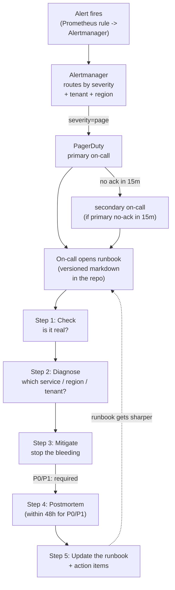
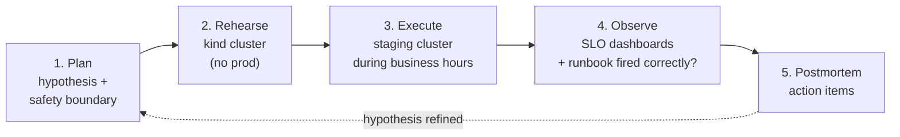

# 13.12 — Day-2: runbook + on-call playbook + DR drill + chaos game-day

> The page an on-call engineer opens at 3am; the monthly DR drill; the
> quarterly chaos game-day; the operational story that turns the
> platform's capabilities into a working system. The closing arc of
> Part 13.

**Estimated time:** ~60 min read · half-day hands-on
**Prerequisites:** [Part 13 ch.01-11](01-bookstore-2-from-toy-to-platform.md) — every v2 capability this chapter operationalises · [Part 11 ch.07](../11-advanced-production-patterns/07-chaos-engineering.md) — chaos discipline this chapter schedules · [Part 08 ch.02](../08-day-2-operations/02-backup-and-dr.md) — DR drill foundation · [Part 06 ch.05](../06-production-readiness/05-reliability-and-disruptions.md) — SLO + error budget that drive the runbook
**You'll know after this:** • synthesise the eleven prior chapters' capabilities into a single operational discipline · • author a runbook that an on-call engineer can open at 3am and act on · • plan a monthly DR drill that exercises multi-region failover end-to-end · • plan a quarterly chaos game-day with bounded blast radius and learning outcomes · • close the loop from incident → postmortem → SLO budget → backlog · • prove the v2 platform's capabilities hold under coordinated failure · • close the Part 13 capstone with an honest "what we did not build" list

<!-- tags: bookstore-v2, day-2, dr, postmortem, slo, capstone -->

## Why this exists

The eleven previous chapters built **capabilities**: tenancy, regions,
identity, search, payments, edge, ML, observability, cost, developer
portal. Each one ships a working slice. **None of them is the
platform.** A platform is not a set of capabilities; a platform is an
**operational discipline** applied to capabilities. This chapter is
that discipline:

1. **The runbook is the page an on-call engineer opens at 3am.** Not
   a Confluence wiki; a versioned markdown file in the repo. Each
   alert has a runbook. Each runbook is structured. Each runbook is
   exercised in chaos game-days.
2. **The on-call playbook is who's on-call and how escalation works.**
   1-week rotations, 2-tier (primary + secondary), explicit severity
   definitions, blameless postmortems.
3. **The DR drill is the monthly fire drill.** Scripted, time-boxed,
   scored. Extends ch.13.03's regional failover.
4. **The chaos game-day is the quarterly resilience test.** Hypothesis-
   driven, blast-radius-bounded, observed against SLOs (the discipline
   from [Part 11 ch.07](../11-advanced-production-patterns/07-chaos-engineering.md)).

[Part 08](../08-day-2-operations/02-backup-and-dr.md) built the
Day-2 chapters — backup/DR, multi-tenancy, upgrades, capacity. [Part 11
ch.07](../11-advanced-production-patterns/07-chaos-engineering.md)
built Chaos Mesh. This chapter is the **platform-v2-shaped** synthesis:
real runbooks against the v2 alerts; the on-call rotation that fits
multi-region; the DR drill against the multi-region active-active
shape; the chaos game-day against the nine-service request path.

This chapter is also **the closing arc of Part 13**. The reader who
gets here has read 11 chapters that each built one slice of the
platform; this chapter pulls them into one operational story and
names the through-line.

> **In production:** Without this chapter, the platform is **code**,
> not a **product**. The capabilities exist; the discipline does not.
> Every multi-team Kubernetes platform that fails to ship operability
> dies the same way: the platform team becomes a 24/7 escalation
> queue; senior engineers burn out; the product teams lose trust;
> migration begins. The remedy is the four artifacts in this chapter,
> rehearsed before they are needed.

## Mental model

**Day-2 operations = (the playbook the on-call USES at 3am) + (the
procedures the team REHEARSES monthly) + (the chaos drills the team
RUNS quarterly). The runbook is structured (alert → check → diagnose
→ mitigate → postmortem). On-call rotations are 1-week, 2-tier, with
explicit escalation. DR drills are scripted, scored. Chaos game-days
are hypothesis-driven, blast-radius-bounded, postmortem-closed.**

- **The runbook structure — five sections.** Every runbook in
  `examples/bookstore-platform/runbooks/` follows the same shape:
  1. **Alert** — the alert name, the Prometheus query, the
     dashboard link. The first sentence answers "what fired?".
  2. **Check** — fast (< 60s) commands to confirm it's a real
     incident, not a flapping alert. The "is it real?" gate.
  3. **Diagnose** — ordered commands to localise the cause. The
     branching tree of "if the answer is X, jump to step Y."
  4. **Mitigate** — the action to stop the bleeding. Cite the
     exact command + the safety check ("does this affect any other
     tenant?").
  5. **Postmortem link** — the template for the writeup. Required
     within 48h for any P0/P1 incident.
- **On-call rotation patterns.** Two shapes work at platform scale:
  - **Primary + secondary (the v2 default).** A primary engineer is
    paged first; a secondary is paged if primary does not ack in
    15 minutes. 1-week shifts. Handoff meetings every Monday.
  - **Follow-the-sun.** Three regional teams (us-east, eu-west,
    ap-southeast) each cover an 8-hour window. Pages route by
    time-of-day to the awake team. The right shape at > 100
    engineers; over-engineered at < 50. v2 ships primary+secondary;
    follow-the-sun is a production-graduate.
- **Severity definitions — P0 / P1 / P2.** Each severity ties to
  customer impact:
  - **P0** — production down (50 % of customers affected; data
    loss; safety / regulatory). Page; customer comm in 15 minutes;
    postmortem mandatory; war-room within 30 minutes.
  - **P1** — degraded (single-region down; single feature broken
    for all tenants; tenant isolation breach). Page; customer
    comm in 1 hour; postmortem within 48h.
  - **P2** — minor (single tenant affected, workaround exists;
    cosmetic). Slack only; no postmortem.
- **DR-drill scoring.** Every drill produces three numbers:
  - **RTO actual** vs **RTO target** (how long until recovery?
    target is 30 minutes for v2).
  - **RPO actual** vs **RPO target** (how much data was lost?
    target is < 5 minutes for v2 via CNPG sync replication).
  - **Human action time** (how long did the responders take? The
    point of monthly drills is to drive this number down.)
- **Chaos game-day pattern.** Hypothesis → safety boundary →
  experiment → observe → learn:
  - **Hypothesis** — a falsifiable claim ("storefront stays up
    when one payments-gateway Pod dies").
  - **Safety boundary** — what we WON'T break (no chaos in
    production; one Pod max; 60 second duration).
  - **Experiment** — the Chaos Mesh CR.
  - **Observe** — against the SLO (the Prometheus dashboard +
    the Grafana panel for active alerts).
  - **Learn** — postmortem template; action items.
- **Postmortem culture — blameless, action-item-driven.** The
  template (the file in `examples/bookstore-platform/runbooks/
  postmortem-template.md`) has structured sections: Summary,
  Impact, Timeline, Root Cause, Action Items, Lessons. The writeup
  is published widely (not buried in a wiki); the action items are
  tracked to completion.

The trap to keep in view: **runbooks decay**. A runbook written and
not exercised is wrong within 30 days — the service evolved, the
alert renamed, the dashboard moved. The defence: every runbook is
exercised at least once per quarter, either in a chaos game-day
(intentional) or a real incident (unfortunate). Runbooks not
exercised in 90 days carry a banner: "STALE — exercise before
trusting."

## Diagrams

### Diagram A — the on-call flow (Mermaid)



### Diagram B — incident severity matrix (ASCII)

```text
SEV  CUSTOMER IMPACT              PAGE?   CUSTOMER COMM?         POSTMORTEM?    EXAMPLES
───  ──────────────────────────   ─────   ─────────────────────  ─────────────  ───────────────────────────────
P0   >=50% of customers down,     yes     within 15 min          required       full-platform outage; data loss;
     OR data loss,                                               (mandatory)    payments stalled cluster-wide;
     OR safety/regulatory                                                       tenant isolation breach
P1   single region down,          yes     within 1 hour          required       us-east down; search broken;
     OR feature broken for ALL                                   (within 48h)   recommendations not scoring;
     tenants,                                                                   payments succeed but webhook
     OR tenant isolation issue                                                  delivery delayed
P2   single tenant affected,      slack   on-request only        NOT required   tenant X's search index lagging;
     OR workaround exists,        only                                          tenant Y over budget warning;
     OR cosmetic                                                                cosmetic UI glitch
───  ──────────────────────────   ─────   ─────────────────────  ─────────────  ───────────────────────────────
RESPONSE TIME TARGETS (the on-call SLA):
  P0  ack within 5 min, mitigate within 30 min, postmortem within 48h
  P1  ack within 15 min, mitigate within 4 hours, postmortem within 48h
  P2  ack within 1 business day, mitigate when convenient
```

### Diagram C — the chaos game-day arc (Mermaid)



## Hands-on with the Bookstore Platform

### 0. Prerequisites

- ch.13.09 ran. Alertmanager + Grafana exist; alerts route to a mock
  PagerDuty receiver.
- ch.13.03 ran. Multi-region clusters exist; ApplicationSet is live.
- [Part 11 ch.07](../11-advanced-production-patterns/07-chaos-engineering.md)
  ran or Chaos Mesh is installed:

```sh
CHAOS_MESH_VERSION="2.7.0"

helm repo add chaos-mesh https://charts.chaos-mesh.org
helm install chaos-mesh chaos-mesh/chaos-mesh \
  --version "$CHAOS_MESH_VERSION" \
  -n chaos-mesh --create-namespace --wait \
  --set 'chaosDaemon.runtime=containerd' \
  --set 'chaosDaemon.socketPath=/run/containerd/containerd.sock'
```

### 1. Apply the runbook tree

```sh
# The runbook tree is documentation + scripts + Chaos Mesh CRDs
ls examples/bookstore-platform/runbooks/
# README.md
# runbook-api-latency-p99.md          <- P1: catalog p99 > 500ms
# runbook-payments-failure-rate.md    <- P1: payments fail > 5%
# runbook-database-replication-lag.md <- P1: CNPG replication > 30s
# on-call-rotation.md                 <- the rotation policy
# dr-drill-script.sh                  <- the 30-min monthly drill
# chaos-gameday.md                    <- the quarterly chaos playbook
# chaos-experiments.yaml              <- Chaos Mesh Workflow (5 experiments)
# postmortem-template.md              <- blameless writeup template

kubectl apply -f examples/bookstore-platform/runbooks/chaos-experiments.yaml
```

### 2. Walk a runbook end-to-end

The alert fires at 3am:

```text
[PAGE] BookstoreCatalogP99Latency
Severity: page
Tenant: acme-books
Region: us-east
p99 = 873ms (threshold: 500ms)
Runbook: https://github.com/your-org/bookstore-platform/blob/main/runbooks/runbook-api-latency-p99.md
Dashboard: https://grafana.bookstore-platform.example.com/d/bookstore-overview?var-tenant=acme-books
```

The on-call opens
`examples/bookstore-platform/runbooks/runbook-api-latency-p99.md` and
walks the five sections. Step 1 (Check):

```sh
kubectl --context kind-bookstore-platform-us-east -n bookstore-platform-acme-books get pods -l app=catalog
# If all Running -> the alert is real (not a deploy-in-progress)

# Confirm the metric
kubectl --context kind-bookstore-platform-us-east -n prometheus-system exec -ti prometheus-kube-prometheus-stack-prometheus-0 -- \
  promtool query instant http://localhost:9090 \
  'histogram_quantile(0.99, sum by (le) (rate(http_request_duration_seconds_bucket{service="catalog",tenant="acme-books"}[5m])))'
# 0.873   <- confirmed, real
```

Step 2 (Diagnose): the runbook walks an ordered tree (DB? CPU? Pod
restart loop? Network? GC pause?). Step 3 (Mitigate): the action that
stops the bleeding (scale catalog from 3 → 6 replicas; or roll back to
the last green deploy). Step 4: postmortem.

### 3. Run the monthly DR drill (extends ch.13.03)

```sh
# The drill script extends ch.13.03's failover (the manual version)
# into a 30-minute scripted, scored exercise.
bash examples/bookstore-platform/runbooks/dr-drill-script.sh \
  --region us-east \
  --target-region eu-west \
  --dry-run=false

# Sample output:
# [00:00] DR DRILL STARTED — us-east -> eu-west failover
# [00:01] Pre-flight: checking eu-west cluster health... OK
# [00:02] Pre-flight: checking CNPG replication lag... 2s (target < 5s) OK
# [00:03] PHASE 1: cordon + drain us-east
# [03:42] PHASE 2: promote eu-west CNPG to primary
# [05:18] PHASE 3: update Argo CD ApplicationSet target
# [08:33] PHASE 4: update DNS to point at eu-west
# [12:00] PHASE 5: verify checkout flow against eu-west
# [12:42] DRILL PASSED
#   RTO actual:        12m42s   (target: 30m)
#   RPO actual:        3s       (target: 5m)
#   Human action time: 2m11s    (last drill: 4m02s)
# Postmortem: examples/bookstore-platform/runbooks/dr-drill-2026-05-01.md
```

### 4. Run a chaos game-day experiment

```sh
# The Chaos Mesh Workflow defines 5 experiments + a 10-min observation
# window. Each experiment has a hypothesis + abort condition.
kubectl apply -f examples/bookstore-platform/runbooks/chaos-experiments.yaml

# Start with the simplest experiment (pod-kill on payments-gateway)
kubectl -n chaos-mesh-experiments create -f - <<EOF
apiVersion: chaos-mesh.org/v1alpha1
kind: PodChaos
metadata:
  name: gameday-pod-kill-payments
  namespace: chaos-mesh-experiments
spec:
  action: pod-kill
  mode: one
  duration: "60s"
  selector:
    namespaces: [bookstore-platform-acme-books]
    labelSelectors:
      app: payments-gateway
EOF

# Watch the storefront stay up
watch -n 5 'curl -sk -o /dev/null -w "%{http_code} %{time_total}s\n" https://gateway.bookstore-platform.example.com/healthz'
# 200 0.012s
# 200 0.014s
# 200 0.011s
# ...
# (Pod killed; PodDisruptionBudget enforces minAvailable: 2; the
#  service stays available.)

# Inspect the postmortem template
cat examples/bookstore-platform/runbooks/postmortem-template.md
```

### 5. The quarterly chaos game-day (the 5 experiments)

The Chaos Mesh Workflow in
`examples/bookstore-platform/runbooks/chaos-experiments.yaml` chains
5 Chaos Mesh experiments + an optional cordon-based region-loss
simulation in `dr-drill-script.sh`. The five Chaos Mesh CRs:

1. **PodChaos — pod-kill** on payments-gateway (test PDB).
2. **NetworkChaos — network-delay** on catalog → orders (test timeouts + retries).
3. **StressChaos — io-stress** on the CNPG node (test replication failover).
4. **DNSChaos — region-DNS-loss** (resolve `*.bookstore-platform.example.com`
   to NXDOMAIN) — disrupts what the *application* sees of remote
   regions; complements the cordon-based simulation in
   `dr-drill-script.sh` which disrupts what the *cluster* sees of its
   own nodes. Tests the DR runbook + saga compensation.
5. **HTTPChaos — payments-gateway-failure** (HTTP 500 from Stripe webhook) —
   tests the saga compensation (ch.13.06).

Each experiment has:
- A hypothesis ("storefront stays up").
- An abort condition (a Prometheus query that fails the experiment).
- A 10-minute observation window.
- A postmortem requirement (even if the experiment passed).

## How it works under the hood

**Why structured runbooks — the 3am cognitive load story.** At 3am,
an on-call engineer is sleep-deprived; the on-call is the worst time
for ad-hoc reasoning. The runbook offloads the reasoning: each step
is a command + the expected output + the branching decision. The
goal is to reduce on-call to **mechanical execution**; only the rare
"the runbook doesn't cover this" case requires cognitive load. This
is why Google SRE recommends runbooks per alert; this is why v2
ships them.

**On-call rotation patterns at platform scale.** Three variables:
- **Shift length.** 1 week is common; some teams use 12-hour
  shifts for follow-the-sun. Longer = more handoff loss; shorter =
  more handoff overhead. 1 week is the median.
- **Rotation size.** A rotation of 5 means each engineer is on-
  call every 5 weeks. < 4 = burnout risk; > 10 = on-call skills
  decay between shifts. Target 5-8.
- **Tier structure.** Single-tier (one person, escalate to manager) =
  starter; primary + secondary (the v2 default) = production-shape;
  follow-the-sun = global. Each adds operational overhead.

**DR-drill scoring — the three numbers.** Every drill outputs:
- **RTO actual** (time to recovery). The clock starts when the
  failure is injected; stops when the customer flow works again.
  Compare to RTO target (v2: 30 minutes).
- **RPO actual** (data loss). How much data was committed in the
  failing region that was lost in the failover? CNPG sync
  replication keeps this < 5 minutes (often < 5 seconds);
  measured by the timestamp of the last replicated transaction.
- **Human action time**. How long was the human in the loop?
  Each subsequent drill should reduce this — automation replaces
  manual steps. The point of the monthly cadence: drive this
  number toward zero (zero = fully automated DR; the production
  goal).

**Chaos game-day pattern in detail.** Hypothesis-driven:

1. **State the hypothesis** clearly. "When one catalog Pod dies,
   the storefront stays up and the catalog p95 latency stays under
   100 ms." Not "let's see what happens."
2. **Bound the blast radius.** One Pod. 60 seconds. One namespace.
   No production. The smallest fault that tests the hypothesis.
3. **Define the abort condition.** A Prometheus query that fails
   the experiment fast: "5xx rate > 5 % in any 10-second window."
   Chaos Mesh can read the query (the `statusCheck` field) and
   abort.
4. **Run + observe.** Watch the SLO dashboards. Did the hypothesis
   hold? If yes, the resilience control works; if no, an
   incident-in-staging that you found controlled.
5. **Postmortem.** Even passing experiments produce action items
   ("the alert fired at 873ms but the runbook says 500ms — update
   one or the other").

**Postmortem culture — blameless, structured, published widely.**
The template's sections (the file in `runbooks/postmortem-template.md`):
- **Summary** (1 paragraph; what happened, customer impact).
- **Timeline** (UTC timestamps; what was seen, what was done).
- **Root cause** (technical; the chain of events).
- **Why we did not catch it earlier** (the monitoring gap).
- **Action items** (each item has owner + due date + tracking
  ticket).
- **Lessons** (what we learned).
"Blameless" means the writeup names actions, not people; the
question is "what was the system that let this happen?" not "who
made the mistake?".

## Production notes

> **In production:** **Runbooks decay; exercise quarterly.** A
> runbook written and never exercised is wrong within 30-90 days.
> The defence: every chaos game-day runs against a specific
> runbook (the game-day's hypothesis IS the runbook's diagnose
> step); every real incident closes with a "did the runbook
> work?" question. Runbooks not exercised in 90 days carry a
> "STALE" banner.

> **In production:** **On-call burnout — limit page volume.**
> The target: < 2 pages per shift, < 1 P0 per quarter per
> engineer. Beyond that, on-call is destructive; the team will
> burn out. Mitigations: (1) **alert hygiene** — quarterly review
> of every alert; deletes the noisy ones; tunes the
> burn-rate thresholds; (2) **load shedding** — pages over a
> threshold (e.g. > 10 per shift) escalate to "the alerting is
> broken; the platform team's next sprint is to fix it"; (3)
> **dignified off-time** — no Slack expectations off-shift; the
> primary owns the page, period.

> **In production:** **The DR drill that "passed" because we
> changed the parameters.** The most common drill antipattern.
> A drill that the team has run 12 times in a row, all passing
> because someone keeps relaxing the RTO target by 5 minutes.
> The defence: **the drill targets are frozen and tracked in the
> runbook**; the engineer running the drill cannot edit them
> day-of; any target change requires a PR review.

> **In production:** **Chaos in production — earn it.** Production
> chaos is the right end-state; jumping there before staging
> chaos passes is reckless. The maturity ladder: (1) chaos in
> kind / dev, (2) chaos in staging during business hours, (3)
> chaos in staging off-hours, (4) chaos in production during
> business hours (one experiment per quarter), (5) chaos in
> production automated (Netflix Chaos Monkey shape). v2 ships
> (1) + (2); (3) onwards is platform-team-discretion + customer-
> impact-review.

> **In production:** **Postmortems published widely, not buried in
> a wiki.** A postmortem in a private wiki is invisible; a
> postmortem in a public Slack channel + the platform's `/docs/
> postmortems/` directory + a quarterly all-hands review is
> shared knowledge. The goal is not punishment; the goal is
> **the same mistake does not happen twice**.

> **In production:** **Action items tracked, not aspirational.**
> The number-one postmortem-quality regression: action items
> with no owner / no due date / no tracking ticket. Mitigation:
> the postmortem template REQUIRES owner + due date + ticket for
> each action; the platform's quarterly review tracks completion
> rate; an action-completion rate < 80 % is a process bug, not a
> people bug.

## What we did not build

The Day-2 chapter is necessarily incomplete. The platform v2 ships
the core operational story; deliberately deferred to follow-up work:

- **Full ITIL change-management.** v2 has GitOps as the change
  spine (every change is a PR; PRs are the change request +
  approval + audit). A formal ITIL CAB process layers on top for
  regulated industries; we point at it, do not implement.
- **Burn-rate alerting at every SLO.** ch.13.09 wires burn-rate
  alerts for the platform-level RED metrics; per-service SLOs +
  per-tenant SLOs + per-API SLOs are an exhaustive list this
  chapter foreshadows but does not enumerate.
- **STAMP-style postmortem analysis.** The
  [STAMP](http://psas.scripts.mit.edu/home/get_file.php?name=STAMP_primer.pdf)
  framework (system-theoretic accident model) is the rigorous
  research-grade postmortem method; v2 ships the lighter "5-why
  + timeline" template. STAMP for the platform team is a
  multi-year discipline graduate.
- **Production-traffic shadow testing.** Send a copy of
  production traffic to a canary version of the service; observe
  for behavioural diffs. KServe ships the inference-shadow
  shape (ch.13.08); the application-tier shadow is a Service
  Mesh feature (Istio `mirror`); v2 sketches it; production
  wires it.
- **Chaos-in-production framework.** Run controlled chaos in
  production continuously (Netflix Chaos Monkey shape). v2 runs
  chaos in staging only; the production transition is a
  separate maturity step that requires the SRE org to be at
  Operate-level in the FinOps language.
- **Auto-remediation.** "The alert fires; a controller
  automatically applies the mitigation; the human is informed."
  An aspirational end-state; v2 keeps the human in the loop for
  every page. Auto-remediation requires deep confidence in the
  mitigation correctness; we are honest that we are not there.

## Closing the platform-v2 thread

Part 13's twelve chapters built the v2 platform. Chapter by chapter,
the v1 toy became a production-shape artifact:

- **ch.01** — v1 had one service per concern; v2 has the eleven
  disciplines a platform requires.
- **ch.02** — v1 had one tenant (implicit); v2 has the
  `BookstoreTenant` API + Crossplane Composition.
- **ch.03** — v1 had one region; v2 has three regions, active-
  active, with CNPG replication + ApplicationSet fanout.
- **ch.04** — v1 had a toy HMAC; v2 has Keycloak OIDC for humans +
  IRSA for workloads + mesh-verified JWT.
- **ch.05** — v1 had no search; v2 has Meilisearch + Debezium CDC.
- **ch.06** — v1 had a fake payment; v2 has Stripe + outbox +
  Kafka + saga compensation.
- **ch.07** — v1 was bare; v2 has Istio Gateway + Coraza WAF +
  per-tenant rate limiting.
- **ch.08** — v1 had a rule-based recommender; v2 has MLflow +
  KServe + Alibi-Detect drift + Argo Events retraining.
- **ch.09** — v1 had Prometheus metrics; v2 has the three pillars
  with one collector.
- **ch.10** — v1 had no cost story; v2 has OpenCost + per-tenant
  showback + budget alerts.
- **ch.11** — v1 had four services a developer could navigate by
  filename; v2 has Backstage as the developer's entry point.
- **ch.12** — v1 had no Day-2 discipline; v2 has runbooks +
  on-call + DR drills + chaos game-days.

Every chapter applied a concept the guide had already taught (Part
06 Prometheus → ch.13.09's deepening; Part 11 ch.07 Chaos Mesh →
ch.13.12's game-day; Part 11 ch.10 Backstage → ch.13.11; Part 12
ch.06-08 KServe + Argo Workflows + MLflow → ch.13.08; Part 07
Argo CD → ch.13.03's ApplicationSet; Part 10 cloud identity →
ch.13.04's IRSA). Every footgun was named. Every cost was honest.

Part 12 ch.08 closed with the line:

> **"Kubernetes did not become an ML platform; the ML platform
> became a Kubernetes workload."**

Part 13's analog:

> **A platform is not a project you ship; a platform is the
> discipline of applying Kubernetes-the-engine honestly to a
> production-shape problem. The eleven capabilities are the
> easy part; the operational discipline of the twelfth chapter
> is the platform.**

The reader who finishes Part 13 has not built every platform on
every cloud for every team; the reader has built **one platform**
end-to-end, with every footgun named honestly. That is the
fundamental skill: **the next platform you build will be
different, and the disciplines transfer.**

For the next step:
- Appendix E ("Continuous learning paths") names the books +
  conferences + open-source communities that keep this discipline
  current.
- The source code lives in
  [`examples/bookstore-platform/`](../examples/bookstore-platform/);
  every YAML carries the chapter it lives in; every runbook is
  exercised in a chaos game-day.
- The v1 Bookstore at
  [`examples/bookstore/`](../examples/bookstore/) remains intact;
  read the two side-by-side to see the discipline gap that twelve
  chapters closed.

## Quick Reference

```sh
# Pinned install (Chaos Mesh; the other stacks are from previous chapters)
CHAOS_MESH_VERSION="2.7.0"

helm repo add chaos-mesh https://charts.chaos-mesh.org
helm install chaos-mesh chaos-mesh/chaos-mesh --version "$CHAOS_MESH_VERSION" -n chaos-mesh --create-namespace --wait

# Apply the runbook tree's Chaos Mesh Workflow
kubectl apply -f examples/bookstore-platform/runbooks/chaos-experiments.yaml

# Run the monthly DR drill
bash examples/bookstore-platform/runbooks/dr-drill-script.sh --region us-east --target-region eu-west

# Trigger one chaos experiment manually
kubectl apply -f examples/bookstore-platform/runbooks/chaos-experiments.yaml
```

Minimal skeletons:

```markdown
# runbook-<ALERT>.md
## Alert
- Name: <ALERT-NAME>
- Query: <PROMQL>
- Dashboard: <GRAFANA-URL>
- Severity: <P0/P1/P2>

## Check (< 60s)
1. kubectl -n <NS> get pods -l <SELECTOR>
2. promtool query instant <PROMQL>

## Diagnose (ordered)
1. If <CONDITION> -> jump to step <N>
2. ...

## Mitigate
- Command: <COMMAND>
- Safety check: <ASSERTION>

## Postmortem
- Template: ../runbooks/postmortem-template.md
- Within 48h for P0/P1.
```

```yaml
# Chaos Mesh Workflow (sketch — full at runbooks/chaos-experiments.yaml)
apiVersion: chaos-mesh.org/v1alpha1
kind: Workflow
metadata: { name: <NAME>, namespace: chaos-mesh-experiments }
spec:
  entry: gameday-q1
  templates:
    - name: gameday-q1
      templateType: Serial
      children:
        - pod-kill-payments
        - network-delay-catalog
        - io-stress-cnpg
        - region-loss-us-east
        - payments-failure
```

Closing checklist (the Day-2 story closed when all seven are yes):

- [ ] Every active alert has a runbook in
      `examples/bookstore-platform/runbooks/`; the runbook follows the
      5-section structure.
- [ ] On-call rotation is in PagerDuty (or its equivalent); primary +
      secondary; weekly handoff meeting.
- [ ] Severity definitions written down + agreed by the team.
- [ ] Monthly DR drill scheduled; the script runs; the scoring (RTO /
      RPO / human action time) is recorded.
- [ ] Quarterly chaos game-day scheduled; the Chaos Mesh Workflow runs
      against staging; postmortems published.
- [ ] Postmortem template used for every P0/P1; action items tracked
      to completion; > 80 % closure rate.
- [ ] Runbooks not exercised in 90 days carry a STALE banner; the
      quarterly review re-exercises them.

## Test your understanding

> Try each before opening the answer drawer. The act of trying is the exercise; the answer is the check.

1. **Synthesise the eleven prior chapters: which capability from each chapter directly enables the on-call engineer's 3am workflow, and which capability is "important but not what gets used at 3am"?**
   <details><summary>Show answer</summary>

   *Used at 3am*: ch.02 tenant labels (route the alert), ch.04 IRSA-debugged JWT (the on-call needs to authenticate), ch.06 outbox+idempotency (the engineer can replay events safely), ch.07 WAF audit logs (rule out attack vector), ch.09 Grafana per-tenant + Tempo trace + Loki logs (the diagnosis stack), ch.12 (this chapter) runbook itself. *Important but not at 3am*: ch.03 multi-region DR (the drill is monthly, not 3am), ch.05 search reindexing (a slow problem), ch.08 ML drift retrain (a daytime concern), ch.10 cost (a weekly review), ch.11 Backstage (a daytime developer surface). The runbook is the 3am UI; everything else exists so the runbook can be short and decisive.

   </details>

2. **Walk through the structure of a runbook that an on-call engineer can open and act on at 3am — what 5 sections does it need, and what's the failure mode if you omit any?**
   <details><summary>Show answer</summary>

   (1) **Alert** — what fired, the exact PromQL, the dashboard link. Without this, the engineer rummages. (2) **Likely causes** — 2-3 prioritized hypotheses with diagnostic commands. Without this, they Google. (3) **Resolution steps** — concrete kubectl/CLI commands to fix the top 1-2 causes. Without this, they ad-hoc. (4) **Escalation** — when (after 15 min, after data loss risk) to page secondary / engineering manager. Without this, they sit on it. (5) **Verify + close** — how to confirm the alert is genuinely resolved (re-check metric, watch for re-fire over 10 min). Without this, the alert flaps. A runbook missing any of these wastes 10-30 minutes per incident, and the on-call engineer's mood is the difference between "I can do another night" and "I quit."

   </details>

3. **Plan a monthly DR drill that exercises cross-region Postgres failover. What's the script's structure, what's measured, and what's the success criterion?**
   <details><summary>Show answer</summary>

   **Script**: (1) Announce drill window. (2) Snapshot pre-drill metrics (RPO baseline, replication lag). (3) Drain the writer region's network (Chaos Mesh `NetworkChaos` or AWS Console). (4) Execute the runbook: `cnpg promote` on standby, flip Argo CD writer label, update DNS. (5) Verify writes resume in new region. (6) Restore the old region as a new standby. (7) Postmortem. **Measured**: RTO (declare-to-writes-resume time), RPO (data lost), Mean Time to Detection, human-action time per step. **Success criterion**: RTO < 5 min, RPO < 60s, every step in the runbook accurate (no "wait, the command was different"), team confidence on a 1-5 scale > 4. Run monthly because (a) staff turnover, (b) infrastructure drifts, (c) the runbook rots if not exercised.

   </details>

4. **Plan a quarterly chaos game-day. What experiments do you run, what's the bounded blast radius, and what's the learning outcome?**
   <details><summary>Show answer</summary>

   **Experiments** (sequenced for compounding stress): (1) Pod-kill `catalog` 50% — does HPA absorb? (2) Network latency 200ms on `catalog → postgres` — does the SLO hold? (3) Stress CPU on storefront — does HPA scale, does PDB hold during deploy? (4) Kill the Karpenter controller — do nodes still scale? (5) Combine: pod-kill + network latency + a deploy simultaneously. **Blast radius**: staging cluster, not prod; bounded by namespace selector; aborted automatically if Bookstore SLO breaches. **Learning outcome**: a list of findings (PDB too loose, retry budget too tight, runbook step missing), each filed as a bug and tracked. The game-day is the chaos-engineering discipline ([Part 11 ch.07](../11-advanced-production-patterns/07-chaos-engineering.md)) applied as a coordinated team event — the team practices working an incident together when it isn't actually one.

   </details>

5. **Close the loop: incident → postmortem → SLO budget → backlog. Walk through one cycle.**
   <details><summary>Show answer</summary>

   (1) **Incident**: catalog 5xx at 14:32 EU region, 35 min duration, ~12k requests failed. (2) **Detection-to-mitigation timeline**: alert fired 14:34 (good), on-call paged 14:35, root cause found 14:48 (Postgres connection pool exhausted), mitigated 15:07 (bumped pool size). (3) **Postmortem (blameless)**: write-up — root cause, timeline, what went well, what went poorly, action items. (4) **SLO budget**: 35 min × 0.5% of EU traffic ≈ 12k errors against monthly budget of ~80k errors. Now at 75% budget — flag to product/eng. (5) **Backlog**: action items become tickets — PGB pool size monitoring + alert, runbook for "pool exhausted" added, load-test gate for pool size in CI. (6) **Quarterly review**: did action items close? Did SLO trend improve? The loop's whole point is that incidents make the system better; without closing the loop, you incident-and-repeat.

   </details>

6. **The "what we did NOT build" list — pick three things the v2 platform deliberately does not include, and justify each.**
   <details><summary>Show answer</summary>

   Open-ended; honest answers: (1) **No service mesh enforced everywhere** — we ambient-mesh the bookstore namespace but don't enforce mesh on platform-system; the cost/complexity vs benefit isn't there for the small platform. (2) **No automated production model promotion** — drift triggers a retrain, but production rollout is human-gated. We don't trust the eval gate to be safe enough for "deploy without a human." (3) **No multi-master Postgres** — active-passive with manual failover is the chosen RTO/RPO. Multi-master adds operational complexity that outweighs the ~3 min RTO improvement at our scale. (4) **No comprehensive cost showback yet** — OpenCost reports but we don't bill tenants per-cluster-hour. Other reasonable picks: no compliance-as-code (SOC2 evidence collection), no zero-trust micro-segmentation, no fully automated chaos in prod (we keep it staging-only). The discipline is: every "did not build" is a deliberate trade with a written reason — not an oversight.

   </details>

7. **Reflection: looking across Parts 00-13, what's the single most important Kubernetes idea that ties the whole guide together?**
   <details><summary>Show answer</summary>

   Open-ended; common reflections: "**Desired state + reconcile loop**" — every controller (deployment, HPA, Argo CD, Crossplane, KServe, operator) is the same pattern at different layers. Once you see it, Kubernetes stops being a list of resource types and starts being a single idea applied recursively. "**Composition**" — Pod is built from Container + SecurityContext + Volume + Probes; Deployment is built from Pods + replicas + strategy; the platform is built from Deployments + Crossplane + Argo CD; every abstraction up the stack is the same compositional model. "**The seam is the API server**" — workloads, infrastructure, identity, policy, all converge on apiserver objects; if you can describe it as a CRD, you can compose it. The point: the guide is one idea taught at 13 levels of zoom. Pick the framing that resonates and use it as your mental model going forward.

   </details>

## Further reading

- **Google SRE Book ch.11 — Being On-Call**
  <https://sre.google/sre-book/being-on-call/>; the discipline of
  on-call this chapter applies.
- **Google SRE Book ch.14 — Managing Incidents**
  <https://sre.google/sre-book/managing-incidents/>; the incident-
  response model behind this chapter's severity matrix.
- **Google SRE Book ch.15 — Postmortem Culture**
  <https://sre.google/sre-book/postmortem-culture/>; the blameless-
  postmortem discipline.
- **Chaos Mesh docs**
  <https://chaos-mesh.org/docs/>; the experiments + Workflow CRDs.
- **PagerDuty Incident Response guide**
  <https://response.pagerduty.com/>; the production-grade incident
  playbook this chapter draws from.
- **Rosso et al., *Production Kubernetes* ch.14 — Application
  Considerations**; the resilience-controls validation this
  chapter automates.
- **Ibryam & Huß, *Kubernetes Patterns* 2e — *Self Healing***;
  the discipline of explicit recovery + replication this chapter's
  resilience controls express.
