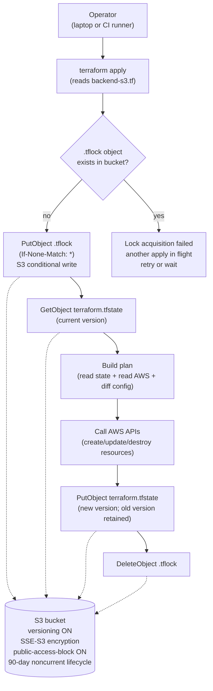

# 14.01 — Production-grade Terraform state

> Why local Terraform state is a one-laptop fiction and every team running
> EKS hits the wall the moment a second human or a CI runner shows up; the
> S3 backend with **`use_lockfile = true`** (native S3 locking, Terraform
> 1.10+, **no DynamoDB**); bucket bootstrap via `bootstrap-state.sh`; the
> four `terraform state` commands every operator needs; and the
> blast-radius rule that decides how many state files you actually want.

**Estimated time:** ~30 min read · ~60 min hands-on
**Prerequisites:** [Part 13 ch.01](../13-grand-capstone-bookstore-platform/01-bookstore-2-from-toy-to-platform.md) — Bookstore Platform Terraform tree you'll move to remote state · [Part 10 ch.01](../10-cloud-and-managed-kubernetes/01-managed-kubernetes-model.md) — why cloud K8s requires shared state from day one

**You'll know after this:** • understand why local Terraform state breaks the moment a second operator or CI runner appears · • configure an S3 backend with `use_lockfile = true` (Terraform 1.10+, no DynamoDB) · • bootstrap the state bucket with `bootstrap-state.sh` without a chicken-and-egg loop · • run the four `terraform state` commands (`list`, `show`, `mv`, `rm`) safely · • choose blast-radius boundaries that decide how many state files your tree actually wants

<!-- tags: terraform, cloud, day-2, finops, foundations -->

## Why this exists

The Bookstore Platform Terraform tree at
[`../examples/bookstore-platform/terraform/`](../examples/bookstore-platform/terraform/)
spent twelve previous chapters proving it can stand up a working EKS
cluster, Karpenter, the LB controller, and a Helm-chart's worth of
controllers. Every one of those `terraform apply` invocations wrote
state to `./terraform.tfstate` on a single laptop. That works exactly
once, on one machine, by one person, with no audit trail. The moment any
of the four conditions below is true, local state becomes the production
incident waiting to happen.

1. **Laptop loss.** The state file is the only canonical record of which
   AWS resources Terraform manages. If the laptop is lost, stolen, wiped,
   or the disk fails, every resource the state described is now
   **unmanaged**: Terraform on a fresh machine sees an empty state, plans
   to create everything from scratch, and either collides with the
   existing AWS resources (EKS cluster name already taken, IAM role
   already exists) or silently builds a parallel duplicate. Recovery is
   a manual `terraform import` per resource — for the bookstore-platform
   tree that's 100+ imports, each one a careful read of AWS console + a
   precisely-shaped `import` block.
2. **Two-laptop drift.** A second engineer joins. They `git clone` the
   tree, run `terraform plan`, and Terraform — with no state to read
   from — plans to create the cluster *again*. Or worse: they pull a
   stale state from a Slack DM and apply on top of someone else's
   half-applied change, racing two `apply`s into mutual-corruption land.
3. **CI runners.** The first CI job that runs `terraform apply` has the
   same problem the second laptop has, plus it's not even a human who
   can read the error message. Either CI mints a fresh state on every
   run (and corrupts whatever exists), or the team hand-rolls a state
   handoff (a shared S3 bucket, but without locking, two concurrent
   pipelines race the same file).
4. **Audit.** Six months later, an auditor asks "who changed the EKS
   cluster's KMS key on 2026-03-14?" The answer requires (a) the state
   file's history (versioned), (b) the AWS CloudTrail entry, (c) the
   IAM principal that ran the apply. Local state has none of (a) or (c).

Each of these failures has the same shape: **state is a singleton, and
local state has none of (durability, concurrency, history, access
control)**. The fix we recommend is an S3 backend with versioning +
native locking + encryption + IAM-scoped access — every dimension
addressed at the storage layer, transparent to `terraform plan`/`apply`/`destroy`.

> **In production:** State migration is a one-time, irreversible
> decision per Terraform root module. Doing it early — before the tree
> hits production — is a 30-minute task. Doing it after the tree owns
> dozens of resources is the same 30 minutes plus a multi-hour audit
> that no resource was created concurrently with the migration. Migrate
> on day one.

In this chapter we cover the discipline that turns the
bookstore-platform tree from "one laptop's Terraform" into "a team's
Terraform". The Bookstore
Platform itself was introduced in
[Part 13 ch.01](../13-grand-capstone-bookstore-platform/01-bookstore-2-from-toy-to-platform.md);
its single-region EKS substrate sits under
[`../examples/bookstore-platform/terraform/`](../examples/bookstore-platform/terraform/).
Phase 14-R added the `bootstrap-state.sh` + `backend-s3.tf.example`
artifacts; this chapter is the user-facing walkthrough.

## Mental model

**A Terraform state backend is the product of four dimensions —
durability, concurrency, history, access control — and "local"
delivers zero of them. The S3 backend with `use_lockfile = true`
delivers all four with one bucket, no DynamoDB, no companion services.**

The four dimensions and how the S3-with-lockfile backend addresses each:

- **Durability.** State must survive any single machine loss. S3 stores
  state across multiple AZs with 99.999999999% (11 nines) annual
  durability. A laptop disk has roughly one nine on a good year.
- **Concurrency.** Two `terraform apply` invocations against the same
  state simultaneously is undefined behavior — both reading the same
  pre-apply state, both writing back their own post-apply states, the
  second clobbering the first. Locking serializes them: the first apply
  takes the lock, the second waits (or fails fast with `-lock-timeout=0`).
  Terraform 1.10+ writes a `.tflock` object to the state bucket using
  S3's `If-None-Match` conditional-write semantics; if the object
  already exists, the second writer is rejected. When the apply
  completes the lock object is deleted.
- **History.** S3 versioning keeps every prior state file. A bad apply
  that corrupted state, a `terraform state rm` that removed the wrong
  resource, a typo that resource-graphed a destroy — all recoverable by
  pulling the prior version from S3 and `terraform state push`-ing it
  back. The bootstrap script's 90-day lifecycle on noncurrent versions
  caps storage cost at the price of one apply's worth of history
  retention.
- **Access control.** IAM policies on the S3 bucket scope who can read
  state (read = "can see every resource Terraform manages, including
  any secrets stored inline — the IAM access keys in
  `aws_iam_access_key.foo.secret`") and who can write (write = "can
  break production"). The bootstrap script's public-access-block kills
  the most common misconfiguration (an accidentally public state
  bucket leaking everything).

Terraform 1.10 (October 2024) made `use_lockfile = true` GA on the S3
backend, **deprecating the long-standing DynamoDB lock-table pattern**.
The legacy pattern needed a separate DynamoDB table (one more resource,
one more IAM policy, one more capacity-mode decision); the new pattern
needs only the S3 bucket itself. Teams that still have
`dynamodb_table = "tf-locks"` in their backend block are running
legacy infrastructure that costs $1-3/month and adds a second
failure-mode for no benefit. **Migrate.**

The trap to keep in view: **the state file is not just metadata about
your resources; it is the canonical authority on what exists**. If the
state says "the EKS cluster exists at this ARN", Terraform believes
that — even if AWS no longer agrees. If the state says "the EKS
cluster does not exist", Terraform will plan to create it again, even
if the real cluster is sitting there serving traffic. Treat state with
the same care as production database backups: versioned, encrypted,
access-controlled, recoverable.

## Diagrams

### Diagram A — terraform apply with S3 backend and native locking (Mermaid)



### Diagram B — backend choice matrix (ASCII)

```text
BACKEND               LOCKING                HISTORY        VENDOR LOCK-IN   COST           WHEN TO USE
────────────────────  ─────────────────────  ─────────────  ───────────────  ─────────────  ───────────────────────────
local                 none                   none           none             $0             single-laptop dev only
S3 + use_lockfile     native (S3 lockfile)   versioning     low (HCL std)    $0.01-0.05/mo  default for AWS teams
S3 + DynamoDB lock    DynamoDB (legacy)      versioning     low              $1-3/mo        legacy; migrate to use_lockfile
Terraform Cloud       built-in               built-in       high (HashiCorp) free-$70+/mo   small teams; UI matters
GitLab managed state  built-in (HTTP)        on GitLab      medium           bundled        already on GitLab CI
Spacelift             built-in               built-in       high             $$$$           large platform teams
────────────────────  ─────────────────────  ─────────────  ───────────────  ─────────────  ───────────────────────────
THE BOOKSTORE PLATFORM CHOICE: S3 + use_lockfile.
  Reasons: AWS-native (one less vendor relationship), free at our scale,
  HCL-standard backend block (no proprietary syntax), Terraform 1.10+
  native locking removes the last reason to add DynamoDB.
```

## Hands-on with the Bookstore Platform

### 0. Prerequisites

- AWS CLI v2 configured: `aws sts get-caller-identity` returns the
  account you expect to own the state bucket.
- Terraform `>= 1.10.0` (verifiable via `terraform version`). Versions
  earlier than 1.10 do not support `use_lockfile`.
- The bookstore-platform Terraform tree applied or partially-applied
  to local state. If you've never run `terraform apply` against it,
  the migration step below is a no-op (Terraform just writes an empty
  state to S3 on the first init).

### 1. Read what already exists

Phase 14-R put two artifacts in the tree:

- [`../examples/bookstore-platform/terraform/bootstrap-state.sh`](../examples/bookstore-platform/terraform/bootstrap-state.sh)
  — idempotent script that creates the bucket with versioning + SSE-S3
  + public-access-block + 90-day lifecycle.
- [`../examples/bookstore-platform/terraform/backend-s3.tf.example`](../examples/bookstore-platform/terraform/backend-s3.tf.example)
  — the backend block to copy + edit.

Open both files and read them end-to-end before running anything.
Comments document the **why** of every setting; the script is
deliberately small so you can audit it before granting it your AWS
credentials.

### 2. Pick a globally-unique bucket name

S3 bucket names share a global namespace. Pick something distinctive:

```bash
# Replace <INITIALS> with your real initials or org slug.
export TFSTATE_BUCKET="tfstate-bookstore-<INITIALS>"
export TFSTATE_REGION="ap-south-1"
```

If your initials are already taken, append a digit. Keep the name
under 63 chars (S3 limit).

### 3. Run the bootstrap script

From the repo root:

```bash
cd examples/bookstore-platform/terraform
./bootstrap-state.sh "$TFSTATE_BUCKET" "$TFSTATE_REGION"
```

Expected output (truncated):

```text
Bootstrap S3 state backend
  bucket: tfstate-bookstore-<INITIALS>
  region: ap-south-1

[..] Creating bucket: tfstate-bookstore-<INITIALS>
[ok] Bucket created
[..] Enabling versioning
[ok] Versioning enabled
[..] Enabling default encryption (SSE-S3)
[ok] SSE-S3 enabled
[..] Blocking public access
[ok] Public access blocked
[..] Setting lifecycle rule (expire noncurrent versions @ 90 days)
[ok] Lifecycle rule set
```

The script is idempotent — re-running it on an existing bucket
verifies (and re-applies) the same settings. Use this when you're
unsure whether someone hand-edited the bucket in the console.

### 4. Copy and edit the backend block

```bash
cp backend-s3.tf.example backend-s3.tf
```

Edit `backend-s3.tf` and set:

```hcl
backend "s3" {
  bucket       = "tfstate-bookstore-<INITIALS>"  # YOUR bucket
  key          = "bookstore-platform/terraform.tfstate"
  region       = "ap-south-1"                    # YOUR region
  encrypt      = true
  use_lockfile = true
}
```

The single most important line is `use_lockfile = true`. Without it,
two concurrent applies race; with it, S3's conditional-write atomicity
serializes them.

### 5. Migrate local state to S3

```bash
terraform init -migrate-state
```

Terraform detects the local `terraform.tfstate`, sees the new S3
backend, and prompts:

```text
Do you want to copy existing state to the new backend?
  Pre-existing state was found while migrating the previous "local"
  backend to the newly configured "s3" backend. No existing state was
  found in the newly configured "s3" backend. Do you want to copy this
  state to the new "s3" backend?

  Enter "yes" to copy and "no" to start with an empty state.
```

Answer `yes`. Terraform uploads the local state to S3, switches the
backend, and confirms:

```text
Successfully configured the backend "s3"! Terraform will automatically
use this backend unless the backend configuration changes.
```

### 6. Verify the lock object lifecycle

Run a no-op apply to watch locking in action:

```bash
terraform apply -auto-approve
```

In a second terminal, while the apply is mid-flight:

```bash
aws s3 ls "s3://${TFSTATE_BUCKET}/bookstore-platform/" --recursive
```

You'll see one of two states:

```text
# Mid-apply (lock held):
2026-05-21 14:23:01      234 bookstore-platform/terraform.tfstate
2026-05-21 14:23:01       42 bookstore-platform/terraform.tfstate.tflock

# Post-apply (lock released):
2026-05-21 14:23:15      298 bookstore-platform/terraform.tfstate
```

The `.tflock` object appears just before plan, disappears immediately
after apply. If apply crashes mid-flight, the lock object stays — see
the troubleshooting section.

### 7. Verify state history works

```bash
aws s3api list-object-versions \
  --bucket "$TFSTATE_BUCKET" \
  --prefix "bookstore-platform/terraform.tfstate" \
  --query 'Versions[*].[VersionId,LastModified,Size]' \
  --output table
```

You should see two or three versions: one from the initial migrate,
one from the no-op apply, possibly one from a prior partial apply.
This is your insurance. If a future apply mangles state, restore the
prior version with `terraform state pull > backup.tfstate`, edit the
object's version, and `terraform state push backup.tfstate` — or, in
the disaster scenario, use `aws s3api copy-object` to restore an
older version as the current one.

### 8. Clean up local state

Once the S3 backend works:

```bash
rm terraform.tfstate terraform.tfstate.backup
```

This is the point of no return. Local state files are now strictly
out-of-date — every plan/apply hits S3.

### 9. Troubleshoot — lock stuck after a crash

If `terraform apply` was killed (SIGKILL, lost SSH, network drop)
while holding the lock, the `.tflock` object remains. Subsequent
applies fail with:

```text
Error: Error acquiring the state lock
  Lock Info:
    ID:        <UUID>
    Path:      tfstate-bookstore-XX/bookstore-platform/terraform.tfstate
    Operation: OperationTypeApply
    Created:   2026-05-21 14:23:01.123 +0000 UTC
```

Verify nobody else is actively applying (Slack-ask the team), then
force-unlock:

```bash
terraform force-unlock <UUID>
```

The UUID is in the error message. Force-unlock removes the `.tflock`
object. **Do this only after confirming no apply is in flight** —
force-unlocking a live apply is the path to state corruption.

## How it works under the hood

**The `use_lockfile = true` mechanism.** Terraform 1.10's S3 backend
writes a small JSON `.tflock` object to the state bucket using S3's
`PutObject` API with an `If-None-Match: *` header. S3 honors that
header as a conditional write: the put succeeds only if no object
exists at that key, otherwise S3 returns `412 Precondition Failed`.
The first apply wins the race; the second sees the `412` and either
retries (default) or fails fast (`-lock-timeout=0`). When the apply
completes, Terraform issues `DeleteObject` on the lock key. This is
the same primitive S3 uses for object versioning — Terraform just
borrows the conditional-write semantics.

**Why DynamoDB used to be needed.** Before 2024-08, S3 didn't expose
conditional writes via `If-None-Match` for backends. The workaround
was a DynamoDB table with a single primary-key item per state file:
take the lock by `PutItem` with `ConditionExpression: attribute_not_exists(LockID)`;
release by `DeleteItem`. DynamoDB exposed the same atomicity that S3
now does natively. Migration is a backend-config edit (remove
`dynamodb_table`, add `use_lockfile = true`) plus a `terraform init`
to register the change.

**Versioning vs lifecycle.** S3 versioning keeps every PUT as a new
version; the latest is "current", prior ones are "noncurrent". Without
a lifecycle rule, noncurrent versions accumulate forever — at $0.023/GB-month
for a state file growing 5-10 KB per apply, this is negligible, but
on a busy team with hundreds of applies/week, it adds up over years.
The bootstrap script's 90-day noncurrent expiration is a balance:
90 days of state history is enough to recover from any humanly-
detectable mistake; older history is rarely actionable (the resources
the state described are usually long-gone).

**The four `terraform state` commands every operator must know.**

| Command | Purpose | When you reach for it |
|---|---|---|
| `terraform state list` | List every resource Terraform manages | First thing in any state forensic investigation |
| `terraform state mv` | Rename a resource address without recreating it | After a refactor that renamed a module path |
| `terraform state rm` | Remove a resource from state without destroying it | When a resource is now managed by a different Terraform tree (or by hand) |
| `terraform import` | Pull an existing AWS resource into state | When something exists in AWS but Terraform doesn't know about it |
| `terraform state replace-provider <SOURCE-ADDRESS> <TARGET-ADDRESS>` | Re-source a provider in state when migrating from a legacy provider address | When moving from `registry.terraform.io/hashicorp/aws` to a community fork, or after a provider namespace change |

These four are the difference between "Terraform fights you" and
"Terraform serves you". Memorize the syntax; rehearse them on a
throwaway resource before you need them in anger.

**Workspaces vs Terragrunt vs separate root modules.** Three patterns
exist for splitting state; the right answer depends on what you're
splitting:

- **Terraform workspaces** (`terraform workspace new staging`) — One
  root module, N state files. **Usually wrong for environment
  separation** — the same code with a different state means a
  staging-only variable still has to gate every `count`/`for_each`,
  and the wrong workspace selected at apply-time is a production
  outage waiting to happen. **Right** for things like "one cluster,
  multiple ephemeral PR-review environments inside it".
- **Terragrunt** — Wrapper around Terraform that DRYs up backend
  config, provider config, and shared variables across many similar
  root modules. **Right** when you have 5+ structurally-identical
  trees (one per environment, one per region) and the duplication
  of `backend "s3" { ... }` everywhere is real pain. **Wrong** for
  a single root module (it adds a tool to learn for zero gain).
- **Separate root modules** — One directory per blast-radius unit;
  each has its own state. **Right** for most production teams: the
  bookstore-platform tree is one root module (one state); the
  separate `terraform-account-baseline/` tree is another root
  module (a separate state); a future per-tenant Crossplane stack
  could be a third. **Wrong** when you find yourself duplicating
  ten root modules with one variable difference — that's Terragrunt
  territory.

The Bookstore Platform tree uses **one root module per blast-radius
unit**. The main tree at
[`../examples/bookstore-platform/terraform/`](../examples/bookstore-platform/terraform/)
is one state; the account baseline at
[`../examples/bookstore-platform/terraform-account-baseline/`](../examples/bookstore-platform/terraform-account-baseline/)
is another. The two never share state because a destroy of one must
never be able to take down the other.

## Production notes

> **In production:** Never edit state by hand. A `terraform state pull`
> + `jq` + `terraform state push` workflow exists, and there are
> emergencies where it's the only path — but every such edit must be
> documented in an incident ticket, reviewed by a second engineer
> before the push, and verified by a follow-up `terraform plan` that
> shows zero diff. State edits are the equivalent of `UPDATE` against
> the production database without a `WHERE` clause: powerful, fast,
> dangerous.

> **In production:** The `terraform import` for an out-of-band-created
> resource is a routine operation, not an emergency. Someone clicked
> through the AWS console to create a security group; six months later
> you want Terraform to manage it. Write the `resource` block matching
> the existing configuration, run `terraform import <ADDRESS> <ID>`,
> then run `terraform plan` and reconcile any drift the plan surfaces.
> Repeat until plan is zero-diff. The 1.5+ `import` *block* (as
> opposed to the CLI command) lets you commit imports as code, which
> is the production-clean way.

> **In production:** The "someone deleted the state file OBJECT (not
> the bucket)" scenario is recoverable via S3 versioning. The runbook:
> run `aws s3api list-object-versions --bucket "$TFSTATE_BUCKET"
> --prefix "bookstore-platform/terraform.tfstate"` to find the most
> recent prior version, then `aws s3api copy-object --copy-source
> "$TFSTATE_BUCKET/bookstore-platform/terraform.tfstate?versionId=<ID>"
> --bucket "$TFSTATE_BUCKET" --key "bookstore-platform/terraform.tfstate"`
> to promote it back to the current version. Run `terraform init`
> against the restored backend, then `terraform plan` to verify zero
> diff.
>
> **Bucket deletion is a different category of disaster.** S3
> versioning only helps if the bucket still exists — deleting the
> bucket destroys all versions with it. Recovery then requires a
> manual backup: periodically run `terraform state pull >
> backup.tfstate` and store it somewhere safe (a separate S3 bucket,
> a secrets manager, an encrypted offline copy). AWS Backup covering
> the state bucket is the managed alternative. The durable defense is
> to enable **S3 Object Lock** (WORM — write-once-read-many) or
> **MFA-delete** on the state bucket so accidental or malicious bucket
> deletion requires explicit human consent that leaves an audit trail.
> Document this runbook in your team wiki *before* you need it.

> **In production:** KMS-encrypted state (SSE-KMS with a customer-
> managed CMK) is the upgrade from SSE-S3 (AWS-managed key) when state
> contains literal secrets — provider credentials inline (don't, but
> some patterns force this), RDS master passwords stored as Terraform
> outputs (don't, use secrets manager), API tokens in `tfvars` files.
> The `backend "s3"` block accepts `kms_key_id = "arn:..."`. Cost: KMS
> charges per-request (\$0.03 per 10k requests) plus \$1/month per CMK.
> For typical Terraform usage (tens of applies/day), KMS adds pennies
> to the monthly bill.

> **In production:** Your state file is your blast radius. One root
> module that manages 500 resources is one apply that can destroy 500
> resources. Split state by blast-radius unit: cluster-substrate
> (VPC + EKS + node groups) in one state; platform addons (Argo CD,
> Crossplane) in another; per-tenant infrastructure in a third. The
> bookstore-platform tree is on the conservative end (one state for
> the whole substrate), which is fine at its scale; a real platform
> team running 20+ clusters would split further.

> **In production:** State files over 100 MB are a symptom, not a
> problem. The symptom: a root module that manages thousands of
> resources, all interconnected. The problem: every `plan` reads the
> whole state, refreshes every resource against AWS, and takes
> minutes. The fix: split the root module along natural blast-radius
> boundaries — the same answer as "your file is too big". 10 MB is
> comfortable; 100 MB is a re-architect signal.

## Quick Reference

```bash
# Bootstrap the state bucket (once per bucket per region).
./bootstrap-state.sh tfstate-bookstore-<INITIALS> ap-south-1

# Copy + edit the backend file.
cp backend-s3.tf.example backend-s3.tf
# (edit bucket + region to match)

# Migrate local state to S3 (one-time).
terraform init -migrate-state

# After migration: remove local state files.
rm terraform.tfstate terraform.tfstate.backup

# Verify state lives in S3.
aws s3 ls "s3://tfstate-bookstore-<INITIALS>/bookstore-platform/"

# Force-unlock if a crashed apply left a stuck lock.
terraform force-unlock <UUID>

# State commands every operator must know.
terraform state list
terraform state mv <SRC-ADDRESS> <DST-ADDRESS>
terraform state rm <ADDRESS>
terraform import <ADDRESS> <RESOURCE-ID>
terraform state replace-provider <SOURCE-PROVIDER-ADDRESS> <TARGET-PROVIDER-ADDRESS>
```

Minimal `backend-s3.tf` skeleton:

```hcl
terraform {
  backend "s3" {
    bucket       = "<UNIQUE-BUCKET-NAME>"
    key          = "<PROJECT>/terraform.tfstate"
    region       = "<REGION>"
    encrypt      = true
    use_lockfile = true
  }
}
```

State-backend checklist (the migration is done when all six are yes):

- [ ] Bucket versioning is ON (`aws s3api get-bucket-versioning`).
- [ ] Bucket encryption is ON (SSE-S3 or SSE-KMS; check
      `get-bucket-encryption`).
- [ ] Public-access-block is ON on all four dimensions
      (`get-public-access-block`).
- [ ] Lifecycle expires noncurrent versions
      (`get-bucket-lifecycle-configuration`); 90 days is the default.
- [ ] `use_lockfile = true` is in the backend block; **NO**
      `dynamodb_table = "..."` line.
- [ ] State file is under ~10 MB (`aws s3 ls --summarize`); anything
      over 100 MB is a re-architect signal.

## Test your understanding

> Try each before opening the answer drawer. The act of trying is the exercise; the answer is the check.

1. **Why does the chapter say `use_lockfile = true` replaces the DynamoDB lock table, and what changed in S3 that made this possible?**
   <details><summary>Show answer</summary>

   S3 added strong read-after-write consistency plus conditional writes (If-None-Match), which lets the backend create a `<key>.tflock` object atomically and refuse to overwrite it while another apply holds it. Terraform 1.10+ implements its lock protocol against that primitive, so the DynamoDB table — which used to provide the locking — is no longer needed.

   </details>

2. **A teammate runs `terraform apply`, their laptop crashes mid-apply, and now every subsequent `terraform plan` errors with `Error acquiring the state lock`. What do you actually do?**
   <details><summary>Show answer</summary>

   Confirm nothing is genuinely running (no GitHub Actions apply job in flight, the teammate's laptop is not somehow still running), then run `terraform force-unlock <UUID>` with the UUID printed in the error. The `.tflock` object in S3 is just stale metadata after a crashed apply; force-unlock deletes it. Running force-unlock while an apply is genuinely in flight is the dangerous case — it lets a second apply race the first.

   </details>

3. **You inherit a Terraform tree whose state file is 180 MB and `terraform plan` takes 12 minutes. What's the chapter's signal here and what's the fix shape?**
   <details><summary>Show answer</summary>

   The 100 MB threshold is the chapter's re-architect signal — a state file that large means too many resources share one blast radius. The fix is splitting along natural boundaries (networking / EKS cluster / addons / data plane) into separate root modules with their own state, using `terraform state mv` to migrate resources without re-creating them.

   </details>

4. **Hands-on extension — point the bookstore-platform tree at a brand-new S3 bucket without running `bootstrap-state.sh` first; run `terraform init`.**
   <details><summary>What you should see</summary>

   `terraform init` errors with an S3 `NoSuchBucket` / `AccessDenied` because the backend can't write the state object to a bucket that doesn't yet exist. That's the chicken-and-egg this chapter resolves: the bootstrap script creates the bucket (with versioning + encryption + public-access-block + lifecycle) using local state, and only then does `init -migrate-state` move the tree's real state in. Skipping bootstrap is how teams accidentally lose state files.

   </details>

## Further reading

- **Terraform official S3 backend docs**
  <https://developer.hashicorp.com/terraform/language/backend/s3>; the
  authoritative reference for every backend setting this chapter
  touches, including `use_lockfile` semantics.
- **Terraform 1.10 upgrade guide**
  <https://developer.hashicorp.com/terraform/language/v1.10.x/upgrade-guides>;
  the official upgrade guide covering the `use_lockfile` addition and
  the deprecation of DynamoDB lock tables.
- **AWS S3 conditional writes documentation**
  <https://docs.aws.amazon.com/AmazonS3/latest/userguide/conditional-writes.html>;
  the `If-None-Match` semantics `use_lockfile` relies on.
- **Rosso et al., *Production Kubernetes* ch.6 — Infrastructure**;
  the discipline of treating infrastructure-as-code state as a
  first-class operational concern.
- **Ibryam & Huß, *Kubernetes Patterns* 2e — *Declarative Deployment***;
  the broader IaC discipline this chapter applies at the storage layer.
- **AWS Well-Architected Framework — Operational Excellence pillar**
  <https://docs.aws.amazon.com/wellarchitected/latest/operational-excellence-pillar/welcome.html>;
  the design principles this chapter's "state as canonical source of
  truth" reflects.
