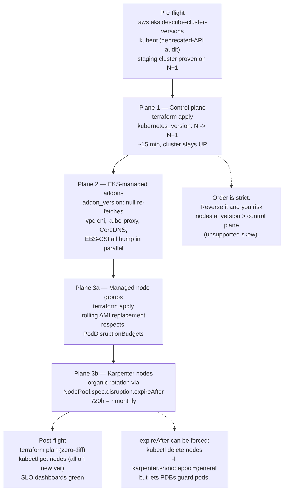

# 14.02 — EKS cluster lifecycle

> The 14-month standard-support window, the 12-month extended-support
> window with its **$0.50/cluster-hour** (~$365/month surcharge), and the
> three-plane upgrade dance (control plane → managed addons → node
> pools) every team running EKS must rehearse before a version deadline
> bites; the in-place version bump runbook against the Bookstore
> Platform tree; deprecated-API hunting with `kubent`; blue-green
> clusters for the multi-version-skip case.

**Estimated time:** ~30 min read · ~90 min hands-on
**Prerequisites:** [Part 14 ch.01](./01-terraform-state-in-production.md) — remote state required before a version bump · [Part 13 ch.02](../08-day-2-operations/01-cluster-lifecycle.md) — kind cluster upgrade dance you'll now adapt for EKS · [Part 10 ch.02](../10-cloud-and-managed-kubernetes/02-provisioning-and-iac.md) — the bookstore EKS module you'll upgrade

**You'll know after this:** • understand the 14-month standard vs 12-month extended-support windows and the $0.50/cluster-hour surcharge · • execute the three-plane upgrade dance (control plane → managed addons → node pools) in the correct order · • run `kubent` to hunt deprecated APIs before the upgrade · • choose between in-place version bumps and blue-green clusters for multi-version skips · • rehearse the EKS upgrade against the Bookstore Platform tree before a version deadline

<!-- tags: eks, terraform, cloud, day-2, platform-engineering -->

## Why this exists

The bookstore-platform tree at
[`../examples/bookstore-platform/terraform/`](../examples/bookstore-platform/terraform/)
declares `kubernetes_version = "1.35"` in `variables.tf`. That number
isn't a fixed label — it's a deadline. AWS marks each Kubernetes minor
version with two date stamps:

1. **End of standard support** — when AWS stops releasing free patches.
   For 1.35, this is **2027-03-27** (14 months from GA on 2026-01-27).
   Up to this date, the EKS control-plane fee is $0.10/cluster-hour
   (~$73/month) — the same rate as every other supported version.
2. **End of extended support** — 12 months after standard ends. For
   1.35, this is **2028-03-27**. During extended support, AWS charges
   an **additional $0.50/cluster-hour** on top of the base rate —
   ~$365/month surcharge per cluster (730h × $0.50), on top of the
   normal ~$73. A team running 10 clusters on an end-of-extended
   version pays an extra ~$3,650/month for the privilege.

Past the end of extended support, AWS **auto-upgrades the cluster**
without your consent. The auto-upgrade can happen during any
maintenance window AWS picks; for a team that hasn't tested 1.35→1.36
in staging, this is the production incident. Every team running EKS
hits this deadline — at minimum once every 14 months, every cluster.

The version bump itself isn't dangerous. The shape of it is:

- **Control plane upgrade** — Terraform changes one variable; AWS does
  the work; cluster stays UP throughout (the API server rolls one
  replica at a time behind a load balancer).
- **Addons upgrade** — Each EKS-managed addon (vpc-cni, kube-proxy,
  CoreDNS, EBS-CSI) re-fetches a version compatible with the new K8s
  minor; Terraform's `addon_version = null` makes this automatic.
- **Node pool upgrade** — Managed node groups roll new EC2 instances
  with the AMI for the new K8s version; Karpenter-provisioned nodes
  auto-rotate via the NodePool's `expireAfter` setting.

What makes this a chapter rather than a bullet point: the **order
matters**, the **version-skew tolerance** matters, the **deprecated-API
hunt** matters, and the **what-if-we-skipped-a-version** decision
matters. This chapter is the runbook against the bookstore-platform
tree.

[Part 08 ch.01](../08-day-2-operations/01-cluster-lifecycle.md)
introduced cluster lifecycle for the self-managed case (kubeadm-style
upgrades); [Part 10 ch.01](../10-cloud-and-managed-kubernetes/01-managed-kubernetes-model.md)
drew the managed-vs-self-managed line. This chapter is the EKS-specific
production-grade upgrade story those two pointed at.

> **In production:** A staging EKS cluster running one version ahead of
> production is the cheapest insurance you can buy. At $73/month for
> the control plane plus minimal node-hours, a staging cluster running
> 1.36 while production runs 1.35 catches the deprecated-API breakage,
> the addon-version surprises, and the upgrade-order mistakes — all
> before the prod deadline forces your hand. A team that skips staging
> learns the lessons in production.

## Mental model

**Three planes to upgrade in strict order — control plane, then EKS-
managed addons, then nodes — with the Kubernetes version-skew policy
governing what's tolerated mid-flight. Skip a step or reverse the
order and the cluster either fails the upgrade or runs in an
unsupported skew configuration.**

The three planes:

- **Plane 1 — the EKS control plane.** kube-apiserver, kube-scheduler,
  kube-controller-manager, etcd. Operated by AWS, but the *version*
  is your decision (set via `kubernetes_version` in the EKS module).
  Upgrade first because nodes can run versions older than the control
  plane (per the Kubernetes version-skew policy), but **never newer**.
- **Plane 2 — EKS-managed addons.** vpc-cni, kube-proxy, CoreDNS,
  EBS-CSI. Each addon has its own compatibility window with K8s
  minor versions; an addon version that worked on 1.35 may not exist
  for 1.36. Terraform's `addon_version = null` makes EKS pick the
  default for the current K8s minor; this is almost always right.
- **Plane 3 — nodes.** Managed node groups (the small "system" pool
  in [`../examples/bookstore-platform/terraform/eks.tf`](../examples/bookstore-platform/terraform/eks.tf)
  with its `t3.medium` instances) plus Karpenter-provisioned nodes
  (from
  [`../examples/bookstore-platform/terraform/karpenter-pools.tf`](../examples/bookstore-platform/terraform/karpenter-pools.tf)).
  Managed node groups update their AMI when Terraform re-applies after
  the control plane bump; Karpenter nodes auto-rotate as each node's
  `expireAfter` window (720h ≈ 30 days by default) elapses.

The upgrade order is non-negotiable:

```text
1. control plane  →  2. addons  →  3. managed nodes  →  4. Karpenter nodes
   (terraform           (terraform        (terraform           (organic,
    plan/apply           apply re-          apply triggers      via expireAfter,
    bumps version)       fetches            rolling AMI         OR forced via
                         compatible         bump)               kubectl delete)
                         addon ver)
```

Reverse this and the symptoms vary. Bump nodes first and the new
kubelet may emit calls the old apiserver doesn't understand (the API
that was added in N+1 isn't yet served by N). Bump addons first and
some addon versions require a control-plane API that doesn't exist
yet (e.g., a CRD version). The order minimizes the time anything is
in an unsupported skew.

**Kubernetes version-skew policy** (upstream, as of K8s 1.28+):
kubelet can be up to **3 minor versions older** than kube-apiserver
(N-3). kube-controller-manager and kube-scheduler must not be newer
than kube-apiserver and may be up to 1 minor older. kubectl stays
within ±1 of kube-apiserver. The table below reflects this current
policy; EKS enforces it at node-group update time.

**Standard support vs extended support** — the cost math (730 hours/month):

| Phase | Duration | Cluster fee | Surcharge | Total |
|---|---|---|---|---|
| Standard support | 14 months from GA | $0.10/hr × 730h | $0 | ~$73/month |
| Extended support | 12 months after standard ends | $0.10/hr × 730h | $0.50/hr × 730h | ~$438/month |
| End of extended | — | AWS auto-upgrades | — | — |

For a single dev cluster, an extra ~$365/month surcharge is annoying.
For a fleet of 50 clusters running an end-of-extended version for 6
months, it's over $109,500 — real budget money the FinOps team will
want explained.

**Blue-green clusters for major skips.** Kubernetes only supports
N → N+1 upgrades. If your cluster is on 1.31 and the current standard
support is 1.35, you cannot upgrade in place — you must walk through
1.31 → 1.32 → 1.33 → 1.34 → 1.35, four separate apply cycles. The
alternative: stand up a fresh 1.35 cluster (blue-green), migrate
workloads via Argo CD's multi-cluster ApplicationSet
([Part 11 ch.06](../11-advanced-production-patterns/06-multi-cluster-and-fleet.md)),
flip DNS, retire the old cluster. Blue-green dodges the version-skip
restriction at the cost of running two clusters during the migration.

The trap to keep in view: **the deprecated-API removal trap**. Each
Kubernetes minor removes APIs that were deprecated several minors
earlier. 1.32 removed `flowcontrol.apiserver.k8s.io/v1beta3`; 1.33
removed `resource.k8s.io/v1alpha2`; the list grows every release.
If a CRD, a Deployment, or a Helm chart in your cluster still
references a removed API, the upgrade succeeds on the control plane
but every subsequent `kubectl apply` of that object fails. `kubent`
(kube-no-trouble) is the tool that catches this BEFORE the bump.

## Diagrams

### Diagram A — the three-plane upgrade order (Mermaid)



### Diagram B — version-skew tolerance matrix (ASCII)

```text
COMPONENT           SKEW VS APISERVER         WHO ENFORCES        EXAMPLE (apiserver=1.36)
──────────────────  ────────────────────────  ──────────────────  ───────────────────────────────
kube-apiserver      n/a (the reference)       —                   1.36 itself
kube-controller-mgr same minor as apiserver   EKS (managed)       1.36
kube-scheduler      same minor as apiserver   EKS (managed)       1.36
kubelet (nodes)     up to 3 minors BEHIND     kubelet/EKS         1.33-1.36 OK, 1.32 unsupported
kube-proxy          same minor as kubelet     EKS addon mgr       matches the node's kubelet
kubectl (client)    +/- 1 minor               you                 1.35-1.37
CRDs (your code)    use deprecated-API audit  you (kubent)        no objects on removed APIs
──────────────────  ────────────────────────  ──────────────────  ───────────────────────────────
EKS practical:
  - Control plane upgrade can run for ~14 days before nodes MUST follow.
  - Beyond 3 minors behind, kubelet refuses to register; new nodes won't
    join until you bump the AMI.
  - The "auto-upgrade at end of extended support" is AWS's safety net,
    not yours. Plan for explicit upgrades.
```

## Hands-on with the Bookstore Platform

### 0. Prerequisites

- The bookstore-platform tree applied; cluster reachable via `kubectl`.
- State backend on S3 (per
  [ch.01](01-terraform-state-in-production.md)) — the upgrade writes
  to state, and a single-laptop apply is the wrong place for that.
- `kubectl` within ±1 minor of the current cluster version.
- `kubent` installed (`brew install doitintl/k8s-tools/kubent` on
  macOS, or download a binary from
  <https://github.com/doitintl/kube-no-trouble/releases>).

The scenario below walks through bumping the bookstore-platform tree
from K8s 1.35 to 1.36 (assuming 1.36 has entered standard support).

### 1. Read the AWS-side support calendar

```bash
aws eks describe-cluster-versions \
  --query "clusterVersions[].{ver:clusterVersion,status:status,standardEnd:endOfStandardSupportDate,extendedEnd:endOfExtendedSupportDate}" \
  --output table
```

Sample output (numbers will differ when you run it):

```text
-----------------------------------------------------------------------
|                       DescribeClusterVersions                       |
+-------+----------+------------------------+-------------------------+
|  ver  |  status  |     standardEnd        |       extendedEnd       |
+-------+----------+------------------------+-------------------------+
| 1.36  | standard | 2027-09-27             | 2028-09-27              |
| 1.35  | standard | 2027-03-27             | 2028-03-27              |
| 1.34  | standard | 2026-12-27             | 2027-12-27              |
| 1.33  | extended | 2026-09-27             | 2027-09-27              |
| 1.32  | extended | 2026-06-27             | 2027-06-27              |
| 1.31  | extended | 2026-03-27             | 2027-03-27              |
+-------+----------+------------------------+-------------------------+
```

Confirm:

- Target version (1.36) is `standard` (not yet in extended support).
- Source version (1.35) has at least 60 days of standard support
  remaining (so you have time to roll back if needed).

### 2. Check current cluster + upgrade history

```bash
CLUSTER="$(terraform output -raw cluster_name)"
REGION="$(terraform output -raw region)"

aws eks describe-cluster \
  --name "$CLUSTER" \
  --region "$REGION" \
  --query 'cluster.{version:version,status:status,platformVer:platformVersion}'

aws eks list-updates \
  --name "$CLUSTER" \
  --region "$REGION" \
  --query 'updateIds[*]'

# For each updateId, drill in:
aws eks describe-update --name "$CLUSTER" --region "$REGION" --update-id <ID>
```

Confirm:

- Status is `ACTIVE` (no in-flight update).
- No previous failed `VersionUpdate` lurking.

### 3. Hunt for deprecated APIs with `kubent`

```bash
kubent --cluster --target-version 1.36
```

`kubent` walks every resource in the cluster, every Helm release's
manifests, and any local YAML you point it at, and flags anything
using an API removed in the target version. Output:

```text
__________________________________________________________________________________________
>>> Deprecated APIs removed in 1.36 <<<
------------------------------------------------------------------------------------------
KIND              NAMESPACE     NAME                       API_VERSION                REPLACE_WITH
------------------------------------------------------------------------------------------
(none found)
__________________________________________________________________________________________
```

If `kubent` finds anything, fix it (replace the manifest, bump the
Helm chart) **before** Step 4. A cluster upgraded with deprecated APIs
in flight upgrades fine — but the next `kubectl apply` of any object
on a removed API fails, often in an unrelated CI job hours later.

### 4. Edit the version variable

```bash
cd examples/bookstore-platform/terraform
```

Open `variables.tf` and bump:

```hcl
variable "kubernetes_version" {
  description = "EKS Kubernetes minor version. ..."
  type        = string
  default     = "1.36"  # bumped from "1.35"
}
```

Commit the change (one-line diff) and push for review. Treat the
version bump as the code change it is — a PR, a reviewer, a CI
plan check.

### 5. Plan + review

```bash
terraform plan -out=upgrade-1.36.tfplan
```

The plan should show:

```text
Terraform will perform the following actions:

  # module.eks.aws_eks_cluster.this[0] will be updated in-place
  ~ resource "aws_eks_cluster" "this" {
        id      = "bookstore-platform"
      ~ version = "1.35" -> "1.36"
        # (many unchanged attributes)
    }

  # module.eks.aws_eks_addon.this["vpc-cni"] will be updated in-place
  ~ resource "aws_eks_addon" "this" {
      ~ addon_version = "v1.20.0-eksbuild.1" -> "v1.21.0-eksbuild.1"
        # ...
    }

  # ... similar for kube_proxy, coredns, aws_ebs_csi_driver
  # ... managed node group ami_id changes

Plan: 0 to add, 6 to change, 0 to destroy.
```

If the plan shows anything destroyed, **stop and investigate**. A
proper version bump is purely in-place changes (the EKS API supports
in-place version upgrades).

### 6. Apply — control plane first

```bash
terraform apply upgrade-1.36.tfplan
```

The control-plane upgrade takes 10-20 minutes. Throughout this
window:

- The cluster API endpoint stays UP. There's a 30-60 second window
  where one apiserver replica is being replaced; `kubectl` retries
  smooth over it.
- Pods keep running. Workloads don't notice the control plane
  rolling.
- Karpenter keeps provisioning. (Karpenter talks to the apiserver
  for NodeClaim CRDs; the apiserver-rolling window may pause it
  briefly, but it resumes.)

Monitor in another terminal:

```bash
watch -n 5 'aws eks describe-cluster \
  --name $CLUSTER --region $REGION \
  --query "cluster.{version:version,status:status,update:status}"'
```

Status moves `ACTIVE` → `UPDATING` → `ACTIVE`. Version updates to
`1.36` when complete.

### 7. Verify addons followed

```bash
kubectl get pods -n kube-system -o wide
aws eks list-addons --cluster-name "$CLUSTER" --region "$REGION"

for addon in vpc-cni kube-proxy coredns aws-ebs-csi-driver; do
  echo "=== $addon ==="
  aws eks describe-addon \
    --cluster-name "$CLUSTER" --region "$REGION" \
    --addon-name "$addon" \
    --query 'addon.{ver:addonVersion,status:status}'
done
```

Each addon should be `ACTIVE` with a version compatible with 1.36.
If `addon_version = null` in the Terraform (it is, by default in the
bookstore tree), EKS picks the default for 1.36 automatically.

### 8. Verify managed node group bumped

```bash
kubectl get nodes -o custom-columns=NAME:.metadata.name,VER:.status.nodeInfo.kubeletVersion,AGE:.metadata.creationTimestamp

aws eks describe-nodegroup \
  --cluster-name "$CLUSTER" --region "$REGION" \
  --nodegroup-name "system" \
  --query 'nodegroup.{status:status,ver:version,releaseVer:releaseVersion}'
```

The system pool's nodes should be running kubelet 1.36 with a fresh
AMI. The module rolled them one-by-one during apply.

### 9. Let Karpenter nodes drain organically (or force)

Karpenter-provisioned nodes still run on the 1.35 AMI immediately
after apply. They rotate as `expireAfter` elapses (720h = 30 days by
default). To force the rotation:

```bash
# Force-rotate ALL Karpenter nodes. Karpenter respects PDBs during drain.
kubectl delete nodes -l karpenter.sh/nodepool=general
kubectl delete nodes -l karpenter.sh/nodepool=spot
```

Or, less aggressive, drain one at a time:

```bash
NODE=$(kubectl get nodes -l karpenter.sh/nodepool=general -o name | head -1)
kubectl drain "$NODE" --ignore-daemonsets --delete-emptydir-data
kubectl delete "$NODE"
# Karpenter provisions a replacement on the new AMI; verify it joined.
```

### 10. Post-flight verification

```bash
# Zero-diff plan.
terraform plan -detailed-exitcode
# Exit code 0 = no drift, 1 = error, 2 = drift detected.

# All nodes on the new version.
kubectl get nodes -o custom-columns=NAME:.metadata.name,VER:.status.nodeInfo.kubeletVersion

# SLO dashboards green (whatever your team uses — Prometheus/Grafana
# from Part 13 ch.09).
```

Done. The cluster is now on 1.36. Repeat the runbook in ~9 months
for 1.37.

## How it works under the hood

**The EKS control-plane upgrade.** AWS runs the K8s control plane in
its own VPC (you only see the API endpoint). When you set
`kubernetes_version = "1.36"` in Terraform and apply, AWS receives
an `UpdateClusterVersion` API call. Internally, AWS rolls one
apiserver replica at a time behind the cluster's load balancer; the
controller-manager and scheduler upgrade alongside; etcd upgrades
last (with snapshots taken before each step). This is the same
discipline a self-managed kubeadm cluster needs
([Part 08 ch.01](../08-day-2-operations/01-cluster-lifecycle.md)),
just opaque — you don't watch the steps, you watch the status field.

**Why addons need bumping.** Each EKS-managed addon ships as a
versioned bundle (the addon catalog is region-scoped; `aws eks
describe-addon-versions --addon-name vpc-cni --kubernetes-version 1.36`
shows what's available). The addon's container image talks to the K8s
apiserver via the K8s API. APIs change between minors — fields move
from `v1beta1` to `v1`, RBAC subjects rename, new fields appear. An
addon built for 1.35 may not understand a 1.36 API or may use a
1.35-removed API. The `addon_version = null` pattern lets EKS pick
the version it has certified for the target minor.

**Managed node group AMI updates.** EKS bakes an EKS-optimized AMI
for each K8s minor (per architecture, per OS family — AL2023,
Bottlerocket, Windows). The AMI ID is keyed off the K8s minor. When
you bump `kubernetes_version`, the EKS module fetches the new AMI ID
and rolls the node group. The roll is one-at-a-time: cordon the old
node, drain it (respecting PodDisruptionBudgets), terminate the EC2
instance, ASG provisions a replacement with the new AMI, wait for
the new node `Ready`, repeat. For the bookstore-platform's two-node
system pool, the roll takes ~10 minutes.

**Karpenter's `expireAfter`.** The `NodePool` CR has a
`spec.disruption.expireAfter` field (default `720h` ≈ 30 days). When
a node reaches that age, Karpenter drains it and replaces it with a
new one — using the current AMI alias (e.g.,
`al2023@latest`), which auto-resolves to the latest AMI for the
cluster's current K8s minor. So a Karpenter-provisioned node born
under 1.35 will, when it expires, be replaced with an EC2 instance
running the 1.36 AMI — no manual intervention required.

**Blue-green cluster pattern.** For multi-version skips (1.31 →
1.35), the runbook is:

1. Stand up a fresh 1.35 cluster (a new Terraform tree, a new state,
   a new VPC ideally — though peering or shared VPC is OK if your
   discipline is high).
2. Replicate workloads via Argo CD ApplicationSet
   ([Part 11 ch.06](../11-advanced-production-patterns/06-multi-cluster-and-fleet.md))
   — same Application, two cluster targets.
3. Migrate stateful data — CNPG replica clusters, S3 cross-region
   replication, etc. ([Part 13 ch.03](../13-grand-capstone-bookstore-platform/03-multi-region-active-active.md)
   built the cross-region pattern; cross-cluster-same-region is the
   same shape).
4. Validate workloads on the new cluster (canary traffic, smoke
   tests).
5. Cut DNS or service-mesh traffic over to the new cluster.
6. Drain + delete the old cluster.

Blue-green dodges the N→N+1 restriction and de-risks the upgrade
(rollback = flip DNS back), at the cost of running two clusters
during the migration window — usually 1-2 weeks.

**Auto-upgrade at end of extended support.** AWS publishes the date,
emails the account owner ~90 days in advance, posts to the AWS Health
Dashboard, and eventually auto-upgrades the cluster. The auto-upgrade
respects the same N→N+1 rule (a cluster on 1.31 at EoL gets upgraded
to 1.32, not directly to whatever current is). You can't opt out;
you can only beat AWS to the punch with an explicit upgrade.

## Production notes

> **In production:** Bump cadence is quarterly. New K8s minors land
> roughly every 4 months; AWS ships its EKS variant ~2 months later;
> standard support is 14 months. A quarterly bump cadence keeps you
> on a version with 6+ months of standard support left and never
> drifts into extended-support fees. Faster (bumping the day a new
> version lands) invites untested-API-change bugs; slower invites
> the surcharge.

> **In production:** Always test in staging first. A staging EKS
> cluster running one version ahead of production catches the
> deprecated-API removal trap, the addon-version incompatibilities,
> and the workload-specific surprises (an Operator that depends on
> a removed API; a Helm chart that hard-codes a `v1beta1` reference).
> The staging cluster's control plane fee is $73/month — round-off
> error against the cost of a botched production upgrade.

> **In production:** AWS Budget alarms on the extended-support
> surcharge. Phase 14-R shipped `enable_budget_alarm = true` with a
> threshold that catches the ~$365/month surcharge surprise. Set the threshold
> to "current monthly spend × 1.2" so a single cluster slipping into
> extended support trips the alarm within hours of the deadline. The
> bookstore-platform tree's `cost-budgets.tf` is the reference; Part 14
> ch.06 ("Cost guardrails") covers the end-to-end FinOps discipline.

> **In production:** Skip-version upgrades don't exist. You walk
> through every intermediate minor or you go blue-green. The trap is
> the team that lets a cluster sit on 1.31 for two years, then tries
> to "just bump to 1.35" — they're committed to four separate apply
> cycles, each one a chance for a workload incompatibility. Stay
> current; the operational cost of frequent small bumps is far less
> than the cost of one giant catch-up.

> **In production:** `kubent` runs in CI, not just before upgrades.
> Add `kubent --target-version $((current+1))` to your nightly
> drift-detection job (covered in Phase 14b ch.07). The day someone
> commits a manifest that uses a soon-to-be-removed API, CI fails
> and you fix it months before the deadline.

> **In production:** PodDisruptionBudgets matter during node-pool
> rolls. A pool with no PDBs gets rolled fast and ungracefully; the
> module drains each node, which evicts pods, which (without a PDB)
> can take a service below quorum. The bookstore-platform's
> stateful workloads (CNPG primary, Strimzi Zookeeper) should have
> PDBs of `minAvailable: <quorum>` set in their Helm charts.

> **In production:** The "we forgot about it" failure mode is the
> single most common EKS upgrade incident. A team set up the cluster
> two years ago, the engineer who built it left, nobody knows what
> "extended support" means, and one morning AWS auto-upgrades the
> cluster from 1.30 → 1.31 (one version, at the end-of-extended-
> support event) and breaks the CNI's compatibility. AWS auto-upgrades
> one version per extended-support-end event; it does not chain
> multiple versions unattended in a single event. The defense: a
> recurring calendar event titled "EKS upgrade due" set 60 days before
> the standard-support end date of each cluster's version. The
> bookstore-platform README's §3 Version Policy is the template.

## Quick Reference

```bash
# Check AWS-side support calendar.
aws eks describe-cluster-versions \
  --query "clusterVersions[].{ver:clusterVersion,status:status,standardEnd:endOfStandardSupportDate}" \
  --output table

# Check current cluster.
aws eks describe-cluster --name "$CLUSTER" --region "$REGION" \
  --query 'cluster.{version:version,status:status}'

# Deprecated-API hunt.
kubent --cluster --target-version 1.36

# The actual upgrade — edit variables.tf, then:
terraform plan -out=upgrade.tfplan
terraform apply upgrade.tfplan

# Force-rotate Karpenter nodes (respects PDBs).
kubectl delete nodes -l karpenter.sh/nodepool=general

# Post-flight verification.
terraform plan -detailed-exitcode  # exit 0 = no drift
kubectl get nodes -o custom-columns=NAME:.metadata.name,VER:.status.nodeInfo.kubeletVersion
```

Version-bump 6-step runbook:

1. Read `aws eks describe-cluster-versions`; confirm target is standard.
2. Run `kubent --target-version <N+1>`; resolve all findings.
3. Edit `variables.tf` → `kubernetes_version = "<N+1>"`.
4. `terraform plan` → verify in-place changes only.
5. `terraform apply` → wait ~15 min for control plane + addons + managed nodes.
6. Force-rotate Karpenter nodes (`kubectl delete nodes -l ...`) or let
   `expireAfter` do it organically.

Pre-upgrade checklist (the bump is safe when all five are yes):

- [ ] Aware of the extended-support fee math — your AWS budget covers
      it if you slip.
- [ ] Staging cluster on N+1 ran for 2+ weeks without incident.
- [ ] `kubent --target-version <N+1>` returns zero findings against
      the production cluster + the GitOps repo.
- [ ] AMI bump for the managed node group is planned and PDBs are in
      place for stateful workloads.
- [ ] Karpenter NodePool `expireAfter` is set; you've decided whether
      to force-rotate or let it happen organically.

## Test your understanding

> Try each before opening the answer drawer. The act of trying is the exercise; the answer is the check.

1. **Why is the three-plane upgrade order (control plane → addons → nodes) non-negotiable?**
   <details><summary>Show answer</summary>

   The Kubernetes version-skew policy allows kubelet to be **older** than apiserver (up to 3 minors behind) but **never newer**. Bumping nodes first would put kubelet ahead of the control plane and into an unsupported skew. Bumping addons first can fail because the addon's compatible version may need a control-plane API that doesn't exist yet on the older version. The order minimizes the window of unsupported skew.

   </details>

2. **You inherit a cluster on EKS 1.30 and the AWS console shows `Standard support ends in 3 weeks`. Finance says the budget alarm doubled this month — what's happening and what do you do?**
   <details><summary>Show answer</summary>

   The cluster has slipped into extended support, so AWS is billing the $0.50/cluster-hour surcharge (~$365/month per cluster) on top of the normal $0.10/hr. The fix is an explicit upgrade chain — 1.30 → 1.31 → 1.32 → … through every intermediate minor, or stand up a fresh blue-green cluster on the current standard version and migrate with Argo CD ApplicationSet, then retire the old one. Skipping minors is not supported; the discipline going forward is a quarterly bump cadence so you never slip into extended support again.

   </details>

3. **A team disables EKS-managed addons and pins specific versions in Terraform (`addon_version = "v1.20.0-eksbuild.1"`) to "avoid surprises." Six months later they upgrade the control plane to 1.36 and the cluster won't apply addon changes. Why?**
   <details><summary>Show answer</summary>

   Pinning `addon_version` defeats EKS's auto-pick-compatible-version logic. The pinned v1.20.0 was built for an older K8s minor and isn't certified for 1.36 — EKS rejects the addon update because its compatibility table doesn't include that pair. The chapter's `addon_version = null` pattern lets EKS pick the default version that's certified for the current K8s minor, which is almost always what you want; explicit pins are reserved for the cases where you genuinely need to test a specific version in staging.

   </details>

4. **What does `kubent --target-version 1.36` actually catch that `terraform plan` won't, and why is it the load-bearing pre-flight step?**
   <details><summary>Show answer</summary>

   `kubent` walks every resource in the cluster + every Helm release's manifests + any local YAML, and flags anything using an API removed in the target version. Terraform plan only sees what Terraform manages — Helm charts deployed by Argo CD, hand-applied CRDs, and Operator-installed resources are invisible to it. A cluster with deprecated APIs upgrades fine but the next `kubectl apply` of any object on a removed API fails — often hours later in an unrelated CI job, which makes the root cause hard to find.

   </details>

5. **Hands-on extension — in a staging cluster, set the managed node group's `force_update_version = false` and try a control-plane bump while a Pod with no PDB has `terminationGracePeriodSeconds: 3600`. Observe.**
   <details><summary>What you should see</summary>

   The control-plane bump succeeds. The node-group AMI rolling phase stalls at that node for up to 1 hour while the long grace period elapses — a single un-PDB'd pod with a long grace period can hold an entire node-group roll. PodDisruptionBudgets are what bound this; without them, your upgrade window grows unpredictably. The lesson: stateful workloads (CNPG primary, Kafka brokers) need PDBs of `minAvailable: <quorum>` set in their Helm charts before any upgrade runbook.

   </details>

## Further reading

- **AWS EKS — Kubernetes versions on EKS**
  <https://docs.aws.amazon.com/eks/latest/userguide/kubernetes-versions.html>;
  the authoritative source for the standard/extended support calendar,
  versioning policy, and AWS's upgrade-related guarantees.
- **AWS EKS — Update a cluster**
  <https://docs.aws.amazon.com/eks/latest/userguide/update-cluster.html>;
  the official upgrade runbook, including AWS console + CLI walkthroughs.
- **AWS EKS extended support pricing**
  <https://aws.amazon.com/eks/pricing/>; the $0.50/cluster-hour
  surcharge math this chapter cites.
- **kubent (kube-no-trouble)**
  <https://github.com/doitintl/kube-no-trouble>; the deprecated-API
  detector this chapter's pre-flight depends on.
- **Kubernetes version-skew policy**
  <https://kubernetes.io/releases/version-skew-policy/>; the upstream
  policy that bounds what's safe during the upgrade window.
- **Rosso et al., *Production Kubernetes* ch.5 — Cluster Operations**;
  the discipline of cluster-lifecycle planning this chapter applies
  at the EKS-specific layer.
- **AWS blog — Best practices for upgrading EKS clusters**
  <https://aws.amazon.com/blogs/containers/best-practices-for-upgrading-amazon-eks-clusters/>;
  the canonical AWS-team blog covering blue-green and in-place patterns.
