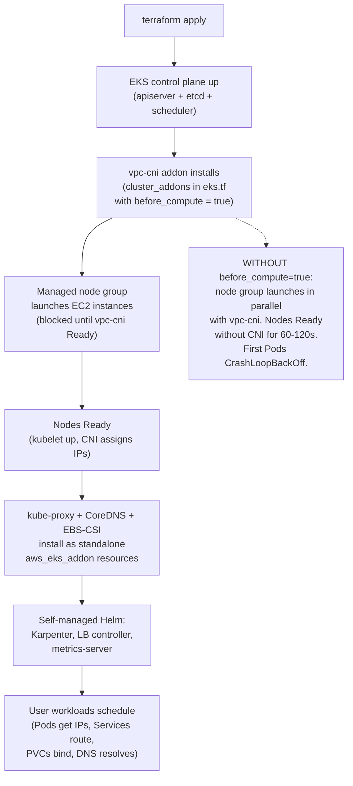

# 14.03 — EKS add-on management discipline

> Every EKS cluster needs **four cluster-critical addons** (vpc-cni,
> kube-proxy, CoreDNS, EBS-CSI) to boot at all; getting their lifecycle
> right — EKS-managed vs self-managed, the `before_compute = true` flag
> that prevents the first-boot CNI race, IRSA wiring for the addons that
> need cloud credentials, and the `resolve_conflicts_on_update` policy
> for upgrades — is the difference between "the cluster bootstrapped
> cleanly" and "the cluster spent an hour in CrashLoopBackOff because
> nodes Ready'd before the CNI was installed."

**Estimated time:** ~30 min read · ~60 min hands-on
**Prerequisites:** [Part 14 ch.02](./02-eks-cluster-lifecycle.md) — addon upgrade is the second leg of the upgrade dance · [Part 10 ch.02](../10-cloud-and-managed-kubernetes/02-provisioning-and-iac.md) — the EKS module that already manages the four addons · [Part 13 ch.01](../13-grand-capstone-bookstore-platform/01-bookstore-2-from-toy-to-platform.md) — the IRSA + bookstore-platform terraform context

**You'll know after this:** • identify the four cluster-critical addons (vpc-cni, kube-proxy, CoreDNS, EBS-CSI) and why each must boot before workloads · • configure `before_compute = true` to prevent the first-boot CNI race · • choose between EKS-managed vs self-managed addons for each one · • wire IRSA for addons that need cloud credentials (EBS-CSI, vpc-cni) · • set `resolve_conflicts_on_update` correctly so upgrades don't clobber operator-applied patches

<!-- tags: eks, terraform, cloud, platform-engineering, irsa -->

## Why this exists

The bookstore-platform tree at
[`../examples/bookstore-platform/terraform/`](../examples/bookstore-platform/terraform/)
installs a Helm chart's worth of controllers on the cluster (Karpenter,
the AWS Load Balancer Controller, metrics-server, the EBS-CSI driver,
CoreDNS). Four of those are different from the rest:

1. **vpc-cni (Amazon VPC CNI plugin)** — assigns Pod IPs from VPC
   subnets. Without it, a Pod cannot get an IP, cannot be `Ready`,
   cannot serve traffic. Nodes themselves cannot fully `Ready` until
   the CNI assigns them a Pod IP for the node-local infrastructure
   pods.
2. **kube-proxy** — implements `Service` IP routing on each node
   (iptables, IPVS, or nftables rules). Without it, ClusterIP
   Services don't work and the cluster's internal east-west
   networking is broken.
3. **CoreDNS** — the cluster DNS server. Without it, Pod-to-Pod
   service discovery via DNS names fails, breaking everything that
   resolves `my-service.my-namespace.svc.cluster.local`.
4. **EBS-CSI driver** — provisions and mounts EBS volumes for any
   PersistentVolumeClaim. Without it, every StatefulSet (CNPG, Strimzi,
   Loki, anything stateful in the bookstore platform) stays in
   `Pending`.

These four are not "applications you might install on the cluster";
they are part of what makes the cluster a usable Kubernetes cluster
at all. Their lifecycle is structurally different from everything
else in the platform, and AWS exposes that difference via the
**EKS-managed addon** API. The other dozen controllers in the tree —
Karpenter, the LB Controller, Velero, Argo CD, Cilium — are not
EKS-managed addons; they're plain Helm releases. The line between the
two paradigms is what this chapter is about.

The single most expensive mistake a fresh EKS cluster can make is the
**first-boot CNI race**: the EKS control plane comes up, the managed
node group starts launching EC2 instances, the nodes report Ready
before vpc-cni installs, scheduled pods fail to get IPs, controllers
crashloop, the operator sees a half-broken cluster on day one. The
`before_compute = true` flag on the vpc-cni cluster addon is the
single line of Terraform that prevents this. Phase 14-R put it in
[`../examples/bookstore-platform/terraform/eks.tf`](../examples/bookstore-platform/terraform/eks.tf);
this chapter explains why.

[Part 10 ch.01](../10-cloud-and-managed-kubernetes/01-managed-kubernetes-model.md)
introduced the managed-cluster ownership boundary; this chapter
operationalizes one slice of it (the addons that AWS keeps patched).
[Part 02 ch.01](../02-networking/01-networking-model.md) covered
CNI plugins in the abstract; this chapter is the EKS-specific
production discipline for the four addons every cluster needs.

> **In production:** EKS-managed addons are the right default for the
> four essentials. AWS keeps them patched against upstream security
> advisories, certifies them against each K8s minor, and provides the
> `addon_version = null` "pick what works for this cluster's K8s
> version" knob. Self-managing vpc-cni is possible (`helm install
> aws-vpc-cni`) but you take on every CVE-tracking and version-
> compatibility task AWS does for free.

## Mental model

**Two paradigms — EKS-managed addons and self-managed releases — split
the platform stack along the "what AWS keeps patched" line. For the
four essentials (vpc-cni, kube-proxy, CoreDNS, EBS-CSI), EKS-managed
is the default; for everything else, self-managed (Helm/Argo CD)
wins. The `before_compute = true` flag on the vpc-cni addon enforces
the cluster-bootstrap ordering. IRSA roles wire addons to AWS APIs
without storing credentials in the cluster.**

The two paradigms:

- **EKS-managed addons** are first-class AWS resources. The addon's
  identity is `(cluster, addon-name)`; AWS knows which K8s versions
  it's compatible with, which container images to pull, what IRSA
  service account it expects. Terraform's `aws_eks_addon` resource
  (or the `terraform-aws-modules/eks/aws` module's `cluster_addons`
  map) is the only thing you write; AWS does the install, the upgrade,
  the patching. The catalog (`aws eks describe-addon-versions`) is
  authoritative.
- **Self-managed releases** are plain Helm or Kustomize. You own the
  chart version, the image tag, the security patches, the
  compatibility-with-K8s-version checks. Karpenter is self-managed
  in the bookstore tree (`karpenter.tf` is a `helm_release` against
  `oci://public.ecr.aws/karpenter/karpenter`). So is the LB
  Controller. So is metrics-server. So is everything that isn't
  vpc-cni/kube-proxy/CoreDNS/EBS-CSI.

When to pick which:

- **EKS-managed wins when:**
  - The addon is one of the four AWS-managed essentials.
  - You want AWS to track CVEs against the addon for you.
  - The addon needs cloud-API credentials (EBS-CSI talks to EC2 for
    volume operations) and AWS's IRSA wiring is the simplest path.
- **Self-managed wins when:**
  - The addon isn't in the EKS catalog (most things).
  - You need a custom build, custom values, custom controllers (the
    LB Controller's IAM policy is fetched from the upstream repo at
    a pinned tag — that's per-team customization beyond what the
    EKS catalog supports).
  - You want lockstep with the upstream release calendar (Karpenter
    1.6.0 ships; you want 1.6.0 in production tomorrow; you don't
    want to wait for AWS to certify it as an EKS addon).

**The `before_compute = true` flag.** The EKS module's `cluster_addons`
map (in `eks.tf`, the block currently holding vpc-cni) supports a
`before_compute` field. When set to `true`, the module enforces a
Terraform-resource-graph dependency such that the addon is installed
**before** the first managed node group launches its EC2 instances.
Without it, the addon resource and the node group are sibling resources
with no ordering — Terraform parallelizes them, the node group
sometimes wins the race, and nodes come up CNI-less for the first
60-120 seconds. That window is enough for the cluster's first Pod
(CoreDNS, the LB controller's CRDs, anything scheduled to system
nodes) to fail to schedule, the controllers to enter backoff, and the
operator's first `kubectl get pods` to look like a broken cluster.
`before_compute = true` fixes this for vpc-cni; the other three
(kube-proxy, CoreDNS, EBS-CSI) don't need it (kube-proxy installs as
a DaemonSet that comes up after CNI; CoreDNS and EBS-CSI install as
Deployments that tolerate a brief CNI-absence).

Standalone `aws_eks_addon.vpc_cni` (a separate resource block, not
inside the module's `cluster_addons` map) doesn't get `before_compute`
for free — the standalone resource is parallel to the node group, the
race is back. The bookstore-platform tree's choice — putting vpc-cni
inside `module.eks.cluster_addons` and the other three as standalone
`aws_eks_addon` resources in `addons.tf` — is deliberate: vpc-cni is
the one that needs the ordering, the others don't.

**IRSA for addons.** Two of the four essentials need to call AWS APIs:

- **EBS-CSI** calls EC2's `CreateVolume`, `AttachVolume`,
  `DetachVolume`, `DeleteVolume`, `CreateSnapshot` — every PVC bind
  is an EC2 API call.
- **vpc-cni** calls EC2's `AssignPrivateIpAddresses`,
  `DescribeInstances` — when a Pod is scheduled, vpc-cni assigns one
  of the node's secondary ENI IPs to the Pod.

The clean way to give a Pod (or here, an addon's controller) AWS
credentials is **IRSA** (IAM Roles for Service Accounts), introduced
in [Part 10 ch.03](../10-cloud-and-managed-kubernetes/03-cloud-identity.md).
The addon resource's `service_account_role_arn` field binds the IAM
role to the addon's service account. The bookstore-platform's
[`iam.tf`](../examples/bookstore-platform/terraform/iam.tf) creates
the two roles (`aws_iam_role.vpc_cni`, `aws_iam_role.ebs_csi`); the
EKS module + addons.tf wire them in.

**`resolve_conflicts_on_create` and `resolve_conflicts_on_update`
policy.** EKS addon installs and upgrades can collide with cluster
state that already exists — a ConfigMap with the same name, a CRD
already there, a configuration your team patched by hand. Two
separate fields govern this, and they fire at different moments:

- **`resolve_conflicts_on_create`** — controls behavior when the addon
  resource *pre-exists* in the cluster at install time (e.g., the
  addon was installed manually before Terraform took over, or a prior
  Terraform apply left residue).
  - `OVERWRITE` — Terraform claims the existing resource; the addon's
    Terraform-managed configuration wins. Use this when taking over a
    previously-manual install.
  - `NONE` — Terraform errors out if the resource already exists.
    Safer for green-field installs where a pre-existing resource is
    unexpected.
- **`resolve_conflicts_on_update`** — controls behavior when a
  subsequent `terraform apply` conflicts with manual edits made
  *after* the addon was first installed.
  - `OVERWRITE` — EKS reverts the manual changes; Terraform's
    configuration wins. The dev-cluster default; guarantees the addon
    is always in the declared state.
  - `PRESERVE` — manual edits stick around even after `terraform
    apply`. The production-cluster choice when an ops engineer has
    patched the addon in an incident and the Terraform PR to codify
    the change hasn't landed yet.

The bookstore-platform tree uses `OVERWRITE` for both as a
sensible-default for a teaching cluster; production teams should
flip `resolve_conflicts_on_update` to `PRESERVE` for any addon they've
customized via `configuration_values` or manual patches.

**Pod Identity Agent — IRSA's replacement.** AWS released
**EKS Pod Identity** in 2023 as a simpler alternative to IRSA. Where
IRSA requires an OIDC provider, a trust policy with a Kubernetes
service-account subject, and the cluster's OIDC issuer URL pinned in
the role, Pod Identity uses a small daemonset (the Pod Identity Agent
addon) that intercepts the AWS SDK's metadata-service call and
returns credentials via an EKS API. For a fresh cluster, Pod Identity
is simpler; for an existing IRSA-wired cluster, the migration is
non-trivial (re-wire every role's trust policy). The bookstore-
platform tree uses IRSA throughout because Phase 13's first version
predated wide Pod Identity adoption; a green-field cluster in 2026
could pick either.

The trap to keep in view: **the conformance window**. Each addon
version supports a *range* of K8s minors (e.g., vpc-cni v1.20.x
supports K8s 1.30-1.36). When you bump K8s, the next-default addon
version may differ; when you pin `addon_version`, you're responsible
for tracking the window. `addon_version = null` lets EKS pick the
default, which is always within the conformance window for the
current K8s minor.

## Diagrams

### Diagram A — addon lifecycle on cluster bootstrap (Mermaid)



### Diagram B — the four essential addons and their IRSA needs (ASCII)

```text
ADDON                NEEDS AWS API?   IRSA ROLE                    NOTES
───────────────────  ──────────────   ──────────────────────────   ──────────────────────────────────
vpc-cni              yes              aws_iam_role.vpc_cni         Assigns Pod IPs from VPC subnets.
                                      (AmazonEKS_CNI_Policy)        Lives in module.eks.cluster_addons
                                                                    with before_compute=true.
kube-proxy           no               (none — runs as DaemonSet     Implements Service IP routing on
                                       with no cloud calls)         each node. Standalone aws_eks_addon.
CoreDNS              no               (none — cluster-internal DNS) Cluster DNS server. Standalone
                                                                    aws_eks_addon. Patched via
                                                                    configuration_values for nodeSelector.
aws-ebs-csi-driver   yes              aws_iam_role.ebs_csi          Provisions/attaches EBS volumes.
                                      (AmazonEBSCSIDriverPolicy)    Standalone aws_eks_addon. Patched
                                                                    via configuration_values to land on
                                                                    the system node group.
───────────────────  ──────────────   ──────────────────────────   ──────────────────────────────────
SELF-MANAGED (NOT EKS ADDONS):
  Karpenter, LB controller, metrics-server, Argo CD, Crossplane,
  Velero, Falco, Kyverno, OpenCost, Loki, Tempo, Prometheus...
  These are Helm charts with their own IRSA roles where needed.
```

## Hands-on with the Bookstore Platform

### 0. Prerequisites

- The bookstore-platform tree applied (so the four addons exist).
- `kubectl` configured for the cluster.
- `aws` CLI with describe-addon permissions.

The Terraform that ships these is in three files; read them in this
order:

- [`../examples/bookstore-platform/terraform/eks.tf`](../examples/bookstore-platform/terraform/eks.tf)
  — the `cluster_addons.vpc-cni` block with `before_compute = true`.
- [`../examples/bookstore-platform/terraform/addons.tf`](../examples/bookstore-platform/terraform/addons.tf)
  — the standalone `aws_eks_addon` resources for kube-proxy, CoreDNS,
  EBS-CSI.
- [`../examples/bookstore-platform/terraform/iam.tf`](../examples/bookstore-platform/terraform/iam.tf)
  — the IRSA roles for vpc-cni and EBS-CSI.

### 1. Inspect the cluster's addons

```bash
CLUSTER="$(terraform output -raw cluster_name)"
REGION="$(terraform output -raw region)"

aws eks list-addons --cluster-name "$CLUSTER" --region "$REGION"
```

Output:

```text
{
  "addons": [
    "aws-ebs-csi-driver",
    "coredns",
    "kube-proxy",
    "vpc-cni"
  ]
}
```

The four essentials, all EKS-managed. Drill into one:

```bash
aws eks describe-addon \
  --cluster-name "$CLUSTER" --region "$REGION" \
  --addon-name vpc-cni \
  --query 'addon.{name:addonName,ver:addonVersion,status:status,role:serviceAccountRoleArn}'
```

Output:

```text
{
  "name": "vpc-cni",
  "ver": "v1.20.0-eksbuild.1",
  "status": "ACTIVE",
  "role": "arn:aws:iam::<ACCOUNT-ID>:role/bookstore-platform-vpc-cni"
}
```

The `role` field is the IRSA wiring — the vpc-cni service account
(`kube-system/aws-node`) assumes this IAM role via the cluster's OIDC
provider.

### 2. Inspect a pod that uses an addon

```bash
# vpc-cni runs as a DaemonSet — one Pod per node.
kubectl -n kube-system get pods -l k8s-app=aws-node -o wide

# Check the service account binding.
kubectl -n kube-system get sa aws-node -o yaml | grep -A1 annotations
```

The service account has the `eks.amazonaws.com/role-arn` annotation
pointing at the IAM role; the kubelet projects an OIDC token into
the Pod; the AWS SDK in vpc-cni uses that token to assume the role.

### 3. Query the addon catalog

```bash
aws eks describe-addon-versions \
  --addon-name vpc-cni \
  --kubernetes-version 1.35 \
  --query 'addons[0].addonVersions[*].{ver:addonVersion,default:compatibilities[?defaultVersion==`true`].clusterVersion | [0],status:compatibilities[*].clusterVersion}' \
  --output table
```

Output (truncated):

```text
-----------------------------------------------------------------
|                  DescribeAddonVersions                         |
+-----------------+----------+------------------------------------+
|       ver       | default  |             status                |
+-----------------+----------+------------------------------------+
| v1.20.0         | 1.35     | ["1.30","1.31","1.32","1.33",     |
|                 |          |  "1.34","1.35","1.36"]            |
| v1.19.5         | None     | ["1.29","1.30","1.31","1.32",     |
|                 |          |  "1.33","1.34","1.35"]            |
+-----------------+----------+------------------------------------+
```

This is the **conformance window** in action: each addon version is
compatible with a range of K8s minors. The `default` column shows
which version EKS picks when `addon_version = null` in Terraform.

### 4. Bump an addon to a specific version (optional — `null` usually wins)

In `addons.tf`, change:

```hcl
resource "aws_eks_addon" "coredns" {
  cluster_name                = module.eks.cluster_name
  addon_name                  = "coredns"
  addon_version               = "v1.11.4-eksbuild.2"  # pinned, was null
  # ...
}
```

Run:

```bash
terraform plan -target=aws_eks_addon.coredns
terraform apply -target=aws_eks_addon.coredns
```

Use `-target` only for surgical addon-version changes; never for
ongoing operations. The pin lets you control upgrade timing (you bump
CoreDNS when *you* are ready, not when EKS picks a new default).

### 5. Verify the before_compute ordering

After a fresh `terraform apply` (or against the existing cluster's
state), check Terraform's dependency graph:

```bash
terraform graph -type=apply | grep -A1 -E '(vpc-cni|system|eks_managed_node_group)'
```

You'll see edges showing that the managed node group depends on the
addon resource. On a fresh apply, the addon installs first, then the
node group's EC2 instances launch — the cluster never has Ready nodes
without CNI.

### 6. Watch the resolve-conflicts policy in action

Hand-edit a CoreDNS configmap (the kind of thing prod ops sometimes
do to tune resolution):

```bash
kubectl -n kube-system get configmap coredns -o yaml > coredns-backup.yaml
kubectl -n kube-system edit configmap coredns
# (change something cosmetic; save)
```

Now run an apply:

```bash
terraform apply -target=aws_eks_addon.coredns
```

With `resolve_conflicts_on_update = "OVERWRITE"` (the bookstore tree's
default), your edit is wiped — EKS re-applies the upstream ConfigMap.
With `PRESERVE`, your edit survives. The right answer is "depends on
whether you committed the edit to Terraform"; production teams that
take customization seriously use `PRESERVE` everywhere.

Restore the original:

```bash
kubectl -n kube-system apply -f coredns-backup.yaml
rm coredns-backup.yaml
```

### 7. Add a new EKS-managed addon (not one of the four)

EKS's catalog has additional addons beyond the four essentials —
ADOT collector, CloudWatch Container Insights, Pod Identity Agent.
To add Pod Identity Agent:

```hcl
# addons.tf — add this block
resource "aws_eks_addon" "pod_identity_agent" {
  cluster_name                = module.eks.cluster_name
  addon_name                  = "eks-pod-identity-agent"
  addon_version               = null
  resolve_conflicts_on_update = "OVERWRITE"
  resolve_conflicts_on_create = "OVERWRITE"
  preserve                    = false

  tags = local.common_tags
}
```

`terraform plan` shows the new addon; `terraform apply` installs it.
The agent runs as a DaemonSet in `kube-system`; you can then declare
`PodIdentityAssociation` resources to map service accounts to IAM
roles (without the OIDC-provider machinery IRSA needs).

## How it works under the hood

**The EKS addon API.** `aws eks describe-addon` returns the addon's
configured manifest URL, the container images, the recommended IRSA
service account, and the compatibility matrix. When you call
`CreateAddon` (Terraform does this on `apply`), EKS fetches the
manifests, applies them to your cluster via the apiserver, and tags
the resulting Kubernetes objects with `eks.amazonaws.com/addon-name`
labels. EKS doesn't run a controller in your cluster managing addons;
it applies them once and walks away (until the next API call).

**The `service_account_role_arn` field's mechanism.** When the field
is set on `aws_eks_addon`, EKS patches the addon's pre-baked manifests
to add the `eks.amazonaws.com/role-arn` annotation to the service
account before applying. The annotation is then consumed by the
cluster's OIDC provider (auto-created by `enable_irsa = true` in the
EKS module): the kubelet projects a JWT into the Pod's filesystem,
the AWS SDK detects the projection, calls `sts:AssumeRoleWithWebIdentity`
with the JWT, and gets a temporary credential. The Pod never sees a
long-lived AWS key — the credential is request-time and short-lived.

**`before_compute = true` mechanics.** Inside the
`terraform-aws-modules/eks/aws` module, the `cluster_addons.<name>.before_compute`
flag, when true, adds a Terraform `depends_on` from the managed node
group resources to the addon resource. Terraform's resource graph
honors the dependency: the addon's `Create` must complete before any
node group's `Create` begins. AWS's side of the addon install — the
fetch-and-apply sequence — typically completes in 30-60 seconds,
faster than the node group's EC2-instance-launch sequence (~3-5
minutes), so the ordering doesn't extend the overall apply time;
it just makes the CNI presence guaranteed before nodes are.

**Why `kube-proxy` doesn't need `before_compute`.** kube-proxy
installs as a DaemonSet — one Pod per node, scheduled by the
DaemonSet controller after the node Joins. If kube-proxy isn't there
yet when a node Joins, the node just doesn't route Service IPs for
30-60 seconds. The cluster's API is reachable via the apiserver's
direct VPC endpoint (or its public endpoint), not via a ClusterIP, so
kubelet's API calls still work. The pods that *do* need kube-proxy to
work — anything calling a Service by ClusterIP — backoff and retry,
which is fine for the brief startup window. vpc-cni's absence is
fundamentally different: a Pod without an IP can't even start its
container's network namespace; it never gets to "retry".

**The conformance window's data structure.** Each addon version is
described by a `compatibilities` list — pairs of `(clusterVersion,
defaultVersion: bool)`. EKS uses this to answer two questions: "which
addon versions can I install on this K8s minor?" (filter by minor in
the list) and "which one is the default?" (find the entry where
`defaultVersion` is true). When `addon_version = null` in Terraform,
the EKS API returns the default for the current cluster minor; when
you pin a version, EKS validates it's in the window and rejects with
a clear error if not.

**Pod Identity Agent vs IRSA — the migration.** IRSA's trust policy
references the cluster's OIDC issuer URL — a string like
`oidc.eks.<region>.amazonaws.com/id/<HASH>`. The hash is cluster-
specific and changes when you destroy and recreate the cluster.
Multi-cluster teams pay this tax for every cluster (one role per
cluster per app). Pod Identity replaces the trust policy with a
service-side mapping (cluster + namespace + service account → role),
without OIDC. The migration: install the Pod Identity Agent addon,
create `PodIdentityAssociation` resources, swap the application's
service-account-to-role wiring from the `eks.amazonaws.com/role-arn`
annotation to the new mapping, remove the IRSA trust policy from the
role. For an existing cluster, the migration is significant; for a
new cluster, Pod Identity is the simpler default.

## Production notes

> **In production:** Pin `addon_version` for staging and production;
> leave `null` for dev. The dev cluster benefits from "latest works"
> (you see new addon behavior early); staging and production benefit
> from "the version we tested" (no surprise bump when EKS rotates
> defaults during an unrelated upgrade). **When `addon_version = null`,
> a Kubernetes control-plane upgrade via `terraform apply` ALSO updates
> every addon to the new K8s-minor default — silently, in the same
> apply. You only discover the new addon versions in the plan output.
> Mitigation: pin `addon_version` in staging and production so addon
> bumps are explicit commits.** The bookstore-platform tree uses `null`
> throughout because it's a teaching artifact; flip to pinned in your
> fork.

> **In production:** `resolve_conflicts_on_update = "PRESERVE"` is
> the right choice for any addon you've customized via
> `configuration_values`. The bookstore-platform's CoreDNS is patched
> for `nodeSelector` and `tolerations` (so it lands on the system
> node group); the EBS-CSI is patched for the same reason. With
> `OVERWRITE`, these customizations live in Terraform — every apply
> reasserts them, so the policy is moot. With `PRESERVE`, manual
> edits stick around even after a terraform apply, which is the
> production-team behavior when an ops engineer needs to patch the
> cluster *right now* before the Terraform PR is merged.

> **In production:** IRSA on every addon that needs cloud
> credentials. The bookstore-platform tree wires
> `service_account_role_arn` for vpc-cni and EBS-CSI; CoreDNS and
> kube-proxy don't need it (no AWS API calls). Audit your own
> add-ons: if the addon's manifest references AWS APIs, it needs
> IRSA (or Pod Identity); if it doesn't, leave the field empty.

> **In production:** Conformance windows matter at upgrade time, not
> install time. A `null` `addon_version` is always within the window
> for the current K8s minor (EKS guarantees this). The risk is the
> *next* K8s upgrade — the addon version compatible with K8s 1.35
> may not exist for 1.36. The pre-flight in
> [ch.02](02-eks-cluster-lifecycle.md) §3 is the discipline that
> catches this: `aws eks describe-addon-versions --kubernetes-version
> <N+1>` returns what's available for the target.

> **In production:** The `before_compute = true` on vpc-cni is
> non-negotiable. Every fresh cluster without it gets the first-boot
> race; every team that hits it once never forgets. Phase 14-R put
> it in the bookstore tree because the smoke test on 2026-05-20 hit
> the race and watched it.

> **In production:** Pod Identity for new clusters; IRSA for
> existing. Don't churn a working IRSA wiring just because Pod
> Identity is newer. Migration is multi-week work for a non-trivial
> cluster; the gain (one less OIDC provider to manage) is modest.
> New green-field clusters should default to Pod Identity Agent
> from day one.

> **In production:** Custom CoreDNS plugins (the `forward` plugin
> pointing at a corporate DNS, the `cache` plugin tuned for high
> QPS) live in `configuration_values` on the CoreDNS addon — *not*
> in a hand-patched ConfigMap. The Terraform-authored config
> survives upgrades; the hand-patch gets overwritten on the next
> `OVERWRITE` apply.

## Quick Reference

```bash
# List all EKS-managed addons on a cluster.
aws eks list-addons --cluster-name "$CLUSTER" --region "$REGION"

# Describe one addon (version, status, IRSA role).
aws eks describe-addon --cluster-name "$CLUSTER" --region "$REGION" \
  --addon-name vpc-cni

# Query the catalog — which versions are compatible with K8s 1.36?
aws eks describe-addon-versions \
  --addon-name vpc-cni --kubernetes-version 1.36

# Pin a version (in addons.tf).
addon_version = "v1.20.0-eksbuild.1"

# Leave it floating (EKS picks the default for the cluster's K8s minor).
addon_version = null

# IRSA wire-up on an addon.
service_account_role_arn = aws_iam_role.vpc_cni.arn

# Patch addon config (nodeSelector, tolerations, replica count).
configuration_values = jsonencode({
  nodeSelector = { "bookstore-platform.example.com/pool" = "system" }
  replicaCount = 2
})
```

Minimal `cluster_addons` skeleton (inside the EKS module call):

```hcl
cluster_addons = {
  vpc-cni = {
    addon_version               = null
    resolve_conflicts_on_create = "OVERWRITE"
    resolve_conflicts_on_update = "OVERWRITE"
    service_account_role_arn    = aws_iam_role.vpc_cni.arn
    before_compute              = true
    preserve                    = false
  }
}
```

Minimal standalone `aws_eks_addon` skeleton:

```hcl
resource "aws_eks_addon" "kube_proxy" {
  cluster_name                = module.eks.cluster_name
  addon_name                  = "kube-proxy"
  addon_version               = null
  resolve_conflicts_on_create = "OVERWRITE"
  resolve_conflicts_on_update = "OVERWRITE"
  preserve                    = false
}
```

Addon-management checklist (the cluster is healthy when all five are yes):

- [ ] vpc-cni has `before_compute = true` in the EKS module's
      `cluster_addons` map.
- [ ] Every addon that needs AWS APIs (vpc-cni, EBS-CSI) has an IRSA
      role wired via `service_account_role_arn`.
- [ ] Conformance window verified for the cluster's K8s minor
      (`aws eks describe-addon-versions --kubernetes-version <CURRENT>`
      lists all four essentials).
- [ ] `resolve_conflicts_on_update` policy set deliberately
      (OVERWRITE for dev, PRESERVE for staging/prod when customized).
- [ ] Addon versions are pinned in staging/prod (not `null`) so
      AWS-side default rotations don't surprise the team.

## Test your understanding

> Try each before opening the answer drawer. The act of trying is the exercise; the answer is the check.

1. **What exactly does `before_compute = true` do for the vpc-cni addon, and why don't the other three essentials need it?**
   <details><summary>Show answer</summary>

   It adds a Terraform resource-graph dependency that blocks the managed node group's EC2 launches until the vpc-cni addon is Ready. Without it, the node group and the addon are siblings — Terraform parallelizes them, the node group can win, and nodes Ready without a CNI for 60-120 seconds. The other three install as DaemonSets/Deployments that tolerate a brief CNI-absence (kube-proxy comes up after CNI by definition; CoreDNS and EBS-CSI are Deployments that wait for Pod IPs), so the ordering only matters for vpc-cni.

   </details>

2. **You run `terraform apply` to bump K8s from 1.35 to 1.36 with `addon_version = null` for every addon. Mid-apply, the LB Controller starts crashlooping. What's happening and how do you avoid this in prod?**
   <details><summary>Show answer</summary>

   `addon_version = null` lets EKS auto-bump every managed addon to its new default version at the same time as the cluster upgrade. One of those default bumps changed an API the LB Controller (a self-managed Helm release) depended on. The chapter's discipline: pin `addon_version` to specific certified strings in staging/prod (not `null`), stage each addon bump as its own PR in a separate apply, and let dev clusters use `null` to find these surprises before prod hits them.

   </details>

3. **An ops engineer manually edited the vpc-cni ConfigMap to add a custom `MTU` setting during an incident. Six hours later, a scheduled `terraform apply` runs and the custom setting disappears. Why and what was misconfigured?**
   <details><summary>Show answer</summary>

   `resolve_conflicts_on_update = OVERWRITE` reverts manual edits at every `terraform apply` — EKS replaces the live state with the Terraform-declared state. The fix in production is `resolve_conflicts_on_update = PRESERVE` for any addon that's been customized (manual edits stay until the Terraform PR codifying them lands). OVERWRITE is the right default for dev clusters where you want declared state to win; PRESERVE protects the in-incident hotfix that hasn't been merged yet.

   </details>

4. **Hands-on extension — create a fresh cluster with vpc-cni declared as a standalone `aws_eks_addon` resource (not inside `cluster_addons`) and watch the bootstrap. Note the timestamps of node-Ready vs CNI-Ready.**
   <details><summary>What you should see</summary>

   The standalone resource has no `before_compute` field — it runs in parallel with the node group. Nodes report Ready before vpc-cni has installed; for the first ~60-120 seconds, any Pod scheduled to those nodes gets stuck `ContainerCreating` with `NetworkPlugin cni failed`. CoreDNS, anything in `kube-system`, the bookstore's first Pods all CrashLoopBackOff briefly. This is the first-boot CNI race the chapter exists to prevent.

   </details>

## Further reading

- **AWS EKS — Amazon EKS add-ons**
  <https://docs.aws.amazon.com/eks/latest/userguide/eks-add-ons.html>;
  the authoritative reference for the addon API, the catalog, and
  what counts as an EKS-managed addon.
- **terraform-aws-modules/eks/aws — `cluster_addons` reference**
  <https://github.com/terraform-aws-modules/terraform-aws-eks/blob/master/docs/compute_resources.md>;
  the module-side reference for `before_compute`, `configuration_values`,
  and the resolve-conflicts policy.
- **AWS EKS Pod Identity migration guide**
  <https://docs.aws.amazon.com/eks/latest/userguide/pod-identities.html>;
  the canonical reference for migrating from IRSA to Pod Identity.
- **vpc-cni — Amazon VPC CNI plugin docs**
  <https://github.com/aws/amazon-vpc-cni-k8s>; the upstream repository
  for the CNI plugin, including the IRSA permission set this chapter
  depends on.
- **AWS EBS CSI driver docs**
  <https://github.com/kubernetes-sigs/aws-ebs-csi-driver>; the
  upstream repo and the IAM policy template for the EBS-CSI addon's
  IRSA role.
- **Rosso et al., *Production Kubernetes* ch.7 — Networking & Storage**;
  the broader CNI + CSI discipline this chapter's addon management
  enforces at the EKS layer.
