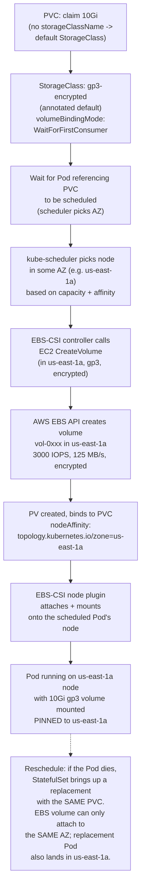

# 14.04 — Storage classes & EBS in production

> Every EKS cluster ships with **gp2** as the default StorageClass and
> every production team should replace it with **gp3** the day the
> cluster lands: 20% cheaper, tunable IOPS/throughput, no burst-credit
> footgun. The full discipline is bigger than the StorageClass swap —
> EBS encryption-at-rest, snapshot lifecycle, the always-AZ-local
> reality of EBS volumes, and the `WaitForFirstConsumer` binding mode
> that keeps Pods and their volumes in the same AZ.

**Estimated time:** ~30 min read · ~60 min hands-on
**Prerequisites:** [Part 14 ch.03](./03-eks-addon-management.md) — EBS-CSI addon required first · [Part 10 ch.04](../10-cloud-and-managed-kubernetes/05-cloud-storage-and-data.md) — kind→cloud storage transition · [Part 06 ch.02](../03-config-and-storage/05-stateful-data-patterns.md) — StatefulSet binding semantics on EBS

**You'll know after this:** • understand why gp2 (default) should be replaced with gp3 on day one — 20% cheaper, tunable IOPS, no burst-credit footgun · • configure EBS encryption-at-rest via KMS by default at the StorageClass level · • use `WaitForFirstConsumer` to keep Pods and volumes in the same AZ · • design a snapshot lifecycle for production EBS volumes · • debug the AZ-local reality of EBS when a Pod can't reschedule across zones

<!-- tags: storage, ebs-csi, eks, cloud, day-2 -->

## Why this exists

The bookstore-platform tree at
[`../examples/bookstore-platform/terraform/`](../examples/bookstore-platform/terraform/)
runs CNPG, Strimzi, Loki, Tempo, Prometheus, and Velero — every one
of them claims a PersistentVolume. Without a StorageClass tuned for
production, every PVC binds to a gp2 EBS volume at default settings:
8 GB minimum, 3 IOPS/GB baseline, burst-credit ceiling that runs out
under sustained load, encrypted with the AWS-managed default key
(maybe, if the account is configured for it). Every one of those
defaults is a missed optimization, and we address all of them in this
chapter.

gp3, released by AWS in late 2020, is structurally better than gp2 on
every dimension a Kubernetes team cares about:

- **Price.** gp3 is **$0.08/GB-month** vs gp2's **$0.10/GB-month** —
  20% cheaper.
- **Baseline performance.** gp3 starts at **3000 IOPS** and **125
  MB/s** *regardless of volume size*. gp2 starts at **3 IOPS/GB**
  with a 100 IOPS sustained baseline; the I/O credit bucket allows
  bursting to 3000 IOPS briefly, but under constant sustained load
  the credits deplete and the volume is throttled back to its 100
  IOPS baseline.
- **Tunability.** gp3 lets you provision additional IOPS (up to
  16,000) and throughput (up to 1,000 MB/s) **independently of
  size**. gp2 ties IOPS to size; the only way to get more IOPS is to
  buy a larger volume you don't need.

For a Kubernetes cluster with 30+ PVs (a normal mid-size cluster
with Prometheus + Loki + Tempo + a CNPG primary + replicas + some
app state), the cost difference is real money: at 30 PVs averaging
50 GB, gp2 is $150/month, gp3 is $120/month. Multiply by years and
clusters and the gp3 switch is the highest-ROI two-file Terraform
change you can make.

But the change is more than the StorageClass swap. EBS is **always
AZ-local**: a volume in us-east-1a cannot attach to an instance in
us-east-1b. A StatefulSet's CNPG primary, scheduled to us-east-1a
when its PVC binds, is *pinned* to us-east-1a until the volume is
either snapshotted-and-restored cross-AZ or the PVC is destroyed. The
`volumeBindingMode: WaitForFirstConsumer` setting on the StorageClass
is what keeps Pod and volume in the same AZ — it defers volume
creation until the scheduler picks an AZ for the Pod, then creates
the volume there. Without it (`Immediate` binding), the volume is
provisioned at PVC-creation time, in an arbitrary AZ, and the Pod is
then *forced* to that AZ — losing the scheduler's awareness of node
capacity, taints, affinities.

Beyond that, encryption-at-rest is the production default (and the
compliance team's first audit question). We rely on VolumeSnapshots
as the primary backup mechanism EBS offers (snapshots have their own
AWS-billing surprise at scale), and cross-AZ data-transfer for
replicated stateful workloads ($0.01/GB between AZs) is the budget
item we find teams consistently fail to forecast.

[Part 03 ch.04](../03-config-and-storage/04-persistent-storage.md)
introduced StorageClass, PVC, PV, the CSI architecture, and binding
modes. [Part 03 ch.05](../03-config-and-storage/05-stateful-data-patterns.md)
covered VolumeSnapshots in the abstract. This chapter is the
EKS+EBS-specific production overlay: which StorageClass parameters
matter, how to demote the default gp2, where the snapshot-bill
surprises hide.

> **In production:** Every EKS cluster should run a Terraform that
> creates a tuned gp3 StorageClass with encryption forced ON,
> `WaitForFirstConsumer` binding, and `allowVolumeExpansion: true` —
> and demotes the bundled gp2 so new PVCs default to gp3. Phase 14-R
> shipped exactly this in
> [`../examples/bookstore-platform/terraform/gp3-storageclass.tf`](../examples/bookstore-platform/terraform/gp3-storageclass.tf).

## Mental model

**Three layers compose EBS-backed storage on Kubernetes: the
StorageClass (the K8s abstraction), the EBS volume parameters
(gp2/gp3/io2/encryption/IOPS/throughput), and the AZ pinning (every
EBS volume is single-AZ). Tuning the StorageClass is the dev-grade
move; tuning the snapshot lifecycle and cross-AZ data-transfer is the
ops-grade follow-up.**

The three layers:

- **Layer 1 — StorageClass.** Kubernetes' interface for "what kind of
  storage do I want?" A cluster can have multiple StorageClasses;
  exactly one is the default (marked with the
  `storageclass.kubernetes.io/is-default-class: "true"` annotation).
  PVCs that omit `storageClassName` use the default. The bookstore
  tree's `gp3-encrypted` SC is the new default; the bundled `gp2` is
  demoted.
- **Layer 2 — EBS volume parameters.** The StorageClass's `parameters`
  block passes these to the EBS-CSI driver:
  - `type`: `gp2`, `gp3`, `io1`, `io2`, `st1`, `sc1` — gp3 is the
    default for everything that isn't a database hot-path; io2 is
    for sustained > 16k IOPS sub-millisecond workloads.
  - `encrypted`: `"true"` to force encryption. AWS accounts can
    set a default (Account-default-encryption setting), but the SC
    parameter is explicit and beats inheritance.
  - `iops`: 3000-16000 for gp3 (free up to 3000, $0.005/IOPS-month
    above).
  - `throughput`: 125-1000 MB/s for gp3 (free up to 125, $0.04/MB/s-
    month above).
  - `kmsKeyId`: ARN of a customer-managed KMS key. Default is the
    AWS-managed `aws/ebs` key.
- **Layer 3 — AZ pinning.** Every EBS volume lives in exactly one
  AZ. A Pod claiming an EBS-backed PVC is forced to schedule onto a
  node in the same AZ as the volume. `WaitForFirstConsumer` defers
  volume creation until the Pod is scheduled, so the AZ is the
  scheduler's choice (matching node taints, capacity, anti-affinity);
  `Immediate` reverses the dependency and forces the Pod to the
  volume's AZ.

**gp2 vs gp3 vs io2** — the trade-off matrix:

| Type | Baseline IOPS | Max IOPS | Baseline throughput | Cost/GB-mo | Use case |
|---|---|---|---|---|---|
| gp2 | 3 IOPS/GB (100-16k) | 16,000 | tied to IOPS | $0.10 | legacy; AWS default; **avoid** |
| gp3 | 3000 (flat) | 16,000 | 125 MB/s | $0.08 | **default for everything** |
| io2 | 100 IOPS/GB up to 64k | 64,000¹ | 1000 MB/s | $0.125 + $0.065/IOPS | sub-ms latency dbs (RDS-class) |
| st1 | n/a (throughput-only) | 500 | 500 MB/s | $0.045 | log streams; cold data scans |

> ¹ **io2 Block Express** (Nitro-only instances) reaches 256k IOPS; standard io2 caps at 64k IOPS.

For the bookstore platform's needs — Postgres data (CNPG), Kafka
logs (Strimzi), Prometheus TSDB, Loki chunks, Tempo blocks — **gp3
covers everything**. None of these workloads needs io2's sub-
millisecond latency at production scale; they all happily run on
gp3 at 3000 IOPS / 125 MB/s.

**`WaitForFirstConsumer` is essential.** Set on the StorageClass via
`volumeBindingMode: WaitForFirstConsumer`. Without it:

1. PVC is created.
2. CSI driver provisions a volume in an arbitrary AZ (the controller
   picks one; usually the first AZ listed in the StorageClass's
   `allowedTopologies`, or random if not specified).
3. PV binds to PVC.
4. Pod referencing the PVC enters scheduling.
5. Scheduler is *forced* to pick a node in the volume's AZ —
   regardless of node capacity, anti-affinity, taints, etc.

With `WaitForFirstConsumer`:

1. PVC is created. **PV does not exist yet.**
2. Pod referencing the PVC enters scheduling.
3. Scheduler picks a node based on capacity + affinity + taints +
   topology constraints.
4. CSI driver provisions a volume **in the node's AZ**.
5. PV binds to PVC; Pod's container starts.

The second flow gives the scheduler full freedom; the first hijacks
it. Phase 14-R's `gp3-encrypted` StorageClass uses
`WaitForFirstConsumer` precisely because this matters every time the
cluster reschedules a stateful Pod.

**Snapshots are AZ-local in source; can restore cross-AZ.** A
VolumeSnapshot of an EBS volume in us-east-1a creates a snapshot
that's stored in S3 (region-scoped, not AZ-scoped). Restoring the
snapshot creates a new volume — *in an AZ you specify*. So
cross-AZ migration is: snapshot in source AZ → restore to a new
volume in destination AZ → attach to a Pod in the destination AZ.
The original volume + the original Pod stay where they were.

**Reclaim policy — Delete vs Retain.** The StorageClass's
`reclaimPolicy` decides what happens to the underlying EBS volume
when the PVC is deleted:

- `Delete` — Kubernetes deletes the volume. Convenient for dev and
  ephemeral CI clusters; dangerous in production (a `kubectl delete
  pvc` is now an unrecoverable data-loss event).
- `Retain` — Kubernetes releases the PVC binding but keeps the
  volume. The volume becomes `Released` (orphaned); an operator
  must manually `aws ec2 delete-volume` after confirming the data
  is no longer needed. The production-safe default for any PVC
  holding real data.

The bookstore-platform tree's `gp3-encrypted` SC uses `reclaimPolicy:
Delete` because it's a teaching cluster; production forks should
flip to `Retain` for the default class and add a `gp3-retain` SC
for the explicit-retain case.

The trap to keep in view: **the cross-AZ data-transfer surprise**.
AWS charges $0.01/GB for EC2-to-EC2 traffic between AZs in the same
region. A CNPG primary in us-east-1a streaming WAL to a standby in
us-east-1b is real cross-AZ traffic — a workload writing ~300 KB/s
sustained transfers 26 GB/day = $0.26/day = $8/month *per replica*.
For a 3-AZ HA Postgres with WAL streaming to both other AZs, it's
$16/month — small individually, real at scale, surprise to the
team that didn't forecast it.

## Diagrams

### Diagram A — PVC -> StorageClass -> EBS -> AZ-local Pod (Mermaid)



### Diagram B — gp2 vs gp3 vs io2 trade-off matrix (ASCII)

```text
TYPE  COST/GB-MO   BASELINE IOPS         MAX IOPS    THROUGHPUT     USE CASE
────  ───────────  ────────────────────  ──────────  ─────────────  ──────────────────────────────────
gp2   $0.10        3 IOPS/GB, min 100,   16,000      tied to IOPS   AWS default. Avoid: bursty &
                   max 3000 (burst)                                  expensive vs gp3.
gp3   $0.08        3000 (flat, all       16,000      125 MB/s       DEFAULT. 20% cheaper than gp2 at
                   sizes)                            (base, +cost   the same perf. Decouples IOPS
                                                     to 1000)       from size. The right answer for
                                                                    every workload that isn't io2.
io2   $0.125       100 IOPS/GB up to     64,000¹     1000 MB/s      Sub-ms latency only: high-end
      + $0.065/    64k (256k with                                   transactional dbs (RDS Premier).
      IOPS-mo      Block Express)                                   Overkill for bookstore-scale.
                                                                   ¹io2 Block Express (Nitro-only)
                                                                    reaches 256k IOPS.
st1   $0.045       n/a (throughput only) 500         500 MB/s       Cold log streams, scan-heavy
                                                                    data lakes. Not for active dbs.
sc1   $0.015       n/a                   250         250 MB/s       Archive. Bookstore would never
                                                                    use this.
────  ───────────  ────────────────────  ──────────  ─────────────  ──────────────────────────────────
DEFAULT STORAGECLASS POLICY (bookstore-platform):
  gp3-encrypted (default)  -> all PVCs unless overridden
  io2-encrypted (optional) -> CNPG primary if RDS-Premier latency needed
  st1-encrypted (optional) -> long-term Loki/Tempo chunks (not yet shipped)
```

## Hands-on with the Bookstore Platform

### 0. Prerequisites

- The bookstore-platform tree applied through Phase 14-R (so
  `gp3-storageclass.tf` is in effect).
- `kubectl` configured for the cluster.
- `aws` CLI with `ec2:DescribeVolumes` permission.

The Terraform shipping this is in
[`../examples/bookstore-platform/terraform/gp3-storageclass.tf`](../examples/bookstore-platform/terraform/gp3-storageclass.tf).
Read it end-to-end before running anything.

### 1. Confirm the StorageClass swap landed

```bash
kubectl get storageclass
```

Expected:

```text
NAME                       PROVISIONER             RECLAIMPOLICY   VOLUMEBINDINGMODE      ALLOWVOLUMEEXPANSION   AGE
gp2                        kubernetes.io/aws-ebs   Delete          WaitForFirstConsumer   false                  3d
gp3-encrypted (default)    ebs.csi.aws.com         Delete          WaitForFirstConsumer   true                   3d
```

Confirm:

- `gp3-encrypted` has the `(default)` marker.
- `gp2` does **not** have the `(default)` marker.

If both have `(default)`, you have a multiple-defaults problem and
`kubectl describe pvc` will report `Failed to provision volume with
StorageClass: no default StorageClass`. The Terraform's
`kubectl_manifest.gp2_demote` is what flips gp2's annotation; verify
it ran:

```bash
kubectl get sc gp2 -o jsonpath='{.metadata.annotations.storageclass\.kubernetes\.io/is-default-class}'
# expected: false
```

### 2. Inspect the gp3 StorageClass

```bash
kubectl get sc gp3-encrypted -o yaml
```

Key fields:

```yaml
apiVersion: storage.k8s.io/v1
kind: StorageClass
metadata:
  name: gp3-encrypted
  annotations:
    storageclass.kubernetes.io/is-default-class: "true"
provisioner: ebs.csi.aws.com
parameters:
  type: gp3
  encrypted: "true"
  iops: "3000"
  throughput: "125"
volumeBindingMode: WaitForFirstConsumer
allowVolumeExpansion: true
reclaimPolicy: Delete
```

Five things to confirm:

- `provisioner: ebs.csi.aws.com` — the EBS-CSI driver, not the
  legacy `kubernetes.io/aws-ebs`.
- `type: gp3` — not gp2.
- `encrypted: "true"` — always-on, no per-PVC opt-in.
- `volumeBindingMode: WaitForFirstConsumer` — Pod-scheduling drives
  volume placement.
- `allowVolumeExpansion: true` — online resize works.

### 3. Create a test PVC

Save as `/tmp/pvc-test.yaml`:

```yaml
apiVersion: v1
kind: PersistentVolumeClaim
metadata:
  name: pvc-test
  namespace: default
spec:
  accessModes: [ReadWriteOnce]
  resources:
    requests:
      storage: 5Gi
  # storageClassName omitted -> uses the default
```

Apply:

```bash
kubectl apply -f /tmp/pvc-test.yaml
kubectl describe pvc pvc-test
```

With `WaitForFirstConsumer`, the PVC's status will be `Pending` and
the events will say `waiting for first consumer to be created`. No
EBS volume has been provisioned yet.

### 4. Schedule a Pod that consumes the PVC

Save as `/tmp/pod-test.yaml`:

```yaml
apiVersion: v1
kind: Pod
metadata:
  name: pod-test
  namespace: default
spec:
  containers:
    - name: shell
      image: public.ecr.aws/docker/library/busybox:1.36
      command: [sh, -c, "sleep 3600"]
      volumeMounts:
        - { mountPath: /data, name: data }
  volumes:
    - name: data
      persistentVolumeClaim:
        claimName: pvc-test
```

Apply:

```bash
kubectl apply -f /tmp/pod-test.yaml
kubectl get pvc pvc-test
# Now Bound — the volume was provisioned the moment the Pod scheduled.
```

### 5. Inspect the underlying EBS volume

```bash
PV=$(kubectl get pvc pvc-test -o jsonpath='{.spec.volumeName}')
VOLUME_ID=$(kubectl get pv "$PV" -o jsonpath='{.spec.csi.volumeHandle}')

aws ec2 describe-volumes \
  --volume-ids "$VOLUME_ID" \
  --query 'Volumes[0].[VolumeType,Encrypted,Iops,Throughput,AvailabilityZone,Size]' \
  --output table
```

Expected output:

```text
-------------------------------------------------
|                DescribeVolumes                 |
+---------+-------+------+------+-------+-------+
|  Type   |  Enc  | IOPS | Tput |  AZ   | Size  |
+---------+-------+------+------+-------+-------+
| gp3     | true  | 3000 | 125  | <AZ>  | 5     |
+---------+-------+------+------+-------+-------+
```

The volume is gp3, encrypted, 3000 IOPS, 125 MB/s, in whichever AZ
the scheduler picked for the Pod.

### 6. Verify Pod-AZ pinning

```bash
kubectl get pod pod-test -o jsonpath='{.spec.nodeName}'
# e.g., ip-10-0-1-23.ec2.internal
kubectl get node $(kubectl get pod pod-test -o jsonpath='{.spec.nodeName}') \
  -o jsonpath='{.metadata.labels.topology\.kubernetes\.io/zone}'
# e.g., ap-south-1a
```

The Pod's node AZ matches the volume's AZ — Wait­ForFirstConsumer in
action.

### 7. Test online volume expansion

The StorageClass has `allowVolumeExpansion: true`. Bump the PVC
request from 5Gi to 10Gi:

```bash
kubectl patch pvc pvc-test --type=merge \
  -p '{"spec":{"resources":{"requests":{"storage":"10Gi"}}}}'
```

Watch the resize:

```bash
kubectl get pvc pvc-test -w
# Status moves from FileSystemResizePending -> Bound 10Gi
```

The expansion is online — no Pod restart, no downtime. The EBS API
grows the volume; the EBS-CSI node plugin runs `resize2fs` (or `xfs_growfs`
on XFS) inside the Pod's mount namespace.

### 8. Clean up

```bash
kubectl delete -f /tmp/pod-test.yaml
kubectl delete -f /tmp/pvc-test.yaml
```

With `reclaimPolicy: Delete`, the underlying EBS volume is destroyed
within ~60 seconds. Verify:

```bash
aws ec2 describe-volumes --volume-ids "$VOLUME_ID" --query 'Volumes[*].State'
# Returns InvalidVolume.NotFound after deletion completes.
```

If you'd set `reclaimPolicy: Retain` instead, the volume would be
`available` (detached but kept) and you'd have to `aws ec2 delete-
volume` it manually.

### 9. (Optional) Take a VolumeSnapshot

If the EBS-CSI driver was installed with the snapshot CRDs (Phase 14-R
hasn't yet shipped a `VolumeSnapshotClass` to the bookstore tree, but
the addon includes the controller), you can:

```yaml
apiVersion: snapshot.storage.k8s.io/v1
kind: VolumeSnapshot
metadata:
  name: pvc-test-snap
  namespace: default
spec:
  volumeSnapshotClassName: ebs-csi-default
  source:
    persistentVolumeClaimName: pvc-test
```

The snapshot is stored in S3 (region-scoped); cost is $0.05/GB-month
for *unique blocks* (snapshot storage is incremental — only blocks
changed since the previous snapshot count toward the new snapshot's
size). For a 10 GB volume's first snapshot, full size; subsequent
snapshots only bill for changed blocks.

## How it works under the hood

**The CSI driver protocol.** Provisioning a PVC walks through the
CSI spec's RPC sequence: `CreateVolume` (provision the EBS volume),
`ControllerPublishVolume` (the AWS equivalent is `AttachVolume` —
attach the EBS volume to the EC2 instance), `NodeStageVolume`
(format + mount on a global path on the node), `NodePublishVolume`
(bind-mount into the Pod's mount namespace). The EBS-CSI driver has
two halves: the **controller plugin** (a Deployment in `kube-system`)
that handles cluster-wide operations (create/delete/attach/detach),
and the **node plugin** (a DaemonSet on every node) that handles
node-local operations (stage/publish/unstage/unpublish). Both halves
talk to the cluster's apiserver via Kubernetes APIs and to AWS via
the EC2 API (using the IRSA role wired in Phase 14-R's
`addons.tf`).

**`WaitForFirstConsumer` mechanism.** When the StorageClass has this
binding mode, the CSI controller sees the PVC but defers
`CreateVolume`. The scheduler treats the PVC as "unbound" — it
schedules the Pod first, picks a node based on the usual constraints
(affinity, taints, capacity, anti-affinity), then writes the PV's
`nodeAffinity` to point at that node's AZ. The CSI controller sees
the PV with `nodeAffinity` set, picks an AZ matching it, and calls
`CreateVolume` with that AZ in the request. The volume is born in
the right AZ; the Pod attaches to it without cross-AZ acrobatics.

**`allowVolumeExpansion: true`.** When a PVC's `spec.resources.requests.storage`
increases, the CSI external-resizer sidecar (running with the
controller) calls `ControllerExpandVolume` (which calls AWS's
`ModifyVolume`). AWS resizes the EBS volume in place (online); the
volume's `State` transitions through `modifying`. The CSI node plugin
sees the volume's new size on its next reconcile, calls
`NodeExpandVolume`, which runs the in-container filesystem resize
(`resize2fs` for ext4, `xfs_growfs` for XFS). The Pod sees the new
size without restart. EBS allows volume modifications every 6 hours
per volume — repeated resizes get rate-limited.

**VolumeSnapshot lifecycle.** A `VolumeSnapshot` CR triggers the
external-snapshotter sidecar (on the EBS-CSI controller) to call
`CreateSnapshot` against AWS EC2. AWS allocates a snapshot ID, marks
the source volume as "snapshotted", and copies the changed blocks
to S3 in the background. The snapshot is **point-in-time consistent
at the EBS level** (crash-consistent, not application-consistent —
in-flight database writes may or may not be in the snapshot). For
application-consistent snapshots, the workload must quiesce (a CNPG
`Backup` CR, a Postgres `pg_start_backup()` / `pg_stop_backup()`).

A `VolumeSnapshot` is the namespaced claim object (like a PVC for
snapshots); the CSI driver creates a `VolumeSnapshotContent`
(cluster-scoped, like a PV) that holds the EBS snapshot ID and
binding metadata. `kubectl get volumesnapshotcontent` shows binding
status and the underlying AWS snapshot ID; the `readyToUse` field on
the `VolumeSnapshot` reflects the underlying AWS snapshot status
(populated once AWS finishes copying changed blocks to S3).

**Cross-AZ migration via snapshot.** To move a PVC from us-east-1a to
us-east-1b:

1. Quiesce the workload (Pod down, or filesystem-frozen).
2. `kubectl apply` a VolumeSnapshot — wait `readyToUse: true`.
3. `kubectl apply` a new PVC with `spec.dataSource:` pointing at the
   VolumeSnapshot, *and* a topology constraint forcing it to
   us-east-1b (via `WaitForFirstConsumer` + a Pod with
   `nodeAffinity` for the target AZ).
4. New volume is created in us-east-1b from the snapshot.
5. New Pod attaches the new volume; old Pod and volume are
   destroyed.

The original Pod was *in* us-east-1a until the snapshot existed; it
doesn't move with the volume. This is fundamental to EBS — a volume
cannot change AZs.

**The cross-AZ data-transfer bill.** AWS bills $0.01/GB for EC2-to-EC2
traffic crossing AZ boundaries within a region. For a CNPG primary
replicating WAL synchronously to a standby in a different AZ, every
committed transaction crosses the boundary. A workload writing ~30 KB/s
sustained (a moderate bookstore tier) generates 2.6 GB/day cross-AZ
= $0.026/day per replica. Three-AZ HA Postgres with sync replicas
in both other AZs is $1.55/month — small individually, but
multiply by 50 services and it's a budget item.

## Production notes

> **In production:** Always encryption-at-rest. The StorageClass's
> `encrypted: "true"` parameter forces it on every new volume; the
> AWS-account-default-encryption setting is the safer baseline but
> Terraform-explicit beats inheritance every time. The bookstore-
> platform's `gp3-encrypted` SC has it on; any production fork should
> verify it didn't get accidentally dropped during a refactor.

> **In production:** KMS CMK vs `aws/ebs` — the choice is governance,
> not security. The AWS-managed `aws/ebs` key encrypts data at rest
> just fine; what it doesn't give you is cross-account access control
> (only your account can decrypt) or key-rotation visibility (AWS
> rotates the key annually with no notification). A customer-managed
> KMS key (CMK) gives you both: a tagged key you control, a rotation
> schedule you set, audit trail in CloudTrail. Cost: \$1/month per
> CMK plus \$0.03 per 10k API requests. For most teams, the audit-
> trail benefit alone justifies the cost.

> **In production:** Snapshot retention with the EBS Snapshot
> Lifecycle Manager (Data Lifecycle Manager / DLM). A daily snapshot
> + 7-day retention keeps the storage bill bounded; a CNPG
> `ScheduledBackup` to S3 covers the application-consistent case.
> Bookstore-platform's stateful workloads should run both: DLM for
> crash-consistent disk snapshots (cheap insurance) + CNPG backups
> for PITR (the production-grade restore).

> **In production:** Snapshot storage math. AWS charges $0.05/GB-
> month for *unique* blocks in the snapshot chain. The first
> snapshot of a 100 GB volume is 100 GB (everything is unique);
> subsequent daily snapshots typically grow ~10% (the daily change
> rate). For a 100 GB volume with 7-day retention, expect ~150 GB
> of snapshot storage = $7.50/month. Scaling to dozens of volumes
> is real money; budgeting for it is part of the production setup.

> **In production:** Cross-AZ data-transfer cost surprise. The
> CNPG-primary-streaming-to-standby case is the headline; the
> sleeper is **inter-Pod traffic** that happens to cross AZ
> boundaries because Karpenter packed Pods densely. A `Service`
> backed by Pods spread across AZs sees ~1/3 cross-AZ traffic for
> every request. **Topology-aware routing**
> (`service.kubernetes.io/topology-mode: Auto` on Services, or
> the older `topologyKeys`) keeps traffic AZ-local where possible —
> a one-line annotation that can save 4-figure-monthly bills.

> **In production:** `reclaimPolicy: Retain` is the safer default
> for any PVC that holds real data. The bookstore-platform's
> `gp3-encrypted` uses `Delete` because it's a teaching artifact;
> production forks should add a `gp3-encrypted-retain` SC (same
> params, `reclaimPolicy: Retain`) and use it for CNPG / Strimzi /
> any database. A `kubectl delete pvc` on a `Retain` PVC leaves the
> volume `Released` (visible in `kubectl get pv` with no claim
> bound); deletion is a deliberate `aws ec2 delete-volume` after
> verifying the data is no longer needed.

> **In production:** Volume expansion is online but has a 6-hour
> cooldown. Per volume, AWS allows one `ModifyVolume` every 6 hours
> — bump the wrong way (e.g., 100 GB instead of 1 TB) and you wait
> 6 hours before correcting it. Plan capacity bumps deliberately.

## Quick Reference

```bash
# List StorageClasses; the default is marked.
kubectl get storageclass

# Verify the gp3 default is in effect.
kubectl get sc gp3-encrypted -o jsonpath='{.metadata.annotations.storageclass\.kubernetes\.io/is-default-class}'

# Demote gp2 if it ever re-takes the default annotation.
kubectl annotate sc gp2 \
  storageclass.kubernetes.io/is-default-class=false --overwrite

# Inspect underlying EBS volume (gp3, encrypted, IOPS, throughput, AZ).
VOLUME_ID=$(kubectl get pv "$PV" -o jsonpath='{.spec.csi.volumeHandle}')
aws ec2 describe-volumes --volume-ids "$VOLUME_ID" \
  --query 'Volumes[0].[VolumeType,Encrypted,Iops,Throughput,AvailabilityZone]'

# Online expansion (allowVolumeExpansion: true required).
kubectl patch pvc <NAME> --type=merge \
  -p '{"spec":{"resources":{"requests":{"storage":"<NEW-SIZE>"}}}}'

# Force topology-aware Service routing (cuts cross-AZ Pod traffic).
kubectl annotate svc <NAME> \
  service.kubernetes.io/topology-mode=Auto --overwrite
```

Minimal gp3 StorageClass skeleton:

```yaml
apiVersion: storage.k8s.io/v1
kind: StorageClass
metadata:
  name: gp3-encrypted
  annotations:
    storageclass.kubernetes.io/is-default-class: "true"
provisioner: ebs.csi.aws.com
parameters:
  type: gp3
  encrypted: "true"
  iops: "3000"
  throughput: "125"
volumeBindingMode: WaitForFirstConsumer
allowVolumeExpansion: true
reclaimPolicy: Delete
```

Storage-class checklist (the production setup is right when all six are yes):

- [ ] `gp3-encrypted` is the cluster's default StorageClass; `gp2`
      is not.
- [ ] `encrypted: "true"` is on the default class (and any other SC
      that holds real data).
- [ ] `volumeBindingMode: WaitForFirstConsumer` on every EBS-backed
      SC (otherwise the scheduler loses AZ awareness).
- [ ] `allowVolumeExpansion: true` on every SC (online resize is the
      production baseline).
- [ ] EBS Snapshot Lifecycle Manager configured for daily snapshots
      with bounded retention (or an equivalent app-level backup
      tool like CNPG's `ScheduledBackup` / Velero).
- [ ] `reclaimPolicy` is deliberate (`Delete` for ephemeral, `Retain`
      for prod data); don't accept the default without thinking.

## Test your understanding

> Try each before opening the answer drawer. The act of trying is the exercise; the answer is the check.

1. **Why is gp3 ~20% cheaper than gp2 at the same performance, and what's the cost trap if you don't swap the default?**
   <details><summary>Show answer</summary>

   gp2's IOPS scales with size (3 IOPS/GB, min 100, max 3000 burst) — so to get 3000 sustained IOPS you have to provision 1 TB even if you only need 100 GB of space. gp3 decouples IOPS from size and gives a flat 3000 IOPS / 125 MB/s baseline at $0.08/GB-month vs gp2's $0.10/GB-month. The cost trap: every fresh EKS cluster ships gp2 as the default, so PVCs created without explicit `storageClassName` (the bookstore's Loki, Tempo, Prometheus, CNPG, Strimzi all start this way) end up on gp2 unless you flip the default to gp3 on day one. A 10-cluster fleet running 5 TB of EBS without the swap pays ~$100/month more than necessary for identical performance.

   </details>

2. **You set `volumeBindingMode: Immediate` on the StorageClass and now your StatefulSet's pods are stuck `Pending` with `0/3 nodes available: 1 node(s) had volume node affinity conflict`. What's happening?**
   <details><summary>Show answer</summary>

   With `Immediate`, the CSI driver provisions the EBS volume in some AZ (often the first listed or random) **before** the Pod is scheduled. The PV's `nodeAffinity` is then pinned to that AZ. If the scheduler can't find a node in that AZ with the required capacity/taints/anti-affinity, the Pod stays Pending forever. `WaitForFirstConsumer` defers volume creation until the scheduler picks a node, so the volume is provisioned in the node's AZ instead — the scheduler keeps its freedom. Switching the SC back to `WaitForFirstConsumer` fixes this; existing PVs already pinned wrong need to be recreated.

   </details>

3. **A team complains their CNPG primary-to-standby WAL replication is generating an unexplained $50/month AWS bill. The replicas sync fine. What's going on and what would you do?**
   <details><summary>Show answer</summary>

   It's cross-AZ data-transfer charges — AWS bills $0.01/GB for EC2-to-EC2 traffic between AZs in the same region. A CNPG primary in 1a streaming WAL to standbys in 1b and 1c at sustained 300+ KB/s adds up to GB per day per replica. The fix is not "stop replicating" — it's accept the cost as the price of HA, OR rearchitect to fewer replicas, OR colocate the primary + standbys in the same AZ (kills your AZ-failure-tolerance). The chapter's lesson: forecast cross-AZ transfer before HA-ing stateful workloads; the FinOps team needs to know.

   </details>

4. **Hands-on extension — create a PVC with `reclaimPolicy: Delete` (the dev default), let CNPG bind data to it, then `kubectl delete pvc <name>` and observe the underlying EBS volume.**
   <details><summary>What you should see</summary>

   The EBS volume is deleted by the CSI driver — `aws ec2 describe-volumes` returns `not found`. The data is gone. There's no snapshot, no soft delete, no recovery. This is why production-grade clusters use `reclaimPolicy: Retain` for any SC holding real data; the PV becomes `Released` (orphaned) on PVC delete and an operator must explicitly run `aws ec2 delete-volume` after confirming. The bookstore tree's default `Delete` is a teaching-cluster choice and explicitly flagged in the production-notes section.

   </details>

## Further reading

- **AWS EBS — gp2 to gp3 migration blog**
  <https://aws.amazon.com/blogs/storage/migrate-your-amazon-ebs-volumes-from-gp2-to-gp3-and-save-up-to-20-on-costs/>;
  the canonical AWS-team blog covering the gp3 cost/perf math this
  chapter cites.
- **Kubernetes CSI spec**
  <https://kubernetes-csi.github.io/docs/>; the upstream CSI
  documentation, including the RPC sequence (`CreateVolume`,
  `ControllerPublishVolume`, etc.) this chapter walks.
- **AWS EBS-CSI driver docs**
  <https://github.com/kubernetes-sigs/aws-ebs-csi-driver>; the
  upstream EBS-CSI repo, including the StorageClass parameter
  reference.
- **AWS EBS Snapshot Lifecycle Manager (DLM)**
  <https://docs.aws.amazon.com/ebs/latest/userguide/snapshot-lifecycle.html>;
  the documentation for the snapshot-retention automation this
  chapter's production notes recommend.
- **Ibryam & Huß, *Kubernetes Patterns* 2e — *Stateful Service***;
  the broader stateful-workload pattern this chapter's storage
  discipline supports.
- **Kubernetes topology-aware hints**
  <https://kubernetes.io/docs/concepts/services-networking/topology-aware-routing/>;
  the upstream reference for the cross-AZ traffic minimization the
  production notes reference.
