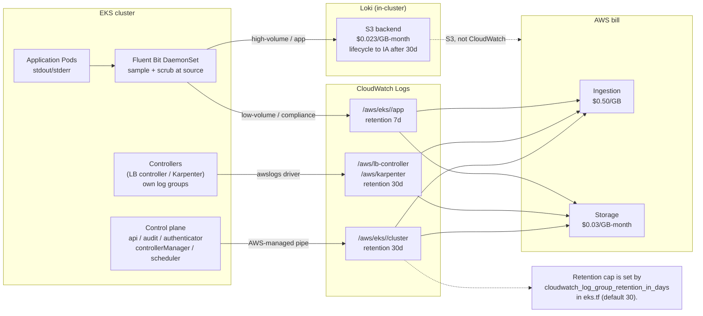

# 14.05 — Logging & metrics cost discipline

> CloudWatch Logs charges **$0.50/GB ingested** plus **$0.03/GB-month
> stored**, and a single chatty controller emitting debug logs into a
> log group with **no retention cap** is the canonical "the cluster
> cost more than the application this month" incident; the discipline
> is retention caps, cardinality control, Loki-vs-CloudWatch trade-offs,
> and the three cost levers (sample, scrub, retain) every platform
> needs to know about before the bill arrives.

**Estimated time:** ~30 min read · ~60 min hands-on
**Prerequisites:** [Part 14 ch.02](./02-eks-cluster-lifecycle.md) — EKS control-plane log streams enabled on the cluster · [Part 10 ch.05](../06-production-readiness/01-observability-metrics.md) — CloudWatch + Loki wiring you now must cost-tune · [Part 11 ch.04](../06-production-readiness/06-capacity-and-cost.md) — generic observability cost framing

**You'll know after this:** • understand CloudWatch Logs pricing ($0.50/GB ingest + $0.03/GB-month store) and where the runaway-cost incident lives · • set retention caps on every log group, including EKS control-plane streams · • choose between CloudWatch vs Loki for app logs based on access pattern · • apply the three cost levers (sample, scrub, retain) before the bill arrives · • debug metrics-cardinality blowups (label explosions, Prometheus series spikes) in production

<!-- tags: observability, cost, finops, cloud, day-2 -->

## Why this exists

The bookstore-platform tree at
[`../examples/bookstore-platform/terraform/`](../examples/bookstore-platform/terraform/)
turns on **five** EKS control-plane log streams in
[`eks.tf`](../examples/bookstore-platform/terraform/eks.tf) (`api`,
`audit`, `authenticator`, `controllerManager`, `scheduler`) and the
AWS Load Balancer Controller + Karpenter Helm releases each create
their own application log groups. On a quiet day this generates a few
hundred megabytes; on a busy day with a misbehaving controller in a
hot reconcile loop, a single log group can ingest **5-10 GB in 24 hours**.

Run that for a year with no retention cap and the math is unforgiving:

- 5 GB/day ingestion at $0.50/GB = $2.50/day = **$913/year** in
  ingestion charges *per log group*.
- Stored forever at $0.03/GB-month with 5 GB/day accumulation = 1.8
  TB after one year = **$54/month and rising** in storage charges
  *per log group*.

Multiply by the ~10 log groups an EKS-deployed platform typically
creates (control plane + LB controller + Karpenter + CoreDNS + each
managed addon + application namespaces shipped to CloudWatch via
Fluent Bit) and "CloudWatch ate my budget" stops being a meme. It is
the most common AWS bill-shock the bookstore platform owners hit
between cluster-up and the first finance review.

Phase 14-R closed the obvious gap: `eks.tf` line 51 sets
`cloudwatch_log_group_retention_in_days = var.cloudwatch_log_group_retention_in_days`
(default 30 days) on the EKS module, which propagates retention to
`/aws/eks/<CLUSTER>/cluster`. That single variable converts the
unbounded-growth scenario to a bounded one: at 30-day retention, the
storage line stops growing after a month and stabilizes at
`5 GB/day x 30 days x $0.03/GB-month = $4.50/month` per log group —
real money but predictable.

But retention is only the first lever. The other two — **sampling**
(drop high-volume low-value logs at the source) and **scrubbing**
(strip PII before it crosses an ingestion boundary) — are what
turn a $1000/month observability bill into a $200/month one. This
chapter is the lever-by-lever playbook against the bookstore-platform
tree.

[Part 06 ch.02](../06-production-readiness/02-logging.md)
introduced Prometheus + Grafana + Loki as the in-cluster observability
stack; the lesson there was **architecture** (the three pillars,
recording rules, label discipline). This chapter is the EKS-specific
**cost** overlay: which logs are worth keeping, which metrics are
worth scraping, and where the bill explodes if you don't watch the
cardinality.

> **In production:** Every log group an EKS cluster creates must have
> a retention cap set within the first 24 hours of the cluster's life.
> A log group with no `retention_in_days` set on the AWS side defaults
> to **Never expire** — and AWS has no "delete after a year" policy
> on top of that. A team that creates 10 unbounded log groups in
> January discovers in December that they've paid $600 in storage
> for logs nobody has read since February. The bookstore-platform
> tree's `cloudwatch_log_group_retention_in_days = 30` is the
> opinionated default; tighten to 7 for dev clusters, loosen to 90
> or 365 for compliance audits.

## Mental model

**Observability cost = (ingestion volume x ingestion price) +
(retained volume x storage price) + (metrics cardinality x storage
price). Three levers reduce each term: sample at the source, scrub
at the boundary, cap retention at the sink. Choose the right tool
per workload class — CloudWatch for the control plane, Loki/Mimir
for the application plane, Prometheus for metrics with disciplined
cardinality.**

The four dimensions of observability cost on EKS:

- **CloudWatch Logs — the EKS default, the bill default.**
  AWS-managed, no operational burden, but priced for managed
  convenience: $0.50/GB ingested + $0.03/GB-month stored. Every
  EKS control-plane log stream (`api`, `audit`, etc.) lands in
  CloudWatch by default. The audit log alone can hit several GB/day
  on a cluster with chatty operators. Use for: control plane,
  compliance retention, occasional debug. Don't use for: every Pod's
  stdout (too expensive at scale).
- **Loki — the in-cluster cost-efficient alternative.** Self-hosted,
  S3-backed object store, index-on-label (not on log content),
  significantly cheaper at scale (single-digit cents per GB stored
  on S3 vs $0.03/GB-month CloudWatch storage), but operationally
  heavier (you run the Loki Helm release; you manage compaction; you
  set up Grafana dashboards). Break-even is around 100 GB/month of
  ingested logs — below that, CloudWatch's managed convenience wins;
  above that, Loki pays for itself within a quarter.
- **Prometheus + cardinality.** Metrics are cheap per scrape, but
  **cardinality** (the number of unique label combinations) is the
  cost trap. A metric `http_requests_total` with three labels (5
  methods x 100 paths x 10 status codes) has 5,000 series; adding a
  `user_id` label with 10,000 unique users makes it **50 million
  series** — a single chart-level metric that fills a Prometheus
  instance's TSDB in minutes. The discipline: low-cardinality labels
  on every metric (request method, response status, route template —
  not user IDs, request IDs, full URL paths).
- **The three cost levers.** In rough order of leverage:
  1. **Sample at the source.** Drop debug logs in production; emit
     INFO and above. For metrics, scrape at 30s not 5s for non-SLO
     metrics. For traces, sample 1% of traffic + 100% of errors.
     Reduces ingestion 10-100x.
  2. **Scrub at the boundary.** Strip PII, drop high-cardinality
     fields, redact secrets. A Fluent Bit filter that drops the
     `authorization` header out of every request log costs nothing
     and cuts the compliance-audit-scope drastically.
  3. **Cap retention at the sink.** 30 days for operational, 90
     for compliance, 7 for dev. The retention cap is the *cheapest*
     lever (one Terraform variable) and the *highest* dollar-impact
     for retained storage; it does not reduce ingestion cost.

**CloudWatch vs Loki — the break-even chart.** A simple decision
chart for the application logging pipeline:

| Volume | Pick | Why |
|---|---|---|
| < 10 GB/month | CloudWatch | Managed; the ops time saved exceeds the cost differential. |
| 10-100 GB/month | Either | Decision is operational maturity, not cost. |
| > 100 GB/month | Loki on S3 | Cost differential exceeds Loki operational overhead. |
| Compliance-bound logs (audit) | CloudWatch | The 7-year retention story is easier; AWS handles the lifecycle. |
| Bursty application stdout | Loki | The cost-spike is bounded by your S3 storage class. |

The trap to keep in view: **the audit log goes to CloudWatch
forever unless you cap it**. The EKS `audit` log stream captures
every API request — `kubectl get pods` from a developer, every
controller's reconcile-loop list-watch, every Argo CD sync. A busy
cluster can emit 1-2 GB/day of audit. At default unbounded retention,
that's 30 GB after a month, 365 GB after a year, accumulating
forever. The 30-day cap turns this into a manageable line item;
extend to 90 or 365 only when the compliance team has signed off on
the bill.

## Diagrams

### Diagram A — the cost flow from controller stdout to AWS bill (Mermaid)



### Diagram B — cost-lever leverage table (ASCII)

```text
LEVER             COST IMPACT       LATENCY TO SAVINGS    OPS OVERHEAD     EXAMPLE
────────────────  ────────────────  ────────────────────  ───────────────  ──────────────────────────────
Retention cap     20-90% of stored  Stabilises after the  1 var, 1 apply   30d cap on /aws/eks/.../cluster
                  data after cap    cap window elapses                     turns infinite -> 30 day footprint
Sampling          90-99% of         Immediate             Fluent Bit cfg   Drop debug logs in prod;
                  ingested vol                            or app logger    100% errors + 1% info
Scrubbing         5-20% (small      Immediate             Fluent Bit cfg   Drop authorization header;
                  unless PII)                                              redact account numbers
CloudWatch -> Loki 70-90% of       Migration              Heavy initial    Apps to Loki; audit stays in
                  vol > 100GB/mo    project (1-2 weeks)   then steady      CloudWatch for compliance
Cardinality drop  100x metrics     Immediate              App-side label   Remove user_id label from
                  storage                                  scrubbing       http_requests_total
────────────────  ────────────────  ────────────────────  ───────────────  ──────────────────────────────
Order of attack:
  1. Cap retention (easiest, biggest stored-cost win)
  2. Drop debug logs in production (90% of stdout volume)
  3. Drop high-cardinality labels in metrics (Prometheus survives, you save TBs)
  4. Migrate apps to Loki if you're > 100 GB/month
```

## Hands-on with the Bookstore Platform

### 0. Prerequisites

- The bookstore-platform tree applied; cluster reachable via `kubectl`.
- AWS CLI v2 configured with permissions to read CloudWatch + Cost
  Explorer.
- A baseline: at least 48 hours of cluster activity so the log
  groups have some volume to inspect.

### 1. Inspect the log groups the cluster created

```bash
CLUSTER="$(terraform output -raw cluster_name)"
REGION="$(terraform output -raw region)"

# Every log group whose name starts with /aws/eks/<CLUSTER>.
aws logs describe-log-groups \
  --region "$REGION" \
  --log-group-name-prefix "/aws/eks/$CLUSTER" \
  --query 'logGroups[].{name:logGroupName,retention:retentionInDays,bytes:storedBytes}' \
  --output table
```

Sample output:

```text
-------------------------------------------------------------------------
|                         DescribeLogGroups                             |
+-----------------------------------------+-----------+-----------------+
|                  name                   | retention |     bytes       |
+-----------------------------------------+-----------+-----------------+
| /aws/eks/bookstore-platform/cluster     |   30      |   2147483648    |
+-----------------------------------------+-----------+-----------------+
```

Confirm `retention = 30`. If `retention = null`, the log group is
**never-expire** — the cluster was deployed without the Phase 14-R
retention variable set; fix it immediately:

```bash
aws logs put-retention-policy \
  --region "$REGION" \
  --log-group-name "/aws/eks/$CLUSTER/cluster" \
  --retention-in-days 30
```

### 2. Discover the unbounded log groups Terraform didn't create

```bash
# AWS Load Balancer Controller, Karpenter, addon log groups — auto-created
# by the controllers, NOT managed by Terraform. They often default to
# never-expire.
aws logs describe-log-groups \
  --region "$REGION" \
  --query 'logGroups[?retentionInDays==null].logGroupName' \
  --output table
```

Any log group in this list is bleeding money. Cap them:

```bash
# Bulk cap every unmanaged log group to 30 days.
aws logs describe-log-groups \
  --region "$REGION" \
  --query 'logGroups[?retentionInDays==null].logGroupName' \
  --output text | \
while read -r LG; do
  echo "Capping $LG to 30 days..."
  aws logs put-retention-policy \
    --region "$REGION" \
    --log-group-name "$LG" \
    --retention-in-days 30
done
```

Production note: the cap-script is a one-shot. The *durable* fix is
either a Terraform resource per log group (verbose but explicit) or
a `aws_cloudwatch_log_group` Terraform resource with a wildcard +
`for_each` that the addon discovers. Most teams pick the script-on-a-
cron approach (run weekly via the drift-check workflow in Part 14
ch.07, Phase 14b).

### 3. Measure ingestion volume per log group

```bash
# CloudWatch Metrics — IncomingBytes is the ingestion-cost metric.
# Sum over the last 7 days, grouped by log group.
END_TS="$(date -u +%Y-%m-%dT%H:%M:%S)"
START_TS="$(date -u -d '7 days ago' +%Y-%m-%dT%H:%M:%S)"

aws cloudwatch get-metric-statistics \
  --region "$REGION" \
  --namespace AWS/Logs \
  --metric-name IncomingBytes \
  --dimensions Name=LogGroupName,Value="/aws/eks/$CLUSTER/cluster" \
  --start-time "$START_TS" \
  --end-time "$END_TS" \
  --period 86400 \
  --statistics Sum \
  --query 'Datapoints[].{day:Timestamp,gb:Sum}' \
  --output table
```

Each `Sum` is bytes ingested that day; divide by `1024^3` for GB.
Multiply by $0.50/GB to estimate the daily ingestion line on the bill.
A healthy bookstore-platform cluster runs at ~200-500 MB/day per log
group; sustained values above 2 GB/day indicate a controller in a hot
reconcile loop and demand investigation.

### 4. Find the chatty controller

```bash
# Find the noisiest log stream in the audit log group.
aws logs describe-log-streams \
  --region "$REGION" \
  --log-group-name "/aws/eks/$CLUSTER/cluster" \
  --order-by LastEventTime \
  --descending \
  --max-items 10 \
  --query 'logStreams[].{name:logStreamName,size:storedBytes}' \
  --output table

# Tail the audit log for one minute to spot the chatty caller.
aws logs tail "/aws/eks/$CLUSTER/cluster" \
  --region "$REGION" \
  --since 1m \
  --filter-pattern '{ $.user.username = "*" }' \
  --format short | \
  jq -r 'select(.user) | .user.username' | \
  sort | uniq -c | sort -rn | head
```

Sample output:

```text
   8421 system:serviceaccount:karpenter:karpenter
   3104 system:serviceaccount:kube-system:aws-node
    421 system:serviceaccount:argocd:argocd-application-controller
     12 arn:aws:iam::<ACCOUNT_ID>:user/<USER>
```

A normal Karpenter list-watch is high-volume but bounded; a Karpenter
emitting 100k+ audit events per hour is in a reconcile loop and the
fix is usually a misconfigured `NodePool` or a CRD version mismatch
(see Part 10 ch.06's Karpenter debug runbook).

### 5. Set a CloudWatch alarm on ingestion volume

```bash
# Alarm when daily ingestion exceeds 5 GB on the audit log.
aws cloudwatch put-metric-alarm \
  --region "$REGION" \
  --alarm-name "${CLUSTER}-cluster-log-volume-high" \
  --alarm-description "EKS cluster log ingestion above 5 GB/day" \
  --metric-name IncomingBytes \
  --namespace AWS/Logs \
  --statistic Sum \
  --period 86400 \
  --evaluation-periods 1 \
  --threshold 5368709120 \
  --comparison-operator GreaterThanThreshold \
  --dimensions Name=LogGroupName,Value="/aws/eks/$CLUSTER/cluster" \
  --alarm-actions "$(terraform output -raw budget_alarm_sns_topic_arn 2>/dev/null || echo '')"
```

This alarm reuses the SNS topic that Phase 14-R's `cost-budgets.tf`
provisions when `enable_budget_alarm = true`. If you haven't enabled
the budget alarm yet, the topic doesn't exist; either enable it
(Part 14 ch.06 walks through that) or create an SNS topic explicitly
for log-volume alerts.

### 6. Migrate application logs to Loki

The application namespaces in the bookstore-platform tree currently
ship to CloudWatch via the EKS-default Fluent Bit DaemonSet. For
non-compliance-bound app logs, route them to Loki instead:

```sh
# Install Loki (pinned) for the cost-efficient ingestion path.
LOKI_VERSION="6.18.0"

helm repo add grafana https://grafana.github.io/helm-charts
helm repo update

helm install loki grafana/loki \
  --version "$LOKI_VERSION" \
  -n logging --create-namespace --wait \
  --set 'loki.auth_enabled=false' \
  --set 'loki.storage.type=s3' \
  --set "loki.storage.s3.bucketnames=<LOKI_BUCKET_NAME>" \
  --set "loki.storage.s3.region=$REGION" \
  --set 'singleBinary.replicas=1' \
  --set 'minio.enabled=false'

# Update Fluent Bit to route the apps namespaces to Loki, control plane
# remains on CloudWatch. The config map (excerpt):
cat <<EOF
[OUTPUT]
    Name        loki
    Match       kube.var.log.containers.*_bookstore-platform-*_*.log
    host        loki-gateway.logging.svc.cluster.local
    port        80
    labels      job=fluent-bit,cluster=$CLUSTER

[OUTPUT]
    Name        cloudwatch_logs
    Match       kube.var.log.containers.*_kube-system_*.log
    region      $REGION
    log_group_name /aws/eks/$CLUSTER/system
    log_stream_prefix fluentbit-
    auto_create_group true
EOF
```

The split (apps to Loki, system to CloudWatch) is the canonical
cost-driven shape: apps generate 90%+ of the volume and have soft
retention requirements; system logs are low-volume but audit-bound.

### 7. Audit the metrics cardinality before it explodes

```bash
# In a Prometheus-equipped cluster (Part 06 ch.01), find the top-N
# highest-cardinality metrics.
kubectl -n prometheus-system port-forward svc/kube-prometheus-stack-prometheus 9090:9090 &

# topk(10, count by (__name__)({__name__=~".+"}))
curl -s 'http://localhost:9090/api/v1/query' \
  --data-urlencode 'query=topk(10, count by (__name__)({__name__=~".+"}))' | \
  jq -r '.data.result[] | "\(.value[1]) series  \(.metric.__name__)"' | sort -rn | head
```

Sample output:

```text
 1842000 series  http_requests_total
  421000 series  container_network_receive_bytes_total
  315000 series  apiserver_request_duration_seconds_bucket
   52000 series  kube_pod_status_phase
```

A metric with 1.8 million series is almost certainly carrying a
high-cardinality label (user_id, request_id, full URL path). Find
the offending label:

```bash
curl -s 'http://localhost:9090/api/v1/query' \
  --data-urlencode 'query=count(http_requests_total) by (__name__, route)' | \
  jq '.data.result | length'
```

A `route` label with 50,000+ unique values is the smoking gun — the
application is exporting one series per *exact URL path* instead of
per *route template* (`/users/123` vs `/users/{id}`). The fix lives
in the app's metrics exporter; Prometheus cannot fix this at scrape
time.

## How it works under the hood

**CloudWatch Logs pricing — the per-byte math.** AWS charges in two
dimensions:

- **Ingestion** — $0.50/GB at GA prices (us-east-1; other regions are
  the same or +5-10%). Calculated on the *raw* JSON event size at
  ingest time. Compression at storage is on top; you do not benefit
  from your application emitting compact log lines except for the
  ingestion-byte-count.
- **Storage** — $0.03/GB-month on the *post-compression* footprint.
  CloudWatch compresses on store (~7-10x typical). A 30 GB ingestion
  in a month leaves ~3-4 GB on disk; storage cost is on the 3-4 GB.

The cost formula for a single log group, simplified:

```
month_cost = ingest_GB * 0.50         # one-shot ingestion
           + stored_GB * 0.03         # per month, for the retention window
```

For the EKS audit log at 2 GB/day raw, 30-day retention:

```
ingest = 60 GB/month * 0.50 = $30/month
stored = ~8 GB on disk * 0.03 = $0.24/month
total  = ~$30.24/month
```

The ingestion line dominates; storage is round-off. **The leverage
is in reducing ingestion volume** (sampling, scrubbing); retention
caps only constrain the stored term.

**The "Never expire" default explained.** CloudWatch log groups are
created with `retentionInDays = null` unless explicitly set. AWS does
not impose a global retention; you pay storage forever. This is by
design (some workloads need 7-year retention), but it is also the
single most common cost trap. The `retentionInDays` API field is the
one knob; setting it to a number (`1`, `7`, `30`, `90`, `365`, etc.)
schedules a background job that deletes events older than the cap.
The deletion is asynchronous (AWS sometimes takes 24-72 hours after
the cap elapses to actually delete), but the billing aligns with the
cap immediately.

**Loki's cost shape — S3 economics.** Loki stores log "chunks"
(compressed batches of N MB of logs from M streams) and an index
that maps `{labels}` to chunk references. Both go to S3 by default:

- **S3 Standard storage** — $0.023/GB-month for the first 50 TB.
- **S3 Standard-IA** — $0.0125/GB-month for objects rarely accessed
  (lifecycle to IA after 30 days saves ~50% on aging data).
- **S3 Intelligent-Tiering** — automatic; recommended for unknown
  access patterns.

A Loki deployment ingesting 100 GB/month and retaining 30 days
costs approximately:

```
S3 standard storage: 100 GB * 0.023 = $2.30/month
PUT requests: ~1M * $0.005/1K = $5/month
GET requests on query: ~100k * $0.0004/1K = $0.04/month
Compute (Loki itself in-cluster): 0.5 CPU + 1 GB RAM = ~$15/month
Total: ~$22/month
```

vs CloudWatch at the same volume: `100 * 0.50 = $50/month` ingestion
alone, plus storage. Loki breaks even at ~20 GB/month ingestion and
saves significant money above 100 GB.

**Prometheus cardinality — why one label can break everything.**
Prometheus's TSDB stores one *series* per unique label-combination.
Each series carries: a 16-byte hash, a label-name+value-pair-set, and
a chunk-pointer array. The fixed-cost-per-series is roughly **3 KB
in RAM** + several hundred bytes on disk; 1 million series therefore
costs ~3 GB RAM and ~500 MB disk per day. Crossing 10 million
series typically OOMs the Prometheus Pod.

The cardinality killers in order:

1. `user_id`, `customer_id`, `account_id` — unbounded; never on a
   per-request metric.
2. `request_id`, `trace_id` — unbounded; never on any metric (these
   belong on logs/traces).
3. Full URL paths — unbounded if the app exports `/users/123` not
   `/users/{id}`.
4. IP addresses — bounded but huge (billions of v4 addresses).
5. Free-form `error_message` labels — unbounded.

The discipline lives in the application's metrics exporter, not in
Prometheus. Use `route` templates not exact paths; use `error_code`
classifications not message strings; never put user/request IDs on
metrics.

**Sampling vs scrubbing vs retention — the three levers' mechanics.**

- **Sampling at the source** (the app emits less): the application
  configures its logger to drop DEBUG in production; an OpenTelemetry
  SDK samples at 1% via the `TracesSampler` config. Cost reduction
  multiplicative on every line that doesn't get emitted.
- **Sampling at the pipe** (Fluent Bit drops): a `[FILTER]` block
  that does `Regex` match-and-exclude on common-uninteresting log
  shapes. Less common — usually the source is easier to control.
- **Scrubbing** (the same volume, but smaller per line): Fluent Bit
  `modify` filter strips PII fields; the line still ships but is
  10-50% smaller. Tiny dollar impact unless lines were enormous;
  large compliance-scope impact (no PII in CloudWatch keeps you
  out of GDPR/HIPAA evaluation for that log group).
- **Retention** at the sink: the log/storage lifecycle policy.
  Doesn't reduce ingestion (which is paid before retention applies);
  reduces stored cost only.

## Production notes

> **In production:** Cap retention on every log group within 24 hours
> of the cluster's first apply, including the AWS-managed ones the
> EKS service auto-creates (LB controller, addon logs). The
> `aws logs describe-log-groups --query 'logGroups[?retentionInDays==null]'`
> query is the canonical drift check — schedule it weekly via the
> Phase 14b ch.07 drift workflow and alert on any never-expire group.

> **In production:** Drop debug logs in production at the application
> level, not at the Fluent Bit level. The Bookstore Go services use
> structured logging with a `LOG_LEVEL=info` env in production
> manifests; the Helm chart's `values-prod.yaml` enforces it. A
> developer setting `LOG_LEVEL=debug` to chase a bug in production
> burns money for every second they forget to revert; a CI policy that
> rejects PRs setting debug in production manifests is the durable
> defense.

> **In production:** Watch out for the "trace-id label on metrics"
> antipattern. New developers, accustomed to logs-and-traces having
> a trace ID, often add `trace_id` as a metric label "for correlation."
> This is the cardinality bomb. Prometheus's TSDB will not fit a
> per-request label; the metric goes to several million series within
> hours and the Pod OOMs. The fix is the code review — `trace_id`
> belongs on logs (Fluent Bit sends it to Loki + CloudWatch) and
> traces (Tempo), never on metrics.

> **In production:** The Karpenter audit-log volume problem. Karpenter
> aggressively list-watches `Node`, `NodeClaim`, `Pod` resources;
> every list-watch is an audit event. A cluster with 200 nodes can
> easily emit 5-10 GB/day of audit just from Karpenter's reconcile
> traffic. The mitigation is an audit-policy that excludes specific
> system service accounts from audit logging — file an exclusion for
> `system:serviceaccount:karpenter:karpenter` on `get`/`list`/`watch`
> verbs against `nodes`/`nodeclaims`/`pods`. EKS exposes this via
> the `cluster.audit_policy` field on newer cluster versions; check
> what your version supports.

> **In production:** S3 lifecycle on Loki chunks is non-optional. A
> Loki bucket without `transition to Standard-IA after 30 days +
> Glacier Deep Archive after 90 days + delete after 365 days` retains
> every chunk at standard storage indefinitely. The Helm chart
> documentation calls this out; the practice often slips. The
> `examples/bookstore-platform/terraform/loki.tf` (if you've added
> Loki via Terraform) should include an
> `aws_s3_bucket_lifecycle_configuration` resource explicitly.

> **In production:** Cardinality alerting beats post-hoc forensics.
> Prometheus's own `prometheus_tsdb_head_series` metric exposes the
> total series count; alarm on rapid growth (`rate(...[1h]) > 10000`)
> and you catch a new label rollout before the TSDB fills. The
> bookstore-platform's
> `examples/bookstore-platform/cost/opencost-tenant-aggregations.yaml`
> includes a `PrometheusCardinalityHigh` alert as a template — copy
> it to your cluster's PrometheusRule.

> **In production:** Compliance retention is a different problem
> from operational retention. Audit logs that an auditor asks for
> in year 7 are a separate stream from the operational logs you
> read this week. The pattern: 30-day operational retention in
> CloudWatch, plus a once-daily S3 export of the audit log group to
> a separate, cheap, write-once bucket with 7-year retention. AWS
> exposes this via the CloudWatch Logs `aws logs create-export-task`
> API or via subscription filters to Kinesis Firehose to S3.

## Quick Reference

```bash
# Cap retention on every unmanaged log group (drift script).
aws logs describe-log-groups \
  --region "$REGION" \
  --query 'logGroups[?retentionInDays==null].logGroupName' \
  --output text | \
while read -r LG; do
  aws logs put-retention-policy --region "$REGION" \
    --log-group-name "$LG" --retention-in-days 30
done

# Daily ingestion volume per log group (the cost-driver metric).
aws cloudwatch get-metric-statistics --region "$REGION" \
  --namespace AWS/Logs --metric-name IncomingBytes \
  --dimensions Name=LogGroupName,Value="/aws/eks/$CLUSTER/cluster" \
  --start-time "$(date -u -d '7 days ago' +%Y-%m-%dT%H:%M:%S)" \
  --end-time "$(date -u +%Y-%m-%dT%H:%M:%S)" \
  --period 86400 --statistics Sum

# Top-cardinality metrics in Prometheus.
curl -s 'http://localhost:9090/api/v1/query' \
  --data-urlencode 'query=topk(10, count by (__name__)({__name__=~".+"}))'

# Alarm on log-volume spike.
aws cloudwatch put-metric-alarm --alarm-name "${CLUSTER}-log-volume-high" \
  --metric-name IncomingBytes --namespace AWS/Logs --statistic Sum \
  --period 86400 --evaluation-periods 1 --threshold 5368709120 \
  --comparison-operator GreaterThanThreshold \
  --dimensions Name=LogGroupName,Value="/aws/eks/$CLUSTER/cluster"
```

Minimal skeleton — Fluent Bit OUTPUT config that splits apps to Loki +
system to CloudWatch:

```yaml
# fluent-bit-config.yaml — excerpt
apiVersion: v1
kind: ConfigMap
metadata:
  name: <NAME>
  namespace: logging
data:
  fluent-bit.conf: |
    [OUTPUT]
        Name        loki
        Match       kube.var.log.containers.*_bookstore-platform-*_*.log
        host        loki-gateway.logging.svc.cluster.local
        labels      cluster=<CLUSTER_NAME>,job=fluent-bit

    [OUTPUT]
        Name        cloudwatch_logs
        Match       kube.var.log.containers.*_kube-system_*.log
        region      <REGION>
        log_group_name /aws/eks/<CLUSTER>/system
        log_retention_days 30
        auto_create_group true
```

Cost-discipline checklist (the bill is bounded when all six are yes):

- [ ] Every log group has `retentionInDays` set (no never-expire).
- [ ] The control-plane audit log is < 5 GB/day (alarm if exceeded).
- [ ] Application logs > 100 GB/month route to Loki, not CloudWatch.
- [ ] No metric carries `user_id`, `request_id`, or `trace_id` labels.
- [ ] Production app log level is INFO (never DEBUG outside dev).
- [ ] Compliance-bound logs export daily to a separate 7-year bucket.

## Test your understanding

> Try each before opening the answer drawer. The act of trying is the exercise; the answer is the check.

1. **What are the three cost levers (sample, scrub, retain) and in what order do they have the most leverage?**
   <details><summary>Show answer</summary>

   **Sample at the source** has the highest ingestion-cost leverage — dropping DEBUG logs in prod or scraping at 30s instead of 5s reduces ingestion 10-100x. **Scrub at the boundary** strips PII / high-cardinality fields before they cross an ingestion boundary; bounded cost saving but huge compliance-scope reduction. **Cap retention at the sink** is the cheapest lever (one Terraform variable) and the highest dollar-impact for *storage* costs but doesn't reduce ingestion. Order matters: sample first (kills volume), scrub second (kills compliance scope), retain third (caps the accumulator).

   </details>

2. **Finance flags a CloudWatch bill of $400/month for one cluster. You inherit it, run `aws logs describe-log-groups`, and see 12 log groups with `retentionInDays: null`. What do you do first, and what's the trap with rushing the fix?**
   <details><summary>Show answer</summary>

   The unbounded log groups have been accumulating since cluster creation — storage cost dominates ingestion at this point. The fix is to set `retention_in_days` (via Terraform if managed, `aws logs put-retention-policy` if not) for each group; AWS will then begin expiring logs older than the cap on the next cycle. The trap: if any of those logs are compliance-bound (audit logs for SOC2/HIPAA), you can't just slap 7-day retention on them — coordinate with the compliance team, set the audit log to 90/365 days, and route a daily export to a cheaper S3 lifecycle-managed bucket. The bill drops within days; the compliance posture stays intact.

   </details>

3. **A developer adds `user_id` as a label on `http_requests_total` so the Grafana dashboard can break down latency by user. Two weeks later, Prometheus is OOMKilling. Why?**
   <details><summary>Show answer</summary>

   Cardinality explosion. Prometheus stores one series per unique label-combination; adding a `user_id` label with 10,000 distinct users multiplies the existing series count by 10,000. A metric that was 5,000 series becomes 50,000,000 series — TSDB head series counts in the millions cause the WAL to grow unbounded and the head-block memory blows the Pod's `requests.memory`. The fix is removing the `user_id` label (use traces / exemplars / logs for per-user investigation), or moving the high-cardinality dimension to a sampled trace path. The chapter's discipline: never put user_id, request_id, trace_id, full URL paths on a Prometheus label.

   </details>

4. **Hands-on extension — at midnight, set the `audit` log stream's retention to `Never expire` (just to see), then run a `kubectl get pods --all-namespaces -w` for 30 minutes. Check ingestion the next day.**
   <details><summary>What you should see</summary>

   The `watch` is a continuous list-watch against the apiserver; every event lands in the audit log. 30 minutes of watching with a busy cluster easily produces 50-100 MB of audit-log volume — at $0.50/GB ingested that's $0.025-$0.05 from one operator's terminal. Multiply by every Argo CD controller's reconcile-loop list-watch, every Karpenter scheduler watch, every Falco rule watcher running on the cluster 24/7, and you understand why the audit log alone can hit several GB/day. Re-cap retention to 30 days when done.

   </details>

## Further reading

- **AWS CloudWatch Logs pricing**
  <https://aws.amazon.com/cloudwatch/pricing/>; the canonical source
  for the $0.50/GB ingestion + $0.03/GB-month storage rates this
  chapter cites; region-specific variants live in the same doc.
- **Grafana Loki TCO**
  <https://grafana.com/blog/2024/03/12/the-concise-guide-to-loki-the-cost-saving-techniques/>;
  the canonical Grafana blog covering the S3-backed economics this
  chapter quotes.
- **AWS — CloudWatch Logs retention policy API**
  <https://docs.aws.amazon.com/AmazonCloudWatch/latest/logs/Working-with-log-groups-and-streams.html>;
  the `put-retention-policy` reference, including the "Never expire"
  default this chapter warns about.
- **Prometheus — high cardinality counters**
  <https://prometheus.io/docs/practices/naming/>; the upstream label-
  cardinality discipline that prevents the TSDB-OOM failure mode.
- **Beyer et al., *Site Reliability Engineering* ch.6 — Monitoring**;
  the four golden signals + the cardinality-budget mental model this
  chapter operationalizes for EKS.
- **Fluent Bit — modify and grep filters**
  <https://docs.fluentbit.io/manual/pipeline/filters>; the scrubbing
  + sampling primitives the Fluent Bit DaemonSet implements at the
  Pod-to-sink boundary.
- **AWS blog — Optimizing Amazon CloudWatch Logs costs**
  <https://aws.amazon.com/blogs/mt/optimizing-amazon-cloudwatch-logs-costs/>;
  the AWS-team-authored complement to this chapter's "three levers"
  framing.
