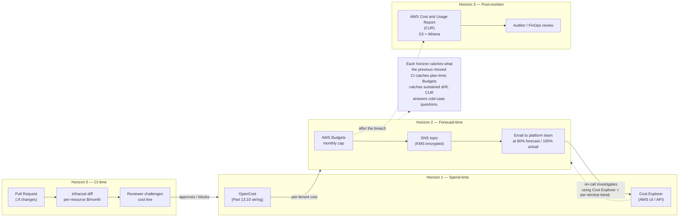

# 14.06 — Cost guardrails

> Three tiers of cost visibility every EKS platform needs: **AWS
> Budgets** for the after-the-fact alarm ("you spent $5,000 this
> month"), **Cost Explorer** for the post-mortem analysis ("which
> service?"), and **OpenCost** for the inside-the-cluster per-tenant
> breakdown ("which namespace? which tenant?"); plus the CI-side
> guardrail (`infracost diff` on every PR) that catches a
> 50-NAT-gateway plan before it merges.

**Estimated time:** ~30 min read · ~60 min hands-on
**Prerequisites:** [Part 14 ch.05](./05-logging-and-metrics-cost.md) — observability is the largest variable-cost line · [Part 11 ch.04](../06-production-readiness/06-capacity-and-cost.md) — multi-tenant cost framing · [Part 13 ch.01](../13-grand-capstone-bookstore-platform/01-bookstore-2-from-toy-to-platform.md) — bookstore tree whose cost you'll guardrail

**You'll know after this:** • understand the three tiers of cost visibility (AWS Budgets, Cost Explorer, OpenCost) and which question each one answers · • configure AWS Budgets alarms before the monthly invoice ships · • deploy OpenCost for inside-cluster per-namespace + per-tenant breakdown · • wire `infracost diff` into PR CI so a 50-NAT-gateway plan blocks before merge · • choose between cost allocation tags and OpenCost labels for chargeback

<!-- tags: cost, finops, cloud, day-2, platform-engineering -->

## Why this exists

The bookstore-platform tree at
[`../examples/bookstore-platform/terraform/`](../examples/bookstore-platform/terraform/)
spends real money the moment `terraform apply` finishes: the EKS
control plane at ~$73/month, the NAT gateway at ~$32/month, the two
managed-node-group `t3.medium` instances at ~$60/month between them,
plus the EBS volumes, the load balancer, the CloudWatch logs, and
whatever Karpenter provisions on demand. An idle cluster sits at
**~$150-200/month**; a busy one with sustained Karpenter scaling
can hit **$500-1000/month** for the cluster itself, before
applications add a single dollar of compute.

That's the baseline. The cost-bug shape — the one that surprises
every team eventually — is the *new* cost line that wasn't there
yesterday:

- A PR adds an `aws_nat_gateway` per AZ in three AZs — three NAT
  gateways at $0.045/hr each = **$97/month** new line.
- A misconfigured Karpenter `NodePool` provisions an on-demand
  `m5.24xlarge` ($4.61/hr) because the spot pool ran out of capacity
  and the user didn't set `weight` correctly — **$3,300/month** if
  it runs unattended for a week.
- An OpenSearch domain a team spun up for "quick analytics" at
  `r6g.4xlarge.search` x 3 nodes — **$3,500/month** that nobody on
  the platform team knew about until the bill arrived.

The platform team's job is to catch each of these before the bill,
not after. AWS exposes three primitives for that, each operating at
a different time horizon and granularity:

1. **AWS Budgets** — the alarm bell. Set a monthly cap; AWS notifies
   you at 80% (forecasted breach) and 100% (actual breach). Catches
   the cumulative drift. Free for the first 2 budgets per account
   ($0.02/budget/day thereafter); the bookstore-platform tree's
   `cost-budgets.tf` (Phase 14-R) sets up one budget that lands in
   the free tier.
2. **AWS Cost Explorer** — the forensic tool. Groupable by service,
   tag, AZ, account; the place where you answer "what spent the
   money?" after the alarm. No code-level setup; enabled per
   account; UI-driven (with an API for export).
3. **OpenCost** — the in-cluster, per-tenant cost view. Reads
   Prometheus + the cloud's billing source; aggregates by namespace,
   workload, label. Already shipped in Part 13 ch.10 for multi-tenant
   showback; this chapter wires it into AWS Budgets so a tenant
   exceeding their slice triggers the same alarm bell.

The fourth tier, often missed: **CI-time cost diff**. `infracost`
runs `terraform plan` and produces a line-item cost diff per pull
request. The PR that adds three NAT gateways shows up as
`+$97/month` in the PR description; the reviewer can challenge it
*before* it merges. The bookstore-platform tree's `make plan-cost`
target wires this in.

[Part 12 ch.08](../12-kubernetes-for-machine-learning/08-ml-platform-cost-and-mlops.md)
introduced OpenCost in the ML-platform context (GPU $/hr economics,
spot-vs-on-demand). [Part 13 ch.10](../13-grand-capstone-bookstore-platform/10-cost-opencost-per-tenant-finops.md)
deepened it for the multi-tenant case with per-tenant showback,
budget breach alerts, and the FinOps Foundation framework. This
chapter is the **EKS production guardrails** layer — the AWS Budgets
+ infracost + Cost Explorer trio that wraps OpenCost and turns
"visibility" into "alarms that fire before the bill arrives."

> **In production:** Every account running EKS gets at least one AWS
> budget within the first day. The bookstore-platform tree's
> `enable_budget_alarm = true` flips the alarm on, sends a single
> email when the monthly burn rate projects beyond 80% of the cap,
> and costs nothing (the first 2 budgets per account are free). The
> teams that learn this lesson the hard way are the ones whose first
> AWS bill at $11,000 arrives in the company CFO's inbox before the
> platform team has dashboards built.

## Mental model

**Cost guardrails are layered defenses with four time horizons:
CI-time (infracost on PR, blocks the bad plan), spend-time (Cost
Explorer + OpenCost, tells you what's running right now), forecast-
time (AWS Budgets, alarms when projected to breach), and post-mortem
(Cost and Usage Report, the after-the-fact forensic record). Each
horizon catches what the previous missed; the four together prevent
the bill-shock incident.**

The four-horizon framework:

- **Horizon 0 — CI-time.** `infracost diff` runs in the
  PR workflow against the Terraform plan; outputs a per-resource
  $/month delta. A PR that adds a $3,500/month OpenSearch cluster
  shows up as a cost change in the PR description. The
  bookstore-platform's `make plan-cost` (Phase 14-R) runs this
  locally; the `.github/workflows/terraform.yml` (Phase 14-R) wires
  it into CI. **Prevents** the "we didn't know it would cost that
  much" incident.
- **Horizon 1 — Spend-time.** OpenCost (already wired in Part 13
  ch.10) shows the per-namespace, per-tenant cost in near-real-time
  (5-minute lag from Prometheus scrape). Cost Explorer shows the
  per-AWS-service cost in 24-hour lag. **Tells you** what's running
  *right now* and what each pod/tenant/service is costing.
- **Horizon 2 — Forecast-time.** AWS Budgets evaluates every ~3
  hours and projects the monthly burn against the cap. If the burn
  rate at day 10 of the month projects $4,500 against a $5,000 cap,
  the forecast alarm fires at the projected 80% threshold — *before*
  the breach. **Catches** sustained-over-budget growth before
  month-end.
- **Horizon 3 — Post-mortem.** AWS Cost and Usage Report (CUR) is
  the canonical billing record: line-item, per-hour, per-resource,
  per-tag. Exported to S3 daily; readable by Athena. **Answers**
  questions the dashboards can't ("what *exactly* did account X
  cost on April 5th, broken out by every IAM role that touched
  spend").

**The three OpenCost dimensions every multi-tenant platform owns
on day one:**

| Dimension | Question it answers | Where it shows up |
|---|---|---|
| Per-namespace | "What does cluster-monitoring cost?" | OpenCost UI, default view |
| Per-tenant (label) | "What does acme-books cost us?" | OpenCost Allocation API + label aggregation |
| Per-workload-class | "How much do we spend on ML training vs request serving vs idle capacity?" | Grafana pie chart from recording rule |

The platform owns per-namespace and per-tenant from day one (the
Part 13 ch.10 wiring); per-workload-class is the next step (a
small label-policy enforced at admission).

**Showback vs chargeback — the timing decision.** Showback says
"here's what you used; we're not invoicing." Chargeback says
"here's the bill; pay it." The decision is not technical (both
work the same way); it is **trust**. Showback for at least a
quarter: tenants see the numbers, dispute the mapping (which they
*will*), fix the labels. Chargeback when disputes go to zero. The
Bookstore Platform ships in showback mode; the chargeback flip is
a project-management decision, not a technical one.

The trap to keep in view: **the alarm without a runbook is noise**.
A 3am AWS Budgets email reading "you are at 80% of your monthly
cap" is not actionable unless the on-call has a runbook: "open
Cost Explorer, group by service, group by tag, find the new line,
notify the owner, decide tag/kill/scale-down within 1 hour." The
bookstore-platform tree's `cost-budgets.tf` ships the alarm; this
chapter ships the runbook.

## Diagrams

### Diagram A — the four cost-control horizons (Mermaid)



### Diagram B — the cost-stack and where each tool sits (ASCII)

```text
LAYER                        TOOL                       SOURCE                         GRANULARITY
───────────────────────────  ─────────────────────────  ─────────────────────────────  ─────────────────
Plan-time (pre-apply)        infracost                  terraform plan -json           per-resource $/mo
Per-tenant in-cluster        OpenCost                   Prometheus + cloud billing     per-namespace,
                                                                                       per-label, per-pod
Per-AWS-service              Cost Explorer              AWS billing service            per-service,
                                                                                       per-tag, per-AZ
Forecast alarm               AWS Budgets                billing service + forecast     monthly cap;
                                                                                       80% + 100% events
Forensic / audit             Cost and Usage Report      S3 daily export + Athena       per-hour,
                                                                                       per-resource-ARN
───────────────────────────  ─────────────────────────  ─────────────────────────────  ─────────────────
Cost of each:
  infracost                  free (CLI + CI); SaaS dashboard tier paid (not required)
  OpenCost                   free (self-hosted compute cost only — ~0.5 CPU + 1 GB RAM)
  Cost Explorer              free for the UI; $0.01/request to the API
  AWS Budgets                first 2 budgets/account free; $0.02/budget/day thereafter
  Cost and Usage Report      free to generate; S3 storage at $0.023/GB-month
```

## Hands-on with the Bookstore Platform

### 0. Prerequisites

- The bookstore-platform tree applied; cluster reachable via `kubectl`.
- AWS CLI v2 configured with permissions to read Budgets, Cost
  Explorer, and Cost and Usage Report.
- `infracost` installed locally (`brew install infracost` or
  `curl https://infracost.io/install.sh | sh`). First run requires
  `infracost auth login` — free, no credit card needed.
- OpenCost installed per [Part 13 ch.10](../13-grand-capstone-bookstore-platform/10-cost-opencost-per-tenant-finops.md)
  (the chapter ships the install + per-tenant aggregation).

### 1. Enable the AWS Budget alarm

The `cost-budgets.tf` Terraform from Phase 14-R is gated by
`enable_budget_alarm = false` (default). Flip it on:

```bash
cd examples/bookstore-platform/terraform

# Edit example.tfvars (or pass on the command line):
cat <<EOF >> example.tfvars
enable_budget_alarm = true
monthly_budget_usd  = 200
budget_alarm_email  = "<PLATFORM_TEAM_EMAIL>"
EOF

terraform plan -var-file=example.tfvars -out=budget-plan.tfplan
terraform apply budget-plan.tfplan
```

The apply creates:

- `aws_budgets_budget.monthly_cost` — the $200/month cap with two
  notifications (80% forecast, 100% actual).
- `aws_sns_topic.budget_alarms` — KMS-encrypted SNS topic for the
  notifications.
- `aws_sns_topic_subscription.budget_alarm_email` — email subscription
  to the address in `budget_alarm_email`.

**AWS sends a confirmation email** within minutes; click the link to
activate the subscription. Until you click, no emails flow. The
confirmation URL is region-specific and time-limited (~7 days); if
you miss it, re-trigger the subscription via the AWS console (SNS →
Subscriptions → Resend confirmation).

### 2. Test the alarm with a forced breach

A budget at $200 won't breach on a baseline cluster. To test the
plumbing:

```bash
# Temporarily reduce the cap to a value below current spend.
terraform apply -var-file=example.tfvars \
  -var='monthly_budget_usd=10' -auto-approve

# Wait ~3 hours (Budgets evaluates on a slow cadence). The alarm will
# fire because actual spend > $10.
# Check status via:
aws budgets describe-budget \
  --account-id "$(aws sts get-caller-identity --query Account --output text)" \
  --budget-name "$(terraform output -raw cluster_name)-monthly-cost"
```

After confirming the alarm fired (an email arrives within 3-6 hours
of the breach), restore the cap:

```bash
terraform apply -var-file=example.tfvars \
  -var='monthly_budget_usd=200' -auto-approve
```

### 3. Run `infracost` against a real plan diff

The `make plan-cost` target (Phase 14-R) runs `terraform plan` and
pipes through `infracost`. To see it work, propose a cost-increasing
change:

```bash
cat <<'EOF' > /tmp/scale-up.tfvars
# Hypothetical: enable Graviton + VPC endpoints + Velero + Falco
enable_vpc_endpoints  = true
enable_graviton_pool  = true
enable_velero         = true
enable_falco          = true
EOF

# Run the cost-aware plan (use plan-cost target so infracost picks it up).
make plan-cost VAR_FILE=/tmp/scale-up.tfvars

# OR equivalently, by hand:
terraform plan -var-file=/tmp/scale-up.tfvars -out=tfplan.binary
terraform show -json tfplan.binary > tfplan.json
infracost breakdown --path tfplan.json --show-skipped
```

Sample output:

```text
 Name                                                Monthly Qty  Unit                   Monthly Cost

 aws_vpc_endpoint.interface["ecr.api"]
   Per-hour endpoint                                       730    hours                       $7.30
   Data processed                                            ~     GB                          —

 aws_vpc_endpoint.interface["ecr.dkr"]
   Per-hour endpoint                                       730    hours                       $7.30
   Data processed                                            ~     GB                          —

 (similar lines for sts, ec2, logs, kms — 5 more endpoints x $7.30 = $36.50)

 module.eks.aws_eks_addon["aws-ebs-csi-driver"]
   (no additional)                                          —      —                          $0.00

 OVERALL TOTAL                                                                                $51.10
```

This output goes into the PR description via the `infracost comment`
subcommand (the CI workflow runs `infracost comment github`); the
reviewer sees `+$51.10/month` next to the `enable_vpc_endpoints =
true` change and accepts the trade explicitly. The discipline is
**no surprise cost line lands on main**.

### 4. Enable Cost Explorer + tag your resources

Cost Explorer is enabled per-account, not per-resource. Through the
AWS console: **Billing & Cost Management → Cost Explorer → Enable
Cost Explorer**. The data backfills 12 months.

For tag-based grouping (the way you separate `dev` vs `prod` vs
per-tenant cost), activate cost-allocation tags:

```bash
# List tags AWS sees on your resources.
aws ce list-cost-allocation-tags \
  --status Inactive --output text | head -20

# Activate the tags the bookstore-platform tree adds (Environment,
# Cluster, Tenant, etc.).
aws ce update-cost-allocation-tags-status --cost-allocation-tags-status \
  '[{"TagKey":"Environment","Status":"Active"},{"TagKey":"Cluster","Status":"Active"},{"TagKey":"ManagedBy","Status":"Active"}]'
```

Once activated, tags propagate to the next-day's CUR; Cost Explorer
queries can `Group by Tag: Cluster` to slice cost per cluster.
**Cost-allocation tag activation is not retroactive** — costs before
the activation timestamp are unassigned.

### 5. Query Cost Explorer for the per-service breakdown

```bash
# Last 30 days, grouped by service, sorted by spend.
END="$(date -u +%Y-%m-%d)"
START="$(date -u -d '30 days ago' +%Y-%m-%d)"

aws ce get-cost-and-usage \
  --time-period "Start=$START,End=$END" \
  --granularity MONTHLY \
  --metrics UnblendedCost \
  --group-by Type=DIMENSION,Key=SERVICE \
  --query 'ResultsByTime[].Groups[].{service:Keys[0],cost:Metrics.UnblendedCost.Amount}' \
  --output table | head -20
```

Sample output:

```text
-------------------------------------------------------------------------
|                          GetCostAndUsage                              |
+-----------------------------------------+-----------------------------+
|                  cost                   |          service            |
+-----------------------------------------+-----------------------------+
|  73.00                                  |  Amazon Elastic Container...|
|  58.74                                  |  Amazon EC2                 |
|  32.43                                  |  Amazon VPC                 |
|  12.18                                  |  AWS Key Management Service |
|   8.20                                  |  Amazon CloudWatch          |
|   4.50                                  |  Amazon Simple Storage S... |
|   0.21                                  |  AWS Budgets                |
+-----------------------------------------+-----------------------------+
```

This is the canonical "what spent the money?" view. EKS control plane
($73), EC2 (the node group + Karpenter nodes), VPC (the NAT gateway
data charges), KMS, CloudWatch logs, S3 — each line in expected order.
A line out of order (e.g., OpenSearch suddenly appearing at $3,500)
is the cost-bug.

### 6. Wire OpenCost budgets to the same SNS topic

Part 13 ch.10 installed OpenCost with per-tenant budget alerts via
Alertmanager. Wire those alerts to the same SNS topic so the budget-
breach signal arrives in one inbox:

```bash
# Get the SNS topic ARN from Terraform output.
SNS_ARN="$(terraform output -raw budget_alarm_sns_topic_arn)"

# Alertmanager config (excerpt) — add an SNS receiver.
cat <<EOF
receivers:
  - name: cost-alarms-sns
    sns_configs:
      - topic_arn: $SNS_ARN
        sigv4: { region: $REGION }
        subject: '{{ template "amazon.sns.default.subject" . }}'
        message: '{{ template "amazon.sns.default.message" . }}'

route:
  routes:
    - matchers: [ severity="warn", alertname=~"BookstoreTenantBudget.*" ]
      receiver: cost-alarms-sns
EOF
```

Now both the AWS-side budget (the cluster's monthly cap) and the
in-cluster per-tenant budgets (acme-books, foo-books, etc.) fire to
the same SNS topic and the same on-call inbox. One signal, one
runbook (Step 7), one investigation flow.

### 7. The cost-alarm runbook (the 60-minute response)

When the SNS topic fires:

```bash
# Step 1 (5 min): confirm and triage.
aws budgets describe-budget --account-id "$ACCOUNT_ID" \
  --budget-name "$(terraform output -raw cluster_name)-monthly-cost" \
  --query 'Budget.{cap:BudgetLimit.Amount,actual:CalculatedSpend.ActualSpend.Amount,forecast:CalculatedSpend.ForecastedSpend.Amount}'

# Step 2 (10 min): Cost Explorer — what changed in the last 7 days?
aws ce get-cost-and-usage \
  --time-period "Start=$(date -u -d '7 days ago' +%Y-%m-%d),End=$(date -u +%Y-%m-%d)" \
  --granularity DAILY \
  --metrics UnblendedCost \
  --group-by Type=DIMENSION,Key=SERVICE

# Step 3 (15 min): OpenCost — what tenant?
curl -s "http://localhost:9003/allocation?window=7d&aggregate=label:bookstore-platform.example.com/tenant" \
  | jq '.data | to_entries | sort_by(.value.totalCost) | reverse | .[0:5]'

# Step 4 (15 min): kubectl — what workload, why was it scheduled?
kubectl top pods --all-namespaces --sort-by=cpu | head -20

# Step 5 (15 min): act — scale down, kill, or accept.
# scale down: kubectl scale deployment <NAME> --replicas=0
# kill:       kubectl delete deployment <NAME>
# accept:     bump the budget cap via terraform; document why.
```

The 60-minute window is the platform-team's commitment to FinOps:
detect → triage → act → root-cause → write up — all inside the
shift. Anything not resolved in 60 minutes goes into a follow-up
ticket with the cost bleed running.

### 8. Generate the Cost and Usage Report (for cold-case forensics)

```bash
# CUR is the line-item-level billing record. Generate one via the
# AWS Console (Billing → Cost & Usage Reports → Create report) OR
# via Terraform (a separate aws_cur_report_definition resource).
# Once running, the CUR exports to S3 daily. Read it via Athena:

# Sample Athena query: cost per resource ARN, last 30 days.
cat <<EOF
SELECT
  line_item_resource_id,
  line_item_product_code,
  SUM(line_item_unblended_cost) AS total_cost
FROM cur_table
WHERE line_item_usage_start_date >= DATE_ADD('day', -30, CURRENT_DATE)
  AND line_item_resource_id LIKE '%bookstore-platform%'
GROUP BY 1, 2
ORDER BY 3 DESC
LIMIT 50;
EOF
```

The CUR is the **authoritative** record. Cost Explorer can lie by
a few percent (different rounding); the CUR is the truth. Use for
audit-level questions ("what *exactly* was the cost of cluster X on
the day the incident hit?") and tenant-dispute resolution ("the
tenant disputes the September bill — show the exact lines").

## How it works under the hood

**AWS Budgets — the evaluation cycle.** Budgets is *not* real-time.
The evaluation runs roughly every **3 hours** against AWS's billing
data, which itself has a ~24-hour lag from the actual spend event.
The chain:

1. EKS / EC2 / VPC emit billing-records as they spend (per-second
   for EC2; per-API-call for VPC NAT).
2. AWS Billing service aggregates the records into the
   per-hour-per-resource line items.
3. AWS Budgets reads the aggregated lines on its 3-hour cycle.
4. If the cap is breached (or forecast crosses 80%), Budgets calls
   the SNS topic.

Worst case: an actual breach at 10am may not trigger the SNS notification
until 1pm or later (3-hour evaluation + 24-hour billing lag). For
**runaway-cost** scenarios (a Karpenter loop spinning up
$1,000/hour of capacity), Budgets is too slow; you want the
CloudWatch metric alarm path (e.g., `MaximumNetworkInUtilization`
alarms on the NAT gateway, or an alarm on EC2 instance count
crossing a threshold) for the minute-grain signal.

**Cost Explorer — the data model.** Each line is one
`(account, service, region, AZ, tag-set, usage-type, time-bucket)`
tuple. The UI offers up to **two grouping dimensions** at a time
(e.g., `Group by: Service` and `Filter: Tag: Environment=prod`).
The API (`get-cost-and-usage`) exposes the same data; you can
script daily exports. The data has a **24-hour lag** from event
time.

**Cost and Usage Report — the authoritative record.** CUR is the
*raw* billing record, exported daily to an S3 bucket as compressed
Parquet (recommended) or CSV. Each row is one
`(account, hour, resource-ARN, line-item-type, usage-amount, unblended-cost, ...)`
tuple — typically several million rows per month for a non-trivial
account. Athena reads the Parquet directly:

```sql
-- Daily cost for the EKS cluster, broken out by line-item type.
SELECT line_item_usage_start_date::date AS day,
       line_item_line_item_type,
       SUM(line_item_unblended_cost) AS cost
FROM cur_table
WHERE line_item_resource_id = 'arn:aws:eks:us-east-1:<ACCOUNT_ID>:cluster/bookstore-platform'
GROUP BY 1, 2 ORDER BY 1 DESC;
```

`line_item_type` values: `Usage` (on-demand pay-as-you-go),
`SavingsPlanCoveredUsage` (covered by a Savings Plan), `DiscountedUsage`
(Reserved Instance coverage), `Tax`, `Credit`, etc. The breakdown
matters for FinOps: a 60/40 split of Usage/SavingsPlanCoveredUsage
means your Savings Plan is well-utilized; a 95/5 split means you
have a Savings Plan but aren't running enough on-demand to benefit.

**infracost — how it estimates.** `infracost` parses the `terraform
plan -json` output, looks up the AWS pricing API for each resource
type, multiplies by usage assumptions (730 hours/month, default
data-transfer assumptions, etc.), and produces a per-resource
dollar estimate. It is **not exact** — it assumes 730 hours/month
(which is right for `t3.medium` always-on; wrong for Karpenter-
managed nodes that scale to zero overnight). The discipline:
treat the infracost number as a **plan-time order-of-magnitude
check**, not a contract. A PR that adds $50/month is fine; a PR
that adds $5,000/month gets escalated to architecture review.

**OpenCost's $/hr resolution.** OpenCost reads Prometheus metrics
(node price, pod resource requests, pod runtime) and joins them
against AWS pricing (catalogue prices for the dev case; Cost and
Usage Report for the production case). The Allocation is in USD;
each pod's cost = `(pod_cpu_requests / node_cpu_capacity * node_hourly_price) + (pod_ram_requests / node_ram_capacity * node_hourly_price)` integrated over the time window. The
production answer wires OpenCost to AWS's CUR for exact pricing
(catalogue is wrong by 30-60% for accounts with Savings Plans or
Reserved Instances).

**The 80/20 of cost optimization — the levers in order:**

1. **Spot for batch.** Karpenter NodePools with
   `spot` instances at 60-80% discount; the Bookstore Platform's
   ML training jobs run on spot (Part 12 ch.05). Caveat: spot
   reclaims interrupt long-running training; checkpoint discipline
   matters.
2. **Graviton (ARM64) for stable workloads.** ~20% cheaper than
   x86 equivalents at the same SLA. (Part 14 ch.09, Phase 14c,
   walks the multi-arch image discipline.)
3. **Right-sizing.** VPA recommends; you accept. A pod requesting
   1 CPU but using 100m is wasting 900m of node capacity. OpenCost
   translates the gap to dollars; the developer changes the request
   in the Helm chart.
4. **Idle resource culling.** KEDA scale-to-zero for traffic-driven
   services (Part 09 ch.05); a midnight `CronJob` that scales
   non-prod environments to zero on weekends.

The first three together typically deliver 30-50% cost reduction on
a baseline cluster, before any architecture changes.

## Production notes

> **In production:** Set the budget cap to `1.2 x current monthly
> spend` and tune monthly. Setting the cap to 2x means the alarm
> never fires until disaster strikes; setting to 0.8x means the
> alarm fires on a Tuesday because someone ran an off-cycle test.
> The 1.2x rule catches the runaway-growth case (a 25% month-over-
> month bump is unusual and worth investigating) without alarm-
> fatigue from normal variation.

> **In production:** Activate cost-allocation tags within the first
> hour after `terraform apply`. Cost-allocation tags are *not
> retroactive* — costs from before the activation timestamp don't
> carry the tag, and you cannot back-fill them. A cluster running
> for a month without tags activated has a month of un-allocable
> spend in the CUR; nobody can attribute it to a tenant or a
> service. The bookstore-platform tree's resources already carry
> `Environment`, `Cluster`, `ManagedBy` tags from
> [`locals.tf`](../examples/bookstore-platform/terraform/locals.tf);
> the `aws ce update-cost-allocation-tags-status` call to activate
> them belongs in the platform-team's day-one runbook.

> **In production:** infracost in CI is a soft gate, not a hard
> block. A 5% threshold (the PR adds >$50/month or 5% of current
> spend) is a reasonable bar to require a "cost-approved" PR label;
> hard-blocking under that threshold creates friction with no
> value. The bookstore-platform's `.github/workflows/terraform.yml`
> (Phase 14-R) posts the cost diff as a PR comment but does not
> block merges — a separate `cost-gate.yml` workflow can enforce
> the >$50/month policy if your org's discipline requires it.

> **In production:** The cost-alarm runbook lives in the on-call
> rotation. A 3am email reading "you breached 80%" without a
> runbook is anxiety, not signal. The Step 1-5 sequence in this
> chapter's Hands-on (Section 7) is the template; encode it in
> the platform team's runbook repo and link it from the SNS
> alarm message. The `subject` template in the Alertmanager SNS
> config can include the runbook URL: `{{ template
> "amazon.sns.default.subject" . }} [runbook: <RUNBOOK_URL>]`.

> **In production:** Showback for a quarter; chargeback when the
> mapping is stable. The bookstore-platform tree's `BookstoreTenant`
> CRD carries a `spec.billing` field with placeholder for the
> commercial model; Phase 14b ships showback (visibility only) and
> defers chargeback to a later phase. The pattern: showback for
> 90 days, log every tenant dispute, fix the labels/aggregations/
> price book each time, and flip to chargeback when disputes go
> to zero for two consecutive months.

> **In production:** Watch the data-transfer lines, not just the
> compute. EC2 spend is per-second-metered and shows up in `kubectl
> top`; data-transfer is per-byte-metered and shows up only in the
> CUR. A misbehaving cross-region replication (Part 13 ch.03's
> active-active CNPG pattern) can quietly emit hundreds of GB/day
> of cross-region transfer at $0.02/GB; that's $60/month per 100
> GB/day, and the OpenCost dashboard *misses it* without the CUR
> integration. Wire OpenCost to the CUR; alarm on `NetworkTraffic
> per tenant > N GB/hour` in Prometheus.

> **In production:** The Reserved Instance / Savings Plan layer is
> a separate spend strategy from this chapter. Once you've spent 6
> months running steady baseline EC2 (the system pool + ~50% of
> the average Karpenter on-demand spend), a 1-year compute Savings
> Plan saves 20-30% on that baseline. The discipline is annual:
> review consumption in month 11, renew or adjust at month 12.
> Don't enter into a 3-year SP without 12 months of usage history;
> the lock-in cost dwarfs the discount.

## Quick Reference

```bash
# Enable AWS budget alarm (one-liner, after editing example.tfvars).
make plan
make up

# Cost diff for a proposed change (CI-time guardrail).
make plan-cost
# OR explicitly:
infracost breakdown --path tfplan.json --show-skipped

# Per-service cost, last 30 days.
aws ce get-cost-and-usage \
  --time-period "Start=$(date -u -d '30 days ago' +%Y-%m-%d),End=$(date -u +%Y-%m-%d)" \
  --granularity MONTHLY --metrics UnblendedCost \
  --group-by Type=DIMENSION,Key=SERVICE

# Activate cost-allocation tags (one-time).
aws ce update-cost-allocation-tags-status --cost-allocation-tags-status \
  '[{"TagKey":"Environment","Status":"Active"},
    {"TagKey":"Cluster","Status":"Active"}]'

# OpenCost per-tenant cost (Part 13.10 pattern).
curl -s "http://opencost.opencost.svc.cluster.local:9003/allocation?window=7d&aggregate=label:bookstore-platform.example.com/tenant" \
  | jq '.data'

# Describe an active budget.
aws budgets describe-budget --account-id "$(aws sts get-caller-identity --query Account --output text)" \
  --budget-name "<BUDGET_NAME>"
```

Minimal Terraform skeleton — the `aws_budgets_budget` resource:

```hcl
# excerpt of cost-budgets.tf
resource "aws_budgets_budget" "monthly_cost" {
  name         = "<BUDGET_NAME>"
  budget_type  = "COST"
  limit_amount = tostring(var.monthly_budget_usd)
  limit_unit   = "USD"
  time_unit    = "MONTHLY"

  notification {
    comparison_operator        = "GREATER_THAN"
    threshold                  = 80
    threshold_type             = "PERCENTAGE"
    notification_type          = "FORECASTED"
    subscriber_sns_topic_arns  = [aws_sns_topic.budget_alarms[0].arn]
    subscriber_email_addresses = []
  }

  notification {
    comparison_operator        = "GREATER_THAN"
    threshold                  = 100
    threshold_type             = "PERCENTAGE"
    notification_type          = "ACTUAL"
    subscriber_sns_topic_arns  = [aws_sns_topic.budget_alarms[0].arn]
    subscriber_email_addresses = []
  }
}
```

Cost-guardrails checklist (the platform is bill-shock-resistant when
all six are yes):

- [ ] `enable_budget_alarm = true` in tfvars; SNS topic confirmed;
      email subscription clicked and active.
- [ ] `infracost` runs in CI on every Terraform PR; cost diff posted
      as a PR comment.
- [ ] Cost-allocation tags activated (`Environment`, `Cluster`,
      `Tenant`); next-day CUR carries them.
- [ ] OpenCost installed and Allocation API returns per-tenant cost
      with < 1% unallocated.
- [ ] 60-minute cost-alarm runbook documented + linked from the SNS
      notification message.
- [ ] Cost Explorer dashboards saved (per-service trend, per-tag
      breakdown, week-over-week delta).

## Test your understanding

> Try each before opening the answer drawer. The act of trying is the exercise; the answer is the check.

1. **The chapter lays out four cost-control horizons (CI-time / spend-time / forecast-time / post-mortem). Which one catches "a PR that adds 3 NAT gateways" and why are the other three not enough?**
   <details><summary>Show answer</summary>

   Horizon 0 — CI-time — via `infracost diff` running against the Terraform plan in the PR workflow. It surfaces `+$97/month` (3 NAT GWs at $32/each) in the PR description before merge, where a reviewer can challenge it. Spend-time (OpenCost / Cost Explorer) only shows you the bill *after* the resources exist; forecast-time (AWS Budgets) catches it *after merge and apply* once the burn rate ticks up; post-mortem (CUR) is purely retrospective. The earlier the horizon, the cheaper the fix — a denied PR costs nothing; an alarm catches you after spend.

   </details>

2. **You get a budget alarm at 3am: "monthly forecast 110% of cap." Cost Explorer is 24-hour lagged so the bill is yesterday's view. What's your 60-minute triage?**
   <details><summary>Show answer</summary>

   Start in-cluster with OpenCost (5-minute lag from Prometheus) to identify the namespace/tenant burning the spend right now. Cross-check with `kubectl top nodes` / `kubectl get nodes -L node.kubernetes.io/instance-type` for unexpected instance shapes Karpenter provisioned (a misconfigured NodePool falling back to on-demand `m5.24xlarge` is a common offender — $3,300/month if it runs unattended a week). Then pull Cost Explorer for yesterday's per-service breakdown to confirm. If you find a runaway NodePool, scale it to zero or fix the `weight` / spot capacity provider; that's a containment first, root-cause second sequence.

   </details>

3. **A team activates cost-allocation tags but the per-tenant view shows 35% "unallocated." What's likely wrong and what does production-grade tagging discipline look like?**
   <details><summary>Show answer</summary>

   Cost-allocation tags only apply to resources created **after** activation; pre-existing resources are untagged and land in "unallocated" until they're re-tagged or replaced. Production tagging discipline: (1) declare a mandatory tag set (`Environment`, `Cluster`, `Tenant`, `CostCenter`) in Terraform's `default_tags` so every resource Terraform manages gets them, (2) activate the tags in Billing → Cost allocation tags on day one of the account, (3) audit with `aws resourcegroupstaggingapi get-resources` for untagged resources monthly, (4) enforce via SCP or a Kyverno admission policy on K8s side. The "<1% unallocated" in the checklist is the target.

   </details>

4. **Hands-on extension — open a PR against the bookstore-platform tree adding a single `aws_nat_gateway` per AZ in three AZs. Check the `make plan-cost` output.**
   <details><summary>What you should see</summary>

   `infracost diff` outputs a per-resource cost change in the PR description: three new NAT gateways at $0.045/hr (~$32/month each) for the standing fee, plus a `Monthly cost change: +$97` summary line. If the workflow is wired correctly, the PR comment also shows the percentage change vs current monthly. That visibility is what the chapter calls "the cost change becomes a code-review concern" — the reviewer asks "do we need 3 NAT GWs or will 1 + private routes do?" *before* merge.

   </details>

## Further reading

- **AWS Budgets pricing**
  <https://aws.amazon.com/aws-cost-management/aws-budgets/pricing/>;
  the first 2 budgets/account free, $0.02/budget/day thereafter that
  this chapter cites.
- **AWS Cost Explorer**
  <https://docs.aws.amazon.com/cost-management/latest/userguide/ce-what-is.html>;
  the enable-once + 12-month-backfill semantics + API surface.
- **AWS Cost and Usage Reports**
  <https://docs.aws.amazon.com/cur/latest/userguide/what-is-cur.html>;
  the canonical billing-line export the FinOps team will live in.
- **infracost.io**
  <https://www.infracost.io/docs/>; the open-source CI cost-diff
  tool, including the `infracost comment github` integration the
  bookstore-platform CI uses.
- **OpenCost docs — Allocation API**
  <https://www.opencost.io/docs/integrations/api>; the
  `aggregate=label:<KEY>` parameter for per-tenant breakdowns.
- **FinOps Foundation Framework**
  <https://www.finops.org/framework/>; the Inform / Optimize /
  Operate maturity model this chapter and Part 13 ch.10 reference.
- **Storment & Fuller, *Cloud FinOps* (2nd ed.) — ch.4-6**;
  the showback-vs-chargeback decision frame this chapter borrows.
- **AWS blog — Best practices for cost optimization on EKS**
  <https://aws.amazon.com/blogs/containers/cost-optimization-for-kubernetes-on-aws/>;
  the AWS-team complement covering spot, Graviton, right-sizing
  patterns this chapter references at a high level.
