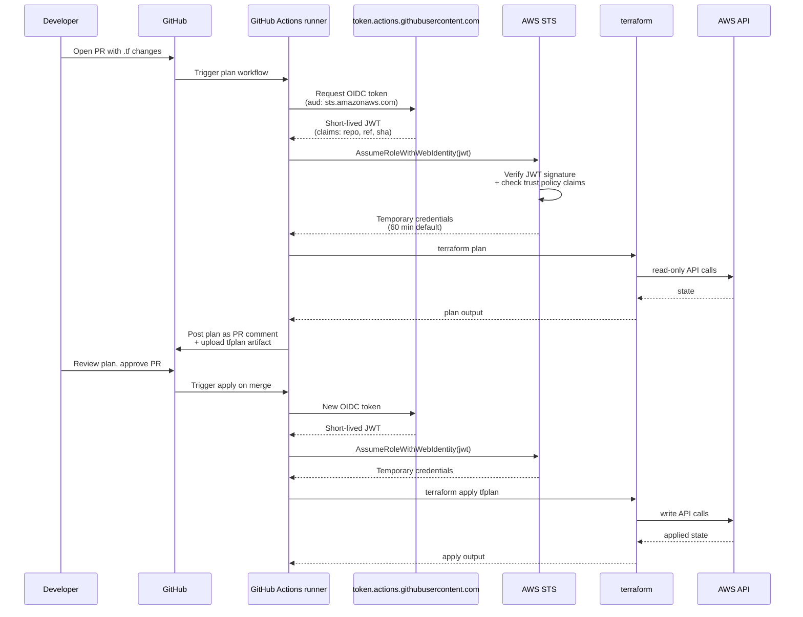

# 14.07 — Infrastructure CI/CD + drift detection

> **Plan-on-PR, apply-on-merge** via GitHub Actions with **OIDC trust**
> (no long-lived AWS access keys) is the production CI/CD shape every
> EKS Terraform tree should reach within its first month; the nightly
> `terraform plan -detailed-exitcode` drift check + the "someone
> changed it in the console" reconciliation runbook are what keep
> the state in code matching the state in cloud.

**Estimated time:** ~30 min read · ~90 min hands-on
**Prerequisites:** [Part 14 ch.01](./01-terraform-state-in-production.md) — remote state with locking required for CI · [Part 14 ch.02](./02-eks-cluster-lifecycle.md) — upgrade flow that CI must drive · [Part 12 ch.01](../07-delivery/04-gitops-argocd.md) — plan-on-PR pattern from app delivery

**You'll know after this:** • configure GitHub Actions with OIDC trust to AWS (no long-lived access keys) · • implement the plan-on-PR, apply-on-merge shape every EKS Terraform tree should reach within its first month · • run nightly `terraform plan -detailed-exitcode` drift checks and act on exit code 2 · • follow the reconciliation runbook when "someone changed it in the console" · • debug a stuck CI apply by inspecting the S3 lock and recovering safely

<!-- tags: terraform, ci-cd, gitops, drift, cloud -->

## Why this exists

The bookstore-platform tree at
[`../examples/bookstore-platform/terraform/`](../examples/bookstore-platform/terraform/)
gets applied two ways during development: `make plan` then `make up`
on a laptop, or the same flow via a CI workflow against a remote
state backend. Both work for "I am alone and learning"; neither
works once a team is involved. The laptop apply has at least five
durable failures:

1. **No audit trail.** Who applied what when? The state file changes
   record the *resource* changes, not the *human* who initiated the
   apply.
2. **Concurrent apply collisions.** Two engineers apply simultaneously;
   one of them wins, the other gets stale plans. The S3 backend's
   `use_lockfile = true` (Part 14 ch.01) prevents corruption but
   does not arbitrate intent.
3. **No review.** A `terraform plan` is the most consequential
   document a platform engineer produces — the actual list of cloud
   changes about to occur — and a laptop apply hides it from
   reviewers entirely.
4. **AWS credentials on the laptop.** Long-lived IAM access keys in
   `~/.aws/credentials` on N engineers' machines is the canonical
   blast-radius problem: any one of those machines lost or
   compromised compromises the account.
5. **No drift detection.** Whatever the team applied two months ago
   is what's *in the .tf*; whatever someone hand-edited in the
   console last Tuesday is what's *in AWS*. They drift apart
   silently until the next apply blows up.

Phase 14-R shipped the production shape:
[`.github/workflows/terraform.yml`](../examples/bookstore-platform/terraform/.github/workflows/terraform.yml)
runs `terraform plan` on every PR (with the plan output posted as a
PR comment) and `terraform apply` on every merge to `main`. The
workflow uses [GitHub OIDC trust](../examples/bookstore-platform/terraform/.github/workflows/terraform.yml)
to assume an IAM role — no AWS access keys are ever stored in
GitHub Secrets. Drift detection ships under
[`drift-check/`](../examples/bookstore-platform/terraform/drift-check/):
a nightly workflow runs `terraform plan -detailed-exitcode` and opens
a deduplicated GitHub issue on any non-zero diff.

This chapter walks the **why and the wiring**: why OIDC instead of
long-lived keys, the five-pattern landscape (laptop / Jenkins /
GitHub Actions / Atlantis / Spacelift), where each wins, what a
"console emergency" looks like, and how to reconcile drift
without making it worse.

[Part 07 ch.03](../07-delivery/03-cicd-pipeline.md) introduced
application-level CI/CD (build, test, push, deploy a microservice).
[Part 14 ch.01](01-terraform-state-in-production.md) (Phase 14a)
established the remote-state backend that infrastructure CI/CD
depends on. This chapter is the **infrastructure** CI/CD layer:
how Terraform itself flows through PR → review → merge → apply,
and how drift is policed.

> **In production:** Long-lived AWS access keys in any CI system
> are the number-one preventable security incident. The fix is
> not rotation (still leaks; rotation is post-hoc). The fix is
> OIDC trust: GitHub/GitLab/CircleCI mint a short-lived (10-15
> minute) JWT per workflow run; STS exchanges it for credentials
> that exist only for that run. No secrets to rotate, no keys to
> leak. The bookstore-platform's `.github/workflows/terraform.yml`
> uses this from line 111-116 (the `aws-actions/configure-aws-
> credentials@v4` step).

## Mental model

**Infrastructure CI/CD is the application of the same merge-driven
discipline that already governs application code to the Terraform
tree: plan-on-PR (human review), apply-on-merge (automation), with
OIDC for credentials (no long-lived secrets) and nightly drift
detection (closing the console-edit loophole). The five-pattern
landscape — laptop, Jenkins, GitHub Actions, Atlantis, Spacelift —
maps to team size + control-plane preference.**

The five-pattern landscape:

- **Pattern 1 — Laptop apply.** One human, one tree, one laptop.
  Fine for the learning phase; fine for the "I am the platform"
  one-person team. Fails on every dimension once two humans share
  the tree. Use only for: bootstrap (Part 14 ch.01's `bootstrap-
  state.sh`), demos, throwaway experiments.
- **Pattern 2 — Shared Jenkins / GitLab CI.** Jenkins-server-on-EC2
  with Terraform jobs. Was the dominant 2015-2020 pattern; still
  in many shops. Issues: Jenkins itself needs auth, scaling, and
  upgrade — it becomes another piece of infrastructure to maintain.
  AWS credentials typically live as Jenkins credentials (better
  than laptops, worse than OIDC). Use for: teams already running
  Jenkins for app CI/CD where adding Terraform jobs is incremental.
- **Pattern 3 — GitHub Actions / GitLab CI with OIDC.** Workflows
  in the same repo as the Terraform; runs on managed runners (or
  self-hosted GitHub-Actions runners on EC2 if regulatory).
  Credentials via OIDC (no static secrets). **The default
  recommendation for greenfield**; the Bookstore Platform ships
  this. Issues: GitHub Actions UI is not optimized for Terraform
  plan output (the plan-output-as-PR-comment trick mitigates).
- **Pattern 4 — Atlantis.** Self-hosted Terraform-aware webhook
  server. The flow is comment-driven (`atlantis plan`, `atlantis
  apply` posted in the PR). The killer feature: per-project workflow
  configuration via `atlantis.yaml` — different terraform versions,
  different roles, different require-approval policies per
  subdirectory. Use for: monorepos with N Terraform projects each
  needing different governance.
- **Pattern 5 — Spacelift / Env0 / Terraform Cloud.** Managed
  Terraform-as-a-Service. Policy-as-code, drift detection, run
  history, state management — all included. **Most polished** but
  also **most expensive** ($120-300/user/month at production
  scale). Use for: orgs that want to outsource Terraform
  infrastructure entirely; orgs with strict compliance that need
  the audit features the SaaS vendors provide.

The selection algorithm is roughly:

| Team size | Pick | Why |
|---|---|---|
| 1 dev | Laptop + remote state | Pattern overhead exceeds value at scale 1. |
| 2-5 devs | GitHub Actions + OIDC | Free, native to GitHub, OIDC closes the secret-leak risk. |
| 5-20 devs, one tree | GitHub Actions + Atlantis (optional) | Atlantis adds per-PR comment-driven discipline. |
| 5-20 devs, many trees | Atlantis or Spacelift | Per-project workflow becomes the value. |
| 20+ devs, regulated | Spacelift / Terraform Cloud | Audit + policy-as-code at scale. |

**OIDC trust — the cryptographic exchange.** A workflow runs in
GitHub Actions; GitHub Actions mints a short-lived JWT carrying
claims `{repository: <ORG>/<REPO>, ref: refs/heads/main, ...}`.
The workflow calls `sts:AssumeRoleWithWebIdentity` against an IAM
role; the role's trust policy validates the JWT's signature
(against GitHub's published JWKS endpoint) and checks the claims
against `StringEquals` conditions. If the claims match, STS
returns temporary credentials (default 1 hour). The credentials
exist only inside the workflow's environment; no human ever sees
them; nothing is stored.

**Drift detection — the three patterns:**

| Pattern | Tool | When |
|---|---|---|
| Scheduled `terraform plan -detailed-exitcode` | GitHub Actions cron / Jenkins | The simplest and most universal; the Bookstore Platform's `drift-check/nightly-drift.yml` ships this. |
| `driftctl` | OSS CLI, ex-CloudSkiff | Stronger because it scans the cloud for resources Terraform doesn't manage at all — catches the "someone created a resource by hand" case. |
| AWS Config + custom rules | AWS Config service | Cloud-native; useful when the org already uses Config for compliance; aligns drift with the compliance posture. |

Each catches a different drift class: `plan -detailed-exitcode`
catches *attribute drift on managed resources*; `driftctl` catches
*unmanaged resources*; AWS Config catches *compliance violations
on either*. A mature platform runs all three.

The trap to keep in view: **applying through a drift fix without
understanding the cause makes things worse**. The DRIFT.md
runbook's Step 3a-3d (Phase 14-R) covers this; the canonical
mistake is: drift detected → engineer panics → `terraform apply`
without reading → Terraform "fixes" the drift by *reverting* a
hand-edit that was actually intentional (the SG rule someone
opened to fix an outage). Three minutes of investigation before
apply prevents three hours of incident recovery.

## Diagrams

### Diagram A — the PR-to-apply flow with OIDC (Mermaid)



### Diagram B — drift sources + detection (ASCII)

```text
DRIFT SOURCE                    EXAMPLES                                   CAUGHT BY
──────────────────────────────  ─────────────────────────────────────────  ──────────────────────────────
Console edit (human)            SG rule opened to "fix prod"               plan -detailed-exitcode (next run)
                                                                            CloudTrail (who + when)
AWS auto-update                 EKS addon auto-upgrade                     plan -detailed-exitcode
                                                                            (lifecycle ignore_changes is the fix)
Tool side-effect                Karpenter desired_capacity on ASG          plan -detailed-exitcode
                                                                            (lifecycle ignore_changes)
Unmanaged resource              IAM user created by an old script          driftctl scan
                                                                            (terraform won't see it)
Compliance violation            S3 bucket made public via console          AWS Config custom rule
                                                                            (alerts immediately)
Out-of-band Terraform apply     Someone applies from a different branch    State lock + nightly plan
──────────────────────────────  ─────────────────────────────────────────  ──────────────────────────────
Order of defense:
  1. Lock state (Part 14 ch.01) — prevents simultaneous out-of-band applies.
  2. plan -detailed-exitcode nightly — catches attribute drift in 24h.
  3. driftctl weekly — catches unmanaged-resource drift in 7d.
  4. AWS Config rules continuously — catches compliance drift immediately.
```

## Hands-on with the Bookstore Platform

### 0. Prerequisites

- A GitHub repository containing the bookstore-platform tree (or a
  fork).
- AWS account access; you can create an IAM identity provider + role.
- Repository admin permissions to set repository secrets + variables.

### 1. Create the OIDC identity provider in AWS

```bash
# One-time per AWS account. Creates the IAM identity provider that
# trusts GitHub's OIDC issuer.
aws iam create-open-id-connect-provider \
  --url https://token.actions.githubusercontent.com \
  --client-id-list sts.amazonaws.com \
  --thumbprint-list 6938fd4d98bab03faadb97b34396831e3780aea1

# Verify it landed.
aws iam list-open-id-connect-providers
```

The thumbprint is the SHA-1 of GitHub's TLS CA certificate. AWS used
to require it; modern AWS regions skip the validation if the issuer
URL is known. The value above is the documented one (rotates
infrequently); if AWS errors out, fetch the current thumbprint from
the AWS GitHub OIDC docs.

### 2. Create the IAM role + trust policy

```bash
# Trust policy — only allows the role to be assumed from the main
# branch of your specific repo.
cat <<EOF > trust-policy.json
{
  "Version": "2012-10-17",
  "Statement": [{
    "Effect": "Allow",
    "Principal": {
      "Federated": "arn:aws:iam::<AWS_ACCOUNT_ID>:oidc-provider/token.actions.githubusercontent.com"
    },
    "Action": "sts:AssumeRoleWithWebIdentity",
    "Condition": {
      "StringEquals": {
        "token.actions.githubusercontent.com:aud": "sts.amazonaws.com",
        "token.actions.githubusercontent.com:sub": "repo:<GITHUB_ORG>/<GITHUB_REPO>:ref:refs/heads/main"
      }
    }
  }]
}
EOF

# Create the role.
aws iam create-role \
  --role-name github-actions-terraform \
  --assume-role-policy-document file://trust-policy.json

# Attach AdministratorAccess (broad — narrow for production).
aws iam attach-role-policy \
  --role-name github-actions-terraform \
  --policy-arn arn:aws:iam::aws:policy/AdministratorAccess

# Output the role ARN.
aws iam get-role --role-name github-actions-terraform \
  --query 'Role.Arn' --output text
```

The trust-policy condition above pins to **one branch** (`main`) of
**one repo**. Production teams that deploy from multiple environments
use `ForAnyValue:StringEquals` with a list of exact refs — see the
header comments in
[`.github/workflows/terraform.yml`](../examples/bookstore-platform/terraform/.github/workflows/terraform.yml)
for the canonical pattern. **Avoid** the broad `StringLike
"repo:ORG/REPO:*"` pattern in any role with cluster-admin reach — it
lets any branch (including PR branches that external contributors
can open) assume the role.

### 3. Configure the GitHub repo

```bash
# Set the secret (the role ARN you just printed).
gh secret set AWS_ROLE_ARN -b "arn:aws:iam::<AWS_ACCOUNT_ID>:role/github-actions-terraform"

# Set the variable (region).
gh variable set AWS_REGION -b "us-east-1"
```

The workflow at
[`.github/workflows/terraform.yml`](../examples/bookstore-platform/terraform/.github/workflows/terraform.yml)
already references `secrets.AWS_ROLE_ARN` and `vars.AWS_REGION`. Once
both are set, the workflow runs.

### 4. Trigger the plan job

```bash
# Make a trivial change to the Terraform tree.
cd examples/bookstore-platform/terraform
git checkout -b test/cicd-wiring

# Bump a tag, for example, in locals.tf.
# (use your editor; this is just to produce a non-trivial diff)

git commit -am "test: trigger plan workflow"
git push origin test/cicd-wiring

# Open a PR via gh:
gh pr create --title "test cicd wiring" --body "smoke test"
```

In the GitHub Actions tab, the `plan` job runs. Inside the job:

- `Configure AWS credentials via OIDC` exchanges the GitHub OIDC token
  for STS credentials.
- `terraform plan` runs against the actual cloud.
- The plan is uploaded as a workflow artifact.
- (Optional, with an extra step like `infracost comment`) the plan
  output is posted as a PR comment.

The PR's "Checks" tab shows the plan green or red. **A reviewer
reads the plan before approving** — that is the entire point.

### 5. Merge the PR, watch the apply

After approval and merge:

```bash
# The apply job runs on push to main. Watch it.
gh run watch
```

The `apply` job:

- Configures AWS credentials via OIDC (same dance as plan).
- Downloads the plan artifact from the merge commit's predecessor PR.
- Runs `terraform apply tfplan` against that exact reviewed plan.

The key safety invariant: **what merges is what was reviewed**. The
plan binary uploaded during the PR is the same plan applied at
merge time; no re-planning, no opportunity for the cloud to have
drifted between review and apply. (Read the `apply` job's caveat
comments in the workflow file — squash-merge breaks the artifact-
lookup-by-PR-number trick, in which case the workflow falls back
to re-planning, which is the worse-but-functional option.)

### 6. Configure the nightly drift check

The drift-check workflow at
[`drift-check/nightly-drift.yml`](../examples/bookstore-platform/terraform/drift-check/nightly-drift.yml)
is shipped under the drift-check/ subdirectory because it's a
template — copy it to your repo's `.github/workflows/` directory:

```bash
# In YOUR repo (not the bookstore-platform sample):
cp examples/bookstore-platform/terraform/drift-check/nightly-drift.yml \
   .github/workflows/

# Adjust the WORKING_DIR env to point at your tree.
# Commit + push.
```

The workflow runs at **03:00 UTC daily** (configurable cron); the
trigger logic:

- `terraform plan -detailed-exitcode` returns:
  - `0` — no drift; the workflow exits cleanly.
  - `1` — plan errored (auth, syntax, network) — different problem;
    workflow fails so on-call notices.
  - `2` — drift detected; the workflow proceeds.

On exit code 2, the workflow uses `actions/github-script@v7` to
either:

- **Open** a new GitHub issue labeled `drift-detected`, OR
- **Append** a dated comment to an existing open issue with that
  label (deduplication — keeps the issue list signal-to-noise high).

The issue body includes the truncated plan output (60 KB cap to fit
in a GitHub issue body) and a link to
[`drift-check/DRIFT.md`](../examples/bookstore-platform/terraform/drift-check/DRIFT.md)
— the runbook for what to do next.

### 7. Simulate drift and walk the runbook

```bash
# In the AWS console: tag a resource that Terraform manages with a
# tag Terraform doesn't know about. Easiest target: the cluster
# Security Group, in EC2 -> Security Groups.
# Add tag: Drift = test
# (or any tag the Terraform doesn't set)

# Next morning, the nightly-drift workflow runs and creates an issue:
# Title: "Drift detected on 2026-05-22"
# Body: includes the plan output showing the tag drift.

# Investigate per DRIFT.md Step 1-2.
cd examples/bookstore-platform/terraform
terraform plan -detailed-exitcode
# Exit code: 2 (drift)

# Look at the diff. The tag change is in the plan output.
# Step 2: CloudTrail — who added the tag?
aws cloudtrail lookup-events \
  --lookup-attributes AttributeKey=ResourceName,AttributeValue=<SECURITY_GROUP_ID> \
  --max-results 5 --start-time "$(date -u -d '1 day ago' +%Y-%m-%dT%H:%M:%SZ)"

# Step 3a: the change is good (it's a benign tag). Roll forward.
# Edit vpc.tf to add the tag to the security_group_tags block.
# terraform plan now shows zero diff.
# Commit + open PR + merge through CI as normal.
```

The runbook's full Step 1-4 (the four flavors of reconciliation) is
in DRIFT.md; this section is the smoke test that the workflow + the
runbook + the team are wired together.

### 8. (Optional) Add an Atlantis variant

The bookstore-platform ships an
[`atlantis.yaml.example`](../examples/bookstore-platform/terraform/drift-check/atlantis.yaml.example)
showing the same drift pattern via Atlantis. The two workflows are
mutually exclusive in practice — pick one. The reasons to add
Atlantis:

- Multiple Terraform projects in one monorepo, each needing different
  governance (different terraform versions, different roles, different
  approval policies).
- Comment-driven workflow (`atlantis plan`, `atlantis apply` posted
  as PR comments) feels more natural to the team than the
  GitHub-Actions-status-check pattern.
- You already run Atlantis for application Terraform; adding the
  bookstore tree is incremental.

If GitHub Actions + OIDC is meeting your needs, **don't add
Atlantis**. The extra moving piece (you now run Atlantis itself —
it's a webhook server on a Kubernetes Deployment, probably on the
cluster it manages) earns its keep only at scale.

### 9. (Optional) Run `driftctl` weekly

`driftctl` catches a class `plan -detailed-exitcode` misses:
*resources in the cloud that Terraform doesn't manage at all*. The
classic example: an IAM user created by an old console script, an
S3 bucket spun up "temporarily" two years ago. Terraform's plan
ignores anything not in its state; `driftctl` scans the cloud and
reports.

```bash
# Install driftctl
brew install driftctl
# Or: curl -L https://github.com/snyk/driftctl/releases/latest/download/driftctl_darwin_amd64 -o driftctl && chmod +x driftctl

# Scan against the bookstore-platform state.
driftctl scan \
  --from tfstate+s3://<TFSTATE_BUCKET_NAME>/bookstore-platform/terraform.tfstate \
  --output 'json://drift.json' \
  --quiet

# Result: a JSON report with three categories — managed/in-sync,
# managed/drifted, unmanaged. The "unmanaged" list is the audit.
jq '.summary' drift.json
# {
#   "total_resources": 124,
#   "total_changed": 0,
#   "total_unmanaged": 7,    # <-- what driftctl finds, plan misses
#   "total_missing": 0
# }
```

A weekly CI job that runs `driftctl scan` and posts the unmanaged
list to a Slack channel is the durable defense. The `drift-check/`
subdirectory ships a stub for this; uncomment and configure for
your repo.

## How it works under the hood

**OIDC — the cryptographic exchange in detail.** Three trust steps:

1. **GitHub mints a JWT**. The token's payload carries claims:
   ```json
   {
     "iss": "https://token.actions.githubusercontent.com",
     "aud": "sts.amazonaws.com",
     "sub": "repo:<GITHUB_ORG>/<GITHUB_REPO>:ref:refs/heads/main",
     "repository": "<GITHUB_ORG>/<GITHUB_REPO>",
     "ref": "refs/heads/main",
     "sha": "abc123...",
     "actor": "<USERNAME>",
     "iat": 1684567890,
     "exp": 1684568790
   }
   ```
   The JWT is signed with GitHub's private key; the public key is
   published at `https://token.actions.githubusercontent.com/.well-known/jwks.json`.

2. **STS validates the JWT**. The IAM role's trust policy declares
   GitHub's OIDC provider as a trusted federation source. STS:
   - Fetches GitHub's JWKS endpoint.
   - Verifies the JWT signature against the JWKS public keys.
   - Checks the JWT's `aud` claim against the role's allowed audience.
   - Checks the JWT's `sub` claim against the role's `StringEquals`
     condition.
   - If all checks pass, calls `AssumeRoleWithWebIdentity` internally.

3. **STS returns short-lived credentials**. Default lifetime: 1 hour.
   The credentials are temporary — `AccessKeyId` + `SecretAccessKey`
   + `SessionToken`. The workflow uses them via the standard AWS
   SDK env-var mechanism (the `configure-aws-credentials` action
   sets `AWS_ACCESS_KEY_ID`, `AWS_SECRET_ACCESS_KEY`, `AWS_SESSION_TOKEN`,
   plus `AWS_DEFAULT_REGION`).

The "no static secret" win: at no point does an access key live
outside the workflow's in-memory environment. The runner is
ephemeral; the credentials expire in an hour; if a workflow is
compromised, the damage is bounded to that workflow's session.

**The plan-artifact handoff between jobs.** The PR's plan job
serializes the binary plan (`terraform plan -out=tfplan`) and
uploads it to GitHub's artifact storage (`actions/upload-artifact@v4`).
On merge, the apply job downloads the artifact (`actions/download-
artifact@v4`) and applies it directly: `terraform apply -input=false
-auto-approve tfplan`. This achieves **exact-plan-as-reviewed**
semantics: the cloud state that the reviewer saw cannot drift
between review and apply.

The catch (called out in the workflow's apply-job comments):
`actions/download-artifact` needs to know *which workflow run*
produced the artifact. The simple "match by name and most recent"
fails for squash-merged PRs (the merge commit isn't directly
linked to the PR). Three options:

- Use **merge** commits (not squash) — preserves the PR number on the
  merge SHA.
- Use the **pull_request `closed: merged: true`** event instead of
  `push: branches: [main]` — exposes the PR number on the apply
  trigger.
- Fall back to **re-plan on apply** — the workflow's current
  behavior if the artifact isn't found. Functional but loses the
  exact-plan-as-reviewed guarantee.

**`terraform plan -detailed-exitcode` semantics.** Three exit codes:

- `0` — no changes (the plan would be a no-op).
- `1` — error (auth failure, syntax error, network issue).
- `2` — changes present (Terraform would make changes).

The drift-check workflow uses exit code 2 as the drift signal. Note
that "would make changes" is the union of:

- Changes you intended (someone pushed a tf change that's not
  applied yet — usually this means the apply job failed previously).
- Drift from the cloud-side (someone edited via console).

The drift workflow doesn't distinguish; both cases warrant
investigation. Reading the actual plan output (in the issue body)
clarifies which.

**Atlantis vs GitHub Actions — the architectural difference.**
Atlantis is a **stateful** webhook server — it maintains its own
workspace per project per branch, lock-contention coordination,
and `atlantis.yaml`-driven workflow definitions. GitHub Actions is
**stateless** — each workflow run starts fresh, builds its working
directory from the checkout. Atlantis's stateful approach offers
better incremental performance (cached `.terraform/` directory)
and richer per-project workflow customization; GitHub Actions's
statelessness is simpler and free.

For teams running 1-5 Terraform projects: GitHub Actions wins on
ops simplicity. For 20+ projects: Atlantis's per-project workflow
customization pays for itself.

**Spacelift / Terraform Cloud — the SaaS variant.** Both are
"Terraform as a managed service": you push code, they run the plan,
they offer a UI to review and approve, they apply on approval. The
appeal: drift detection, run history, policy-as-code (Sentinel /
OPA), state encryption, audit logs — all included. The cost: $10-50
per user/month for Terraform Cloud's "Standard" tier; $30-100+ for
Spacelift's commercial tiers. At 20+ engineers, the per-user fee
becomes material; at 5 engineers, it's noise compared to
engineering time saved.

## Production notes

> **In production:** Pin the trust-policy `sub` claim to exact
> branch refs, never `StringLike` wildcards on a role with
> cluster-admin reach. The header comments in
> [`.github/workflows/terraform.yml`](../examples/bookstore-platform/terraform/.github/workflows/terraform.yml)
> spell out the `ForAnyValue:StringEquals` pattern for multi-
> environment trust. A `StringLike "repo:ORG/REPO:*"` lets any
> branch — including a PR branch a contributor opens against your
> repo — assume the role. The blast radius is the role's IAM
> permissions; for an Administrator-level role, the radius is
> the entire account.

> **In production:** Use environments + required reviewers for the
> apply step. The workflow's apply job has a commented-out
> `environment: production` line. Uncomment it, configure required
> reviewers in the repo's environment settings, and an apply
> requires explicit human approval after merge. The default
> apply-on-merge is fine for sandboxes; production-blast-radius
> applies need the second human eye.

> **In production:** The squash-merge / artifact-lookup interaction
> bites. The workflow's apply step tries to download the plan
> artifact via PR number; squash-merge doesn't preserve the PR
> number on the merge SHA. The fix is either (a) use merge commits
> not squash, or (b) re-plan on apply (the current fallback,
> functional but loses the exact-plan-as-reviewed property). The
> work continues — open question, the current code uses (b).

> **In production:** Don't put long-lived credentials in GitHub
> Secrets, period. The number of leaks where a `AWS_ACCESS_KEY_ID`
> was logged via `echo` in a workflow step, posted to the workflow
> log (which is sometimes public for OSS repos), and exfiltrated
> in minutes is not small. OIDC removes this entire class of
> incident. If your repo doesn't support OIDC (older GitHub
> Enterprise, weird forks), use the lowest-permission
> service-account-pattern: a per-environment IAM user with
> resource-tag-scoped policies, rotated weekly via a cron.

> **In production:** Drift detection runs against a *production*
> Terraform state, not a *dev* one. A staging-cluster drift is
> usually fine to ignore for a day; a production-cluster drift
> isn't. Configure the drift workflow to fail loudly (Slack
> + page + on-call ack) only when drift is on the production
> tree; the dev workflow can file the issue without paging.

> **In production:** The `lifecycle.ignore_changes` knob is a
> double-edged sword. It silences known false-positive drift
> (EKS auto-updating addon versions, Karpenter manipulating ASG
> capacity), but it also silences *real* drift on the same
> attributes. The
> [`drift-check/DRIFT.md`](../examples/bookstore-platform/terraform/drift-check/DRIFT.md)
> runbook's "Common ignore_changes patterns" section lists the
> canonical ones; resist adding more without a real drift
> example justifying it. An over-applied `ignore_changes` is
> how teams discover their CMK rotation was hand-disabled
> three months ago.

> **In production:** State backups before destructive applies.
> The S3 backend's versioning (Part 14 ch.01) is automatic, but
> for a high-risk apply (a migration that touches the EKS cluster
> resource itself, for example), explicitly snapshot:
> `terraform state pull > tfstate.<DATE>.json` before running
> the apply. The cost is 30 seconds; the recovery time from
> a botched state file is measured in hours-to-days.

## Quick Reference

```bash
# OIDC provider + role setup (one-time per account).
aws iam create-open-id-connect-provider \
  --url https://token.actions.githubusercontent.com \
  --client-id-list sts.amazonaws.com \
  --thumbprint-list 6938fd4d98bab03faadb97b34396831e3780aea1

aws iam create-role --role-name github-actions-terraform \
  --assume-role-policy-document file://trust-policy.json
aws iam attach-role-policy --role-name github-actions-terraform \
  --policy-arn arn:aws:iam::aws:policy/AdministratorAccess

# Repo secrets + variables.
gh secret set AWS_ROLE_ARN -b "arn:aws:iam::<AWS_ACCOUNT_ID>:role/github-actions-terraform"
gh variable set AWS_REGION -b "us-east-1"

# Trigger the drift check manually.
gh workflow run terraform-drift-check

# Run terraform plan locally with the drift exit codes.
terraform plan -detailed-exitcode
# Exit 0=no diff, 1=error, 2=drift detected.

# driftctl scan against remote state.
driftctl scan \
  --from tfstate+s3://<TFSTATE_BUCKET_NAME>/bookstore-platform/terraform.tfstate
```

Minimal skeleton — the GitHub Actions plan-on-PR job:

```yaml
# .github/workflows/terraform.yml — excerpt
name: terraform
on:
  pull_request:
    paths: ['examples/bookstore-platform/terraform/**']
permissions:
  id-token: write     # required for OIDC
  contents: read

jobs:
  plan:
    if: github.event_name == 'pull_request'
    runs-on: ubuntu-latest
    steps:
      - uses: actions/checkout@v4
      - uses: hashicorp/setup-terraform@v3
        with: { terraform_version: '<TF_VERSION>' }
      - uses: aws-actions/configure-aws-credentials@v4
        with:
          role-to-assume: ${{ secrets.AWS_ROLE_ARN }}
          aws-region:    ${{ vars.AWS_REGION }}
          audience:      sts.amazonaws.com
      - run: terraform init -input=false
      - run: terraform plan -input=false -no-color -out=tfplan
      - uses: actions/upload-artifact@v4
        with: { name: tfplan, path: tfplan, retention-days: 7 }
```

CI/CD-readiness checklist (production-shape when all six are yes):

- [ ] AWS OIDC identity provider created; trust policy pinned to
      exact branch refs; no `StringLike` wildcards on admin roles.
- [ ] Plan-on-PR workflow posts plan output as a PR comment;
      reviewers can read it before approving.
- [ ] Apply-on-merge workflow uses the reviewed plan artifact (not
      re-plan), with a required-reviewer environment gate.
- [ ] Nightly drift workflow runs `terraform plan -detailed-exitcode`
      and opens/dedups a GitHub issue on exit code 2.
- [ ] Weekly `driftctl` scan catches unmanaged-resource drift.
- [ ] DRIFT.md runbook linked from the drift issue body; on-call has
      practiced the four reconciliation flavors.

## Test your understanding

> Try each before opening the answer drawer. The act of trying is the exercise; the answer is the check.

1. **Why does the chapter argue OIDC trust replaces (rather than improves) long-lived AWS access keys in CI?**
   <details><summary>Show answer</summary>

   Long-lived access keys are a credential that exists *outside the run* — stored in GitHub Secrets, copied to dev laptops, sometimes screenshot accidentally. Rotation is post-hoc: by the time you rotate, the leaked key might already have been used. OIDC trust mints a short-lived JWT *per workflow run*, exchanged for STS credentials that live ~1 hour and only inside the runner's environment. There's nothing static to rotate, nothing to leak. The IAM role's trust policy uses `StringEquals` against the GitHub `sub` claim (repo + branch), so even if a fork tries to assume the role, the trust policy rejects it.

   </details>

2. **A nightly drift check fires: 2 resources have drifted. The issue body shows that someone widened the EKS API server CIDR in the AWS console at 14:30 yesterday. What are the four reconciliation flavors the chapter teaches and which do you pick here?**
   <details><summary>Show answer</summary>

   The four flavors: (1) **Revert in cloud** — undo the console change to match code; (2) **Codify in Terraform** — accept the change and PR it into `.tf`; (3) **Document the exception** — accept the divergence with explicit reasoning (rare); (4) **Both/neither** — case-by-case. For this incident: ask why it happened. If it was an emergency response to a P0 (the operator widened CIDR to debug from a new IP), codify it in a PR with the runbook reference. If it was someone exploring the console without context, revert immediately and rotate the IAM role's permissions to remove console-write where it's not needed.

   </details>

3. **You inherit a Terraform tree where `apply` runs from a Jenkins server that holds AWS access keys in Jenkins credentials. The org wants to migrate to GitHub Actions + OIDC. What's the safe migration order?**
   <details><summary>Show answer</summary>

   (1) Create the OIDC identity provider + trust policy in AWS, pinned to specific branches; (2) Add the new GitHub Actions plan workflow running alongside Jenkins (plan only, no apply); (3) Validate the plan output matches Jenkins's plan for a few PRs; (4) Cutover apply: disable Jenkins apply, enable GHA apply on merge; (5) Wait a week of stable applies; (6) Delete the IAM user holding Jenkins access keys + delete the keys themselves. Skipping step 5 is how teams discover edge cases (a workflow that needs a permission the Jenkins user had but the OIDC role doesn't); keeping Jenkins's keys around "just in case" defeats the migration's security gain.

   </details>

4. **Hands-on extension — manually create an S3 bucket in the AWS console outside Terraform, then run `terraform plan -detailed-exitcode` vs `driftctl scan`. Compare what each finds.**
   <details><summary>What you should see</summary>

   `terraform plan -detailed-exitcode` returns 0 (no drift) — it only checks resources Terraform *manages*; an unmanaged bucket is invisible. `driftctl scan` returns a list including the unmanaged bucket because it scans the cloud for everything in scope and compares to state. This is why the chapter recommends both: plan catches attribute drift on managed resources, driftctl catches unmanaged-resource drift. Either alone leaves a class of "someone made it in the console" hidden.

   </details>

## Further reading

- **GitHub OIDC for AWS — official docs**
  <https://docs.github.com/en/actions/deployment/security-hardening-your-deployments/configuring-openid-connect-in-amazon-web-services>;
  the canonical guide to the trust-policy pattern this chapter
  implements.
- **`aws-actions/configure-aws-credentials`**
  <https://github.com/aws-actions/configure-aws-credentials>;
  the GitHub Action that performs the STS exchange; supports IAM
  roles via OIDC, SAML, and the legacy static-key path.
- **Atlantis docs**
  <https://www.runatlantis.io/docs/>; the per-project workflow + the
  comment-driven plan/apply pattern; the canonical alternative to
  Pattern 3 for teams with N Terraform projects.
- **driftctl**
  <https://github.com/snyk/driftctl>; the unmanaged-resource scanner;
  the complement to `terraform plan -detailed-exitcode` that catches
  drift the plan can't see.
- **HashiCorp — Terraform Cloud**
  <https://developer.hashicorp.com/terraform/cloud-docs>; the SaaS
  variant of Pattern 5, including the run-history + policy-as-code
  features.
- **Spacelift docs**
  <https://docs.spacelift.io/>; the commercial SaaS variant covering
  drift detection, OPA policy enforcement, and per-stack workflow.
- **AWS — IAM roles for service accounts vs OIDC for CI**
  <https://docs.aws.amazon.com/IAM/latest/UserGuide/id_roles_providers_oidc.html>;
  the underlying IAM federation mechanism that OIDC builds on.
