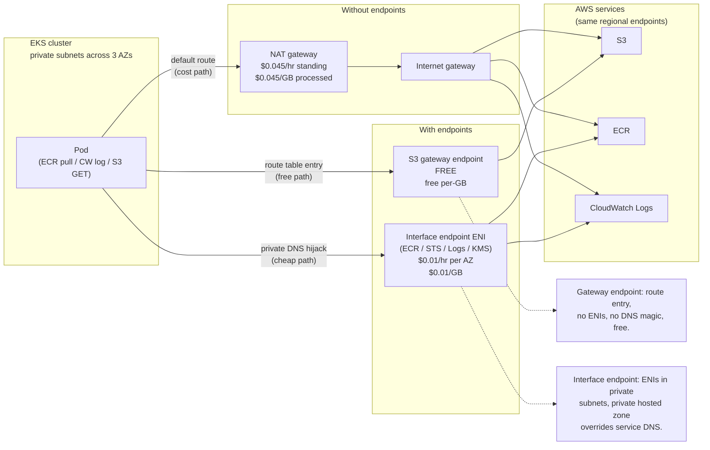

# 14.08 — VPC endpoints & egress economics

> **NAT gateways cost $0.045/hr plus $0.045/GB processed** — at 1
> TB/month of data through NAT (a busy EKS cluster pulling ECR
> images, shipping CloudWatch logs, and chatting with S3) that's
> **$45/month in data charges alone**, not counting the per-hour
> standing fee; **gateway endpoints** for S3 and DynamoDB are
> **free** and skip NAT entirely; **interface endpoints** for
> ECR/STS/EC2/CloudWatch-Logs/KMS cost **$0.01/hr per AZ + $0.01/GB**
> processed and pay for themselves at ~50 GB/month of pulled data
> per 3-AZ cluster.

**Estimated time:** ~30 min read · ~60 min hands-on
**Prerequisites:** [Part 14 ch.06](./06-cost-guardrails.md) — egress cost is the #1 surprise line · [Part 10 ch.03](../10-cloud-and-managed-kubernetes/04-cloud-networking-and-load-balancing.md) — VPC + NAT topology the bookstore tree already has · [Part 13 ch.01](../13-grand-capstone-bookstore-platform/01-bookstore-2-from-toy-to-platform.md) — bookstore VPC you'll add endpoints to

**You'll know after this:** • understand NAT gateway pricing ($0.045/hr + $0.045/GB) and where it dominates the cluster bill · • configure gateway endpoints (free) for S3 and DynamoDB · • configure interface endpoints for ECR, STS, EC2, CloudWatch Logs, KMS and compute their per-cluster break-even · • design private subnets that skip NAT entirely for AWS-API traffic · • debug a Pod that suddenly can't pull from ECR after an endpoint policy change

<!-- tags: vpc-endpoints, cost, cloud, networking, finops -->

## Why this exists

The bookstore-platform tree at
[`../examples/bookstore-platform/terraform/`](../examples/bookstore-platform/terraform/)
provisions, by default, **one NAT gateway** (in the first AZ of the
configured region) to give private-subnet workloads internet egress.
Every Pod that pulls an image from ECR, pushes a CloudWatch log
event, calls the STS endpoint for IRSA, or downloads an S3 object
*goes through that NAT gateway*. AWS charges for the privilege on
two dimensions:

- **Per-hour standing fee** — $0.045/hr per NAT gateway. One NAT
  per cluster = ~$32/month standing. Three NATs (one per AZ for
  high availability) = ~$97/month standing. The HA configuration is
  the production-shape default; the single-NAT layout the
  bookstore-platform tree ships is a cost-trimmed sandbox shape.
- **Per-GB data-processing fee** — $0.045/GB *each way* through
  NAT. A 5-GB ECR image pull through NAT costs $0.23 each time;
  twenty Pods restarting and re-pulling on a cluster bounce costs
  ~$4.50; an idle production cluster shipping 50 GB/month of
  CloudWatch logs costs $2.25/month in data alone.

The math gets ugly at scale. A platform running 50 clusters across
3 AZs, each pulling 200 GB/month of ECR images + 100 GB/month of
CloudWatch logs + 50 GB/month of S3 data:

```
NAT data: 50 clusters x 350 GB x $0.045/GB = $787.50/month
NAT standing: 50 clusters x 3 AZs x $0.045/hr x 730 hr = $4,927.50/month
Total NAT: $5,715/month
```

VPC endpoints close most of this:

- **Gateway endpoint for S3** — Free. The `s3.<REGION>` service routes
  through the endpoint instead of NAT. For a cluster that pulls
  Loki chunks, Velero backups, or ML model artifacts from S3, this
  is the single highest-ROI change in the entire Terraform tree.
- **Gateway endpoint for DynamoDB** — Free. Same shape. (The
  bookstore platform doesn't use DynamoDB heavily, but Crossplane's
  Composition state and some Argo CD configurations do.)
- **Interface endpoints** for ECR-API, ECR-DKR, STS, EC2, CloudWatch-Logs,
  KMS, Secrets Manager, etc. — $0.01/hr per AZ per endpoint
  ($7.30/month per AZ for the standing fee at 730 hours) + $0.01/GB
  processed. For a 3-AZ cluster with the seven endpoints the
  bookstore-platform tree provisions, the standing fee is
  ~$153/month — but the data-processing savings dwarf it once data
  volume exceeds ~50 GB/month total.

Phase 14-R ships
[`vpc-endpoints.tf`](../examples/bookstore-platform/terraform/vpc-endpoints.tf)
with `var.enable_vpc_endpoints = false` as the default — it costs
real money. Flip to `true` once the cluster is past the experimental
phase and you've measured its NAT data volume; the cost crosses over
quickly.

[Part 02 ch.01](../02-networking/01-networking-model.md) introduced
the cluster networking model abstractly. [Part 10 ch.04](../10-cloud-and-managed-kubernetes/04-cloud-networking-and-load-balancing.md)
walked through the AWS VPC + NAT default. This chapter is the
**EKS-specific egress-cost** layer: which traffic hits NAT, which
endpoints save money, and the policy that locks endpoints down to
specific resources.

> **In production:** Enable VPC endpoints once your cluster's
> monthly NAT-processed traffic exceeds 50 GB. Below that, the
> per-hour standing fee of the interface endpoints exceeds the
> data savings; above it, endpoints pay for themselves quickly.
> The bookstore-platform tree's `vpc-endpoints.tf` ships seven
> interface endpoints plus the free S3 gateway endpoint; flip
> `enable_vpc_endpoints = true` and `terraform apply` once you've
> measured the cluster's NAT volume via VPC Flow Logs.

## Mental model

**Every byte leaving a private subnet travels via NAT by default,
and NAT bills on both standing time and bytes processed; VPC
endpoints divert AWS-service traffic off NAT entirely, with a
hierarchy of cost: gateway endpoints (free, S3/DynamoDB only) and
interface endpoints ($0.01/hr per AZ + $0.01/GB, all other AWS
services). Break-even depends on your NAT traffic profile; the
$0.04/GB-saved-via-endpoint becomes real money at modest data
volumes.**

The two endpoint types:

- **Gateway endpoints** — Free per-hour, free per-GB. Available
  for **S3 and DynamoDB only**. Implemented as VPC-level route-
  table entries: the route `S3-prefix-list -> vpce-<...>` shows up
  in your private + intra route tables, and SDK calls to S3 follow
  it instead of the default-route to NAT. No ENIs, no DNS hijack,
  no private-DNS toggle. Just a route-table prefix.
- **Interface endpoints** — $0.01/hr per AZ + $0.01/GB processed.
  Available for **most AWS services** (ECR, STS, EC2, KMS,
  CloudWatch-Logs, Secrets Manager, SQS, SNS, the list grows
  monthly). Implemented as **ENIs in your private subnets** plus a
  **private DNS hijack**: AWS injects a Route 53 private hosted
  zone that overrides the public-DNS name of the service (e.g.,
  `ecr.<REGION>.amazonaws.com`) to resolve to the endpoint's ENI
  IPs. The SDK doesn't know it's hitting an endpoint vs the public
  service.

**The break-even math.** For a single AWS service, an interface
endpoint pays off when:

```
data_GB * (NAT_processing_fee - endpoint_processing_fee) > endpoint_hours * endpoint_hourly_fee
data_GB * ($0.045 - $0.010) > 730 hr/month * $0.010/hr * <NUM_AZS>
data_GB * $0.035 > 730 * $0.010 * <NUM_AZS>
data_GB > 208 * <NUM_AZS>
```

For a 3-AZ cluster, that's **~624 GB/month** for a *single*
endpoint to pay off in data savings alone. But you usually
provision multiple endpoints in one go (ECR-API + ECR-DKR + STS +
EC2 + CloudWatch-Logs + KMS are the canonical six on EKS), and the
standing fee scales with N endpoints but the data-volume threshold
doesn't — the threshold is on the *aggregate* data shifted off NAT.

A more useful framing: at **3 AZs and 7 interface endpoints**, the
standing fee is `3 x 7 x $7.30 = $153/month`. The NAT data savings
at 1 TB/month traffic moved off NAT would be `1024 GB x $0.035 =
$36/month` — still a net cost. At 10 TB/month it's `10240 x $0.035
= $358/month savings vs $153 standing = $205/month net win`. The
real ROI shows up at **terabyte-scale** clusters; below that, only
the **gateway endpoints** (free) are unambiguous wins.

**Where the data volume actually comes from on EKS.** Top sources,
in rough order:

1. **ECR image pulls** — 5-50 GB per cluster bounce, plus regular
   pulls for image-tag updates. Often the largest single line.
2. **CloudWatch Logs ingestion** — 1-10 GB/day on a normal cluster.
   Goes via the `logs` interface endpoint; can be substantial.
3. **S3 traffic** — Loki chunks, Velero backups, ML artifacts. Goes
   via the S3 *gateway* endpoint (free).
4. **STS IRSA traffic** — Small per-call but every Pod assuming an
   IAM role calls STS. Aggregate volume is modest.
5. **EC2 API calls** — Karpenter list-watching instance types,
   describing volumes. Modest aggregate volume.
6. **KMS calls** — Envelope-encryption operations (every secret
   read by the cluster decrypts via KMS). High call-rate, small
   per-call.
7. **Cross-AZ data transfer** — *Not* NAT but the same shape: AWS
   bills $0.01/GB between AZs. A misbehaving service mesh or a
   replicated stateful workload can rack up large lines.

**Endpoint policy — locking down what can leave.** An endpoint can
be opened to your VPC but restricted via an *endpoint policy* (a
JSON document attached to the endpoint) to specific AWS resources.
Example: the S3 gateway endpoint can be policy-bound to only allow
GETs on buckets owned by your AWS account, blocking exfiltration to
attacker-owned buckets. The default policy is "allow everything via
this endpoint"; production policy is "allow specific account ARNs
and specific actions."

The trap to keep in view: **enabling endpoints without measuring
NAT traffic first is the cargo-cult mistake**. The default seven
endpoints the bookstore-platform tree provisions cost ~$153/month
in standing fees on a 3-AZ cluster. If your cluster only pushes
20 GB/month of NAT data, you've added $153/month for a $1/month
saving. *Measure first* (VPC Flow Logs, Cost Explorer's NAT line),
*then enable*.

## Diagrams

### Diagram A — traffic flows with and without endpoints (Mermaid)



### Diagram B — cost-per-GB by traffic path (ASCII)

```text
PATH                            PER-HOUR     PER-GB       ACCESS PATTERN
──────────────────────────────  ───────────  ───────────  ─────────────────────────────
NAT gateway (1 AZ)              $0.045       $0.045       Default; all egress unless rerouted
Gateway endpoint (S3 or DDB)    free         free         Routed via private VPC route table
Interface endpoint (per AZ)     $0.01        $0.01        Private DNS hijack onto ENIs
VPC peering                     free*        $0.01        Cross-VPC same region
Transit Gateway                 $0.05        $0.02        Hub-and-spoke; org-wide
Cross-AZ data transfer          n/a          $0.01        ALWAYS; for any cross-AZ traffic
Cross-region data transfer      n/a          $0.02        Standard cross-region rate
Internet egress (via IGW)       n/a          $0.09        First 100 GB/month, decreases at TB scale
──────────────────────────────  ───────────  ───────────  ─────────────────────────────
The cheapest path for AWS service traffic is, in order:
  1. Gateway endpoint (free; S3 / DDB only)
  2. Interface endpoint ($0.01/GB; everything else)
  3. NAT gateway ($0.045/GB; the default fallback)
```

## Hands-on with the Bookstore Platform

### 0. Prerequisites

- The bookstore-platform tree applied; cluster reachable via `kubectl`.
- AWS CLI v2 configured with permissions on EC2 / VPC + CloudWatch.
- A baseline: at least 7 days of cluster activity so NAT volume is
  measurable.

### 1. Measure current NAT traffic volume

```bash
CLUSTER="$(terraform output -raw cluster_name)"
REGION="$(terraform output -raw region)"

# Find the NAT gateway IDs the bookstore-platform tree created.
NAT_IDS="$(aws ec2 describe-nat-gateways \
  --region "$REGION" \
  --filter "Name=tag:Cluster,Values=$CLUSTER" \
  --query 'NatGateways[].NatGatewayId' --output text)"
echo "NAT gateways: $NAT_IDS"

# Bytes processed (in + out) per NAT gateway over the last 30 days.
END_TS="$(date -u +%Y-%m-%dT%H:%M:%S)"
START_TS="$(date -u -d '30 days ago' +%Y-%m-%dT%H:%M:%S)"

for NAT in $NAT_IDS; do
  BYTES_OUT="$(aws cloudwatch get-metric-statistics --region "$REGION" \
    --namespace AWS/NATGateway --metric-name BytesOutToDestination \
    --dimensions Name=NatGatewayId,Value="$NAT" \
    --start-time "$START_TS" --end-time "$END_TS" \
    --period 2592000 --statistics Sum \
    --query 'Datapoints[0].Sum' --output text)"
  BYTES_IN="$(aws cloudwatch get-metric-statistics --region "$REGION" \
    --namespace AWS/NATGateway --metric-name BytesInFromDestination \
    --dimensions Name=NatGatewayId,Value="$NAT" \
    --start-time "$START_TS" --end-time "$END_TS" \
    --period 2592000 --statistics Sum \
    --query 'Datapoints[0].Sum' --output text)"
  TOTAL_GB="$(awk "BEGIN { print ($BYTES_OUT + $BYTES_IN) / (1024^3) }")"
  COST="$(awk "BEGIN { print $TOTAL_GB * 0.045 }")"
  echo "$NAT: $TOTAL_GB GB processed = \$${COST}/month data"
done
```

Sample output:

```text
NAT gateways: nat-0abc123def456
nat-0abc123def456: 287.3 GB processed = $12.93/month data
```

At 287 GB/month, the data cost is $13/month. Standing cost for 1 NAT
is ~$32/month. Total NAT line item: ~$45/month. Whether endpoints
pay off depends on what services consume that 287 GB.

### 2. Identify what's flowing through NAT — VPC Flow Logs

The crude method: VPC Flow Logs on the NAT-attached ENI, aggregated
by destination IP and reverse-DNS'd to identify the AWS service.

```bash
# Enable Flow Logs to CloudWatch (if not already on).
VPC_ID="$(aws ec2 describe-vpcs --region "$REGION" \
  --filters "Name=tag:Cluster,Values=$CLUSTER" \
  --query 'Vpcs[0].VpcId' --output text)"

# (One-time setup — Phase 14-R does NOT enable Flow Logs by default
# because they cost ~$0.50/GB ingested into CloudWatch. Enable for
# the duration of this measurement, then disable.)
aws ec2 create-flow-logs --region "$REGION" \
  --resource-type VPC --resource-ids "$VPC_ID" \
  --traffic-type ACCEPT \
  --log-destination-type cloud-watch-logs \
  --log-group-name "/aws/vpc/$CLUSTER/flow-logs" \
  --deliver-logs-permission-arn "<FLOW_LOGS_IAM_ROLE_ARN>"

# Wait 30 minutes to accumulate Flow Logs, then query CloudWatch
# Logs Insights for top-N destinations.
aws logs start-query --region "$REGION" \
  --log-group-name "/aws/vpc/$CLUSTER/flow-logs" \
  --start-time "$(date -u -d '30 minutes ago' +%s)" \
  --end-time "$(date -u +%s)" \
  --query-string 'fields dstaddr, bytes | filter action="ACCEPT" | stats sum(bytes) as total_bytes by dstaddr | sort total_bytes desc | limit 20'

# Reverse-DNS the top IPs.
# (Most ECR/S3/STS endpoints will resolve to *.s3.*.amazonaws.com,
# *.ecr.*.amazonaws.com, sts.*.amazonaws.com.)
```

Sample top-N output (reverse-DNS'd):

```text
DESTINATION_HOST                        GB/30min    %
prod-<REGION>-starport-layer-bucket.s3.<REGION>.amazonaws.com     1.2     45%
api.ecr.<REGION>.amazonaws.com                                    0.6     22%
logs.<REGION>.amazonaws.com                                       0.4     15%
sts.<REGION>.amazonaws.com                                        0.05     2%
... (other)
```

Reading this:

- **45% S3** — this is ECR's blob backend; would route through the
  S3 gateway endpoint (free) if enabled.
- **22% ECR-API + 15% Logs** — these would route through interface
  endpoints (saving $0.035/GB).
- **2% STS** — modest; STS interface endpoint pays off only at
  cluster-fleet scale.

In this hypothetical, enabling the **S3 gateway endpoint alone**
saves `0.45 x 287 GB x $0.045 = $5.81/month` for **zero cost**.
Enabling the ECR/Logs interface endpoints saves
`(0.22 + 0.15) x 287 GB x $0.035 = $3.72/month` at a standing cost
of `2 endpoints x 3 AZs x $7.30 = $43.80/month` — net cost. For
this cluster, only the gateway endpoints make sense.

### 3. Enable the gateway endpoints first (the unambiguous win)

The Phase 14-R `vpc-endpoints.tf` ships **all seven endpoints** under
one flag. To enable *only* the S3 gateway, a minimal local override:

```bash
cd examples/bookstore-platform/terraform

# Option A — enable the full set (when data volume justifies it):
cat <<EOF >> example.tfvars
enable_vpc_endpoints = true
EOF

# Option B — for the "gateway only" case (no interface endpoints,
# zero standing fees), edit the vpc-endpoints.tf locally to comment
# out the interface endpoints block. Production teams who only need
# gateway endpoints typically fork or extend the module rather than
# patching the example tree.

terraform plan -var-file=example.tfvars -out=endpoints.tfplan
terraform apply endpoints.tfplan
```

Verify the endpoint landed:

```bash
aws ec2 describe-vpc-endpoints --region "$REGION" \
  --filters "Name=tag:Cluster,Values=$CLUSTER" \
  --query 'VpcEndpoints[].{type:VpcEndpointType,service:ServiceName,state:State}' \
  --output table
```

Sample:

```text
-----------------------------------------------------------------------
|                       DescribeVpcEndpoints                          |
+----------+------------------------------------------+----------------+
|   type   |                  service                 |     state      |
+----------+------------------------------------------+----------------+
|  Gateway |  com.amazonaws.<REGION>.s3               |  available     |
+----------+------------------------------------------+----------------+
```

The route tables now carry the S3 prefix list:

```bash
# Verify the S3 routes appear in private subnet route tables.
PRIVATE_RT="$(aws ec2 describe-route-tables --region "$REGION" \
  --filters "Name=vpc-id,Values=$VPC_ID" "Name=tag:Tier,Values=private" \
  --query 'RouteTables[].RouteTableId' --output text)"

for RT in $PRIVATE_RT; do
  aws ec2 describe-route-tables --region "$REGION" --route-table-ids "$RT" \
    --query 'RouteTables[].Routes[?DestinationPrefixListId].{prefix:DestinationPrefixListId,target:VpcEndpointId}' \
    --output table
done
```

After this, traffic from Pods to S3 bypasses NAT entirely. The NAT
gateway's `BytesOutToDestination` metric should drop by ~45% in the
hypothetical from Step 2.

### 4. Verify Pod traffic is hitting the endpoint

```bash
# Exec into any Pod and check the SDK calls.
POD="$(kubectl -n kube-system get pods -l app.kubernetes.io/name=karpenter -o name | head -1)"

# Verify DNS resolves to a VPC-private IP (not a public endpoint IP).
kubectl exec -n kube-system "$POD" -- nslookup s3.<REGION>.amazonaws.com
# Should resolve to something like 10.0.X.X (private subnet CIDR).

# Check tracepath / curl latency — endpoint hits skip the IGW.
kubectl exec -n kube-system "$POD" -- curl -s -o /dev/null -w '%{time_total}\n' \
  https://s3.<REGION>.amazonaws.com/ -I
```

Endpoint traffic typically runs at 2-5ms RTT vs 8-15ms via NAT (no
extra hop through the IGW). Latency is not the cost-driver but a
useful signal that the endpoint is in the data path.

### 5. Enable interface endpoints when data volume justifies

After confirming gateway endpoints work and re-measuring NAT
volume:

```bash
# If post-gateway NAT volume is still > 500 GB/month and most of
# it is going to ECR/Logs/STS, enable the full set:
cat <<EOF >> example.tfvars
enable_vpc_endpoints = true
EOF

terraform plan -var-file=example.tfvars -out=endpoints-full.tfplan
terraform apply endpoints-full.tfplan
```

The full set provisions all seven endpoints — the gateway is
idempotent (no change if already provisioned), and the six
interface endpoints come online. The apply takes 2-3 minutes for
the ENIs to provision and the private DNS to propagate.

### 6. Endpoint policy — restrict what can leave

By default, every IAM principal in the VPC can use the endpoint to
talk to any S3 bucket. For production, lock the endpoint to your
account's buckets only:

```hcl
# vpc-endpoints.tf — endpoint policy excerpt
data "aws_iam_policy_document" "s3_endpoint" {
  count = var.enable_vpc_endpoints ? 1 : 0

  statement {
    sid       = "DenyAccessOutsideAccount"
    effect    = "Deny"
    actions   = ["*"]
    resources = ["*"]
    principals {
      type        = "*"
      identifiers = ["*"]
    }
    condition {
      test     = "StringNotEquals"
      variable = "aws:ResourceAccount"
      values   = [data.aws_caller_identity.current.account_id]
    }
  }
}

resource "aws_vpc_endpoint" "s3" {
  count = var.enable_vpc_endpoints ? 1 : 0
  # ... existing ...
  policy = data.aws_iam_policy_document.s3_endpoint[0].json
}
```

The policy denies any S3 action against a bucket whose owner is NOT
the current AWS account. An attacker who compromises a Pod cannot
exfiltrate data to an attacker-owned S3 bucket via the endpoint.
(They can still exfiltrate via NAT, but you'd want a separate
egress policy on NAT for that — usually via security-group rules
on the NAT EIP.)

### 7. Measure savings after enabling endpoints

Run Step 1's measurement again after 30 days. Sample before/after:

```text
BEFORE                             AFTER
NAT processed: 287 GB/month        NAT processed: 158 GB/month
NAT data cost: $12.93              NAT data cost: $7.11
                                   Gateway endpoint cost: $0
                                   Interface endpoint cost (3 AZs x 6 endpoints): $131.40
                                   Interface endpoint data: ~5 GB x $0.01 = $0.05
                                   Net change: +$125.63 (cost)
```

Whoops — in this hypothetical, enabling endpoints cost more than it
saved. **This is the cluster size where you don't enable interface
endpoints**. The data ratio matters: if NAT was 2 TB/month instead
of 287 GB/month, the same shift would save $60-80/month while the
standing fee stays flat at $131/month — a net win at multi-TB
scale, not at the 300 GB scale.

The discipline: **measure, decide per-cluster, document the
decision**. The gateway endpoint stays on always (free, no downside).
Interface endpoints are a conscious cluster-by-cluster decision.

## How it works under the hood

**Gateway endpoint mechanics.** A gateway endpoint is implemented as
a **route-table entry**, not an ENI. When you create
`aws_vpc_endpoint.s3 (type=Gateway)`, AWS:

1. Creates a managed prefix list for the S3 service in your region
   (or reuses the existing one — there's one per region per service).
2. Adds an entry to each route table you list in `route_table_ids`:
   `<S3-prefix-list> -> <VPCE-ID>`.
3. The VPCE is a managed entity (no ENI, no IP). Traffic matching
   the prefix list routes via AWS's internal backbone directly to
   the S3 service.

Cost: zero. AWS bills nothing for the gateway endpoint itself, the
prefix list, or the bytes that flow over it. The only catch: S3
traffic only — not arbitrary HTTPS, just the S3 API endpoints.

**Interface endpoint mechanics.** Interface endpoints are more
involved:

1. AWS provisions **ENIs in your private subnets** — one per subnet
   per endpoint. Each ENI gets a private IP from the subnet's
   CIDR.
2. AWS creates a **private hosted zone in Route 53** that overrides
   the service's public DNS name. For ECR-API, the zone is
   `ecr.<REGION>.amazonaws.com`; resolving from inside your VPC
   returns the ENI's private IP instead of the AWS public service IP.
3. The security group attached to the ENIs controls who can hit
   the endpoint — by default `0.0.0.0/0` on port 443 from the VPC
   CIDR (the bookstore-platform's `vpc-endpoints.tf` uses the VPC
   CIDR explicitly).
4. **Private DNS toggle.** When `private_dns_enabled = true` (the
   bookstore platform's default), Route 53 hijacks the service DNS.
   When `false`, the SDK has to be configured explicitly with the
   endpoint URL — almost never what you want.

Cost: $0.01/hr per ENI per AZ + $0.01/GB processed through the ENI.
The standing fee is on the *endpoint* (which has an ENI per AZ);
3 AZs = 3 ENIs = $0.01 x 3 = $0.03/hr per endpoint = ~$21.90/month
per endpoint at 730 hours. Seven endpoints x 3 AZs = $153/month
standing.

**The "private DNS hijack" subtlety.** When you call
`s3.<REGION>.amazonaws.com` from inside the VPC, the gateway endpoint
catches it via the route table — no DNS hijack needed; the IP
resolves to the public AWS endpoint, but the *packet* gets routed
internally. When you call `ecr.<REGION>.amazonaws.com` from inside
the VPC, the interface endpoint hijacks the DNS — the IP resolves
to the ENI's private IP. The SDK sees no difference; the routing
mechanism is fundamentally different under the hood.

Edge case: applications that hardcode the public endpoint IP
addresses bypass the gateway endpoint (the IP-based route doesn't
match the prefix list). Always hit services by DNS name.

**Endpoint policy evaluation.** The endpoint policy is applied
*at the endpoint layer*, after the IAM role's policy and the
resource's policy (bucket policy, key policy, etc.). All three must
allow the action for it to succeed. The endpoint policy is the
*last* layer; it's the cheapest place to put a "no, never" rule
for actions that should never traverse this endpoint.

The bookstore-platform's
[`vpc-endpoints.tf`](../examples/bookstore-platform/terraform/vpc-endpoints.tf)
ships with no endpoint policies (default-allow); add restrictive
policies as a follow-up once you've decided which buckets/services
are allowed.

**Data-transfer cost mechanics.** AWS bills data transfer at three
levels:

1. **Same AZ, same VPC** — free (intra-AZ within a VPC is free).
2. **Cross-AZ, same VPC** — $0.01/GB **each way**. A 1 TB cross-AZ
   transfer costs $20 ($10 each direction).
3. **Same region, different VPC (via peering)** — $0.01/GB each way.
4. **Cross-region** — $0.02/GB each way.
5. **Internet egress (via IGW or NAT)** — $0.09/GB for the first 100
   GB/month; drops to $0.085 for 10-50 TB/month; etc.

Cross-AZ traffic from a CNPG primary in us-east-1a to a CNPG replica
in us-east-1b at 100 GB/day = ~3 TB/month = **$30/month each way =
$60/month cross-AZ** for the replication. Endpoints don't reduce
this (the traffic isn't going to AWS services, it's pod-to-pod);
the only mitigation is keeping replicas in the same AZ (which
defeats the cross-AZ HA story).

**Transit Gateway — when it makes sense.** Transit Gateway (TGW) is
$0.05/hr per attachment + $0.02/GB processed. For a single VPC, TGW
is pure overhead. For 10+ VPCs that need to talk to each other +
share a NAT gateway, TGW saves on N x N peering complexity. The
bookstore-platform tree does not use TGW; it's a one-VPC pattern.
Multi-VPC platforms (one VPC per environment, shared services
VPC) typically need TGW.

## Production notes

> **In production:** Always enable the S3 (and DynamoDB if you use
> it) gateway endpoint. It's free, frictionless, and reduces NAT
> data costs by 30-50% on most EKS clusters (ECR image pulls flow
> through S3). The bookstore-platform's
> [`vpc-endpoints.tf`](../examples/bookstore-platform/terraform/vpc-endpoints.tf)
> bundles all seven endpoints under one flag; for "gateway-only"
> clusters, fork the file to a `vpc-endpoints-gateway-only.tf` and
> drop the interface endpoint resources. The cost of separating is
> 30 lines of HCL; the saving is the per-cluster decision.

> **In production:** Measure NAT data before enabling interface
> endpoints. The CloudWatch metric
> `AWS/NATGateway BytesOutToDestination` aggregated over 30 days,
> multiplied by 0.045, is the data-side cost. If that's < $30/month,
> interface endpoints are net-negative. If it's > $200/month, they
> pay off. Between, the decision is "do you also value the security
> story of not having public-internet path for AWS-service calls?"

> **In production:** Endpoint policies are not optional. The default
> endpoint allows any IAM principal in the VPC to talk to any S3
> bucket / any ECR repo / any KMS key. A compromised Pod with a
> permissive IAM role + a permissive endpoint = unrestricted data
> exfil. The DenyResourceAccount pattern (Step 6 above) locks the
> endpoint to your account's resources only; the small operational
> overhead of maintaining the policy is dwarfed by the security
> benefit.

> **In production:** Multi-AZ NAT is the production default, but
> the bookstore-platform tree ships single-AZ NAT for cost
> reasons. The trade is between $32/month (single NAT) and ~$97/month
> (3-AZ NAT) for the standing fee, plus the AZ-failure scenario: if
> the single-NAT AZ goes down, ALL Pods in ALL AZs lose internet
> egress (image pulls fail, IRSA fails, CloudWatch fails). At
> production scale (and especially with public-facing applications),
> the 3-AZ shape is the right default; the bookstore-platform tree's
> `single_nat_gateway = true` is for the sandbox cost story. The
> `examples/bookstore-platform/terraform/vpc.tf` is where you flip
> this; review before applying to production.

> **In production:** Cross-AZ data transfer is the silent
> budget-killer. A service mesh's mTLS handshake adds ~5 KB per
> request; 1000 req/sec across AZs at 5 KB = 5 MB/sec = ~13
> TB/month = $130/month each way. Istio's locality-aware routing
> (or Cilium's "service affinity") routes intra-AZ first when
> possible; the platform's `examples/bookstore-platform/terraform/`
> tree leaves locality-routing as a follow-up (it requires Istio
> configuration, not Terraform). For now, monitor cross-AZ traffic
> via VPC Flow Logs.

> **In production:** Interface endpoints need their own
> `aws_security_group_rule` allow-list, not just the default-open.
> The `vpc-endpoints.tf` ships with `cidr_blocks = [vpc_cidr_block]`
> on the security group's ingress — fine for a single-VPC cluster.
> For shared services VPCs that allow consumer VPCs to reach the
> endpoint, the security group has to allow those VPCs' CIDRs
> explicitly; the default-open is "VPC-internal traffic only."

> **In production:** Watch the `VpcEndpoint` resource limit. Each
> AWS account has a default limit of 50 interface endpoints per
> VPC. A heavy multi-tenant cluster with services per-tenant
> across many endpoints can hit this; raise via the AWS Service
> Quotas console (free; usually approved within hours). The
> bookstore-platform's seven endpoints sit comfortably under the
> limit; teams running 30+ endpoints (e.g., per-namespace
> isolation patterns) should plan ahead.

## Quick Reference

```bash
# Measure current NAT data volume (last 30 days).
aws cloudwatch get-metric-statistics \
  --namespace AWS/NATGateway --metric-name BytesOutToDestination \
  --dimensions Name=NatGatewayId,Value="$NAT_ID" \
  --start-time "$(date -u -d '30 days ago' +%Y-%m-%dT%H:%M:%S)" \
  --end-time "$(date -u +%Y-%m-%dT%H:%M:%S)" \
  --period 2592000 --statistics Sum

# Enable VPC endpoints (Phase 14-R tfvars).
echo 'enable_vpc_endpoints = true' >> example.tfvars
make plan
make up

# List configured endpoints.
aws ec2 describe-vpc-endpoints --region "$REGION" \
  --filters "Name=tag:Cluster,Values=$CLUSTER"

# Verify Pod traffic resolves to endpoint ENI IPs.
kubectl exec -n kube-system <POD> -- nslookup s3.<REGION>.amazonaws.com
kubectl exec -n kube-system <POD> -- nslookup ecr.<REGION>.amazonaws.com

# Cost-aware planning.
make plan-cost
```

Minimal Terraform skeleton — the S3 gateway endpoint (the free
no-brainer):

```hcl
# vpc-endpoints.tf — excerpt
resource "aws_vpc_endpoint" "s3" {
  count = var.enable_vpc_endpoints ? 1 : 0

  vpc_id            = module.vpc.vpc_id
  service_name      = "com.amazonaws.${var.region}.s3"
  vpc_endpoint_type = "Gateway"
  route_table_ids   = concat(module.vpc.private_route_table_ids,
                             module.vpc.intra_route_table_ids)

  tags = merge(local.common_tags, {
    Name = "<NAME_PREFIX>-s3-gw"
  })
}

# (Optional) Endpoint policy to lock down to current account.
data "aws_iam_policy_document" "s3_endpoint" {
  count = var.enable_vpc_endpoints ? 1 : 0
  statement {
    effect    = "Deny"
    actions   = ["*"]
    resources = ["*"]
    principals { type = "*"; identifiers = ["*"] }
    condition {
      test     = "StringNotEquals"
      variable = "aws:ResourceAccount"
      values   = [data.aws_caller_identity.current.account_id]
    }
  }
}
```

Egress-discipline checklist (the egress cost is bounded when all six
are yes):

- [ ] NAT data volume measured (`BytesOutToDestination` over 30 days).
- [ ] S3 gateway endpoint enabled (always; free).
- [ ] Interface endpoints enabled only when measured NAT volume
      justifies (> 500 GB/month for a 3-AZ cluster).
- [ ] Endpoint policies restrict to current AWS account's resources.
- [ ] VPC Flow Logs run periodically to identify the top NAT
      destinations.
- [ ] Cross-AZ traffic monitored (the silent budget-killer most
      teams miss).

## Test your understanding

> Try each before opening the answer drawer. The act of trying is the exercise; the answer is the check.

1. **Why is the S3 gateway endpoint "always-enable" while interface endpoints are conditional?**
   <details><summary>Show answer</summary>

   The S3 gateway endpoint is **free** — no hourly fee, no per-GB processing fee, just a route-table entry that diverts S3 traffic off NAT. There's no downside. Interface endpoints cost $0.01/hr per AZ + $0.01/GB processed; at 3 AZs that's ~$22/month standing per endpoint, and you only break even on the data-processing savings vs NAT once aggregate volume across the endpoints exceeds ~500 GB/month. Below that threshold the standing fee exceeds the data savings.

   </details>

2. **Your AWS bill shows a $200/month NAT data-processing line, and the cluster has been "idle." Where's the data going and how do you find out?**
   <details><summary>Show answer</summary>

   "Idle" clusters still ship CloudWatch logs, pull ECR image updates, hit STS for IRSA token refreshes, and watch the EC2 API (Karpenter). Enable VPC Flow Logs for 24 hours, query the top destinations: most likely you'll see ECR endpoints (image pulls), CloudWatch endpoints (log shipping), STS (every Pod's IRSA refresh). The fix is enabling the interface endpoints for those services — that traffic now uses the endpoint instead of NAT, dropping the per-GB processing fee from $0.045 (NAT) to $0.01 (endpoint).

   </details>

3. **A team enables 7 interface endpoints in a single-AZ dev cluster and the AWS bill goes UP by $50/month. What happened and what's the lesson?**
   <details><summary>Show answer</summary>

   Each interface endpoint costs ~$7.30/month per AZ in standing fees; 7 × 1 AZ = $51/month standing. In a single-AZ cluster with low NAT data volume, the dev cluster doesn't shift enough GB through the endpoints to recover the standing cost — the data-savings line is small, the standing-fee line is large, net cost up. The lesson: enable interface endpoints **after** measuring NAT volume (the 500 GB/month threshold is the rough break-even for a 3-AZ cluster); for dev clusters with low traffic, the free S3 gateway endpoint alone is the right answer.

   </details>

4. **Hands-on extension — turn on VPC Flow Logs at the subnet level, let the cluster run for 24 hours, then query Athena: which destination prefix consumed the most bytes through NAT?**
   <details><summary>What you should see</summary>

   On a typical EKS cluster, ECR endpoints (`*.dkr.ecr.<region>.amazonaws.com` resolving to IPs in the EC2 prefix list) dominate volume — especially right after a deploy that bounces Pods and re-pulls images. CloudWatch Logs (`logs.<region>.amazonaws.com`) is second. STS is high count, low byte volume. This is the measurement that justifies which interface endpoints to enable: if ECR is 80% of NAT volume, the ECR-API + ECR-DKR endpoints alone often pay for themselves before the others matter.

   </details>

## Further reading

- **AWS VPC endpoints — official docs**
  <https://docs.aws.amazon.com/vpc/latest/privatelink/concepts.html>;
  the canonical reference for gateway vs interface, private DNS,
  endpoint policies, and the service-availability matrix.
- **AWS NAT gateway pricing**
  <https://aws.amazon.com/vpc/pricing/>; the $0.045/hr standing +
  $0.045/GB processed rates this chapter cites.
- **AWS data-transfer pricing**
  <https://aws.amazon.com/ec2/pricing/on-demand/#Data_Transfer>;
  the full $/GB matrix for intra-AZ, cross-AZ, cross-region, and
  Internet egress.
- **AWS — Reduce NAT gateway costs with VPC endpoints**
  <https://aws.amazon.com/blogs/networking-and-content-delivery/reduce-nat-gateway-costs-using-vpc-endpoints/>;
  the AWS-team blog covering the same break-even math this chapter
  walks.
- **Corey Quinn — The cloud's biggest cost in 2025**
  <https://www.lastweekinaws.com/blog/the-aws-data-transfer-cost-trap/>;
  the canonical industry commentary on AWS data-transfer pricing as
  the most-mispriced line item.
- **AWS — Interface endpoint policies**
  <https://docs.aws.amazon.com/vpc/latest/privatelink/vpc-endpoints-access.html>;
  the endpoint policy reference, including the
  `DenyAccessOutsideAccount` pattern this chapter applies.
- **AWS VPC Flow Logs**
  <https://docs.aws.amazon.com/vpc/latest/userguide/flow-logs.html>;
  the canonical traffic-attribution tool, including the
  CloudWatch Logs Insights query patterns this chapter uses.
