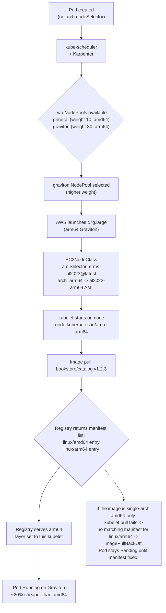

# 14.09 — ARM/Graviton on EKS

> **Graviton (AWS's ARM-based EC2 line) is ~20% cheaper than the
> equivalent x86 instance with the same SLA, and a c7g/m7g/r7g node
> looks identical to a c7i/m7i/r7i node from a Kubernetes
> perspective** — until you try to schedule a Pod whose image only
> ships an `amd64` manifest and discover `ImagePullBackOff: no matching
> manifest for linux/arm64/v8`. The Graviton move is a discount with
> one disciplinary requirement: every container image you run must be
> **multi-arch** (or arm64-only). This chapter walks the Terraform
> NodePool, the `docker buildx` discipline, the mixed-arch cluster
> pattern, and the workloads where ARM is still the wrong call.

**Estimated time:** ~30 min read · ~90 min hands-on
**Prerequisites:** [Part 14 ch.06](./06-cost-guardrails.md) — Graviton is the largest single compute discount available · [Part 13 ch.01](../13-grand-capstone-bookstore-platform/01-bookstore-2-from-toy-to-platform.md) — bookstore tree where Karpenter manages NodePools · [Part 12 ch.06](../06-production-readiness/06-capacity-and-cost.md) — when discounts justify discipline-debt

**You'll know after this:** • understand the ~20% Graviton (arm64) discount over equivalent x86 instances · • configure a Karpenter NodePool that mixes arm64 + amd64 with arch-aware taints · • build multi-arch images with `docker buildx --platform linux/amd64,linux/arm64` · • debug `ImagePullBackOff: no matching manifest for linux/arm64/v8` and resolve it via manifest list · • choose between full-Graviton migration and mixed-arch fleet based on workload constraints (GPU, vendor binaries)

<!-- tags: graviton, cost, eks, finops, cloud -->

## Why this exists

The bookstore-platform tree at
[`../examples/bookstore-platform/terraform/`](../examples/bookstore-platform/terraform/)
defaults to x86 (Karpenter's `general` NodePool selects `amd64`).
Phase 14-R shipped an **opt-in** Graviton NodePool at
[`../examples/bookstore-platform/terraform/karpenter-graviton.tf`](../examples/bookstore-platform/terraform/karpenter-graviton.tf)
gated by `var.enable_graviton_pool = false` — off by default precisely
because flipping it on without first verifying every workload's image
is multi-arch is the failure mode that wastes an afternoon for any
team that didn't do the homework.

The economics are straightforward. AWS prices the Graviton 3 line
(`c7g`, `m7g`, `r7g`) at roughly **20% less** than the equivalent
x86 line (`c7i`, `m7i`, `r7i`) — same vCPU/memory ratios, same network
performance tier, same EBS-Optimized throughput. For a cluster
running 20 nodes at ~$0.10/hour ($72/month per node) that's a $288/month
savings — real money compounding monthly. Graviton 4 (`c8g`, `m8g`,
`r8g`) widens the gap to ~30% on some workload shapes.

The performance story is equally uncomplicated for Go, Java, Python,
Node, Rust, .NET — the modern language runtimes all ship native ARM
builds. The Linux kernel on the EKS-optimized `al2023-arm64` AMI is
the same kernel as `al2023-x86_64`; addon support (vpc-cni,
kube-proxy, CoreDNS, EBS-CSI) is identical across architectures.
Benchmarks vary by workload (some compute-heavy patterns favor x86
SIMD, some memory-bandwidth-heavy patterns favor ARM's cache layout)
but for stateless web services — exactly the bookstore platform's
shape — Graviton matches or beats x86 within noise.

The catch is **image discipline**. A container image is a manifest
that names one or more architecture-specific layers. A single-arch
`amd64`-only image cannot run on an arm64 node — the kubelet's
`ImagePullBackOff` reports `no matching manifest for linux/arm64`.
The fix is to build images as **multi-arch manifests** using
`docker buildx`: one image reference (`my-service:v1.2.3`) backed by
both `amd64` and `arm64` layer sets, the registry serving whichever
matches the pulling node's architecture. For the bookstore Go
services this is a one-line CI change; for an organization with a
fleet of older images, it can be a multi-quarter project.

[Part 04 ch.02](../04-scheduling/02-affinity-taints-topology.md)
covered node selectors and affinity in the abstract; this chapter is
the EKS-specific overlay for routing Pods to the right architecture.
[Part 10 ch.06](../10-cloud-and-managed-kubernetes/06-node-autoscaling-cost-multicloud.md)
covered Karpenter NodePool authoring on managed Kubernetes; this
chapter shows the Graviton-flavoured NodePool the bookstore tree
ships.

> **In production:** Graviton is the right default for any new
> greenfield Kubernetes cluster running stateless services on
> mainstream runtimes. The 20% discount is the highest-ROI single
> Terraform flag you can flip — but only after a one-time `docker
> buildx --platform linux/amd64,linux/arm64` audit of every image in
> the fleet. The audit is cheap; the discount compounds.

## Mental model

**Three layers compose ARM-on-EKS: the NodePool (Karpenter selecting
arm64 instances and the al2023-arm64 AMI), the image (a multi-arch
manifest serving both layer sets), and the Pod (default-scheduled by
NodePool weight, optionally pinned by `nodeSelector`). The
disciplinary surface is the image — get multi-arch right and the rest
is plumbing.**

The three layers:

- **Layer 1 — NodePool & AMI.** Karpenter's `arm64` NodePool selects
  on `kubernetes.io/arch: arm64` (the requirement that triggers AWS
  to launch a c7g/m7g/r7g instance) and references an
  `EC2NodeClass` whose `amiSelectorTerms` resolves to the
  EKS-optimized `al2023@latest` AMI — which, *because* the NodePool
  pins arch=arm64, resolves to the **arm64 variant** of the same AMI
  family. One NodePool, one EC2NodeClass, the AL2023 AMI alias does
  the right thing. The Phase 14-R Graviton NodePool is at
  [`karpenter-graviton.tf`](../examples/bookstore-platform/terraform/karpenter-graviton.tf).
- **Layer 2 — Multi-arch container image.** A container image is a
  manifest. A **single-arch** manifest contains one entry pointing
  at one layer set: `linux/amd64`. A **multi-arch (multi-platform)
  manifest** is a *manifest list* (or OCI image index) with multiple
  entries, one per platform: `linux/amd64`, `linux/arm64`,
  potentially others (`linux/arm/v7`, `linux/s390x`, ...). When the
  kubelet pulls the image, the registry serves the manifest entry
  matching the node's architecture. `docker buildx build
  --platform linux/amd64,linux/arm64 --push` builds and pushes a
  manifest list in one step.
- **Layer 3 — Pod scheduling.** A Pod with no `nodeSelector` on
  arch gets scheduled wherever the scheduler + Karpenter decide is
  cheapest/fittest. With the bookstore tree's Graviton NodePool
  set to `weight: 30` (vs the `general` NodePool at `weight: 10`)
  Karpenter prefers Graviton when both could satisfy the Pod's
  needs — but a Pod that explicitly sets `nodeSelector:
  kubernetes.io/arch: amd64` overrides this and stays on x86.

**`docker buildx` is the only sane build path.** Building two
images and tagging them separately (`my-service:v1.2.3-amd64`,
`my-service:v1.2.3-arm64`) breaks Kubernetes' architecture-aware
pull — the kubelet pulls `my-service:v1.2.3` and the registry has to
know which to serve. The manifest list does this; two separately-
tagged images do not. The `docker buildx` toolchain handles the
manifest list automatically: one build invocation produces both
architectures and pushes a single multi-arch tag.

A minimal Dockerfile change for Go services — typically nothing. Go
cross-compiles cleanly; `GOOS=linux GOARCH=arm64 go build` produces a
working arm64 binary on an amd64 build machine. For multi-arch
builds, `docker buildx` uses **QEMU emulation** under the hood for
the arch the build machine doesn't natively support (or
**multi-platform builders** that run on real ARM hardware via AWS
Graviton CI runners — GitHub Actions has `runs-on: ubuntu-24.04-arm`
since 2024). Native-ARM builds are 5-10x faster than QEMU-emulated;
for serious CI volume, run native.

**When ARM doesn't make sense — the honest list.**

1. **NVIDIA CUDA workloads.** There is **no Graviton+GPU instance
   type**. If your workload requires CUDA (training ML, GPU
   inference at scale), you're on `g6.*` or `p5.*` — both x86.
   Graviton is not an option for GPU-bound work. (AWS Trainium /
   Inferentia accelerators exist on ARM-adjacent platforms but
   they're a different programming model from CUDA.)
2. **Legacy x86-only binaries.** Anything that bundles a closed-
   source vendor library compiled for `linux/amd64` (some database
   client libraries, some financial-modeling toolkits, some legacy
   commercial software) won't run on arm64. Open-source language
   runtimes (Go, Java, Python, Node, Rust) ship arm64 builds; the
   long tail of vendor-binary-bundling images doesn't.
3. **JNI libraries without ARM builds.** A Java image that bundles
   a native shared library (`.so`) compiled for `linux/amd64`
   crashes on arm64 with `UnsatisfiedLinkError`. The fix is to ship
   the arm64 variant of the library — sometimes available, sometimes
   not.
4. **Some compute-heavy benchmarks favor x86 SIMD.** AVX-512 (Intel
   advanced vector extensions) accelerates certain workloads (some
   crypto, some scientific compute) that ARM's NEON doesn't match.
   For mainstream web/API services this is irrelevant; for
   specialized compute, benchmark first.
5. **Anything that depends on Intel ME or specific x86 firmware
   features.** Rare in containers, but exists.

For everything else — the entire bookstore-platform stack, every
mainstream microservice, every modern Go/Java/Python web service —
Graviton works.

**Mixed-arch cluster pattern.** The right pattern for a real fleet
is **both NodePools**: the existing `general` (amd64) NodePool stays
for legacy / single-arch images; the new `graviton` (arm64) NodePool
takes everything that's multi-arch. Karpenter's weight controls the
preference (`graviton.weight: 30 > general.weight: 10`), so new
greenfield Pods land on Graviton first; legacy Pods pinned with
`nodeSelector: kubernetes.io/arch: amd64` stay on x86. The two
NodePools coexist; you migrate workloads one by one.

The trap to keep in view: **a Pod that lands on arm64 with an
amd64-only image takes ~15 minutes to surface the error**. Karpenter
launches the node, the kubelet attempts the pull, the pull fails
with `no matching manifest for linux/arm64/v8`, the Pod's events
record `ImagePullBackOff`, the Pod stays Pending. If you don't have
alerts wired on `ImagePullBackOff` you'll spend an afternoon hunting
the failure. Either fix the image (multi-arch) or fix the schedule
(pin to amd64 with `nodeSelector`). Don't leave it dangling.

## Diagrams

### Diagram A — Pod -> NodePool -> Graviton instance -> multi-arch image pull (Mermaid)



### Diagram B — Single-arch vs multi-arch manifest (ASCII)

```text
SINGLE-ARCH IMAGE (legacy):
  bookstore/catalog:v1.0.0
    -> registry returns:
       Manifest (single)
         architecture: amd64
         os: linux
         layers: [sha256:abc..., sha256:def..., ...]

  Pull from arm64 node:
    kubelet asks: "what's the layer set for linux/arm64?"
    registry: "I only have linux/amd64."
    kubelet: ImagePullBackOff: no matching manifest for linux/arm64/v8

MULTI-ARCH MANIFEST LIST (the goal):
  bookstore/catalog:v1.2.3
    -> registry returns:
       Manifest List (OCI Image Index)
         entries:
           {os: linux, arch: amd64} -> Manifest(amd64) -> layers [sha256:xyz..., ...]
           {os: linux, arch: arm64} -> Manifest(arm64) -> layers [sha256:uvw..., ...]

  Pull from arm64 node: kubelet gets the arm64 entry, pulls those layers.
  Pull from amd64 node: kubelet gets the amd64 entry, pulls those layers.
  ONE TAG, BOTH ARCHITECTURES, automatic.

BUILD COMMAND:
  docker buildx build \
    --platform linux/amd64,linux/arm64 \
    --tag <REGISTRY>/<REPO>:<TAG> \
    --push .
  -> builds both, pushes one manifest list.

INSPECT:
  docker buildx imagetools inspect <REGISTRY>/<REPO>:<TAG>
  -> prints the manifest list entries; verifies arm64 is present.
```

## Hands-on with the Bookstore Platform

### 0. Prerequisites

- The bookstore-platform tree applied with `enable_graviton_pool = true`
  in `terraform.tfvars` (the
  [`karpenter-graviton.tf`](../examples/bookstore-platform/terraform/karpenter-graviton.tf)
  resource creates the NodePool).
- `kubectl` configured against the cluster.
- `docker` with `buildx` (Docker Desktop ships it; for CLI installs see
  [docs.docker.com/buildx/working-with-buildx](https://docs.docker.com/buildx/working-with-buildx/)).
- An OCI registry the cluster can pull from (ECR, GHCR, Docker Hub).

The Graviton NodePool definition is in
[`../examples/bookstore-platform/terraform/karpenter-graviton.tf`](../examples/bookstore-platform/terraform/karpenter-graviton.tf).
Read it before running anything; the `kubernetes.io/arch: arm64`
requirement is the load-bearing constraint.

### 1. Enable the Graviton NodePool

In your `terraform.tfvars`:

```hcl
enable_graviton_pool          = true
karpenter_general_cpu_limit   = "200"
karpenter_general_memory_limit = "800Gi"
```

Apply:

```bash
cd examples/bookstore-platform/terraform
terraform plan -out=tfplan
terraform apply tfplan
```

Verify the NodePool exists:

```bash
kubectl get nodepool
# NAME       NODECLASS   NODES   READY   AGE
# general    default     2       True    7d
# graviton   default     0       True    1m
```

`graviton` has zero nodes — that's normal. Karpenter only provisions
nodes when a Pod requires them.

### 2. Build a multi-arch image

For one of the bookstore Go services (catalog, orders, ...):

```bash
cd examples/bookstore/app/catalog

# Create a builder that supports multi-platform builds (one-time).
docker buildx create --name multiarch --use --bootstrap

# Build and push the multi-arch image.
docker buildx build \
  --platform linux/amd64,linux/arm64 \
  --tag <REGISTRY>/bookstore-catalog:v1.2.3 \
  --push .
```

The build runs both architectures concurrently — amd64 on the native
host CPU, arm64 via QEMU emulation if the host is amd64. On a
multi-arch build runner (GitHub Actions `ubuntu-24.04-arm`, AWS
CodeBuild Graviton, or a self-hosted Graviton CI machine), arm64
builds run natively at full speed.

> **In production:** Set up native ARM CI runners. QEMU-emulated arm64
> builds work for occasional one-offs; for a CI pipeline running
> hundreds of builds/day, the emulation overhead is 5-10x slower than
> native. GitHub Actions' `ubuntu-24.04-arm` (a Graviton-backed runner)
> closes the gap; AWS CodeBuild's `graviton2.medium` and `graviton3.large`
> images are the AWS-native option.

### 3. Verify the manifest is multi-arch

```bash
docker buildx imagetools inspect <REGISTRY>/bookstore-catalog:v1.2.3
```

Expected output (truncated):

```text
Name:      <REGISTRY>/bookstore-catalog:v1.2.3
MediaType: application/vnd.oci.image.index.v1+json
Digest:    sha256:<DIGEST>

Manifests:
  Name:      <REGISTRY>/bookstore-catalog:v1.2.3@sha256:<AMD64-DIGEST>
  MediaType: application/vnd.oci.image.manifest.v1+json
  Platform:  linux/amd64

  Name:      <REGISTRY>/bookstore-catalog:v1.2.3@sha256:<ARM64-DIGEST>
  MediaType: application/vnd.oci.image.manifest.v1+json
  Platform:  linux/arm64
```

Two `Manifests:` entries, one per platform. If you see only `linux/amd64`,
the build failed to produce arm64 — check the build logs.

### 4. Deploy a Pod that lands on Graviton

Save as `/tmp/catalog-graviton.yaml`:

```yaml
apiVersion: v1
kind: Pod
metadata:
  name: catalog-graviton-test
  namespace: default
  labels:
    arch-test: graviton
spec:
  # Pin to arm64 so the scheduler MUST place on the Graviton NodePool.
  nodeSelector:
    kubernetes.io/arch: arm64
  containers:
    - name: catalog
      image: <REGISTRY>/bookstore-catalog:v1.2.3
      ports:
        - containerPort: 8080
      resources:
        requests: { cpu: 100m, memory: 128Mi }
        limits:   { cpu: 500m, memory: 256Mi }
```

Apply:

```bash
kubectl apply -f /tmp/catalog-graviton.yaml
kubectl get pod catalog-graviton-test -w
# Status: Pending -> Pending (Karpenter provisioning) -> ContainerCreating -> Running
```

Within ~60 seconds, Karpenter notices the unschedulable Pod, launches
a `c7g.large` (or similar Graviton 3 instance), the kubelet pulls the
arm64 image layer, the Pod runs.

Verify the node arch:

```bash
NODE=$(kubectl get pod catalog-graviton-test -o jsonpath='{.spec.nodeName}')
kubectl get node "$NODE" -o jsonpath='{.metadata.labels.kubernetes\.io/arch}'
# Output: arm64

kubectl get node "$NODE" -o jsonpath='{.metadata.labels.node\.kubernetes\.io/instance-type}'
# Output: c7g.large (or similar Graviton 3)
```

### 5. Show what happens with a single-arch image

To prove the failure mode, deploy a Pod whose image is amd64-only
onto the Graviton NodePool:

```yaml
apiVersion: v1
kind: Pod
metadata:
  name: legacy-amd64-on-arm64
  namespace: default
spec:
  nodeSelector:
    kubernetes.io/arch: arm64
  containers:
    - name: shell
      # An amd64-only image as a deliberate failure case. The :3.18
      # tag predates Alpine's multi-arch defaults on some forks; use
      # a deliberately single-arch image here for the demo. Most
      # public images today are multi-arch.
      image: <REGISTRY>/<AMD64-ONLY-IMAGE>:<TAG>
      command: [sh, -c, "sleep 3600"]
```

Apply and watch:

```bash
kubectl apply -f /tmp/legacy.yaml
kubectl describe pod legacy-amd64-on-arm64 | grep -A 3 Events
# Events:
#   Warning  Failed       1m (x3)  kubelet  Failed to pull image:
#     no matching manifest for linux/arm64/v8 in the manifest list entries
#   Warning  Failed       1m (x3)  kubelet  Error: ErrImagePull
```

This is the failure mode you'd hit in production if you flip
`enable_graviton_pool` on without verifying every image is
multi-arch. The fix is either to multi-arch the image (preferred)
or to pin its Pod to amd64.

```bash
kubectl delete pod legacy-amd64-on-arm64
```

### 6. Mixed-arch cluster: deploy a Deployment with both arch tolerances

Most production services should be able to run on either arch. Drop
the `nodeSelector` and let Karpenter pick the cheaper option:

```yaml
apiVersion: apps/v1
kind: Deployment
metadata:
  name: catalog
  namespace: default
spec:
  replicas: 3
  selector:
    matchLabels: { app: catalog }
  template:
    metadata:
      labels: { app: catalog }
    spec:
      # NO nodeSelector for arch -> Karpenter picks based on weight + cost.
      # The bookstore-platform NodePool weights:
      #   graviton.weight = 30  (preferred)
      #   general.weight  = 10
      # Karpenter places new Pods on graviton when capacity is available.
      containers:
        - name: catalog
          image: <REGISTRY>/bookstore-catalog:v1.2.3
          resources:
            requests: { cpu: 100m, memory: 128Mi }
            limits:   { cpu: 500m, memory: 256Mi }
```

After apply:

```bash
kubectl get pods -l app=catalog -o wide
# 3 Pods running. Check the node arch each landed on:
for pod in $(kubectl get pods -l app=catalog -o name); do
  node=$(kubectl get $pod -o jsonpath='{.spec.nodeName}')
  arch=$(kubectl get node $node -o jsonpath='{.metadata.labels.kubernetes\.io/arch}')
  echo "$pod -> $node ($arch)"
done
```

Expect most/all on `arm64` because the Graviton NodePool has higher
weight; a few may land on `amd64` if Karpenter consolidates onto an
existing node.

### 7. Inspect the cost saving

The bookstore platform's `cost-budgets.tf` ships a tag-based AWS Cost
Explorer query. After 24 hours of mixed workload:

```bash
# date -d is GNU date; macOS users: replace with date -v-7d +%Y-%m-%d
aws ce get-cost-and-usage \
  --time-period Start=$(date -d '7 days ago' +%Y-%m-%d),End=$(date +%Y-%m-%d) \
  --granularity DAILY \
  --metrics UnblendedCost \
  --group-by Type=DIMENSION,Key=INSTANCE_TYPE_FAMILY
```

The `c7g`/`m7g`/`r7g` lines show ~20% lower $/hour than `c7i`/`m7i`/`r7i`
of the same vCPU/memory size. At scale (50+ nodes) the savings show
up as a clear line in the daily Cost Explorer chart.

### 8. (Optional) Tear down the demo

```bash
kubectl delete deployment catalog
kubectl delete pod catalog-graviton-test --ignore-not-found
```

Karpenter consolidates the Graviton nodes back to zero within ~30
seconds of the last Pod leaving.

## How it works under the hood

**Image manifest lists (OCI image index).** The OCI spec defines two
top-level content types: an **image manifest** (single architecture,
contains a list of layer SHAs) and an **image index** (manifest list,
contains references to multiple per-arch manifests). Both are JSON
documents stored in the registry; the registry serves whichever the
pulling client asks for via the `Accept:` HTTP header. Modern kubelets
send `Accept: application/vnd.oci.image.index.v1+json,
application/vnd.docker.distribution.manifest.list.v2+json,
application/vnd.oci.image.manifest.v1+json, ...` — when the registry
has an index, it picks the per-arch manifest matching the kubelet's
runtime (Linux kernel reports the arch to the kubelet; the kubelet
forwards it as an `OS:` field in the registry request).

**`docker buildx` and BuildKit.** Buildx is the Docker CLI plugin that
wraps **BuildKit** (Docker's modern build engine). BuildKit's
`--platform` flag triggers multi-platform mode: for each platform in
the list, BuildKit either uses a builder node matching that arch
(native) or runs the build inside QEMU emulation. The resulting
single-platform images are pushed to a temporary registry location,
then a final step writes the manifest list pointing at both. The
client sees one tag (`bookstore-catalog:v1.2.3`) backed by both
per-arch images.

**QEMU emulation cost.** `binfmt_misc` (the Linux kernel's binary-
format dispatch) routes arm64 ELF binaries to QEMU's
`qemu-aarch64-static` on an amd64 host. Each instruction is
interpreted by QEMU — fast for I/O-bound work (file I/O, network
calls) but slow for CPU-bound work (compilation, image build).
Typical slowdown for `docker buildx` on amd64 building arm64: 5-10x.
For a Go service that takes 20 seconds to build natively, the arm64
emulation takes 2-3 minutes. Tolerable for occasional builds;
painful at scale.

**Native ARM CI runners.** GitHub Actions' `ubuntu-24.04-arm` runner
launched in GA in October 2024 — a Graviton-backed VM that runs arm64
builds at full native speed. AWS CodeBuild's `graviton2.medium` and
`graviton3.large` runner types do the same. A typical CI matrix
parallelizes the two arches: one job on `ubuntu-24.04` (amd64), one on
`ubuntu-24.04-arm`. Each builds its native arch fast; a final job
combines them into a manifest list with `docker buildx imagetools
create`.

**Karpenter's NodePool weight semantics.** When multiple NodePools
satisfy a Pod's requirements, Karpenter picks the one with the
**highest weight** that can accommodate the Pod's resource request. A
Pod with no arch constraint matches both `general` (amd64, weight
10) and `graviton` (arm64, weight 30); graviton wins. A Pod with
`nodeSelector: kubernetes.io/arch: amd64` only matches `general`;
`general` is selected regardless of weight. Weights are integers
0-100; the bookstore tree uses 10/30/50 (general/graviton/spot) so
the order is unambiguous.

**EC2 AMI alias resolution.** The `EC2NodeClass.amiSelectorTerms`
field accepts both explicit AMI IDs and AWS Systems Manager Parameter
Store aliases like `al2023@latest`. When Karpenter resolves the alias
to launch an instance, it picks the AMI matching the
**instance type's architecture**. A c7g (arm64) gets the `al2023-
arm64@latest` AMI; a c7i (amd64) gets the `al2023-amd64@latest` AMI.
One alias, two resolutions, picked at instance-launch time. This is
why the Graviton NodePool can share the `default` EC2NodeClass with
the amd64 NodePool — the alias does the right thing.

**Pod scheduling: arch-aware affinity.** The kubelet on every node
sets a built-in label `kubernetes.io/arch=<ARCH>` (amd64 or arm64).
A Pod with `nodeSelector: kubernetes.io/arch: arm64` requires nodes
matching that label — only arm64 nodes qualify. Without the selector,
the scheduler tries any node; the NodePool weight determines
preference, but a Pod that *can't* run on arm64 (its image is amd64-
only) won't surface that as a scheduling error — it'll surface at
**image pull time**, after the node is provisioned and the kubelet
attempts the pull. That's the trap.

**Why `ImagePullBackOff` is the only visible signal.** The CRI
contract is: kubelet pulls image, registry serves manifest, kubelet
verifies the manifest matches the node's arch, kubelet unpacks
layers. The "does the manifest match" check happens in step 3.
There's no admission-time check that "this Pod's image supports this
node's architecture" — admission runs before the Pod is scheduled,
before the node is even chosen. So a multi-arch image audit is **a
build-time discipline**, not an admission-time enforcement. Tools
like Trivy can list a manifest's platforms; integrate that into CI.

## Production notes

> **In production:** Set up native ARM CI runners. QEMU-emulated
> multi-arch builds work fine for dozens of builds/day; at hundreds
> of builds/day the emulation overhead is real engineering time.
> GitHub Actions' `ubuntu-24.04-arm` (Graviton-backed runner) and AWS
> CodeBuild's `arm-graviton3.large` image type are the AWS-native
> options. The CI cost difference is small ($0.008/min vs
> $0.005/min on AWS); the developer-feedback-loop difference is
> 5-10x.

> **In production:** Audit every image in the fleet for multi-arch
> support **before** flipping `enable_graviton_pool = true`. A
> simple script: `for img in $(kubectl get pods --all-namespaces -o
> jsonpath='{..spec.containers[*].image}'); do docker buildx
> imagetools inspect "$img" 2>&1 | grep -q linux/arm64 || echo
> "MISSING: $img"; done`. The output is the work list — every image
> on the MISSING list either needs to multi-arch or its Pod needs to
> pin `kubernetes.io/arch: amd64`.

> **In production:** Do not run mixed-arch Postgres replicas in CNPG.
> A CNPG primary on arm64 and standby on amd64 is technically
> supported (Postgres binaries are arch-agnostic at the protocol
> level), but the per-arch differences in WAL replay performance and
> some extension binaries (`pg_stat_statements`, `pgvector`) can
> create surprises during failover. Pin the full CNPG cluster to one
> arch via `nodeSelector` until you've stress-tested cross-arch
> failover end-to-end. The bookstore-platform's CNPG cluster runs on
> amd64 today; moving to arm64 is a deliberate migration, not a
> NodePool toggle.

> **In production:** GPU workloads stay on x86. There is no Graviton
> instance with NVIDIA GPUs. ML inference on bookstore's
> recommendations service uses `g5.xlarge` (NVIDIA A10G, x86); ML
> training on the data team's pipelines uses `p5.*` (NVIDIA H100,
> x86). The Graviton NodePool is for stateless web services + batch
> compute that doesn't need CUDA. AWS Trainium / Inferentia exist on
> ARM-adjacent platforms (`trn1`, `inf2`) for specialized ML
> workloads — different programming model from CUDA; treat as a
> separate decision.

> **In production:** Run the `kubectl describe pod` event check on
> any Pod in `Pending` for > 2 minutes. The two failure modes —
> `Insufficient cpu/memory` (Karpenter needs more time to scale) and
> `no matching manifest for linux/arm64/v8` (image not multi-arch)
> — look similar from a `kubectl get pods` view but require entirely
> different fixes. Wire an alert on `ImagePullBackOff` in
> Prometheus/Alertmanager — the bookstore stack ships a rule (Phase
> 13c ch.13.12); if you didn't ship it, write it.

> **In production:** Container image signing (cosign) verifies the
> digest **of the per-arch manifest entry the kubelet pulled**, not
> the manifest list as a whole. So a signed multi-arch image has one
> signature **per platform** — sign all platforms in CI, or your
> Kyverno `verifyImages` policy will reject the arch you didn't sign.
> The `cosign sign --recursive` flag signs every entry in the
> manifest list in one go; that's the right shape. The supply-chain
> chapter ([14.12](./12-supply-chain-security.md)) walks the
> end-to-end multi-arch + signing pipeline.

## Quick Reference

```bash
# Enable the Graviton NodePool.
terraform apply -var='enable_graviton_pool=true'

# Inspect the running NodePools.
kubectl get nodepool

# Build + push a multi-arch image.
docker buildx build \
  --platform linux/amd64,linux/arm64 \
  --tag <REGISTRY>/<IMAGE>:<TAG> \
  --push .

# Verify a manifest is multi-arch (both platforms present).
docker buildx imagetools inspect <REGISTRY>/<IMAGE>:<TAG>

# Pin a Pod to Graviton.
kubectl patch deployment <NAME> --type=strategic \
  -p '{"spec":{"template":{"spec":{"nodeSelector":{"kubernetes.io/arch":"arm64"}}}}}'

# Find Pods that ImagePullBackOff (likely arch mismatch in a mixed-arch cluster).
kubectl get pods --all-namespaces \
  --field-selector=status.phase=Pending \
  -o wide | grep -E 'ImagePullBackOff|ErrImagePull'
```

Minimal arm64-only NodePool YAML skeleton (the Karpenter v1 shape):

```yaml
apiVersion: karpenter.sh/v1
kind: NodePool
metadata:
  name: graviton
spec:
  weight: 30
  template:
    spec:
      nodeClassRef:
        group: karpenter.k8s.aws
        kind: EC2NodeClass
        name: default
      requirements:
        - key: kubernetes.io/arch
          operator: In
          values: [arm64]
        - key: kubernetes.io/os
          operator: In
          values: [linux]
        - key: node.kubernetes.io/instance-type
          operator: In
          values: [c7g.large, c7g.xlarge, m7g.large, m7g.xlarge, r7g.large, r7g.xlarge]
        - key: karpenter.sh/capacity-type
          operator: In
          values: [spot, on-demand]
  disruption:
    consolidationPolicy: WhenEmptyOrUnderutilized
    consolidateAfter: 30s
```

Graviton-readiness checklist (the cluster is ready when all six are yes):

- [ ] Every container image in the fleet has a multi-arch manifest
      (verified with `docker buildx imagetools inspect`).
- [ ] CI builds multi-arch by default
      (`docker buildx build --platform linux/amd64,linux/arm64`).
- [ ] Karpenter NodePool with `kubernetes.io/arch: arm64` requirement
      is deployed and weighted higher than the amd64 NodePool.
- [ ] Workloads that *cannot* run on arm64 (CUDA, vendor x86-only
      binaries) have explicit `nodeSelector: kubernetes.io/arch: amd64`.
- [ ] Alerting wired on `ImagePullBackOff` Pod events (catches arch
      mismatches within minutes, not hours).
- [ ] Cosign signs every platform entry in the manifest list (the
      `--recursive` flag); Kyverno `verifyImages` accepts all signed
      arches.

## Test your understanding

> Try each before opening the answer drawer. The act of trying is the exercise; the answer is the check.

1. **Why does the chapter insist on multi-arch manifests rather than separate `:tag-amd64` / `:tag-arm64` tags?**
   <details><summary>Show answer</summary>

   Kubernetes pulls images by their tag without knowing the node's architecture in the pull request — the registry handles the arch resolution. A multi-arch manifest list lets one tag (`my-service:v1.2.3`) point to multiple per-architecture layer sets, and the registry serves whichever entry matches the kubelet's `linux/amd64` or `linux/arm64` request. Two separately-tagged images break this: the kubelet pulls `my-service:v1.2.3` and the registry has no way to choose. Then you have to put arch-specific tags in the Deployment, which means the same Deployment can't span architectures, which defeats the cost-arbitrage Karpenter could do.

   </details>

2. **You enable `var.enable_graviton_pool = true` on a Friday afternoon, and the platform's payments service goes into `ImagePullBackOff: no matching manifest for linux/arm64/v8` on Monday morning. What's the diagnosis and immediate fix?**
   <details><summary>Show answer</summary>

   The payments image is single-arch amd64 — the build pipeline didn't run `docker buildx --platform linux/amd64,linux/arm64`. The Graviton NodePool with higher weight pulled the Pod onto an arm64 node, the pull failed. Immediate fix: add `nodeSelector: kubernetes.io/arch: amd64` to the payments Deployment to pin it back to x86 nodes while you fix the build. Then patch the CI workflow to use `docker buildx build --platform linux/amd64,linux/arm64 --push`, rebuild + push the multi-arch image, remove the nodeSelector. The chapter's discipline: audit every image with `docker manifest inspect <image> | jq '.manifests[].platform'` *before* flipping the Graviton flag in production.

   </details>

3. **A Java team reports their Spring Boot service crashes on arm64 with `UnsatisfiedLinkError` even though the Dockerfile uses `eclipse-temurin:21-jre` (multi-arch base). What's likely happening?**
   <details><summary>Show answer</summary>

   The service bundles a native JNI library (`.so`) compiled for `linux/amd64` only — the multi-arch base image carries the JVM for both archs, but the application's bundled native dependency is x86-only. Common offenders: image-processing libraries with native bindings, some cryptography accelerators, vendor-provided database clients. The fix is to ship the arm64 build of the library (sometimes available from the upstream project, sometimes you have to compile it). If the library has no arm64 build, the service stays pinned to amd64 with an explicit `nodeSelector`.

   </details>

4. **Hands-on extension — bring up the Graviton NodePool with `weight: 30` while the `general` NodePool stays at `weight: 10`. Deploy a 10-replica multi-arch service and watch where pods land.**
   <details><summary>What you should see</summary>

   Karpenter prefers the higher-weighted NodePool when both could satisfy the Pod's requirements. New pods land on c7g/m7g instances (arm64), and Karpenter provisions arm64 nodes first. Older `general`-pool nodes still serve existing pods until they expire / drain; new replicas are arm64. After 720h (the `expireAfter`), the cluster is effectively all-Graviton — the ~20% discount kicks in once the rotation is complete. The lesson: weight is the cost-routing knob, not the only knob — anti-affinity, taints, and explicit nodeSelectors still override it.

   </details>

## Further reading

- **AWS Graviton documentation**
  <https://docs.aws.amazon.com/AWSEC2/latest/UserGuide/aws-graviton-processors.html>;
  the authoritative source for instance-family lineage, supported
  workloads, and the per-generation performance + price math.
- **Docker buildx multi-platform docs**
  <https://docs.docker.com/build/building/multi-platform/>; the
  upstream reference for the `--platform` flag, the OCI image-index
  output format, and the QEMU emulation path.
- **Karpenter NodePool requirements reference**
  <https://karpenter.sh/docs/concepts/nodepools/>; the upstream
  reference for the `requirements` block this chapter's NodePool
  uses, including the AWS-specific labels like `karpenter.sh/capacity-
  type` and `node.kubernetes.io/instance-type`.
- **OCI Image Index specification**
  <https://github.com/opencontainers/image-spec/blob/main/image-index.md>;
  the standard that defines the multi-arch manifest list this chapter
  relies on.
- **GitHub Actions ARM runners announcement**
  <https://github.blog/changelog/2024-10-30-arm64-on-github-actions-powered-by-azure/>;
  the milestone that made native arm64 CI runs widely available
  outside AWS-native CI.
- **AWS Graviton getting-started + workload-compatibility guide**
  <https://github.com/aws/aws-graviton-getting-started>; AWS's
  open-source repository with per-language porting guides and
  performance-tuning notes, including the JNI / native-library cases
  this chapter flags.
