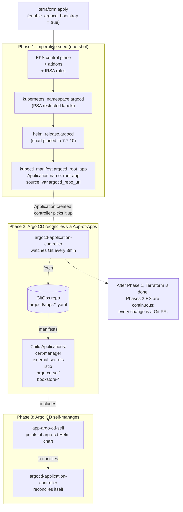

# 14.10 — GitOps bootstrap on a fresh EKS cluster

> **GitOps reconciles the cluster from Git — but Argo CD itself must
> first exist in the cluster, and Argo CD's own manifests should
> probably also be in Git, which means somebody has to install
> Argo CD from outside of GitOps.** This chicken-and-egg has a clean
> resolution: Terraform installs Argo CD as a one-shot bootstrap, then
> Argo CD takes over and reconciles everything else (including itself
> on subsequent syncs) from a single root **App-of-Apps** Application.
> This chapter walks the bootstrap end-to-end on the bookstore-
> platform tree, the App-of-Apps pattern, Argo CD's own self-management
> trick, and the sealed-secret bootstrap that has the same problem in
> miniature.

**Estimated time:** ~30 min read · ~90 min hands-on
**Prerequisites:** [Part 14 ch.02](./02-eks-cluster-lifecycle.md) — fresh cluster you'll bootstrap into · [Part 12 ch.01](../07-delivery/04-gitops-argocd.md) — Argo CD + App-of-Apps fundamentals · [Part 13 ch.01](../13-grand-capstone-bookstore-platform/01-bookstore-2-from-toy-to-platform.md) — bookstore Git tree that becomes the source of truth

**You'll know after this:** • resolve the GitOps chicken-and-egg (Argo CD must exist before it can reconcile from Git) via Terraform one-shot install · • design an App-of-Apps root Application that pulls every other workload from Git · • configure Argo CD to manage itself on subsequent syncs · • bootstrap sealed-secrets or SealedSecret keys before any sealed material lands · • execute a full fresh-cluster bootstrap on the bookstore-platform tree from `terraform apply` to "all green"

<!-- tags: gitops, argo-cd, eks, platform-engineering, cloud -->

## Why this exists

The bookstore-platform tree at
[`../examples/bookstore-platform/terraform/`](../examples/bookstore-platform/terraform/)
ships an opt-in Argo CD bootstrap at
[`../examples/bookstore-platform/terraform/argocd-bootstrap.tf`](../examples/bookstore-platform/terraform/argocd-bootstrap.tf)
gated by `var.enable_argocd_bootstrap = false` — off by default
because most teams want to control the GitOps bootstrap order
explicitly. When you flip it on, Terraform creates the `argocd`
namespace, installs the Argo CD Helm chart, and applies a single
root `Application` (`root-app`) that points at your GitOps repo's
`argocd/apps/` directory. Every other Application — for cert-manager,
External Secrets Operator, Istio, the bookstore workloads, anything
— is a child Application under that root, discovered via the
**App-of-Apps** pattern.

The chicken-and-egg, stated precisely:

1. **GitOps requires a reconciler.** Argo CD is the reconciler in
   this stack. Nothing in the cluster watches Git unless Argo CD
   exists.
2. **Argo CD has its own manifests.** The Helm chart that installs
   Argo CD generates a few dozen Deployments, Services, ServiceAccounts,
   CRDs, RBAC bindings. All of these should be in Git so the install
   is reproducible.
3. **Argo CD can sync itself.** Argo CD can have an `Application`
   that points at the same chart's Helm values and reconciles its own
   Deployment when those values change. But that Application can only
   be **created after Argo CD exists** — Argo CD must run first to
   process the Application that updates Argo CD.

The resolution is **one-shot Terraform bootstrap + GitOps self-
management**: Terraform installs Argo CD exactly once (the "imperative
seed"); Argo CD then takes over and from that point forward, every
change to Argo CD's configuration goes through Git. Subsequent
`terraform apply` operations on `argocd-bootstrap.tf` are no-ops (the
Helm release is in the state file; the chart values don't change
unless you change them in `.tfvars`). Argo CD reconciles itself for
ongoing updates.

The **App-of-Apps pattern** is the canonical GitOps shape for a
cluster running dozens of Applications. Instead of `kubectl apply`-ing
one Application manifest per workload (cert-manager, ESO, Istio, the
bookstore services, ...) you commit one root Application to Terraform-
managed bootstrap, and that root points at a Git directory full of
**other Application manifests**. Argo CD's directory mode (`directory:
{ recurse: true }`) discovers every `.yaml` in that subtree and
applies them. Add a new workload? Commit a new Application manifest.
The cluster picks it up at next sync without any out-of-band action.

The **sealed-secret bootstrap** is the same chicken-and-egg with
smaller pieces: ESO needs an OIDC trust set up (typically by
Terraform's IRSA wiring), then ESO can pull from AWS Secrets Manager;
but ESO's own controller credentials should be... in AWS Secrets
Manager? Or pre-seeded by Terraform? The honest answer is "Terraform
seeds the controller credentials in AWS Secrets Manager, ESO uses its
IRSA role to fetch them, ESO then pulls all other secrets through the
same path". One imperative seed; everything thereafter is GitOps.

[Part 07 ch.04](../07-delivery/04-gitops-argocd.md) introduced
Argo CD, Applications, and the directory-mode reconciliation in the
abstract. [Part 13 ch.03](../13-grand-capstone-bookstore-platform/03-multi-region-active-active.md)
showed the multi-cluster ApplicationSet pattern (Cluster generator).
This chapter is the EKS-specific overlay: how Terraform installs the
Argo CD that will then take over, what the App-of-Apps tree looks
like, and how to recover from the bootstrap going sideways.

> **In production:** The bootstrap pattern is "Terraform installs
> Argo CD once; Argo CD owns everything else, including itself, from
> then on". Resist the temptation to put non-trivial manifests in
> Terraform — every new resource you add to Terraform is one more
> resource you can't manage through GitOps later. The bookstore tree's
> Terraform installs the cluster substrate, IRSA roles, the
> Argo CD controller, and stops. Everything else flows through Git.

## Mental model

**Three phases compose the GitOps bootstrap: (1) Terraform installs
the cluster + Argo CD imperatively, (2) Argo CD's root Application
reconciles every other Application from Git via App-of-Apps, (3)
Argo CD self-manages from that point on. Phase 1 is one-shot; phases
2 and 3 are continuous.**

The three phases:

- **Phase 1 — Imperative seed (Terraform).** `terraform apply`
  brings up the EKS control plane, attaches addons, creates IRSA
  roles, then runs the `helm_release.argocd` that installs Argo CD
  itself. The release is **pinned** (`var.argocd_helm_chart_version
  = "7.7.10"` in the bookstore tree) so subsequent applies don't
  drift. The same Terraform applies a single `Application` CR
  named `root-app` that points at `<argocd_repo_url>/<argocd_root_
  app_path>`. That's the entire imperative surface. Nothing else
  lives in Terraform; everything else is in Git.
- **Phase 2 — Reconcile via App-of-Apps.** The `root-app`
  Application's source is `<YOUR-REPO>/argocd/apps` with
  `directory: { recurse: true }`. The contents of that directory are **more
  Application manifests** — `app-cert-manager.yaml`,
  `app-external-secrets.yaml`, `app-istio.yaml`,
  `app-bookstore-storefront.yaml`, ... — each pointing at its
  own Helm chart or Kustomize overlay elsewhere in the repo (or in
  a different repo). Argo CD walks the directory, finds the
  Applications, creates them. Each child Application then
  reconciles its own workload. The tree is one root + N children;
  the operator commits one `Application` manifest per new
  workload, and Argo CD picks it up at next sync.
- **Phase 3 — Argo CD self-manages.** A best-practice setup has a
  separate Application (in the `argocd/apps/` directory) that
  points at the same Helm chart Terraform used to install Argo CD,
  with the **same values**. When you bump the chart version in
  Git, Argo CD upgrades itself: it re-renders the chart, sees the
  diff, applies the new manifests. The first sync of this
  self-management Application after the bootstrap is the moment
  Argo CD "takes over" from Terraform. From that point on, every
  Argo CD change is a Git PR.

**Argo CD self-management — the cycle that works.** Argo CD on the
inside is just a set of Deployments + Services + CRDs. The same way
Argo CD reconciles cert-manager (apply Helm chart, watch for drift,
re-apply if drift), it can reconcile its own Deployment. The trick:
the Argo CD Application that points at the argo-cd Helm chart is
processed by the **same Argo CD running it**. If you change the
chart's `version` in Git, Argo CD downloads the new chart, renders
new manifests, applies them, and updates **itself** — the running
controller picks up the new Pod template, the StatefulSet rolls,
the new controller takes over. The risk: a bad value can take down
Argo CD itself; recovery means re-running Terraform's `helm_release`
to put it back. So self-management has a guardrail (the Terraform
fallback) and a discipline (test value changes in a non-prod
cluster first).

**The App-of-Apps tree shape.**

```text
your-org/platform-gitops/                  <- the GitOps repo
├── argocd/
│   └── apps/                              <- root-app's source path
│       ├── app-cert-manager.yaml          <- Argo CD Application
│       ├── app-external-secrets.yaml      <- Argo CD Application
│       ├── app-istio.yaml                 <- Argo CD Application
│       ├── app-argo-cd-self.yaml          <- Argo CD self-management
│       ├── app-bookstore-storefront.yaml
│       ├── app-bookstore-catalog.yaml
│       └── app-bookstore-payments.yaml
├── manifests/
│   ├── cert-manager/                      <- app-cert-manager.yaml points here
│   ├── external-secrets/
│   └── ...
└── helm-charts/
    ├── bookstore-storefront/              <- Helm charts per workload
    └── ...
```

Each `app-*.yaml` in `argocd/apps/` is an Argo CD `Application` CR;
its `source.repoURL` typically points back at the same Git repo, with
`source.path` pointing at the Helm chart or Kustomize overlay. Argo CD's
`directory: { recurse: true }` on the **root-app** discovers every
`.yaml` in `argocd/apps/`, creates the matching Applications, and they
each reconcile their own piece.

**Sealed-secrets / External Secrets bootstrap.** The same pattern,
smaller. ESO is an Argo CD child Application (`app-external-
secrets.yaml`); its IRSA role is created by Terraform; the **AWS
Secrets Manager secret** that holds, say, the Stripe API key is
created out-of-band (CI, a manual `aws secretsmanager create-
secret`, Terraform-with-a-data-source — pick one). Once ESO is
running, the `ExternalSecret` CR (in Git) tells ESO "pull the Stripe
API key from `prod/stripe`"; ESO fetches and writes the K8s Secret;
Pods consume it. The chicken-and-egg: the IRSA trust must be in
place before ESO starts. Solved the same way Argo CD's is: Terraform
creates it once, GitOps takes over.

**Argo CD `selfHeal` + `prune` — the production toggles.**

- **`automated.selfHeal: true`** — if someone `kubectl edit`s a
  resource Argo CD manages, Argo CD reverts the change on next
  sync (default 3-minute reconciliation loop). The "GitOps is the
  source of truth" guarantee.
- **`automated.prune: true`** — when a resource is removed from
  Git, Argo CD deletes it from the cluster on next sync. The
  "no orphan resources" guarantee.

Both `false` by default in Argo CD; the bookstore tree's
`root-app` enables both because that's the correct production
discipline. Without `selfHeal`, manual cluster edits persist
indefinitely (drift). Without `prune`, removed manifests stay
running indefinitely (zombie workloads).

The trap to keep in view: **the bootstrap is irreversible without
careful planning**. Once Argo CD takes over, the Terraform `helm_
release.argocd` resource is no longer the source of truth for
Argo CD's configuration — Git is. If you change the chart values in
`.tfvars` and `terraform apply`, Terraform may "win" briefly (it
re-renders the Helm release), but Argo CD's self-management
Application will re-apply its own values on the next sync and revert
Terraform's change. The right move: change values in Git and let
Argo CD apply them; only re-run Terraform if Argo CD itself is broken
and can't reconcile.

## Diagrams

### Diagram A — Bootstrap sequence: Terraform -> Argo CD -> App-of-Apps -> children (Mermaid)



### Diagram B — App-of-Apps tree (ASCII)

```text
                    +---------------------------+
                    | Terraform: argocd-bootstrap.tf |
                    +-------------+-------------+
                                  |
                                  v (one-shot, idempotent)
        +-------------------------------------------------+
        | Argo CD control plane (in cluster)              |
        |   - argocd-application-controller (statefulset)  |
        |   - argocd-server (UI/API)                       |
        |   - argocd-repo-server (clones Git)              |
        +-------------------------+-----------------------+
                                  |
                                  v (watches the root Application)
        +-------------------------------------------------+
        | Application: root-app                           |
        |   source: <argocd_repo_url>/<root_app_path>/    |
        |   directory.recurse: true                       |
        |   syncPolicy: automated { prune, selfHeal }     |
        +-------------------------+-----------------------+
                                  |
                  +---------------+----------------+----------------+
                  |               |                |                |
                  v               v                v                v
        +---------------+ +--------------+ +--------------+ +--------------+
        | app-cert-     | | app-external-| | app-istio    | | app-argo-cd- |
        | manager       | | secrets      | | (system)     | | self         |
        +-------+-------+ +------+-------+ +------+-------+ +------+-------+
                |                |                |                |
                v                v                v                v
          cert-manager       ESO controller    Istio control    Argo CD itself
          Helm chart         Helm chart        plane Helm       (recursive
                                              chart            self-mgmt)

         +--------------+ +--------------+ +--------------+ +--------------+
         | app-         | | app-         | | app-         | | app-         |
         | bookstore-   | | bookstore-   | | bookstore-   | | bookstore-   |
         | storefront   | | catalog      | | payments     | | ml-platform  |
         +------+-------+ +------+-------+ +------+-------+ +------+-------+
                |                |                |                |
                v                v                v                v
          Helm chart        Helm chart        Helm chart       Kustomize
          per service       per service       per service      overlay

  Operator adds a new workload:
    1. helm-charts/bookstore-newservice/<FILES>     (the chart)
    2. argocd/apps/app-bookstore-newservice.yaml    (the Application CR)
    3. git commit, git push.
    Within 3 minutes Argo CD picks it up and deploys.
```

## Hands-on with the Bookstore Platform

### 0. Prerequisites

- A fresh EKS cluster, the bookstore-platform tree applied with all
  addons (cluster `Active`, nodes `Ready`).
- A Git repository you control (GitHub / GitLab / Bitbucket) for the
  GitOps source. Public or private both work; private repos need a
  read credential wired in Step 4.
- `kubectl` configured against the cluster.
- The Phase 14-R `argocd-bootstrap.tf` at
  [`../examples/bookstore-platform/terraform/argocd-bootstrap.tf`](../examples/bookstore-platform/terraform/argocd-bootstrap.tf) —
  read it end-to-end before running anything.

### 1. Prepare the GitOps repo

Create a minimal directory structure in your repo:

```text
platform-gitops/
└── argocd/
    └── apps/
        └── app-example.yaml
```

Where `app-example.yaml` is a deliberately-trivial Application that
proves the App-of-Apps loop works:

```yaml
# argocd/apps/app-example.yaml
apiVersion: argoproj.io/v1alpha1
kind: Application
metadata:
  name: example-podinfo
  namespace: argocd
spec:
  project: default
  source:
    repoURL: https://stefanprodan.github.io/podinfo
    chart: podinfo
    targetRevision: 6.7.1
    helm:
      values: |
        replicaCount: 1
  destination:
    server: https://kubernetes.default.svc
    namespace: example
  syncPolicy:
    automated:
      prune: true
      selfHeal: true
    syncOptions:
      - CreateNamespace=true
      - ServerSideApply=true
```

Commit and push:

```bash
cd platform-gitops
git add argocd/apps/app-example.yaml
git commit -m "argocd: seed app-of-apps with podinfo example"
git push origin main
```

### 2. Enable the Argo CD bootstrap in Terraform

In your `terraform.tfvars`:

```hcl
enable_argocd_bootstrap   = true
argocd_repo_url           = "https://github.com/<YOUR-ORG>/platform-gitops"
argocd_root_app_path      = "argocd/apps"
argocd_target_revision    = "main"
argocd_helm_chart_version = "7.7.10"  # pinned; do not float
```

Apply:

```bash
cd examples/bookstore-platform/terraform
terraform plan -out=tfplan
terraform apply tfplan
```

Terraform output should show three new resources created:

- `kubernetes_namespace.argocd[0]`
- `helm_release.argocd[0]`
- `kubectl_manifest.argocd_root_app[0]`

Wait for the Helm release to finish (`terraform apply` blocks on
`atomic = true`; the chart's `--wait` flag means all pods must be
`Ready`). Typical time: 3-5 minutes for a cold cluster.

### 3. Verify the Argo CD install

```bash
kubectl -n argocd get pods
# Expected (post-bootstrap, 7.7.x):
# NAME                                                READY   STATUS
# argo-cd-applicationset-controller-...               1/1     Running
# argo-cd-application-controller-0                    1/1     Running
# argo-cd-dex-server-...                              1/1     Running
# argo-cd-notifications-controller-...                1/1     Running
# argo-cd-redis-...                                   1/1     Running
# argo-cd-repo-server-...                             1/1     Running
# argo-cd-server-...                                  1/1     Running
```

Get the initial admin password (used once; rotate after first login):

```bash
kubectl -n argocd get secret argocd-initial-admin-secret \
  -o jsonpath="{.data.password}" | base64 -d
echo
```

Forward the UI to localhost:

```bash
kubectl -n argocd port-forward svc/argo-cd-server 8080:443 &
```

Visit `https://localhost:8080`. Username `admin`, password from above.
You should see one Application (`root-app`) — and within ~30 seconds of
the `root-app` syncing, a second Application (`example-podinfo`)
appears.

### 4. Watch the App-of-Apps cascade

```bash
kubectl -n argocd get applications -w
```

Expected output (over ~60 seconds):

```text
NAME              SYNC STATUS   HEALTH STATUS   REVISION
root-app          OutOfSync     Healthy         (initial)
root-app          Syncing       Progressing     <SHA>
root-app          Synced        Healthy         <SHA>
example-podinfo   OutOfSync     Missing         <SHA>
example-podinfo   Syncing       Progressing     <SHA>
example-podinfo   Synced        Healthy         <SHA>
```

Verify the example podinfo Pods are running:

```bash
kubectl -n example get pods
# NAME                       READY   STATUS    RESTARTS   AGE
# podinfo-...                1/1     Running   0          1m
```

If you see this, the App-of-Apps loop is working. Argo CD watched the
`root-app`'s Git source, found `app-example.yaml`, created an
`Application`, which itself synced the podinfo Helm chart from a
public chart repo.

### 5. Add a new workload via Git PR

This is the **operational test** — the production workflow.

Create `argocd/apps/app-cert-manager.yaml` in your repo:

```yaml
apiVersion: argoproj.io/v1alpha1
kind: Application
metadata:
  name: cert-manager
  namespace: argocd
spec:
  project: default
  source:
    repoURL: https://charts.jetstack.io
    chart: cert-manager
    targetRevision: v1.16.2
    helm:
      values: |
        crds:
          enabled: true
        global:
          leaderElection:
            namespace: cert-manager
  destination:
    server: https://kubernetes.default.svc
    namespace: cert-manager
  syncPolicy:
    automated:
      prune: true
      selfHeal: true
    syncOptions:
      - CreateNamespace=true
      - ServerSideApply=true
```

Commit + push:

```bash
git add argocd/apps/app-cert-manager.yaml
git commit -m "argocd: add cert-manager Application"
git push origin main
```

Within ~3 minutes (Argo CD's default reconciliation poll), the new
Application appears:

```bash
kubectl -n argocd get applications
# NAME              SYNC STATUS   HEALTH STATUS
# root-app          Synced        Healthy
# example-podinfo   Synced        Healthy
# cert-manager      Synced        Healthy   <-- new
```

This is the operational shape: **commit a manifest, Argo CD applies
it**. No `kubectl apply`, no `terraform apply`, no out-of-band action.

> **In production:** Speed up the reconciliation interval with
> Git **webhooks** instead of the 3-minute poll. Set up a webhook
> from your Git host (GitHub/GitLab) pointing at the Argo CD server's
> webhook endpoint; Argo CD reconciles within seconds of the push.
> The poll interval is the floor; webhooks are the ceiling.

### 6. Self-manage Argo CD via a new Application

Create `argocd/apps/app-argo-cd-self.yaml`:

```yaml
apiVersion: argoproj.io/v1alpha1
kind: Application
metadata:
  name: argo-cd
  namespace: argocd
  # finalizer: ensures cascade delete if the Application is ever removed
  finalizers: [resources-finalizer.argocd.argoproj.io]
spec:
  project: default
  source:
    repoURL: https://argoproj.github.io/argo-helm
    chart: argo-cd
    targetRevision: 7.7.10  # SAME version Terraform installed
    helm:
      # IMPORTANT: these values must match what Terraform's
      # helm_release.argocd applied, or Argo CD will revert
      # Terraform's pinning on its next reconcile.
      values: |
        controller:
          replicas: 1
        server:
          replicas: 2
        repoServer:
          replicas: 2
        # ... add the rest from terraform's helm_release values
  destination:
    server: https://kubernetes.default.svc
    namespace: argocd
  syncPolicy:
    automated:
      prune: false   # NEVER prune argo-cd itself
      selfHeal: true
    syncOptions:
      - CreateNamespace=false
      - ServerSideApply=true
```

> **Critical:** `prune: false` on the self-management Application.
> If `prune: true` and Argo CD's own resources ever look "missing"
> from Git (e.g. a misconfigured source), Argo CD would prune
> itself — at which point you cannot recover without re-running
> Terraform. With `prune: false`, the worst case is "Argo CD's
> Application is out of sync" (visible in the UI, fixable in Git),
> not "Argo CD's own controller has been deleted".

Commit + push. Argo CD picks it up; the next sync of `argo-cd` is
effectively a no-op (the cluster already matches the chart). From now
on, bumping `argocd_helm_chart_version` is a **Git PR**: edit the
`targetRevision` to `7.7.11`, commit, Argo CD upgrades itself.

### 7. Verify drift remediation (selfHeal)

Demonstrate that manual edits get reverted:

```bash
# Make a manual change to a resource Argo CD owns.
kubectl -n cert-manager scale deployment cert-manager --replicas=5

# Wait ~30 seconds, then re-check.
kubectl -n cert-manager get deployment cert-manager
# REPLICAS: 1  (Argo CD reverted the manual edit)
```

The `automated: { selfHeal: true }` in the `cert-manager` Application
triggers this. Without selfHeal, the manual scale would persist
indefinitely.

### 8. (Optional) Recover from a broken bootstrap

If `terraform apply` failed mid-bootstrap (network blip, registry
rate-limit, anything), the cluster is left in a partial state. The
recovery:

```bash
# Inspect what got applied.
kubectl -n argocd get all
kubectl -n argocd get application

# If the Application is missing, re-apply just the Application piece:
terraform apply -target='kubectl_manifest.argocd_root_app[0]'

# If the Helm release is half-installed, the chart's atomic=true
# should have rolled back. Verify:
helm -n argocd list
# If it shows "failed", uninstall and re-apply:
helm -n argocd uninstall argo-cd
terraform apply
```

The `atomic = true` setting on the Helm release means failures roll
back the partial install — you should never see a half-installed
Argo CD chart. If you do, `helm uninstall` + `terraform apply` is the
clean path.

## How it works under the hood

**Argo CD architecture — three controllers, one Git source.**

- **argocd-application-controller** — watches `Application` CRs,
  reconciles each one. For each Application, it fetches the source
  from Git (delegating to argocd-repo-server), renders the
  manifests (Helm/Kustomize/Plain), compares against the cluster,
  applies diffs. The reconciliation loop runs every 3 minutes by
  default per Application (configurable; webhooks bypass the
  interval).
- **argocd-repo-server** — clones Git repositories, caches them,
  renders Helm charts or Kustomize overlays on demand. The
  application-controller asks repo-server "what's the manifest set
  for Application X at revision Y?" and repo-server returns the
  rendered output. Repo-server runs Helm/Kustomize binaries
  internally; that's where the chart-rendering CPU goes.
- **argocd-server** — the UI + REST API. Reads the Applications
  from the cluster's etcd; the application-controller is the only
  thing writing to them. Server-only operations (login, port-
  forwards, syncs triggered from UI) go through this component.

**The `Application` CR shape.** An `Application` has three load-
bearing fields: `source` (where the manifests come from),
`destination` (what cluster + namespace they land in), and
`syncPolicy` (manual vs automated, prune, selfHeal). The
application-controller polls source (or receives webhook), renders,
compares, and applies. Multiple sources (Helm chart + value-overrides
in a different repo) are supported via `sources:` — a more advanced
shape this chapter doesn't use; the bookstore tree's children use
single-source per Application.

**App-of-Apps via `directory: { recurse: true }`.** When an
Application's source is a Git path (not a Helm chart, not a Kustomize
overlay), Argo CD treats it as a directory of plain YAMLs. The
`directory: { recurse: true }` option tells Argo CD to descend into
subdirectories and apply every `.yaml`/`.json` it finds.
Combined with one-`Application`-per-file, this enumerates the
children. There's no special "App-of-Apps" mode in Argo CD; it's just
the directory-mode reconciler applied to a directory full of
Applications.

**Why Argo CD can self-manage.** The application-controller doesn't
treat its own deployment specially. From its perspective, the
`argo-cd` Application is the same as any other Application — fetch
the chart, render manifests, apply. When applying the chart's
StatefulSet for the application-controller itself, Kubernetes rolls
the StatefulSet (pod-by-pod); the new application-controller takes
over from the old one. Between the moment the old controller is
killed and the new one is `Ready`, no Applications reconcile — a
brief sync gap. But because `selfHeal` retries indefinitely, all
Applications catch up within minutes of the new controller becoming
ready.

**The bootstrap idempotency.** Terraform's `helm_release` and
`kubectl_manifest` resources are idempotent: applying twice produces
the same state. After Phase 1, subsequent `terraform apply` runs
are no-ops unless you change something in `.tfvars`. If you change
`argocd_helm_chart_version`, Terraform re-renders the chart with the
new version, which conflicts with Argo CD's self-management
Application — Terraform "wins" briefly, then Argo CD reverts on its
next sync. The clean discipline: change Argo CD's version in Git
(the `app-argo-cd-self.yaml`'s `targetRevision`), let Argo CD apply
it, then update `.tfvars` to match (so future Terraform runs don't
revert).

**Sync waves and hooks.** A common requirement: "apply the CRDs
**first**, then the workloads that depend on them". Argo CD's
`argocd.argoproj.io/sync-wave` annotation orders resource application
within a single sync; lower waves apply first. So a CRD bundle gets
`sync-wave: "-1"`; a workload that uses the CRD gets `sync-wave: "0"`.
For App-of-Apps cascades where the root Application creates child
Applications, sync-waves don't span Application boundaries by default;
you sequence children by giving the first ones `sync-wave: "-1"` so
they sync before later children.

**The `resources-finalizer` finalizer.** Argo CD watches the
`finalizers: [resources-finalizer.argocd.argoproj.io]` annotation on
Applications. With it, deleting an Application **cascades** to
deleting its managed resources (the workloads). Without it, deleting
the Application orphans the resources (they remain in the cluster).
The bookstore tree's root Application has this finalizer because if
you `kubectl delete application root-app`, you want every child
Application to delete too, and each child to delete its managed
workloads — a clean teardown. The self-management Application
deliberately does *not* have the finalizer; deleting it shouldn't
delete Argo CD itself.

**Server-side apply (`SSA`).** The `syncOptions: ["ServerSideApply=true"]`
flag tells Argo CD to use **server-side apply** instead of `kubectl
apply`'s legacy client-side strategic merge. Server-Side Apply (SSA) went GA in Kubernetes 1.22 and became the
`kubectl apply` default in 1.27+. SSA cleanly tracks field ownership,
avoiding "last-write-wins" conflicts when multiple controllers
touch the same object. The bookstore tree uses SSA on every
Application for the cleaner ownership model; legacy controllers
that don't support SSA still work because Argo CD falls back.

## Production notes

> **In production:** Pin Argo CD's chart version explicitly (in
> Terraform's `var.argocd_helm_chart_version` and in the self-
> management Application's `targetRevision`). Both must agree. Bump
> by changing both in the same PR; otherwise Terraform and Argo CD
> will fight over the chart version on every apply.

> **In production:** Argo CD's initial admin password is in the
> `argocd-initial-admin-secret` Secret. **Rotate this within minutes
> of bootstrap**. Wire SSO (OIDC) via the `argocd-cm` ConfigMap +
> `argocd-rbac-cm` so day-to-day operators authenticate against
> your IdP, not against the local admin. The local admin should
> become break-glass: stored in a vault, used only when SSO is down.

> **In production:** Limit the `default` AppProject's
> `sourceRepos` + `destinations` to your real repos + clusters. The
> default `*`/`*` is wide open — every Application can sync any
> resource type to any namespace from any Git repo. A misconfigured
> Application could overwrite kube-system. The fix: create custom
> AppProjects per tenant (e.g. `bookstore`, `platform`), each
> restricted to specific repos + destinations, and assign
> Applications to them. The bookstore tree's `default` project is
> the teaching-friendly default; production forks should tighten.

> **In production:** Avoid `prune: true` on the self-management
> Application. If Argo CD ever syncs against a misconfigured Git
> revision where its own resources appear "missing" (an empty
> manifest file, a typo in the chart name), prune-on-self-management
> would delete Argo CD itself. The recovery is `terraform apply` to
> re-bootstrap — possible but painful. Prune-false on the
> self-management Application caps the worst case at "Argo CD's
> Application is out of sync", which is visible and fixable in Git.

> **In production:** Use a dedicated **management cluster** for Argo
> CD in multi-cluster setups. The Argo CD that manages 10 clusters
> shouldn't be on the same cluster as a tenant workload — a tenant
> outage shouldn't drag Argo CD down. The multi-cluster pattern
> ([Part 13 ch.03](../13-grand-capstone-bookstore-platform/03-multi-region-active-active.md))
> places Argo CD on one cluster and lets it reconcile every other
> cluster via the Cluster generator + ApplicationSet. That cluster
> is a single point of failure unless you stand up **two** Argo CDs
> in two regions (passive-active) — the
> [Part 13 ch.03](../13-grand-capstone-bookstore-platform/03-multi-region-active-active.md)
> production-notes section walks the trade.

> **In production:** Git webhooks make the difference between
> "GitOps is fast" and "GitOps is slow". The default 3-minute poll
> means a commit takes up to 3 minutes to reconcile; a webhook
> reconciles within seconds. Set up webhooks from your Git host;
> they're free and the value is large. Without webhooks, a
> production team feels Argo CD as a 3-minute laggard; with
> webhooks, it's a few-second loop.

> **In production:** ApplicationSet for fleet scaling. When the
> cluster has 50+ Applications, hand-writing each one in `argocd/
> apps/` doesn't scale. `ApplicationSet` is the templating layer
> on top of `Application`: one ApplicationSet uses a **generator**
> (list, git directory, cluster, pull-request) to produce N
> Applications from one template. The bookstore-platform v2 uses
> the Cluster generator for multi-region; tenant-onboarding
> typically uses the Git directory generator. App-of-Apps is the
> bootstrap shape; ApplicationSet is the fleet shape.

## Quick Reference

```bash
# Enable the Argo CD bootstrap (one-shot Terraform).
terraform apply \
  -var='enable_argocd_bootstrap=true' \
  -var='argocd_repo_url=https://github.com/<ORG>/<REPO>'

# Verify Argo CD is running.
kubectl -n argocd get pods

# Get the initial admin password (rotate immediately after first login).
kubectl -n argocd get secret argocd-initial-admin-secret \
  -o jsonpath="{.data.password}" | base64 -d ; echo

# Port-forward the Argo CD UI.
kubectl -n argocd port-forward svc/argo-cd-server 8080:443

# Watch the App-of-Apps cascade.
kubectl -n argocd get applications -w

# Force an immediate sync (bypasses the 3-minute poll).
kubectl -n argocd patch application <NAME> \
  --type=merge \
  -p '{"operation":{"sync":{}}}'

# Inspect a sync error.
kubectl -n argocd describe application <NAME> | grep -A 5 -i error
```

Minimal root Application YAML skeleton (the bookstore tree shape):

```yaml
apiVersion: argoproj.io/v1alpha1
kind: Application
metadata:
  name: root-app
  namespace: argocd
  finalizers: [resources-finalizer.argocd.argoproj.io]
spec:
  project: default
  source:
    repoURL: https://github.com/<ORG>/<REPO>
    path: argocd/apps
    targetRevision: main
    directory:
      recurse: true
  destination:
    server: https://kubernetes.default.svc
    namespace: argocd
  syncPolicy:
    automated:
      prune: true
      selfHeal: true
    syncOptions:
      - CreateNamespace=true
      - ServerSideApply=true
```

GitOps-bootstrap checklist (the cluster is GitOps-managed when all six are yes):

- [ ] Terraform creates the Argo CD Helm release + the root
      Application; both are in `examples/bookstore-platform/terraform/`.
- [ ] The root Application's source repo + path are correct (verify
      with `kubectl describe application root-app`).
- [ ] Child Applications (one per workload) live in `argocd/apps/`
      and are discovered by `directory: { recurse: true }`.
- [ ] `automated: { prune: true, selfHeal: true }` on every child
      Application — drift remediation is the production discipline.
- [ ] An `app-argo-cd-self.yaml` exists with `prune: false`; the
      chart version in Git matches `var.argocd_helm_chart_version` in
      Terraform.
- [ ] Git webhook is configured from the Git host to the Argo CD
      server (reconciliation in seconds, not 3-minute poll).

## Test your understanding

> Try each before opening the answer drawer. The act of trying is the exercise; the answer is the check.

1. **The chapter calls Terraform's install of Argo CD an "imperative seed." Why doesn't this break GitOps purity?**
   <details><summary>Show answer</summary>

   GitOps requires a reconciler that watches Git, but the reconciler itself cannot reconcile its own first installation — nothing is yet running. The "imperative seed" is the minimum bootstrap: Terraform installs Argo CD once, plus a single root Application pointing at the GitOps repo. From that moment on, the root Application is in Git, every child Application is in Git, and a separate `app-argo-cd-self.yaml` Application points at the same Helm chart Terraform used — so Argo CD self-manages thereafter. The seed is one-shot; everything continuous after that is GitOps. The chapter explicitly contrasts this with putting non-trivial manifests in Terraform, which would defeat the pattern.

   </details>

2. **You bump `chart.version` in `app-argo-cd-self.yaml` from 7.7.10 to 8.0.0 and merge. Argo CD starts rolling itself, then gets stuck in `OutOfSync` and the UI becomes unreachable. What's the recovery?**
   <details><summary>Show answer</summary>

   8.0.0 carried a breaking value change (RBAC schema, a removed flag, a chart-path rename) that the running Argo CD couldn't apply cleanly. The fallback is Terraform: re-run `terraform apply` on `argocd-bootstrap.tf` with the original pinned version (7.7.10). Terraform's `helm_release` is idempotent and re-installs Argo CD to the known-good state. Then in a non-prod cluster, validate 8.0.0 first; once green, update `var.argocd_helm_chart_version` in Terraform AND `chart.version` in the self-Application so they stay in sync. The chapter calls this the "self-management has a guardrail" pattern: Terraform is the rollback path even after Argo CD takes over.

   </details>

3. **A teammate adds a new workload by editing `argocd/apps/app-new-service.yaml` and pushing. Nothing happens for 3 minutes. Then nothing happens for another 3. What's likely going on?**
   <details><summary>Show answer</summary>

   No Git webhook configured. Argo CD's default reconciliation interval is 3 minutes (180s poll); without a webhook from the Git host to the Argo CD server, every change waits up to that interval. The fix is to set up the webhook (GitHub → Argo CD `/api/webhook`, with a shared secret) so pushes trigger reconciliation in seconds. The chapter's checklist includes "Git webhook is configured" — production-grade GitOps shouldn't wait on the poll loop.

   </details>

4. **Hands-on extension — accidentally apply `kubectl delete application root-app -n argocd` on the test cluster. What happens to the child Applications and the workloads they manage?**
   <details><summary>What you should see</summary>

   With `cascade: false` (Argo CD's default for `kubectl delete app`), the root Application is deleted but child Applications remain. With cascade-delete (foreground propagation, or `argocd app delete root-app`), Argo CD prunes every child Application AND every workload they own — the entire cluster's workload state is gone. Recovery: re-run Terraform's `helm_release` + the `root-app` Application creation, Argo CD walks the directory again, re-creates every child Application, child Applications re-create their workloads. This is the "GitOps is the source of truth" property at work — the cluster state is recoverable from Git in minutes — but only if the GitOps repo is in fact authoritative for every workload.

   </details>

## Further reading

- **Argo CD official docs**
  <https://argo-cd.readthedocs.io/en/stable/>; the canonical
  upstream documentation — start with `getting_started.md` and the
  `operator-manual/applicationset/` subdirectory for the patterns
  this chapter uses.
- **App-of-Apps pattern (Argo CD operator manual)**
  <https://argo-cd.readthedocs.io/en/stable/operator-manual/cluster-bootstrapping/>;
  the upstream description of the recursive Application pattern
  the bookstore tree's `root-app` implements.
- **Kostis Kapelonis, "Argo CD App of Apps Pattern" (Codefresh blog)**
  <https://codefresh.io/learn/argo-cd/argo-cd-application-pattern-of-app-of-apps/>;
  the canonical community write-up of the pattern, with the trade-
  offs between App-of-Apps and ApplicationSet for fleet scale.
- **Sigstore + Argo CD: image signing in the GitOps pipeline**
  <https://docs.sigstore.dev/cosign/overview/>; the supply-chain
  layer that the next chapter
  ([14.12](./12-supply-chain-security.md)) builds on top of this
  bootstrap.
- **Ibryam & Huß, *Kubernetes Patterns* 2e — *Periodic Job* and
  *Stateful Service***; the broader operator-pattern reasoning that
  Argo CD's reconciliation loop generalizes.
- **GitOps Working Group / OpenGitOps Principles**
  <https://opengitops.dev/>; the four principles (declarative,
  versioned + immutable, pulled, continuously reconciled) that this
  chapter operationalizes on EKS.
