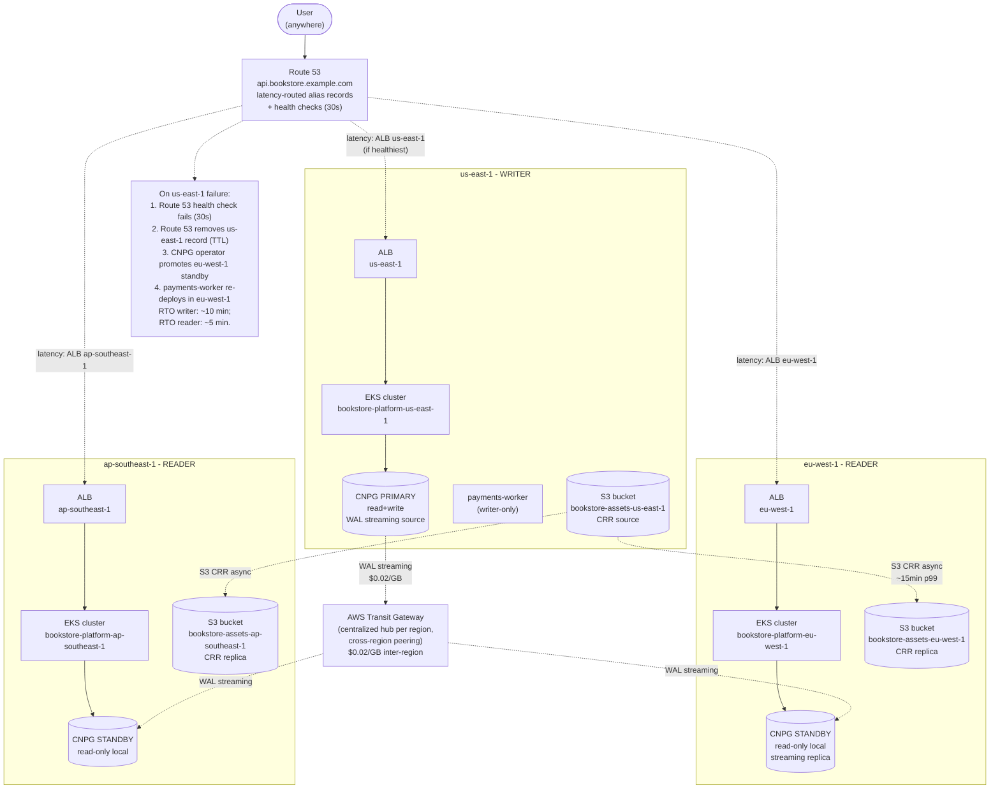

# 14.11 — Multi-region active-active: cloud reality

> [Part 13 ch.03](../13-grand-capstone-bookstore-platform/03-multi-region-active-active.md)
> walked the multi-region active-active pattern with three **kind**
> clusters — three Argo CD Applications, a CNPG primary + two
> standbys, a `/etc/hosts` flip for the "DNS" cutover. That chapter
> taught the **shape**. This chapter is the cloud reality: real Route
> 53 latency-based routing, real Global Accelerator (when it beats DNS),
> real CNPG cross-region streaming over Transit Gateway, real failover
> drills with measurable RTO/RPO numbers, and the **cross-region data
> transfer bill** that's the cost most teams forget to forecast
> ($0.02/GB inter-region; multiply by replication volume).

**Estimated time:** ~45 min read · ~half-day hands-on
**Prerequisites:** [Part 13 ch.03](../13-grand-capstone-bookstore-platform/03-multi-region-active-active.md) — multi-region shape on kind you'll now run on EKS · [Part 14 ch.10](./10-gitops-bootstrap-fresh-cluster.md) — each region's cluster bootstrap · [Part 14 ch.08](./08-vpc-endpoints-and-egress.md) — egress economics across regions

**You'll know after this:** • understand the cloud realities of active-active (Route 53 latency routing vs Global Accelerator, Transit Gateway peering, CNPG cross-region streaming) · • compute the cross-region data transfer bill ($0.02/GB inter-region) and decide what to replicate · • execute failover drills that produce measurable RTO/RPO numbers · • configure CNPG cross-region standbys with replication slots tracked over private peering · • choose between active-active and active-passive for your workload's consistency budget

<!-- tags: multi-region, eks, cloud, dr, cost -->

## Why this exists

The bookstore-platform tree ships a multi-region scaffold at
[`../examples/bookstore-platform/terraform/multi-region/`](../examples/bookstore-platform/terraform/multi-region/)
gated by a region list (`var.regions = ["us-east-1", "eu-west-1",
"ap-southeast-1"]` by default). The scaffold provisions the **cluster
substrate** — VPC + EKS + addons + Karpenter + LB controller — in N
regions from one `terraform apply`. What it deliberately does NOT
provision: the global pieces (Route 53 records, Global Accelerator,
Transit Gateway peering, CNPG cross-region replication). Those are
**topology-layer concerns** that belong to whoever owns the cross-
cluster lifecycle — typically a platform team that has already
deployed the substrate and wants to wire the global story themselves.
The `multi-region/main.tf` has a TODO comment marking the exact
hookup points.

Why split it that way: the cluster substrate is **infrastructure** —
identical across regions, version-pinned, no operational opinions.
The global topology is **policy** — which region is the primary
writer, what RTO/RPO targets you commit to, how DNS TTLs trade off
against propagation. Lumping them together would force a single
Terraform module to encode opinions it shouldn't.

The cloud reality differs from kind in five concrete ways:

1. **DNS is real.** Route 53 (or Cloudflare / NS1) does latency-
   based routing in the happy path and health-checked failover on
   region loss. TTLs are 60 seconds typically; **resolver caching**
   adds a long tail of stale routing some users hit for 5-15
   minutes longer. Honest budget: < 5 min for most users, < 30 min
   for the long tail.
2. **Cross-region traffic costs money.** AWS bills inter-region
   data transfer at **$0.02/GB** within Americas/Europe/Asia and
   **$0.09/GB** for AWS-customer-facing egress that involves
   crossing oceans (Pacific/Atlantic transits). A CNPG primary
   streaming WAL ~1 MB/s sustained transfers 86 GB/day = $1.72/day
   = ~$52/month *per replica region*. Three regions, two replicas,
   bidirectional read traffic — easy to hit four figures monthly.
3. **CNPG cross-region replication uses real network paths.**
   Either Transit Gateway peering (centralized hub-and-spoke, ~$36/
   TGW/month per region + $0.02/GB) or VPC peering (decentralized
   point-to-point, free per peering connection + $0.02/GB). The
   bookstore tree uses TGW for the symmetry; VPC peering is the
   right call for two-region setups.
4. **OIDC providers + IRSA are per-cluster.** Every EKS cluster has
   its own OIDC issuer URL; an IRSA role granting an SA in cluster-A
   access to AWS API cannot be used by the same-named SA in
   cluster-B without re-binding. That's painful for global resources
   (S3 bucket access, KMS keys). The cleanest pattern: a separate
   IRSA role per cluster + the same SA name across clusters; the
   role's trust policy `StringEquals` matches the cluster's OIDC
   issuer.
5. **Failover is a process, not a switch.** The kind drill is "kind
   delete cluster + `cnpg promote`". The cloud drill is "DNS health
   check fires + Route 53 removes the failed region + CNPG operator
   promotes a standby + payments-worker re-deploys in the new
   writer region + observability dashboards update". Each step
   has its own latency. Total RTO budget for writers: < 10 min;
   for readers: < 5 min — when the runbook is sharp.

[Part 13 ch.03](../13-grand-capstone-bookstore-platform/03-multi-region-active-active.md)
deepens this; this chapter is the cloud-specific overlay. [Part 13
ch.07](../13-grand-capstone-bookstore-platform/07-edge-gateway-waf-rate-limiting.md)
covered the edge gateway + WAF + rate-limiting layer in the abstract;
this chapter shows where it integrates with Route 53 latency routing.

> **In production:** Multi-region is **expensive insurance**. The
> 3× cluster cost + cross-region transfer + the operational overhead
> (DR drills, runbook maintenance, cross-region debugging) easily
> doubles a team's cloud bill. The business case is RTO/RPO targets
> the single-region setup can't meet — and the discipline is to size
> the multi-region footprint to those targets, not over-build. Most
> mid-stage SaaS doesn't need three regions; one region + cross-region
> backup is the right answer until the SLA conversation forces the
> upgrade.

## Mental model

**Four layers compose multi-region active-active in the cloud: (1)
the cluster substrate per region (VPC + EKS + addons), (2) the data
plane (CNPG primary + standbys + S3 cross-region replication), (3)
the global routing (Route 53 latency-based + health checks, or
Global Accelerator for anycast IP), (4) the orchestration (one Argo
CD on a control region, ApplicationSet over the Cluster generator).
The first layer is the bookstore tree's `multi-region/`; the other
three are platform-team-owned wiring.**

The four layers:

- **Layer 1 — Cluster substrate per region.** N EKS clusters, each
  with their own VPC, IAM/IRSA roles, addons, Karpenter, LB
  controller. Bookstore tree's
  [`multi-region/main.tf`](../examples/bookstore-platform/terraform/multi-region/main.tf)
  ships this; one `terraform apply` brings up 3-5 regions in
  parallel.
- **Layer 2 — Data plane: CNPG + S3.** Postgres is **one primary,
  N standbys** (physical streaming replication). Writes go to the
  primary region; reads go local. **S3 Cross-Region Replication**
  (CRR) is asynchronous: an object uploaded to the us-east bucket
  appears in eu-west / ap-southeast within seconds-to-minutes
  (S3's SLA is "typical 15 min, 99th percentile longer"). Object
  storage for tenant assets, ML model artifacts, the Loki/Tempo
  chunk store — all cross-region replicated.
- **Layer 3 — Global routing.** Two competing approaches, both
  AWS-native:
  - **Route 53 latency-based routing** — DNS resolution returns
    the IP of the lowest-latency region for the user's resolver.
    Each region has its own ALB; Route 53 maps the apex DNS name
    to N latency-set records, one per region. Health checks
    (Route 53 HTTP/TCP probes) remove unhealthy regions from the
    rotation. **Cost**: $0.50/hosted zone/month + $0.40/million
    queries + $0.50/health-check/month. Cheap.
  - **AWS Global Accelerator** — one anycast IP, AWS's network
    edge routes traffic via the AWS backbone to the closest
    healthy region's ALB. Sub-second failover (the edge sees the
    health failure; no DNS TTL involved). **Cost**: $18/accelerator/
    month + $0.015/GB-anycast-DT. Not cheap.
  When each wins: see the comparison table in §Diagrams.
- **Layer 4 — Orchestration.** One Argo CD on a "control region"
  (typically the writer region) manages every region via an
  `ApplicationSet` with the **Cluster generator**. The Cluster
  generator enumerates clusters registered with Argo CD (each is
  a Secret with `argocd.argoproj.io/secret-type: cluster`); the
  ApplicationSet templates one Application per cluster. New
  region? Add a cluster Secret; the ApplicationSet's next
  reconcile produces a new Application; the workloads deploy.

**Route 53 latency-based routing vs Global Accelerator — the trade.**

| Dimension | Route 53 LBR | Global Accelerator |
|---|---|---|
| **Routing decision** | DNS (per resolver) | Anycast IP (per packet) |
| **Failover speed** | TTL + detection (60s + 30s = ~90s for happy path; 15min for long-tail) | < 30 seconds (edge sees failure) |
| **Cost (idle)** | $0.50/zone/month | $18/accelerator/month |
| **Cost (1 TB)** | $0.40/query × queries + DT charges | $18 + $15/TB anycast-DT |
| **DDoS protection** | Route 53 doesn't filter; pair with Shield | Built-in Shield Advanced |
| **TLS termination** | Per-region ALB | Per-region ALB (GA is L4 pass-through) |
| **Static IP** | No (Alias to ALB) | Yes (one anycast IP) |
| **Sticky sessions** | Hard (resolver caches) | Easy (anycast preserves) |
| **Best for** | Standard web traffic; cost-sensitive | Real-time apps (gaming, video); sticky-session-heavy; static-IP-required |

The bookstore platform's web-serving workload is fine on Route 53
LBR — the < 5-min long-tail of stale routing is acceptable for
e-commerce. A gaming platform or a video-chat backend should
seriously consider Global Accelerator for sub-second failover.

**ALB per region vs Global Accelerator with single IP.**

- **ALB per region** — each region has its own DNS name; Route 53
  maps the apex (`api.bookstore.example.com`) to N latency-routed
  records pointing at the per-region ALB DNS names. Standard;
  cheap; the DNS layer does the routing decision.
- **Global Accelerator + ALB per region** — one anycast IP at the
  edge; Global Accelerator's listener forwards to the closest
  healthy region's ALB (registered as an Endpoint Group). Single
  IP for clients; AWS backbone does the routing. More expensive,
  faster failover, useful when the client cannot do DNS-based
  routing (some IoT clients, some mobile SDKs that cache DNS
  aggressively).

**CNPG cross-region streaming — the network reality.**

The CNPG operator supports **`spec.replica.source`** on a standby
Cluster: it bootstraps via `pg_basebackup` from the primary, then
streams WAL via Postgres's streaming-replication protocol. The
network path between primary and standby is the bottleneck:

- **Transit Gateway peering** — centralized hub per region; TGWs
  peer across regions; VPCs attach to their regional TGW. ~$36/TGW/
  month + $0.05/attachment/hour + $0.02/GB. For N regions, N TGWs +
  N(N-1)/2 peering connections. Symmetric, scales linearly with
  regions; needs careful CIDR planning (no overlaps).
- **VPC peering** — direct peering between two VPCs; free per
  peering connection + $0.02/GB. For N regions, N(N-1)/2 peering
  connections. Cheaper for 2-3 regions; doesn't scale beyond ~5
  regions (mesh complexity).
- **AWS PrivateLink + Network Load Balancer** — alternative for
  service-to-service exposure; tunnels through specific endpoints
  rather than full VPC peering. Higher latency, more security.
- **Site-to-site VPN over public internet** — cheapest, slowest,
  highest jitter. For dev / disaster-recovery hot-spare scenarios
  where the latency-sensitivity is low.

Bandwidth math for a CNPG primary doing 1 MB/s WAL:

- 1 MB/s × 86,400 sec/day = 86 GB/day
- 86 GB/day × $0.02/GB = **$1.72/day per replica region**
- 30 days × $1.72 = **$51.60/month per replica region**

Multiply by replica count. Bidirectional reads add more (clients in
eu-west reading from us-east-primary cross-region). The point is **this
is a real budget line**, often underestimated.

**Cross-region cluster identity — IRSA across regions.**

Every EKS cluster gets its own OIDC issuer URL
(`https://oidc.eks.<REGION>.amazonaws.com/id/<ISSUER-ID>`). An IRSA
role trusting an SA in cluster-A doesn't trust the same-named SA in
cluster-B by default — the trust policy's `StringEquals` clause is
on `<CLUSTER-A-OIDC>:sub`, not `<CLUSTER-B-OIDC>:sub`. Patterns:

- **One IRSA role per cluster, same SA name.** Each region's
  Terraform creates its own IRSA role; the same SA in each cluster
  binds to its region's role. Clean, scales to N regions, **N roles
  to manage**.
- **One IRSA role with a multi-cluster trust policy.** The role's
  trust policy enumerates all clusters' OIDC issuers + the SA name.
  Fewer roles, but the trust policy gets long and **adding a region
  requires rewriting the policy**. Doable for 2-3 regions; brittle
  beyond.
- **AWS IAM Roles Anywhere + Workload Identity Federation.** A
  newer pattern: a single role trusted by an external OIDC
  provider (your CI's OIDC, e.g.); workloads in any region assume
  it via STS. More flexible but more layers; out of scope for the
  bookstore platform.

The bookstore-platform tree's `multi-region/cluster-module/`
implicitly uses pattern 1: each region's substrate creates its own
IRSA roles independently. If you need cross-region SA identity, the
trust-policy-extension is a one-time Terraform task per role.

**The "real failover" drill — RTO/RPO numbers.**

| Metric | Definition | Achievable on EKS+CNPG |
|---|---|---|
| **RTO (writer)** | Time from primary failure to writes accepted in new primary region | 5-10 min (DNS + CNPG promote + payments-worker re-deploy) |
| **RTO (reader)** | Time from primary failure to reads served in remaining regions | 30 sec - 5 min (DNS health check + TTL) |
| **RPO (sync replication)** | Max data loss measured in time | 0 (sync replicas wait for ack) |
| **RPO (async replication)** | Max data loss measured in time | Replication lag (typically < 5 sec; spikes to minutes during traffic peaks) |
| **MTTR (region recovery)** | Time to rebuild a lost region from scratch | 1-2 hours (Terraform + ApplicationSet sync) |

The trap: **assuming the kind drill's numbers transfer to cloud**.
On kind, the entire drill takes seconds (no DNS propagation, no
cross-region latency, no real failover automation). On cloud, the
30-second `cnpg promote` is the same; everything around it (DNS
propagation, traffic shift, client retry) adds minutes. The drill
should run in **staging** monthly to keep the runbook fresh.

The trap to keep in view: **active-active does not mean "writes go
anywhere"**. Writes go to **one region's primary**; reads go local.
Marketing the architecture as "five-9s writes everywhere" is a lie
that hurts at the first failover. The honest pitch: "< 5 min reader
failover, < 10 min writer failover; writes are routed to the writer
region; reads are local". (This is the same point Part 13 ch.03 made
in the kind context; it's still the right framing in the cloud.)

## Diagrams

### Diagram A — three-region cloud topology with Route 53 LBR + CNPG streaming (Mermaid)



### Diagram B — Route 53 LBR vs Global Accelerator trade-off (ASCII)

```text
ROUTE 53 LATENCY-BASED ROUTING (LBR) — DNS-LEVEL ROUTING
  Client resolver -> Route 53 -> "use ALB IP in us-east-1 (lowest latency)"
  Client -> ALB us-east-1 -> EKS

  Failover on us-east-1 failure:
    [t+0s]    us-east-1 fails
    [t+30s]   Route 53 health check (3 consecutive fails @ 10s) marks region down
    [t+60s]   Route 53 stops returning us-east-1 IP in DNS responses
    [t+90s]   Resolvers that cached us-east-1 IP for 60s expire; re-query
    [t+5min]  Most clients re-resolved to a healthy region
    [t+15min] Long-tail clients (resolvers with capped TTL) still cached on us-east-1

  Cost: $0.50/hosted zone/month + $0.40/M queries + $0.50/health-check/month
  Best for: standard web traffic; cost-sensitive

GLOBAL ACCELERATOR — ANYCAST IP, EDGE-LEVEL ROUTING
  Client -> 1 anycast IP -> closest AWS edge (BGP)
  Edge -> AWS backbone -> closest healthy endpoint group's ALB
  Edge -> us-east-1 ALB (healthy: send here)
                  OR
  Edge -> eu-west-1 ALB (us-east-1 unhealthy: failover here)

  Failover on us-east-1 failure:
    [t+0s]    us-east-1 fails
    [t+10-30s] Edge health probes detect failure
    [t+30s]   Edges stop routing to us-east-1; all traffic to eu-west-1/ap-southeast-1
              Client connections held over backbone — no DNS resolution involved.

  Cost: $18/accelerator/month + $0.015/GB anycast-DT + per-AZ ALB charges
  Best for: real-time apps (gaming, voice/video); sticky sessions;
             static-IP-required (legacy clients, IoT, mobile SDKs)

DECISION FRAMEWORK:
  - "I need fast failover (< 1 min)" -> Global Accelerator
  - "I need a static IP for clients I can't update" -> Global Accelerator
  - "I just need geo-routing for web traffic; 5 min failover OK" -> Route 53 LBR
  - "I'm cost-sensitive on a small workload" -> Route 53 LBR
  - "I run a gaming/video backend with sticky sessions" -> Global Accelerator
  - "I serve static assets via CloudFront anyway" -> Route 53 LBR (CloudFront has its own anycast)
```

## Hands-on with the Bookstore Platform

### 0. Prerequisites

- The bookstore-platform `multi-region/` tree applied with at least 2
  regions:
  [`../examples/bookstore-platform/terraform/multi-region/`](../examples/bookstore-platform/terraform/multi-region/).
- Argo CD installed on the **control region** (the one you'll
  designate as the writer); the bootstrap from
  [14.10](./10-gitops-bootstrap-fresh-cluster.md) covers this.
- `kubectl` configured against every region's cluster (the
  `multi-region/` tree's `kubeconfig_commands` output produces one
  command per region).
- A domain managed in Route 53 (or your DNS provider; this hands-on
  uses Route 53). Have `aws_route53_zone` ready (manual or via
  separate Terraform).

This chapter's hands-on assumes the multi-region tree is applied and
clusters are healthy. The `multi-region/main.tf`'s TODO comment
notes the exact pieces this chapter wires.

### 1. Verify the multi-region substrate is healthy

```bash
cd examples/bookstore-platform/terraform/multi-region
terraform output -json clusters | jq 'keys'
# ["us-east-1", "eu-west-1", "ap-southeast-1"]

# For each region, switch kubectl context and verify nodes are Ready.
for region in us-east-1 eu-west-1 ap-southeast-1; do
  aws eks --region "$region" update-kubeconfig \
    --name "bookstore-platform-$region"
  ctx="arn:aws:eks:${region}:$(aws sts get-caller-identity \
    --query Account --output text):cluster/bookstore-platform-${region}"
  echo "=== $region ==="
  kubectl --context "$ctx" get nodes
done
```

All three should show `Ready` system nodes.

### 2. Designate the writer region; install CNPG into every region

The bookstore tree treats `us-east-1` as the writer (it's the
control region for Argo CD too, by convention). Install CNPG into
every region:

```bash
CNPG_CHART_VERSION="0.22.1"
helm repo add cnpg https://cloudnative-pg.github.io/charts
helm repo update

for region in us-east-1 eu-west-1 ap-southeast-1; do
  ctx="arn:aws:eks:${region}:$(aws sts get-caller-identity \
    --query Account --output text):cluster/bookstore-platform-${region}"

  helm --kube-context "$ctx" install cnpg cnpg/cloudnative-pg \
    --version "$CNPG_CHART_VERSION" \
    -n cnpg-system --create-namespace --wait
done
```

### 3. Create the CNPG primary in us-east-1

The primary writes to its local EBS volume; later, standbys will
stream WAL from it.

```bash
PRIMARY_CTX="arn:aws:eks:us-east-1:$(aws sts get-caller-identity \
  --query Account --output text):cluster/bookstore-platform-us-east-1"

kubectl --context "$PRIMARY_CTX" apply -f - <<'EOF'
apiVersion: postgresql.cnpg.io/v1
kind: Cluster
metadata:
  name: bookstore-pg
  namespace: bookstore-platform-system
spec:
  instances: 3
  storage:
    size: 50Gi
    storageClass: gp3-encrypted
  bootstrap:
    initdb:
      database: bookstore
      owner: bookstore
  # WAL archiving to S3 for PITR + standby bootstrap.
  backup:
    barmanObjectStore:
      destinationPath: "s3://bookstore-pg-wal-archive-us-east-1/"
      s3Credentials:
        inheritFromIAMRole: true  # IRSA-wired SA, no static creds
      wal:
        compression: gzip
      data:
        compression: gzip
  # Expose the rw service to other regions via a NetworkLoadBalancer
  # with an internal-only annotation. This is the wire CNPG standbys
  # in eu-west/ap-southeast connect over (Transit Gateway path).
  managed:
    services:
      additional:
        - selectorType: rw
          serviceTemplate:
            metadata:
              name: bookstore-pg-rw-cross-region
              annotations:
                service.beta.kubernetes.io/aws-load-balancer-type: "external"
                service.beta.kubernetes.io/aws-load-balancer-nlb-target-type: "ip"
                service.beta.kubernetes.io/aws-load-balancer-scheme: "internal"
            spec:
              type: LoadBalancer
EOF
```

> **Critical prerequisite that lives OUTSIDE this Terraform:**
> Transit Gateway peering between us-east-1, eu-west-1, and
> ap-southeast-1, with the per-region VPCs attached and routes
> propagated. Without this, the standbys cannot reach the primary's
> CNPG rw NLB. The bookstore-platform's `multi-region/` tree's
> README explicitly notes this is out-of-tree wiring — the platform
> team's responsibility.

### 4. Bootstrap CNPG standbys in eu-west-1 and ap-southeast-1

Each standby points at the primary's cross-region NLB DNS name. Get
that DNS name once the primary is up:

```bash
kubectl --context "$PRIMARY_CTX" \
  -n bookstore-platform-system \
  get svc bookstore-pg-rw-cross-region \
  -o jsonpath='{.status.loadBalancer.ingress[0].hostname}'
# e.g., internal-a1b2c3d4-1234567890.us-east-1.elb.amazonaws.com
```

Apply the standby Cluster CR in each replica region:

```bash
PRIMARY_NLB=$(kubectl --context "$PRIMARY_CTX" \
  -n bookstore-platform-system \
  get svc bookstore-pg-rw-cross-region \
  -o jsonpath='{.status.loadBalancer.ingress[0].hostname}')

for region in eu-west-1 ap-southeast-1; do
  ctx="arn:aws:eks:${region}:$(aws sts get-caller-identity \
    --query Account --output text):cluster/bookstore-platform-${region}"

  kubectl --context "$ctx" apply -f - <<EOF
apiVersion: postgresql.cnpg.io/v1
kind: Cluster
metadata:
  name: bookstore-pg
  namespace: bookstore-platform-system
spec:
  instances: 2
  storage:
    size: 50Gi
    storageClass: gp3-encrypted
  bootstrap:
    pg_basebackup:
      source: bookstore-pg-primary
  replica:
    enabled: true
    source: bookstore-pg-primary
  externalClusters:
    - name: bookstore-pg-primary
      connectionParameters:
        host: "$PRIMARY_NLB"
        user: streaming_replica
        dbname: bookstore
        sslmode: require
      password:
        name: bookstore-pg-replication-creds
        key: PASSWORD
EOF
done
```

Verify replication is streaming:

```bash
for region in us-east-1 eu-west-1 ap-southeast-1; do
  ctx="arn:aws:eks:${region}:$(aws sts get-caller-identity \
    --query Account --output text):cluster/bookstore-platform-${region}"
  echo "=== $region ==="
  kubectl --context "$ctx" \
    -n bookstore-platform-system \
    get cluster bookstore-pg
done
```

Expected:

```text
=== us-east-1 ===
NAME           AGE   INSTANCES   READY   STATUS                     PRIMARY
bookstore-pg   5m    3           3       Cluster in healthy state   bookstore-pg-1

=== eu-west-1 ===
NAME           AGE   INSTANCES   READY   STATUS                     PRIMARY
bookstore-pg   2m    2           2       Cluster in healthy state   bookstore-pg-1

=== ap-southeast-1 ===
NAME           AGE   INSTANCES   READY   STATUS                     PRIMARY
bookstore-pg   2m    2           2       Cluster in healthy state   bookstore-pg-1
```

Check replication lag on the primary:

```bash
kubectl --context "$PRIMARY_CTX" \
  -n bookstore-platform-system \
  exec bookstore-pg-1 -c postgres -- \
  psql -U postgres -c "SELECT application_name, state, sync_state, \
    pg_wal_lsn_diff(sent_lsn, replay_lsn) AS lag_bytes \
    FROM pg_stat_replication;"
```

A healthy WAN streaming setup shows < 1 MB lag; spikes during traffic
peaks. Track it as a Prometheus metric (CNPG ships `cnpg_pg_replication_lag`).

### 5. Wire Route 53 latency-based routing for the apex DNS

Create per-region DNS records pointing at each region's ALB:

```hcl
# In a separate Terraform root or a follow-up module — NOT in the
# multi-region/ tree, which keeps DNS topology out of scope.

resource "aws_route53_record" "api_us_east_1" {
  zone_id        = data.aws_route53_zone.bookstore.zone_id
  name           = "api.bookstore.example.com"
  type           = "A"
  set_identifier = "us-east-1"
  latency_routing_policy {
    region = "us-east-1"
  }
  alias {
    name                   = "<ALB-DNS-NAME-IN-US-EAST-1>"
    zone_id                = "<ALB-ZONE-ID-IN-US-EAST-1>"
    evaluate_target_health = true
  }
  health_check_id = aws_route53_health_check.api_us_east_1.id
}

resource "aws_route53_health_check" "api_us_east_1" {
  fqdn              = "us-east-1.api.bookstore.example.com"
  port              = 443
  type              = "HTTPS"
  resource_path     = "/healthz"
  failure_threshold = 3
  request_interval  = 30
}

# Repeat for eu-west-1 and ap-southeast-1.
```

What this does:

- Route 53 returns the ALB IP in the region with the lowest latency
  to the resolver.
- Health checks probe each region's `/healthz` endpoint every 30
  seconds; 3 consecutive failures mark the region unhealthy.
- An unhealthy region is removed from the rotation; clients re-
  resolve and get a healthy region's IP.

### 6. Run the DR drill — failover the writer region

The cloud equivalent of the kind drill — measurable RTO/RPO numbers.

```bash
# Time the drill from t=0.
TIME_START=$(date +%s)

# 1. Simulate us-east-1 failure: scale Karpenter NodePool to 0, drain
#    Postgres, or — if you're brave — delete the cluster.
#    Cheapest simulation: scale CNPG to 0 instances temporarily.
kubectl --context "$PRIMARY_CTX" \
  -n bookstore-platform-system \
  patch cluster bookstore-pg \
  --type=merge \
  -p '{"spec":{"instances":0}}'

# 2. Watch Route 53 health check: 30s interval × 3 fails = ~90s
#    to mark us-east-1 unhealthy.
watch -n 5 'aws route53 get-health-check-status \
  --health-check-id <ID> --query StatusList[0].StatusReport.Status'
# Eventually: "Failure: HTTP status code 503" or connection failures

# 3. Promote eu-west-1 standby (requires kubectl-cnpg plugin):
EU_CTX="arn:aws:eks:eu-west-1:..."
kubectl --context "$EU_CTX" cnpg promote bookstore-pg \
  -n bookstore-platform-system
# kubectl-cnpg writes a `target` to the Cluster spec; the operator
# coordinates the promotion (typical wall-clock: 30 sec).

# 4. Verify eu-west-1 is now writable.
kubectl --context "$EU_CTX" \
  -n bookstore-platform-system \
  exec bookstore-pg-1 -c postgres -- \
  psql -U postgres -c "SELECT pg_is_in_recovery();"
# Should return: f  (false; we are NOT in recovery, i.e., we are primary)

# 5. Flip the writer designation in DNS for the cross-region NLB.
#    The bookstore-pg-rw-cross-region NLB in eu-west-1 now needs a
#    DNS record pointing the standbys at it. Update Terraform or
#    aws CLI.

# 6. payments-worker re-deploys in eu-west-1.
#    Argo CD's ApplicationSet sees the new writer-tag label flip and
#    rolls out payments-worker.

TIME_END=$(date +%s)
echo "Total failover wall-clock: $((TIME_END - TIME_START)) seconds"
```

Honest budget on a real run:

| Step | Time | Cumulative |
|------|------|------------|
| Health check fires | 90 s | 90 s |
| Route 53 stops routing to us-east-1 | + TTL (60s default) | 150 s |
| Resolvers cache-bust | + 0-60 s | 150-210 s |
| `cnpg promote` completes | + 30 s | 180-240 s |
| New writer accepting connections | immediate after promote | 180-240 s |
| payments-worker re-deploy | + 60 s | 240-300 s |
| Long-tail resolvers still cached on us-east-1 | + up to 15 min | up to 15 min |

So: ~5 min for most users to fully transition; ~15 min long-tail.
That's the honest active-active RTO budget.

### 7. (Optional) Show the cost of inter-region transfer

After 24 hours of running, query AWS Cost Explorer:

```bash
# date -d is GNU date; macOS users: replace with date -v-7d +%Y-%m-%d
aws ce get-cost-and-usage \
  --time-period Start=$(date -d '7 days ago' +%Y-%m-%d),End=$(date +%Y-%m-%d) \
  --granularity DAILY \
  --metrics UnblendedCost \
  --filter '{"Dimensions":{"Key":"USAGE_TYPE_GROUP","Values":["EC2: Data Transfer - Inter-Region"]}}' \
  --group-by Type=DIMENSION,Key=REGION
```

You'll see per-region inter-region transfer costs. For a CNPG cluster
streaming WAL across three regions at ~1 MB/s, expect ~$50/month per
replica region — the math from the §Why section, now visible in the
bill.

## How it works under the hood

**Route 53 latency-based routing — the resolver math.** When a
client's resolver issues `api.bookstore.example.com`, Route 53's
authoritative nameservers receive the query along with the client's
**resolver IP** (or the EDNS Client Subnet if the resolver supports
it). Route 53 maintains a continuously-updated **latency database**
mapping resolver-IP-prefix to per-AWS-region RTT. The response is the
region with the lowest RTT — typically the geographically closest,
but sometimes a more distant region if the backbone path is faster.
The resolver caches the result for the TTL (default 60 s in the
bookstore stack).

**Route 53 health checks — three-fail threshold.** A health check
probes the target endpoint (e.g. each region's ALB) every 10 or 30
seconds (`request_interval`). The check reports `Healthy` until 3
consecutive failures, then transitions to `Unhealthy`. Route 53's
routing layer reads the health check status and stops returning the
matching record. The transition is asynchronous (the check status
flap can take 30-90 s); the routing response updates within seconds
of the status change.

**The DNS long-tail.** Most resolvers honor the record's TTL exactly.
But many corporate resolvers, some ISP resolvers, some browser
caches, and some application-level DNS caches **cap TTLs at higher
floors** — typically 5-15 minutes. Some pin to 24 hours (rare but
real). For a region that just went unhealthy, a fraction of clients
will continue routing to the dead region until their cache expires.
There is no DNS-layer fix; the choices are **shorter TTLs upstream**
(but you can't control downstream resolver behavior) or **switch to
anycast** (Global Accelerator) where the routing happens at the
packet level, not DNS.

**Global Accelerator — anycast routing on AWS backbone.** Global
Accelerator allocates **two static anycast IPs** advertised by every
AWS edge location via BGP. A client connecting to `1.2.3.4` (one of
the anycast IPs) reaches the **closest AWS edge by BGP topology**;
the edge forwards the packet over the AWS backbone to the closest
healthy endpoint (a per-region ALB registered as an Endpoint Group).
Health-check failure removes the endpoint from the rotation **at the
edge** within < 30 seconds — no DNS resolution involved. The trade-
off is cost ($18/accelerator/month + per-GB transfer) and the
constraint of L4 pass-through (TLS terminates at the regional ALB,
not the accelerator).

**CNPG cross-region streaming replication — Postgres physical WAL.**
CNPG uses Postgres's built-in physical streaming replication. The
primary's WAL writer streams WAL records to each standby's WAL
receiver over the Postgres wire protocol (port 5432, TLS).

- **Network path**: Transit Gateway peering or VPC peering between
  regions; CNPG opens a TCP connection to the primary's rw service
  DNS name; the service routes to whichever pod is currently primary.
- **WAL streaming volume**: 1-2 MB/s for a moderate workload (most
  transaction volume); spikes to 10-100 MB/s during batch
  operations.
- **Failure modes**:
  - Network partition between primary and standby: the standby
    falls behind; `pg_stat_replication.flush_lag` grows. Once
    `wal_keep_size` is exceeded, the WAL the standby needs is
    discarded on the primary; standby must re-bootstrap from
    `pg_basebackup`.
  - Primary failure: the standby keeps the data it has up to the
    last replicated WAL position. `cnpg promote` makes it the new
    primary; any in-flight WAL not yet replicated is lost (the
    RPO).

**S3 Cross-Region Replication — async, eventually consistent.** S3
CRR is configured per-bucket via `aws_s3_bucket_replication_configuration`.
An object PUT to the source bucket is queued for replication;
replication happens **asynchronously** in the background. SLA:
typical 15 min, 99.9th percentile longer. The replicas are
eventually consistent — a client reading from a replica bucket
immediately after the source bucket was PUT may see the old object
or `404`. CRR is **not** a synchronous solution; for synchronous
multi-region object storage, S3 Multi-Region Access Points + the
"Failover" controls give better RPO at higher cost.

**OIDC issuers per cluster — the IRSA trust math.** Every EKS
cluster has its own OIDC issuer URL of the form
`https://oidc.eks.<REGION>.amazonaws.com/id/<ID>`. The `<ID>` is
cluster-unique. An IAM role's trust policy contains a `Condition`
block like:

```json
{
  "StringEquals": {
    "<OIDC-ISSUER>:sub": "system:serviceaccount:<NS>:<SA>"
  }
}
```

The `<OIDC-ISSUER>` is a specific cluster's issuer URL — so the role
trusts SA `<NS>:<SA>` in **that specific cluster only**. For a role
to trust the same SA across multiple clusters, the trust policy must
enumerate every cluster's OIDC issuer (or the role per cluster).
Terraform-wise, the bookstore tree's `multi-region/` creates one
IRSA role per region per addon; the `account-baseline` tree (not in
this chapter's scope) can centralize OIDC providers for cross-region
trust.

**Argo CD ApplicationSet over the Cluster generator.** The Cluster
generator (introduced in
[Part 13 ch.03](../13-grand-capstone-bookstore-platform/03-multi-region-active-active.md))
enumerates clusters registered with Argo CD via the `argocd cluster
add` command (each writes a `Secret` with `argocd.argoproj.io/secret-
type: cluster`). The ApplicationSet templates one Application per
matching cluster (selectable by label). When a new region's cluster
is registered, the ApplicationSet's next reconcile produces a new
Application; the workloads deploy. The reconcile is **idempotent** —
re-running creates nothing new if the set hasn't changed.

**Argo CD on the control region — single point of failure.** The
Argo CD that manages every region runs on **one** cluster. If that
cluster goes down (us-east-1 lost in the drill above), no new GitOps
reconciliations happen until Argo CD is re-bootstrapped elsewhere.
The bookstore tree's pattern: re-run the
[14.10](./10-gitops-bootstrap-fresh-cluster.md) bootstrap on eu-west-1
(or any healthy region) — 5 minutes to get a new Argo CD up. The
production-mature alternative is **passive-active Argo CD** — two
Argo CDs in two regions, both watching the same Git source, normally
only one issuing changes. The trade is operational complexity; most
mid-stage SaaS goes with single Argo CD + a "rebuild in 5 min"
runbook.

## Production notes

> **In production:** Cross-region data transfer is the bookstore's
> hidden multi-region cost. WAL streaming, S3 CRR, inter-region API
> calls, even health-check probes contribute. Budget ~$0.02/GB
> within continents and ~$0.09/GB across continents (US-Asia/EU,
> Atlantic/Pacific). For an active-active SaaS with 1 TB/month of
> cross-region traffic, that's $20-90/month — small individually,
> real at scale. Tag every cross-region resource with cost
> attribution so OpenCost / Cost Explorer can break it down.

> **In production:** TGW peering scales linearly with regions; full-
> mesh VPC peering scales as N². For 2-3 regions, VPC peering is
> simpler and cheaper. For 4+ regions, Transit Gateway is the
> production answer. The bookstore tree's `multi-region/` does not
> create the peering — that's whoever-owns-the-network's job. Wire
> it out-of-tree.

> **In production:** Route 53 health checks for `/healthz` endpoints
> need to be **distinct from the application's `/health` probe**.
> The health check endpoint should fail when the **region** is
> unhealthy (DB unreachable, dependent service down), not just when
> a single Pod is unhealthy. A "shallow" `/healthz` that returns
> 200 if the container is up gives false positives during a region
> outage — Route 53 keeps routing to a region whose Postgres is
> dead. A "deep" `/healthz` that probes Postgres + cache + the
> 3 most-critical dependencies is the right pattern.

> **In production:** S3 Cross-Region Replication is **asynchronous**.
> An object uploaded in us-east-1 may not be visible in eu-west-1
> for 15-30 minutes (99th percentile). For tenant-uploaded assets
> shown on the storefront, this manifests as "the image I just
> uploaded shows 404 in another region for 15 minutes". Fix
> patterns: **regional buckets per region** (no CRR; CloudFront
> origin-shielded), or **serve from S3 Multi-Region Access Point**
> (synchronous routing, async data — clients see latency, not
> 404s). The capstone (14.17) walks the CRR + bucket-region matrix.

> **In production:** Failover automation is a tradeoff. Fully-
> automated failover (Route 53 + CNPG operator + AppSet) recovers
> in 5-10 min but **can fire on false positives** (a transient
> network blip looks like a regional outage). The right pattern is
> **manual-fired, runbook-driven** failover: the on-call confirms
> the outage is real, runs the `cnpg promote` and the DNS flip
> together. Targets RTO 30 min for the first six months; tighten
> as the runbook matures. Auto-failover comes after you've drilled
> it enough that the on-call can hit the button reliably.

> **In production:** A real DR drill is **monthly**, run in staging
> with real traffic, ideally on a Thursday morning when everyone is
> at their desk and not after-hours. A drill that hasn't been run
> in 9 months has decayed — runbooks reference deprecated tools,
> the on-call rotation has churned. The capstone (14.17) walks the
> drill cadence and the "90-day production-readiness runbook" that
> bakes in the drill.

> **In production:** Argo CD as a single point of failure is real.
> If the control region (us-east-1 in this stack) goes down, no
> new GitOps changes reconcile until Argo CD is re-bootstrapped
> elsewhere. The two production patterns: (1) **passive-active
> Argo CD** in a second region, watching the same Git source —
> on failover, promote it to active; (2) **rebuild from Git** —
> stand up a fresh Argo CD in another region in 5 min from the
> [14.10](./10-gitops-bootstrap-fresh-cluster.md) bootstrap. The
> bookstore-platform stack ships pattern (2) for simplicity.

## Quick Reference

```bash
# Multi-region scaffold apply.
cd examples/bookstore-platform/terraform/multi-region
terraform apply -var-file=regions.tfvars

# Per-region kubectl context update.
for region in us-east-1 eu-west-1 ap-southeast-1; do
  aws eks --region "$region" update-kubeconfig \
    --name "bookstore-platform-$region"
done

# Verify CNPG cross-region replication is streaming.
kubectl --context <PRIMARY-CTX> -n bookstore-platform-system \
  exec bookstore-pg-1 -c postgres -- \
  psql -U postgres -c "SELECT state, sync_state, \
    pg_wal_lsn_diff(sent_lsn, replay_lsn) AS lag_bytes \
    FROM pg_stat_replication;"

# Promote a standby (the failover action).
kubectl --context <NEW-PRIMARY-CTX> cnpg promote bookstore-pg \
  -n bookstore-platform-system

# Verify a Cluster is primary (returns f for primary, t for standby).
kubectl --context <CTX> -n bookstore-platform-system \
  exec bookstore-pg-1 -c postgres -- \
  psql -U postgres -c "SELECT pg_is_in_recovery();"

# Check Route 53 health check status.
aws route53 get-health-check-status \
  --health-check-id <ID> \
  --query 'HealthCheckObservations[*].StatusReport.Status'

# Cost Explorer query: inter-region data transfer.
aws ce get-cost-and-usage \
  --time-period Start=<START>,End=<END> \
  --metrics UnblendedCost \
  --filter '{"Dimensions":{"Key":"USAGE_TYPE_GROUP","Values":["EC2: Data Transfer - Inter-Region"]}}'
```

Minimal multi-region active-active checklist (healthy when all 8 are yes):

- [ ] Cluster substrate (`multi-region/` Terraform) applied in 2+
      regions; all clusters Active.
- [ ] CNPG operator installed in every region; one primary + N
      standby Clusters in `bookstore-platform-system`.
- [ ] CNPG replication lag < 5 sec on a healthy WAN (visible via
      `pg_stat_replication.flush_lag` or
      `cnpg_pg_replication_lag` metric).
- [ ] Route 53 (or equivalent) latency-based records pointing at
      per-region ALBs; health checks probing each region's
      `/healthz`.
- [ ] Argo CD on a designated control region; ApplicationSet's
      Cluster generator reconciles workloads to every cluster.
- [ ] S3 buckets that hold cross-region assets use CRR (or are
      regional per-region with CloudFront on top).
- [ ] DR drill (`cnpg promote` + DNS flip) has been run in staging
      within the last 30 days; runbook is < 30 days old.
- [ ] Inter-region data transfer is forecast in the cost model;
      Cost Explorer tag-grouped to detect surges.

## Test your understanding

> Try each before opening the answer drawer. The act of trying is the exercise; the answer is the check.

1. **When does Global Accelerator beat Route 53 latency-based routing, and when is Route 53 the right call?**
   <details><summary>Show answer</summary>

   Global Accelerator wins when failover latency matters more than cost — its edge sees the health failure and re-routes packets in seconds, with no DNS TTL involved (TTL caching in resolvers can stretch DNS-based failover to 5-15 minutes for the long tail). It's also the right call when you need a static anycast IP (regulated environments that whitelist IPs) or built-in Shield Advanced DDoS protection. Route 53 LBR wins on cost ($0.50/zone/month vs $18/accelerator/month + anycast-DT), is simpler to wire (just records + health checks), and is fine when 60-90s happy-path failover is within SLA. Most mid-stage SaaS picks Route 53; financial / gaming / public-API-with-customer-firewall workloads pick GA.

   </details>

2. **A team commits to a 5-minute RTO for writers. The CNPG primary is in us-east-1, standby in eu-west-1. The us-east region goes dark at 02:00 UTC. Walk through the runbook.**
   <details><summary>Show answer</summary>

   (1) Route 53 health check fires on the per-region `/healthz` ALB endpoint (~30-60s detection); us-east record is removed from the latency set, surviving regions absorb traffic for readers. (2) On-call promotes eu-west's CNPG standby with `kubectl cnpg promote` — this takes ~30-60s once the operator decides. (3) Payments-worker (the writer-only workload) is re-deployed via Argo CD to eu-west — the ApplicationSet's Cluster generator targeting a `role=writer` label flips eu-west to writer, us-east to non-writer; reconciliation runs in seconds with a webhook. (4) Confirm WAL has fully replayed on the promoted primary (zero lag) before declaring writes resumed. Total: writers back in 5-7 min if the runbook is drilled monthly; without drilling, 15-30+ min as the operator hunts for the commands.

   </details>

3. **Your AWS bill shows a $4,200/month line for inter-region data transfer that "wasn't there last month." What probably happened?**
   <details><summary>Show answer</summary>

   A new workload started shipping inter-region traffic. Common offenders: (a) CNPG standby in a new region — WAL streaming at 1 MB/s sustained is ~$52/month per replica region, three regions adds up; (b) S3 Cross-Region Replication newly enabled with high upload volume; (c) a service that started cross-calling regions (a producer in us-east now calling consumer in eu-west) because someone deployed without the `latency: local-region-only` discipline; (d) Karpenter spinning up replicas in a new region for capacity reasons and cross-AZ-going-cross-region in the load balancer. The diagnosis: VPC Flow Logs + Cost Explorer tag-grouping by region pair. The chapter's discipline: forecast inter-region transfer before adding a region; tag-group Cost Explorer to detect surges.

   </details>

4. **A team picks "VPC peering between two regions" instead of Transit Gateway for cost reasons. They now want to add a third region. What changes?**
   <details><summary>Show answer</summary>

   VPC peering is point-to-point — region A peers to region B, region B peers to region C, region A peers to region C. Three regions = three peering connections (n choose 2). Five regions = ten connections. Each connection has its own route-table entries in both regions. Transit Gateway is hub-and-spoke — one TGW attachment per region, peering between TGWs is a single connection per region pair. At 2 regions VPC peering wins on cost; at 3+, TGW is operationally simpler (one set of route tables, central place to manage cross-region access). The chapter recommends VPC peering for two-region setups, TGW for symmetric three-plus.

   </details>

5. **Hands-on extension — provision the `multi-region/` Terraform across 3 regions, then take down the writer region (terraform destroy) without first running the CNPG promote on a standby. What happens to writes?**
   <details><summary>What you should see</summary>

   Writes fail immediately at the application layer — the payments-worker in the surviving regions still points at the (now-unreachable) primary's connection string, requests time out, the circuit breaker (if there is one) opens. Route 53 removes the failed region from the rotation, so user-facing reads route around it; writes are dead until a standby is promoted. The lesson: DNS failover handles the read story for free, but the writer story requires the explicit CNPG promote + the writer-workload re-deploy. The runbook isn't optional — without it, RTO is "however long it takes the operator to remember the commands."

   </details>

## Further reading

- **AWS Route 53 latency-based routing**
  <https://docs.aws.amazon.com/Route53/latest/DeveloperGuide/routing-policy-latency.html>;
  the authoritative source for the routing policy + the EDNS Client
  Subnet handling.
- **AWS Global Accelerator FAQ + pricing**
  <https://aws.amazon.com/global-accelerator/faqs/>; the anycast IP
  + AWS backbone story this chapter compared against Route 53 LBR.
- **AWS inter-region data transfer pricing**
  <https://aws.amazon.com/ec2/pricing/on-demand/#Data_transfer>;
  the $0.02/GB-and-up math that drives the cross-region budget.
- **CloudNativePG replica cluster docs**
  <https://cloudnative-pg.io/documentation/current/replica_cluster/>;
  the upstream documentation for `spec.replica.source` and the
  `pg_basebackup` bootstrap.
- **AWS Transit Gateway peering across regions**
  <https://docs.aws.amazon.com/vpc/latest/tgw/tgw-peering.html>;
  the connectivity pattern the multi-region/ tree expects you to
  wire out-of-band.
- **S3 Cross-Region Replication docs**
  <https://docs.aws.amazon.com/AmazonS3/latest/userguide/replication.html>;
  the upstream reference for CRR semantics + the eventually-
  consistent reality the production-notes flag.
- **Rosso et al., *Production Kubernetes*, ch.15 — "Multi-cluster
  operations"**; the multi-cluster propagation + DR patterns this
  chapter operationalizes for EKS.
- **Google Cloud Architecture Center, "Multi-region application
  architecture"**
  <https://cloud.google.com/architecture/multi-region-app-architecture>;
  a cross-cloud companion read whose patterns translate cleanly.
