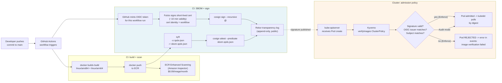

# 14.12 — Supply chain security in production

> [Part 05 ch.03](../05-security/03-supply-chain.md) introduced the
> four-stage trust chain — **scan, SBOM, sign, admit** — for the kind-
> local Bookstore. This chapter is the **cloud-deployed path**: AWS
> **ECR enhanced scanning** ($0.09/image/month for continuous CVE
> tracking), **`syft`** for the SBOM-as-build-artifact discipline,
> **cosign keyless signing in GitHub Actions** (OIDC trust → Fulcio
> short-lived cert → Rekor transparency-log entry — no long-lived
> signing keys to rotate), and **Kyverno `ClusterPolicy.verifyImages`**
> enforcing the signature at admission. Plus the honest reality of
> **SLSA framework levels 1–4** — what each level means, what it
> costs to reach, and the level most teams realistically land at
> (SLSA 2-3, not SLSA 4).

**Estimated time:** ~30 min read · ~90 min hands-on
**Prerequisites:** [Part 05 ch.03](../05-security/03-supply-chain.md) — four-stage trust chain (scan/SBOM/sign/admit) on kind · [Part 13 ch.06](../05-security/03-supply-chain.md) — bookstore security pass that lands signing · [Part 12 ch.05](../11-advanced-production-patterns/10-platform-engineering.md) — admission policy rollout pattern

**You'll know after this:** • configure ECR enhanced scanning ($0.09/image/month) for continuous CVE tracking · • generate SBOMs with `syft` and bind them to image digests as a build artifact · • implement cosign keyless signing in GitHub Actions (OIDC → Fulcio → Rekor) with no long-lived keys · • enforce signatures at admission with Kyverno `ClusterPolicy.verifyImages` in Audit→Enforce rollout · • choose a realistic SLSA target (most teams land at 2-3, not 4) and know what each level actually costs

<!-- tags: supply-chain, security, cosign, ci-cd, cloud -->

## Why this exists

The bookstore-platform tree at
[`../examples/bookstore-platform/terraform/`](../examples/bookstore-platform/terraform/)
ships an opt-in supply-chain stack: ECR scanning is on by default
(basic mode, free), and the
[`kyverno-image-signing.tf`](../examples/bookstore-platform/terraform/kyverno-image-signing.tf)
resource installs Kyverno + a `verifyImages` ClusterPolicy when
`var.enable_image_signing = true`. The policy ships in **Audit mode**
deliberately — flipping to Enforce without first verifying the CI
signs every image will reject the cluster's own workloads on day
one (the canonical anti-pattern Part 05 ch.03 named). Production
operationalizes this as **Audit for 2-4 weeks → triage findings →
flip to Enforce**.

The threats supply-chain security defends against are not
hypothetical:

1. **Typosquatting / dependency confusion** — an attacker publishes
   `react-route` (lowercase route) hoping someone in CI typos the
   real `react-router`. The CI machine pulls the malicious package
   without a verified signature; the package phones home with the
   build secrets.
2. **Base-image CVEs at runtime** — the Alpine image you based your
   container on was clean at build time; a new critical CVE is
   disclosed against `libssl` six weeks later. Without continuous
   scanning, you don't know your fleet is exposed.
3. **Tag-overwrite attacks** — a compromised registry push token
   pushes a malicious image to the same tag (`myorg/api:v1.2.3`) that
   the cluster pulls. Without digest-pinning and signature
   verification, the cluster pulls and runs whatever is at that tag
   right now.
4. **Compromised CI runners** — a shared CI runner has a malicious
   step injected via a typo'd action (`uses: my-action@v1` →
   `uses: my-actoin@v1`); the malicious action exfiltrates the build
   secrets and pushes a tampered binary into the legitimate image.
5. **Build-time supply-chain injection** — a transitive dependency
   in your image's `package.json` or `go.mod` is compromised
   upstream; the image is "yours" but its bytecode contains
   attacker code.

The defenses come in layers, each closing one class of attack:

- **ECR enhanced scanning** — continuous CVE re-scan against the
  CVE database; alerts when a deployed image is newly vulnerable
  (defends 2, partially 5).
- **SBOM generation + storage** — a durable inventory of every
  package in every image; you can query "which deployed images
  contain `log4j` < 2.17?" after the next CVE drops (defends 2,
  5).
- **Cosign keyless signing in CI** — the build pipeline signs the
  image with a short-lived OIDC-tied certificate; the signature
  goes to Rekor's public transparency log (defends 1, 3, 4).
- **Kyverno `verifyImages` admission policy** — at admission time,
  the cluster verifies the signature is from the expected CI
  identity (defends 3, 4).
- **Multi-arch signing discipline** — every per-architecture
  manifest entry is signed (defends 3 even when running mixed-arch
  fleets; the
  [Graviton chapter](./09-arm-graviton-on-eks.md) flagged this).

The **SLSA framework** (Supply-chain Levels for Software Artifacts,
pronounced "salsa") is the structured progression model. SLSA 1 is
"scripted build with provenance"; SLSA 4 is "two-party-reviewed
hermetic build". Most production teams land at **SLSA 2-3** — the
delta from SLSA 1 to SLSA 2 is the highest ROI; SLSA 3 adds
provenance attestations; SLSA 4 is reserved for high-assurance
workloads (financial services, government). The bookstore platform
targets SLSA 2-3 with cosign + GitHub Actions OIDC; reaching SLSA 4
would require hermetic builds and two-party review on every release.

[Part 05 ch.03](../05-security/03-supply-chain.md) walked the
four-stage trust chain on a kind cluster with Trivy + a Kyverno
policy in Audit mode. This chapter is the cloud overlay: ECR's
scanning instead of Trivy in CI; cosign keyless instead of the
optional Cosign sketch; Kyverno with `verifyImages` instead of the
pattern-matching policies; SLSA as the framing for "how mature is
our supply chain?".

> **In production:** Supply-chain security is **best built in layers,
> with each layer landing in Audit mode for 2-4 weeks before
> Enforce**. The single highest-impact control is **signing in CI +
> verifyImages at admission**. The runner-ups (ECR scanning, SBOM
> storage) are operationally cheap and inform incident response
> when the next critical CVE drops.

## Mental model

**Four pieces compose cloud supply-chain security: (1) ECR enhanced
scanning for continuous CVE tracking ($0.09/image/month), (2) syft
SBOMs as build artifacts stored alongside the image, (3) cosign
keyless signing in GitHub Actions backed by OIDC → Fulcio → Rekor,
(4) Kyverno `verifyImages` ClusterPolicy enforcing the signature at
admission. The SLSA framework is the maturity rubric you grade
against.**

The four pieces:

- **Piece 1 — ECR enhanced scanning.** ECR has two scan modes:
  **Basic** (free; scans on push; uses the Clair CVE database; no
  continuous re-scanning) and **Enhanced** (powered by Amazon
  Inspector; $0.09/image/month; continuous re-scanning against
  the CVE database; richer findings including OS + language
  dependencies; integrates with AWS Security Hub). For a
  production cluster with 50 images and ongoing CVE flow, the
  $4.50/month is the cost of knowing-when-your-image-is-newly-
  vulnerable; the alternative is finding out from a CVE blog or a
  pentest report.
- **Piece 2 — SBOM generation with `syft`.** A **Software Bill Of
  Materials** is a structured inventory of every package in an
  image — OS packages, language packages, binaries, files of
  interest. The two canonical formats are **SPDX** (Linux
  Foundation standard) and **CycloneDX** (OWASP). `syft <IMAGE> -o
  spdx-json` produces an SBOM in seconds; `syft scan` works against
  registries directly. Store the SBOM as a CI artifact, **and**
  attach it to the image via `cosign attest --predicate sbom.json`
  — the attestation lives in the OCI registry alongside the image
  and is signed under the same cert as the image.
- **Piece 3 — Cosign keyless signing.** Cosign is the Sigstore
  project's tool for signing OCI artifacts. **Keyless signing**
  generates a short-lived (~10 minute) signing certificate from
  **Fulcio** (Sigstore's CA), tied to an **OIDC identity** (the
  GitHub Actions workflow that's running, or a GitLab job, or an
  AWS IAM identity). The signature is stored in **Rekor**
  (Sigstore's append-only transparency log) — anyone can audit
  the log to see "this image was signed by this workflow at this
  time". No long-lived signing keys; no key-rotation problem; the
  identity-to-signature binding is in the cert + the log.
- **Piece 4 — Kyverno `verifyImages` policy.** A Kyverno
  `ClusterPolicy` with a `verifyImages` rule checks at admission
  time that every image in a Pod spec has a valid cosign
  signature matching the configured OIDC issuer + subject (the
  expected workflow). The bookstore tree's
  [`kyverno-image-signing.tf`](../examples/bookstore-platform/terraform/kyverno-image-signing.tf)
  installs Kyverno + this policy in `Audit` mode by default —
  flipping to `Enforce` is a one-line edit once CI is reliably
  signing.

**ECR scanning math.** Enhanced scanning is $0.09 per image **per
month** (charged based on the number of unique images stored in ECR
times the number of months they're stored). A repository with 100
unique images costs $9/month. Most production teams have 30-50
distinct images in ECR (per-service base + maybe a couple of
historical tags); the cost is real but small.

**Why CI is the right place to sign.** A developer's laptop with a
local signing key is the wrong place — the key is reusable, can be
stolen, has unclear identity. CI is the right place because:

- **The CI run has a verifiable identity** (the workflow's OIDC
  token, signed by GitHub/GitLab's OIDC issuer).
- **The signing cert is short-lived** (~10 min from Fulcio); even
  if extracted, it can't be reused after expiry.
- **The signing event is recorded** in Rekor with the CI identity;
  the audit trail is automatic.

So the cosign signing step in GitHub Actions looks like (the full
walkthrough is in the hands-on):

```yaml
permissions:
  id-token: write    # required for OIDC
  contents: read

- uses: sigstore/cosign-installer@v3
- run: cosign sign --yes <ECR-URI>:<TAG>@sha256:<DIGEST>
  env:
    COSIGN_EXPERIMENTAL: "true"    # legacy flag, still honored
```

The `id-token: write` permission grants the workflow an OIDC token
GitHub mints for this run. cosign reads it, exchanges it with Fulcio
for a short-lived cert, signs the image, pushes the signature to
the registry as an OCI artifact + records the entry in Rekor.

**Multi-arch signing — sign the manifest list + every entry.** A
multi-arch image (from the [Graviton chapter](./09-arm-graviton-on-eks.md))
is a manifest list pointing at per-arch manifests. cosign signs
**the digest you point it at**. To verify across all arches:

- `cosign sign <IMAGE>:<TAG>@sha256:<MANIFEST-LIST-DIGEST>` signs the
  manifest list digest.
- `cosign sign --recursive <IMAGE>:<TAG>` signs the manifest list
  **and** each per-arch entry's digest.

Kyverno's verification has to match. The bookstore tree's policy
verifies on the digest the cluster actually pulls — which is the
per-arch entry's digest, **not** the manifest list digest. So you
either sign with `--recursive` (one cosign command, signs everything)
or configure `verifyImages` to verify the manifest list digest
(more brittle). `--recursive` is the right discipline.

**SLSA framework levels — what each means, what most teams reach.**

| SLSA Level | What it certifies | Build infrastructure | What it costs |
|---|---|---|---|
| **SLSA 1** | Scripted build with documented process | Any | Documentation discipline |
| **SLSA 2** | Hosted, version-controlled build with signed provenance | Hosted CI (GitHub Actions, GitLab CI, Tekton) with OIDC | One-time CI setup |
| **SLSA 3** | Source + build integrity; non-falsifiable provenance | Hardened build runners; signed attestations | Significant CI investment |
| **SLSA 4** | Hermetic, reproducible builds; two-party review | Hermetic build env; mandatory code review; reproducibility verification | Substantial process + culture |

Most production teams realistically land at **SLSA 2-3**:

- **SLSA 1** is "we have a Dockerfile in Git and a script that
  builds the image". Almost free; almost no security guarantees.
- **SLSA 2** is "we build in GitHub Actions / GitLab CI; cosign-
  sign every image; the OIDC identity is the build cert". The
  bookstore platform's CI is exactly here. **The biggest single
  ROI step** is the SLSA 1 → SLSA 2 transition.
- **SLSA 3** adds **SLSA provenance attestations** — a cosign
  attestation that records the build inputs (commit SHA, source
  repo, builder image, build steps). Reachable with
  [`slsa-github-generator`](https://github.com/slsa-framework/slsa-github-generator)
  for GitHub Actions builds.
- **SLSA 4** is "hermetic, reproducible builds + two-party review".
  Hermetic = the build runs in a network-isolated environment
  with all dependencies pre-fetched; reproducible = building the
  same source twice produces byte-identical outputs. Reached by
  organizations like Google for their internal builds; rare in
  general industry.

The bookstore platform targets SLSA 2-3; the
[GitHub Actions workflow][gha-workflow-link] in `examples/bookstore-platform/terraform/.github/workflows/`
includes cosign sign + an optional `slsa-github-generator` step
that gets you to SLSA 3.

[gha-workflow-link]: ../examples/bookstore-platform/terraform/.github/workflows/terraform.yml

The trap to keep in view: **signing is provenance, NOT safety**. A
cosign signature proves "the image was signed by this CI identity";
it does NOT prove "the image is free of vulnerabilities" or "the
build is hermetic" or "the developer didn't commit malicious code".
A malicious commit by an authorized developer produces a
legitimately-signed malicious image. Defense in depth requires
**all four pieces** (scan + SBOM + sign + admit) — not just one.

## Diagrams

### Diagram A — CI pipeline: build, scan, SBOM, sign, push, admit (Mermaid)



### Diagram B — Trust chain + SLSA level alignment (ASCII)

```text
TRUST CHAIN (the 4 questions, the 4 controls):

  Question                         Control                           SLSA level
  ─────────────────────────────    ────────────────────────────────  ──────────
  Q1. What's IN this image?        ECR Enhanced Scanning + SBOM      SLSA 1+
                                   (continuous CVE rescan; syft SBOM
                                    stored as artifact + attested)

  Q2. Is it EXACTLY what we        Pin by digest (sha256:...)        SLSA 1+
      built?                       in deployed manifests.

  Q3. WHO vouches for it?          cosign keyless sign in CI:        SLSA 2-3
                                   - OIDC issuer (GitHub Actions
                                     / GitLab / AWS IAM)
                                   - Fulcio short-lived cert
                                   - Rekor transparency log entry
                                   + optional slsa-github-generator
                                     for SLSA-3 provenance attestation

  Q4. Will the cluster REFUSE      Kyverno verifyImages              Operational
      the rest?                    ClusterPolicy (Audit -> Enforce). discipline

SLSA LADDER:

  Level   Defining feature              Bookstore platform position
  ─────   ───────────────────────────   ───────────────────────────────────────
  SLSA 1  Scripted, documented build    [yes] We have a Dockerfile + CI script.
  SLSA 2  Hosted CI, signed build,      [yes] GitHub Actions OIDC -> Fulcio ->
          OIDC identity                       Rekor; cosign sign on every image.
  SLSA 3  Source + build integrity,     [partial] slsa-github-generator step
          provenance attestations              available; teams enable per repo.
  SLSA 4  Hermetic, reproducible,       [no] Not pursued; cost vs. value gap.
          two-party review

  The 80/20: getting to SLSA 2 captures most of the supply-chain win.
  SLSA 3 is the right next step for orgs that handle regulated data.
  SLSA 4 is for high-assurance workloads (finance, gov, kernel-level libs).
```

## Hands-on with the Bookstore Platform

### 0. Prerequisites

- The bookstore-platform tree applied with `enable_image_signing = true`
  in `terraform.tfvars` (the
  [`kyverno-image-signing.tf`](../examples/bookstore-platform/terraform/kyverno-image-signing.tf)
  resource installs Kyverno + the ClusterPolicy).
- An ECR repository per service (the bookstore tree's
  `addons.tf` does not create ECR repos; assume one exists, e.g.
  `<ACCOUNT-ID>.dkr.ecr.<REGION>.amazonaws.com/bookstore-catalog`).
- A GitHub repository containing the bookstore source + a workflow.
- `cosign` CLI installed locally for verification: `brew install cosign`
  or download from <https://docs.sigstore.dev/cosign/system_config/installation/>.
- `syft` CLI installed: `brew install syft` or
  <https://github.com/anchore/syft/releases>.

### 1. Enable ECR Enhanced Scanning on your repositories

In your account-level Terraform (or via `aws` CLI):

```bash
# Configure account-wide enhanced scanning.
aws ecr put-registry-scanning-configuration \
  --scan-type ENHANCED \
  --rules '[{
    "scanFrequency": "CONTINUOUS_SCAN",
    "repositoryFilters": [{"filter": "*", "filterType": "WILDCARD"}]
  }]'

# Verify.
aws ecr get-registry-scanning-configuration \
  --query 'scanningConfiguration.scanType'
# Output: "ENHANCED"
```

This is **account-wide**; every ECR repo in this region scans
continuously from now on. Cost: $0.09/image/month — for 50 images,
$4.50/month. Track it in Cost Explorer; the line item is
"Inspector — Continuous Scanning - Inspector2".

### 2. Audit existing images for vulnerabilities

```bash
# List unique images across all repos with HIGH/CRITICAL findings.
aws ecr describe-image-scan-findings \
  --repository-name bookstore-catalog \
  --image-id imageTag=v1.2.3 \
  --query 'imageScanFindings.findings[?severity==`CRITICAL` || severity==`HIGH`]' \
  --output table

# Or use the AWS Console: ECR -> Repositories -> Image -> Scan Results.
```

Set up an EventBridge rule on `ECR Image Action` (the
`aws.ecr` source's `ECR Image Action` detail-type) to alert when a
new CRITICAL finding is published — your incident-response runbook
should turn this into a ticket within minutes of the finding.

### 3. Generate an SBOM with `syft` in CI

In your GitHub Actions workflow:

```yaml
name: build-and-sign

on:
  push:
    branches: [main]
    tags: ['v*']

permissions:
  id-token: write        # required for OIDC -> Fulcio
  contents: read
  packages: write        # to push to GHCR if you use it
  attestations: write    # for SBOM attestation

jobs:
  build:
    runs-on: ubuntu-24.04
    steps:
      - uses: actions/checkout@v4

      - name: Configure AWS credentials (OIDC)
        uses: aws-actions/configure-aws-credentials@v4
        with:
          role-to-assume: arn:aws:iam::<ACCOUNT-ID>:role/<GHA-OIDC-ROLE>
          aws-region: <REGION>

      - name: Login to ECR
        run: |
          aws ecr get-login-password --region <REGION> | \
            docker login --username AWS --password-stdin \
            <ACCOUNT-ID>.dkr.ecr.<REGION>.amazonaws.com

      - name: Set up Docker Buildx
        uses: docker/setup-buildx-action@v3

      - name: Build + push multi-arch image
        id: build
        uses: docker/build-push-action@v6
        with:
          platforms: linux/amd64,linux/arm64
          tags: <ACCOUNT-ID>.dkr.ecr.<REGION>.amazonaws.com/bookstore-catalog:${{ github.sha }}
          push: true

      - name: Generate SBOM with syft
        uses: anchore/sbom-action@v0
        with:
          image: <ACCOUNT-ID>.dkr.ecr.<REGION>.amazonaws.com/bookstore-catalog@${{ steps.build.outputs.digest }}
          format: spdx-json
          output-file: sbom.spdx.json

      - name: Upload SBOM artifact
        uses: actions/upload-artifact@v4
        with:
          name: sbom-${{ github.sha }}
          path: sbom.spdx.json

      - name: Install cosign
        uses: sigstore/cosign-installer@v3

      - name: cosign sign + attest SBOM
        env:
          IMAGE: <ACCOUNT-ID>.dkr.ecr.<REGION>.amazonaws.com/bookstore-catalog@${{ steps.build.outputs.digest }}
        run: |
          # --recursive signs the manifest list AND every per-arch entry.
          cosign sign --yes --recursive "$IMAGE"

          # Attach the SBOM as a signed attestation.
          cosign attest --yes --type spdxjson \
            --predicate sbom.spdx.json \
            "$IMAGE"
```

What this does:

1. Build a multi-arch image, push to ECR. ECR Enhanced Scanning
   starts scanning immediately.
2. Generate an SBOM in SPDX-JSON format with `syft`.
3. Upload SBOM as a GitHub Actions artifact (durable for 90 days
   by default; retain longer for compliance).
4. Sign the image with cosign keyless — GitHub mints an OIDC
   token for this run, cosign exchanges with Fulcio for a cert,
   signs every per-arch digest, writes signatures to ECR + Rekor.
5. Attest the SBOM with cosign — the SBOM is stored alongside
   the image in ECR, signed by the same cert, retrievable for
   audit.

### 4. Verify the signature locally

```bash
IMAGE=<ACCOUNT-ID>.dkr.ecr.<REGION>.amazonaws.com/bookstore-catalog:<TAG>

# Verify the signature against the expected GitHub Actions identity.
cosign verify \
  --certificate-identity-regexp="https://github.com/<ORG>/<REPO>/.+" \
  --certificate-oidc-issuer="https://token.actions.githubusercontent.com" \
  "$IMAGE"
```

Expected output (truncated):

```text
Verification for <IMAGE> --
The following checks were performed on each of these signatures:
  - The cosign claims were validated
  - Existence of the claims in the transparency log was verified offline
  - The code-signing certificate was verified using trusted certificate authority certificates

[
  {
    "critical": {
      "identity": {"docker-reference": "<IMAGE>"},
      "image": {"docker-manifest-digest": "sha256:<DIGEST>"},
      "type": "cosign container image signature"
    },
    "optional": {
      "Bundle": {...},
      "Issuer": "https://token.actions.githubusercontent.com",
      "Subject": "https://github.com/<ORG>/<REPO>/.github/workflows/build.yml@refs/heads/main"
    }
  }
]
```

The `Subject` is the **OIDC identity** that signed — the specific
workflow file in your repo. Kyverno verifies against this exact
subject (or a regex matching your workflow naming convention).

### 5. Enable + inspect the Kyverno verifyImages policy

The Terraform shipping this is in
[`../examples/bookstore-platform/terraform/kyverno-image-signing.tf`](../examples/bookstore-platform/terraform/kyverno-image-signing.tf).
Read it end-to-end before running anything.

In `terraform.tfvars`:

```hcl
enable_image_signing          = true
image_signing_keyless_issuer  = "https://token.actions.githubusercontent.com"
image_signing_keyless_subject = "https://github.com/<ORG>/<REPO>/.+"  # regex
```

Apply:

```bash
terraform apply
```

This installs Kyverno + the `require-signed-images` ClusterPolicy
in **Audit mode**. Verify:

```bash
kubectl get clusterpolicy require-signed-images -o yaml \
  | grep -A 1 'validationFailureAction'
# validationFailureAction: Audit
```

### 6. Watch the policy reports for unsigned images

In Audit mode, Kyverno doesn't block Pod creation — it writes
**PolicyReports** instead. Inspect:

```bash
# Cluster-wide PolicyReports (for cluster-scoped resources).
kubectl get clusterpolicyreport

# Per-namespace PolicyReports.
kubectl get policyreport --all-namespaces

# Inspect failures.
kubectl get policyreport --all-namespaces \
  -o jsonpath='{range .items[*]}{.metadata.namespace}{"\t"}{.summary.fail}{"\n"}{end}' \
  | grep -v '^.*\t0$'
```

For every Pod in scope (not in the excluded namespaces: `kube-system`,
`kube-public`, `kube-node-lease`, `kyverno`, `falco`, `velero`,
`argocd`, `bookstore-platform-system` — all 8 listed in
`kyverno-image-signing.tf`, which is the source of truth),
the policy verifies the image is cosign-signed by the expected
identity. **Failures** mean unsigned images deployed in your cluster —
flag them; require CI to sign before flipping to Enforce.

### 7. Flip the policy to Enforce mode

After 2-4 weeks of Audit mode with zero unaddressed failures:

```bash
# Edit the ClusterPolicy directly:
kubectl patch clusterpolicy require-signed-images \
  --type=merge \
  -p '{"spec":{"validationFailureAction":"Enforce"}}'
```

Or — better — edit it in Terraform (
[`kyverno-image-signing.tf`](../examples/bookstore-platform/terraform/kyverno-image-signing.tf)
line 187) and `terraform apply`. From this point on, any Pod whose
image isn't validly cosign-signed fails admission:

```text
Error from server: admission webhook "validate.kyverno.svc-fail" denied the
request:

policy require-signed-images/verify-image-signatures
failed: image verification failed for ...:
no matching signatures: invalid signature when validating
ASN.1 encoded certificate
```

### 8. Add SLSA provenance attestation (optional, SLSA-3 step)

For SLSA-3-grade provenance, add the
[`slsa-github-generator`](https://github.com/slsa-framework/slsa-github-generator)
to the workflow:

```yaml
- name: Generate SLSA provenance
  uses: slsa-framework/slsa-github-generator/.github/workflows/generator_container_slsa3.yml@v2.0.0
  with:
    image: <ACCOUNT-ID>.dkr.ecr.<REGION>.amazonaws.com/bookstore-catalog
    digest: ${{ steps.build.outputs.digest }}
    registry-username: AWS
  secrets:
    registry-password: ${{ steps.ecr-password.outputs.password }}
```

This generates a **SLSA Provenance** attestation — a signed document
recording the build inputs (source repo SHA, builder image, build
steps). The attestation lives alongside the image signature in ECR
+ Rekor; verifiable by cosign:

```bash
cosign verify-attestation \
  --type slsaprovenance \
  --certificate-identity-regexp="https://github.com/slsa-framework/slsa-github-generator/.+" \
  --certificate-oidc-issuer="https://token.actions.githubusercontent.com" \
  <IMAGE>
```

This step is **optional** for the bookstore platform; teams
targeting SLSA 3 add it; teams at SLSA 2 are fine without.

### 9. (Optional) Demonstrate the rejection in Enforce mode

To prove Enforce works, deploy a Pod with an unsigned image and
watch it fail:

```bash
# A public unsigned image, e.g. some old debian:bullseye
kubectl run unsigned-pod --image=debian:bullseye-slim --command -- sleep 3600
```

In Audit mode: Pod creates; PolicyReport shows the failure. In
Enforce mode: `kubectl run` exits non-zero; the API server's
admission webhook denied the request.

## How it works under the hood

**ECR Enhanced Scanning architecture.** Enhanced scanning is powered
by **Amazon Inspector v2** under the hood. When an image is pushed,
ECR notifies Inspector; Inspector unpacks the image, enumerates OS
packages (via dpkg/rpm/apk) and language dependencies (via
package.json/go.sum/requirements.txt), looks each up in the CVE
database, and writes findings to ECR's scan-findings API. **Continuous
re-scan**: Inspector periodically (~hourly to daily, depending on
the CVE feed) re-evaluates existing images against the updated CVE
database; new findings appear as the database grows. The findings
are pulled into AWS Security Hub if configured; EventBridge fires on
`Inspector2 Finding` events for alerting integration.

**SBOM generation — what `syft` does internally.** `syft` mounts the
image's layers in a virtual filesystem and walks them. For each layer
it identifies:

- **OS packages** via `/var/lib/dpkg/status` (Debian/Ubuntu),
  `/var/lib/rpm/Packages` (RHEL/Fedora), `/lib/apk/db/installed`
  (Alpine).
- **Language packages** via `package.json` + `package-lock.json`
  (Node), `go.sum` (Go), `requirements.txt` + `Pipfile.lock`
  (Python), `pom.xml` + `gradle.lockfile` (Java), `Cargo.lock`
  (Rust), `composer.lock` (PHP), `Gemfile.lock` (Ruby).
- **Binaries** — `syft` runs a `binary` cataloger that fingerprints
  well-known binaries (Go, Node, Python interpreters embedded in
  scratch/distroless images).
- **Files of interest** — `LICENSE`, `Dockerfile`, etc.

The output is a structured document (SPDX or CycloneDX) listing
every package + version + license + relationships. Stored alongside
the image (via `cosign attest`), it's retrievable for the lifetime
of the image.

**Cosign keyless signing — Fulcio + Rekor.** The keyless flow:

1. The CI process has an **OIDC token** for its identity (GitHub
   Actions mints one when `id-token: write` is granted; GitLab CI
   mints one when configured; AWS IAM identities use STS).
2. `cosign sign` generates a **fresh ephemeral keypair** in memory.
3. cosign sends the OIDC token + the public key to **Fulcio**
   (Sigstore's CA, run by the Linux Foundation).
4. Fulcio verifies the OIDC token (calls back to the OIDC issuer),
   binds the public key to the OIDC identity, and issues a
   **short-lived (~10 minute) X.509 certificate**.
5. cosign signs the image digest with the private key, then bundles
   the signature + the cert + the OIDC identity into an OCI artifact
   stored alongside the image in the registry.
6. cosign submits the signature + cert to **Rekor** (Sigstore's
   transparency log) — an append-only Merkle tree of all signing
   events. Rekor returns a log entry index.
7. The private key is **discarded** — it never persists.

Verification reverses the flow: load the signature artifact, verify
the cert's chain to Fulcio's root, verify the cert's identity claim
matches the expected OIDC issuer + subject, verify the signature
against the image digest, optionally verify the Rekor log inclusion.
The "no long-lived keys" property is the central security advantage.

**Kyverno `verifyImages` admission flow.** When the kube-apiserver
receives a Pod create/update request, the validating-admission
webhook chain runs. Kyverno's admission webhook checks the request
against every `ClusterPolicy` with `verifyImages` rules. For each
image reference in the Pod's containers, Kyverno:

1. Resolves the image reference to a digest (via registry call).
2. Fetches the signature artifact from the registry (cosign stores
   it as `<DIGEST>.sig`).
3. Verifies the signature against the configured `keyless` claim
   (issuer + subject regex).
4. Optionally verifies the Rekor log entry.
5. If `mutateDigest: true`, rewrites the Pod's image reference to
   include the verified digest (`<IMAGE>:<TAG>@sha256:<DIGEST>`).
6. Returns `allowed: true` or `allowed: false` to the apiserver.

In Audit mode, Kyverno returns `allowed: true` even on verification
failure but writes a PolicyReport. In Enforce mode, failure returns
`allowed: false` and the apiserver rejects the request.

**The transparency log's role.** Rekor is the public, append-only
log where every cosign signature is recorded. Anyone (you, a
security auditor, a regulator) can query Rekor for "every signing
event from this workflow" or "every signing event from this
identity". Rekor's append-only property means signatures can't be
silently removed — a compromised registry could remove the
signature OCI artifact, but the Rekor entry remains. The
verification step `cosign verify --rekor-url` confirms the entry
is in the log; without it, you trust the registry's own signature
storage, which is weaker.

**Why digest-pinning matters more than tag-pinning.** A tag is a
mutable pointer. `myorg/api:v1.2.3` today points at digest A;
tomorrow it could point at digest B (registry rewrites). Pulling
by `myorg/api:v1.2.3` after a registry compromise gets you whatever
the attacker pointed the tag at. **Pulling by digest**
(`myorg/api:v1.2.3@sha256:abc...`) gets you exactly the bytes whose
hash is `abc...` — content-addressed, cryptographically anchored.
The Kyverno policy's `mutateDigest: true` rewrites tag references
to digest references at admission time; once admitted, the Pod's
image reference is a digest, and the kubelet pulls that exact
content.

## Production notes

> **In production:** Land the Kyverno policy in Audit mode for
> **2-4 weeks** before flipping to Enforce. The PolicyReports
> surface every unsigned image — including the ones you didn't
> know were running (third-party charts, legacy workloads, pre-CI-
> signing artifacts). Triage every one: either CI starts signing
> the image, or the image's namespace gets added to the policy's
> `exclude` list, or the workload is replaced. Don't flip to
> Enforce with un-triaged failures — you'll block production
> changes.

> **In production:** Native ARM CI runners for multi-arch signing.
> The [Graviton chapter](./09-arm-graviton-on-eks.md)'s point
> about emulation overhead applies double when signing — `cosign
> sign --recursive` on a multi-arch image signs each per-arch
> manifest digest separately; on a QEMU-emulated arm64 build the
> per-arch sign is fast (signing is small computation) but the
> overall CI pipeline (build + scan + SBOM + sign) is 5-10x
> slower than native. GitHub Actions `ubuntu-24.04-arm` is the
> fastest fix.

> **In production:** ECR replication for multi-region. Cosign
> signatures are OCI artifacts stored in the same registry as the
> image. For a multi-region cluster pulling from a per-region ECR
> mirror, the signature artifact must also be replicated. ECR
> Replication (account-level + cross-region) handles this if
> configured. Without it, the replicated image has no replicated
> signature, and Kyverno's verifyImages fails in the non-source
> region. Audit cost: $0.09/GB replicated (typically tiny — signature
> artifacts are ~5 KB each).

> **In production:** SLSA-3 provenance is a one-time CI investment
> with a continuous compliance payoff. The
> [`slsa-github-generator`](https://github.com/slsa-framework/slsa-github-generator)
> workflow adds ~30 sec to each build but produces a verifiable
> provenance attestation. The right time to add it: when you have
> external auditors asking for the build process, not at the
> initial CI bring-up. The bookstore platform is at SLSA 2; bumping
> to SLSA 3 is a half-day's CI work.

> **In production:** Continuous SBOM querying. SBOMs are valuable
> in **incident response**: when CVE-2024-XXX drops against `libc`
> v2.34, you want to know which deployed images contain `libc`
> v2.34 within minutes. Tools: [`grype`](https://github.com/anchore/grype)
> queries SBOMs against the CVE database; AWS Inspector reports
> findings against ECR images directly. The pattern: emit SBOMs in
> CI, store them in S3, run a nightly `grype` scan against the
> latest CVE database, page when CRITICAL findings appear in
> deployed-image SBOMs.

> **In production:** Cosign verification needs **network access to
> Fulcio + Rekor**. Air-gapped clusters require **the offline
> verification path** — pre-pulling Fulcio root certs and Rekor
> log entries, configuring `cosign verify` with `--insecure-ignore-
> tlog`. The bookstore platform assumes internet-connected
> clusters; air-gapped variants need the offline-verification
> setup, which Sigstore docs cover at
> <https://docs.sigstore.dev/cosign/system_config/airgapped/>.

> **In production:** Public-image policy. Pods running public-image
> dependencies (Postgres, Redis, Kafka — every helm chart's images)
> are **not** signed by your CI. The Kyverno policy's `exclude`
> list (kube-system, kyverno, falco, velero, argocd, bookstore-
> platform-system) covers the platform layer; for application
> workloads pulling public images, either (a) mirror to your ECR
> + re-sign, or (b) add the source namespace to `exclude`, or
> (c) use a separate Kyverno rule that allow-lists specific public
> registries (`docker.io/library/*`, `quay.io/cncf/*`). Pattern
> (a) is the right answer for high-assurance; (b/c) for
> teaching environments.

## Quick Reference

```bash
# Enable ECR Enhanced Scanning (account-wide).
aws ecr put-registry-scanning-configuration \
  --scan-type ENHANCED \
  --rules '[{"scanFrequency":"CONTINUOUS_SCAN","repositoryFilters":[{"filter":"*","filterType":"WILDCARD"}]}]'

# Generate an SBOM with syft.
syft <IMAGE> -o spdx-json > sbom.spdx.json

# Sign an image with cosign keyless (CI-only; needs OIDC token).
cosign sign --yes --recursive <IMAGE>@sha256:<DIGEST>

# Attach a signed SBOM attestation.
cosign attest --yes --type spdxjson \
  --predicate sbom.spdx.json <IMAGE>@sha256:<DIGEST>

# Verify a signature against an expected identity.
cosign verify \
  --certificate-identity-regexp="https://github.com/<ORG>/<REPO>/.+" \
  --certificate-oidc-issuer="https://token.actions.githubusercontent.com" \
  <IMAGE>

# Check the Kyverno policy mode.
kubectl get clusterpolicy require-signed-images \
  -o jsonpath='{.spec.validationFailureAction}'

# Flip to Enforce after Audit period.
kubectl patch clusterpolicy require-signed-images \
  --type=merge \
  -p '{"spec":{"validationFailureAction":"Enforce"}}'

# Inspect PolicyReports across the cluster.
kubectl get policyreport --all-namespaces \
  -o jsonpath='{range .items[*]}{.metadata.namespace}{"\t"}{.summary}{"\n"}{end}'
```

Minimal `verifyImages` ClusterPolicy skeleton:

```yaml
apiVersion: kyverno.io/v1
kind: ClusterPolicy
metadata:
  name: require-signed-images
spec:
  validationFailureAction: Audit       # Audit first; Enforce after triage
  background: true
  webhookTimeoutSeconds: 30
  rules:
    - name: verify-cosign-signatures
      match:
        any:
          - resources:
              kinds: [Pod]
      exclude:
        any:
          - resources:
              namespaces: [kube-system, kube-public, kube-node-lease, kyverno, falco, velero, argocd, bookstore-platform-system]
      verifyImages:
        - imageReferences: ["*"]
          attestors:
            - entries:
                - keyless:
                    issuer: "https://token.actions.githubusercontent.com"
                    subject: "https://github.com/<ORG>/.+"
          mutateDigest: true
          required: true
          verifyDigest: true
```

Supply-chain-security checklist (the production setup is right when all eight are yes):

- [ ] ECR Enhanced Scanning enabled account-wide; CRITICAL findings
      surface via EventBridge to incident response.
- [ ] CI generates an SBOM (`syft`) for every image and uploads it
      as an artifact + attests it via `cosign attest`.
- [ ] CI signs every image with `cosign sign --recursive` using
      keyless OIDC trust (no long-lived keys).
- [ ] Multi-arch images sign every per-arch manifest entry (the
      `--recursive` flag).
- [ ] Kyverno `verifyImages` ClusterPolicy is installed in Audit
      mode and has been observed for >= 2 weeks with zero unaddressed
      failures.
- [ ] Policy is now in **Enforce mode**; unsigned images are
      rejected at admission.
- [ ] SLSA level is documented (the bookstore platform: SLSA 2;
      SLSA 3 with slsa-github-generator step).
- [ ] Public-image exclusions (kube-system, kyverno, etc.) are
      reviewed quarterly — long exclusion lists are technical debt.

## Test your understanding

> Try each before opening the answer drawer. The act of trying is the exercise; the answer is the check.

1. **Why does the chapter call cosign keyless signing the "right default" over key-managed signing?**
   <details><summary>Show answer</summary>

   Keyless signing eliminates the long-lived signing key. The signing cert is short-lived (~10 minutes), generated by Fulcio at sign-time, and bound to the OIDC identity of the runner (GitHub Actions workflow `repo:org/repo:ref:refs/heads/main`). Key-managed signing requires you to store + rotate a private key somewhere — same blast-radius problem as long-lived AWS access keys. Keyless also publishes the signature to Rekor (the public transparency log), so independent auditors can verify "this image was signed by this workflow at this time." The chapter calls this "best-in-class" because there's literally nothing to rotate.

   </details>

2. **Your CI starts failing with `Error: failed to sign: signature certificate not found in transparency log` after a CI rewrite. What's a likely cause?**
   <details><summary>Show answer</summary>

   The CI workflow lost its OIDC token permissions — the most common cause is removing `id-token: write` from the workflow's `permissions:` block, or the workflow's job doesn't request the `id-token` permission at all. Without `id-token: write`, GitHub Actions doesn't mint a JWT, Fulcio refuses to issue a cert, cosign fails. The second cause: the Fulcio/Rekor service is briefly unavailable (network or upstream outage); cosign will fail closed. Both are diagnosable from the failed step's logs. The chapter's CI pattern is to make signing a required CI check so this never silently degrades — an unsigned image at admission is rejected by Kyverno in production, surfacing the broken-signing issue immediately.

   </details>

3. **A team flips Kyverno's `verifyImages` ClusterPolicy to Enforce on a Friday afternoon. By Monday morning, half the cluster's pods are `ImagePullBackOff` with admission errors. What was missed?**
   <details><summary>Show answer</summary>

   The 2-4 week Audit observation window. Audit mode logs would have surfaced the long tail of unsigned images: third-party Helm charts (the LB Controller, Karpenter, metrics-server) pulling public images with no cosign signature, AWS-shipped addon images, ECR Public images for cluster-system workloads. Production-ready supply chain has an explicit **exception list** in the policy for these (typically by image-registry-prefix match), and the team has triaged the Audit findings into "fix the signing" vs "add to exception" before flipping to Enforce. Friday-afternoon Enforce flips without that triage cycle are the canonical incident the chapter warns about.

   </details>

4. **Hands-on extension — build a multi-arch image with `docker buildx --platform linux/amd64,linux/arm64`, then sign only with `cosign sign <image>` (no `--recursive`). Pull on an arm64 node with Kyverno verifyImages enforcing.**
   <details><summary>What you should see</summary>

   The pull on the arm64 node fails admission because cosign signed only the top-level manifest list, not the per-architecture entries. Kyverno's `verifyImages` walks to the platform-specific image entry that's actually being pulled and looks for a signature on *that*; finding none, it rejects. The fix: `cosign sign --recursive <image>` signs every per-architecture entry in the manifest list. The Graviton chapter's discipline reaches in here: multi-arch + signing requires `--recursive` or you build a cluster that runs fine on x86 and rejects every arm64 pull silently.

   </details>

## Further reading

- **Sigstore documentation**
  <https://docs.sigstore.dev/>; the canonical source for cosign,
  Fulcio, Rekor — the entire keyless signing toolchain this
  chapter relies on.
- **Kyverno `verifyImages` rules**
  <https://kyverno.io/docs/writing-policies/verify-images/>; the
  upstream documentation for the policy shape the bookstore tree
  ships.
- **AWS ECR Enhanced Scanning + Amazon Inspector**
  <https://docs.aws.amazon.com/AmazonECR/latest/userguide/image-scanning-enhanced.html>;
  the AWS-side documentation for the scanning mode this chapter
  recommends and the EventBridge integration for alerting.
- **`syft` SBOM generator**
  <https://github.com/anchore/syft>; the upstream tool, including
  the format reference (SPDX, CycloneDX) and the per-language
  cataloger list.
- **SLSA framework**
  <https://slsa.dev/>; the supply-chain levels-of-assurance
  framework — read `spec/v1.0/levels.md` for the formal definitions.
- **`slsa-github-generator`**
  <https://github.com/slsa-framework/slsa-github-generator>; the
  GitHub Actions reusable workflow that gets you to SLSA 3.
- **Rosso et al., *Production Kubernetes*, ch.15 — "Software
  Supply Chain"**; the broader image-build, scan, sign, admit
  pipeline this chapter operationalizes for AWS.
- **CNCF TAG-Security supply-chain whitepaper**
  <https://github.com/cncf/tag-security/blob/main/supply-chain-security/supply-chain-security-paper/CNCF_SSCP_v1.pdf>;
  the cloud-native industry consensus on the supply-chain threat
  model + the controls this chapter implements.
