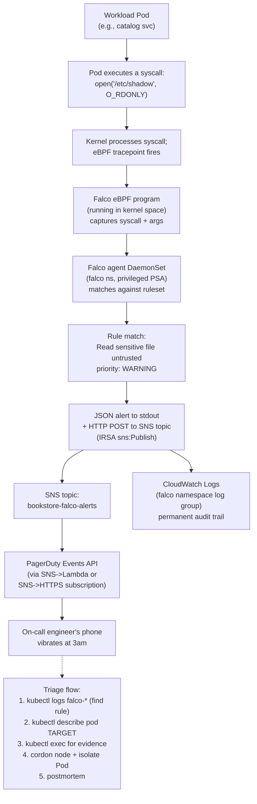

# 14.13 — Runtime defense & container security

> **Admission control stops bad images. PSA stops bad Pod specs. Image
> signing proves provenance. None of those mechanisms can see what
> happens *inside* a running container at 3am — a process being
> spawned, a sensitive file being read, an unexpected outbound TCP
> connection.** Runtime defense is the layer that watches the kernel
> itself: **Falco** + **Tetragon** for syscall-level rules,
> **GuardDuty for EKS Protection** for AWS-side cluster + flow log
> anomalies, and the alerting glue (SNS → PagerDuty → human) that
> closes the loop from "syscall fired" to "engineer triaging on
> their laptop." Falco's namespace is the **one** privileged PSA
> namespace in the tree precisely because the eBPF driver needs
> kernel capabilities that `restricted` can't grant.

**Estimated time:** ~30 min read · ~90 min hands-on
**Prerequisites:** [Part 05 ch.02](../05-security/02-pod-security.md) — PSA stops bad Pod specs but not syscalls · [Part 14 ch.12](./12-supply-chain-security.md) — admission stops bad images but not behavior · [Part 13 ch.06](../05-security/03-supply-chain.md) — bookstore security baseline you'll extend

**You'll know after this:** • understand why admission + PSA + signing leave runtime as the unwatched layer · • deploy Falco + Tetragon for syscall-level rules and know why their namespace must be privileged-PSA · • enable GuardDuty for EKS Protection (control-plane + flow-log anomalies) and route findings · • configure SNS → PagerDuty alerting so a syscall trigger ends with an engineer on their laptop · • triage a Falco alert end-to-end (rule match → Pod → workload → owner → containment decision)

<!-- tags: runtime-defense, falco, security, day-2, cloud -->

## Why this exists

[Part 05 ch.02](../05-security/02-pod-security.md) shipped Pod
Security Admission. [Part 05 ch.03](../05-security/03-supply-chain.md)
shipped image signing + SBOMs + Trivy. The bookstore-platform tree
deepened both with Phase 14-R's `kyverno-image-signing.tf`
ClusterPolicy. Those three layers — admission + image provenance +
signing — answer the question *"what can land in my cluster?"* with
high confidence.

They cannot answer the question *"what is my cluster doing *right now*?"*

A signed, scanned, admission-passed image can still:

- **Get exploited at runtime.** Log4Shell, the Spring4Shell variants,
  the steady drip of CVE-of-the-week in popular base images — none of
  these CVEs were knowable at scan time. The CVE database catches up
  *after* an exploit is in the wild; runtime defense catches what the
  scanner missed.
- **Be hijacked into mining cryptocurrency.** A compromised CI token
  pushes a poisoned image to ECR; the image passes signature
  verification (signed by the attacker's key, registered as a
  legitimate identity); the image runs in production and spawns
  `xmrig` against a mining pool. Static scanning misses it; runtime
  defense sees the unfamiliar process exec.
- **Reach for credentials it shouldn't.** A confused-deputy bug in a
  Go service makes it read
  `/var/run/secrets/eks.amazonaws.com/serviceaccount/token` (the IRSA
  projected token) when no legitimate code path should. Runtime
  defense sees the file-open syscall and fires.
- **Spawn a shell.** Web shells (a malicious request that causes the
  application to `exec /bin/sh`) are still one of the top attack
  patterns in 2026. The image is correct; the running process is
  doing the wrong thing.

The threat model post-admission is **container escape, privilege
escalation, lateral movement, cryptojacking, credential theft, web
shells**. Phase 14-R shipped [`falco.tf`](../examples/bookstore-platform/terraform/falco.tf)
gated by `var.enable_falco = false` — off by default precisely because
runtime defense adds a per-node eBPF agent that needs serious
privilege (CAP_BPF + CAP_PERFMON + CAP_SYS_ADMIN), a privileged-PSA
namespace, and an alert pipeline you actually intend to read at 3am.
Off-by-default until you wire all three is the honest default.

The complementary layer is **GuardDuty for EKS Protection**, AWS's
managed threat-detection service. GuardDuty ingests **cluster audit
logs** (the same audit log Falco watches for control-plane events)
+ **VPC flow logs** (which Falco doesn't see) + **DNS query logs**
+ **EKS-specific runtime signals** (with the optional Runtime
Monitoring tier). It can't replace Falco's syscall-level depth, but
it catches AWS-side patterns Falco can't see: a node IP suddenly
talking to a known C2 IP, a Pod making DNS lookups for a domain in
the threat-intel feed, an `aws sts get-caller-identity` call from
inside a Pod that has no legitimate AWS API usage.

[Part 11 ch.05](../11-advanced-production-patterns/05-secrets-at-scale.md)
discussed credential theft prevention from the secrets-storage side.
This chapter is the **runtime-detection** complement: even if a
credential leaks, what does the cluster *do* about a process
attempting to use it suspiciously?

> **In production:** Runtime defense is the layer most teams skip and
> regret. The half-day setup (Falco + an alert email + a triage
> runbook) prevents the multi-week incident retrospective that ends
> with "we had no visibility into the cluster at runtime." Falco
> off-by-default in the bookstore tree is a *teaching* default —
> production should flip it on.

## Mental model

**Three runtime-defense layers compose on EKS: kernel-level syscall
visibility (Falco / Tetragon eBPF agents), cluster-level audit log
analysis (Falco's audit-log integration + GuardDuty's EKS Audit Log
Monitoring), and AWS-network-level anomaly detection (GuardDuty's
VPC flow log + DNS analysis). Each catches a different class of
attack; together they answer "what is happening at runtime" from
three angles.**

The three layers:

- **Layer 1 — Kernel syscall visibility (Falco / Tetragon).** A
  per-node DaemonSet running an eBPF program attached to syscall
  tracepoints. Every `execve`, `openat`, `connect`, `mount`,
  `setuid` flows past the eBPF probe; the agent matches the syscall
  + arguments against a ruleset and emits an alert on match. The
  matching is **per-syscall, in the kernel, with no userspace
  context-switch** for non-matching events — the overhead is
  single-digit percent CPU per node even under sustained syscall
  load. The Phase 14-R `falco.tf` uses `driver.kind: modern_ebpf`
  which is the kernel >= 5.8 path; the AL2023 EKS-optimized AMI
  ships kernel 6.x, so the modern-eBPF path is the default
  supported road.
- **Layer 2 — Cluster audit log analysis (Falco + GuardDuty EKS
  Audit).** The Kubernetes API server's audit log records every
  authenticated API call: who, what, when, what resource. Falco's
  `auditLog.enabled = true` consumes the audit log; rules can match
  patterns like *"`kubectl exec` into a Pod in `kube-system`"*,
  *"creation of a ServiceAccount in `kube-system`"*, or *"`exec`
  into a Pod by a user not in the SRE Group"*. GuardDuty for EKS
  Audit Log Monitoring does the same thing AWS-side with managed
  threat intelligence — patterns like *"unusual user agent"* or
  *"suspicious GeoIP"* that need AWS's threat intel feed to be
  meaningful.
- **Layer 3 — AWS-network-level anomaly detection (GuardDuty
  Runtime + VPC Flow + DNS).** Falco doesn't see VPC flow logs, DNS
  query logs, or AWS API calls that originate from outside the
  cluster's Pods (e.g., a stolen IRSA token used from an attacker
  laptop). GuardDuty does. GuardDuty's EKS Runtime Monitoring (the
  optional paid add-on) installs an AWS-managed eBPF agent that's
  similar in shape to Falco but uses AWS's threat-intel-backed
  ruleset and integrates findings into the GuardDuty/Security Hub
  pane.

**Falco vs Tetragon vs GuardDuty Runtime — the trade-off matrix:**

| Tool | Source | Overhead | Strength | When to use |
|---|---|---|---|---|
| **Falco** | CNCF (open-source, Sysdig origin) | Single-digit % CPU | Mature ruleset, large community, JSON output for any SIEM | Default starting point; works on any K8s |
| **Tetragon** | CNCF (Cilium ecosystem) | Lower than Falco (kernel-event granularity, not syscall scan) | Deep Cilium integration, kernel-aware filtering | If you're already running Cilium (see ch.14.15) |
| **GuardDuty Runtime** | AWS (managed) | Same as Falco (eBPF agent) | Zero-ops, AWS threat-intel built in, Security Hub integration | If you want a managed runtime layer; cost: ~$1/vCPU/month |

You can run **Falco + GuardDuty Runtime simultaneously** — they don't
conflict (different eBPF program slots), and they catch different
classes of issues. The combined cost is ~$1/vCPU/month for the
GuardDuty side; Falco is free aside from the per-node CPU/memory
overhead.

**The Falco rules engine.** A Falco rule has four parts:

- **Macro:** a reusable expression (e.g., `container` = `container.id != "host"`).
- **List:** a reusable set of values (e.g., `shell_binaries` = `[bash, sh, zsh, ash]`).
- **Rule:** a `condition` (boolean expression over syscall events) +
  an `output` (the alert message format) + `priority` (debug, info,
  notice, warning, error, critical, alert, emergency).
- **Override:** the upstream Falco rules ship hundreds of canonical
  detections; an override lets you tune a specific rule's priority,
  output, or condition for your environment without forking the
  ruleset.

The Phase 14-R `falco.tf` sets `falco.priority = "warning"` — the
signal/noise sweet spot. `notice` is verbose (you'll see warnings on
legitimate ops). `info` is firehose territory (every `execve` in
every container).

**Privileged-PSA exception.** Falco's eBPF driver loads a kernel eBPF
program. The Linux capabilities required:

- `CAP_BPF` — load the eBPF program.
- `CAP_PERFMON` — attach to perf events (the tracepoint mechanism).
- `CAP_SYS_ADMIN` — attach to syscall tracepoints (the kernel
  protects this surface; SYS_ADMIN is required even on modern
  kernels for syscall tracepoint attachment).

The PSA `restricted` profile **forbids** all three. The PSA
`privileged` profile permits them. The Phase 14-R `falco`
namespace is therefore labelled `pod-security.kubernetes.io/enforce=privileged`
— the **only** privileged namespace in the bookstore-platform tree.
The chapter header in `falco.tf` documents this exception loudly.

**The alert pipeline.** A Falco rule firing produces:

1. **JSON to stdout** — every Falco Pod's `kubectl logs` output is
   JSON-formatted alerts; CloudWatch Logs ingests them (Phase 14-R
   `addons.tf` configures Fluent Bit or similar log forwarding).
2. **HTTP output to a webhook** (optional; not in 14-R's default
   wiring, but documented in the `falco.tf` comments) — Falco can
   POST alerts to any HTTP endpoint. SNS Topic via Lambda or direct
   to PagerDuty's Events API.
3. **SNS topic** (Phase 14-R wires this *via the IRSA role* when
   `falco_alert_email` is set) — Falco's IRSA role has
   `sns:Publish` on the `${cluster}-falco-alerts` SNS topic; the
   topic forwards to email (the var-gated email subscription) +
   any other SNS subscribers (PagerDuty, Slack, Lambda).

The bookstore-platform tree's default is **stdout-only**. Production
forks should wire SNS → PagerDuty via the AWS Events Source for
PagerDuty (covered in [Part 13 ch.12](../13-grand-capstone-bookstore-platform/12-day-2-runbook-on-call-dr-chaos.md)
patterns).

The trap to keep in view: **Falco's default rules are noisy on
day 1**. A fresh install fires on legitimate ops: `kubectl exec`
into Pods is common during debugging; `apt-get install` in a build
container fires the `Package Management Process` rule; CronJobs
firing in `kube-system` fire several rules per minute. **The first
production-grade Falco operation is rule tuning** — adding
`exception` clauses (or `override` rules) for the noise sources,
not silencing the rule entirely. A team that doesn't tune for a
week ends up disabling alerts; a team that tunes for a week ends
up with a high-signal alert stream.

## Diagrams

### Diagram A — Falco runtime alert flow (Mermaid)



### Diagram B — Falco vs Tetragon vs GuardDuty coverage matrix (ASCII)

```text
ATTACK PATTERN                          FALCO   TETRAGON   GD-RT    GD-EKS-AUDIT   GD-VPC-FLOW
                                        eBPF    eBPF       eBPF     audit-log      flow-log
─────────────────────────────────────  ──────  ─────────  ──────   ─────────────  ────────────
Shell in container                      YES     YES        YES      NO             NO
Sensitive file read (e.g., /etc/shadow) YES     YES        YES      NO             NO
Container escape via /proc/self/root    YES     YES        YES      NO             NO
Privilege escalation (setuid)           YES     YES        YES      NO             NO
Unexpected outbound connect             YES     YES        YES      NO             FLOW-level
DNS query to known-bad domain           rule-tune YES      YES      NO             NO
Cryptojacking process (xmrig)           YES     YES        YES      NO             NO
kubectl exec into kube-system Pod       audit   audit      audit    YES            NO
Unauthorized ServiceAccount creation    audit   audit      audit    YES            NO
Node IP -> C2 IP traffic                NO      NO         NO       NO             YES
Stolen IRSA token used from outside     NO      NO         NO       limited        IP-level
DNS exfiltration                        rule    rule       rule     NO             flow-only
Suspicious GeoIP                        NO      NO         NO       YES            YES
─────────────────────────────────────  ──────  ─────────  ──────   ─────────────  ────────────
Default ruleset coverage out-of-box     200+    100+       AWS      AWS            AWS
Cost (per node, monthly)                $0      $0         ~$1/vCPU $0 (free tier) ~$1/1M flow records
Operational burden                      HIGH    HIGH       LOW      LOW            LOW
                                        (rule-  (rule-
                                         tune)   tune)

RECOMMENDATION FOR BOOKSTORE-PLATFORM:
  PHASE 1 (week 1):     Falco (Phase 14-R) + GuardDuty (Free Trial 30d, then EKS Audit only).
  PHASE 2 (week 2-4):   Tune Falco rules; review GuardDuty findings; iterate.
  PHASE 3 (month 2+):   GuardDuty Runtime Monitoring (paid) if Falco rule-tune is unsustainable.
```

## Hands-on with the Bookstore Platform

### 0. Prerequisites

- The bookstore-platform tree applied with `enable_falco = true`.
- A throwaway namespace `runtime-test` (PSA `baseline`, not
  `restricted` — we'll intentionally do "bad" things).
- `kubectl` configured for the cluster.
- (Optional, but recommended) `falco_alert_email` set so SNS sends
  email on alert.

The Terraform shipping this is in
[`../examples/bookstore-platform/terraform/falco.tf`](../examples/bookstore-platform/terraform/falco.tf).
Read it end-to-end before running anything — it documents the
PSA-privileged exception and the IRSA scoping.

### 1. Confirm Falco landed

```bash
kubectl -n falco get pods
```

Expected:

```text
NAME                READY   STATUS    RESTARTS   AGE
falco-abcde         1/1     Running   0          3m
falco-fghij         1/1     Running   0          3m
falco-klmno         1/1     Running   0          3m
```

One Pod per node (DaemonSet). Verify the namespace is PSA-`privileged`:

```bash
kubectl get ns falco -o jsonpath='{.metadata.labels.pod-security\.kubernetes\.io/enforce}'
# expected: privileged
```

If that returns `restricted` or empty, Falco wouldn't have come up —
the eBPF driver needs CAP_BPF/CAP_PERFMON which `restricted`
forbids. This is the documented exception in `falco.tf`'s file
header.

### 2. Inspect the loaded ruleset

```bash
kubectl -n falco exec -it $(kubectl -n falco get pod -l app.kubernetes.io/name=falco -o jsonpath='{.items[0].metadata.name}') \
  -- falco --list 2>/dev/null | head -20
```

Expected (truncated):

```text
Rule: Read sensitive file untrusted
Rule: Run shell untrusted
Rule: Write below binary dir
Rule: Write below root
Rule: Modify binary dirs
Rule: Mkdir binary dirs
Rule: Change thread namespace
Rule: Write below etc
Rule: Create files below dev
Rule: Read shell configuration file
...
```

`falco --list` shows the active rules. Falco ships ~200 rules
out-of-the-box; the count varies by chart version + which
`falcoctl` rule packs are enabled (default ruleset only, in 14-R's
config).

### 3. Trigger a benign-but-detectable rule

A `cat /etc/shadow` from inside a container is the canonical
*Read sensitive file untrusted* trigger. Run it in `runtime-test`
(a deliberately permissive namespace):

```bash
kubectl create namespace runtime-test \
  --dry-run=client -o yaml | kubectl apply -f -

kubectl label ns runtime-test \
  pod-security.kubernetes.io/enforce=baseline --overwrite

cat <<EOF | kubectl apply -f -
apiVersion: v1
kind: Pod
metadata:
  name: cat-shadow
  namespace: runtime-test
spec:
  restartPolicy: Never
  containers:
    - name: shell
      image: public.ecr.aws/docker/library/busybox:1.36
      command: ["sh", "-c", "cat /etc/shadow || true; sleep 5"]
EOF
```

Wait for the Pod to complete:

```bash
kubectl -n runtime-test wait pod/cat-shadow --for=condition=Ready --timeout=30s || true
sleep 8
```

### 4. Read the Falco alert

```bash
# Pull alerts from every Falco Pod (the relevant one is on the same node
# as cat-shadow, but checking all is robust):
for p in $(kubectl -n falco get pod -l app.kubernetes.io/name=falco -o name); do
  echo "==== $p ===="
  kubectl -n falco logs "$p" --tail=200 | grep -i "shadow" || true
done
```

Expected (one JSON line per alert):

```text
{"output":"... Read sensitive file untrusted (file=/etc/shadow ...)","priority":"Warning","rule":"Read sensitive file untrusted","time":"...","output_fields":{"container.id":"<HEX>","container.image.repository":"public.ecr.aws/docker/library/busybox","fd.name":"/etc/shadow","proc.name":"cat","user.uid":0}}
```

Five facts the alert tells you:

- **rule** — *Read sensitive file untrusted* (the matched rule name).
- **priority** — `Warning` (matches Falco's configured priority floor).
- **container.image.repository** — `public.ecr.aws/docker/library/busybox` (which image).
- **proc.name** — `cat` (which process inside the container).
- **fd.name** — `/etc/shadow` (which file).

If you have `falco_alert_email` configured, an email arrives at the
configured address with the alert JSON in the body (SNS-formatted).

### 5. Trigger a shell-in-container alert

The other canonical rule — *Terminal shell in container* — fires
on `kubectl exec` into a Pod when an interactive shell is the
target.

```bash
# Create a long-running test pod:
cat <<EOF | kubectl apply -f -
apiVersion: v1
kind: Pod
metadata:
  name: longrun
  namespace: runtime-test
spec:
  containers:
    - name: shell
      image: public.ecr.aws/docker/library/busybox:1.36
      command: ["sh", "-c", "sleep 3600"]
EOF

kubectl -n runtime-test wait pod/longrun --for=condition=Ready --timeout=30s

# Exec into it (this is the trigger):
kubectl -n runtime-test exec longrun -- sh -c "echo hi from inside"

# Wait + check alerts:
sleep 5
kubectl -n falco logs -l app.kubernetes.io/name=falco --tail=200 \
  | grep -i 'shell\|terminal' | tail -5
```

Expected alert (truncated): `Terminal shell in container ... proc.name=sh`.

This is the alert that fires in production when an attacker (or a
human operator) `exec`s into a workload Pod. The production runbook
is *every alert is investigated* — even the legitimate operator
shells, because absence of false-positives in the runbook *is the
runbook's contract*. (Quietly tuning the rule to allow your SREs
without recording who/when/why is how Falco gets ignored.)

### 6. Inspect a rule and add an exception

The legitimate-shell case is *team-sre exec'ing into kube-system
debug Pods* — happens daily, fires on every exec, drowns the
signal. The right fix is an **exception**, not deletion.

Pull the rule definition:

```bash
kubectl -n falco exec -it $(kubectl -n falco get pod -l app.kubernetes.io/name=falco -o jsonpath='{.items[0].metadata.name}') \
  -- falco --describe 'Terminal shell in container'
```

The rule's condition includes `not user_known_shell_in_container_conditions`.
The override is to populate that exception list — done via a
Kubernetes ConfigMap mounted into the Falco Pod (the Helm chart's
`customRules` value, not shipped by 14-R's default config).

A minimal customRules snippet you'd add to the `falco.tf` Helm
values (commented in 14-R; uncomment to apply):

```yaml
customRules:
  custom-rules.yaml: |-
    - macro: user_known_shell_in_container_conditions
      condition: >
        (container.image.repository in (kubectl_debug_images))
        or (k8s.ns.name = "kube-system" and k8s.user.name in (sre_team_users))
    - list: kubectl_debug_images
      items: ["nicolaka/netshoot", "registry.k8s.io/e2e-test-images/agnhost"]
    - list: sre_team_users
      items: ["alice@example.com", "bob@example.com"]
```

After applying, the rule fires only on shells that **don't** match
the exception. The unknown-user-exec on a workload Pod still fires;
the SRE-exec on a kube-system debug Pod doesn't.

### 7. Wire the SNS->PagerDuty bridge (production wiring sketch)

The Phase 14-R `falco.tf` creates an SNS topic when
`falco_alert_email` is set. To route SNS to PagerDuty's Events API,
PagerDuty offers an AWS-managed Events Source: from the PagerDuty
service config, "Add Integration → AWS SNS → copy integration URL"
gives you an `events.pagerduty.com` URL.

Subscribe SNS to it (one-time, outside Terraform):

```bash
TOPIC_ARN=$(aws sns list-topics \
  --query 'Topics[?contains(TopicArn,`falco-alerts`)].TopicArn' \
  --output text)
PD_URL=https://events.pagerduty.com/integration/<INTEGRATION-KEY>/enqueue

aws sns subscribe \
  --topic-arn "$TOPIC_ARN" \
  --protocol https \
  --notification-endpoint "$PD_URL"
```

Now any Falco alert → SNS → PagerDuty incident. PagerDuty's
deduplication groups same-rule alerts; the on-call engineer sees
one incident per rule, not per alert.

### 8. Enable GuardDuty for EKS Protection

GuardDuty doesn't ship in Phase 14-R's main tree (it's account-scope,
covered by the `account-baseline/` directory and ch.14.17). Enable
it manually for a quick demo:

```bash
# Enable GuardDuty in the cluster's region:
aws guardduty create-detector --enable

# Enable EKS Audit Log Monitoring (free):
DETECTOR_ID=$(aws guardduty list-detectors --query 'DetectorIds[0]' --output text)
aws guardduty update-detector \
  --detector-id "$DETECTOR_ID" \
  --features Name=EKS_AUDIT_LOGS,Status=ENABLED
```

After ~15 minutes GuardDuty starts emitting findings to the
GuardDuty console + (if Security Hub is enabled) Security Hub. The
free tier covers Audit Log Monitoring; EKS Runtime Monitoring is
paid (~$1/vCPU/month).

For production, the right wiring is **Terraform in
`account-baseline/`** (ch.14.17 covers the account-wide pattern).

### 9. Clean up

```bash
kubectl delete namespace runtime-test
```

To remove Falco entirely, set `enable_falco = false` and
`terraform apply`. The IAM role + SNS topic destroy cleanly because
14-R's lifecycle order is namespace-Helm-IRSA-SNS in the right
sequence.

## How it works under the hood

**The eBPF tracepoint path.** When a process in a container executes
`open("/etc/shadow", O_RDONLY)`, the kernel processes the syscall
through `do_sys_openat2`. That function has a **syscall tracepoint**
attached — `sys_enter_openat`. The kernel checks: any eBPF programs
attached to this tracepoint? Falco's eBPF program is attached. The
program runs in kernel space, with access to the syscall arguments
(filename, flags, etc.) + the calling process's context (PID, UID,
cgroup, container.id derived from cgroup). The program writes an
event record to a kernel ring buffer (a perf buffer or BPF ring
buffer). Falco's userspace agent reads from the ring buffer, applies
its rules, and emits alerts.

The reason this is **fast**: the kernel-space filter step happens
**before** any context switch to userspace. If the event doesn't
match any rule (the vast majority), the kernel ring buffer never
fills with that event — it's filtered in-kernel. Only matching
events cross the kernel-userspace boundary, where Falco's userspace
agent processes them at the rate of rule-firings, not at the rate of
all syscalls. For a busy node doing 100k syscalls/sec, Falco might
process 10-100 events/sec.

**Why CAP_SYS_ADMIN.** The Linux kernel protects tracepoint
attachment behind capabilities. Reading syscall data (filenames,
arguments) leaks information about other containers on the same
node — a tenant container could observe another tenant's syscalls if
it had tracepoint access. Therefore `CAP_PERFMON` (since kernel 5.8)
gates perf-event-based observation, and `CAP_BPF` gates eBPF program
loading. For syscall **tracepoints** specifically, the kernel still
requires `CAP_SYS_ADMIN` in practice on most production kernels —
the cleaner CAP_BPF + CAP_PERFMON split was a 5.8 kernel addition,
but full coverage of syscall tracepoint attachment landed gradually
through 5.8-5.13. AL2023's 6.x kernel honors the split, but
defensive Helm charts still request CAP_SYS_ADMIN for compatibility.

**The Falco rules engine.** Internally Falco is a streaming event
processor: events flow in from the eBPF buffer (or other sources —
the K8s audit-log webhook source feeds the same engine). The rules
engine is a boolean expression evaluator over an event's fields.
Field references like `proc.name`, `fd.name`, `container.image.repository`,
`k8s.ns.name` are extracted from the event + cgroup hierarchy +
Kubernetes annotation enrichment (Falco watches the K8s API for
Pod/Namespace metadata, indexes by container ID, joins to events).
Rules are compiled into bytecode for fast evaluation. The rule with
the deepest match (longest condition expression) wins; the rule's
`output` template fills in event fields and emits the alert.

**JSON output + stdout collection.** Falco's JSON output goes to its
stdout. The Falco DaemonSet's Pods log to kubelet, which forwards
logs to Fluent Bit (or the EKS-managed log forwarder), which ships
to CloudWatch Logs. The CloudWatch log group `/aws/eks/<cluster>/falco`
(or whatever Phase 14-R's log forwarder configured) accumulates the
permanent audit trail. CloudWatch Logs Insights can query the JSON
events; subscription filters fanout to Lambda / Kinesis / a SIEM.

**The SNS+IRSA path for direct webhook output.** Falco's HTTP output
posts an alert JSON to a configured URL. The `falco.tf` IRSA role
has `sns:Publish` scoped to the `${cluster}-falco-alerts` topic; a
custom Falco `http_output.url = https://<sns-endpoint>` (after a
sidecar transforms Falco's JSON to SNS's PublishInput JSON, since
SNS doesn't accept arbitrary JSON directly) sends alerts straight
to SNS. The simpler production wiring is **Falco → CloudWatch Logs
→ subscription filter → Lambda → SNS** (CloudWatch Logs is the
ingestion path, Lambda transforms + publishes). Either pattern
works; the CloudWatch-Logs path is more debuggable and pays the
CloudWatch Logs ingest charge ($0.50/GB) plus Lambda invocations.

**Tetragon's lower-overhead approach.** Tetragon uses **kernel
events** (e.g., `tracepoint:syscalls:sys_enter_openat`,
`kprobe:do_sys_openat2`) in a similar way to Falco, but with an
emphasis on **in-kernel filtering**: Tetragon's policies (called
`TracingPolicy`) compile expressive filters into eBPF programs that
run in-kernel. Where Falco's eBPF program captures the event and
sends it to userspace for rule matching, Tetragon's eBPF program
does more filtering in-kernel — the userspace agent receives fewer
events. The trade-off: Tetragon's filters are less expressive than
Falco's full rule language (no string-pattern matching across the
event stream), but the events that do cross the boundary already
matter. For organizations on Cilium (ch.14.15), Tetragon is the
natural sibling; for standalone runtime defense, Falco is the more
mature standalone choice.

**GuardDuty for EKS audit log monitoring.** AWS subscribes to the
EKS control plane audit log (which Phase 14-R's `eks.tf` already
enables under `cluster_enabled_log_types = ["api","audit",...]`).
GuardDuty's managed analyzer runs threat-intel-backed pattern
matching: unusual user agents, anomalous API call patterns,
suspicious GeoIP source IPs for `kubectl exec` events, calls to
`exec` on `kube-system` Pods by users not previously seen. Findings
land in the GuardDuty console + Security Hub (if enabled) + EventBridge
(for routing to SNS/Lambda/etc). The integration is **zero-ops** —
no agent to install; AWS handles the analysis.

**GuardDuty for EKS Runtime Monitoring (paid).** AWS installs an
AWS-managed eBPF agent (the GuardDuty agent) as a DaemonSet in
`amazon-guardduty` namespace. It runs the same kind of syscall +
process + network watch Falco runs, but with AWS's threat-intel
ruleset. Cost is ~$0.20-1.00 per vCPU per month (varies by region +
data volume). When to enable: when Falco rule-tuning is more
operational burden than the engineering time you can give it. When
to stick with Falco: when you want full ruleset control + rule-tune
discipline + no per-vCPU bill.

## Production notes

> **In production:** Falco's default ruleset is a *starting point*,
> not a steady-state config. The first month is heavy rule-tuning:
> exception clauses for your shells (which images, which users),
> your build patterns (which containers run `apt-get install`),
> your CronJobs (which jobs read `/etc/passwd` as part of legitimate
> work). Allocate a 4-hour weekly review for the first month; the
> rate drops after that. Skip this and the alert stream becomes
> noise; the team disables alerts; the cluster has no runtime
> defense.

> **In production:** Falco's alerts should drive **incidents**, not
> tickets. A genuinely-fired Falco rule is, by construction, a
> potential security event — a shell that shouldn't exist, a file
> read that shouldn't happen, a binary that shouldn't be on the
> filesystem. Route to PagerDuty (or your equivalent), severity
> "WARNING" for `priority=warning` rules + "CRITICAL" for
> `priority=critical/alert/emergency` rules. The on-call rotation
> investigates each one within 30 minutes; closes with a 1-line
> postmortem (false-positive → tune rule; true-positive → escalate).

> **In production:** Falco's alert JSON is the forensic record.
> Forwarded to CloudWatch Logs with a long retention window (180-365
> days for compliance), it's the source for the post-incident
> question *"when did this start happening?"* and *"how many other
> Pods exhibited the same pattern in the prior week?"* CloudWatch
> Logs Insights queries the JSON natively:
>
> ```text
> fields @timestamp, output_fields.container.image.repository, rule
> | filter rule = "Read sensitive file untrusted"
> | stats count() by output_fields.container.image.repository
> ```

> **In production:** GuardDuty's free tier (EKS Audit Log Monitoring)
> is **always worth enabling** — it costs zero, ingests the
> already-enabled audit log, and catches AWS-side patterns Falco
> can't. The paid tier (Runtime Monitoring) is worth it when Falco's
> rule-tuning burden exceeds the team's engineering budget. The
> two-layer pattern (Falco for syscall depth + GuardDuty for
> AWS-side patterns) is the production-grade default.

> **In production:** Evidence collection. When a runtime alert
> fires, the on-call's first move is *capture before the Pod
> dies*. The standard sequence:
>
> ```bash
> # 1. Capture Pod state + last container logs.
> kubectl get pod <TARGET> -n <NS> -o yaml > /tmp/pod-state.yaml
> kubectl logs <TARGET> -n <NS> --previous --tail=1000 > /tmp/pod-logs.txt
>
> # 2. Capture process list inside the Pod (if still alive).
> kubectl exec <TARGET> -n <NS> -- ps -ef > /tmp/pod-ps.txt
>
> # 3. Capture network connections.
> kubectl exec <TARGET> -n <NS> -- ss -anptu > /tmp/pod-net.txt
>
> # 4. Capture filesystem snapshot of suspicious paths.
> kubectl exec <TARGET> -n <NS> -- tar c /tmp /var/tmp \
>   > /tmp/pod-fs.tar
>
> # 5. NOW cordon the node + isolate the Pod by adding a deny-all
> #    NetworkPolicy targeting the Pod's labels.
> ```
>
> Evidence-then-isolation is the order; the reverse loses data.

> **In production:** Container escape is the **rarest but worst**
> attack class. The default ruleset's `container.id != "host"`
> check ensures the alert fires for *in-container* activity; if
> Falco fires with `container.id = host`, an attacker has escaped
> the container boundary and is operating on the node directly.
> This is the "drop everything" alert — page everyone, cordon the
> node, snapshot the node's volume, take the node out of service.
> The recovery is **node replacement**, not Pod restart.

> **In production:** Falco's per-node overhead is ~5% CPU + 200 MB
> memory under normal load. On a Karpenter-managed cluster with
> mixed instance types, the absolute CPU budget varies — a t3.medium
> (2 vCPU) loses 0.1 vCPU; an m7g.4xlarge (16 vCPU) loses 0.8 vCPU.
> The `resources.limits` in 14-R's `falco.tf` is `cpu: 1, memory: 1Gi`
> — generous for the worst-case node. Right-size after a week of
> production data with VPA recommendations.

## Quick Reference

```bash
# Confirm Falco is running.
kubectl -n falco get pods -l app.kubernetes.io/name=falco

# Tail the alert stream from all Falco Pods.
kubectl -n falco logs -l app.kubernetes.io/name=falco -f --tail=10

# List all loaded rules.
kubectl -n falco exec <FALCO-POD> -- falco --list

# Describe a specific rule (condition + output).
kubectl -n falco exec <FALCO-POD> -- falco --describe '<RULE-NAME>'

# Search alerts by rule name (CloudWatch Logs Insights query).
fields @timestamp, output_fields.container.image.repository, rule
| filter rule = "<RULE-NAME>"
| stats count() by output_fields.container.image.repository

# Trigger a benign Falco alert for testing.
kubectl run cat-shadow --image=public.ecr.aws/docker/library/busybox:1.36 \
  --restart=Never --rm -i --tty -- cat /etc/shadow

# Enable GuardDuty EKS Audit Log Monitoring (free).
aws guardduty create-detector --enable
DET=$(aws guardduty list-detectors --query 'DetectorIds[0]' --output text)
aws guardduty update-detector --detector-id "$DET" \
  --features Name=EKS_AUDIT_LOGS,Status=ENABLED

# List GuardDuty findings (newest first).
aws guardduty list-findings --detector-id "$DET" \
  --finding-criteria '{"Criterion":{"updatedAt":{"GreaterThan":'$(($(date +%s%3N) - 86400000))'}}}'

# Forensic evidence capture (incident response).
kubectl get pod <TARGET> -n <NS> -o yaml > /tmp/pod-state.yaml
kubectl logs <TARGET> -n <NS> --previous --tail=1000 > /tmp/pod-logs.txt
kubectl exec <TARGET> -n <NS> -- ps -ef > /tmp/pod-ps.txt
kubectl exec <TARGET> -n <NS> -- ss -anptu > /tmp/pod-net.txt
```

Runtime-defense checklist (the production setup is right when all six are yes):

- [ ] Falco DaemonSet running on every node (`enable_falco = true`).
- [ ] `falco` namespace labelled PSA `enforce=privileged` — the only
      privileged namespace.
- [ ] Falco IRSA role has `sns:Publish` to the alerts topic and
      *only* that topic.
- [ ] SNS topic forwards to PagerDuty (or your incident-management
      system) — alerts page the on-call within minutes.
- [ ] CloudWatch Logs retention for Falco alerts >= 180 days
      (compliance baseline; 365 days for regulated workloads).
- [ ] GuardDuty for EKS Audit Log Monitoring enabled (free tier).
      Production accounts also enable Runtime Monitoring (paid).

## Test your understanding

> Try each before opening the answer drawer. The act of trying is the exercise; the answer is the check.

1. **Admission control, PSA, and image signing are all in place. What class of attacks does runtime defense (Falco) catch that none of those layers can?**
   <details><summary>Show answer</summary>

   Anything that goes wrong **after** a Pod has been admitted and started. The pre-admission layers prove the image is signed, the Pod spec is sane, the container won't run privileged — but a CVE in libssl exploited at runtime, a confused-deputy read of the IRSA token, a web shell, a cryptojacker spawned from a compromised dependency, lateral movement attempts — these all happen at runtime inside the kernel. Falco's eBPF probes attach to syscall tracepoints (`execve`, `openat`, `connect`, `setuid`) and match patterns; the kernel sees what the process is actually doing, regardless of how the image got to the cluster.

   </details>

2. **Falco fires the rule "Shell spawned by web service" at 03:14. PagerDuty pages you. Walk through the chapter's triage runbook.**
   <details><summary>Show answer</summary>

   (1) Identify the Pod and workload from the alert's labels (`k8s.pod.name`, `k8s.namespace`); (2) check who owns the workload (the GitOps repo's CODEOWNERS or the workload's `team` label); (3) decide containment — for a confirmed shell exec on a webserver Pod, `kubectl delete pod <name>` evicts it (workload controller spawns a replacement, attacker loses persistence); (4) preserve evidence — `kubectl exec -- ps auxf` and the Falco alert JSON go into the incident channel; (5) escalate if the alert recurs on the replacement Pod (it indicates the image itself is compromised, not just one instance) — at that point the rollback playbook (15.07) kicks in. The runbook ends with a postmortem owner assigned and a 5-day clock to draft.

   </details>

3. **You install Falco and the cluster starts running a noticeable percentage hotter on CPU. The team wants to disable it. What's the better answer and why?**
   <details><summary>Show answer</summary>

   Tune, don't disable. Falco's overhead is single-digit % CPU at default rules — if a cluster is running noticeably hotter, the noise is usually in the ruleset (rules that match on common syscalls without specific filters), not the eBPF probe itself. Audit the rule list, mute the ones that aren't actionable for your environment (e.g., disable the "shell spawned by container" rule for tenants whose images intentionally include shells, or tighten the rule to exclude specific images). The chapter's discipline: every Falco rule has a runbook anchor and an owner; rules that don't are tech debt, not runtime defense. Disabling Falco trades observability for CPU — that's the wrong trade.

   </details>

4. **Hands-on extension — `kubectl exec` into a bookstore Pod and run `cat /var/run/secrets/eks.amazonaws.com/serviceaccount/token`. What does Falco do?**
   <details><summary>What you should see</summary>

   The default Falco ruleset includes "Read sensitive file untrusted" — the IRSA token path matches. An alert fires within ~1 second of the read syscall; the alert lands in the configured sink (SNS → PagerDuty if wired, stdout otherwise). The Pod's process and command line are captured. This is the canonical "confused deputy" detection — legitimate code in the Pod uses the AWS SDK which reads the token at startup once; a `kubectl exec` cat of the same file is unusual and worth knowing. If the alert is too noisy for your team's exec workflow, the rule has an exception list — but the chapter argues most teams find this rule worth keeping.

   </details>

## Further reading

- **Falco official documentation**
  <https://falco.org/docs/>; the canonical Falco reference,
  including the rule language, the eBPF driver options, and the
  alert output formats this chapter walks.
- **Falco rules repository**
  <https://github.com/falcosecurity/rules>; the upstream rule
  packs (default `falco_rules.yaml` + the `application_rules.yaml`
  + the K8s-audit ruleset). Source of every rule mentioned here.
- **Cilium Tetragon documentation**
  <https://tetragon.io/docs/>; the upstream Tetragon docs,
  including the TracingPolicy syntax and the kernel-event filtering
  story this chapter contrasts with Falco.
- **AWS GuardDuty for EKS Protection**
  <https://docs.aws.amazon.com/guardduty/latest/ug/kubernetes-protection.html>;
  the AWS-side documentation for both the EKS Audit Log Monitoring
  (free) and EKS Runtime Monitoring (paid) tiers this chapter covers.
- **Rosso, *Production Kubernetes* — *Cluster Hardening***;
  the chapter's runtime-defense thinking is in line with Rosso's
  hardening + day-2 chapter, particularly the "what to do when an
  alert fires" runbook discipline this chapter's production notes
  borrow from.
- **NIST SP 800-190 — Application Container Security Guide**
  <https://csrc.nist.gov/publications/detail/sp/800-190/final>; the
  US government guidance on container security including runtime
  defense; the threat-model framing in this chapter aligns with
  the SP 800-190 categorization.
