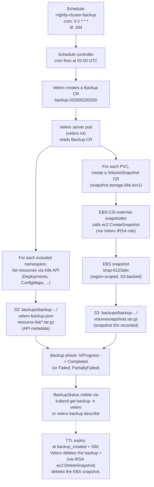

# 14.14 — Backup and restore with Velero

> **EKS manages etcd snapshots for you. AWS Backup snapshots EBS
> volumes. RDS has point-in-time recovery. S3 has versioning. None of
> them, individually or together, will restore a deleted ConfigMap, a
> mangled Helm release, a TenantClaim CR that someone `kubectl delete`d
> by accident, or a Namespace someone wiped while testing the GitOps
> reconciler.** Velero is the Kubernetes-shaped backup tool: it
> snapshots **API objects + the PVs those objects reference** to S3,
> on schedule, and can restore a single namespace, a label-selected
> subset, or the whole cluster — to the same cluster after corruption,
> or to a *new* cluster as a migration. Phase 14-R's `velero.tf` ships
> the install + the IRSA scoping + the daily 30-day schedule; this
> chapter walks the architecture, the schedule discipline, the
> restore drill, and the **honest list of what Velero can't back up**
> (cloud-side state — RDS data, S3 buckets, IAM — covered by ch.14.17).

**Estimated time:** ~30 min read · ~90 min hands-on
**Prerequisites:** [Part 08 ch.02](../08-day-2-operations/02-backup-and-dr.md) — backup discipline framing · [Part 14 ch.04](./04-storage-classes-and-ebs.md) — EBS volumes whose snapshots Velero coordinates · [Part 13 ch.01](../13-grand-capstone-bookstore-platform/01-bookstore-2-from-toy-to-platform.md) — bookstore namespaces that need cluster-shaped backup

**You'll know after this:** • understand why etcd snapshots + EBS snapshots + RDS PITR together still leave Kubernetes-shaped state unbacked up · • configure Velero schedules that snapshot API objects + the PVs they reference to S3 · • restore a single namespace, a label-selected subset, or a whole cluster from a Velero backup · • rehearse restore-to-new-cluster as a cluster-migration tool · • know the honest list of what Velero CAN'T back up (RDS data, S3 buckets, IAM) and how Part 14.17 covers it

<!-- tags: velero, dr, day-2, eks, storage -->

## Why this exists

The bookstore-platform tree at
[`../examples/bookstore-platform/terraform/`](../examples/bookstore-platform/terraform/)
runs CNPG, Strimzi, Argo CD, Kyverno, Falco, OpenCost, the bookstore
application namespaces, and a fleet of CRDs that drive all of the
above. Phase 14-R shipped Velero in
[`velero.tf`](../examples/bookstore-platform/terraform/velero.tf)
gated by `var.enable_velero = false` — off by default because backup
costs (S3 storage + EBS snapshot fees) compound monthly and a
production backup story is more than the install.

Three things every Kubernetes team eventually loses without backups:

- **A namespace.** A `kubectl delete ns bookstore` deletes every
  resource in it: Deployments, Services, ConfigMaps, Secrets, the PVCs
  too. Argo CD won't replant resources that aren't in Git
  (auto-prune); the human-error case is irreversible without a
  backup.
- **A PV's data.** A `helm uninstall` on a chart that owns CNPG with
  `reclaimPolicy: Delete` destroys the EBS volume. The data is gone.
  EBS snapshots taken by AWS Backup outside Kubernetes catch this if
  the schedule is right; Velero's CSI snapshot integration captures
  it from inside Kubernetes.
- **A CRD instance.** A `kubectl delete kyvernopolicy require-labels`
  deletes the policy. The cluster is now permitting unlabeled
  workloads. AWS-side backups don't see CRD instances; only Velero
  (or `etcdctl` snapshots on EKS — *which AWS doesn't expose to you*)
  captures them.

[Part 08 ch.02](../08-day-2-operations/02-backup-and-dr.md) introduced
Velero in the abstract: the three state layers (etcd / app desired
state / PV data), the three corresponding backups, the restore-test
discipline. That chapter ran Velero against a kind cluster with MinIO
as the object store. This chapter is the **EKS-specific overlay**:
IRSA wires Velero to S3 + EBS without a static credential, the CSI
snapshotter handles the EBS volume side, and the schedule discipline
sits alongside the AWS-side billing reality.

> **In production:** A backup that has never been **restore-tested**
> is a hypothesis, not a backup. Phase 14-R ships the install; the
> production discipline is the quarterly fire-drill where you
> destroy a namespace + restore it from Velero + verify the workload
> comes back. Teams that skip this learn at 3am that the backup
> they relied on was missing a CRD, or had a Secrets-encryption
> mismatch, or referenced an EBS snapshot in a region that no
> longer matched the cluster.

## Mental model

**Three Velero concepts compose the backup story: the
`BackupStorageLocation` (where to write — an S3 bucket via IRSA),
the `VolumeSnapshotLocation` (how to snapshot PVs — via CSI or AWS
EBS snapshots), and the `Schedule` (when to run + what to include).
Backups are *additive snapshots*: an API-object dump in JSON +
EBS-volume snapshots referenced by snapshot ID; restores reverse
the operation.**

The four concepts:

- **`BackupStorageLocation` (BSL) — where backup metadata + objects
  live.** A namespaced CR pointing at an object-storage bucket. Phase
  14-R configures one BSL named `default` against the
  `<cluster>-velero-backups-<account-suffix>` S3 bucket (created by
  Terraform, KMS-encrypted, versioned, lifecycle-managed). Velero
  writes one *prefix* per backup: `backups/<NAME>/`. Inside it:
  `velero-backup.json` (the backup manifest), per-resource tarballs
  (`resource-list/configmaps.tar.gz`, etc.), `velero-backup-metadata`
  (CRD versions, K8s server version, etc.), and `restic/kopia/`
  subdirectories if file-level PV backup is enabled.
- **`VolumeSnapshotLocation` (VSL) — how PV snapshots are taken.**
  Also a namespaced CR. Phase 14-R configures the AWS provider VSL
  pointing at the cluster's region. When a backup includes a PVC,
  Velero asks the CSI driver (via VolumeSnapshot CRs in
  snapshot.storage.k8s.io/v1) to take a CSI snapshot — which on
  EBS-CSI translates to `ec2:CreateSnapshot`. The snapshot ID is
  recorded in the backup metadata; restore creates a new EBS volume
  from the snapshot.
- **`Schedule` — when to back up.** A CR with a cron-string + a
  `BackupSpec` template. Phase 14-R's default `Schedule` is
  `nightly-cluster-backup`, runs at 02:00 UTC daily, retains 30
  days, includes every namespace except the EKS-managed ones
  (`kube-system`, `kube-public`, `kube-node-lease`), snapshot
  volumes via CSI. The Schedule controller materialises a `Backup`
  CR each time the cron fires.
- **`Restore` — apply a backup back to a cluster.** A CR identifying
  a backup name and (optionally) selectors (namespaces, label
  selector, resource types). The Restore controller reads the
  backup's S3 prefix, recreates the API objects (with optional
  remapping like `namespace-mapping`), recreates PVCs (and the
  controller asks the CSI driver to provision new PVs from the
  recorded snapshot IDs).

**The CSI snapshot path vs the file-level backup path.** Velero on
EKS has two ways to back up PV data:

1. **CSI VolumeSnapshot (the default in Phase 14-R).** Works when the
   StorageClass's CSI driver supports snapshots — EBS-CSI does, with
   the `ebs-csi-default` VolumeSnapshotClass. Fast (snapshots happen
   at the block-store level), efficient (incremental — only changed
   blocks are billed after the first), and the snapshots are
   region-scoped (cross-AZ restore is just specifying the target
   AZ).

2. **File-system backup with Kopia or Restic (opt-in via
   `defaultVolumesToFsBackup: true` or per-PVC annotation).** A
   Velero node-agent DaemonSet mounts each PV and runs a Kopia (or
   Restic) backup — copying file contents into a deduplicated
   repository inside the same S3 bucket as the metadata. Works for
   **any** PV regardless of CSI snapshot support — including
   EFS-backed PVs (which EBS-CSI can't snapshot because EFS isn't an
   EBS volume), GCS-CSI on EKS, or third-party CSI drivers without
   snapshot implementations.

**Trade-offs:**

| Path | Speed | Cost | Coverage | When to use |
|---|---|---|---|---|
| **CSI snapshot** | Seconds (block-store) | EBS snapshot pricing ($0.05/GB-mo of unique blocks) | EBS PVs only | Default. Phase 14-R's path. |
| **Kopia/Restic file backup** | Minutes-to-hours (file scan) | S3 storage only ($0.023/GB) | Any mounted PV | EFS-backed PVs, cross-CSI portability, or when you want a single deduplicated repo. |

Phase 14-R's default is **CSI snapshot** (`defaultVolumesToFsBackup:
false` in the Schedule). The Bookstore Platform's stateful workloads
(CNPG, Loki, Tempo, Prometheus) all run on EBS-backed gp3 PVs (Phase
14-R's `gp3-storageclass.tf`), which CSI snapshots handle natively.

**Backup retention math (the 23-backup pattern).** A textbook
retention scheme used across the operations industry:

```text
- 7 daily backups  (one per day for the last week)
- 4 weekly backups (one per week for the last month)
- 12 monthly backups (one per month for the last year)
─────────────────────
= 23 backup objects retained at any time
```

The point: **23 backups, not 365**. A daily-only-with-365-day-TTL
policy holds 365 backups; the storage cost is 16x the 23-backup
scheme for marginal extra recovery granularity. The 23-backup scheme
is the FinOps-aware default — for a 200 GB cluster snapshot, the
math:

```text
First daily snapshot:        200 GB unique blocks * $0.05/GB-mo  = $10.00/mo
6 incremental dailies:       ~5 GB delta each * 6 * $0.05/GB-mo  =  $1.50/mo
4 weekly snapshots:          ~20 GB delta each * 4 * $0.05/GB-mo =  $4.00/mo
12 monthly snapshots:        ~40 GB delta each * 12 * $0.05/GB-mo = $24.00/mo
─────────────────────
                                                       Total      ~$39.50/mo
```

vs ~$300/mo for daily-only-365-day. The 23-backup scheme is a hard
default in `velero.tf`'s schedule comments; production forks should
implement it with three `Schedule` CRs each with its own `ttl`.

**The hooks pattern (application-consistent backups).** A naive PV
snapshot is **crash-consistent**: the snapshot captures the volume's
state at the snapshot moment, but in-flight database writes may or
may not be in it. For Postgres, that's usually fine (Postgres
recovers via WAL on restart); for *some* databases, snapshotting
mid-transaction is genuinely lossy. Velero supports **hooks** — pre-
and post-backup commands run inside the target Pod via `kubectl
exec`. The canonical pattern:

```yaml
metadata:
  annotations:
    pre.hook.backup.velero.io/command: '["/bin/sh","-c","psql -U postgres -c CHECKPOINT"]'
    post.hook.backup.velero.io/command: '["/bin/sh","-c","echo done"]'
```

For CNPG specifically, the better answer is **CNPG's own `Backup`
CRD** (which uses `pg_basebackup` + WAL streaming for proper PITR);
Velero handles the surrounding Kubernetes API objects + the EBS
snapshot for crash-consistent insurance.

**What Velero CAN'T back up — the honest list.** Velero backs up
**Kubernetes API objects + the PVs Kubernetes manages**. It does NOT
back up:

- **RDS database content.** RDS lives outside the cluster; Velero
  doesn't have RDS API access (and shouldn't). RDS Automated Backups
  + Manual Snapshots are the answer; AWS Backup orchestrates them
  centrally.
- **S3 bucket contents.** Backups of S3 objects = S3 versioning +
  Cross-Region Replication (CRR). Same as RDS — outside the cluster.
- **IAM roles + policies.** Terraform state IS the IAM backup; the
  S3 backend (Phase 14a, ch.14.01) is what protects this. Velero
  has no IAM API access.
- **EKS cluster control-plane state itself.** EKS-managed etcd
  snapshots are taken by AWS, BUT **AWS doesn't expose them to
  you**. You cannot download them. The Velero backup of API objects
  is your only export-able snapshot of cluster state.
- **EFS file content.** EFS is not block storage; EBS-CSI snapshots
  can't see it. Use Kopia/Restic file backup mode for EFS PVs, OR
  EFS-native AWS Backup integration.
- **EBS volumes attached to Pods that Velero doesn't know about.**
  Manually-attached volumes (via `kubectl run` with explicit
  `volumeMounts` not backed by a PVC) are invisible.

The complete production-grade backup story is: **Velero (cluster
state + EBS PVs) + AWS Backup (RDS + EFS + cross-region snapshot
copy) + Terraform state (IAM + cluster config) + S3 versioning +
CRR (object store) + CNPG ScheduledBackup (database PITR)**. Each
catches a different layer; the union is what gets you sleeping
through the night. Chapter 14.17 ties them together.

The trap to keep in view: **the namespace exclusion list**. Phase
14-R's Schedule excludes `kube-system`, `kube-public`,
`kube-node-lease` for good reason — these are EKS-managed; restoring
their objects causes weird state (a restored CoreDNS config might
conflict with the running one). The exclusion list is correct as
shipped; the trap is **adding** to it carelessly. Excluding
`bookstore` because "we don't need to back up the app, it's in
GitOps anyway" loses the bookstore-managed CRDs (the Kyverno
exceptions, the OpenCost Allocations) that **aren't** in GitOps.
Audit the exclusion list with eyes-on; default to inclusion.

## Diagrams

### Diagram A — Velero backup flow (Mermaid)



### Diagram B — Backup retention math (ASCII)

```text
RETENTION SCHEME           BACKUPS HELD   STORAGE (200 GB cluster)   $/mo
─────────────────────────  ──────────────  ─────────────────────────  ────────
Daily, 7-day TTL                   7        ~230 GB                  $11.50
Daily, 30-day TTL                 30        ~150 GB (5 GB/day delta) $7.50
Daily, 365-day TTL               365        ~1,650 GB                $82.50
23-backup scheme (recommended)    23        ~790 GB                  $39.50
─────────────────────────  ──────────────  ─────────────────────────  ────────

23-BACKUP SCHEME BREAKDOWN (Velero + 3 Schedule CRs):

  Schedule A: nightly-daily   cron "0 2 * * *"       ttl "168h"   keeps 7
  Schedule B: weekly          cron "0 3 * * 0"       ttl "672h"   keeps 4
  Schedule C: monthly         cron "0 4 1 * *"       ttl "8760h"  keeps 12
                                                                  total 23

EBS SNAPSHOT INCREMENTAL MATH:
  First snapshot:       200 GB unique blocks    * $0.05/GB-mo  = $10.00/mo
  6 incremental daily:  ~5 GB delta each * 6   * $0.05/GB-mo  =  $1.50/mo
  4 weekly (older):     ~20 GB delta each * 4  * $0.05/GB-mo  =  $4.00/mo
  12 monthly (oldest):  ~40 GB delta each * 12 * $0.05/GB-mo  = $24.00/mo
                                                              ─────────
                                                       Total:   $39.50/mo

  Compare: daily-365-day = $82.50/mo for marginal extra granularity.
─────────────────────────  ──────────────  ─────────────────────────  ────────
```

## Hands-on with the Bookstore Platform

### 0. Prerequisites

- The bookstore-platform tree applied with `enable_velero = true`.
- `kubectl` configured for the cluster.
- `velero` CLI installed (`brew install velero` or grab a release from
  <https://github.com/vmware-tanzu/velero/releases>; this chapter
  uses Velero 1.14.x to match `velero_chart_version` 7.2.x).
- AWS CLI configured to inspect the S3 bucket + EC2 snapshots.

The Terraform shipping this is in
[`../examples/bookstore-platform/terraform/velero.tf`](../examples/bookstore-platform/terraform/velero.tf).
Read it end-to-end — the IRSA scoping, the bucket lifecycle, and the
schedule comments are all there.

### 1. Confirm Velero is running + the BackupStorageLocation is available

```bash
kubectl -n velero get pods
```

Expected:

```text
NAME                      READY   STATUS    RESTARTS   AGE
velero-7fc8c4d5d8-xyz12   1/1     Running   0          5m
```

```bash
velero backup-location get
```

Expected:

```text
NAME      PROVIDER   BUCKET                                ACCESS MODE   DEFAULT
default   aws        bookstore-eks-velero-backups-abc123   ReadWrite     true
```

If the `default` BSL is `Unavailable` (status under `velero
backup-location get -o yaml`), the most common causes:

1. **IRSA misconfigured.** The Velero Pod's ServiceAccount lacks the
   `eks.amazonaws.com/role-arn` annotation (or the role lacks
   `s3:ListBucket`). Phase 14-R wires this correctly; if it broke,
   verify `kubectl -n velero get sa velero -o yaml | grep role-arn`.
2. **Region mismatch.** The BSL's `config.region` doesn't match the
   bucket's region. Phase 14-R takes `var.region` for both; if
   you've cross-region'd the bucket, the BSL config needs updating.

```bash
velero snapshot-location get
```

Expected:

```text
NAME      PROVIDER
default   aws
```

### 2. Take an on-demand backup of a single namespace

The bookstore namespace is a natural target. Take a backup:

```bash
velero backup create bookstore-test-$(date +%Y%m%d-%H%M) \
  --include-namespaces=bookstore \
  --snapshot-volumes \
  --wait
```

Watch progress:

```text
Backup request "bookstore-test-..." submitted successfully.
Waiting for backup to complete. You may safely press ctrl-c to stop waiting...
.....................
Backup completed with status: Completed.
```

Inspect:

```bash
velero backup describe bookstore-test-... --details
```

Key fields:

- `Phase: Completed` — happy path. `Failed` or `PartiallyFailed`
  needs investigation.
- `Total items to be backed up: NNN` — every resource the K8s API
  returned for this namespace.
- `Volume snapshots: N of N completed` — every PVC in the namespace
  got a CSI VolumeSnapshot.
- `Backup format version: 1.1.0` — Velero's metadata version.

### 3. Inspect what landed in S3

```bash
BUCKET=$(aws s3 ls | awk '/velero-backups/ {print $3}' | head -1)
aws s3 ls "s3://$BUCKET/backups/" | head -5
```

You'll see one prefix per backup, including the one you just took.
Drill in:

```bash
BACKUP_NAME=$(velero backup get -o json | jq -r '.items[0].metadata.name')
aws s3 ls "s3://$BUCKET/backups/$BACKUP_NAME/"
```

Files you'll see:

- `velero-backup.json` — the backup manifest (which namespaces, which
  resources, the time, the status).
- `resource-list/<resource>.tar.gz` — one tarball per Kubernetes
  resource type containing all the YAML manifests.
- `volumesnapshots.tar.gz` — the VolumeSnapshot CR exports.
- `csi-volumesnapshotcontents.tar.gz` — the VolumeSnapshotContent
  exports (the cluster-scoped binding objects).

For the curious:

```bash
aws s3 cp "s3://$BUCKET/backups/$BACKUP_NAME/resource-list/configmaps.tar.gz" /tmp/cm.tar.gz
tar tzf /tmp/cm.tar.gz | head -5
# resource-list/configmaps/bookstore/payments-config.yaml etc.
```

### 4. Inspect the EBS snapshots Velero created

```bash
aws ec2 describe-snapshots \
  --owner-ids self \
  --filters "Name=tag:velero.io/backup,Values=true" \
  --query 'Snapshots[].[SnapshotId,VolumeId,VolumeSize,State,Tags[?Key==`velero.io/backup-name`].Value | [0]]' \
  --output table
```

Expected:

```text
-------------------------------------------------------------
|                     DescribeSnapshots                      |
+---------------+-------------+------+------------+---------+
| SnapshotId    | VolumeId    | Size | State      | Backup  |
+---------------+-------------+------+------------+---------+
| snap-0abc...  | vol-0xxx... |  10  | completed  | <NAME>  |
| snap-0def...  | vol-0yyy... |   5  | completed  | <NAME>  |
+---------------+-------------+------+------------+---------+
```

Two things to confirm:

- Snapshots are tagged `velero.io/backup=true` — this is the IAM-scoping
  hook (Phase 14-R's `velero.tf` `ec2:DeleteSnapshot` requires this
  tag).
- `State: completed` — AWS finished copying changed blocks to S3.

### 5. Run a restore drill — destroy + restore

The fire drill is **destroy bookstore's payments namespace, then
restore from the backup**. Pick a namespace that's safely restorable
— for the bookstore platform, `bookstore` itself is the right
target.

```bash
# Snapshot current Pod count for the verify step:
kubectl -n bookstore get pods --no-headers | wc -l
# expected: N pods
```

**WARNING — this destroys data**: run only on a test/staging cluster.

```bash
# Delete the namespace. This destroys every workload in it.
kubectl delete namespace bookstore --wait

# Verify it's gone:
kubectl get namespace bookstore
# Expected: Error from server (NotFound): namespaces "bookstore" not found
```

Restore from the backup:

```bash
velero restore create restore-bookstore-$(date +%Y%m%d-%H%M) \
  --from-backup "$BACKUP_NAME" \
  --include-namespaces=bookstore \
  --wait
```

Watch:

```text
Restore request "restore-bookstore-..." submitted successfully.
Waiting for restore to complete. You may safely press ctrl-c to stop waiting...
......
Restore completed with status: Completed.
```

Verify:

```bash
kubectl get namespace bookstore
kubectl -n bookstore get pods
kubectl -n bookstore get pvc
```

Pods should be present (some may be `ContainerCreating` while the
restored PVs are attaching). PVCs should be `Bound` to new PVs (the
old PV UID is rewritten; the data inside is the snapshot's).

Wait for everything to come up:

```bash
kubectl -n bookstore wait --for=condition=Ready pod --all --timeout=300s
```

Verify the data is the snapshot data (not empty volumes):

```bash
# Find a CNPG pod and query for a known row:
CNPG=$(kubectl -n bookstore get pod -l postgresql=bookstore-db -o jsonpath='{.items[0].metadata.name}')
kubectl -n bookstore exec "$CNPG" -- psql -U postgres -d bookstore \
  -c "SELECT count(*) FROM books;"
# Expected: the row count from before deletion.
```

**The restore drill is the single most important Velero exercise.**
Run it quarterly in production. The first run discovers all the
issues (CRD-not-restored, namespace-mapping mistake, missing
Cluster-scoped resource); subsequent runs are smooth.

### 6. Inspect the daily Schedule

```bash
velero schedule get
```

Expected:

```text
NAME                       STATUS    CREATED                        SCHEDULE      BACKUP TTL   LAST BACKUP   SELECTOR
nightly-cluster-backup     Enabled   2026-05-15 12:00:00 +0000 UTC  0 2 * * *     720h         8h ago        <none>
```

This is the Phase 14-R-installed schedule. To inspect:

```bash
kubectl -n velero get schedule nightly-cluster-backup -o yaml | head -40
```

The schedule spec mirrors the Terraform `velero.tf`'s schedule
config — `excludedNamespaces`, `snapshotVolumes: true`, `ttl: 720h`
(30 days), `csiSnapshotTimeout: 30m`.

### 7. Implement the 23-backup retention scheme (production extension)

The default schedule is daily-with-30-day-TTL (30 backups). To
implement 23-backup, replace it with three Schedules. Save as
`/tmp/velero-23-scheme.yaml`:

```yaml
---
apiVersion: velero.io/v1
kind: Schedule
metadata:
  name: daily-cluster-backup
  namespace: velero
spec:
  schedule: "0 2 * * *"        # daily 02:00 UTC
  template:
    ttl: "168h"                # 7 days
    includedNamespaces: ["*"]
    excludedNamespaces:
      - kube-system
      - kube-public
      - kube-node-lease
    snapshotVolumes: true
    csiSnapshotTimeout: "30m"
    storageLocation: default
    volumeSnapshotLocations: [default]
---
apiVersion: velero.io/v1
kind: Schedule
metadata:
  name: weekly-cluster-backup
  namespace: velero
spec:
  schedule: "0 3 * * 0"        # Sunday 03:00 UTC
  template:
    ttl: "672h"                # 28 days
    includedNamespaces: ["*"]
    excludedNamespaces:
      - kube-system
      - kube-public
      - kube-node-lease
    snapshotVolumes: true
    csiSnapshotTimeout: "30m"
    storageLocation: default
    volumeSnapshotLocations: [default]
---
apiVersion: velero.io/v1
kind: Schedule
metadata:
  name: monthly-cluster-backup
  namespace: velero
spec:
  schedule: "0 4 1 * *"        # 1st of month 04:00 UTC
  template:
    ttl: "8760h"               # 365 days
    includedNamespaces: ["*"]
    excludedNamespaces:
      - kube-system
      - kube-public
      - kube-node-lease
    snapshotVolumes: true
    csiSnapshotTimeout: "30m"
    storageLocation: default
    volumeSnapshotLocations: [default]
```

```bash
# First delete the default schedule:
kubectl -n velero delete schedule nightly-cluster-backup

# Apply the three-tier:
kubectl apply -f /tmp/velero-23-scheme.yaml

# Confirm:
velero schedule get
```

For the bookstore-platform reference, the better answer is to extend
Phase 14-R's `velero.tf` to materialise three Schedule CRs from
`kubectl_manifest` resources; the YAML above is the manual / GitOps
path.

### 8. Test an application-consistent backup (CNPG hook example)

CNPG's own `Backup` CRD is the production-grade backup; Velero's
pre-backup hook is the lightweight companion for the cases where
you want a CHECKPOINT before snapshotting.

Annotate the CNPG primary Pod via the Cluster resource (CNPG
propagates the annotation to its Pods):

```bash
kubectl -n bookstore patch cluster bookstore-db --type=merge -p '{
  "metadata": {
    "annotations": {
      "pre.hook.backup.velero.io/container": "postgres",
      "pre.hook.backup.velero.io/command": "[\"/bin/sh\",\"-c\",\"psql -U postgres -c CHECKPOINT\"]",
      "pre.hook.backup.velero.io/timeout": "1m"
    }
  }
}'
```

Take a backup; Velero will exec the CHECKPOINT into the Pod before
snapshotting its PVs.

```bash
velero backup create bookstore-consistent-$(date +%Y%m%d-%H%M) \
  --include-namespaces=bookstore \
  --snapshot-volumes \
  --wait
```

The hook's exit code is part of the backup result; if the hook
fails, the backup status is `PartiallyFailed`. For CNPG specifically,
the **canonical** answer is CNPG's `Backup`/`ScheduledBackup` CRDs,
which manage WAL streaming for true PITR; this hook pattern is the
lightweight insurance for *other* stateful workloads where you
don't have a built-in backup CRD.

### 9. Clean up the test backups

```bash
# Delete old test backups (Velero deletes the underlying snapshots
# via the ec2:DeleteSnapshot IRSA permission scoped to
# velero.io/backup tagged resources).
velero backup delete bookstore-test-* --confirm
velero backup delete bookstore-consistent-* --confirm
```

To remove Velero entirely, set `enable_velero = false` and
`terraform apply`. The S3 bucket has `force_destroy = false` in
Phase 14-R — backups won't auto-delete on uninstall (this is
intentional). To fully tear down, run the pre-destroy cleanup
documented in `terraform/cleanup-pre-destroy.sh`.

## How it works under the hood

**The Velero server architecture.** Velero is a single Deployment in
the `velero` namespace, running the `velero/velero` image with the
`velero-plugin-for-aws` initContainer. The init container copies a
shared plugin binary (`velero-plugin-for-aws`) into a shared volume;
the main `velero` server process dynamically loads plugins from that
volume. The plugin model decouples AWS-specific code from the core
Velero binary — there's a plugin for GCP, Azure, AWS, MinIO, etc.

The Velero server's controllers reconcile a set of CRDs:

- **Backup controller** — watches Backup CRs; when one appears
  (created manually or by a Schedule), it walks the included
  namespaces, lists resources, writes them to S3 as tarballs, and
  triggers VolumeSnapshot CRs for any PVCs.
- **Restore controller** — watches Restore CRs; reads the backup
  from S3, applies the API objects (with namespace remapping, label
  filtering, name remapping as configured), and triggers PV
  provisioning from the recorded snapshot IDs.
- **Schedule controller** — watches Schedule CRs; on cron firing,
  creates a Backup CR (which the Backup controller then handles).
- **GarbageCollectionController** — periodically scans Backup CRs;
  deletes the ones whose age exceeds `ttl`, then deletes the
  underlying snapshots via the AWS plugin.

**The CSI snapshot path in detail.** When Velero backs up a PVC, the
Velero controller creates a VolumeSnapshot CR. The CSI
external-snapshotter sidecar (part of the EBS-CSI deployment, not
Velero) watches VolumeSnapshot CRs and calls the CSI
`CreateSnapshot` RPC on the EBS-CSI controller. The EBS-CSI driver
calls AWS's `ec2:CreateSnapshot` API. AWS returns a snapshot ID;
the snapshotter records it in a VolumeSnapshotContent CR (the
cluster-scoped binding). Velero waits for the `ReadyToUse: true`
status on the VolumeSnapshot CR (which AWS sets once the changed
blocks have been copied to S3), then records the snapshot ID in
the backup metadata.

**Restore from CSI snapshot.** When Velero restores a PVC, it
creates a new PVC pointing at a new VolumeSnapshot+VolumeSnapshotContent
pair built from the recorded snapshot ID. The CSI driver provisions
a new EBS volume from the snapshot (a regular `ec2:CreateVolume`
call with `SnapshotId`); the volume is attached, the Pod's container
starts, the data is there.

**The IRSA permissions Phase 14-R grants Velero.** The
`velero.tf` `aws_iam_role_policy.velero` document scopes the role
to:

- **S3:** `s3:GetObject`, `s3:DeleteObject`, `s3:PutObject`,
  `s3:AbortMultipartUpload`, `s3:ListMultipartUploadParts` — on the
  bucket only.
- **EC2 Describe:** `ec2:DescribeVolumes`, `ec2:DescribeSnapshots`
  on `*` (AWS Describe APIs don't support resource-level
  conditions — this is by AWS-API design).
- **EC2 Lifecycle:** `ec2:DeleteSnapshot`, `ec2:DeleteVolume`
  conditioned on `ec2:ResourceTag/velero.io/backup = true` — Velero
  can only delete snapshots/volumes it tagged.
- **EC2 Create:** `ec2:CreateSnapshot`, `ec2:CreateVolume`
  conditioned on `aws:RequestTag/velero.io/backup = true` — every
  create must propose the tag, so subsequent deletes can find the
  tag for the IAM condition.
- **EC2 Tagging:** `ec2:CreateTags` conditioned on `aws:TagKeys`
  in `[velero.io/backup, velero.io/restore]` — Velero can only set
  the two tag keys it uses.

This **tag-based isolation** is the production-grade IAM pattern:
the IRSA role can act on resources it owns, can't touch resources
owned by anyone else, and the condition on `aws:RequestTag`
prevents the role from creating resources without the
distinguishing tag.

**Backup garbage collection.** Velero's GC controller scans Backup
CRs every hour by default; backups past their TTL are deleted (the
Backup CR is removed, then the AWS plugin deletes the underlying S3
prefix + EBS snapshots). The S3 bucket has its own lifecycle (Phase
14-R's `aws_s3_bucket_lifecycle_configuration.velero`) — backup
objects transition to GLACIER_IR after 30 days, non-current
versions expire after 180 days. Velero's TTL is the **primary**
retention mechanism; the S3 lifecycle is the **safety net** for
backups that for some reason weren't garbage-collected (e.g., a
broken Velero install).

**The Kopia file-system backup path (if enabled).** When a backup
includes `defaultVolumesToFsBackup: true` (not Phase 14-R's
default), Velero's node-agent DaemonSet mounts each PV's
filesystem and runs `kopia snapshot` against it. Kopia is a
deduplicated, encrypted file-backup tool; its repository lives in
the same S3 bucket as Velero's metadata (under a `kopia/` prefix).
A restore via Kopia path reverses the operation — Velero asks the
node-agent to mount a fresh PV, runs `kopia restore`, and the data
is in the new volume. Slower than CSI snapshot (file scan + S3
write per file) but works on any PV regardless of CSI snapshot
support.

## Production notes

> **In production:** The **restore drill is the operation that
> matters**. Quarterly: pick a non-critical namespace, destroy it,
> restore it, verify. The drill exposes (a) Velero misconfig you
> didn't notice, (b) CRDs that the Backup didn't capture, (c) the
> exact restore time on real-data scale. Teams that skip this
> learn the gap at 3am. Bookstore-platform's production fork should
> add a `Cronjob` named `velero-restore-drill` that targets a
> dedicated `restore-test-<DATE>` namespace, runs a `velero restore`,
> verifies a known-good query, and tears down.

> **In production:** The **backup-encryption** discipline. Phase
> 14-R's S3 bucket is SSE-KMS encrypted with `bucket_key_enabled = true`
> (the bucket-level KMS data key cache; reduces KMS API call cost ~99%
> for high-write workloads). EBS snapshots are encrypted with the
> source volume's KMS key. Both are at-rest encryption. In flight,
> Velero talks to S3 via HTTPS (the bucket policy's
> `DenyInsecureTransport` enforces it). The full path is end-to-end
> encrypted; no plaintext backup data ever crosses a network.

> **In production:** **Cross-region backup copy** is a Phase 14-R
> gap. The bucket is single-region; a region-loss event (AWS region
> down for the duration of the recovery you need) means the backup
> is unreachable. The production extension: S3 Cross-Region
> Replication (CRR) onto a peer-region bucket. The CRR config goes
> into the bucket's replication-configuration; the destination
> bucket lives in a second region (e.g., us-east-1 primary +
> us-west-2 DR). The cost: outbound region-transfer ($0.02/GB for
> cross-region) + duplicate storage. Worth it for production; an
> opt-in in any fork. Chapter 14.17 covers the cross-region DR
> pattern in detail.

> **In production:** **Backup retention math.** Phase 14-R's
> default (daily-30d, 30 backups) is the simple starting point. The
> 23-backup scheme (7-daily + 4-weekly + 12-monthly) is the FinOps
> default — 23 backups, ~$40/mo for a 200 GB cluster. For
> compliance regimes (HIPAA, PCI-DSS, GDPR) that require 7-year
> retention, the math changes — annual snapshots get long retention
> but the storage class transitions to Glacier Deep Archive
> ($0.00099/GB-mo). Plan retention against the compliance regime,
> not against gut feel.

> **In production:** **Velero is one of three backup layers.** The
> full production-grade backup story is **Velero (K8s + EBS PVs) +
> AWS Backup (RDS + EFS + cross-region snapshot copy) + Terraform
> state in S3 backend (IAM + cluster config) + S3 versioning + CRR
> (object stores) + CNPG ScheduledBackup (database PITR)**. Each
> layer catches a different class of state. Velero alone isn't
> "your backup" — Velero plus the others is.

> **In production:** **Application-consistent backups via hooks**
> are the right answer for any stateful workload that has a
> built-in checkpoint mechanism (Postgres CHECKPOINT, Redis
> BGSAVE, MongoDB fsync+lock). The annotations
> (`pre.hook.backup.velero.io/command`) attach to the Pod (or
> deployment template, propagated to Pods); the command runs via
> `kubectl exec` before the volume snapshot. The CNPG-specific
> answer is CNPG's own `Backup` CR; the Velero hook is the
> general-purpose pattern.

> **In production:** **Restore granularity** is Velero's superpower.
> `velero restore create --from-backup <NAME> --include-namespaces=bookstore`
> restores just one namespace. `velero restore create --from-backup
> <NAME> --selector app=catalog` restores all label-matched
> resources. `velero restore create --from-backup <NAME> --include-resources
> configmaps,secrets` restores only specific resource types. The
> production runbook uses selective restore for surgical recovery —
> e.g., restore just the catalog's ConfigMaps to undo a config
> rollout without touching the rest.

## Quick Reference

```bash
# List Velero backups.
velero backup get

# Take an on-demand backup of a namespace.
velero backup create <NAME> --include-namespaces=<NS> --snapshot-volumes --wait

# Describe a backup (status + warnings + size).
velero backup describe <NAME> --details

# Stream the backup log (Velero server side).
velero backup logs <NAME>

# List backups in S3 directly.
BUCKET=$(aws s3 ls | awk '/velero-backups/ {print $3}' | head -1)
aws s3 ls "s3://$BUCKET/backups/"

# Restore a backup to its original namespace.
velero restore create <RESTORE-NAME> --from-backup <BACKUP-NAME> --wait

# Restore to a different namespace (namespace-mapping).
velero restore create <RESTORE-NAME> --from-backup <BACKUP-NAME> \
  --namespace-mappings bookstore:bookstore-restored --wait

# Restore only specific resource types.
velero restore create <RESTORE-NAME> --from-backup <BACKUP-NAME> \
  --include-resources configmaps,secrets --wait

# List schedules.
velero schedule get

# Delete a backup (also deletes the EBS snapshot via IRSA).
velero backup delete <NAME> --confirm

# List EBS snapshots Velero created.
aws ec2 describe-snapshots --owner-ids self \
  --filters "Name=tag:velero.io/backup,Values=true" \
  --query 'Snapshots[].[SnapshotId,VolumeSize,State]'

# Check the BackupStorageLocation status.
velero backup-location get
```

Backup checklist (the production setup is right when all six are yes):

- [ ] Velero installed via `enable_velero = true`; BSL `default` is
      `Available`.
- [ ] `Schedule nightly-cluster-backup` exists, status `Enabled`,
      last backup within the last 24h. (Or the 23-backup scheme is
      in effect.)
- [ ] Restore drill executed within the last 90 days; documented in
      a runbook with the verified-good query result.
- [ ] S3 bucket has versioning + KMS encryption + lifecycle to
      Glacier-IR + `DenyInsecureTransport` policy.
- [ ] EBS snapshots tagged `velero.io/backup=true`; AWS account has
      EBS snapshot quota headroom for the expected backup count.
- [ ] Cross-region replication configured (production tier) — bucket
      replicates to a peer-region bucket; recovery is possible from
      a region-loss event.

## Test your understanding

> Try each before opening the answer drawer. The act of trying is the exercise; the answer is the check.

1. **EKS manages etcd snapshots, AWS Backup snapshots EBS volumes, RDS has PITR, S3 has versioning. What does Velero add that none of those provide?**
   <details><summary>Show answer</summary>

   Velero snapshots **Kubernetes API objects** — ConfigMaps, Secrets, Deployments, CRDs (Kyverno policies, Argo CD Applications, OpenCost Allocations) — that aren't visible to EBS or RDS or S3. EKS's etcd snapshots exist but AWS doesn't expose them to you (you cannot download them); they protect AWS, not you. AWS Backup snapshots EBS volumes but doesn't know which PVC owned a deleted volume, doesn't capture the resources that referenced it, and can't restore "the bookstore namespace as it was 6 hours ago." Velero ties API objects + the PVs they reference into a backup unit, so you can restore a namespace, a label-selected subset, or the whole cluster.

   </details>

2. **Someone runs `kubectl delete ns bookstore` at 03:00. You discover at 09:00. Your Velero schedule runs nightly at 02:00 UTC and the bookstore had RDS data behind it. What can Velero restore and what's outside its scope?**
   <details><summary>Show answer</summary>

   Velero restores: the Kubernetes API objects in the bookstore namespace (Deployments, Services, ConfigMaps, the bookstore-managed CRDs like Kyverno policies and OpenCost Allocations), plus any in-cluster PVs (CNPG data, if not on RDS) snapshotted at 02:00. **Outside Velero's scope**: the RDS database content — RDS lives outside the cluster, Velero has no RDS API access. The fix for the RDS side is **RDS Automated Backups + Manual Snapshots** (covered by AWS Backup); the chapter's "honest list" explicitly calls this out. The complete restore is Velero (cluster state + EBS PVs) + RDS PITR (database content), executed together; either alone leaves you with half a working system.

   </details>

3. **A team excludes the `bookstore` namespace from the backup Schedule because "it's all in GitOps anyway." Three months later they need to restore. What's missing and why does the chapter call this the canonical exclusion-list trap?**
   <details><summary>Show answer</summary>

   GitOps stores the *desired* state — the Application manifests, Helm values, Kustomize overlays. It does **not** store cluster-managed state that the controllers create dynamically: Kyverno PolicyExceptions, OpenCost Allocations, CNPG's TenantClaim references with internal metadata, Velero's own Backup CRs, any CR a controller creates but doesn't put back in Git. Excluding the namespace skips all of these. The chapter's discipline: default to inclusion, audit the exclusion list with eyes-on, and remember that "we have GitOps" doesn't replace backup — it covers a different layer.

   </details>

4. **Hands-on extension — take a Velero backup with `defaultVolumesToFsBackup: false` (CSI snapshot path), then attach an EFS-backed PVC and try the same. Observe.**
   <details><summary>What you should see</summary>

   The CSI snapshot path works for EBS-backed PVCs — Velero asks the EBS-CSI driver to take a CSI snapshot, EBS does the block-store snapshot in seconds. But for the EFS-backed PVC, the CSI snapshot fails or is silently skipped (EFS-CSI doesn't implement CSI VolumeSnapshot — EFS isn't block storage). The fix is per-PVC annotation `backup.velero.io/backup-volumes-includes` to use Kopia/Restic file-level backup mode for the EFS PVC; the rest stays on CSI snapshots. The chapter's lesson: pick the right backup path per CSI driver; mixed clusters need both modes selectively.

   </details>

## Further reading

- **Velero official documentation**
  <https://velero.io/docs/>; the canonical Velero reference,
  including the API reference (Backup/Restore/Schedule CRDs), the
  AWS plugin docs, and the CSI snapshot integration.
- **Velero plugin for AWS**
  <https://github.com/vmware-tanzu/velero-plugin-for-aws>; the
  upstream repo, including the IAM policy reference that informs
  Phase 14-R's `velero.tf` IRSA scoping.
- **Kopia documentation**
  <https://kopia.io/docs/>; the upstream Kopia docs (the
  deduplicated file-backup tool Velero uses for file-system
  backup mode).
- **AWS EBS snapshot pricing**
  <https://aws.amazon.com/ebs/pricing/>; the AWS-side reference
  for the $0.05/GB-month-of-unique-blocks math this chapter cites.
- **CNPG Backup CRD documentation**
  <https://cloudnative-pg.io/documentation/current/backup_recovery/>;
  for Postgres workloads, this is the production-grade application-
  consistent path — Velero's hook is the general-purpose
  complement.
- **Rosso, *Production Kubernetes* — *Backup and Restore***; the
  three-state-layer framing (etcd / app desired state / PV data)
  this chapter's mental model builds on.
