# 14.15 — Cilium / eBPF on EKS

> **EKS clusters come with VPC-CNI by default — AWS's CNI plugin
> that assigns Pods real VPC IPs via ENI secondary addresses.
> VPC-CNI is solid, AWS-native, and the right call for many
> clusters. But it has a ceiling: NetworkPolicy is L3/L4-only
> (port + IP), service routing goes through `kube-proxy` (iptables
> or IPVS — both have scaling ceilings on large clusters), and
> there's no flow-level observability beyond VPC Flow Logs (which
> see ENI traffic but lose the Pod-level identity once Pods are
> behind a Service).** Cilium is the eBPF-native CNI that breaks
> through all three: L7 NetworkPolicy (HTTP methods, gRPC services,
> Kafka topics), `kube-proxy`-replacement (faster service routing
> in-kernel), and Hubble (real-time flow visibility with Pod
> identity). This chapter walks the trade-offs, the migration
> reality (it's **not** a `kubectl apply` — VPC-CNI must be removed
> before Cilium takes over), and the production cases where
> staying on VPC-CNI is the right call.

**Estimated time:** ~45 min read · ~half-day hands-on
**Prerequisites:** [Part 14 ch.03](./03-eks-addon-management.md) — vpc-cni is the addon Cilium replaces · [Part 04 ch.04](../02-networking/06-network-policies.md) — NetworkPolicy fundamentals you'll extend to L7 · [Part 13 ch.04](../11-advanced-production-patterns/04-service-mesh.md) — mesh-vs-CNI trade-off

**You'll know after this:** • compare VPC-CNI and Cilium across NetworkPolicy (L3/L4 vs L7), service routing (kube-proxy vs eBPF), and observability (VPC Flow Logs vs Hubble) · • migrate from VPC-CNI to Cilium safely (it's not a `kubectl apply` — VPC-CNI must be removed first) · • author L7 NetworkPolicy that matches HTTP methods, gRPC services, or Kafka topics · • read Hubble flow data to debug a Pod-to-Pod connectivity issue · • choose when staying on VPC-CNI is the right call (small clusters, AWS-only feature parity needs)

<!-- tags: cilium, networking, eks, observability, cloud -->

## Why this exists

The bookstore-platform tree at
[`../examples/bookstore-platform/terraform/`](../examples/bookstore-platform/terraform/)
ships with **VPC-CNI** as the managed addon. Phase 14-R deliberately
kept Cilium out of the main tree — it's a major operational change
that requires draining the cluster + reconfiguring the CNI, not a
flag flip. Instead, Cilium lives in
[`cilium-installation.tf.example`](../examples/bookstore-platform/terraform/cilium-installation.tf.example)
as a documented opt-in: rename the file, follow the migration
runbook, accept the risk.

VPC-CNI's strengths are real and worth preserving on most clusters:

- **Pods get real VPC IPs.** Every Pod has an IP from the VPC's CIDR,
  routable from anywhere in the VPC. Services external to the
  cluster — RDS, ElastiCache, on-prem connections via TGW — can
  reach Pods directly with no NAT in between. Security groups can
  reference Pod IPs.
- **AWS-native everything.** Security groups for Pods (a feature
  that gives a Pod its own SG), prefix delegation (more Pods per
  ENI), IPv6-only mode, custom networking with secondary CIDRs —
  all VPC-CNI features. AWS support owns the bugs.
- **Simple ops.** No CRDs to learn, no Helm chart to upgrade, no
  per-cluster Cilium config tuning. The vpc-cni addon updates with
  `terraform apply` (Phase 14-R's `before_compute = true` makes
  first-boot stable); kube-proxy is the standard kube-proxy.

VPC-CNI's ceilings are also real:

- **NetworkPolicy is L4-only.** `NetworkPolicy` CRDs against VPC-CNI
  enforce L3/L4 — *which Pod can reach which Pod on which port*. That
  prevents lateral movement at the network level. It does **not**
  let you say *"frontend can only reach catalog's `/api/books` GET
  endpoint"* — that's L7, and stock NetworkPolicy can't express it.
  A service mesh (Istio, Linkerd) can; so can Cilium's L7
  NetworkPolicy.
- **kube-proxy iptables don't scale linearly.** On a cluster with
  ~1000 Services and ~10k endpoints, every kube-proxy node has
  ~50k iptables rules. The `iptables-restore` invocation that
  applies a Service-update reload takes 100ms-2s on large clusters
  — every kube-proxy across the cluster pauses momentarily on every
  Service change. The `ipvs` mode is faster (O(1) lookup vs
  iptables O(n)) but still has overhead. Cilium's
  kube-proxy-replacement does service routing in eBPF — O(1)
  lookups, no iptables rules at all, zero per-Service-change
  cluster-wide pause.
- **Observability gap.** "What just happened between Pod A and
  Pod B?" is hard to answer from VPC Flow Logs (which see ENI
  traffic but lose Pod identity behind Services) and harder still
  from kube-proxy itself (no observability). Cilium's Hubble
  exports flow events with **Pod identity**, **Service identity**,
  **L4 + L7 protocols** all in one stream.

[Part 02 ch.06](../02-networking/06-network-policies.md) covered
NetworkPolicy in the abstract — but ran on Calico (a different CNI)
to get policy enforcement at all (kind's default CNI doesn't enforce
NetworkPolicy). That chapter is the prerequisite; this is the
EKS-specific story: when does it make sense to swap VPC-CNI for
Cilium, what does the swap look like operationally, and what does
the trade-off look like in production?

> **In production:** Cilium is the right call when (a) you need L7
> NetworkPolicy without a service mesh, (b) you're operating
> clusters at >1000 Services where kube-proxy's iptables behavior
> hurts, or (c) you want Hubble's flow visibility. It is the
> wrong call when (a) you depend on VPC-CNI-specific features
> (Pod security groups, secondary CIDR via custom networking,
> Pod IPv6 from the VPC pool), or (b) you have AWS-side network
> patterns (Transit Gateway routes, on-prem direct connect)
> that assume Pod IPs are VPC-routable — Cilium's `routingMode:
> native` preserves this on EKS, but tunnel mode (`vxlan`)
> hides Pod IPs behind node IPs.

## Mental model

**Three operational axes distinguish a Cilium-on-EKS cluster from
a VPC-CNI cluster: the *datapath* (how packets flow between Pods —
VPC-CNI uses standard Linux routing + ENI hardware; Cilium uses
eBPF programs attached to the network stack), the *policy
enforcement layer* (VPC-CNI hands L4 NetworkPolicy to iptables;
Cilium evaluates L3/L4/L7 policy in eBPF), and the *observability
layer* (VPC-CNI offers VPC Flow Logs; Cilium offers Hubble's flow
stream).**

The three axes:

- **Axis 1 — Datapath.** Where do packets go between Pods?
  - **VPC-CNI:** Pod has a VPC IP from an ENI secondary address.
    Pod-to-Pod traffic on the same node loops through the kernel
    bridge (or veth pair → loopback for ENI-attached Pods). Pod-to-
    Pod across nodes goes through the underlying ENI hardware
    routing. Service-to-Pod (ClusterIP) goes through kube-proxy
    iptables.
  - **Cilium (native routing mode, recommended on EKS):** Pod has
    an IP from the VPC's CIDR (same as VPC-CNI). Pod-to-Pod traffic
    goes through eBPF programs attached to each Pod's veth +
    network namespace. Service-to-Pod routing is done by eBPF
    programs replacing kube-proxy entirely (`kubeProxyReplacement:
    true`). The packets traverse the *same physical network* as
    VPC-CNI; the difference is the in-kernel logic.
  - **Cilium (tunnel mode, vxlan):** Pod IPs are private to the
    cluster; Pod-to-Pod across nodes is wrapped in VXLAN with the
    node IPs as outer headers. **Avoid on EKS** — it breaks the
    AWS-native "Pod IPs are VPC-routable" property + adds tunnel
    overhead with no benefit.

- **Axis 2 — Policy enforcement.** What policies can the CNI
  evaluate?
  - **VPC-CNI + NetworkPolicy:** L3/L4 only. CIDR + port + protocol.
    Enforced by AWS Network Policy Engine (eBPF-based, the official
    enforcement path since 2023) or earlier by Calico-in-policy-only
    mode. The CRD is stock `networking.k8s.io/NetworkPolicy`.
  - **Cilium NetworkPolicy:** L3/L4 + L7. Adds CRDs
    `CiliumNetworkPolicy` and `CiliumClusterwideNetworkPolicy` with
    a richer DSL: HTTP method/path matching, gRPC method filtering,
    Kafka topic + role filtering, DNS-based selection. Enforced in
    eBPF programs.

- **Axis 3 — Observability.** What can you see about cluster
  networking?
  - **VPC-CNI:** VPC Flow Logs (per-ENI, capture src/dst IP + port
    + protocol + action). Cluster-side: nothing structured beyond
    `kubectl exec netshoot` debugging.
  - **Cilium:** Hubble exports flow events with Pod identity,
    Service identity, namespace, L4 protocol, L7 headers (HTTP
    method/path), policy verdict (allowed/denied + which policy
    matched). Hubble Relay aggregates across nodes; Hubble UI
    renders a real-time service-map; Hubble CLI streams flows.

**Cilium NetworkPolicy DSL examples.** The expressiveness gap is the
selling point:

```yaml
# CiliumNetworkPolicy — HTTP method/path matching.
apiVersion: cilium.io/v2
kind: CiliumNetworkPolicy
metadata:
  name: storefront-to-catalog-readonly
  namespace: bookstore
spec:
  endpointSelector:
    matchLabels:
      app: catalog
  ingress:
    - fromEndpoints:
        - matchLabels:
            app: storefront
      toPorts:
        - ports:
            - port: "8080"
              protocol: TCP
          rules:
            http:
              - method: "GET"
                path: "/api/books"
              - method: "GET"
                path: "/api/books/.*"
```

This says: *storefront → catalog port 8080 is allowed, but only
GET requests to `/api/books` paths*. Stock NetworkPolicy can't
express the HTTP-level part. To get the same enforcement on
VPC-CNI, you'd need a service mesh (Istio AuthorizationPolicy at
L7); Cilium expresses it natively at the CNI level.

```yaml
# DNS-based egress allowlist.
spec:
  endpointSelector:
    matchLabels:
      app: catalog
  egress:
    - toFQDNs:
        - matchName: "api.stripe.com"
      toPorts:
        - ports: [{port: "443", protocol: "TCP"}]
```

Egress is allowed to `api.stripe.com` only (resolved at DNS-lookup
time; Cilium hooks DNS responses to maintain the IP allowlist).
Stock NetworkPolicy uses CIDR-based egress only — no FQDNs.

**The migration story (the part everyone underestimates).** Moving
from VPC-CNI to Cilium on a running cluster is NOT `kubectl apply`:

1. **VPC-CNI is the active CNI**, plumbing every Pod's network ns.
   You can't just install Cilium alongside it — the kernel can't
   have two CNI plugins managing the same node.
2. **The migration sequence is drain + reconfigure:**
   - Remove `vpc-cni` from `module.eks.cluster_addons` (or set
     `preserve = false`).
   - Apply, which causes EKS to remove the vpc-cni daemonset.
     *Existing nodes still have CNI plugin files in
     `/etc/cni/net.d/` — they don't lose network until restarted.*
   - Install Cilium via Helm. Cilium's Agent DaemonSet schedules
     onto every node, but **only takes over Pods that restart**.
     Existing Pods keep their VPC-CNI-managed network until they
     restart; new Pods get Cilium.
   - **Drain every node** (`kubectl drain`). Karpenter (or the
     managed node group) replaces them. New nodes have Cilium as
     the only CNI from boot. Cilium-shaped Pods get scheduled.
   - At the end, every Pod is Cilium-managed.
3. **The data-plane downtime risk** is the cluster-wide drain
   sequence. Workloads with proper PDBs survive (Karpenter respects
   PDBs); workloads without PDBs may see brief Pod-restart
   downtime. For stateful workloads, the drain is per-AZ to
   preserve replicas.
4. **The "in-flight" period** is the trickiest part. Mid-migration,
   some Pods are VPC-CNI-shaped (old IPs, old policy enforcement)
   and some are Cilium-shaped (new IPs, Cilium-policy-enforced).
   Cross-Pod traffic between them works (both use the underlying
   VPC routing) — but policy enforcement is **inconsistent**: a
   Cilium-shaped Pod evaluates CiliumNetworkPolicy, a VPC-CNI-shaped
   Pod evaluates stock NetworkPolicy. Production migrations do this
   off-hours with full smoke testing post-migration.

A typical mid-size cluster's migration: 4-6 hours of careful drain +
re-provision. A greenfield cluster (Cilium from boot) is 30 minutes.
**The greenfield path is the right one for any new EKS cluster
where Cilium is desired.**

**Cluster Mesh (cross-cluster connectivity without a service mesh).**
Cilium's Cluster Mesh feature lets two Cilium clusters share a
service namespace: a Service in cluster A is reachable from a Pod
in cluster B via the Service's name, with traffic going across the
network underneath (same VPC, peered VPCs, or via TGW). This is
**not** a service mesh — there's no sidecar, no L7 traffic
management, no per-call mTLS by default — but it's the simplest
way to make Pods in cluster B reach Services in cluster A. The
trade-off vs Istio multi-cluster: Cluster Mesh is lighter (no
sidecar tax) but offers fewer features (no canary across clusters,
no shared SPIFFE identity unless you wire mTLS).

The trap to keep in view: **`kubeProxyReplacement: true` removes
kube-proxy entirely.** Cilium provides Service routing, and the
kube-proxy DaemonSet is uninstalled. Workloads that *depended* on
kube-proxy's iptables rules (a `hostNetwork: true` Pod that
talked to a ClusterIP, expecting iptables NAT) may need adjustment.
The Phase 14-R `cilium-installation.tf.example` sets
`kubeProxyReplacement: true` because the kube-proxy-replacement is
the headline feature; but if a workload depends on the old
iptables-based path, configure `kubeProxyReplacement: false` (or
the `partial` middle mode) and accept the kube-proxy DaemonSet
staying around.

## Diagrams

### Diagram A — VPC-CNI vs Cilium datapath (Mermaid)

```mermaid
flowchart TB
    subgraph vpccni["VPC-CNI datapath"]
      pod1["Pod A<br/>10.0.1.5 (ENI-SecondaryIP)"]
      pod2["Pod B<br/>10.0.2.7 (ENI-SecondaryIP)"]
      iptables["kube-proxy iptables:<br/>Service 10.100.1.1 -><br/>endpoint Pod B"]
      eni1["ENI on node 1<br/>(routes 10.0.1.5 -> veth)"]
      eni2["ENI on node 2<br/>(routes 10.0.2.7 -> veth)"]
      vpc["VPC routing<br/>(10.0.0.0/16)"]

      pod1 --> iptables --> eni1 --> vpc --> eni2 --> pod2
    end

    subgraph cilium["Cilium datapath (native routing)"]
      cpod1["Pod A<br/>10.0.1.5 (eBPF veth)"]
      cpod2["Pod B<br/>10.0.2.7 (eBPF veth)"]
      ebpf1["eBPF program on Pod A's veth:<br/>L7 policy check + Service lookup<br/>(in-kernel hashmap)"]
      ebpf2["eBPF program on Pod B's veth:<br/>L7 policy check + ingress filter"]
      eni3["Node 1 ENI<br/>(routes packet to VPC)"]
      eni4["Node 2 ENI<br/>(routes packet from VPC)"]
      vpc2["VPC routing<br/>(10.0.0.0/16) — same as VPC-CNI"]
      hubble["Hubble flow event:<br/>Pod A -> Pod B HTTP /api/books GET 200<br/>policy verdict: ALLOWED"]

      cpod1 --> ebpf1 --> eni3 --> vpc2 --> eni4 --> ebpf2 --> cpod2
      ebpf2 --> hubble
    end

    note1["VPC-CNI: standard Linux routing,<br/>iptables for ClusterIP,<br/>NetworkPolicy enforced L3/L4 only"]
    note2["Cilium native: same VPC routing,<br/>eBPF for ClusterIP + L7 policy,<br/>Hubble for flow observability"]

    vpccni -.-> note1
    cilium -.-> note2
```



### Diagram B — Capability matrix (ASCII)

```text
CAPABILITY                          VPC-CNI    VPC-CNI+         CILIUM     CILIUM + ISTIO
                                    only       AWS Network      native     (deep mesh)
                                               Policy
─────────────────────────────────  ────────  ────────────────  ─────────  ─────────────────
L3/L4 NetworkPolicy                 NO        YES               YES        YES
L7 HTTP method/path policy          NO        NO                YES        YES
L7 gRPC method policy               NO        NO                YES        YES
L7 Kafka topic policy               NO        NO                YES        partial
DNS-based egress allowlist (FQDN)   NO        NO                YES        YES
mTLS between Pods                   NO        NO                NO¹        YES
Per-Pod security groups (AWS SG)    YES       YES               NO         NO
Pod IPv6 from VPC pool              YES       YES               NO         NO
Custom networking (secondary CIDR)  YES       YES               YES²       YES²
kube-proxy replacement              NO        NO                YES        YES (via Cilium)
Flow observability (Pod identity)   limited   limited           Hubble     Hubble + Kiali
Cross-cluster service routing       NO        NO                Cluster    Istio
                                                                 Mesh
─────────────────────────────────  ────────  ────────────────  ─────────  ─────────────────
Operational complexity              LOW       LOW (managed)     MEDIUM     HIGH
Per-node overhead (CPU)             ~1%       ~2%               ~3-5%      ~10-15%
                                                                           (Envoy sidecars)
AWS support owns the bugs           YES       YES               NO         NO
─────────────────────────────────  ────────  ────────────────  ─────────  ─────────────────
RECOMMENDATION FOR BOOKSTORE-PLATFORM:
  Default (Phase 14-R):     VPC-CNI + AWS Network Policy Engine.
  L7 needed, no mesh:       Cilium native (this chapter).
  Service-mesh + L7:        Cilium + Istio (Part 11 ch.04 + Cilium chapter).

¹ Cilium offers WireGuard + IPsec node-to-node encryption (not Pod-to-Pod mTLS by default).
² Cilium supports VPC secondary CIDR but with different config than VPC-CNI's IPv4PoolName.
```

## Hands-on with the Bookstore Platform

### 0. Prerequisites

This chapter's hands-on is **opt-in and destructive** — it migrates
the cluster from VPC-CNI to Cilium. **Do not run on a production
cluster without a full Velero backup (ch.14.14) and an off-hours
maintenance window.**

For a learning-only run, the recommendation is **greenfield** — boot
a fresh cluster from `eks.tf` without the `vpc-cni` addon, then
install Cilium from boot. The hands-on below documents both paths.

- A test cluster (either fresh or expendable) running EKS 1.30+ on
  AL2023-based nodes (kernel 6.x required for modern eBPF).
- `kubectl` configured.
- `helm` 3.x.
- `cilium` CLI installed (`brew install cilium-cli` or grab a release
  from <https://github.com/cilium/cilium-cli/releases>).
- A Velero backup of the cluster taken in the last hour (for the
  migration path).

The Terraform shipping the Cilium config skeleton is in
[`../examples/bookstore-platform/terraform/cilium-installation.tf.example`](../examples/bookstore-platform/terraform/cilium-installation.tf.example).
Read its file header — it documents the migration steps and the PSA
exception for Cilium's agents.

### 1. Greenfield path — fresh cluster with Cilium from boot

In `eks.tf`, comment out (or remove) the `vpc-cni` entry from
`cluster_addons`:

```hcl
cluster_addons = {
  kube-proxy = { ... }   # KEEP — Cilium replaces it at install
  coredns    = { ... }
  # vpc-cni    = { ... }   # COMMENTED OUT for Cilium clusters
}
```

Apply (or create the cluster fresh):

```bash
terraform apply
```

The new cluster boots with no CNI. **Workloads will be stuck in
Pending** until Cilium is installed (this is expected; the cluster
is intentionally network-less for ~2 minutes).

Rename `cilium-installation.tf.example` to `cilium-installation.tf`,
fill in the `k8sServiceHost` (the cluster API endpoint hostname,
without the `https://` prefix — get it from
`terraform output cluster_endpoint`), uncomment the variable
declaration, then `terraform apply` again. Cilium installs.

### 2. Migration path — running cluster

For an existing cluster, the sequence is:

1. **Take a Velero backup:**

   ```bash
   velero backup create pre-cilium-migration-$(date +%Y%m%d-%H%M) \
     --include-namespaces='*' --snapshot-volumes --wait
   ```

2. **Remove VPC-CNI** by editing `eks.tf` to delete (or comment) the
   `vpc-cni` entry from `cluster_addons`, then:

   ```bash
   terraform apply
   ```

   The vpc-cni DaemonSet is deleted; **existing Pods keep their IPs
   until restart**.

3. **Install Cilium** (still in the migration window):

   ```bash
   # Get the cluster API endpoint hostname:
   K8S_HOST=$(aws eks describe-cluster --name <CLUSTER-NAME> \
     --query 'cluster.endpoint' --output text | sed 's|https://||')

   helm install cilium cilium/cilium --version 1.16.4 \
     --namespace kube-system \
     --set kubeProxyReplacement=true \
     --set k8sServiceHost="$K8S_HOST" \
     --set k8sServicePort=443 \
     --set routingMode=native \
     --set endpointRoutes.enabled=true \
     --set bpf.masquerade=true \
     --set hubble.enabled=true \
     --set hubble.relay.enabled=true \
     --set hubble.ui.enabled=true
   ```

   Watch:

   ```bash
   cilium status --wait
   ```

   Expected (all green):

   ```text
   Cluster Pods:    N/N managed by Cilium
   Cilium:          OK
   Operator:        OK
   Hubble:          OK
   ```

4. **Drain every node** — Karpenter (or the MNG) replaces them; new
   nodes get Cilium-only networking:

   ```bash
   for n in $(kubectl get node -o name); do
     kubectl drain "$n" --ignore-daemonsets --delete-emptydir-data --force
   done
   ```

   For stateful workloads, drain one node at a time with PDB checks:

   ```bash
   for n in $(kubectl get node -o name); do
     kubectl drain "$n" --ignore-daemonsets --delete-emptydir-data
     # Wait for the node's Pods to fully reschedule + Ready elsewhere:
     sleep 60
     kubectl wait --for=condition=Ready pod --all -A --timeout=300s
   done
   ```

   By the end, every Pod is Cilium-managed.

5. **Smoke-test:**

   ```bash
   cilium connectivity test
   ```

   Expected: all tests pass. The test suite covers pod-to-pod,
   pod-to-service, pod-to-egress, NodePort, LoadBalancer, NetworkPolicy
   enforcement — a thorough validation.

### 3. Apply a CiliumNetworkPolicy (L7 HTTP)

Save as `/tmp/storefront-policy.yaml`:

```yaml
apiVersion: cilium.io/v2
kind: CiliumNetworkPolicy
metadata:
  name: storefront-to-catalog-readonly
  namespace: bookstore
spec:
  endpointSelector:
    matchLabels:
      app: catalog
  ingress:
    - fromEndpoints:
        - matchLabels:
            app: storefront
      toPorts:
        - ports:
            - port: "8080"
              protocol: TCP
          rules:
            http:
              - method: "GET"
                path: "/api/books"
              - method: "GET"
                path: "/api/books/.*"
```

Apply:

```bash
kubectl apply -f /tmp/storefront-policy.yaml
```

Verify the policy is enforced:

```bash
# Spawn a debug Pod labelled app=storefront:
kubectl run debug --image=public.ecr.aws/docker/library/busybox:1.36 \
  --labels=app=storefront --restart=Never --rm -it -- sh

# Inside the Pod:
wget -O- http://catalog.bookstore:8080/api/books         # ALLOWED
wget -O- http://catalog.bookstore:8080/api/books/123     # ALLOWED
wget -O- http://catalog.bookstore:8080/api/admin/users   # DENIED (policy)
wget --post-data='...' http://catalog.bookstore:8080/api/books  # DENIED (POST)
```

The first two succeed; the last two return connection refused (or
hang then timeout — Cilium's deny behavior is configurable). Hubble
sees the denied flows:

```bash
hubble observe --namespace bookstore --type drop --output compact
```

Expected:

```text
2026-05-21T... bookstore/debug-xyz -> bookstore/catalog-abc:8080 \
  HTTP POST /api/books DROPPED (policy denied)
```

### 4. Hubble — real-time flow observability

Port-forward Hubble UI:

```bash
cilium hubble ui
```

This opens a browser to the Hubble UI showing a service map of the
current namespace. Filters: by namespace, by Pod label, by L4
protocol, by L7 protocol, by verdict (allowed/denied).

Or use the CLI:

```bash
# Stream all flows in the bookstore namespace:
hubble observe --namespace bookstore -f

# Filter to L7 HTTP only:
hubble observe --namespace bookstore --protocol http -f

# Filter to denied flows only (policy violations):
hubble observe --namespace bookstore --verdict DROPPED -f
```

The "denied flows" view is the security-incident-response tool —
during an incident, this stream tells you what an attacker tried
to reach.

### 5. Verify kube-proxy is gone

If `kubeProxyReplacement: true` was set:

```bash
kubectl -n kube-system get pods -l k8s-app=kube-proxy
```

Expected: `No resources found in kube-system namespace.` Cilium has
replaced kube-proxy entirely; the DaemonSet is gone.

Service routing happens in eBPF:

```bash
# Show Cilium's service map (what would have been iptables rules):
kubectl -n kube-system exec -it ds/cilium -- cilium service list | head -20
```

Output is a flat list: each ClusterIP, the Service's backends, the
load-balancing mode. No iptables.

### 6. Cluster Mesh (cross-cluster — sketch only)

Two Cilium clusters can share Services via Cluster Mesh. The full
setup is out-of-scope for the hands-on (requires two clusters), but
the sketch:

```bash
# On cluster A (primary):
cilium clustermesh enable

# Get cluster A's mesh credentials:
cilium clustermesh status

# On cluster B (peer):
cilium clustermesh enable --service-type LoadBalancer

# Connect:
cilium clustermesh connect --destination-context cluster-a

# Verify:
cilium clustermesh status --wait
```

Services labelled `io.cilium/global-service: "true"` become visible
across both clusters. A Pod in cluster B can resolve `catalog.bookstore`
to endpoints in cluster A and route there. The full pattern is in
the Cilium docs; ch.14.17 covers the cross-region applicability.

### 7. Roll back (the unhappy path)

The migration is reversible **if you have a Velero backup** and
accept the same downtime. The steps:

1. Velero-restore the cluster state (`velero restore create
   --from-backup pre-cilium-migration-...`).
2. Re-enable `vpc-cni` in `eks.tf`.
3. `helm uninstall cilium -n kube-system`.
4. Drain every node; Karpenter brings them back with VPC-CNI.
5. Workloads resume.

The data plane is offline for the duration. Run only in a
maintenance window with the team aware.

### 8. (Optional) Tetragon alongside Cilium

If you've already chosen Cilium, **Tetragon is the natural runtime-
defense sibling** (cross-ref ch.14.13's runtime defense). Install
via Helm:

```bash
helm install tetragon cilium/tetragon \
  --namespace kube-system \
  --version 1.2.0
```

A `TracingPolicy` then expresses kernel-event detection (analogous
to a Falco rule but with in-kernel filtering):

```yaml
apiVersion: cilium.io/v1alpha1
kind: TracingPolicy
metadata:
  name: file-monitoring
spec:
  kprobes:
    - call: "fd_install"
      syscall: false
      args:
        - index: 0
          type: "int"
        - index: 1
          type: "file"
      selectors:
        - matchArgs:
            - index: 1
              operator: "Equal"
              values:
                - "/etc/shadow"
                - "/etc/passwd"
```

Tetragon emits events to a stream; Hubble can join them with Cilium's
network flows for unified security observability. This is the
combined-platform answer that justifies Cilium in many production
environments.

## How it works under the hood

**The eBPF datapath.** When a Pod with Cilium's CNI starts, the
Cilium agent (running as a DaemonSet on every node) attaches eBPF
programs to:

- **The Pod's veth pair** (the kernel-level network device that
  connects the Pod's network namespace to the host's). One eBPF
  program runs on egress (Pod → outside) and another on ingress
  (outside → Pod).
- **The node's main network device** (e.g., `eth0`). eBPF programs
  here handle service routing (replacing kube-proxy iptables),
  masquerade (replacing iptables NAT for outgoing traffic), and
  packet forwarding decisions.

When a Pod sends a packet to a Service ClusterIP, the egress eBPF
program intercepts it, looks up the Service in an in-kernel BPF
hashmap (populated by the Cilium agent from the Kubernetes API),
picks an endpoint Pod, and rewrites the destination IP to the
endpoint's Pod IP. The packet is forwarded directly to the
endpoint's Pod (on the same node, via the veth pair; on another
node, via the network device). No iptables NAT, no kube-proxy
DaemonSet, no per-rule lookup overhead.

**The L7 policy enforcement path.** L7 policies (HTTP method/path,
Kafka topic) require the eBPF program to **understand the
application-layer protocol**. Cilium's approach is **TLS-terminated
in-kernel inspection** (for HTTP/2 + gRPC) or **proxy-in-Pod** (for
HTTP/1.1 + TLS — Cilium injects an Envoy sidecar-style proxy into
the same Pod network namespace, transparently). When a Pod sends an
HTTP request, the eBPF program either inspects the cleartext
HTTP/2 frames directly (with TLS visibility configured) or routes
through the in-namespace Envoy for parsing. The L7 policy is
evaluated; allowed requests pass; denied requests get a 403
response (or connection drop, configurable).

**The kubeProxyReplacement mechanism.** Cilium implements every
Kubernetes Service type — ClusterIP, NodePort, LoadBalancer,
ExternalName, headless — via eBPF programs. When a Service is
created, the Cilium agent watches the apiserver, reads the Service
+ Endpoints, and updates the BPF service hashmap with a key (the
Service's ClusterIP + port) and a value (the list of backends +
weights). When a packet arrives for the Service IP, the eBPF
program looks up the hashmap (O(1) hash lookup), picks a backend
(round-robin or `Maglev` consistent hashing, configurable), and
forwards. No iptables, no per-service-update reload, no kube-proxy
DaemonSet.

**Hubble's flow export.** Every eBPF program in Cilium can emit a
flow event to the per-node Hubble Relay (a sidecar in the
Cilium agent Pod). The flow event carries: source Pod identity,
destination Pod identity, L4 protocol, L7 protocol (if applicable),
verdict (allowed/denied + policy match), timestamp. The Relay
aggregates flows across nodes; the Hubble UI (a frontend in the
`hubble-ui` Deployment) renders the service map; the `hubble`
CLI streams flows from the Relay over gRPC. The flow storage is
**in-memory only by default** — a sliding window of the last N
events per node. For persistent storage, configure the
`hubble.export` integration to ship flows to OTel or a log
aggregator.

**Pod identity vs IP.** Cilium decouples policy enforcement from
IP addresses by introducing an **Identity** — a stable integer
assigned to a *set of labels*. Pods with the same labels share an
identity; the eBPF programs evaluate policy against identity
(integers in the hashmap), not IPs. Why this matters: when a Pod
restarts and gets a new IP, identity stays the same (same labels)
— no policy re-evaluation needed. Across a cluster of 10k Pods,
the eBPF policy hashmap stores ~100s of identities (typically),
not 10k IPs.

**The Cluster Mesh internals.** Two Cilium clusters in mesh have
each agent connected to the *other* cluster's etcd (via a
proxied connection through the Cilium operator). Each agent reads
the other cluster's Services + Endpoints. When a Pod in cluster
B sends a request to a global Service hosted in cluster A,
Cluster B's Cilium agent's eBPF program looks up the Service in
cluster A's endpoint list and forwards directly to the destination
Pod's IP (cross-cluster routing via the underlying VPC peering or
TGW). No tunneling overhead beyond the VPC fabric.

**The Operator vs Agent.** Cilium has two components:

- **Cilium Agent** — DaemonSet on every node. Manages eBPF programs
  + reads from the local kernel. Runs **privileged** (CAP_NET_ADMIN,
  CAP_BPF, CAP_SYS_ADMIN — same PSA exception as Falco). Lives in
  `kube-system`.
- **Cilium Operator** — Deployment (typically 2 replicas). Manages
  cluster-wide state: identity allocation, IP address management
  (IPAM), garbage collection. Does NOT need privileged — runs in
  a normal restricted-PSA security context. The `cilium-installation.tf.example`
  explicitly pins the operator to a restricted security context to
  prevent the chart's default from accidentally promoting it.

**Cilium agents in kube-system + the PSA constraint.** Phase 14-R
keeps Cilium in `kube-system` (chart default). `kube-system` is
PSA-privileged because the Cilium **agent** runs there with kernel
capabilities. The operator is in `kube-system` too but with a
narrower securityContext (explicitly set in `cilium-installation.tf.example`).
A future refinement is to split: agents stay in `kube-system`
(privileged), operator moves to a separate restricted-PSA namespace.

## Production notes

> **In production:** **Sticking with VPC-CNI is right for most
> teams.** Cilium is powerful but introduces operational surface:
> Helm chart upgrades, Cilium-specific debugging, Hubble dashboards
> the team has to learn, and a CNI that AWS support won't help
> with. For a 5-10 service cluster without specific L7 policy or
> kube-proxy-scale needs, VPC-CNI is the productive default.
> Reach for Cilium when the platform has matured to where the
> ceilings are felt.

> **In production:** **`routingMode: native` on EKS, always.** The
> alternative `routingMode: tunnel` (VXLAN encapsulation) breaks
> AWS-native properties: Pod IPs are no longer VPC-routable from
> outside the cluster (RDS Security Groups can't reference them,
> Transit Gateway can't route to them, on-prem connections can't
> reach them). Native mode preserves the "Pods have real VPC IPs"
> property that VPC-CNI established; the cluster gains Cilium's
> features without losing AWS integration.

> **In production:** **The migration window is the risk surface.**
> Greenfield Cilium clusters are easy; migration of a running
> cluster is a 4-6 hour operation that requires careful drain
> sequencing. Production migrations: book a maintenance window,
> communicate to dependent teams, take a Velero backup, have a
> rollback runbook (every step reversible with the backup), and
> monitor SLOs during the drain.

> **In production:** **Hubble flow storage is in-memory.** The
> default Hubble setup keeps the last N flows per node in memory
> — a sliding window that loses old flows. For incident
> investigation more than ~1 hour back, configure
> `hubble.export.fileMaxSizeMb` to write flows to disk (per node)
> + ship to a log aggregator (Loki, CloudWatch Logs, S3 via OTel
> Collector). Without this, "what was happening yesterday" is
> answered from the application logs, not Hubble.

> **In production:** **The cost of L7 policy enforcement.** L7
> CiliumNetworkPolicy uses an in-namespace Envoy for HTTP/1.1
> parsing (Cilium's modern modes do more in-eBPF, but Envoy is
> still part of the L7 path for many policies). The overhead is
> single-digit milliseconds added per request, plus ~10-30 MB
> memory per Pod with L7 policies attached. For high-RPS services,
> measure the latency impact before committing to L7-everywhere.
> The typical pattern: L4 policy for most services + L7 policy
> for security-sensitive ones (the auth gateway, the payment
> service, the admin endpoints).

> **In production:** **Cluster Mesh requires careful identity
> coordination.** Two clusters in mesh share Service routing but
> NOT identity by default — a Pod labelled `app=catalog` in
> cluster A and one in cluster B are different identities. For
> cross-cluster policy enforcement (e.g., *"only catalog Pods in
> cluster A can reach payments in cluster B"*), enable
> `cluster.id` aware policies. The cross-region applicability is
> in ch.14.17.

> **In production:** **AWS support won't help with Cilium.** If
> the cluster has a networking issue and Cilium is the CNI, AWS
> support will say "this is a Cilium issue, not an EKS issue."
> The Cilium community + Isovalent (the company behind Cilium)
> are the support channel. For teams that need vendor-backed
> support, Isovalent offers commercial support; otherwise the
> team owns the operational depth.

## Quick Reference

```bash
# Install Cilium on a fresh cluster (kube-proxy-replacement).
helm install cilium cilium/cilium --version 1.16.4 \
  --namespace kube-system \
  --set kubeProxyReplacement=true \
  --set k8sServiceHost="<API-ENDPOINT>" \
  --set k8sServicePort=443 \
  --set routingMode=native \
  --set hubble.enabled=true \
  --set hubble.relay.enabled=true \
  --set hubble.ui.enabled=true

# Check cluster-wide Cilium status.
cilium status --wait

# Run the connectivity test suite (smoke-test post-install).
cilium connectivity test

# Open Hubble UI (browser).
cilium hubble ui

# Stream all flows in a namespace (CLI).
hubble observe --namespace <NS> -f

# Stream only denied flows (policy violations).
hubble observe --namespace <NS> --verdict DROPPED -f

# Stream only L7 HTTP flows.
hubble observe --namespace <NS> --protocol http -f

# List Cilium-managed Services (kube-proxy-replacement state).
kubectl -n kube-system exec ds/cilium -- cilium service list

# List eBPF programs attached to a node.
kubectl -n kube-system exec ds/cilium -- cilium bpf prog list

# Apply a CiliumNetworkPolicy.
kubectl apply -f - <<EOF
apiVersion: cilium.io/v2
kind: CiliumNetworkPolicy
metadata:
  name: <NAME>
  namespace: <NS>
spec:
  endpointSelector:
    matchLabels: { app: <APP> }
  ingress:
    - fromEndpoints:
        - matchLabels: { app: <SOURCE-APP> }
EOF

# Migrate from VPC-CNI (DESTRUCTIVE — needs Velero backup first).
velero backup create pre-cilium-migration --wait
# 1. Edit eks.tf to remove vpc-cni from cluster_addons.
# 2. terraform apply
# 3. helm install cilium ...
# 4. for n in $(kubectl get node -o name); do kubectl drain "$n" ...; done
# 5. cilium connectivity test
```

Cilium-on-EKS checklist (the production setup is right when all six are yes):

- [ ] `routingMode: native` — Pod IPs are VPC-routable.
- [ ] `kubeProxyReplacement: true` — kube-proxy DaemonSet is gone;
      Service routing is in eBPF.
- [ ] Hubble installed (`hubble.enabled = true`) + Hubble UI
      reachable + Hubble Relay aggregating flows across nodes.
- [ ] CiliumNetworkPolicy CRs in place for the workloads that need
      L7 enforcement (auth gateway, payments, admin endpoints).
- [ ] Operator pinned to a restricted-PSA-compliant securityContext
      (the agent must be privileged; the operator must not be).
- [ ] `cilium connectivity test` passes (run quarterly + after any
      Cilium version upgrade).

## Test your understanding

> Try each before opening the answer drawer. The act of trying is the exercise; the answer is the check.

1. **When does the chapter say Cilium is the right call on EKS, and when does VPC-CNI win?**
   <details><summary>Show answer</summary>

   Cilium wins when you need L7 NetworkPolicy without a full service mesh, you're at >1000 Services where kube-proxy iptables performance hurts, or you want Hubble's flow visibility. VPC-CNI wins when you need its AWS-specific features (Pod security groups, secondary CIDR via custom networking, native VPC IPv6 from the AWS pool), or you have AWS-side network patterns that assume Pod IPs are VPC-routable end-to-end. The "majority of clusters" sit on VPC-CNI happily; Cilium is for the workload-specific cases where its strengths matter.

   </details>

2. **A team decides to swap VPC-CNI for Cilium during a Monday-morning maintenance window. They run `helm install cilium` on a live cluster with VPC-CNI still installed. What happens?**
   <details><summary>Show answer</summary>

   The migration is **destructive** — running both CNIs at the same time causes IP-allocation conflicts, broken Pod networking, and undefined behavior. The chapter's migration runbook makes the order explicit: (1) drain nodes; (2) `kubectl delete daemonset aws-node -n kube-system` to remove VPC-CNI; (3) install Cilium with `kubeProxyReplacement: true` and `routingMode: native`; (4) cordon-off old nodes and let Karpenter provision new ones with Cilium pre-installed; (5) drain the old nodes. Live-installing without first removing aws-node is the canonical "I lost cluster connectivity for the workday" incident — the chapter explicitly calls this out. The safe path for greenfield is to install Cilium **before** the first node joins, not after.

   </details>

3. **A workload owner asks for a NetworkPolicy that says "frontend can call catalog's `/api/books` GET but not POST." Why can't they do it with stock NetworkPolicy + VPC-CNI?**
   <details><summary>Show answer</summary>

   Stock `networking.k8s.io/NetworkPolicy` is L3/L4 only — it can express "frontend Pods can talk to catalog Pods on port 8080" but nothing about HTTP methods, paths, or headers. Path-level + method-level enforcement is L7, which requires either a service mesh (Istio AuthorizationPolicy) or Cilium's `CiliumNetworkPolicy` with the L7 HTTP rules block. The chapter's example shows the exact `CiliumNetworkPolicy` DSL: `toPorts.rules.http.method: "GET"`, `toPorts.rules.http.path: "/api/books"`. Cilium evaluates this in the eBPF program attached to the Pod's veth, so the enforcement is in-kernel and fast.

   </details>

4. **Hands-on extension — on a Cilium-enabled cluster, deploy two Pods (`A` and `B`), apply a default-deny CiliumNetworkPolicy, then watch Hubble (`cilium hubble observe --pod A`) while curling B from A.**
   <details><summary>What you should see</summary>

   Hubble streams the dropped flow events in real time: source identity (the A Pod's labels), destination identity (the B Pod), L4 (TCP:80), and verdict (DROPPED — by Cilium policy). The verdict carries the policy identity (the CRD that matched). Without Hubble, you'd see a connection timeout on the curl with no signal about who dropped it. Hubble's flow stream answers "what just happened between Pod A and Pod B?" in seconds; the VPC-CNI equivalent (VPC Flow Logs) sees the ENI traffic but loses Pod identity once Pods are on the same node.

   </details>

## Further reading

- **Cilium official documentation**
  <https://docs.cilium.io/>; the canonical Cilium reference,
  including the datapath docs, the NetworkPolicy DSL reference,
  and the kubeProxyReplacement configuration this chapter walks.
- **Hubble documentation**
  <https://docs.cilium.io/en/stable/observability/hubble/>; the
  upstream Hubble docs, including the flow CLI reference and the
  UI configuration.
- **Cluster Mesh documentation**
  <https://docs.cilium.io/en/stable/network/clustermesh/>; the
  upstream Cluster Mesh docs, including the two-cluster setup
  this chapter sketches.
- **Tetragon documentation**
  <https://tetragon.io/docs/>; the kernel-event runtime defense
  tool in the Cilium ecosystem (cross-ref ch.14.13).
- **Isovalent blog**
  <https://isovalent.com/blog/>; the company behind Cilium
  publishes deep technical posts on eBPF datapath details, BPF
  hashmap performance, and migration patterns.
- **eBPF.io**
  <https://ebpf.io/>; the canonical eBPF community site with
  introductory + advanced learning materials for the kernel-level
  technology Cilium is built on.
- **AWS VPC-CNI documentation**
  <https://docs.aws.amazon.com/eks/latest/userguide/pod-networking.html>;
  the AWS-side reference for what VPC-CNI is and the features
  (Pod security groups, prefix delegation, custom networking)
  that Cilium doesn't replicate.
