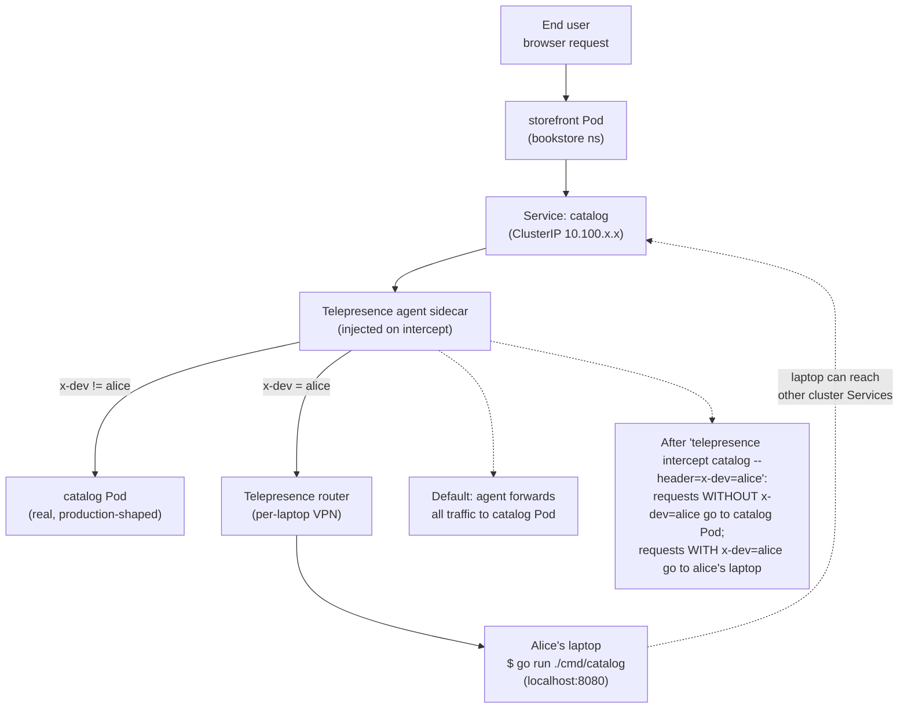

# 14.16 — Developer experience for Kubernetes teams

> **A platform whose inner loop is `git push` → wait 8 minutes for
> CI → image lands in ECR → Argo CD syncs → Pod restarts → check
> logs → debug → repeat is a platform with a developer-velocity
> tax that compounds every day.** Production-grade Kubernetes
> operations are not negotiable; production-grade *developer
> experience* against the same cluster is, and most teams settle
> for "good enough" until the cumulative friction makes feature
> work too slow. This chapter is the EKS-flavoured tour of the
> tools that close the inner loop without compromising the outer
> loop: **Telepresence** / **Mirrord** for traffic re-routing to a
> laptop, **Skaffold** / **Tilt** for file-watch-rebuild-deploy
> cycles, **Devcontainers** for "remote EKS but local IDE", and
> the **5-minute onboarding pattern** that ties them together with
> [Part 13 ch.11](../13-grand-capstone-bookstore-platform/11-backstage-developer-portal-idp.md)'s
> Backstage scaffolder.

**Estimated time:** ~30 min read · ~60 min hands-on
**Prerequisites:** [Part 13 ch.11](../13-grand-capstone-bookstore-platform/11-backstage-developer-portal-idp.md) — Backstage scaffolder that anchors the onboarding flow · [Part 12 ch.04](../11-advanced-production-patterns/10-platform-engineering.md) — DX principles you'll now operationalize on EKS · [Part 14 ch.10](./10-gitops-bootstrap-fresh-cluster.md) — outer-loop GitOps the inner-loop tools must respect

**You'll know after this:** • understand why a slow inner loop is a compounding developer-velocity tax · • deploy Telepresence / Mirrord to re-route service traffic to a laptop process · • configure Skaffold / Tilt for file-watch → rebuild → deploy cycles against EKS · • use Devcontainers for "remote EKS, local IDE" workflows · • design a 5-minute developer onboarding that ties Backstage + Telepresence + Skaffold together

<!-- tags: dx, platform-engineering, eks, ci-cd, cloud -->

## Why this exists

The bookstore-platform v2 at
[`../examples/bookstore-platform/`](../examples/bookstore-platform/)
runs nine services across three regions on a multi-tenant cluster
with Crossplane onboarding, Argo CD GitOps, image signing, mTLS,
observability, the works. From the **platform operator's** point of
view this is the realisation of every Part 00-13 lesson.

From the **developer's** point of view on day 1 it's a wall:

```text
"I want to change one line in catalog.go and see the change behind
storefront.bookstore.example.com."

1. Edit catalog.go.
2. docker build -t myorg/catalog:dev-abc123 .              (3 min)
3. docker push myorg/catalog:dev-abc123 to ECR             (1 min)
4. Update the Helm values to pin the new tag                (5 sec)
5. git commit && git push to the platform GitOps repo       (10 sec)
6. Wait for Argo CD to detect + sync                        (1 min)
7. Wait for the new Pod to come up + pass readiness         (1 min)
8. curl storefront, hit catalog, observe                    (5 sec)
9. Realise the bug is elsewhere; goto 1.

Total cycle: ~6 minutes per single-line change.
```

**This is the inner-loop tax**, and Kubernetes-at-scale platforms
that don't address it lose developer hours every day. The bookstore
v2 platform's outer loop (CI/CD + image signing + GitOps) is
non-negotiable for production — it's what makes the platform safe.
The inner loop (local-dev → see-change-in-cluster) is a separate
concern: the goal is to **collapse it to seconds without bypassing
the production safety mechanisms.**

The three pattern families that solve this:

1. **Traffic re-routing to a laptop process** — the developer's
   Go binary runs *on their laptop*, but appears to the rest of the
   cluster as if it's the catalog Pod. *Mirrord* and *Telepresence*
   are the canonical tools. The fastest possible iteration; no build
   cycle; the laptop process gets real cluster traffic + real
   cluster Service DNS + real cluster ConfigMap and Secret values.
2. **File-watch-rebuild-deploy** — a watcher on the source tree
   detects changes, rebuilds the image locally (using the local
   Docker daemon or a remote builder), redeploys to the cluster.
   *Skaffold* and *Tilt* are the canonical tools. Slower than
   traffic re-routing (image rebuild + Pod restart on every change)
   but works for any language and any runtime; the deployed state
   in cluster is what's tested.
3. **Devcontainers + remote cluster** — the developer's machine
   runs nothing cluster-related; the IDE (VS Code, JetBrains) opens
   a *dev container* running on a developer-shared EKS cluster (or
   a per-user Karpenter-scaled instance) with all tools pre-
   installed. The "laptop" is just a thin client; the actual code +
   build + run happens in-cluster. The Cloud Native Computing
   Foundation's *Devfile* spec + the *Dev Container* spec are the
   primitives.

[Part 13 ch.11](../13-grand-capstone-bookstore-platform/11-backstage-developer-portal-idp.md)
shipped Backstage as the IDP (Internal Developer Portal); the
scaffolder template creates a new service end-to-end. **This
chapter is what happens *after* a developer has a service** —
how do they iterate on it fast?

> **In production:** Inner-loop tooling is **opt-in per developer,
> per service**. There is no one-size-fits-all answer. A team
> running a frontend service is best served by Skaffold (rebuild +
> redeploy fits the JS workflow); a team debugging a payments
> service against real Stripe webhooks is best served by Telepresence
> (the laptop process gets the real webhook event). A new hire is
> best served by a Devcontainer (zero local tool installation). The
> platform's job is to **make all three available** and let teams
> choose.

## Mental model

**Three inner-loop strategies, three trade-off axes: fidelity
(does the dev environment behave like production?), iteration
speed (how long from save-file to observe-effect?), and isolation
(does my dev session affect other developers or the cluster's
real users?). No single tool is best on all three; the right
pattern depends on what you're debugging.**

The three strategies + trade-offs:

- **Strategy 1 — Traffic re-routing (Telepresence / Mirrord).**
  - **Fidelity:** HIGHEST. The laptop process runs in the cluster's
    network namespace (effectively), sees real Service DNS, gets
    real Pod-to-Pod traffic, can read real ConfigMaps + Secrets via
    the projected ServiceAccount token mount.
  - **Iteration:** FASTEST. No build; the laptop process is the
    Go binary that just compiled in 2 seconds.
  - **Isolation:** LOW. Re-routing real traffic to a laptop process
    affects every caller of the Service. Telepresence supports
    *intercepts* with header-based selectors (only requests with
    `x-dev: alice` go to alice's laptop), which restores isolation
    at the cost of test traffic with that header.

- **Strategy 2 — File-watch-rebuild-deploy (Skaffold / Tilt).**
  - **Fidelity:** HIGH. The deployed Pod is the actual container
    that runs in production; the local debug experience is the same
    as production runtime behavior.
  - **Iteration:** MEDIUM. Build time + image push + Pod restart
    + readiness probe = 30s-3min per cycle, depending on language
    + image-size + cluster topology. *Skaffold's sync mode* shaves
    the build step for interpreted languages (copies the file
    directly into the running container; no rebuild).
  - **Isolation:** HIGH. Each developer has their own namespace (or
    Skaffold profile) with their own version of the service running.

- **Strategy 3 — Devcontainers + remote cluster.**
  - **Fidelity:** HIGH. The dev environment runs in a Pod on the
    EKS cluster; the local IDE is just the editor.
  - **Iteration:** MEDIUM-FAST. Same as Skaffold (the dev container
    has Skaffold pre-installed), but with **zero local tool setup**.
  - **Isolation:** HIGH (per-developer namespace) + the laptop
    never installs cluster tools.

**Which strategy when:**

| Scenario | Best fit | Why |
|---|---|---|
| Debugging a service that talks to many other Services | Telepresence | High fidelity — laptop process sees real cross-service calls |
| Iterating on UI / frontend that needs cluster API responses | Skaffold (sync mode) | Fast inner-loop; UI iterates faster than backend |
| New hire onboarding on day 1 | Devcontainers | Zero local tool installation; same as the rest of the team in ~5 min |
| Debugging a webhook (Stripe, GitHub) that fires once per real event | Telepresence (intercept by header) | The real webhook fires; only the labeled request hits the laptop |
| Running integration tests against the cluster | Skaffold + `skaffold test` | Deploys real images; runs e2e tests; tears down |
| Pair-debugging with a teammate | Telepresence (selective intercept) | Both developers can intercept different request types simultaneously |

**The Telepresence intercept model.** Telepresence works in two
modes:

1. **`telepresence connect`** — sets up a VPN tunnel from the laptop
   into the cluster. The laptop can now resolve Service DNS,
   reach ClusterIPs, etc. Useful even without intercepting (just
   for "I want to curl `payments.bookstore` from my laptop").
2. **`telepresence intercept <SERVICE>`** — installs a traffic agent
   sidecar (a one-time, per-service install) that re-routes traffic
   destined for the Service to the laptop's process. **Global
   intercept** sends ALL traffic; **personal intercept** sends only
   requests matching a header selector (e.g., `x-telepresence-id:
   alice`).

The personal-intercept mode is the production-friendly default:
real users keep getting the real Pod; alice's curl with the
matching header hits her laptop.

**The Mirrord approach.** Mirrord's twist: it doesn't install a
sidecar; it injects an init container that re-routes the *target
Pod's* file descriptors and network sockets to a mirrord-agent
DaemonSet which proxies them back to the developer's laptop
process. The developer runs their Go binary locally as a normal
process; mirrord makes its syscalls land in the cluster.
Sub-options: *steal mode* (the laptop process gets all traffic;
the real Pod is bypassed) vs *mirror mode* (the laptop process
gets a copy of the traffic but doesn't reply; the real Pod still
serves users — useful for debugging without affecting prod).

**The Skaffold workflow.** A `skaffold.yaml` declares:

- **Build artifacts** — which Dockerfiles to build, which tag
  scheme to use (default: a content-hash tag for cache invalidation).
- **Deploy** — Helm chart path or Kustomize overlay, with values
  parameterised by the dev's namespace.
- **Sync** — for interpreted languages, file patterns that, when
  changed, are `kubectl cp`'d into the running container without a
  rebuild.

`skaffold dev` watches the source tree; on save, it rebuilds the
image (or syncs files), pushes to the registry (or uses
`buildOnCluster` to skip the registry round-trip), and triggers
a Pod restart. The dev's terminal shows aggregated logs from all
deployed Pods.

**The Tilt workflow.** Similar to Skaffold but configured with a
Starlark-based `Tiltfile`. Tilt has a richer UI (a browser-based
control panel for the running services) and more flexible
dependency-tracking (a resource's `live_update` can run shell
commands inside the running container without restart). For
single-developer iteration, Tilt and Skaffold are interchangeable
in practice; team preference determines the pick.

**The Devcontainer story.** A `.devcontainer/devcontainer.json` in
the service's repo declares the dev environment: base image, tools
to install, ports to forward, VS Code extensions to enable. When
the developer opens the repo in VS Code, the extension prompts to
"Reopen in Container" — VS Code spawns a container (locally or
remotely) and attaches the editor to it. For a Kubernetes platform
context, the dev container can be deployed *to the EKS cluster
itself* — a per-user Pod with `kubectl`, `helm`, `skaffold`,
`telepresence`, the service's source code mounted (via a sidecar
that watches a Git repo), and VS Code Remote attached. The
developer's laptop just has VS Code.

The trap to keep in view: **Telepresence/Mirrord with global
intercept and prod traffic is a foot-gun.** Connecting global
intercept against a Service in production sends real user
traffic to your laptop — the laptop misses requests during a
shutdown, slows them down, or returns errors if the laptop
process panics. The default policy: **never global-intercept
prod**. Personal intercept (with a header selector) is the only
prod-safe mode. Most platforms apply this at the cluster level
via a Telepresence policy CR that requires the personal-intercept
header for any service in the `prod-*` namespace.

## Diagrams

### Diagram A — Telepresence intercept flow (Mermaid)



### Diagram B — Inner-loop strategy trade-off matrix (ASCII)

```text
STRATEGY            FIDELITY    ITERATION TIME    ISOLATION   PROD-SAFE
                                (save -> effect)
─────────────────  ──────────  ────────────────  ──────────  ──────────────
Telepresence       HIGH        ~5 seconds         LOW         ONLY with
  global intercept                                            personal-intercept
                                                              header selector
─────────────────  ──────────  ────────────────  ──────────  ──────────────
Telepresence       HIGH        ~5 seconds         HIGH        YES (personal
  personal                                                    intercept by
  intercept                                                   header)
─────────────────  ──────────  ────────────────  ──────────  ──────────────
Mirrord steal      HIGH        ~5 seconds         LOW         NO
─────────────────  ──────────  ────────────────  ──────────  ──────────────
Mirrord mirror     MEDIUM      ~5 seconds         HIGH        YES (one-way
                   (no replies                                copy; real Pod
                    seen)                                     still serves)
─────────────────  ──────────  ────────────────  ──────────  ──────────────
Skaffold dev       HIGH        30s-2min           HIGH        YES (dev
                                                              namespace only)
─────────────────  ──────────  ────────────────  ──────────  ──────────────
Skaffold sync      HIGH        2-5 seconds        HIGH        YES (sync mode
  (interpreted                                                in dev ns)
   languages)
─────────────────  ──────────  ────────────────  ──────────  ──────────────
Tilt               HIGH        Same as Skaffold   HIGH        YES (dev ns)
─────────────────  ──────────  ────────────────  ──────────  ──────────────
Devcontainer +     HIGH        Same as Skaffold   HIGH        YES (dev ns)
  remote cluster   (deployed)                                 zero local setup
─────────────────  ──────────  ────────────────  ──────────  ──────────────

INNER-LOOP RECOMMENDATION BY PERSONA:

  Backend engineer debugging cross-service calls:    Telepresence personal-intercept
  Frontend engineer iterating on UI:                 Skaffold sync mode
  New hire on day 1:                                 Devcontainer
  Platform engineer debugging a controller:          Telepresence (it sees CRD events)
  Production incident response:                      kubectl exec (NO inner-loop tools)
```

## Hands-on with the Bookstore Platform

### 0. Prerequisites

- The bookstore-platform cluster running (via the Phase 14-R
  Terraform).
- `kubectl` configured with cluster access.
- A developer namespace (e.g., `bookstore-dev-alice`) created
  separately for inner-loop work. The simplest path:

  ```bash
  kubectl create namespace bookstore-dev-alice
  kubectl label ns bookstore-dev-alice \
    pod-security.kubernetes.io/enforce=restricted
  ```

- The bookstore payments-gateway service's source code locally:
  `examples/bookstore-platform/app/payments-gateway/` (Go).
  (For this hands-on we use the `payments-gateway` service since the
  bookstore-platform tree doesn't ship a separate `catalog` service yet —
  see Part 13 ch.01 for the v1↔v2 service map.)

The Phase 14-R Terraform doesn't install the inner-loop tools
(Telepresence, Skaffold, Tilt) cluster-wide because they're
**developer-side** installs (CLI tools + a one-time per-cluster
agent). This chapter walks the install in the hands-on.

### 1. Install the inner-loop tooling locally

```bash
# Skaffold (any language).
brew install skaffold
skaffold version
# expected: v2.x.x

# Telepresence (CLI + Helm-installed cluster-side daemon).
brew install telepresenceio/telepresence/telepresence-oss
telepresence version

# Tilt (alternative to Skaffold).
brew install tilt-dev/tap/tilt
tilt version
```

(Linux: equivalent install via the `curl`-installer scripts on each
tool's docs page.)

### 2. Strategy A — Telepresence (traffic re-routing)

#### 2.1 Connect to the cluster

```bash
telepresence helm install
# Installs the Traffic Manager Deployment to the ambassador namespace
# (one-time per cluster; idempotent on re-run).

telepresence connect
# Sets up the VPN tunnel from your laptop into the cluster.
# Your laptop now resolves bookstore.svc.cluster.local DNS;
# Service ClusterIPs are reachable.
```

Test:

```bash
curl http://payments-gateway.bookstore-dev-alice:8080/health
# Returns the response from the deployed payments-gateway Pod.
```

Note your laptop is now *inside* the cluster's network for DNS +
routing purposes.

#### 2.2 Deploy a baseline payments-gateway Pod to intercept

```bash
# Apply a vanilla deployment of the payments-gateway service for alice's namespace.
cat <<EOF | kubectl apply -f -
apiVersion: apps/v1
kind: Deployment
metadata:
  name: payments-gateway
  namespace: bookstore-dev-alice
spec:
  replicas: 1
  selector:
    matchLabels: { app: payments-gateway }
  template:
    metadata:
      labels: { app: payments-gateway }
    spec:
      containers:
        - name: payments-gateway
          image: <YOUR-ECR>/bookstore/payments-gateway:v1.0.0
          ports: [{ containerPort: 8080, name: http }]
          # Standard restricted-PSA security context (Part 05 ch.02).
          securityContext:
            allowPrivilegeEscalation: false
            readOnlyRootFilesystem: true
            runAsNonRoot: true
            runAsUser: 65534
            capabilities: { drop: [ALL] }
            seccompProfile: { type: RuntimeDefault }
---
apiVersion: v1
kind: Service
metadata:
  name: payments-gateway
  namespace: bookstore-dev-alice
spec:
  selector: { app: payments-gateway }
  ports: [{ port: 8080, targetPort: http }]
EOF

kubectl -n bookstore-dev-alice wait pod -l app=payments-gateway --for=condition=Ready --timeout=120s
```

#### 2.3 Intercept the payments-gateway Service to alice's laptop

```bash
telepresence intercept payments-gateway \
  --namespace=bookstore-dev-alice \
  --port=8080:8080 \
  --http-header=x-dev=alice
```

Expected:

```text
Using Deployment payments-gateway
   Intercept name    : payments-gateway-bookstore-dev-alice
   State             : ACTIVE
   Workload kind     : Deployment
   Destination       : 127.0.0.1:8080
   Service Port      : 8080
   Intercepting      : HTTP requests that match:
       - http header: 'x-dev=alice'
```

#### 2.4 Run the payments-gateway binary locally

```bash
cd examples/bookstore-platform/app/payments-gateway
go run ./cmd/payments-gateway
# The Go binary listens on localhost:8080.
```

#### 2.5 Verify the intercept

```bash
# Request WITHOUT the header — hits the deployed Pod:
curl http://payments-gateway.bookstore-dev-alice:8080/health
# Response from the deployed Pod (production-shape).

# Request WITH the header — hits alice's laptop:
curl -H 'x-dev: alice' http://payments-gateway.bookstore-dev-alice:8080/health
# Response from the laptop's Go binary; alice sees the request in her terminal.
```

Now edit `cmd/payments-gateway/main.go`, rerun `go run`, request with the
header — the new behavior is immediately visible. Iteration is
~5 seconds (compile + restart).

#### 2.6 Leave the intercept

```bash
telepresence leave payments-gateway-bookstore-dev-alice
telepresence quit
```

The payments-gateway Pod resumes serving all traffic; alice's laptop is no
longer in the loop.

### 3. Strategy B — Skaffold (file-watch-rebuild-deploy)

#### 3.1 Author a skaffold.yaml

In `app/payments-gateway/`, save as `skaffold.yaml`:

```yaml
apiVersion: skaffold/v4beta11
kind: Config
metadata:
  name: payments-gateway
build:
  artifacts:
    - image: <YOUR-ECR>/bookstore/payments-gateway
      docker:
        dockerfile: Dockerfile
deploy:
  helm:
    releases:
      - name: payments-gateway
        chartPath: ../../helm/payments-gateway
        namespace: bookstore-dev-alice
        valuesFiles: [values-dev.yaml]
        setValues:
          image.repository: <YOUR-ECR>/bookstore/payments-gateway
profiles:
  - name: sync
    build:
      artifacts:
        - image: <YOUR-ECR>/bookstore/payments-gateway
          sync:
            manual:
              - src: 'cmd/**/*.go'
                dest: /app/cmd
              - src: 'internal/**/*.go'
                dest: /app/internal
```

#### 3.2 Run the dev loop

```bash
skaffold dev --profile=sync
```

Skaffold:

1. Builds `bookstore/payments-gateway:<HASH>`.
2. Pushes to ECR (or uses `--build-on-cluster` for in-cluster build).
3. Applies the Helm chart to `bookstore-dev-alice`.
4. Streams logs from the new Pod.
5. Watches `cmd/**/*.go` + `internal/**/*.go`.

On every save, the new file is `kubectl cp`'d into the running
container (sync mode). For changes that need a real rebuild (Dockerfile
edits, `go.mod` changes), Skaffold falls back to full build + push +
restart automatically.

The terminal shows logs from the deployed Pod; the iteration cycle
is 2-5 seconds for synced files, 30-90 seconds for a real rebuild.

#### 3.3 Tear down

`Ctrl-C` on the `skaffold dev` terminal: Skaffold cleans up the
deployed resources automatically (deletes the Helm release).

### 4. Strategy C — Tilt (alternative file-watch-rebuild-deploy)

Save as `app/payments-gateway/Tiltfile`:

```python
# Tiltfile — the payments-gateway service inner-loop.
allow_k8s_contexts(['arn:aws:eks:<REGION>:<ACCOUNT-ID>:cluster/bookstore-eks'])
load('ext://restart_process', 'docker_build_with_restart')

docker_build_with_restart(
  '<YOUR-ECR>/bookstore/payments-gateway',
  '.',
  entrypoint=['./payments-gateway'],
  dockerfile='Dockerfile',
  live_update=[
    sync('./cmd', '/app/cmd'),
    sync('./internal', '/app/internal'),
    run('go build -o /app/payments-gateway ./cmd/payments-gateway', trigger=['./cmd', './internal']),
  ],
)

k8s_yaml(helm('../../helm/payments-gateway', namespace='bookstore-dev-alice'))
k8s_resource('payments-gateway', port_forwards='8080:8080')
```

Run:

```bash
tilt up
```

Tilt opens a browser at <http://localhost:10350> showing the build +
deploy + log streams for every configured resource. The `live_update`
sync + rebuild pattern is faster than full image push when you
control the Dockerfile.

Stop:

```bash
tilt down
```

### 5. Strategy D — Devcontainer + remote EKS

#### 5.1 Author the devcontainer.json

In the bookstore-platform repo root, save as `.devcontainer/devcontainer.json`:

```json
{
  "name": "Bookstore Platform Dev",
  "image": "mcr.microsoft.com/devcontainers/go:1-1.23-bookworm",
  "features": {
    "ghcr.io/devcontainers/features/kubectl-helm-minikube:1": {
      "version": "latest",
      "helm": "latest",
      "minikube": "none"
    },
    "ghcr.io/devcontainers/features/aws-cli:1": {},
    "ghcr.io/devcontainers/features/docker-in-docker:2": {}
  },
  "postCreateCommand": "curl -sSL https://github.com/GoogleContainerTools/skaffold/releases/latest/download/skaffold-linux-amd64 -o /usr/local/bin/skaffold && chmod +x /usr/local/bin/skaffold && curl -sSL https://app.getambassador.io/download/tel2oss/releases/download/v2.20.0/telepresence-linux-amd64 -o /usr/local/bin/telepresence && chmod +x /usr/local/bin/telepresence",
  "mounts": [
    "source=${localEnv:HOME}/.aws,target=/home/vscode/.aws,type=bind"
  ],
  "customizations": {
    "vscode": {
      "extensions": [
        "golang.go",
        "ms-kubernetes-tools.vscode-kubernetes-tools",
        "redhat.vscode-yaml"
      ]
    }
  }
}
```

#### 5.2 Open in dev container

In VS Code: `Cmd-Shift-P` → **"Reopen in Container"**. VS Code
builds the image (first time only), starts the container, mounts
the workspace, and attaches the editor. The dev container has:

- Go 1.23.
- `kubectl` + `helm` + `skaffold` + `telepresence` pre-installed.
- `aws-cli` (the host's `~/.aws` is bind-mounted; AWS credentials
  work).
- VS Code extensions (Go, Kubernetes, YAML).

The developer's laptop has **only VS Code installed**. Every other
tool runs inside the container. The container can be local
(VS Code's local dev-container feature) or remote (VS Code Remote
SSH attached to a Pod in EKS).

For the EKS-remote pattern, the dev container is itself a
StatefulSet in `bookstore-dev-alice` (one StatefulSet per developer
keyed by a label). VS Code Remote SSH attaches; the developer's
machine never installs cluster tools.

#### 5.3 The team-shared pattern

A scaffolder template (Backstage, ch.13.11) creates:

- The developer namespace (`bookstore-dev-<USERNAME>`).
- A dev-container Pod (or StatefulSet) running in that namespace.
- A `kubeconfig` configured for the developer's IAM identity.
- A `.devcontainer/devcontainer.json` in the service repo
  pre-configured to attach to the cluster-side container.

Day 1 onboarding: open Backstage → click "Onboard new engineer"
form → submit → 5 minutes later → open the service repo in VS Code
→ "Reopen in Container" → editor attached → `skaffold dev` works
against the developer's namespace. Zero local tool installation;
the engineer was reading docs for the time it took the platform
to provision their environment.

### 6. The 5-minute onboarding pattern (end-to-end)

The composition of Phase 13/14 patterns that hits the 5-minute mark:

```text
0. Engineer's laptop arrives with: macOS / Linux + a browser + VS Code.

1. Engineer opens Backstage (ch.13.11).
   - Clicks the "Onboard new engineer" scaffolder template.
   - Form: name, team, GitHub username, email.

2. Backstage scaffolder runs (~2 minutes):
   - Creates an AWS IAM identity (federated via Keycloak/SSO).
   - Creates a Kubernetes namespace bookstore-dev-<USERNAME>.
   - Applies a NetworkPolicy isolating that namespace.
   - Creates an OPA/Kyverno exception (developer namespaces get
     baseline PSA, not restricted, because dev iteration uses
     unsigned images).
   - Creates a dev-container StatefulSet running in the namespace.
   - Pushes a per-user kubeconfig to a Secrets Manager entry.
   - Commits a `catalog-info.yaml` for the new developer to
     Backstage's catalog repo (so they show up in the org chart).

3. Engineer receives an email with:
   - The link to the per-user kubeconfig (auto-downloaded via SSO).
   - The link to clone the platform repo.
   - A pointer to the "First Day" tech doc.

4. Engineer:
   - clones the repo (30 seconds);
   - opens VS Code, runs "Reopen in Container" (60 seconds — first
     time uses cached image);
   - runs skaffold dev catalog (30 seconds — image already cached).

5. Engineer sees logs from their own catalog Pod streaming in the
   terminal. Total wall-clock from "laptop arrived" to "running
   production code locally": ~5 minutes.
```

This is what the bookstore-platform aspires to; ch.14.17's capstone
runbook closes the loop by adding the **first-90-days production
onboarding** for an SRE-side engineer.

### 7. Clean up

```bash
# If you intercepted with Telepresence:
telepresence leave payments-gateway-bookstore-dev-alice
telepresence quit
telepresence helm uninstall   # one-time per cluster; only if no other devs are using it

# If you used Skaffold:
# Ctrl-C on the dev loop terminal — Skaffold cleans up the Helm release.

# Tear down the developer namespace:
kubectl delete namespace bookstore-dev-alice
```

## How it works under the hood

**The Telepresence traffic agent.** When `telepresence intercept
<SERVICE>` runs, the cluster-side Traffic Manager (a Deployment in
the `ambassador` namespace) injects a **traffic agent sidecar** into
the target workload's Pods. The agent is a Go binary that listens on
the same port as the original container. Service routing through
kube-proxy / Cilium directs traffic to the Pod IP + port; the agent
catches it. For each incoming request, the agent checks the
intercept rules:

- **No matching intercept** → forward to the original container
  (localhost:<TARGET_PORT> via Pod-local network).
- **Matching intercept** (header match for personal intercept, all
  traffic for global) → forward to the Telepresence daemon, which
  has a persistent connection to the developer's laptop. The
  request is tunneled to the laptop's process, response tunneled
  back.

The agent is stateless from the cluster's point of view; an upgrade
is a re-injection (the Traffic Manager handles this). The
laptop-side daemon (`telepresence`) maintains the gRPC tunnel + the
local-DNS overlay (so `catalog.bookstore` on the laptop resolves to
the cluster's ClusterIP via the tunnel).

**The Mirrord agent path.** Mirrord doesn't inject a sidecar.
Instead, when the developer runs `mirrord exec -- ./my-binary`, the
laptop's mirrord CLI:

1. Reads the target Pod's spec (via the K8s API).
2. Launches a small DaemonSet of `mirrord-agent` Pods (one per node)
   in the cluster (or reuses existing ones).
3. The mirrord-agent Pods run in the same node's network +
   PID namespace as the target Pod (privileged-ish, like Falco).
4. The local binary runs with a mirrord library injected via
   `LD_PRELOAD` (Linux) — every syscall the binary makes (`socket`,
   `connect`, `accept`, `open`, etc.) is intercepted by the library
   and sent to the mirrord-agent in the cluster. The agent makes
   the syscall **in the cluster** and returns the result.

The local binary is **functionally executing in the cluster**: it
sees cluster DNS, can read cluster filesystem (the target Pod's
volume mounts), accepts cluster connections. The local CPU runs the
business logic; the cluster runs the I/O. Sub-options:

- **Steal mode** — the local binary handles all incoming traffic to
  the target Pod; the real Pod still runs but doesn't get the
  traffic. **Not prod-safe** without the same caveats as Telepresence
  global intercept.
- **Mirror mode** — the local binary receives a *copy* of incoming
  traffic; the real Pod still serves users. The local binary can
  observe but can't reply. **Useful for debugging without affecting
  prod**.

**The Skaffold pipeline.** `skaffold dev` is a controller-pattern
process:

1. **Build phase** — for each artifact, run the configured builder
   (Docker, Kaniko, Buildpacks, custom shell command). Resulting
   image tagged with a content hash.
2. **Push phase** — push to the configured registry (or use local
   daemon for kind / minikube).
3. **Deploy phase** — run the configured deployer (Helm, Kustomize,
   raw `kubectl apply`). Substitute the image references in the
   manifests with the just-built tags.
4. **Tail phase** — stream logs from the deployed Pods using
   `kubectl logs -f`, with prefixing by Pod name.
5. **Watch phase** — fsnotify on the source tree. On change, recompute
   the dependency graph (which artifacts need rebuild for which
   files); rebuild + redeploy only those.
6. **Sync mode** — for artifacts with `sync.manual` / `sync.auto` rules,
   skip the rebuild and `kubectl cp` the changed file into the
   running container. Faster for interpreted-language workflows
   (Python, Node.js); requires the language runtime to pick up the
   new file without process restart (or the chart to be configured
   for hot-reload).

**The Devcontainer spec.** The `.devcontainer/devcontainer.json`
file is a CNCF-blessed JSON schema for declaring a development
container. The schema defines: base image, features (composable
add-ons like `kubectl`, `helm`, language runtimes), mounts (bind-
mount the workspace + host directories like `~/.aws`),
postCreateCommand (one-time setup), and editor customizations.
VS Code's Dev Containers extension reads it; JetBrains has its
own Dev Containers integration; the OpenVSCode-Server (a remote-
hostable VS Code) reads it identically. The dev-container spec is
**editor-portable** — the same JSON works across editors.

**The cluster-hosted dev container pattern.** A dev container can
run anywhere: laptop, a remote EC2, a Pod in the cluster. The
cluster-hosted pattern uses a StatefulSet per developer with:

- A PVC for the workspace (so unsaved work survives Pod restart).
- A PVC for the build cache (Go module cache, Docker layer cache).
- A `kubectl` RBAC binding for the developer's namespace + a
  read-only binding for the platform's shared namespaces.
- VS Code Remote-SSH or OpenVSCode-Server exposes the Pod over
  the network (through a per-user Ingress with OIDC auth).

The platform-team operates the dev-container StatefulSet template;
the per-user instance is provisioned by the Backstage scaffolder.
This is the **5-minute onboarding** pattern in practice — the
Backstage form is the only thing the engineer interacts with.

## Production notes

> **In production:** **Inner-loop tools live in dev environments,
> not prod.** Telepresence intercepts against prod namespaces are
> the classic foot-gun: a developer's intercept routes real
> customer traffic to their laptop; the laptop crashes; customers
> see 5xx. The platform's defence: a Telepresence policy that
> requires `--http-header` (personal intercept) for any service in
> a `prod-*` namespace, OR (better) installs Traffic Manager only
> in dev clusters and forbids it in prod. Make the policy
> enforceable via OPA/Kyverno admission.

> **In production:** **Per-developer namespaces are the right
> isolation primitive.** A shared `dev` namespace where every
> engineer's intercept races against every other engineer's is
> chaos. The pattern: namespace-per-engineer (e.g., `bookstore-dev-alice`),
> with a quota (limit CPU/memory) and a network-policy boundary
> (developers can reach platform Services + each other's namespaces
> for cross-team debugging, but cannot reach prod namespaces).
> Crossplane (Part 13 ch.02) is the right tool for provisioning
> developer-namespace resources at scale.

> **In production:** **The 5-minute onboarding is a marketing-grade
> SLA, not a feel-good number.** When a team hits it, retention
> goes up; when a team misses it, day-1 frustration is the
> compounding cost. Bookstore-platform-v2's scaffolder template
> targets 5 minutes (in measured runs); production forks add
> telemetry (the scaffolder records its execution time per step;
> the team reviews "slow steps" monthly).

> **In production:** **The dev-container image is a platform
> artifact.** A dev-container image with the wrong Go version, an
> outdated kubectl, or a missing tool causes every onboarded
> engineer to debug for 30 minutes. The platform team builds the
> dev-container image in CI (the same supply-chain rigor as prod
> images: scan, sign, retag), and the `.devcontainer/devcontainer.json`
> pins a specific image digest. Updates flow through PR review;
> regressions are caught before they hit any developer.

> **In production:** **Skaffold's `--build-on-cluster` flag** uses
> the cluster's worker nodes for image builds (Kaniko in-pod).
> Faster than the round-trip to ECR for big images + slow uplinks,
> and the build environment matches production. The trade-off: the
> cluster pays the CPU cost; configure Karpenter to scale a `dev-
> build` NodePool for these workloads + scale it back to zero when
> idle. For organizations with a remote workforce, the in-cluster
> build path is often faster than push-to-ECR.

> **In production:** **The DX feedback loop matters.** Every quarter,
> survey engineers: "How long is your inner loop?" "Which tool do
> you use?" "What's the biggest friction?" The answers drive the
> platform's investment. A team where 80% use Skaffold-sync is
> different from one where 80% use Telepresence; both are valid
> end-states but the platform's support burden differs. Make the
> survey results public (in Backstage's tech docs); track trends
> over time.

> **In production:** **The "5-minute onboarding" pattern includes
> the platform team's own engineers**. A new platform engineer
> joining the team should be able to clone the platform repo,
> open in dev container, run the local-cluster smoke test, and
> have a working environment in 5 minutes. If they can't, the
> platform's docs / dev-container / scaffolder are broken; fix
> them before the next hire shows up.

## Quick Reference

```bash
# Telepresence — connect, intercept, leave.
telepresence helm install                # one-time per cluster
telepresence connect                     # per-laptop session
telepresence intercept <SERVICE> \
  --namespace=<DEV-NS> \
  --port=8080:8080 \
  --http-header=x-dev=<USERNAME>         # personal intercept (prod-safe)
go run ./cmd/<SERVICE>                   # laptop process now in the loop
telepresence leave <INTERCEPT-NAME>
telepresence quit

# Mirrord — exec a binary with cluster I/O.
mirrord exec --target pod/<TARGET-POD> -n <DEV-NS> -- ./my-binary
# Or with steal mode (NOT prod-safe):
mirrord exec --target pod/<TARGET-POD> -n <DEV-NS> --steal -- ./my-binary

# Skaffold — file-watch-rebuild-deploy.
skaffold dev                              # default: rebuild per change
skaffold dev --profile=sync               # sync mode (no rebuild for synced files)
skaffold dev --build-on-cluster           # in-cluster builds via Kaniko
skaffold test                             # run e2e tests against deployed pods

# Tilt — alternative inner-loop tool.
tilt up                                   # launch the dev loop + browser UI
tilt down                                 # tear down

# Devcontainer — reopen in container (VS Code).
# Cmd-Shift-P -> Dev Containers: Reopen in Container

# Test the personal-intercept setup (curl with the header).
curl -H 'x-dev: <USERNAME>' \
  http://<SERVICE>.<DEV-NS>:<PORT>/<PATH>
# Hits the developer's laptop; without the header, hits the deployed Pod.
```

Developer-experience checklist (the platform is delivering DX when all six are yes):

- [ ] Every engineer has a per-user namespace + RBAC + quota,
      provisioned by the Backstage scaffolder.
- [ ] The dev-container image is built in CI, scanned, signed, and
      pinned by digest in `.devcontainer/devcontainer.json`.
- [ ] Telepresence Traffic Manager installed in dev cluster(s) only;
      personal-intercept enforced via policy for any near-prod
      service.
- [ ] At least one of Skaffold / Tilt has a working `skaffold dev`
      / `tilt up` recipe per service (in the service's repo).
- [ ] The "new engineer onboarding" Backstage template provisions a
      developer namespace + dev-container in under 5 minutes
      (measured + tracked).
- [ ] Quarterly DX survey: engineers report < 30-second
      iteration cycles for their typical workflow; bottlenecks
      drive the platform's next quarter investments.

## Test your understanding

> Try each before opening the answer drawer. The act of trying is the exercise; the answer is the check.

1. **The chapter calls the GitOps-cycle inner loop a "compounding developer-velocity tax." Why is the 6-minute number worse than it sounds?**
   <details><summary>Show answer</summary>

   A 6-minute round trip per save-and-test cycle means a developer doing 30-50 iterations a day (a normal debug session for a real bug) spends 3-5 hours just *waiting*. Multiply by 10 engineers and the team loses 30-50 person-hours per day to inner-loop friction. That's worse than it sounds because it also shapes *what the engineers attempt* — they avoid riskier experiments (refactors, exploratory rewrites) because the cycle time makes failure expensive. The compounding effect is the team architecting around the friction instead of doing the right thing.

   </details>

2. **A developer needs to debug an interaction between the payments service and a real Stripe webhook. Skaffold or Telepresence with intercept — which fits better, and why?**
   <details><summary>Show answer</summary>

   Telepresence with header-based intercept. Stripe webhooks fire once per real event — re-creating that side effect repeatedly to test Skaffold's redeploy is impractical. With Telepresence, the developer registers an intercept selecting requests with a specific header (`x-dev: alice`), runs the laptop process as a "personal intercept," and triggers a real Stripe test event tagged with that header; the real webhook lands at the laptop. Other developers can hit the same service without their traffic being intercepted. Skaffold's rebuild-redeploy is the wrong shape because each iteration would require re-firing the webhook, and the dev cluster has only one canonical webhook endpoint.

   </details>

3. **A team turns on Telepresence on the **production** cluster's Traffic Manager so on-call engineers can "debug live issues." What's the chapter's warning?**
   <details><summary>Show answer</summary>

   Telepresence on production is the canonical "data exfiltration vector" — anyone with cluster access who can install an intercept can re-route real production traffic, including real customer requests and the credentials/PII they carry, to a developer laptop. The chapter restricts Traffic Manager installation to dev cluster(s) only; production debugging is done via observability (traces, logs, metrics) and ephemeral debug Pods, not by re-routing live traffic. If on-call needs to repro a bug, they reproduce it in dev with the user's request shape — not by snooping prod.

   </details>

4. **Hands-on extension — run `skaffold dev` on the catalog service against a dev namespace. Edit `catalog.go`, save, and measure the rebuild-to-redeploy cycle.**
   <details><summary>What you should see</summary>

   With Skaffold's sync mode for Go: file save → local Go build (~2s for incremental) → image rebuild (~30s if not cached, ~5s if Docker layers cached) → image push (~5s on local registry, slower for ECR) → Skaffold patches the Deployment with the new tag → Pod restart (~5-10s readiness) → visible in cluster. Total ~15-30s for a cached path; without caching, the first cycle is 60-90s. Compare to the 6-minute GitOps cycle the chapter opens with — the inner-loop tooling collapses iteration to roughly an order of magnitude faster without bypassing the production safety mechanisms.

   </details>

## Further reading

- **Telepresence documentation**
  <https://www.telepresence.io/docs/>; the canonical Telepresence
  reference, including the Traffic Manager architecture, the
  intercept modes (global vs personal), and the policy + RBAC
  this chapter's production notes cite.
- **Mirrord documentation**
  <https://mirrord.dev/docs/>; the canonical Mirrord reference,
  including the LD_PRELOAD-based syscall interception this chapter
  walks under-the-hood.
- **Skaffold documentation**
  <https://skaffold.dev/docs/>; the canonical Skaffold reference,
  including the schema reference for `skaffold.yaml`, the sync
  modes, and the `--build-on-cluster` flag this chapter cites.
- **Tilt documentation**
  <https://docs.tilt.dev/>; the canonical Tilt reference, including
  the Tiltfile DSL + the `live_update` pattern.
- **Dev Container specification**
  <https://containers.dev/>; the CNCF-blessed schema for
  `.devcontainer/devcontainer.json` that this chapter's
  Devcontainer setup conforms to.
- **VS Code Dev Containers extension**
  <https://code.visualstudio.com/docs/devcontainers/containers>;
  the editor-side integration for the Dev Container spec; the most
  common entry point for the Devcontainer pattern.
- **Cross-ref: Backstage scaffolder (Part 13 ch.11)**
  [`../13-grand-capstone-bookstore-platform/11-backstage-developer-portal-idp.md`](../13-grand-capstone-bookstore-platform/11-backstage-developer-portal-idp.md)
  — the "5-minute onboarding" pattern is built on the scaffolder
  template introduced there.
