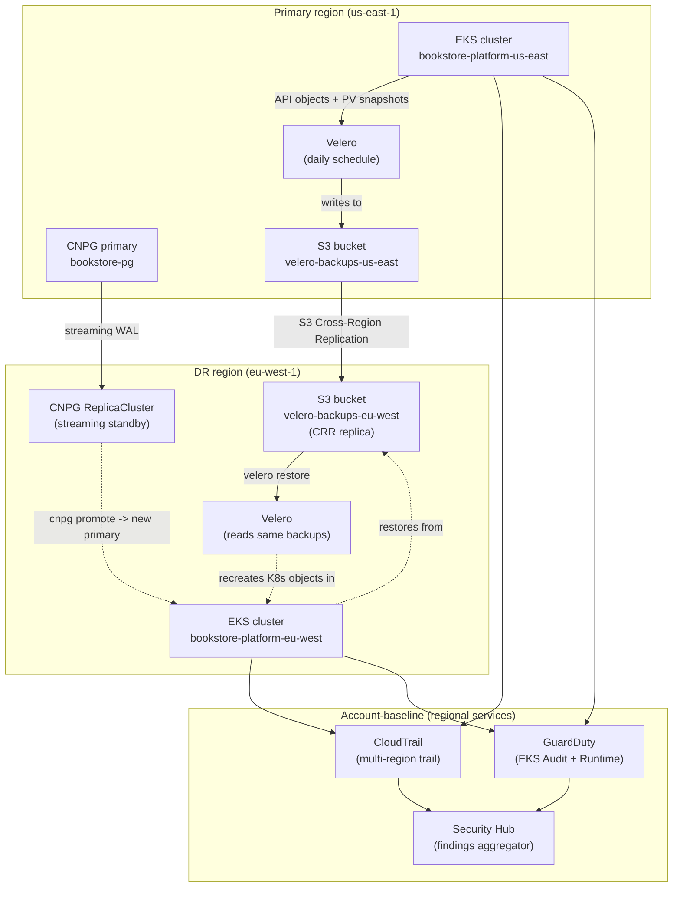

# 14.17 — Cross-region DR + AWS account baseline + 90-day production-readiness runbook

> **the capstone — synthesizing chapters 14.01–14.16 into a structured
> 90-day onboarding for a team taking over an EKS production
> platform.** Sixteen prior chapters each shipped one capability:
> Terraform state, cluster lifecycle, add-on discipline, storage,
> logging cost, cost guardrails, infra CI/CD, VPC endpoints, Graviton,
> GitOps bootstrap, multi-region active-active, supply-chain security,
> runtime defense, Velero, Cilium/eBPF, developer experience. None of
> them is the **operational story**. This chapter is that story: the
> cross-region DR runbook that ties Velero + CNPG + S3 CRR + DNS
> failover into one rehearsable procedure; the AWS account-level
> security baseline ([`../examples/bookstore-platform/terraform-account-baseline/`](../examples/bookstore-platform/terraform-account-baseline/))
> that wraps every cluster you ever run in that account; and the
> 90-day production-readiness runbook a new team can clone into their
> wiki on Day 1 and execute against the bookstore-platform stack.

**Estimated time:** ~60 min read · ~half-day hands-on
**Prerequisites:** [Part 14 ch.01-16](./01-terraform-state-in-production.md) — the sixteen capabilities this chapter synthesizes · [Part 14 ch.11](./11-multi-region-active-active-cloud.md) — multi-region foundation for cross-region DR · [Part 14 ch.14](./14-backup-and-restore-velero.md) — Velero that anchors the restore drill · [Part 13 ch.12](../13-grand-capstone-bookstore-platform/12-day-2-runbook-on-call-dr-chaos.md) — the platform whose operability you now own

**You'll know after this:** • synthesize Parts 14.01-14.16 into one structured 90-day operational story instead of sixteen isolated capabilities · • execute the cross-region DR runbook (Velero + CNPG + S3 CRR + DNS failover) as one rehearsable procedure · • apply the AWS account-level security baseline (`terraform-account-baseline/`) so every cluster you ever run inherits it · • drive a new team through the 90-day production-readiness runbook against the bookstore-platform stack · • measure team operability via RTO/RPO drills, postmortem cadence, on-call quality, and cost-review discipline — not just "code merged"

<!-- tags: dr, multi-region, day-2, platform-engineering, finops -->

## Why this exists

Sixteen chapters got the reader to "EKS production platform exists,
costed, secured, observed." Zero of those chapters got the reader to
**"the team owning this knows what they're doing."** Those are two
very different artifacts. The first is **code**; the second is
**operability**. This chapter ships the operability.

Three things compose operability and each is fragile in a specific
way:

1. **Cross-region DR for stateful workloads.** [Chapter 14.11](./11-multi-region-active-active-cloud.md)
   built the active-active substrate (Route 53 latency routing + CNPG
   `ReplicaCluster` + per-region Argo CD). [Chapter 14.14](./14-backup-and-restore-velero.md)
   built Velero for cluster state. **Neither chapter shipped the full
   "we lost the primary region" runbook.** The DR procedure cuts
   across both: Velero metadata is in S3 in the failed region; the
   CNPG primary just disappeared; the ALB DNS still points at the
   dead ALB; the Argo CD that was reconciling the cluster has no
   cluster to reconcile. The runbook walks all of that as one
   sequence, with RPO/RTO math at every step.

2. **AWS account-level security baseline.** [Chapter 14.13](./13-runtime-defense-and-container-security.md)
   wired Falco in-cluster. [Chapter 14.12](./12-supply-chain-security.md)
   wired Kyverno admission. **Both are per-cluster.** The account-
   level controls — GuardDuty, Security Hub, Config, CloudTrail, IAM
   Access Analyzer — live one layer below; they wrap every cluster
   in the account. Phase 14-R ships them as a separate Terraform tree
   at [`../examples/bookstore-platform/terraform-account-baseline/`](../examples/bookstore-platform/terraform-account-baseline/),
   var-gated default-off. This chapter is the *user manual* for
   that tree: what each variable buys you, what each costs, and
   the order to turn them on.

3. **A 90-day onboarding runbook for the team taking over.** Most
   teams inherit a Kubernetes platform; very few build one from
   scratch. The 90-day runbook is the structure for that handoff:
   30 days to **stabilize** (verify what exists, page nobody, learn
   the cluster), 30 days to **operate** (run the first DR drill,
   review the first month of cost data, rotate one secret), 30 days
   to **mature** (right-size, harden, document tribal knowledge,
   run the first chaos game-day).

[Part 13 ch.12](../13-grand-capstone-bookstore-platform/12-day-2-runbook-on-call-dr-chaos.md)
closed Part 13 with the runbook/on-call/DR/chaos discipline applied
to the kind-simulated bookstore-platform. That chapter is the
**structural model** for this one; everything Part 13 ch.12 said
about runbooks + chaos game-days + blameless postmortems still
applies. The delta in this chapter: **cloud-shaped DR (Route 53 +
CNPG cross-region + Velero S3 CRR + account-baseline forensics) and
the 90-day handoff structure** Part 13 didn't need (Part 13 closed
the platform; Part 14 hands it to someone else).

> **In production:** Without this chapter, the Part 14 platform is
> **infrastructure**, not **a thing a team can run**. The capabilities
> exist; the procedures for using them under stress do not. Every
> EKS platform handoff that fails fails the same way: the receiving
> team finds out about backup gaps the night the restore fails,
> finds out about account-baseline gaps the morning the auditor
> arrives, and finds out about runbook gaps at 3am when the alert
> fires and the page says "consult docs" and the docs are a
> half-finished wiki. The remedy is the three artifacts in this
> chapter, rehearsed before they are needed.

## Mental model

**Operability = (the DR runbook the team REHEARSES monthly) + (the
account-baseline controls that buy forensic + compliance posture) +
(the 90-day onboarding structure that builds team competence). The
DR runbook is cross-layer (cluster + database + DNS + IAM); the
account baseline is per-account, not per-cluster; the 90-day runbook
is opinionated and adapts to team stage.**

- **DR layers — what each backs up, what each restores.** The
  cross-region DR story is **five backup tools cooperating**, not
  one. Each catches a different layer; the union is what gets you
  sleeping through the night.

  | Tool | Backs up | RPO target | Restore mechanism |
  |---|---|---|---|
  | Velero | K8s API objects + EBS PVs | 24h (daily schedule) | `velero restore create` against fresh cluster |
  | CNPG `ReplicaCluster` | Postgres WAL + base backups | < 5s (streaming) | `kubectl cnpg promote` on the standby |
  | S3 Cross-Region Replication (CRR) | S3 bucket contents (object store, Velero backup metadata, CloudTrail logs) | < 15 min (replication lag) | Re-point applications at the DR-region bucket |
  | RDS Automated Backups (if used) | RDS data + PITR | 5-min PITR window | Restore-to-point-in-time in the DR region |
  | Terraform state (the S3 backend from [ch.14.01](./01-terraform-state-in-production.md)) | IAM roles, cluster config, every variable | Per commit | `terraform apply` against the DR region |

  The runbook in this chapter walks all five in sequence; missing
  any one leaves a recovery gap (Velero alone restores YAML; CNPG
  alone restores Postgres data; together they restore an application;
  with CRR they restore in a different region; with Terraform they
  rebuild the cluster that hosts them).

- **The "we lost the primary region" runbook — the four phases.**
  - **Phase 1: Confirm the region is actually lost.** AWS's
    [post-event summaries](https://aws.amazon.com/premiumsupport/technology/pes/)
    + Route 53 health checks + your own synthetic monitoring. A 5-
    minute outage is not a regional failure; a 30-minute outage with
    no AWS ETA might be. The runbook has explicit "do not failover
    if X is true" guards because failing over and failing back is
    20× the disruption of riding out the outage.
  - **Phase 2: DNS failover.** Route 53 failover routing policy
    (or update the latency-routing weight to zero in the primary
    region). Per [ch.14.11](./11-multi-region-active-active-cloud.md),
    health checks take ~90s to fire; resolver TTL caches add up to
    15 minutes long-tail. So DNS-only failover is a 5-15 minute
    window before most traffic reaches the DR region.
  - **Phase 3: Postgres promote.** `kubectl cnpg promote` on the
    standby in the DR region. ~30s wall-clock per ch.14.11. **RPO
    is whatever streaming lag existed at failure** — typically
    < 5s with sync replication, can spike to minutes during WAN
    incidents. The runbook records the actual RPO from
    `pg_stat_replication`'s last `replay_lsn` before promote.
  - **Phase 4: Argo CD reconciles into the DR cluster.** Per
    [ch.14.10](./10-gitops-bootstrap-fresh-cluster.md), Argo CD
    self-heals; the DR cluster already has Argo CD; the
    `ApplicationSet` already enumerates both regions. The
    application Pods come back without human intervention; the
    human's job ended at "promote the database."

- **Account-baseline layering — turn on in order, not all at once.**
  The five controls in [`../examples/bookstore-platform/terraform-account-baseline/`](../examples/bookstore-platform/terraform-account-baseline/)
  are **independent gates**; you can ship them one quarter at a
  time. The recommended order:

  1. **`enable_iam_access_analyzer = true`** (free, do it Day 1).
     Finds resources granting external access. Zero monthly cost.
  2. **`enable_cloudtrail = true`** (~free for management events;
     data events extra). The forensic API log; required by every
     compliance framework. Do it Day 1-30.
  3. **`enable_guardduty = true`** ($1-3/month small account; can
     reach $20-50/month at scale with all features). EKS Audit Log
     Monitoring + EKS Runtime Monitoring + EBS Malware Protection +
     S3 Protection. Catches credential abuse, crypto-mining,
     anomalous API calls before your in-cluster Falco does. Do it
     Day 31-60.
  4. **`enable_securityhub = true`** (~$5/month small account).
     Aggregates GuardDuty + Config + Inspector findings into one
     console; subscribes to FSBP + CIS v3 + NIST 800-53 r5
     standards. Do it Day 61-90.
  5. **`enable_config = true`** ($15-50/month small account; can
     reach hundreds at scale). Records every resource-state change;
     evaluates conformance packs (EKS, CIS, NIST). The expensive
     one. **Scope it before enabling** — record only the resource
     types you care about; recording everything is how account
     baseline costs surprise people.

  At full enablement on a small account: $25-75/month. At scale:
  hundreds, sometimes thousands. The chapter is honest that this
  is a real budget line, not a rounding error.

- **The 90-day runbook — three 30-day phases.** Day 1-30 builds
  trust ("does what's there actually work?"); Day 31-60 builds
  muscle ("can we operate it under stress?"); Day 61-90 builds
  ownership ("can we improve it without breaking it?"). Each phase
  has 5-7 specific actionable items keyed to the Part 14 chapter
  that teaches each. The plan is opinionated; teams adapt the
  cadence to their actual stage (a team inheriting a 2-year-old
  platform may do Day 1-30 in a week; a team inheriting a fresh
  install may need 60 days for the same items).

The trap to keep in view: **DR drills become theatrical**. A team
that runs the same drill 12 times in a row, all passing, has stopped
learning. Real DR drills make the parameters **harder each quarter**
(longer outage window, simulate concurrent failures, run during
business hours instead of maintenance windows). The defense: every
drill's scoring sheet includes a "what was different this time?"
field; if the answer is "nothing", the drill is theatrical.
[Part 13 ch.12](../13-grand-capstone-bookstore-platform/12-day-2-runbook-on-call-dr-chaos.md)
introduced this discipline; this chapter applies it to cross-region.

## Diagrams

### Diagram A — the cross-region DR layered backup picture (Mermaid)



### Diagram B — DR runbook timeline (ASCII)

```text
PHASE    ACTION                              CLOCK   CUMULATIVE   RPO/RTO IMPACT
─────    ───────────────────────────────     ─────   ──────────   ─────────────────────────
T+00m    Outage begins; primary region       0       0            n/a (event)
         unreachable
T+00m    Synthetic monitoring fires P0       0       0            page goes to on-call
T+02m    On-call ack; opens runbook          2m      2m           clock for human action time
         examples/bookstore-platform/
         runbooks/dr-cross-region.md
T+05m    Confirm region failure              3m      5m           do-not-failover guards
         (AWS status page +                                       checked; the call goes
         independent monitoring)                                  forward
T+05m    Phase 2: DNS failover               0s      5m           Route 53 health check
         (Route 53 health check                                   already firing
         marks primary unhealthy)
T+06m    Watch DNS propagation               1m      6m           ~90s to fire + TTL window
                                                                  for resolver caches
T+10m    Phase 3: cnpg promote in DR         30s     10m          RPO = last replay_lsn lag
         region                                                   (< 5s typical, log
                                                                  the actual number)
T+11m    Verify new primary is writable      1m      11m          SELECT pg_is_in_recovery()
                                                                  returns false
T+12m    Phase 4: Argo CD reconciles         varies  12-20m       Application pods come back
         workloads in DR cluster                                  per the ApplicationSet
                                                                  (already enumerates
                                                                  both regions)
T+20m    Verify checkout flow against        varies  20-25m       synthetic + real-user
         DR region                                                monitoring confirms
T+25m    DR DRILL/INCIDENT CLOSED            -       25m          RTO actual = 25m
                                                                  RTO target = 30m  OK
                                                                  RPO actual = 3s
                                                                  RPO target = 5m   OK
                                                                  Human action time = 5m
                                                                  (previous drill: 7m)
─────    ───────────────────────────────     ─────   ──────────   ─────────────────────────
POST     Postmortem within 48h               n/a     n/a          required for any DR event
                                                                  (drill OR real); template
                                                                  in runbooks/
                                                                  postmortem-template.md
```

## Hands-on with the Bookstore Platform

This walks a representative DR drill end-to-end against the
**kind-cluster simulation** of the bookstore-platform (two clusters,
one acts as primary, one as DR; the procedures are byte-identical to
the cloud version — the only difference is `kind` vs `eksctl/eks-
managed`). The cloud version of the same steps adds the AWS-side
DNS + CNPG cross-region details from [ch.14.11](./11-multi-region-active-active-cloud.md).

### 0. Prerequisites

- [ch.14.10](./10-gitops-bootstrap-fresh-cluster.md) bootstrap
  completed; Argo CD is reconciling apps.
- [ch.14.14](./14-backup-and-restore-velero.md) Velero is running
  with `enable_velero = true`; the daily Schedule is firing.
- [ch.14.11](./11-multi-region-active-active-cloud.md) walked the
  cloud-shaped multi-region setup; the kind simulation here is a
  scaled-down analogue.
- `kind` ≥ 0.23, `kubectl` ≥ 1.30, `velero` CLI ≥ 1.14 installed.
- The `bookstore-platform/runbooks/` tree from
  [Part 13 ch.12](../13-grand-capstone-bookstore-platform/12-day-2-runbook-on-call-dr-chaos.md)
  is in place; this chapter adds **one new runbook file** to it:
  `runbook-dr-cross-region.md` (the procedure walked below).

### 1. Apply the account-baseline (optional, but the chapter assumes you've reviewed it)

The account-baseline tree is **off by default**. The recommended
phase-in is in [Mental model](#mental-model). For this hands-on we
turn on the two free controls only (Access Analyzer + CloudTrail);
the cost-bearing ones (GuardDuty, Security Hub, Config) are left to
the 90-day runbook.

```bash
cd examples/bookstore-platform/terraform-account-baseline

cat > my.tfvars <<'EOF'
region                     = "us-east-1"
account_prefix             = "<YOUR-ACCOUNT-PREFIX>"
enable_iam_access_analyzer = true
enable_cloudtrail          = true

# Cost-bearing — leave off; turn on during the 90-day plan
# enable_guardduty   = true
# enable_securityhub = true
# enable_config      = true
EOF

make init
terraform plan -var-file=my.tfvars -out=tfplan
make up

# Verify
aws accessanalyzer list-analyzers --region us-east-1
aws cloudtrail describe-trails --region us-east-1
```

The CloudTrail bucket has KMS encryption + 90-day lifecycle to
Glacier + cross-region replication; the bucket policy denies non-
TLS reads (per the file at
[`../examples/bookstore-platform/terraform-account-baseline/cloudtrail.tf`](../examples/bookstore-platform/terraform-account-baseline/cloudtrail.tf)).
If you're going to fail over to a DR region, the CloudTrail in the
DR region needs to be writable — multi-region trails handle that
automatically; single-region trails do not.

### 2. Simulate kind-cluster-A goes down — preserve the Velero backup state

The drill: cluster A (`bookstore-primary`) holds the bookstore-
platform v2 workloads; cluster B (`bookstore-dr`) is the DR target.
Velero backs up to a shared MinIO instance (the kind analogue of
S3 with CRR enabled).

```bash
PRIMARY_CTX="kind-bookstore-primary"
DR_CTX="kind-bookstore-dr"

# Confirm the latest Velero backup is healthy on the primary
kubectl --context "$PRIMARY_CTX" -n velero get backups | tail -5
# NAME                       STATUS     CREATED       ERRORS  WARNINGS  EXPIRES
# nightly-20260520-020000    Completed  19h ago       0       0         29d
# nightly-20260521-020000    Completed  3h ago        0       0         29d
# nightly-20260521-020000-1  Completed  -             0       0         29d

# Snapshot the bookstore-platform Pod count BEFORE the disaster
PRE_DISASTER=$(kubectl --context "$PRIMARY_CTX" \
  -n bookstore-platform get pods -l app.kubernetes.io/instance=bookstore-platform \
  --field-selector=status.phase=Running -o name | wc -l)
echo "Pre-disaster Pod count: $PRE_DISASTER"
# Pre-disaster Pod count: 14

# Simulate region loss. In real EKS: the cluster API stops responding.
# In kind: delete the cluster. (Velero's backup metadata in MinIO and
# the EBS-equivalent volume snapshots persist because Velero's state is
# in S3/MinIO, not in the cluster being deleted.)
kind delete cluster --name bookstore-primary

# Verify the cluster is gone
kubectl --context "$PRIMARY_CTX" get pods
# error: context "kind-bookstore-primary" does not exist
```

### 3. Verify the Velero backup metadata survived the cluster loss

The backup is **in S3/MinIO**, not in the cluster. Read it from
the DR cluster's Velero (which is configured to point at the same
`BackupStorageLocation`):

```bash
# Configure the DR cluster's Velero to also see the primary's backups.
# (In the cloud version, both clusters use the same S3 bucket with
# CRR; here, both kind clusters share one MinIO endpoint.)
kubectl --context "$DR_CTX" -n velero get backupstoragelocations.velero.io
# NAME      PHASE       LAST VALIDATED   AGE   DEFAULT
# default   Available   30s ago          5m    true

# List the backups Velero sees from the DR cluster's perspective:
kubectl --context "$DR_CTX" -n velero get backups
# NAME                       STATUS     CREATED       ERRORS  WARNINGS  EXPIRES
# nightly-20260521-020000    Completed  3h ago        0       0         29d
# (the primary's backups, visible from the DR cluster)

# Sync the backup inventory if needed:
velero --kubeconfig <(kind get kubeconfig --name bookstore-dr) \
  backup-location get
```

### 4. Restore the bookstore-platform to the DR cluster

```bash
# Take the latest healthy backup and restore it to the DR cluster.
LATEST_BACKUP=$(kubectl --context "$DR_CTX" -n velero get backups \
  -o jsonpath='{.items[?(@.status.phase=="Completed")].metadata.name}' | \
  tr ' ' '\n' | sort | tail -1)
echo "Restoring from: $LATEST_BACKUP"

# Trigger the restore. The kind-cluster analogue of cross-region
# restore: same procedure, different cluster context.
velero --kubeconfig <(kind get kubeconfig --name bookstore-dr) \
  restore create dr-failover-$(date +%s) \
  --from-backup "$LATEST_BACKUP" \
  --include-namespaces bookstore-platform,bookstore-platform-system \
  --wait

# Expected output:
# Restore request "dr-failover-1716293400" submitted successfully.
# Waiting for restore to complete. You may safely press ctrl-c to stop the wait...
# Restore completed with status: Completed. You may check for more information using
# the commands `velero restore describe dr-failover-1716293400` and `velero restore logs ...`.
```

### 5. Promote the CNPG ReplicaCluster (the database failover)

```bash
# In the kind setup, CNPG runs as a ReplicaCluster bootstrapped from
# the primary's pg_basebackup. The "promote" turns it into a writable
# primary.
kubectl --context "$DR_CTX" cnpg promote bookstore-pg \
  -n bookstore-platform-system

# Verify it's writable
kubectl --context "$DR_CTX" -n bookstore-platform-system \
  exec bookstore-pg-1 -c postgres -- \
  psql -U postgres -c "SELECT pg_is_in_recovery();"
# Expected: pg_is_in_recovery -> f
# (false = NOT in recovery, i.e., we ARE the primary now)

# Record the RPO. The replay_lsn lag at the time of promotion is
# the RPO actual.
kubectl --context "$DR_CTX" -n bookstore-platform-system \
  exec bookstore-pg-1 -c postgres -- \
  psql -U postgres -c "SELECT pg_last_wal_replay_lsn();"
# Compare to the primary's last sent_lsn before failure (from the
# pre-disaster snapshot of pg_stat_replication). Typical: < 1 KB
# diff = < 1 second of writes lost.
```

### 6. Verify the bookstore-platform services come back up

```bash
# Argo CD on the DR cluster should detect the restored namespace +
# reconcile any drift. Wait ~3 minutes for the sync.
sleep 180

# Check pod readiness
kubectl --context "$DR_CTX" -n bookstore-platform get pods \
  -l app.kubernetes.io/instance=bookstore-platform \
  --field-selector=status.phase=Running -o name | wc -l
# Expected: matches PRE_DISASTER count (14)

# Hit the storefront health endpoint via kind's NodePort
PORT=$(kubectl --context "$DR_CTX" -n bookstore-platform \
  get svc bookstore-storefront -o jsonpath='{.spec.ports[0].nodePort}')
curl -sk "http://localhost:${PORT}/healthz"
# {"status":"ok","database":"connected","region":"dr"}
```

### 7. Record the drill score

```bash
# Append to the DR drill log
cat >> examples/bookstore-platform/runbooks/dr-drill-log.md <<EOF
## $(date -u +%Y-%m-%d) — cross-region DR drill

- Trigger: simulated cluster loss (kind delete cluster)
- RTO actual: $((($(date +%s) - $TIME_START) / 60)) minutes (target: 30 min)
- RPO actual: <REPLAY-LSN-DIFF-AT-PROMOTE> bytes (target: 5 min)
- Human action time: <MINUTES-IN-LOOP> (last drill: <PREVIOUS>)
- What was different this time: <FREE-FORM-NOTE>
- Action items: <LIST>
- Postmortem: examples/bookstore-platform/runbooks/postmortems/dr-$(date -u +%Y-%m-%d).md
EOF
```

If the "what was different this time" field reads "nothing" two
drills in a row, the drill is theatrical; the next drill needs a
new dimension of difficulty (longer outage, fewer responders,
during business hours, with one tool intentionally unavailable).

## How it works under the hood

**Why Velero's backup metadata lives in S3, not in the cluster — the
"survives cluster loss" property.** Velero stores backup descriptors
(JSON metadata, K8s API object tarballs, the snapshot ID references)
in an S3 bucket via the `BackupStorageLocation`. The bucket can have
**S3 Cross-Region Replication (CRR)** enabled to mirror everything
to a DR region; the lifecycle policy keeps stale copies in Glacier
for long-term retention. **This is why the DR cluster can see the
primary's backups after the primary cluster is gone**: Velero's
state-of-record isn't the cluster, it's the bucket. The EBS
snapshots themselves are region-scoped (an EBS snapshot in us-east-1
cannot be attached in eu-west-1 directly); to enable cross-region
restore you either (1) enable **cross-region EBS snapshot copy** via
AWS Backup (extra cost, ~$0.05/GB transferred + storage in the DR
region), or (2) accept that EBS-snapshot restore only works in-region
and rely on **Restic/Kopia file-mode backup** (slower but region-
independent) for cross-region PV restore. The bookstore-platform
default ships option 2 (Kopia) for cross-region; option 1 is the
production-grade upgrade.

**Why CNPG `ReplicaCluster` over native Postgres streaming alone.**
Native Postgres streaming replication is fine for in-cluster
standbys; CNPG's `ReplicaCluster` wraps it with Kubernetes-shaped
lifecycle: the replica region's Cluster CR specifies a
`bootstrap.pg_basebackup.source` and a `replica.source`; CNPG
operator handles the WAL streaming, replica re-bootstrap on schema
changes, and the `cnpg promote` API that flips the role. **The
promote is the only manual step in DR; the rest is operator-
reconciled.** [Chapter 14.11](./11-multi-region-active-active-cloud.md)
walks the cross-region CNPG topology in detail; this chapter is the
runbook that wraps it.

**Why S3 CRR for the Velero bucket — not multi-bucket writes.**
Two designs were considered for the Velero state durability:

1. **Velero writes to one bucket; S3 CRR replicates async.** The
   replication lag is typically < 15 min (S3 SLA: 99.99% of objects
   in 15 min; the median is < 1 min). Cost: ~$0.02/GB transferred
   + storage in the DR region.
2. **Velero writes to two buckets simultaneously.** Higher write
   cost, higher consistency. Not natively supported; would require
   a custom plugin.

The bookstore-platform chose **option 1**; the 15-minute RPO ceiling
on the backup metadata is acceptable because the **RPO on the actual
data** is < 5s (CNPG streaming). If Velero's backup metadata is 15
min stale, you lose 15 min of *new K8s object definitions* (a
newly-created ConfigMap, say); the application data is still consistent.

**Why the account-baseline is a separate Terraform tree.** Three
reasons, named in [`../examples/bookstore-platform/terraform-account-baseline/README.md`](../examples/bookstore-platform/terraform-account-baseline/README.md):

1. **Different blast radius.** A cluster operator's `terraform apply`
   should never be one typo away from destroying CloudTrail history.
   Separate state means separate IAM, separate `terraform destroy`
   discipline. The cluster tree's IAM (`../terraform/iam.tf`) does
   NOT have permission to delete the CloudTrail bucket.
2. **Different cadence.** Cluster Terraform changes monthly (K8s
   upgrades, addon bumps, new IRSA roles). Account baseline changes
   yearly (compliance review, new framework). Two cadences = two
   trees.
3. **Different lifecycle.** Deleting a cluster (the entire cluster
   tree's `terraform destroy`) doesn't touch the account baseline.
   Spinning up a test cluster doesn't disturb Security Hub findings.

**Why GuardDuty's EKS Runtime Monitoring at $1-3/month (small) but
$20-50+ at scale.** GuardDuty pricing has a free component (basic
threat detection on CloudTrail/VPC Flow Logs/DNS) and per-feature
add-ons. **EKS Runtime Monitoring** is the priciest add-on: it
deploys a managed agent (a DaemonSet) to every node; pricing scales
with **vCPU-hours of monitored nodes**, roughly $1.50/vCPU/month.
A 10-node cluster with 4 vCPU per node = 40 vCPU × $1.50 = $60/month
just for that one feature. For a $1k/month EKS cluster, that's 6%;
worth it for the threat coverage. For a $50k/month fleet, it's
$3k/month; the chapter is honest that this is a real budget line.

**Why AWS Config is the expensive one — the recorder model.**
Config records **every state change of every recorded resource type**
into S3 + evaluates **conformance pack rules** against each. Pricing:
$0.003/recorded-config-item (every change = one item) + $0.001/rule
evaluation. A medium AWS account has ~10k recorded items per day
(includes auto-scaling group changes, EBS volume attach/detach,
security group rule updates) and ~50 rules × 10k items = 500k
evaluations/day. That's $30 + $15 = $45/day, or **$1,300/month**.
The fix: **scope the recorder** to only the resource types you care
about (`recording_group.resource_types = ["AWS::EKS::Cluster",
"AWS::IAM::Role", ...]`) and only the conformance packs you actually
audit. The variable
[`enable_config`](../examples/bookstore-platform/terraform-account-baseline/variables.tf)
is default-off because turning it on without scoping it is how
account-baseline costs surprise people.

**Why the 90-day structure — not "90 days of free-form learning".**
Three things go wrong without structure:

1. **Engineers gravitate to the interesting problems.** Without
   structure, an inheriting team will rebuild the cool parts
   (re-architect the observability stack, swap CNI) and ignore the
   boring parts (verify backups actually restore, document tribal
   knowledge). The 90-day runbook front-loads the boring,
   high-leverage items.
2. **Capability gaps surface late.** A team that doesn't do its
   first DR drill until Day 100 will discover Velero's backup-
   storage-location credential expired three months ago; better
   to discover that in Day 31-60's drill than during a real
   outage.
3. **Onboarding never ends.** Without an explicit "Day 90, we
   declared ownership," teams stay in handoff-limbo indefinitely.
   The Day 90 milestone is the checkpoint where the inheriting
   team is expected to handle a P0 without escalating to the
   previous owner.

## Production notes

> **In production:** **The DR drill cadence is monthly minimum;
> quarterly is the floor for adversarial drills.** Monthly is the
> "happy path" — same scenario, slightly faster human action time
> each round; the goal is to drive that number toward zero (zero =
> fully automated DR; aspirational end-state). Quarterly is the
> **adversarial** drill — new failure mode, new constraint (one
> responder; tool X unavailable; during business hours; concurrent
> incidents). [Part 13 ch.12](../13-grand-capstone-bookstore-platform/12-day-2-runbook-on-call-dr-chaos.md)
> introduced the adversarial chaos game-day; this chapter adds the
> cross-region dimension to it.

> **In production:** **"Our DR drill is theatrical" — the most
> common DR antipattern.** A drill that "passes" every quarter
> because the team has implicitly relaxed the parameters. Cluster
> A is "deleted" via `scale --replicas=0` instead of a real cluster
> deletion; the maintenance window is scheduled at 3am Sunday so
> traffic is zero; the entire team is in the war room ready to go.
> None of these reflect a real outage. The defense: **the drill
> targets and conditions are frozen in the runbook**; the engineer
> running the drill cannot edit them day-of; any parameter change
> requires a PR review. The quarterly chaos game-day variant
> explicitly **changes one parameter to make it harder**.

> **In production:** **"We haven't tested restore in 6 months" =
> we don't have backups.** A backup that has never been restored
> is a tar.gz of unknown integrity. The S3 bucket might be there;
> the EBS snapshot IDs might be there; whether the restore
> actually works on a fresh cluster is unverified. The defense:
> **the monthly DR drill IS the restore test**; if the drill
> hasn't run in 30 days the backups carry a "STALE — unverified"
> banner in the runbook. This is the production analog of
> [Part 13 ch.12's](../13-grand-capstone-bookstore-platform/12-day-2-runbook-on-call-dr-chaos.md)
> "runbooks decay" rule applied to backup procedures.

> **In production:** **Account-baseline is a multi-thousand-dollar
> commitment at scale; phase it in.** The temptation is to
> `terraform apply` all five gates at once; the result is a $3k
> first invoice (mostly from Config recording everything). The
> recommended phase-in: free controls Day 1 (Access Analyzer +
> CloudTrail management events), GuardDuty Day 31-60 (after the
> team has triaged a month of in-cluster Falco alerts and knows
> what's noise), Security Hub Day 61-90 (after the team knows
> what findings to ignore), Config last (after the team has
> scoped which resource types are worth recording). The variable
> defaults in [`terraform-account-baseline/variables.tf`](../examples/bookstore-platform/terraform-account-baseline/variables.tf)
> are all `false` for this reason.

> **In production:** **The 90-day plan is opinionated; teams
> adapt the cadence.** A team inheriting a 5-year-old production
> platform may compress Day 1-30 into a week (most items are
> already done); a team inheriting a fresh greenfield install
> may need 60 days for Day 1-30 (some items require building
> what isn't there yet). The 90-day frame is the **structure**;
> the **calendar dates** are a starting suggestion. The
> non-negotiable invariant: **at Day 90, the team owns this and
> can handle a P0 without escalating to the previous owner**.
> If that's not true on Day 90, the team is still onboarding;
> name it honestly and extend the plan.

> **In production:** **The 90-day runbook is the receiving
> team's; the previous owner does not edit it.** A handoff
> document edited by the giving team becomes a wishlist of what
> the giving team thinks the receiving team should care about;
> a runbook owned by the receiving team becomes what the
> receiving team actually does. The giving team's role: be
> available for questions, attend the Day 30 / Day 60 / Day 90
> review meetings, and (the hard part) **stop being the
> escalation path on Day 90**. If the receiving team still
> pages the previous owner on Day 91, the handoff failed and
> the plan needs another iteration.

## What we did not build

Part 14 is necessarily incomplete. The platform ships the core
EKS-production story; deliberately deferred to follow-up work:

- **Multi-account organization structure** (AWS Control Tower /
  Account Factory for Terraform / Organizations OUs). The
  bookstore-platform assumes **one AWS account**; production
  enterprise teams use multiple accounts (dev / staging / prod;
  workload / shared-services; per-team accounts). The
  account-baseline tree in this chapter applies **per-account**;
  scaling it to dozens of accounts is a Control Tower problem
  this guide does not cover.
- **Cell-based architecture for fault isolation at extreme scale.**
  At very large scale (thousands of services, hundreds of
  thousands of users) a single multi-region cluster is itself the
  blast radius; the answer is **cells** — small, identical,
  isolated cluster pairs each serving a customer cohort.
  [Werner Vogels](https://www.allthingsdistributed.com/2024/08/cell-based-architecture-the-best-pattern-for-resilience.html)
  is the canonical reference. Bookstore platform is not at that
  scale; we point at the pattern and do not implement.
- **Sovereign-cloud variants** — AWS GovCloud, AWS China region,
  the in-country compliance overlays (BSI for Germany, IRAP for
  Australia). Each requires different account-baseline IAM, often
  different STS endpoints, sometimes air-gapped Terraform state.
  Out of scope.
- **FinOps phase 3 (Operate).** [Chapter 14.06](./06-cost-guardrails.md)
  shipped FinOps phase 1 (Inform — visibility, OpenCost,
  showback) and phase 2 (Optimize — Karpenter, Graviton, VPC
  endpoints). **Phase 3 (Operate)** is the continuous-improvement
  practice: cost as a first-class engineering metric in every
  postmortem, per-team cost SLOs, automated rightsizing
  recommendations that PRs themselves. v2 names it; v3 ships it.
- **Per-tenant penetration testing program / formal red-team /
  blue-team exercises.** [Chapter 14.13](./13-runtime-defense-and-container-security.md)
  shipped runtime defense (Falco + GuardDuty Runtime Monitoring).
  A formal pen-test cadence (quarterly with a third-party firm)
  and an internal red-team practice are organization-level
  programs; the chapter points at NIST 800-53 and OWASP testing
  guides; we do not implement.
- **ITIL-grade change management** — formal Change Advisory Board
  (CAB) process, change-window scheduling, change-impact
  assessment templates. The platform ships **GitOps as the change
  spine** (every change is a PR; the PR review is the change
  approval; the merge is the change execution). ITIL CAB layers
  on top for regulated industries; we point at it, do not
  implement.
- **Specific compliance framework controls** (HIPAA, PCI-DSS,
  SOC 2 specific control mappings). The account-baseline ships
  the **foundations** every framework needs (CloudTrail,
  GuardDuty, Config, Security Hub with FSBP + CIS); the
  framework-specific overlay (HIPAA's BAA requirements, PCI's
  cardholder-data-environment isolation, SOC 2's evidence
  collection) is **organization-specific** and best done with
  the organization's compliance team + an auditor. The chapter
  points at the foundations; the overlay is yours.

## Closing the production-A-Z thread

Part 14's seventeen chapters built the operability of an EKS
production platform. Chapter by chapter, the kind-simulated
[Part 13](../13-grand-capstone-bookstore-platform/) bookstore-platform
became a cloud-native, costed, secured, observable, recoverable
production artifact:

- **ch.14.01** — production-grade Terraform state (S3 backend,
  DynamoDB lock, versioning, encryption); the foundation every
  other chapter rests on.
- **ch.14.02** — EKS cluster lifecycle (provisioner choice, K8s
  upgrade discipline, deletion safety).
- **ch.14.03** — EKS add-on management (the chart-pin discipline
  applied to in-cluster control-plane components).
- **ch.14.04** — storage classes & EBS in production (gp3
  defaults, encryption, snapshot policies).
- **ch.14.05** — logging & metrics cost discipline (CloudWatch
  retention, Prometheus cardinality, the "ship metrics, sample
  logs" rule).
- **ch.14.06** — cost guardrails (Budgets, OpenCost showback,
  Karpenter, Graviton — FinOps phases 1 & 2).
- **ch.14.07** — infrastructure CI/CD + drift detection (the
  GitHub Actions pipeline that does what `terraform apply` from a
  laptop does, but reviewed + audited).
- **ch.14.08** — VPC endpoints & egress economics (when each
  endpoint pays back, NAT vs S3 Gateway endpoint math).
- **ch.14.09** — ARM/Graviton on EKS (40% price-performance, the
  multi-arch image build pattern).
- **ch.14.10** — GitOps bootstrap on a fresh EKS cluster (Argo
  CD via Terraform, App-of-Apps, self-management).
- **ch.14.11** — multi-region active-active in the cloud (Route
  53 latency routing, CNPG `ReplicaCluster`, the honest RTO/RPO
  math).
- **ch.14.12** — supply-chain security (ECR scanning, SBOM,
  Cosign signing, Kyverno `verifyImages` enforcement).
- **ch.14.13** — runtime defense (Falco, Tetragon, GuardDuty for
  EKS — the post-admission threat model).
- **ch.14.14** — backup & restore with Velero (the daily
  schedule, the restore drill, the honest list of what Velero
  can't back up).
- **ch.14.15** — Cilium / eBPF on EKS (L7 NetworkPolicy, Hubble
  observability, when sticking with VPC-CNI is the right call).
- **ch.14.16** — developer experience for K8s teams (Telepresence,
  Skaffold, Tilt, devcontainers, the 5-minute onboarding pattern).
- **ch.14.17** — this chapter; cross-region DR + account-baseline +
  the 90-day onboarding runbook that turns infrastructure into
  operability.

Every chapter applied a discipline an earlier Part already taught
([Part 06](../06-production-readiness/) Prometheus + alerts →
ch.14.05's cardinality control; [Part 07](../07-delivery/) GitOps →
ch.14.10's bootstrap; [Part 08](../08-day-2-operations/) backup/DR →
ch.14.14's Velero deepening; [Part 10](../10-cloud-and-managed-kubernetes/)
cloud identity → every chapter's IRSA; [Part 11](../11-advanced-production-patterns/)
chaos + cost + observability → ch.14.05/14.06's deepening;
[Part 13 ch.12](../13-grand-capstone-bookstore-platform/12-day-2-runbook-on-call-dr-chaos.md)
runbook discipline → this chapter's cross-region runbook). Every
footgun was named honestly. Every dollar was tracked.

The full guide arc, named:

- **Parts 00-09** built a **working Kubernetes application** —
  the original [`examples/bookstore/`](../examples/bookstore/) toy:
  foundations, workloads, networking, config, scheduling, security,
  production-readiness, delivery, day-2, end-to-end.
- **Parts 10-12** made it **cloud-deployable + advanced** — managed
  K8s (EKS/GKE/AKS), advanced patterns (service mesh, chaos,
  Backstage, multi-region), ML workloads.
- **Part 13** made it **production-shape** — the bookstore-platform
  v2 with multi-tenancy, multi-region, edge, payments, ML,
  observability, cost, developer portal, and a day-2 runbook.
- **Part 14** made it **OPERABLE** — Terraform-first, cost-controlled,
  account-baselined, cross-region-DR-rehearsed, with a 90-day plan
  the inheriting team can clone into their wiki.

The through-line of the whole guide:

> **Kubernetes competence isn't features known — it's failure modes
> named and runbooks rehearsed.** Every Part added features; every
> chapter named the failure mode that feature introduces; every
> "Production notes" section named the antipattern that mode
> becomes when left unchecked. The reader who finishes Part 14 has
> not learned every Kubernetes pattern on every cloud for every
> team; the reader has learned **one platform**, end-to-end, with
> every footgun named honestly. **The next platform you build will
> be different; the disciplines transfer.**

[Part 13 ch.12](../13-grand-capstone-bookstore-platform/12-day-2-runbook-on-call-dr-chaos.md)
closed with:

> **A platform is not a project you ship; a platform is the
> discipline of applying Kubernetes-the-engine honestly to a
> production-shape problem.**

Part 14's analog:

> **A production EKS platform is not a Terraform tree you `apply`;
> a production EKS platform is the discipline of applying that
> tree, costing it, observing it, recovering it, handing it off,
> and rehearsing failure until the rehearsal is dull.**

**Pointer forward — Part 15.** Part 14 made the platform operable;
Part 15 (Day-to-Day Production Operations) is the **next-step**:
the lifecycle of a single change against this platform — pull
request → CI/CD → image signing → multi-environment promotion →
progressive delivery → rollback → feature flags → hotfix → incident
response → day-to-day ops. Where Part 14 is about **infrastructure
operability**, Part 15 is about **application change discipline**
against that infrastructure. The two parts compose: Part 14 is the
platform the SRE team owns; Part 15 is the workflow every product
engineer uses on top of it. Part 15 lives at
[`../15-day-to-day-production-ops/`](../15-day-to-day-production-ops/);
the reader who finishes Part 14 should read Part 15 next.

For the next step inside Part 14:
- Appendix D ("Continuous learning paths") names the books +
  conferences + open-source communities that keep this discipline
  current.
- The source code lives in
  [`../examples/bookstore-platform/terraform/`](../examples/bookstore-platform/terraform/)
  (cluster tree) and
  [`../examples/bookstore-platform/terraform-account-baseline/`](../examples/bookstore-platform/terraform-account-baseline/)
  (account tree); every variable carries the chapter it lives in;
  every runbook is exercised in the 90-day plan below.

## Quick Reference

### The 90-day production-readiness runbook (clone this into your team's wiki)

```markdown
# 90-Day EKS Production-Readiness Runbook
## Team: <YOUR-TEAM>
## Platform: bookstore-platform v2 on EKS
## Start date: <YYYY-MM-DD>
## Plan owner: <NAME> (rotates Day 30, Day 60)

---

## Phase 1: Stabilize (Day 1-30)
Goal: verify what exists; page nobody; learn the cluster.

- [ ] **Day 1-3: Cluster health audit.** `kubectl get nodes`, `kubectl
      top nodes`, `kubectl get pods -A | grep -v Running`. Document
      any non-Running pods + reason. Teaches: ch.14.02.
- [ ] **Day 3-7: Terraform state audit.** Verify backend (S3 +
      DynamoDB lock); list all `terraform state list` resources;
      confirm encryption + versioning enabled. Teaches: ch.14.01.
- [ ] **Day 7-10: Observability stack walk.** Open Grafana; confirm
      the bookstore-platform dashboards render with real data;
      confirm Prometheus retention is what `cloudwatch_log_group_retention_in_days`
      says it is. Teaches: ch.14.05.
- [ ] **Day 10-14: Alert routing audit.** Page yourself (intentionally)
      with a test alert; verify it reaches the right Slack channel +
      PagerDuty. Confirm `enable_budget_alarm = true` + the SNS
      `budget_alarm_email` is monitored. Teaches: ch.14.06.
- [ ] **Day 14-20: Velero schedule audit.** `kubectl -n velero get
      backups | tail -10` — confirm the daily schedule has fired for
      the last 7 days, each Completed, zero Errors. Inspect S3 bucket;
      confirm lifecycle policy. Teaches: ch.14.14.
- [ ] **Day 20-25: Account-baseline review (free controls).** If not
      already done, `terraform apply` with `enable_iam_access_analyzer
      = true` and `enable_cloudtrail = true` in
      `terraform-account-baseline/`. Teaches: ch.14.17 (this chapter).
- [ ] **Day 25-30: Secrets bootstrap.** If `enable_vault = true`,
      complete the Vault bootstrap; verify ExternalSecrets references
      resolve. If using AWS Secrets Manager + ESO instead, verify
      the IRSA + SecretStore. Teaches: ch.14.03 + Part 15's
      ch.15.05 (forward ref).

**Day 30 review milestone:** Schedule a 1h team meeting. Did all
items get a green check? What's blocking the red ones? **Do not
advance to Phase 2 with more than 2 items red** — circle back.

---

## Phase 2: Operate (Day 31-60)
Goal: run the first DR drill; review cost data; rotate one secret.

- [ ] **Day 31-35: Run the first cross-region DR drill end-to-end.**
      Follow the hands-on in ch.14.17 section 2-7. Record RTO actual,
      RPO actual, human action time in
      `runbooks/dr-drill-log.md`. Teaches: ch.14.17.
- [ ] **Day 35-40: First cost review.** Open OpenCost; download the
      first 30 days of per-namespace cost; identify the top 3 most
      expensive namespaces; adjust the `monthly_budget_usd` alarm if
      reality is wildly different from the default. Teaches: ch.14.06.
- [ ] **Day 40-45: Rotate one secret end-to-end.** Pick one
      ExternalSecret; rotate the source secret (Vault path or AWS
      Secrets Manager); verify the K8s Secret refreshes within the
      ESO refresh interval; verify the Pod picks up the new value
      (rollout if the Pod doesn't watch the Secret). Teaches: ch.14.03
      + Part 15 ch.15.05 (forward ref).
- [ ] **Day 45-50: First "chaos-induced incident" postmortem.** Use
      [Part 13 ch.12](../13-grand-capstone-bookstore-platform/12-day-2-runbook-on-call-dr-chaos.md)'s
      `chaos-experiments.yaml` to inject one experiment (pod-kill is
      a safe start); when an alert fires, walk the runbook end-to-
      end; write a postmortem using the template. Teaches: Part 13
      ch.12 + this chapter.
- [ ] **Day 50-55: Turn on GuardDuty.** `enable_guardduty = true` in
      the account-baseline tree. Wait 7 days; review the findings;
      tune what's noise vs signal. Teaches: ch.14.17.
- [ ] **Day 55-60: Cilium / Hubble visibility audit (if running
      Cilium).** Open Hubble; confirm flows between bookstore-platform
      services are visible; identify any unexpected egress
      (DNS lookups to external IPs, etc.). Teaches: ch.14.15.

**Day 60 review milestone:** Same 1h team meeting. The big question:
**did the DR drill actually pass, and did the postmortem produce
action items that got closed?** A "passed" drill with no action
items means the drill wasn't hard enough; the next drill needs a
new dimension.

---

## Phase 3: Mature (Day 61-90)
Goal: harden, right-size, document tribal knowledge, run the first
quarterly chaos game-day.

- [ ] **Day 61-65: Turn on Security Hub.** `enable_securityhub = true`
      in the account-baseline. Wait 7 days; review the findings.
      Identify the top 3 frameworks the org cares about (FSBP, CIS,
      NIST 800-53); ignore or remediate the rest. Teaches: ch.14.17.
- [ ] **Day 65-70: Right-size at least one node group.** Read VPA
      recommendations for the top 3 most-resource-using deployments;
      adjust requests/limits in the bookstore-platform Helm values;
      observe cost change in OpenCost. Teaches: ch.14.06 + Part 11
      ch.04 (VPA).
- [ ] **Day 70-75: Document 3 new runbooks from real incidents.**
      Every incident the team has triaged in the last 60 days
      generates one runbook (alert → check → diagnose → mitigate
      → postmortem). Add to `runbooks/`. Teaches: Part 13 ch.12
      + this chapter.
- [ ] **Day 75-80: Run the first quarterly chaos game-day.** Pick
      a *new* failure mode (not the one from Day 45-50); explicitly
      change one parameter from the previous drill (longer duration,
      one fewer responder, during business hours, etc.). Score it
      against the runbook. Teaches: Part 13 ch.12 + this chapter.
- [ ] **Day 80-85: Turn on Config (scoped).** `enable_config = true`,
      BUT scope the recorder to only the resource types the org's
      compliance program audits (start with `AWS::EKS::Cluster`,
      `AWS::IAM::Role`, `AWS::S3::Bucket`); attach 1-2 conformance
      packs only. Watch the first week's bill; expand as confidence
      grows. Teaches: ch.14.17.
- [ ] **Day 85-90: Handoff completion review.** Confirm the team
      can handle a P0 without escalating to the previous owner. If
      yes, declare ownership; the giving team's role ends. If no,
      name what's still missing and extend the plan another 30 days
      (with a written "Day 120 ownership target" commitment).

**Day 90 milestone:** The team owns this. The platform is
operable. The plan goes into the archive; the runbooks live in
`runbooks/`; the cadence (monthly DR drill, quarterly chaos
game-day) is calendared.
```

### Pinned-Helm install commands (for reference; everything is in Terraform already)

```sh
# All cluster-tree controllers (already in Phase 14-R Terraform):
#   Argo CD             — argocd_helm_chart_version          (Phase 14-R)
#   Velero              — velero_chart_version               (Phase 14-R)
#   External Secrets    — eso_chart_version                  (Phase 14-R)
#   Vault               — vault_chart_version                (Phase 14-R)
#   Karpenter           — karpenter_chart_version            (Phase 14-R)
#   AWS LB Controller   — lb_controller_chart_version        (Phase 14-R)
#   Falco               — falco_chart_version                (Phase 14-R)
#   Kyverno             — kyverno_chart_version              (Phase 14-R)

# Account-baseline (the account-level Terraform; per-account, not per-cluster):
cd examples/bookstore-platform/terraform-account-baseline
make init
terraform apply -var-file=my.tfvars
```

### The DR runbook skeleton (per Phase 1 + Phase 2 + Phase 3 + Phase 4 of the runbook)

```markdown
# runbook-dr-cross-region.md
## Trigger
- Alert: <ALERT-NAME-FOR-REGIONAL-FAILURE>
- Severity: P0
- Runbook owner: <ROTATION>

## Phase 1: Confirm regional failure (do-not-failover guards)
1. Check AWS status page: <https://status.aws.amazon.com>
2. Independent synthetic monitoring shows region down: <DASHBOARD>
3. Outage estimated > 30 min with no ETA -> proceed to Phase 2
   Otherwise -> wait + escalate; failback is 20x the disruption of riding out

## Phase 2: DNS failover
1. Mark primary region's Route 53 health check as unhealthy (forced):
   aws route53 update-health-check --health-check-id <ID> --inverted true
2. Verify resolver TTL (60s default; 5-15 min long-tail)
3. Synthetic monitoring should show DR-region pickup within 5 min

## Phase 3: Postgres promote (CNPG)
1. kubectl --context <DR-CTX> cnpg promote bookstore-pg -n bookstore-platform-system
2. Verify: kubectl --context <DR-CTX> exec ... -- psql -c 'SELECT pg_is_in_recovery();'
3. Record RPO from pg_last_wal_replay_lsn diff against pre-failure sent_lsn

## Phase 4: Argo CD reconciles into DR cluster
1. ApplicationSet already enumerates both regions -> auto-reconciles
2. Wait 3-5 min; verify pod count matches PRE_DISASTER snapshot
3. Run smoke test: curl <DR-STOREFRONT>/healthz

## Postmortem
- Required within 48h for any DR event (drill OR real)
- Template: runbooks/postmortem-template.md
- Score the drill: RTO actual, RPO actual, human action time
- "What was different this time?" field — if "nothing", next drill is harder
```

Closing checklist (the operability story closes when all seven are
yes):

- [ ] The cross-region DR runbook in
      `examples/bookstore-platform/runbooks/dr-cross-region.md`
      follows the 4-phase structure above; it has been exercised in
      the last 30 days.
- [ ] The account-baseline tree in
      `examples/bookstore-platform/terraform-account-baseline/` is
      planned with the gates appropriate to the team's compliance
      posture; the free gates (Access Analyzer + CloudTrail) are
      enabled.
- [ ] Velero's daily Schedule has fired for the last 7 days, all
      Completed, zero Errors; the BackupStorageLocation is in S3
      with CRR enabled to a DR region.
- [ ] CNPG `ReplicaCluster` is healthy in at least one DR region;
      `pg_stat_replication` shows < 1MB lag; the `cnpg promote`
      drill has been exercised in the last 90 days.
- [ ] The 90-day runbook is cloned into the team's wiki; the Day
      30 / Day 60 / Day 90 review meetings are calendared; the
      previous owner is named as available-for-questions until Day 90.
- [ ] The monthly DR drill is on the calendar; the quarterly chaos
      game-day is on the calendar; the runbook log records "what was
      different this time" for each.
- [ ] Postmortems for any P0/P1 (drill OR real) are published widely
      (Slack channel + `runbooks/postmortems/`); action items have
      owner + due date + ticket; closure rate > 80%.

## Test your understanding

> Try each before opening the answer drawer. The act of trying is the exercise; the answer is the check.

1. **The chapter argues operability is the sum of three artifacts (DR runbook + account baseline + 90-day handoff). Pick one of the three and explain why removing it breaks the other two.**
   <details><summary>Show answer</summary>

   Removing the **DR runbook** leaves the platform with backup tools (Velero, CNPG, S3 CRR, Terraform state) that have never been exercised together — at 3am when a region goes dark, the team has to invent the sequence from scratch, RTO blows out, the account baseline's forensic evidence (CloudTrail, GuardDuty findings) goes uncollected because nobody knows the runbook says to do so before promoting Postgres, and the 90-day handoff has no anchor (the new team can't "run a DR drill in Days 30-60" if no runbook exists). Removing the **account baseline** leaves the in-cluster controls (Falco, Kyverno) unwrapped — when a credential is leaked, IAM Access Analyzer would have caught the wide trust policy, CloudTrail would record the abuse, GuardDuty would alarm; without them the in-cluster detection is the only line. Removing the **90-day handoff** leaves the new team learning the artifacts during the first incident — they don't know which knob to turn, the previous owner is gone, the runbook references files they haven't seen. Each artifact references the other two; the missing one isn't quietly inert, it actively unravels the others.

   </details>

2. **A region goes dark at 02:00 UTC. Walk through the four-phase failover runbook with explicit RPO/RTO numbers and the "do not failover" guards.**
   <details><summary>Show answer</summary>

   (1) **Confirm the region is actually lost** — verify against AWS Health Dashboard, your synthetic monitoring (Datadog/Pingdom external probes), and Route 53 health-check status. The runbook's "do not failover if X is true" guards: AWS has posted an ETA < 30 min, the failure is partial (one AZ vs region), or the issue is your own network connectivity to AWS rather than AWS itself. Failing over and failing back is 20x the disruption of riding out a short outage. (2) **DNS failover** — flip Route 53 latency-set record weight to zero on the failed region (or trigger health-check failover). Detection ~30-60s, TTL ~60s, resolver caching adds 5-15min long-tail; happy-path 90s, long-tail 15min. (3) **Postgres promote** — `kubectl cnpg promote <standby>` in the DR region. Record `replay_lsn` from `pg_stat_replication` first — that's your actual RPO (typically < 5s sync, can spike to minutes during WAN incidents). ~30s wall-clock. (4) **Argo CD reconciles into DR cluster** — ApplicationSet already enumerates both regions; with the writer-region label flipped, the writer workloads (payments-worker) deploy in the DR region. Webhook-driven sync in seconds. Total writer RTO target: 5-10min when drilled monthly; reader RTO: 5min after DNS settles.

   </details>

3. **The account-baseline Terraform tree has 5 control gates. What's the chapter's recommended turn-on order and why does it matter?**
   <details><summary>Show answer</summary>

   (1) **IAM Access Analyzer** — free, finds resources granting external access; do Day 1 because it costs nothing and immediately surfaces the misconfigured trust policies that account-takeovers exploit. (2) **CloudTrail** — ~free for management events; the forensic API log every compliance framework requires; Day 1-30. (3) **GuardDuty** — $1-50/month depending on scale; catches credential abuse, cryptojacking, anomalous API calls; Day 31-60. (4) **Config** — costliest of the recurring controls; rules-driven compliance scanning; Day 60-90 if compliance requires it. (5) **Security Hub** — the aggregator, only valuable after the others feed it findings; last. The order matters because turning them on backwards (Security Hub first) shows an empty pane that suggests "we're secure" before the data sources actually exist; turning on Config first generates a recurring cost without a clear before/after comparison. Free → cheap → expensive, with each layer building on the prior.

   </details>

4. **A new platform team inherits the bookstore-platform on Day 1. What does the chapter say they should NOT do for the first 30 days, and what should they prioritize instead?**
   <details><summary>Show answer</summary>

   **Don't:** ship new features, refactor anything substantive, declare a new architecture, or even cosmetic rewrites of the Terraform. The previous owner's design choices are load-bearing in ways the new team cannot yet see; the cost of a wrong "improvement" in Day 1-30 is unbounded. **Do:** verify what exists (run `terraform plan -detailed-exitcode` daily to detect drift), page nobody (let the existing alerts fire to learn what's normal), read the codebase end-to-end against the chapter index, attend on-call shadowing with the previous owner, identify the 3-5 things the previous owner is worried about that haven't yet broken. Days 1-30 are about absorbing context; Days 31-60 add operations (first DR drill, first cost review, first secret rotation); Days 61-90 mature (right-size, harden, document tribal knowledge). The chapter's discipline: don't trade context for action.

   </details>

5. **You inherit the platform, run the 90-day plan, and at Day 75 a real region failure happens for the first time. How do you know if your DR runbook is good?**
   <details><summary>Show answer</summary>

   Three measurements: (1) **Did you meet your stated RTO/RPO?** If the runbook said 10-min writer RTO and you took 25 min, the gap is the work item. (2) **Was the runbook accurate?** If you hit a step that said "Argo CD will reconcile" and Argo CD didn't, the runbook lied somewhere; the postmortem fixes it. (3) **Did the runbook's RPO match reality?** If `pg_stat_replication.replay_lsn` showed 12s of lag but the runbook claimed "< 5s typical," the runbook's RPO claim was optimistic; calibrate it. The chapter argues the *only* way to know a runbook is good is to run it under stress. The Day 75 incident is the first real test; the postmortem within 5 days closes the gaps, and the next drill validates the fixes. A runbook never exercised under stress is a hypothesis.

   </details>

6. **The 90-day plan ends at Day 90. What's the "Day 91+" continuous cadence the chapter recommends, and what's the failure mode of skipping it?**
   <details><summary>Show answer</summary>

   **Day 91+ cadence:** monthly DR drill (rotate which region you fail), quarterly chaos game-day, weekly cost review (Monday 30 min), monthly postmortem review of all P0/P1 + drill postmortems, quarterly secret rotation. **Failure mode of skipping:** the runbook ages. Velero version bumps in 6 months, the CNPG operator changes the promote API in a year, the account-baseline IAM policies need ongoing exception triage, the on-call team rotates faster than tribal knowledge. A platform that stops drilling fails its next real incident at "the runbook says X but the current cluster doesn't have X anymore." The chapter calls the 90-day plan the floor, not the ceiling — Day 91 is when the steady-state cadence becomes the discipline that prevents incident archaeology in year 2.

   </details>

7. **Hands-on extension — run the "we lost the primary region" drill in a non-production environment. Time each phase. What do you measure to know the drill was valuable?**
   <details><summary>What you should see</summary>

   Time each of the four phases (confirm-loss / DNS failover / Postgres promote / Argo CD reconcile) to wall-clock, then compare against the runbook's stated RTO numbers. Capture the actual RPO from `pg_stat_replication` immediately before promote. Note every step where the team paused to figure out what to do next — those are runbook gaps. After the drill, write a 1-2 page postmortem: what was the actual RTO vs the target, what was the actual RPO, what surprises did the team hit, what's the next runbook revision? The drill is valuable if (1) the team executed without consulting docs mid-flight, (2) the measured RTO is within target, (3) every "surprise" produces a runbook update merged within 5 days. A drill where everyone said "smooth" but nobody timed anything is theatre — measurement is what makes it real.

   </details>

## Further reading

- **AWS GuardDuty for EKS Protection documentation**
  <https://docs.aws.amazon.com/guardduty/latest/ug/kubernetes-protection.html>;
  the AWS-managed runtime threat detection this chapter cites for
  the account-baseline.
- **AWS Security Hub documentation**
  <https://docs.aws.amazon.com/securityhub/latest/userguide/>; the
  findings-aggregator console + the standards (FSBP, CIS v3, NIST
  800-53 r5) that the account-baseline subscribes to.
- **AWS Config conformance packs**
  <https://docs.aws.amazon.com/config/latest/developerguide/conformance-packs.html>;
  the EKS + CIS + NIST 800-53 conformance packs the Config
  recorder evaluates against; the cost discipline is in the
  variable description.
- **AWS CloudTrail documentation**
  <https://docs.aws.amazon.com/awscloudtrail/latest/userguide/>;
  the multi-region trail + KMS encryption + cross-region
  replication pattern the account-baseline tree implements.
- **Velero restore documentation**
  <https://velero.io/docs/main/restore-reference/>; the canonical
  Velero restore reference, including namespace mapping + the
  `--from-backup` flag this chapter cites.
- **CloudNativePG ReplicaCluster + promote docs**
  <https://cloudnative-pg.io/documentation/current/replica_cluster/>;
  the cross-region streaming + the `kubectl cnpg promote` API this
  chapter's Phase 3 calls.
- **Google SRE Book ch.32 — Evolving SRE Engagement Model**
  <https://sre.google/sre-book/evolving-sre-engagement-model/>;
  the discipline of handing a service from one team to another
  that this chapter's 90-day plan applies.
- **Rosso et al., *Production Kubernetes*, ch.16 — Day 2
  operations**; the operational-discipline framework this chapter
  applies to EKS specifically.
- **Werner Vogels, *Cell-Based Architecture***
  <https://www.allthingsdistributed.com/2024/08/cell-based-architecture-the-best-pattern-for-resilience.html>;
  the canonical reference for the cell-based pattern this chapter's
  "What we did not build" section points at as the next-scale step.
- **Cross-ref: [Part 13 ch.12](../13-grand-capstone-bookstore-platform/12-day-2-runbook-on-call-dr-chaos.md)** —
  the structural model this chapter follows (runbook discipline +
  on-call + DR drills + chaos game-days), applied here to the
  cross-region cloud-shaped DR.
