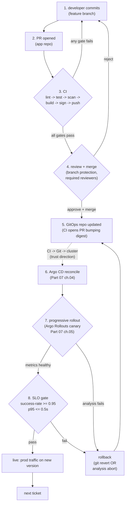

# 15.01 — The PR-to-production lifecycle

> The mental model of the **full ops loop** Part 15 is built around — how a
> single line of code goes from a developer's editor to live production
> traffic and back. The loop's eight stages (commit → PR → CI →
> review/merge → GitOps repo update → Argo CD reconcile → progressive
> rollout → SLO gate → done), the *one* flowchart this Part returns to in
> every subsequent chapter, and the load-bearing rule it enforces: **every
> change to production is a Git commit; nothing else.** This chapter sets
> the vocabulary; chapters 15.02 onward operationalise each stage.

**Estimated time:** ~15 min read · ~30 min hands-on
**Prerequisites:** [Part 07 ch.01](../07-delivery/01-packaging-helm.md) — Helm/Kustomize/CI/GitOps that underpin the loop · [Part 11 ch.01](../11-advanced-production-patterns/10-platform-engineering.md) — production maturity framing · [Part 14 ch.10](../14-eks-in-production-a-to-z/10-gitops-bootstrap-fresh-cluster.md) — Argo CD reconcile that closes the loop

**You'll know after this:** • name the eight stages of the PR-to-production loop (commit → PR → CI → review/merge → GitOps repo update → Argo CD reconcile → progressive rollout → SLO gate → done) · • articulate the load-bearing rule "every change to production is a Git commit; nothing else" · • map each subsequent Part 15 chapter onto the stage it operationalizes · • diagnose where in the loop a stuck change is currently sitting · • use the loop diagram as the shared vocabulary across CI/CD, security, and ops conversations

<!-- tags: pr-workflow, gitops, ci-cd, day-2, platform-engineering -->

## Why this exists

Part 07 packaged the Bookstore (Helm/Kustomize/CI/GitOps/Rollouts). Part 13
scaled it to a multi-tenant, multi-region platform. Part 14 put it on EKS
with all the cloud-side glue. By the end of Part 14 a *cluster operator*
can stand up the runtime. **Part 15 is for the team that operates it on
Tuesday morning.**

That team's first day is a swirl of vocabulary. CI/CD, GitOps, Argo CD,
Argo Rollouts, ESO, Vault, Kyverno, OPA, PagerDuty, branch protection,
required reviews, SLOs, blast radius, blue/green, canary, hotfix,
breakglass, feature flag, dark launch, postmortem, on-call. Each piece
exists in Parts 00–14 in isolation. The day-to-day question is the *shape*
they form together: when a Jira ticket says "fix the catalog 5xx" and a
developer opens an editor, **what is the path from that edit to a user
seeing the fix in production, and back to the next ticket?**

This chapter is that path, drawn once, in one diagram, with one rule:
**every change to production is a Git commit; nothing else**. Push-CD
("CI runs `kubectl apply`"), manual `helm upgrade` on a prod cluster, an
emergency `kubectl edit` to mitigate an incident — Part 15's whole point
is to make those rare-or-tracked, not normal. Every chapter that follows
deepens one stage of this loop; this one names them.

This is the *Operating Kubernetes* concern from *Production Kubernetes*
ch.15; *Continuous Delivery* (Humble & Farley) is the canonical reference
for the deploy-pipeline-as-discipline framing.

## Mental model

**The PR-to-production lifecycle is a loop, not a line. A change leaves
Git as code, returns to Git as a digest, and returns AGAIN as a rollback
or as the next change. Production never receives an imperative command;
it converges to the latest commit.**

- **Eight stages, two repos, one trust direction.** A change passes
  through eight observable states: (1) commit, (2) PR, (3) CI runs, (4)
  review + merge, (5) GitOps repo updated, (6) Argo CD reconciles, (7)
  progressive rollout, (8) SLO gate. The change touches *two* repos — the
  **app repo** (source code, owned by the dev team) and the **GitOps
  repo** (Kubernetes manifests, owned by platform/SRE). Trust flows in one
  direction: CI writes to the GitOps repo via a PR, never directly to the
  cluster. The cluster reads from the GitOps repo via Argo CD, never from
  CI.
- **Stages 1–4 are about *evidence*.** The code change accumulates
  evidence: tests pass, lint is clean, the image scans cleanly, the
  binary is signed keyless via OIDC, reviewers approved. By stage 4
  (merge) we have an *artifact whose provenance is auditable* — a signed
  image digest, a Rekor log entry, a Cosign cert tied to the merging
  workflow. The image **exists in the registry but is not yet deployed**.
- **Stages 5–6 are about *intent*.** A separate PR (or auto-bump) updates
  a Kubernetes manifest in the GitOps repo with the new image digest.
  Merging that PR records the *intent* to run this digest in this
  environment. Argo CD (Part 07 ch.04) reconciles — desired state in Git
  becomes live state in the cluster.
- **Stages 7–8 are about *evidence of safety in production*.** A new
  Deployment generation is *not* a release: a RollingUpdate moves 100% of
  traffic onto unverified code, gradually. A real release is a
  metric-gated canary via Argo Rollouts (Part 07 ch.05) — the SLO gate
  (success rate, p95 latency) either promotes or aborts the canary
  *automatically*, and the loop returns to stage 5 (a rollback is a new
  commit; `git revert` is the durable form).
- **The loop runs at vastly different cadences in dev vs prod.** Dev sees
  this loop close in **minutes** (auto-merge, auto-sync, no canary). Prod
  sees it close in **hours-to-days** with reviews, manual approval gates,
  and explicit canary windows. The *shape* is identical; only the dials
  change.
- **Hotfix, rollback, and breakglass are the loop with one stage skipped
  or compressed.** A hotfix has fewer reviewers, sometimes no canary;
  rollback is `git revert` + auto-sync (stage 5 onward only); breakglass
  is the one rare case where a human bypasses the loop entirely and the
  follow-up is a postmortem **plus** a commit reverse-engineering the
  bypassed state back into Git. Each gets its own chapter (15.07, 15.09,
  15.10).

The trap to keep in view: the diagram is one loop, but the **load-bearing
property is the trust direction** (CI → Git → cluster, never CI → cluster).
The single fastest way to destroy this property is a "let's just `kubectl
apply`" in an incident — the cluster's state drifts from Git, GitOps
reconciles it back, the on-call person fights the reconciler, drift
persists invisibly. The discipline: **a change to prod is a commit, even
if you make it in an incident** (and the chapter on breakglass — 15.09 —
shows the disciplined exception).

## Diagrams

### The Bookstore PR-to-production lifecycle (Mermaid)

The loop this entire Part returns to. The dashed line is the **CI/CD
seam** — CI's last act is a PR, not a deploy; the cluster pulls from Git
via Argo CD.



### The eight stages mapped to chapters (ASCII)

```
 STAGE                            WHERE IT LIVES        DEEP-DIVE CHAPTER
 ──────────────────────────────────────────────────────────────────────────────
 1. commit                        developer's editor    n/a (Part 00 onward)
 2. PR                            app repo (GitHub)     15.02 (branch protection)
 3. CI: lint/test/scan/build/sign GitHub Actions        15.02 + 15.03
 4. review + merge                app repo              15.02 (required checks)
 5. GitOps repo updated           bookstore-gitops repo 15.04 (multi-env promotion)
                                                       *parallel phase 15b
 6. Argo CD reconcile             argocd ns in cluster  Part 07 ch.04 (deepened
                                                        by 15.04 ApplicationSet)
 7. progressive rollout           bookstore ns          15.06 (deepens 07.05)
                                                       *parallel phase 15b
 8. SLO gate                      analysis +            15.06 + 15.10 (on-call)
                                  PrometheusRules
 ──────────────────────────────────────────────────────────────────────────────
 Loop-back paths:
   rollback                       git revert + GitOps    15.07
                                                       *parallel phase 15c
   hotfix                         the loop, compressed   15.09
                                                       *parallel phase 15c
   incident response              the loop + humans      15.10
                                                       *parallel phase 15d
   day-to-day cadence             weekly/monthly review  15.11
                                                       *parallel phase 15d
 ──────────────────────────────────────────────────────────────────────────────

 The two-repo structure (single source of truth = the GitOps repo):

   app repo (e.g. github.com/GITHUB_ORG/bookstore)
     - app/<SERVICE>/    Go source
     - .github/workflows/<SERVICE>.yml   CI/CD per service
     - secrets: AWS_ROLE_ARN_ECR, GITOPS_PR_TOKEN
       (note: NO cluster credentials, NO kubeconfig)

                       │
                       │  CI opens a PR
                       ▼
   GitOps repo (e.g. github.com/GITHUB_ORG/bookstore-gitops)
     - kustomize/base/                shared baseline
     - kustomize/overlays/{dev,staging,prod}    pinned digests
     - argocd/                        Application + ApplicationSet
     - branch protection: prod overlay requires 2 reviewers
                       │
                       │  Argo CD reads (pull, not push)
                       ▼
   cluster (the only thing with apply rights)
     - argocd ns: Application controllers
     - bookstore ns: workloads (PSA restricted)
     - argo-rollouts ns: progressive rollout controller
```

## Hands-on with the Bookstore Platform

**Assumed working directory: the guide repo root (`full-guide/`).** This
chapter is the *vocabulary* chapter; the runnable pieces are the
[`examples/bookstore-platform/ci/`](../examples/bookstore-platform/ci/)
workflow templates (built in 15.02–15.03) and the existing Part 07
Bookstore tree. The walk-through below traces the loop **from the
deployed state**, calling out which directory and which command would be
the next-stage action for a real change to a real service.

### 0. Map the two repos and four directories you will use this Part

Open these in your editor; they are the four cardinal directories the loop
touches:

```sh
# app repo (the source-of-code, NOT source-of-deployment):
ls examples/bookstore-platform/app/                  # services Go sources (parallel phases)
ls examples/bookstore-platform/ci/                   # the 5-stage workflows + signing helper

# GitOps repo (the source-of-deployment, separate from app):
ls examples/bookstore-platform/kustomize/            # base + region overlays (Part 13)
ls examples/bookstore-platform/argocd/               # Argo CD Applications + ApplicationSet
```

The Bookstore Platform tree ships both halves in one repo for *teaching*
(so the reader sees them side-by-side). **In production these are
separate repos**, owned by different teams, with different branch
protection — the app-repo PR can be merged by the service team; the
GitOps-repo PR for `overlays/prod` needs platform/SRE review. The
chapter's diagram and table assume two repos; the in-tree layout collapses
them for readability.

### 1. Walk the loop without changing anything (the read-only trace)

For a deployed Bookstore service, every stage of the loop leaves an
observable artifact. Trace them:

```sh
# Stage 1 — commit on the source side: which commit is currently deployed?
# The GitOps repo's overlay has the answer (pinned digest), and the git log
# above it has the audit trail.
cat examples/bookstore-platform/kustomize/regions/us-east/kustomization.yaml \
  | grep -A2 '^images:'
# images:
# - name: bookstore/catalog
#   newName: AWS_ACCOUNT_ID.dkr.ecr.AWS_REGION.amazonaws.com/bookstore/catalog
#   digest: sha256:DIGEST-HEX            <- the deployed bits

# Stage 3 — what CI proved about THAT digest: Rekor log + Cosign cert
# (read-only public log; works without any cluster access):
cosign verify \
  --certificate-identity-regexp 'https://github.com/GITHUB_ORG/.+/.github/workflows/.+\.yml@.*' \
  --certificate-oidc-issuer 'https://token.actions.githubusercontent.com' \
  AWS_ACCOUNT_ID.dkr.ecr.AWS_REGION.amazonaws.com/bookstore/catalog@sha256:DIGEST-HEX
# -> the cert identity is the workflow that signed this. THIS is Kyverno's
#    verifyImages check at admission (Part 15 ch.03), reproduced locally.

# Stage 6 — Argo CD's record of WHEN it reconciled this digest:
argocd app history bookstore-prod
# -> the same digest as the commit history; deploy = commit.

# Stage 7 — Argo Rollouts' record of the canary's progression:
kubectl argo rollouts history rollout catalog -n bookstore
kubectl argo rollouts get rollout catalog -n bookstore
# -> stable revision, the analysis run that gated promotion.

# Stage 8 — the SLO that gated the promotion. PromQL Part 06 ch.01 taught.
# (Production setup; in a kind cluster `monitoring` ns hosts kube-prom-stack.)
kubectl -n monitoring exec deploy/prometheus-server -- \
  promtool query instant 'http://localhost:9090' \
  'sum(rate(http_requests_total{handler!="metrics",code=~"5.."}[5m])) /
   sum(rate(http_requests_total{handler!="metrics"}[5m]))'
# -> success-rate gate value at the moment of the canary.
```

Every artifact above is in Git, in a registry, in a transparency log, or
in the cluster's controllers. **Nothing was learned by asking a human or
re-running anything.** That is the property the loop buys: an auditable
trail per change, free.

### 2. Trace a hypothetical PR through the loop (mental walk-through)

A developer fixes a 5xx in `catalog`. Here is the **exact** sequence:

```
 1. commit         git checkout -b fix/catalog-5xx
                   $EDITOR app/catalog/handlers/list.go
                   go test ./...      <- locally, fast
                   git commit -m "fix: handle nil book on /list"

 2. PR             gh pr create --base main
                   - paths: trigger only catalog.yml (the path-filter in
                     the workflow); orders.yml / payments-worker.yml
                     don't run, saving runner minutes

 3. CI             catalog.yml runs: lint -> unit -> integration (Postgres
                   service container) -> scan. On PR: STOPS before
                   build-sign-push (the if-on-push-to-main guard).
                   Reviewer sees green checks.

 4. review/merge   one reviewer (catalog team-required). main is
                   protected; a force-push would be rejected by branch
                   protection rules.

 5. GitOps repo    catalog.yml runs the build-sign-push job (now on main),
                   pushes the multi-arch digest to ECR, cosign keyless
                   signs it with this workflow's OIDC identity, opens a
                   PR against bookstore-gitops/kustomize/overlays/dev:
                     'bump: catalog -> abc123'
                   The dev overlay PR auto-merges (low-risk env). The
                   staging + prod overlays get separate PRs in Part 15
                   ch.04 (parallel phase 15b) — those need human review.

 6. Argo CD        in-cluster controller polls bookstore-gitops every 3m
                   (or via webhook). New commit -> diff -> sync the dev
                   Application. The catalog Rollout's pod template now
                   references the new digest.

 7. canary         Argo Rollouts: 10% -> pause 60s -> 25% -> pause 60s
                   -> analysis -> 50% -> pause 60s -> 100%. The analysis
                   step queries Prometheus.

 8. SLO gate       success-rate >= 0.95 AND p95 <= 0.5s, sampled every
                   20s, failureLimit 3. Passes -> auto-promote. Fails ->
                   automatic rollback (canary -> 0, stable -> 100%).
                   Either way, no `kubectl rollout undo`.

 The change is live in dev. To promote it to staging/prod, a *different*
 PR (in the GitOps repo) moves the same digest between overlays — the
 IMAGE IS NEVER REBUILT. Part 15 ch.04 (parallel phase 15b) shows that.
```

### 3. What the loop *prevents* — three real-world anti-patterns

This is a tour by negation. Each "what could go wrong" is what GitOps was
built to make structurally impossible.

```
 "Quick fix: I'll ssh in and edit"   <- there's no ssh; even if there were,
                                         Argo CD selfHeal reverts it (Part
                                         07 ch.04). The fix has to be a
                                         commit; even hotfix follows the
                                         same shape (Part 15 ch.09, parallel
                                         phase 15c).

 "Promote prod by rebuilding"        <- a rebuild is a DIFFERENT artifact.
                                         CI cache may collide; Trivy may
                                         pick up a new CVE; the cosign
                                         signature covers a different
                                         digest. The promotion is a
                                         digest-move-by-commit, never a
                                         rebuild.

 "CI just needs cluster admin to deploy" <- CI gets ECR push + GitOps repo
                                            write, nothing else. The
                                            cluster credential is owned by
                                            Argo CD, scoped by AppProject
                                            (Part 07 ch.04). Push-CD's
                                            blast radius is unbounded;
                                            pull-GitOps's is bounded by
                                            the AppProject + the merged
                                            PR's diff.
```

The point of stating these by name is that *every* stage of Part 15 from
here onward is enforcing one of them. When ch.02 talks about branch
protection rules, it is enforcing "the fix has to be a commit". When
ch.03 talks about `verifyImages`, it is enforcing "the signature covers
THIS digest". When 15.07 (parallel phase 15c) talks about rollback, it is
enforcing "rollback is a commit, not a kubectl undo".

## How it works under the hood

- **The loop is not one tool; it is a contract between tools.** Each tool
  in the loop has a narrow job and a narrow output:
    - GitHub (the PR) produces a **reviewed merge commit**.
    - GitHub Actions (CI) produces a **signed image digest** + opens a
      **GitOps PR**.
    - The GitOps repo merge produces a **manifest-with-digest commit**.
    - Argo CD produces a **synced Application** at that commit.
    - Argo Rollouts produces a **promoted Rollout** that passed analysis.
    - Prometheus (the gate) produces a **measured outcome**.
  The contract is: each tool's output is the next tool's input, every
  output is *recorded in some queryable store* (Git, registry, Rekor, the
  Argo CD/Rollouts CRDs, Prometheus), and *no tool reaches into the
  cluster except Argo CD*. Pulling a stage out (e.g. removing the SLO
  gate) keeps the rest of the loop working; replacing a stage (e.g.
  Flagger instead of Argo Rollouts) is a swap, not a rewrite.

- **The "evidence" stages produce *attestations*, not just logs.** Stage 3
  (CI) writes an SBOM (syft → SPDX-JSON) and a SLSA provenance
  attestation, both bound to the image digest via cosign attest (Part
  15 ch.03). A future consumer — a *new* admission controller, a
  compliance scanner, an SBOM diff tool — can read these attestations
  *without trusting the pipeline that produced them*; they verify the
  attestation chain back to the Sigstore root. Logs would not give you
  this; attestations are the cryptographic form of the evidence.

- **The "intent" stages produce *desired state*, not commands.** Stage 5
  (the GitOps PR) and stage 6 (Argo CD reconcile) explicitly avoid
  imperative state: the merged commit is a declarative manifest update;
  Argo CD's reconcile is a diff-and-apply, not a sequence of `kubectl
  create/patch/delete` calls. This is the property that makes
  drift-detection and rollback possible: there is a single point of truth
  to diff against, and reverting is a Git operation. Part 07 ch.04
  describes the GitOps property; Part 15 leans on it.

- **The "outcome" stages produce *measured signals*, not human
  judgement.** Stage 7 (the canary) and stage 8 (the SLO gate) move
  promotion + rollback off humans onto Prometheus queries. A human can
  still hit "promote now" / "abort", but the *default* path is
  signal-driven. This is the difference between a *deploy* (we shipped
  the bits) and a *release* (the bits are live for users). Part 07 ch.05
  explored this; Part 15 ch.06 (parallel phase 15b) deepens it for prod.

- **Two repos because two trust boundaries.** The app repo's contributors
  are *developers*; the GitOps repo's contributors are *CI workflows*
  (the app repo's signed workflows) **and** platform/SRE for the prod
  overlay. A developer can merge to the app repo's `main` without
  platform review (it produces an artifact, not a deploy); a platform
  engineer reviews the GitOps repo's prod-overlay PR (it *is* the
  deploy). Collapsing them into one repo is a teaching simplification
  (this guide does this for the lab); production keeps them apart so
  branch-protection lives in the right place.

- **The loop is the same for hotfixes, rollbacks, and breakglass; only
  the *dials* change.** Part 15 ch.07/.09/.10 (parallel phases 15c/15d)
  do not introduce new stages — they tune the existing ones: a hotfix
  has fewer reviewers and may skip the canary (manual approval gate set
  to "skip" with an audit log); a rollback is `git revert` triggering
  stages 5–8 again; breakglass is a documented *exception* in stage 4
  with a follow-up commit that re-creates the cluster state into Git so
  the loop's invariants restore themselves. The diagram in §Diagrams is
  the same diagram you draw on the incident-response whiteboard at 3am.

- **The loop's failure modes are observable BEFORE they bite.** Each
  stage's evidence becomes a SLI/SLO:
    - stage 3 CI: time-from-commit-to-green, % runs that fail at scan
    - stage 4 review: time-from-PR-to-merge
    - stage 5 GitOps PR: time-from-app-PR-to-GitOps-PR-merge
    - stage 6 Argo CD: time-from-GitOps-merge-to-Synced
    - stage 7–8 rollout: canary success rate, time-to-promote / time-to-abort
  Part 15 ch.11 (parallel phase 15d) shows the dashboards.

## Production notes

> **In production: a change to prod is a commit; nothing else.** The
> single most consequential rule of this entire Part. Every variant of
> "I'll just `kubectl edit` for now" is the loop being broken; every
> variant of "let's add a step where CI runs `kubectl apply`" is the
> trust direction being reversed. The discipline costs ~30 seconds of
> opening a one-line PR; the *absence* of the discipline is the year-one
> drift that nobody can audit.

> **In production: keep app repos and the GitOps repo separate.** The
> branch protection rules are different, the reviewers are different,
> the cadence is different. Collapsing them is fine for a lab; in prod,
> the platform team owns the prod-overlay PRs and the app team does not.
> A teaching shortcut becomes a security regression at scale.

> **In production: dial the same loop differently per environment.**
> Same eight stages, different dials. Dev: auto-merge GitOps PR, no
> canary, no manual gate. Staging: human-approve GitOps PR, light canary
> (10→50→100). Prod: human-approve GitOps PR, full canary (10→25→50→100
> with two analysis gates), `pause: {}` for human approval before 100%
> on the riskiest services. Part 15 ch.04 (parallel phase 15b) shows the
> ApplicationSet shape that makes this a config, not a code, change.

> **In production: budget for the rare loop-bypass.** Some incidents
> (cert outage, a CD-loop bug, an evil third party) *will* legitimately
> require a breakglass. Plan it: the breakglass account exists, is
> audited (every action logged + paged), and the follow-up
> commit-into-Git is a checklist item. Part 15 ch.09 (parallel phase
> 15c) is the breakglass discipline; budget for it monthly so the muscle
> stays warm.

> **In production: measure the loop, not just the workloads.** SLIs on
> the *loop itself* (time to PR, time to merge, time to deploy, canary
> failure rate) are leading indicators for engineering throughput; they
> precede incident rate and outage cost. Part 15 ch.11 (parallel phase
> 15d) builds the platform-SLI dashboards; the loop's signals belong on
> them.

## Quick Reference

```sh
# The eight stages, one-liner per stage, on a Bookstore catalog change:

# 1. commit
git -C app-repo checkout -b fix/catalog-5xx
$EDITOR app-repo/app/catalog/handlers/list.go && go test ./...
git -C app-repo commit -am "fix: handle nil book on /list"

# 2. PR
gh -R GITHUB_ORG/bookstore pr create --base main

# 3. CI (automatic — view it)
gh -R GITHUB_ORG/bookstore run watch

# 4. review + merge
gh -R GITHUB_ORG/bookstore pr review PR_NUM --approve
gh -R GITHUB_ORG/bookstore pr merge PR_NUM --squash

# 5. GitOps repo update (automatic — the GitOps PR opens itself; see it)
gh -R GITHUB_ORG/bookstore-gitops pr list --search "bump: catalog"

# 6. Argo CD reconcile (in-cluster; watch from outside via the CLI)
argocd app get bookstore-dev
argocd app sync bookstore-dev          # if syncPolicy is manual

# 7. Progressive rollout (Argo Rollouts)
kubectl argo rollouts get rollout catalog -n bookstore --watch

# 8. SLO gate (the analysis run)
kubectl get analysisrun -n bookstore
kubectl argo rollouts promote catalog -n bookstore   # human gate (if any)
kubectl argo rollouts abort   catalog -n bookstore   # force rollback
```

Rollback variants (all are commits, never `kubectl rollout undo`):

```sh
# Soft: revert the GitOps PR (the digest move) — Argo CD reconciles back.
gh -R GITHUB_ORG/bookstore-gitops pr revert PR_NUM
# Hard: revert the app-repo PR (the bug fix itself), let CI re-deploy.
gh -R GITHUB_ORG/bookstore revert PR_NUM
# Automatic: the canary's analysis already aborted (preferred).
```

Checklist:

- [ ] Change → commit on a feature branch in the **app repo**
- [ ] CI runs lint → test → scan → build → sign → push **without** holding
      cluster credentials
- [ ] CI's last act is a **PR**, not a deploy (against the GitOps repo)
- [ ] GitOps repo's merge triggers **Argo CD**, the only thing with
      cluster apply rights (`AppProject`-scoped)
- [ ] Production release is a **metric-gated canary**, not a
      RollingUpdate; SLO gate auto-rolls-back
- [ ] Rollback is **`git revert`** in the GitOps repo (or auto-abort from
      the canary), never a `kubectl rollout undo`
- [ ] Two repos (app + GitOps), two trust boundaries, two reviewer pools
- [ ] Every stage produces a queryable artifact (commit, Rekor entry,
      Argo CD Application, Rollout, AnalysisRun)

## Test your understanding

> Try each before opening the answer drawer. The act of trying is the exercise; the answer is the check.

1. **Why does the chapter insist on "CI → Git → cluster" as the trust direction, and what's the canonical way teams accidentally break it?**
   <details><summary>Show answer</summary>

   The trust direction makes the cluster state recoverable, auditable, and incident-resistant: the GitOps repo is the source of truth, every change is a commit, Argo CD reconciles into the cluster. The canonical break is "let's just `kubectl apply` to mitigate" — the cluster state drifts from Git, Argo CD reconciles it back, the on-call person fights the reconciler, drift persists invisibly. The discipline: a change to prod is a commit, even in an incident. The breakglass chapter (15.09) shows the disciplined exception — the bypass is followed by a commit reverse-engineering the bypassed state back into Git.

   </details>

2. **A developer's change has passed CI and merged, but 90 minutes later the new version still isn't live in production. Walk through what could be holding it back.**
   <details><summary>Show answer</summary>

   Check each stage of the loop: (5) Did the GitOps-repo PR open and merge? If CI auto-bumps the digest, did the workflow succeed? (6) Is Argo CD reconciling? `argocd app get bookstore-prod` shows sync status; if it's `OutOfSync` without auto-sync, someone needs to click sync. (7) Is the Rollout's canary paused? `kubectl argo rollouts get rollout` shows the current step; if it's at a pause step waiting for a manual promote, that's the hold. (8) Did the SLO gate's AnalysisRun fail? If so, the canary auto-aborts and rolls back. Each stage has its own observable artifact; the chapter's discipline is "every stage produces a queryable artifact," which is what makes this triage straightforward.

   </details>

3. **The chapter says hotfix, rollback, and breakglass are "the loop with one stage skipped or compressed." What does that imply about how the team should design those flows?**
   <details><summary>Show answer</summary>

   The flows should preserve as many stages as possible and explicitly mark which are skipped, not invent a separate flow. Hotfix keeps CI but compresses review (one approver instead of two); rollback uses stages 5-8 (just commits a `git revert`); breakglass skips stage 4 (no review) but still records the change via stage 1 and demands the post-incident commit. If the team designs hotfix as "I'll SSH to a node and edit a manifest" they've built a parallel path with no audit, no rollback, and no SLO gate. The discipline: every emergency lane is the same loop with marked exceptions, not a different loop.

   </details>

4. **Hands-on extension — open a "broken" PR (intentionally fails CI tests) and watch which stages of the loop fire and which don't.**
   <details><summary>What you should see</summary>

   Stages 1-2 fire (commit + PR open). Stage 3 (CI) fails at the test step; the PR shows a red X, branch protection blocks merge, stage 4 cannot complete. The loop terminates at stage 3 — nothing reaches the GitOps repo, nothing reaches the cluster, no canary, no SLO gate. The lesson: branch protection plus required-checks is what makes the loop a directed graph instead of a polite suggestion. Without it, a developer could bypass tests and reach stage 5 with broken code. The chapter's "required checks" discipline is what makes the trust direction load-bearing.

   </details>

## Further reading

- **Humble & Farley, _Continuous Delivery_** — the foundational text for
  the deploy-pipeline-as-discipline framing; the eight stages here are a
  modern, GitOps-and-canary specialisation of its ideas. The chapters on
  build pipelines, deployment pipelines, and managing infrastructure are
  the source material for the loop.
- **Rosso et al., _Production Kubernetes_, ch.15 — Operating Kubernetes**
  (the day-2 operational framing; Part 15 is *this* chapter at book
  length, with the loop as its skeleton).
- **Beyer et al., _Site Reliability Engineering_ (Google)**, especially
  the chapters on release engineering and canary analysis; the SLO-gate
  stage's intellectual provenance.
- Official / project docs: GitOps principles —
  <https://opengitops.dev/>; Argo CD docs —
  <https://argo-cd.readthedocs.io/en/stable/>; Argo Rollouts canary —
  <https://argoproj.github.io/argo-rollouts/features/canary/>; Sigstore
  cosign — <https://docs.sigstore.dev/cosign/overview/>.
