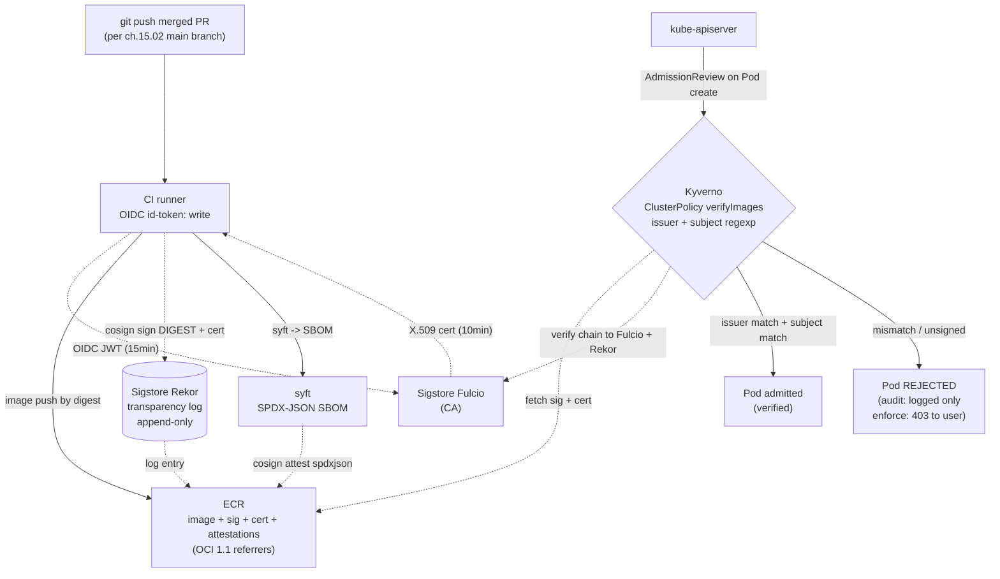

# 15.03 — Image signing and provenance in CI

> The CI-side of supply-chain trust for the Bookstore Platform — **cosign
> keyless** via GitHub Actions OIDC (`cosign sign --yes`); **SBOM** via
> syft (`syft <IMAGE> -o spdx-json`) bound to the image digest with
> `cosign attest`; **SLSA provenance** as a buildx-native or cosign
> attestation; the **Kyverno `ClusterPolicy`** that verifies signatures
> at admission with `verifyImages` matching the workflow's OIDC identity
> (issuer + subject regexp); the **honest audit → enforce migration
> path** (an enforce-mode rollout that rejects unsigned images must be
> gradual — start in audit on dev, expand by namespace, flip to enforce
> only once every image deployed is signed). Deepens Part 05 ch.03
> (which is conceptual: Cosign exists, SBOMs exist) and Part 14 ch.12
> (which is cloud-side: Kyverno on EKS) by showing the CI half — the
> pipeline that *produces* the signed digests Kyverno verifies.

**Estimated time:** ~30 min read · ~90 min hands-on
**Prerequisites:** [Part 15 ch.02](./02-application-cicd-pipelines.md) — the pipeline you're adding signing into · [Part 05 ch.03](../05-security/03-supply-chain.md) — conceptual supply-chain trust chain · [Part 14 ch.12](../14-eks-in-production-a-to-z/12-supply-chain-security.md) — Kyverno verification on EKS that consumes the signatures

**You'll know after this:** • sign images keyless via GitHub Actions OIDC with `cosign sign --yes` (no long-lived keys) · • generate SBOMs with `syft -o spdx-json` and bind them to digests via `cosign attest` · • produce SLSA provenance as a buildx-native or cosign attestation · • configure a Kyverno `ClusterPolicy.verifyImages` matching the workflow's OIDC identity (issuer + subject regexp) · • execute the audit → enforce migration safely (start audit on dev, expand by namespace, flip enforce only when every deployed image is signed)

<!-- tags: cosign, supply-chain, security, ci-cd, app-cicd -->

## Why this exists

Three chapters in this guide say "sign images with cosign keyless and
verify them with Kyverno". Each says it for a different reader:

- **Part 05 ch.03** introduced cosign keyless and Kyverno
  `verifyImages` as concepts. Its example pipeline was a sketch; the
  v1 Bookstore's images shipped tag-based and unsigned, so the
  `verifyImages` rule shipped in **Audit** mode (it logged would-be
  rejections but did not block them).

- **Part 07 ch.03** added a real workflow that *does* sign keyless, but
  for a single-runtime laptop GitHub Container Registry flow. It did
  not address the cloud production path (ECR), the Kyverno
  configuration that matches *that* workflow's identity, or the
  migration path from audit to enforce in a multi-tenant cluster.

- **Part 14 ch.12** (Phase 14c) added the *cloud* side of admission
  hardening — Kyverno on EKS, the verifyImages policy, the IRSA-shaped
  cluster wiring. Its example was generic ("here is a Kyverno
  `verifyImages` rule with placeholders for issuer and subject").

This chapter is the bridge. The CI workflows in
[`examples/bookstore-platform/ci/`](../examples/bookstore-platform/ci/)
sign images with a *specific* OIDC subject (the workflow ref + repo);
this chapter shows the Kyverno rule that matches *that exact subject*
and the migration path to flip the rule from audit to enforce without
breaking already-running workloads.

The chapter is also explicit about the **two halves of supply-chain
trust** in production:

1. **Signature trust** — "this image was built by *our* CI" (cosign
   sign + Kyverno verifyImages). Cheap, fast, the foundation. Catches
   "someone pushed `bookstore/catalog:latest` to ECR by hand and
   referenced it in a manifest".

2. **Provenance trust** — "this image was built by our CI **with these
   inputs**" (SLSA provenance attestation + Kyverno verifyImages with
   `attestations:`). Adds: catches a compromised CI signing arbitrary
   bits (an attacker who steals OIDC tokens but not the source). The
   workflows here emit provenance via both buildx-native
   (`provenance: true`) and explicit cosign attest; this chapter shows
   how to verify both.

This is the *Software Supply Chain Security* concern from *Production
Kubernetes* ch.10; *Software Supply Chain Security* (Hightower & Foundry)
and the SLSA spec are the canonical references.

## Mental model

**Image signing is a chain of three cryptographic facts: the image bytes
hash to a digest; the signature is over the digest; the signature's
certificate identity is the workflow you trust. Verify all three at
admission, or trust none.**

- **The chain in three statements.** Verification of an image is
  *checking three statements all hold*:
  1. **Bytes → digest.** The bytes I pulled hash to the digest I asked
     for. (`kubelet`'s default behaviour when you pin `<IMAGE>@sha256:HEX`.)
  2. **Digest → signature.** There exists a cosign signature whose
     payload covers this digest. (`cosign verify` checks this against
     the Rekor transparency log.)
  3. **Signature → identity.** The signature's certificate was issued
     to a subject I trust. For GitHub Actions, the subject is the
     workflow ref:
     `https://github.com/GITHUB_ORG/REPO/.github/workflows/<NAME>.yml@refs/heads/main`,
     and the issuer is `https://token.actions.githubusercontent.com`.
     (Kyverno's `verifyImages.attestors.entries.keyless.{issuer,subject}`
     fields encode this.)
  Skipping any link makes the whole chain ornamental. **Verifying digest
  but not identity** lets an attacker who push-by-digest to ECR pass;
  verifying identity but trusting `subject: ".*"` lets *any* GitHub
  Actions workflow pass.

- **Keyless means "no long-lived signing key", not "no
  cryptography".** cosign keyless uses Sigstore's PKI: the runner's
  OIDC token authenticates to **Fulcio** (Sigstore's CA), which issues a
  ~10-minute X.509 cert with the workflow identity in the SAN; cosign
  signs the digest with the *ephemeral* private key, uploads the
  signature + cert to **Rekor** (an append-only transparency log), and
  the ephemeral key is discarded. To verify later, cosign retrieves the
  signature + cert from the registry's referrer index (OCI 1.1
  referrers) and verifies the chain against Sigstore's root + Rekor.
  **No key ever exists to leak.** The cost: trust in Sigstore's CA + the
  Rekor log's append-only property.

- **An SBOM is data; a *signed* SBOM is evidence.** `syft <IMAGE> -o
  spdx-json` produces an SPDX-JSON SBOM as a file. `cosign attest --type
  spdxjson --predicate <FILE> <IMAGE>@<DIGEST>` makes that SBOM into a
  cosign attestation: signed (with the same keyless flow), bound to the
  digest, stored as an OCI referrer in the registry, logged in Rekor.
  The verifier can `cosign verify-attestation --type spdxjson` and trust
  the SBOM via the signature chain — without trusting the pipeline that
  produced the SBOM. A bare SBOM file is unverifiable; an attested SBOM
  is the auditable form.

- **SLSA provenance is the same shape, with a different predicate.**
  `cosign attest --type slsaprovenance --predicate <FILE>` attaches a
  SLSA-provenance JSON (who built this, with what inputs, on what
  builder) as a cosign attestation. buildx emits it automatically with
  `provenance: true`; cosign verifies it. Kyverno's `verifyImages` with
  `attestations:` requires both signature *and* the named attestation,
  raising the bar from "signed by our CI" to "built by our CI with these
  inputs". The Bookstore workflows emit both; the Kyverno rule in this
  chapter requires the signature (the audit-to-enforce migration is
  hard enough); provenance verification is the next-tier hardening
  named in Production notes.

- **Kyverno `verifyImages` is admission-time, not runtime.** The rule
  fires when a Pod is created/updated; it pulls the referrer image,
  verifies the signature + identity, and admits or rejects. A pod that
  *was* admitted does **not** re-verify if Sigstore's root rotates or
  Rekor's log changes — admission is a moment-in-time gate. This
  matters for the audit-to-enforce migration: flipping enforce only
  affects *new* admissions; running pods are untouched.

- **The audit → enforce migration has three real stages.** Not "flip
  enforce one day"; rather: (a) **audit** — log violations but admit
  all images. Collect data. (b) **partial enforce** — enforce in the
  `bookstore` namespace (where every image is signed via the new
  workflow) while remaining audit in `kube-system`, `monitoring`, and
  other namespaces with vendor images (Prometheus, KEDA) that may not
  be signed in a way your `subject:` regexp matches. (c) **full
  enforce** — extend the rule's match expression to all namespaces
  once every image in every namespace either is signed by you or
  matches a separate, vendor-specific verifyImages rule. The chapter
  ships the audit-mode rule and the partial-enforce variant; full
  enforce is a per-cluster judgement call.

The trap to keep in view: **the rule is only as strict as its `subject:`
regexp**. A regexp of `.*` matches any cosign keyless signature from any
workflow — useless. A regexp scoped to your org but not the specific
workflow lets a malicious *other* workflow in your org sign. A regexp
scoped to the workflow file but not the branch lets a malicious branch
sign. The Bookstore Platform rule below pins issuer to GitHub Actions,
subject to *the specific workflow file ref on main* — narrowest useful
match. ch.15.02's `if: ref == refs/heads/main` guard pairs with this
rule: only `main` can sign, only `main`-signed images admit.

## Diagrams

### The CI-to-admission signing + verification path (Mermaid)

The cryptographic chain from a `git push` to a Pod admitted (or
rejected) by Kyverno. The dashed line is the **Sigstore PKI** boundary.



### The audit → enforce migration ladder (ASCII)

```
 STAGE         POLICY mode               WHO IS AFFECTED               PRECONDITION
 ────────────────────────────────────────────────────────────────────────────────
 0. baseline   no policy                 nobody                        none
 1. audit      validationFailureAction:  log every violation;          install
               Audit                     admit everything              kyverno
 2. partial    Audit cluster-wide        bookstore ns: REJECT          every Bookstore
    enforce    + Enforce on              if unsigned                   image signed by
               bookstore ns              (other ns: audit only)        ch.15.02 workflow
 3. full       Enforce cluster-wide      every ns REJECTS              every namespace
    enforce    (or named per-ns)         if unsigned                   has signed images
                                                                       (or a vendor-specific
                                                                       verifyImages rule)
 ────────────────────────────────────────────────────────────────────────────────
 GO-NO-GO check before flipping a stage:
   audit -> partial: 0 audit-mode failures for bookstore images for >= 14 days
   partial -> full:  0 audit-mode failures cluster-wide for >= 14 days
                     AND vendor-image policy rules in place

 What stage 2 (partial) looks like in YAML:
   spec:
     validationFailureAction: Audit            # cluster-wide default
     rules:
       - name: verify-bookstore-images
         match:
           any:
             - resources:
                 namespaces: [bookstore]
                 kinds: [Pod]
         validationFailureAction: Enforce       # OVERRIDE for this rule only
         verifyImages:
           - imageReferences: ['*/bookstore/*']
             attestors: [{ entries: [{ keyless: { issuer: ..., subject: ... }}]}]
```

## Hands-on with the Bookstore Platform

**Assumed working directory: the guide repo root (`full-guide/`).** This
chapter's hands-on is two paths: (a) running the cosign keyless flow
**without** a registry (Sigstore Fulcio is a public service; you can
sign anything you have OIDC for), then (b) reading the production-shape
Kyverno `ClusterPolicy` that the workflows in
[`examples/bookstore-platform/ci/`](../examples/bookstore-platform/ci/)
emit signatures *for*, and dry-running its `verifyImages` rule.

### 0. The local cosign keyless flow (operator OIDC, no registry needed)

The
[`examples/bookstore-platform/ci/sbom-and-sign.sh`](../examples/bookstore-platform/ci/sbom-and-sign.sh)
script does this for a real ECR image; the locally-runnable form for any
public image:

```sh
# Install cosign + syft (one-time):
brew install cosign syft
#   Linux: see https://docs.sigstore.dev/cosign/installation/ and
#          https://github.com/anchore/syft#installation

# Sign a public image you DON'T own — the signature is meaningless because
# you can't push it to the registry, but the local flow is identical to
# what CI does (the only difference is push). This shows the OIDC flow
# without needing any cluster or registry access:
cosign version
cosign sign --yes ghcr.io/your-org/test-image@sha256:DIGEST-HEX 2>&1 | head -20
#   This opens a browser to https://oauth2.sigstore.dev/auth, you sign in
#   with GitHub/Google, cosign exchanges the token at Fulcio for a cert,
#   signs the digest, and tries to upload to the registry (failure if
#   you don't have push). The KEYLESS flow worked even on failure: the
#   Fulcio cert was issued with YOUR identity in its SAN.

# Inspect a signed public image (signatures stored as OCI referrers):
cosign verify \
  --certificate-identity-regexp '.*' \
  --certificate-oidc-issuer-regexp '.*' \
  ghcr.io/sigstore/cosign/cosign@sha256:DIGEST-HEX   # any signed image
# -> the cert identity tells you WHO signed it (their workflow ref)

# Inspect Sigstore's PKI:
cosign tree ghcr.io/sigstore/cosign/cosign@sha256:DIGEST-HEX
# Lists all artifacts associated with the image (signatures, SBOMs, etc).
```

For the *Bookstore Platform's* actual ECR images, the
[`sbom-and-sign.sh`](../examples/bookstore-platform/ci/sbom-and-sign.sh)
helper script wraps this with the digest-format validation, SBOM
generation, and a verify step.

### 1. The Kyverno ClusterPolicy that gates the Bookstore Platform

This is the production-shape policy. It will live in
`examples/bookstore-platform/argocd/system/kyverno-verifyimages.yaml`
once a parallel phase wires it; for this chapter, read it as the
canonical pattern.

```yaml
apiVersion: kyverno.io/v1
kind: ClusterPolicy
metadata:
  name: verify-bookstore-images
  annotations:
    policies.kyverno.io/title: Verify Bookstore image signatures
    policies.kyverno.io/category: Supply Chain
    policies.kyverno.io/subject: Pod
spec:
  # CLUSTER-WIDE DEFAULT — Audit until every image in every namespace is
  # signed. The per-rule validationFailureAction below can OVERRIDE to
  # Enforce on namespaces you trust (the partial-enforce stage 2).
  validationFailureAction: Audit
  webhookConfiguration:
    failurePolicy: Fail   # if Kyverno is unreachable, FAIL admission — see notes
  rules:
    - name: verify-bookstore-keyless
      match:
        any:
          - resources:
              kinds: [Pod]
              # Match images in the Bookstore registry. The `imageReferences`
              # below tightens this to the specific ECR path; the `match.any`
              # block could also restrict by namespace once stage 2 is wired.
      # PARTIAL-ENFORCE OVERRIDE (the migration path): start Audit (default
      # above), then once every Bookstore image is signed, flip THIS rule
      # to Enforce — other rules / other namespaces keep Audit. This is the
      # stage-2 of the ladder ASCII.
      #
      # validationFailureAction: Enforce      # uncomment once GO-NO-GO clears
      verifyImages:
        - imageReferences:
            # Lock to the Bookstore ECR namespace specifically — a wildcard
            # `*` would let any image match the rule, defeating the rest of
            # the cluster's verifyImages rules.
            - 'AWS_ACCOUNT_ID.dkr.ecr.AWS_REGION.amazonaws.com/bookstore/*'
          # mutateDigest: true — if the manifest references a tag (mutable),
          # Kyverno resolves and MUTATES the manifest to pin the digest at
          # admission. The Part 05 ch.03 `require-image-digest` complement
          # for objects that slip through.
          mutateDigest: true
          # verifyDigest: true — require the (now-pinned) digest to be
          # signed; do not match by tag.
          verifyDigest: true
          # required: true — the image MUST have a verifiable signature.
          # required: false would admit unsigned images silently (audit
          # mode mediates the failure mode separately).
          required: true
          attestors:
            - entries:
                - keyless:
                    # The issuer is the GitHub Actions OIDC issuer; this
                    # is fixed for any GitHub-Actions-signed image.
                    issuer: 'https://token.actions.githubusercontent.com'
                    # The subject is the SAN of the cosign cert. For a
                    # GitHub Actions workflow, the format is:
                    #   https://github.com/<ORG>/<REPO>/.github/workflows/<WF>.yml@refs/heads/main
                    # Use a regexp to pin to the specific workflow file
                    # name pattern, the specific repo, AND main. A loose
                    # regexp here is the single biggest verifyImages
                    # foot-gun.
                    subject: 'https://github.com/GITHUB_ORG/bookstore/.github/workflows/.+\.yml@refs/heads/main'
                    rekor:
                      # Pin to the public Sigstore Rekor; for a private
                      # Sigstore deployment, point at your instance.
                      url: 'https://rekor.sigstore.dev'
          # OPTIONAL — provenance attestation requirement (stage-3 hardening):
          # Uncomment to additionally require a SLSA-provenance attestation.
          # The workflow already emits one (`provenance: true` on buildx +
          # `cosign attest --type slsaprovenance` could be added). Verifying
          # both = "this image was built by THIS workflow with THESE inputs",
          # not just "signed by THIS workflow".
          # attestations:
          #   - type: 'https://slsa.dev/provenance/v0.2'
          #     attestors:
          #       - entries:
          #           - keyless:
          #               issuer: 'https://token.actions.githubusercontent.com'
          #               subject: 'https://github.com/GITHUB_ORG/bookstore/.github/workflows/.+\.yml@refs/heads/main'
```

Read carefully:

- `issuer` is fixed; `subject` is a regexp pinned to the workflow file
  pattern on `main`. ch.15.02's `if: ref == 'refs/heads/main'` guard
  pairs with this — only `main`-built images sign, only `main`-built
  images verify.
- `mutateDigest: true` is the production-quality complement: even if a
  Deployment references a tag, Kyverno resolves and pins the digest at
  admission. The pod that runs is referenced by digest.
- `webhookConfiguration.failurePolicy: Fail` is **the production
  choice** but has a real risk: if Kyverno is unreachable (the pods
  are down, the network is partitioned), all Pod creates FAIL. This is
  *correct* for a security-critical webhook (failing closed) but is a
  Day-2 trap if Kyverno's HA is wrong. Part 11 ch.07 covers admission-
  controller HA; the migration path is: start `failurePolicy: Ignore`
  in audit mode (no admission risk), flip to `Fail` only when stage 2
  (partial enforce) is operationally proven.

### 2. Dry-run the verification against a signed image

If the Bookstore CI has signed at least one image, you can re-verify it
locally with the exact identity check Kyverno performs:

```sh
# Local mirror of what Kyverno does at admission. Replace placeholders.
cosign verify \
  --certificate-identity-regexp 'https://github.com/GITHUB_ORG/bookstore/\.github/workflows/.+\.yml@refs/heads/main' \
  --certificate-oidc-issuer 'https://token.actions.githubusercontent.com' \
  --rekor-url 'https://rekor.sigstore.dev' \
  'AWS_ACCOUNT_ID.dkr.ecr.AWS_REGION.amazonaws.com/bookstore/catalog@sha256:DIGEST-HEX'
# Output: a verification block per signature in the OCI referrer index.
# If the identity matches AND Rekor confirms the entry, cosign exits 0.
# If the subject doesn't match (e.g. signed by a different workflow),
# cosign exits 1 — the same outcome Kyverno's verifyImages would yield.

# Verify the SBOM attestation:
cosign verify-attestation --type spdxjson \
  --certificate-identity-regexp 'https://github.com/GITHUB_ORG/bookstore/\.github/workflows/.+\.yml@refs/heads/main' \
  --certificate-oidc-issuer 'https://token.actions.githubusercontent.com' \
  'AWS_ACCOUNT_ID.dkr.ecr.AWS_REGION.amazonaws.com/bookstore/catalog@sha256:DIGEST-HEX' \
  | jq -r '.payload' | base64 -d | jq .predicate.name
# -> the SBOM is bound to the digest and signed by the same identity.
```

The local verification *is* the Kyverno rule, reproduced. If both pass
locally, the rule will admit; if either fails, the rule will reject (or
log, in audit mode). This is the smoke test before flipping enforce.

### 3. Walk the audit → enforce migration on a kind cluster

Stage-by-stage demo. **Each stage is one PR to the GitOps repo**, in
real production; here, applied directly.

```sh
# Prereq: a kind cluster with the Bookstore deployed (Part 13 ch.01).
# Install Kyverno (Helm, the guide's invariant — never releases/latest/...):
helm repo add kyverno https://kyverno.github.io/kyverno/
helm repo update
helm install kyverno kyverno/kyverno -n kyverno --create-namespace --wait

# Stage 1 — audit mode. Save the policy YAML (the one above), apply:
kubectl apply -f kyverno-verifyimages.yaml      # validationFailureAction: Audit
# Try to create a pod with an unsigned image — admission ALLOWS, but Kyverno
# logs the violation as a PolicyReport:
kubectl run unsigned-test --image=nginx:1.27.0 -n bookstore --restart=Never
kubectl get policyreport -n bookstore
# -> a PolicyReport entry with result: fail (NOT a rejected admission).

# Inspect the violations: identify the images that would be rejected on
# stage 2. This is the GO-NO-GO data for migration.
kubectl get policyreport -A -o json | \
  jq -r '.items[].results[] | select(.result=="fail") | .resources[0].name'

# Stage 2 — partial enforce on bookstore ns. Patch the rule's per-rule
# validationFailureAction (the ClusterPolicy keeps cluster-wide Audit;
# the bookstore rule overrides to Enforce):
kubectl patch clusterpolicy verify-bookstore-images \
  --type=merge \
  -p='{"spec":{"rules":[{"name":"verify-bookstore-keyless","validationFailureAction":"Enforce"}]}}'

# Now retry the unsigned pod in bookstore — admission FAILS:
kubectl run unsigned-test-2 --image=nginx:1.27.0 -n bookstore --restart=Never
# Error from server: ... failed: validation failure: image verification failed

# But the unsigned pod still admits in kube-system (default Audit):
kubectl run unsigned-test-3 --image=nginx:1.27.0 -n kube-system --restart=Never
# pod/unsigned-test-3 created  (logged as a PolicyReport)

# Stage 3 — full enforce. Only after >= 14 days of zero audit-mode failures
# cluster-wide, change validationFailureAction at the spec level to Enforce
# AND remove namespace scopes from the match expression. This is the
# production endgame.
```

### 4. Verify provenance (the next-tier check, optional)

```sh
# The buildx-native provenance attestation, via cosign verify-attestation:
cosign verify-attestation --type slsaprovenance \
  --certificate-identity-regexp 'https://github.com/GITHUB_ORG/bookstore/\.github/workflows/.+\.yml@refs/heads/main' \
  --certificate-oidc-issuer 'https://token.actions.githubusercontent.com' \
  'AWS_ACCOUNT_ID.dkr.ecr.AWS_REGION.amazonaws.com/bookstore/catalog@sha256:DIGEST-HEX' \
  | jq -r '.payload' | base64 -d | jq '.predicate'
# Output: the SLSA provenance JSON — `builder.id`, `invocation.configSource`,
# `materials` (the inputs that went into the build). A consumer can assert,
# e.g., "the configSource was github.com/GITHUB_ORG/bookstore on main, ref
# matches the cosign cert" — the cryptographic form of "this image was built
# by THIS workflow with THESE inputs from main".
```

Adding `attestations:` to the Kyverno rule enforces this at admission;
the chapter ships the comment block (uncommented = stage-3 hardening).
The migration to full provenance verification has the same audit-then-
enforce shape and is not necessary for stage 2 to ship.

## How it works under the hood

- **The Sigstore PKI in one paragraph.** Sigstore is a public-good
  *root of trust* for code signing. Three components: **Fulcio** is a
  CA that issues short-lived (≤10 min) X.509 certs after verifying an
  OIDC token; **Rekor** is an append-only, Merkle-tree-backed
  transparency log of all signatures and certs; **cosign** is the
  client that drives the flow. Verifying a signature checks: (1) the
  signature cryptographically over the digest, (2) the signing cert
  chains to Fulcio's root, (3) a Rekor entry exists for this cert +
  signature pair at a time within the cert's validity window. Item (3)
  is what kills the "key was leaked yesterday" attack: a malicious
  signature post-dating the leak would have a Rekor inclusion proof
  *after* the cert expired, which verification rejects.

- **The OIDC subject is the workflow identity, not the user
  identity.** A `cosign sign` from a developer's laptop uses *their*
  OIDC (GitHub/Google login); the cert's SAN is the user's email or
  identity. CI uses the *workflow's* OIDC (the `id-token: write`
  permission mints a JWT whose `sub` claim is the workflow ref); the
  cert's SAN is the workflow URL. These are different subjects; a
  production Kyverno rule matches the workflow SAN and **rejects**
  developer-laptop signatures. This is why
  [`sbom-and-sign.sh`](../examples/bookstore-platform/ci/sbom-and-sign.sh)
  is for *local debugging only* — its signatures admit through a
  permissive verify, not the production rule.

- **OCI 1.1 referrers are how signatures find their image.** A cosign
  signature is stored as a separate OCI image (tagged
  `sha256-<DIGEST>.sig` historically; via the new referrers API since
  OCI 1.1). cosign verify-fetches the referrer list for the image,
  finds the signature manifest, downloads the signature + cert,
  verifies. ECR supports OCI 1.1 referrers (it took until 2023). GCR
  and most cloud registries do; ghcr.io does. Verification works
  uniformly across registries.

- **Rekor entries are permanent and public.** Every cosign signature
  in this guide produces a Rekor entry visible to the whole world. The
  *image bytes* are private (in your private ECR); the *fact that you
  signed an image* and *the identity that signed it* are public. This
  is a deliberate design choice — transparency logs are how you detect
  rogue signatures. If an attacker compromised your CI and signed
  evil bits, the Rekor entry is the audit trail; subscribing to Rekor
  with a monitor (Sigstore's `rekor-cli` + a watcher) catches it. For
  air-gapped environments, run a *private Sigstore* (private Fulcio +
  private Rekor) — same cryptography, private logs.

- **Kyverno's `verifyImages` is a *mutating* admission webhook by
  default.** With `mutateDigest: true`, the rule rewrites a Pod spec
  that says `image: bookstore/catalog:latest` to say `image:
  ...catalog@sha256:HEX`. The mutation runs before validation; the
  validation then verifies the pinned digest's signature. Pods that
  start are pinned to the verified digest. Without `mutateDigest`,
  Kyverno rejects tag-references outright — also defensible, but
  surprises developers who run `kubectl run --image=nginx:latest`.

- **`failurePolicy: Fail` vs `Ignore` is a real trade-off.** With
  `Fail`, if Kyverno's webhook is unreachable, every Pod create gets
  HTTP 500 from the API server — admission stops cluster-wide. This is
  the *correct* setting for a security-critical webhook, but it
  requires Kyverno to be HA (multiple replicas across nodes, a stable
  CA cert, fast pod scheduling for replacements). With `Ignore`, an
  unreachable webhook silently admits everything — risk of unsigned
  images in a brief outage window, but no admission-side outage. The
  Bookstore ships `Fail` because Part 14's EKS deploys Kyverno HA
  (Part 14 ch.03/.12), but the migration path is `Ignore` →
  `Fail` once HA is proven.

- **The audit-mode failure-mode (no PolicyReport) is a real Day-2
  trap.** When `validationFailureAction: Audit` and a violation
  occurs, Kyverno writes a **PolicyReport** CRD with the result. If
  PolicyReport CRDs aren't installed (older Kyverno), violations are
  *silently* dropped — you think audit is reporting, it's reporting to
  /dev/null. Kyverno v1.10+ ships PolicyReport CRDs by default; check
  `kubectl get crd policyreports.wgpolicyk8s.io` is present before
  trusting "no audit failures" as evidence for the GO-NO-GO check.

## Production notes

> **In production: pin `subject:` regexp to the workflow file pattern
> + main branch, never `.*`.** A `subject: ".*"` matches any cosign
> keyless signature on Earth — including a hostile developer who signed
> a backdoored image with their personal Sigstore identity, then
> pushed it to your ECR. The Bookstore rule's subject:
> `https://github.com/GITHUB_ORG/bookstore/\.github/workflows/.+\.yml@refs/heads/main`
> is the narrowest useful match. Tighter (one workflow file each, no
> wildcard) is fine; loose is dangerous.

> **In production: run a Rekor monitor.** Subscribing to your Rekor
> namespace with a monitor catches rogue signatures within minutes. A
> simple version: an hourly job that lists Rekor entries with subject
> matching your repos and pages on-call if any entry came from an
> unexpected workflow file. Sigstore ships `rekor-monitor` for this
> shape. The point: transparency log + monitor = detect a CI
> compromise without trusting the CI to tell you about it.

> **In production: migrate audit → enforce by namespace, not by
> cluster flag.** Use the `validationFailureAction: Audit` cluster
> default + per-rule `validationFailureAction: Enforce` override
> pattern shown in §2. This makes the migration a *PR per namespace*,
> not a single high-stakes flip. The `bookstore` namespace is the
> first to flip (every image is yours); `monitoring`, `kube-system`,
> and `argocd` namespaces have vendor images and may need separate
> verifyImages rules (with the vendor's signing identity) before
> they're safe to flip.

> **In production: keep `mutateDigest: true` ON.** A developer who
> writes `image: nginx:1.27` in a manifest gets it pinned to the
> digest cosign verified, automatically. Without this, the manifest
> would be rejected for tag-use (or admitted with an unverified
> reference, depending on `verifyDigest`). The user experience is
> better with `mutateDigest: true`; the security property is the
> same.

> **In production: alert on `verifyImages` audit-mode failures *and*
> enforce-mode rejections.** A surge of audit failures means a service
> is being deployed with the wrong workflow (or via a non-CI path —
> Part 15 ch.09's breakglass territory). A surge of enforce
> rejections means a CD pipeline is broken or a malicious push
> attempted. Both are operational signals; wire them to the same
> dashboard the on-call rotation reads (Part 15 ch.10, parallel phase
> 15d).

> **In production: cosign signatures don't expire; *trust* does.**
> The Fulcio cert was valid for 10 minutes when issued, but the Rekor
> log records the signature was made *during* that window. The
> signature stays verifiable forever. What changes is *what subjects
> you trust*: if your workflow file is renamed, signatures from the
> old name still verify but no longer match your Kyverno rule (the
> subject regexp moved). Renaming a workflow file is a *coordinated*
> change: rename the file, update the policy's subject regexp, re-sign
> images. Part 15 ch.11 (parallel phase 15d) covers the day-to-day ops
> cadence of these coordinated changes.

## Quick Reference

```sh
# Sign a Bookstore image (in CI; locally for hotfix via the helper):
cosign sign --yes 'AWS_ACCOUNT_ID.dkr.ecr.AWS_REGION.amazonaws.com/bookstore/catalog@sha256:DIGEST-HEX'

# Generate + attest an SBOM bound to the digest:
syft '<IMAGE>@sha256:DIGEST-HEX' -o spdx-json > catalog.spdx.json
cosign attest --yes --type spdxjson \
  --predicate catalog.spdx.json \
  '<IMAGE>@sha256:DIGEST-HEX'

# Verify locally (the production-rule equivalent):
cosign verify \
  --certificate-identity-regexp 'https://github.com/GITHUB_ORG/bookstore/\.github/workflows/.+\.yml@refs/heads/main' \
  --certificate-oidc-issuer 'https://token.actions.githubusercontent.com' \
  '<IMAGE>@sha256:DIGEST-HEX'

# Inspect the audit-mode violations (the GO-NO-GO data):
kubectl get policyreport -A
kubectl get clusterpolicyreport
kubectl get policyreport -A -o json | \
  jq -r '.items[].results[] | select(.result=="fail") | .resources[0].name'

# Flip the bookstore rule from Audit to Enforce (the stage-2 migration):
kubectl patch clusterpolicy verify-bookstore-images \
  --type=merge \
  -p='{"spec":{"rules":[{"name":"verify-bookstore-keyless","validationFailureAction":"Enforce"}]}}'
```

Minimal Kyverno `ClusterPolicy` skeleton (the shape; full file in
`examples/bookstore-platform/argocd/system/` once wired):

```yaml
apiVersion: kyverno.io/v1
kind: ClusterPolicy
metadata: { name: verify-bookstore-images }
spec:
  validationFailureAction: Audit                       # cluster default
  webhookConfiguration: { failurePolicy: Fail }        # fail-closed (HA-pin)
  rules:
    - name: verify-bookstore-keyless
      match: { any: [ { resources: { kinds: [Pod] } } ] }
      # validationFailureAction: Enforce               # stage-2 override
      verifyImages:
        - imageReferences:
            - 'AWS_ACCOUNT_ID.dkr.ecr.AWS_REGION.amazonaws.com/bookstore/*'
          mutateDigest: true
          verifyDigest: true
          required: true
          attestors:
            - entries:
                - keyless:
                    issuer: 'https://token.actions.githubusercontent.com'
                    subject: 'https://github.com/GITHUB_ORG/bookstore/\.github/workflows/.+\.yml@refs/heads/main'
                    rekor: { url: 'https://rekor.sigstore.dev' }
          # attestations:                              # stage-3 provenance
          #   - type: 'https://slsa.dev/provenance/v0.2'
          #     attestors: [ ... same keyless block ... ]
```

Checklist:

- [ ] CI signs every Bookstore image keyless via `cosign sign --yes`
      against the workflow's OIDC identity (ch.15.02's `id-token:
      write` permission)
- [ ] CI generates an SBOM with `syft -o spdx-json` and attests it
      with `cosign attest --type spdxjson` — SBOM is signed and bound
      to the digest
- [ ] Kyverno `ClusterPolicy` matches `imageReferences:` to the
      Bookstore ECR path AND `subject:` to the specific workflow
      file pattern on `main`
- [ ] `mutateDigest: true` + `verifyDigest: true` + `required: true`
      — tag references get pinned and verified at admission
- [ ] Audit → enforce migration uses **per-rule
      `validationFailureAction: Enforce`** overrides; no single big-bang
      cluster flip
- [ ] `webhookConfiguration.failurePolicy: Fail` once Kyverno HA is
      proven (`Ignore` is the migration step)
- [ ] PolicyReport CRDs present (`kubectl get crd
      policyreports.wgpolicyk8s.io`) — without them, audit reports to
      /dev/null
- [ ] Rekor monitor running (or contracted via a tool) to catch
      out-of-band signatures

## Test your understanding

> Try each before opening the answer drawer. The act of trying is the exercise; the answer is the check.

1. **Verifying an image is a chain of three statements. Name them and explain what breaks if you check only the first two.**
   <details><summary>Show answer</summary>

   (1) bytes hash to the expected digest, (2) a cosign signature exists over that digest, (3) the signature's certificate identity matches the workflow you trust. Verifying only (1) and (2) — but trusting any signing identity — lets *any* GitHub Actions workflow pass. An attacker with a separate org and a public GitHub Actions runner can sign an image with their own OIDC identity, push it to ECR with a name like `bookstore/catalog:dev`, and pass admission because the policy didn't pin the subject to your repo + workflow. The third link is what restricts trust to your own CI; without it, "we use signed images" is theatre.

   </details>

2. **A team flips Kyverno's verifyImages ClusterPolicy to Enforce cluster-wide on Monday. Half the cluster's vendor pods (Prometheus, KEDA, vault-csi-provider) immediately enter `ImagePullBackOff: signature verification failed`. What was missed and what's the recovery?**
   <details><summary>Show answer</summary>

   Vendor images aren't signed by *your* workflow's OIDC identity; they're signed (if at all) by the upstream vendor's keys or not at all. A cluster-wide enforce policy with the bookstore's subject regexp matches none of them. The chapter's discipline: enforce per-namespace, not cluster-wide. Enforce in `bookstore` (where every image is signed via the platform workflow) while staying Audit in `kube-system`, `monitoring`, and any namespace with vendor images. Recovery from the Monday incident: flip enforce back to audit on the affected namespaces, document the per-namespace migration plan, only flip enforce per-namespace after confirming every image in that namespace is signed in a way the policy's subject regexp matches.

   </details>

3. **What does a `cosign attest --type slsaprovenance` attestation prove that a plain `cosign sign` signature does not?**
   <details><summary>Show answer</summary>

   Plain `cosign sign` proves "this image was signed by *our* CI workflow's OIDC identity" — useful but doesn't constrain *what* the workflow did. A SLSA provenance attestation captures *who built it, with what source ref, on what builder, with what inputs* — the attestation predicate is a structured record of the build. Kyverno's `verifyImages` with `attestations:` requires both the signature and the named provenance, raising the bar from "signed by us" to "built by us with these inputs." This catches a compromised CI scenario where an attacker steals OIDC tokens but not the source code; they can sign arbitrary bits, but they can't produce a provenance attestation that matches the actual source-ref claim.

   </details>

4. **Hands-on extension — sign an image with cosign keyless, then deliberately re-tag it (e.g., push the same digest to a new tag in ECR) without re-signing. Try to admit a pod referencing the new tag with verifyImages on.**
   <details><summary>What you should see</summary>

   Admission succeeds. The signature is bound to the *digest*, not the tag — re-tagging doesn't change the digest, so the existing signature still applies. This is why the chapter argues for **digest pinning** in Deployments rather than tags. A pod that references `bookstore/catalog:v1` resolves to a digest at admission time, then verifyImages checks the signature against that digest; a tag-overwrite attacker could push a different image to `v1`, but the signature for the new bytes wouldn't exist, and verification fails. Tags are unreliable identifiers; digests are the only thing the chain of three statements can verify against.

   </details>

## Further reading

- **Rosso et al., _Production Kubernetes_, ch.10 — Software Supply
  Chain Security** (the framing this chapter operationalises: SBOM,
  signing, attestation, admission verification as one chain).
- **Hightower & Foundry, _Software Supply Chain Security_** (the
  cosign + SLSA + admission flow at book length; the canonical
  practitioner reference).
- **The SLSA specification** —
  <https://slsa.dev/spec/v1.0/levels> (the levels framework this
  chapter's "stage 3" provenance verification slots into).
- Official / project docs: cosign — <https://docs.sigstore.dev/cosign/overview/>;
  Sigstore — <https://www.sigstore.dev/>; Rekor —
  <https://docs.sigstore.dev/rekor/overview/>; Kyverno verifyImages —
  <https://kyverno.io/docs/writing-policies/verify-images/>; syft —
  <https://github.com/anchore/syft>; SPDX —
  <https://spdx.dev/specifications/>; the GitHub Actions OIDC reference —
  <https://docs.github.com/en/actions/deployment/security-hardening-your-deployments/about-security-hardening-with-openid-connect>.
