# 15.04 — Multi-environment promotion

> The dev → staging → prod pipeline as Git mechanics, not a CI/CD product
> feature: one Argo CD `ApplicationSet` over the Cluster generator, three
> Kustomize overlays that differ ONLY in image-tag + secret-source +
> scale, promotion = a Git PR that bumps `images[].newTag` in
> `kustomize/overlays/<ENV>/kustomization.yaml`, environment parity as a
> hard invariant, and the two footguns this discipline kills: "image
> promoted but config diverged" and "we test in prod because staging is
> different".

**Estimated time:** ~30 min read · ~60 min hands-on
**Prerequisites:** [Part 07 ch.04](../07-delivery/04-gitops-argocd.md) — Argo CD + ApplicationSet patterns · [Part 15 ch.02](./02-application-cicd-pipelines.md) — pipeline that commits the image digest · [Part 11 ch.02](../11-advanced-production-patterns/10-platform-engineering.md) — promotion semantics foundation

**You'll know after this:** • design dev → staging → prod promotion as Git mechanics (one ApplicationSet, three Kustomize overlays) not a CI/CD product feature · • restrict overlay differences to image-tag + secret-source + scale only — everything else stays identical · • execute promotion as a Git PR that bumps `images[].newTag` in `overlays/<ENV>/kustomization.yaml` · • enforce environment parity as a hard invariant via diff-check CI · • debug the two killer footguns — "image promoted but config diverged" and "we test in prod because staging is different"

<!-- tags: multi-env, gitops, kustomize, argo-cd, pr-workflow -->

## Why this exists

The Bookstore Platform's CI ([Part 15 ch.02](02-application-cicd-pipelines.md))
ends with a commit — a signed image digest pushed into a Kustomize
overlay's `images[].newTag`. Argo CD ([Part 07 ch.04](../07-delivery/04-gitops-argocd.md))
syncs that overlay. **Where** that overlay lives — `overlays/dev/`,
`overlays/staging/`, or `overlays/prod/` — is what makes a commit a
deploy to one environment versus another. That mapping from "overlay
path" to "live cluster" is what Part 15 ch.01 called the **promotion
path**; this chapter is its hard mechanics.

The naive shape — one repo per environment, three Argo CD instances,
three sets of overlays — has three failure modes a team learns by
running into them:

1. **Drift between environments.** Three repos drift the moment one
   gets a fix the others don't. Staging diverges from prod;
   "works on staging" stops predicting "works in prod".
2. **N×M onboarding.** Three environments × ten services = thirty
   Application manifests to maintain. Adding a fourth environment
   (pre-prod, sandbox, …) is a thirty-line PR.
3. **The "promoted image" footgun.** A CI commits a new image tag
   to `staging/` but never to `prod/`. The image works on staging.
   On promotion day someone copy-pastes the staging overlay forgetting
   that staging had three additional configmap edits, an extra
   feature-flag, a different replica count. The "promotion" diverges
   the *config* the team thought was identical.

GitOps with Argo CD's **ApplicationSet** + a strict Kustomize **base + per-
environment overlay** discipline kills all three. One `ApplicationSet`
generates one `Application` per environment from one template; the
**overlays differ ONLY in image-tag, secret-source, and scale**;
promotion is a PR that **moves an already-built, already-signed image
tag** from `overlays/dev/kustomization.yaml` into `overlays/staging/`
then into `overlays/prod/`. Nothing in the *config* changes between
environments — only what tag they pin to.

This chapter codifies that discipline on the Bookstore Platform's
existing Kustomize tree (Part 13 ch.03 already shipped per-region
overlays — this chapter adds the orthogonal per-environment dimension).

## Mental model

**Promotion is a Git move of an image tag. The overlay structure is the
contract that makes "same code, three environments" mean the same thing.**

- **Base + overlays = sameness + scoped variation.** The `base/` directory
  is the single source of truth for every deployable object — Deployments,
  Services, ConfigMaps, NetworkPolicies, PDBs. Overlays add **only**
  per-environment differences: the image tag (different code, same
  shape), the secret-source (per-env Vault path), the replica count
  (staging = prod minus scale), the resource limits (dev = cheap).
  Anything an overlay touches **beyond those three categories** is drift
  hiding as configuration.
- **Three environments, three overlays, one ApplicationSet.** The
  ApplicationSet's **List generator** enumerates `[dev, staging, prod]`;
  the template instantiates one `Application` per entry, each pointed at
  `overlays/<env>/`. Adding `pre-prod` is a one-line addition to the
  generator's list, not a new manifest. The same Cluster generator
  pattern Part 13 ch.03 used for **regions** layers cleanly with this
  per-environment List — one ApplicationSet per (env × region) pair, all
  template-driven.
- **Promotion is a PR.** No promotion API, no CI/CD product's "promote"
  button. To move the catalog from staging to prod a developer opens a
  PR changing exactly one line in `overlays/prod/kustomization.yaml`:
  `newTag: prod-abc123` (where `abc123` is the SAME digest already in
  `overlays/staging/`'s `newTag: staging-abc123`). The PR review IS the
  promotion gate. Argo CD syncs on merge.
- **Environment parity is the contract.** *Staging = prod minus scale*
  is the platform's hard rule. Staging runs the same Helm charts, the
  same NetworkPolicies, the same PSA mode, the same secret-management
  shape (Vault + ESO from [ch.05](05-production-secrets-vault-eso.md)),
  the same observability stack — at a fraction of the replica count.
  Dev is *staging minus seed-data*. The MOMENT staging adds an operator
  prod doesn't have, "passed in staging" loses its predictive power.
- **Image tag != image digest.** The overlay pins `newName + newTag`
  for human-readable reference; the CI (Part 15 ch.02) **also** pins
  the digest (`@sha256:...`) via `images[].digest`. The digest is the
  promotion key; the tag is the audit trail. If the registry is ever
  compromised and a tag is re-pushed, the digest still references the
  original bytes — Argo CD syncs the **digest**, not the tag.

The trap to keep in view: **"environment-specific" is contagious.** Once
the prod overlay has one config the staging overlay lacks, the team
will add another, then another, until "promote" means "manually
reconcile two divergent trees". The discipline is **every divergence
needs a PR comment justifying why** — and the answer is rarely
defensible. If staging needs a different rate-limit, that's the prod
rate-limit at half scale, not a different rate-limit.

## Diagrams

### Diagram A — Promotion flow: PR bumps one line, Argo CD reconciles (Mermaid)

```mermaid
flowchart LR
    dev_ci["CI (Part 15 ch.02)<br/>build → sign → push:<br/>registry/catalog@sha256:abc123"]
    pr1["PR-1: bump dev<br/>overlays/dev/kustomization.yaml<br/>newTag: dev-abc123"]
    dev_app["Application: bookstore-dev<br/>→ overlays/dev/<br/>(Argo CD syncs on merge)"]

    test_dev["Smoke + load on dev cluster<br/>(canary if [ch.06](06-progressive-delivery-in-production.md))"]

    pr2["PR-2: promote to staging<br/>overlays/staging/kustomization.yaml<br/>newTag: staging-abc123<br/>(SAME digest, different tag)"]
    stg_app["Application: bookstore-staging<br/>→ overlays/staging/<br/>(Argo CD syncs on merge)"]

    test_stg["Staging soak: 24h<br/>full prod-shaped traffic<br/>(staging = prod minus scale)"]

    pr3["PR-3: promote to prod<br/>overlays/prod/kustomization.yaml<br/>newTag: prod-abc123<br/>(SAME digest, different tag)<br/>>= 2 reviewers, change-record"]
    prd_app["Application: bookstore-prod<br/>→ overlays/prod/<br/>(Argo CD canary deploy [ch.06](06-progressive-delivery-in-production.md))"]

    dev_ci --> pr1 --> dev_app --> test_dev --> pr2 --> stg_app --> test_stg --> pr3 --> prd_app
```



### Diagram B — Overlay structure: base + three overlays, what differs and what does not (ASCII)

```
 examples/bookstore-platform/kustomize/ ─────────────────────────────────────
  base/
    kustomization.yaml           [labels: part-of=bookstore-platform]
    -> ../../platform-base/      [namespaces, RBAC, PriorityClasses]
    -> ../../app/                [catalog, orders, payments-*, storefront]
    -> ../../auth/               [Istio AuthN/AuthZ]
    -> ../../helm/postgres/      [CNPG cluster]
    (the ONE truth for every shape)

  overlays/dev/                   overlays/staging/              overlays/prod/
   ├── kustomization.yaml          ├── kustomization.yaml         ├── kustomization.yaml
   │   resources: ../../base        │   resources: ../../base       │   resources: ../../base
   │   images:                      │   images:                     │   images:
   │     - name: catalog            │     - name: catalog           │     - name: catalog
   │       newName: <REG>/catalog   │       newName: <REG>/catalog  │       newName: <REG>/catalog
   │       newTag: dev-abc123  ◄── │       newTag: staging-abc123◄ │       newTag: prod-abc123 ◄
   │       digest: sha256:abc123    │       digest: sha256:abc123   │       digest: sha256:abc123
   │   patches:                     │   patches:                    │   patches:
   │     - replicas-1.yaml          │     - replicas-3.yaml         │     - replicas-9.yaml
   │     - vault-secrets-dev.yaml   │     - vault-secrets-stg.yaml  │     - vault-secrets-prod.yaml
   └── (NOTHING else)               └── (NOTHING else)              └── (NOTHING else)

 The three overlays differ in EXACTLY THREE THINGS:
   1) image-tag (different digest = different code)
   2) replica-count patch (dev cheap, prod fully-scaled)
   3) Vault path patch (dev/stg/prod each gets its own secret-source path)
 EVERYTHING ELSE is in base/. That is environment parity.
```

## Hands-on with the Bookstore Platform

**Assumed working directory: the guide repo root (`full-guide/`).** This
chapter extends [`examples/bookstore-platform/kustomize/`](../examples/bookstore-platform/kustomize/)
with three per-environment overlays and one new ApplicationSet
manifest. The existing per-region overlays
([Part 13 ch.03](../13-grand-capstone-bookstore-platform/03-multi-region-active-active.md))
stay; the per-environment overlays are an **orthogonal** axis. In
production the two compose: `overlays/prod/us-east/` is the prod-in-us-
east overlay (two ApplicationSets product the matrix).

We will: (0) verify the existing base + region overlays render; (1)
create the three per-environment overlays; (2) commit a per-environment
ApplicationSet; (3) walk the promotion flow with `git` operations only
(no `kubectl apply` — that is what Argo CD is for).

### 0. Prerequisites — Argo CD installed, three cluster-tags

Argo CD installed (Part 15 ch.01) on the management cluster; the same
three cluster Secrets from Part 13 ch.03 register `dev`, `staging`,
`prod` clusters via:

```sh
argocd cluster add kind-bookstore-platform-dev \
  --label bookstore-platform.example.com/env=dev
argocd cluster add kind-bookstore-platform-staging \
  --label bookstore-platform.example.com/env=staging
argocd cluster add kind-bookstore-platform-prod \
  --label bookstore-platform.example.com/env=prod
```

The `env` label is the per-environment generator's match key (the
`region` label from Part 13 ch.03 is independent — both labels coexist
on each cluster Secret).

### 1. Create the three per-environment overlays

Each overlay is ~15 lines. The discipline: they **differ in image tag,
replica count, and Vault path patch — nothing else**. The structure
mirrors the per-region overlays so reviewers can pattern-match.

```sh
mkdir -p examples/bookstore-platform/kustomize/overlays/{dev,staging,prod}

# Dev overlay — minimum replicas, dev Vault path.
cat > examples/bookstore-platform/kustomize/overlays/dev/kustomization.yaml <<'YAML'
apiVersion: kustomize.config.k8s.io/v1beta1
kind: Kustomization
resources:
  - ../../base
labels:
  - includeSelectors: false
    pairs:
      bookstore-platform.example.com/env: dev
images:
  - name: catalog
    newName: 123456789012.dkr.ecr.us-east-1.amazonaws.com/bookstore-platform/catalog
    # The CI (Part 15 ch.02) bumps `newTag` here; `digest` is the pin.
    newTag: dev-PLACEHOLDER
    digest: sha256:PLACEHOLDER
patches:
  - path: replicas-1.yaml         # dev = 1 replica per Deployment
  - path: vault-path-dev.yaml     # tenant ExternalSecrets pin secret/data/bookstore-platform/<TENANT>/dev/*
YAML

# Staging overlay — three replicas, staging Vault path.
# (Same shape; differs in `newTag`, replicas patch, vault patch.)

# Prod overlay — fully scaled, prod Vault path, prod-tagged image.
# (Same shape; the prod patch list MAY add a PDB-minAvailable bump.)
```

The companion patch files (`replicas-1.yaml`, `vault-path-dev.yaml`) are
strategic-merge patches that target specific Deployments / ExternalSecrets
in `base/`. Show them verbatim only when they would obscure the
overlay's intent — the platform's discipline is "each patch is one
concern, one file" so the diff is readable.

### 2. The per-environment ApplicationSet

The ApplicationSet uses the **List generator** for the env axis. Each
generated `Application` is named `bookstore-<env>` and targets the
matching env-labelled cluster. (Combined with the per-region Cluster
generator from Part 13 ch.03 via a `matrix` generator if a region × env
matrix is needed.)

```yaml
apiVersion: argoproj.io/v1alpha1
kind: ApplicationSet
metadata:
  name: bookstore-environments
  namespace: argocd
spec:
  generators:
    - list:
        elements:
          - env: dev
          - env: staging
          - env: prod
  template:
    metadata:
      name: "bookstore-{{ .env }}"
    spec:
      project: default
      source:
        repoURL: "https://github.com/<ORG>/<REPO>"
        targetRevision: main
        path: "full-guide/examples/bookstore-platform/kustomize/overlays/{{ .env }}"
      destination:
        # The cluster registered with `--label env={{ .env }}` is matched
        # via a label selector in a `clusterDecisionResource` generator
        # in production; this list generator hard-codes the destination
        # for didactic clarity. The full pattern is in Production notes.
        name: "kind-bookstore-platform-{{ .env }}"
      syncPolicy:
        automated: { prune: true, selfHeal: true }
```

### 3. The promotion flow — three PRs, three Argo CD syncs

```sh
# CI builds + signs + pushes (Part 15 ch.02 end state). Then:
#
# PR 1 — dev. CI itself opens this; auto-merges on green.
#   diff: overlays/dev/kustomization.yaml
#   - newTag: dev-PLACEHOLDER -> dev-abc123
#   - digest: sha256:PLACEHOLDER -> sha256:abc123def...
#
# PR 2 — staging. A human opens this after the dev soak + canary completes.
#   diff: overlays/staging/kustomization.yaml
#   - newTag: staging-OLD -> staging-abc123
#   - digest: sha256:OLD -> sha256:abc123def...
#   (SAME digest as dev; just retagged for the staging cluster's
#    pull-through cache. Identical bytes → identical behavior.)
#
# PR 3 — prod. >= 2 reviewers + change-record reference + a canary policy.
#   diff: overlays/prod/kustomization.yaml
#   - newTag: prod-OLD -> prod-abc123
#   - digest: sha256:OLD -> sha256:abc123def...
#   Argo CD picks this up; the prod Argo CD `Rollout` ([ch.06](06-progressive-delivery-in-production.md))
#   does the canary with auto-rollback on SLO regressions.

git log --oneline examples/bookstore-platform/kustomize/overlays/prod/
#  -> reads like a deployment history: each commit = one prod deploy.
```

### 4. The "config diverged" verification

The promotion's correctness rests on environment parity. Verify it
on every PR with a `kustomize build` diff that asserts the only
differences between rendered overlays are the three allowed axes
(image, replicas, Vault path). The Phase 14 ch.07 CI/drift pipeline
runs this as a pre-merge check:

```sh
# Render and diff; the only delta should be image/replicas/Vault.
kubectl kustomize examples/bookstore-platform/kustomize/overlays/staging > /tmp/stg.yaml
kubectl kustomize examples/bookstore-platform/kustomize/overlays/prod    > /tmp/prd.yaml

diff /tmp/stg.yaml /tmp/prd.yaml \
  | grep -E '^[<>]' \
  | grep -vE '(newTag|newName|digest|replicas|secret/data/bookstore-platform/.*(staging|prod))' \
  || echo "OK — overlays differ only in allowed axes"
# A non-empty match is drift; the PR fails review until it is moved to base/.
```

## How it works under the hood

**ApplicationSet List generator.** Argo CD's `ApplicationSet` controller
runs a watch on the `ApplicationSet` CR. On every reconcile it
**re-runs each generator** (cheap — a list is in-memory; clusters is a
Secret list) and **renders the template** once per generator output.
The result is N `Application` objects, each owned by the ApplicationSet
via `ownerReferences`. Deletion of the ApplicationSet cascades; a
template change re-renders every Application. The ApplicationSet itself
holds no per-environment state — the env IS the generator's output.

**The matrix generator (for env × region).** ApplicationSet supports a
`matrix` generator that takes the Cartesian product of two child
generators. The platform's full pattern is `matrix(list, clusters)` —
List supplies env names; Clusters supplies the env-tagged clusters; the
template path becomes `overlays/<env>/<region>/`. Adding a region OR an
environment is a one-line change; adding a region for ONE environment is
a label change on a cluster Secret. The Application count is
`|envs| × |regions|` — for three envs × three regions = nine
Applications, all template-driven.

**Kustomize image transformer.** The `images:` field in a Kustomization
file rewrites every container image in the rendered output that matches
the `name` field. `name: catalog` matches any container with
`image: catalog` (any tag); the transformer replaces it with
`newName:newTag@digest`. The digest is what Argo CD reconciles — if a
human deletes the `digest` line, the overlay still works but Argo CD
syncs on a TAG (which is mutable, the registry can re-push it). The
digest is what makes "what's running in prod" answerable from Git
alone.

**Why staging = prod minus scale, not prod minus features.** The
parity invariant exists because **staging predicts prod only to the
extent staging IS prod**. Operators behave differently at scale (HPA
kicks in differently, NetworkPolicy hits hot paths differently,
ConfigMap mounts vs env-var rotation timing differ); a staging cluster
without those operators provides no signal on whether they will fail in
prod. The discipline costs ~10× less in staging because the replica
count is the only dial moved — every operator, every policy, every
secrets pattern is identical. This is the same discipline the EKS
cluster lifecycle chapter ([Part 14 ch.02](../14-eks-in-production-a-to-z/02-eks-cluster-lifecycle.md))
articulated for *cluster versions*: a staging cluster one version ahead
of prod is the cheapest insurance. Same idea, applied to *workload
configuration*.

**The "image promoted, config diverged" footgun anatomy.** A team has
staging on Vault path `staging/`, prod on `prod/`. The catalog code on
staging references a new key (`STRIPE_WEBHOOK_SECRET`); a developer
adds it to the `staging/` Vault path and the staging ExternalSecret
template, deploys, tests, succeeds. The PR promoting the image to prod
**does not** add the same key in the `prod/` Vault path — because the
`prod/` ExternalSecret patch is "the same shape", the team forgets.
Prod deploys, catalog crashloops because `STRIPE_WEBHOOK_SECRET` is
empty. The fix: any change that adds a key to a tenant ExternalSecret
**lives in `base/`** (or in the *common* per-env patch shape, never in
one overlay alone); the per-env patch ONLY changes the *Vault path*,
never the *set of keys*. CI's pre-merge `kustomize build` diff would
have caught the asymmetry.

**Testing in prod vs canary in prod.** The anti-pattern is releasing
to prod and watching dashboards: 100% of users see the new code from
moment-zero. The pattern is a **canary** ([ch.06](06-progressive-delivery-in-production.md))
that shifts 10% → 25% → 50% → 100% under SLO gates with auto-rollback.
The promotion flow described here ends at "Argo CD syncs the prod
overlay" — what Argo CD syncs in prod is a **Rollout CRD**, not a
Deployment, so the sync IS the start of the canary. This composes
cleanly: the PR is the policy gate, the Rollout is the runtime gate.

## Production notes

> **In production:** Staging = prod minus scale, never staging = prod
> minus features. Adding a new component (an operator, a sidecar, a
> CRD) goes to `base/` so every overlay gets it on the same PR. Adding
> a per-env *parameter* (a tunable, a connection string) goes to a
> per-env patch in a category the platform's PR template explicitly
> allows. Adding a per-env *feature* — staging has X, prod doesn't —
> is the moment to stop and ask whether you are about to break the
> parity invariant.

> **In production:** The PR is the promotion gate. No promotion API,
> no CI/CD product's "deploy" button, no `kubectl apply` from a
> human. The PR review is who decides; the merge is when; Argo CD's
> reconcile is how. This collapses "release process" from "twelve
> ServiceNow steps" to "a PR every developer can review". The audit
> trail IS the git log of the overlay directory. The rollback (Part
> 15 ch.07) is `git revert`.

> **In production:** Pin the image digest, not just the tag. A tag is
> a mutable label the registry can re-point at any time (a security
> patch re-tagged, a `latest` that drifted, a tag a CI accidentally
> overwrote). The digest is content-addressable — it points at the
> exact bytes that were tested. Kustomize's `images[].digest` is the
> field the CI must set; the prod Rollout's pre-flight (Part 15 ch.06
> `AnalysisTemplate`) verifies the digest matches a signed entry in
> the cosign transparency log.

> **In production:** Pre-merge `kustomize build` diff between overlays
> is the parity invariant's enforcement. The check runs in CI on every
> PR touching `overlays/*/`; it fails the PR if the rendered diff
> spans anything beyond the allowed axes (image / replicas / vault
> path). Without this check the parity invariant becomes a guideline,
> not a rule. The Phase 14 ch.07 drift-check pipeline is where this
> lives.

> **In production:** The ApplicationSet's `goTemplate: true` mode is
> the platform's default. Argo CD's older Go-text/template mode does
> not surface render errors loudly; goTemplate fails closed if a
> template reference is missing, surfacing the misconfiguration at
> ApplicationSet reconcile time rather than at first sync. Combined
> with `applyNestedSelectors` the matrix generator is fully
> debuggable.

> **In production:** Promotion latency budgets matter. A team that
> takes a week to walk dev → staging → prod for a normal release
> spends weeks per hotfix. The platform's targets: dev → staging
> ≤ 24h (one soak overnight), staging → prod ≤ 24h (one prod-shaped
> soak), exceptions documented. Anything longer means a staging
> cluster that is no longer prod-shaped or a process that has accreted
> manual gates that should be automated. The Part 15 ch.09 hotfix
> workflow is the **explicit** break-glass for promotion-time
> exceptions; promotion latency for normal releases is in scope for
> the platform-engineering team's weekly review.

> **In production:** Promotion compounds with progressive delivery, it
> does not replace it. The PR moves the prod overlay to a new digest;
> Argo CD syncs; the prod `Rollout` ([ch.06](06-progressive-delivery-in-production.md))
> canaries the new digest with SLO gates. If the canary fails, Argo
> Rollouts auto-rolls back at runtime; the prod overlay still pins the
> new digest until a `git revert` PR backs it out. The two layers
> compose: PR = "what should be live"; Rollout = "what is shifting
> live".

## Quick Reference

```sh
# The overlay shape — three things differ; nothing else.
cat overlays/<env>/kustomization.yaml
#   resources: ../../base
#   labels: env=<env>
#   images: [ { newName, newTag, digest } ]
#   patches: [ replicas-N.yaml, vault-path-<env>.yaml ]
#
# (Anything beyond those four lines is drift; move to base/.)

# Pre-merge parity check — fails the PR on divergence.
diff <(kubectl kustomize overlays/staging) <(kubectl kustomize overlays/prod) \
  | grep -E '^[<>]' \
  | grep -vE '(newTag|newName|digest|replicas|secret/data/bookstore-platform/.*(staging|prod))' \
  && exit 1 || echo OK

# Promotion — three PRs, three one-line bumps.
git checkout -b promote/catalog/abc123
sed -i 's/newTag: prod-.*/newTag: prod-abc123/' overlays/prod/kustomization.yaml
sed -i 's/digest: sha256:.*/digest: sha256:abc123def.../' overlays/prod/kustomization.yaml
git commit -am "promote catalog abc123 → prod"
git push; gh pr create

# Argo CD picks the merge up automatically:
kubectl get application bookstore-prod -n argocd \
  -o jsonpath='{.status.sync.status}/{.status.health.status}'
#  -> Synced/Healthy after the canary completes

# Rollback = git revert (Part 15 ch.07 is the deep dive).
git revert <merge-sha>; git push; gh pr create
```

The promotion checklist (every PR touching `overlays/prod/` must
satisfy):

- [ ] PR diff is **one** image-tag bump (or one Vault-path / replica
      patch) — never both in the same PR.
- [ ] Same digest is already live in `overlays/staging/` and has
      soaked for ≥ 24h.
- [ ] Pre-merge `kustomize build` parity check is green.
- [ ] Two reviewers approved (one from the owning service team, one
      from the platform team).
- [ ] Change-record reference in the PR body (links to Jira / ITSM).
- [ ] Rollback runbook reference in the PR body — the exact `git
      revert` command + the Argo CD app to watch.
- [ ] Argo CD `Rollout` ([ch.06](06-progressive-delivery-in-production.md))
      `AnalysisTemplate` references the current prod SLO thresholds —
      not stale thresholds.

## Test your understanding

> Try each before opening the answer drawer. The act of trying is the exercise; the answer is the check.

1. **The chapter's hard rule is "staging = prod minus scale, dev = staging minus seed-data." Why is this contract load-bearing for the entire promotion pattern?**
   <details><summary>Show answer</summary>

   Promotion's value comes from "if it works in staging, it'll work in prod" — which is only true when staging and prod differ only in what doesn't affect behavior (replica count, resource limits, scale). The moment staging has an operator prod doesn't have, or prod has a NetworkPolicy staging doesn't, the predictive power vanishes — you can't infer "tested in staging" → "safe for prod." The chapter's discipline: overlays differ ONLY in image-tag, secret-source, and scale. Everything else is in the base. Divergence in any other category is "drift hiding as configuration" — every PR justifying a divergence is a tax that signals the discipline is failing.

   </details>

2. **A team wants to promote a service from staging to prod, but the staging overlay has three ConfigMap edits, an extra feature flag, and a different replica count that aren't in prod. What does the chapter argue went wrong?**
   <details><summary>Show answer</summary>

   The "promoted image but config diverged" footgun. The staging overlay accumulated environment-specific config — each edit defensibly justified in isolation — until promote means "manually reconcile two divergent trees." The fix isn't "carefully re-apply staging's changes to prod"; it's recognizing the original violation. The ConfigMap edits and feature flag belong in the *base* if they apply to all environments, or in dedicated per-environment patches with PR justifications if they don't. The replica count is legitimate per-overlay difference (scale-only). The chapter's "every divergence needs a PR comment justifying why" is the audit trail that catches the next staging-only patch before it becomes the next promotion mystery.

   </details>

3. **Why does the chapter recommend pinning *both* `newTag` AND `images[].digest` in overlays rather than just one or the other?**
   <details><summary>Show answer</summary>

   The digest (`@sha256:...`) is the **promotion key** — immutable, byte-identical across registries, the thing Argo CD actually syncs and Kyverno verifyImages actually verifies. The tag is the **audit trail** — human-readable, useful for `kubectl get pod -o yaml | grep image:`, lets ops engineers know "this is the prod-abc123 build." Pinning both gives you the immutability of digest-based deploys AND the readability of tag-based audit. If a tag is re-pushed maliciously, the digest still pins the original bytes; if you only had digest, the ops dashboard would just show a hex string with no context.

   </details>

4. **Hands-on extension — open a PR that bumps only `overlays/prod/kustomization.yaml`'s newTag without first bumping staging. Watch what happens in CI.**
   <details><summary>What you should see</summary>

   The pre-merge `kustomize build` parity check (the chapter's recommended discipline) flags that the digest in prod doesn't match any prior staging deploy — there's no record of the image having soaked in staging for 24h. CODEOWNERS or branch protection rejects the PR. The lesson: the promotion contract is "same digest moves through dev → staging → prod" — skipping a step means the prod deploy has untested code, which is the inverse of what staging is for. The CI check makes this enforceable rather than aspirational.

   </details>

## Further reading

- **Argo CD documentation — ApplicationSets**
  <https://argo-cd.readthedocs.io/en/stable/operator-manual/applicationset/>;
  the authoritative reference for the List, Cluster, and Matrix
  generators, generator templates, and progressive sync.
- **Kustomize documentation — Image transformations**
  <https://kubectl.docs.kubernetes.io/references/kustomize/builtins/#_images_>;
  the `images[]` field's exact semantics for `newName`, `newTag`,
  `digest`.
- **Humble & Farley, _Continuous Delivery_ ch.10** — the original
  articulation of "deployment pipeline" as a sequence of environments
  that gate on automated tests + manual review; the source for "every
  build is a candidate for production".
- **Allspaw, *Web Operations* ch.5 — Deployment** — "deploy != release";
  the discipline of separating "what is in the cluster" from "what is
  serving traffic" (which [ch.06](06-progressive-delivery-in-production.md)
  formalises via canaries and Part 15 ch.08 (feature flags + dark launches,
  landing in Phase 15c) formalises via feature flags).
- **Production Kubernetes ch.7 — Continuous Delivery** — the env-overlay
  pattern as one of three CD architectures (push, pull, GitOps); this
  chapter is the GitOps shape made fully concrete.
- Part 13 ch.03 — the per-region overlay; this chapter is the per-env
  axis that composes with it.
- Part 15 ch.06 — what runs *inside* the prod overlay when the sync
  completes.
- Part 15 ch.07 — how to roll back a promotion when the canary in ch.06
  doesn't catch the regression.
