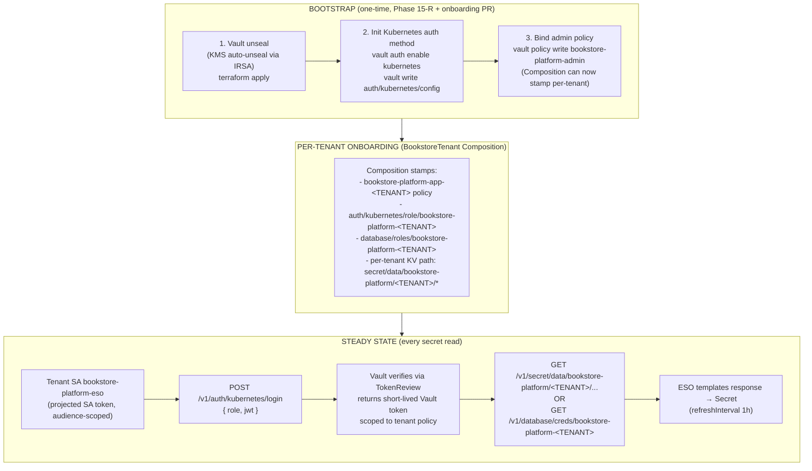

# 15.05 — Production secrets: Vault + ESO + rotation

> The production deepening of [Part 11 ch.05](../11-advanced-production-patterns/05-secrets-at-scale.md):
> a real HA Vault provisioned by Phase 15-R Terraform with **KMS auto-
> unseal**, the **three-step bootstrap** (unseal → init Kubernetes auth
> method → bind first policy), the **multi-tenant ClusterSecretStore +
> per-tenant ExternalSecret** pattern stamped by the Crossplane
> Composition ([Part 13 ch.02](../13-grand-capstone-bookstore-platform/02-tenancy-and-crossplane-onboarding.md)),
> Vault **token leasing** and **rotation cadence** as platform discipline,
> **dynamic Postgres credentials** as the strongest rotation form, and
> the production footguns Part 11 ch.05's dev-mode could not surface
> (auto-unseal failure, drift between auth-method audiences, "secret in
> CI logs", lease-storm during a Vault restart).

**Estimated time:** ~45 min read · ~half-day hands-on
**Prerequisites:** [Part 11 ch.05](../11-advanced-production-patterns/05-secrets-at-scale.md) — dev-mode Vault + ESO this chapter productionizes · [Part 14 ch.13](../14-eks-in-production-a-to-z/13-runtime-defense-and-container-security.md) — runtime defense that detects misuse · [Part 13 ch.02](../13-grand-capstone-bookstore-platform/02-tenancy-and-crossplane-onboarding.md) — Crossplane Composition that stamps per-tenant ExternalSecrets

**You'll know after this:** • provision HA Vault with KMS auto-unseal via Phase 15-R Terraform · • execute the three-step bootstrap (unseal → init Kubernetes auth method → bind first policy) safely · • implement the multi-tenant ClusterSecretStore + per-tenant ExternalSecret pattern · • configure dynamic Postgres credentials as the strongest rotation form and own the rotation cadence as platform discipline · • debug the production footguns dev-mode hides (auto-unseal failure, audience drift, "secret in CI logs", lease-storm on Vault restart)

<!-- tags: vault, eso, secrets-rotation, security, day-2 -->

## Why this exists

[Part 11 ch.05](../11-advanced-production-patterns/05-secrets-at-scale.md)
shipped the dev-mode story: Vault on a single Pod, root token `root`,
ESO syncing one demo Secret, dynamic Postgres credentials demonstrated
end-to-end. It was honest about the gap — "production Vault is HA + KMS
auto-unseal + audit + TLS; this is the teaching substitute". This
chapter is the production half of that pair.

Three things change when Vault moves from dev-mode to production:

1. **The bootstrap is no longer "Vault is already unsealed".** Production
   Vault wakes up sealed (encrypted at rest, no encryption keys in
   memory). A KMS-backed **auto-unseal** is the only safe pattern — a
   human typing unseal keys at every restart is the operational anti-
   pattern that destroyed Vault deployments in 2019-2021. Phase 15-R
   Terraform provisions Vault with `seal "awskms"` pointing at a KMS key
   the cluster's IRSA role can decrypt; the rest of the bootstrap (init
   the Kubernetes auth method, bind the first policy) follows from a
   running, unsealed Vault.
2. **One Vault is shared by N tenants.** The platform's namespace-per-
   tenant model ([Part 13 ch.02](../13-grand-capstone-bookstore-platform/02-tenancy-and-crossplane-onboarding.md))
   means N tenants, each with their own Vault policy, each with their
   own ExternalSecrets. The dev-mode pattern (one policy, one role) is
   not safe — a misconfigured policy lets tenant A read tenant B's KV.
   Production discipline is **one policy per tenant, one auth role per
   tenant**, both stamped by the Composition. The Vault HCL files in
   `examples/bookstore-platform/vault/policies/` and the
   `KubernetesAuthRole` YAML in `vault/auth-k8s/` are this discipline.
3. **Rotation has to actually happen.** A secret rotation cadence
   documented in a runbook but never executed is no rotation. The
   production answer is **dynamic short-lived Postgres roles** (Vault's
   database engine mints a per-request credential with a 1h lease;
   revocation is automatic on lease expiry) plus **`refreshInterval` on
   static ESO secrets** as the fallback for vendor secrets Vault cannot
   mint. The `vault/rotation/postgres-rotate.sh` script demonstrates the
   force-rotation path for incident response and proves the pattern
   works end-to-end.

This chapter walks `examples/bookstore-platform/vault/` end-to-end: the
two policies (app + admin), the auth role binding, the
ClusterSecretStore, the sample ExternalSecret, the rotation script. By
the end, a tenant's catalog Deployment consumes a Vault-synced Secret
with dynamic Postgres credentials, fully reproducible and fully
production-shaped.

## Mental model

**Vault is a service the cluster authenticates *to*, not a service the
cluster *runs*. The cluster carries no long-lived Vault credential; the
Kubernetes auth method exchanges a SA token for a short-lived Vault
token scoped to a tenant-specific policy.**

- **Production Vault is HA + KMS-unsealed + audit-logged + TLS-only.**
  Three Vault Pods running Raft consensus, each able to seal/unseal
  itself via a cloud KMS key (auto-unseal), each writing every read /
  write / login to an audit device (CloudWatch Logs in the bookstore-
  platform setup), each only reachable from in-cluster traffic (no
  public Ingress, internal-only LoadBalancer). The Phase 15-R Terraform
  tree is what provisions this; the chapter consumes the result.
- **One ClusterSecretStore, N per-tenant ExternalSecrets.** The
  ClusterSecretStore ([Part 11 ch.05](../11-advanced-production-patterns/05-secrets-at-scale.md))
  is the cluster-wide ESO-to-Vault binding. The per-tenant
  ExternalSecrets live in `bookstore-platform-<TENANT>` namespaces; each
  references the cluster store but authenticates via a tenant-specific
  Vault auth role. Cross-tenant isolation lives in the **Vault policy**,
  not in the ESO store.
- **The three-step bootstrap.** *Step 1* — Vault unseal (Phase 15-R
  Terraform; verified once with `vault status`). *Step 2* — Initialize
  the Kubernetes auth method (one `vault auth enable kubernetes` +
  config). *Step 3* — Write the admin policy + bind it to the platform
  team's identity (so the Composition can stamp per-tenant policies
  from there onward). After that, **onboarding a tenant is the
  Composition's job** — no human runs Vault commands.
- **Token leasing is the central abstraction.** Vault tokens have a
  TTL; ESO renews them opportunistically; on expiry ESO re-authenticates
  via the K8s SA token review. Dynamic Postgres credentials have leases;
  the lease drives the rotation cadence. The platform's rule:
  **`refreshInterval` MUST be shorter than the Vault lease**, otherwise
  ESO syncs a credential AFTER Vault has already dropped the Postgres
  role and the workload sees auth failures.
- **Dynamic credentials are the rotation primitive.** A Vault `database/
  creds/<role>` read does not READ a stored password — it **mints a new
  Postgres role**, returns its credentials, attaches a lease. Lease
  expiry runs revocation SQL that DROPs the role. Rotation is not an
  operation; it is the natural lifecycle. A leaked dynamic credential is
  dead in 1 hour (the lease TTL); revocation is one API call away with
  no waiting period.

The trap to keep in view: **Vault makes Vault a single point of
failure**. If Vault is down, ESO cannot sync new secrets, new Pods that
need a fresh ExternalSecret cannot start. The defenses: Vault HA (3
nodes, Raft quorum), aggressive ESO `refreshInterval` (so existing
Secrets are recent even if Vault becomes unavailable for an hour),
PodDisruptionBudgets on Vault, and an explicit **break-glass static
Secret** for the absolute-minimum keys (Part 15 ch.09 — the hotfix /
break-glass chapter that will land in Phase 15c)
that lets the platform recover if Vault is genuinely down for hours. The
break-glass Secret is auto-rotated every 24h via a CronJob that reads
from Vault when Vault IS healthy — so it is never more than 24h stale.

## Diagrams

### Diagram A — The three-step bootstrap and the steady-state flow (Mermaid)



### Diagram B — Token + lease lifecycle, and the rotation primitives (ASCII)

```
 VAULT TOKEN (the ESO ↔ Vault session) ─────────────────────────────────────
   ESO obtains Vault token via Kubernetes auth method:
     ttl=15m, max_ttl=1h, renewable
   ESO uses token for KV read or DB creds mint.
   At ttl/2 ESO calls /sys/leases/renew → ttl reset.
   At max_ttl Vault refuses renew → ESO re-authenticates via SA token.

 DYNAMIC POSTGRES CREDENTIAL (the catalog DB password) ─────────────────────
   ESO calls /database/creds/bookstore-platform-acme-books
   Vault runs the role's creation_statements:
     CREATE ROLE "v-kubernet-..." WITH LOGIN PASSWORD '<random>'
     GRANT SELECT, INSERT, UPDATE, DELETE ON ALL TABLES TO ...
   Returns: { username, password, lease_id, lease_duration: 3600 }
   ESO writes Secret with these values.
   refreshInterval 50m → ESO re-reads BEFORE the 60m lease expires.
   On expire, Vault runs revocation_statements:
     REASSIGN OWNED BY "v-kubernet-..." TO postgres
     DROP OWNED BY "v-kubernet-..."
     DROP ROLE IF EXISTS "v-kubernet-..."
   A leaked credential is dead at lease expiry; emergency revoke is
   `vault lease revoke <lease-id>` — instant DROP ROLE.

 STATIC VENDOR SECRET (Stripe webhook secret, etc.) ────────────────────────
   Vault stores ONE value at secret/data/bookstore-platform/<TENANT>/stripe
   ESO refreshInterval 1h → re-reads value; if changed, re-syncs Secret.
   Rotation: a human (or a CI job) calls `vault kv put` with a new value.
   Env-var consumers REQUIRE a rollout to pick the new value up (Part 03
   ch.02 — env vars are set at Pod-start). Annotate the Deployment with
   `secret-rotation: <ts>` to force a rollout.

   ROTATION CADENCE (the platform's rule):
     dynamic creds → 1h (Vault lease)
     static creds  → 24h baseline, 1h for high-risk (Stripe, Auth0)
     break-glass   → 24h forced refresh via CronJob
```

## Hands-on with the Bookstore Platform

**Assumed working directory: the guide repo root (`full-guide/`).** This
chapter walks `examples/bookstore-platform/vault/` end-to-end. Phase 15-R
Terraform has provisioned Vault on EKS; this hands-on starts from a
running, unsealed Vault. For local validation, the Part 11 ch.05 dev-
mode Vault is a substitute — only the `server` URL in
`cluster-secret-store.yaml` differs.

We will: (0) verify Phase 15-R's Vault is up; (1) walk the three-step
bootstrap; (2) apply the admin policy + initialize the Kubernetes auth
method; (3) onboard a tenant manually (the Composition path is
end-to-end, but the manual path makes the steps reviewable); (4) apply
the sample ExternalSecret and watch ESO sync from Vault to a K8s Secret;
(5) demonstrate dynamic Postgres credentials via the rotation script;
(6) demonstrate the rotation cadence in action.

### 0. Prerequisites — Phase 15-R applied, ESO installed

```sh
# Phase 15-R Terraform tree (the Vault Helm release var-gated on
# enable_vault = true) applied. Verify Vault is up and unsealed:
kubectl -n vault get pods
#   vault-0/1/2: Running, READY 1/1 each
kubectl -n vault exec vault-0 -- vault status
#   Sealed       false
#   HA Enabled   true
#   HA Mode      active   (one node; the others are standby)

# External Secrets Operator installed (Part 11 ch.05 install path):
kubectl -n external-secrets get pods
kubectl get crd | grep external-secrets
#   externalsecrets.external-secrets.io
#   clustersecretstores.external-secrets.io
```

### 1. The three-step bootstrap

Phase 15-R Terraform handles step 1 (unseal via KMS auto-unseal) and
step 2 (enable Kubernetes auth method) declaratively. The chapter
documents both for the reader who runs this manually on a kind cluster
with dev-mode Vault:

```sh
# STEP 1: Unseal (production: automatic via KMS; dev-mode: already unsealed)
kubectl -n vault exec vault-0 -- vault status
#   Sealed=false → step 1 done

# STEP 2: Initialize Kubernetes auth method (idempotent; Phase 15-R did it)
kubectl -n vault exec -i vault-0 -- sh -c '
  export VAULT_TOKEN=<root or admin>
  vault auth enable kubernetes 2>/dev/null || true
  vault write auth/kubernetes/config \
    kubernetes_host="https://kubernetes.default.svc:443" \
    disable_iss_validation=true
'
# disable_iss_validation: TokenRequestProjection issues tokens with
# multiple audiences; Vault validates against the cluster's API server
# CA, not the token's "iss" field. This is the documented setting for
# K8s ≥ 1.21.

# STEP 3: Write the admin policy + bind to platform identity
kubectl cp examples/bookstore-platform/vault/policies/bookstore-platform-admin.hcl \
  vault/vault-0:/tmp/admin.hcl
kubectl -n vault exec vault-0 -- vault policy write \
  bookstore-platform-admin /tmp/admin.hcl
#  After this, an admin token (held by Terraform / the Composition) can
#  create per-tenant policies + roles WITHOUT being root.
```

### 2. Onboard a tenant manually (the Composition path's manual equivalent)

In production, the BookstoreTenant Crossplane Composition ([Part 13 ch.02](../13-grand-capstone-bookstore-platform/02-tenancy-and-crossplane-onboarding.md))
does the next four commands declaratively via the Vault Terraform
provider. The manual path here is the same operations:

```sh
TENANT=acme-books

# Per-tenant policy (read-only, scoped to this tenant's KV path)
sed "s/<TENANT>/${TENANT}/g" \
  examples/bookstore-platform/vault/policies/bookstore-platform-app.hcl \
  > /tmp/app-${TENANT}.hcl
kubectl cp /tmp/app-${TENANT}.hcl vault/vault-0:/tmp/app.hcl
kubectl -n vault exec vault-0 -- vault policy write \
  bookstore-platform-app-${TENANT} /tmp/app.hcl

# Per-tenant Kubernetes auth role (binds the tenant SA to the policy)
kubectl -n vault exec vault-0 -- vault write \
  auth/kubernetes/role/bookstore-platform-${TENANT} \
  bound_service_account_names=bookstore-platform-eso \
  bound_service_account_namespaces=bookstore-platform-${TENANT} \
  policies=bookstore-platform-app-${TENANT} \
  ttl=15m max_ttl=1h \
  audience=https://vault.bookstore-platform.example.com

# Per-tenant KV path with a sample DB-password Secret (static; the
# dynamic-creds case follows in step 5)
kubectl -n vault exec vault-0 -- vault kv put \
  secret/bookstore-platform/${TENANT}/catalog/db-password \
  username=catalog \
  password="$(openssl rand -base64 32)" \
  dbname=bookstore_catalog

# Verify (admin scope)
kubectl -n vault exec vault-0 -- vault kv get \
  secret/bookstore-platform/${TENANT}/catalog/db-password
```

### 3. Apply the ClusterSecretStore and the ExternalSecret

```sh
# The ClusterSecretStore (cluster-scoped, references the SA in the
# tenant ns)
kubectl apply -f examples/bookstore-platform/vault/cluster-secret-store.yaml
kubectl get clustersecretstore vault-bookstore-platform \
  -o jsonpath='{.status.conditions[*].type}={.status.conditions[*].status}{"\n"}'
#   Ready=True (ESO authenticated to Vault, validated CA)

# Ensure the tenant SA exists (the Composition creates it in production)
kubectl create ns bookstore-platform-acme-books --dry-run=client -o yaml | kubectl apply -f -
kubectl -n bookstore-platform-acme-books create sa bookstore-platform-eso \
  --dry-run=client -o yaml | kubectl apply -f -

# The ExternalSecret pulls from the tenant's KV path
kubectl apply -f examples/bookstore-platform/vault/external-secret-sample.yaml
kubectl get externalsecret catalog-db-credentials \
  -n bookstore-platform-acme-books \
  -o jsonpath='{.status.conditions[*].type}={.status.conditions[*].status}{"\n"}'
#   SecretSynced=True → ESO created `catalog-db-credentials` Secret

# Verify the synced Secret
kubectl get secret catalog-db-credentials -n bookstore-platform-acme-books \
  -o jsonpath='{.data.POSTGRES_PASSWORD}' | base64 -d; echo
# Output is the password Vault stored. The catalog Deployment's
# envFrom: secretRef consumes this byte-identically to a static Secret.
```

### 4. Dynamic Postgres credentials — the rotation primitive

The static KV case above is the **fallback** pattern (vendor secrets
Vault cannot mint). The **default** for tenant DB credentials is the
Vault database engine: every read mints a fresh Postgres role,
revocation is automatic.

```sh
# Bootstrap the database engine for the tenant (one-time; in production
# the Composition does this via the Vault TF provider).
export VAULT_ADDR=https://vault-active.vault.svc.cluster.local:8200
export VAULT_TOKEN=$(kubectl -n vault exec vault-0 -- vault token create \
  -policy=bookstore-platform-admin -ttl=10m -format=json | jq -r .auth.client_token)
export PG_ADMIN_PASSWORD=$(kubectl get secret postgres-superuser \
  -n bookstore-platform-acme-books -o jsonpath='{.data.password}' | base64 -d)

./examples/bookstore-platform/vault/rotation/postgres-rotate.sh bootstrap
#   [1/3] enable database secrets engine
#   [2/3] configure connection to bookstore-platform-acme-books postgres
#   [3/3] define role with CREATE/REVOKE SQL templates

# Force a rotation cycle: read a fresh dynamic credential and validate
# it against Postgres.
./examples/bookstore-platform/vault/rotation/postgres-rotate.sh rotate
#   Minted Postgres role: v-kubernet-bookstore-platform-acme-books-<random>
#   Lease ID:             database/creds/bookstore-platform-acme-books/<uuid>
#   Lease duration:       3600s
#   OK — new role authenticated and queried Postgres.

# Switch the catalog ExternalSecret to read from the dynamic path
# (the production pattern). The Composition stamps an ExternalSecret
# whose remoteRef.key is `database/creds/bookstore-platform-acme-books`
# instead of `secret/data/bookstore-platform/acme-books/catalog/db-password`.
# Every refreshInterval, ESO calls the dynamic path → Vault mints a
# fresh role → ESO updates the Secret → catalog uses the new credential
# at next rollout (env vars are Pod-start).
```

### 5. Demonstrate rotation cadence

```sh
# Trigger an immediate rotation by deleting the lease
LEASE_ID=$(kubectl -n vault exec vault-0 -- \
  vault list -format=json sys/leases/lookup/database/creds/bookstore-platform-acme-books \
  | jq -r '.[0]')
./examples/bookstore-platform/vault/rotation/postgres-rotate.sh revoke "${LEASE_ID}"
#   The Postgres role is DROPped immediately. The ExternalSecret's next
#   refresh (≤1h) re-reads the dynamic path and mints a new role.
#   Forcing an immediate refresh: kubectl annotate externalsecret/<name>
#     force-sync="$(date +%s)" -n bookstore-platform-acme-books

# Re-read the Secret to confirm rotation
kubectl get secret catalog-db-credentials -n bookstore-platform-acme-books \
  -o jsonpath='{.data.POSTGRES_USER}' | base64 -d; echo
# The username changed (new role minted).
```

## How it works under the hood

**KMS auto-unseal under the covers.** Vault encrypts its data at rest
with an *encryption key* it never persists — at startup, it needs to
*decrypt* this key to unseal. The naive scheme (Shamir's secret-shared
unseal keys) requires a human to enter 3-of-5 unseal keys at every
restart — operationally impossible. KMS auto-unseal stores the
encrypted Vault master key alongside Vault's data; at startup, Vault's
IRSA-bound role calls `kms:Decrypt` on the cloud KMS to recover the
master key, which decrypts the in-memory encryption key, which unseals
Vault. The trust shifts from "humans hold unseal keys" to "the cloud
KMS holds the unseal capability, gated by IAM". The Phase 15-R
Terraform tree provisions the KMS key, the IRSA role, and the Vault
`seal "awskms"` config block.

**Kubernetes auth method internals.** When ESO POSTs `{ jwt, role }`
to `/v1/auth/kubernetes/login`, Vault unpacks the JWT, extracts the SA
name + namespace + audience, and calls the K8s `TokenReview` API to
validate the JWT is still active. The TokenReview response carries the
SA's *current* identity — if the SA was deleted and recreated, the UID
differs, and Vault's audit log records the new UID. Vault then matches
the SA name + namespace against the role's `bound_service_account_*`
fields, checks the role's `audience` against the JWT's audience claim,
and issues a short-lived Vault token bound to the role's `policies`.
The token is renewable for `max_ttl`; ESO calls `/sys/leases/renew`
periodically.

**ClusterSecretStore vs SecretStore.** The dev-mode pattern used a
namespaced `SecretStore` — one per tenant ns, each authenticating with
its own SA. That works but does not scale to N tenants (N stores to
maintain). The ClusterSecretStore is cluster-scoped: one definition,
every tenant ExternalSecret references it. Cross-tenant isolation is
enforced by the **Vault role's `bound_service_account_namespaces`** —
tenant A's ExternalSecret authenticates via tenant A's SA, which only
matches tenant A's Vault role, which only grants tenant A's policy.
The cost: the ClusterSecretStore's `role` field is a single value
(the dev pattern hard-codes it); the production pattern uses ESO's
`SecretStoreRef` overrides in the ExternalSecret to pick the role per-
namespace, OR stamps one ClusterSecretStore per tenant (heavier; the
chapter's example takes the simpler "per-tenant SecretStore" approach
in production via the Composition).

**Per-tenant policy templating.** The `bookstore-platform-app.hcl`
policy uses `<TENANT>` as a placeholder. The Composition's Vault
Terraform provider renders one policy per tenant, replacing `<TENANT>`
with the tenant name. The result is N distinct policies whose paths do
not overlap. A tenant whose policy was misconfigured to read another
tenant's path would be caught by Vault audit (the read appears in the
audit log with the wrong identity) — alert on the cross-tenant pattern
in CloudWatch Logs Insights. This is the [Part 05 ch.04](../05-security/04-secrets-and-cluster-hardening.md)
audit-trail discipline applied at the secrets manager.

**Dynamic credential anatomy.** The Vault database engine has two
moving parts: the *connection config* (how Vault talks to Postgres) and
the *role* (the SQL template). A `vault read database/creds/<role>`
read does five things in sequence: (a) Vault connects to Postgres with
the configured admin credentials; (b) executes the role's
`creation_statements` SQL (which runs `CREATE ROLE`); (c) attaches a
lease to the new role; (d) returns the credentials to the caller; (e)
on lease expiry, executes the role's `revocation_statements` (which
runs `DROP ROLE`). The Postgres role only exists during the lease; the
Vault audit log records who minted it and when. A leak's blast radius
is bounded by the lease TTL — Part 03 ch.02's "rotation note" made
real at the strongest possible form.

**The `refreshInterval` vs lease ordering rule.** If `refreshInterval`
is 1h and the dynamic lease is 1h, there is a race: the lease can
expire seconds before ESO re-reads, dropping the Postgres role while
the catalog is mid-query. The platform's discipline: **`refreshInterval`
≤ lease_TTL / 2**. With 1h leases, `refreshInterval: 50m` (the
ExternalSecret default in this directory). This guarantees ESO always
syncs a *new* credential before the *old* one expires; the catalog
sees a brief window where two credentials are valid (the old one in
its env vars, the new one in the Secret) — env-var consumers pick the
new one up at next rollout, file-mount consumers pick it up live.

**The "secret in CI logs" footgun.** A CI job runs `vault read -format=
json database/creds/...` and pipes the output through `jq` to extract
the password. If `set -x` is enabled, bash prints the full command;
worse, if the CI uploads logs to a third-party service, the password
travels too. The defenses, in order: (1) **never** read Vault from CI
— the cluster reads Vault, not the build pipeline; (2) when CI MUST
read (e.g. for the migrate-job pre-deploy SQL), use `vault read -
field=password` (which prints only the field, not the JSON); (3) `set
+x` around any `vault` command; (4) the CI's log retention policy
treats Vault-touching jobs as sensitive (delete logs after 7 days, no
upload to third-party). The `rotation/postgres-rotate.sh` script in
this tree is explicit about all four — `set -euo pipefail` but no
`set -x`, password via `PGPASSWORD` env (not on the command line), the
JSON file `shred`ded after validation.

**Vault HA failover and ESO behavior.** Production Vault runs three
Pods in Raft consensus; one is *active* (handles reads/writes), two
are *standby* (only forward to active). The internal Service
`vault-active.vault.svc` resolves to the active Pod. On active-Pod
loss, Raft elects a new active in <30s; the Service follows. ESO sees
~30s of HTTP errors during failover; existing synced Secrets are
unchanged; new reads retry on the new active. The platform's defense:
(a) Vault PDB `minAvailable: 2` so a Node drain never takes Raft below
quorum; (b) ESO retries with exponential backoff for ~5min before
surfacing a Sync Error condition; (c) alert on `vault_seal_status` and
`vault_core_active` Prometheus metrics — both must be steady.

## Production notes

> **In production:** Phase 15-R provisions Vault, NOT the demo Helm
> chart with `dev.enabled=true`. Production Vault is HA (Raft, 3
> nodes), KMS auto-unsealed, TLS-only, audit-logged to CloudWatch
> Logs, and exposed via an *internal* LoadBalancer (no public
> Ingress). The Phase 15-R `enable_vault = true` Terraform variable is
> the gate; the chart values pin every production knob. Production
> Vault dev-mode is a CISO-finding waiting to happen.

> **In production:** The Kubernetes auth method is the only ESO →
> Vault auth pattern the platform allows. No static `VAULT_TOKEN` in
> a Secret, no AppRole shared secret, no GitHub auth method.
> Kubernetes auth method ties Vault's trust to the SA token (which
> the kubelet rotates) and the Vault policy (which scopes what the
> identity can do). The audience-scoped projected SA token in the ESO
> deployment is the extra defense: a leaked token can only be
> presented to Vault (with the right audience), not to any other API.

> **In production:** One Vault policy per tenant, one Vault role per
> tenant, both stamped by the Composition — never hand-edited. A
> hand-edit drifts; the Composition is the only producer. The
> `<TENANT>` placeholder pattern in `policies/bookstore-platform-
> app.hcl` is the contract. A hand-applied policy with a wider scope
> than the Composition would produce is a security incident: alert on
> any Vault policy whose name matches `bookstore-platform-app-*` but
> whose content does not match the Composition's rendering.

> **In production:** Dynamic Postgres credentials are the default for
> tenant DB access. Static KV (the `secret/data/...` pattern) is the
> fallback for vendor secrets Vault cannot mint — Stripe webhook
> secrets, OAuth client secrets, third-party API keys. The platform's
> rule: if Vault CAN mint it (DB, AWS IAM creds, SSH CA cert), Vault
> MINTS it; if Vault stores it statically, the rotation cadence is
> documented and enforced (CronJob that rotates and re-puts every 24h
> for high-risk secrets).

> **In production:** `refreshInterval` ≤ lease_TTL / 2. The race
> condition (lease expires before ESO refreshes) drops the Postgres
> role under the running workload's feet. With 1h leases the
> `refreshInterval` is 50m; with 24h leases it is 12h. The
> `external-secret-sample.yaml` in this tree pins 1h
> `refreshInterval` for a 1h lease — for didactic clarity; the
> Composition stamps 50m in production.

> **In production:** Env-var consumers need a rollout to pick up
> rotated secrets ([Part 03 ch.02](../03-config-and-storage/02-secrets.md)).
> File/CSI-mounted secrets re-sync live; environment-variable secrets
> are read at Pod-start. ESO supports a `Reloader` or `stakater/reloader`
> annotation that triggers a rollout when the synced Secret changes;
> alternatively, a `kubectl rollout restart deployment/catalog`
> CronJob aligned with the rotation cadence works. The platform's
> choice: Reloader for env-var consumers, file mounts for the rotation-
> critical paths (the catalog `DB_DSN` is currently env-var; migrating
> to a file mount is Phase 15c work).

> **In production:** Break-glass static Secret for Vault outages.
> Even with HA + auto-unseal, a multi-hour Vault outage is possible
> (KMS regional outage, network partition, operator error). The
> platform's defense: a `break-glass` Secret in each tenant ns
> containing the *current* dynamic credentials, refreshed every 24h
> by a CronJob that reads from Vault. If Vault becomes unavailable,
> existing Pods keep running (they have env-var copies), new Pods
> start (they read the break-glass Secret), and the platform
> degrades gracefully for up to 24h. The CronJob is the Part 15 ch.09
> (hotfix + break-glass; landing in Phase 15c) break-glass pattern made
> permanent at the secrets layer.

> **In production:** Audit every Vault read. CloudWatch Logs Insights
> queries on the Vault audit stream catch cross-tenant reads ("tenant
> A's role read tenant B's path" — never expected, always alertable),
> after-hours admin-policy use ("a human used the admin policy at
> 3am" — change-record required), and pattern anomalies (an
> ExternalSecret reading at unusual cadence). The audit device is
> what makes Vault different from "a Kubernetes Secret" — use it.

> **In production:** The "secret in CI logs" footgun is the single
> most common Vault leak. Defenses, in order: never read Vault from
> CI (the cluster reads it, not the pipeline); when CI must read, use
> `vault read -field=<key>` not full JSON; never `set -x` around
> Vault commands; log retention for Vault-touching jobs ≤ 7 days, no
> upload to third-party log services. Phase 15a CI templates encode
> all four.

## Quick Reference

```sh
# Phase 15-R Vault — HA verification (production):
kubectl -n vault exec vault-0 -- vault status
kubectl -n vault exec vault-0 -- vault operator raft list-peers
# Expect: Sealed=false, HA Mode=active, 3 peers in raft.

# Bootstrap (one-time):
kubectl -n vault exec vault-0 -- vault auth enable kubernetes
kubectl -n vault exec vault-0 -- vault write auth/kubernetes/config \
  kubernetes_host="https://kubernetes.default.svc:443" \
  disable_iss_validation=true
vault policy write bookstore-platform-admin \
  examples/bookstore-platform/vault/policies/bookstore-platform-admin.hcl

# Per-tenant onboarding (production: Composition stamps these):
TENANT=acme-books
sed "s/<TENANT>/${TENANT}/g" \
  examples/bookstore-platform/vault/policies/bookstore-platform-app.hcl \
  | vault policy write bookstore-platform-app-${TENANT} -
vault write auth/kubernetes/role/bookstore-platform-${TENANT} \
  bound_service_account_names=bookstore-platform-eso \
  bound_service_account_namespaces=bookstore-platform-${TENANT} \
  policies=bookstore-platform-app-${TENANT} \
  ttl=15m max_ttl=1h \
  audience=https://vault.bookstore-platform.example.com

# Apply ClusterSecretStore + ExternalSecret (CRD-intrinsic dry-run note):
kubectl apply -f examples/bookstore-platform/vault/cluster-secret-store.yaml
kubectl apply -f examples/bookstore-platform/vault/external-secret-sample.yaml
kubectl get externalsecret -A
kubectl get clustersecretstore

# Dynamic Postgres credentials (the rotation primitive):
./examples/bookstore-platform/vault/rotation/postgres-rotate.sh bootstrap
./examples/bookstore-platform/vault/rotation/postgres-rotate.sh rotate
./examples/bookstore-platform/vault/rotation/postgres-rotate.sh revoke <lease-id>

# Force an ExternalSecret refresh without waiting for refreshInterval:
kubectl annotate externalsecret/catalog-db-credentials \
  -n bookstore-platform-acme-books \
  force-sync="$(date +%s)" --overwrite
```

The production-Vault checklist:

- [ ] Phase 15-R Terraform applied (`enable_vault = true`); Vault HA
      mode active with 3 raft peers; KMS auto-unseal verified.
- [ ] Vault audit device enabled (CloudWatch Logs); cross-tenant read
      alerts wired in CloudWatch Logs Insights.
- [ ] Kubernetes auth method enabled with `disable_iss_validation=true`
      and audience-scoped to `https://vault.bookstore-platform.example.com`.
- [ ] Admin policy bound to the Composition's identity (NEVER a long-
      lived static token); per-tenant policies templated from
      `bookstore-platform-app.hcl`.
- [ ] ClusterSecretStore Ready=True; tenant ExternalSecrets all
      SecretSynced=True.
- [ ] Dynamic Postgres credentials for tenant DB access; static KV
      only for vendor secrets Vault cannot mint.
- [ ] `refreshInterval` ≤ lease_TTL / 2 for every ExternalSecret
      referencing a dynamic path.
- [ ] Reloader annotation (or rollout CronJob) on every env-var
      consuming Deployment.
- [ ] Break-glass static Secret CronJob installed; tested via simulated
      Vault outage in the dev cluster.
- [ ] PSA-restricted compliance: ESO is restricted-compliant; no Vault
      Agent Sidecar Injector in tenant namespaces ([Part 11 ch.05](../11-advanced-production-patterns/05-secrets-at-scale.md)
      footgun).

## Test your understanding

> Try each before opening the answer drawer. The act of trying is the exercise; the answer is the check.

1. **Why does the chapter call KMS auto-unseal "the only safe pattern" for production Vault?**
   <details><summary>Show answer</summary>

   Manual unseal — a human typing unseal keys at every Vault restart — was the operational anti-pattern that destroyed Vault deployments in 2019-2021. Vault restarts happen for upgrades, node reboots, kernel patches, Kubernetes evictions. Each requires a quorum of unseal-key holders to be reachable; in an outage at 3am with one key holder on vacation, Vault stays sealed and the platform halts. KMS auto-unseal stores the unseal capability in AWS KMS keyed to the cluster's IRSA role — on restart, Vault decrypts itself and is immediately available. No human in the loop, no operational drama. The trade-off: Vault depends on KMS availability, but KMS has 5-nines uptime, far better than coordinating humans.

   </details>

2. **A platform engineer sets `refreshInterval: 2h` on an ExternalSecret pointing at a Vault dynamic Postgres credential with `lease_ttl: 1h`. The workload sees intermittent auth failures. What's happening?**
   <details><summary>Show answer</summary>

   The Postgres credential's lease expires at 1h; Vault revokes the role, the password no longer authenticates. ESO doesn't sync a new credential for another full hour (2h refreshInterval), so for an hour the workload's Secret has a dead credential. The chapter's rule: `refreshInterval` MUST be shorter than the Vault lease — typically `lease_ttl / 2` so each refresh catches the credential before expiry. Fix: lower refreshInterval to 30 minutes or raise lease_ttl to 4h+; whichever, ensure refresh happens at least twice per lease window.

   </details>

3. **The chapter says Vault becomes a single point of failure. What four defences does it propose, and which is the canonical "we got bitten" mitigation?**
   <details><summary>Show answer</summary>

   (1) Vault HA — 3 nodes with Raft consensus so a single node loss doesn't seal the cluster; (2) aggressive ESO refreshInterval so existing Secrets are recent even if Vault is unreachable for an hour; (3) PodDisruptionBudgets on Vault so node drains don't kill quorum; (4) **break-glass static Secret CronJob** — the canonical "we got bitten" mitigation. The break-glass is an auto-rotated static Secret in the cluster, refreshed every 24h *by Vault while Vault is healthy*, used by workloads only if Vault is genuinely down. It's never more than 24h stale and unblocks recovery during multi-hour Vault outages. The discipline: test it via simulated outage in dev cluster before relying on it.

   </details>

4. **Hands-on extension — read a dynamic Postgres credential from Vault: `vault read database/creds/bookstore-platform-tenant-acme`. Copy the username, then run `vault lease revoke <lease_id>` and try to connect with that username.**
   <details><summary>What you should see</summary>

   Vault revokes the lease — the username/password no longer authenticates against Postgres because the revocation SQL has run (the role was `DROP`'d). The connection fails immediately with an auth error. This is the chapter's claim made concrete: rotation isn't an operation, it's the natural lifecycle. A leaked dynamic credential is dead in 1 hour (lease TTL) or one API call (`lease revoke`). Static credentials in Postgres would require connecting, running `ALTER USER ... PASSWORD`, redistributing to consumers — minutes to hours of coordination. Dynamic credentials collapse that to seconds.

   </details>

## Further reading

- **HashiCorp Vault — Production Hardening**
  <https://developer.hashicorp.com/vault/tutorials/operations/production-hardening>;
  the authoritative pre-production checklist (HA, audit, TLS, KMS
  unseal, network isolation).
- **HashiCorp Vault — Kubernetes auth method**
  <https://developer.hashicorp.com/vault/docs/auth/kubernetes>; the
  exact protocol and config parameters this chapter relies on.
- **HashiCorp Vault — Database secrets engine**
  <https://developer.hashicorp.com/vault/docs/secrets/databases>; the
  dynamic credentials primitive, lease semantics, and per-database
  plugin configuration.
- **External Secrets Operator — Vault provider**
  <https://external-secrets.io/latest/provider/hashicorp-vault/>; the
  ClusterSecretStore + ExternalSecret reference.
- **Rosso et al., _Production Kubernetes_ ch.7 — Secret Management** —
  the operational model this chapter walks (external manager as source
  of truth, K8s Secret as projection, rotation as a first-class
  operation).
- Part 11 ch.05 — the dev-mode Vault foundations this chapter deepens.
- Part 13 ch.02 — the Composition that stamps per-tenant Vault
  policies + roles in production.
- Part 15 ch.07 — what to do when a rotated secret breaks an in-flight
  workload.
- Part 15 ch.09 — the break-glass pattern for a Vault outage.
